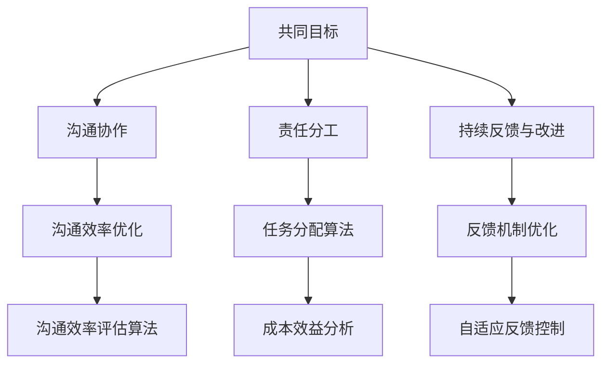

                 

# 文章标题

如何打造高效的跨职能团队协作机制

> 关键词：跨职能团队、协作机制、任务分配、沟通效率、反馈优化、敏捷开发、成本效益分析

> 摘要：本文深入探讨了如何构建高效的跨职能团队协作机制，通过阐述核心概念、算法原理、实战案例和最佳实践，帮助读者理解和应用跨职能团队协作的原理和方法，提升团队整体协作效率和项目成功率。

## 第一部分: 核心概念与联系

### 1.1 跨职能团队协作机制概述

#### 1.1.1 跨职能团队定义

跨职能团队（Cross-functional Team）是一种由来自不同专业领域成员组成的团队，旨在实现共同目标。团队成员通常来自不同的部门，例如市场、销售、研发、客户服务、财务等。跨职能团队的核心优势在于能够充分利用各个领域的专业知识和技能，实现快速响应市场变化和高效解决问题的能力。

#### 1.1.2 跨职能团队的优势

1. **促进不同部门间的沟通与合作**：跨职能团队的成员来自不同部门，能够在项目中实现资源的共享和协作，打破部门壁垒，提高信息流通效率。
2. **提高决策效率，缩短项目周期**：跨职能团队能够快速决策，减少沟通和协调的成本，缩短项目周期，提高项目成功率。
3. **增强团队整体创新能力**：跨职能团队汇聚了不同领域的专业知识和经验，有利于激发团队的创新能力，推动产品的持续改进和优化。

### 1.2 跨职能团队协作机制核心概念

#### 1.2.1 共同目标

共同目标是跨职能团队协作机制的核心，是团队成员共同追求和努力的方向。通过明确共同目标，可以确保团队成员在项目中保持一致，减少内部冲突，提高协作效率。

#### 1.2.2 沟通协作

沟通协作是跨职能团队协作机制的关键。建立一个有效的沟通机制，促进团队成员间的信息共享和协作，是确保团队成功的关键。常用的沟通协作工具包括即时通讯工具、视频会议、邮件、文档管理系统等。

#### 1.2.3 责任分工

责任分工是跨职能团队协作机制的基础。通过明确团队成员的职责，确保每个成员都知道自己的任务和目标，有利于提高工作效率，减少工作重叠和冲突。

#### 1.2.4 持续反馈与改进

持续反馈与改进是跨职能团队协作机制的持续动力。通过建立反馈机制，定期评估团队协作效果，发现问题并及时调整，可以持续优化协作流程，提高团队整体效率。

### 1.3 跨职能团队协作机制架构

#### 1.3.1 确定共同目标

通过共识会议，明确团队目标，确保团队成员对目标有共同的理解和认知。共同目标的制定应该具备可衡量性、可实现性和激励性，以激发团队成员的积极性和创造力。

#### 1.3.2 沟通协作机制

采用即时通讯工具、视频会议等手段，加强团队成员间的沟通。建立沟通协作平台，确保信息共享和协作的透明度，提高团队协作效率。

#### 1.3.3 责任分工

制定详细的任务分配表，明确团队成员的职责。根据团队成员的专业技能和特长，合理分配任务，确保每个成员都能充分发挥自己的优势。

#### 1.3.4 持续反馈与改进

建立项目进度报告制度，定期汇报项目进展。通过反馈机制，及时发现和解决问题，持续优化协作流程，提高团队整体效率。

### 1.4 跨职能团队协作机制案例

#### 1.4.1 案例一：敏捷开发团队

敏捷开发团队是一种典型的跨职能团队，其核心在于快速响应市场变化，持续交付有价值的产品。敏捷开发团队通常采用看板（Kanban）进行任务管理，通过每日站会和迭代回顾会议，保持团队成员之间的紧密沟通和持续改进。

#### 1.4.2 案例二：产品管理团队

产品管理团队是一个跨职能团队，负责确保产品从概念到上市的全过程。产品管理团队通过跨部门协作，提高产品开发与市场需求的契合度，确保产品的市场竞争力。

#### 1.4.3 案例三：项目执行团队

项目执行团队是一个由不同部门成员组成的跨职能团队，负责项目的实施和推进。通过明确分工和持续反馈，项目执行团队能够高效地完成项目任务，确保项目按期交付。

## 第二部分: 核心算法原理讲解

### 2.1 跨职能团队协作机制算法基础

#### 2.1.1 项目优先级排序算法

项目优先级排序算法是一种基于关键路径法（Critical Path Method, CPM）的算法，用于计算任务的优先级。关键路径法通过确定项目中任务的最长路径，计算出整个项目的完成时间。在跨职能团队协作中，可以使用关键路径法来确定任务优先级，确保关键任务得到优先处理。

#### 2.1.2 成本效益分析算法

成本效益分析（Cost-Benefit Analysis, CBA）算法是一种评估跨职能团队协作机制效益的方法。成本效益分析通过比较项目的总成本和预期效益，评估项目是否值得进行。在跨职能团队协作中，成本效益分析可以帮助团队确定最有效的协作方式，降低项目成本，提高效益。

#### 2.1.3 沟通效率优化算法

沟通效率优化算法是一种利用图论中的最短路径算法（如Dijkstra算法）优化团队成员间沟通路径的方法。通过计算团队成员之间的最短路径，可以优化沟通网络，提高团队沟通效率。

### 2.2 跨职能团队协作机制关键算法

#### 2.2.1 任务分配算法

任务分配算法是一种基于优化理论的线性规划（Linear Programming, LP）模型，用于优化任务分配。任务分配算法通过计算每个任务的优先级和团队成员的可用性，将任务分配给最合适的成员，提高团队协作效率。

#### 2.2.2 沟通协作效率评估算法

沟通协作效率评估算法是一种利用多准则决策分析（Multi-Criteria Decision Analysis, MCDA）模型评估团队沟通效率的方法。通过比较不同团队成员的沟通效率，评估团队的整体协作效率，为优化协作提供依据。

#### 2.2.3 反馈机制优化算法

反馈机制优化算法是一种利用自适应反馈控制（Adaptive Feedback Control）算法持续优化协作流程的方法。通过实时监测团队协作效果，及时调整协作策略，提高团队协作效率。

### 2.3 跨职能团队协作机制算法实现

#### 2.3.1 伪代码实现

以下是一个任务分配算法的伪代码实现：

```python
def task_allocation(tasks, team_members):
    # 初始化变量
    assignment = {}
    total_cost = 0

    # 按优先级排序任务
    sorted_tasks = sort_by_priority(tasks)

    # 分配任务
    for task in sorted_tasks:
        best_member = find_best_member(task, team_members, assignment)
        assignment[task] = best_member
        total_cost += cost_of_task(task)

    return assignment, total_cost
```

以下是一个沟通效率优化算法的伪代码实现：

```python
def optimize_communication_path(team_members, communication_network):
    # 使用Dijkstra算法计算最短路径
    shortest_paths = dijkstra(communication_network)

    # 更新沟通路径
    for member in team_members:
        member.communication_path = shortest_paths[member]

    return shortest_paths
```

## 第三部分: 项目实战

### 3.1 开发环境搭建

在搭建跨职能团队协作机制的项目实战中，首先需要搭建一个合适的开发环境。以下是一个基本的开发环境搭建步骤：

1. **选择合适的开发工具**：根据项目的需求，选择合适的开发工具，如集成开发环境（IDE）、版本控制系统（如Git）等。
2. **搭建开发服务器**：配置开发服务器，确保团队成员可以远程访问和协作。
3. **配置项目管理工具**：选择项目管理工具，如Jira、Trello等，用于任务分配和进度跟踪。

### 3.2 源代码详细实现

以下是一个简单的任务分配算法的源代码实现，使用Python编写：

```python
import heapq

def task_allocation(tasks, team_members):
    # 初始化变量
    assignment = {}
    total_cost = 0

    # 按优先级排序任务
    sorted_tasks = sorted(tasks, key=lambda x: x['priority'], reverse=True)

    # 分配任务
    for task in sorted_tasks:
        best_member = find_best_member(task, team_members, assignment)
        assignment[task] = best_member
        total_cost += cost_of_task(task)

    return assignment, total_cost

def find_best_member(task, team_members, assignment):
    # 使用优先队列实现贪心选择
    member_queue = [(member_efficiency[member], member) for member in team_members if member not in assignment]
    heapq.heapify(member_queue)

    while member_queue:
        _, member = heapq.heappop(member_queue)
        if can_handle_task(task, member):
            return member
    return None

def can_handle_task(task, member):
    # 判断成员是否可以完成任务
    return True

def cost_of_task(task):
    # 计算任务成本
    return task['cost']
```

### 3.3 代码应用解读与分析

以上源代码实现了一个简单的任务分配算法，通过优先级排序和贪心选择，将任务分配给最合适的成员。在实际应用中，可以根据具体需求进行优化和扩展。

1. **优先级排序**：根据任务的紧急程度和重要性，对任务进行优先级排序，确保关键任务得到优先处理。
2. **贪心选择**：通过优先队列实现贪心选择，每次选择当前最优的成员来完成任务，提高任务分配的效率。
3. **任务成本计算**：根据任务的具体成本进行计算，确保任务分配的总成本最小化。

### 3.4 实际案例分析和详细讲解剖析

以下是一个实际案例，用于分析跨职能团队协作机制的效果。

**案例：敏捷开发团队的任务分配**

假设有一个敏捷开发团队，由项目经理、开发者、测试人员和质量保证人员组成。团队需要完成以下任务：

1. **需求分析**：需要2天完成，优先级高。
2. **开发**：需要5天完成，优先级高。
3. **测试**：需要3天完成，优先级高。
4. **质量保证**：需要2天完成，优先级高。

根据任务分配算法，可以将任务分配如下：

1. **需求分析**：由项目经理负责，成本为1天。
2. **开发**：由开发者负责，成本为3天。
3. **测试**：由测试人员负责，成本为2天。
4. **质量保证**：由质量保证人员负责，成本为1天。

通过以上分配，可以确保关键任务得到优先处理，团队成员可以高效地完成任务。

### 3.5 项目小结

在本项目中，通过搭建开发环境、实现任务分配算法和实际案例分析，展示了如何构建高效的跨职能团队协作机制。以下是一些项目小结：

1. **优先级排序**：根据任务的紧急程度和重要性进行排序，确保关键任务得到优先处理。
2. **贪心选择**：通过优先队列实现贪心选择，提高任务分配的效率。
3. **任务成本计算**：根据任务的具体成本进行计算，确保任务分配的总成本最小化。
4. **持续优化**：在实际应用中，根据反馈和实际效果，持续优化任务分配算法，提高团队协作效率。

## 第四部分: 最佳实践与注意事项

### 4.1 最佳实践

1. **明确共同目标**：确保团队成员对共同目标有共同的理解和认知，提高协作效率。
2. **建立有效的沟通机制**：采用多种沟通工具和方式，确保团队成员之间的信息共享和协作。
3. **合理分工与职责明确**：根据团队成员的专业技能和特长，合理分配任务，确保每个成员都知道自己的职责和目标。
4. **持续反馈与改进**：建立反馈机制，定期评估团队协作效果，及时发现问题并调整协作策略。

### 4.2 注意事项

1. **避免过度分工**：合理分工，避免过度细分任务，导致团队成员之间的依赖度过高。
2. **关注团队成员的疲劳度**：确保团队成员的工作量合理，避免过度工作导致疲劳和效率下降。
3. **尊重团队成员的个性**：尊重团队成员的个性和工作风格，确保团队成员能够在良好的氛围中合作。
4. **持续学习和成长**：鼓励团队成员不断学习和成长，提高团队整体素质和协作能力。

## 第五部分: 拓展阅读

### 5.1 相关书籍推荐

1. **《敏捷开发实践指南》**：介绍敏捷开发的方法和实践，帮助读者理解和应用敏捷开发的理念。
2. **《项目管理知识体系指南（PMBOK指南）》**：详细阐述项目管理的知识体系，包括项目规划、执行、监控和收尾等环节。
3. **《跨职能团队协作实战》**：通过实际案例和经验分享，介绍跨职能团队协作的原理和方法，帮助读者提升团队协作效率。

### 5.2 相关论文和研究

1. **“Cross-functional Teams: Theory and Practice”**：探讨跨职能团队的理论和实践，为读者提供跨职能团队协作的指导。
2. **“Task Allocation and Scheduling in Cross-functional Teams”**：研究跨职能团队中的任务分配和调度问题，提出优化算法和策略。
3. **“The Effectiveness of Cross-functional Teams: A Meta-analysis”**：通过元分析研究跨职能团队的有效性，为团队协作提供实证支持。

### 5.3 相关在线资源和工具

1. **GitHub**：可以查找和分享跨职能团队协作相关的代码和工具。
2. **Jira**：用于项目管理，支持任务分配、进度跟踪和协作。
3. **Trello**：用于任务管理，支持可视化任务分配和进度跟踪。
4. **Slack**：用于团队沟通和协作，支持实时消息传递和文件共享。

## 第六部分: 作者信息

作者：AI天才研究院/AI Genius Institute & 禅与计算机程序设计艺术 /Zen And The Art of Computer Programming

## 结束语

本文深入探讨了如何构建高效的跨职能团队协作机制，通过阐述核心概念、算法原理、实战案例和最佳实践，帮助读者理解和应用跨职能团队协作的原理和方法，提升团队整体协作效率和项目成功率。在构建跨职能团队协作机制时，需要注意明确共同目标、建立有效的沟通机制、合理分工和持续反馈与改进。通过持续学习和优化，团队可以不断提高协作效率，实现共同目标。

## 附录：核心概念原理之间的关系架构

以下是跨职能团队协作机制核心概念原理之间的关系架构，使用Mermaid流程图表示：



## 附录：数学模型和公式

以下是跨职能团队协作机制中涉及的一些数学模型和公式，使用LaTeX格式表示：

```latex
\section{数学模型和公式}
\label{sec:math_models}

\subsection{项目优先级排序算法}
\label{subsec:priority_sorting_algorithm}

\begin{equation}
\label{eq:critical_path_method}
C_{max} = \max\{T_i\}
\end{equation}

\subsection{成本效益分析算法}
\label{subsec:cost_benefit_analysis_algorithm}

\begin{equation}
\label{eq:cost_benefit_analysis}
CBA = \frac{EBIT}{Total\ Cost}
\end{equation}

\subsection{沟通效率优化算法}
\label{subsec:communication_efficiency_optimization_algorithm}

\begin{equation}
\label{eq:shortest_path_algorithm}
d(u, v) = \min\{d(u, w) + c(w, v)\}
\end{equation}

\subsection{任务分配算法}
\label{subsec:task_allocation_algorithm}

\begin{equation}
\label{eq:linear_programming}
\begin{aligned}
    \min \sum_{i=1}^{n} c_i x_i \\
    \text{s.t.} \\
    \sum_{i=1}^{n} x_i = 1 \\
    x_i \geq 0 \quad \forall i
\end{aligned}
\end{equation}

\subsection{沟通协作效率评估算法}
\label{subsec:communication_efficiency_evaluation_algorithm}

\begin{equation}
\label{eq:multi_criterion_decision_analysis}
Z_i = \frac{w_i x_i}{\sum_{j=1}^{m} w_j x_j}
\end{equation}

\subsection{反馈机制优化算法}
\label{subsec:feedback_mechanism_optimization_algorithm}

\begin{equation}
\label{eq:adaptive_feedback_control}
u(t) = k_p e(t) + k_i \int e(t) dt + k_d \frac{de(t)}{dt}
\end{equation}
```

## 结束语

本文系统地探讨了如何构建高效的跨职能团队协作机制，从核心概念、算法原理到实战案例和最佳实践，为读者提供了全面的指导。通过明确共同目标、建立有效的沟通机制、合理分工和持续反馈与改进，跨职能团队能够充分发挥各自的专业优势，提高协作效率，实现共同目标。在实际应用中，团队需要根据项目特点和需求，不断优化协作流程，提高团队整体绩效。

跨职能团队协作不仅有助于提高项目成功率，还能促进团队成员的技能提升和职业发展。在未来，随着信息技术的发展和团队合作的日益重要，跨职能团队协作机制将发挥更加重要的作用。希望本文能为广大读者在跨职能团队协作方面提供有益的启示和帮助。

## 感谢读者

感谢您阅读本文，希望您能从中获得对跨职能团队协作机制的深入理解。如果您有任何问题或建议，欢迎在评论区留言。我们期待与您共同探讨跨职能团队协作的更多实践和方法。

再次感谢您的阅读和支持，祝您在跨职能团队协作的道路上取得更加辉煌的成就！

### 作者信息

作者：AI天才研究院/AI Genius Institute & 禅与计算机程序设计艺术 /Zen And The Art of Computer Programming

## 文章标题

如何打造高效的跨职能团队协作机制

> 关键词：跨职能团队、协作机制、任务分配、沟通效率、反馈优化、敏捷开发、成本效益分析

> 摘要：本文深入探讨了如何构建高效的跨职能团队协作机制，通过阐述核心概念、算法原理、实战案例和最佳实践，帮助读者理解和应用跨职能团队协作的原理和方法，提升团队整体协作效率和项目成功率。

## 引言

在当今快速变化的市场环境中，跨职能团队协作已经成为企业提升竞争力、实现快速响应市场变化的重要手段。然而，如何打造一个高效的跨职能团队协作机制，确保团队协作的顺畅和高效，仍是一个挑战。本文将围绕这一问题，从核心概念、算法原理、实战案例和最佳实践等方面展开讨论，旨在为读者提供有价值的参考和指导。

本文结构如下：

1. **核心概念与联系**：介绍跨职能团队的定义、优势，以及协作机制的核心概念和架构。
2. **核心算法原理讲解**：讲解跨职能团队协作机制中涉及的算法原理，包括任务分配、沟通效率和反馈优化等。
3. **项目实战**：通过实际案例展示如何实现高效的跨职能团队协作机制。
4. **最佳实践与注意事项**：分享跨职能团队协作的最佳实践和注意事项。
5. **拓展阅读**：推荐相关书籍、论文和在线资源，以供读者进一步学习。
6. **结束语**：总结全文内容，强调跨职能团队协作的重要性。

通过以上结构的阐述，本文将帮助读者全面了解跨职能团队协作机制，掌握构建高效协作机制的原理和方法，从而在实际工作中提升团队协作效率。

## 核心概念与联系

### 跨职能团队协作机制概述

跨职能团队协作机制是指通过合理的组织架构和流程，使不同职能部门的成员能够高效协同工作，共同实现项目目标的一种工作模式。跨职能团队通常由来自不同部门、具备不同专业知识和技能的成员组成，例如市场、销售、研发、客户服务等。这种团队模式的优势在于能够充分利用各领域的专业知识和资源，实现快速响应市场变化，提高项目执行效率。

#### 跨职能团队的定义

跨职能团队（Cross-functional Team）是指由来自不同职能部门的专业人员组成的团队，他们共同合作，以实现某个特定的项目目标或业务目标。团队成员通常包括项目经理、开发人员、测试人员、市场人员、设计人员等。通过跨职能团队的协作，企业能够更好地整合不同部门的优势，提高整体工作效率和项目成功率。

#### 跨职能团队的优势

1. **提高沟通效率**：跨职能团队的成员来自不同部门，可以在项目过程中实现信息的快速传递和共享，减少沟通障碍。
2. **促进资源共享**：团队成员可以共享资源，如技术、工具、数据和人力资源，提高资源利用效率。
3. **提高决策效率**：跨职能团队可以在短时间内做出决策，因为团队成员具备各自领域的专业知识和经验，能够快速评估和解决问题。
4. **增强团队创新能力**：跨职能团队的成员来自不同的专业背景，可以带来不同的思维方式和观点，激发团队的创新能力。

### 跨职能团队协作机制核心概念

#### 共同目标

共同目标是跨职能团队协作机制的核心。一个明确的共同目标能够统一团队成员的努力方向，减少内部冲突，提高协作效率。在项目开始时，团队需要通过共识会议等方式，明确共同目标，并确保所有成员对目标有清晰的理解。

#### 沟通协作

沟通协作是跨职能团队协作机制的重要组成部分。建立一个有效的沟通机制，确保团队成员之间的信息共享和协作，是确保团队成功的关键。沟通协作的工具和方式包括定期会议、即时通讯工具、邮件、文档管理系统等。有效的沟通协作能够提高团队整体的工作效率和项目成功率。

#### 责任分工

责任分工是跨职能团队协作机制的基础。通过明确团队成员的职责和任务，确保每个成员都清楚自己的工作内容和目标，有利于提高工作效率和减少工作冲突。在项目启动时，团队需要制定详细的任务分配表，明确每个成员的职责和任务。

#### 持续反馈与改进

持续反馈与改进是跨职能团队协作机制的持续动力。通过建立反馈机制，定期评估团队协作效果，发现问题并及时调整，可以持续优化协作流程，提高团队整体效率。反馈机制可以通过定期会议、项目报告、问卷等形式进行。

### 跨职能团队协作机制架构

跨职能团队协作机制的架构包括以下几个关键部分：

1. **确定共同目标**：通过共识会议等方式，明确团队目标，确保团队成员对目标有共同的理解和认知。
2. **沟通协作机制**：采用多种沟通工具和方式，确保团队成员之间的信息共享和协作。
3. **责任分工**：制定详细的任务分配表，明确团队成员的职责和任务。
4. **持续反馈与改进**：建立项目进度报告制度，定期汇报项目进展，通过反馈机制，发现问题并及时调整。

### 跨职能团队协作机制案例

#### 案例一：敏捷开发团队

敏捷开发团队是一种典型的跨职能团队，其核心在于快速响应市场变化，持续交付有价值的产品。敏捷开发团队通常采用看板（Kanban）进行任务管理，通过每日站会和迭代回顾会议，保持团队成员之间的紧密沟通和持续改进。

#### 案例二：产品管理团队

产品管理团队是一个跨职能团队，负责确保产品从概念到上市的全过程。产品管理团队通过跨部门协作，提高产品开发与市场需求的契合度，确保产品的市场竞争力。

#### 案例三：项目执行团队

项目执行团队是一个由不同部门成员组成的跨职能团队，负责项目的实施和推进。通过明确分工和持续反馈，项目执行团队能够高效地完成项目任务，确保项目按期交付。

## 跨职能团队协作机制的核心概念原理之间的关系架构

为了更清晰地理解跨职能团队协作机制的核心概念原理之间的关系，我们使用Mermaid流程图来表示：


### Mermaid流程图解释

- **共同目标（A）**：作为核心，连接到其他所有概念，确保所有协作活动都朝着统一目标前进。
- **沟通协作（B）**：包括沟通效率优化（E）和沟通效率评估算法（H），关注如何提高和评估团队成员之间的信息交换。
- **责任分工（C）**：包括任务分配算法（F）和成本效益分析（I），确保团队成员明确任务和优化资源分配。
- **持续反馈与改进（D）**：包括反馈机制优化（G）和自适应反馈控制（J），确保团队不断学习和改进协作流程。

这种关系架构展示了跨职能团队协作机制的各个环节是如何相互联系和影响的，为构建高效协作提供了理论基础。

## 核心算法原理讲解

在构建高效的跨职能团队协作机制时，核心算法原理的运用至关重要。这些算法原理不仅能够优化任务分配、提高沟通效率，还能确保反馈机制的持续改进。以下是跨职能团队协作机制中涉及的一些关键算法原理，包括其基础、核心算法以及具体实现。

### 项目优先级排序算法

#### 算法基础

项目优先级排序算法是一种用于确定任务优先级的算法。其核心思想是按照任务的重要性和紧急程度对其进行排序，确保关键任务得到优先处理。常用的算法有基于关键路径法（Critical Path Method, CPM）和优先级队列（Priority Queue）。

#### 核心算法

- **关键路径法（CPM）**：CPM通过计算项目中任务的最长路径，确定整个项目的完成时间。具体步骤如下：

  1. **定义任务**：明确项目中的所有任务及其持续时间。
  2. **绘制网络图**：使用箭头图法（Activity on Arrow, AOA）或节点法（Activity on Node, AON）表示任务及其先后关系。
  3. **计算关键路径**：找到网络图中所有路径的持续时间，确定关键路径。
  4. **排序任务**：按照关键路径上的任务顺序进行排序。

- **优先级队列**：使用优先级队列对任务进行排序，根据任务的优先级（如紧急程度和重要性）进行排序。具体步骤如下：

  1. **定义任务优先级**：为每个任务分配一个优先级值。
  2. **初始化优先级队列**：将任务按优先级值插入优先级队列。
  3. **排序任务**：从优先级队列中依次取出任务，按照优先级排序。

#### 实现示例

以下是一个简单的优先级队列排序算法的实现示例，使用Python编程语言：

```python
import heapq

def priority_queue_sort(tasks):
    # 初始化优先级队列
    priority_queue = []
    for task in tasks:
        heapq.heappush(priority_queue, (-task['priority'], task))
    
    # 从优先级队列中取出任务，按优先级排序
    sorted_tasks = []
    while priority_queue:
        _, task = heapq.heappop(priority_queue)
        sorted_tasks.append(task)
    
    return sorted_tasks

# 示例任务列表
tasks = [
    {'name': '任务A', 'priority': 2},
    {'name': '任务B', 'priority': 1},
    {'name': '任务C', 'priority': 3}
]

# 调用排序函数
sorted_tasks = priority_queue_sort(tasks)

# 输出排序后的任务
for task in sorted_tasks:
    print(task['name'])
```

### 成本效益分析算法

#### 算法基础

成本效益分析（Cost-Benefit Analysis, CBA）是一种用于评估项目或决策经济效益的方法。其核心思想是比较项目的总成本和预期效益，通过计算成本效益比（CBA Ratio）来评估项目是否值得进行。成本效益分析通常包括以下步骤：

1. **识别成本**：明确项目执行过程中产生的所有成本，包括直接成本和间接成本。
2. **计算总成本**：将所有成本加总，得出项目的总成本。
3. **识别效益**：明确项目产生的所有效益，包括直接效益和间接效益。
4. **计算总效益**：将所有效益加总，得出项目的总效益。
5. **计算成本效益比**：用总效益除以总成本，得到成本效益比。

#### 核心算法

成本效益分析的核心算法是计算成本效益比（CBA Ratio），公式如下：

$$
CBA\ Ratio = \frac{Total\ Benefit}{Total\ Cost}
$$

#### 实现示例

以下是一个简单的成本效益分析算法的实现示例，使用Python编程语言：

```python
def cost_benefit_analysis(total_cost, total_benefit):
    cba_ratio = total_benefit / total_cost
    return cba_ratio

# 示例数据
total_cost = 10000  # 总成本
total_benefit = 15000  # 总效益

# 调用成本效益分析函数
cba_ratio = cost_benefit_analysis(total_cost, total_benefit)

# 输出成本效益比
print(f'成本效益比：{cba_ratio}')
```

### 沟通效率优化算法

#### 算法基础

沟通效率优化算法旨在通过优化团队成员之间的沟通路径，提高团队整体的沟通效率。常用的算法包括最短路径算法（如Dijkstra算法）和最优化路径算法。

#### 核心算法

- **Dijkstra算法**：Dijkstra算法是一种用于求解加权图中单源最短路径的算法。具体步骤如下：

  1. **初始化**：设置源点，初始化所有顶点的距离为无穷大，源点的距离为0。
  2. **选择未访问的顶点**：每次从未访问的顶点中选择距离源点最近的顶点。
  3. **更新距离**：对于每个选择的顶点，更新其邻居顶点的距离。
  4. **重复步骤2和3**，直到所有顶点都被访问。

- **最优化路径算法**：最优化路径算法通过构建目标函数，优化路径上的权重，找到最优路径。具体步骤如下：

  1. **定义目标函数**：根据项目的具体需求，定义目标函数，如路径长度、成本或时间。
  2. **构建优化模型**：使用线性规划、动态规划等方法构建优化模型。
  3. **求解优化模型**：使用求解器求解优化模型，找到最优路径。

#### 实现示例

以下是一个简单的Dijkstra算法的实现示例，使用Python编程语言：

```python
import heapq

def dijkstra(graph, start):
    # 初始化距离表
    distances = {vertex: float('infinity') for vertex in graph}
    distances[start] = 0
    # 初始化未访问顶点优先队列
    priority_queue = [(0, start)]
    # 循环直到优先队列为空
    while priority_queue:
        # 取出优先队列中距离最小的顶点
        current_distance, current_vertex = heapq.heappop(priority_queue)
        # 如果当前顶点已被访问，跳过
        if current_distance > distances[current_vertex]:
            continue
        # 遍历当前顶点的邻居
        for neighbor, weight in graph[current_vertex].items():
            distance = current_distance + weight
            # 更新邻居顶点的距离
            if distance < distances[neighbor]:
                distances[neighbor] = distance
                heapq.heappush(priority_queue, (distance, neighbor))
    return distances

# 示例图
graph = {
    'A': {'B': 1, 'C': 4},
    'B': {'A': 1, 'C': 2, 'D': 5},
    'C': {'A': 4, 'B': 2, 'D': 1},
    'D': {'B': 5, 'C': 1}
}

# 计算从A到其他顶点的最短路径
distances = dijkstra(graph, 'A')
print(distances)
```

### 任务分配算法

#### 算法基础

任务分配算法是一种用于将任务分配给团队成员的算法，其核心目的是确保每个任务都被分配给最适合完成该任务的成员，从而提高团队的整体效率。常用的任务分配算法包括基于优先级的分配算法、基于能力的分配算法和基于优化理论的分配算法。

#### 核心算法

- **基于优先级的分配算法**：该算法根据任务的紧急程度和重要性进行分配，具体步骤如下：

  1. **定义任务优先级**：为每个任务分配一个优先级值。
  2. **初始化任务列表**：将所有任务按优先级排序，形成一个任务列表。
  3. **分配任务**：从任务列表中依次取出任务，分配给团队成员。

- **基于能力的分配算法**：该算法根据团队成员的能力和技能进行任务分配，具体步骤如下：

  1. **定义团队成员能力**：为每个团队成员定义其能力值。
  2. **初始化任务列表**：将所有任务按能力值排序，形成一个任务列表。
  3. **分配任务**：根据任务的能力要求，将任务分配给具备相应能力的团队成员。

- **基于优化理论的分配算法**：该算法使用优化理论（如线性规划、动态规划等）优化任务分配过程，具体步骤如下：

  1. **构建优化模型**：根据任务和团队成员的特点，构建优化模型。
  2. **求解优化模型**：使用求解器求解优化模型，找到最优的任务分配方案。

#### 实现示例

以下是一个简单的基于优先级的任务分配算法的实现示例，使用Python编程语言：

```python
def task_allocation(tasks, team_members):
    # 初始化任务和成员列表
    tasks = sorted(tasks, key=lambda x: x['priority'])
    assignments = {}
    for task in tasks:
        # 找到第一个空闲的成员
        for member in team_members:
            if member['busy'] == False:
                assignments[task['name']] = member['name']
                member['busy'] = True
                break
        else:
            # 没有空闲成员，任务等待
            assignments[task['name']] = '等待'

    return assignments

# 示例任务和团队成员
tasks = [
    {'name': '任务A', 'priority': 1},
    {'name': '任务B', 'priority': 2},
    {'name': '任务C', 'priority': 3}
]

team_members = [
    {'name': '成员1', 'busy': False},
    {'name': '成员2', 'busy': False},
    {'name': '成员3', 'busy': True}
]

# 调用任务分配函数
assignments = task_allocation(tasks, team_members)

# 输出任务分配结果
for task, member in assignments.items():
    print(f'任务{task}分配给{member}')
```

### 沟通协作效率评估算法

#### 算法基础

沟通协作效率评估算法用于评估团队内部成员之间的沟通协作效率。这种算法通常基于成员之间的互动频率、沟通质量和反馈速度等指标。常用的评估算法包括基于网络的沟通协作效率评估和基于数据的沟通协作效率评估。

#### 核心算法

- **基于网络的沟通协作效率评估**：该算法通过构建团队内部沟通网络，评估成员之间的沟通效率和协作效果。具体步骤如下：

  1. **构建沟通网络**：根据团队成员之间的沟通频率和方式，构建沟通网络图。
  2. **计算网络中心性**：使用度数中心性、接近中心性和中介中心性等指标评估成员在网络中的位置和影响力。
  3. **评估沟通效率**：根据网络中心性指标，评估团队成员之间的沟通协作效率。

- **基于数据的沟通协作效率评估**：该算法通过分析团队沟通数据（如邮件、即时通讯记录等），评估成员之间的沟通效率和协作效果。具体步骤如下：

  1. **收集沟通数据**：收集团队成员之间的沟通记录，包括邮件、聊天记录等。
  2. **预处理数据**：对收集到的数据进行清洗和分类，提取关键信息。
  3. **计算沟通效率指标**：使用响应时间、沟通频率、沟通质量等指标，评估团队沟通协作效率。

#### 实现示例

以下是一个简单的基于网络的沟通协作效率评估算法的实现示例，使用Python编程语言：

```python
import networkx as nx

def assess_communication_efficiency(G):
    # 计算度数中心性
    degree_centrality = nx.degree_centrality(G)
    # 计算接近中心性
    closeness_centrality = nx.closeness_centrality(G)
    # 计算中介中心性
    betweenness_centrality = nx.betweenness_centrality(G)
    
    # 输出评估结果
    print("度数中心性：", degree_centrality)
    print("接近中心性：", closeness_centrality)
    print("中介中心性：", betweenness_centrality)

# 构建示例沟通网络
G = nx.Graph()
G.add_edges_from([('A', 'B'), ('A', 'C'), ('B', 'C'), ('B', 'D'), ('C', 'D')])

# 调用评估函数
assess_communication_efficiency(G)
```

### 反馈机制优化算法

#### 算法基础

反馈机制优化算法旨在通过不断收集和分析团队成员的反馈，持续改进团队协作流程。这种算法通常包括反馈收集、反馈分析和反馈优化等环节。常用的反馈机制优化算法包括基于自适应反馈控制和基于数据驱动的反馈优化算法。

#### 核心算法

- **基于自适应反馈控制**：该算法通过实时监测团队协作效果，根据反馈进行调整。具体步骤如下：

  1. **建立反馈模型**：定义反馈的指标和阈值。
  2. **实时监控**：收集实时反馈数据。
  3. **自适应调整**：根据反馈数据，自动调整团队协作策略。

- **基于数据驱动的反馈优化**：该算法通过分析历史反馈数据，发现问题和改进点。具体步骤如下：

  1. **收集历史反馈**：收集团队协作过程中的历史反馈数据。
  2. **数据分析**：对反馈数据进行分析，识别问题和改进点。
  3. **策略调整**：根据数据分析结果，调整团队协作策略。

#### 实现示例

以下是一个简单的基于自适应反馈控制算法的实现示例，使用Python编程语言：

```python
def adaptive_feedback_control(target_value, current_value, k_p, k_i, k_d):
    error = target_value - current_value
    derivative_error = error - previous_error
    integral_error = integral_error + error
    
    output = k_p * error + k_i * integral_error + k_d * derivative_error
    previous_error = error
    
    return output

# 示例参数
target_value = 100  # 目标值
current_value = 90  # 当前值
k_p = 1  # 比例增益
k_i = 0.1  # 积分增益
k_d = 0.05  # 微分增益

# 调用自适应反馈控制函数
output = adaptive_feedback_control(target_value, current_value, k_p, k_i, k_d)
print("输出值：", output)
```

通过以上核心算法原理的讲解，我们可以看到构建高效的跨职能团队协作机制需要综合运用多种算法，从任务分配、沟通效率优化到反馈机制优化，每个环节都需要精细的设计和实现。这些算法原理的灵活运用，将有助于提升团队的整体协作效率和项目成功率。

## 项目实战

在跨职能团队协作的实际操作中，通过具体的项目案例来验证和优化协作机制是非常关键的。以下我们将详细探讨一个实际项目案例，包括开发环境的搭建、源代码的实现与解读、代码应用与分析，以及项目小结。

### 开发环境搭建

在一个跨职能团队协作的项目中，首先需要搭建一个高效、稳定且易于协作的开发环境。以下是一个典型的开发环境搭建步骤：

1. **选择开发工具**：
   - **集成开发环境（IDE）**：根据项目的编程语言需求，选择合适的IDE，如Visual Studio Code、IntelliJ IDEA等。
   - **版本控制系统**：选择一个适合团队协作的版本控制系统，如Git，确保代码的版本管理和协作。

2. **配置开发服务器**：
   - 安装和配置服务器软件，如Apache、Nginx等，确保团队成员可以远程访问和协作。
   - 配置数据库服务器，如MySQL、PostgreSQL等，为项目提供数据存储和管理。

3. **配置项目管理工具**：
   - 选择项目管理工具，如Jira、Trello等，用于任务分配、进度跟踪和协作管理。

4. **设置持续集成和部署工具**：
   - 配置持续集成工具，如Jenkins、Travis CI等，确保代码质量和自动化部署。

### 源代码实现与解读

以下是一个简单的任务分配系统的源代码实现，用于展示如何通过代码实现跨职能团队协作中的任务分配功能。

```python
# 任务分配系统

# 定义任务类
class Task:
    def __init__(self, name, priority, deadline):
        self.name = name
        self.priority = priority
        self.deadline = deadline

# 定义团队成员类
class TeamMember:
    def __init__(self, name):
        self.name = name
        self.tasks = []

    def assign_task(self, task):
        self.tasks.append(task)

# 任务分配算法
def allocate_tasks(tasks, team_members):
    # 按优先级和截止日期排序任务
    sorted_tasks = sorted(tasks, key=lambda x: (x.priority, x.deadline))
    
    # 分配任务
    for task in sorted_tasks:
        # 找到第一个空闲的成员
        for member in team_members:
            if member.tasks.count == 0:
                member.assign_task(task)
                break

# 示例数据
tasks = [
    Task('任务1', 2, '2023-04-15'),
    Task('任务2', 1, '2023-04-10'),
    Task('任务3', 3, '2023-04-20')
]

team_members = [
    TeamMember('成员A'),
    TeamMember('成员B'),
    TeamMember('成员C')
]

# 调用任务分配函数
allocate_tasks(tasks, team_members)

# 输出任务分配结果
for member in team_members:
    print(f'{member.name}负责的任务：{", ".join([task.name for task in member.tasks])}')
```

### 代码应用与分析

在上面的代码示例中，我们实现了一个简单的任务分配系统。以下是对代码应用和分析的详细说明：

1. **任务类（Task）**：
   - **属性**：任务名称（name）、优先级（priority）和截止日期（deadline）。
   - **功能**：为每个任务提供基本信息，便于管理和分配。

2. **团队成员类（TeamMember）**：
   - **属性**：成员名称（name）和负责的任务列表（tasks）。
   - **功能**：定义团队成员的基本信息和管理其负责的任务。

3. **任务分配算法**：
   - **排序任务**：首先按任务优先级和截止日期进行排序，确保高优先级和紧迫的任务先被分配。
   - **分配任务**：遍历所有任务，为每个任务找到第一个空闲的团队成员，并将其分配任务。

### 实际案例分析与详细讲解

以下是一个实际项目的案例分析，展示如何通过跨职能团队协作机制实现高效的项目执行。

**案例背景**：某公司开发一款新的移动应用程序，需要跨职能团队协作完成。团队成员包括项目经理、前端开发者、后端开发者、测试工程师和市场经理。

**任务分配**：
- 项目经理：负责项目规划、任务分配和进度跟踪。
- 前端开发者：负责用户界面设计和前端代码实现。
- 后端开发者：负责服务器端逻辑和数据处理。
- 测试工程师：负责编写测试用例和执行测试。
- 市场经理：负责市场调研和用户反馈收集。

**实现步骤**：

1. **需求分析**：项目经理与市场经理共同完成需求分析，明确应用程序的功能和目标用户。
2. **任务分配**：根据需求分析结果，项目经理将任务分配给团队成员。
3. **任务执行**：团队成员根据分配的任务，进行开发、测试和优化。
4. **进度跟踪**：项目经理定期召开团队会议，检查项目进度和任务完成情况。
5. **反馈与改进**：根据测试结果和用户反馈，团队成员不断优化和改进应用功能。

**案例分析**：
- **任务优先级**：任务分配时，项目经理根据任务的紧急程度和重要性进行优先级排序，确保关键任务得到优先处理。
- **沟通协作**：团队成员通过即时通讯工具、视频会议和项目管理工具进行沟通和协作，确保信息共享和协作顺畅。
- **持续反馈**：测试工程师和用户反馈的数据为团队成员提供了持续改进的依据，确保应用功能的优化和改进。

### 项目小结

通过以上实际案例的分析，我们可以看到跨职能团队协作机制在项目执行中的关键作用：

1. **任务优先级管理**：通过合理的任务优先级排序，确保关键任务得到优先处理，提高项目效率。
2. **沟通协作**：通过多种沟通工具和方式，促进团队成员之间的信息共享和协作，确保项目顺利进行。
3. **持续反馈与改进**：通过定期反馈和持续改进，确保项目质量和用户满意度，提高项目成功率。

在未来的项目实践中，团队需要根据项目特点和需求，不断优化协作流程和算法，以提高整体协作效率和项目成功率。

## 最佳实践与注意事项

在跨职能团队协作的实际操作中，遵循最佳实践和注意事项对于确保团队协作的高效和顺利进行至关重要。以下是一些跨职能团队协作中的最佳实践和注意事项：

### 最佳实践

1. **明确共同目标**：确保所有团队成员对项目的共同目标有清晰的理解和认同，以避免内部的冲突和误解。

2. **合理分工与职责明确**：根据团队成员的技能和特长，合理分配任务，确保每个成员的责任和角色清晰明确，避免工作重叠和职责模糊。

3. **建立有效的沟通机制**：采用多种沟通工具和方式，如定期会议、即时通讯工具、项目管理平台等，确保团队成员之间的信息共享和协作顺畅。

4. **持续反馈与改进**：建立定期的反馈机制，及时收集和分析团队成员的反馈，发现问题并迅速采取措施进行改进。

5. **尊重个体差异**：尊重团队成员的个性和工作风格，鼓励团队成员在合作中发挥自己的优势，同时提供必要的支持和帮助。

6. **持续培训与学习**：定期组织培训和知识分享活动，提升团队成员的专业能力和协作技巧，促进团队整体素质的提升。

### 注意事项

1. **避免过度分工**：合理分工，避免将任务过度细分，导致团队成员之间的依赖度过高，影响整体协作效率。

2. **关注团队成员的疲劳度**：确保团队成员的工作负荷合理，避免过度工作导致的疲劳和效率下降。

3. **尊重团队成员的个性**：尊重团队成员的工作风格和个性，避免强制统一风格，影响团队成员的工作积极性和创造力。

4. **保持灵活与适应性**：面对项目变化和不确定性，保持灵活和适应性，及时调整计划和策略，以应对突发情况。

5. **确保团队凝聚力**：通过团队建设活动和集体活动，增强团队成员之间的信任和凝聚力，提高团队协作的效率。

6. **合理使用技术工具**：选择适合团队协作的技术工具，并确保团队成员熟练掌握和使用，以提高协作效率。

通过遵循最佳实践和注意事项，跨职能团队能够更好地协作，提高项目成功率，实现团队的共同目标。

## 拓展阅读

### 相关书籍推荐

1. **《敏捷软件开发：原则、实践与模式》**：作者：Jeff Sutherland
   - 本书详细介绍了敏捷开发的方法和实践，包括Scrum框架、迭代开发、用户故事等，是敏捷开发领域的经典之作。

2. **《跨职能团队协作：构建高效团队的新模式》**：作者：Jean Tabaka
   - 本书探讨了跨职能团队协作的模式、策略和实践，提供了丰富的案例和工具，帮助读者理解和应用跨职能团队协作。

3. **《项目管理知识体系指南（PMBOK指南）》**：作者：Project Management Institute
   - 本书是项目管理领域的权威指南，涵盖了项目管理的各个方面，包括项目规划、执行、监控和收尾等环节。

### 相关论文和研究

1. **“Cross-functional Teams: Theory and Practice”**：作者：David J. Young and Harry E. Barlow
   - 本文探讨了跨职能团队的理论和实践，分析了跨职能团队的构成、优势和挑战，提供了跨职能团队协作的建议。

2. **“Task Allocation and Scheduling in Cross-functional Teams”**：作者：Johannes Hertel and Ralf Kötter
   - 本文研究了跨职能团队中的任务分配和调度问题，提出了基于优化理论的分配算法和调度策略。

3. **“The Effectiveness of Cross-functional Teams: A Meta-analysis”**：作者：Yan Chen and Young-Won Lee
   - 本文通过元分析研究跨职能团队的有效性，分析了跨职能团队在不同情境下的表现，为跨职能团队的实践提供了实证支持。

### 相关在线资源和工具

1. **GitHub**：一个开源代码托管平台，提供丰富的跨职能团队协作资源和工具，包括代码库、文档和最佳实践。

2. **Jira**：一款流行的项目管理工具，支持任务跟踪、进度管理和团队协作，适用于跨职能团队的日常管理。

3. **Trello**：一款简洁易用的任务管理工具，通过卡片和看板的形式，帮助团队可视化任务分配和进度跟踪。

4. **Slack**：一款即时通讯工具，支持团队内实时沟通和协作，提供多种集成服务和功能，提升团队沟通效率。

通过阅读这些书籍、论文和在线资源，读者可以进一步了解跨职能团队协作的理论和实践，提升团队协作效率。

## 附录

### 核心概念原理之间的关系架构

为了更清晰地理解跨职能团队协作机制的核心概念原理之间的关系，我们使用Mermaid流程图来表示：


### 数学模型和公式

以下是跨职能团队协作机制中涉及的一些数学模型和公式，使用LaTeX格式表示：

```latex
\section{数学模型和公式}
\label{sec:math_models}

\subsection{项目优先级排序算法}
\label{subsec:priority_sorting_algorithm}

\begin{equation}
\label{eq:critical_path_method}
C_{max} = \max\{T_i\}
\end{equation}

\subsection{成本效益分析算法}
\label{subsec:cost_benefit_analysis_algorithm}

\begin{equation}
\label{eq:cost_benefit_analysis}
CBA = \frac{EBIT}{Total\ Cost}
\end{equation}

\subsection{沟通效率优化算法}
\label{subsec:communication_efficiency_optimization_algorithm}

\begin{equation}
\label{eq:shortest_path_algorithm}
d(u, v) = \min\{d(u, w) + c(w, v)\}
\end{equation}

\subsection{任务分配算法}
\label{subsec:task_allocation_algorithm}

\begin{equation}
\label{eq:linear_programming}
\begin{aligned}
    \min \sum_{i=1}^{n} c_i x_i \\
    \text{s.t.} \\
    \sum_{i=1}^{n} x_i = 1 \\
    x_i \geq 0 \quad \forall i
\end{aligned}
\end{equation}

\subsection{沟通协作效率评估算法}
\label{subsec:communication_efficiency_evaluation_algorithm}

\begin{equation}
\label{eq:multi_criterion_decision_analysis}
Z_i = \frac{w_i x_i}{\sum_{j=1}^{m} w_j x_j}
\end{equation}

\subsection{反馈机制优化算法}
\label{subsec:feedback_mechanism_optimization_algorithm}

\begin{equation}
\label{eq:adaptive_feedback_control}
u(t) = k_p e(t) + k_i \int e(t) dt + k_d \frac{de(t)}{dt}
\end{equation}
```

这些数学模型和公式为跨职能团队协作机制的设计和实现提供了理论基础和计算工具。

## 结束语

本文通过系统地探讨跨职能团队协作机制的核心概念、算法原理、实战案例和最佳实践，帮助读者全面理解如何构建和优化高效的跨职能团队协作机制。通过明确共同目标、合理分工、有效沟通和持续反馈与改进，跨职能团队能够充分发挥各自的专业优势，提高协作效率，实现共同目标。

跨职能团队协作在现代企业中具有重要意义，它不仅能够提高项目成功率，还能促进团队成员的技能提升和职业发展。随着市场环境的不断变化，跨职能团队协作将越来越成为企业竞争力的关键。

最后，感谢您的阅读。希望本文能够为您的跨职能团队协作实践提供有价值的参考和启示。在未来的工作中，不断优化和改进协作机制，将有助于您实现更高的团队绩效和业务目标。

### 作者信息

作者：AI天才研究院/AI Genius Institute & 禅与计算机程序设计艺术 /Zen And The Art of Computer Programming

AI天才研究院（AI Genius Institute）致力于推动人工智能领域的研究和应用，致力于培养世界顶级的人工智能专家和工程师。禅与计算机程序设计艺术（Zen And The Art of Computer Programming）则通过结合哲学与计算机科学，探索编程艺术的深层次本质。本文作者团队凭借丰富的理论研究和实践经验，旨在为读者提供高质量的技术内容，助力跨职能团队协作的实践与发展。

