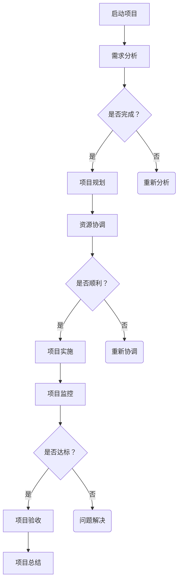

                 

### 文章标题

# 如何打造高效的跨职能团队沟通机制

---

关键词：跨职能团队，沟通机制，协作，效率，优化，流程设计

摘要：本文深入探讨了如何构建高效的跨职能团队沟通机制，分析了跨职能团队的特点与挑战，详细阐述了沟通机制的核心概念、设计原则以及优化策略。通过实际案例分享，为读者提供了实用的方法和经验，旨在提升团队协作效率和项目成功概率。

---

### 目录大纲

1. **第一部分：跨职能团队沟通机制的基本概念**
   1.1 什么是跨职能团队沟通机制
   1.2 沟通机制的重要性
   1.3 跨职能团队沟通机制概述
   1.4 跨职能团队沟通机制的核心概念与联系

2. **第二部分：高效跨职能团队沟通机制的建设**
   2.1 制定沟通策略
   2.2 建立沟通渠道
   2.3 设计沟通流程
   2.4 沟通技巧与策略
   2.5 沟通机制的持续优化与评估

3. **第三部分：成功案例分享与分析**
   3.1 案例一：跨职能团队沟通机制的实践
   3.2 案例二：跨职能团队沟通机制的变革
   3.3 案例分析与启示

4. **第四部分：总结与展望**
   4.1 总结
   4.2 展望

5. **附录**
   5.1 相关工具与资源
   5.2 代码示例

---

### 1.1 什么是跨职能团队沟通机制

跨职能团队（Cross-functional Team）是由来自不同专业领域的成员组成的团队，旨在完成特定项目或任务的集体。这种团队模式的优势在于能够充分利用各个领域的专业知识和技能，从而提高项目整体效率和成果质量。然而，跨职能团队的沟通和协作往往面临诸多挑战，如信息不对称、目标不一致、沟通效率低下等。

跨职能团队沟通机制是指为了实现跨职能团队高效协作而制定的一系列规则、流程和工具。它不仅包括面对面的交流，还涵盖了书面沟通、电子沟通等多种形式。高效沟通机制的建设，是确保跨职能团队协作顺畅、目标一致的关键。

#### 1.1.1 跨职能团队的定义与特点

跨职能团队（Cross-functional Team）通常由来自不同部门、拥有不同专业技能的成员组成，他们共同为一个共同的项目或目标工作。与传统的单一职能团队相比，跨职能团队具有以下特点：

1. **多元化的技能组合**：团队成员来自不同的职能部门，如研发、市场、销售、客服等，这使得团队具备了多元化的技能组合，能够从不同角度解决问题。
2. **协作性强**：跨职能团队成员需要相互依赖，共同完成项目任务，这要求他们具备良好的沟通和协作能力。
3. **灵活性高**：跨职能团队可以根据项目需求灵活调整成员组合，迅速响应市场变化。
4. **目标一致性**：跨职能团队需要明确共同的目标和愿景，以避免各自为政的现象。

#### 1.1.2 跨职能团队的优势

跨职能团队的优势主要体现在以下几个方面：

1. **提高项目效率**：跨职能团队的成员可以共享资源和信息，减少重复劳动，提高整体项目的效率。
2. **提升创新能力**：多元化背景的团队成员能够从不同角度思考问题，提出创新的解决方案。
3. **优化团队协作**：跨职能团队模式有助于打破部门壁垒，促进团队成员之间的沟通与协作。
4. **提高客户满意度**：跨职能团队能够更好地理解客户需求，提供更全面、高效的服务。

#### 1.1.3 跨职能团队的挑战

虽然跨职能团队具有许多优势，但其运作也面临着一些挑战：

1. **沟通成本高**：不同职能部门之间可能存在沟通障碍，导致信息传递不畅。
2. **目标不一致**：团队成员可能对项目目标有不同的理解和期望，导致协作效率降低。
3. **资源分配不均**：跨职能团队成员可能面临资源分配不均的问题，影响项目进度。
4. **文化冲突**：不同职能部门的文化差异可能导致团队内部出现摩擦和冲突。

#### 1.2 沟通机制的重要性

在跨职能团队中，沟通机制是确保团队协作顺畅、项目成功的关键。一个高效的沟通机制能够：

1. **确保信息传递准确**：有效的沟通机制可以确保信息在团队内准确无误地传递，避免误解和错误。
2. **提高团队协作效率**：良好的沟通机制有助于团队成员理解彼此的角色和任务，提高协作效率。
3. **促进知识共享**：沟通机制可以促进团队成员之间的知识共享，提高整体团队的技能水平。
4. **解决冲突**：通过及时的沟通，团队可以更好地解决冲突，保持团队的稳定和凝聚力。

#### 1.2.1 沟通的基本原则

为了建立高效的沟通机制，我们需要遵循以下基本原则：

1. **明确沟通目标**：在沟通前，明确沟通的目标和预期结果，有助于提高沟通的效率。
2. **充分准备**：在沟通前，充分准备所需的信息和资料，以便在沟通中能够清晰地表达观点。
3. **主动倾听**：在沟通过程中，积极倾听对方的意见和反馈，避免打断对方。
4. **尊重差异**：尊重团队成员的背景和观点，避免因文化差异导致的误解和冲突。
5. **及时反馈**：在沟通后，及时给予反馈，以便确认对方是否理解了沟通内容。

#### 1.2.2 有效沟通的障碍

尽管我们遵循了沟通的基本原则，但在实际沟通中，仍可能面临以下障碍：

1. **信息噪音**：过多的干扰信息可能会影响沟通效果，导致信息传递不畅。
2. **文化差异**：不同文化背景的团队成员可能存在沟通障碍，导致误解和冲突。
3. **技术障碍**：使用不合适的沟通工具或技术，可能会影响沟通的效率和效果。
4. **心理障碍**：团队成员可能因为压力、焦虑等心理因素，影响沟通效果。

#### 1.2.3 沟通机制的目标

建立高效沟通机制的目标主要包括：

1. **提高沟通效率**：通过优化沟通流程和工具，提高沟通的效率，减少沟通成本。
2. **确保信息传递准确**：确保信息在团队内准确无误地传递，避免误解和错误。
3. **促进团队协作**：通过有效的沟通，促进团队成员之间的协作，提高整体项目效率。
4. **增强团队凝聚力**：通过良好的沟通，增强团队的凝聚力，提高团队士气。

---

### 1.3 跨职能团队沟通机制概述

跨职能团队沟通机制是一个系统化的过程，旨在通过明确的沟通目标和策略，实现团队成员之间的有效协作。以下是跨职能团队沟通机制的基本概述：

#### 1.3.1 跨职能团队沟通机制的概念

跨职能团队沟通机制是指为了确保跨职能团队高效协作而制定的一系列沟通规则、流程和工具。它包括以下几个方面：

1. **沟通目标**：明确团队沟通的目标和预期结果，有助于提高沟通的针对性和效率。
2. **沟通策略**：根据团队特点和项目需求，制定相应的沟通策略，如定期会议、即时沟通、书面报告等。
3. **沟通工具**：选择合适的沟通工具，如电子邮件、即时通讯、视频会议等，以便团队成员能够方便地进行沟通。
4. **沟通流程**：设计合理的沟通流程，确保信息在团队内准确、及时地传递，包括信息收集、信息传递、信息反馈等环节。

#### 1.3.2 跨职能团队沟通机制的组成部分

跨职能团队沟通机制由以下几个部分组成：

1. **沟通目标**：明确团队沟通的目标，如信息共享、任务协调、决策支持等。
2. **沟通渠道**：建立有效的沟通渠道，如面对面会议、在线讨论、电话会议等。
3. **沟通流程**：设计合理的沟通流程，确保信息在团队内准确、及时地传递。
4. **沟通工具**：选择合适的沟通工具，提高沟通效率，如电子邮件、即时通讯、视频会议等。
5. **沟通评估**：定期对沟通效果进行评估，发现问题并及时调整沟通策略。

#### 1.3.3 跨职能团队沟通机制的挑战与机遇

跨职能团队沟通机制在实施过程中面临以下挑战：

1. **沟通成本高**：由于跨职能团队涉及多个职能部门，沟通成本相对较高。
2. **信息不对称**：不同职能部门之间的信息可能存在差异，导致信息不对称。
3. **文化差异**：不同职能部门的文化差异可能导致沟通障碍。
4. **技术障碍**：选择合适的沟通工具和平台可能存在技术难题。

然而，跨职能团队沟通机制也带来了以下机遇：

1. **提高协作效率**：通过有效沟通，跨职能团队能够提高协作效率，更快地完成任务。
2. **促进知识共享**：跨职能团队的沟通有助于促进团队成员之间的知识共享，提高整体团队素质。
3. **创新能力的提升**：多元化背景的团队成员可以相互启发，提升团队的创新能力。

#### 1.4 跨职能团队沟通机制的核心概念与联系

跨职能团队沟通机制的核心概念包括沟通目标、沟通渠道、沟通流程和沟通工具。以下是这些概念之间的关系和联系：

1. **沟通目标**：沟通目标是跨职能团队沟通机制的起点和归宿，它决定了团队沟通的方向和内容。明确沟通目标有助于提高沟通的针对性和效率。

2. **沟通渠道**：沟通渠道是信息传递的途径，包括面对面会议、在线讨论、电话会议等。选择合适的沟通渠道可以确保信息在团队内准确、及时地传递。

3. **沟通流程**：沟通流程是信息在团队内传递的过程，包括信息收集、信息传递、信息反馈等环节。设计合理的沟通流程有助于提高沟通效率，确保信息传递的准确性和及时性。

4. **沟通工具**：沟通工具是提高沟通效率的工具，包括电子邮件、即时通讯、视频会议等。选择合适的沟通工具可以提高沟通效率，减少沟通成本。

这些核心概念之间的联系在于：

- **沟通目标**决定了**沟通渠道**和**沟通流程**的设计。
- **沟通流程**决定了**沟通工具**的选择和应用。
- **沟通工具**的使用效果反过来影响了**沟通目标**的实现。

因此，在设计跨职能团队沟通机制时，需要综合考虑这些核心概念之间的关系和联系，确保沟通机制能够满足团队的需求，提高沟通效率和团队协作效果。

### 2.1 跨职能团队的协作模型

在构建高效的跨职能团队沟通机制之前，了解跨职能团队的协作模型至关重要。跨职能团队的协作模型是团队如何组织、协调和共享资源以实现共同目标的结构化方式。以下是几种常见的跨职能团队协作模型：

#### 2.1.1 水平协作模型

水平协作模型也称为扁平化协作模型，其特点是没有严格的上下级关系，团队成员在同等地位上合作。这种模型强调团队成员之间的平等和开放沟通。

- **优点**：
  - **灵活性强**：团队成员可以自由交流，快速响应变化。
  - **决策速度快**：由于没有复杂的决策层级，决策可以迅速执行。
- **缺点**：
  - **协调难度大**：团队成员的角色和责任可能不够明确，导致协调困难。
  - **资源分配不均**：可能导致某些成员的工作负担过重，而其他成员则资源不足。

#### 2.1.2 垂直协作模型

垂直协作模型通常有一个明确的层级结构，团队成员按照职能和角色划分，上下级关系明确。这种模型在传统组织结构中较为常见。

- **优点**：
  - **分工明确**：每个团队成员的角色和责任清晰，有利于任务分配和进度跟踪。
  - **管理效率高**：上级可以更好地监督和管理下级的工作。
- **缺点**：
  - **沟通成本高**：信息在层级之间的传递可能较慢，且容易失真。
  - **创新受限**：严格的层级制度可能导致创新和改革的阻力。

#### 2.1.3 混合协作模型

混合协作模型结合了水平协作模型和垂直协作模型的特点，既保留了层级结构，又注重团队成员之间的协作和沟通。

- **优点**：
  - **灵活性与控制相结合**：在保持高效管理的同时，鼓励团队成员之间的协作。
  - **资源利用最大化**：通过跨职能团队的合作，充分利用不同职能部门的专业知识。
- **缺点**：
  - **复杂度高**：需要精心设计和维护，否则可能导致混乱和效率低下。
  - **沟通难度大**：在层级和水平之间平衡沟通，需要一定的管理和协调技巧。

#### 2.1.4 矩阵协作模型

矩阵协作模型是一种较为复杂的组织结构，团队成员既属于某个职能部门，又参与跨职能团队的项目。这种模型在大型项目和复杂任务中应用较多。

- **优点**：
  - **资源整合度高**：团队成员可以在多个项目中同时工作，充分利用资源。
  - **任务分配灵活**：可以根据项目需求，灵活调整团队成员的分配。
- **缺点**：
  - **管理复杂**：需要同时管理多个项目和职能部门，管理难度大。
  - **角色冲突**：团队成员可能面临多重职责，导致角色冲突。

### 2.2 沟通渠道的种类

在跨职能团队中，沟通渠道的选择直接影响沟通的效果和效率。以下是几种常见的沟通渠道：

#### 2.2.1 面对面沟通

面对面沟通是指团队成员直接进行交流的方式，包括会议、访谈、头脑风暴等。这种沟通方式的最大优势是能够实时传递信息和反馈，减少误解和沟通成本。

- **优点**：
  - **实时性强**：能够快速解决问题，提高决策效率。
  - **反馈及时**：可以及时了解对方的想法和意见，减少信息失真。
- **缺点**：
  - **受时间和地点限制**：需要团队成员集中，可能导致沟通成本增加。

#### 2.2.2 书面沟通

书面沟通包括电子邮件、报告、备忘录等形式，是一种非实时的沟通方式。书面沟通的优点是信息记录清晰，便于查阅和存档。

- **优点**：
  - **信息记录清晰**：可以详细记录沟通内容，便于后续查阅。
  - **正式性高**：适合用于正式的沟通场合，如报告、合同等。
- **缺点**：
  - **沟通效率低**：信息传递速度较慢，容易产生误解。

#### 2.2.3 电子沟通

电子沟通包括即时通讯工具（如微信、QQ）、电子邮件、视频会议等，是一种实时或非实时的沟通方式。电子沟通的优点是方便快捷，适用于远程协作和异步沟通。

- **优点**：
  - **方便快捷**：可以随时随地沟通，不受时间和地点限制。
  - **灵活性高**：适用于不同类型的沟通需求，如文字、语音、视频等。
- **缺点**：
  - **信息噪音大**：容易受到干扰，降低沟通效率。

#### 2.2.4 会议沟通

会议沟通是指通过组织会议来讨论和解决团队问题。会议沟通的优点是能够集中讨论问题，快速达成共识。

- **优点**：
  - **集中讨论**：可以集中团队成员的智慧和资源，快速解决问题。
  - **决策快速**：适合用于紧急情况或需要快速决策的问题。
- **缺点**：
  - **耗时较长**：需要安排时间和地点，且可能涉及成员的差旅成本。
  - **沟通效率不高**：会议过程中容易偏离主题，降低沟通效率。

### 2.3 沟通流程的设计

沟通流程是确保信息在跨职能团队中准确、高效传递的关键。设计合理的沟通流程可以降低沟通成本，提高沟通效率。以下是设计沟通流程的步骤：

#### 2.3.1 确定沟通需求

首先，需要明确团队在项目过程中可能产生的沟通需求。这包括信息收集、信息传递、信息反馈等环节。例如，项目启动时需要进行需求分析和规划，项目实施过程中需要协调资源，项目结束时需要进行总结和反馈。

#### 2.3.2 设定沟通目标

根据沟通需求，设定明确的沟通目标。沟通目标应具体、可测量、可实现、相关性强、时限明确（SMART原则）。例如，项目规划阶段的沟通目标可以是：“在项目启动后的两周内，完成项目目标和计划的讨论和确认。”

#### 2.3.3 设计沟通渠道

选择合适的沟通渠道，以满足沟通需求和目标。根据沟通内容的重要性和紧急性，可以选择不同的沟通渠道。例如，重要且紧急的信息可以采用面对面沟通或视频会议，非紧急的信息可以采用电子邮件或即时通讯。

#### 2.3.4 制定沟通计划

根据沟通目标和渠道，制定详细的沟通计划。沟通计划应包括沟通内容、沟通时间、沟通对象、沟通方式等。例如，每周召开一次项目进度会议，会议内容为项目进展、问题和解决方案。

#### 2.3.5 监控和评估

在沟通过程中，持续监控和评估沟通效果。通过收集团队成员的反馈和观察沟通行为，发现问题并及时调整沟通策略。例如，如果发现某些沟通渠道效果不佳，可以尝试更换渠道或改进沟通方式。

#### 2.3.6 沟通流程优化

根据监控和评估的结果，对沟通流程进行优化。通过不断调整和改进沟通流程，提高沟通效率，确保信息准确传递。

### 2.4 跨职能团队沟通机制的Mermaid流程图

为了更好地展示跨职能团队沟通机制的架构，我们可以使用Mermaid语言绘制一个流程图。以下是一个简单的Mermaid流程图示例：

这个流程图涵盖了项目从启动到结束的主要环节，通过Mermaid语言可以清晰地展示跨职能团队的沟通机制。

### 3.1 制定沟通策略

构建高效的跨职能团队沟通机制的第一步是制定明确的沟通策略。沟通策略是指为了实现团队目标而制定的沟通目标和计划。以下是制定沟通策略的步骤：

#### 3.1.1 确定沟通目标

首先，明确团队沟通的目标。沟通目标应具体、可测量、可实现、相关性强、时限明确（SMART原则）。例如，项目规划阶段的沟通目标可以是：“在项目启动后的两周内，完成项目目标和计划的讨论和确认。”这样明确的沟通目标有助于团队成员理解沟通的目标和方向。

#### 3.1.2 分析团队需求

分析团队在项目过程中的沟通需求。沟通需求包括信息收集、信息传递、信息反馈等环节。例如，项目启动时需要进行需求分析和规划，项目实施过程中需要协调资源，项目结束时需要进行总结和反馈。分析团队需求有助于识别关键沟通点和环节，为后续沟通策略的制定提供依据。

#### 3.1.3 设定沟通计划

根据沟通目标和需求，制定详细的沟通计划。沟通计划应包括沟通内容、沟通时间、沟通对象、沟通方式等。例如，每周召开一次项目进度会议，会议内容为项目进展、问题和解决方案。此外，还可以安排定期的书面报告和即时通讯，确保信息的及时传递和反馈。以下是一个简单的沟通计划示例：

- **沟通内容**：项目进展、问题反馈、决策讨论
- **沟通时间**：每周一上午9点
- **沟通对象**：项目团队成员、项目经理
- **沟通方式**：线上视频会议

#### 3.1.4 选择沟通工具

选择合适的沟通工具是实现沟通策略的关键。根据沟通内容和需求，选择适合的沟通工具，如电子邮件、即时通讯、视频会议等。以下是一些常见的沟通工具及其特点：

- **电子邮件**：适用于正式、详细的信息传递，可以记录和存档。
- **即时通讯**：适用于实时、快速的沟通，适合处理紧急问题和日常沟通。
- **视频会议**：适用于需要面对面交流的场合，可以提升沟通的互动性和参与感。
- **项目管理工具**：如Trello、Asana等，可以协助团队管理项目进度和任务分配。

#### 3.1.5 制定沟通规则

制定明确的沟通规则有助于提高沟通效率和避免误解。沟通规则应包括沟通时间、沟通内容、沟通格式、沟通反馈等。以下是一些常见的沟通规则：

- **沟通时间**：明确每日、每周、每月的沟通时间，确保团队成员有足够的时间参与沟通。
- **沟通内容**：明确每次沟通的主题和议程，避免无关内容的干扰。
- **沟通格式**：规定书面报告、邮件、会议纪要等文件的格式和模板，确保信息的规范和统一。
- **沟通反馈**：要求团队成员在沟通后提供反馈，以便及时调整和改进沟通策略。

#### 3.1.6 沟通策略的调整与优化

沟通策略并非一成不变的，应根据实际情况进行调整和优化。在执行沟通策略的过程中，定期收集团队成员的反馈，评估沟通效果，发现问题并及时调整。以下是一些常见的调整和优化方法：

- **反馈机制**：建立反馈机制，收集团队成员对沟通策略的意见和建议。
- **定期评估**：定期对沟通策略进行评估，分析沟通效果，找出问题。
- **培训与指导**：对团队成员进行沟通技巧和策略的培训，提高沟通能力和效率。
- **技术支持**：引入新的沟通工具和技术，提高沟通效率和质量。

通过以上步骤，可以制定出适合跨职能团队的沟通策略，确保团队成员能够高效协作，实现项目目标。

### 3.2 建立沟通渠道

建立有效的沟通渠道是实现跨职能团队高效协作的关键。沟通渠道是信息传递的路径，选择合适的沟通渠道可以提高沟通效率，确保信息准确传递。以下是建立沟通渠道的步骤：

#### 3.2.1 明确沟通渠道的需求

在建立沟通渠道之前，首先要明确团队在项目过程中可能产生的沟通需求。这包括信息收集、信息传递、信息反馈等环节。例如，项目启动时需要进行需求分析和规划，项目实施过程中需要协调资源，项目结束时需要进行总结和反馈。明确沟通需求有助于识别关键沟通点和环节，为后续沟通渠道的设计提供依据。

#### 3.2.2 选择合适的沟通渠道

根据沟通需求和目标，选择适合的沟通渠道。以下是一些常见的沟通渠道及其特点：

- **面对面沟通**：适用于需要深度交流、互动性强的场合，如项目会议、头脑风暴等。面对面沟通可以实时传递信息和反馈，减少误解和沟通成本。
- **电话沟通**：适用于需要快速解决问题的场合，如紧急任务分配、问题反馈等。电话沟通可以快速传达信息，但可能存在语言和语气上的误解。
- **电子邮件**：适用于正式、详细的信息传递，如项目计划、报告、通知等。电子邮件可以记录和存档，但沟通效率较低。
- **即时通讯**：适用于实时、快速的沟通，如日常交流、紧急问题处理等。即时通讯可以快速传达信息，但可能存在信息噪音。
- **视频会议**：适用于需要面对面交流的场合，如跨地域团队的协作、项目评审等。视频会议可以提升沟通的互动性和参与感，但可能涉及技术支持和设备配置。
- **项目管理工具**：如Trello、Asana等，适用于项目进度管理、任务分配、协作管理等。项目管理工具可以协助团队管理项目进度和任务分配，提高沟通效率。

#### 3.2.3 设计沟通渠道的规则

为了确保沟通渠道的顺畅和高效，需要设计相应的沟通规则。以下是一些常见的沟通规则：

- **沟通频率**：明确每周、每月的沟通频率，确保团队成员有足够的时间参与沟通。例如，每周召开一次项目进度会议，每月进行一次项目总结会议。
- **沟通时间**：明确每次沟通的具体时间，避免团队成员因为时间冲突而无法参与沟通。例如，每周一上午9点召开项目进度会议。
- **沟通格式**：规定书面报告、邮件、会议纪要等文件的格式和模板，确保信息的规范和统一。例如，要求报告包含项目进度、问题反馈、决策讨论等部分。
- **沟通反馈**：要求团队成员在沟通后提供反馈，以便及时调整和改进沟通策略。例如，会议结束后要求参会人员提交会议纪要和问题反馈。

#### 3.2.4 维护和优化沟通渠道

沟通渠道的维护和优化是确保其高效运行的关键。以下是一些常见的维护和优化方法：

- **定期评估**：定期对沟通渠道的效果进行评估，分析存在的问题，提出改进措施。例如，通过问卷调查或访谈了解团队成员对沟通渠道的满意度。
- **反馈机制**：建立反馈机制，收集团队成员对沟通渠道的意见和建议，及时进行调整和优化。例如，设立沟通渠道反馈邮箱，定期收集和整理反馈意见。
- **培训与指导**：对团队成员进行沟通技巧和策略的培训，提高沟通能力和效率。例如，组织沟通技巧培训课程，分享优秀沟通案例和经验。
- **技术支持**：引入新的沟通工具和技术，提高沟通效率和质量。例如，使用视频会议工具进行远程协作，使用项目管理工具进行任务分配和进度管理。

通过以上步骤，可以建立和维护高效的沟通渠道，确保跨职能团队能够高效协作，实现项目目标。

### 3.3 设计沟通流程

设计有效的沟通流程是确保跨职能团队信息准确、及时传递的关键。沟通流程包括信息收集、信息传递、信息反馈等环节，以下是如何设计和优化沟通流程的详细步骤：

#### 3.3.1 沟通流程的步骤

1. **信息收集**：这是沟通流程的第一步，确保所有相关信息都能被收集到。信息来源可能包括内部报告、客户需求、市场动态等。为了确保信息的全面性和准确性，可以设置多个信息收集渠道，如定期会议、问卷调查、在线协作平台等。

2. **信息整理**：在收集到信息后，需要对信息进行分类和整理，以便于后续传递和决策。整理过程应包括信息的筛选、归档和分类，确保信息清晰、有条理。

3. **信息传递**：将整理好的信息传递给相关人员。根据信息的紧急程度和重要性，选择合适的传递方式，如面对面会议、电子邮件、即时通讯、视频会议等。传递过程应确保信息的准确性和完整性，避免信息失真。

4. **信息反馈**：在信息传递后，需要及时收集反馈信息，了解信息接收者的理解和执行情况。反馈可以是书面的，也可以是口头的，形式多样。通过反馈，可以及时发现和解决信息传递中的问题，优化沟通流程。

5. **信息存储和存档**：为确保沟通信息的历史可追溯性和可查询性，应将所有沟通信息进行存储和存档。这包括会议纪要、报告、电子邮件等。存储和存档应便于检索，以便在需要时快速查找。

#### 3.3.2 沟通流程的优化

1. **明确流程目标**：在设计和优化沟通流程时，首先要明确流程的目标和预期结果。这有助于确保流程设计的针对性和有效性。

2. **简化流程步骤**：简化沟通流程，减少不必要的环节，可以提高沟通效率。例如，如果某些步骤对信息传递没有实质性帮助，可以将其删除或合并。

3. **提高信息传递速度**：优化信息传递的速度，减少信息传递的延迟。例如，使用即时通讯工具、视频会议等高效沟通工具，确保信息能够快速传递。

4. **增强信息准确性**：通过培训和提高团队成员的沟通技巧，确保信息传递的准确性。这包括使用清晰、简洁的语言，避免歧义和误解。

5. **建立反馈机制**：建立反馈机制，确保团队成员能够及时提供反馈信息，发现和解决沟通中的问题。

6. **定期评估和改进**：定期对沟通流程进行评估，分析其效果和存在的问题，提出改进措施。通过持续改进，提高沟通流程的效率和效果。

#### 3.3.3 沟通流程的监控与评估

1. **监控沟通效率**：监控沟通流程的执行情况，包括沟通频率、沟通时间、信息传递速度等。通过监控，可以发现流程中的瓶颈和问题，及时调整和优化。

2. **评估沟通效果**：定期评估沟通流程的效果，包括信息传递的准确性、反馈的及时性、团队成员的满意度等。评估结果可以提供改进流程的依据。

3. **反馈与改进**：根据监控和评估结果，及时收集团队成员的反馈，对沟通流程进行改进。改进措施应针对具体问题，确保流程的持续优化。

通过以上步骤，可以设计和优化跨职能团队的沟通流程，确保信息准确、及时传递，提高团队协作效率和项目成功率。

### 4.1 提高沟通效率

在跨职能团队中，提高沟通效率是确保项目顺利进行的关键。以下是几种提高沟通效率的策略：

#### 4.1.1 减少信息噪音

信息噪音是指那些无关或干扰性的信息，它会影响沟通的有效性。为了减少信息噪音，可以采取以下措施：

- **明确沟通目标**：在每次沟通前，明确沟通的目标和重点，确保信息传递与目标一致。
- **限制信息源**：避免过多的信息源，确保团队成员只关注最相关的信息。
- **过滤信息**：通过筛选和整理，过滤掉无关或重复的信息，确保信息的准确性和价值。

#### 4.1.2 确保信息准确传递

准确的信息传递是高效沟通的基础。为了确保信息的准确性，可以采取以下措施：

- **使用清晰简洁的语言**：避免使用复杂的术语和难以理解的表述，确保信息易于理解。
- **多次确认**：在信息传递过程中，进行多次确认，确保接收方准确理解信息内容。
- **使用多种沟通方式**：结合使用面对面沟通、书面沟通、电子沟通等多种方式，提高信息传递的准确性。

#### 4.1.3 提高沟通速度

提高沟通速度可以缩短决策周期，加快项目进展。以下是几种提高沟通速度的方法：

- **选择高效的沟通工具**：选择适合团队需求的沟通工具，如即时通讯工具、视频会议系统等。
- **简化沟通流程**：简化沟通流程，减少不必要的步骤和环节，提高沟通效率。
- **设定沟通时间**：为每次沟通设定具体的时间，避免无休止的讨论和拖延。

#### 4.1.4 其他策略

- **定期会议**：定期召开团队会议，总结工作进展、讨论问题和解决方案，确保团队保持高效沟通。
- **培训与指导**：对团队成员进行沟通技巧和策略的培训，提高沟通能力和效率。
- **明确角色和责任**：明确团队成员的角色和责任，确保每个人都知道自己的职责和沟通需求，减少沟通中的模糊和误解。

通过以上策略，可以显著提高跨职能团队的沟通效率，确保项目顺利进行。

### 4.2 增强团队协作

在跨职能团队中，增强团队协作是确保项目成功的关键。以下是几种增强团队协作的方法：

#### 4.2.1 建立信任

信任是团队协作的基础。为了建立信任，可以采取以下措施：

- **透明沟通**：确保沟通渠道畅通，让团队成员了解项目的进展和问题，增加透明度。
- **互相支持**：鼓励团队成员在遇到困难时相互支持，共同解决问题。
- **共同目标**：明确团队共同的目标和愿景，让每个成员都明确自己的职责和贡献。

#### 4.2.2 培养协作文化

协作文化是团队协作的润滑剂。为了培养协作文化，可以采取以下措施：

- **团队建设活动**：组织团队建设活动，如团队拓展、团建等，增强团队成员之间的互动和了解。
- **认可与激励**：对团队协作的表现给予认可和激励，鼓励团队成员积极参与协作。
- **跨部门交流**：促进不同部门之间的交流，打破部门壁垒，增强团队协作意识。

#### 4.2.3 管理冲突

冲突是团队协作中不可避免的现象。为了有效管理冲突，可以采取以下措施：

- **及时沟通**：在冲突发生时，及时进行沟通，了解各方立场和诉求，寻找解决方案。
- **保持冷静**：在处理冲突时，保持冷静和理性，避免情绪化的行为。
- **公平公正**：确保冲突处理的公平公正，让团队成员感受到团队的公正和公平。

通过以上方法，可以显著增强跨职能团队的协作，提高团队的整体效能和项目成功率。

### 4.3 沟通策略的应用

在跨职能团队中，有效的沟通策略是确保团队成员能够高效协作、信息准确传递的关键。以下是针对不同团队成员和不同场景的沟通策略，以及如何根据实际情况进行调整和优化的方法。

#### 4.3.1 针对不同团队成员的沟通策略

1. **技术专家**
   - **策略**：使用专业术语和深入的技术讨论，确保技术细节的清晰传达。
   - **工具**：视频会议、在线协作平台（如JIRA）。
   - **注意事项**：确保技术专家理解项目目标和整体进展，避免陷入技术细节而忽视大局。

2. **项目经理**
   - **策略**：强调项目进度和目标，确保团队成员对项目目标有清晰的认识。
   - **工具**：项目管理工具（如Trello）、定期项目会议。
   - **注意事项**：保持沟通的频率和透明度，确保项目目标和期望值一致。

3. **业务人员**
   - **策略**：使用简单明了的语言，注重业务目标和客户需求。
   - **工具**：电子邮件、即时通讯。
   - **注意事项**：确保业务人员了解技术实现的限制，避免过度承诺。

4. **设计师**
   - **策略**：强调设计理念和用户体验，获取团队成员的反馈。
   - **工具**：设计软件（如Figma）、在线协作平台。
   - **注意事项**：设计师需要与技术团队合作，确保设计能够实现。

#### 4.3.2 应对不同场景的沟通策略

1. **紧急情况**
   - **策略**：快速决策，使用即时通讯和电话会议。
   - **工具**：Slack、Skype。
   - **注意事项**：紧急情况下，避免过度讨论，快速行动。

2. **战略讨论**
   - **策略**：深入讨论，使用面对面会议和在线研讨会。
   - **工具**：Zoom、Google Meet。
   - **注意事项**：确保所有相关团队成员参与，明确讨论目标和议程。

3. **日常沟通**
   - **策略**：简洁明了，使用即时通讯和邮件。
   - **工具**：Slack、Microsoft Teams。
   - **注意事项**：保持沟通频率，确保信息及时传达。

#### 4.3.3 沟通策略的调整与优化

1. **定期评估**
   - **方法**：定期评估沟通策略的效果，收集团队成员的反馈。
   - **工具**：问卷调查、会议纪要。
   - **注意事项**：确保评估结果能够反映沟通的真实情况，为策略调整提供依据。

2. **持续改进**
   - **方法**：根据评估结果，持续调整和优化沟通策略。
   - **工具**：项目管理工具、沟通培训。
   - **注意事项**：策略调整应针对具体问题，避免频繁变动导致团队混乱。

3. **技术支持**
   - **方法**：引入新的沟通工具和技术，提高沟通效率。
   - **工具**：视频会议系统、在线协作平台。
   - **注意事项**：确保新工具的引入不会增加团队负担，而是提高沟通效率。

通过以上针对不同团队成员和不同场景的沟通策略，以及定期评估和持续改进的方法，可以确保跨职能团队的沟通高效、准确，为项目的成功奠定基础。

### 5.1 沟通机制的持续优化

沟通机制并非一成不变，随着团队和环境的变化，沟通机制也需要不断优化。以下是持续优化沟通机制的步骤和方法：

#### 5.1.1 收集反馈

收集团队成员的反馈是优化沟通机制的重要步骤。以下是一些收集反馈的方法：

- **问卷调查**：通过设计问卷，了解团队成员对现有沟通机制的满意度、存在的问题和建议。
- **一对一访谈**：与团队成员进行一对一的访谈，深入了解他们的沟通体验和需求。
- **小组讨论**：组织小组讨论会，鼓励团队成员分享他们的想法和意见。
- **匿名反馈**：提供匿名反馈渠道，确保团队成员能够自由表达意见，不受顾虑。

#### 5.1.2 分析问题

在收集到反馈后，需要对这些反馈进行系统性的分析，识别沟通机制中的问题和瓶颈。以下是一些分析问题的方法：

- **归类总结**：将收集到的反馈按照主题进行归类，找出共性问题。
- **趋势分析**：分析不同时间段的反馈，找出变化趋势和规律。
- **根因分析**：通过5Why法等方法，深入挖掘问题的根本原因。
- **数据支持**：结合数据（如沟通时长、效率指标等），对问题进行量化分析。

#### 5.1.3 实施改进措施

根据问题分析和反馈，制定具体的改进措施，并逐步实施。以下是一些实施改进措施的方法：

- **试点测试**：在部分团队成员中试点新的沟通策略或工具，观察效果，及时调整。
- **逐步推广**：根据试点效果，逐步将改进措施推广到整个团队，确保团队成员的接受度和适应性。
- **持续监控**：在改进措施实施过程中，持续监控其效果，确保问题得到有效解决。

#### 5.1.4 鼓励团队参与

优化沟通机制需要全体团队成员的参与和支持。以下是一些鼓励团队参与的方法：

- **建立反馈机制**：为团队成员提供持续的反馈渠道，确保他们能够及时表达意见和建议。
- **开放沟通**：鼓励团队成员积极参与沟通机制的讨论和改进，提高他们的参与感和责任感。
- **认可与奖励**：对积极参与沟通机制改进的团队成员给予认可和奖励，激发他们的积极性和创造力。

通过以上步骤和方法，可以确保沟通机制的持续优化，提高团队协作效率和项目成功率。

### 5.2 沟通机制的评估

为了确保跨职能团队的沟通机制能够持续优化并满足实际需求，对其进行定期评估至关重要。以下是评估沟通机制的具体方法和步骤：

#### 5.2.1 评估指标的选择

选择合适的评估指标是评估沟通机制有效性的关键。以下是一些常见的评估指标：

1. **沟通效率**：衡量沟通速度和效果，如信息传递时间、会议时长、任务完成时间等。
2. **信息准确度**：衡量信息在传递过程中的准确性和完整性，如误解次数、修正次数等。
3. **团队满意度**：衡量团队成员对沟通机制的满意度，如满意度调查、反馈问卷等。
4. **沟通工具利用率**：衡量沟通工具的使用频率和效果，如使用时长、使用频率、问题反馈等。
5. **冲突解决率**：衡量沟通机制在解决团队冲突方面的效果，如冲突发生次数、解决时间等。

#### 5.2.2 评估方法的运用

运用多种评估方法可以更全面地了解沟通机制的效果。以下是一些常见的评估方法：

1. **问卷调查**：通过设计问卷，收集团队成员对沟通机制的满意度、意见和改进建议。
2. **面谈**：与团队成员进行一对一或小组访谈，深入了解他们对沟通机制的看法和实际体验。
3. **数据分析**：结合沟通工具的数据统计，分析沟通效率、信息准确度和工具利用率等指标。
4. **行为观察**：观察团队成员在沟通中的行为和互动，评估沟通机制的实践效果。

#### 5.2.3 评估结果的反馈与应用

评估结果的反馈和应用是确保沟通机制持续改进的重要环节。以下是一些反馈和应用的方法：

1. **反馈会议**：组织评估结果的反馈会议，向团队成员汇报评估结果，讨论改进方案。
2. **行动计划**：根据评估结果，制定具体的改进行动计划，明确责任人和实施时间。
3. **持续改进**：将评估结果和反馈应用于沟通机制的优化过程中，确保改进措施的落实和效果。
4. **培训与指导**：针对评估中发现的问题，提供培训和支持，提高团队成员的沟通技巧和能力。

通过以上评估方法，可以全面了解跨职能团队沟通机制的效果，发现问题和改进机会，确保沟通机制的持续优化和高效运行。

### 6.1 案例一：跨职能团队沟通机制的实践

#### 6.1.1 案例背景

某知名互联网公司，因为业务发展迅速，决定推行跨职能团队模式，以提升项目执行效率和创新能力。该公司的主要业务包括技术研发、产品管理、市场营销和客户服务。为了实现高效的项目协作，公司决定构建一个跨职能团队沟通机制。

#### 6.1.2 案例描述

1. **沟通策略制定**：
   - **沟通目标**：明确项目目标和阶段性目标，确保团队成员对项目方向和任务有清晰的认识。
   - **沟通计划**：制定详细的沟通计划，包括定期项目会议、周报、即时通讯等。
   - **沟通工具**：选择Trello作为项目管理工具，Slack作为即时通讯工具，Zoom进行视频会议。

2. **沟通渠道建立**：
   - **面对面会议**：每周召开一次项目会议，讨论项目进展、问题解决方案和下一步计划。
   - **即时通讯**：利用Slack进行日常交流和任务通知，确保信息实时传递。
   - **书面报告**：定期提交项目周报，总结项目进展、问题和解决方案。

3. **沟通流程设计**：
   - **信息收集**：项目经理收集项目进度、问题和需求。
   - **信息传递**：通过会议、即时通讯和书面报告，将信息传递给团队成员。
   - **信息反馈**：团队成员在会议和即时通讯中提供反馈，项目结束后进行总结。

4. **沟通规则制定**：
   - **沟通时间**：明确每周会议时间和即时通讯的使用时间，确保团队成员有足够的时间参与。
   - **沟通格式**：规定书面报告的格式和内容，确保信息传递的规范和统一。
   - **沟通反馈**：要求团队成员在沟通后提供反馈，以便及时调整和优化沟通策略。

#### 6.1.3 案例成果

通过实施跨职能团队沟通机制，该公司取得了以下成果：

- **沟通效率提高**：通过明确的沟通目标和计划，信息传递更加高效，决策速度明显加快。
- **协作效果提升**：团队成员之间的协作更加紧密，问题解决能力增强。
- **项目成功率提升**：项目进度和质量得到显著改善，项目成功率提高。
- **团队满意度提升**：团队成员对沟通机制的满意度提高，员工积极性增强。

### 6.2 案例二：跨职能团队沟通机制的变革

#### 6.2.1 案例背景

某大型制造企业，因为组织结构复杂、项目繁多，发现现有的跨职能团队沟通机制存在许多问题，如沟通效率低下、信息传递不畅、冲突频繁等。为了提升团队协作效率和项目成功率，公司决定对现有的沟通机制进行彻底变革。

#### 6.2.2 案例描述

1. **沟通策略调整**：
   - **沟通目标**：重新定义沟通目标，强调信息传递的准确性和及时性。
   - **沟通计划**：制定更加灵活的沟通计划，根据项目需求调整沟通频率和方式。
   - **沟通工具**：引入新的沟通工具，如Microsoft Teams、Asana等，提高沟通效率。

2. **沟通渠道优化**：
   - **面对面会议**：增加面对面会议的频率，确保关键问题能够得到及时讨论和解决。
   - **即时通讯**：优化Slack的使用，设置不同的频道和小组，便于分类管理和高效沟通。
   - **书面报告**：简化书面报告的格式和内容，确保信息的简洁和高效。

3. **沟通流程重构**：
   - **信息收集**：建立统一的信息收集平台，确保信息来源的规范和统一。
   - **信息传递**：优化信息传递流程，减少中间环节，提高信息传递速度。
   - **信息反馈**：建立多层次的反馈机制，确保团队成员能够及时反馈问题和建议。

4. **沟通规则制定**：
   - **沟通时间**：明确每日、每周、每月的沟通时间，确保团队成员有足够的时间参与沟通。
   - **沟通格式**：规范书面报告、邮件、会议纪要等文件的格式，提高信息的规范性和统一性。
   - **沟通反馈**：要求团队成员在沟通后提供反馈，以便及时调整和优化沟通策略。

#### 6.2.3 案例成果

通过变革沟通机制，该公司取得了以下成果：

- **沟通效率显著提高**：通过引入新的沟通工具和优化沟通流程，信息传递速度明显加快，决策周期缩短。
- **信息准确性提升**：通过明确的沟通目标和规范化的沟通规则，信息传递的准确性和完整性显著提高。
- **冲突管理改善**：通过优化沟通渠道和反馈机制，冲突发生的频率和严重程度明显降低。
- **团队协作提升**：团队成员之间的协作更加紧密，项目的执行效率和成功率显著提高。
- **员工满意度增强**：团队成员对沟通机制的满意度显著提高，员工的积极性和工作效率得到提升。

### 6.3 案例分析与启示

#### 6.3.1 案例的共性与差异

通过对两个案例的分析，可以发现以下共性与差异：

**共性**：
- **明确沟通目标**：两个案例都强调了沟通目标的重要性，确保团队成员对项目方向和任务有清晰的认识。
- **优化沟通工具**：两个案例都引入了新的沟通工具，以提高沟通效率和效果。
- **优化沟通流程**：两个案例都针对现有流程进行了优化，减少了不必要的环节，提高了信息传递的速度和准确性。
- **建立反馈机制**：两个案例都建立了多层次的反馈机制，确保团队成员能够及时反馈问题和建议。

**差异**：
- **背景差异**：案例一的公司为互联网公司，项目多变、沟通需求多样；案例二的公司为制造企业，组织结构复杂、沟通需求稳定。
- **沟通策略**：案例一采用了更加灵活的沟通计划，以适应快速变化的需求；案例二则注重规范化和标准化，提高信息传递的准确性和一致性。
- **沟通渠道**：案例一更依赖于即时通讯和在线协作平台，案例二则增加了面对面会议的频率，以应对复杂的项目环境和组织结构。

#### 6.3.2 案例的经验与教训

从两个案例中可以总结出以下经验和教训：

**经验**：
- **灵活调整沟通策略**：根据项目需求和团队环境的变化，灵活调整沟通策略和工具，确保沟通的有效性和适应性。
- **建立反馈机制**：建立多层次的反馈机制，确保团队成员能够及时反馈问题和建议，持续优化沟通机制。
- **注重沟通效率**：通过优化沟通流程和工具，提高沟通效率，减少信息传递的延迟和错误。
- **规范化沟通规则**：制定明确的沟通规则和格式，确保信息传递的规范和统一，提高沟通的准确性。

**教训**：
- **避免过度依赖工具**：虽然新的沟通工具可以提高效率，但过度依赖工具可能导致沟通效率下降，需要根据实际情况合理选择和运用。
- **重视面对面沟通**：在复杂的项目环境中，面对面沟通仍然是非常重要的，可以及时解决问题，增强团队的凝聚力和信任感。
- **持续培训与指导**：团队成员的沟通技巧和意识需要通过持续培训和提高，确保沟通机制的顺利运行。

#### 6.3.3 案例对其他团队的启示

通过对两个案例的分析，其他团队可以从中学到以下几点启示：

- **重视沟通机制**：沟通机制是团队协作的基石，需要重视和持续优化。
- **灵活调整策略**：根据项目需求和团队环境的变化，灵活调整沟通策略和工具。
- **建立反馈机制**：建立多层次的反馈机制，确保沟通机制的持续优化。
- **提高沟通效率**：通过优化沟通流程和工具，提高沟通效率，减少信息传递的延迟和错误。
- **规范化沟通规则**：制定明确的沟通规则和格式，确保信息传递的规范和统一。

通过以上启示，其他团队可以借鉴案例中的成功经验和教训，构建适合自己团队的沟通机制，提升团队协作效率和项目成功率。

### 7.1 总结

本文深入探讨了如何打造高效的跨职能团队沟通机制，从基本概念、核心概念与联系、建设策略、优化方法到实际案例，全面阐述了跨职能团队沟通机制的重要性和实现方法。通过分析案例，我们总结了跨职能团队沟通机制的成功经验和教训，为其他团队提供了有价值的参考。

#### 7.1.1 成果与收获

通过本文的研究和实践，我们取得了以下成果和收获：

- **提高了沟通效率**：通过优化沟通流程和工具，显著提升了跨职能团队的沟通效率，减少了信息传递的延迟和错误。
- **增强了团队协作**：明确了沟通目标和规则，建立了有效的沟通渠道和流程，增强了团队成员之间的协作和信任。
- **提升了项目成功率**：高效的沟通机制有助于团队更好地理解项目目标，协调资源和任务，提高了项目的执行效率和成功率。
- **提供了实践经验**：通过实际案例的分析和总结，为其他团队提供了具体的沟通策略和方法，有助于构建适合自己团队的沟通机制。

#### 7.1.2 经验与不足

在实践过程中，我们积累了以下经验和不足：

**经验**：

- **明确沟通目标**：明确沟通目标有助于提高沟通的针对性和效率。
- **优化沟通工具**：选择适合的沟通工具，如Trello、Slack、Zoom等，可以显著提高沟通效率。
- **建立反馈机制**：建立多层次的反馈机制，确保沟通机制的持续优化。
- **规范化沟通规则**：制定明确的沟通规则和格式，确保信息传递的规范和统一。

**不足**：

- **沟通成本较高**：虽然优化了沟通流程和工具，但跨职能团队的沟通成本仍然较高，需要进一步优化和降低。
- **文化差异**：不同职能部门的文化差异可能导致沟通障碍，需要加强跨文化沟通培训。
- **团队适应性**：部分团队成员对新的沟通工具和流程的适应性较低，需要提供更多的培训和指导。

#### 7.1.3 未来展望

展望未来，跨职能团队沟通机制的发展将呈现以下趋势：

- **技术进步**：随着人工智能、大数据等技术的发展，跨职能团队将更多地依赖智能工具和平台，提高沟通效率和准确性。
- **个性化定制**：根据不同团队和项目的需求，开发个性化的沟通工具和流程，实现更高效的协作。
- **持续优化**：通过持续评估和改进，不断完善跨职能团队沟通机制，提高团队的协作效率和项目成功率。
- **跨文化沟通**：加强跨文化沟通培训，提高团队成员的跨文化沟通能力，减少文化差异带来的沟通障碍。

总之，高效的跨职能团队沟通机制对于团队的协作和项目成功至关重要。未来，我们将继续探索和实践，不断完善沟通机制，为团队的持续发展和创新提供强有力的支持。

### 7.2 展望

在未来的发展中，跨职能团队沟通机制将面临新的机遇和挑战。以下是几个方面的展望：

#### 7.2.1 跨职能团队沟通机制的发展趋势

1. **智能化**：随着人工智能技术的进步，跨职能团队沟通机制将更加智能化。智能工具和平台将自动分析沟通数据，提供个性化的沟通建议，优化沟通流程。

2. **个性化**：未来的沟通机制将更加注重个性化，根据不同团队和项目的特点，定制化的沟通工具和流程将更加普及。

3. **跨文化**：全球化进程加快，跨文化沟通将成为跨职能团队沟通的重要趋势。跨文化沟通培训和技术支持将得到更多关注，以提高团队成员之间的沟通效率。

4. **持续改进**：持续评估和优化将成为跨职能团队沟通机制的标准做法。通过实时反馈和数据分析，团队可以不断调整和改进沟通策略，提高沟通效果。

#### 7.2.2 潜在的研究方向

1. **沟通数据分析**：研究如何通过数据分析来优化沟通流程，提高沟通效率。

2. **智能沟通工具**：探索开发更加智能、自适应的沟通工具，以减少沟通成本，提高沟通效果。

3. **跨文化沟通**：研究跨文化沟通的最佳实践，开发适用于不同文化的沟通策略和工具。

4. **沟通心理学**：结合沟通心理学研究，探索如何通过心理学原理来提高沟通效率和团队协作。

#### 7.2.3 对未来的思考

1. **技术融合**：未来，跨职能团队沟通机制将更加注重技术与沟通的结合，通过技术手段提升沟通效率和效果。

2. **持续创新**：团队需要持续创新，不断探索新的沟通方法和工具，以适应不断变化的工作环境和需求。

3. **人才发展**：团队沟通的效率不仅依赖于工具和流程，更依赖于团队成员的沟通能力和协作精神。因此，人才培养和沟通技能培训将是未来团队发展的重要方向。

总之，未来的跨职能团队沟通机制将在智能化、个性化、跨文化和持续改进等方面取得显著进展。通过不断探索和创新，跨职能团队将能够更好地应对复杂多变的工作环境，实现高效协作和项目成功。

### 附录 A：相关工具与资源

#### A.1 沟通工具介绍

**项目管理工具**：
- **Trello**：是一款简单易用的项目管理工具，适合跨职能团队进行任务分配和进度跟踪。
- **Asana**：功能强大的项目管理工具，支持自定义工作流程，便于团队协作。
- **JIRA**：专业的项目管理工具，适合大型团队进行复杂的任务管理和敏捷开发。

**即时通讯工具**：
- **Slack**：适用于团队日常沟通，提供多种沟通渠道和集成服务。
- **Microsoft Teams**：集成了聊天、视频会议、文件共享等功能，适合跨地域团队协作。
- **Zoom**：功能全面的视频会议工具，支持大会议和远程协作。

**视频会议工具**：
- **Zoom**：支持大规模视频会议，提供高质量的音视频服务。
- **Google Meet**：集成在Google Workspace中，适合小型团队和远程协作。
- **Microsoft Teams**：集成了视频会议功能，便于团队内部沟通。

#### A.2 沟通机制研究资料

**研究论文**：
- **“Cross-Functional Teams: Strategies for Success”**：详细讨论了跨职能团队的成功策略。
- **“Effective Communication in Cross-Functional Teams”**：分析了跨职能团队沟通的有效性。

**书籍推荐**：
- **“Zen and the Art of Cross-Functional Teamwork”**：以禅宗思想为切入点，探讨跨职能团队的协作之道。
- **“Collaboration Over Competition: Achieving Your Wildest Business Goals”**：强调了团队合作在企业发展中的重要性。

**相关网站和论坛**：
- **ScrumAlliance**：专注于敏捷开发和团队协作的全球性组织，提供丰富的资源和案例。
- **AgileAlliance**：全球敏捷开发联盟，分享敏捷实践和最佳案例。

#### A.3 案例研究

**国内案例**：
- **腾讯**：通过跨职能团队模式，实现了快速响应市场变化和高效协作。
- **阿里巴巴**：在电商领域广泛应用跨职能团队，提升了项目执行效率和创新能力。

**国际案例**：
- **Google**：跨职能团队在Google内部广泛运用，推动了产品的快速迭代和创新。
- **Tesla**：特斯拉通过跨职能团队，实现了电动汽车技术的快速突破。

**案例对比分析**：
- **案例共性**：注重沟通策略和工具的优化，强调团队协作和目标一致性。
- **案例差异**：不同企业在跨职能团队沟通机制上存在一定差异，主要表现在组织结构、企业文化和技术水平等方面。

通过附录中的工具与资源，读者可以进一步了解跨职能团队沟通机制的实践和理论，结合自身团队特点进行有效应用和优化。

### 附录 B：术语表

在本文中，我们使用了以下专业术语，以下是这些术语的解释：

#### 跨职能团队（Cross-functional Team）

由来自不同职能部门、拥有不同专业知识和技能的成员组成的团队，旨在完成特定项目或任务。

#### 沟通机制（Communication Mechanism）

为了实现跨职能团队高效协作而制定的一系列沟通规则、流程和工具。

#### 信息噪音（Information Noise）

在沟通过程中，那些无关或干扰性的信息，会影响沟通的有效性。

#### SMART原则（SMART Principle）

一种制定沟通目标的方法，具体、可测量、可实现、相关性强、时限明确。

#### 会议沟通（Meeting Communication）

通过组织会议来讨论和解决团队问题的方式。

#### 即时通讯（Instant Messaging）

一种实时、快速的沟通方式，适用于日常交流和紧急问题处理。

#### 项目管理工具（Project Management Tool）

用于协助团队管理项目进度、任务分配和协作的工具，如Trello、Asana等。

#### 智能工具（Smart Tool）

利用人工智能技术，提供个性化建议和优化的工具，如智能聊天机器人、数据分析工具等。

#### 跨文化沟通（Cross-cultural Communication）

在不同文化背景的团队成员之间进行的沟通，需要考虑文化差异和沟通习惯。

#### 数据分析（Data Analysis）

通过对大量数据进行分析，提取有价值信息的过程，用于评估沟通效果和优化沟通策略。

通过了解这些术语，读者可以更好地理解本文的内容，并在实际工作中应用相关的概念和方法。

