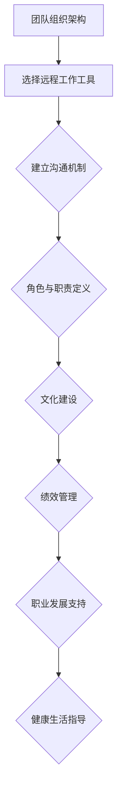

                 

### 文章标题：如何打造高效的远程工作团队与文化

关键词：远程工作、团队构建、团队文化、高效工作、绩效管理

摘要：随着数字化时代的到来，远程工作已成为企业发展的新趋势。本文将从团队构建、文化建设、高效工作方法等多个方面，详细探讨如何打造一支高效能的远程工作团队，助力企业在数字化转型中保持竞争力。

### 引言

远程工作，作为一种灵活的工作模式，正在全球范围内迅速兴起。它不仅为员工提供了更大的自由度和灵活性，还为企业带来了降低成本、提高员工满意度等多重益处。然而，远程工作的兴起也带来了诸多挑战，如沟通障碍、团队凝聚力下降、工作效率降低等。为了应对这些挑战，企业需要建立一套高效能的远程工作团队与文化。本文将围绕以下几个方面展开讨论：

1. 远程工作概述
2. 远程团队的基础建设
3. 远程团队成员的角色与职责
4. 远程团队的协作与沟通
5. 远程团队的文化建设
6. 高效远程工作方法
7. 远程团队的绩效管理
8. 远程工作与职业发展
9. 远程工作与健康生活
10. 远程工作案例分析
11. 远程工作面临的挑战与解决方案
12. 远程工作资源指南
13. 远程团队流程图与算法伪代码
14. 数学模型与公式

通过以上讨论，本文旨在为企业管理者提供一套系统的远程工作团队建设方案，帮助企业克服远程工作带来的挑战，实现团队的高效能运作。

#### # 第一部分：远程工作团队构建

在当今全球化的工作环境中，远程工作团队的建设成为了许多企业关注的焦点。这一部分将详细探讨远程工作的兴起与挑战、远程工作的定义与类型、以及远程工作对团队文化的影响，为后续内容的深入分析奠定基础。

##### 1. 远程工作的兴起与挑战

远程工作的兴起可以追溯到互联网技术的飞速发展。从早期的电子邮件、即时通讯工具，到今天的视频会议、在线协作平台，技术的进步极大地推动了远程工作的普及。尤其在2020年全球新冠疫情爆发后，远程工作更是成为了许多企业应对危机的一种有效手段。根据一项调查显示，超过70%的企业在疫情期间采用了远程工作模式，其中超过一半的企业计划在疫情结束后继续推行远程工作。

然而，远程工作也带来了一系列的挑战。首先，沟通障碍是远程工作面临的首要问题。由于地理位置和时区的差异，团队成员之间的沟通变得更加复杂。其次，团队凝聚力下降也是一个普遍现象。远程工作使得团队成员之间的互动减少，团队协作变得困难。此外，工作效率降低、项目管理难度增加等问题也给企业带来了困扰。

##### 1.2 远程工作的定义与类型

远程工作，顾名思义，是指员工在不同地点进行工作，通过网络和其他通讯技术进行协作。根据远程工作的具体形式，可以将其分为以下几种类型：

1. **在家办公**：这是最常见的远程工作形式，员工在家中通过电脑、手机等设备完成工作任务。

2. **移动办公**：员工可以在任何有网络的地方进行工作，如咖啡馆、机场、酒店等。

3. **远程协作**：多个团队成员分布在不同的地点，通过在线协作工具共同完成项目。

4. **虚拟团队**：团队成员通过虚拟团队平台进行交流、协作，无需面对面交流。

5. **分布式团队**：团队由多个成员组成，成员分布在不同国家或地区。

不同的远程工作形式适用于不同的工作场景和需求。例如，在家办公适用于那些不需要太多面对面沟通的工作，如编程、文案撰写等；而虚拟团队和分布式团队则适用于需要跨地域协作的项目。

##### 1.3 远程工作对团队文化的影响

远程工作对团队文化的影响是深远而复杂的。一方面，远程工作有助于团队文化的多样性。来自不同背景、文化、地域的员工可以更加自由地表达自己的观点和想法，促进了团队的创新和创造力。另一方面，远程工作也带来了团队文化的一致性挑战。由于缺乏面对面的互动，团队成员之间可能缺乏共同的经历和体验，导致文化认同感降低。

此外，远程工作还可能影响团队成员的工作态度和行为。一些员工可能会因为缺乏监督和互动而出现工作效率下降、拖延等问题。而另一些员工则可能因为更加自主和自由的工作环境而表现出更高的工作积极性和创造力。

总之，远程工作既带来了机遇，也带来了挑战。企业需要认识到远程工作的复杂性和多样性，制定相应的策略和措施，以促进远程工作团队的高效运作和团队文化的健康发展。

#### # 第二部分：远程团队的基础建设

构建一个高效的远程工作团队不仅仅是选择合适的地理位置和工具，更重要的是建立一个坚实的组织架构、选择合适的远程工作工具、并建立有效的沟通机制。以下内容将详细探讨这些关键要素。

##### 2.1 远程团队的组织架构

远程团队的组织架构设计需要考虑到地理位置的分散性、团队成员的专业技能和职责分工。一个成功的远程团队通常采用以下几种组织架构模式：

1. **职能型组织**：按照员工的职能和技能进行分组，每个部门负责特定的任务。这种模式有利于专业技能的集中和资源的最优配置。

2. **项目型组织**：以项目为导向，团队成员根据项目的需求临时组成。项目完成后，团队成员重新分配。这种模式适合灵活性和快速响应能力要求较高的项目。

3. **矩阵型组织**：结合职能型和项目型组织的优点，团队成员既属于某个职能部门，又参与特定的项目。这种模式在需要跨部门协作的项目中表现尤为突出。

在组织架构设计时，需要明确每个团队成员的角色和职责，确保团队成员在远程环境中也能清晰了解自己的任务和期望。例如，项目经理负责项目的整体规划和进度控制，技术专家负责技术解决方案的制定，而支持团队则负责项目管理、文档整理和沟通协调等任务。

##### 2.2 远程工作工具的选择与使用

远程工作的成功离不开一系列高效的工具和平台的支撑。选择合适的远程工作工具是基础建设的重要一环。以下是一些关键的远程工作工具：

1. **协作工具**：如Slack、Microsoft Teams等，用于日常沟通、任务分配和文件共享。

2. **项目管理工具**：如Trello、Asana等，帮助团队跟踪项目进度、分配任务和管理资源。

3. **视频会议工具**：如Zoom、Google Meet等，用于远程会议、在线培训、团队讨论等。

4. **时间跟踪工具**：如Toggl、Harvest等，帮助团队成员记录工作时间，提高工作效率。

5. **文档管理工具**：如Google Docs、Microsoft Office 365等，支持多人实时编辑和协作。

在工具的选择上，需要考虑团队的规模、工作性质、预算等因素。例如，小型团队可能更适合使用免费或低成本的工具，而大型团队可能需要更高级的功能和更大的存储空间。此外，工具的易用性和兼容性也是选择时的重要考虑因素。

##### 2.3 远程团队的基础沟通机制

有效的沟通是远程团队协作成功的关键。建立一套基础沟通机制，确保团队成员能够及时、准确地交流信息，对远程团队的运作至关重要。以下是一些构建基础沟通机制的建议：

1. **明确沟通渠道**：确定主要沟通渠道，如电子邮件、即时通讯、项目管理工具、视频会议等。每个渠道应具有明确的用途和优先级。

2. **定期会议**：制定定期的团队会议和项目会议日程，确保团队成员能够保持同步。例如，每周一次的团队状态更新会议和每月一次的项目进展会议。

3. **即时沟通**：对于紧急或需要即时响应的问题，应使用即时通讯工具进行沟通，确保信息传达的及时性和高效性。

4. **文档共享**：建立文档管理机制，确保所有团队成员都能访问到最新的文档和资料。使用云存储和协同编辑工具，如Google Docs或Microsoft Teams的文档功能。

5. **沟通规范**：制定沟通规范，包括邮件格式、会议礼仪、信息共享流程等，确保团队成员在沟通中的行为一致。

通过建立合适的组织架构、选择高效的远程工作工具、并制定明确的沟通机制，远程团队可以更好地应对远程工作的挑战，实现高效协作和团队目标。接下来的部分将继续探讨远程团队成员的角色与职责，以及如何提升团队的协作与沟通效能。

##### 3. 远程团队成员的角色与职责

在远程团队中，明确每个成员的角色和职责是确保团队高效运作的基础。以下将详细讨论管理者与团队成员的角色定位、成功远程团队成员的特质，以及管理者的领导风格与远程工作。

**3.1 管理者与团队成员的角色定位**

远程团队的管理者和普通团队成员在职责上有所不同，但其目标都是确保团队的协调运作和项目的成功。

**管理者**的角色通常包括：
- **项目规划**：明确项目目标、里程碑和交付物。
- **资源分配**：根据项目需求合理分配团队成员的工作任务。
- **沟通协调**：确保团队成员之间的沟通畅通无阻，解决潜在问题。
- **绩效管理**：监控团队成员的工作进度，提供反馈和指导。
- **团队建设**：维护团队凝聚力，推动团队文化的发展。

**团队成员**的角色则主要集中在：
- **任务执行**：完成分配给自己的任务，确保质量与进度。
- **协作参与**：积极参与团队讨论，贡献自己的想法和意见。
- **自我管理**：自我驱动，合理规划工作时间，保证工作效率。
- **问题反馈**：及时汇报工作中遇到的问题，寻求解决方案。

在远程环境中，管理者与团队成员的角色定位更为关键。由于缺乏面对面的交流，管理者需要通过有效的沟通和监督来确保团队目标的实现。团队成员则需要更加自律，主动承担责任和任务。

**3.2 成功远程团队成员的特质**

成功远程团队成员通常具备以下特质：

1. **自我驱动**：远程工作环境对自律和自我管理的要求较高。成功团队成员能够自我驱动，保持高效的工作状态。

2. **沟通能力**：远程团队依赖文字和虚拟会议进行交流，良好的沟通能力尤为重要。成功团队成员能够清晰、准确地表达自己的想法和需求。

3. **适应能力**：远程工作环境多变，成功团队成员需要具备快速适应新工具、新流程和新环境的能力。

4. **时间管理能力**：远程工作往往需要团队成员自主安排工作时间。成功团队成员能够合理安排时间，确保任务按时完成。

5. **技术熟练度**：熟悉并擅长使用远程工作工具，如协作平台、项目管理工具、视频会议工具等，能够提高工作效率。

6. **问题解决能力**：远程团队成员往往需要独立解决工作中遇到的问题，成功团队成员具备较强的分析和解决问题的能力。

7. **团队协作精神**：远程工作团队成员之间的协作更加依赖虚拟沟通，成功团队成员能够积极参与团队讨论，共同推动项目进展。

**3.3 管理者的领导风格与远程工作**

在远程环境中，管理者的领导风格对团队文化和工作氛围有着深远的影响。以下是一些适用于远程工作的领导风格：

1. **授权型领导**：远程团队成员通常具备较高的自主性和责任感，授权型领导能够给予团队成员更多的自由和信任，激发他们的创新和积极性。

2. **参与型领导**：参与型领导鼓励团队成员参与决策过程，增强团队凝聚力和归属感。在远程工作中，通过在线会议和协作平台，管理者可以与团队成员进行充分讨论，共同制定目标和计划。

3. **支持型领导**：支持型领导关注团队成员的福祉和发展，提供必要的资源和指导。远程工作中，管理者可以通过定期的一对一会议、在线培训等方式，支持团队成员提升技能和解决问题。

4. **透明型领导**：透明型领导确保团队内部信息的透明度，使团队成员了解项目的进展、问题和决策。通过共享项目进度报告、任务分配和团队目标，管理者可以增强团队的透明度和信任。

5. **灵活型领导**：远程工作环境变化多端，灵活型领导能够根据实际情况灵活调整工作安排和策略，适应不断变化的需求。

总之，远程团队成员的角色与职责、成功远程团队成员的特质以及管理者的领导风格都是构建高效远程团队的关键要素。通过明确角色定位、培养成功团队成员的特质、采用合适的领导风格，远程团队可以克服挑战，实现高效协作和持续发展。

#### # 第四部分：远程团队的协作与沟通

在远程工作环境中，协作与沟通的效率和效果是决定团队成功与否的关键因素。有效协作与沟通不仅能够提升工作效率，还能增强团队凝聚力和整体效能。以下内容将详细探讨远程团队协作的最佳实践、高效的远程沟通策略，以及远程团队如何应对冲突。

**4.1 远程团队协作的最佳实践**

远程团队的协作需要依赖一系列工具和策略，以确保信息的流畅传递和任务的顺利执行。以下是一些最佳实践：

1. **定期团队会议**：定期举行团队会议是保持团队成员同步的重要手段。这些会议可以涵盖项目进展、问题讨论、决策制定等内容。通过视频会议工具，如Zoom、Microsoft Teams等，团队成员可以实时交流，增强团队凝聚力。

2. **明确任务分工**：在项目启动阶段，明确每个团队成员的任务和职责，并使用项目管理工具，如Trello、Asana等，将任务分配和进度跟踪可视化。这有助于团队成员了解自己的角色，确保任务按时完成。

3. **共享文档和资源**：使用云存储和协作工具，如Google Drive、OneDrive、GitHub等，共享文档和资源。团队成员可以实时编辑和更新文件，避免版本冲突和信息滞后。

4. **沟通渠道标准化**：为不同类型的沟通设置明确的渠道，例如使用电子邮件处理正式沟通，即时通讯工具处理紧急事务，项目管理工具跟踪任务进展。这样，团队成员可以快速找到所需信息，提高工作效率。

5. **及时反馈和反馈机制**：建立及时反馈机制，确保团队成员能够及时获得反馈，改进工作。通过在线工具，如Slack的反馈功能、Trello的评论功能等，团队成员可以方便地提供和接收反馈。

6. **利用协作工具的集成功能**：许多协作工具都提供了集成功能，如日历同步、任务提醒、通知推送等。这些功能有助于团队成员更好地管理时间，避免遗漏重要任务。

**4.2 高效的远程沟通策略**

为了确保远程沟通的高效，团队需要制定并遵循一系列策略。以下是一些高效沟通策略：

1. **明确沟通目标**：每次沟通前，明确沟通的目标和预期结果。这有助于团队成员集中注意力，避免不必要的讨论和浪费时间。

2. **使用简洁明了的语言**：在书面沟通中，使用简洁明了的语言和格式，避免使用复杂的技术术语和冗长的句子。这样可以提高信息的传递效率，减少误解。

3. **使用多种沟通方式**：结合使用文字、语音、视频等多种沟通方式，以满足不同团队成员的偏好和需求。例如，对于复杂的问题，可以使用视频会议进行讨论，而对于简单的事务，可以通过即时通讯工具进行交流。

4. **建立沟通反馈机制**：确保团队成员能够及时收到反馈，并根据反馈调整沟通策略。通过定期的沟通反馈会议，团队成员可以分享彼此的沟通经验和建议，优化沟通流程。

5. **避免信息过载**：在沟通中，避免过多的信息和会议，以免造成信息过载。通过筛选重要信息，确保团队成员能够专注于关键任务。

6. **培养沟通文化**：建立一种开放、透明、尊重的沟通文化，鼓励团队成员表达自己的想法和意见，建立信任和合作关系。

**4.3 远程团队如何应对冲突**

冲突在任何团队中都是不可避免的，远程团队也不例外。以下是一些应对远程团队冲突的策略：

1. **及时识别冲突**：建立一套冲突识别机制，如定期的团队状态更新会议，帮助团队成员及时了解彼此的观点和需求，避免潜在冲突的积累。

2. **积极沟通**：一旦冲突发生，应立即进行积极沟通，找到冲突的根本原因。使用线上沟通工具，如视频会议或即时通讯，确保双方能够充分表达自己的观点。

3. **保持冷静和客观**：在处理冲突时，保持冷静和客观，避免情绪化。通过理性分析和讨论，找到解决问题的方法。

4. **寻求第三方帮助**：如果冲突难以解决，可以寻求第三方帮助，如团队领导或专业的冲突调解人员。第三方中立者的介入有助于缓解紧张气氛，提供客观的解决方案。

5. **制定解决方案**：在沟通和讨论的基础上，制定明确的解决方案，并确保所有相关方都同意并遵守。

6. **跟踪和评估**：在冲突解决后，跟踪解决方案的实施效果，并进行评估和反馈。这有助于持续改进沟通和冲突解决机制。

通过最佳协作实践、高效沟通策略和有效的冲突管理，远程团队可以克服沟通和协作的障碍，实现高效能的工作和团队发展。在接下来的部分，我们将探讨远程团队的文化建设，以及如何塑造和维护远程团队的文化。

#### # 第五部分：远程团队的文化建设

远程团队的文化建设是确保团队长期稳定发展和高效协作的关键。在这一部分，我们将深入探讨远程团队文化的核心要素、如何塑造和维护远程团队文化，以及如何评估和改进远程团队文化。

**5.1 远程团队文化的核心要素**

远程团队文化不同于传统团队文化，其核心要素包括以下几点：

1. **信任**：信任是远程团队文化的基石。由于团队成员之间缺乏面对面的互动，建立信任显得尤为重要。通过透明沟通、明确期望和信任机制，可以增强团队成员之间的信任。

2. **透明度**：远程团队文化强调信息的透明度。团队成员应能够及时获取项目的进展、决策过程和团队目标等信息，从而确保团队的整体协调和一致性。

3. **灵活性**：远程工作环境多变，灵活性是远程团队文化的重要组成部分。团队需要适应不同的工作安排、任务分配和沟通方式，确保工作的高效进行。

4. **开放性**：远程团队文化鼓励开放和包容的氛围，允许团队成员自由表达自己的想法和意见。这种开放性有助于团队的创新和创造力。

5. **尊重**：尊重是团队文化的核心。团队成员应尊重彼此的观点、工作风格和文化背景，建立相互尊重和信任的关系。

**5.2 远程团队文化的塑造与维护**

塑造和维护远程团队文化需要从多个方面入手，以下是一些建议：

1. **建立共同价值观**：制定一套共同的价值观和使命，明确团队的愿景和目标。这些价值观应成为团队成员行为的指导原则，帮助团队在远程环境中保持一致性和凝聚力。

2. **领导者的示范作用**：领导者是塑造团队文化的关键。通过自身的言行，领导者可以树立榜样，推动团队文化的建设。领导者应倡导透明沟通、尊重他人和灵活性等价值观。

3. **定期的团队活动**：通过定期的团队活动，如线上会议、虚拟团队建设活动、团队节日庆祝等，增强团队成员之间的互动和联系，提高团队凝聚力。

4. **文化宣传与传播**：通过内部通讯、团队博客、社交媒体等渠道，宣传和传播团队文化，确保所有成员都了解并认同团队文化。

5. **反馈与激励**：建立反馈机制，鼓励团队成员分享对团队文化的看法和建议。同时，通过激励措施，如表彰优秀团队成员、提供职业发展机会等，增强团队成员对团队文化的认同和归属感。

6. **文化适应与调整**：随着团队和外部环境的变化，团队文化也需要不断适应和调整。定期评估团队文化，识别文化中的问题和挑战，并采取相应的措施进行改进。

**5.3 远程团队文化的评估与改进**

评估和改进远程团队文化是确保其持续健康发展的关键。以下是一些评估和改进的方法：

1. **问卷调查**：通过问卷调查，了解团队成员对团队文化的看法和满意度。问卷可以包括开放性和封闭性问题，以获取全面的反馈。

2. **关键绩效指标（KPIs）**：制定与团队文化相关的关键绩效指标，如团队协作效率、员工满意度、项目成功率等。通过定期跟踪这些指标，评估团队文化的效果。

3. **员工访谈**：与团队成员进行一对一访谈，了解他们对团队文化的真实感受和建议。访谈可以提供更深入、具体的反馈，帮助识别问题。

4. **案例分析**：分析团队在项目中的成功和失败案例，探讨文化因素对项目结果的影响。通过案例分析，可以识别团队文化中的优点和不足。

5. **外部评估**：邀请外部专家或顾问对团队文化进行评估，提供客观、专业的意见和建议。

6. **持续改进**：基于评估结果，制定改进计划并实施。通过定期的评估和改进，确保团队文化始终保持活力和适应性。

通过深入探讨远程团队文化的核心要素、塑造与维护方法以及评估与改进策略，企业可以打造出一支具有强大凝聚力、高效协作能力的远程团队，为企业的持续发展提供强有力的支持。

#### # 第六部分：高效远程工作方法

在远程工作环境中，提高工作效率和质量是团队成功的关键。这一部分将详细探讨高效远程工作的技巧、常用的远程工作工具和技术，以及灵活的工作制度与安排。

**6.1 时间管理技巧**

时间管理是远程工作中至关重要的一环，以下是一些有效的时间管理技巧：

1. **设定明确的任务目标**：在每天或每周开始时，明确当天的任务目标。使用任务管理工具，如Trello或Asana，将任务分解为具体的小任务，并设定优先级。

2. **使用时间跟踪工具**：使用时间跟踪工具，如Toggl或RescueTime，记录每天的工作时间，了解时间的分布和消耗情况，从而优化工作计划。

3. **制定日程安排**：合理规划每天的工作日程，包括固定的休息时间、任务执行时间等。确保工作与休息时间的平衡，避免疲劳和效率下降。

4. **避免干扰**：在工作时避免不必要的干扰，如关闭社交媒体通知、设定工作时段等。使用专注工具，如Forest或Focus@Will，帮助保持专注。

5. **定期回顾与调整**：定期回顾时间管理策略的效果，并根据实际情况进行调整。通过反思和改进，不断提升时间管理能力。

**6.2 远程工作的高效工具与技术**

高效的远程工作离不开一系列工具和技术的支持，以下是一些常用的工具：

1. **协作工具**：协作工具如Slack、Microsoft Teams和Zoom，用于团队沟通、任务分配和视频会议。这些工具提供了实时沟通、文件共享和通知推送等功能。

2. **项目管理工具**：项目管理工具如Trello、Asana和Jira，用于项目规划、任务分配和进度跟踪。这些工具提供了任务列表、看板视图和甘特图等功能，帮助团队更好地管理项目。

3. **文档管理工具**：文档管理工具如Google Drive、Microsoft OneDrive和Dropbox，用于存储、共享和协作编辑文档。这些工具提供了版本控制、权限管理和实时协作功能。

4. **时间管理工具**：时间管理工具如Toggl、Harvest和RescueTime，用于记录工作时间、生成报告和优化时间分配。这些工具可以帮助团队成员更好地管理时间和提高工作效率。

5. **视频会议工具**：视频会议工具如Zoom、Microsoft Teams和Google Meet，用于远程团队会议、培训和讨论。这些工具提供了高清视频、音频和屏幕共享功能，确保远程沟通的流畅和高效。

**6.3 灵活的工作制度与安排**

灵活的工作制度与安排是适应远程工作环境的重要措施，以下是一些策略：

1. **弹性工作时间**：为团队成员提供弹性工作时间，允许他们在特定的工作时间内自由安排工作时间。这有助于提高工作满意度，并确保工作效率。

2. **远程工作日**：定期安排远程工作日，让团队成员在家中或任何其他地方工作。这有助于减少通勤时间，提高工作效率和生活质量。

3. **远程协作会议**：定期召开远程协作会议，确保团队成员之间的沟通和同步。这些会议可以涵盖项目进展、问题讨论和决策制定等。

4. **自主管理**：鼓励团队成员自主管理自己的工作和时间，提高自我驱动能力。通过设立明确的任务目标和里程碑，确保团队成员能够自我监督和自我调整。

5. **灵活的工作地点**：允许团队成员在不同地点工作，如家中、咖啡馆或共享办公空间。这有助于提高员工的灵活性和适应性。

通过以上高效远程工作技巧、工具和灵活的工作制度与安排，远程团队可以更好地应对远程工作的挑战，实现高效协作和持续发展。在下一部分，我们将探讨远程团队的绩效管理。

#### # 第七部分：远程团队的绩效管理

远程团队的绩效管理是一个复杂而关键的过程，它不仅关系到团队成员的个人发展，也直接影响到团队的整体效能和企业的成功。本部分将详细探讨远程绩效管理的挑战与解决方案，如何设计KPIs与远程团队绩效指标，以及如何进行绩效评估与反馈。

**7.1 远程绩效管理的挑战与解决方案**

远程工作环境带来了许多绩效管理的挑战：

1. **监督难度**：由于团队成员分布在不同的地点，传统的面对面监督变得不再可行。这增加了管理者对团队成员工作的监督难度。

   **解决方案**：利用远程工作工具和技术，如时间跟踪工具、项目管理工具和绩效评估软件，管理者可以实时监控团队成员的工作进度和效率。此外，通过设定明确的任务目标和里程碑，确保团队成员有明确的工作方向和进度。

2. **沟通障碍**：远程工作可能导致团队成员之间的沟通不畅，影响信息的传递和任务的协调。

   **解决方案**：建立一套有效的沟通机制，包括定期的团队会议、即时通讯工具和文档共享平台。确保团队成员能够及时获取项目进展、问题和决策等信息，减少沟通障碍。

3. **工作环境和效率**：不同的团队成员可能面临不同的工作环境和干扰因素，影响工作效率。

   **解决方案**：鼓励团队成员创建适合自己的工作环境，如制定个人工作计划、设定工作时段等。同时，提供必要的资源和工具，帮助团队成员提高工作效率。

4. **文化适应**：远程工作可能导致团队成员之间的文化差异和沟通障碍。

   **解决方案**：培养一种包容和尊重的文化，鼓励团队成员分享不同的观点和经验，促进跨文化沟通和协作。

**7.2 KPIs与远程团队绩效指标的设计**

设计合适的KPIs和绩效指标是远程绩效管理的核心。以下是一些建议：

1. **量化和具体的KPIs**：设定量化和具体的KPIs，如任务完成率、项目按时交付率、质量指标等。这些指标应与团队和企业的目标一致，确保团队成员的工作与整体战略相匹配。

2. **绩效指标的可测量性**：确保绩效指标具有可测量性，可以使用工具和数据进行量化分析。例如，使用项目管理工具跟踪任务进度，使用时间跟踪工具记录工作时间。

3. **动态调整**：远程工作环境多变，绩效指标也应根据实际情况进行调整。定期评估和更新绩效指标，确保其与团队和企业的目标保持一致。

4. **个体和团队相结合**：设计KPIs时，既要考虑个人绩效，也要考虑团队绩效。个人绩效指标如任务完成率、工作质量，团队绩效指标如项目成功交付率、团队协作效率等。

**7.3 远程团队的绩效评估与反馈**

有效的绩效评估和反馈是确保团队成员持续改进和团队高效运作的关键。以下是一些关键步骤：

1. **定期评估**：制定定期的绩效评估计划，如季度或年度评估。评估内容应涵盖KPIs、工作表现、团队合作等多个方面。

2. **多角度反馈**：绩效评估应从多个角度获取反馈，包括团队成员的自评、同事评价、上级评价等。综合这些反馈，形成全面的评估结果。

3. **明确反馈方式**：使用多种反馈方式，如书面反馈、口头反馈、一对一会议等。确保反馈清晰、具体、有建设性。

4. **改进措施**：根据绩效评估结果，制定改进措施，帮助团队成员提升绩效。这些措施可以是培训、指导、资源支持等。

5. **持续反馈与沟通**：绩效评估不仅是一次性的过程，而是一个持续的过程。定期与团队成员进行沟通，了解他们的进展和需求，提供持续的支持和反馈。

通过有效的远程绩效管理，企业可以确保团队成员的工作效能和团队的整体运作，实现企业的长期战略目标。在下一部分，我们将探讨远程工作对职业发展的影响以及如何进行职业规划。

#### # 第八部分：远程工作与职业发展

远程工作作为一种灵活的工作模式，对职业发展产生了深远的影响。本部分将探讨远程工作对职业发展的影响、如何进行职业规划，以及远程工作的职场竞争力。

**8.1 远程工作对职业发展的影响**

远程工作为职业发展带来了新的机遇和挑战：

**机遇：**
1. **更广阔的就业机会**：远程工作打破了地理位置的限制，为求职者提供了更多选择。无论是跨国企业还是初创公司，都可以在全球范围内招募优秀人才。

2. **职业发展的灵活性**：远程工作允许员工更灵活地安排工作和生活，有助于平衡职业和个人生活，提高生活质量和职业满意度。

3. **技能提升和自我发展**：远程工作促使员工自主学习和掌握新技能，通过在线课程、研讨会和自我实践不断提升自己的专业能力。

**挑战：**
1. **职业发展路径的不确定性**：远程工作可能缺乏明确的晋升路径和职业发展机会，特别是在大型企业中，晋升机会可能受限。

2. **团队互动和人际网络的限制**：远程工作减少了与同事和上级面对面交流的机会，可能影响人际网络的建设和职业关系的培养。

3. **自我驱动和自律的要求**：远程工作需要更高的自我驱动和自律能力，对于某些人来说，可能面临工作效率降低和职业发展瓶颈。

**8.2 远程工作的职业规划**

为了在远程工作中实现职业发展，员工需要制定清晰的职业规划，并采取以下策略：

1. **设定明确的职业目标**：明确自己的职业目标，包括短期和长期的职业发展目标。这些目标应与个人兴趣、优势和市场需求相匹配。

2. **持续学习和技能提升**：利用远程工作的时间和资源，积极参与在线学习和培训，提升专业技能和知识储备。例如，通过参加在线课程、获得专业认证等，增强自己的竞争力。

3. **建立人际网络**：虽然远程工作减少了面对面交流的机会，但通过社交媒体、在线论坛和行业活动，仍然可以建立和扩展人际网络。积极参与行业讨论、分享经验和知识，扩大职业影响力。

4. **主动寻求职业发展机会**：积极与上级和同事沟通，了解团队和公司的职业发展机会。通过参与重大项目、提出创新想法和贡献，提升自己在团队中的价值，增加晋升机会。

5. **灵活调整职业规划**：远程工作环境多变，职业规划也需要灵活调整。定期评估职业目标和进展，根据实际情况调整策略和目标。

**8.3 远程工作的职场竞争力**

要提升远程工作的职场竞争力，员工需要从以下几个方面入手：

1. **专业技能**：掌握相关领域的专业技能和知识，成为行业内的专家。通过不断学习和实践，提升自己的技术能力和解决问题的能力。

2. **沟通能力**：远程工作依赖文字和虚拟沟通，良好的沟通能力尤为重要。提升书面和口头表达能力，确保信息传达准确和高效。

3. **自我管理能力**：远程工作需要高度的自我驱动和自律能力。学会时间管理，合理安排工作和休息时间，保持高效的工作状态。

4. **适应能力**：远程工作环境多变，需要具备快速适应新工具、新流程和新环境的能力。保持开放的心态，积极面对变化和挑战。

5. **团队合作精神**：远程团队依赖协作和沟通，培养团队合作精神，积极参与团队讨论和项目合作，提高团队的整体效能。

通过有效的职业规划和提升职场竞争力，远程工作者可以在职业发展中取得显著成就，实现个人价值和职业目标的实现。

#### # 第九部分：远程工作与健康生活

在远程工作环境中，保持健康的生活方式对于提高工作效率和幸福感至关重要。本部分将探讨远程工作与心理健康、健康生活方式在远程工作中的实践，以及如何实现家庭与工作的平衡。

**9.1 远程工作与心理健康**

远程工作虽然带来了灵活性和自由度，但也可能导致一些心理健康问题，如：

1. **孤独感**：由于缺乏面对面的交流和互动，远程工作者可能会感到孤独和孤立。

2. **压力增加**：远程工作可能导致工作与生活的界限模糊，使工作压力转化为心理压力。

3. **缺乏运动**：远程工作可能减少外出活动的机会，导致缺乏运动，影响身体健康。

4. **睡眠质量下降**：不规律的工作时间和工作压力可能导致睡眠质量下降，影响身心健康。

为了应对这些心理健康问题，远程工作者可以采取以下措施：

1. **建立社交网络**：利用社交媒体、在线论坛和虚拟团队活动，与同事和业界人士保持联系，增强社交互动。

2. **定期休息和放松**：合理安排工作时间和休息时间，确保有足够的休息和放松时间，缓解工作压力。

3. **保持运动习惯**：定期进行身体锻炼，如跑步、瑜伽、健身等，提高身体素质，缓解工作压力。

4. **睡眠管理**：保持良好的睡眠习惯，如固定的睡眠时间、舒适的睡眠环境等，提高睡眠质量。

5. **心理健康支持**：企业可以提供心理健康支持和咨询服务，帮助远程工作者应对心理健康问题。

**9.2 健康生活方式在远程工作中的实践**

为了在远程工作中保持健康的生活方式，以下是一些具体建议：

1. **合理规划工作时间和休息时间**：制定工作计划和休息计划，确保工作与休息时间平衡，避免过度劳累。

2. **保持规律的作息时间**：尽量保持固定的作息时间，如每天固定的工作时间和休息时间，有助于培养良好的作息习惯。

3. **工作环境优化**：保持工作环境的整洁和舒适，如保持桌面整洁、调整办公椅高度等，提高工作效率。

4. **饮食健康**：注重饮食健康，保持均衡的饮食结构，避免过度依赖外卖和快餐。

5. **定期体检**：定期进行身体检查，了解自己的健康状况，预防潜在的健康问题。

**9.3 远程工作者的家庭与生活平衡**

远程工作使员工能够更好地平衡工作和生活，但也需要一定的策略和技巧：

1. **设定工作边界**：明确工作和生活的界限，避免工作侵占个人时间，确保有足够的时间陪伴家人和进行个人活动。

2. **灵活的工作安排**：与家人协商，合理安排工作时间和家庭时间，确保有足够的时间陪伴家人。

3. **培养家庭支持系统**：建立家庭支持系统，与家人沟通并取得他们的理解和支持，共同应对工作与家庭的挑战。

4. **培养兴趣爱好**：培养兴趣爱好，如阅读、绘画、运动等，丰富个人生活，提高生活质量。

5. **保持积极心态**：保持积极的心态，对待工作和生活的态度，学会调整和应对各种挑战。

通过关注心理健康、保持健康生活方式，以及实现家庭与工作的平衡，远程工作者可以更好地应对远程工作的挑战，提高工作效率和生活质量。

#### # 第十部分：远程工作案例分析

远程工作模式在全球范围内的普及，使得越来越多的企业开始尝试并实施远程工作策略。以下我们将通过三个成功远程工作团队的案例分析，探讨他们在远程工作实践中采取的措施和经验，以供其他企业参考。

**10.1 案例一：XX公司的远程工作实践**

XX公司是一家全球知名的技术公司，其远程工作实践具有以下几个亮点：

1. **明确的目标和价值观**：XX公司在实施远程工作策略之初，就明确了自己的目标和价值观，如注重创新、客户导向和团队合作。这些价值观成为公司文化的重要组成部分，并贯穿于远程工作实践中。

2. **灵活的工作安排**：公司提供了高度灵活的工作安排，允许员工根据个人需求和工作效率选择在家办公、移动办公或混合办公模式。这不仅提高了员工的满意度和工作效率，还增强了团队凝聚力。

3. **强大的协作工具**：公司采用了一系列强大的协作工具，如Slack、Trello和Zoom，确保团队成员能够高效沟通、任务分配和项目跟踪。这些工具使得远程团队协作变得更加顺畅和高效。

4. **定期团队互动**：公司定期组织团队活动，如线上会议、虚拟团队建设活动和培训课程，增强团队成员之间的互动和联系。这些活动不仅提高了团队的凝聚力，还促进了团队成员的技能提升。

**10.2 案例二：YY团队的成功经验**

YY团队是一个跨地域的软件开发团队，他们在远程工作实践中积累了丰富的经验：

1. **透明的沟通机制**：YY团队建立了透明的沟通机制，通过每周的团队状态更新会议和项目进度报告，确保团队成员能够及时了解项目进展和问题。这种透明的沟通有助于减少误解和冲突，提高了团队协作效率。

2. **明确的角色和职责**：团队成员在加入团队之初就明确了自己的角色和职责，这有助于提高团队成员的责任感和执行力。通过定期的角色和职责评估，团队可以不断调整和优化成员的分工。

3. **有效的绩效管理**：YY团队采用了KPI和绩效考核机制，定期评估团队成员的工作表现和绩效。这不仅激励了团队成员不断提升自己的工作能力，还帮助团队更好地识别和解决潜在问题。

4. **技术支持和服务**：团队提供了强大的技术支持和服务，确保团队成员在远程工作中能够快速解决技术问题。这种高效的技术支持和服务提升了团队的工作效率和满意度。

**10.3 案例三：ZZ企业的远程工作模式**

ZZ企业是一家专注于数字营销的初创企业，他们在远程工作模式中取得了显著的成功：

1. **灵活的人才招聘**：企业采用了灵活的人才招聘策略，通过全球范围内的招聘，吸引到了来自不同背景和文化的优秀人才。这种多元化的团队为企业的创新和创意提供了丰富的资源。

2. **定制化的培训计划**：企业为团队成员提供了定制化的培训计划，根据团队成员的需求和职业目标，提供技能提升和职业发展支持。这种个性化的培训计划有助于提升团队成员的专业能力和竞争力。

3. **激励和奖励机制**：企业建立了激励和奖励机制，通过绩效奖金、股权激励和职业晋升机会，激励团队成员为公司的发展贡献力量。这种激励机制不仅提高了员工的工作积极性，还增强了团队凝聚力。

4. **开放和包容的企业文化**：企业倡导开放和包容的企业文化，鼓励团队成员自由表达自己的观点和想法。这种文化氛围为团队成员提供了创造和创新的空间，促进了企业的持续发展。

通过以上案例分析，可以看出成功的远程工作团队在实践中采取了多种措施和策略，如明确的目标和价值观、灵活的工作安排、强大的协作工具、透明的沟通机制、有效的绩效管理、技术支持和服务、灵活的人才招聘、定制化的培训计划、激励和奖励机制以及开放和包容的企业文化等。这些措施和策略不仅提高了团队的工作效率和凝聚力，还为企业的长期发展奠定了坚实的基础。其他企业可以借鉴这些成功经验，根据自身实际情况制定适合的远程工作策略，实现远程工作的成功。

#### # 第十一部分：远程工作面临的挑战与解决方案

尽管远程工作带来了诸多优势，但它也伴随着一系列挑战。在这一部分，我们将深入探讨远程工作中常见的挑战，并提出相应的解决方案。

**11.1 远程工作常见问题分析**

1. **沟通障碍**：由于缺乏面对面交流，团队成员之间的沟通可能变得困难。这可能导致信息传达不准确、误解和协作效率低下。

2. **团队凝聚力下降**：远程工作环境可能使团队成员之间的联系减弱，导致团队凝聚力下降，影响团队协作和整体效能。

3. **工作效率降低**：一些员工可能难以在远程工作环境中保持高效率，尤其是在家庭环境中受到干扰时。

4. **项目管理难度增加**：远程项目需要更多的计划和协调，使得项目管理变得更加复杂。

5. **心理健康问题**：长时间远程工作可能导致心理健康问题，如孤独感、压力和睡眠障碍。

**11.2 面对远程工作挑战的解决方案**

1. **沟通策略**：
   - **实时沟通工具**：使用实时沟通工具，如Slack、Microsoft Teams和Zoom，确保团队成员能够及时交流。
   - **定期会议**：定期举行团队会议和项目会议，保持团队成员的同步和沟通。
   - **透明沟通**：鼓励团队成员公开表达观点，确保信息透明。

2. **团队凝聚力**：
   - **虚拟团队建设活动**：组织在线团队建设活动，如虚拟团队建设游戏、主题讨论等，增强团队凝聚力。
   - **共享目标和价值观**：确保所有团队成员都明确公司的目标和价值观，建立共同的目标感。

3. **工作效率**：
   - **时间管理技巧**：培训团队成员时间管理技巧，如使用时间跟踪工具、设定工作优先级等。
   - **灵活的工作制度**：提供灵活的工作安排，如弹性工作时间、远程工作日等，以适应不同团队成员的需求。

4. **项目管理**：
   - **项目管理工具**：使用项目管理工具，如Trello、Asana和Jira，确保项目进度的可视化和跟踪。
   - **明确的角色和职责**：确保每个团队成员都明确自己的角色和职责，提高协作效率。

5. **心理健康**：
   - **心理健康支持**：提供心理健康支持和咨询服务，如在线心理辅导、放松课程等。
   - **健康生活方式**：鼓励员工保持健康的生活方式，如定期锻炼、健康饮食和充足的休息。

**11.3 未来远程工作的发展趋势**

1. **技术进步**：随着技术的发展，远程工作工具将变得更加智能和高效，如人工智能辅助沟通、自动化任务管理等。

2. **混合工作模式**：未来远程工作模式可能趋向于混合工作模式，即远程工作和面对面工作的结合，以平衡灵活性和团队协作。

3. **远程工作标准化**：企业和政府可能会出台更多关于远程工作的政策和标准，以规范远程工作的操作和管理。

4. **持续的教育和培训**：企业和员工将持续关注远程工作的最佳实践和新兴趋势，通过教育和培训不断提升远程工作的效能。

通过识别和分析远程工作中面临的挑战，并采取有效的解决方案，企业可以更好地应对远程工作的挑战，实现团队的高效协作和持续发展。

### 附录：远程工作资源指南

为了帮助企业和个人更好地应对远程工作带来的挑战，本部分将提供一些重要的远程工作工具、相关书籍与资料，以及远程工作社区与交流平台。

**12.1 主要远程工作工具与应用**

1. **协作工具**：
   - **Slack**：一个高效的即时通讯工具，支持团队聊天、文件共享和集成第三方服务。
   - **Microsoft Teams**：微软推出的集成通信和协作平台，包括聊天、视频会议、文档协作等功能。
   - **Zoom**：提供高清视频会议和屏幕共享功能，适用于在线培训和团队讨论。

2. **项目管理工具**：
   - **Trello**：一个基于看板的任务管理工具，简单直观，适合团队协作。
   - **Asana**：一个全面的任务和项目跟踪工具，支持任务分配、进度跟踪和自动化工作流程。
   - **Jira**：适用于软件开发团队的敏捷项目管理工具，支持迭代规划和缺陷跟踪。

3. **文档管理工具**：
   - **Google Drive**：谷歌提供的云存储和协作工具，支持多人实时编辑文档。
   - **OneDrive**：微软提供的个人和企业级云存储解决方案。
   - **Dropbox**：一个广泛使用的云存储服务，支持文件同步和共享。

4. **时间跟踪工具**：
   - **Toggl**：一个简单易用的时间跟踪工具，适合个人和团队管理时间。
   - **Harvest**：一个专业的计时和项目管理工具，提供详细的报告和预算控制功能。
   - **RescueTime**：一个监控工作时间和活动，帮助提高工作效率。

5. **视频会议工具**：
   - **Zoom**：提供高质量的在线会议和协作功能，适用于远程工作团队。
   - **Google Meet**：谷歌提供的免费视频会议工具，支持多人在线会议。
   - **WebEx**：思科提供的在线协作平台，支持视频会议、虚拟培训和协作功能。

**12.2 远程工作相关书籍与资料**

1. **《远程工作的艺术》**：作者Jason Fried，介绍了如何有效进行远程工作，提供了实用的策略和技巧。
2. **《团队协作工具》**：作者Jeanne Bliss，详细介绍了多种团队协作工具的使用方法，帮助团队提高协作效率。
3. **《远程工作的未来》**：作者Jason J. Hamilton，探讨了远程工作的发展趋势和未来方向，为企业和个人提供指导。
4. **《远程团队管理指南》**：作者Jody Thompson，提供了远程团队管理的最佳实践和策略，帮助管理者更好地管理远程团队。

**12.3 远程工作社区与交流平台**

1. **远程工作论坛**：一个为远程工作者提供交流和分享经验的在线社区，涵盖远程工作的各个方面。
2. **远程工作社群**：一些企业和组织建立的远程工作社群，成员可以交流远程工作的经验、资源和最佳实践。
3. **远程工作博客**：一些专业博客和网站，定期发布关于远程工作的文章、案例分析和技术分享，为远程工作者提供有价值的信息。

通过使用这些工具、书籍和社区，企业和个人可以更好地应对远程工作带来的挑战，提高工作效率和团队效能。

### 附录：Mermaid 流程图与算法伪代码

为了更好地理解和应用远程团队建设的相关概念，我们在这里提供一些Mermaid流程图和算法伪代码，帮助读者直观地理解远程团队的组织架构和高效工作方法。

**13.1 远程团队流程图**

以下是远程团队流程图的Mermaid表示：



这个流程图展示了远程团队建设的各个关键步骤，从团队组织架构的选择到健康生活指导，确保每个步骤都得到充分考虑和执行。

**13.2 高效远程工作算法伪代码**

以下是关于时间管理和沟通策略的算法伪代码：

**时间管理算法伪代码**

```latex
% 时间管理算法伪代码
function TimeManagement(任务列表, 时间段):
    for 任务 in 任务列表:
        if 任务的重要性 > 平均重要性:
            if 时间段充足:
                执行任务
            else:
                延期任务
        else:
            if 时间段充足:
                执行任务
            else:
                移至待办列表
```

**沟通策略算法伪代码**

```latex
% 沟通策略算法伪代码
function CommunicationStrategy(团队成员列表, 沟通需求):
    for 成员 in 团队成员列表:
        if 沟通需求紧急:
            采用实时沟通工具
        else:
            发送电子邮件或即时消息
    定期召开线上会议以保持沟通。
```

通过这些流程图和算法伪代码，读者可以更直观地理解远程团队的组织架构和工作流程，以及如何通过算法优化时间管理和沟通策略，提高远程工作的效率。

### 附录：数学模型与公式

在远程工作团队的管理和评估中，数学模型和公式可以提供量化的视角，帮助团队和企业更准确地衡量绩效和满意度。以下是一个关于远程工作满意度的数学模型：

**远程工作满意度公式**

$$
S = \frac{3}{5} \cdot M + \frac{2}{5} \cdot C + \frac{1}{5} \cdot P
$$

其中，$S$ 表示远程工作满意度，$M$ 表示工作效率，$C$ 表示团队沟通，$P$ 表示工作生活平衡。

- **工作效率 ($M$)**：反映远程工作者对工作完成度和效率的感知。权重为3/5，表明工作效率是影响满意度的重要因素。
- **团队沟通 ($C$)**：衡量团队成员之间的沟通质量。权重为2/5，表明沟通对于团队满意度和工作协调至关重要。
- **工作生活平衡 ($P$)**：考虑远程工作者对工作与生活平衡的满意度。权重为1/5，表明平衡对于长期满意度和健康至关重要。

通过这个公式，团队可以综合评估远程工作的多个维度，并识别需要改进的领域。例如，如果满意度分数较低，可以重点分析工作效率、团队沟通或工作生活平衡，找出具体问题并采取相应措施。

这个数学模型为远程工作团队提供了一种量化工具，帮助团队从数据角度理解和管理远程工作的效果，从而实现持续改进和提高整体满意度。在实际应用中，团队可以根据自身情况调整权重和指标，以更准确地反映团队的实际状况。

