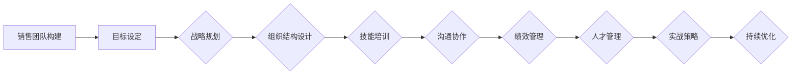

                 

### 《如何打造高效的销售团队》

> 关键词：高效销售团队、组织结构、技能培训、绩效管理、人才管理、实战策略、持续优化

> 摘要：本文旨在探讨如何打造高效的销售团队，从团队构建的基础、技能建设、绩效管理、人才管理、实战策略和持续优化等多个方面，通过逻辑清晰、结构紧凑、简单易懂的技术语言，提供系统性、实用性的指导策略，帮助企业提升销售业绩。

---

### 《如何打造高效的销售团队》目录大纲

# 第一部分：引言与基础

## 第1章：高效销售团队概述

### 1.1 高效销售团队的定义与重要性

### 1.2 销售团队的目标设定与战略规划

### 1.3 高效销售团队的构建原则

## 第2章：销售团队的组织结构

### 2.1 销售团队的职能划分

### 2.2 销售团队的职责分配

### 2.3 销售团队的层次结构

# 第二部分：高效销售团队的技能建设

## 第3章：销售技能培训

### 3.1 销售技能的重要性

### 3.2 常见的销售技能培训方法

### 3.3 培训效果评估与持续改进

## 第4章：销售团队的沟通与协作

### 4.1 内部沟通机制

### 4.2 团队协作工具与方法

### 4.3 如何提升团队沟通效率

# 第三部分：高效销售团队的绩效管理

## 第5章：销售绩效评估体系

### 5.1 销售绩效指标的选择

### 5.2 销售绩效评估的方法与技巧

### 5.3 销售绩效激励与奖惩制度

## 第6章：销售团队的人才管理

### 6.1 人才招聘与选拔

### 6.2 人才培养与保留

### 6.3 人才梯队建设

# 第四部分：高效销售团队的实战策略

## 第7章：市场分析与定位

### 7.1 市场分析的重要性

### 7.2 市场定位的方法与技巧

### 7.3 如何抓住市场机会

## 第8章：销售策略制定与执行

### 8.1 销售策略的类型与选择

### 8.2 销售策略的制定流程

### 8.3 销售策略的执行与监控

## 第9章：销售团队项目实战

### 9.1 项目销售流程与步骤

### 9.2 销售项目的风险管理

### 9.3 销售项目的成功案例分析

# 第五部分：高效销售团队的持续优化

## 第10章：销售团队的自我评估与改进

### 10.1 销售团队的自我评估方法

### 10.2 团队优化策略

### 10.3 如何建立持续改进的文化

## 第11章：销售团队的未来发展趋势

### 11.1 科技对销售团队的影响

### 11.2 销售团队的角色转型

### 11.3 未来销售团队的发展趋势

## 附录：销售团队常用工具与资源

### A.1 销售管理软件推荐

### A.2 销售培训资料

### A.3 销售团队常用书籍与文章推荐

---

**附录：Mermaid 流程图 - 销售团队构建流程**

---

在接下来的章节中，我们将逐步深入探讨每一个主题，提供详细的策略和建议，帮助企业打造高效的销售团队。让我们一步一步地分析推理，共同提升销售团队的整体效能。接下来，我们将首先从高效销售团队的概念和重要性开始讨论。  
---

## 第1章：高效销售团队概述

### 1.1 高效销售团队的定义与重要性

#### 高效销售团队的定义

高效销售团队是指在明确的目标指导下，通过科学的组织结构、专业的技能培训、有效的沟通协作和科学的绩效管理，能够在市场竞争中迅速响应客户需求，实现销售目标，提升企业业绩的团队。

高效销售团队不仅仅是一群销售人员简单的集合，而是一个有机的整体。这个整体具备以下几个特点：

- **目标明确**：团队每个成员都清楚自己的工作目标，并为之努力。
- **组织结构合理**：职能划分清晰，职责分配合理，层次结构明确。
- **技能专业**：团队成员具备专业的销售技能和知识，能够高效地完成销售任务。
- **沟通协作**：内部沟通顺畅，团队能够有效协作，提高工作效率。
- **绩效管理**：建立科学的绩效评估体系，通过激励和奖惩制度激发团队成员的积极性。
- **持续优化**：不断进行自我评估和改进，提高团队整体效能。

#### 高效销售团队的重要性

在当今竞争激烈的市场环境中，销售团队是企业成功的关键因素之一。高效的销售团队能够带来以下几个方面的积极影响：

1. **提升销售业绩**：通过科学的组织结构和专业的技能培训，销售团队能够迅速提升销售业绩，为企业创造更大的价值。
2. **增强客户满意度**：高效的沟通协作和专业的技能，使得销售团队能够更好地理解客户需求，提供针对性的解决方案，提高客户满意度。
3. **降低成本**：通过优化组织结构和绩效管理，销售团队能够降低运营成本，提高资源利用效率。
4. **促进企业创新**：高效的销售团队能够快速响应市场变化，推动企业创新，提升竞争力。
5. **提升企业品牌形象**：优秀的销售团队能够树立良好的企业形象，提升品牌影响力。

综上所述，高效销售团队是企业成功的关键因素之一，企业需要从多个方面入手，打造出一支高效、专业的销售团队。在接下来的章节中，我们将详细探讨如何实现这一目标。

### 1.2 销售团队的目标设定与战略规划

#### 目标设定的原则

销售团队的目标设定是打造高效销售团队的重要环节。一个明确、可行的目标能够指导团队成员的行动，提高工作效率。以下是设定目标时应遵循的原则：

1. **SMART原则**：目标应具备具体性（Specific）、可衡量性（Measurable）、可实现性（Achievable）、相关性和时限性（Relevant and Time-bound）。
2. **明确性**：目标应明确、具体，避免模糊和宽泛。
3. **挑战性**：目标应具备一定的挑战性，激发团队成员的潜力，但不应过于理想化。
4. **适应性**：目标应根据市场环境和公司战略进行调整，保持灵活性。

#### 目标设定的步骤

1. **了解企业战略**：销售团队的目标应与企业的整体战略保持一致。首先，需要了解企业的长远目标和短期目标，以及市场定位、产品策略等。
2. **市场分析**：通过对市场趋势、竞争对手、客户需求等进行深入分析，了解当前市场环境，为设定目标提供依据。
3. **内部资源评估**：评估团队的现有资源，包括人员、技能、资金等，确保目标的可实现性。
4. **制定目标**：根据上述分析，制定具体的销售目标，包括销售量、销售额、客户满意度等。
5. **目标分解**：将整体目标分解为可执行的小目标，分配到各个团队成员，确保每个成员都有明确的工作任务。

#### 战略规划的重要性

战略规划是销售团队实现目标的重要保障。一个清晰、合理的战略规划能够为团队成员提供行动指南，确保团队在正确的方向上高效运作。以下是战略规划的重要性：

1. **指导行动**：战略规划明确了团队的目标和路径，为团队成员提供明确的行动指南。
2. **资源调配**：战略规划能够合理调配资源，确保团队在关键领域有足够的投入。
3. **风险管理**：通过提前识别和规划可能的风险，降低不确定性，确保团队目标的实现。
4. **提高执行力**：战略规划有助于提高团队的执行力，确保各项工作有序推进。
5. **适应变化**：战略规划应具备一定的灵活性，能够根据市场变化进行调整，确保团队持续发展。

#### 战略规划的步骤

1. **明确目标**：在制定战略规划时，首先要明确团队的目标和愿景。
2. **市场分析**：对市场环境进行深入分析，了解市场趋势、竞争格局、客户需求等。
3. **内部资源评估**：评估团队的现有资源，包括人员、技能、资金等，确保战略规划的可实施性。
4. **制定战略**：根据市场分析和内部资源评估，制定具体的战略规划，包括市场进入策略、产品策略、销售策略等。
5. **实施与监控**：将战略规划转化为具体的行动计划，并建立监控机制，确保战略规划的有效执行。

通过以上步骤，销售团队可以制定出科学、合理的战略规划，为实现高效销售奠定坚实基础。在接下来的章节中，我们将进一步探讨如何构建科学合理的销售团队组织结构。

### 1.3 高效销售团队的构建原则

构建高效销售团队是一个系统性的工程，需要遵循一系列科学的原则和方法。以下是构建高效销售团队时应遵循的几个关键原则：

#### 1.1 明确团队目标

一个明确、可量化的目标是对销售团队的基本要求。团队目标应与企业的整体战略保持一致，同时要具备挑战性，激发团队成员的潜力。在制定目标时，可以采用SMART原则（具体性、可衡量性、可实现性、相关性和时限性），确保目标清晰、可行。

#### 1.2 科学组织结构

销售团队的职能划分、职责分配和层次结构是构建高效团队的重要基础。科学合理的组织结构可以确保团队运作的高效性和协同性。以下是销售团队组织结构设计的基本原则：

1. **职能划分**：根据销售流程和业务需求，合理划分销售团队的职能模块，如市场调研、客户开发、销售执行、售后服务等。
2. **职责分配**：明确各个职能模块的职责和任务，确保每个成员都有明确的职责和工作内容。
3. **层次结构**：合理设计团队的管理层次，确保指挥链条清晰、信息传递顺畅。

#### 1.3 专业技能培训

销售团队的技能水平直接影响到销售业绩。通过系统的专业技能培训，可以提高团队成员的业务能力，提升团队整体战斗力。以下是进行销售技能培训时需要考虑的几个方面：

1. **培训内容**：培训内容应涵盖市场分析、客户管理、销售技巧、谈判策略等关键领域。
2. **培训方式**：采用多种培训方式，如内部培训、外部培训、在线培训等，满足不同成员的学习需求。
3. **培训评估**：建立培训效果评估机制，确保培训达到预期效果，并持续改进培训方法。

#### 1.4 沟通协作

沟通协作是销售团队高效运作的重要保障。一个良好的内部沟通机制和协作工具可以提高团队的工作效率。以下是构建沟通协作机制时需要考虑的几个方面：

1. **内部沟通机制**：建立有效的内部沟通渠道，如定期会议、工作报告、意见反馈等，确保信息传递的及时性和准确性。
2. **协作工具**：引入先进的协作工具，如CRM系统、邮件系统、即时通讯工具等，提高团队协作效率。
3. **沟通培训**：定期进行沟通技巧培训，提高团队成员的沟通能力和协作意识。

#### 1.5 绩效管理

科学的绩效管理是激励团队成员、提升团队整体效能的关键手段。以下是实施绩效管理时需要考虑的几个方面：

1. **绩效指标**：制定合理的绩效指标，确保指标与团队目标和企业战略的一致性。
2. **评估方法**：采用多种评估方法，如定期评估、动态评估等，全面了解团队成员的工作表现。
3. **激励与奖惩**：建立激励与奖惩制度，通过奖励优秀员工、惩罚不达标员工，激发团队成员的积极性。

#### 1.6 持续改进

持续改进是高效销售团队不断进步的动力。通过自我评估和外部反馈，不断优化团队运作流程，提高团队整体效能。以下是实施持续改进时需要考虑的几个方面：

1. **自我评估**：定期进行自我评估，识别团队存在的问题和改进空间。
2. **外部反馈**：收集客户和合作伙伴的反馈，了解市场对团队的期望和需求。
3. **改进措施**：根据评估和反馈，制定具体的改进措施，并跟踪实施效果。

通过遵循以上原则，企业可以逐步构建起一支高效、专业的销售团队，实现销售目标的顺利达成。在接下来的章节中，我们将进一步探讨销售团队的具体组织结构设计。

## 第2章：销售团队的组织结构

### 2.1 销售团队的职能划分

销售团队的职能划分是构建高效销售团队的基础，科学合理的职能划分能够确保团队各成员的职责明确，工作高效有序。以下是销售团队常见的职能划分及各自的任务描述：

#### 1. 市场调研部

**任务描述**：负责收集市场信息，分析市场趋势、竞争对手状况、客户需求等，为销售决策提供数据支持。

**关键职能**：市场调研、数据分析、报告撰写。

#### 2. 客户开发部

**任务描述**：负责新客户的开发，包括潜在客户的识别、接触、谈判等，扩大客户群体。

**关键职能**：客户资料管理、客户关系建立、商机挖掘。

#### 3. 销售执行部

**任务描述**：负责与客户进行深入的商务洽谈，达成销售协议，实现销售额的稳步增长。

**关键职能**：谈判技巧、合同管理、销售策略实施。

#### 4. 售后服务部

**任务描述**：负责销售后的客户服务，处理客户投诉，维护客户关系，提高客户满意度。

**关键职能**：客户服务、问题解决、客户反馈收集。

#### 5. 销售支持部

**任务描述**：为销售团队提供后勤支持，包括市场推广、产品知识培训、销售工具开发等。

**关键职能**：市场推广、培训支持、工具开发。

通过明确各职能部门的任务，销售团队可以更好地分工合作，确保每个环节都能高效运作。每个部门的具体任务描述如下：

- **市场调研部**：通过市场调研工具和方法，如在线调查、问卷调查、电话访谈等，收集市场数据。利用数据分析软件对收集到的数据进行分析，撰写市场分析报告，为团队提供决策支持。
- **客户开发部**：通过多种渠道获取潜在客户信息，如互联网、行业展会、合作伙伴等。建立潜在客户数据库，定期跟进潜在客户，通过电话、邮件等方式进行初步接触和沟通，挖掘商机。
- **销售执行部**：在客户开发部提供的信息基础上，与潜在客户进行深入沟通，了解客户需求，提供针对性的解决方案。进行商务谈判，签订销售合同，实现销售目标。
- **售后服务部**：在销售合同签订后，为客户提供产品安装、使用培训、技术支持等服务。及时处理客户投诉，解决客户问题，维护良好的客户关系。
- **销售支持部**：负责市场推广活动的策划和执行，如广告投放、线上线下活动等。组织产品知识培训，提升团队成员的产品知识水平。开发销售工具，如CRM系统、演示资料等，提高销售效率。

通过科学合理的职能划分，销售团队可以更好地协调各部门的工作，确保整个销售流程的高效运转。

### 2.2 销售团队的职责分配

职责分配是构建高效销售团队的关键环节，合理的职责分配能够确保团队成员各司其职，提高工作效率。以下是销售团队常见职责的分配及具体描述：

#### 1. 团队领导

**职责描述**：负责团队的总体管理和协调，制定团队目标和战略，指导团队成员开展工作，确保团队目标的实现。

**关键职责**：
- 制定团队目标和战略
- 统一协调团队内部工作
- 指导和监督团队成员的工作
- 解决团队运营中的问题
- 定期进行团队评估和反馈

#### 2. 销售经理

**职责描述**：直接负责销售团队的管理和业绩提升，制定销售计划，指导销售策略，确保销售目标的实现。

**关键职责**：
- 制定销售计划和销售策略
- 管理和指导销售人员的工作
- 监控销售业绩，及时调整销售策略
- 组织销售培训和团队建设活动
- 定期与团队成员进行业绩评估和反馈

#### 3. 销售人员

**职责描述**：负责具体销售任务，与客户进行沟通，提供解决方案，达成销售目标。

**关键职责**：
- 与客户进行初步接触，挖掘客户需求
- 提供产品解决方案，进行商务谈判
- 达成销售合同，实现销售目标
- 提供售后服务，维护客户关系
- 定期提交销售报告，反馈销售情况

#### 4. 市场调研人员

**职责描述**：负责市场调研和分析，为销售决策提供数据支持。

**关键职责**：
- 进行市场调研，收集市场数据
- 分析市场趋势和竞争对手情况
- 撰写市场分析报告
- 提供市场数据支持，协助制定销售策略

#### 5. 客户服务人员

**职责描述**：负责客户售后服务和问题处理，提高客户满意度。

**关键职责**：
- 接待客户投诉，及时解决问题
- 提供产品使用培训和技术支持
- 收集客户反馈，为产品改进提供建议
- 维护客户关系，提升客户满意度

#### 6. 销售支持人员

**职责描述**：为销售团队提供后勤支持和辅助工作。

**关键职责**：
- 组织市场推广活动，如广告投放、线上线下活动等
- 开发销售工具，如CRM系统、演示资料等
- 提供产品知识培训，提升团队成员的专业能力
- 协助销售人员处理销售过程中遇到的问题

通过明确各成员的职责，销售团队能够更好地协作，确保每个环节都有人负责，工作高效有序。合理的职责分配不仅能提高团队整体的工作效率，还能激发团队成员的工作积极性和创造力。

### 2.3 销售团队的层次结构

销售团队的层次结构是确保团队高效运作的重要基础。合理的层次结构能够明确团队内部的角色和职责，确保信息的顺畅传递和执行力的提升。以下是销售团队的常见层次结构及其职责描述：

#### 1. 高层领导层

**职责描述**：高层领导层主要负责制定公司整体销售战略，指导销售团队的方向和目标，确保销售团队的工作与公司的整体战略保持一致。

**关键职责**：
- 制定公司销售战略
- 监督销售团队的整体绩效
- 制定销售目标和计划
- 决策重大销售策略和资源配置
- 定期与销售团队领导进行沟通和反馈

#### 2. 销售团队领导层

**职责描述**：销售团队领导层是连接高层领导和一线销售人员的桥梁，主要负责销售团队的日常管理、指导和支持。

**关键职责**：
- 制定团队销售计划和目标
- 监督和评估团队成员的绩效
- 提供销售策略和技巧的指导
- 组织团队建设活动和培训
- 解决团队成员工作中的问题
- 定期向上级报告团队工作情况和绩效

#### 3. 销售人员层

**职责描述**：销售人员层是销售团队的核心，直接负责与客户的沟通和销售工作，实现销售目标。

**关键职责**：
- 与客户进行沟通，了解客户需求
- 提供产品解决方案，进行商务谈判
- 达成销售合同，实现销售业绩
- 提供售后服务，维护客户关系
- 定期提交销售报告，反馈工作情况

#### 4. 支持人员层

**职责描述**：支持人员层为销售团队提供后勤支持和辅助工作，确保销售团队能够高效运作。

**关键职责**：
- 组织市场推广活动，提升品牌知名度
- 开发和维护销售工具，提高销售效率
- 提供产品知识和市场分析培训
- 协助销售人员处理销售过程中的问题
- 收集和整理销售数据，为销售决策提供支持

通过明确各层次的职责和角色，销售团队能够形成有效的管理链条，确保信息的畅通传递和高效的执行力。合理的层次结构不仅有助于提升团队整体效能，还能为团队成员提供清晰的职业发展路径，激发工作积极性和创造力。

### 第3章：销售技能培训

#### 3.1 销售技能的重要性

销售技能是销售团队成功的关键因素之一。一个具备高水平销售技能的团队，能够在激烈的市场竞争中脱颖而出，实现优异的销售业绩。以下是销售技能的重要性和其对团队绩效的影响：

1. **提升销售业绩**：高水平的销售技能能够帮助销售人员更有效地与客户沟通，挖掘客户需求，提供针对性的解决方案，从而提升销售额和客户满意度。
2. **增强市场竞争力**：销售技能的提升使得团队能够在市场上更具竞争力，更快速地响应客户需求，抓住市场机会，保持竞争优势。
3. **提高工作效率**：通过专业的销售技能培训，团队成员能够掌握有效的销售方法和技巧，提高工作效率，减少无效工作。
4. **优化客户关系**：良好的销售技能使得团队成员能够更好地维护客户关系，提高客户忠诚度，减少客户流失。
5. **促进团队协作**：销售技能培训不仅有助于提高个人能力，还能增强团队成员之间的协作意识，提升团队整体战斗力。

#### 3.2 常见的销售技能培训方法

为了提高销售团队的技能水平，企业可以采用多种培训方法，包括内部培训、外部培训和在线培训等。以下是几种常见的销售技能培训方法及其特点：

1. **内部培训**

**特点**：
- 适合企业内部特定需求，可以针对性地进行技能提升。
- 培训内容更贴近实际工作场景，实用性更强。

**实施方法**：
- 定期举办销售技能培训班，邀请内部有经验的销售人员或外部专家进行授课。
- 通过案例分析、角色扮演、小组讨论等方式，让学员在实践中掌握销售技巧。
- 设计实战演练，模拟销售场景，提高学员的实际操作能力。

2. **外部培训**

**特点**：
- 专业性强，能够提供系统的销售技能培训。
- 培训资源丰富，可以接触到不同领域的优秀销售经验。

**实施方法**：
- 参加行业内的销售技能培训班或研讨会，获取最新的销售理念和方法。
- 邀请专业的销售培训机构或顾问进行现场培训，提供一对一的辅导和指导。
- 聘请行业专家进行讲座，分享成功的销售案例和经验。

3. **在线培训**

**特点**：
- 灵活性高，可以随时随地进行学习。
- 培训资源丰富，覆盖各种销售技能和知识点。

**实施方法**：
- 利用在线学习平台，提供丰富的销售技能课程，如视频教程、电子书籍、在线测试等。
- 通过在线讨论区，促进学员之间的交流和互动，提高学习效果。
- 定期组织在线培训课程，邀请专家进行直播授课，解答学员疑问。

#### 3.3 培训效果评估与持续改进

为了确保销售技能培训的有效性，企业需要建立科学的培训效果评估机制，持续改进培训方法。以下是几种常见的培训效果评估方法和持续改进策略：

1. **评估方法**

- **行为评估**：通过观察学员在实际工作中的行为表现，评估其学习成果。如改进的销售流程、提高的沟通技巧等。
- **知识测试**：通过定期组织知识测试，检验学员对销售技能的掌握程度。
- **业绩分析**：通过对比培训前后的销售业绩数据，评估培训对销售绩效的影响。
- **学员反馈**：收集学员对培训内容的反馈，了解培训的优缺点，为进一步改进提供参考。

2. **持续改进策略**

- **定期评估**：定期对培训效果进行评估，及时发现问题和不足，制定改进措施。
- **反馈机制**：建立反馈机制，鼓励学员提出意见和建议，为培训改进提供依据。
- **持续培训**：根据评估结果，不断调整和优化培训内容和方法，确保培训的持续有效性。
- **案例分享**：定期组织成功的销售案例分享，鼓励团队成员互相学习，提升整体技能水平。

通过科学的培训效果评估和持续改进，企业可以不断提升销售团队的技能水平，提高整体绩效，为企业的持续发展提供有力支持。

### 第4章：销售团队的沟通与协作

#### 4.1 内部沟通机制

内部沟通机制是确保销售团队高效运作的重要保障。一个良好的内部沟通机制能够确保信息传递的及时性、准确性和有效性，提高团队协作效率。以下是构建内部沟通机制的关键要素：

1. **明确沟通目标**：沟通目标是内部沟通的核心，确保所有沟通活动都有明确的目的和方向。团队领导应明确沟通的目的和期望成果，确保团队成员了解并遵循。

2. **确定沟通渠道**：根据团队规模和业务特点，选择合适的沟通渠道。常见的沟通渠道包括定期会议、工作报告、邮件、即时通讯工具等。选择多种沟通渠道，确保信息传递的多样性和灵活性。

3. **制定沟通计划**：制定详细的沟通计划，包括沟通内容、时间、频率和责任人等。确保沟通活动的有序进行，避免信息传递的延误和混乱。

4. **建立反馈机制**：建立有效的反馈机制，鼓励团队成员提出意见和建议，及时反馈沟通效果。通过定期收集反馈，不断改进沟通方式和方法，提高沟通效率。

5. **培养沟通能力**：定期进行沟通技巧培训，提高团队成员的沟通能力。通过角色扮演、案例分析、小组讨论等方式，提升团队成员的沟通技巧和协作意识。

6. **优化沟通工具**：引入先进的沟通工具，如CRM系统、邮件系统、即时通讯工具等，提高沟通效率。确保团队成员能够方便快捷地进行沟通，减少信息传递的障碍。

#### 4.2 团队协作工具与方法

为了提升销售团队的协作效率，企业可以采用多种协作工具和方法。以下是一些常用的团队协作工具和方法及其特点：

1. **CRM系统**

**特点**：
- **全面的数据管理**：CRM系统能够整合客户信息、销售机会、合同等数据，提供全面的数据管理。
- **自动化流程**：CRM系统可以自动化销售流程，提高工作效率。
- **实时更新**：CRM系统支持实时数据更新，确保团队成员获取最新信息。

**使用方法**：
- **数据录入**：确保客户信息和销售数据的准确性，定期更新和整理数据。
- **流程管理**：根据销售流程，设置自动化流程，减少人工操作，提高工作效率。
- **数据共享**：通过权限设置，确保团队成员能够实时共享数据，提高协作效率。

2. **即时通讯工具**

**特点**：
- **实时沟通**：即时通讯工具支持实时沟通，确保团队成员能够快速响应问题和需求。
- **文件传输**：即时通讯工具支持文件传输，方便团队成员分享和协作。

**使用方法**：
- **日常沟通**：利用即时通讯工具进行日常沟通，提高信息传递速度。
- **文件共享**：通过即时通讯工具，方便团队成员共享文件和资料，提高协作效率。
- **任务分配**：通过即时通讯工具，快速分配任务，确保任务落实和跟进。

3. **共享文档平台**

**特点**：
- **版本控制**：共享文档平台支持版本控制，确保文档的版本一致性。
- **实时编辑**：支持多人实时编辑，提高协作效率。
- **权限管理**：可以根据需要设置文档的访问权限，确保文档安全。

**使用方法**：
- **文档管理**：将重要文档上传到共享文档平台，确保团队成员能够方便地获取和编辑。
- **实时协作**：通过共享文档平台，团队成员可以实时编辑和评论文档，提高协作效率。
- **权限设置**：根据团队成员的角色和职责，设置文档的访问权限，确保文档安全。

4. **项目管理工具**

**特点**：
- **任务管理**：项目管理工具支持任务管理，明确任务分配和进度。
- **进度跟踪**：可以实时跟踪任务进度，确保项目按时完成。
- **团队协作**：支持多人协作，提高团队工作效率。

**使用方法**：
- **任务分配**：根据项目需求，合理分配任务，明确任务责任人和截止日期。
- **进度跟踪**：定期检查任务进度，及时调整工作计划，确保项目按时完成。
- **团队协作**：利用项目管理工具，确保团队成员之间的信息传递和协作，提高工作效率。

通过建立有效的内部沟通机制和采用合适的团队协作工具，销售团队能够更好地协调工作，提高协作效率，实现团队目标。

### 4.3 如何提升团队沟通效率

提升团队沟通效率是确保销售团队高效运作的关键。以下是一些实用的方法和技巧，可以帮助销售团队提高沟通效率：

#### 1. 明确沟通目标

在每次沟通前，明确沟通的目标和期望结果。确保所有团队成员都清楚沟通的目的和需要达成的目标。通过明确沟通目标，可以避免无效沟通，提高沟通效率。

#### 2. 采用合适的沟通工具

根据沟通的内容和需求，选择合适的沟通工具。如面对面会议适用于需要深入讨论的问题，即时通讯工具适用于快速交流，邮件适用于正式沟通和文件传输。通过选择合适的沟通工具，可以确保沟通的及时性和有效性。

#### 3. 简明扼要

在沟通过程中，尽量用简洁明了的语言表达观点和意见。避免使用复杂的术语和冗长的句子，确保信息传递的清晰和准确。通过简明扼要的表达，可以减少沟通中的误解和混淆，提高沟通效率。

#### 4. 倾听与回应

在沟通中，不仅要表达自己的观点，还要认真倾听对方的意见和需求。通过倾听，可以更好地理解对方的意图，避免误解和冲突。同时，及时回应对方的意见，表达自己的看法，确保沟通的双向性和互动性。

#### 5. 定期会议

定期组织团队会议，讨论和解决工作中的问题。通过定期会议，可以及时沟通团队进展，协调工作计划，提高团队协作效率。会议前准备好议题和议程，确保会议的有序进行。

#### 6. 沟通技巧培训

定期进行沟通技巧培训，提高团队成员的沟通能力和技巧。通过角色扮演、案例分析、小组讨论等方式，提升团队成员的沟通意识，确保沟通的顺畅和有效。

#### 7. 建立反馈机制

建立有效的反馈机制，鼓励团队成员提出意见和建议。通过定期收集反馈，不断改进沟通方式和方法，提高沟通效率。确保团队成员之间的信息传递和反馈是畅通的，避免沟通障碍。

#### 8. 优化沟通流程

对现有的沟通流程进行优化，减少不必要的环节和步骤。通过简化沟通流程，提高信息传递的速度和准确性，确保沟通的高效性。

通过以上方法，销售团队可以提升沟通效率，确保信息的准确传递，提高团队协作效果，实现销售目标。

### 第5章：销售绩效评估体系

#### 5.1 销售绩效指标的选择

销售绩效指标是衡量销售团队和销售人员工作成果的重要工具。选择合适的销售绩效指标，能够准确反映团队和个人的业绩水平，为绩效评估提供科学依据。以下是常见的销售绩效指标及其适用场景：

1. **销售额**：销售额是衡量销售团队和销售人员工作成果的直接指标。通过对比实际销售额与计划销售额，可以评估销售业绩的达成情况。适用于所有销售团队。

2. **客户满意度**：客户满意度是衡量销售服务质量的重要指标。通过收集客户反馈，评估客户对销售团队和销售人员的满意度，可以反映团队的服务水平。适用于服务型销售团队。

3. **客户保有率**：客户保有率是衡量客户忠诚度和销售稳定性的指标。通过对比新增客户和流失客户数量，可以评估团队的客户维护能力。适用于长期销售和服务型销售团队。

4. **新客户开发量**：新客户开发量是衡量销售团队拓展市场能力的指标。通过对比新客户数量和开发成本，可以评估团队的拓展效果。适用于市场开发型销售团队。

5. **销售周期**：销售周期是衡量销售效率的指标。通过计算从接触客户到成交的时间，可以评估销售团队的反应速度和销售策略的有效性。适用于快速销售和短期销售团队。

6. **销售成本**：销售成本是衡量销售投入和产出比的指标。通过对比销售成本和销售额，可以评估销售投入的合理性。适用于成本控制型销售团队。

7. **市场覆盖率**：市场覆盖率是衡量销售团队市场渗透率的指标。通过对比销售覆盖区域和市场范围，可以评估团队的市场拓展能力。适用于市场拓展型销售团队。

选择销售绩效指标时，应综合考虑团队的业务特点、市场环境和公司战略。根据实际情况，灵活选择适合的指标，确保绩效评估的科学性和有效性。

#### 5.2 销售绩效评估的方法与技巧

销售绩效评估的方法和技巧是确保评估结果准确性和公平性的关键。以下是几种常见的销售绩效评估方法和技巧：

1. **定量评估法**：定量评估法通过具体的数值指标评估销售业绩。如销售额、客户满意度、新客户开发量等。这种方法直观、易于量化，适用于业绩指标明确的销售团队。

2. **定性评估法**：定性评估法通过评估销售人员的表现、行为和贡献。如客户反馈、团队领导评价、客户满意度调查等。这种方法更注重评估销售人员的综合素质和团队协作能力。

3. **360度评估法**：360度评估法通过多角度、全方位评估销售人员的绩效。包括上级评价、同事评价、下属评价、客户反馈等。这种方法能够全面了解销售人员的工作表现，提高评估的准确性。

4. **平衡计分卡法**：平衡计分卡法通过财务、客户、内部流程、学习与成长四个维度评估销售绩效。这种方法能够综合考虑多个方面，确保评估结果的全面性和公平性。

5. **KPI（关键绩效指标）法**：KPI法通过设定关键绩效指标，明确销售人员的任务和目标。通过对比实际业绩和目标，评估销售人员的绩效表现。这种方法能够明确工作重点，提高目标的实现率。

6. **评估技巧**：
   - **明确评估标准**：在评估前明确评估标准和指标，确保评估的客观性和公正性。
   - **数据收集与分析**：通过收集和分析销售数据，确保评估结果的真实性和准确性。
   - **及时反馈与沟通**：及时向销售人员反馈评估结果，沟通存在的问题和改进方向。
   - **公平公正**：确保评估过程中公平公正，避免偏袒和偏见，提高团队的信任和士气。

通过科学合理的销售绩效评估方法和技巧，企业能够确保评估结果的准确性和公平性，激励销售人员不断提升业绩，实现团队的整体目标。

#### 5.3 销售绩效激励与奖惩制度

销售绩效激励与奖惩制度是激励销售人员、提升团队绩效的重要手段。合理的激励机制能够激发销售人员的积极性，提高销售业绩；而严格的奖惩制度则能够约束销售人员的行为，确保团队目标的实现。以下是销售绩效激励与奖惩制度的设计原则和实施策略：

1. **设计原则**：

- **激励与约束并重**：激励制度不仅要激励优秀销售人员，还要通过奖惩制度约束不达标的行为。
- **公平公正**：确保激励和奖惩制度的公平公正，避免偏袒和歧视，提高团队的信任和士气。
- **目标导向**：激励制度应与销售目标紧密相关，激励销售人员为实现团队目标而努力。
- **多样性**：采用多种激励形式，如物质激励、精神激励、职业发展等，满足不同销售人员的需求。
- **灵活性**：根据市场环境和业务需求，灵活调整激励和奖惩制度，确保其持续有效。

2. **实施策略**：

- **物质激励**：通过奖金、提成、股权激励等物质激励手段，提高销售人员的收入水平，激发其工作积极性。
  - **奖金制度**：设立销售奖金，根据销售额的达成情况，发放不同等级的奖金。如超额完成任务的，可以获得额外奖金。
  - **提成制度**：根据销售额的比例，给予销售人员提成。提成比例可以根据销售团队的业绩目标进行调整。
  - **股权激励**：为长期优秀的销售人员提供股权激励，使其成为企业的一部分，增强归属感和责任感。

- **精神激励**：通过荣誉表彰、团队建设、培训机会等精神激励手段，提高销售人员的自我价值感和归属感。
  - **荣誉表彰**：定期评选优秀销售人员，进行表彰和奖励，提升其职业荣誉感。
  - **团队建设**：组织团队建设活动，增强团队成员之间的凝聚力和团队精神。
  - **培训机会**：为销售人员提供职业发展培训，提升其专业技能和知识水平。

- **奖惩制度**：建立严格的奖惩制度，对表现优秀的销售人员给予奖励，对不达标的行为进行惩罚。
  - **奖励措施**：对完成目标、超额完成任务的销售人员，给予表彰和奖励。如颁发荣誉证书、赠送礼品等。
  - **惩罚措施**：对未完成目标、违规操作的销售人员，进行警告、降级、罚款等处罚。确保团队的纪律和规范。

通过科学合理的销售绩效激励与奖惩制度，企业能够激发销售人员的积极性，提升团队整体绩效，实现销售目标的顺利达成。

### 第6章：销售团队的人才管理

#### 6.1 人才招聘与选拔

人才招聘与选拔是构建高效销售团队的关键环节。通过科学合理的人才招聘与选拔流程，企业能够吸引到具备专业能力和良好素质的销售人才，为团队的长期发展奠定基础。以下是人才招聘与选拔的关键步骤和策略：

1. **明确招聘需求**：在启动招聘前，明确招聘的岗位需求、职位描述和任职资格。具体包括岗位的工作职责、所需技能、工作经验、教育背景等。

2. **发布招聘信息**：通过多种渠道发布招聘信息，如招聘网站、社交媒体、行业论坛、内部推荐等。确保招聘信息的广泛传播，吸引更多的应聘者。

3. **筛选简历**：根据岗位需求和简历内容，筛选符合条件的应聘者。重点关注应聘者的教育背景、工作经历、技能水平和职业发展潜力。

4. **初步面试**：通过电话或视频面试，对筛选出的应聘者进行初步筛选。主要了解应聘者的沟通能力、逻辑思维和问题解决能力。

5. **专业面试**：组织专业面试，由销售经理或部门负责人对候选人进行面试。主要考察候选人的销售技能、行业知识、沟通能力和团队协作精神。

6. **背景调查**：对通过面试的候选人进行背景调查，包括工作经历、教育背景、职业诚信等，确保候选人的真实性和可靠性。

7. **试岗体验**：安排候选人进行试岗体验，实际参与销售工作，考察其在工作环境中的适应能力和工作表现。

8. **录用决定**：综合面试结果和试岗体验，做出最终的录用决定。确保候选人具备岗位所需的专业能力和个人素质。

#### 6.2 人才培养与保留

人才培养与保留是提升销售团队整体素质和竞争力的关键。通过系统的培训和发展计划，企业能够不断提升销售人员的能力和技能，保持团队的活力和创新能力。以下是人才培养与保留的策略和措施：

1. **制定培训计划**：根据销售团队的现状和业务需求，制定详细的培训计划。包括培训内容、培训方式、培训时间等。

2. **开展培训活动**：实施培训计划，通过内部培训、外部培训、在线培训等多种方式，提升销售人员的专业技能和业务能力。

3. **提供发展机会**：为销售人员提供职业发展机会，如晋升通道、岗位轮换、管理培训等，激励其不断提升自我。

4. **职业规划**：与销售人员共同制定职业规划，明确其职业目标和成长路径，帮助其实现职业发展。

5. **绩效考核**：建立科学的绩效考核体系，通过考核激励销售人员提升业绩和技能水平。

6. **激励与认可**：通过物质激励和精神激励，如奖金、提成、荣誉表彰等，激励销售人员的工作积极性和忠诚度。

7. **文化建设**：建立积极向上的企业文化，营造良好的团队氛围，增强员工的归属感和认同感。

8. **离职管理**：对离职员工进行合理的管理，分析离职原因，改进招聘和培训体系，减少人才流失。

通过系统的人才培养与保留策略，企业能够不断提升销售团队的素质和竞争力，为企业的长期发展提供有力支持。

#### 6.3 人才梯队建设

人才梯队建设是确保销售团队稳定发展和持续竞争力的关键。通过科学合理的人才梯队建设，企业能够在不同层级培养出具备不同能力的人才，确保团队在各个发展阶段都能应对挑战。以下是人才梯队建设的关键策略和措施：

1. **明确梯队层次**：根据销售团队的发展需求和岗位特点，明确人才梯队的层次和结构。通常包括基层销售人才、中层管理人才和高层领导人才。

2. **制定培养计划**：针对不同层次的人才，制定有针对性的培养计划。如基层销售人才主要培养销售技能和客户管理能力，中层管理人才主要培养领导力和团队管理能力，高层领导人才主要培养战略规划和决策能力。

3. **搭建培养平台**：搭建人才培养和发展的平台，如内部培训体系、外部培训合作、管理培训生项目等，提供丰富的学习和发展机会。

4. **选拔与培养**：通过选拔和培养，确保人才梯队能够及时补充和优化。如通过内部选拔，培养出具备潜力的中层管理人员，通过外部招聘，引进具有丰富经验的基层销售人才。

5. **轮岗与挑战**：通过岗位轮换和挑战性任务，提升人才的多样性和适应性，培养其综合素质和跨部门协作能力。

6. **绩效评估**：建立科学的绩效评估体系，定期评估人才的绩效和发展潜力，确保人才的合理配置和优化。

7. **激励与保留**：通过激励和认可，如晋升通道、职业发展机会、薪酬福利等，激励人才不断提升自我，保持团队的稳定和活力。

8. **持续优化**：根据市场环境和业务需求，不断调整和优化人才梯队建设策略，确保团队在不同发展阶段都能应对挑战，保持竞争力。

通过科学合理的人才梯队建设，企业能够确保销售团队在各个发展阶段都有充足的人才储备和培养，为企业的长期发展提供坚实的人才保障。

### 第7章：市场分析与定位

#### 7.1 市场分析的重要性

市场分析是构建高效销售团队的重要环节，对于企业的战略制定和销售策略的制定具有至关重要的作用。通过市场分析，企业能够深入了解市场环境、竞争对手和客户需求，从而做出科学的决策，提升销售业绩。以下是市场分析的重要性：

1. **确定市场机会**：市场分析可以帮助企业发现潜在的市场机会，抓住市场动态，制定有针对性的销售策略，提高市场竞争力。

2. **了解竞争对手**：通过市场分析，企业可以了解竞争对手的市场地位、产品特点、营销策略等，找出自身优势和劣势，制定有效的应对措施。

3. **把握客户需求**：市场分析能够帮助企业深入了解客户需求，提供定制化的产品和服务，提升客户满意度和忠诚度。

4. **优化资源配置**：市场分析有助于企业合理配置资源，将有限的资源投入到最有潜力的市场领域，提高资源利用效率。

5. **提升决策效率**：通过市场分析，企业可以更准确地预测市场趋势，减少盲目决策，提高决策的科学性和有效性。

6. **增强市场适应能力**：市场分析能够帮助企业及时应对市场变化，调整销售策略，增强市场适应能力和灵活性。

#### 7.2 市场定位的方法与技巧

市场定位是企业在市场中找到自己独特的位置，通过独特的价值主张满足目标客户的需求。一个准确、有效的市场定位能够帮助企业脱颖而出，提升品牌影响力。以下是市场定位的方法与技巧：

1. **目标市场选择**：根据企业的资源、能力和市场机会，选择最适合的目标市场。可以通过细分市场，确定目标客户群体的特征和需求。

2. **价值主张**：明确企业的价值主张，即产品或服务能够为客户带来哪些独特的价值和利益。通过差异化优势，打造独特的市场定位。

3. **品牌形象**：建立符合市场定位的品牌形象，通过品牌传播和营销活动，树立企业的市场形象和品牌认知度。

4. **定位策略**：
   - **差异化定位**：通过独特的产品特点或服务优势，在市场中找到与众不同的定位。
   - **跟随定位**：在市场中找到领先者的优势，以类似的产品或服务进行市场跟随，减少竞争压力。
   - **细分市场定位**：在特定的细分市场找到独特的价值主张，满足特定客户群体的需求。

5. **持续优化**：根据市场反馈和竞争环境，不断调整和优化市场定位策略，确保其持续有效。

#### 7.3 如何抓住市场机会

抓住市场机会是销售团队实现业绩增长的关键。以下是几个关键步骤，帮助销售团队抓住市场机会：

1. **市场趋势分析**：通过市场分析，了解当前市场的发展趋势，如新兴技术、消费习惯变化等，提前布局。

2. **客户需求分析**：深入了解客户需求，挖掘潜在需求，提供针对性的产品和服务。

3. **竞争对手分析**：分析竞争对手的市场策略、产品特点和市场份额，找出自身的竞争优势。

4. **市场调研**：通过市场调研，获取第一手市场数据，为销售策略提供依据。

5. **快速响应**：建立快速响应机制，对市场机会及时采取行动，确保抓住最佳时机。

6. **合作与联盟**：与行业内的合作伙伴建立联盟，共同开拓市场，提高市场占有率。

通过科学的市场分析、准确的市场定位和有效的市场机会捕捉，销售团队能够在激烈的市场竞争中脱颖而出，实现业绩的持续增长。

### 第8章：销售策略制定与执行

#### 8.1 销售策略的类型与选择

销售策略是销售团队在市场竞争中制定的具体行动方案，旨在实现销售目标。不同的销售策略适用于不同的市场环境和竞争状况。以下是几种常见的销售策略及其特点：

1. **价格策略**：通过调整产品价格，吸引客户，提高市场份额。价格策略可分为高价策略、低价策略、打折促销等。
   - **高价策略**：通过高质量和高品牌形象，制定较高的产品价格，提升产品附加值。
   - **低价策略**：通过大规模生产和成本控制，降低产品价格，吸引价格敏感型客户。
   - **打折促销**：通过定期打折促销活动，刺激客户购买，提高销量。

2. **渠道策略**：通过选择合适的销售渠道，实现产品销售。渠道策略可分为直销、分销、代理等。
   - **直销**：企业直接向客户销售产品，减少中间环节，提高利润率。
   - **分销**：通过中间商或经销商将产品销售给最终客户，扩大市场覆盖面。
   - **代理**：与代理商合作，由代理商负责销售，企业提供产品和技术支持。

3. **促销策略**：通过促销活动，刺激客户购买，提高产品知名度。促销策略可分为广告促销、公关促销、销售促销等。
   - **广告促销**：通过广告宣传，提高产品知名度，吸引客户。
   - **公关促销**：通过公关活动，提升企业形象和品牌知名度。
   - **销售促销**：通过打折、赠品、捆绑销售等促销手段，刺激客户购买。

4. **市场定位策略**：根据产品特点和目标市场，确定产品在市场中的独特位置。市场定位策略可分为差异化定位、细分市场定位等。
   - **差异化定位**：通过独特的产品特点或服务优势，在市场中找到与众不同的定位。
   - **细分市场定位**：在特定的细分市场找到独特的价值主张，满足特定客户群体的需求。

选择销售策略时，企业应综合考虑市场环境、竞争状况、产品特点和企业资源等因素，制定最适合的销售策略。

#### 8.2 销售策略的制定流程

制定有效的销售策略是一个系统性的过程，需要明确的目标、科学的市场分析和详细的实施计划。以下是销售策略的制定流程：

1. **明确目标**：确定销售策略的目标，如提高市场份额、增加销售额、提升客户满意度等。目标应具体、可衡量，与企业的长期战略保持一致。

2. **市场分析**：通过市场调研，收集和分析市场数据，了解市场趋势、竞争对手状况和客户需求。市场分析的结果将直接影响销售策略的制定。

3. **确定策略类型**：根据市场分析结果，选择合适的销售策略类型。如市场分析显示竞争对手较弱，可以选择进攻型策略；如市场竞争激烈，可以选择防守型策略。

4. **制定具体方案**：在确定销售策略类型后，制定具体的实施方案，包括价格策略、渠道策略、促销策略和市场定位策略等。方案应详细、具体，明确各策略的实施步骤和预期效果。

5. **风险评估**：对制定的销售策略进行风险评估，识别潜在的风险和挑战，制定应对措施，确保策略的可实施性。

6. **资源调配**：根据销售策略的需求，合理调配企业资源，包括人力、资金、技术等。确保策略实施所需的资源充足，支持策略的顺利执行。

7. **实施计划**：制定详细的实施计划，包括时间表、责任分配、关键节点等。确保销售策略的有序推进，实现销售目标。

8. **监控与调整**：在策略实施过程中，定期监控策略执行情况，评估策略效果，根据实际情况进行及时调整，确保策略目标的实现。

通过以上流程，企业可以制定出科学、合理的销售策略，确保销售目标的实现。

#### 8.3 销售策略的执行与监控

销售策略的执行与监控是确保策略目标实现的关键环节。以下是如何有效地执行和监控销售策略的几个关键步骤：

1. **明确执行责任**：将销售策略分解为具体任务，明确各任务的负责人和责任。确保每个任务都有明确的目标和时间表。

2. **制定行动计划**：根据销售策略，制定详细的行动计划，包括具体的销售活动、营销宣传、渠道建设等。行动计划应详细、可操作，确保策略的实施有序进行。

3. **资源保障**：确保策略实施所需的人力、资金、技术等资源充足。对于资源不足的情况，及时调整策略或寻求外部支持。

4. **团队协作**：建立良好的团队协作机制，确保各部门和团队成员能够紧密配合，共同推进销售策略的实施。

5. **执行监控**：建立监控机制，定期检查策略执行情况，评估任务完成进度和效果。监控过程中，重点关注关键节点和问题，及时解决执行中的障碍。

6. **数据收集与分析**：收集与销售策略相关的数据，如销售额、客户反馈、市场反应等，进行分析和评估。通过数据，了解策略实施的效果和问题，为后续调整提供依据。

7. **调整与优化**：根据监控结果，及时调整销售策略。对于实施效果不佳的部分，进行优化和改进，确保策略能够持续有效地推进。

8. **激励与反馈**：对在策略执行中表现优秀的团队成员进行奖励和激励，提升团队的工作积极性和执行力。同时，通过定期反馈，了解团队在策略执行中的感受和建议，不断优化策略。

通过有效的执行和监控，企业可以确保销售策略的顺利实施，实现销售目标。在策略执行过程中，企业应保持灵活性和适应性，根据市场环境和竞争状况的变化，及时调整策略，确保销售团队的持续竞争力。

### 第9章：销售团队项目实战

#### 9.1 项目销售流程与步骤

销售团队在开展项目销售时，需要遵循一套系统的流程和步骤，以确保销售过程的有序进行和销售目标的顺利达成。以下是项目销售的基本流程与步骤：

1. **项目识别**：首先，销售团队需要识别和筛选潜在的项目机会。可以通过市场调研、客户关系网络、合作伙伴等渠道获取项目信息。对潜在项目进行初步筛选，确定哪些项目具有较大的销售潜力。

2. **需求调研**：在确定潜在项目后，进行详细的需求调研。与客户进行初步沟通，了解客户的需求、预算、时间表等关键信息。通过需求调研，明确项目的具体需求和目标，为后续的销售策略制定提供依据。

3. **项目评估**：对潜在项目进行综合评估，包括市场机会、客户需求、竞争环境、公司资源等。评估项目是否与公司的战略目标相符，是否有足够的资源和支持，是否有成功的机会。

4. **销售策略制定**：根据项目评估的结果，制定具体的销售策略。包括确定目标客户、选择合适的销售渠道、制定价格策略、促销策略等。销售策略应与项目特点和市场环境相适应，具有可执行性。

5. **项目谈判**：在明确了销售策略后，与客户进行深入谈判。谈判内容包括项目范围、交付时间、价格、支付方式、售后服务等。通过谈判，达成双方都能接受的合同条款。

6. **合同签订**：在谈判成功后，与客户签订销售合同，明确双方的权利和义务。合同应详细、明确，避免后续的争议和纠纷。

7. **项目执行**：合同签订后，销售团队需要协助项目团队按照合同要求执行项目。确保项目按照计划进行，及时解决项目中出现的问题，保证项目质量和进度。

8. **项目交付与验收**：在项目完成后，进行项目交付和验收。确保项目满足客户的要求和预期，客户对项目结果满意。通过交付和验收，确保销售目标实现。

9. **售后服务**：项目交付后，提供优质的售后服务，解决客户在使用过程中遇到的问题，维护客户关系。通过售后服务，提高客户满意度，增加客户忠诚度。

通过以上步骤，销售团队可以系统地推进项目销售，确保销售目标的实现。在实际操作中，销售团队应根据项目的具体情况进行灵活调整，确保每个环节都能高效运作。

#### 9.2 销售项目的风险管理

销售项目在执行过程中可能会面临各种风险，如市场变化、客户需求变更、资源不足等。有效的风险管理能够降低项目风险，确保项目顺利进行。以下是销售项目风险管理的几个关键步骤：

1. **识别风险**：在项目启动阶段，通过市场调研、客户沟通、团队讨论等方式，识别可能存在的风险。常见的风险包括市场变化、客户需求变更、竞争压力、资源不足等。

2. **评估风险**：对识别出的风险进行评估，分析其发生的可能性、影响程度和损失规模。可以通过定性分析和定量分析，对风险进行优先级排序，确定需要重点关注的风险。

3. **制定应对措施**：针对评估出的高风险，制定具体的应对措施。应对措施包括风险规避、风险转移、风险减轻等。如通过市场多元化策略规避市场变化风险，通过购买保险转移部分风险等。

4. **监控风险**：在项目执行过程中，持续监控风险的变化和影响。通过定期风险评估和风险报告，及时了解风险状况，调整应对措施。

5. **沟通与协作**：建立有效的沟通机制，确保团队内部和与客户的沟通畅通。通过定期会议和报告，及时沟通项目进展和风险情况，确保各方能够共同应对风险。

6. **风险应对**：在风险发生时，迅速采取应对措施，降低风险的影响。如通过增加资源投入、调整项目计划等，确保项目能够继续进行。

7. **经验总结**：在项目完成后，对风险管理的整个过程进行总结，识别成功经验和不足之处。通过经验总结，不断提升风险管理的水平，为未来项目的风险管理提供参考。

通过有效的风险管理，销售团队可以降低项目风险，确保项目顺利进行，提高项目成功率。

#### 9.3 销售项目的成功案例分析

为了更好地理解销售项目的实施过程和成功要素，以下是一个销售项目的成功案例分析：

**案例背景**：某科技公司A公司致力于提供智能办公解决方案，包括智能会议系统、智能办公桌、智能办公椅等。B公司是一家大型企业，正在寻找升级办公环境的解决方案。

**项目识别**：销售团队通过市场调研和客户关系网络，了解到B公司有升级办公环境的计划，这是一个潜在的优质项目。

**需求调研**：销售团队与B公司的采购部门进行多次沟通，深入了解B公司的需求，包括预算、时间表、功能要求等。通过需求调研，销售团队明确了B公司的具体需求。

**项目评估**：销售团队对B公司的项目进行了全面评估，认为这是一个有竞争力的项目，与公司的发展战略相符，决定全力推进。

**销售策略制定**：
- **目标客户**：明确B公司为首要目标客户，制定针对B公司的销售策略。
- **渠道策略**：通过直接销售，与B公司建立直接联系，减少中间环节。
- **价格策略**：根据B公司的预算，制定具有竞争力的价格方案。
- **促销策略**：推出组合促销，提供优惠套餐，吸引B公司的关注。

**项目谈判**：在谈判过程中，销售团队展示了智能办公解决方案的优势，如提高工作效率、降低运营成本等，得到了B公司的认可。经过多轮谈判，双方达成一致，签订了销售合同。

**合同签订**：合同内容包括产品规格、交付时间、价格、支付方式、售后服务等。合同条款明确、具体，确保双方的权益。

**项目执行**：销售团队协助项目团队，按照合同要求，组织生产、安装和调试。在项目执行过程中，销售团队与B公司保持密切沟通，及时解决出现的问题，确保项目顺利进行。

**项目交付与验收**：在项目完成后，销售团队与B公司进行交付和验收。B公司对项目结果非常满意，达到了预期效果。

**售后服务**：销售团队提供优质的售后服务，解决B公司在使用过程中遇到的问题，得到了B公司的好评。

**项目总结**：
- **成功要素**：成功的项目关键在于精准的需求调研、有竞争力的销售策略、有效的项目执行和优质的售后服务。
- **经验启示**：通过这个案例，销售团队认识到深入了解客户需求、灵活调整销售策略、及时沟通和解决问题是项目成功的关键。

通过这个案例，销售团队不仅实现了销售目标，还积累了宝贵的项目经验，为未来项目的成功奠定了基础。

### 第10章：销售团队的自我评估与改进

#### 10.1 销售团队的自我评估方法

自我评估是销售团队持续优化和提升效率的重要手段。通过定期自我评估，团队可以识别自身的问题和不足，制定改进措施，提高整体绩效。以下是销售团队自我评估的方法：

1. **KPI（关键绩效指标）分析**：通过分析KPI指标，如销售额、客户满意度、新客户开发量等，评估团队的整体表现和各项工作的效果。通过KPI分析，找出绩效较差的环节，为改进提供依据。

2. **客户反馈**：收集客户对销售团队和产品的反馈，了解客户的需求和满意度。通过客户反馈，识别团队在服务、产品、沟通等方面存在的问题，为改进提供方向。

3. **内部审计**：定期进行内部审计，审查销售流程、销售策略、资源利用等方面的有效性和效率。通过内部审计，发现流程中的瓶颈和浪费，提出改进措施。

4. **员工满意度调查**：通过员工满意度调查，了解团队成员的工作状态和满意度。通过调查结果，识别团队氛围、管理方式、培训需求等方面的问题，为改进提供依据。

5. **竞争对手分析**：通过分析竞争对手的销售策略、市场表现、产品特点等，评估团队在市场中的竞争地位和优势。通过竞争对手分析，找出自身的差距和不足，为改进提供参考。

#### 10.2 团队优化策略

在自我评估的基础上，销售团队需要制定具体的优化策略，以提升整体效能。以下是一些团队优化策略：

1. **流程优化**：对现有的销售流程进行优化，消除不必要的环节和步骤，提高工作效率。通过流程优化，减少沟通成本，提高客户满意度。

2. **技能提升**：定期进行销售技能培训，提高团队成员的业务能力和专业知识。通过技能提升，提升团队的整体战斗力，提高销售业绩。

3. **激励机制**：建立科学的激励机制，如绩效奖金、提成制度、荣誉表彰等，激励团队成员的积极性。通过激励机制，激发团队成员的工作热情，提高绩效。

4. **文化建设**：建立积极向上的企业文化，营造良好的团队氛围。通过文化建设，增强团队的凝聚力和归属感，提高团队的整体效能。

5. **资源整合**：合理调配企业资源，确保销售团队在人力资源、技术支持、市场推广等方面得到充分保障。通过资源整合，提升团队的整体竞争力。

6. **持续改进**：建立持续改进机制，鼓励团队成员提出改进意见和建议，及时进行评估和反馈。通过持续改进，不断提升团队的工作效率和绩效。

#### 10.3 如何建立持续改进的文化

建立持续改进的文化是销售团队长期发展的关键。以下是如何建立持续改进的文化的方法：

1. **领导示范**：领导层应树立持续改进的榜样，通过自身的行动和态度，带动团队形成持续改进的文化。

2. **培训与教育**：定期进行持续改进的培训和教育，提高团队成员的改进意识和能力。通过培训，让团队成员了解持续改进的重要性和方法。

3. **激励机制**：建立激励机制，鼓励团队成员提出改进意见和建议。对于提出有效改进措施并取得显著效果的团队成员，给予奖励和认可，激发团队的创新活力。

4. **开放沟通**：建立开放沟通的渠道，鼓励团队成员自由表达意见和建议。通过开放沟通，收集团队成员的智慧和创造力，为改进提供源源不断的想法。

5. **定期评估**：定期对改进措施的效果进行评估，及时总结经验和教训。通过定期评估，不断优化改进措施，确保改进的持续性和有效性。

6. **建立改进日志**：鼓励团队成员记录改进日志，记录改进措施的实施过程和效果。通过改进日志，积累改进经验，为后续的改进提供参考。

通过以上方法，销售团队可以逐步建立持续改进的文化，推动团队不断进步，实现长期发展。

### 第11章：销售团队的未来发展趋势

#### 11.1 科技对销售团队的影响

科技的发展正在深刻地改变着销售团队的运营方式和销售模式。以下是科技对销售团队的影响及其应对策略：

1. **自动化与人工智能**：自动化和人工智能技术的应用，使销售流程更加高效和精准。通过自动化工具，如CRM系统、自动化邮件发送等，销售团队能够减少重复性工作，提高工作效率。同时，人工智能技术可以用于客户分析、销售预测等，帮助销售团队更精准地定位客户，提高销售转化率。

**应对策略**：销售团队应积极采用自动化和人工智能技术，提升工作效率和销售精准度。同时，通过培训和学习，提高团队成员对新技术的能力和熟练度。

2. **大数据分析**：大数据技术的应用，使销售团队能够更深入地了解客户行为和市场动态，从而制定更有效的销售策略。通过对客户数据的分析，销售团队能够发现潜在客户，预测销售趋势，优化销售流程。

**应对策略**：销售团队应充分利用大数据分析工具，对客户数据和市场信息进行深入分析，制定科学、精准的销售策略。同时，加强数据管理和隐私保护，确保数据的安全性和合规性。

3. **远程办公与协作**：随着远程办公技术的发展，销售团队可以更灵活地进行工作安排和协作。通过即时通讯工具、视频会议系统等，团队成员可以随时随地进行沟通和协作，提高工作效率。

**应对策略**：销售团队应充分利用远程办公和协作工具，提高工作效率和协作能力。同时，建立良好的远程工作规范，确保远程工作的效果和团队凝聚力。

4. **虚拟现实与增强现实**：虚拟现实和增强现实技术的应用，可以为销售团队提供更加生动、直观的客户体验。通过虚拟现实技术，销售团队可以模拟客户场景，进行产品演示和讲解，提高客户的参与度和购买意愿。

**应对策略**：销售团队应积极采用虚拟现实和增强现实技术，提供更丰富的客户体验。同时，通过培训和学习，提高团队成员对新技术的掌握和应用能力。

#### 11.2 销售团队的角色转型

随着科技的进步和市场环境的变化，销售团队的角色也在不断转型。以下是销售团队角色转型的方向和具体措施：

1. **从交易型销售向关系型销售转型**：传统的交易型销售主要依赖于价格和促销手段，而关系型销售则更注重与客户的长期关系建设。销售团队需要从单纯的交易导向转向客户关系导向，提供更高质量的服务和解决方案。

**具体措施**：销售团队应加强客户沟通，深入了解客户需求，提供个性化的解决方案。通过建立客户数据库，对客户进行分类管理，制定针对性的销售策略。

2. **从产品销售向解决方案销售转型**：随着市场竞争的加剧，单纯的产品销售已经难以满足客户的需求。销售团队需要从产品导向转向解决方案导向，为客户提供全面的解决方案，提升客户的满意度和忠诚度。

**具体措施**：销售团队应加强产品知识和行业知识的培训，提高对客户需求的洞察能力。通过整合内部资源和合作伙伴资源，为客户提供一站式解决方案。

3. **从销售执行向销售战略转型**：传统的销售执行主要关注销售额的完成，而销售战略则更注重市场分析和策略制定。销售团队需要从执行导向转向战略导向，参与企业战略的制定和实施，提升销售工作的战略价值。

**具体措施**：销售团队应积极参与企业战略的制定和讨论，了解市场趋势和竞争对手动态。通过市场分析和战略规划，制定具体的销售策略，确保销售目标的实现。

4. **从单一技能向多技能转型**：随着销售环境的复杂化，销售团队需要具备更广泛的知识和技能。从单一技能向多技能转型，是提升团队整体竞争力的关键。

**具体措施**：销售团队应通过跨部门的培训和交流，提升团队成员的多技能水平。同时，引入多元化的培训资源，如在线课程、外部培训等，提高团队成员的综合素质。

通过以上角色转型，销售团队能够更好地适应市场环境的变化，提升整体竞争力，实现持续发展。

#### 11.3 未来销售团队的发展趋势

未来，销售团队将面临更多挑战和机遇，以下是未来销售团队的发展趋势：

1. **智能化**：随着人工智能和大数据技术的不断发展，销售团队将更加智能化。通过智能化工具和系统，销售团队能够更高效地处理客户信息、分析市场趋势，提高销售效率和准确性。

2. **全球化**：全球化趋势将进一步加速，销售团队需要具备全球视野和跨文化沟通能力。通过全球化运营，销售团队可以拓展国际市场，提升企业的竞争力。

3. **数字化**：数字化将成为销售团队的核心能力。通过数字化工具和平台，销售团队能够更精准地了解客户需求，提供个性化的解决方案，实现精准营销。

4. **服务化**：服务化趋势将进一步增强，销售团队需要从产品销售向服务销售转型，提供全面的服务解决方案。通过高质量的服务，提升客户满意度和忠诚度。

5. **敏捷化**：面对快速变化的市场环境，销售团队需要具备敏捷应变能力。通过敏捷化运营，销售团队能够快速响应客户需求和市场变化，实现持续创新。

6. **个性化**：个性化趋势将进一步发展，销售团队需要深入了解客户需求，提供个性化的产品和服务。通过个性化营销，提升客户的参与度和购买意愿。

7. **生态系统化**：未来销售团队将更加依赖于生态系统中的合作伙伴，通过合作共创，实现资源共享和优势互补。通过生态系统化运营，提升企业的综合竞争力。

通过把握以上趋势，销售团队可以不断提升自身能力，适应市场变化，实现持续发展。

### 附录：销售团队常用工具与资源

#### A.1 销售管理软件推荐

1. **Salesforce**：Salesforce 是一款功能强大的CRM系统，提供客户关系管理、销售自动化、营销自动化等功能，帮助企业提升销售效率和客户满意度。

2. **HubSpot**：HubSpot 是一款免费的CRM系统，提供客户管理、营销自动化、销售自动化等功能，适合中小型企业的销售团队。

3. **Zoho CRM**：Zoho CRM 是一款功能全面的CRM系统，提供客户管理、销售自动化、营销自动化等功能，适用于各种规模的企业。

4. **Microsoft Dynamics 365**：Microsoft Dynamics 365 是一款集客户关系管理、销售自动化、营销自动化等功能于一体的CRM系统，适用于大型企业。

#### A.2 销售培训资料

1. **《销售技巧与实战》**：这是一本全面介绍销售技巧和实战经验的书籍，包括销售谈判、客户管理、销售策略等内容，适合销售团队学习和参考。

2. **《如何成为顶尖销售人员》**：这本书详细介绍了成为顶尖销售人员所需的技能和素质，包括自我管理、沟通技巧、销售策略等，适合销售团队阅读。

3. **《销售心理学》**：这本书从心理学的角度探讨销售过程中的心理因素，帮助销售团队更好地了解客户心理，提高销售成功率。

4. **《销售实战案例集》**：这本书收集了多个成功的销售案例，分析其中的关键因素和经验教训，帮助销售团队学习借鉴。

#### A.3 销售团队常用书籍与文章推荐

1. **《影响力》**：这本书详细介绍了影响力的六大原则，帮助销售团队更好地了解如何影响和说服客户，提升销售业绩。

2. **《关键对话》**：这本书提供了应对关键对话的策略和方法，帮助销售团队在关键时刻更好地沟通和说服客户。

3. **《精益创业》**：这本书介绍了精益创业的方法和理念，帮助销售团队更好地理解市场需求，快速迭代产品，实现销售成功。

4. **《大数据营销》**：这本书详细介绍了大数据在营销中的应用，帮助销售团队利用大数据提升营销效果，实现精准营销。

通过以上工具和资源的推荐，销售团队可以不断提升自身的专业能力和销售业绩，为企业的发展做出更大贡献。

---

### 结语

打造高效销售团队是企业提升竞争力、实现持续增长的关键。通过本文的详细探讨，我们从销售团队的定义和重要性、组织结构设计、技能建设、绩效管理、人才管理、实战策略和持续优化等多个方面，提供了系统性、实用性的指导策略。

未来，随着科技的不断进步和市场环境的变化，销售团队将面临更多挑战和机遇。企业需要紧跟趋势，持续优化团队结构和运营模式，提升团队整体效能。

让我们共同努力，打造一支高效、专业的销售团队，实现企业的战略目标，共创美好未来。

---

**作者：AI天才研究院/AI Genius Institute & 禅与计算机程序设计艺术 /Zen And The Art of Computer Programming**

