                 

## 文章标题

### 如何打造高活跃度的程序员知识付费社群

> 关键词：程序员社群、知识付费、活跃度、运营策略、用户增长

> 摘要：本文将深入探讨如何打造高活跃度的程序员知识付费社群，从社群的基础建设、知识付费模式、活跃度提升策略、用户增长策略等多个方面进行详细分析，旨在为IT从业者和社群运营者提供实用的指导和建议。

## 引言

### 1.1 社群的概念和重要性

社群，作为一个集合了共同兴趣、目标或价值观的群体，在当今数字化时代尤为重要。尤其在程序员群体中，社群的活跃和紧密性直接影响到成员的知识共享、技能提升和职业发展。程序员社群不仅提供了知识交流和资源共享的平台，还促进了成员之间的协作和创新。

**重要性**：

1. **知识共享与传播**：社群成员可以通过分享经验、讨论问题，加速知识的传播和沉淀。
2. **技能提升**：通过共同学习和实践，成员可以更快地提升专业技能。
3. **职业发展**：社群为成员提供了丰富的职业机会和资源，有助于职业晋升和拓展人脉。
4. **社区归属感**：共同的话题和目标增强了成员的归属感和凝聚力。

### 1.2 程序员社群的现状

目前，程序员社群的形式多样，包括线上论坛、社交媒体群组、线下活动等。然而，大多数社群面临着活跃度不高、用户参与度不足、商业化路径不清晰等问题。

**现状分析**：

1. **活跃度不高**：许多社群缺乏有效的互动机制和内容策划，导致成员参与度低。
2. **商业化路径不明确**：社群运营者往往难以找到有效的商业化模式，导致社群难以持续发展。
3. **用户增长缓慢**：缺乏有效的用户获取和留存策略，导致社群规模难以扩大。

### 1.3 高活跃度社群的定义与特点

**定义**：高活跃度社群是指成员参与度高、互动频繁、内容丰富、能够持续吸引新成员的社群。

**特点**：

1. **高互动性**：社群成员积极参与讨论、分享和互动。
2. **高质量内容**：持续提供有价值、有深度的内容，满足成员的知识需求。
3. **良好的社群氛围**：积极的社区文化和氛围，鼓励成员表达和分享。
4. **用户增长稳定**：有明确的用户获取和留存策略，保持稳定的用户增长。

在接下来的章节中，我们将详细探讨如何通过社群运营策略，实现程序员知识付费社群的高活跃度。

### 1.4 目标读者与文章结构

**目标读者**：本文的目标读者是IT从业者和社群运营者，特别是那些希望提升程序员社群活跃度、探索知识付费模式的人。

**文章结构**：

1. **第2章**：社群运营基础，包括目标与定位、规则与制度、成员管理以及内容策划与分享。
2. **第3章**：知识付费模式与运营策略，探讨知识付费的基本原理、需求分析以及商业化路径。
3. **第4章**：社群活跃度提升策略，介绍活跃度评估指标、互动机制设计、活动策划与执行。
4. **第5章**：社群用户增长策略，讨论用户获取、增长策略、品牌建设以及用户留存与转化。
5. **第6章**：社群案例分析，分析成功与失败的社群运营实践，并总结经验。
6. **第7章**：社群运营工具与平台，介绍社群管理工具、互动平台功能以及运营数据监控。
7. **第8章**：社群运营风险与挑战，探讨社群管理、内容、用户以及发展的风险和挑战。
8. **第9章**：社群可持续发展策略，包括长期发展目标、价值创造、生态建设以及未来发展趋势。
9. **第10章**：社群运营总结与展望，总结运营经验并对未来进行展望。

通过这些章节的详细探讨，读者将能够系统地了解如何打造高活跃度的程序员知识付费社群，并在实践中运用这些策略和经验。

### 第2章 社群运营基础

#### 2.1 社群目标与定位

**背景介绍**：

社群的目标与定位是社群运营的基石，决定了社群的发展方向和运营策略。明确社群的目标和定位有助于吸引和留住有共同兴趣的成员，同时为后续的运营活动提供明确的指导。

**核心概念与联系**：

社群目标（Community Goals）：指社群希望达成的具体目标和期望效果，如知识共享、技能提升、职业发展等。

社群定位（Community Positioning）：指社群在市场中的独特定位和竞争优势，如技术方向、行业聚焦、用户群体等。

**Mermaid 流程图**：

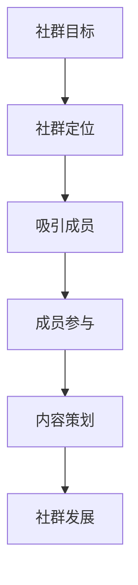

**关系架构解释**：

- 社群目标决定了社群的定位，即社群在市场中希望占据的位置。
- 社群定位直接影响社群吸引的成员类型，进而影响成员的参与度和内容的策划。
- 成员参与度和内容质量是社群发展的关键因素，决定了社群的持续性和活跃度。

#### 2.2 社群规则与制度

**背景介绍**：

社群规则与制度是确保社群运行秩序和成员行为规范的重要保障。良好的规则与制度可以维护社群的稳定和健康发展，防止不良行为和纠纷。

**核心概念与联系**：

社群规则（Community Rules）：指社群内部制定的各项行为规范，如言论准则、行为守则、互动规范等。

社群制度（Community System）：指社群的管理体系，包括成员等级、权益分配、管理团队职责等。

**Mermaid 流�程图**：

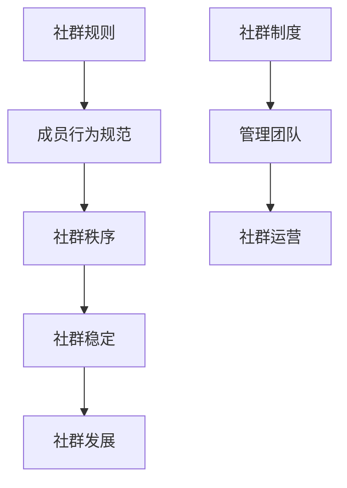

**关系架构解释**：

- 社群规则规范了成员的行为，维护社群的基本秩序。
- 社群秩序是社群稳定的基础，直接影响到社群成员的积极性和满意度。
- 社群制度明确了管理团队的职责和成员的权益，确保社群运营的有序和高效。
- 稳定的社群秩序和有效的制度管理是社群持续发展的关键。

#### 2.3 社群成员管理

**背景介绍**：

社群成员管理是社群运营的核心环节，涉及成员的招募、审核、激励和留存等。有效的成员管理可以提升社群的活跃度和成员的满意度。

**核心概念与联系**：

成员招募（Member Recruitment）：指通过多种渠道吸引潜在成员加入社群。

成员审核（Member Review）：指对新加入的成员进行审核，确保其符合社群标准。

成员激励（Member Incentive）：指通过各种方式激励成员积极参与社群活动。

成员留存（Member Retention）：指采取措施保持成员的长期参与和活跃。

**Mermaid 流程图**：

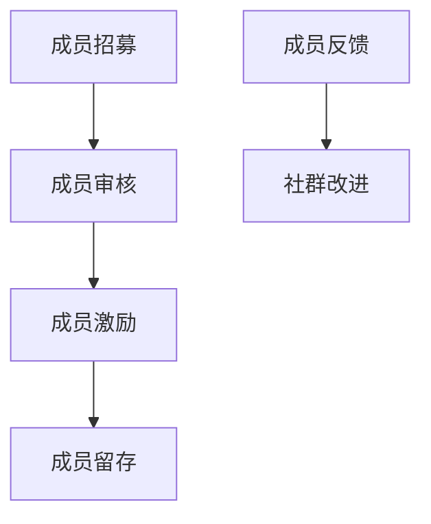

**关系架构解释**：

- 成员招募是社群的基础，决定了社群的规模和成员质量。
- 成员审核确保社群成员的质量和规范，维护社群的秩序。
- 成员激励是提升成员参与度和活跃度的关键，可以通过奖励、荣誉等方式进行。
- 成员留存是社群长期发展的保证，通过定期反馈和改进，确保成员的持续参与。

#### 2.4 内容策划与分享

**背景介绍**：

内容策划与分享是社群的核心活动，直接影响到社群的活跃度和成员的满意度。高质量的内容不仅能够满足成员的知识需求，还能够激发成员的互动和分享意愿。

**核心概念与联系**：

内容策划（Content Planning）：指根据社群目标和成员需求，制定内容策略和计划。

内容分享（Content Sharing）：指社群成员通过文字、图片、视频等多种形式分享知识和经验。

**Mermaid 流程图**：

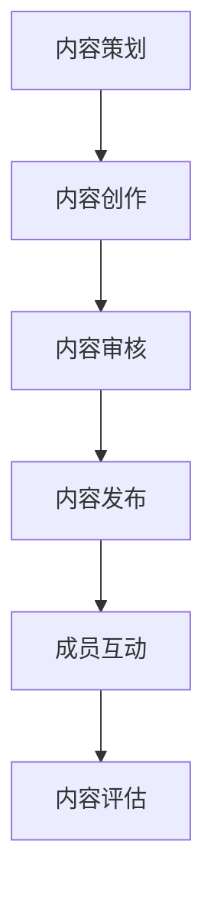

**关系架构解释**：

- 内容策划是社群内容的基础，决定了内容的类型、频率和质量。
- 内容创作是内容策划的延伸，需要根据目标和需求进行创意和执行。
- 内容审核确保内容的质量和合规性，避免不良信息的传播。
- 内容发布是内容策划和创作的结果，需要通过合适的方式和渠道进行传播。
- 成员互动是内容分享的延伸，通过互动激发成员的参与和讨论。
- 内容评估是对内容效果和反馈的总结，为后续的内容策划提供依据。

通过以上四个方面的详细介绍，我们可以看到社群运营基础的全面性和重要性。在接下来的章节中，我们将进一步探讨知识付费模式与运营策略，为打造高活跃度的程序员知识付费社群提供更深入的指导。

#### 2.5 社群运营工具与平台选择

**背景介绍**：

在数字化时代，选择合适的社群运营工具与平台对于提升社群活跃度和运营效率至关重要。不同的工具和平台在功能、用户界面、社区生态等方面各有特点，需要根据社群的定位、目标和资源进行选择。

**核心概念与联系**：

社群运营工具（Community Management Tools）：指用于管理社群、发布内容、监控数据等方面的工具，如微信群、Discourse、Trello等。

社群平台（Community Platforms）：指提供完整社群生态系统和功能的平台，如Reddit、知乎、GitLab等。

**Mermaid 流程图**：

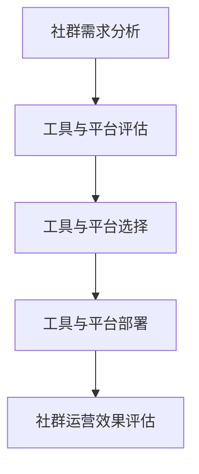

**关系架构解释**：

- 社群需求分析是选择工具与平台的基础，需要明确社群的目标、功能需求和资源情况。
- 工具与平台评估是选择最适合的工具和平台，考虑其功能、用户界面、社区生态等因素。
- 工具与平台选择是确定最终使用的工具和平台，并制定部署计划。
- 工具与平台部署是实施选择的工具和平台，包括账号注册、功能配置、内容导入等。
- 社群运营效果评估是监控和评估工具与平台的使用效果，根据反馈进行调整和优化。

**最佳实践 Tips**：

1. **明确需求**：在开始选择工具与平台之前，明确社群的具体需求，包括功能、用户界面、数据监控等。
2. **试用对比**：在选择工具与平台时，进行试用和对比，以实际使用体验为依据进行选择。
3. **灵活性**：选择具有灵活性和可扩展性的工具与平台，以适应社群未来的发展和需求变化。
4. **用户反馈**：在部署后，定期收集用户反馈，根据反馈进行优化和改进。

通过以上步骤和最佳实践，可以有效提升社群运营效率和成员满意度，为打造高活跃度的程序员知识付费社群奠定基础。

### 第3章 知识付费模式与运营策略

#### 3.1 知识付费的基本原理

**背景介绍**：

知识付费作为一种新兴的商业模式，逐渐成为互联网时代知识传播和消费的重要方式。对于程序员社群而言，知识付费不仅能为社群提供持续的现金流，还能提升社群的附加值和用户粘性。

**核心概念与联系**：

知识付费（Knowledge付费）：指用户为获取高质量知识内容或服务而支付的费用。

商业模式（Business Model）：指企业如何创造、传递和获取价值。

**Mermaid 流程图**：

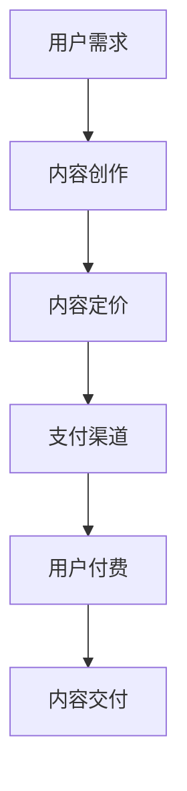

**关系架构解释**：

- 用户需求是知识付费模式的基础，决定了内容创作和定价的方向。
- 内容创作是知识付费的核心，高质量的内容能够满足用户的需求，提升付费意愿。
- 内容定价需要综合考虑内容价值、市场定位和用户承受能力，确保合理和吸引力。
- 支付渠道的便捷性和安全性直接影响用户的付费体验，是知识付费成功的关键。
- 用户付费是知识付费模式的实现环节，通过支付获取内容是用户对知识价值的认可。
- 内容交付是付费的最终目标，确保用户能够顺利获取和使用所学知识。

#### 3.2 程序员知识付费的需求分析

**背景介绍**：

程序员作为知识密集型职业，对于知识和技能的需求尤为强烈。分析程序员的知识付费需求，有助于精准定位内容创作和运营策略。

**核心概念与联系**：

需求分析（Demand Analysis）：指对目标用户的需求进行调研和分析。

知识付费需求（Knowledge Payment Demand）：指用户为获取专业知识和技能所愿意支付的费用。

**Mermaid 流程图**：

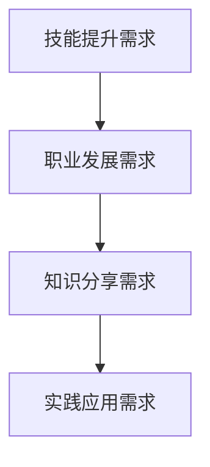

**关系架构解释**：

- 技能提升需求是程序员知识付费的核心，包括编程语言、框架、工具等实用技能。
- 职业发展需求涉及职业规划、面试技巧、团队管理等软技能，有助于职业晋升。
- 知识分享需求包括对前沿技术的探讨、项目经验分享等，满足学习和交流的需求。
- 实践应用需求是指用户希望获取可以直接应用于实际工作的知识和经验，提升工作效率。

**需求分析步骤**：

1. **用户调研**：通过问卷调查、访谈等方式，收集用户的需求和反馈。
2. **数据分析**：对收集的数据进行统计分析，识别主要需求和高频问题。
3. **需求分类**：根据分析结果，将需求进行分类和优先级排序。
4. **内容策划**：根据用户需求，制定内容创作和分享计划。

#### 3.3 社群知识付费的运营策略

**背景介绍**：

社群知识付费的运营策略是确保知识内容能够有效传播、用户愿意付费并持续参与的关键。有效的运营策略包括内容策划、用户互动、商业化路径等多方面。

**核心概念与联系**：

运营策略（Operations Strategy）：指社群在内容创作、用户管理、商业化等方面的策略。

知识内容（Knowledge Content）：指社群提供的专业知识和技能分享。

用户互动（User Interaction）：指社群成员之间的互动和参与。

**Mermaid 流程图**：

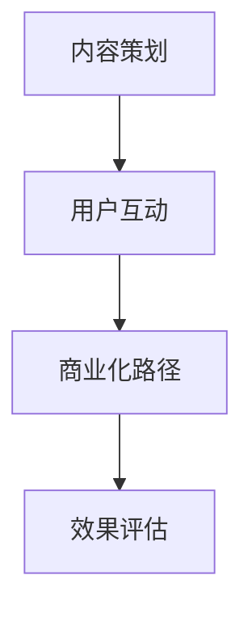

**关系架构解释**：

- 内容策划是社群知识付费的核心，需要根据用户需求制定内容策略，确保内容的质量和吸引力。
- 用户互动是知识传播和用户粘性提升的关键，通过互动激发成员的参与和贡献。
- 商业化路径是知识付费的实现方式，包括内容定价、支付渠道、推广策略等。
- 效果评估是运营策略优化的依据，通过数据分析和用户反馈，持续改进和优化运营策略。

**运营策略步骤**：

1. **内容创作**：根据用户需求，创作高质量、有深度的知识内容。
2. **内容发布**：通过合适的渠道和方式进行内容发布，确保内容的高可见度和传播效果。
3. **用户互动**：设计互动机制，激发成员的参与和分享意愿，提高用户粘性。
4. **商业化实现**：制定合理的收费标准和支付渠道，实现知识的商业化。
5. **数据监控**：通过数据分析和用户反馈，监控运营效果，持续优化策略。

通过以上步骤和策略，可以有效实现社群知识付费，提升社群的附加值和用户满意度。

#### 3.4 社群商业化路径

**背景介绍**：

社群商业化是确保社群长期可持续发展的关键。通过合理的商业化路径，社群不仅能够提供有价值的内容和服务，还能够实现经济效益，为社群运营提供资金支持。

**核心概念与联系**：

商业化路径（Commercial Path）：指社群通过提供有偿内容、服务或产品，实现盈利的途径。

盈利模式（Profit Model）：指社群通过哪些方式获取收益。

**Mermaid 流程图**：

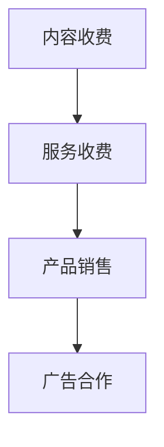

**关系架构解释**：

- 内容收费是通过售卖优质的知识内容，如课程、电子书、教程等，获取收益。
- 服务收费是通过提供专业咨询服务、培训服务、技术支持等，获取收益。
- 产品销售是通过售卖相关产品，如编程工具、开发工具、配件等，获取收益。
- 广告合作是通过与相关企业或品牌合作，在其平台上投放广告，获取收益。

**商业化路径选择**：

1. **内容收费**：适合有独特内容和专业知识的高质量社群，如专业培训机构或技术大牛社群。
2. **服务收费**：适合有专业背景或技能的社群成员，如技术专家、咨询师等。
3. **产品销售**：适合有实体产品或可以在线销售的产品，如编程工具、软件开发等。
4. **广告合作**：适合用户规模较大、用户活跃度较高的社群，通过广告位和品牌合作获取收益。

**案例分析与实践**：

1. **案例一**：某技术大牛社群通过售卖高质量教程和课程，吸引了大量付费用户，实现了良好的经济效益。
2. **案例二**：某编程学习社群通过与编程工具公司的合作，推出优惠套餐，提高了社群成员的参与度和收益。
3. **案例三**：某IT职业社群通过提供职业咨询和面试辅导服务，建立了良好的口碑和稳定的收入来源。

通过以上案例和实践，我们可以看到，合理的商业化路径不仅可以实现社群的经济效益，还能够提升社群的价值和吸引力。

#### 第4章 社群活跃度提升策略

#### 4.1 社群活跃度的评估指标

**背景介绍**：

社群活跃度是衡量社群健康和活力的重要指标。通过科学的评估指标，可以全面了解社群的运营状况，发现潜在问题，并为后续的运营策略提供依据。

**核心概念与联系**：

活跃度指标（Activity Metrics）：指用于衡量社群成员参与和互动情况的量化标准。

**Mermaid 流程图**：

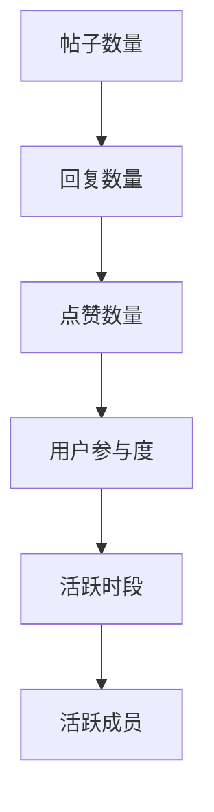

**关系架构解释**：

- **帖子数量**：指社群内发布的帖子总数，反映了社群的内容发布频率。
- **回复数量**：指对帖子的回复总数，反映了成员的互动程度和参与度。
- **点赞数量**：指帖子、回复等内容的点赞数，反映了成员对内容的认可和喜爱程度。
- **用户参与度**：指成员在社群中的参与程度，包括发帖、回复、点赞等多种互动行为。
- **活跃时段**：指社群成员活跃的时间段，有助于了解社群的活跃时间和用户习惯。
- **活跃成员**：指在社群中表现活跃的成员，包括频繁发帖、积极互动等。

**常见评估指标**：

1. **帖子发布频率**：衡量社群内容更新的速度和质量。
2. **帖子和回复的数量**：反映社群的互动程度和成员参与度。
3. **点赞和分享的数量**：反映内容的受欢迎程度和传播效果。
4. **成员在线时长**：衡量成员在社群中的活跃程度和在线时间。
5. **新成员加入和留存率**：反映社群的吸引力和成员的忠诚度。

**Mermaid 流程图**：

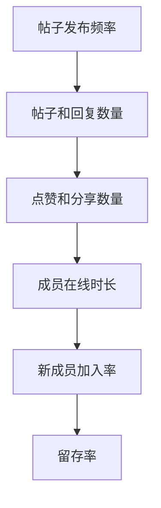

通过科学设置和监测这些指标，社群运营者可以全面了解社群的运营状况，制定有针对性的提升策略。

#### 4.2 社群互动机制设计

**背景介绍**：

社群互动机制是激发成员参与和互动的关键。通过设计有效的互动机制，可以增强社群的凝聚力，提升活跃度和用户满意度。

**核心概念与联系**：

互动机制（Interaction Mechanism）：指社群中成员互动的规则和方式。

**Mermaid 流程图**：

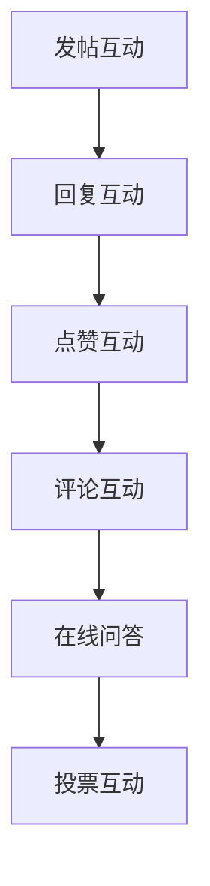

**关系架构解释**：

- **发帖互动**：通过鼓励成员发表观点、分享经验和知识，提升内容质量和讨论深度。
- **回复互动**：通过回复和讨论，促进成员之间的交流和互动，增强社群氛围。
- **点赞互动**：通过点赞机制，鼓励成员对优质内容和观点进行认可和传播，提升内容影响力。
- **评论互动**：通过评论功能，允许成员对内容进行深入探讨和交流，促进知识共享。
- **在线问答**：通过实时问答，解决成员的问题，提升社群的知识传递效率。
- **投票互动**：通过投票机制，收集成员的意见和建议，提升社群的民主性和活跃度。

**互动机制设计步骤**：

1. **需求分析**：了解社群成员的需求和互动习惯，制定相应的互动机制。
2. **功能规划**：根据需求分析，设计互动功能，包括发帖、回复、点赞、评论等。
3. **机制测试**：在社群内部进行互动机制的测试，收集反馈并优化机制。
4. **机制推广**：通过宣传和推广，提高成员对互动机制的认知和使用率。

通过以上步骤，可以有效设计出适合社群的互动机制，提升社群的活跃度和成员的参与度。

#### 4.3 社群活动策划与执行

**背景介绍**：

社群活动是增强社群活力和成员互动的重要手段。通过精心策划和执行社群活动，可以提升社群的凝聚力，增加成员的归属感和参与度。

**核心概念与联系**：

活动策划（Event Planning）：指针对社群活动进行的内容设计、时间安排和资源调配。

活动执行（Event Execution）：指按照策划方案，组织和执行社群活动。

**Mermaid 流程图**：

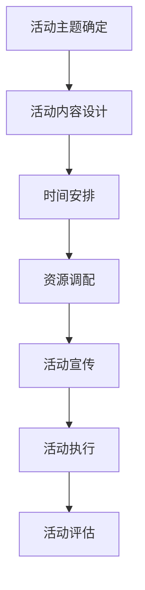

**关系架构解释**：

- **活动主题确定**：根据社群目标和成员需求，确定活动的主题和方向。
- **活动内容设计**：制定活动的内容和流程，包括讲座、工作坊、竞赛等。
- **时间安排**：确定活动的具体时间和持续时间，确保成员有时间参与。
- **资源调配**：准备活动所需的资源，包括场地、设备、嘉宾等。
- **活动宣传**：通过多种渠道宣传活动，吸引成员参与和关注。
- **活动执行**：按照策划方案，组织和执行活动，确保活动顺利进行。
- **活动评估**：对活动效果进行评估，收集反馈并总结经验，为未来活动提供参考。

**活动策划与执行步骤**：

1. **需求调研**：通过问卷调查、访谈等方式，了解成员对活动的需求和期望。
2. **主题确定**：根据调研结果，确定活动的主题和方向。
3. **内容设计**：制定详细的活动内容和流程，确保活动具有吸引力和实用性。
4. **时间安排**：确定活动的具体时间和持续时间，确保活动不与其他重要事件冲突。
5. **资源调配**：准备活动所需的资源，包括场地、设备、嘉宾等，确保活动顺利进行。
6. **宣传推广**：通过社群内的公告、社交媒体、邮件等方式，宣传活动，提高参与度。
7. **活动执行**：按照策划方案，组织和执行活动，确保活动顺利进行。
8. **活动评估**：对活动效果进行评估，收集反馈并总结经验，为未来活动提供参考。

通过以上步骤，可以有效策划和执行社群活动，提升社群的活跃度和成员的满意度。

#### 4.4 社群影响力人物培育

**背景介绍**：

社群影响力人物是社群中具有较高声誉、影响力和话语权的成员。培育社群影响力人物不仅能够提升社群的吸引力和权威性，还能够促进社群的活跃度和互动性。

**核心概念与联系**：

影响力人物（Influential Figures）：指在社群中具有较高影响力和话语权的成员。

培育（Nurturing）：指通过培养和支持，使成员在社群中发挥更大的影响力。

**Mermaid 流程图**：

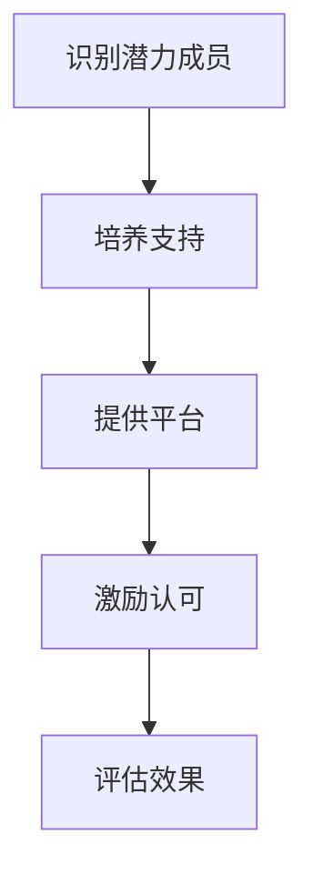

**关系架构解释**：

- **识别潜力成员**：通过观察成员的活跃度、贡献度和专业背景，识别具有潜力的成员。
- **培养支持**：通过提供培训、指导和支持，帮助潜力成员提升专业技能和影响力。
- **提供平台**：为影响力人物提供展示和分享的平台，如讲座、专栏、访谈等。
- **激励认可**：通过奖励、荣誉等方式，激励影响力人物继续为社群贡献力量。
- **评估效果**：对影响力人物的效果进行评估，根据反馈进行调整和优化。

**培育策略**：

1. **专业培训**：提供专业技能培训，帮助成员提升专业水平和影响力。
2. **实践机会**：提供实践机会，让成员在真实项目中积累经验。
3. **互动平台**：为成员提供展示和分享的平台，如线上讲座、专栏、博客等。
4. **荣誉奖励**：通过评选和奖励，认可成员的贡献，激励更多成员参与。
5. **长期支持**：持续关注和支持影响力人物，帮助他们持续成长和发挥更大的影响力。

通过以上策略，可以有效培育社群影响力人物，提升社群的整体活跃度和影响力。

### 第5章 社群用户增长策略

#### 5.1 用户获取渠道分析

**背景介绍**：

用户获取是社群增长的关键环节。通过分析不同的用户获取渠道，社群运营者可以找到最适合自己社群的增长策略，并有效扩大社群规模。

**核心概念与联系**：

用户获取（User Acquisition）：指通过各种渠道吸引新用户加入社群。

渠道分析（Channel Analysis）：指对各类用户获取渠道进行评估和选择。

**Mermaid 流程图**：

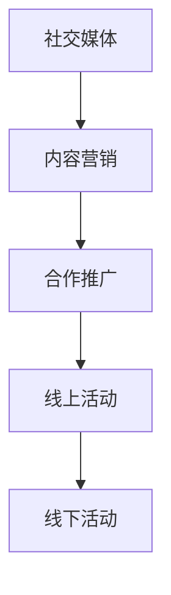

**关系架构解释**：

- **社交媒体**：通过微博、微信、抖音等社交平台进行宣传和推广，吸引潜在用户。
- **内容营销**：通过创作和分享高质量内容，如博客、视频、电子书等，吸引用户关注和加入。
- **合作推广**：与其他相关社群、企业或个人合作，进行联合推广，扩大社群影响力。
- **线上活动**：通过线上讲座、研讨会、竞赛等活动，吸引用户参与和关注。
- **线下活动**：通过线下聚会、沙龙、会议等活动，面对面接触潜在用户，提高用户粘性。

**渠道分析步骤**：

1. **目标用户分析**：确定社群的目标用户群体，了解其兴趣、需求和渠道偏好。
2. **渠道评估**：对各个渠道的潜在用户数量、获取成本、转化率等进行评估。
3. **渠道选择**：根据评估结果，选择最适合社群的用户获取渠道。
4. **策略制定**：为每个渠道制定具体的推广策略和活动计划。

通过以上步骤，社群运营者可以科学地选择和利用用户获取渠道，实现社群的持续增长。

#### 5.2 用户增长策略制定

**背景介绍**：

制定有效的用户增长策略是社群持续发展的关键。通过结合社群特点和目标用户需求，运营者可以设计出具体可行的增长方案，确保社群规模的稳步扩大。

**核心概念与联系**：

用户增长策略（User Growth Strategy）：指通过系统化的方法和步骤，实现社群用户数量和活跃度的提升。

**Mermaid 流程图**：

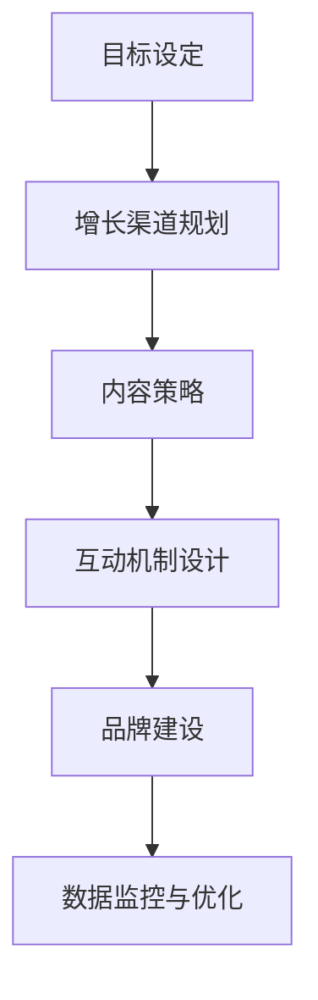

**关系架构解释**：

- **目标设定**：明确社群的用户增长目标，包括增长数量、增长速度、用户活跃度等。
- **增长渠道规划**：根据目标用户的特点，选择适合的用户获取渠道，制定具体的增长计划。
- **内容策略**：通过高质量的内容创作和分享，满足用户的需求，提升社群的吸引力。
- **互动机制设计**：设计有效的互动机制，鼓励用户参与和分享，增强社群的活跃度。
- **品牌建设**：通过品牌定位、形象塑造和口碑传播，提升社群的知名度和美誉度。
- **数据监控与优化**：通过数据分析和用户反馈，持续优化增长策略，确保效果最大化。

**用户增长策略制定步骤**：

1. **市场调研**：了解目标用户的需求、行为和偏好，为增长策略提供数据支持。
2. **目标设定**：根据市场调研结果，设定具体的增长目标，包括增长数量、增长速度等。
3. **渠道规划**：选择适合社群的用户获取渠道，并制定详细的推广计划。
4. **内容策略**：制定内容创作和分享计划，确保内容的高质量和针对性。
5. **互动机制设计**：设计互动机制，鼓励用户参与和分享，提升社群活跃度。
6. **品牌建设**：通过品牌定位、形象塑造和口碑传播，提升社群的知名度和美誉度。
7. **数据监控与优化**：通过数据分析和用户反馈，持续监控增长策略的效果，并根据反馈进行调整和优化。

通过以上步骤，社群运营者可以制定出科学、可行的用户增长策略，实现社群的持续增长和发展。

#### 5.3 社群品牌建设

**背景介绍**：

社群品牌建设是提升社群知名度和美誉度的关键。通过有效的品牌建设策略，社群可以在竞争激烈的市场中脱颖而出，吸引更多的潜在用户和成员。

**核心概念与联系**：

品牌建设（Brand Building）：指通过一系列策略和行动，塑造和提升社群的品牌形象和影响力。

**Mermaid 流程图**：

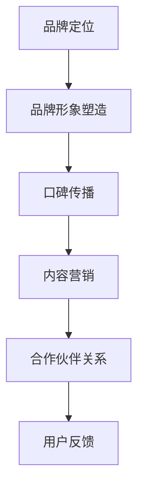

**关系架构解释**：

- **品牌定位**：明确社群的品牌定位和目标用户，确保品牌形象的精准传达。
- **品牌形象塑造**：通过视觉设计、文字描述等方式，塑造社群的独特形象和风格。
- **口碑传播**：通过用户推荐和好评，提升社群的品牌影响力和信誉度。
- **内容营销**：通过高质量的内容创作和分享，提升社群的吸引力和用户粘性。
- **合作伙伴关系**：与其他相关社群、企业或个人建立合作关系，扩大社群的影响力和资源。
- **用户反馈**：通过收集用户反馈，不断优化品牌建设策略，确保品牌形象与用户需求相符。

**社群品牌建设策略**：

1. **明确品牌定位**：根据社群特点和目标用户，确定品牌的核心价值和独特卖点。
2. **设计品牌形象**：通过视觉设计和文字描述，塑造社群的独特形象和风格。
3. **内容营销**：创作和分享高质量、有价值的内容，提升社群的吸引力和用户粘性。
4. **口碑传播**：鼓励用户分享好评和推荐，提升社群的品牌影响力和信誉度。
5. **合作伙伴关系**：与其他相关社群、企业或个人建立合作关系，扩大社群的影响力和资源。
6. **用户反馈**：定期收集用户反馈，优化品牌建设策略，确保品牌形象与用户需求相符。

通过以上策略，社群可以成功建立品牌，提升在市场中的竞争力和吸引力。

#### 5.4 用户留存与转化策略

**背景介绍**：

用户留存与转化是社群运营的重要目标之一。通过有效的用户留存与转化策略，社群可以保持成员的活跃度，提高付费转化率，从而实现长期健康发展。

**核心概念与联系**：

用户留存（User Retention）：指采取措施保持用户在社群中的持续参与。
用户转化（User Conversion）：指将潜在用户转化为付费用户或活跃贡献者的过程。

**Mermaid 流程图**：

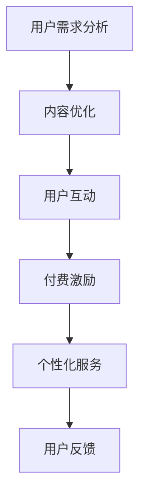

**关系架构解释**：

- **用户需求分析**：了解用户的需求和行为习惯，为内容优化和用户互动提供依据。
- **内容优化**：根据用户需求，持续优化社群的内容，提升用户满意度和参与度。
- **用户互动**：设计互动机制，激发用户的参与和贡献，增强社群的活跃度。
- **付费激励**：提供付费内容和增值服务，激励用户转化为付费用户。
- **个性化服务**：根据用户特点和需求，提供个性化的服务和体验，提升用户的忠诚度。
- **用户反馈**：收集用户反馈，不断优化留存与转化策略，确保策略的有效性。

**用户留存与转化策略**：

1. **需求分析**：定期进行用户调研，了解用户的需求和痛点，为内容优化提供依据。
2. **内容优化**：根据用户需求，持续更新和优化社群内容，确保内容的高质量和相关性。
3. **用户互动**：设计互动机制，如讨论区、问答、投票等，激发用户的参与和贡献。
4. **付费激励**：提供免费试用、折扣优惠、会员权益等激励措施，吸引用户转化为付费用户。
5. **个性化服务**：根据用户特点和需求，提供个性化的内容和体验，提升用户的忠诚度。
6. **用户反馈**：定期收集用户反馈，根据反馈进行策略调整和优化，确保策略的有效性。

通过以上策略，社群可以有效提升用户留存率和转化率，实现长期健康发展。

### 第6章 社群案例分析

#### 6.1 成功社群案例分析

**背景介绍**：

成功社群案例是学习和借鉴的最佳范例。通过分析成功社群的运营实践，我们可以总结出有效的策略和方法，为自身社群的运营提供参考。

**案例一：某知名技术社区**

**背景**：某知名技术社区是一个专注于编程技术分享和讨论的平台，通过高质量的内容和丰富的互动机制，吸引了大量程序员用户。

**成功因素**：

1. **内容高质量**：社区提供高质量的技术文章、视频教程和在线讲座，满足用户的学习需求。
2. **互动机制**：设有讨论区、问答区、投票区等多个互动模块，鼓励用户参与和分享。
3. **用户激励机制**：设立积分系统和荣誉制度，激励用户积极贡献内容。
4. **合作伙伴关系**：与多家知名企业和技术专家合作，扩大社区的影响力和资源。

**经验总结**：

- **高质量内容**：确保内容的高质量和相关性，满足用户的学习需求。
- **互动机制**：设计多样化的互动机制，增强用户的参与感和归属感。
- **激励机制**：提供有效的激励机制，激励用户积极贡献和参与。
- **合作伙伴关系**：与相关企业和个人建立良好的合作关系，扩大社群的影响力和资源。

**案例二：某编程学习社群**

**背景**：某编程学习社群是一个针对编程初学者和中级程序员的学习和交流平台，通过在线课程、实战项目和问答环节，帮助用户提升编程技能。

**成功因素**：

1. **课程设置**：提供系统化、分层次的课程，覆盖从入门到高级的各个阶段。
2. **实战项目**：通过实战项目，帮助用户将所学知识应用到实际工作中。
3. **问答环节**：设有专业的导师团队，及时解答用户在学习过程中遇到的问题。
4. **社区文化**：建立积极的社区文化，鼓励成员互助合作，共同进步。

**经验总结**：

- **系统化课程**：提供系统化的课程设置，满足不同层次用户的学习需求。
- **实战项目**：通过实战项目，提高用户的学习效果和实际应用能力。
- **专业支持**：提供专业的导师团队和问答服务，解决用户在学习中的困难。
- **积极社区文化**：建立积极的社区文化，鼓励成员互助合作，共同进步。

通过以上两个成功案例，我们可以看到，成功社群的共同特点是提供高质量的内容、设计多样化的互动机制、建立有效的激励机制和建立良好的合作伙伴关系。

#### 6.2 失败社群案例分析

**背景介绍**：

失败社群案例可以为我们提供宝贵的教训，帮助我们在运营社群时避免犯类似的错误。通过分析失败社群的运营实践，我们可以总结出失败的原因和教训，为自身的社群运营提供警示。

**案例一：某IT技术社群**

**背景**：某IT技术社群由于管理不善、内容单一和缺乏互动，导致活跃度下降，成员流失严重。

**失败原因**：

1. **管理不善**：社群管理团队缺乏有效的管理和监督，导致社群秩序混乱，成员积极性下降。
2. **内容单一**：社群内容更新速度慢，内容类型单一，难以满足成员的多样化需求。
3. **缺乏互动**：社群缺乏有效的互动机制，成员之间缺乏交流，导致社群氛围沉闷。

**教训总结**：

- **有效管理**：建立完善的管理制度和团队，确保社群的有序运行。
- **多样化内容**：提供多样化的内容，满足不同层次和需求的成员。
- **互动机制**：设计多样化的互动机制，增强成员之间的交流和互动。

**案例二：某编程学习社群**

**背景**：某编程学习社群由于课程设置不合理、用户反馈处理不及时，导致用户满意度低，社群活跃度下降。

**失败原因**：

1. **课程设置不合理**：社群提供的课程过于理论化，缺乏实战环节，无法满足用户的实际需求。
2. **用户反馈处理不及时**：社群对用户的反馈和问题处理不及时，导致用户对社群的信任度下降。
3. **缺乏激励机制**：社群缺乏有效的激励机制，用户缺乏参与和贡献的动力。

**教训总结**：

- **合理课程设置**：结合用户需求，提供系统化、实战化的课程设置。
- **及时反馈处理**：及时处理用户的反馈和问题，提高用户的满意度和信任度。
- **激励机制**：提供有效的激励机制，激励用户参与和贡献。

通过以上两个失败案例，我们可以看到，失败社群的主要原因是管理不善、内容单一和缺乏互动，这些问题导致了社群的活跃度下降和成员流失。从中我们可以吸取教训，确保在运营社群时避免犯类似的错误。

#### 6.3 案例分析与启示

**背景介绍**：

通过对成功社群和失败社群的案例分析，我们可以总结出一系列成功和失败的运营经验，这些经验对于提升社群的活跃度和用户满意度具有重要启示。

**成功经验**：

1. **高质量内容**：成功社群普遍注重内容的质量，提供高质量、有价值的内容，满足用户的学习和交流需求。
2. **多样化互动**：成功社群设计多样化的互动机制，鼓励成员之间的交流、互动和贡献。
3. **用户激励机制**：成功社群通过积分、荣誉等激励机制，激励用户积极参与和贡献。
4. **合作伙伴关系**：成功社群通过与相关企业和个人建立合作关系，扩大社群的影响力和资源。

**失败教训**：

1. **管理不善**：失败社群缺乏有效的管理和监督，导致社群秩序混乱，成员积极性下降。
2. **内容单一**：失败社群内容更新速度慢，内容类型单一，难以满足成员的多样化需求。
3. **缺乏互动**：失败社群缺乏有效的互动机制，成员之间缺乏交流，导致社群氛围沉闷。

**启示与建议**：

1. **内容质量**：确保社群内容的高质量，满足用户的学习和交流需求。
2. **互动机制**：设计多样化的互动机制，增强成员之间的互动和交流。
3. **激励机制**：建立有效的激励机制，激励用户积极参与和贡献。
4. **合作伙伴关系**：与相关企业和个人建立合作关系，扩大社群的影响力和资源。
5. **管理监督**：建立完善的管理制度和团队，确保社群的有序运行。

通过以上分析和启示，社群运营者可以借鉴成功经验，避免失败教训，打造一个高活跃度的程序员知识付费社群。

### 第7章 社群运营工具与平台

#### 7.1 社群管理工具选择

**背景介绍**：

在社群运营过程中，选择合适的社群管理工具对于提升运营效率和用户体验至关重要。不同的工具在功能、用户界面、数据处理等方面各有优势，需要根据社群的规模、目标和资源进行选择。

**核心概念与联系**：

社群管理工具（Community Management Tools）：指用于管理社群、发布内容、监控数据等方面的工具，如微信群、Discourse、Trello等。

**Mermaid 流程图**：

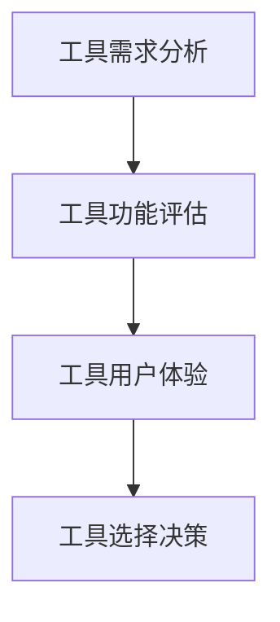

**关系架构解释**：

- **工具需求分析**：明确社群的运营需求，包括功能需求、数据处理能力、用户界面需求等。
- **工具功能评估**：评估不同社群管理工具的功能和特点，确保所选工具能够满足需求。
- **工具用户体验**：考虑工具的用户界面友好度、操作便捷性等，提升用户体验。
- **工具选择决策**：根据需求分析和功能评估，选择最适合社群的运营工具。

**选择步骤**：

1. **需求调研**：通过问卷、访谈等方式，了解社群运营的具体需求和期望。
2. **功能评估**：评估工具的功能和性能，包括内容管理、用户管理、数据监控等。
3. **用户体验**：测试工具的用户界面和操作流程，确保用户能够轻松上手。
4. **选择决策**：根据需求分析和功能评估结果，选择最适合社群的运营工具。

#### 7.2 社群互动平台功能

**背景介绍**：

社群互动平台是提升社群活跃度和用户满意度的重要工具。通过丰富的互动平台功能，社群可以提供多样化的互动体验，增强成员之间的交流和参与度。

**核心概念与联系**：

互动平台功能（Interactive Platform Functions）：指社群互动平台提供的各种互动功能，如讨论区、问答、投票等。

**Mermaid 流程图**：

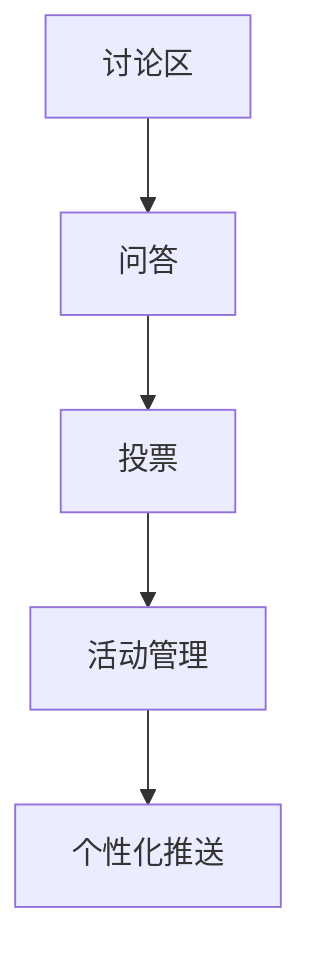

**关系架构解释**：

- **讨论区**：提供成员之间交流和讨论的场所，是社群互动的核心功能。
- **问答**：通过问答功能，解决成员的问题，增强互动性和知识共享。
- **投票**：提供投票功能，收集成员的意见和建议，提升社群的民主性和参与度。
- **活动管理**：通过活动管理功能，组织和发布社群活动，提升社群的互动性和活跃度。
- **个性化推送**：根据成员的兴趣和行为，提供个性化的内容推送，提升用户粘性和满意度。

**功能设计要点**：

1. **讨论区**：设计灵活的讨论区，支持分类、标签、搜索等功能，提升用户体验。
2. **问答**：设置专业的问答机制，确保问题得到及时解答，提升知识传递效率。
3. **投票**：提供多样的投票形式，如单选、多选、评分等，满足不同的互动需求。
4. **活动管理**：设计便捷的活动发布和管理功能，确保活动顺利进行。
5. **个性化推送**：基于用户行为和兴趣，提供个性化的内容推荐，提升用户满意度。

#### 7.3 社群运营数据监控

**背景介绍**：

社群运营数据监控是确保社群运营效果的重要环节。通过监控关键数据指标，运营者可以实时了解社群的运行状况，发现潜在问题，并采取相应措施进行优化。

**核心概念与联系**：

数据监控（Data Monitoring）：指对社群运营过程中产生的数据进行实时监控和分析。

**Mermaid 流程图**：

```mermaid
graph TD
A[活跃度指标] --> B[用户参与度]
B --> C[内容质量]
C --> D[用户留存率]
D --> E[转化率]
E --> F[反馈与改进]
```

**关系架构解释**：

- **活跃度指标**：监控社群的帖子数量、回复数量、点赞数量等，反映社群的活跃度。
- **用户参与度**：监控用户的发帖、回复、点赞等行为，反映用户的参与度和活跃度。
- **内容质量**：监控内容的阅读量、转发量、评论量等，评估内容的质量和受欢迎程度。
- **用户留存率**：监控用户的活跃周期、留存时间等，反映用户的粘性和忠诚度。
- **转化率**：监控用户的付费转化率、参与活动率等，评估商业化效果。
- **反馈与改进**：收集用户的反馈和建议，根据反馈进行运营策略的调整和改进。

**监控指标设置**：

1. **活跃度指标**：设定帖子发布频率、回复数量、点赞数量等作为关键指标。
2. **用户参与度**：设定发帖量、回复量、点赞量、评论量等作为关键指标。
3. **内容质量**：设定阅读量、转发量、评论量、点赞量等作为关键指标。
4. **用户留存率**：设定用户活跃周期、留存时间等作为关键指标。
5. **转化率**：设定付费转化率、活动参与率等作为关键指标。

**监控步骤**：

1. **数据采集**：通过社群管理工具和平台，自动采集运营数据。
2. **数据清洗**：对采集的数据进行清洗和整理，确保数据的准确性和一致性。
3. **数据监控**：设置实时监控警报，及时发现异常数据并采取相应措施。
4. **数据分析**：对监控数据进行定期分析和报告，为运营策略提供依据。

通过以上步骤，社群运营者可以实时了解社群运营状况，及时发现问题并进行优化，确保社群的长期健康发展。

#### 7.4 社群运营成本分析

**背景介绍**：

社群运营成本分析是确保社群可持续运营的重要环节。通过对运营成本的详细分析，社群运营者可以合理规划预算，提高资源利用效率，确保社群的长期发展。

**核心概念与联系**：

运营成本（Operations Cost）：指社群在运营过程中所产生的各种成本，包括人力、技术、内容制作等。

成本分析（Cost Analysis）：指对社群运营成本进行分类、评估和分析，以优化成本结构。

**Mermaid 流程图**：

```mermaid
graph TD
A[人力成本] --> B[技术成本]
B --> C[内容成本]
C --> D[活动成本]
D --> E[总成本分析]
```

**关系架构解释**：

- **人力成本**：包括社群管理团队的工资、培训费用等。
- **技术成本**：包括社群管理工具的购买、维护费用、服务器租赁费用等。
- **内容成本**：包括内容创作、审核、发布等各个环节的成本。
- **活动成本**：包括线下活动、线上活动等组织过程中的成本。
- **总成本分析**：对各项成本进行汇总和评估，为预算规划和成本控制提供依据。

**成本分析步骤**：

1. **成本分类**：将社群运营成本分为人力、技术、内容、活动等类别。
2. **成本估算**：对各项成本进行估算，确定合理的预算范围。
3. **成本控制**：通过优化运营流程和提高效率，降低不必要的成本支出。
4. **成本评估**：定期对成本进行评估和分析，确保成本在合理范围内。

**成本控制措施**：

1. **优化人力配置**：合理分配人力资源，提高工作效率。
2. **技术选型**：选择性价比高的技术方案，降低技术成本。
3. **内容创作**：提高内容质量，减少内容制作成本。
4. **活动策划**：合理规划活动规模和预算，提高活动效果。

通过详细的分析和合理的控制，社群运营者可以确保社群的运营成本在合理范围内，实现可持续发展。

### 第8章 社群运营风险与挑战

#### 8.1 社群管理风险

**背景介绍**：

社群管理风险是指社群在运营过程中可能面临的管理问题，这些问题可能对社群的稳定性和发展产生负面影响。有效的管理是确保社群健康运营的关键，但同时也面临着多种潜在风险。

**核心概念与联系**：

社群管理风险（Community Management Risk）：指社群在管理过程中可能遇到的各种风险，包括成员管理、内容管理、制度执行等。

**Mermaid 流程图**：

```mermaid
graph TD
A[成员管理风险] --> B[内容管理风险]
B --> C[制度执行风险]
```

**关系架构解释**：

- **成员管理风险**：包括成员招募、审核、激励等方面的风险，如成员质量不高、不良行为等。
- **内容管理风险**：包括内容审核、内容质量、版权问题等风险，如内容不当、侵权等。
- **制度执行风险**：包括制度落实、管理团队执行力等风险，如制度不健全、执行力不足等。

**常见管理风险**：

1. **成员管理风险**：成员质量参差不齐，可能包含不合适的成员或不良行为者。
2. **内容管理风险**：内容质量不高或存在不当内容，可能引起争议或法律问题。
3. **制度执行风险**：制度无法有效执行，可能导致管理混乱或成员不满。

**风险应对策略**：

1. **严格成员审核**：设立严格的成员审核机制，确保招募到合适的成员。
2. **内容质量监控**：建立内容审核机制，确保内容质量和合规性。
3. **制度落实**：加强制度执行，确保管理团队的执行力。

通过识别和管理这些风险，社群运营者可以确保社群的稳定和健康发展。

#### 8.2 社群内容风险

**背景介绍**：

社群内容风险是指社群在内容创作、审核和发布过程中可能遇到的各种风险，包括内容不当、版权问题、信息泄露等。这些风险可能对社群的声誉和成员满意度产生负面影响，甚至引发法律纠纷。

**核心概念与联系**：

内容风险（Content Risk）：指社群在内容创作、审核和发布过程中可能面临的各种风险。

**Mermaid 流程图**：

```mermaid
graph TD
A[内容不当风险] --> B[版权风险]
B --> C[信息泄露风险]
```

**关系架构解释**：

- **内容不当风险**：包括发布不当言论、敏感内容等，可能引起成员不满或法律问题。
- **版权风险**：包括内容侵权、版权纠纷等，可能涉及法律风险和声誉损失。
- **信息泄露风险**：包括个人信息泄露、数据泄露等，可能对社群和成员造成损失。

**常见内容风险**：

1. **内容不当风险**：包括色情、暴力、歧视等不当言论，可能引起争议或法律问题。
2. **版权风险**：包括抄袭、侵权等，可能涉及法律纠纷和版权所有者的损失。
3. **信息泄露风险**：包括个人隐私泄露、技术漏洞导致的数据泄露等，可能对社群和成员造成严重损失。

**风险应对策略**：

1. **内容审核**：建立严格的内容审核机制，确保发布的内容符合社群规范和法律法规。
2. **版权保护**：对原创内容进行版权登记和保护，防止侵权行为。
3. **信息安全**：加强数据保护和信息安全措施，防止信息泄露。

通过以上策略，可以有效降低社群内容风险，确保社群的健康和可持续发展。

#### 8.3 社群用户风险

**背景介绍**：

社群用户风险是指社群在用户管理、互动和商业化过程中可能面临的各种风险，包括用户行为不当、数据隐私问题、用户流失等。这些风险可能对社群的稳定性和发展产生负面影响。

**核心概念与联系**：

用户风险（User Risk）：指社群在用户管理、互动和商业化过程中可能面临的各种风险。

**Mermaid 流程图**：

```mermaid
graph TD
A[用户行为风险] --> B[数据隐私风险]
B --> C[用户流失风险]
```

**关系架构解释**：

- **用户行为风险**：包括用户发布不当言论、恶意攻击、违规操作等行为，可能引起社群纠纷和法律问题。
- **数据隐私风险**：包括用户个人信息泄露、数据滥用等，可能影响用户信任和社群声誉。
- **用户流失风险**：包括用户满意度低、服务质量差等，可能导致用户流失和社群规模缩小。

**常见用户风险**：

1. **用户行为风险**：包括恶意灌水、发布广告、发布垃圾信息等，可能影响社群氛围和用户体验。
2. **数据隐私风险**：包括用户信息泄露、数据滥用等，可能对用户隐私造成侵犯。
3. **用户流失风险**：包括服务质量差、内容不吸引等，可能导致用户不满意和流失。

**风险应对策略**：

1. **用户行为规范**：制定严格的用户行为规范，加强对用户行为的监控和管理。
2. **数据保护**：加强数据保护措施，确保用户信息的安全和隐私。
3. **提升服务质量**：提供高质量的内容和服务，提升用户满意度和忠诚度。

通过以上策略，可以有效降低社群用户风险，确保社群的稳定和健康发展。

#### 8.4 社群发展挑战

**背景介绍**：

社群在发展过程中可能会遇到多种挑战，包括市场竞争、技术变革、用户需求变化等。这些挑战可能对社群的持续发展和运营带来负面影响，需要社群运营者积极应对和解决。

**核心概念与联系**：

社群发展挑战（Community Development Challenges）：指社群在发展过程中可能遇到的各种挑战。

**Mermaid 流程图**：

```mermaid
graph TD
A[市场竞争] --> B[技术变革]
B --> C[用户需求变化]
```

**关系架构解释**：

- **市场竞争**：指其他类似社群的竞争，可能对社群的吸引力和用户获取造成影响。
- **技术变革**：指信息技术的发展，可能带来新的机会和挑战，如新兴技术的应用。
- **用户需求变化**：指用户需求的变化，可能需要社群调整内容和运营策略以适应新的需求。

**常见发展挑战**：

1. **市场竞争**：类似社群的竞争，可能导致用户流失和市场份额缩小。
2. **技术变革**：新兴技术的应用可能带来新的机会，但同时也可能对现有运营模式造成冲击。
3. **用户需求变化**：用户需求的变化可能需要社群调整内容和运营策略，以满足新的需求。

**应对策略**：

1. **市场竞争**：通过差异化策略和优质内容，提升社群的竞争力和吸引力。
2. **技术变革**：积极拥抱新技术，提高运营效率和用户体验。
3. **用户需求变化**：通过用户调研和市场分析，及时调整内容和运营策略。

通过积极应对这些挑战，社群可以持续发展，并在竞争激烈的市场中保持优势。

### 第9章 社群可持续发展策略

#### 9.1 社群长期发展目标

**背景介绍**：

社群的长期发展目标是确保社群在长期运营中能够持续吸引新成员、保持高活跃度和高质量内容的关键。明确的长期发展目标可以帮助社群运营者制定可持续的运营策略，实现社群的持续成长。

**核心概念与联系**：

长期发展目标（Long-term Development Goals）：指社群在长期运营过程中希望达成的目标，包括社群规模、活跃度、内容质量等。

**Mermaid 流程图**：

```mermaid
graph TD
A[用户增长目标] --> B[活跃度目标]
B --> C[内容质量目标]
C --> D[社群品牌目标]
```

**关系架构解释**：

- **用户增长目标**：指社群希望达到的用户数量和增长速度，是社群规模扩展的基础。
- **活跃度目标**：指社群成员的参与度和互动频率，是社群活力的关键指标。
- **内容质量目标**：指社群提供的知识和内容的质量，是吸引和留住用户的核心要素。
- **社群品牌目标**：指社群在市场中的知名度和美誉度，是社群可持续发展的保障。

**设定步骤**：

1. **市场调研**：通过问卷调查、用户访谈等方式，了解目标用户的需求和期望。
2. **内部讨论**：组织内部讨论，确定社群的长期发展目标和具体指标。
3. **目标制定**：制定明确的长期发展目标，包括用户增长、活跃度、内容质量和品牌知名度等。
4. **目标分解**：将长期目标分解为短期目标和关键绩效指标（KPI），确保目标的可操作性和可衡量性。

通过以上步骤，社群运营者可以制定出明确的长期发展目标，并制定相应的运营策略，实现社群的可持续发展。

#### 9.2 社群价值创造

**背景介绍**：

社群价值创造是社群可持续发展的核心。通过提供高质量的内容、服务和互动体验，社群可以为成员创造价值，提升社群的吸引力和竞争力。

**核心概念与联系**：

社群价值创造（Community Value Creation）：指通过提供有价值的知识和内容，为社群成员创造实际价值。

**Mermaid 流程图**：

```mermaid
graph TD
A[内容价值] --> B[服务价值]
B --> C[互动体验]
```

**关系架构解释**：

- **内容价值**：指社群提供的高质量知识和内容，满足成员的学习和成长需求。
- **服务价值**：指社群提供的附加服务和便利，如技术支持、资源分享等，提升用户体验。
- **互动体验**：指社群成员之间的互动和交流，增强社群的凝聚力和归属感。

**价值创造策略**：

1. **内容建设**：持续创作和分享高质量的内容，满足成员的知识需求。
2. **服务质量**：提供专业、高效的服务，提升成员的满意度和忠诚度。
3. **互动设计**：设计多样化的互动机制，增强成员之间的互动和参与。

通过以上策略，社群可以不断提升成员的价值感知，实现社群的可持续发展。

#### 9.3 社群生态建设

**背景介绍**：

社群生态建设是确保社群长期健康发展的关键。通过建立良好的社群生态，可以促进成员之间的互动和合作，提升社群的活力和竞争力。

**核心概念与联系**：

社群生态建设（Community Ecosystem Building）：指通过构建良好的社群环境，促进成员之间的互动和合作，提升社群的整体活力。

**Mermaid 流程图**：

```mermaid
graph TD
A[成员互动] --> B[合作机会]
B --> C[资源分享]
C --> D[共同成长]
```

**关系架构解释**：

- **成员互动**：通过互动机制，促进成员之间的交流和合作。
- **合作机会**：提供成员合作的机会，如项目合作、资源共享等，提升社群的整体实力。
- **资源分享**：鼓励成员分享资源和经验，提升社群的知识储备和资源利用效率。
- **共同成长**：通过成员之间的互助合作，实现共同成长和进步。

**生态建设策略**：

1. **互动机制**：设计多样化的互动机制，如讨论区、活动、问答等，促进成员互动。
2. **合作机会**：创造合作机会，鼓励成员之间的项目合作和资源共享。
3. **资源共享**：建立资源共享平台，方便成员获取和使用资源。
4. **共同成长**：通过培训、研讨会等活动，提升成员的专业能力和综合素质。

通过以上策略，社群可以构建一个良好的生态体系，促进成员的互动和合作，实现社群的长期健康发展。

#### 9.4 社群未来发展趋势

**背景介绍**：

随着科技的发展和用户需求的不断变化，社群的未来发展趋势也日益显现。了解这些趋势有助于社群运营者制定前瞻性的运营策略，确保社群的持续发展和竞争力。

**核心概念与联系**：

社群未来发展趋势（Future Trends of Community）：指社群在未来可能面临的发展方向和变化趋势。

**Mermaid 流程图**：

```mermaid
graph TD
A[技术驱动] --> B[内容多样化]
B --> C[社交电商]
C --> D[个性化体验]
```

**关系架构解释**：

- **技术驱动**：技术的发展如人工智能、大数据等，将推动社群运营方式的变革。
- **内容多样化**：社群内容将更加多样化，包括视频、直播、互动游戏等多种形式。
- **社交电商**：社群将逐渐融合电商功能，通过社交互动促进商品销售。
- **个性化体验**：社群将更加注重用户个性化需求，提供定制化的内容和体验。

**未来趋势分析**：

1. **技术驱动**：社群将利用人工智能、大数据等技术，实现智能推荐、个性化服务等。
2. **内容多样化**：视频、直播、互动游戏等多元化的内容形式将更受欢迎。
3. **社交电商**：社群将逐渐融合电商功能，通过社交互动促进商品销售。
4. **个性化体验**：社群将更加注重用户个性化需求，提供定制化的内容和体验。

通过前瞻性地应对这些趋势，社群运营者可以确保社群在未来的竞争中保持优势，实现持续发展。

### 附录

#### 附录 A：社群运营工具清单

**社交媒体平台**：

1. **微博**：用于发布动态、推广活动，具有广泛的用户基础。
2. **微信公众号**：用于内容发布和用户互动，支持多种形式的图文和视频内容。
3. **抖音**：用于短视频宣传，提升社群的曝光率和用户参与度。

**论坛与社区平台**：

1. **Discourse**：用于建立专业的论坛和社区，支持丰富的互动功能和自定义设置。
2. **Reddit**：用于构建用户参与度高的讨论社区，适合技术交流和知识分享。
3. **码云社区**：用于技术交流和代码托管，特别适合程序员社群。

**会议与活动平台**：

1. **Eventbrite**：用于线上和线下活动的组织和管理，提供报名和支付功能。
2. **Meetup**：用于线下活动的组织，支持全球范围的社群活动。
3. **知乎Live**：用于线上讲座和培训，提供互动问答和直播功能。

#### 附录 B：社群运营流程图

**社群建设流程图**：

```mermaid
graph TD
A[确定社群目标] --> B[选择运营工具]
B --> C[制定运营策略]
C --> D[内容策划与发布]
D --> E[社群活动策划与执行]
E --> F[用户增长与留存]
F --> G[数据监控与反馈]
```

**社群内容策划流程图**：

```mermaid
graph TD
A[需求调研] --> B[内容创作]
B --> C[内容审核]
C --> D[内容发布]
D --> E[用户反馈]
```

**社群活动策划流程图**：

```mermaid
graph TD
A[活动主题确定] --> B[活动内容设计]
B --> C[时间安排]
C --> D[资源调配]
D --> E[宣传推广]
E --> F[活动执行]
F --> G[活动评估]
```

#### 附录 C：社群活动案例分享

**案例一：某知名技术社群的线上研讨会**

**活动背景**：某知名技术社群为了提升成员的技术水平，定期举办线上研讨会，邀请行业专家分享前沿技术和实践经验。

**活动内容**：研讨会内容包括技术讲座、案例分享、互动问答等，形式包括直播和录播。

**活动效果**：研讨会得到了成员的积极响应和高度评价，不仅提升了成员的专业技能，还增强了社群的凝聚力和影响力。

**案例总结**：线上研讨会是提升社群活跃度和技术交流的有效方式，通过优质内容和互动机制，实现了良好的活动效果。

**案例二：某编程学习社群的线下沙龙活动**

**活动背景**：某编程学习社群为了促进成员间的交流和学习，定期举办线下沙龙活动，包括编程比赛、项目展示、经验分享等。

**活动内容**：沙龙活动内容丰富，形式多样，鼓励成员展示自己的项目、分享学习心得，并通过编程比赛激发成员的创造力。

**活动效果**：线下沙龙活动增强了成员之间的互动，提高了社群的活跃度和参与度，成员在活动中获得了宝贵的经验和资源。

**案例总结**：线下沙龙活动是增强社群互动和知识共享的有效方式，通过实际操作和面对面交流，提升了成员的学习效果和满意度。

**案例三：某IT职场社群的问答活动**

**活动背景**：某IT职场社群为了帮助成员解决实际问题，定期举办问答活动，邀请专业人士进行解答。

**活动内容**：问答活动包括在线问答和现场问答，成员可以在指定时间内提问，专业人士现场解答。

**活动效果**：问答活动得到了成员的广泛参与和好评，解决了许多成员的实际问题，提升了社群的实用性和吸引力。

**案例总结**：问答活动是解决成员问题和提升社群实用性的有效方式，通过专业人士的解答，增强了社群的知识传递和互动性。

通过以上案例分享，我们可以看到，不同类型的社群活动在不同场景下的应用效果，为社群运营者提供了丰富的实践经验。

#### 附录 D：社群运营常见问题解答

**如何处理社群成员的不良行为？**

- **步骤**：1. 制定明确的社群规则和制度，明确不良行为的定义和处理方式。2. 加强规则宣传和培训，提高成员对规则的认识。3. 设立举报机制，鼓励成员举报不良行为。4. 及时处理不良行为，公开处理结果，以示警示。
- **注意事项**：处理过程中要公正、公平，避免偏见和歧视。对于严重违规行为，可以考虑暂时或永久禁言。

**如何激励社群成员参与互动？**

- **步骤**：1. 提供丰富的互动内容，满足成员的兴趣和需求。2. 设计多样化的互动机制，如讨论区、问答、投票等。3. 设立积分和荣誉制度，激励成员积极参与互动。4. 定期举办互动活动，增强成员的参与感。
- **注意事项**：互动内容要具有吸引力和实用性，避免过于枯燥或重复。激励制度要合理，避免过度物质激励导致成员功利化。

**如何平衡社群的商业化与用户体验？**

- **步骤**：1. 明确社群的商业化目标，确保商业化活动与用户体验不冲突。2. 设计合理的商业化模式，如内容收费、服务收费、广告合作等，确保商业化不损害用户体验。3. 定期收集用户反馈，及时调整商业化策略。4. 保持透明度，向用户公开商业化活动和收益分配。
- **注意事项**：商业化活动要注重用户体验，避免过度商业化导致用户反感。商业化收益要合理分配，确保成员的权益。

**如何应对社群内容版权问题？**

- **步骤**：1. 制定版权保护政策，明确版权归属和使用规范。2. 加强内容审核，避免发布侵权内容。3. 与内容创作者建立合作关系，确保内容合法合规。4. 遇到版权纠纷，及时采取法律手段保护自身权益。
- **注意事项**：版权问题要提前预防，避免侵权行为的发生。对于已经发布的侵权内容，要及时处理并公开道歉，减少损失。

通过以上常见问题解答，社群运营者可以更好地应对社群运营过程中可能遇到的问题，确保社群的健康和可持续发展。

### 第10章 社群运营总结与展望

#### 10.1 社群运营总结

在本文的探讨中，我们从多个维度深入分析了如何打造高活跃度的程序员知识付费社群。以下是对各章节内容的简要总结：

1. **社群运营基础**：我们探讨了社群目标与定位、社群规则与制度、社群成员管理以及内容策划与分享，为社群运营奠定了基础。
2. **知识付费模式与运营策略**：分析了知识付费的基本原理、程序员知识付费的需求分析以及社群知识付费的运营策略，提供了商业化路径。
3. **社群活跃度提升策略**：介绍了如何通过互动机制设计、活动策划与执行以及社群影响力人物培育来提升社群活跃度。
4. **社群用户增长策略**：探讨了用户获取渠道、用户增长策略、品牌建设以及用户留存与转化策略，确保社群的持续增长。
5. **社群案例分析**：通过成功与失败的社群运营案例，总结了成功的经验和失败的教训。
6. **社群运营工具与平台**：介绍了社群运营工具与平台的选择、功能、监控和数据分析，为社群运营提供了技术支持。
7. **社群运营风险与挑战**：分析了社群管理风险、内容风险、用户风险以及社群发展挑战，提供了应对策略。
8. **社群可持续发展策略**：探讨了社群长期发展目标、社群价值创造、社群生态建设以及未来发展趋势，确保社群的长期健康发展。

通过这些章节的详细探讨，我们系统地了解了如何从多个方面打造高活跃度的程序员知识付费社群，并在实践中运用这些策略和经验。

#### 10.2 社群运营展望

在未来的社群运营中，我们可以预见以下几个重要趋势：

1. **技术驱动**：人工智能、大数据等新兴技术将进一步融入社群运营，实现智能化、个性化推荐，提升用户体验。
2. **内容多样化**：视频、直播、互动游戏等多样化的内容形式将更加丰富，满足成员的不同需求和兴趣。
3. **社交电商**：社群将逐渐融合电商功能，通过社交互动促进商品销售，提升社群的商业化水平。
4. **个性化体验**：社群将更加注重用户个性化需求，提供定制化的内容和体验，增强用户的归属感和满意度。

面对这些趋势，社群运营者需要：

1. **技术创新**：积极拥抱新技术，提升运营效率和用户体验。
2. **内容创新**：持续创作和分享高质量、多样化的内容，提升社群的吸引力和竞争力。
3. **模式创新**：探索多样化的商业模式，实现社群的商业化发展。
4. **用户洞察**：深入了解用户需求和行为，提供个性化的服务和体验。

通过前瞻性地应对这些趋势，社群运营者可以确保社群在未来的竞争中保持优势，实现持续发展和增长。

#### 10.3 后续研究与探索

未来的研究可以围绕以下几个方面展开：

1. **社群运营数据分析**：通过对社群运营数据的深入分析，识别关键成功因素和改进空间，优化运营策略。
2. **用户行为研究**：深入研究用户行为模式，挖掘用户需求和行为特征，为内容策划和互动机制设计提供依据。
3. **商业模式创新**：探索更多有效的商业模式，提升社群的商业化水平和收益。
4. **跨平台运营策略**：研究如何整合不同平台资源，实现跨平台运营，提升社群的影响力和用户粘性。

通过持续的研究和探索，社群运营者可以不断优化运营策略，提升社群的活跃度和用户满意度，实现社群的长期健康发展。

### 附录

#### 附录 A：社群运营工具清单

**社交媒体平台**：

1. **微博**：用于发布动态、推广活动，具有广泛的用户基础。
2. **微信公众号**：用于内容发布和用户互动，支持多种形式的图文和视频内容。
3. **抖音**：用于短视频宣传，提升社群的曝光率和用户参与度。

**论坛与社区平台**：

1. **Discourse**：用于建立专业的论坛和社区，支持丰富的互动功能和自定义设置。
2. **Reddit**：用于构建用户参与度高的讨论社区，适合技术交流和知识分享。
3. **码云社区**：用于技术交流和代码托管，特别适合程序员社群。

**会议与活动平台**：

1. **Eventbrite**：用于线上和线下活动的组织和管理，提供报名和支付功能。
2. **Meetup**：用于线下活动的组织，支持全球范围的社群活动。
3. **知乎Live**：用于线上讲座和培训，提供互动问答和直播功能。

#### 附录 B：社群运营流程图

**社群建设流程图**：

```mermaid
graph TD
A[确定社群目标] --> B[选择运营工具]
B --> C[制定运营策略]
C --> D[内容策划与发布]
D --> E[社群活动策划与执行]
E --> F[用户增长与留存]
F --> G[数据监控与反馈]
```

**社群内容策划流程图**：

```mermaid
graph TD
A[需求调研] --> B[内容创作]
B --> C[内容审核]
C --> D[内容发布]
D --> E[用户反馈]
```

**社群活动策划流程图**：

```mermaid
graph TD
A[活动主题确定] --> B[活动内容设计]
B --> C[时间安排]
C --> D[资源调配]
D --> E[宣传推广]
E --> F[活动执行]
F --> G[活动评估]
```

#### 附录 C：社群活动案例分享

**案例一：某知名技术社群的线上研讨会**

**活动背景**：某知名技术社群为了提升成员的技术水平，定期举办线上研讨会，邀请行业专家分享前沿技术和实践经验。

**活动内容**：研讨会内容包括技术讲座、案例分享、互动问答等，形式包括直播和录播。

**活动效果**：研讨会得到了成员的积极响应和高度评价，不仅提升了成员的专业技能，还增强了社群的凝聚力和影响力。

**案例总结**：线上研讨会是提升社群活跃度和技术交流的有效方式，通过优质内容和互动机制，实现了良好的活动效果。

**案例二：某编程学习社群的线下沙龙活动**

**活动背景**：某编程学习社群为了促进成员间的交流和学习，定期举办线下沙龙活动，包括编程比赛、项目展示、经验分享等。

**活动内容**：沙龙活动内容丰富，形式多样，鼓励成员展示自己的项目、分享学习心得，并通过编程比赛激发成员的创造力。

**活动效果**：线下沙龙活动增强了成员之间的互动，提高了社群的活跃度和参与度，成员在活动中获得了宝贵的经验和资源。

**案例总结**：线下沙龙活动是增强社群互动和知识共享的有效方式，通过实际操作和面对面交流，提升了成员的学习效果和满意度。

**案例三：某IT职场社群的问答活动**

**活动背景**：某IT职场社群为了帮助成员解决实际问题，定期举办问答活动，邀请专业人士进行解答。

**活动内容**：问答活动包括在线问答和现场问答，成员可以在指定时间内提问，专业人士现场解答。

**活动效果**：问答活动得到了成员的广泛参与和好评，解决了许多成员的实际问题，提升了社群的实用性和吸引力。

**案例总结**：问答活动是解决成员问题和提升社群实用性的有效方式，通过专业人士的解答，增强了社群的知识传递和互动性。

通过以上案例分享，我们可以看到，不同类型的社群活动在不同场景下的应用效果，为社群运营者提供了丰富的实践经验。

#### 附录 D：社群运营常见问题解答

**如何处理社群成员的不良行为？**

- **步骤**：1. 制定明确的社群规则和制度，明确不良行为的定义和处理方式。2. 加强规则宣传和培训，提高成员对规则的认识。3. 设立举报机制，鼓励成员举报不良行为。4. 及时处理不良行为，公开处理结果，以示警示。
- **注意事项**：处理过程中要公正、公平，避免偏见和歧视。对于严重违规行为，可以考虑暂时或永久禁言。

**如何激励社群成员参与互动？**

- **步骤**：1. 提供丰富的互动内容，满足成员的兴趣和需求。2. 设计多样化的互动机制，如讨论区、问答、投票等。3. 设立积分和荣誉制度，激励成员积极参与互动。4. 定期举办互动活动，增强成员的参与感。
- **注意事项**：互动内容要具有吸引力和实用性，避免过于枯燥或重复。激励制度要合理，避免过度物质激励导致成员功利化。

**如何平衡社群的商业化与用户体验？**

- **步骤**：1. 明确社群的商业化目标，确保商业化活动与用户体验不冲突。2. 设计合理的商业化模式，如内容收费、服务收费、广告合作等，确保商业化不损害用户体验。3. 定期收集用户反馈，及时调整商业化策略。4. 保持透明度，向用户公开商业化活动和收益分配。
- **注意事项**：商业化活动要注重用户体验，避免过度商业化导致用户反感。商业化收益要合理分配，确保成员的权益。

**如何应对社群内容版权问题？**

- **步骤**：1. 制定版权保护政策，明确版权归属和使用规范。2. 加强内容审核，避免发布侵权内容。3. 与内容创作者建立合作关系，确保内容合法合规。4. 遇到版权纠纷，及时采取法律手段保护自身权益。
- **注意事项**：版权问题要提前预防，避免侵权行为的发生。对于已经发布的侵权内容，要及时处理并公开道歉，减少损失。

通过以上常见问题解答，社群运营者可以更好地应对社群运营过程中可能遇到的问题，确保社群的健康和可持续发展。

### 附录 E：进一步阅读资源

为了帮助读者深入了解社群运营的相关理论和实践，以下是几本推荐的专业书籍和在线资源，涵盖了社群营销、用户增长、内容策略等多个方面：

1. **《社群营销：如何构建、管理和运营成功的社群》（Community Marketing: How to Build, Manage, and Activate Your Brand's Community》** - By Vanessa DiMauro
   - 这本书详细介绍了如何构建和运营成功的社群，包括社群营销的策略、工具和实践。

2. **《用户增长：从零到一打造用户增长引擎》（User Growth: Driving Your Business through Viral and Social Strategies》** - By Sangeet Paul Choudary
   - 本书提供了系统化的用户增长策略，包括病毒营销、社交策略和增长黑客技巧。

3. **《内容营销实战手册：打造吸引人的内容，提升品牌影响力》（Content Inc.: How Entrepreneurs Use Content to Build Massive Audiences and Create Radically Successful Businesses》** - By Joe Pulizzi
   - 乔·普利齐（Joe Pulizzi）在这本书中分享了如何通过内容营销打造成功的品牌和业务。

4. **《影响力：说服的心理学》（Influence: The Psychology of Persuasion》** - By Robert B. Cialdini
   - 这本书深入分析了人类决策过程中的心理因素，为社群运营者提供了有效的说服技巧。

5. **《用户思维：产品设计中的用户至上策略》（User Experience: The Art of Structural Design》** - By Don Norman
   - 诺曼（Don Norman）在书中阐述了以用户为中心的设计原则，对于提升社群的用户体验有重要指导意义。

**在线资源**：

1. **HubSpot Academy**：提供免费的营销和销售课程，涵盖社群营销、内容营销等多个领域。
2. **LinkedIn Learning**：提供专业的在线课程，涉及社群管理、用户增长等主题。
3. **Social Media Examiner**：一个提供社交媒体策略和技巧的在线资源平台，定期更新有关社群运营的最新趋势。
4. **Content Marketing Institute**：一个专注于内容营销的权威组织，提供丰富的案例分析、研究报告和最佳实践。

通过阅读这些书籍和访问在线资源，读者可以进一步深化对社群运营的理解，并将其应用于实践，以打造高活跃度的程序员知识付费社群。

### 附录 F：社群运营经验与教训

在长期的社群运营实践中，我们总结出了一些宝贵的经验和教训，以下是一些重要提示和反思：

**经验提示**：

1. **明确目标**：在社群运营初期，明确社群的目标和定位至关重要。这有助于确定社群的方向和策略，避免迷失在众多运营细节中。
2. **内容为王**：高质量的内容是吸引和留住成员的关键。持续创作和分享有价值、有深度的内容，能够增强社群的吸引力和权威性。
3. **互动机制**：设计多样化的互动机制，如讨论区、问答、活动等，激发成员的参与和贡献，提升社群的活跃度和成员的粘性。
4. **激励机制**：建立有效的激励机制，如积分、荣誉、奖励等，激励成员积极参与和贡献，增强社群的凝聚力和活力。
5. **用户反馈**：定期收集用户反馈，根据反馈调整运营策略，确保社群与用户需求保持一致，提升用户体验和满意度。

**反思与教训**：

1. **风险管理**：在运营过程中，忽视风险管理可能导致社群面临各种潜在风险，如成员不良行为、内容不当等。因此，建立完善的风险管理机制至关重要。
2. **透明度**：在商业化过程中，保持透明度，向用户公开商业化活动和收益分配，可以增强用户的信任，避免用户反感。
3. **技术选型**：选择合适的社群运营工具和技术平台是确保运营效率的关键。如果技术选型不当，可能导致运营效率低下，影响用户体验。
4. **持续优化**：社群运营不是一劳永逸的过程，需要持续优化和改进。通过数据分析和用户反馈，不断调整运营策略，确保社群的持续发展和竞争力。

通过这些经验和教训，社群运营者可以更好地制定和实施运营策略，打造高活跃度的程序员知识付费社群。

