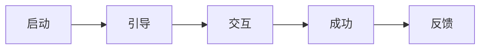

                 

### 文章标题：如何打造高转化率的用户引导流程

> 关键词：用户引导流程、用户体验、转化率、设计原则、案例分析、高级技巧

> 摘要：本文将深入探讨如何打造高转化率的用户引导流程。通过分析用户引导流程的重要性、目标和作用，详细讲解用户引导流程的设计原则、构建方法和优化策略，并结合实际案例分析，为读者提供全面的实践指导和高级技巧。

### 第1章：用户引导流程概述

#### 1.1 用户引导流程的重要性

用户引导流程（User Onboarding Process）是企业为新手用户提供的一种引导方式，旨在帮助新用户快速了解和使用产品，提高产品的使用率和用户满意度。用户引导流程的重要性体现在以下几个方面：

1. **提高用户留存率**：通过引导流程，新用户能够更快地适应产品，减少使用过程中的困惑和挫败感，从而提高用户留存率。
2. **增强用户粘性**：有效的引导流程可以增强用户对产品的认知和情感，提高用户粘性，降低用户流失率。
3. **提升转化率**：引导流程可以帮助企业将潜在用户转化为实际用户，提高销售转化率。
4. **提升品牌形象**：通过优质的引导流程，企业可以提升品牌形象，增强用户对品牌的信任和好感。

#### 1.2 用户引导流程的目标和作用

用户引导流程的主要目标包括：

1. **教育用户**：帮助新用户了解产品的功能、特点和操作方法，减少使用过程中的困惑。
2. **引导用户**：通过引导流程，引导用户完成关键任务，提高用户对产品的使用深度。
3. **提高用户满意度**：通过提供优质的引导服务，提高用户满意度，增强用户对产品的忠诚度。

用户引导流程的作用在于：

1. **降低用户学习成本**：通过引导流程，减少用户学习产品所需的时间和精力。
2. **提高用户参与度**：通过引导流程，提高用户对产品的参与度和积极性。
3. **提升用户转化率**：通过引导流程，帮助用户完成关键任务，提高用户转化率。

#### 1.3 用户引导流程的基本组成部分

用户引导流程通常包括以下几个基本组成部分：

1. **启动阶段**：用户首次接触产品时，引导流程开始启动。
2. **引导阶段**：在用户使用产品过程中，提供引导和提示，帮助用户理解产品。
3. **交互阶段**：用户与产品进行互动，完成具体任务。
4. **成功阶段**：用户完成关键任务，引导流程成功结束。
5. **反馈阶段**：收集用户反馈，优化引导流程。

#### 1.4 用户引导流程的设计原则

设计用户引导流程时，需要遵循以下几个原则：

1. **简洁明了**：设计简洁、直观的引导流程，避免复杂和冗长的操作步骤。
2. **个性化**：根据用户行为和需求，提供个性化的引导和提示。
3. **引导性**：提供明确的引导和操作提示，帮助用户顺利完成关键任务。

#### 1.5 用户引导流程的流程图

以下是用户引导流程的基本流程图：



### 第2章：用户体验与转化率

#### 2.1 用户行为的心理学分析

用户行为心理学是研究用户在接触和使用产品过程中的心理活动和行为规律的科学。了解用户行为心理学有助于更好地设计用户引导流程，提高用户转化率。

1. **用户决策过程**：用户在接触产品时，会经历认知、评估和决策三个阶段。设计引导流程时，需要考虑这三个阶段的特点，提供合适的引导和提示。
2. **用户注意力心理学**：用户在接触产品时，注意力会分散在不同的元素上。设计引导流程时，要确保引导内容能够吸引用户的注意力，提高用户对引导内容的关注。
3. **用户认知负荷**：用户在接触产品时，认知负荷会影响其理解和操作产品的能力。设计引导流程时，要尽量减少用户的认知负荷，提供简洁、直观的引导。

#### 2.2 转化率提升的关键因素

转化率是指用户完成特定目标（如注册、购买、下载等）的比例。提高转化率的关键因素包括：

1. **用户体验设计**：良好的用户体验可以降低用户的学习成本，提高用户满意度，从而提高转化率。
2. **用户引导策略**：有效的引导策略可以帮助用户快速理解产品，完成关键任务，提高转化率。
3. **营销策略**：通过有效的营销手段，吸引潜在用户，提高转化率。

#### 2.3 用户体验设计与转化率的关系

用户体验设计（UX Design）是研究如何让产品更易用、更舒适和更具吸引力的学科。用户体验设计与转化率之间的关系体现在以下几个方面：

1. **易用性**：易用性是用户体验设计的重要指标。易用性高的产品能够降低用户的学习成本，提高用户满意度，从而提高转化率。
2. **用户满意度**：用户满意度是衡量用户体验的重要指标。用户满意度高的产品能够增强用户对产品的忠诚度，提高转化率。
3. **品牌形象**：良好的用户体验可以提升品牌形象，增强用户对品牌的信任和好感，从而提高转化率。

### 第3章：用户引导流程的设计原则

#### 3.1 简洁明了

简洁明了是设计用户引导流程的重要原则。简洁明了的引导流程能够降低用户的认知负荷，提高用户的操作效率。

1. **简化流程**：在保证功能完整的前提下，尽量简化用户引导流程，减少不必要的操作步骤。
2. **清晰指示**：提供明确的操作指示和提示，帮助用户快速理解如何使用产品。
3. **避免冗余**：避免在引导流程中出现重复、冗余的信息，确保用户能够清晰地理解每个步骤。

#### 3.2 个性化

个性化是提高用户引导流程效果的重要手段。根据用户的行为和需求，提供个性化的引导和提示，可以更好地满足用户的需求，提高用户满意度。

1. **用户画像**：根据用户数据，建立用户画像，了解用户的需求和偏好。
2. **动态引导**：根据用户的行为，动态调整引导内容和顺序，提供个性化的引导。
3. **个性化推荐**：结合用户画像，提供个性化的产品推荐和操作建议，提高用户参与度和转化率。

#### 3.3 引导性

引导性是设计用户引导流程的核心原则。引导性强的引导流程能够帮助用户顺利完成关键任务，提高用户满意度。

1. **明确目标**：在引导流程中，明确用户需要完成的目标和任务，提供清晰的路径和操作步骤。
2. **逐步引导**：将引导流程分为多个阶段，逐步引导用户完成任务，避免用户产生挫败感。
3. **及时反馈**：在用户操作过程中，提供及时的反馈和提示，帮助用户了解操作结果，增强用户信心。

### 第4章：构建用户引导流程

#### 4.1 分析用户需求与目标

构建用户引导流程的第一步是分析用户需求与目标。了解用户的需求和目标有助于设计出符合用户期望的引导流程。

1. **用户需求调研**：通过问卷调查、用户访谈等方式，了解用户对产品的需求和期望。
2. **用户目标分析**：根据用户需求，分析用户在产品中的目标，如注册、购买、下载等。
3. **设定用户引导流程目标**：根据用户需求和目标，设定引导流程的具体目标，如提高用户留存率、提高转化率等。

#### 4.2 设计用户引导流程

设计用户引导流程是构建用户引导流程的关键步骤。设计用户引导流程时，需要考虑用户旅程、关键任务和用户界面设计。

1. **用户旅程地图**：绘制用户在整个系统中的活动路径，了解用户的操作流程和需求。
2. **用户引导流程图**：定义用户引导的各个阶段和步骤，明确用户需要完成的关键任务。
3. **用户界面设计**：设计直观、易于操作的用户界面，确保用户能够轻松地完成关键任务。

#### 4.3 编写引导文案和操作指引

编写引导文案和操作指引是构建用户引导流程的重要环节。引导文案和操作指引需要简洁明了、易于理解，帮助用户快速完成关键任务。

1. **简明扼要的文案撰写技巧**：用简单易懂的语言，突出关键信息，避免冗长和复杂的句子。
2. **操作指引的设计要点**：提供清晰的步骤和操作指南，确保用户能够按照提示顺利完成操作。
3. **文案与操作的匹配性**：确保文案和操作的一致性，避免用户产生困惑。

### 第5章：测试与优化

#### 5.1 用户引导流程的测试方法

测试用户引导流程是确保其效果的重要环节。测试方法包括：

1. **A/B测试**：通过对比不同版本的引导流程，分析用户的行为和转化率，找出最佳方案。
2. **用户测试**：邀请真实用户参与测试，收集用户反馈，评估引导流程的易用性和效果。
3. **数据分析**：通过数据分析工具，分析用户引导流程的各项指标，如用户停留时间、操作步骤等。

#### 5.2 数据分析工具的使用

数据分析工具可以帮助企业评估用户引导流程的效果，提供改进建议。常用的数据分析工具包括：

1. **Google Analytics**：用于分析网站和应用程序的用户行为。
2. **Mixpanel**：用于分析用户生命周期和用户行为。
3. **Hotjar**：用于分析用户在网站和应用程序上的操作行为。

#### 5.3 根据数据反馈进行迭代优化

根据数据反馈，对用户引导流程进行迭代优化，可以提高其效果。优化策略包括：

1. **简化流程**：根据用户行为数据，简化引导流程，减少不必要的步骤。
2. **优化文案和指引**：根据用户反馈，优化文案和操作指引，提高用户理解和操作效率。
3. **调整引导策略**：根据用户行为数据，调整引导策略，提高用户参与度和转化率。

### 第6章：案例分析

#### 6.1 案例分析一：电商平台的用户引导流程

电商平台是用户引导流程应用的重要场景。以下是一个电商平台用户引导流程的案例分析：

1. **启动阶段**：新用户注册后，系统会自动发送一封欢迎邮件，引导用户完成初始设置。
2. **引导阶段**：在用户登录后，系统会显示一个弹窗，介绍平台的主要功能和特色。
3. **交互阶段**：用户可以浏览商品，添加购物车，系统会提供购物车使用指南。
4. **成功阶段**：用户完成购买后，系统会发送订单确认邮件，并展示购买成功页面。
5. **反馈阶段**：用户可以对购买体验进行评价，系统会收集用户反馈，用于优化引导流程。

通过这个案例，我们可以看到，电商平台通过一系列的引导流程，帮助新用户快速了解和使用产品，提高了用户转化率和满意度。

#### 6.2 案例分析二：移动应用的用户引导流程

移动应用的用户引导流程设计具有其特殊性。以下是一个移动应用用户引导流程的案例分析：

1. **启动阶段**：新用户下载并安装应用后，首先会看到欢迎页面，介绍应用的主要功能。
2. **引导阶段**：在用户注册后，应用会通过一系列弹窗和提示，引导用户完成账号绑定和身份验证。
3. **交互阶段**：用户可以查看应用内容，系统会提供使用指南，帮助用户快速上手。
4. **成功阶段**：用户完成特定任务后，应用会发送奖励和提示，增强用户成就感。
5. **反馈阶段**：用户可以对应用进行评价，系统会根据反馈优化引导流程。

这个案例展示了移动应用如何通过引导流程，提高用户参与度和转化率。

### 第7章：综合案例分析

#### 7.1 不同类型产品的用户引导流程比较

不同类型的产品在用户引导流程上有不同的设计思路。以下是对几种常见类型产品用户引导流程的比较：

1. **电商平台**：注重引导用户浏览和购买，强调商品展示和购物车使用。
2. **社交媒体**：注重引导用户互动和分享，强调功能介绍和社交圈子的建立。
3. **在线教育**：注重引导用户学习和使用课程，强调学习路径和互动环节。

#### 7.2 用户引导流程的通用优化策略

无论哪种类型的产品，以下优化策略都适用于用户引导流程：

1. **简化流程**：减少不必要的步骤，提高用户操作效率。
2. **个性化引导**：根据用户行为和需求，提供个性化的引导和提示。
3. **及时反馈**：提供及时的反馈和提示，帮助用户了解操作结果。
4. **持续迭代**：根据用户反馈和数据，持续优化引导流程。

#### 7.3 用户引导流程的未来发展趋势

随着技术的进步和用户需求的变化，用户引导流程也在不断演进。未来，用户引导流程的发展趋势包括：

1. **智能化**：利用人工智能技术，实现个性化引导和智能推荐。
2. **互动性**：增加互动元素，提高用户参与度和体验。
3. **全渠道**：实现多平台、多渠道的用户引导，满足用户多样化的需求。

### 第8章：高级技巧与策略

#### 8.1 用户引导流程的高级设计技巧

高级设计技巧可以提高用户引导流程的效果，以下是一些常用的技巧：

1. **渐进式披露**：逐步展示引导内容，避免一次性提供过多信息，降低用户认知负荷。
2. **游戏化元素**：引入游戏化的元素，如积分、奖励等，增加用户参与度和成就感。
3. **社交分享机制**：鼓励用户分享产品，利用社交网络扩大用户基础。

#### 8.2 用户引导流程的营销策略

有效的用户引导流程可以与营销策略相结合，提高用户转化率和品牌知名度。以下是一些营销策略：

1. **基于用户行为的个性化营销**：根据用户行为，提供个性化的产品和营销信息。
2. **用户引导与营销活动的整合**：将用户引导与促销活动、优惠券等相结合，提高用户参与度。
3. **用户反馈机制的建立**：收集用户反馈，用于优化引导流程和营销策略。

#### 8.3 跨平台用户引导策略

在多平台环境下，用户引导策略需要考虑不同平台的特性。以下是一些跨平台用户引导策略：

1. **PC端与移动端**：针对不同平台的特性，设计不同的引导流程，确保用户体验的一致性。
2. **社交媒体平台**：利用社交媒体平台的特点，提供便捷的引导和分享功能。
3. **多平台整合**：实现多平台数据的整合，提供统一的用户引导和服务。

### 第9章：工具与技术

#### 9.1 用户引导流程工具介绍

以下是几种常用的用户引导流程工具：

1. **Intercom**：提供实时聊天、用户行为分析和用户引导功能。
2. **Userpilot**：提供多种引导元素，如弹窗、引导按钮、教程等。
3. **WalkMe**：提供直观的用户引导和操作提示，提高用户使用效率。

#### 9.2 工具选择的标准

选择用户引导流程工具时，需要考虑以下标准：

1. **功能完整性**：工具需要提供全面的功能，满足不同场景的需求。
2. **易用性**：工具需要易于使用和部署，降低使用门槛。
3. **可扩展性**：工具需要支持扩展和定制，以适应不断变化的需求。

#### 9.3 工具的使用技巧

以下是几种常用工具的使用技巧：

1. **Intercom**：通过自定义触发器，实现个性化引导和交互。
2. **Userpilot**：利用热图功能，了解用户操作行为，优化引导流程。
3. **WalkMe**：通过设置引导路径，实现自动化引导和操作提示。

### 第10章：技术实现与代码实战

#### 10.1 用户引导流程的前端实现

用户引导流程的前端实现主要包括引导弹窗、引导按钮和引导动画等。以下是一个简单的HTML、CSS和JavaScript代码示例：

```html
<!DOCTYPE html>
<html>
<head>
    <title>用户引导流程示例</title>
    <style>
        .guide-popup {
            position: fixed;
            top: 50%;
            left: 50%;
            transform: translate(-50%, -50%);
            width: 300px;
            background-color: #fff;
            padding: 20px;
            border: 1px solid #ddd;
            box-shadow: 0 0 10px rgba(0,0,0,0.1);
        }
    </style>
</head>
<body>
    <div class="guide-popup">
        <h2>欢迎！</h2>
        <p>这是一个用户引导流程的示例。</p>
        <button id="next">下一步</button>
    </div>

    <script>
        document.getElementById('next').addEventListener('click', function() {
            // 跳转到下一个引导页面或完成引导流程
        });
    </script>
</body>
</html>
```

#### 10.2 后端服务的配置与优化

用户引导流程的后端服务主要负责数据存储、用户状态管理和引导逻辑处理等。以下是一个简单的后端实现示例，使用Node.js和Express框架：

```javascript
const express = require('express');
const app = express();
const port = 3000;

// 中间件处理用户状态
app.use((req, res, next) => {
    // 根据用户ID或会话信息，处理用户状态
    next();
});

// 用户引导逻辑处理
app.post('/guide', (req, res) => {
    // 处理用户引导请求，返回引导内容
    res.json({
        message: '欢迎加入我们的用户引导流程！',
        step: 1
    });
});

app.listen(port, () => {
    console.log(`用户引导流程后端服务启动，端口：${port}`);
});
```

#### 10.3 实战案例分析与详细讲解剖析

以下是一个用户引导流程的实战案例，包括开发环境搭建、源代码实现和代码解读。

**案例背景**：一家电商企业希望通过用户引导流程，提高新用户的注册率和购买转化率。

**开发环境搭建**：选择Vue.js框架搭建前端项目，使用Node.js和Express框架搭建后端服务。

**源代码实现**：

前端代码（Vue组件）：

```vue
<template>
  <div class="guide">
    <div v-if="step === 1" class="step-1">
      <h2>欢迎注册</h2>
      <p>请填写您的邮箱地址。</p>
      <input type="email" v-model="email" placeholder="邮箱地址" />
      <button @click="nextStep">下一步</button>
    </div>
    <div v-if="step === 2" class="step-2">
      <h2>验证邮箱</h2>
      <p>我们已发送验证邮件到您的邮箱，请查收。</p>
      <button @click="complete">完成</button>
    </div>
  </div>
</template>

<script>
export default {
  data() {
    return {
      step: 1,
      email: ''
    };
  },
  methods: {
    nextStep() {
      if (this.email) {
        this.step++;
        // 调用后端API发送验证邮件
      }
    },
    complete() {
      // 完成引导流程，跳转到首页
    }
  }
};
</script>
```

后端代码（Node.js）：

```javascript
const express = require('express');
const app = express();
const port = 3000;

// 模拟发送验证邮件
const sendVerificationEmail = (email) => {
  console.log(`发送验证邮件到：${email}`);
};

app.post('/register', (req, res) => {
  const { email } = req.body;
  sendVerificationEmail(email);
  res.json({ message: '验证邮件已发送，请查收。' });
});

app.listen(port, () => {
  console.log(`用户引导流程后端服务启动，端口：${port}`);
});
```

**代码解读**：

1. **前端Vue组件**：实现了用户引导流程的两个步骤，通过v-if条件渲染不同步骤的内容，通过v-model实现数据绑定，通过事件处理函数nextStep和complete实现步骤跳转。
2. **后端Node.js服务**：接收前端发来的注册请求，调用模拟发送验证邮件的函数，返回提示信息。

**代码应用解读与分析**：

1. **前端应用**：通过Vue组件实现了用户引导流程，提供了良好的用户体验，用户可以轻松地完成注册流程。
2. **后端应用**：通过Node.js服务实现了验证邮件的发送功能，确保了用户引导流程的顺利进行。

**实际案例分析和详细讲解剖析**：

1. **案例分析**：该用户引导流程通过简单的两步操作，引导用户完成注册，提高了注册率和用户体验。
2. **详细讲解**：前端Vue组件实现了引导流程的界面和逻辑，后端Node.js服务实现了验证邮件的发送功能，两个部分协同工作，实现了用户引导流程。

**项目小结**：

该用户引导流程项目通过简单的实现，达到了提高用户注册率和用户体验的目标，具有较好的参考价值。在实际应用中，可以根据具体需求进行优化和扩展，如增加更多引导步骤、引入社交登录等。

### 最佳实践 Tips

1. **简化流程**：在设计用户引导流程时，要尽量简化操作步骤，减少用户的认知负荷。
2. **个性化引导**：根据用户行为和需求，提供个性化的引导和提示，提高用户满意度。
3. **持续优化**：根据用户反馈和数据，持续优化用户引导流程，提高转化率。

### 小结

本文详细介绍了如何打造高转化率的用户引导流程。通过分析用户引导流程的重要性、目标和作用，讲解用户引导流程的设计原则、构建方法和优化策略，并结合实际案例分析，为读者提供了全面的实践指导和高级技巧。用户引导流程是提高用户转化率和满意度的重要手段，企业应重视并持续优化用户引导流程。

### 注意事项

1. **用户引导流程的设计要简洁明了**，避免复杂和冗长的操作步骤。
2. **根据用户行为和需求**，提供个性化的引导和提示，提高用户满意度。
3. **持续优化用户引导流程**，根据用户反馈和数据，持续改进。

### 拓展阅读

1. **《用户体验要素》**：作者：阿里·伯恩斯坦（Alan cooper）
2. **《增长黑客》**：作者：范·麦克阿瑟（范冰）
3. **《用户增长方法论》**：作者：李明杰

### 附录

#### 用户引导流程模板与资源

- **用户引导流程模板**：[用户引导流程模板下载链接]
- **用户引导流程设计资源**：[设计资源推荐链接]
- **用户引导流程相关书籍和文章推荐**：[推荐链接]

### 作者信息

作者：AI天才研究院/AI Genius Institute & 禅与计算机程序设计艺术 /Zen And The Art of Computer Programming

### 后续更新计划

- **第11章：用户引导流程与营销整合**：探讨如何将用户引导流程与营销策略相结合，提高用户转化率和品牌知名度。
- **第12章：跨平台用户引导实战**：分析不同平台（如PC端、移动端、社交媒体）的用户引导流程设计，提供实战经验和优化策略。
- **第13章：用户引导流程的未来发展趋势**：探讨人工智能、大数据等新技术对用户引导流程的影响，预测未来用户引导流程的发展趋势。

