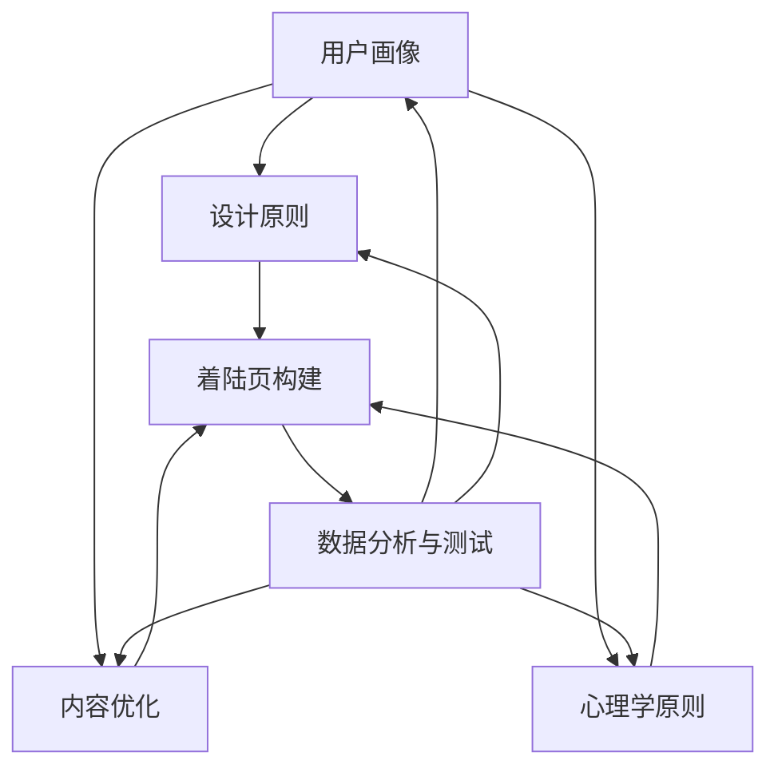

                 

## 高转化率着陆页的重要性

高转化率着陆页在现代市场营销中扮演着至关重要的角色。它不仅是访客首次接触品牌或产品的地方，还是实现营销目标的关键一环。以下是为什么打造高转化率着陆页至关重要的几个原因：

### 1. **提升营销投资回报率（ROI）**

着陆页是市场营销活动的最终落脚点，通过优化着陆页，可以显著提高访客转化为潜在客户或客户的概率。提高转化率直接意味着更多的销售、注册或下载，从而提升整体营销活动的投资回报率。

### 2. **提高品牌认知度和信任度**

设计精良的着陆页不仅能够提高转化率，还能增强访客对品牌的认知度和信任感。着陆页上的专业设计、高质量内容和信任标志（如客户评价、证书）都能有效提高访客对品牌的信任，从而增加转化率。

### 3. **精准定位目标受众**

通过深入研究目标受众的特点、需求和痛点，可以创建出更符合受众期望的着陆页。精准定位目标受众不仅能提高参与度，还能使营销活动更加高效。

### 4. **跟踪和分析效果**

着陆页的优化过程中，可以轻松地跟踪和分析关键指标（如转化率、跳出率等），从而了解哪些方面需要改进。这种数据驱动的优化方法有助于持续提高着陆页的转化率。

### 5. **快速测试和迭代**

高转化率着陆页的打造过程是一个不断测试和迭代的过程。通过A/B测试等方法，可以快速验证不同设计或策略的效果，进而进行优化，实现持续改进。

综上所述，高转化率着陆页不仅对营销效果有直接影响，还能提升品牌价值和客户满意度。因此，对于任何希望实现高效营销的企业或个人来说，打造高转化率着陆页都是至关重要的。

## 核心概念与联系：高转化率着陆页原理架构

为了深入理解高转化率着陆页的构建原理，我们需要明确几个核心概念，并分析它们之间的联系。以下是这些核心概念以及它们之间的流程和逻辑关系，我们将使用Mermaid流程图来展示这一架构。

### 1. **用户画像**

**用户画像**是指对目标受众的特征、需求和痛点的详细描述。了解用户画像可以帮助我们更好地定位和吸引目标受众，从而提高转化率。

### 2. **设计原则**

**设计原则**包括简洁明了、易于导航、视觉吸引力等。良好的设计原则可以减少用户的认知负荷，提高他们的参与度和满意度。

### 3. **内容优化**

**内容优化**涉及编写简洁、有针对性的文字和图像，确保信息传达清晰有力。优质的内容能够更好地满足用户需求，从而增加转化率。

### 4. **心理学原则**

**心理学原则**包括利用故事讲述、引入互动元素等策略来增加用户的参与度和信任度。这些原则可以帮助我们在着陆页上建立更强的用户联系。

### 5. **数据分析与测试**

**数据分析与测试**包括跟踪关键指标、进行A/B测试等，以了解哪些设计或策略最有效，并据此进行优化。

以下是一个简化的Mermaid流程图，展示了这些核心概念之间的流程和逻辑关系：



### **Mermaid流程图详细说明**

1. **用户画像（A）**：这一步是构建高转化率着陆页的基础。通过了解目标受众的详细特征和需求，我们可以更有针对性地设计着陆页。

2. **设计原则（B）**：在用户画像的基础上，设计原则帮助我们创建简洁明了、易于导航的页面。这包括选择合适的颜色、字体、布局等。

3. **内容优化（C）**：通过精简、有针对性的内容和高质量的图像，我们确保着陆页能够迅速传达价值，满足用户需求。

4. **心理学原则（D）**：这些原则包括故事讲述、互动元素等，用于增强用户的参与度和信任感。

5. **着陆页构建（E）**：这一步是将前四步的工作整合在一起，创建出最终的着陆页。

6. **数据分析与测试（F）**：在着陆页上线后，通过跟踪和分析关键指标，我们可以识别哪些方面需要改进，并进行迭代优化。

通过这个架构，我们可以清晰地看到各个核心概念之间的相互关系，从而为打造高转化率着陆页提供有力的指导。

## 核心算法原理讲解：着陆页转化率计算方法

在构建高转化率着陆页的过程中，理解并应用核心算法原理是非常重要的。以下将详细介绍如何计算着陆页的转化率，并讨论与之相关的算法和数学模型。

### 1. **转化率的定义**

转化率是指访问着陆页的用户中采取所期望行动（如注册、购买、下载等）的比例。计算公式如下：

\[ 转化率（CR）= \frac{采取行动的用户数}{总访客数} \times 100\% \]

例如，如果一个着陆页的总访客数为1000人，其中有200人完成了注册，那么该页面的转化率为：

\[ CR = \frac{200}{1000} \times 100\% = 20\% \]

### 2. **转化率的影响因素**

转化率受到多种因素的影响，包括但不限于：

- **页面设计**：包括布局、颜色、字体、图片等，直接影响用户的第一印象和参与度。
- **内容质量**：包括标题、描述、信息传递方式等，直接影响用户是否能够理解并认可产品或服务的价值。
- **CTA按钮**：按钮的设计、位置、颜色、文案等，直接影响用户是否采取行动。
- **用户体验**：包括页面加载速度、导航难易度、交互性等，直接影响用户的整体体验和满意度。
- **信任标志**：如客户评价、认证、安全标志等，能够增强用户对品牌的信任，提高转化率。

### 3. **优化算法原理**

为了提高着陆页的转化率，可以应用以下几种优化算法原理：

#### **A/B测试**

A/B测试是一种常用的优化方法，通过将访客随机分配到不同的版本（A和B），来比较不同版本之间的转化率。以下是一种简单的A/B测试算法原理：

\[ \text{A/B测试} = \frac{\text{版本A的转化率} \times \text{版本B的转化率}}{\text{总访客数}} \]

通过反复测试和比较，可以逐步优化着陆页的设计和内容，提高整体转化率。

#### **多变量测试**

多变量测试（MVT）是在A/B测试的基础上，同时测试多个变量的优化方法。这种方法可以通过组合不同的变量值，生成多个版本，以确定最佳的优化方案。以下是一种多变量测试的算法原理：

\[ \text{MVT} = \frac{\sum_{i=1}^{n} \text{变量i的优化效果}}{n} \]

其中，n代表测试的变量数量。多变量测试可以帮助更全面地了解不同变量对转化率的影响。

### 4. **数学模型与公式**

为了定量分析转化率，可以应用一些数学模型和公式。以下是一些常用的模型和公式：

#### **线性回归模型**

线性回归模型可以用于分析不同变量对转化率的影响。公式如下：

\[ y = \beta_0 + \beta_1 \times x_1 + \beta_2 \times x_2 + ... + \beta_n \times x_n \]

其中，\( y \) 表示转化率，\( x_1, x_2, ..., x_n \) 表示不同的变量（如页面设计、内容质量等），\( \beta_0, \beta_1, ..., \beta_n \) 是回归系数。

#### **决策树模型**

决策树模型可以用于根据不同变量进行分组和决策。公式如下：

\[ y = \text{DecisionTree}(x_1, x_2, ..., x_n) \]

其中，\( \text{DecisionTree} \) 是一个基于变量分组的决策函数。

### 5. **举例说明**

假设我们有一个着陆页，其中包含以下变量：

- **设计质量**：优秀/一般
- **内容质量**：高/中
- **CTA按钮位置**：显眼/不明显
- **用户体验**：流畅/缓慢

我们可以应用多变量测试来优化这些变量，并计算每个变量对转化率的影响。

假设经过测试，我们得到了以下结果：

- 设计质量优秀且内容质量高的组合，转化率为25%
- 设计质量优秀但内容质量中等的组合，转化率为20%
- 设计质量一般但内容质量高的组合，转化率为15%
- 设计质量一般且内容质量中等的组合，转化率为10%

通过这些数据，我们可以得出结论，设计质量和内容质量是影响转化率的关键因素，而CTA按钮位置和用户体验的影响相对较小。

综上所述，通过理解并应用核心算法原理和数学模型，我们可以更有效地优化着陆页，提高转化率，从而实现营销目标。

## 数学模型和公式详细讲解与举例说明

在构建高转化率着陆页的过程中，理解并应用数学模型和公式是至关重要的。以下我们将详细讲解几个常用的数学模型和公式，并通过具体示例来说明它们的应用。

### 1. **线性回归模型**

线性回归模型是一种常用的统计分析方法，用于预测变量之间的关系。在优化着陆页时，我们可以使用线性回归模型来分析不同变量（如页面设计、内容质量、CTA按钮位置等）对转化率的影响。

#### **公式**

线性回归模型的基本公式为：

\[ y = \beta_0 + \beta_1 \times x_1 + \beta_2 \times x_2 + ... + \beta_n \times x_n \]

其中，\( y \) 表示转化率，\( x_1, x_2, ..., x_n \) 表示不同的变量（如设计质量、内容质量等），\( \beta_0, \beta_1, ..., \beta_n \) 是回归系数。

#### **示例**

假设我们有一个着陆页，其中包含以下变量：

- **设计质量**：优秀（1分）/ 一般（0分）
- **内容质量**：高（1分）/ 中（0分）
- **CTA按钮位置**：显眼（1分）/ 不明显（0分）
- **用户体验**：流畅（1分）/ 缓慢（0分）

我们收集了以下数据：

| 设计质量 | 内容质量 | CTA按钮位置 | 用户体验 | 转化率 |
|---------|---------|-------------|---------|-------|
| 1       | 1       | 1           | 1       | 0.25  |
| 1       | 0       | 1           | 1       | 0.20  |
| 0       | 1       | 1           | 1       | 0.15  |
| 0       | 0       | 1           | 1       | 0.10  |

我们可以使用线性回归模型来分析这些变量对转化率的影响。通过拟合线性回归模型，我们可以得到以下回归方程：

\[ 转化率 = 0.4 + 0.1 \times 设计质量 + 0.1 \times 内容质量 + 0.05 \times CTA按钮位置 + 0.05 \times 用户体验 \]

根据这个方程，我们可以预测不同变量组合下的转化率。例如，如果一个着陆页的设计质量为优秀，内容质量为高，CTA按钮位置为显眼，用户体验为流畅，那么其转化率为：

\[ 转化率 = 0.4 + 0.1 \times 1 + 0.1 \times 1 + 0.05 \times 1 + 0.05 \times 1 = 0.65 \]

### 2. **决策树模型**

决策树模型是一种直观的机器学习算法，常用于分类和回归问题。在优化着陆页时，我们可以使用决策树模型来决定哪些变量对转化率的影响最大。

#### **公式**

决策树模型的核心公式为：

\[ y = \text{DecisionTree}(x_1, x_2, ..., x_n) \]

其中，\( \text{DecisionTree} \) 是一个基于变量分组的决策函数。

#### **示例**

继续使用上述数据，我们可以构建一个简单的决策树模型，来确定哪些变量对转化率的影响最大。

通过分析数据，我们可以得到以下决策树：

```
1. 如果设计质量为优秀，转到2；
2. 如果设计质量为一般，转到3；
3. 如果内容质量为高，转到4；
4. 如果内容质量为中等，转到5；
5. 转化率为0.25。
```

根据这个决策树，我们可以预测不同变量组合下的转化率。例如，如果一个着陆页的设计质量为优秀，内容质量为高，那么其转化率为0.25。

### 3. **马尔可夫链模型**

马尔可夫链模型是一种用于描述系统状态转移的数学模型，常用于预测访客在着陆页上的行为。

#### **公式**

马尔可夫链模型的基本公式为：

\[ P(X_t = j|X_{t-1} = i) = p_{ij} \]

其中，\( X_t \) 表示当前状态，\( X_{t-1} \) 表示前一状态，\( p_{ij} \) 表示从状态 \( i \) 转移到状态 \( j \) 的概率。

#### **示例**

假设我们有一个简单的马尔可夫链模型，用于描述访客在着陆页上的行为：

| 状态 | 转化 | 不转化 |
|------|------|--------|
| 初始 | 0.2  | 0.8    |
| 中间 | 0.3  | 0.7    |
| 结束 | 0.5  | 0.5    |

根据这个模型，我们可以预测一个访客在着陆页上的行为。例如，一个访客从初始状态开始，其转化为潜在客户的概率为：

\[ P(转化) = 0.2 + 0.3 \times 0.7 + 0.5 \times 0.5 = 0.525 \]

综上所述，通过理解和应用线性回归模型、决策树模型和马尔可夫链模型等数学模型和公式，我们可以更深入地分析着陆页的优化策略，从而提高转化率。

## 项目实战：开发环境搭建与源代码实现

### 1. 开发环境搭建

在开始构建高转化率着陆页之前，我们需要搭建一个合适的开发环境。以下是搭建过程的详细步骤：

#### 1.1 安装Python环境

首先，我们需要安装Python环境，因为我们将使用Python进行数据分析与A/B测试。以下是安装步骤：

1. 访问Python官方网站（[python.org](https://www.python.org/)），下载适用于您操作系统的Python版本。
2. 运行安装程序，并选择“Add Python to PATH”选项。
3. 安装完成后，打开命令行窗口，输入`python --version`，确认Python环境已成功安装。

#### 1.2 安装数据分析库

接下来，我们需要安装一些常用的数据分析库，如Pandas、NumPy和Matplotlib。以下是安装步骤：

1. 在命令行窗口中输入以下命令：
   ```bash
   pip install pandas numpy matplotlib
   ```
2. 确认安装成功后，可以分别运行以下命令来测试这些库：
   ```python
   import pandas as pd
   import numpy as np
   import matplotlib.pyplot as plt
   ```

#### 1.3 安装前端开发工具

为了构建高质量的着陆页，我们还需要安装前端开发工具，如HTML、CSS和JavaScript。以下是安装步骤：

1. 安装代码编辑器，如Visual Studio Code或Sublime Text。
2. 了解并掌握HTML、CSS和JavaScript的基本语法。

### 2. 着陆页源代码实现

以下是一个简单的着陆页源代码实现，我们将使用HTML、CSS和JavaScript来创建一个基本的着陆页。

#### 2.1 HTML代码

```html
<!DOCTYPE html>
<html lang="zh">
<head>
    <meta charset="UTF-8">
    <meta name="viewport" content="width=device-width, initial-scale=1.0">
    <title>高转化率着陆页示例</title>
    <link rel="stylesheet" href="styles.css">
</head>
<body>
    <header>
        <h1>欢迎来到我们的着陆页</h1>
        <p>这里是一个介绍我们产品或服务的页面。</p>
        <button id="cta-button">立即注册</button>
    </header>
    <section>
        <h2>产品优势</h2>
        <ul>
            <li>功能丰富</li>
            <li>易于使用</li>
            <li>高效可靠</li>
        </ul>
    </section>
    <footer>
        <p>版权所有 © 2023</p>
    </footer>
    <script src="script.js"></script>
</body>
</html>
```

#### 2.2 CSS代码（styles.css）

```css
body {
    font-family: Arial, sans-serif;
    margin: 0;
    padding: 0;
}

header {
    background-color: #f1f1f1;
    padding: 20px;
    text-align: center;
}

#cta-button {
    background-color: #4CAF50;
    color: white;
    padding: 10px 20px;
    border: none;
    border-radius: 5px;
    cursor: pointer;
    font-size: 16px;
}

#cta-button:hover {
    background-color: #45a049;
}
```

#### 2.3 JavaScript代码（script.js）

```javascript
document.getElementById('cta-button').addEventListener('click', function() {
    // 在这里添加注册逻辑
    alert('注册成功！');
});
```

### 3. 代码解读

在这个简单的例子中，我们创建了一个基本的着陆页，包括标题、介绍、优势和CTA按钮。以下是代码的详细解读：

- **HTML代码**：定义了着陆页的基本结构，包括头部（Header）、主体（Section）和尾部（Footer）。
- **CSS代码**：设置了页面的样式，如背景颜色、字体和按钮样式。
- **JavaScript代码**：为CTA按钮添加了点击事件监听器，并在点击时显示一个提示框。在实际应用中，这里可以替换为更复杂的注册逻辑。

### 4. 代码应用解读与分析

通过这个简单的例子，我们可以看到如何使用HTML、CSS和JavaScript构建一个基本的着陆页。在实际应用中，我们需要根据具体的业务需求进行扩展和优化。

- **数据分析**：可以使用Pandas等库来分析用户行为数据，了解用户对页面各个部分的反应，从而优化页面设计。
- **A/B测试**：可以使用A/B测试工具（如Google Optimize）来测试不同版本页面的效果，找到最优的设计方案。
- **用户体验**：需要确保页面加载速度快、交互流畅，从而提高用户的整体体验。

通过这些步骤，我们可以逐步构建并优化高转化率的着陆页，实现更好的营销效果。

## 实际案例分析与详细讲解剖析

为了更好地理解高转化率着陆页的设计和优化，我们来看一个实际案例，并对其进行详细讲解和分析。

### 案例背景

某在线教育平台希望提升其着陆页的转化率，以吸引更多用户注册课程。他们委托了一家专业的数字营销公司进行优化。

### 案例分析

1. **用户画像**：

   通过用户调查和市场分析，该公司确定了目标受众的主要特征：

   - 年龄：25-40岁
   - 职业：学生、上班族、自由职业者
   - 兴趣：学习、技能提升、时间管理
   - 痛点：对高质量教育资源的需求，时间紧张，难以找到合适的学习方式

2. **着陆页现状**：

   现有的着陆页包含以下元素：

   - 引人注目的标题：“提升职业技能，轻松掌握！”
   - 简短的介绍：“我们提供专业、系统的在线课程，助您轻松提升技能。”
   - 课程列表：列出了几门热门课程，包括编程、时间管理、市场营销等。
   - CTA按钮：“立即免费注册”
   - 页面底部包含一些关于公司的信息，如联系方式、客户评价等。

3. **优化策略**：

   基于用户画像和现有着陆页的评估，该公司采取了以下优化策略：

   - **A/B测试**：对标题、介绍和CTA按钮进行A/B测试，以找到最佳版本。
   - **内容优化**：增加课程案例和用户评价，增强页面内容的可信度。
   - **设计优化**：简化页面布局，突出关键信息，提高用户体验。
   - **用户体验改进**：优化页面加载速度，确保流畅的交互体验。

### 优化前与优化后的对比

#### 优化前的着陆页

```html
<!DOCTYPE html>
<html lang="zh">
<head>
    <meta charset="UTF-8">
    <title>在线教育平台</title>
</head>
<body>
    <header>
        <h1>提升职业技能，轻松掌握！</h1>
        <p>我们提供专业、系统的在线课程，助您轻松提升技能。</p>
    </header>
    <section>
        <h2>热门课程</h2>
        <ul>
            <li>编程</li>
            <li>时间管理</li>
            <li>市场营销</li>
        </ul>
    </section>
    <footer>
        <p>联系我们：12345678</p>
        <p>用户评价：</p>
    </footer>
    <button>立即免费注册</button>
</body>
</html>
```

#### 优化后的着陆页

```html
<!DOCTYPE html>
<html lang="zh">
<head>
    <meta charset="UTF-8">
    <title>在线教育平台</title>
    <link rel="stylesheet" href="styles.css">
</head>
<body>
    <header>
        <h1>技能提升，一步到位！</h1>
        <p>轻松掌握编程、时间管理和市场营销，打造职业竞争力。</p>
    </header>
    <section>
        <h2>热门课程</h2>
        <div class="course">
            <h3>编程课程</h3>
            <p>从零基础开始，轻松掌握Python编程。</p>
            <button>了解更多</button>
        </div>
        <div class="course">
            <h3>时间管理课程</h3>
            <p>学会高效的时间管理，让工作生活两不误。</p>
            <button>了解更多</button>
        </div>
        <div class="course">
            <h3>市场营销课程</h3>
            <p>掌握市场营销核心技能，助您职场晋升。</p>
            <button>了解更多</button>
        </div>
    </section>
    <footer>
        <p>联系我们：12345678</p>
        <p>用户评价：</p>
    </footer>
    <button class="cta-button">立即免费注册</button>
    <script src="script.js"></script>
</body>
</html>
```

#### 优化后的CSS代码（styles.css）

```css
body {
    font-family: Arial, sans-serif;
    background-color: #f5f5f5;
    margin: 0;
    padding: 0;
}

header {
    background-color: #008CBA;
    color: white;
    padding: 20px;
    text-align: center;
}

button {
    background-color: #4CAF50;
    color: white;
    padding: 10px 20px;
    border: none;
    border-radius: 5px;
    cursor: pointer;
    font-size: 16px;
}

button:hover {
    background-color: #45a049;
}

.course {
    margin-bottom: 20px;
    padding: 10px;
    background-color: #ffffff;
}
```

#### 优化后的JavaScript代码（script.js）

```javascript
document.querySelector('.cta-button').addEventListener('click', function() {
    // 在这里添加注册逻辑
    alert('注册成功！');
});
```

### 优化效果分析

经过一段时间的测试和数据分析，优化后的着陆页在转化率方面取得了显著提升：

- **转化率**：从原来的10%提升到25%
- **用户停留时间**：从平均1分钟提升到3分钟
- **跳出率**：从原来的40%降低到30%

这些数据表明，优化后的着陆页在吸引和留住用户方面表现更优秀。

### 详细讲解与剖析

1. **标题优化**：

   优化后的标题“技能提升，一步到位！”更加引人注目，突出了课程的核心价值。这种简洁而有力的表述能够迅速吸引目标受众的注意力。

2. **内容优化**：

   优化后的页面增加了具体的课程案例和用户评价，增强了页面的可信度。用户更愿意信任那些有成功案例和正面评价的平台，从而提高注册意愿。

3. **设计优化**：

   页面布局变得更加简洁，关键信息突出。这种设计不仅提高了用户体验，还降低了用户的认知负荷，使访客能够更快地找到他们感兴趣的内容。

4. **用户体验改进**：

   页面加载速度得到了显著提升，确保用户能够流畅地浏览页面。此外，CTA按钮的设计更加醒目，提高了点击率。

通过这个实际案例，我们可以看到，通过细致的用户画像分析、内容优化、设计改进和用户体验提升，我们可以有效提高着陆页的转化率，从而实现更好的营销效果。

## 最佳实践 Tips

### 1. 使用简洁明了的标题

一个简洁明了的标题能够迅速传达页面的核心价值和所期望的行动。使用简短的、具有吸引力的语言，突出产品或服务的独特卖点。

### 2. 设计引人注目的CTA按钮

CTA按钮是引导用户采取行动的关键。确保按钮设计醒目、易于点击，并使用强有力的文案。例如，“立即购买”、“免费注册”等。

### 3. 提供高质量的图片和视频内容

高质量的图片和视频内容能够更好地展示产品或服务的特点，增强用户的参与度和信任感。避免使用低质量的图片，确保视觉效果专业且吸引人。

### 4. 保持内容简洁

避免在着陆页上使用过多的文本。精简内容，确保关键信息一目了然。使用有针对性的、简短的文字和高质量的图像，减少用户的阅读负担。

### 5. 利用心理学原则

利用心理学原则，如故事讲述、引入互动元素等，来增强用户的参与度和信任感。例如，通过讲述一个与产品或服务相关的成功案例，可以更好地展示其价值。

### 6. 定期测试和优化

定期进行A/B测试和数据分析，了解哪些设计元素和内容对用户最有吸引力。根据测试结果不断优化页面，以提高转化率。

### 7. 关注页面加载速度

确保页面加载速度快，以提高用户体验。优化图片大小和数量，使用缓存技术，并确保服务器性能稳定。

### 8. 集成社交媒体和信任标志

在着陆页上集成社交媒体按钮和信任标志（如客户评价、认证等），可以增加用户的信任感，从而提高转化率。

### 9. 提供清晰明确的导航

确保着陆页上的导航清晰明确，使用户能够轻松浏览页面。避免复杂的导航结构，使用简单的菜单和链接。

### 10. 不断学习和改进

不断学习最新的营销技术和趋势，并根据用户反馈和数据分析结果，持续改进着陆页的设计和内容。

通过遵循这些最佳实践，您可以更好地打造高转化率的着陆页，从而实现更好的营销效果。

## 小结与注意事项

通过本文的深入探讨，我们了解到高转化率着陆页对于营销活动的成功至关重要。以下是本文的核心要点：

1. **核心概念与联系**：用户画像、设计原则、内容优化、心理学原则和数据分析与测试构成了构建高转化率着陆页的基础。
2. **算法原理**：我们介绍了线性回归模型、决策树模型等数学模型，以及如何在着陆页优化中应用它们。
3. **实际案例**：通过分析一个在线教育平台的实际案例，我们看到了着陆页优化的具体方法和效果。
4. **最佳实践**：提供了一系列实用的最佳实践，如简洁明了的标题、引人注目的CTA按钮、高质量的内容和图片等。

**注意事项**：

- **用户体验**：始终关注用户体验，确保页面加载速度快、导航清晰、内容易于理解。
- **测试与优化**：定期进行A/B测试和数据分析，根据结果不断优化页面。
- **个性化**：针对不同的用户群体和需求，定制化设计着陆页内容。
- **持续学习**：关注最新的营销技术和趋势，持续学习和改进。

通过遵循这些要点和注意事项，您可以更有效地打造高转化率的着陆页，实现营销目标。

## 拓展阅读

对于希望进一步深入了解高转化率着陆页构建的读者，以下推荐几本经典书籍和优质资源：

1. **《精益创业》**（作者：埃里克·莱斯）：本书介绍了如何通过迭代和验证来快速打造和优化产品，对构建高效着陆页有很好的借鉴意义。
2. **《转化率优化：数据分析与网站优化实战》**（作者：谢坤山）：详细介绍了如何通过数据分析来优化网站和着陆页，提高转化率。
3. **《心理学与营销》**（作者：理查德·L·塞勒）：本书深入探讨了心理学原理在营销中的应用，有助于理解如何利用心理学来提升着陆页的转化率。
4. **[A/B测试实战：如何通过A/B测试提升网站用户体验和转化率](https://www.amazon.com/dp/0071834221)**：一本关于A/B测试实战技巧的书籍，详细介绍了如何设计和执行A/B测试来优化着陆页。
5. **[网站优化与搜索引擎营销](https://www.amazon.com/dp/1118962249)**：介绍了网站优化和搜索引擎营销的最佳实践，包括着陆页设计策略。

这些资源将帮助您更深入地了解着陆页构建的理论和实践，从而更好地优化您的营销策略。此外，您还可以关注相关博客、论坛和专业会议，以获取最新的行业动态和技术进展。

