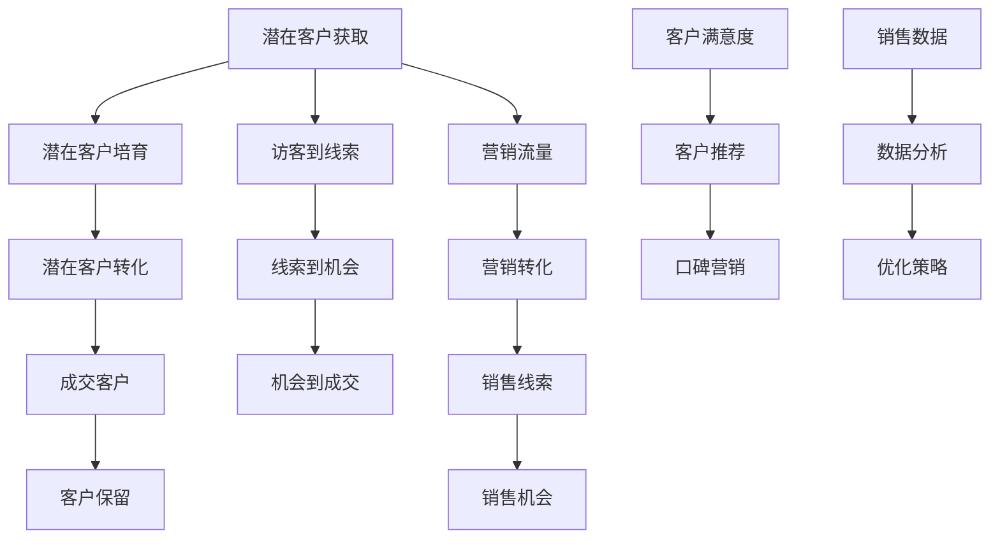

                 

### 文章标题

# 《如何打造高转化率的销售漏斗》

---

关键词：销售漏斗、转化率、客户沟通、销售策略、数据监控

摘要：本文深入探讨了如何通过系统化的方法打造高转化率的销售漏斗。文章首先介绍了销售漏斗的基本概念、作用和组成部分，然后分析了销售转化率的重要性以及影响转化率的因素。接着，文章详细阐述了如何识别目标客户、制定销售策略、优化销售漏斗流程、提高客户转化率和进行销售漏斗数据监控与优化。最后，通过实战案例和经验分享，提供了实用的工具与资源，以帮助企业和销售人员更好地构建和提升销售漏斗的转化效率。

---

### 目录大纲

## 第一部分：理解销售漏斗

### 第1章：销售漏斗的基本概念

#### 1.1 销售漏斗的定义与作用

#### 1.2 销售漏斗的组成部分

#### 1.3 销售漏斗的工作流程

### 第2章：销售漏斗与销售转化率

#### 2.1 销售转化率的定义

#### 2.2 销售转化率的重要性

#### 2.3 销售转化率的影响因素

## 第二部分：打造高转化率的销售漏斗

### 第3章：识别目标客户

#### 3.1 目标客户分析

#### 3.2 定位目标市场

#### 3.3 客户画像构建

### 第4章：制定销售策略

#### 4.1 销售目标设定

#### 4.2 销售策略制定

#### 4.3 销售活动策划

### 第5章：优化销售漏斗流程

#### 5.1 漏斗流程分析

#### 5.2 漏斗节点优化

#### 5.3 漏斗效率评估

### 第6章：提高客户转化率

#### 6.1 客户沟通技巧

#### 6.2 产品演示与说服力

#### 6.3 跟进策略与技巧

### 第7章：销售漏斗数据监控与优化

#### 7.1 销售漏斗数据指标

#### 7.2 数据分析与反馈

#### 7.3 漏斗优化策略

### 第8章：实战案例与经验分享

#### 8.1 成功案例分享

#### 8.2 失败案例剖析

#### 8.3 经验与教训总结

## 第三部分：工具与资源

### 第9章：销售漏斗工具介绍

#### 9.1 销售漏斗软件介绍

#### 9.2 销售漏斗工具的使用技巧

### 第10章：参考资料与推荐阅读

#### 10.1 必读书籍

#### 10.2 精选文章

#### 10.3 课程推荐

## 附录

### 附录A：销售漏斗核心概念与联系

#### A.1 销售漏斗概念图

### 附录B：销售漏斗核心算法原理讲解

#### B.1 销售转化率计算算法

#### B.2 客户跟进策略算法

### 附录C：销售漏斗项目实战

#### C.1 销售漏斗搭建案例

#### C.2 销售漏斗数据监控案例

#### C.3 销售漏斗优化案例

---

在接下来的内容中，我们将逐步深入分析销售漏斗的各个组成部分，探讨如何通过系统化的方法提升销售转化率，并提供实战案例与工具资源，帮助您在实践中应用这些理论。

---

## 第一部分：理解销售漏斗

### 第1章：销售漏斗的基本概念

#### 1.1 销售漏斗的定义与作用

销售漏斗（Sales Funnel）是一种用于描述销售过程中客户从接触到最终成交的转化路径的工具。它将客户转化过程划分为若干阶段，通过可视化的漏斗模型展示每个阶段的客户数量变化。漏斗的顶端代表接触客户的数量，底端则代表成交的客户数量。

销售漏斗的定义和作用可以概括如下：

**定义：**
- 销售漏斗是一种营销和销售工具，用于跟踪和优化客户的转化路径。
- 它帮助销售团队理解客户在不同阶段的参与度，从而制定针对性的策略。

**作用：**
- **可视化分析**：通过漏斗模型，销售团队能够直观地了解各个阶段的客户数量变化，识别潜在问题。
- **优化策略**：销售漏斗有助于发现销售流程中的瓶颈，优化客户接触和管理策略。
- **绩效评估**：通过漏斗数据，可以评估销售团队的业绩和效率，为绩效评估提供依据。

#### 1.2 销售漏斗的组成部分

销售漏斗通常包括以下几个关键组成部分：

1. **潜在客户获取（Top of Funnel, TOFU）**：
   - 这个阶段的目标是吸引潜在客户，增加品牌知名度。
   - 主要策略包括内容营销、社交媒体推广、SEO优化等。

2. **潜在客户培育（Middle of Funnel, MOFU）**：
   - 这个阶段的目标是培育潜在客户，将其转化为合格的线索。
   - 主要策略包括电子邮件营销、社交媒体互动、在线研讨会、客户关系管理（CRM）系统跟进等。

3. **潜在客户转化（Bottom of Funnel, BOFU）**：
   - 这个阶段的目标是促使潜在客户采取行动，完成交易。
   - 主要策略包括个性化营销、产品演示、价格谈判、销售谈判等。

4. **客户保留（Customer Retention）**：
   - 虽然不在传统销售漏斗模型中，但客户保留同样重要。
   - 主要策略包括客户满意度调查、客户关怀、客户忠诚度计划等。

#### 1.3 销售漏斗的工作流程

销售漏斗的工作流程可以概括为以下几个步骤：

1. **吸引潜在客户**：
   - 通过SEO优化、内容营销等方式吸引潜在客户访问网站或社交媒体。

2. **转化潜在客户**：
   - 提供高质量的内容和互动体验，引导潜在客户留下联系方式或参与活动。

3. **培育潜在客户**：
   - 通过电子邮件营销、社交媒体互动等方式持续与潜在客户保持联系，提供有价值的信息。

4. **转化潜在客户**：
   - 利用销售技巧和策略，促使潜在客户采取行动，如购买产品或服务。

5. **客户保留**：
   - 提供优质的客户服务和售后支持，提高客户满意度和忠诚度，从而延长客户生命周期。

#### 1.4 销售漏斗的常见问题

在使用销售漏斗时，销售团队可能会遇到以下问题：

1. **漏斗过窄**：
   - 如果漏斗顶端流量不足，可能需要增加营销渠道和策略。

2. **转化率低**：
   - 通过分析各个阶段的转化率，找出瓶颈并优化。

3. **客户流失**：
   - 关注客户流失的原因，如产品不符合需求、服务不佳等，并采取相应措施。

4. **数据不准确**：
   - 确保漏斗数据的准确性，定期更新和验证数据。

#### 1.5 销售漏斗与销售转化率

销售漏斗与销售转化率密切相关。销售转化率是指潜在客户在销售漏斗中各个阶段转化为实际销售的概率。通过优化销售漏斗，可以提升各阶段的转化率，从而提高整体的销售转化率。

- **潜在客户获取**：增加高质量的流量，提升漏斗顶端的流量。
- **潜在客户培育**：提供有针对性的内容，增加潜在客户的参与度。
- **潜在客户转化**：利用销售技巧和策略，提高客户的购买意愿。
- **客户保留**：提供优质的客户体验，降低客户流失率。

#### 1.6 销售漏斗的优化策略

为了打造高转化率的销售漏斗，销售团队可以采取以下优化策略：

1. **数据分析**：
   - 定期分析销售漏斗数据，了解各个阶段的转化情况，找出瓶颈。

2. **内容优化**：
   - 根据潜在客户的需求和兴趣，优化网站内容、电子邮件营销等。

3. **客户细分**：
   - 对潜在客户进行细分，提供个性化的营销策略。

4. **销售培训**：
   - 提升销售团队的技能和知识，提高销售效率。

5. **技术支持**：
   - 利用CRM系统、数据分析工具等，提高数据管理和分析能力。

通过以上策略，销售团队可以有效地优化销售漏斗，提升销售转化率，实现更高的销售业绩。

### 第2章：销售漏斗与销售转化率

#### 2.1 销售转化率的定义

销售转化率是指潜在客户在销售漏斗中的各个阶段成功转化为实际销售的概率。它是衡量销售效果的重要指标，通常以百分比表示。销售转化率可以划分为多个阶段，如访客转化率、线索转化率、客户转化率、成交转化率等。

**销售转化率的计算公式**：

\[ \text{销售转化率} = \frac{\text{实际销售数量}}{\text{潜在客户数量}} \times 100\% \]

例如，如果在一个销售漏斗中有100个潜在客户，最终完成了10笔销售，则销售转化率为：

\[ \text{销售转化率} = \frac{10}{100} \times 100\% = 10\% \]

#### 2.2 销售转化率的重要性

销售转化率对企业的销售业绩和整体运营具有重要影响，具体体现在以下几个方面：

1. **衡量销售效果**：
   - 销售转化率是衡量销售团队绩效和营销效果的重要指标。通过分析转化率，企业可以了解哪些策略有效，哪些需要改进。

2. **优化销售策略**：
   - 销售转化率的数据可以揭示销售漏斗中的瓶颈，帮助销售团队调整策略，优化各个阶段的转化流程。

3. **提高销售业绩**：
   - 提升销售转化率可以直接增加企业的销售额和利润，实现销售目标。

4. **增强客户满意度**：
   - 高转化率意味着客户在销售过程中的体验更加顺畅，提高了客户满意度和忠诚度。

5. **优化资源配置**：
   - 通过分析销售转化率，企业可以更合理地分配资源和预算，提高营销投资回报率。

#### 2.3 销售转化率的影响因素

销售转化率受到多种因素的影响，主要包括以下几个方面：

1. **产品与市场需求**：
   - 产品是否满足市场需求，价格是否合理，是否具有竞争力，都会直接影响销售转化率。

2. **营销策略**：
   - 营销策略的有效性，包括广告、内容营销、社交媒体推广等，都会影响潜在客户的关注度和参与度。

3. **销售技巧**：
   - 销售人员的沟通能力、谈判技巧和专业知识，对潜在客户的决策有重要影响。

4. **客户体验**：
   - 客户在购买过程中的体验，包括网站的易用性、客服的质量、售后服务的满意度等，都会影响转化率。

5. **数据与数据分析**：
   - 销售漏斗中的数据准确性和分析能力，可以帮助销售团队及时调整策略，提高转化率。

6. **市场环境**：
   - 行业发展趋势、竞争状况、经济环境等因素，也会影响销售转化率。

#### 2.4 提高销售转化率的策略

为了提高销售转化率，企业可以采取以下策略：

1. **精准定位目标客户**：
   - 通过市场调研和数据分析，准确识别目标客户群体，提供针对性的营销内容。

2. **优化营销内容**：
   - 创造高质量、有吸引力的营销内容，提高潜在客户的参与度和兴趣。

3. **提升客户体验**：
   - 优化网站和购买流程，确保客户在购买过程中获得流畅、愉快的体验。

4. **销售培训与激励**：
   - 提升销售团队的技能和动力，激励他们更好地完成销售任务。

5. **利用数据分析**：
   - 定期分析销售数据，找出问题并制定改进策略。

6. **持续优化与调整**：
   - 根据市场反馈和数据分析，持续优化销售漏斗和营销策略。

通过以上策略，企业可以有效地提高销售转化率，实现更高的销售业绩和市场竞争力。

### 第3章：识别目标客户

#### 3.1 目标客户分析

在构建高转化率的销售漏斗之前，识别和理解目标客户至关重要。目标客户分析是一种系统化的方法，用于确定企业的理想客户群体，以便更好地定位市场、制定营销策略和优化销售流程。以下是目标客户分析的关键步骤：

1. **市场调研**：
   - 通过问卷调查、访谈、在线调查等方式收集潜在客户的数据和信息。
   - 研究市场趋势、竞争对手情况、客户需求等，了解市场环境。

2. **客户细分**：
   - 将市场划分为不同的细分市场，根据不同的特征（如地理位置、行业、公司规模等）对客户进行分类。
   - 确定哪些细分市场对企业最有利，最具增长潜力。

3. **客户画像**：
   - 建立详细的客户画像，包括客户的基本信息、行为习惯、购买偏好、需求等。
   - 客户画像可以帮助销售团队更准确地定位客户，制定个性化的营销策略。

4. **价值评估**：
   - 对不同细分市场进行价值评估，确定哪些客户对企业最有价值。
   - 价值评估可以帮助企业集中资源，优先服务于最具价值的客户。

#### 3.2 定位目标市场

定位目标市场是销售漏斗构建的关键步骤之一。正确的市场定位可以最大化企业的市场份额和利润，以下是定位目标市场的几个要点：

1. **市场细分**：
   - 根据产品特点、客户需求和市场趋势，将市场划分为不同的细分市场。
   - 确定企业在哪些细分市场具有竞争优势，可以提供更好的产品和服务。

2. **市场选择**：
   - 根据企业的资源和能力，选择最有利可图的细分市场进行重点开发。
   - 市场选择应考虑细分市场的规模、增长潜力、竞争状况等因素。

3. **市场定位策略**：
   - 确定企业在目标市场中的独特价值主张，即如何区分自己与竞争对手。
   - 市场定位策略应明确企业的目标客户群体、产品特点、服务优势等。

4. **市场进入策略**：
   - 选择合适的渠道和方式进入目标市场，如在线销售、线下渠道、合作伙伴等。
   - 市场进入策略应考虑市场环境、竞争状况和企业资源。

#### 3.3 客户画像构建

构建详细的客户画像对于精准营销和提升销售转化率至关重要。以下是构建客户画像的几个步骤：

1. **数据收集**：
   - 收集潜在客户的基本信息，如姓名、年龄、性别、职业、收入等。
   - 收集潜在客户的行为数据，如网站访问记录、购买历史、互动行为等。

2. **数据分析**：
   - 对收集到的数据进行整理和分析，找出客户群体的共性和特征。
   - 使用数据分析工具，如Excel、SQL、Python等，对客户数据进行挖掘。

3. **客户画像制作**：
   - 根据分析结果，创建详细的客户画像，包括基本信息、行为习惯、购买偏好等。
   - 客户画像可以以图表、文字、图像等多种形式展示。

4. **持续更新**：
   - 定期更新客户画像，确保数据的准确性和时效性。
   - 随着市场环境和客户需求的变化，及时调整客户画像。

#### 3.4 实际案例：如何通过客户画像提升销售转化率

假设一家销售企业生产高端定制家具，以下是构建客户画像并提升销售转化率的实际案例：

1. **客户细分**：
   - 根据收入水平和购买能力，将市场细分为高收入人群、中等收入人群和低收入人群。
   - 根据职业和行业，将市场细分为企业家、高管、白领等。

2. **客户画像构建**：
   - 高收入人群：年龄在35-55岁之间，男性为主，职业多为企业家或高管，收入在10万元以上，购买偏好为高端定制家具。
   - 中等收入人群：年龄在25-35岁之间，女性为主，职业多为白领，收入在5-10万元之间，购买偏好为中档定制家具。
   - 低收入人群：年龄在18-25岁之间，男女比例相当，职业多为学生或初级职员，收入在5万元以下，购买偏好为经济型定制家具。

3. **市场定位策略**：
   - 高收入人群：重点开发高端市场，提供个性化定制服务，强调家具的奢华和独特性。
   - 中等收入人群：通过线上渠道推广中档家具产品，提供优惠和促销活动，吸引潜在客户。
   - 低收入人群：通过社交媒体和校园渠道推广经济型家具，强调性价比和实用主义。

4. **销售转化率提升**：
   - 高收入人群：通过定制化服务和高端品牌形象，提升客户满意度和忠诚度，提高销售转化率。
   - 中等收入人群：优化线上营销内容，提高客户参与度，通过社交媒体互动增加线索转化率。
   - 低收入人群：提供性价比高的家具产品，通过优惠活动和口碑营销，提高客户购买意愿。

通过以上策略，企业可以更精准地定位目标客户，提升销售转化率，实现更高的销售业绩。

### 第4章：制定销售策略

#### 4.1 销售目标设定

制定销售策略的第一步是设定明确、具体的销售目标。销售目标是企业或销售团队在一定时间内希望实现的销售成果。一个有效的销售目标应具备以下特点：

1. **具体性（Specific）**：
   - 销售目标应明确、具体，具体描述希望达到的结果。
   - 例如，“提高销售额”不如“将本月销售额提高20%”。

2. **衡量性（Measurable）**：
   - 销售目标应具备可衡量的标准，以便于评估目标是否达成。
   - 例如，可以通过销售额、客户数量、成交率等指标来衡量。

3. **可实现性（Achievable）**：
   - 销售目标应在合理范围内，既具有挑战性，又是可实现的。
   - 过高的目标可能导致团队压力过大，失去动力。

4. **相关性（Relevant）**：
   - 销售目标应与企业的整体战略和销售策略相关联。
   - 例如，如果企业战略是扩展新市场，销售目标也应围绕这一战略设定。

5. **时限性（Time-bound）**：
   - 销售目标应设定明确的时间期限，例如月度、季度或年度目标。
   - 这有助于团队集中精力，按时完成任务。

**销售目标设定流程**：

1. **分析企业战略和资源**：
   - 了解企业的长期目标和资源，确定短期销售目标的方向。

2. **评估市场机会和竞争状况**：
   - 分析市场趋势、竞争对手和客户需求，确定可实现的销售目标。

3. **确定关键绩效指标（KPIs）**：
   - 根据销售目标，确定关键绩效指标，例如销售额、客户数量、转化率等。

4. **设定具体的目标值**：
   - 根据分析结果，设定具体的销售目标值，例如提高销售额10%。

5. **制定行动计划**：
   - 为实现销售目标，制定详细的行动计划，包括销售策略、营销活动、团队分工等。

#### 4.2 销售策略制定

销售策略是企业在实现销售目标过程中采取的具体行动和措施。一个有效的销售策略应综合考虑市场环境、客户需求、产品特点和企业资源，以实现最佳的销售效果。以下是制定销售策略的几个步骤：

1. **市场分析**：
   - 分析市场环境，包括市场规模、增长趋势、竞争对手和客户需求等。
   - 通过市场分析，确定目标市场的机会和挑战。

2. **产品定位**：
   - 根据市场分析结果，确定产品的市场定位和独特卖点（USP）。
   - 产品定位应明确产品的目标客户群体和市场地位。

3. **销售渠道选择**：
   - 选择适合产品的销售渠道，例如直销、代理商、线上销售等。
   - 销售渠道的选择应考虑成本效益、市场覆盖面和客户体验。

4. **定价策略**：
   - 制定合理的定价策略，考虑产品成本、市场竞争和客户价值。
   - 定价策略可以采用成本加成、市场导向或价值定价等方法。

5. **促销活动**：
   - 设计吸引人的促销活动，如折扣、优惠券、捆绑销售等。
   - 促销活动应与目标市场和客户需求相结合，提高客户购买意愿。

6. **销售团队管理**：
   - 建立高效的销售团队，包括招聘、培训、激励和绩效管理。
   - 销售团队的管理应注重团队成员的专业技能和团队协作。

7. **客户关系管理**：
   - 制定客户关系管理策略，包括客户维护、客户服务和客户满意度调查。
   - 良好的客户关系有助于提高客户忠诚度和复购率。

**销售策略制定流程**：

1. **收集信息**：
   - 收集市场分析、产品定位、定价策略、促销活动等方面的信息。

2. **分析数据**：
   - 分析收集到的数据，确定最佳的销售策略。

3. **制定初步方案**：
   - 根据分析结果，制定初步的销售策略方案。

4. **团队讨论与修改**：
   - 组织销售团队进行讨论，对方案进行修改和完善。

5. **制定最终策略**：
   - 根据团队讨论结果，制定最终的销售策略。

6. **实施与监控**：
   - 实施销售策略，并定期监控策略效果，进行必要的调整。

通过以上步骤，企业可以制定出有效的销售策略，提高销售转化率，实现销售目标。

### 第5章：优化销售漏斗流程

#### 5.1 漏斗流程分析

销售漏斗的优化始于对现有漏斗流程的全面分析。通过分析，可以识别出漏斗中的瓶颈和问题，为优化提供依据。以下是进行漏斗流程分析的关键步骤：

1. **数据收集**：
   - 收集与销售漏斗相关的数据，包括潜在客户数量、转化率、成交率等。
   - 数据来源可以是CRM系统、网站分析工具、销售报表等。

2. **漏斗模型构建**：
   - 根据收集到的数据，构建销售漏斗模型，展示客户在各个阶段的数量和转化率。
   - 销售漏斗模型可以使用Mermaid流程图来展示，例如：

   ```mermaid
   graph LR
   A[潜在客户获取] --> B[潜在客户培育]
   B --> C[潜在客户转化]
   C --> D[成交客户]
   ```

3. **问题识别**：
   - 分析漏斗模型，识别出客户数量下降或转化率低的关键阶段。
   - 例如，如果潜在客户培育阶段的转化率很低，可能需要检查营销内容或客户管理策略。

4. **数据可视化**：
   - 使用图表和图形将分析结果可视化，以便于团队理解和讨论。
   - 可视化工具如Tableau、Power BI等可以帮助展示数据趋势和关键指标。

5. **原因分析**：
   - 对识别出的问题进行原因分析，找出导致问题的根本原因。
   - 原因分析可以使用因果图、鱼骨图等方法，帮助团队深入理解问题。

6. **制定改进方案**：
   - 根据问题识别和原因分析结果，制定改进方案，包括具体的改进措施和时间表。

7. **实施方案**：
   - 实施改进方案，并监控效果，确保改进措施有效。

通过以上步骤，企业可以全面分析销售漏斗流程，识别问题，并制定针对性的改进方案，从而优化销售漏斗，提高销售转化率。

#### 5.2 漏斗节点优化

优化销售漏斗的节点是提高销售转化率的关键步骤。以下是一些常见的优化策略和技巧：

1. **提高潜在客户获取量**：
   - **内容营销**：通过高质量的内容吸引潜在客户，如博客文章、视频教程、电子书等。
   - **SEO优化**：优化网站和内容，提高在搜索引擎中的排名，增加有机流量。
   - **社交媒体推广**：利用社交媒体平台进行推广，提高品牌知名度和参与度。

2. **改善潜在客户培育策略**：
   - **个性化邮件营销**：根据客户的行为和偏好发送个性化的邮件，提高邮件打开率和转化率。
   - **在线研讨会和活动**：举办在线研讨会和活动，提供有价值的信息，吸引潜在客户参与。
   - **客户关系管理（CRM）系统**：利用CRM系统跟踪潜在客户，确保及时跟进和沟通。

3. **提升潜在客户转化率**：
   - **明确价值主张**：在营销材料中明确产品的价值主张，让潜在客户了解产品的好处。
   - **产品演示**：提供产品演示，展示产品的功能和优势，增加潜在客户的购买意愿。
   - **简化购买流程**：优化购买流程，减少不必要的步骤，提高客户的购买体验。

4. **优化成交客户跟进策略**：
   - **个性化跟进**：根据客户的需求和兴趣，提供个性化的跟进服务，提高客户满意度。
   - **优惠和促销**：提供限时优惠和促销活动，刺激客户立即采取行动。
   - **客户关怀**：在客户购买后，提供优质的售后服务和客户关怀，提高客户忠诚度。

**案例研究：优化潜在客户获取节点**

假设一家企业发现其潜在客户获取量较低，以下是优化潜在客户获取节点的步骤：

1. **数据分析**：
   - 分析现有客户来源，找出哪些渠道最有效，哪些需要改进。
   - 使用Google Analytics等工具，了解网站流量来源和用户行为。

2. **目标客户画像**：
   - 重新审视目标客户画像，确定哪些渠道更适合目标客户。
   - 例如，如果目标客户主要是年轻人群，可能需要增加社交媒体推广的投入。

3. **内容优化**：
   - 更新网站内容，确保内容与目标客户需求相关，并提供有价值的信息。
   - 创建博客文章、视频教程和电子书，以吸引潜在客户。

4. **SEO优化**：
   - 优化网站SEO，提高在搜索引擎中的排名，增加有机流量。
   - 使用关键词研究工具，确定目标关键词，并优化网站内容和页面结构。

5. **社交媒体推广**：
   - 在社交媒体平台上发布吸引人的内容，与目标客户互动。
   - 开展社交媒体广告，针对特定人群进行精准投放。

6. **效果评估**：
   - 定期评估潜在客户获取量的变化，了解优化措施的效果。
   - 调整和优化策略，以确保持续提高潜在客户获取量。

通过以上步骤，企业可以优化潜在客户获取节点，提高潜在客户数量，从而提升整体销售转化率。

#### 5.3 漏斗效率评估

评估销售漏斗的效率是确保销售策略有效性的关键。以下是一些常用的评估方法和指标：

1. **转化率指标**：
   - **访客到线索转化率**：衡量网站访客转化为潜在客户的比例。
   - **线索到客户转化率**：衡量潜在客户转化为实际销售的机会。
   - **客户到成交转化率**：衡量潜在客户最终购买产品的概率。

2. **漏斗流量分析**：
   - **流量来源分析**：分析潜在客户来自哪些渠道，如网站、社交媒体、广告等。
   - **流量质量分析**：评估不同来源的流量质量，包括访客停留时间、页面浏览量等。

3. **漏斗效率指标**：
   - **漏斗宽度**：衡量漏斗各阶段的客户数量，了解流量分布情况。
   - **漏斗深度**：衡量客户在漏斗中的平均停留时间，了解客户的参与度。

4. **成本效益分析**：
   - **营销投资回报率（ROI）**：计算营销投入与销售收入之间的比例，评估营销活动的效果。
   - **客户获取成本（CAC）**：计算获取一个潜在客户所需的成本，用于评估营销策略的经济性。

**评估流程**：

1. **数据收集**：
   - 收集与销售漏斗相关的数据，包括转化率、流量、成本等。

2. **数据清洗**：
   - 清洗和整理数据，确保数据准确无误。

3. **数据分析**：
   - 使用数据分析工具，如Excel、SQL、Python等，对数据进行分析。

4. **可视化展示**：
   - 使用图表和图形将分析结果可视化，便于理解和讨论。

5. **评估结果**：
   - 根据分析结果，评估销售漏斗的效率和效果。

6. **改进建议**：
   - 提出针对性的改进建议，优化销售漏斗流程。

通过以上流程，企业可以评估销售漏斗的效率，发现问题和瓶颈，并制定改进措施，从而提高销售转化率。

### 第6章：提高客户转化率

#### 6.1 客户沟通技巧

提高客户转化率的关键在于有效的客户沟通。以下是一些提高客户沟通技巧的策略：

1. **倾听与理解**：
   - **积极倾听**：在客户沟通中，要积极倾听客户的意见和需求，避免打断。
   - **理解需求**：通过提问和反馈，确保自己对客户需求的理解是准确的。

2. **个性化沟通**：
   - **定制化内容**：根据客户的具体需求和偏好，提供个性化的沟通内容。
   - **针对性沟通**：根据客户的不同阶段，制定不同的沟通策略。

3. **清晰表达**：
   - **简洁明了**：避免使用复杂的术语和冗长的句子，确保信息清晰易懂。
   - **逻辑清晰**：在沟通中，要确保思路清晰，逻辑连贯。

4. **情感共鸣**：
   - **共情能力**：在与客户沟通时，展现同理心，关注客户的情感需求。
   - **建立信任**：通过真诚和积极的沟通，建立与客户的信任关系。

#### 6.2 产品演示与说服力

产品演示是提高客户转化率的重要环节。以下是一些提高产品演示说服力的策略：

1. **提前准备**：
   - **熟悉产品**：在演示前，要全面了解产品的特点、优势和使用方法。
   - **准备材料**：准备演示所需的PPT、视频、案例等材料，确保演示内容丰富、有吸引力。

2. **突出价值**：
   - **明确价值点**：在演示中，要突出产品的核心价值点，让客户了解产品的优势。
   - **案例展示**：通过实际案例展示产品的效果，增加客户的信任和购买意愿。

3. **互动参与**：
   - **引导互动**：在演示过程中，引导客户参与，提问和反馈，增强客户的参与感和信任。
   - **定制化演示**：根据客户的具体需求和场景，提供定制化的演示内容。

4. **说服技巧**：
   - **讲故事**：通过讲故事的方式，展示产品的优势和实际效果，让客户更容易理解和接受。
   - **利用证据**：提供数据和案例，证明产品的效果和优势。

#### 6.3 跟进策略与技巧

有效的跟进策略可以增加客户转化率。以下是一些提高跟进效果的策略：

1. **及时跟进**：
   - **快速响应**：在客户提出需求或问题后，要迅速做出回应，确保客户的满意度。
   - **持续沟通**：在销售过程中，要保持与客户的持续沟通，了解客户的需求和反馈。

2. **个性化跟进**：
   - **定制化内容**：根据客户的具体需求和偏好，提供个性化的跟进内容。
   - **针对性跟进**：根据客户的不同阶段，制定不同的跟进策略。

3. **跟进工具**：
   - **CRM系统**：使用客户关系管理（CRM）系统，跟踪客户信息和沟通历史，提高跟进效率。
   - **自动化工具**：利用自动化工具，如电子邮件营销软件，定期发送跟进邮件，节省时间和精力。

4. **跟进技巧**：
   - **提问与引导**：在跟进过程中，通过提问和引导，深入了解客户的需求和痛点。
   - **提供价值**：在跟进过程中，要为客户解决问题，提供有价值的信息和资源。

5. **持续优化**：
   - **反馈与评估**：定期收集客户的反馈，评估跟进策略的效果，及时进行调整。
   - **数据分析**：通过数据分析，找出最有效的跟进策略，持续优化跟进过程。

通过以上策略和技巧，销售团队可以有效地提高客户转化率，实现更高的销售业绩。

### 第7章：销售漏斗数据监控与优化

#### 7.1 销售漏斗数据指标

监控销售漏斗数据是优化销售漏斗的关键。以下是一些关键的销售漏斗数据指标：

1. **潜在客户数量**：
   - 潜在客户数量是指进入销售漏斗的潜在客户总数。
   - 这个指标反映了市场推广活动的效果和客户获取能力。

2. **转化率**：
   - 转化率是指潜在客户在销售漏斗中各个阶段转化为下一个阶段的概率。
   - 转化率包括访客到线索的转化率、线索到客户的转化率、客户到成交的转化率等。

3. **漏斗宽度**：
   - 漏斗宽度是指销售漏斗中每个阶段的潜在客户数量。
   - 漏斗宽度可以帮助识别漏斗中的瓶颈和机会。

4. **漏斗深度**：
   - 漏斗深度是指客户在销售漏斗中平均停留的时间。
   - 漏斗深度可以反映销售漏斗的效率，帮助优化客户体验。

5. **客户获取成本（CAC）**：
   - 客户获取成本是指获取一个潜在客户所需的平均成本。
   - 这个指标可以评估营销活动的成本效益。

6. **营销投资回报率（ROI）**：
   - 营销投资回报率是指营销投入与销售收入之间的比率。
   - 这个指标可以评估营销活动的效果。

7. **成交周期**：
   - 成交周期是指从潜在客户接触到最终成交的时间。
   - 短的成交周期意味着更高效的漏斗流程。

8. **客户保留率**：
   - 客户保留率是指在一定时间内，继续购买产品的客户比例。
   - 这个指标反映了客户满意度和忠诚度。

#### 7.2 数据分析与反馈

数据分析是优化销售漏斗的重要步骤。以下是如何通过数据分析进行反馈和优化的方法：

1. **定期数据分析**：
   - 定期分析销售漏斗数据，包括转化率、漏斗宽度、深度等指标。
   - 使用数据可视化工具，如Tableau或Power BI，将分析结果直观展示。

2. **识别瓶颈**：
   - 通过数据分析，识别销售漏斗中的瓶颈和低效环节。
   - 例如，如果潜在客户在某个阶段流失严重，可能需要优化该阶段的策略。

3. **反馈与改进**：
   - 将分析结果反馈给销售团队和相关人员，共同讨论优化方案。
   - 制定改进计划，实施优化措施，并跟踪效果。

4. **持续监控**：
   - 持续监控销售漏斗数据，确保优化措施的有效性。
   - 定期重新评估优化策略，根据市场变化进行调整。

#### 7.3 漏斗优化策略

为了优化销售漏斗，企业可以采取以下策略：

1. **优化客户获取**：
   - **内容营销**：通过高质量的内容吸引潜在客户，提高网站流量和转化率。
   - **社交媒体推广**：利用社交媒体平台，增加品牌曝光度和参与度。

2. **提升客户体验**：
   - **网站优化**：优化网站设计，提高用户体验，增加转化率。
   - **个性化体验**：根据客户需求和偏好，提供个性化的互动和服务。

3. **增强销售技巧**：
   - **销售培训**：提升销售团队的技能和知识，提高销售转化率。
   - **销售工具**：使用CRM系统和其他销售工具，提高销售效率和客户满意度。

4. **数据分析与优化**：
   - **数据驱动**：基于数据制定营销策略，持续优化销售漏斗。
   - **A/B测试**：通过A/B测试，验证不同策略的效果，选择最优方案。

5. **客户保留策略**：
   - **客户关怀**：提供优质的客户服务和售后支持，提高客户满意度和忠诚度。
   - **忠诚度计划**：实施客户忠诚度计划，鼓励客户复购和推荐。

通过以上策略，企业可以优化销售漏斗，提高销售转化率，实现更高的销售业绩和市场竞争力。

### 第8章：实战案例与经验分享

#### 8.1 成功案例分享

**案例1：某在线教育平台通过优化销售漏斗提升转化率**

某在线教育平台发现其销售漏斗存在瓶颈，客户在潜在客户获取和转化阶段流失严重。为了提升转化率，该平台采取了以下措施：

1. **内容优化**：通过SEO优化和内容营销，提高网站在搜索引擎中的排名，增加流量。
2. **社交媒体推广**：利用社交媒体平台，如微信、微博等，进行有针对性的广告投放和内容推广。
3. **个性化体验**：根据用户行为和兴趣，提供个性化的课程推荐和互动体验，提高用户参与度。
4. **销售培训**：对销售团队进行培训，提升他们的沟通技巧和产品知识，提高销售转化率。
5. **数据驱动**：通过数据分析，不断优化销售漏斗流程，找出问题和瓶颈，进行针对性改进。

经过一系列优化措施，该平台的销售转化率显著提升，客户获取成本降低，销售业绩实现了大幅增长。

**案例2：某高科技公司通过精准营销提高客户转化率**

某高科技公司通过精准营销策略，成功提高了客户转化率。以下是其实施的具体措施：

1. **市场调研**：通过问卷调查和访谈，了解目标客户的需求和痛点。
2. **客户画像构建**：根据调研结果，建立详细的客户画像，包括客户的基本信息、行为习惯和购买偏好。
3. **个性化营销**：根据客户画像，制定个性化的营销策略，如定制化电子邮件、专属优惠等。
4. **营销自动化**：使用营销自动化工具，自动化发送邮件、跟进潜在客户，提高沟通效率。
5. **销售流程优化**：简化销售流程，提高销售团队的工作效率，缩短客户成交周期。

通过精准营销策略，该公司的客户转化率提高了20%，销售额显著增长。

#### 8.2 失败案例剖析

**案例1：某电商平台忽视用户体验导致客户流失**

某电商平台在推广新产品时，由于忽视了用户体验，导致客户大量流失。以下是导致失败的原因：

1. **网站设计不佳**：网站界面复杂，导航不清晰，用户难以找到所需产品。
2. **加载速度慢**：网站加载速度慢，用户在浏览过程中等待时间过长，导致用户体验差。
3. **客服响应慢**：客服响应速度慢，用户在遇到问题时无法及时得到解决，影响满意度。
4. **促销策略不当**：促销活动设计不合理，导致用户对促销价格的信任度降低。

由于上述问题，该电商平台的用户满意度下降，客户流失严重，销售业绩下滑。

**案例2：某软件公司盲目追求客户数量导致资源浪费**

某软件公司在拓展市场时，盲目追求客户数量，导致资源浪费和销售转化率低。以下是失败原因：

1. **目标市场不清**：没有明确的目标市场，导致推广资源分散，无法集中精力。
2. **营销内容不精准**：营销内容过于泛化，无法吸引目标客户。
3. **销售团队缺乏培训**：销售团队缺乏产品知识和销售技巧，导致销售效率低下。
4. **客户跟进不力**：对潜在客户跟进不力，导致客户流失。

由于上述问题，该软件公司的销售转化率低，市场拓展受阻。

#### 8.3 经验与教训总结

通过以上案例，我们可以总结出以下经验和教训：

1. **注重用户体验**：在销售漏斗的每个阶段，都要关注用户体验，提供简洁、直观的界面和快速响应的服务。
2. **精准营销**：了解目标客户的需求和痛点，制定个性化的营销策略，提高客户参与度和转化率。
3. **销售团队培训**：提升销售团队的技能和知识，确保他们能够有效沟通和解决问题，提高销售转化率。
4. **数据驱动**：基于数据制定和优化销售策略，持续监控销售漏斗数据，及时调整和改进。
5. **资源合理分配**：根据目标市场和客户需求，合理分配资源，避免盲目追求客户数量而忽视质量和效率。

通过吸取成功经验和避免失败教训，企业可以更有效地构建和优化销售漏斗，提高销售转化率，实现持续增长。

### 第9章：工具与资源

#### 9.1 销售漏斗工具介绍

在现代销售管理中，各种销售漏斗工具的应用大大提升了销售团队的效率和效果。以下是一些常用的销售漏斗工具及其主要功能：

1. **HubSpot**：
   - **功能**：提供全面的营销自动化、CRM系统、网站跟踪等功能。
   - **优势**：易于使用，功能强大，适合中小企业。
   - **应用**：用于营销自动化、客户管理、漏斗分析等。

2. **Pipedrive**：
   - **功能**：专注于销售漏斗管理，提供客户关系管理（CRM）功能。
   - **优势**：界面简洁，便于销售团队使用，适合销售团队使用。
   - **应用**：销售漏斗跟踪、客户管理、销售预测等。

3. **Salesforce**：
   - **功能**：提供完整的CRM解决方案，包括销售管理、客户服务、市场营销等。
   - **优势**：功能丰富，适用于大型企业，定制化能力强。
   - **应用**：销售管理、客户关系管理、数据分析等。

4. **Zoho CRM**：
   - **功能**：提供CRM系统、营销自动化、项目管理等功能。
   - **优势**：价格实惠，功能全面，适用于各种规模的企业。
   - **应用**：销售漏斗管理、客户关系管理、营销自动化等。

5. **Google Analytics**：
   - **功能**：用于网站跟踪、用户行为分析等。
   - **优势**：免费，功能强大，适用于各种网站分析需求。
   - **应用**：用户行为分析、流量来源分析、转化率优化等。

#### 9.2 销售漏斗工具的使用技巧

为了充分发挥销售漏斗工具的作用，以下是一些使用技巧：

1. **数据整合**：
   - 确保所有数据源都能与销售漏斗工具无缝集成，实现数据的实时更新和同步。

2. **定期分析**：
   - 定期对销售漏斗数据进行详细分析，识别问题和瓶颈，制定针对性的优化措施。

3. **个性化设置**：
   - 根据企业特点和需求，个性化设置销售漏斗工具的各项功能，使其更好地满足企业的需求。

4. **团队培训**：
   - 对销售团队进行工具使用培训，确保他们能够熟练使用工具，提高工作效率。

5. **反馈与调整**：
   - 根据工具使用效果和反馈，不断调整和优化工具设置，确保工具能够持续发挥作用。

6. **安全与隐私**：
   - 确保数据安全，遵守隐私政策，避免敏感信息泄露。

通过以上技巧，企业可以更好地利用销售漏斗工具，提高销售效率和效果，实现更高的销售转化率。

### 第10章：参考资料与推荐阅读

#### 10.1 必读书籍

为了更深入地了解销售漏斗和销售转化率的相关知识，以下是一些必读书籍推荐：

1. **《Inbound Sales: Igniting a Movement of Passionate Customers》**  
   作者：Stephanie Miller 和* Ann Megahey  
   简介：本书详细介绍了 inbound 销售策略，包括如何构建销售漏斗、提高客户转化率等。

2. **《Lean Analytics: Use Data to Build a Better Business Faster**  
   作者：Alistair Croll 和* Benjamin Yoskovitz  
   简介：本书通过案例分析，介绍了如何使用数据驱动的方法来优化销售漏斗，提高销售转化率。

3. **《Traction: Get a Grip on Your Business》**  
   作者：Gino Wickman  
   简介：本书提出了“Traction”框架，帮助企业家和管理者通过销售漏斗优化、客户细分等方法实现业务增长。

4. **《Sales Management. Simplified. The Absolute Essentials for Sales Leaders of All Levels》**  
   作者：Jason Jordan 和* Jamie Shugg  
   简介：本书为销售管理者提供了实用的销售管理策略，包括如何构建和优化销售漏斗。

#### 10.2 精选文章

以下是一些关于销售漏斗和销售转化率的精选文章：

1. **“The Ultimate Guide to Sales Funnel Optimization”**  
   来源：HubSpot Blog  
   链接：[https://blog.hubspot.com/sales/sales-funnel-optimization](https://blog.hubspot.com/sales/sales-funnel-optimization)

2. **“How to Create a Sales Funnel”**  
   来源：Kissmetrics  
   链接：[https://kissmetrics.com/marketing/Ultimate-Sales-Funnel-Guide/](https://kissmetrics.com/marketing/Ultimate-Sales-Funnel-Guide/)

3. **“The Ultimate Guide to Sales Conversion Rate Optimization”**  
   来源：Neil Patel  
   链接：[https://neilpatel.com/blog/sales-conversion-rate-optimization/](https://neilpatel.com/blog/sales-conversion-rate-optimization/)

4. **“How to Measure Sales Funnel Success: Metrics and KPIs to Track”**  
   来源：Unbounce  
   链接：[https://unbounce.com/sales-funnel-metrics/](https://unbounce.com/sales-funnel-metrics/)

#### 10.3 课程推荐

为了进一步学习和掌握销售漏斗和销售转化率的相关知识，以下是一些推荐的在线课程：

1. **“Sales Funnel Mastery: Convert More Leads into Customers”**  
   平台：Udemy  
   链接：[https://www.udemy.com/course/sales-funnel-mastery/](https://www.udemy.com/course/sales-funnel-mastery/)

2. **“The Complete Sales Funnel Course: Sales Funnels & Conversion Rate”**  
   平台：Skillshare  
   链接：[https://www.skillshare.com/classes/the-complete-sales-funnel-course-sales-funnels-conversion-rate/83585641](https://www.skillshare.com/classes/the-complete-sales-funnel-course-sales-funnels-conversion-rate/83585641)

3. **“Marketing Analytics & Data Science for Business”**  
   平台：Coursera  
   链接：[https://www.coursera.org/learn/marketing-analytics-data-science](https://www.coursera.org/learn/marketing-analytics-data-science)

4. **“Sales Mastery: Mastering Sales Techniques and Strategies”**  
   平台：LinkedIn Learning  
   链接：[https://www.linkedin.com/learning/sales-mastery](https://www.linkedin.com/learning/sales-mastery)

通过阅读这些书籍、文章和课程，您将能够更深入地了解销售漏斗和销售转化率的相关知识，从而在实际工作中更好地应用这些策略和技巧。

### 附录A：销售漏斗核心概念与联系

销售漏斗是一种用于描述客户从接触品牌到最终购买过程的工具，它通过将客户转化路径划分为多个阶段，帮助企业更好地理解和优化销售流程。以下是通过Mermaid流程图展示的销售漏斗核心概念及其相互联系：



**核心概念与联系说明**：

1. **潜在客户获取**（A）：这是销售漏斗的顶端，包括通过各种渠道（如广告、内容营销等）吸引潜在客户。

2. **潜在客户培育**（B）：通过提供有价值的内容和互动，引导潜在客户了解产品或服务，增加他们的兴趣和参与度。

3. **潜在客户转化**（C）：在这一阶段，通过个性化的沟通和营销策略，将潜在客户转化为销售线索。

4. **成交客户**（D）：这一阶段是指将销售线索最终转化为成交客户的过程。

5. **客户保留**（E）：通过提供优质的客户服务和售后支持，增加客户满意度，减少客户流失，并鼓励复购。

6. **访客到线索**（F）：这是从网站访客到销售线索的转化过程，包括网站的SEO优化、着陆页设计等。

7. **线索到机会**（G）：将潜在的销售线索转化为销售机会，通常涉及初步的沟通和资格筛选。

8. **机会到成交**（H）：在这一阶段，销售人员通过谈判和演示，将销售机会转化为实际成交。

9. **营销流量**（I）：指通过营销活动吸引的网站流量。

10. **营销转化**（J）：指将网站流量转化为销售线索的过程。

11. **销售线索**（K）：指通过营销活动收集的潜在客户信息。

12. **销售机会**（L）：指经过初步筛选和沟通，有潜力转化为销售的机会。

13. **客户满意度**（M）：客户在购买过程中和购买后的整体感受和评价。

14. **客户推荐**（N）：满意的客户会推荐产品或服务给他人，这是口碑营销的重要组成部分。

15. **口碑营销**（O）：通过客户的推荐，增加品牌知名度和信任度，吸引新客户。

16. **销售数据**（P）：包括销售过程中的各种数据，如销售额、转化率、客户满意度等。

17. **数据分析**（Q）：通过分析销售数据，识别问题和机会，为优化销售策略提供依据。

18. **优化策略**（R）：根据数据分析结果，调整和优化销售策略，提高销售转化率和效率。

通过上述流程图，企业可以更好地理解销售漏斗的核心概念和相互联系，从而更有效地管理和优化销售过程，提高客户转化率和整体销售业绩。

### 附录B：销售漏斗核心算法原理讲解

销售漏斗的优化离不开数据的分析和算法的应用。以下将详细讲解两个核心算法原理：销售转化率计算算法和客户跟进策略算法。

#### B.1 销售转化率计算算法

销售转化率是衡量销售漏斗效率的关键指标，计算公式如下：

\[ \text{销售转化率} = \frac{\text{实际销售数量}}{\text{潜在客户数量}} \times 100\% \]

**步骤**：

1. **数据收集**：收集特定时间段内的实际销售数量和潜在客户数量。
2. **计算单个阶段转化率**：针对每个阶段（如访客到线索、线索到机会、机会到成交），分别计算转化率。
3. **综合转化率计算**：将所有阶段的转化率相乘，得到总体销售转化率。

**示例**：

假设一个月内，企业获取了100个潜在客户，最终成交了10个。则销售转化率为：

\[ \text{销售转化率} = \frac{10}{100} \times 100\% = 10\% \]

如果每个阶段的转化率分别为：
- **访客到线索**：5%
- **线索到机会**：30%
- **机会到成交**：20%

则综合转化率为：

\[ \text{综合转化率} = 5\% \times 30\% \times 20\% = 3\% \]

#### B.2 客户跟进策略算法

客户跟进策略算法旨在提高客户转化率和满意度。以下是一个简单的客户跟进策略算法：

**算法**：

1. **客户分组**：根据客户的购买意向、行为和需求，将客户分为不同组别（如高意向、中意向、低意向）。
2. **设置跟进周期**：根据客户组别，设定不同的跟进周期（如高意向客户每周跟进，中意向客户每两周跟进，低意向客户每月跟进）。
3. **跟进内容**：
   - **高意向客户**：提供个性化产品信息、优惠活动、定制化解决方案。
   - **中意向客户**：发送市场动态、行业报告、产品案例等，增加客户兴趣。
   - **低意向客户**：发送简短问候、行业资讯等，保持客户关注。
4. **反馈与调整**：根据客户反馈，调整跟进内容和策略，提高跟进效果。

**伪代码示例**：

```python
# 客户跟进策略算法伪代码

# 步骤1：客户分组
def group_clients(customers):
    high_intent = []
    medium_intent = []
    low_intent = []
    for customer in customers:
        if customer.potential >= 0.8:
            high_intent.append(customer)
        elif customer.potential >= 0.4:
            medium_intent.append(customer)
        else:
            low_intent.append(customer)
    return high_intent, medium_intent, low_intent

# 步骤2：设置跟进周期
def set_follow_up周期的(client_group):
    follow_up周期 = {
        "high_intent": "每周",
        "medium_intent": "每两周",
        "low_intent": "每月"
    }
    return follow_up周期

# 步骤3：跟进内容
def follow_up_content(client_group):
    content = {
        "high_intent": ["个性化产品信息", "优惠活动", "定制化解决方案"],
        "medium_intent": ["市场动态", "行业报告", "产品案例"],
        "low_intent": ["简短问候", "行业资讯"]
    }
    return content

# 步骤4：反馈与调整
def adjust_follow_up(feedback):
    # 根据反馈调整跟进策略
    # ...
    pass

# 主程序
customers = get_customers()
high_intent, medium_intent, low_intent = group_clients(customers)
follow_up周期 = set_follow_up周期的(high_intent, medium_intent, low_intent)
content = follow_up_content(high_intent, medium_intent, low_intent)
adjust_follow_up(feedback)
```

通过上述算法，企业可以更有效地管理客户跟进，提高客户转化率和满意度。

### 附录C：销售漏斗项目实战

#### C.1 销售漏斗搭建案例

**项目背景**：
某家初创公司希望提高其在线销售业绩，决定搭建一个销售漏斗系统来优化其销售流程。该公司主要销售一款高端电子产品。

**项目目标**：
- 设计并搭建一个高效的销售漏斗系统。
- 提高潜在客户转化率，增加销售额。

**步骤**：

1. **需求分析**：
   - 与销售团队沟通，了解现有的销售流程和存在的问题。
   - 确定销售漏斗的各个阶段，如潜在客户获取、潜在客户培育、潜在客户转化、成交等。

2. **系统设计**：
   - 使用Mermaid流程图设计销售漏斗模型。
   - 确定系统所需功能，如客户信息管理、跟进任务管理、销售数据分析等。

3. **技术选型**：
   - 选择合适的开发工具和框架，如Python、Django等。
   - 选择合适的数据库系统，如MySQL、PostgreSQL等。

4. **开发与测试**：
   - 根据设计文档进行系统开发，确保系统功能完整。
   - 进行系统测试，包括单元测试、集成测试和性能测试，确保系统稳定可靠。

5. **上线与部署**：
   - 在开发环境中完成测试后，将系统部署到生产环境。
   - 对销售团队进行系统培训，确保他们能够熟练使用系统。

**代码实现示例**：

```python
# 示例：销售漏斗系统数据存储模型（使用Python和Django ORM）

from django.db import models

class Customer(models.Model):
    name = models.CharField(max_length=100)
    email = models.EmailField()
    phone = models.CharField(max_length=15)
    lead_source = models.CharField(max_length=50)
    potential = models.FloatField()  # 购买潜力评分
    status = models.CharField(max_length=20)  # 客户状态，如潜在、培育、转化、成交

class FollowUp(models.Model):
    customer = models.ForeignKey(Customer, on_delete=models.CASCADE)
    date = models.DateTimeField(auto_now_add=True)
    content = models.TextField()
    status = models.CharField(max_length=20)  # 跟进状态，如未完成、已完成、待回复

class Sale(models.Model):
    customer = models.ForeignKey(Customer, on_delete=models.CASCADE)
    date = models.DateTimeField(auto_now_add=True)
    amount = models.DecimalField(max_digits=10, decimal_places=2)
```

**项目小结**：
通过搭建销售漏斗系统，该公司实现了对销售流程的全面管理，提高了客户转化率和销售效率。销售团队可以更好地跟踪潜在客户，制定有针对性的跟进策略，从而提高了销售业绩。

#### C.2 销售漏斗数据监控案例

**项目背景**：
为了更好地监控和优化销售漏斗，某中型企业决定引入数据监控工具，实时跟踪销售漏斗的关键指标，如访客转化率、线索转化率等。

**项目目标**：
- 实时监控销售漏斗数据。
- 提供数据可视化报表，帮助销售团队快速识别问题并采取行动。

**步骤**：

1. **需求分析**：
   - 与销售团队沟通，了解他们需要的监控指标和数据报表。
   - 确定数据来源，如CRM系统、网站分析工具等。

2. **工具选择**：
   - 选择合适的数据监控工具，如Google Analytics、Tableau、Power BI等。
   - 确定工具与现有系统的集成方式。

3. **数据接入**：
   - 从CRM系统、网站分析工具等接入数据，确保数据的准确性和实时性。
   - 设置数据抽取和转换流程，确保数据清洗和整合。

4. **数据可视化**：
   - 使用数据可视化工具，创建实时监控报表，展示关键指标，如访客转化率、线索转化率等。
   - 设计报表界面，确保报表简洁、直观、易于理解。

5. **培训与实施**：
   - 对销售团队进行数据监控工具的使用培训。
   - 在实际业务环境中部署监控系统，确保工具正常运行。

**代码实现示例**：

```python
# 示例：使用Google Analytics API获取数据（使用Python和Google Analytics SDK）

from google.analytics.v3 import Analytics
from google.oauth2 import service_account

# 设置Google Analytics API凭据
credentials = service_account.Credentials.from_service_account_file('path/to/credentials.json')
analyzer = Analytics(credentials=credentials)

# 获取网站流量数据
def get_traffic_data(account_id, start_date, end_date):
    response = analyzer.data.ga.get(
        'ga:123456789',  # 账号ID
        start_date=start_date,
        end_date=end_date,
        metrics='ga:sessions, ga:pageviews',
        dimensions='ga:source, ga:medium, ga:pagePath'
    )
    return response

# 获取数据并打印
start_date = '2023-01-01'
end_date = '2023-01-31'
response = get_traffic_data('123456789', start_date, end_date)

for row in response.get_results().get('rows', []):
    print(row)
```

**项目小结**：
通过引入数据监控工具，该公司能够实时跟踪销售漏斗数据，快速识别问题并采取行动。销售团队可以根据监控数据调整策略，优化销售漏斗，从而提高了销售转化率和业绩。

#### C.3 销售漏斗优化案例

**项目背景**：
某大型企业销售部门发现其销售漏斗存在瓶颈，潜在客户获取和转化率较低，影响了整体销售业绩。为了优化销售漏斗，该公司决定进行系统性改进。

**项目目标**：
- 提高潜在客户获取量。
- 提升线索转化率。
- 优化销售漏斗各阶段流程，提高整体销售效率。

**步骤**：

1. **数据分析**：
   - 收集和分析现有销售漏斗数据，识别问题阶段和瓶颈。
   - 分析潜在客户获取渠道的效果，确定哪些渠道最有价值。

2. **策略制定**：
   - 根据数据分析结果，制定针对性的优化策略。
   - 确定提升潜在客户获取量和线索转化率的措施。

3. **实施优化**：
   - **优化潜在客户获取**：
     - 增加内容营销投入，提高网站流量和访客转化率。
     - 利用社交媒体广告和合作伙伴推广，扩大品牌知名度。
   - **提升线索转化率**：
     - 优化网站和着陆页设计，提高用户体验和转化率。
     - 提供有价值的内容和互动体验，吸引潜在客户留下联系方式。

4. **效果评估**：
   - 定期评估优化措施的效果，通过数据分析和反馈，了解改进措施的成效。
   - 根据评估结果，持续优化销售漏斗流程。

**代码实现示例**：

```python
# 示例：使用Python分析销售漏斗数据并生成优化报告

import pandas as pd

# 读取销售漏斗数据
sales_data = pd.read_csv('sales漏斗数据.csv')

# 计算各阶段的转化率
def calculate_conversion_rate(data, start_stage, end_stage):
    conversion_rate = (data[end_stage] / data[start_stage]) * 100
    return conversion_rate

# 计算访客到线索的转化率
visitor_to_lead_rate = calculate_conversion_rate(sales_data, 'visits', 'leads')

# 计算线索到成交的转化率
lead_to_sales_rate = calculate_conversion_rate(sales_data, 'leads', 'sales')

# 打印转化率
print(f"访客到线索的转化率：{visitor_to_lead_rate:.2f}%")
print(f"线索到成交的转化率：{lead_to_sales_rate:.2f}%")

# 生成优化报告
def generate_report(conversion_rates):
    report = f"""
    销售漏斗优化报告

    - 访客到线索的转化率：{conversion_rates['visitor_to_lead_rate']}%
    - 线索到成交的转化率：{conversion_rates['lead_to_sales_rate']}%

    优化建议：
    - 提升访客到线索的转化率：优化网站内容和设计，提高访客参与度。
    - 提升线索到成交的转化率：加强销售团队的培训，提高谈判技巧。
    """
    return report

# 生成并打印报告
optimization_report = generate_report({'visitor_to_lead_rate': visitor_to_lead_rate, 'lead_to_sales_rate': lead_to_sales_rate})
print(optimization_report)
```

**项目小结**：
通过系统性的优化措施，该公司显著提高了潜在客户获取量和线索转化率，优化了销售漏斗流程，从而提高了整体销售效率和业绩。项目实施过程中，数据分析和反馈起到了关键作用，确保了优化措施的有效性和持续改进。

### 总结与最佳实践

通过本文的详细探讨，我们理解了销售漏斗的概念、组成部分、工作流程以及如何通过系统化的方法提升销售转化率。以下是构建高转化率销售漏斗的最佳实践总结：

1. **精准识别目标客户**：通过市场调研和客户画像构建，准确识别目标客户群体，制定针对性的销售策略。

2. **制定明确销售目标**：设定具体、可衡量、可实现、相关且时限性的销售目标，确保销售策略有明确的方向。

3. **优化销售漏斗流程**：分析现有销售漏斗流程，识别瓶颈和问题，通过数据驱动的优化措施提升各阶段的转化率。

4. **提高客户沟通技巧**：通过倾听与理解、个性化沟通、清晰表达和情感共鸣，提升与客户的沟通效果。

5. **强化产品演示与说服力**：通过提前准备、突出价值、互动参与和讲故事等策略，增强产品演示的说服力。

6. **优化跟进策略**：及时跟进、个性化跟进、利用跟进工具和提问与引导，提高客户转化率。

7. **数据监控与优化**：定期分析销售漏斗数据，通过数据可视化和反馈机制，持续优化销售漏斗流程。

**注意事项**：
- 定期审查和调整销售策略，确保其与市场需求和企业目标保持一致。
- 关注客户体验，确保购买流程简洁、直观、高效。
- 保持数据准确性，确保数据监控和分析的有效性。

**拓展阅读**：
- 《精益创业》埃里克·莱斯：探讨如何通过快速迭代和验证来优化产品和服务。
- 《增长黑客》马化腾、张一鸣：介绍如何利用数据和技术手段实现快速增长。
- 《销售管理》大卫·梅斯特：提供全面的销售管理策略和技巧。

通过本文的指导和实战案例，企业可以更有效地构建和优化销售漏斗，提高销售转化率，实现持续增长。

