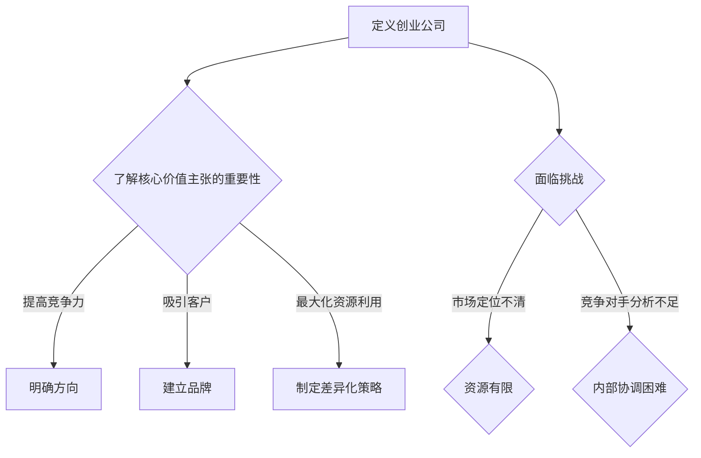
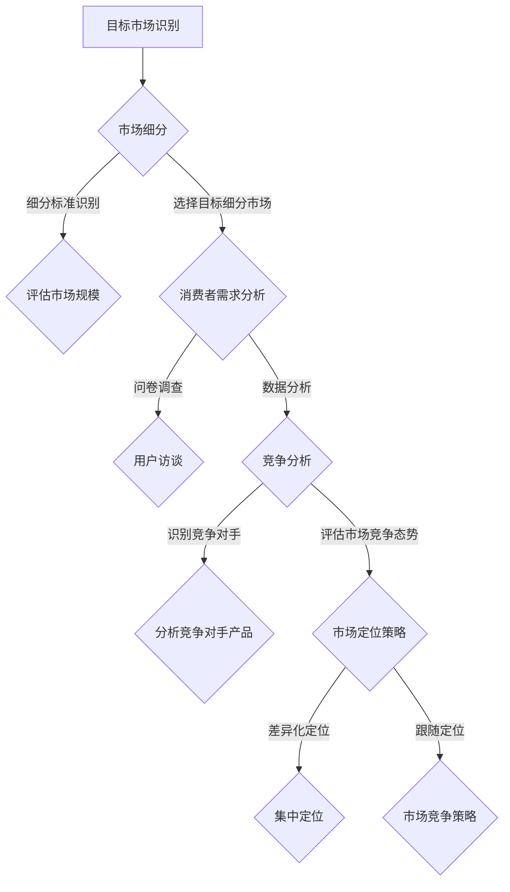
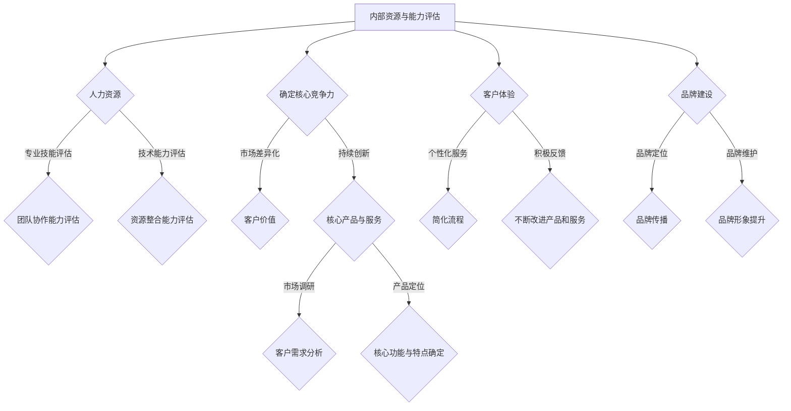
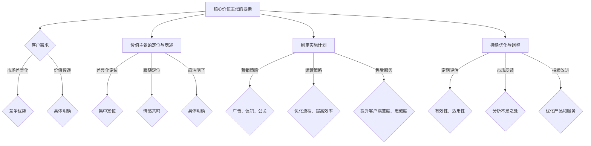
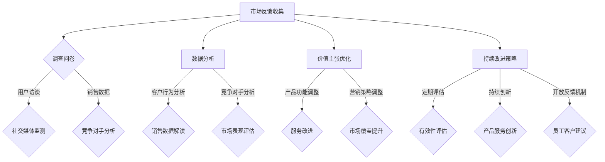
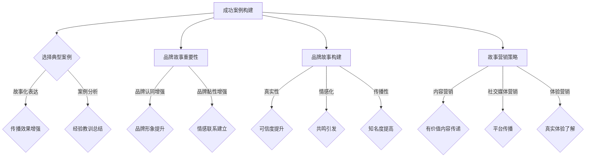
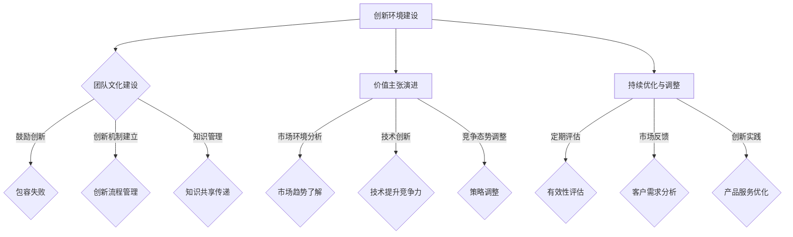
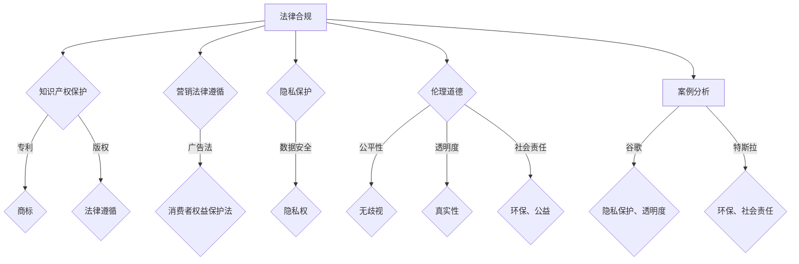

                 

### 文章标题

如何构建创业公司的核心价值主张？

### 文章关键词

创业公司，核心价值主张，市场定位，竞争力，品牌建设

### 摘要

本文旨在探讨如何构建创业公司的核心价值主张。通过对创业公司核心价值主张的定义、重要性、构建策略、验证与优化以及法律与伦理考量的全面分析，本文为创业公司提供了一个系统的指导框架，帮助它们在激烈的市场竞争中脱颖而出，实现可持续发展。

## 第1章：创业公司的核心价值主张概述

### 1.1 创业公司的定义与背景

创业公司，是指以创新商业模式或技术创新为驱动，通过资本积累和团队建设，致力于在市场中找到生存和发展的机会的企业。创业公司通常面临着资源有限、市场竞争激烈等挑战，因此，构建一个清晰、有吸引力的核心价值主张（Value Proposition）是至关重要的。

### 1.2 核心价值主张的重要性

核心价值主张是创业公司对自身产品或服务的定位和差异化表达，它决定了公司如何与潜在客户建立联系，并在市场中获得竞争优势。一个优秀的核心价值主张能够帮助创业公司：

1. **明确方向**：定义公司的发展路径，使团队聚焦于最核心的产品和服务。
2. **吸引客户**：通过突出公司的独特优势，吸引目标客户群体。
3. **建立品牌**：传达公司的品牌理念和价值观，提升品牌影响力。
4. **提高竞争力**：在激烈的市场竞争中，凸显公司的优势，形成差异化。

### 1.3 构建核心价值主张的挑战

尽管核心价值主张的重要性显而易见，但构建一个有效的核心价值主张并非易事。创业公司可能面临以下挑战：

1. **市场定位不清**：在众多竞争者中，如何找到自己的独特位置。
2. **资源有限**：在资源有限的情况下，如何最大化地利用资源来构建核心价值主张。
3. **竞争对手分析不足**：不了解竞争对手的优势和劣势，难以制定有效的差异化策略。
4. **内部协调困难**：团队成员可能对核心价值主张的理解和执行存在分歧。

为了应对这些挑战，创业公司需要系统性地分析市场、竞争对手和自身能力，以构建一个真正有价值的核心价值主张。

### Mermaid 流程图

### 1.4 本章小结

本章介绍了创业公司的核心价值主张的定义、重要性以及构建过程中的挑战。通过理解核心价值主张的概念和作用，创业公司可以更好地制定战略，实现长期发展。

## 第2章：定义你的目标市场

### 2.1 目标市场的识别

目标市场是创业公司希望服务和吸引的客户群体。准确识别目标市场有助于创业公司：

1. **集中资源**：将有限的资源和精力投入到最有潜力的市场。
2. **精准营销**：设计更有效的营销策略，提高市场响应率。
3. **产品定制**：根据客户需求调整产品或服务，提升用户体验。

### 2.2 市场细分

市场细分是指将整个市场划分为若干具有相似需求的子市场。市场细分的步骤包括：

1. **识别细分标准**：如地理位置、人口统计、消费行为等。
2. **评估细分市场规模**：确定每个细分市场的潜力和可行性。
3. **选择目标细分市场**：根据公司的资源能力和市场机会，选择最合适的目标细分市场。

### 2.3 消费者需求分析

消费者需求分析是了解目标客户群体的核心步骤。通过以下方法进行分析：

1. **问卷调查**：收集客户的反馈和需求。
2. **用户访谈**：深入了解用户的使用习惯和期望。
3. **数据分析**：利用市场调研数据，分析消费者行为和偏好。

### 2.4 竞争分析

竞争分析是了解竞争对手的优势和劣势，以便创业公司制定有效的竞争策略。竞争分析的步骤包括：

1. **识别竞争对手**：确定直接和间接的竞争对手。
2. **分析竞争对手的产品和服务**：了解他们的优势、劣势和市场表现。
3. **评估市场竞争态势**：预测市场趋势，评估公司竞争力。

### 2.5 市场定位策略

市场定位策略是创业公司如何将自身定位在目标市场中的策略。有效的市场定位策略包括：

1. **差异化定位**：通过独特的产品或服务特点，与竞争对手区分开来。
2. **集中定位**：专注于某一细分市场，成为该市场的领导者。
3. **跟随定位**：模仿成功的竞争对手，但进行改进和创新。

### Mermaid 流程图

### 2.6 本章小结

本章详细介绍了如何识别目标市场，包括市场细分、消费者需求分析和竞争分析。通过这些分析，创业公司可以更好地定位自身，制定有效的市场策略。

## 第3章：识别你的核心竞争力

### 3.1 内部资源与能力评估

内部资源与能力评估是识别创业公司核心竞争力的重要步骤。通过以下方法进行评估：

1. **人力资源**：评估团队成员的专业技能、经验和团队协作能力。
2. **技术能力**：评估公司在技术方面的创新能力、技术储备和研发能力。
3. **资源整合**：评估公司如何整合内外部资源，实现资源最大化利用。

### 3.2 确定核心竞争力

核心竞争力是指创业公司在特定领域内具有明显优势的能力。通过以下方法确定核心竞争力：

1. **市场差异化**：通过独特的产品或服务特点，与竞争对手区分开来。
2. **客户价值**：提供独特的客户价值，满足客户需求和期望。
3. **持续创新**：通过不断的创新，保持市场竞争力。

### 3.3 核心产品与服务

核心产品与服务是创业公司提供的主要价值载体。确定核心产品与服务的步骤包括：

1. **市场调研**：了解市场需求和趋势。
2. **客户需求分析**：确定客户最关注的痛点。
3. **产品定位**：根据市场调研和客户需求，确定产品的核心功能和特点。

### 3.4 客户体验

客户体验是创业公司在服务过程中提供给客户的感觉和感受。提升客户体验的方法包括：

1. **个性化服务**：根据客户的需求和偏好，提供个性化的服务。
2. **简化流程**：简化购买和服务流程，提高效率。
3. **积极反馈**：及时响应客户反馈，不断改进产品和服务。

### 3.5 品牌建设

品牌建设是提升创业公司市场影响力的重要手段。通过以下方法进行品牌建设：

1. **品牌定位**：明确品牌的独特价值和定位。
2. **品牌传播**：通过多种渠道传播品牌理念和价值。
3. **品牌维护**：持续维护品牌形象，提高品牌忠诚度。

### Mermaid 流程图

### 3.6 本章小结

本章介绍了如何评估内部资源与能力，确定核心竞争力，以及如何构建核心产品与服务、提升客户体验和进行品牌建设。通过这些步骤，创业公司可以更好地识别和发展自身的核心竞争力。

## 第4章：构建核心价值主张的策略

### 4.1 核心价值主张的要素

核心价值主张是由多个关键要素构成的。这些要素包括：

1. **客户需求**：明确目标客户的需求和痛点。
2. **市场差异化**：通过独特的产品或服务特点，与竞争对手区分开来。
3. **竞争优势**：分析公司的核心竞争力，将其转化为市场优势。
4. **价值传递**：确保客户能够感知到产品或服务的价值。

### 4.2 价值主张的定位与表述

价值主张的定位与表述是核心价值主张构建的关键环节。定位策略包括：

1. **差异化定位**：通过独特的产品特点或服务优势，在市场中形成差异化。
2. **集中定位**：专注于某一细分市场，提供针对性的解决方案。
3. **跟随定位**：模仿成功的竞争对手，但进行改进和创新。

在表述价值主张时，需要注意以下几点：

1. **简洁明了**：用简短的语言描述核心价值主张。
2. **具体明确**：提供具体的例子或数据支持，使价值主张更具说服力。
3. **情感共鸣**：通过情感化的语言，激发客户的共鸣。

### 4.3 制定实施计划

制定实施计划是确保核心价值主张得以有效落实的关键步骤。实施计划包括以下内容：

1. **营销策略**：制定针对目标市场的营销策略，包括广告、促销、公关等。
2. **运营策略**：优化公司运营流程，提高效率，确保价值主张的贯彻执行。
3. **售后服务**：提供优质的售后服务，提升客户满意度和忠诚度。

### 4.4 持续优化与调整

核心价值主张并非一成不变，而是需要根据市场环境和公司发展进行调整。持续优化与调整的方法包括：

1. **定期评估**：定期评估核心价值主张的有效性和适用性。
2. **市场反馈**：收集客户和市场反馈，分析价值主张的不足之处。
3. **持续改进**：根据反馈，不断优化产品和服务，提升价值主张。

### Mermaid 流程图

### 4.5 本章小结

本章介绍了构建核心价值主张的策略，包括要素分析、定位与表述、实施计划以及持续优化与调整的方法。通过这些策略，创业公司可以更好地构建并实现其核心价值主张。

## 第5章：核心价值主张的验证与优化

### 5.1 市场反馈收集

市场反馈是验证核心价值主张有效性的重要手段。通过以下方法收集市场反馈：

1. **调查问卷**：设计针对目标客户的调查问卷，收集他们对产品或服务的反馈。
2. **用户访谈**：与目标客户进行深入交流，了解他们的真实体验和需求。
3. **社交媒体监测**：分析社交媒体平台上的评论和讨论，了解客户的意见和态度。
4. **销售数据**：通过销售数据，分析产品的市场接受度和客户忠诚度。

### 5.2 数据分析

数据分析是将市场反馈转化为具体行动的重要步骤。通过以下方法进行分析：

1. **客户行为分析**：分析客户在购买和使用产品过程中的行为模式，了解他们的需求和行为趋势。
2. **销售数据解读**：通过销售数据，分析产品的市场表现，找出成功和不足之处。
3. **竞争对手分析**：比较竞争对手的数据，了解自己在市场中的地位和竞争力。

### 5.3 价值主张优化

根据市场反馈和数据分析，对核心价值主张进行优化和调整。优化方法包括：

1. **产品功能调整**：根据客户反馈，优化产品的功能，满足客户需求。
2. **服务改进**：提升售后服务质量，提高客户满意度。
3. **营销策略调整**：根据市场表现，优化营销策略，提高市场覆盖率和客户转化率。

### 5.4 持续改进策略

核心价值主张的优化是一个持续的过程。通过以下策略，确保持续改进：

1. **定期评估**：定期评估核心价值主张的有效性，确保其与市场变化保持一致。
2. **持续创新**：鼓励团队持续创新，不断推出新的产品和服务，满足客户不断变化的需求。
3. **开放反馈机制**：建立开放的反馈机制，鼓励客户和员工提出建议，不断优化产品和服务。

### Mermaid 流�程图

### 5.5 本章小结

本章介绍了如何验证和优化核心价值主张，包括市场反馈收集、数据分析和持续改进策略。通过这些方法，创业公司可以不断提高核心价值主张的有效性，实现持续发展。

## 第6章：构建成功案例与品牌故事

### 6.1 成功案例的构建

成功案例是展示创业公司核心价值主张的有效手段。构建成功案例的步骤包括：

1. **选择典型案例**：选择具有代表性、影响力和说服力的成功案例。
2. **故事化表达**：将成功案例转化为有趣、引人入胜的故事，提高传播效果。
3. **案例分析**：深入剖析成功案例，总结经验教训，为其他案例提供参考。

### 6.2 品牌故事的重要性

品牌故事是传递品牌理念和价值的重要方式。一个优秀的品牌故事可以：

1. **增强品牌认同**：通过故事，让客户更深入地理解品牌的价值和理念。
2. **提升品牌形象**：塑造品牌形象，提升品牌的市场地位。
3. **增强品牌黏性**：通过故事，与客户建立情感联系，提高客户忠诚度。

### 6.3 品牌故事构建

构建品牌故事需要遵循以下原则：

1. **真实性**：确保故事内容真实可信，增强故事的说服力。
2. **情感化**：通过情感化的语言，引发客户的共鸣。
3. **传播性**：设计易于传播的故事内容，提高品牌知名度。

### 6.4 故事营销策略

故事营销是将品牌故事融入到营销活动中，提高品牌影响力的策略。故事营销的方法包括：

1. **内容营销**：通过有趣、有价值的内容，传递品牌故事。
2. **社交媒体营销**：利用社交媒体平台，传播品牌故事。
3. **体验营销**：通过真实的体验，让客户深入了解品牌故事。

### Mermaid 流程图

### 6.5 本章小结

本章介绍了构建成功案例和品牌故事的方法和策略。通过成功案例和品牌故事的构建，创业公司可以提升品牌形象，增强客户认同，实现可持续发展。

## 第7章：持续创新与价值主张演进

### 7.1 创新环境建设

创新环境是创业公司持续创新的基础。建设创新环境的方法包括：

1. **团队文化建设**：营造鼓励创新、包容失败的文化氛围。
2. **创新机制建立**：建立完善的创新流程和管理机制，支持创新项目的落地。
3. **知识管理**：建立知识管理系统，促进知识共享和传递。

### 7.2 价值主张的演进

随着市场环境和技术的不断变化，创业公司的核心价值主张也需要不断演进。价值主张演进的方法包括：

1. **市场环境分析**：定期分析市场环境，了解市场趋势和客户需求变化。
2. **技术创新**：紧跟技术发展趋势，利用新技术提升产品或服务的竞争力。
3. **竞争态势调整**：根据竞争对手的策略和市场表现，调整自身的价值主张。

### 7.3 持续优化与调整

持续优化与调整是保持价值主张有效性的关键。持续优化与调整的方法包括：

1. **定期评估**：定期评估价值主张的有效性和适用性。
2. **市场反馈**：及时收集市场反馈，分析客户的实际需求和反馈。
3. **创新实践**：通过创新实践，不断优化产品和服务，提升价值主张。

### Mermaid 流程图

### 7.4 本章小结

本章介绍了如何建设创新环境，以及如何通过市场环境分析、技术创新和竞争态势调整，实现价值主张的持续演进和优化。

## 第8章：构建核心价值主张的法律与伦理考量

### 8.1 法律合规

在构建核心价值主张时，法律合规是确保创业公司合法运营的基础。法律合规包括：

1. **知识产权保护**：确保公司拥有产品和服务的知识产权，如专利、商标和版权。
2. **营销法律遵循**：遵守相关法律法规，如广告法、消费者权益保护法等。
3. **隐私保护**：保护客户的隐私和数据安全，遵守相关法律法规。

### 8.2 伦理道德

伦理道德是创业公司构建核心价值主张的重要考量。伦理道德包括：

1. **公平性**：确保产品和服务对所有人都是公平的，无歧视。
2. **透明度**：在营销和运营过程中，保持透明，避免误导客户。
3. **社会责任**：关注社会和环境问题，承担社会责任。

### 8.3 案例分析

通过以下案例分析，了解创业公司在法律与伦理考量方面的实践：

1. **谷歌**：在广告和数据处理方面，谷歌严格遵守相关法律法规，并注重伦理道德，如隐私保护和透明度。
2. **特斯拉**：特斯拉在技术创新和产品推广方面，始终遵循环保和社会责任原则，如使用可再生能源和减少碳排放。

### Mermaid 流程图

### 8.4 本章小结

本章介绍了构建核心价值主张时需要考虑的法律和伦理问题，并通过案例分析，展示了创业公司在这些方面的实践。

### 附录A：核心价值主张构建工具与资源

#### A.1 调查问卷设计与分析工具

调查问卷是收集市场反馈的重要工具。以下是一些常用的调查问卷设计与分析工具：

1. **SurveyMonkey**：提供在线调查问卷设计、分发和分析服务。
2. **Google Forms**：Google 提供的免费在线调查问卷工具。
3. **Qualtrics**：专业的调查问卷设计和分析平台。

#### A.2 品牌故事构建案例库

品牌故事构建案例库是借鉴成功案例，提升品牌故事构建能力的重要资源。以下是一些优秀的品牌故事构建案例库：

1. **BrandStory**：提供各种行业的品牌故事案例，帮助创业公司构建品牌故事。
2. **CustomerThink**：提供关于客户体验和品牌构建的文章和案例。
3. **Brand24**：提供关于品牌管理和品牌建设的工具和资源。

#### A.3 创新管理软件与平台推荐

创新管理软件和平台可以帮助创业公司实现持续创新。以下是一些推荐的创新管理软件和平台：

1. **Innovation Games**：提供创新游戏和工具，促进团队协作和创意产生。
2. **MindMup**：提供思维导图工具，帮助团队梳理创新思路。
3. **IBM Design Thinking**：IBM 提供的创新设计方法论和工具。

### 附录A 小结

附录A提供了核心价值主张构建过程中所需的工具与资源，包括调查问卷设计与分析工具、品牌故事构建案例库以及创新管理软件与平台推荐。通过使用这些工具与资源，创业公司可以更有效地构建其核心价值主张。

### 作者信息

作者：AI天才研究院/AI Genius Institute & 禅与计算机程序设计艺术 /Zen And The Art of Computer Programming

