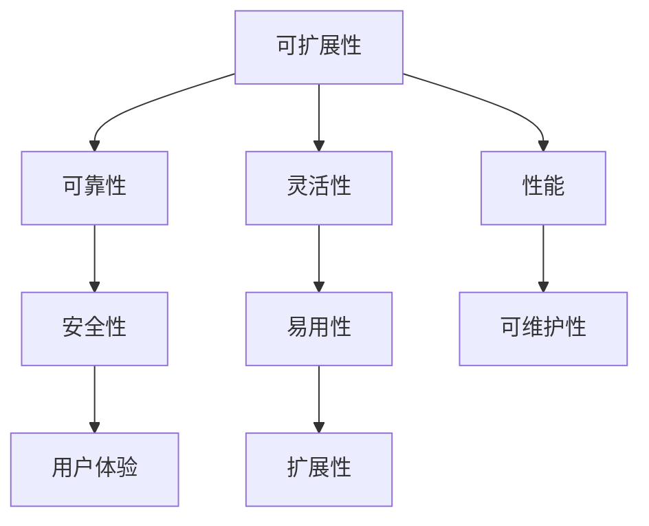

                 

### 文章标题

# 如何构建可扩展的SaaS产品架构

### 关键词

- SaaS产品
- 架构设计
- 可扩展性
- 可靠性
- 性能优化
- 安全架构

### 摘要

本文将深入探讨如何构建一个可扩展的SaaS产品架构，涵盖了从基础概念到实施细节的全方位指导。我们将首先回顾SaaS的概念和特点，接着分析SaaS产品架构的核心概念和设计原则，然后详细讲解数据库、网络、服务架构及微服务架构的实施方法和安全架构设计。最后，我们将讨论性能和扩展性优化策略，并通过实际案例分析，提供最佳实践和未来展望。

## 第一部分：SaaS产品架构基础

### 第1章：SaaS概述

#### 1.1 SaaS的概念与特点

SaaS（Software as a Service），即软件即服务，是一种通过互联网提供软件服务的模式。与传统的软件购买和安装不同，SaaS模式允许用户通过浏览器访问软件应用，而无需安装和维护软件。以下是SaaS的主要特点：

1. **按需付费**：用户根据实际使用情况付费，无需一次性购买。
2. **多租户架构**：多个用户共享同一套软件系统，降低了成本和维护复杂度。
3. **即开即用**：无需安装和配置，用户可以快速开始使用。
4. **自动升级**：供应商负责软件的更新和维护，用户始终使用最新版本。
5. **高灵活性**：用户可以根据需求随时调整使用量。

#### 1.2 SaaS的发展历程

SaaS的发展经历了几个阶段：

1. **萌芽期（1999-2004年）**：SaaS概念首次被提出，一些初创公司开始尝试。
2. **发展期（2005-2010年）**：随着云计算技术的发展，SaaS市场开始快速增长。
3. **成熟期（2011至今）**：大量企业采用SaaS服务，市场进入成熟阶段。

#### 1.3 SaaS与传统软件的区别

1. **交付模式**：传统软件需要用户自行安装和维护，而SaaS直接通过互联网提供服务。
2. **成本结构**：传统软件通常需要一次性投资，而SaaS采用按需付费模式。
3. **用户管理**：传统软件通常为单一客户定制，而SaaS支持多租户模式，用户管理更为复杂。

#### 1.4 SaaS的业务模式

SaaS的业务模式主要包括以下几种：

1. **订阅模式**：用户按月或按年订阅服务。
2. **按需付费模式**：用户根据实际使用量付费。
3. **免费试用模式**：提供一定期限的免费试用，用户在试用期结束后选择付费。
4. **混合模式**：结合上述模式，提供多种付费选项。

### 第2章：SaaS产品架构核心概念

#### 2.1 核心概念与联系

在构建SaaS产品时，需要关注以下几个核心概念，并理解它们之间的联系：

1. **可扩展性**：系统能够随着用户数量的增加和业务需求的变化，灵活扩展资源。
2. **可靠性**：系统在高负载和故障情况下仍能稳定运行。
3. **灵活性**：系统可以快速适应不同的业务场景和用户需求。
4. **性能**：系统在高负载下仍能保持良好的响应速度。
5. **安全性**：系统在保护用户数据和隐私方面具备完善的机制。

下面是一个用于表示这些概念之间关系的Mermaid流程图：

#### 2.2 SaaS产品架构的核心要素

SaaS产品架构通常包括以下几个核心要素：

1. **用户界面**：提供给用户的操作界面，包括前端和后端逻辑。
2. **业务逻辑**：处理用户请求、业务流程和数据处理的中间层。
3. **数据存储**：用于存储用户数据和业务数据的数据库系统。
4. **基础设施**：包括服务器、网络、存储等硬件和软件基础设施。
5. **服务组件**：提供通用服务的组件，如身份验证、日志记录、监控等。

### 第3章：SaaS产品架构设计原则

#### 3.1 设计原则概述

设计一个高效的SaaS产品架构需要遵循以下原则：

1. **模块化**：将系统拆分为独立的模块，便于维护和扩展。
2. **可复用性**：设计可复用的组件，提高开发效率和降低成本。
3. **安全性**：确保系统的安全性，保护用户数据和隐私。
4. **性能优化**：提高系统的性能，满足用户的高效操作需求。

#### 3.2 模块化设计

模块化设计是将系统拆分为独立的模块，每个模块负责特定的功能。模块化设计的好处包括：

1. **易于维护**：模块独立，便于单独维护和更新。
2. **提高复用性**：模块可复用，减少重复开发。
3. **便于扩展**：新功能可以通过增加模块来实现。

#### 3.3 可复用性设计

可复用性设计是通过设计可复用的组件来提高开发效率和降低成本。以下是实现可复用性设计的一些方法：

1. **通用组件**：设计通用的组件，满足多种业务场景。
2. **抽象接口**：通过抽象接口，实现组件的通用性。
3. **代码复用**：通过代码复用来减少重复开发。

#### 3.4 安全性设计

安全性设计是确保系统的安全性，保护用户数据和隐私的关键。以下是安全性设计的一些方法：

1. **身份验证**：确保只有授权用户才能访问系统。
2. **访问控制**：对用户访问权限进行严格管理。
3. **数据加密**：对敏感数据进行加密，防止数据泄露。
4. **日志记录**：记录系统操作日志，便于审计和追踪。

## 第二部分：SaaS产品架构实施

### 第4章：数据库架构设计

#### 4.1 数据库类型选择

在选择数据库类型时，需要考虑以下因素：

1. **数据量**：对于大规模数据，关系数据库可能更为合适，而对于中小型数据，NoSQL数据库可能更具优势。
2. **查询需求**：关系数据库适用于复杂查询，而NoSQL数据库则更适合快速读取和写入操作。
3. **性能要求**：根据性能要求选择适合的数据库类型，如MySQL、PostgreSQL等关系数据库，或MongoDB、Cassandra等NoSQL数据库。

#### 4.2 数据库设计原则

在进行数据库设计时，需要遵循以下原则：

1. **规范化**：通过规范化减少数据冗余，提高数据一致性。
2. **灵活性**：设计灵活的数据库结构，以适应未来业务需求的变化。
3. **性能优化**：根据实际查询需求进行索引和性能优化。

#### 4.3 数据库性能优化

以下是数据库性能优化的一些方法：

1. **索引优化**：合理使用索引，提高查询速度。
2. **查询优化**：优化SQL查询语句，减少查询时间。
3. **缓存策略**：使用缓存策略，减少数据库访问次数。
4. **分库分表**：对于大数据量，可以考虑分库分表来提高性能。

### 第5章：网络架构设计

#### 5.1 网络架构概述

SaaS产品的网络架构需要考虑以下几个方面：

1. **高可用性**：确保网络连接稳定，避免单点故障。
2. **安全性**：保护网络免受攻击，防止数据泄露。
3. **负载均衡**：通过负载均衡，提高系统性能和可用性。

#### 5.2 服务器架构选择

在服务器架构选择方面，可以考虑以下几种方案：

1. **单机部署**：适用于小型项目，成本低，但可靠性较差。
2. **集群部署**：通过多台服务器组成集群，提高可靠性和性能。
3. **分布式部署**：将应用拆分为多个微服务，分布在不同服务器上，适用于大型项目。

#### 5.3 负载均衡策略

负载均衡策略包括以下几种：

1. **轮询**：将请求均匀分配到服务器上。
2. **最小连接数**：将请求分配到连接数最少的服务器。
3. **源IP哈希**：根据源IP地址，将请求固定分配到服务器。

### 第6章：服务架构设计

#### 6.1 服务拆分与组合

在服务架构设计中，服务拆分和组合是关键。以下是实现服务拆分和组合的一些方法：

1. **功能拆分**：根据业务功能，将应用拆分为多个独立服务。
2. **数据拆分**：根据数据访问模式，将数据拆分为多个数据源。
3. **组合服务**：通过服务组合，实现复杂的业务流程。

#### 6.2 服务发现与注册

服务发现与注册是服务架构中的重要部分。以下是实现服务发现与注册的一些方法：

1. **注册中心**：服务启动时，向注册中心注册服务信息。
2. **服务发现**：消费者通过注册中心发现可用服务。
3. **心跳检测**：服务定期向注册中心发送心跳，更新服务状态。

#### 6.3 服务监控与优化

服务监控与优化是确保服务稳定和高效运行的关键。以下是服务监控与优化的一些方法：

1. **性能监控**：监控服务性能指标，如响应时间、吞吐量等。
2. **日志分析**：分析服务日志，发现潜在问题和瓶颈。
3. **负载均衡**：根据性能监控结果，调整负载均衡策略。

### 第7章：微服务架构实践

#### 7.1 微服务架构概述

微服务架构是一种基于服务拆分的架构模式，将应用拆分为多个独立服务，每个服务负责特定的业务功能。以下是微服务架构的一些特点：

1. **独立部署**：每个服务可以独立部署和扩展。
2. **独立演进**：服务可以独立升级和迭代，不影响其他服务。
3. **去中心化**：服务之间通过API进行通信，去除了传统的中心化控制。

#### 7.2 微服务开发实践

以下是微服务开发的一些实践方法：

1. **服务拆分**：根据业务需求，将应用拆分为多个独立服务。
2. **API设计**：为每个服务设计合理的API接口。
3. **服务通信**：使用RESTful API、消息队列等实现服务通信。

#### 7.3 微服务治理与运维

微服务治理与运维是确保微服务稳定和高效运行的关键。以下是微服务治理与运维的一些实践方法：

1. **服务监控**：监控服务性能和状态，及时发现和处理问题。
2. **日志管理**：收集和分析服务日志，帮助诊断和优化服务。
3. **自动化部署**：使用CI/CD工具实现自动化部署和升级。

### 第8章：安全架构设计

#### 8.1 安全架构概述

安全架构设计是确保SaaS产品安全性的关键。以下是安全架构的一些核心组成部分：

1. **身份验证**：确保只有授权用户可以访问系统。
2. **访问控制**：管理用户对系统的访问权限。
3. **数据加密**：对敏感数据进行加密，防止数据泄露。
4. **安全审计**：记录系统操作日志，便于审计和追踪。

#### 8.2 数据安全与隐私保护

数据安全与隐私保护是SaaS产品的重要挑战。以下是实现数据安全与隐私保护的一些方法：

1. **加密存储**：使用加密技术存储敏感数据。
2. **访问控制**：通过访问控制机制，限制对数据的访问。
3. **数据脱敏**：对敏感数据进行脱敏处理，以保护隐私。

#### 8.3 访问控制与权限管理

访问控制与权限管理是确保系统安全性的关键。以下是实现访问控制与权限管理的一些方法：

1. **角色权限**：根据用户角色分配不同的权限。
2. **权限策略**：定义权限策略，限制用户对系统的访问。
3. **权限审计**：记录权限分配和变更日志，便于审计和追踪。

#### 8.4 防火墙与入侵检测

防火墙与入侵检测是保护系统免受网络攻击的关键。以下是实现防火墙与入侵检测的一些方法：

1. **防火墙配置**：配置防火墙规则，阻止非法访问。
2. **入侵检测**：使用入侵检测系统（IDS）监控网络流量，发现潜在攻击。
3. **安全响应**：建立安全响应机制，及时处理安全事件。

## 第三部分：SaaS产品架构优化

### 第9章：性能优化

#### 9.1 性能优化策略

性能优化是确保SaaS产品稳定和高效运行的关键。以下是性能优化的一些策略：

1. **数据库优化**：通过索引、查询优化和数据缓存等手段提高数据库性能。
2. **网络优化**：通过优化网络架构、负载均衡和缓存策略提高网络性能。
3. **服务优化**：优化服务设计、接口和通信，提高服务性能。

#### 9.2 性能监控与调优

性能监控与调优是确保SaaS产品性能持续优化的重要手段。以下是性能监控与调优的一些方法：

1. **性能监控**：使用性能监控工具监控系统性能指标，如响应时间、吞吐量等。
2. **性能分析**：分析性能数据，找出性能瓶颈。
3. **调优方案**：根据性能分析结果，制定调优方案并实施。

#### 9.3 压力测试与性能分析

压力测试与性能分析是评估SaaS产品性能的重要手段。以下是压力测试与性能分析的一些方法：

1. **压力测试**：模拟高负载场景，评估系统性能。
2. **性能分析**：分析测试结果，找出性能瓶颈。
3. **优化方案**：根据性能分析结果，制定优化方案并实施。

### 第10章：扩展性与可靠性优化

#### 10.1 扩展性优化方法

扩展性优化是确保SaaS产品能够灵活应对业务增长的关键。以下是扩展性优化的一些方法：

1. **水平扩展**：通过增加服务器和节点，提高系统处理能力。
2. **垂直扩展**：通过升级硬件和软件，提高系统性能。
3. **分布式架构**：采用分布式架构，将应用拆分为多个独立服务。

#### 10.2 可靠性优化策略

可靠性优化是确保SaaS产品稳定运行的关键。以下是可靠性优化的一些策略：

1. **容错机制**：设计容错机制，确保系统在故障情况下仍能正常运行。
2. **冗余设计**：通过冗余设计，提高系统的可靠性。
3. **故障恢复**：建立故障恢复机制，快速恢复系统运行。

#### 10.3 弹性伸缩实践

弹性伸缩是确保SaaS产品能够动态适应业务需求的关键。以下是弹性伸缩的一些实践方法：

1. **自动化伸缩**：使用自动化工具，根据负载情况自动调整资源。
2. **容器化部署**：使用容器化技术，提高部署和扩展的灵活性。
3. **监控与反馈**：通过监控系统和反馈机制，动态调整资源。

### 第11章：案例分析

#### 11.1 案例介绍

在本章中，我们将分析一个实际案例，探讨如何构建一个可扩展的SaaS产品架构。该案例涉及一家提供云计算服务的公司，其产品旨在为企业提供安全的云计算平台。

#### 11.2 案例架构分析

在分析案例架构时，我们将重点关注以下几个方面：

1. **数据库架构**：选择合适的数据库类型和设计原则，提高数据存储和查询性能。
2. **网络架构**：设计高可用性和安全的网络架构，确保服务稳定可靠。
3. **服务架构**：采用微服务架构，实现灵活的服务拆分和组合。
4. **安全架构**：设计全面的安全架构，保护用户数据和隐私。

#### 11.3 案例优化方案

在分析案例的基础上，我们将提出一系列优化方案，包括：

1. **性能优化**：通过数据库优化、网络优化和服务优化，提高系统性能。
2. **扩展性优化**：通过水平扩展和垂直扩展，提高系统处理能力。
3. **可靠性优化**：通过容错机制和冗余设计，提高系统可靠性。
4. **弹性伸缩**：通过自动化伸缩和容器化部署，实现灵活的资源管理。

### 附录

#### 附录 A：SaaS产品架构相关工具与资源

以下是构建SaaS产品架构时常用的工具和资源：

1. **开发工具**：如Visual Studio Code、IntelliJ IDEA等。
2. **持续集成与持续部署（CI/CD）**：如Jenkins、GitHub Actions等。
3. **监控与日志分析工具**：如Prometheus、Grafana等。
4. **安全防护工具**：如AWS Shield、Azure Security Center等。

## 作者信息

作者：AI天才研究院/AI Genius Institute & 禅与计算机程序设计艺术 /Zen And The Art of Computer Programming

本文由AI天才研究院与禅与计算机程序设计艺术共同创作，旨在为读者提供关于构建可扩展SaaS产品架构的全面指导。作者具备丰富的SaaS架构设计和实践经验，对SaaS领域的最新发展和技术趋势有深入理解。希望通过本文，读者能够掌握构建高效、稳定和可扩展的SaaS产品架构的方法和技巧。如需进一步交流和学习，请关注我们的官方网站和公众号。

