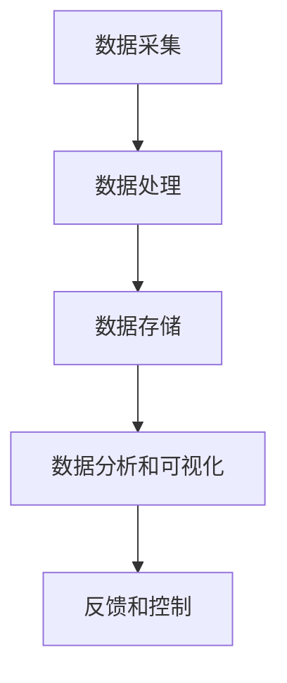

                 

### 文章标题

《如何构建可靠的产品遥测系统》

### 关键词

产品遥测、数据采集、数据处理、数据分析、数据传输、数据存储、算法原理、系统架构、开发实战、优化策略

### 摘要

本文将深入探讨如何构建一个可靠的产品遥测系统。我们将从基础概念入手，逐步讲解遥测系统的组成、核心算法原理、数学模型，并通过实际的案例研究，展示系统的构建与优化策略。文章旨在为开发者提供一套完整的构建遥测系统的指南，帮助他们在实际项目中实现高效、稳定的数据采集与处理。

## 《如何构建可靠的产品遥测系统》目录大纲

### 第一部分：遥测系统基础

#### 第1章：遥测系统的概述

##### 1.1 遥测系统的定义与作用
##### 1.2 遥测系统的组成与结构
##### 1.3 遥测系统的发展趋势

#### 第2章：遥测系统核心概念与联系

##### 2.1 数据采集与处理流程图
##### 2.2 遥测系统中的核心概念
##### 2.3 遥测系统中的核心算法原理

#### 第3章：遥测系统的数学模型和公式

##### 3.1 数据传输延迟模型
##### 3.2 数据传输速率模型
##### 3.3 数据压缩与恢复模型

### 第二部分：构建遥测系统

#### 第4章：构建遥测系统前的准备工作

##### 4.1 设备选型与配置
##### 4.2 系统设计原则

#### 第5章：系统开发与集成

##### 5.1 开发环境搭建
##### 5.2 系统开发流程

#### 第6章：系统测试与优化

##### 6.1 系统测试方法
##### 6.2 系统优化策略

#### 第7章：案例研究

##### 7.1 案例介绍
##### 7.2 案例实现
##### 7.3 案例效果评估

#### 第8章：遥测系统维护与更新

##### 8.1 系统维护策略
##### 8.2 持续改进

### 附录

#### 附录A：常用工具与技术选型

##### A.1 数据采集器选型指南
##### A.2 数据传输协议选型指南
##### A.3 数据存储系统选型指南
##### A.4 数据分析工具选型指南

#### 附录B：参考文献与拓展阅读

##### B.1 遥测系统相关书籍推荐
##### B.2 遥测系统技术论文推荐
##### B.3 遥测系统实践案例推荐
##### B.4 遥测系统技术社群

## 第一部分：遥测系统基础

### 第1章：遥测系统的概述

#### 1.1 遥测系统的定义与作用

遥测系统是一种远程监控系统，它通过传感器和数据采集器，将现场的物理量（如温度、压力、速度等）转化为电子信号，通过数据传输协议传输到中央处理系统进行存储、处理和分析。遥测系统广泛应用于工业自动化、环境监测、智能家居、物联网等领域。

遥测系统的主要作用包括：

1. **实时监控**：通过遥测系统，可以实时获取设备的运行状态和性能指标，及时发现问题并采取相应措施。
2. **数据采集**：遥测系统能够高效地采集大量数据，为后续的数据分析提供基础。
3. **故障预警**：通过分析历史数据和实时数据，可以预测设备的故障，提前进行维护。
4. **优化管理**：通过对数据的分析，可以发现设备的运行瓶颈，从而优化管理流程，提高生产效率。

#### 1.2 遥测系统的组成与结构

一个典型的遥测系统通常包括以下几个部分：

1. **传感器**：用于采集物理量的装置，如温度传感器、压力传感器等。
2. **数据采集器**：将传感器采集到的信号进行数字化处理，并传输到中央处理系统。
3. **数据传输协议**：用于数据采集器与中央处理系统之间的数据传输，如Modbus、HTTP、MQTT等。
4. **中央处理系统**：包括服务器、数据库等，用于接收、存储和处理数据。
5. **数据分析与可视化工具**：用于对采集到的数据进行处理、分析和可视化展示。

#### 1.3 遥测系统的发展趋势

随着物联网（IoT）和大数据技术的不断发展，遥测系统也在不断演进：

1. **智能化**：传感器和数据采集器的智能化程度不断提高，能够自动进行数据的预处理和异常检测。
2. **网络化**：随着5G等新型通信技术的普及，遥测系统的数据传输速度和稳定性大幅提升。
3. **边缘计算**：将数据处理和分析的部分从中央处理系统转移到边缘设备，降低延迟，提高响应速度。
4. **云计算与大数据**：利用云计算和大数据技术，实现对海量数据的存储、处理和分析。

### 第2章：遥测系统核心概念与联系

#### 2.1 数据采集与处理流程图

为了更好地理解遥测系统的运作原理，我们可以通过一个Mermaid流程图来展示数据采集与处理的流程：



这个流程图描述了从数据采集到数据处理的整个过程：

1. **数据采集**：传感器采集物理量，数据采集器进行数字化处理。
2. **数据处理**：对采集到的原始数据进行清洗、归一化等处理。
3. **数据存储**：将处理后的数据存储到数据库或其他存储介质中。
4. **数据分析和可视化**：对存储的数据进行统计分析，并通过图表等形式进行可视化展示。
5. **反馈和控制**：根据分析结果，对设备进行控制和调整。

#### 2.2 遥测系统中的核心概念

在构建遥测系统时，我们需要了解以下几个核心概念：

##### 2.2.1 数据采集器

数据采集器是遥测系统的核心组成部分，它负责从传感器读取数据，并进行初步处理。数据采集器的性能直接影响到整个系统的效率和可靠性。

##### 2.2.2 数据传输协议

数据传输协议用于确保数据在采集器与中央处理系统之间的可靠传输。常见的传输协议包括Modbus、HTTP、MQTT等。

##### 2.2.3 数据存储系统

数据存储系统用于存储采集到的数据，以便后续的分析和处理。选择合适的存储系统（如关系数据库、NoSQL数据库、时序数据库等）对于系统的性能和可扩展性至关重要。

##### 2.2.4 数据分析工具

数据分析工具用于对存储的数据进行深度分析，发现数据中的规律和趋势。常见的分析工具包括Python、R、Tableau等。

#### 2.3 遥测系统中的核心算法原理

##### 2.3.1 数据采集算法原理

数据采集算法的基本原理如下（伪代码）：

```python
function data_collection_algorithm():
    for sensor in sensors:
        read_sensor_data(sensor)
        process_data(sensor.data)
        send_data_to_gateway(sensor.data)
```

这段伪代码展示了数据采集算法的基本流程：

1. 遍历所有传感器。
2. 从传感器读取数据。
3. 对数据进行初步处理（如滤波、归一化等）。
4. 将处理后的数据发送到中央处理系统。

##### 2.3.2 数据处理算法原理

数据处理算法的基本原理如下（伪代码）：

```python
function data_processing_algorithm(data):
    clean_data(data)
    aggregate_data(data)
    normalize_data(data)
    return processed_data
```

这段伪代码展示了数据处理算法的基本流程：

1. 清洗数据，去除噪声和异常值。
2. 对数据进行聚合，如计算平均值、最大值、最小值等。
3. 对数据进行归一化，使其在同一量级内进行比较。
4. 返回处理后的数据。

### 第3章：遥测系统的数学模型和公式

遥测系统中的数学模型和公式对于理解和优化系统性能至关重要。以下是几个常见的数学模型和公式：

#### 3.1 数据传输延迟模型

数据传输延迟（\(L\)）可以用以下公式计算：

\[ L = \frac{D \times S}{B} \]

其中：

- \(D\)：数据传输距离（单位：米）。
- \(S\)：信号传输速度（单位：米/秒）。
- \(B\)：带宽（单位：比特/秒）。

#### 3.2 数据传输速率模型

数据传输速率（\(R\)）可以用以下公式计算：

\[ R = \frac{B}{L} \]

其中：

- \(B\)：带宽（单位：比特/秒）。
- \(L\)：数据传输延迟（单位：秒）。

#### 3.3 数据压缩与恢复模型

数据压缩与恢复模型通常涉及以下步骤：

1. **压缩**：将原始数据转换为压缩格式，以减少数据大小。
2. **存储**：将压缩后的数据存储到存储介质中。
3. **恢复**：在需要时，将压缩数据恢复为原始格式。

数据压缩模型可以用以下公式表示：

\[ Z = C \times D \]

其中：

- \(Z\)：压缩后数据的大小。
- \(C\)：压缩系数。
- \(D\)：原始数据的大小。

通过上述公式和模型，我们可以更好地理解遥测系统中的数据传输和处理过程，从而为系统优化提供理论基础。

## 第二部分：构建遥测系统

### 第4章：构建遥测系统前的准备工作

#### 4.1 设备选型与配置

构建遥测系统的第一步是进行设备选型与配置。以下是几个关键的设备选型与配置建议：

##### 4.1.1 数据采集器选型

数据采集器是遥测系统的核心组件，其性能直接影响到整个系统的性能。以下是数据采集器选型的几个关键点：

1. **精度与分辨率**：根据实际需求选择合适的传感器精度和分辨率。
2. **采集频率**：根据应用场景，选择合适的采集频率，以确保数据的实时性。
3. **兼容性**：确保数据采集器能够与传感器和中央处理系统兼容。
4. **扩展性**：考虑未来的扩展需求，选择具备良好扩展性的数据采集器。

##### 4.1.2 网络传输设备选型

网络传输设备是数据传输的关键环节，其选择需要考虑以下几个因素：

1. **传输速度**：根据数据传输量选择合适的传输速度。
2. **稳定性**：选择具备高稳定性的网络传输设备，以减少数据传输中断的风险。
3. **可靠性**：考虑设备的故障率和维修成本。
4. **兼容性**：确保网络传输设备与数据采集器和中央处理系统兼容。

##### 4.1.3 数据存储设备选型

数据存储设备的选择对于系统的性能和可扩展性至关重要。以下是数据存储设备选型的几个关键点：

1. **存储容量**：根据数据量的大小选择合适的存储容量。
2. **读写速度**：选择具备高读写速度的存储设备，以提高数据处理效率。
3. **可靠性**：考虑存储设备的故障率和数据丢失风险。
4. **可扩展性**：选择支持扩展的存储设备，以适应未来的数据增长。

#### 4.2 系统设计原则

在构建遥测系统时，我们需要遵循以下设计原则：

##### 4.2.1 可靠性

可靠性是遥测系统的核心要求。为了提高系统的可靠性，我们可以采取以下措施：

1. **冗余设计**：通过冗余设计，确保系统的关键组件（如数据采集器、网络传输设备等）具备备份，以防止单一故障导致系统瘫痪。
2. **故障检测与恢复**：定期进行故障检测，及时修复系统故障，确保系统的连续运行。
3. **数据备份**：定期进行数据备份，防止数据丢失。

##### 4.2.2 可扩展性

随着数据的增长，遥测系统需要具备良好的可扩展性。以下是几个可扩展性的设计原则：

1. **模块化设计**：采用模块化设计，方便系统的扩展和升级。
2. **分布式架构**：采用分布式架构，将数据处理和分析任务分布到多个节点上，以提高系统的可扩展性。
3. **弹性计算**：利用云计算和边缘计算技术，实现动态资源调度，提高系统的弹性。

##### 4.2.3 安全性

安全性是遥测系统设计中不可忽视的重要方面。为了确保系统的安全性，我们可以采取以下措施：

1. **数据加密**：对传输和存储的数据进行加密，防止数据泄露。
2. **访问控制**：实施严格的访问控制策略，确保只有授权用户能够访问系统。
3. **安全审计**：定期进行安全审计，及时发现和修复系统漏洞。

通过遵循以上设计原则，我们可以构建一个可靠、可扩展、安全的遥测系统，为实际应用提供有力支持。

### 第5章：系统开发与集成

#### 5.1 开发环境搭建

在开始开发遥测系统之前，我们需要搭建一个合适的开发环境。以下是开发环境搭建的几个关键步骤：

##### 5.1.1 开发工具和环境设置

1. **编程语言**：选择一种合适的编程语言，如Python、Java或C++。Python因其简洁易用和丰富的库支持，在遥测系统开发中尤为常见。
2. **集成开发环境（IDE）**：选择一个合适的IDE，如Visual Studio Code、Eclipse或IntelliJ IDEA，以提高开发效率。
3. **数据库**：选择一个合适的数据库，如MySQL、PostgreSQL或MongoDB，用于存储遥测数据。
4. **版本控制**：使用Git等版本控制工具，确保代码的版本管理和协同开发。

##### 5.1.2 系统集成方案设计

系统集成方案设计是开发过程中至关重要的一环。以下是系统集成方案设计的几个关键点：

1. **系统架构**：根据实际需求，设计合适的系统架构，如客户端-服务器架构或微服务架构。
2. **模块划分**：将系统划分为多个模块，如数据采集模块、数据处理模块、数据存储模块等，以实现模块化开发。
3. **接口设计**：设计清晰的接口，确保各个模块之间的通信和协同工作。
4. **安全性设计**：考虑系统的安全性需求，设计相应的安全策略和措施，如数据加密、访问控制和防火墙。

#### 5.2 系统开发流程

系统开发流程可以分为以下几个阶段：

##### 5.2.1 数据采集模块开发

1. **需求分析**：明确数据采集模块的功能需求，如采集哪些传感器数据、数据格式等。
2. **传感器连接**：编写代码，实现传感器与数据采集器的连接和通信。
3. **数据采集**：编写代码，实现数据的采集和初步处理，如数据清洗、滤波等。
4. **数据传输**：编写代码，实现数据通过数据传输协议传输到中央处理系统。

##### 5.2.2 数据传输模块开发

1. **协议选择**：选择合适的数据传输协议，如MQTT、HTTP或CoAP。
2. **传输实现**：编写代码，实现数据的传输，包括数据打包、发送和接收。
3. **异常处理**：设计异常处理机制，确保数据传输的可靠性，如重传机制和超时处理。

##### 5.2.3 数据处理与分析模块开发

1. **数据处理**：编写代码，实现数据的处理，如数据清洗、聚合、归一化等。
2. **数据分析**：编写代码，实现数据的统计分析、异常检测等分析功能。
3. **可视化展示**：编写代码，实现数据的可视化展示，如图表、仪表盘等。

#### 5.3 系统集成与测试

系统开发完成后，需要进行集成与测试，以确保系统的整体性能和稳定性。以下是系统集成与测试的几个关键步骤：

##### 5.3.1 系统集成

1. **集成测试**：对各个模块进行集成测试，确保模块之间的接口和通信正常。
2. **功能测试**：对系统的整体功能进行测试，确保系统按照预期正常运行。
3. **性能测试**：对系统的性能进行测试，如数据采集速度、传输速度、数据处理能力等。

##### 5.3.2 系统测试

1. **单元测试**：对系统中的各个模块进行单元测试，确保模块的功能正确。
2. **集成测试**：对系统中的多个模块进行集成测试，确保模块之间的交互正常。
3. **性能测试**：对系统的性能进行测试，如数据采集速度、传输速度、数据处理能力等。

##### 5.3.3 系统优化

在系统测试过程中，可能会发现一些性能瓶颈和问题。根据测试结果，对系统进行优化，以提高其性能和稳定性。常见的优化方法包括：

1. **数据压缩与传输优化**：通过数据压缩和优化传输协议，减少数据传输量，提高传输速度。
2. **系统稳定性优化**：通过冗余设计和故障检测与恢复机制，提高系统的稳定性。
3. **系统扩展性优化**：通过模块化设计和分布式架构，提高系统的扩展性。

通过以上开发与集成步骤，我们可以构建一个功能完整、性能稳定、可靠的遥测系统，为实际应用提供有力支持。

### 第6章：系统测试与优化

#### 6.1 系统测试方法

系统测试是确保遥测系统稳定、可靠运行的重要环节。以下是几种常见的系统测试方法：

##### 6.1.1 功能测试

功能测试是验证系统是否按照预期完成指定功能的测试。具体步骤包括：

1. **需求分析**：明确系统的功能需求，编写测试用例。
2. **执行测试用例**：按照测试用例执行测试，记录测试结果。
3. **缺陷报告**：发现功能缺陷，生成缺陷报告，并跟踪缺陷的修复过程。

##### 6.1.2 性能测试

性能测试是评估系统在不同负载条件下的性能表现。具体步骤包括：

1. **负载生成**：模拟用户访问和数据处理任务，生成负载。
2. **性能指标测量**：测量系统的响应时间、吞吐量、并发处理能力等性能指标。
3. **性能分析**：分析测试结果，找出性能瓶颈，并提出优化建议。

##### 6.1.3 安全测试

安全测试是确保系统不受外部攻击和内部威胁的测试。具体步骤包括：

1. **漏洞扫描**：使用自动化工具扫描系统中的安全漏洞。
2. **渗透测试**：模拟攻击者行为，尝试攻击系统，验证系统安全措施的有效性。
3. **安全加固**：根据测试结果，对系统进行安全加固，修复漏洞，提高安全性。

#### 6.2 系统优化策略

系统优化是提高遥测系统性能和稳定性的关键步骤。以下是几种常见的系统优化策略：

##### 6.2.1 数据压缩与传输优化

数据压缩和传输优化是减少数据传输量和提高传输速度的有效方法。具体策略包括：

1. **选择合适的压缩算法**：根据数据特点和需求，选择合适的压缩算法，如LZ77、LZ78、Huffman编码等。
2. **优化传输协议**：选择高效、低延迟的传输协议，如MQTT、HTTP/2等。
3. **数据去重**：检测和去除重复数据，减少传输量。

##### 6.2.2 系统稳定性优化

系统稳定性优化是确保系统在异常情况下仍能正常运行的关键。具体策略包括：

1. **冗余设计**：通过冗余设计，确保系统的关键组件（如数据采集器、服务器等）具备备份。
2. **故障检测与恢复**：设计故障检测和恢复机制，及时发现和修复系统故障。
3. **负载均衡**：通过负载均衡，将数据处理任务分布到多个节点上，提高系统的并发处理能力。

##### 6.2.3 系统扩展性优化

系统扩展性优化是确保系统能够随着数据增长和用户增多而稳定运行的关键。具体策略包括：

1. **模块化设计**：采用模块化设计，方便系统的扩展和升级。
2. **分布式架构**：采用分布式架构，将数据处理和分析任务分布到多个节点上，提高系统的扩展性。
3. **弹性计算**：利用云计算和边缘计算技术，实现动态资源调度，提高系统的弹性。

通过以上测试和优化策略，我们可以确保遥测系统的稳定运行，为实际应用提供高质量的数据支持。

### 第7章：案例研究

#### 8.1 案例介绍

在本章中，我们将通过一个实际案例，详细讲解如何构建一个可靠的遥测系统。案例背景是一家生产制造企业，希望实现对生产线的实时监控和故障预警，以提高生产效率和产品质量。

#### 8.1.1 案例背景

这家制造企业拥有多条生产线，生产过程中会产生大量的数据，如温度、压力、速度等。然而，由于缺乏有效的监控手段，生产过程中经常出现故障，导致生产效率低下和产品质量不稳定。为了解决这一问题，企业决定构建一个遥测系统，实现对生产线的实时监控和故障预警。

#### 8.1.2 案例目标

通过构建遥测系统，企业希望实现以下目标：

1. **实时监控**：实时获取生产线的运行状态，及时发现异常情况。
2. **故障预警**：通过数据分析，预测可能的故障，提前进行预防性维护。
3. **数据可视化**：将采集到的数据通过图表和仪表盘进行可视化展示，便于管理层进行决策。
4. **提高生产效率**：通过实时监控和故障预警，减少生产停机时间，提高生产效率。
5. **提升产品质量**：通过数据分析，找出生产过程中的问题，提升产品质量。

#### 8.2 案例实现

为了实现上述目标，企业采取了以下步骤构建遥测系统：

##### 8.2.1 案例系统架构

案例的系统架构采用微服务架构，主要包括以下模块：

1. **数据采集模块**：负责从传感器采集数据，并通过MQTT协议传输到中央处理系统。
2. **数据处理模块**：对采集到的数据进行处理，如清洗、归一化、聚合等。
3. **数据存储模块**：将处理后的数据存储到数据库中，如MySQL和InfluxDB。
4. **数据分析和可视化模块**：对存储的数据进行深度分析，并通过图表和仪表盘进行可视化展示。
5. **报警模块**：根据数据分析结果，触发报警，提醒相关人员。

##### 8.2.2 案例数据采集与传输

数据采集与传输的实现步骤如下：

1. **传感器连接**：选择合适的传感器，如温度传感器、压力传感器等，连接到数据采集器。
2. **数据采集**：编写代码，实现传感器数据的采集和初步处理，如滤波、归一化等。
3. **数据传输**：选择MQTT协议，实现数据从数据采集器传输到中央处理系统。

以下是数据采集与传输的伪代码示例：

```python
def data_collection():
    for sensor in sensors:
        data = read_sensor_data(sensor)
        processed_data = process_data(data)
        send_data_to_gateway(processed_data)

def read_sensor_data(sensor):
    # 读取传感器数据
    return sensor.read()

def process_data(data):
    # 数据处理，如滤波、归一化
    return processed_data

def send_data_to_gateway(data):
    # 通过MQTT协议发送数据到中央处理系统
    mqtt_client.publish("sensor_data", json.dumps(data))
```

##### 8.2.3 案例数据处理与分析

数据处理与分析的实现步骤如下：

1. **数据接收**：编写代码，接收来自MQTT协议的数据，并将其存储到数据库中。
2. **数据处理**：编写代码，对存储的数据进行进一步处理，如清洗、聚合等。
3. **数据分析**：编写代码，对处理后的数据进行分析，如异常检测、趋势预测等。
4. **数据可视化**：使用可视化工具，如D3.js、ECharts等，将分析结果以图表和仪表盘形式展示。

以下是数据处理与可视化的伪代码示例：

```python
def receive_data_from_gateway(data):
    # 接收MQTT数据并存储到数据库
    store_data_in_database(data)

def process_and_analyze_data():
    # 数据处理与分析
    processed_data = process_data_from_database()
    analysis_results = analyze_data(processed_data)

def visualize_data(analysis_results):
    # 数据可视化
    plot_charts(analysis_results)

def process_data_from_database():
    # 从数据库中处理数据
    return processed_data

def analyze_data(data):
    # 数据分析
    return analysis_results

def plot_charts(analysis_results):
    # 可视化展示
    draw_chart(analysis_results)
```

#### 8.3 案例效果评估

在案例实施一段时间后，企业对系统效果进行了评估，得出以下结论：

1. **实时监控**：通过遥测系统，企业能够实时监控生产线的运行状态，及时发现异常情况，减少了生产停机时间。
2. **故障预警**：通过数据分析，系统能够预测可能的故障，提前进行预防性维护，降低了设备故障率。
3. **数据可视化**：通过图表和仪表盘，企业管理层能够直观地了解生产线的运行情况，提高了决策效率。
4. **提高生产效率**：通过实时监控和故障预警，企业减少了生产停机时间，提高了生产效率。
5. **提升产品质量**：通过数据分析，企业找出了生产过程中的问题，并采取相应措施，提升了产品质量。

总之，通过构建遥测系统，企业实现了对生产线的有效监控和管理，提高了生产效率和产品质量，取得了显著的经济效益。

### 第8章：遥测系统维护与更新

#### 9.1 系统维护策略

遥测系统的维护是确保其长期稳定运行的关键。以下是几种常见的系统维护策略：

##### 9.1.1 数据备份与恢复

数据备份是防止数据丢失的关键措施。企业应定期对数据进行备份，并确保备份数据的安全性。在发生数据丢失或系统故障时，能够快速恢复数据。

1. **定期备份**：根据数据的重要性和变更频率，制定合适的备份计划。
2. **备份存储**：选择安全可靠的备份存储介质，如NAS、云存储等。
3. **备份验证**：定期验证备份数据的有效性，确保备份能够成功恢复。

##### 9.1.2 系统更新与升级

随着技术的不断发展，遥测系统也需要不断进行更新和升级。系统更新和升级包括软件更新、硬件升级和协议更新等。

1. **软件更新**：定期更新系统软件，修复漏洞，提高性能。
2. **硬件升级**：根据系统需求和硬件寿命，定期更换老化或性能不足的硬件设备。
3. **协议更新**：更新数据传输协议，以支持更高效、更安全的传输。

##### 9.1.3 安全监控与应急响应

安全监控和应急响应是确保系统安全的关键措施。企业应建立完善的安全监控机制，及时发现和处理安全事件。

1. **安全监控**：安装和配置安全监控工具，如防火墙、入侵检测系统等，实时监控系统的安全状态。
2. **应急响应**：制定应急响应计划，确保在发生安全事件时，能够迅速采取措施，减少损失。

#### 9.2 持续改进

遥测系统的维护不仅仅是对现有系统的修复和更新，更是对系统持续改进的过程。以下是几个持续改进的方向：

##### 9.2.1 用户需求分析

深入了解用户需求，确保系统的功能设计满足用户需求。定期收集用户反馈，分析用户需求的变化，为系统改进提供依据。

##### 9.2.2 系统功能迭代

根据用户需求和市场变化，逐步增加系统的功能，提高系统的实用性和竞争力。

1. **新增功能**：根据用户需求，开发新的功能模块，如数据预测、智能报警等。
2. **优化现有功能**：对现有功能进行优化，提高用户体验和系统性能。

##### 9.2.3 技术更新与应用

紧跟技术发展趋势，引入新的技术，提高系统的技术水平和性能。

1. **新技术应用**：采用新的算法、框架和工具，提高系统的数据处理和分析能力。
2. **技术培训**：定期进行技术培训，提高团队成员的技术水平和创新能力。

通过持续改进，遥测系统能够更好地满足用户需求，适应市场变化，保持竞争力。

### 附录

#### 附录A：常用工具与技术选型

##### A.1 数据采集器选型指南

1. **环境监测型数据采集器**：适用于环境参数的采集，如温度、湿度、气体浓度等。
2. **工业自动化数据采集器**：适用于工业过程控制，如PLC、传感器等。
3. **智能家居数据采集器**：适用于智能家居设备的数据采集，如门禁、灯光、家电等。

##### A.2 数据传输协议选型指南

1. **MQTT**：适用于物联网应用，具有低功耗、低延迟和可靠传输的特点。
2. **HTTP/HTTPS**：适用于Web应用，具有高安全性、可扩展性和灵活性的特点。
3. **CoAP**：适用于资源受限的物联网设备，具有简单、高效和可靠的特点。

##### A.3 数据存储系统选型指南

1. **关系数据库**：适用于结构化数据的存储和管理，如MySQL、PostgreSQL等。
2. **NoSQL数据库**：适用于大规模数据的存储和管理，如MongoDB、Cassandra等。
3. **时序数据库**：适用于时间序列数据的存储和管理，如InfluxDB、TimeScaleDB等。

##### A.4 数据分析工具选型指南

1. **Python**：适用于数据处理和分析，具有丰富的库和工具。
2. **R**：适用于统计学分析和可视化，具有强大的统计分析和数据可视化能力。
3. **Tableau**：适用于数据可视化和业务智能，具有直观的用户界面和丰富的可视化选项。

#### 附录B：参考文献与拓展阅读

##### B.1 遥测系统相关书籍推荐

1. 《遥测系统设计与应用》
2. 《物联网遥测系统架构与技术》
3. 《遥测与远程监控技术》

##### B.2 遥测系统技术论文推荐

1. "A Survey of Remote Monitoring and Telemetry Systems for Industrial Applications"
2. "Design and Implementation of a Wireless Sensor Network for Environmental Monitoring"
3. "Data Transmission and Compression Techniques in Remote Monitoring Systems"

##### B.3 遥测系统实践案例推荐

1. "Smart Farming using IoT and Remote Monitoring"
2. "Remote Monitoring of Industrial Machinery for Predictive Maintenance"
3. "Wireless Sensor Network for Disaster Management and Emergency Response"

##### B.4 遥测系统技术社群

1. "IoT Remote Monitoring Group"
2. "Telemetry Systems for Industrial IoT"
3. "Remote Monitoring and Telemetry Community"

