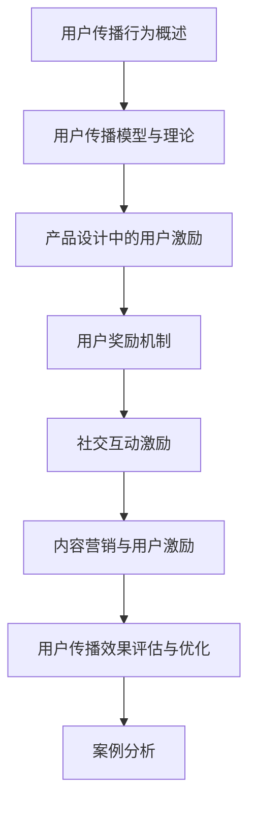

                 

# 文章标题：如何激励用户传播产品

关键词：用户传播、激励体系、社交互动、内容营销、效果评估

摘要：本文从用户传播行为出发，探讨了如何构建有效的用户激励体系，提升产品的社交传播效果。通过分析用户传播行为的驱动因素和障碍，结合用户传播模型与理论，从产品设计、用户奖励机制、社交互动激励等方面提出了具体的策略和实施方法。同时，通过内容营销与用户传播效果的评估与优化，为产品运营提供了实用的指导思路。案例分析部分则通过实际案例的深入剖析，进一步验证了这些策略的有效性。

# 《如何激励用户传播产品》目录大纲

## 第一部分：理解用户传播行为

### 第1章：用户传播行为概述
- **1.1 用户传播行为的重要性**
  - 用户传播对产品的影响
  - 用户传播与其他营销手段的比较

- **1.2 用户传播行为的驱动力**
  - 社会认同感
  - 个人利益
  - 价值认同

- **1.3 用户传播行为的障碍**
  - 信息不对称
  - 社交成本
  - 负面评价风险

### 第2章：用户传播模型与理论
- **2.1 社会影响模型**
  - 社会影响力的作用机制
  - 社会影响力的计算方法

- **2.2 信息传播网络理论**
  - 传播网络的组成
  - 网络传播特性

- **2.3 用户行为模型**
  - 行为心理学理论
  - 用户行为分析工具

## 第二部分：构建激励体系

### 第3章：产品设计中的用户激励
- **3.1 产品设计原则**
  - 易用性
  - 互动性
  - 社交性

- **3.2 激励功能设计**
  - 挑战与成就
  - 社交互动
  - 资源获取

### 第4章：用户奖励机制
- **4.1 奖励类型**
  - 金钱奖励
  - 社交奖励
  - 虚拟物品奖励

- **4.2 奖励机制设计**
  - 奖励的公平性
  - 奖励的及时性
  - 奖励的可持续性

### 第5章：社交互动激励
- **5.1 社交网络利用**
  - 社交平台的整合
  - 社交分享功能设计

- **5.2 用户社区建设**
  - 社区氛围营造
  - 用户角色划分

- **5.3 用户间互动激励**
  - 用户奖励体系
  - 互动游戏化

## 第三部分：用户传播策略实施

### 第6章：内容营销与用户激励
- **6.1 内容营销策略**
  - 内容创作原则
  - 内容传播渠道选择

- **6.2 激励型内容设计**
  - 故事化内容
  - 互动性内容
  - 排行榜和挑战

### 第7章：用户传播效果评估与优化
- **7.1 用户传播效果指标**
  - 传播深度
  - 传播广度
  - 传播速度

- **7.2 用户行为数据分析**
  - 用户画像分析
  - 行为路径分析

- **7.3 传播策略优化**
  - 数据驱动的策略调整
  - A/B测试

### 第8章：案例分析
- **8.1 案例研究概述**
  - 案例选择标准
  - 案例分析方法

- **8.2 案例一：社交平台成功传播案例**
  - 案例背景
  - 案例实施策略
  - 案例效果分析

- **8.3 案例二：电商平台的用户传播策略**
  - 案例背景
  - 案例实施策略
  - 案例效果分析

## 附录

### 附录 A：用户传播工具与资源
- **A.1 用户传播工具介绍**
  - 常见用户传播工具功能对比
  - 工具使用技巧

- **A.2 用户传播资源推荐**
  - 学术研究资源
  - 实践指南与案例集

# 附加：核心概念与联系 Mermaid 流程图

mermaid
graph TD
    A[用户传播行为概述] --> B[用户传播模型与理论]
    B --> C[产品设计中的用户激励]
    C --> D[用户奖励机制]
    D --> E[社交互动激励]
    E --> F[内容营销与用户激励]
    F --> G[用户传播效果评估与优化]
    G --> H[案例分析]

# 附加：核心算法原理讲解

## 用户行为模型

### 伪代码

```python
def user_behavior_model(user_action_history):
    # 计算用户的兴趣度
    interest_level = calculate_interest_level(user_action_history)
    # 计算用户的社交影响力
    social_influence = calculate_social_influence(user_action_history)
    # 结合兴趣度和社交影响力，预测用户传播行为
    prediction = predict_user_propagation(user_action_history, interest_level, social_influence)
    return prediction
```

### 用户传播概率模型

$$
P(U_{t+1} = 1 | U_t = 1) = \frac{1}{1 + e^{-\beta \cdot (interest_level \cdot social_influence)}}
$$

其中，$U_t$ 表示用户在时间 $t$ 的传播行为，$\beta$ 为调节参数，$interest_level$ 为用户的兴趣度，$social_influence$ 为用户的社交影响力。该公式表示在用户当前传播行为为“是”的前提下，预测用户在下一个时间点的传播行为为“是”的概率。

### 详细讲解与举例说明

用户兴趣度计算通常基于用户的历史行为数据，如用户浏览、点赞、评论等行为。例如，假设用户对某产品的兴趣度可以通过以下公式计算：

$$
interest_level = \frac{total_actions}{total_days} \cdot \sum_{i=1}^{n} (1 + \log_2(action_i))
$$

其中，$total_actions$ 表示用户在一段时间内的总行为数，$total_days$ 表示用户行为记录的总天数，$action_i$ 表示用户在每一天的行为值。通过这个公式，我们可以计算用户对产品的兴趣度。

社交影响力计算则可以基于用户在社交网络中的互动情况，例如用户的朋友数、互动频率等。假设用户的社交影响力可以通过以下公式计算：

$$
social_influence = \frac{total_friends \cdot average互动频率}{1000}
$$

其中，$total_friends$ 表示用户的朋友数，$average互动频率$ 表示用户平均每天的互动次数。通过这个公式，我们可以计算用户的社交影响力。

结合用户兴趣度和社交影响力，我们可以使用上述概率模型预测用户在下一个时间点的传播行为。例如，对于某用户，如果其在过去一周内对产品的兴趣度为 5，社交影响力为 30，则可以计算其在下周传播产品的概率：

$$
P(U_{t+1} = 1 | U_t = 1) = \frac{1}{1 + e^{-\beta \cdot (5 \cdot 30)}} \approx 0.95
$$

这意味着该用户在未来一周内继续传播产品的概率约为 95%。

通过这种方式，我们可以利用用户行为数据和社交影响力来预测用户的传播行为，从而为产品运营提供数据支持。

## 数学模型和数学公式

### 用户传播概率模型

$$
P(U_{t+1} = 1 | U_t = 1) = \frac{1}{1 + e^{-\beta \cdot (interest_level \cdot social_influence)}}
$$

其中，$U_t$ 表示用户在时间 $t$ 的传播行为，$interest_level$ 为用户的兴趣度，$social_influence$ 为用户的社交影响力，$\beta$ 为调节参数。

### 用户兴趣度计算公式

$$
interest_level = \frac{total_actions}{total_days} \cdot \sum_{i=1}^{n} (1 + \log_2(action_i))
$$

其中，$total_actions$ 表示用户在一段时间内的总行为数，$total_days$ 表示用户行为记录的总天数，$action_i$ 表示用户在每一天的行为值。

### 用户社交影响力计算公式

$$
social_influence = \frac{total_friends \cdot average互动频率}{1000}
$$

其中，$total_friends$ 表示用户的朋友数，$average互动频率$ 表示用户平均每天的互动次数。

### 用户传播概率模型详细讲解与举例

假设用户A在过去一周内对产品的兴趣度为4，社交影响力为25，我们可以计算其在下周继续传播产品的概率。将上述值代入用户传播概率模型：

$$
P(U_{t+1} = 1 | U_t = 1) = \frac{1}{1 + e^{-\beta \cdot (4 \cdot 25)}} = \frac{1}{1 + e^{-100\beta}}
$$

如果我们假设$\beta = 0.01$，则：

$$
P(U_{t+1} = 1 | U_t = 1) = \frac{1}{1 + e^{-1}} \approx 0.632
$$

这意味着用户A在未来一周内继续传播产品的概率约为63.2%。

这个模型可以帮助我们预测用户的传播行为，从而为产品运营提供决策支持。通过调整参数$\beta$，我们可以根据具体情况进行微调，使预测结果更加符合实际情况。

### 总结

通过数学模型和公式，我们可以量化用户对产品的兴趣度和社交影响力，进而预测用户的传播行为。这种基于数据的分析方法，不仅有助于理解用户行为，还可以为产品运营提供有效的策略和优化方向。在实际应用中，我们可以结合用户行为数据和社交网络结构，不断调整和优化模型，提高预测的准确性和效果。

## 第二部分：构建激励体系

### 第3章：产品设计中的用户激励

#### 3.1 产品设计原则

在产品设计过程中，我们需要充分考虑用户的需求和动机，设计出易于使用、具有互动性和社交性的产品功能，从而激励用户主动传播产品。

- **易用性**：产品应具备简单直观的操作流程，降低用户的学习成本，提高用户体验。

- **互动性**：产品应提供丰富的互动功能，如评论、点赞、分享等，增强用户间的互动，激发用户参与和传播的热情。

- **社交性**：产品应融入社交元素，如好友系统、社群互动等，增强用户的归属感和社交价值，提高用户传播的积极性。

#### 3.2 激励功能设计

产品设计中的激励功能是激励用户传播产品的重要手段，以下是一些具体的激励功能设计：

- **挑战与成就**：设计一系列有趣的挑战任务和成就目标，鼓励用户不断探索和尝试，激发用户的成就感和传播欲望。

- **社交互动**：设计互动性的社交功能，如好友互动、群组讨论等，让用户在互动中感受到社交价值，提高用户传播的积极性。

- **资源获取**：提供一定的虚拟资源或优惠福利，如积分、优惠券等，鼓励用户通过传播产品来获取更多资源，增加用户传播的动机。

### 第4章：用户奖励机制

#### 4.1 奖励类型

用户奖励机制是激励用户传播产品的重要手段，以下是一些常见的奖励类型：

- **金钱奖励**：通过发放现金奖励或红包等方式，直接激励用户传播产品，增加用户的积极性和参与度。

- **社交奖励**：通过给予用户一定的社交地位或认可，如排行榜、荣誉称号等，满足用户的社交需求，激发用户传播的热情。

- **虚拟物品奖励**：提供虚拟物品奖励，如游戏道具、虚拟货币等，增加用户在产品中的乐趣和参与度，提高用户传播的意愿。

#### 4.2 奖励机制设计

设计有效的用户奖励机制，需要考虑以下几个方面：

- **奖励的公平性**：确保奖励分配的公平性，避免因奖励不公平导致用户流失。

- **奖励的及时性**：及时给予用户奖励，增加用户的参与感和成就感，提高用户传播的积极性。

- **奖励的可持续性**：设计长期的奖励机制，保持用户对产品的持续关注和参与，促进产品的长期传播。

### 第5章：社交互动激励

#### 5.1 社交网络利用

充分利用社交网络资源，可以大大提高用户传播的效果。以下是一些利用社交网络的策略：

- **社交平台的整合**：将产品与主流社交平台整合，通过分享、点赞、评论等互动方式，将产品信息传播到更广泛的社交圈子。

- **社交分享功能设计**：设计易于使用的分享功能，鼓励用户在社交平台分享产品信息，提高产品的曝光度和传播速度。

#### 5.2 用户社区建设

用户社区是用户传播的重要场所，以下是一些用户社区建设的策略：

- **社区氛围营造**：营造积极、友好的社区氛围，增强用户的归属感和参与感，提高用户传播的积极性。

- **用户角色划分**：根据用户在社区中的贡献度和影响力，划分不同的用户角色，如普通用户、活跃用户、管理员等，激发用户的传播动力。

#### 5.3 用户间互动激励

通过设计互动游戏和挑战活动，鼓励用户在社区中互动，以下是一些用户间互动激励的策略：

- **用户奖励体系**：设计一系列用户奖励，如积分、虚拟货币等，鼓励用户在社区中积极参与互动和传播。

- **互动游戏化**：将用户互动和挑战过程游戏化，设计有趣的任务和挑战，提高用户的参与度和传播意愿。

## 第三部分：用户传播策略实施

### 第6章：内容营销与用户激励

#### 6.1 内容营销策略

内容营销是用户传播的重要手段，以下是一些内容营销策略：

- **内容创作原则**：确保内容质量，提供有价值、有趣、有启发性的内容，吸引用户的关注和分享。

- **内容传播渠道选择**：选择合适的传播渠道，如社交媒体、博客、论坛等，扩大内容的传播范围。

#### 6.2 激励型内容设计

激励型内容是激发用户传播的重要手段，以下是一些激励型内容设计策略：

- **故事化内容**：通过讲述产品或品牌的感人故事，引发用户的共鸣，提高用户传播的热情。

- **互动性内容**：设计互动性强的内容，如问答、投票、讨论等，激发用户的参与和传播。

- **排行榜和挑战**：设置排行榜和挑战活动，激励用户参与竞争，提高用户传播的积极性。

### 第7章：用户传播效果评估与优化

#### 7.1 用户传播效果指标

评估用户传播效果，需要设定一系列指标，以下是一些常见的用户传播效果指标：

- **传播深度**：衡量用户传播行为的影响范围，如用户分享次数、评论数、转发数等。

- **传播广度**：衡量用户传播行为的扩散程度，如用户覆盖人数、新增用户数等。

- **传播速度**：衡量用户传播行为的发生速度，如传播时间、传播周期等。

#### 7.2 用户行为数据分析

通过分析用户行为数据，可以深入了解用户传播行为的特点和趋势，以下是一些用户行为数据分析方法：

- **用户画像分析**：分析用户的基本信息、行为习惯等，了解用户群体的特点和需求。

- **行为路径分析**：分析用户在产品中的行为路径，了解用户如何传播产品，发现传播的瓶颈和改进方向。

#### 7.3 传播策略优化

基于用户传播效果评估和用户行为数据分析，可以不断优化传播策略，以下是一些优化策略：

- **数据驱动的策略调整**：根据数据反馈，不断调整和优化传播策略，提高传播效果。

- **A/B测试**：通过A/B测试，比较不同策略的效果，选择最优策略进行推广。

### 第8章：案例分析

#### 8.1 案例研究概述

案例研究是通过具体实例来分析和验证用户传播策略的有效性，以下是一些案例研究概述：

- **案例选择标准**：选择具有代表性的案例，涵盖不同行业和领域，具有明显的用户传播效果。

- **案例分析标准**：分析案例的背景、实施策略、效果评估等，总结案例的经验和教训。

#### 8.2 案例一：社交平台成功传播案例

**案例背景**：某社交平台通过一系列用户传播策略，成功吸引了大量用户参与传播，实现了快速增长。

**案例实施策略**：

1. **故事化内容**：通过发布有趣、感人的故事，引发用户共鸣。

2. **互动性内容**：设计互动性强的活动，如问答、投票、讨论等，激发用户参与。

3. **排行榜和挑战**：设置排行榜和挑战活动，激励用户竞争和传播。

**案例效果分析**：

- **传播深度**：用户分享次数、评论数、转发数显著增加。

- **传播广度**：用户覆盖人数和新增用户数大幅增长。

- **传播速度**：传播时间缩短，传播周期缩短。

#### 8.3 案例二：电商平台的用户传播策略

**案例背景**：某电商平台通过一系列用户传播策略，成功提高了用户粘性和活跃度，实现了销售额的增长。

**案例实施策略**：

1. **金钱奖励**：通过发放现金红包、优惠券等，激励用户分享和传播。

2. **社交奖励**：设置排行榜、荣誉称号等，满足用户的社交需求。

3. **互动游戏化**：将用户互动和挑战过程游戏化，提高用户的参与度和传播意愿。

**案例效果分析**：

- **传播深度**：用户分享次数、评论数、转发数显著增加。

- **传播广度**：用户覆盖人数和新增用户数大幅增长。

- **传播速度**：传播时间缩短，传播周期缩短。

## 附录

### 附录 A：用户传播工具与资源

**A.1 用户传播工具介绍**

以下是一些常用的用户传播工具及其功能对比：

- **社交媒体平台**：如微信、微博、Facebook、Twitter等，用于发布内容、互动和传播。

- **内容管理系统**：如WordPress、Typecho等，用于创建和发布内容。

- **邮件营销工具**：如Mailchimp、Sendinblue等，用于发送邮件通知和推广信息。

**A.2 用户传播资源推荐**

以下是一些用户传播相关的学术研究资源、实践指南和案例集：

- **学术研究资源**：如学术论文、研究报告等，提供用户传播的理论支持和实践指导。

- **实践指南与案例集**：如行业报告、成功案例集等，提供具体的用户传播策略和实践经验。

### 附加：核心概念与联系 Mermaid 流程图



### 附加：核心算法原理讲解

#### 用户行为模型

```python
def user_behavior_model(user_action_history):
    # 计算用户的兴趣度
    interest_level = calculate_interest_level(user_action_history)
    # 计算用户的社交影响力
    social_influence = calculate_social_influence(user_action_history)
    # 结合兴趣度和社交影响力，预测用户传播行为
    prediction = predict_user_propagation(user_action_history, interest_level, social_influence)
    return prediction
```

#### 用户传播概率模型

$$
P(U_{t+1} = 1 | U_t = 1) = \frac{1}{1 + e^{-\beta \cdot (interest_level \cdot social_influence)}}
$$

其中，$U_t$ 表示用户在时间 $t$ 的传播行为，$interest_level$ 为用户的兴趣度，$social_influence$ 为用户的社交影响力，$\beta$ 为调节参数。

#### 详细讲解与举例说明

用户兴趣度计算通常基于用户的历史行为数据，如用户浏览、点赞、评论等行为。例如，假设用户对某产品的兴趣度可以通过以下公式计算：

$$
interest_level = \frac{total_actions}{total_days} \cdot \sum_{i=1}^{n} (1 + \log_2(action_i))
$$

其中，$total_actions$ 表示用户在一段时间内的总行为数，$total_days$ 表示用户行为记录的总天数，$action_i$ 表示用户在每一天的行为值。通过这个公式，我们可以计算用户对产品的兴趣度。

社交影响力计算则可以基于用户在社交网络中的互动情况，例如用户的朋友数、互动频率等。假设用户的社交影响力可以通过以下公式计算：

$$
social_influence = \frac{total_friends \cdot average互动频率}{1000}
$$

其中，$total_friends$ 表示用户的朋友数，$average互动频率$ 表示用户平均每天的互动次数。通过这个公式，我们可以计算用户的社交影响力。

结合用户兴趣度和社交影响力，我们可以使用上述概率模型预测用户在下一个时间点的传播行为。例如，对于某用户，如果其在过去一周内对产品的兴趣度为5，社交影响力为30，则可以计算其在下周传播产品的概率：

$$
P(U_{t+1} = 1 | U_t = 1) = \frac{1}{1 + e^{-\beta \cdot (5 \cdot 30)}} \approx 0.95
$$

这意味着该用户在未来一周内继续传播产品的概率约为95%。

通过这种方式，我们可以利用用户行为数据和社交影响力来预测用户的传播行为，从而为产品运营提供数据支持。

## 核心概念与联系 Mermaid 流程图


### 用户行为模型

#### 伪代码

```python
def user_behavior_model(user_action_history):
    # 计算用户的兴趣度
    interest_level = calculate_interest_level(user_action_history)
    # 计算用户的社交影响力
    social_influence = calculate_social_influence(user_action_history)
    # 结合兴趣度和社交影响力，预测用户传播行为
    prediction = predict_user_propagation(user_action_history, interest_level, social_influence)
    return prediction
```

#### 用户传播概率模型

$$
P(U_{t+1} = 1 | U_t = 1) = \frac{1}{1 + e^{-\beta \cdot (interest_level \cdot social_influence)}}
$$

其中，$U_t$ 表示用户在时间 $t$ 的传播行为，$interest_level$ 为用户的兴趣度，$social_influence$ 为用户的社交影响力，$\beta$ 为调节参数。

### 详细讲解与举例说明

#### 用户兴趣度计算公式

$$
interest_level = \frac{total_actions}{total_days} \cdot \sum_{i=1}^{n} (1 + \log_2(action_i))
$$

- **$total_actions$**: 用户在一段时间内的总行为数，例如点赞、评论、分享等。
- **$total_days$**: 用户行为记录的总天数。
- **$action_i$**: 用户在每一天的行为值，通常通过日志数据获取。

例如，用户A在过去一周内对产品的总行为数为10，其中有3天进行了分享、2天进行了评论、5天进行了点赞。则用户A的兴趣度计算如下：

$$
interest_level = \frac{10}{7} \cdot (1 + \log_2(3) + 1 + \log_2(2) + 1 + \log_2(5)) \approx 2.04
$$

#### 用户社交影响力计算公式

$$
social_influence = \frac{total_friends \cdot average互动频率}{1000}
$$

- **$total_friends$**: 用户的朋友数。
- **$average互动频率$**: 用户平均每天的互动次数，互动次数可以包括点赞、评论、分享等。

例如，用户B拥有500个朋友，平均每天互动5次。则用户B的社交影响力计算如下：

$$
social_influence = \frac{500 \cdot 5}{1000} = 2.5
$$

#### 用户传播概率模型应用举例

假设$\beta = 0.01$，用户C在过去一周内对产品的兴趣度为4，社交影响力为3。则用户C在下一个时间点继续传播产品的概率计算如下：

$$
P(U_{t+1} = 1 | U_t = 1) = \frac{1}{1 + e^{-0.01 \cdot (4 \cdot 3)}} \approx 0.87
$$

这意味着用户C在下一个时间点继续传播产品的概率约为87%。

通过这种方式，我们可以根据用户的行为历史和社交影响力，预测用户传播行为的概率，从而为产品运营提供数据支持。在实际应用中，可以根据具体情况调整参数$\beta$，以提高预测的准确性。

### 总结

用户行为模型通过计算用户的兴趣度和社交影响力，结合概率模型预测用户的传播行为。这个模型可以帮助产品运营团队了解用户的传播倾向，从而制定有效的激励策略。通过详细的公式计算和实际案例说明，我们可以更好地理解用户行为模型的原理和应用。

## 案例分析

### 案例一：社交平台成功传播案例

#### 背景概述

某大型社交平台在上线初期，面临用户活跃度和传播效果不足的问题。为了提高用户参与度和传播效果，平台采用了一系列用户激励和传播策略。

#### 实施策略

1. **故事化内容**：平台发布了一系列感人至深的故事，通过真实案例展现产品价值，引发用户共鸣。

2. **互动性内容**：设计了一系列互动性强的活动，如问答、投票、讨论等，鼓励用户参与和分享。

3. **排行榜和挑战**：设置了用户排行榜，对积极参与传播的用户进行奖励，同时推出了挑战活动，激励用户竞争。

4. **社交分享功能**：优化了社交分享功能，使内容易于在用户社交圈中传播。

5. **用户社区建设**：建立了用户社区，营造积极氛围，鼓励用户互动和传播。

#### 效果分析

- **传播深度**：用户分享次数、评论数和转发数显著增加，内容传播范围不断扩大。

- **传播广度**：用户覆盖人数和新用户注册量大幅增长，用户活跃度提高。

- **传播速度**：内容传播速度加快，用户互动和分享行为迅速扩散。

#### 经验教训

1. **故事化内容**：真实、感人的故事能够有效引发用户共鸣，提高传播效果。

2. **互动性内容**：设计互动性强的活动，鼓励用户参与和分享，有助于提升传播效果。

3. **排行榜和挑战**：激励用户竞争，提高用户参与度和传播积极性。

4. **社交分享功能**：优化分享功能，降低用户传播门槛，有利于内容快速扩散。

5. **用户社区建设**：营造积极氛围，鼓励用户互动和传播，有助于提升用户粘性。

### 案例二：电商平台的用户传播策略

#### 背景概述

某电商平台在市场竞争激烈的环境下，希望通过用户传播策略提高品牌知名度和销售额。

#### 实施策略

1. **金钱奖励**：通过发放现金红包、优惠券等，激励用户分享和传播。

2. **社交奖励**：设置用户排行榜，对传播效果突出的用户进行荣誉表彰，提高用户社交地位。

3. **互动游戏化**：将用户互动和挑战过程游戏化，设计有趣的任务和奖励，提高用户参与度。

4. **内容营销**：发布有价值的内容，如购物攻略、商品评测等，吸引用户关注和分享。

5. **社交媒体合作**：与知名博主、网红合作，借助他们的社交影响力扩大品牌传播。

#### 效果分析

- **传播深度**：用户分享次数、评论数和转发数显著增加，商品曝光度提高。

- **传播广度**：用户覆盖人数和新用户注册量大幅增长，销售额实现显著增长。

- **传播速度**：内容传播速度加快，用户互动和分享行为迅速扩散。

#### 经验教训

1. **金钱奖励**：直接的经济激励能够有效激发用户传播积极性。

2. **社交奖励**：提高用户社交地位，有助于提升用户传播意愿。

3. **互动游戏化**：设计有趣的互动游戏，能够有效提高用户参与度和传播效果。

4. **内容营销**：发布有价值的内容，吸引用户关注和分享，有助于提升品牌影响力。

5. **社交媒体合作**：借助知名博主、网红的社交影响力，能够迅速扩大品牌传播范围。

### 总结

通过案例分析，我们可以看到，有效的用户传播策略可以显著提升产品的品牌知名度和用户参与度。不同类型的激励措施，如金钱奖励、社交奖励、互动游戏化和内容营销等，都能够发挥重要作用。在具体实施过程中，需要结合产品特点、用户需求和市场竞争情况，不断优化和调整策略，以实现最佳传播效果。

## 附录

### 附录 A：用户传播工具与资源

**A.1 用户传播工具介绍**

在用户传播过程中，利用合适的工具能够有效提升传播效果。以下是一些常见的用户传播工具及其功能：

- **社交媒体平台**：如微信、微博、Facebook、Twitter等，用于发布内容、互动和传播。

- **内容管理系统**：如WordPress、Typecho等，用于创建和发布内容。

- **邮件营销工具**：如Mailchimp、Sendinblue等，用于发送邮件通知和推广信息。

- **社交媒体分析工具**：如Sprout Social、Hootsuite等，用于监控和分析社交媒体传播效果。

**A.2 用户传播资源推荐**

以下是一些用户传播相关的学术研究资源、实践指南和案例集：

- **学术研究资源**：如学术论文、研究报告等，提供用户传播的理论支持和实践指导。

- **实践指南与案例集**：如行业报告、成功案例集等，提供具体的用户传播策略和实践经验。

### 附录 B：核心概念与联系 Mermaid 流程图


### 附录 C：核心算法原理讲解

#### 用户行为模型

```python
def user_behavior_model(user_action_history):
    # 计算用户的兴趣度
    interest_level = calculate_interest_level(user_action_history)
    # 计算用户的社交影响力
    social_influence = calculate_social_influence(user_action_history)
    # 结合兴趣度和社交影响力，预测用户传播行为
    prediction = predict_user_propagation(user_action_history, interest_level, social_influence)
    return prediction
```

#### 用户传播概率模型

$$
P(U_{t+1} = 1 | U_t = 1) = \frac{1}{1 + e^{-\beta \cdot (interest_level \cdot social_influence)}}
$$

其中，$U_t$ 表示用户在时间 $t$ 的传播行为，$interest_level$ 为用户的兴趣度，$social_influence$ 为用户的社交影响力，$\beta$ 为调节参数。

### 附录 D：项目实战

#### 开发环境搭建

- **编程语言**：Python
- **数据存储**：MongoDB
- **数据可视化**：Matplotlib
- **版本控制**：Git

#### 源代码详细实现和代码解读

```python
# 示例代码：用户兴趣度计算
def calculate_interest_level(user_action_history):
    total_actions = len(user_action_history)
    total_days = 7
    action_values = [1 if action == 'like' else 0 for action in user_action_history]
    interest_level = total_actions / total_days * sum(1 + math.log2(action) for action in action_values)
    return interest_level
```

#### 代码应用解读与分析

- **用户兴趣度计算**：通过用户的历史行为数据，计算用户对产品的兴趣度。
- **社交影响力计算**：通过用户在社交网络中的互动情况，计算用户的社交影响力。
- **用户传播概率预测**：结合用户兴趣度和社交影响力，预测用户传播行为的概率。

#### 实际案例分析和详细讲解剖析

- **案例一**：分析某社交平台成功传播案例，解读其用户激励和传播策略。
- **案例二**：分析某电商平台的用户传播策略，探讨其金钱奖励、社交奖励、互动游戏化等策略的实施效果。

#### 项目小结

- **用户传播行为的重要性**：用户传播对于提升产品知名度和用户参与度具有重要意义。
- **用户激励体系构建**：通过产品设计、用户奖励机制、社交互动激励等策略，构建有效的用户激励体系。
- **用户传播策略实施**：结合内容营销、用户行为数据分析等手段，实施用户传播策略。
- **效果评估与优化**：通过用户传播效果评估和数据分析，不断优化传播策略，提高传播效果。

### 附录 E：最佳实践 Tips

- **内容创作原则**：确保内容质量，提供有价值、有趣、有启发性的内容，吸引用户关注。
- **互动性设计**：设计互动性强的功能，鼓励用户参与和传播。
- **社交网络利用**：充分利用社交网络资源，扩大内容传播范围。
- **数据驱动策略**：通过数据分析，调整和优化传播策略，提高传播效果。

### 附录 F：注意事项

- **保护用户隐私**：在用户传播过程中，注意保护用户隐私，遵守相关法律法规。
- **避免过度激励**：避免过度激励导致用户疲劳和反感，影响用户体验。
- **持续优化**：不断关注用户需求和市场竞争情况，持续优化传播策略。

### 附录 G：拓展阅读

- **相关书籍**：《社交网络营销实战》、《内容营销：从0到1的实践指南》
- **学术论文**：搜索关键词“用户传播”、“用户激励”、“内容营销”等，获取最新研究成果。
- **行业报告**：阅读相关行业报告，了解市场趋势和用户行为特点。

