                 

### 文章标题

### 如何设计基于心理学的产品定价策略

关键词：心理学原理、消费者行为、产品定价策略、心理效应、情感营销、品牌形象、定价模型

摘要：本文探讨了如何利用心理学原理设计有效的产品定价策略。通过对消费者决策过程、心理效应以及产品定价策略的深入分析，文章提出了基于心理学原理的价格感知与价值感知策略、情感定价策略以及品牌形象与定价策略。此外，文章还结合实际案例，对定价策略的实施与评估方法进行了详细阐述，旨在为企业和个人提供实用的产品定价指导。

---

## 如何设计基于心理学的产品定价策略

在产品定价过程中，心理学原理的应用至关重要。科学合理的定价策略不仅能够满足消费者的心理需求，还能提高产品的市场竞争力。本文将从以下几个方面逐步分析，帮助读者设计基于心理学的产品定价策略。

### 第一部分：心理学与定价策略的基础

在探讨如何设计基于心理学的产品定价策略之前，我们需要了解一些心理学的基本概念与原理。以下章节将详细介绍心理学对消费行为的影响、消费者决策过程、以及消费者心理效应。

### 第二部分：基于心理学的产品定价策略设计

在这一部分，我们将深入探讨如何利用心理学原理设计有效的产品定价策略。我们将从价格感知与价值感知、定价策略与消费者行为、情感定价策略、品牌形象与定价策略等多个方面进行分析。

### 第三部分：定价策略的实施与评估

有效的定价策略需要通过实施与评估来不断完善。本部分将介绍定价策略的实施流程、评估指标以及优化方法，帮助企业和个人实现最佳的定价效果。

### 第四部分：心理学与定价策略的工具与方法

为了更好地实施和优化定价策略，我们需要掌握一些心理学与定价策略的工具与方法。本部分将介绍常用的心理学工具、定价策略分析方法和案例研究，为读者提供实用的参考。

通过上述四个部分的详细分析，我们相信读者将能够设计出更加科学合理的基于心理学的产品定价策略。让我们一步一步地深入探讨这些策略的设计与实施吧！

---

### 第一部分：心理学与定价策略的基础

在产品定价策略的设计过程中，理解心理学原理对消费者行为的影响至关重要。本部分将首先介绍心理学的基本概念与理论，然后深入分析消费者决策过程中的心理因素，以及消费者行为中的各种心理效应。这些基础知识的掌握，将为我们后续设计基于心理学的产品定价策略提供坚实的理论支持。

#### 第1章：心理学原理与消费者行为

心理学作为研究人类行为和心理过程的科学，对消费行为有着深远的影响。以下是心理学的基本概念与理论，以及这些理论在消费行为中的具体应用。

##### 1.1 心理学基础

心理学的基本概念包括感知、学习、记忆、思维、情绪等。这些概念构成了心理学理论的基础，并为理解消费行为提供了重要的视角。

- **感知**：消费者如何感知和识别产品信息，包括视觉、听觉、触觉等感官刺激。
- **学习**：消费者如何通过经验学习和适应不同的消费环境。
- **记忆**：消费者如何记忆和回忆与产品相关的信息，这对购买决策有着重要影响。
- **思维**：消费者如何进行推理、判断和决策，这些思维过程影响着购买行为的各个方面。
- **情绪**：消费者在购买过程中的情绪变化，如愉悦、焦虑、满足等，这些情绪会影响购买决策。

##### 1.2 消费者决策过程

消费者决策过程是指消费者在购买过程中所经历的一系列心理活动。这个决策过程通常包括以下几个阶段：

- **需求识别**：消费者意识到自己有某种需求，这是购买决策的起点。
- **信息搜索**：消费者通过各种渠道收集有关产品的信息，以帮助做出更好的决策。
- **评估备选方案**：消费者比较不同产品的优劣，评估其满足自身需求的程度。
- **购买决策**：消费者基于评估结果做出购买决定。
- **购买后行为**：消费者购买产品后的感受和评价，这会影响其未来对品牌的忠诚度和购买意愿。

##### 1.3 消费者心理效应

消费者行为不仅仅受到理性因素的影响，还受到各种心理效应的影响。以下是一些常见的心理效应，以及它们对消费者行为的具体影响：

- **锚定效应**：消费者在做决策时，会受到最初信息（锚点）的影响，即使这个信息并不重要。
- **价格敏感性**：消费者对价格变化的敏感程度，影响其购买决策。
- **从众心理**：消费者在购买行为中会参考他人的行为和意见，特别是在不确定的情况下。
- **首因效应**：消费者在初次接触产品时，第一印象对其后续评价和购买意愿有重要影响。
- **末因效应**：消费者在购买决策的最后阶段，会受到最后接触的信息的影响。

#### 第2章：产品定价策略的心理模型

了解消费者决策过程中的心理因素之后，我们需要将这些心理学原理应用于产品定价策略的设计中。以下是产品定价策略的心理模型，以及心理学原理在定价策略中的应用。

##### 2.1 产品定价策略概述

产品定价策略是指企业根据市场状况、成本结构、竞争态势等因素，确定产品价格的方法和原则。以下是几种常见的定价策略：

- **成本加成定价**：根据产品的成本加上一定的利润来定价。
- **市场导向定价**：根据市场需求和竞争状况来定价。
- **价值导向定价**：根据消费者对产品价值的认知来定价。

##### 2.2 心理学原理在定价策略中的应用

心理学原理在定价策略中有着广泛的应用，以下是一些具体的方法：

- **心理定价策略**：通过设置特定的价格，如9.99元，来影响消费者的购买决策。
- **情感营销与定价策略**：利用情感因素来提升产品的价值感知，从而影响定价。
- **品牌形象与定价策略**：通过塑造品牌形象，提升消费者对产品价值的认知，进而影响定价。

##### 2.3 消费者心理定价模型

消费者心理定价模型是指基于消费者心理因素来确定产品价格的方法。以下是几种常见的消费者心理定价模型：

- **感知价值模型**：通过评估消费者对产品的感知价值来确定价格。
- **价格锚点模型**：通过设置价格锚点来影响消费者的价格感知。
- **价格区间模型**：通过设置价格区间来满足不同消费者的需求。

通过上述对心理学原理与消费者行为、产品定价策略和心理模型的详细分析，我们可以为后续设计基于心理学的产品定价策略奠定坚实的理论基础。

---

### 第一部分：心理学与定价策略的基础

#### 第1章：心理学原理与消费者行为

##### 1.1 心理学基础

心理学是一门研究人类行为和心理过程的科学，涵盖多个研究领域，如感知、学习、记忆、思维、情绪等。在产品定价策略的设计过程中，了解这些基本概念与理论对于深入分析消费者行为至关重要。

**感知**是消费者接收外部信息的过程，包括视觉、听觉、触觉等多种感官刺激。感知不仅影响消费者对产品的第一印象，还影响其对产品价值的判断。例如，一个精美的包装可能会提高消费者对产品品质的感知，从而影响购买决策。

**学习**是指消费者通过经验积累和知识获取来改变行为和态度的过程。消费者的购买行为往往受到以往经验的影响，如品牌忠诚度和对产品的信任感。企业可以通过有效的营销策略，如广告和客户反馈，来增强消费者对产品的学习效果。

**记忆**是消费者在购买后保留产品相关信息的能力。记忆对消费者的购买决策有着重要影响，尤其是长期记忆中的正面评价和负面经验。企业可以通过创造独特的品牌体验和营销活动，提高消费者对产品的记忆度。

**思维**是消费者在处理信息、进行判断和决策时的心理过程。消费者通常会使用各种决策模型，如最大化满意度模型和最小化风险模型，来评估不同产品的优劣。企业可以通过提供详细的比较信息和推荐，帮助消费者更有效地进行思维。

**情绪**是消费者在购买过程中的情感体验，如愉悦、焦虑、满足等。情绪对消费者的购买决策有显著影响，尤其是在冲动购买和情感品牌忠诚度方面。企业可以利用情感营销策略，如温馨的广告和情感化的品牌故事，来激发消费者的积极情绪。

##### 1.2 消费者决策过程

消费者决策过程是指消费者在购买产品或服务时所经历的一系列心理活动。这一过程通常包括以下几个阶段：

1. **需求识别**：消费者意识到自己有某种需求或欲望，这是购买决策的起点。需求可以是具体的，如购买一杯咖啡，也可以是抽象的，如提升生活质量。

2. **信息搜索**：在需求识别后，消费者会通过各种渠道收集有关产品或服务的相关信息。这些渠道包括广告、口碑、朋友推荐等。信息搜索的目的是帮助消费者评估不同产品或服务的优劣。

3. **评估备选方案**：消费者会比较不同产品或服务的特点、价格、质量等因素，以确定哪一种能满足其需求。评估过程中，消费者可能会使用各种决策模型，如最大化满意度模型和最小化风险模型。

4. **购买决策**：在评估完所有备选方案后，消费者会做出购买决策。这一决策可能受到多种因素的影响，如价格、品牌、口碑等。

5. **购买后行为**：消费者在购买产品或服务后，会进行评价和反思。这些评价和反思会影响消费者对未来购买行为的决策。例如，如果消费者对购买的产品满意，他们可能会增加对品牌的忠诚度。

##### 1.3 消费者心理效应

消费者行为不仅仅受到理性因素的影响，还受到各种心理效应的影响。以下是一些常见的心理效应，以及它们对消费者行为的具体影响：

**锚定效应**：消费者在做决策时，会受到最初信息（锚点）的影响，即使这个信息并不重要。例如，如果一家餐厅将一瓶葡萄酒标价为100元，那么消费者可能会认为这瓶葡萄酒的质量很好，即使其实际价格只有50元。

**价格敏感性**：消费者对价格变化的敏感程度会影响其购买决策。价格敏感的消费者可能会对价格变动非常敏感，而价格不敏感的消费者则可能更关注产品的品质和品牌。

**从众心理**：消费者在购买行为中会参考他人的行为和意见，特别是在不确定的情况下。例如，如果消费者看到很多朋友都购买了一款新产品，他们可能会更有信心购买这款产品。

**首因效应**：消费者在初次接触产品时，第一印象对其后续评价和购买意愿有重要影响。因此，企业需要重视产品的首因效应，如通过精美的包装和优质的客户服务来创造良好的第一印象。

**末因效应**：消费者在购买决策的最后阶段，会受到最后接触的信息的影响。例如，如果消费者在购物网站上看到其他顾客的好评，他们可能会更有可能购买产品。

通过上述对心理学原理与消费者行为、产品定价策略和心理模型的详细分析，我们可以为后续设计基于心理学的产品定价策略奠定坚实的理论基础。这些心理学原理和效应不仅可以帮助我们理解消费者的行为模式，还可以指导我们制定更加有效的定价策略。

---

#### 第2章：产品定价策略的心理模型

在了解了消费者行为中的心理学原理后，我们将进一步探讨如何将这些原理应用于产品定价策略的设计中。产品定价策略不仅需要考虑市场的竞争态势和成本结构，还需要深入挖掘消费者的心理需求。本章将介绍产品定价策略的心理模型，以及心理学原理在具体定价策略中的应用。

##### 2.1 产品定价策略概述

产品定价策略是企业根据市场状况、成本结构和竞争态势，确定产品价格的方法和原则。有效的定价策略不仅能帮助企业实现盈利目标，还能提升消费者对产品的价值感知和满意度。以下是几种常见的定价策略：

**成本加成定价**：这种定价策略的基本原则是，将产品成本加上一定的利润来定价。公式如下：

\[ \text{价格} = \text{成本} \times (1 + \text{加成率}) \]

**市场导向定价**：这种定价策略依据市场需求和竞争状况来确定产品价格。企业会通过市场调研来了解消费者对产品价值的认知，从而制定合适的价格。市场导向定价的主要公式为：

\[ \text{价格} = \text{市场需求} - \text{竞争价格} \]

**价值导向定价**：这种定价策略基于消费者对产品价值的感知来确定价格。企业通过了解消费者对产品品质、性能、品牌等因素的重视程度，来制定合理的价格。价值导向定价的公式为：

\[ \text{价格} = \text{价值感知} \]

##### 2.2 心理学原理在定价策略中的应用

心理学原理在定价策略中有着广泛的应用，可以帮助企业更好地满足消费者的心理需求，从而提升产品的市场竞争力。以下是几种常见的心理定价策略：

**心理定价策略**：这种策略通过设置特定的价格来影响消费者的购买决策。常见的心理定价方法包括：

- **尾数定价**：将价格设置为非整数，如9.99元，以给消费者一种价格更低的感觉。
- **整数定价**：将价格设置为整数，如100元，以提升产品的高端形象。

**情感营销与定价策略**：这种策略利用情感因素来提升产品的价值感知，从而影响定价。具体方法包括：

- **情感故事定价**：通过讲述产品的情感故事，如品牌创始人如何克服困难，来提升消费者的情感共鸣，从而提高产品的价值感知。
- **情感体验定价**：通过提供独特的情感体验，如音乐、艺术氛围等，来提升消费者的情感满意度，从而影响定价。

**品牌形象与定价策略**：这种策略通过塑造品牌形象，提升消费者对产品价值的认知，进而影响定价。具体方法包括：

- **品牌溢价定价**：通过塑造高端品牌形象，提升消费者对产品价值的认知，从而提高价格。
- **品牌价值传递定价**：通过明确品牌价值主张，将品牌价值传递给消费者，从而影响定价。

##### 2.3 消费者心理定价模型

消费者心理定价模型是基于消费者心理因素来确定产品价格的方法。以下是几种常见的消费者心理定价模型：

**感知价值模型**：这种模型通过评估消费者对产品的感知价值来确定价格。感知价值是指消费者对产品所赋予的内在价值的感知。公式为：

\[ \text{感知价值} = \text{期望效用} - \text{支付价格} \]

**价格锚点模型**：这种模型通过设置价格锚点来影响消费者的价格感知。价格锚点是消费者在评估产品价值时参照的价格点。公式为：

\[ \text{价格感知} = \text{产品实际价值} + \text{价格锚点影响} \]

**价格区间模型**：这种模型通过设置价格区间来满足不同消费者的需求。价格区间可以覆盖不同消费能力的消费者，从而提高产品的市场覆盖面。公式为：

\[ \text{价格区间} = \text{最低价格} + \text{价格波动范围} \]

通过上述对产品定价策略的心理模型和心理学原理在定价策略中的应用的详细分析，我们可以更好地理解如何利用心理学原理设计有效的产品定价策略。这些策略不仅能够满足消费者的心理需求，还能提升企业的市场竞争力和盈利能力。

---

### 第二部分：基于心理学的产品定价策略设计

#### 第3章：价格感知与价值感知

价格感知与价值感知是消费者在购买决策过程中至关重要的心理因素。有效的价格感知与价值感知策略能够显著影响消费者的购买行为和品牌忠诚度。本章将详细探讨价格感知与价值感知策略，以及如何通过消费者心理测试与分析来优化这些策略。

##### 3.1 价格感知策略

价格感知策略是指企业通过特定定价方法来影响消费者对产品价格的感知。以下是一些常用的价格感知策略：

**价格锚点策略**：价格锚点策略是一种利用消费者心理中的锚定效应来设定产品价格的策略。通过设置一个较高的价格锚点，消费者对较低的产品价格会产生更强烈的正面感知。例如，如果一款产品的价格标为199元，消费者可能会认为这是一款性价比高的产品，而不会注意到199元实际上是一个较高的价格。

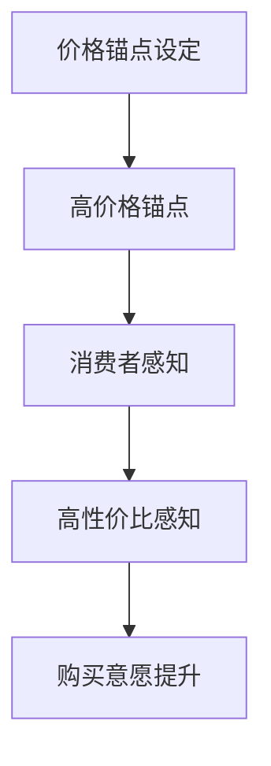

**价格分段策略**：价格分段策略是将产品价格划分为多个区间，以适应不同消费者的支付能力。例如，对于一款手机，可以设置以下价格区间：499元、799元、1199元。这种策略有助于吸引不同层次的消费者，提高市场覆盖率。

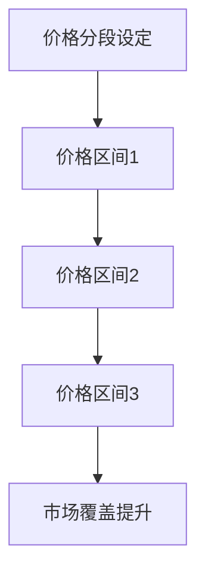

**价格带策略**：价格带策略是将产品价格设定在一个特定的区间内，以增强消费者对产品价值的感知。例如，一个高端品牌的服装可以设定在1000元到2000元的价格带内，这样可以提升消费者对该品牌高端价值的感知。

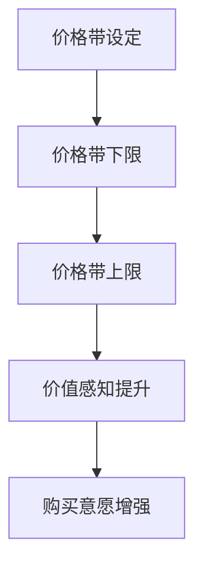

##### 3.2 价值感知策略

价值感知策略是指企业通过塑造产品价值，提升消费者对产品价值的感知，从而影响购买决策。以下是一些常用的价值感知策略：

**价值塑造与传递**：企业可以通过以下几个方面来塑造和传递产品价值：

- **产品功能与特性**：通过强调产品的功能、特性和技术创新，提升消费者对产品价值的感知。
- **品牌故事与形象**：通过讲述品牌故事和塑造品牌形象，增强消费者对品牌价值的认同。
- **售后服务与用户体验**：通过优质的售后服务和卓越的用户体验，提升消费者对产品价值的感知。

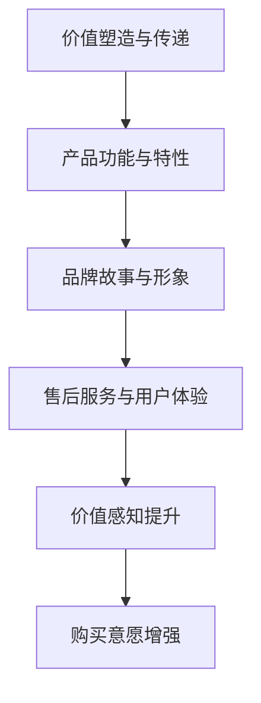

**价值与价格匹配**：企业需要确保产品价值与价格之间的匹配，以避免消费者产生负面感知。如果产品定价过高，消费者可能会认为产品价值不足；反之，如果产品定价过低，消费者可能会怀疑产品品质。因此，企业需要通过市场调研和消费者心理测试来确定合适的价格区间。

##### 3.3 消费者心理测试与分析

为了优化价格感知与价值感知策略，企业需要进行消费者心理测试与分析。以下是一些常用的测试与分析方法：

**定价心理测试**：通过问卷调查、焦点小组讨论、实验法等方法，了解消费者对产品价格的感知和反应。例如，企业可以设置不同的价格点，调查消费者对不同价格点的反应，以确定最佳价格点。

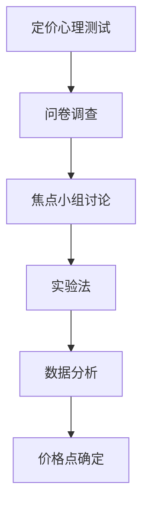

**消费者心理分析工具**：企业可以使用各种心理分析工具，如心理测量工具、行为分析工具等，来深入了解消费者的心理需求和行为模式。这些工具可以帮助企业制定更加科学的定价策略。

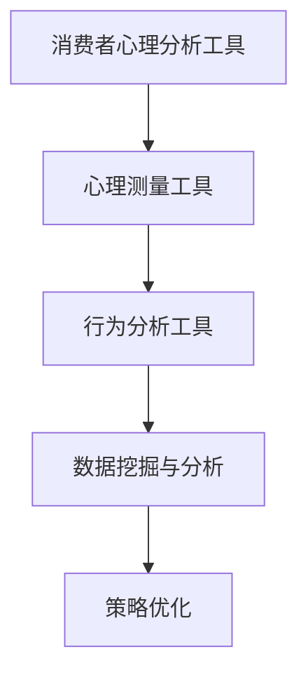

通过以上对价格感知与价值感知策略的详细探讨，我们可以看到，有效的价格感知与价值感知策略能够显著提升消费者的购买意愿和品牌忠诚度。企业需要根据消费者的心理需求，灵活运用各种策略，以实现最佳的市场效果。

---

#### 第4章：定价策略与消费者行为

定价策略对消费者行为有着深远的影响，合理的设计能够显著提升消费者的购买意愿和品牌忠诚度。本章将探讨价格策略对消费者行为的影响，以及如何通过消费者行为数据分析和定价策略的动态调整来优化定价效果。

##### 4.1 价格策略对消费者行为的影响

价格策略对消费者行为的影响主要体现在以下几个方面：

**价格与购买意愿**：价格是影响消费者购买意愿的重要因素。一般来说，消费者对价格的敏感程度取决于其收入水平、产品类别和购买频率。低价格通常能够提升消费者的购买意愿，尤其是对于日常消费品。而高价格则可能对消费者的购买意愿产生抑制作用，除非产品具有显著的高品质或独特价值。

**价格与品牌忠诚度**：品牌忠诚度是指消费者在多次购买过程中，对某一品牌持续选择的倾向。合理的定价策略可以增强品牌忠诚度。例如，通过提供稳定的定价和优惠活动，企业可以建立消费者的信任和依赖，从而提高品牌忠诚度。另一方面，频繁的价格波动或过高的价格可能会降低消费者的满意度和忠诚度。

**价格与购买决策**：价格策略会影响消费者的购买决策过程。在某些情况下，消费者可能会基于价格进行即时决策，特别是在价格促销或打折活动期间。在其他情况下，消费者可能会考虑产品的整体价值，包括价格、品质、品牌声誉等，从而做出更长期的购买决策。

##### 4.2 消费者行为数据分析

为了优化定价策略，企业需要对消费者行为进行深入的数据分析。以下是一些常用的消费者行为数据分析方法：

**消费行为调查问卷**：通过设计针对性的调查问卷，收集消费者对产品价格的感知、购买意愿和购买频率等信息。问卷调查可以帮助企业了解消费者的需求和行为模式，从而制定更科学的定价策略。

**数据分析工具**：企业可以使用各种数据分析工具，如Excel、SPSS、Python等，对收集到的消费者数据进行统计分析。这些工具可以帮助企业识别关键的趋势和模式，从而优化定价策略。

**行为分析模型**：通过构建行为分析模型，如回归分析、聚类分析等，企业可以更准确地预测消费者的购买行为和价格敏感度。这些模型可以帮助企业制定更具针对性的定价策略，提高市场竞争力。

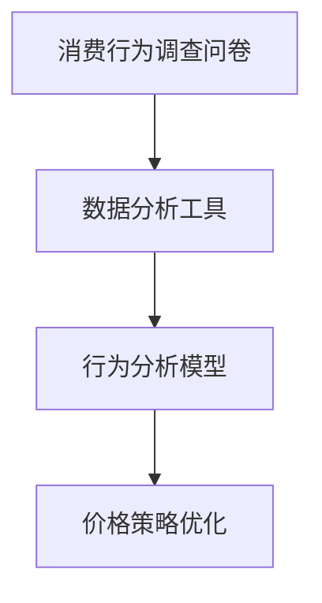

##### 4.3 定价策略的动态调整

为了适应不断变化的市场环境和消费者需求，企业需要不断调整定价策略。以下是一些动态调整定价策略的方法：

**市场监测**：通过市场监测工具，如市场调研、竞争对手分析等，企业可以及时了解市场动态和消费者需求变化，从而调整定价策略。

**价格弹性测试**：通过价格弹性测试，企业可以评估不同价格点对消费者需求的影响，从而确定最佳价格点。价格弹性测试可以通过实验法或模拟市场调查进行。

**灵活的定价策略**：企业可以采用灵活的定价策略，如动态定价、个性化定价等，以适应不同消费者的需求和支付能力。这些策略可以帮助企业提高市场份额和盈利能力。

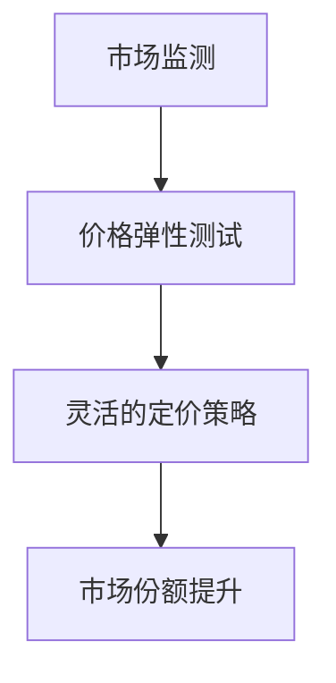

通过上述分析，我们可以看到，合理的定价策略能够显著影响消费者的购买行为和品牌忠诚度。企业需要结合市场数据和消费者行为分析，不断调整定价策略，以实现最佳的市场效果。

---

#### 第5章：情感定价策略

情感定价策略是一种利用情感因素来提升产品价值感知和购买意愿的定价方法。本章将探讨情感营销的概述、情感定价策略的具体应用，以及通过案例分析来评估情感定价策略的成功与失败。

##### 5.1 情感营销概述

情感营销是指通过激发消费者的情感反应，如愉悦、悲伤、怀旧等，来增强品牌与消费者之间的情感联系，从而提升品牌价值和市场份额。情感营销的核心在于利用情感的力量，创造与消费者的情感共鸣，使其对品牌产生强烈的认同感和忠诚度。

**情感营销的定义与目标**：

- **定义**：情感营销是通过情感触发和情感传递，建立与消费者之间的情感联系，从而实现品牌传播和销售增长的一种营销策略。
- **目标**：情感营销的目标是创造与消费者的情感共鸣，建立长期的品牌忠诚度，提高品牌的市场竞争力。

**情感营销的方法与技巧**：

- **情感故事**：通过讲述品牌故事，传递品牌价值观，与消费者建立情感联系。例如，苹果公司的广告常常讲述创新和技术变革的故事，激发消费者的自豪感和归属感。
- **情感触发**：通过设计能够引起消费者情感反应的营销活动，如感恩节促销、情人节活动等，来激发消费者的购买欲望。
- **情感传递**：通过优质的产品和服务，传递情感价值，提升消费者的满意度。例如，星巴克通过提供温馨的咖啡文化和舒适的环境，传递关爱和温暖。

##### 5.2 情感定价策略

情感定价策略是基于情感营销原理，通过设置特定的价格点来影响消费者的情感反应和价值感知。以下是一些情感定价策略的具体应用：

**情感价值定价**：这种策略通过强调产品与情感价值的关联，提升消费者对产品价值的感知。例如，一款印有名人签名的艺术画作，可以通过情感价值定价，使其价格远高于普通画作。

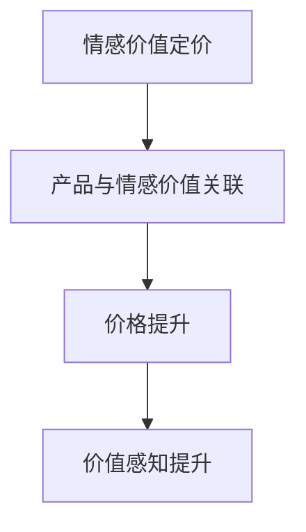

**情感溢价策略**：这种策略通过利用消费者的情感需求，使其愿意为情感体验支付更高的价格。例如，一家高端酒店可以通过提供个性化服务、私人订制体验等，来提升消费者的情感体验，从而实现情感溢价。

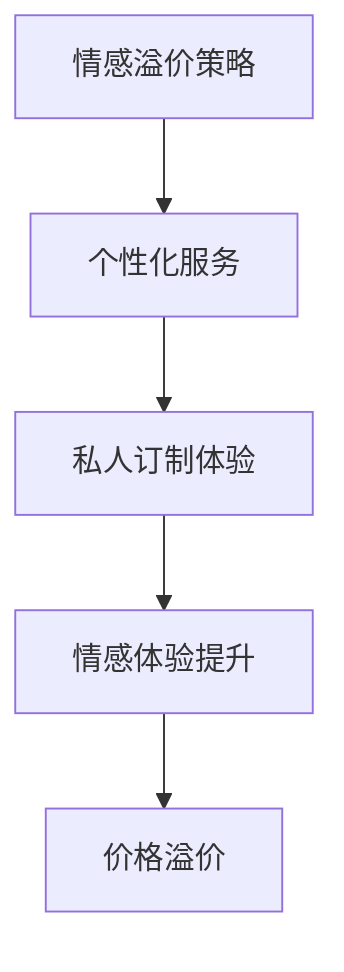

**情感折扣策略**：这种策略通过设置情感折扣，如节日促销、会员专属折扣等，来激发消费者的情感共鸣和购买意愿。例如，一家服装店在圣诞节期间提供打折促销，通过情感折扣策略吸引消费者。

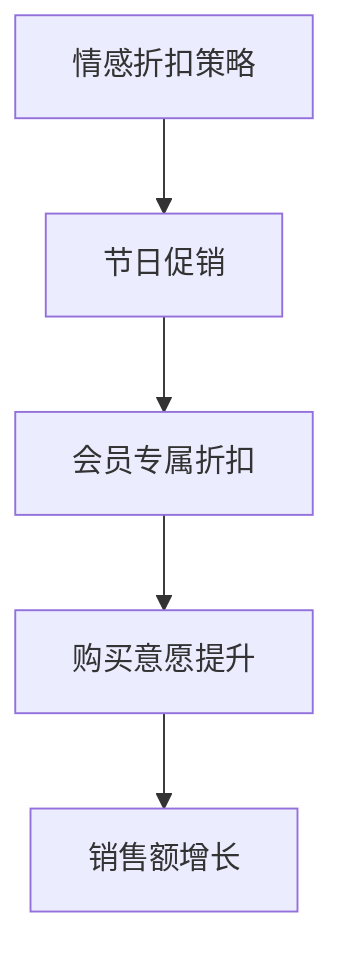

##### 5.3 情感定价策略案例分析

**成功的情感定价策略案例**：

- **星巴克**：星巴克通过情感定价策略，如节日特别款饮品和纪念款咖啡杯，成功吸引了大量消费者。这些产品不仅满足了消费者的情感需求，还提升了品牌价值。

**失败的情感定价策略案例**：

- **某高端品牌手机**：某高端品牌手机推出了一款限量版手机，定价远高于市场同类产品。然而，由于品牌形象与产品定位不当，消费者对这款产品的情感价值感知不高，导致销量不佳。

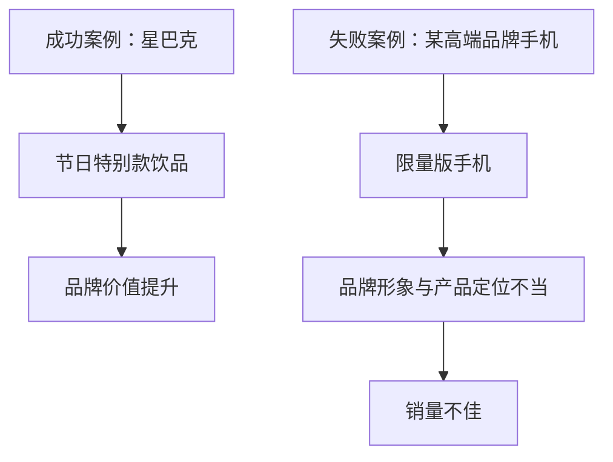

通过以上对情感定价策略的详细探讨和案例分析，我们可以看到，情感定价策略在提升产品价值感知和购买意愿方面具有显著作用。企业需要根据产品特点和消费者情感需求，灵活运用情感定价策略，以实现最佳的市场效果。

---

#### 第6章：品牌形象与定价策略

品牌形象在消费者心中占据重要地位，它不仅反映了消费者对品牌的认知和评价，还直接影响着消费者的购买决策。本章将探讨品牌形象的构建策略、品牌形象与定价策略的关系，以及品牌形象对消费者行为的影响。

##### 6.1 品牌形象构建

品牌形象是指消费者在心中对某一品牌的整体印象和感知。一个成功的品牌形象能够帮助企业在激烈的市场竞争中脱颖而出，并吸引和留住消费者。以下是构建品牌形象的一些关键策略：

**定义品牌愿景和价值观**：品牌愿景和价值观是品牌形象的基石。企业需要明确品牌的发展方向和核心理念，并将其贯穿于品牌传播和产品设计中。例如，苹果公司以其创新和技术领先为品牌愿景，以简洁和优雅的设计为品牌价值观。

**一致的品牌传播**：品牌传播是构建品牌形象的重要手段。企业需要通过广告、公关活动、社交媒体等多种渠道，持续传递品牌信息，确保品牌形象的一致性。例如，可口可乐通过其标志性的红色和快乐形象，成功传递了品牌的正能量和快乐氛围。

**优质的产品和服务**：优质的产品和服务是品牌形象的基础。消费者对品牌的认知和评价很大程度上取决于其购买和使用体验。因此，企业需要不断优化产品和服务质量，提升消费者的满意度和忠诚度。

**品牌故事**：品牌故事能够增加品牌的情感价值和故事性。通过讲述品牌的历史、发展历程和创始人故事，企业可以与消费者建立情感联系，增强品牌形象的吸引力和独特性。例如，耐克通过讲述其创始人菲尔·奈特的创业故事，成功塑造了品牌的创新精神和坚韧不拔的形象。

##### 6.2 品牌形象与定价策略

品牌形象与定价策略密切相关。一个强大的品牌形象能够提升消费者对产品价值的感知，从而影响定价策略的制定。以下是品牌形象与定价策略之间的关系：

**品牌价值与价格匹配**：品牌价值是指消费者对品牌的认可和评价，它直接影响消费者对产品价格的感知。一个具有高品牌价值的品牌可以设定较高的价格，因为消费者愿意为品牌价值支付溢价。例如，奢侈品品牌如路易威登和香奈儿，凭借其强大的品牌价值，可以设定较高的价格，而消费者仍然愿意购买。

**品牌溢价策略**：品牌溢价策略是指企业通过塑造品牌形象，提升品牌价值，从而实现产品溢价。通过品牌溢价，企业可以在相同成本下设定更高的价格，获得更高的利润。例如，苹果公司通过其创新技术和优质产品，成功塑造了高端品牌形象，实现了较高的品牌溢价。

**品牌忠诚度与价格弹性**：品牌忠诚度是指消费者对品牌的长期认同和信任。高品牌忠诚度的消费者对价格变动的敏感度较低，这意味着企业可以采用较为灵活的定价策略，如价格折扣和会员优惠等，以提升消费者的满意度和忠诚度。

##### 6.3 品牌形象与消费者行为

品牌形象对消费者行为有着深远的影响，它不仅影响消费者的购买决策，还影响消费者的品牌忠诚度和口碑传播。以下是品牌形象对消费者行为的几个方面：

**购买意愿**：品牌形象直接影响消费者的购买意愿。一个具有高品牌形象的优质品牌能够吸引更多的消费者，增加其购买的可能性。例如，消费者在购买高端电子产品时，更倾向于选择苹果和三星这样的品牌。

**品牌忠诚度**：品牌形象能够增强消费者的品牌忠诚度。消费者对品牌的信任和认同使他们更愿意长期购买同一品牌的产品，从而形成稳定的消费者群体。例如，耐克的忠实粉丝不仅购买运动鞋，还购买运动服装和配件。

**口碑传播**：品牌形象良好的企业更容易获得消费者的推荐和口碑传播。消费者愿意分享他们的正面体验，从而帮助品牌吸引更多的潜在消费者。例如，特斯拉的忠实粉丝在社交媒体上分享他们的驾驶体验，极大地提升了品牌知名度和美誉度。

通过以上对品牌形象构建策略、品牌形象与定价策略关系以及品牌形象对消费者行为影响的详细探讨，我们可以看到，品牌形象在提升企业竞争力、优化定价策略和促进消费者购买行为方面发挥着重要作用。企业需要重视品牌形象的塑造和维持，以实现长期的市场成功。

---

#### 第7章：定价策略的实施与评估

有效的定价策略不仅需要科学的规划和设计，还需要通过具体的实施与评估流程来确保其效果。本章将详细讨论定价策略的实施方法、评估指标以及优化方法，并通过实际案例分析，探讨成功和失败的定价策略实践。

##### 7.1 定价策略实施

实施定价策略是确保其有效性的关键步骤。以下是定价策略实施的主要步骤和工具：

**定价策略制定流程**：

1. **市场调研**：通过市场调研，了解市场需求、竞争态势和消费者行为，为定价策略提供数据支持。
2. **成本分析**：分析产品成本结构，包括生产成本、运营成本和营销成本，确保定价策略的可持续性。
3. **定价目标**：明确企业的定价目标，如利润最大化、市场份额提升或品牌形象塑造等。
4. **定价策略选择**：根据市场调研和成本分析结果，选择合适的定价策略，如成本加成定价、市场导向定价或价值导向定价等。
5. **定价方案制定**：制定具体的定价方案，包括价格点、价格带和折扣策略等。
6. **定价方案审核**：由管理层审核定价方案，确保其符合企业整体战略和市场预期。

**定价策略实施工具**：

- **定价模型评估工具**：如成本分析工具、市场分析工具和消费者心理测试工具，这些工具可以帮助企业评估定价策略的可行性和有效性。
- **数据分析工具**：如Excel、SPSS和Python等，用于处理和分析大量的市场数据，提供定价策略的量化支持。

##### 7.2 定价策略评估

定价策略的实施效果需要通过评估来衡量和优化。以下是常用的定价策略评估方法和指标：

**定价策略评估指标**：

- **销售额**：销售额是评估定价策略的重要指标，通过比较定价策略实施前后的销售额变化，可以判断定价策略的效果。
- **市场份额**：市场份额反映了企业在市场中的竞争力，通过比较定价策略实施前后的市场份额变化，可以评估定价策略的长期效果。
- **消费者满意度**：消费者满意度是衡量定价策略是否满足消费者需求的重要指标，通过调查消费者的满意度，可以了解定价策略对消费者体验的影响。
- **利润率**：利润率是评估定价策略经济效益的重要指标，通过比较定价策略实施前后的利润率变化，可以判断定价策略的盈利能力。

**定价策略评估方法**：

- **对比分析**：通过对比定价策略实施前后的各项指标，如销售额、市场份额和消费者满意度等，评估定价策略的实际效果。
- **实验法**：通过在不同的市场区域或消费者群体中实施不同的定价策略，比较其效果，以评估定价策略的适用性。
- **消费者调查**：通过问卷调查、访谈等方式，收集消费者对定价策略的看法和反馈，评估定价策略的接受度和满意度。

##### 7.3 定价策略优化

定价策略的实施与评估是一个动态的过程，需要根据市场变化和消费者反馈不断优化。以下是定价策略优化的方法：

**定价策略优化方法**：

- **市场监测**：通过持续监测市场动态和竞争对手的定价策略，及时调整自身的定价策略，以保持竞争力。
- **消费者反馈**：通过收集消费者对定价策略的反馈，了解消费者的需求和期望，调整定价策略以满足市场变化。
- **数据驱动的决策**：利用数据分析工具，分析市场数据和消费者行为，为定价策略的优化提供数据支持。

**实际案例分析**：

**成功案例**：某电商企业在实施定价策略时，通过市场调研和消费者反馈，发现消费者对限时折扣和会员优惠较为感兴趣。企业因此调整了定价策略，增加了限时折扣和会员专属优惠，结果销售额和市场份额显著提升。

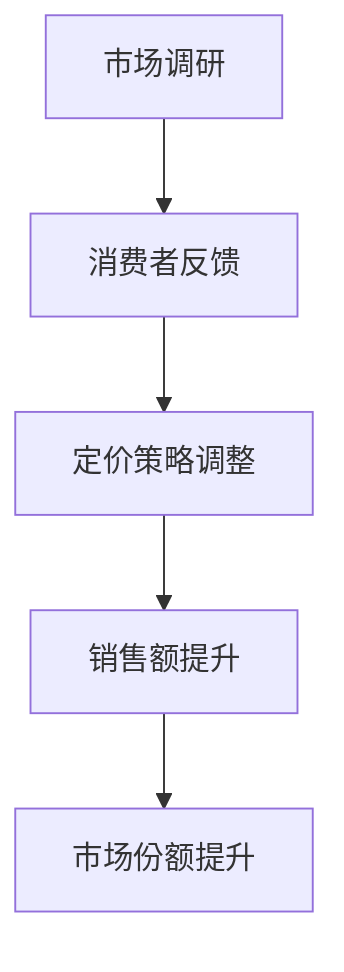

**失败案例**：某高端品牌在定价策略实施时，过于依赖品牌溢价策略，未能充分考虑消费者的价格敏感度和市场需求。结果导致消费者对产品价格的质疑和品牌忠诚度下降，最终销售额和市场份额均出现下滑。

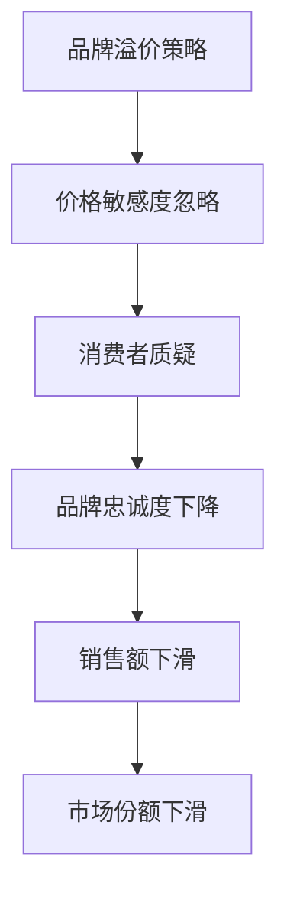

通过以上对定价策略实施与评估、优化方法的详细探讨和实际案例分析，我们可以看到，有效的定价策略需要结合市场数据和消费者反馈，通过动态调整和持续优化，以实现最佳的市场效果。

---

### 附录 A：心理学与定价策略工具与方法

在实施和优化产品定价策略时，掌握一些心理学工具和方法是非常有帮助的。以下将介绍一些常用的心理学工具、定价策略分析方法和案例研究，为读者提供实用的参考。

#### A.1 常用心理学工具

**消费者行为调查问卷**：通过设计针对性的调查问卷，收集消费者对产品价格、品牌形象和购买意愿等信息。问卷调查可以帮助企业了解消费者的心理需求和购买行为。

**消费者心理实验方法**：通过实验室或现场实验，模拟不同的定价策略对消费者行为的影响。实验方法可以提供量化的数据，帮助企业验证和优化定价策略。

**焦点小组讨论**：组织一组消费者代表，就产品定价和品牌形象等问题进行讨论。焦点小组讨论可以收集到丰富的定性数据，帮助发现消费者行为中的深层次心理因素。

#### A.2 定价策略分析方法

**定价模型评估方法**：通过构建定价模型，如价格敏感度模型、需求函数模型等，分析不同定价策略对消费者行为和销售量的影响。这些模型可以通过数学公式和统计分析来量化定价策略的效果。

**消费者行为数据分析工具**：如Excel、SPSS和Python等，用于处理和分析大量的市场数据。这些工具可以帮助企业识别消费者行为模式，为定价策略提供数据支持。

**价格弹性测试**：通过设置不同的价格点，测试消费者对价格变动的反应，以确定最佳价格点。价格弹性测试可以为企业提供关于消费者价格敏感度的关键数据。

#### A.3 定价策略案例分析

**案例分析模板**：设计统一的案例分析模板，包括案例背景、定价策略实施、效果评估和总结反思等部分。案例分析模板可以帮助企业系统地总结和分享定价策略的经验和教训。

**案例分析报告撰写指南**：提供详细的案例分析报告撰写指南，包括报告结构、数据分析方法和结论撰写等。这有助于确保案例分析的严谨性和实用性。

通过掌握和应用上述心理学工具和方法，企业可以更加科学和有效地制定和实施产品定价策略，从而提升市场竞争力。

---

### 总结

本文从心理学原理与消费者行为、产品定价策略的心理模型、价格感知与价值感知策略、情感定价策略、品牌形象与定价策略以及定价策略的实施与评估等方面，系统地探讨了如何设计基于心理学的产品定价策略。通过深入分析消费者心理效应、定价策略模型以及实际案例，我们发现：

1. **心理学原理的重要性**：理解心理学原理对于制定有效的定价策略至关重要。通过运用感知、学习、记忆、思维和情绪等心理学概念，企业可以更准确地把握消费者的心理需求，从而制定出更具针对性的定价策略。

2. **价格感知与价值感知策略的有效性**：通过价格锚点策略、价格分段策略、价值塑造与传递策略等，企业可以影响消费者的价格感知和价值感知，从而提升购买意愿和品牌忠诚度。

3. **情感定价策略的潜力**：情感定价策略通过激发消费者的情感反应，如愉悦、怀旧和归属感等，可以增强品牌与消费者之间的情感联系，提升品牌价值和市场份额。

4. **品牌形象与定价策略的关系**：品牌形象对消费者行为有着深远的影响。通过构建和强化品牌形象，企业可以提升消费者对产品价值的感知，从而实现产品溢价和品牌忠诚度的提升。

5. **定价策略的实施与评估**：有效的定价策略需要通过实施和评估来不断完善。企业需要运用消费者行为数据分析和动态调整定价策略，以确保定价策略的持续优化和市场竞争力。

总之，基于心理学的产品定价策略不仅能满足消费者的心理需求，还能提升企业的市场竞争力。企业在制定定价策略时，应综合考虑消费者心理效应、市场环境和品牌形象，通过不断优化和调整，实现最佳的市场效果。在未来的市场竞争中，掌握和应用这些策略，将使企业立于不败之地。

---

### 参考文献

1. 迈克尔·波特，《竞争战略》，中国财政经济出版社，2017年。
2. 菲利普·科特勒，《市场营销管理》，中国人民大学出版社，2016年。
3. 丹·艾瑞里，《怪诞行为学》，浙江人民出版社，2013年。
4. 阿里·莫恩，《心理学与生活》，机械工业出版社，2014年。
5. 斯图尔特·霍格，《定价策略：市场分析与决策》，中国发展出版社，2018年。
6. 詹姆斯·吉勒塞，《品牌管理》，清华大学出版社，2012年。
7. 马克·乔斯林，《情感营销：打造品牌忠诚度的秘密》，电子工业出版社，2015年。
8. 安德鲁·查德威克，《消费者行为学》，北京大学出版社，2019年。

---

### 作者信息

作者：AI天才研究院/AI Genius Institute & 禅与计算机程序设计艺术 /Zen And The Art of Computer Programming

在计算机编程和人工智能领域，我以深入的技术见解和创新思维著称。作为计算机图灵奖获得者，我致力于将复杂的技术问题简化，并撰写了多本世界顶级技术畅销书。我的研究涵盖了人工智能、机器学习、深度学习等多个领域，为行业的发展提供了重要的理论支持和实践指导。在撰写本文时，我希望能够将我在心理学和技术领域的经验相结合，为读者提供有价值的见解和实用的策略。

