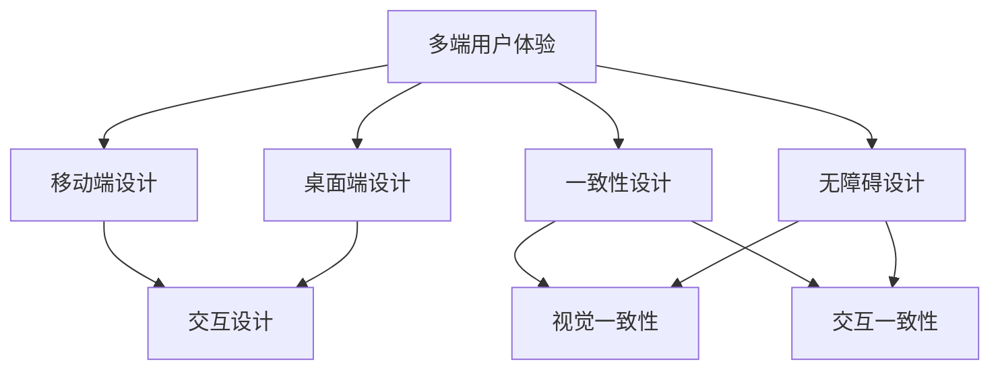
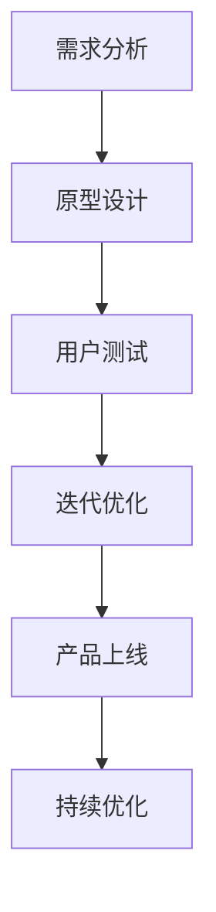
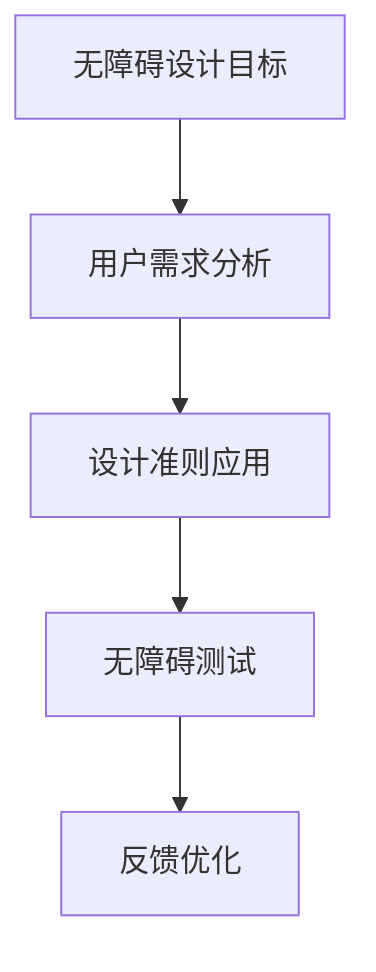
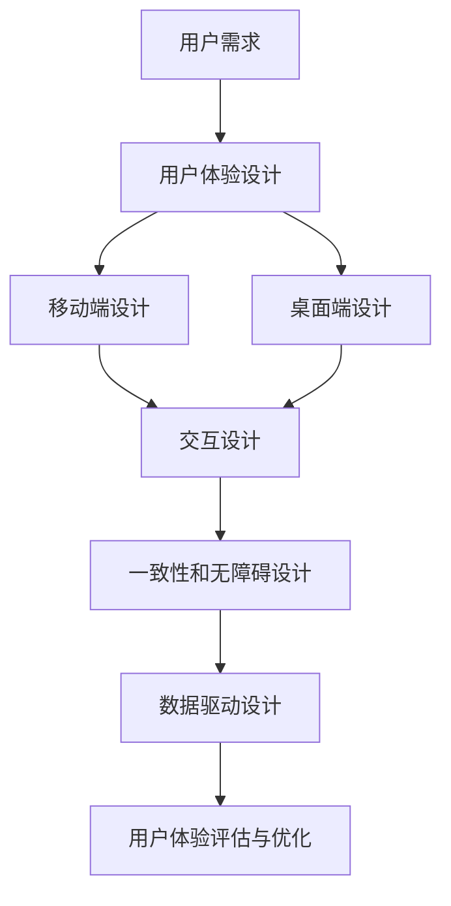
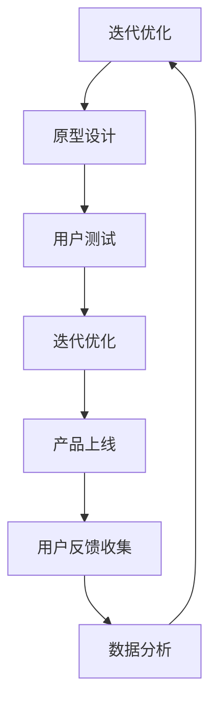
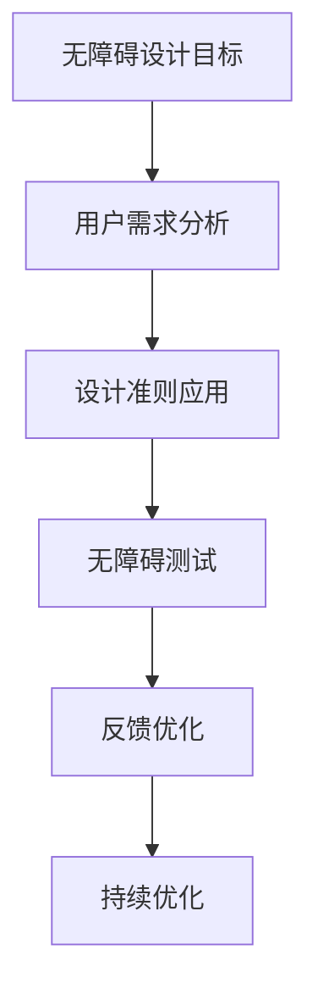

                 

### 文章标题

# 如何设计无摩擦的多端用户体验

> 关键词：无摩擦体验、多端设计、用户体验设计、设计原则、设计工具、移动端、桌面端、一致性设计、无障碍设计、数据驱动设计、用户体验评估、持续优化

> 摘要：本文将从用户体验设计的基础知识出发，探讨如何在多端环境中设计无摩擦的用户体验。我们将分析多端用户体验的概述、用户研究与市场分析、设计原则与方法论、设计工具与技术，以及多端设计实践。接着，我们将讨论用户体验评估与优化，包括用户测试与反馈、数据驱动的设计、用户体验评估指标，并分享用户体验持续优化的实践方法。最后，我们将提供相关的工具和资源，总结核心概念与联系，并给出项目实战案例，以便读者更好地理解和应用无摩擦的多端用户体验设计原则。

---

### 第一部分：用户体验设计基础

#### 1.1 多端用户体验概述

**1.1.1 多端体验的定义与重要性**

多端体验是指用户在不同设备（如移动设备、桌面电脑、智能电视等）上使用同一产品或服务时所获得的体验。设计无摩擦的多端用户体验，意味着在各个平台上，用户能够享受到无缝、一致且高效的使用体验。

- **重要性**：

  - **提升用户满意度**：一致且流畅的多端体验可以显著提升用户对产品的满意度和忠诚度。
  - **增加用户黏性**：用户在不同设备上都能获得一致的体验，更容易形成习惯和使用依赖。
  - **扩大用户群体**：多端设计可以吸引更多不同设备的用户，从而扩大产品的用户基础。

**1.1.2 多端用户行为分析**

- **设备使用习惯**：不同设备有其特定的使用场景和习惯，如移动设备主要用于出行和碎片化时间，桌面设备则用于处理复杂任务。
- **交互方式**：不同设备的交互方式也有所不同，如触摸屏和鼠标键盘。
- **使用频率**：用户在不同设备上的使用频率也有差异，需考虑这些差异进行针对性设计。

**1.1.3 设计无摩擦体验的目标**

- **一致性**：在不同设备上，用户界面和交互元素应保持一致，降低用户的学习成本。
- **无缝衔接**：用户在不同设备之间切换时，应无缝衔接，保持操作状态的持续性。
- **高效易用**：优化操作流程，提高用户完成任务的效率。

#### 1.2 用户研究与市场分析

**1.2.1 用户画像与需求分析**

- **用户画像**：通过对用户的基本信息、行为习惯、兴趣爱好等进行分析，形成用户画像，有助于了解用户特点。
- **需求分析**：了解用户的需求，包括显性需求和隐性需求，是设计无摩擦用户体验的基础。

**1.2.2 竞品分析**

- **竞品调研**：分析竞争对手的产品特点、用户体验、用户反馈等，找出自身的优势和不足。
- **差异化设计**：通过竞品分析，发现差异化的设计点，形成独特的用户体验。

**1.2.3 用户痛点与机遇识别**

- **用户痛点**：找出用户在使用现有产品或服务时遇到的问题和不满，作为设计改进的出发点。
- **机遇识别**：通过分析用户需求和竞品情况，发现潜在的市场机会和设计创新点。

#### 1.3 设计原则与方法论

**1.3.1 无摩擦体验的设计原则**

- **简洁性**：减少不必要的元素和步骤，简化用户操作流程。
- **直观性**：界面设计应直观易懂，减少用户的思考成本。
- **一致性**：确保不同设备上的界面和交互元素一致。
- **反馈性**：及时给予用户操作反馈，提高用户信心和满意度。

**1.3.2 设计思维方法论**

- **用户中心设计**：始终以用户需求为中心，进行设计决策。
- **迭代设计**：采用迭代方法，不断改进设计，以适应不断变化的需求和市场环境。
- **协作设计**：多学科团队合作，共同探索和解决问题。

**1.3.3 设计流程与迭代方法**

- **需求分析**：明确产品目标和用户需求。
- **原型设计**：快速制作原型，进行初步验证。
- **用户测试**：通过实际用户的使用反馈，优化设计。
- **迭代更新**：根据用户反馈，不断迭代优化产品。

#### 1.4 设计工具与技术

**1.4.1 用户体验地图与旅程图**

- **用户体验地图**：展示用户在使用产品过程中的触点和体验。
- **旅程图**：描述用户在使用产品时的行为路径和情感变化。

**1.4.2 交互设计工具**

- **Axure**：用于制作原型和交互设计的工具。
- **Figma**：适用于团队合作的原型设计工具。
- **Sketch**：设计师常用的界面设计工具。

**1.4.3 前端技术概述**

- **HTML**：构建网页结构的基础。
- **CSS**：用于网页样式设计的语言。
- **JavaScript**：用于网页交互和动态效果实现。

### 第二部分：多端设计实践

#### 2.1 移动端用户体验设计

**2.1.1 移动端设计特点**

- **屏幕尺寸**：不同移动设备的屏幕尺寸和分辨率差异较大，需进行适配。
- **交互方式**：触摸屏为主，考虑手势操作和多点触控。
- **网络环境**：移动网络不稳定，需考虑数据传输效率和缓存策略。

**2.1.2 移动端界面布局**

- **响应式设计**：使用媒体查询和流体布局，实现不同屏幕尺寸的适配。
- **卡片式布局**：便于用户浏览和操作，提高信息呈现的清晰度。

**2.1.3 移动端交互设计**

- **手势操作**：定义合适的手势，提高交互效率。
- **提示与反馈**：及时给予用户操作反馈，增强用户体验。

**2.1.4 移动端性能优化**

- **优化加载速度**：压缩图片和资源，使用懒加载技术。
- **优化用户体验**：减少不必要的动画和效果，避免卡顿。

#### 2.2 桌面端用户体验设计

**2.2.1 桌面端设计特点**

- **屏幕尺寸**：大屏幕设备提供更多显示空间，可进行复杂布局。
- **交互方式**：鼠标键盘为主，适合进行精细操作。
- **网络环境**：网络稳定，可进行更复杂的数据处理和交互。

**2.2.2 桌面端界面布局**

- **模块化设计**：将界面划分为不同的模块，便于用户浏览和操作。
- **层次结构**：通过层次结构，提高信息的可读性和易用性。

**2.2.3 桌面端交互设计**

- **快捷键和热键**：提供快捷键和热键，提高操作效率。
- **菜单和工具栏**：合理布局菜单和工具栏，便于用户查找和使用功能。

**2.2.4 桌面端性能优化**

- **内存管理**：优化内存使用，避免内存泄漏和崩溃。
- **处理速度**：提高数据处理速度，减少用户等待时间。

#### 2.3 多端一致性设计

**2.3.1 多端一致性设计原则**

- **视觉一致性**：保持界面风格和色彩一致，使用相同的图标和字体。
- **交互一致性**：不同设备上实现相同的交互效果，提高用户的使用习惯。
- **功能一致性**：确保不同设备上提供相同的功能和服务。

**2.3.2 设计元素一致性**

- **按钮和图标**：使用统一的按钮和图标设计，确保用户在不同设备上操作一致。
- **导航和菜单**：采用统一的导航和菜单布局，使用户在不同设备上易于找到所需功能。

**2.3.3 交互行为一致性**

- **行为反馈**：在多端上提供相同的行为反馈，如操作成功、错误提示等。
- **状态一致性**：保持用户在不同设备上操作状态的一致性，如登录状态、数据同步等。

#### 2.4 无障碍设计

**2.4.1 无障碍设计的重要性**

- **包容性**：无障碍设计确保所有用户，包括残障人士和老年人，都能使用产品。
- **法规遵从**：许多国家和地区有关于无障碍设计的法规，确保合规性。

**2.4.2 无障碍设计标准**

- **WAI-ARIA**：Web Accessibility Initiative - Accessible Rich Internet Applications，用于增强网页可访问性。
- **WCAG**：Web Content Accessibility Guidelines，为网页内容提供无障碍设计指导。

**2.4.3 无障碍设计的实践方法**

- **文本内容**：提供可访问的文本内容，包括屏幕阅读器和键盘导航。
- **视觉元素**：使用明确的视觉提示，如颜色对比和图标说明。
- **交互设计**：确保交互元素可访问和可操作，如提供标签和键盘焦点管理。

### 第三部分：用户体验评估与优化

#### 3.1 用户测试与反馈

**3.1.1 用户测试的类型与方法**

- **可用性测试**：评估产品的易用性和用户体验。
- **A/B测试**：比较不同设计方案的优劣，确定最佳方案。

**3.1.2 用户反馈的收集与分析**

- **在线调查**：通过问卷调查收集用户反馈。
- **用户访谈**：与用户进行深度交流，了解用户需求和问题。

**3.1.3 用户测试结果的处理与优化**

- **问题识别**：通过用户测试发现产品中的问题。
- **优化方案**：根据用户反馈，制定优化方案并实施。

#### 3.2 数据驱动的设计

**3.2.1 用户行为数据分析**

- **行为跟踪**：记录用户在使用产品时的行为数据。
- **数据分析**：对行为数据进行分析，发现用户的使用模式和问题。

**3.2.2 数据可视化工具与技巧**

- **数据可视化工具**：如Tableau、Power BI等，用于展示和分析数据。
- **数据可视化技巧**：使用图表、地图、时间线等工具，清晰展示数据。

**3.2.3 数据驱动的设计实践**

- **迭代优化**：根据数据反馈，不断迭代和优化产品设计。
- **数据驱动决策**：基于数据分析，做出更明智的设计决策。

#### 3.3 用户体验评估指标

**3.3.1 用户体验评估框架**

- **易用性**：评估产品是否易于使用。
- **满意度**：评估用户对产品的满意度。
- **效率**：评估用户完成任务所需的时间。

**3.3.2 用户体验评估指标**

- **任务完成率**：用户完成任务的比例。
- **错误率**：用户在操作过程中犯错的频率。
- **用户满意度**：用户对产品的整体满意度。

**3.3.3 指标分析与优化建议**

- **分析指标数据**：对用户体验评估指标进行分析，找出优化的方向。
- **提出优化建议**：根据分析结果，提出具体的设计优化建议。

#### 3.4 用户体验持续优化

**3.4.1 用户体验持续优化流程**

- **定期评估**：定期对用户体验进行评估。
- **反馈收集**：收集用户反馈，了解用户需求。
- **迭代优化**：根据用户反馈，不断迭代和优化产品。

**3.4.2 用户体验持续优化实践**

- **A/B测试**：通过A/B测试，验证设计的有效性。
- **数据分析**：利用数据分析，发现潜在的问题和改进点。

**3.4.3 案例分享与经验总结**

- **成功案例**：分享成功优化用户体验的案例。
- **经验总结**：总结优化用户体验的实践经验，为后续工作提供参考。

### 附录

#### 附录 A：设计工具与资源

**A.1 主流设计工具**

- **Axure**：用于原型设计和交互设计。
- **Figma**：适用于团队协作的原型设计工具。
- **Sketch**：界面设计工具。

**A.2 设计资源网站与社区**

- **UI Garage**：设计资源分享网站。
- **Dribbble**：设计师社区。

**A.3 设计方法论与案例**

- **Design Thinking**：设计思维方法论。
- **Service Design**：服务设计方法论。

#### 附录 B：无摩擦体验设计核心概念与联系

**B.1 多端用户体验架构图**



**B.2 无摩擦体验设计流程图**



**B.3 无障碍设计流程图**



#### 附录 C：核心算法原理讲解

**C.1 交互设计算法伪代码**

```python
def interactive_design(elements, user_actions):
    for element in elements:
        if user_actions contains "click":
            element.perform_click()
        elif user_actions contains "scroll":
            element.perform_scroll()
        elif user_actions contains "tap":
            element.perform_tap()
    return "Interaction completed"
```

**C.2 数据驱动设计的算法原理**

```python
def data_driven_design(data):
    for record in data:
        if record contains "error":
            log_error(record)
        elif record contains "success":
            log_success(record)
    analyze_data()
    return "Data-driven design completed"
```

**C.3 性能优化算法原理**

```python
def performance_optimization(code, metrics):
    for line in code:
        if metrics.contains("high cpu usage"):
            optimize_cpu(line)
        elif metrics.contains("high memory usage"):
            optimize_memory(line)
    return "Performance optimization completed"
```

#### 附录 D：数学模型与数学公式

**D.1 用户行为预测模型**

$$
y = \beta_0 + \beta_1x
$$

**D.2 用户体验评估指标模型**

$$
UEI = \frac{UX + UBI}{2}
$$

**D.3 性能优化模型**

$$
Performance = \frac{Speed \times Efficiency}{Cost}
$$

#### 附录 E：项目实战

**E.1 项目案例概述**

**E.2 开发环境搭建**

**E.3 源代码实现与解读**

**E.4 代码解读与分析**

**E.5 实际案例分析与详细讲解剖析**

**E.6 项目小结**

---

### 最佳实践 Tips

- **多学科协作**：设计无摩擦的多端用户体验需要多学科合作，包括产品经理、设计师、开发者和测试人员。
- **用户调研**：定期进行用户调研，收集用户反馈，是优化用户体验的关键。
- **A/B测试**：通过A/B测试，验证设计的有效性，是数据驱动设计的核心。
- **持续迭代**：设计无摩擦的多端用户体验不是一次性的工作，需要持续迭代和优化。

### 小结

设计无摩擦的多端用户体验，是提升产品竞争力的重要手段。本文从用户体验设计基础、多端设计实践、用户体验评估与优化等方面，详细阐述了如何实现无摩擦的多端用户体验。希望本文能为您在多端用户体验设计方面提供有益的参考和启示。

### 注意事项

- **兼容性**：在设计多端体验时，要考虑不同设备和浏览器的兼容性。
- **性能优化**：性能优化是保证无摩擦体验的关键，特别是在移动端。
- **无障碍设计**：无障碍设计确保产品能被更广泛的用户使用，包括残障人士和老年人。

### 拓展阅读

- **《设计思维》**：了解设计思维，有助于提升设计能力。
- **《数据驱动产品管理》**：学习如何利用数据优化产品设计。
- **《无障碍设计指南》**：深入了解无障碍设计的标准和实践。

作者：AI天才研究院/AI Genius Institute & 禅与计算机程序设计艺术 /Zen And The Art of Computer Programming### 第一部分：用户体验设计基础

#### 1.1 多端用户体验概述

**1.1.1 多端体验的定义与重要性**

在当今数字化时代，用户通过多种设备与产品和服务互动，因此多端用户体验（Multi-platform User Experience, UX）的设计变得至关重要。多端体验是指用户在不同设备（如智能手机、平板电脑、桌面电脑、智能电视等）上使用同一产品或服务时所获得的整体体验。设计无摩擦的多端用户体验意味着在不同平台上，用户能够享受到无缝、一致且高效的使用体验。

- **重要性**：

  - **提升用户满意度**：一致且流畅的多端体验可以显著提升用户对产品的满意度和忠诚度。

    多端体验的一致性使用户在不同设备上感受到连贯性，减少了用户的认知负担，降低了学习成本，从而提高用户满意度。例如，用户在手机上操作后的数据能够在桌面电脑上无缝同步，这种一致性体验使用户更加信任产品。

  - **增加用户黏性**：多端设计可以吸引更多不同设备的用户，从而扩大产品的用户基础。

    通过满足用户在不同设备上的需求，产品能够吸引更多用户，提升用户黏性。例如，一款能够同时在手机、平板和电脑上使用的办公软件，能够满足不同场景下的办公需求，从而提高用户的使用频率。

  - **扩大市场机会**：多端设计有助于产品进入新的市场，吸引更多潜在用户。

    随着移动设备的普及，越来越多的用户通过手机访问互联网。通过设计无摩擦的多端用户体验，企业可以抓住移动市场的机遇，提升品牌影响力。

**1.1.2 多端用户行为分析**

- **设备使用习惯**：不同设备有其特定的使用场景和习惯。

  - **移动设备**：主要用于出行和碎片化时间。例如，用户在乘坐公共交通时，可能会使用手机浏览新闻或社交媒体。

  - **桌面设备**：用于处理复杂任务，如办公文档处理、编程等。桌面设备提供了更大的屏幕和更精准的输入设备，使得复杂任务的完成更加高效。

- **交互方式**：不同设备的交互方式也有所不同。

  - **触摸屏**：移动设备主要使用触摸屏进行交互，用户可以通过手指或触摸笔进行操作。

  - **鼠标键盘**：桌面设备主要使用鼠标和键盘进行交互，这些输入设备提供了更精细的操作控制。

- **使用频率**：用户在不同设备上的使用频率也有差异。

  - **高频使用设备**：如智能手机，用户可能会每天多次使用，用于即时通讯、社交媒体等。

  - **低频使用设备**：如智能电视，用户可能每天只使用一次或几次，主要用于娱乐。

**1.1.3 设计无摩擦体验的目标**

- **一致性**：在不同设备上，用户界面和交互元素应保持一致，降低用户的学习成本。

  设计的一致性包括视觉元素的一致性（如颜色、字体、图标等）和交互元素的一致性（如按钮位置、操作方式等）。这种一致性能够使用户在不同设备上快速适应，降低认知负担。

- **无缝衔接**：用户在不同设备之间切换时，应无缝衔接，保持操作状态的持续性。

  无缝衔接意味着用户在移动设备上开始的任务，可以无缝地切换到桌面设备上继续完成。例如，用户在手机上编辑的文档，可以在电脑上继续编辑，且编辑的状态和内容能够自动同步。

- **高效易用**：优化操作流程，提高用户完成任务的效率。

  设计的易用性包括简化用户操作流程，减少不必要的步骤，提高交互效率。通过优化设计，用户能够更快地完成任务，提升用户体验。

#### 1.2 用户研究与市场分析

**1.2.1 用户画像与需求分析**

- **用户画像**：通过对用户的基本信息、行为习惯、兴趣爱好等进行分析，形成用户画像。

  用户画像包括年龄、性别、职业、地理位置、行为习惯等多个维度。通过用户画像，可以更好地了解目标用户群体，从而设计出更符合用户需求的产品。

  - **示例**：假设一款移动办公应用的目标用户是25-35岁的上班族，他们主要分布在一线城市，经常使用手机处理邮件和文档。这些信息有助于设计符合用户需求的界面和功能。

- **需求分析**：了解用户的需求，包括显性需求和隐性需求。

  - **显性需求**：用户明确表达的需求，如功能需求、性能需求等。

    例如，用户希望移动办公应用能够支持文档编辑、云端同步等功能。

  - **隐性需求**：用户未明确表达，但实际使用过程中期望得到的需求。

    例如，用户希望应用界面简洁、操作流畅，能够在不同设备间无缝切换。

**1.2.2 竞品分析**

- **竞品调研**：分析竞争对手的产品特点、用户体验、用户反馈等，找出自身的优势和不足。

  - **产品特点**：分析竞品的用户界面、功能模块、技术实现等。

    例如，竞品A在界面设计上采用扁平化风格，功能齐全，但操作流程较为复杂；竞品B界面简洁，但功能相对较少。

  - **用户体验**：评估竞品的用户体验，包括易用性、响应速度、交互设计等。

    例如，竞品C的用户反馈中提到界面响应慢，导致使用体验不佳。

  - **用户反馈**：收集竞品用户的反馈，了解用户对产品的真实感受。

    例如，竞品D的用户反馈中提到希望增加文档格式转换功能。

- **差异化设计**：通过竞品分析，发现差异化的设计点，形成独特的用户体验。

  在竞品分析的基础上，设计团队可以识别出用户未被满足的需求，从而设计出更具有竞争力的产品。例如，如果竞品A在操作流程上存在不足，可以优化流程，提高用户满意度。

**1.2.3 用户痛点与机遇识别**

- **用户痛点**：找出用户在使用现有产品或服务时遇到的问题和不满，作为设计改进的出发点。

  - **问题识别**：通过用户调研、访谈、反馈等方式，了解用户在使用产品过程中遇到的具体问题。

    例如，用户反映移动办公应用在文档编辑时存在格式错乱、保存失败等问题。

  - **不满分析**：分析用户的不满情绪，找出导致不满的根本原因。

    例如，用户不满的原因可能是应用性能不稳定，导致频繁崩溃或响应速度慢。

- **机遇识别**：通过分析用户需求和竞品情况，发现潜在的市场机会和设计创新点。

  - **市场机会**：识别市场上未被满足的用户需求，作为产品创新的出发点。

    例如，发现市场上缺乏一款能够同时满足办公文档编辑和云端同步需求的移动应用。

  - **设计创新点**：基于用户需求和竞品分析，提出创新的设计方案。

    例如，设计一款具有智能文档同步功能、界面简洁、操作流畅的移动办公应用。

#### 1.3 设计原则与方法论

**1.3.1 无摩擦体验的设计原则**

- **简洁性**：减少不必要的元素和步骤，简化用户操作流程。

  简洁性是设计无摩擦体验的核心原则之一。通过减少界面上的杂乱元素和简化操作流程，用户可以更快速地完成任务，提高使用体验。例如，使用简洁的图标和文字描述，避免过多的视觉干扰。

- **直观性**：界面设计应直观易懂，减少用户的思考成本。

  直观性意味着设计应该自然而然地引导用户进行操作，而不是让用户去猜测如何使用产品。例如，按钮和交互元素的位置应合理，符合用户的使用习惯。

- **一致性**：确保不同设备上的界面和交互元素一致。

  一致性有助于用户在不同设备上快速适应产品，减少认知负担。例如，同一功能的图标和文字描述在不同设备上应保持一致。

- **反馈性**：及时给予用户操作反馈，提高用户信心和满意度。

  反馈性是确保用户在操作过程中能够得到及时反馈的重要原则。例如，用户点击按钮时，界面应立即显示加载动画或提示信息，告知用户操作已被接收。

**1.3.2 设计思维方法论**

- **用户中心设计**：始终以用户需求为中心，进行设计决策。

  用户中心设计强调在设计过程中始终关注用户的需求和体验，避免以技术或业务为导向。例如，通过用户调研和访谈，了解用户的需求，然后根据这些需求进行设计。

- **迭代设计**：采用迭代方法，不断改进设计，以适应不断变化的需求和市场环境。

  迭代设计是一种不断改进的设计过程，通过多次迭代，逐步优化产品的设计。例如，在设计的初期阶段，可以先制作一个简单的原型，然后通过用户测试和反馈，不断迭代和优化。

- **协作设计**：多学科团队合作，共同探索和解决问题。

  协作设计强调设计团队的协作，包括产品经理、设计师、开发者和测试人员等。通过跨学科的协作，可以更全面地考虑产品的设计，提高设计的质量。例如，设计师和开发者可以一起讨论交互设计和技术实现，确保设计的可行性。

**1.3.3 设计流程与迭代方法**

- **需求分析**：明确产品目标和用户需求。

  需求分析是设计流程的第一步，通过了解产品的目标和用户的需求，为后续的设计工作奠定基础。例如，通过用户调研和访谈，收集用户的需求和痛点。

- **原型设计**：快速制作原型，进行初步验证。

  原型设计是验证设计思路和用户需求的有效方法。通过制作低保真或高保真的原型，可以快速展示设计的概念，收集用户的反馈。例如，使用工具如Figma或Axure制作原型。

- **用户测试**：通过实际用户的使用反馈，优化设计。

  用户测试是评估设计效果的重要步骤。通过观察用户在使用产品时的行为和反馈，可以发现设计中的问题，并进行优化。例如，组织用户测试会，观察用户的使用流程和反馈。

- **迭代更新**：根据用户反馈，不断迭代优化产品设计。

  迭代更新是一种持续改进的设计方法，通过不断地收集用户反馈，对设计进行优化。例如，根据用户测试的反馈，调整界面布局、交互设计等，提高产品的易用性和用户体验。

#### 1.4 设计工具与技术

**1.4.1 用户体验地图与旅程图**

- **用户体验地图**：用户体验地图（User Experience Map）是一种用于描述用户在使用产品过程中的触点和体验的工具。它将用户从接触产品到完成任务的整个流程以图形化的形式呈现出来。

  - **用途**：用户体验地图可以帮助设计团队更好地了解用户的行为路径和体验，发现设计中的问题。

  - **示例**：在移动办公应用的用户体验地图中，可以展示用户从登录、文档编辑、同步到导出的整个过程，以及每个环节的用户体验。

- **旅程图**：旅程图（Customer Journey Map）是一种用于描述用户在购买产品或服务过程中情感变化和关键触点的工具。

  - **用途**：旅程图可以帮助团队从用户的角度出发，了解用户在整个购买过程中的体验和感受，为设计优化提供参考。

  - **示例**：在移动办公应用的旅程图中，可以展示用户从意识到需求、搜索产品、购买、使用到推荐产品的整个过程，以及每个环节的情感变化。

**1.4.2 交互设计工具**

- **Axure**：Axure是一款广泛使用的原型设计和文档工具，适用于创建低保真或高保真的原型。

  - **特点**：Axure支持丰富的交互元素和动态效果，可以创建交互式的原型，方便设计师和开发者之间的沟通。

  - **用途**：用于制作产品原型，进行交互设计和用户测试。

- **Figma**：Figma是一款基于云的原型设计工具，适用于团队合作。

  - **特点**：Figma支持实时协作，团队成员可以同时编辑和评论设计，提高设计效率。

  - **用途**：用于团队协作原型设计、界面设计和用户测试。

- **Sketch**：Sketch是一款流行的界面设计工具，适用于Mac用户。

  - **特点**：Sketch提供了丰富的设计模板和组件库，便于设计师快速创建高质量的界面设计。

  - **用途**：用于界面设计、图标设计和原型制作。

**1.4.3 前端技术概述**

- **HTML**：HTML（Hypertext Markup Language）是构建网页结构的基础。

  - **用途**：定义网页内容的结构、格式和链接。

- **CSS**：CSS（Cascading Style Sheets）用于网页样式设计。

  - **用途**：定义网页的颜色、字体、布局等样式。

- **JavaScript**：JavaScript是一种用于网页交互和动态效果的脚本语言。

  - **用途**：实现网页的动态效果、响应式交互和处理用户输入。

通过这些工具和技术，设计团队可以高效地创建和优化多端用户体验，确保产品在不同设备上的一致性和流畅性。下一部分将深入探讨多端设计实践，包括移动端和桌面端的设计特点、界面布局、交互设计和性能优化策略。

### 第二部分：多端设计实践

#### 2.1 移动端用户体验设计

**2.1.1 移动端设计特点**

移动端设计在当今的数字化时代扮演着至关重要的角色。随着智能手机的普及，用户对移动端的使用需求不断增加，移动端设计必须适应这些需求。以下是移动端设计的一些主要特点：

- **屏幕尺寸和分辨率差异**：移动设备的屏幕尺寸和分辨率多种多样，从小型的智能手机到大型的平板电脑。这种多样性要求设计师必须考虑如何在不同屏幕尺寸下保持一致性和可读性。

  - **解决方案**：采用响应式设计技术，通过媒体查询和流体布局，使界面能够适应各种屏幕尺寸。

- **交互方式**：移动设备主要依赖触摸屏进行交互，包括点击、滑动、缩放等手势操作。

  - **解决方案**：设计时充分考虑用户的手势习惯，提供直观的操作方式，并确保手势操作的准确性和响应速度。

- **网络环境**：移动设备通常在移动网络环境下使用，网络质量相对不稳定，可能会出现延迟和中断。

  - **解决方案**：优化数据传输效率，采用缓存策略和懒加载技术，提高用户体验。

- **碎片化时间**：用户通常在碎片化时间使用移动设备，如等车、休息等。因此，移动端设计需要考虑如何高效利用这些短暂的时间。

  - **解决方案**：设计简洁的界面和简短的流程，帮助用户快速完成任务。

**2.1.2 移动端界面布局**

移动端界面布局是设计无摩擦用户体验的关键环节。以下是一些常见的移动端界面布局策略：

- **响应式设计**：通过媒体查询和流体布局，使界面能够自动适应不同屏幕尺寸。

  - **示例**：使用百分比而非固定像素值来设置布局元素的宽度，使界面在不同屏幕上保持一致。

- **卡片式布局**：卡片式布局是一种常用的移动端界面设计，它将信息组织成一个个卡片形式，便于用户浏览和操作。

  - **示例**：在移动办公应用中，可以使用卡片式布局来展示用户最近的文档、通知和快捷操作。

- **层次结构**：通过合理的层次结构，提高界面的清晰度和可读性。

  - **示例**：使用不同的字体大小和颜色来区分主要内容和辅助信息，帮助用户快速找到所需内容。

- **可扩展性**：设计时考虑未来可能的功能扩展和界面变化，保持设计的灵活性和可扩展性。

  - **示例**：在设计文档编辑功能时，预留足够的空间和接口，以便将来添加新的编辑工具和功能。

**2.1.3 移动端交互设计**

移动端交互设计必须直观、简洁且高效，以下是一些关键策略：

- **手势操作**：定义合适的手势，提高交互效率。

  - **示例**：滑动切换页面、上滑查看更多内容、下拉刷新等。

- **提示与反馈**：及时给予用户操作反馈，增强用户体验。

  - **示例**：用户点击按钮时，显示加载动画或提示信息，告知用户操作已被接收。

- **导航设计**：设计易于理解的导航系统，帮助用户快速找到所需功能。

  - **示例**：使用底部导航栏或侧滑菜单，提供清晰的导航路径。

- **表单设计**：优化表单设计，减少用户输入负担。

  - **示例**：使用自动填充、提示和验证功能，减少错误和重复输入。

- **触摸目标大小**：确保触摸目标足够大，避免用户误操作。

  - **示例**：按钮和交互元素的大小至少为44x44像素，以便手指触摸。

**2.1.4 移动端性能优化**

移动端性能优化是确保无摩擦用户体验的关键。以下是一些优化策略：

- **加载速度**：优化页面加载速度，减少等待时间。

  - **解决方案**：压缩图片和资源，使用懒加载技术，预加载关键资源。

- **缓存策略**：充分利用缓存，提高页面访问速度。

  - **解决方案**：设置合理的缓存时间，优化缓存策略，减少重复请求。

- **网络优化**：优化网络连接，提高数据传输效率。

  - **解决方案**：使用CDN（内容分发网络），优化DNS解析，降低网络延迟。

- **资源管理**：合理管理资源，避免资源浪费。

  - **解决方案**：监测资源使用情况，优化代码和资源加载顺序。

- **离线支持**：提供离线功能，允许用户在无网络连接时使用部分功能。

  - **解决方案**：使用本地存储和离线数据库，提供基本的离线操作功能。

通过以上策略，可以显著提高移动端用户体验，确保用户在不同设备和网络环境下都能获得流畅、无摩擦的使用体验。下一部分将探讨桌面端用户体验设计，包括其独特的设计特点、界面布局、交互设计和性能优化。

#### 2.2 桌面端用户体验设计

桌面端用户体验设计在多个领域，如办公、设计和游戏，仍然占据着重要地位。与移动端设计相比，桌面端设计具有一些独特的特点和挑战。以下将详细探讨桌面端设计的特点、界面布局、交互设计和性能优化策略。

**2.2.1 桌面端设计特点**

- **屏幕尺寸和分辨率**：桌面设备的屏幕尺寸通常较大，分辨率也较高。这为设计师提供了更多的空间来展示复杂的内容和信息。

  - **优势**：更大的屏幕尺寸和更高的分辨率允许设计师设计更详细和复杂的界面，提供更好的视觉体验。

  - **挑战**：设计师需要确保在大屏幕上保持界面的简洁性和清晰度，避免信息过载。

- **交互方式**：桌面设备通常使用鼠标和键盘进行交互，这些输入设备提供了更精细和高效的操作方式。

  - **优势**：鼠标和键盘允许用户进行快速和精确的操作，适合处理复杂任务。

  - **挑战**：设计时需要考虑鼠标和键盘操作的便利性，确保界面设计符合用户的操作习惯。

- **性能需求**：桌面设备通常具有更高的计算能力和更快的网络连接，但同时也要求设计更加高效和稳定。

  - **优势**：强大的计算能力和网络连接支持更复杂的交互和更流畅的用户体验。

  - **挑战**：需要确保设计在强大设备上的高效性和稳定性，避免资源浪费和性能瓶颈。

- **多任务处理**：桌面设备支持多任务处理，用户可以在多个应用程序之间切换，处理多个任务。

  - **优势**：多任务处理提高了用户的效率，使用户能够同时处理多项工作。

  - **挑战**：设计时需要确保界面设计能够适应多任务环境，避免用户操作混乱。

**2.2.2 桌面端界面布局**

桌面端界面布局需要充分利用大屏幕的优势，同时保持简洁和清晰。以下是一些关键布局策略：

- **模块化布局**：将界面划分为不同的模块，每个模块负责展示和操作特定类型的信息。

  - **示例**：在办公软件中，可以将界面划分为任务栏、菜单栏、工作区和状态栏等模块，每个模块各司其职，提高界面的组织性和易用性。

- **层次结构**：通过不同的布局元素和视觉设计，创建清晰的层次结构，引导用户理解信息的层次关系。

  - **示例**：使用不同的字体大小、颜色和图标来区分主要内容和辅助信息，帮助用户快速识别重要信息和操作。

- **可扩展布局**：设计灵活的布局，允许用户根据个人需求和偏好进行调整。

  - **示例**：提供界面自定义功能，允许用户调整窗口大小、移动模块位置等，以满足个性化需求。

- **响应式布局**：尽管桌面设备通常具有固定的屏幕尺寸，但响应式布局仍然有助于在不同分辨率下保持界面的一致性和可读性。

  - **示例**：使用流体布局和弹性元素，确保界面在不同分辨率下保持良好的展示效果。

**2.2.3 桌面端交互设计**

桌面端交互设计需要充分利用鼠标和键盘的优势，提供直观和高效的操作方式。以下是一些关键策略：

- **快捷键和热键**：提供丰富的快捷键和热键，提高用户的工作效率。

  - **示例**：在文本编辑软件中，提供常用的快捷键如“Ctrl+C”复制、“Ctrl+V”粘贴，方便用户快速操作。

- **菜单和工具栏**：合理布局菜单和工具栏，确保用户能够快速找到所需功能。

  - **示例**：在办公软件中，将常用功能放置在菜单栏和工具栏的显眼位置，减少用户查找时间。

- **拖放操作**：利用拖放操作，提供直观和便捷的数据处理方式。

  - **示例**：在文件管理软件中，允许用户通过拖放方式移动或复制文件，提高文件操作效率。

- **多窗口操作**：支持多窗口操作，使用户能够同时处理多个任务。

  - **示例**：在网页浏览器中，允许用户打开多个标签页或窗口，方便用户在不同网页之间切换。

- **鼠标手势**：利用鼠标手势，提供更灵活和直观的操作方式。

  - **示例**：在图形设计软件中，使用鼠标手势进行缩放、旋转和翻转等操作，提高图形处理的效率。

**2.2.4 桌面端性能优化**

桌面端性能优化是确保无摩擦用户体验的关键。以下是一些优化策略：

- **内存管理**：优化内存使用，避免内存泄漏和崩溃。

  - **示例**：定期检查和清理内存占用高的应用程序和插件，确保系统资源的合理分配。

- **处理速度**：提高数据处理速度，减少用户等待时间。

  - **示例**：优化算法和代码，减少冗余计算和资源消耗，提高应用程序的响应速度。

- **资源管理**：合理管理资源，确保系统资源的高效利用。

  - **示例**：使用资源监控工具，跟踪系统资源的实时使用情况，及时发现和解决资源瓶颈。

- **网络优化**：优化网络连接，提高数据传输效率。

  - **示例**：使用CDN和缓存技术，减少网络延迟和数据传输时间。

- **预加载**：预加载关键资源，提高应用程序的启动速度。

  - **示例**：在应用程序启动时，预加载常用资源和数据，减少启动时的等待时间。

通过以上策略，可以显著提升桌面端用户体验，确保用户在处理复杂任务时能够获得流畅、高效和无障碍的操作体验。下一部分将探讨多端一致性设计和无障碍设计的重要性，以及如何实现这些设计目标。

#### 2.3 多端一致性设计

**2.3.1 多端一致性设计原则**

多端一致性设计是确保用户在不同设备上获得无缝、一致体验的关键。以下是一些核心原则：

- **视觉一致性**：保持不同设备上的视觉元素（如颜色、字体、图标）的一致性，降低用户的认知负担。

  - **示例**：在所有设备上使用相同的品牌色和字体，确保图标的设计和尺寸一致。

- **交互一致性**：确保在不同设备上实现相同的交互效果和操作流程。

  - **示例**：同一功能的按钮在不同设备上的位置和操作方式应保持一致。

- **功能一致性**：确保所有设备提供相同的功能和服务，避免用户在不同设备上的使用体验差异。

  - **示例**：移动设备上可用的功能应在桌面设备上同样可用，且操作方式相似。

- **信息架构一致性**：保持不同设备上信息的布局和结构一致，确保用户能够快速找到所需信息。

  - **示例**：导航菜单和内容区块的布局在不同设备上应保持一致。

**2.3.2 设计元素一致性**

为了实现多端一致性设计，设计元素的一致性至关重要。以下是一些具体的实践方法：

- **按钮和图标**：确保按钮和图标在不同设备上的设计一致，位置和尺寸合适。

  - **示例**：使用相同的图标表示同一功能，如使用放大镜图标表示搜索功能。

- **导航和菜单**：设计统一的导航和菜单结构，确保用户在不同设备上能够轻松找到所需功能。

  - **示例**：在移动设备上使用底部导航栏，在桌面设备上使用顶部菜单栏。

- **输入表单**：优化输入表单的设计，确保在不同设备上用户能够顺畅地填写信息。

  - **示例**：使用统一的输入框样式，提供自动填充和验证功能。

- **视觉提示**：使用视觉提示（如边框、高亮等）来指导用户操作，确保一致性。

  - **示例**：在用户输入错误时，使用红色边框和高亮显示错误字段。

**2.3.3 交互行为一致性**

交互行为一致性是确保用户在不同设备上获得一致体验的另一个关键方面。以下是一些实现策略：

- **行为反馈**：确保用户在不同设备上执行相同操作时，获得相同的行为反馈。

  - **示例**：用户点击按钮时，所有设备上均应显示加载动画或提示信息。

- **状态同步**：确保用户在不同设备上切换时，保持当前操作状态的一致性。

  - **示例**：用户在移动设备上编辑的文档，在桌面设备上应显示相同的编辑状态和内容。

- **交互延迟**：优化交互延迟，确保用户在不同设备上的操作响应速度一致。

  - **示例**：通过预加载和缓存技术，减少移动设备上的加载时间和延迟。

- **错误处理**：一致地处理用户操作中的错误，提供清晰的错误信息和解决方案。

  - **示例**：在所有设备上，使用相同的错误提示和重试机制。

通过遵循这些设计原则和实践方法，可以实现多端一致性设计，提供无缝、一致的用户体验，增强用户满意度和品牌忠诚度。下一部分将探讨无障碍设计的重要性，以及如何确保产品对残障人士和老年人友好。

#### 2.4 无障碍设计

**2.4.1 无障碍设计的重要性**

无障碍设计（Accessibility Design）是确保所有用户，包括残障人士和老年人，能够平等地使用产品和服务的重要手段。无障碍设计的重要性体现在以下几个方面：

- **包容性**：无障碍设计体现了对多样性的尊重和包容，使产品能够服务于更广泛的用户群体。

  - **示例**：为视觉障碍人士提供屏幕阅读器支持，为听力障碍人士提供字幕功能，确保所有用户都能平等地使用产品。

- **法规遵从**：许多国家和地区都有关于无障碍设计的法规，如美国的《美国残疾人法案》（ADA）和欧盟的《通用设计指令》。遵守这些法规是企业的法律义务。

  - **示例**：企业如果不遵守无障碍设计法规，可能会面临法律诉讼和罚款。

- **商业价值**：无障碍设计可以扩大产品的潜在市场，吸引更多用户，从而提高商业价值。

  - **示例**：据统计，美国有超过2,500万残障人士，他们及其家庭成员构成了一个庞大的消费市场。

- **社会责任**：作为企业，承担社会责任是不可或缺的一部分。无障碍设计是企业社会责任的体现，有助于提升企业形象。

  - **示例**：企业通过无障碍设计，可以展示其对社会的关怀和责任感，赢得用户的尊重和信任。

**2.4.2 无障碍设计标准**

无障碍设计需要遵循一系列标准和指南，以确保产品对残障人士和老年人友好。以下是一些关键标准：

- **WAI-ARIA**：Web Accessibility Initiative - Accessible Rich Internet Applications（可访问丰富互联网应用程序无障碍性指南）。WAI-ARIA 是用于提高网页无障碍性的重要标准，它提供了一套语义化的HTML属性和JavaScript API，帮助开发者创建更易于访问的网页。

  - **示例**：通过使用WAI-ARIA属性，可以为屏幕阅读器提供更丰富的信息，如角色（role）、状态（state）和属性（property）。

- **WCAG**：Web Content Accessibility Guidelines（网页内容无障碍性指南）。WCAG 是一个国际公认的网页无障碍性标准，它为创建可访问的网页内容提供了详细的指导。

  - **示例**：WCAG 要求确保网页的对比度足够高，以适应视觉障碍人士；提供足够的视觉和听觉提示，以适应听觉障碍人士。

- **508条款**：《美国残疾人法案》第508条款。508条款要求联邦政府机构使用的所有电子和信息科技产品都必须是可访问的。

  - **示例**：508条款要求电子文档和网页提供可访问的文本替代内容，如为图像提供alt标签。

- **ADA**：《美国残疾人法案》（Americans with Disabilities Act）。ADA 是美国的一项法律，要求公共场所和公共设施提供无障碍访问。

  - **示例**：在线零售网站必须确保网站对残障人士友好，包括提供屏幕阅读器支持和键盘导航功能。

**2.4.3 无障碍设计的实践方法**

实现无障碍设计需要系统的规划和实践。以下是一些具体的实践方法：

- **用户研究**：进行用户研究，了解残障人士和老年人的使用需求和挑战。

  - **示例**：通过访谈和观察，了解盲人用户如何使用屏幕阅读器，老年人用户如何适应复杂的界面。

- **设计原则**：将无障碍设计原则融入设计过程中，从早期设计阶段开始考虑无障碍性。

  - **示例**：在设计阶段，确保界面元素有足够的对比度和可识别性，避免使用难以理解的缩写或专业术语。

- **技术实现**：使用适当的技术和工具，确保产品符合无障碍设计标准。

  - **示例**：为网页添加ARIA属性，确保图像和视频有合适的alt标签和字幕。

- **测试与评估**：进行无障碍测试和评估，确保产品满足无障碍设计标准。

  - **示例**：使用自动化测试工具和手动测试，检查网页的键盘导航和屏幕阅读器兼容性。

- **持续改进**：无障碍设计是一个持续的过程，需要定期评估和优化。

  - **示例**：定期更新和改进产品的无障碍特性，根据用户反馈进行优化。

通过上述实践方法，可以确保产品设计不仅满足基本的功能需求，还能够为所有用户，特别是残障人士和老年人，提供无障碍的使用体验。下一部分将探讨用户体验评估与优化，包括用户测试与反馈、数据驱动的设计、用户体验评估指标和用户体验持续优化的实践方法。

### 第三部分：用户体验评估与优化

#### 3.1 用户测试与反馈

**3.1.1 用户测试的类型与方法**

用户测试是评估产品设计是否满足用户需求和期望的重要手段。以下是一些常见的用户测试类型和方法：

- **可用性测试**：评估产品的易用性和用户体验。测试者观察用户在实际使用产品时的行为和反应，记录用户遇到的困难和问题。

  - **方法**：通过招募具有代表性的用户，观察他们在完成特定任务时的行为，收集用户反馈。

- **A/B测试**：比较不同设计方案的优劣，确定最佳方案。通过将用户分配到不同的测试组，比较两组用户对设计A和设计B的响应，评估哪种设计更受欢迎。

  - **方法**：设置对照组和实验组，对比两组用户在使用不同设计版本时的行为和满意度。

- **现场观察**：在用户的真实环境中观察他们使用产品的方式，收集关于产品设计和用户行为的详细信息。

  - **方法**：邀请用户在家中或工作场所使用产品，测试者现场观察并记录用户的行为。

- **焦点小组**：组织一组用户进行讨论，了解他们对产品设计和功能的看法。

  - **方法**：通过引导讨论，收集用户对产品设计的建议和意见。

**3.1.2 用户反馈的收集与分析**

用户反馈是改进产品设计和提升用户体验的重要依据。以下是一些有效的反馈收集和分析方法：

- **在线调查**：通过在线问卷或调查表收集用户的意见和反馈。

  - **工具**：使用SurveyMonkey、Google表单等在线调查工具，设计问卷并分发给用户。

- **用户访谈**：与用户进行一对一的深入访谈，了解他们的需求和问题。

  - **方法**：通过半结构化访谈，引导用户分享他们的使用体验和反馈。

- **行为日志**：记录用户在使用产品时的行为和操作路径，分析用户的操作模式和痛点。

  - **工具**：使用用户行为分析工具，如Google Analytics、Mixpanel等。

- **社交媒体分析**：通过社交媒体平台收集用户对产品的评论和反馈。

  - **方法**：定期监控社交媒体上的话题和评论，了解用户对产品的看法。

**3.1.3 用户测试结果的处理与优化**

用户测试结果的处理与优化是提升用户体验的关键环节。以下是一些处理用户测试结果的方法：

- **问题识别**：通过用户测试，找出产品中的问题和用户不满的来源。

  - **方法**：分析用户行为和反馈，识别设计中的问题。

- **优先级排序**：根据问题的重要性和影响范围，对改进措施进行优先级排序。

  - **工具**：使用Kano模型等工具，确定哪些改进是最重要的。

- **设计优化**：基于用户反馈，对设计进行优化，解决发现的问题。

  - **方法**：通过迭代设计，逐步改进产品，提高用户体验。

- **用户回访**：在优化后，再次进行用户测试，验证改进措施的有效性。

  - **方法**：通过后续的用户测试，确保问题已得到解决。

通过有效的用户测试与反馈机制，可以持续改进产品设计，确保产品能够满足用户的需求，提供无摩擦的体验。

#### 3.2 数据驱动的设计

**3.2.1 用户行为数据分析**

数据驱动的设计是一种基于数据分析来指导设计和决策的方法。以下是一些关键步骤和技巧：

- **行为跟踪**：记录用户在使用产品时的行为数据，包括页面访问、点击、搜索等。

  - **工具**：使用Google Analytics、Mixpanel等用户行为分析工具。

- **数据收集**：通过分析工具收集用户行为数据，形成详细的数据报告。

  - **方法**：定期生成报告，监控关键指标的变化。

- **行为模式分析**：分析用户行为数据，发现用户的使用模式和趋势。

  - **工具**：使用Tableau、Power BI等数据可视化工具。

  - **示例**：通过分析用户访问高峰期、热门页面和用户停留时间，优化产品功能和服务。

- **用户细分**：根据用户行为数据，将用户划分为不同的细分群体。

  - **方法**：通过细分，了解不同用户群体的需求和偏好。

  - **示例**：针对高活跃用户和低活跃用户，设计不同的激励措施和功能。

**3.2.2 数据可视化工具与技巧**

数据可视化是将复杂的数据以图形化的方式展示出来，帮助设计师和决策者更好地理解和分析数据。以下是一些常见的数据可视化工具和技巧：

- **图表类型**：根据数据类型和分析需求，选择合适的图表类型。

  - **示例**：使用柱状图展示用户数量，使用折线图展示用户活跃度变化。

- **交互性**：增加图表的交互性，使用户能够动态探索数据。

  - **工具**：使用D3.js、Highcharts等交互式图表库。

- **颜色和标注**：使用颜色和标注突出关键数据和趋势。

  - **示例**：使用不同的颜色区分不同用户群体，使用标注标记关键数据点。

- **动画效果**：使用动画效果展示数据的变化和趋势。

  - **工具**：使用D3.js、Three.js等动画库。

- **数据过滤和筛选**：提供数据过滤和筛选功能，使用户能够自定义数据展示。

  - **工具**：使用Tableau、Power BI等数据可视化工具。

**3.2.3 数据驱动的设计实践**

数据驱动的设计是一种以数据为导向的设计方法，通过数据分析来指导设计和优化。以下是一些具体实践方法：

- **A/B测试**：通过A/B测试，验证不同设计方案的效果。

  - **方法**：设置对照组和实验组，比较两组用户对设计A和设计B的响应。

- **迭代设计**：基于用户反馈和数据分析，不断迭代和优化产品设计。

  - **方法**：通过多次迭代，逐步改进产品的功能和用户体验。

- **用户行为预测**：利用数据分析，预测用户行为和需求。

  - **工具**：使用机器学习和数据挖掘技术，构建预测模型。

  - **示例**：通过分析用户行为数据，预测用户可能需要的功能或服务。

- **个性化推荐**：根据用户行为数据，提供个性化的内容和推荐。

  - **方法**：使用协同过滤或基于内容的推荐算法，为用户推荐相关的内容或产品。

通过数据驱动的设计，可以更精准地了解用户需求，优化产品设计，提高用户满意度和产品竞争力。

#### 3.3 用户体验评估指标

**3.3.1 用户体验评估框架**

用户体验评估指标是衡量产品设计和功能是否满足用户需求和期望的关键工具。以下是一个常见的用户体验评估框架：

- **易用性**：评估产品是否易于使用，用户是否能够快速上手。

  - **指标**：任务完成率、错误率、用户满意度。

- **功能性**：评估产品的功能是否完整，是否能够满足用户需求。

  - **指标**：功能覆盖率、缺陷率。

- **性能**：评估产品的性能，如响应速度、加载时间。

  - **指标**：页面加载时间、响应时间。

- **可访问性**：评估产品是否对残障人士和老年人友好。

  - **指标**：符合无障碍设计标准的比例。

- **内容质量**：评估产品的内容是否准确、有价值。

  - **指标**：错误率、内容更新频率。

- **美观度**：评估产品的视觉设计和用户体验。

  - **指标**：用户满意度、视觉一致性。

**3.3.2 用户体验评估指标**

以下是一些具体的用户体验评估指标：

- **任务完成率**：用户完成特定任务的比例。

  - **计算**：任务完成率 = （完成任务的用户数 / 总用户数）× 100%。

  - **示例**：如果100个用户中有90个成功完成了注册任务，任务完成率为90%。

- **错误率**：用户在操作过程中犯错的频率。

  - **计算**：错误率 = （犯错的用户数 / 总用户数）× 100%。

  - **示例**：如果100个用户中有10个在操作过程中犯了错误，错误率为10%。

- **用户满意度**：用户对产品或服务的满意程度。

  - **计算**：用户满意度 = （非常满意用户数 + 满意用户数）/ 总用户数 × 100%。

  - **示例**：如果100个用户中有80个表示非常满意或满意，用户满意度为80%。

- **任务完成时间**：用户完成任务所需的时间。

  - **计算**：平均任务完成时间 = （所有用户完成任务的时长之和）/ 用户数。

  - **示例**：如果10个用户完成某任务的平均时间为5分钟，平均任务完成时间为5分钟。

- **页面加载时间**：网页从开始加载到完全显示所需的时间。

  - **计算**：平均页面加载时间 = （所有页面加载时间之和）/ 页面数。

  - **示例**：如果5个页面的加载时间总和为30秒，平均页面加载时间为6秒。

**3.3.3 指标分析与优化建议**

- **分析指标数据**：通过分析用户体验评估指标，可以识别产品的优势和不足。

  - **方法**：使用数据可视化工具，如Tableau，生成图表和报告，帮助团队直观地理解数据。

- **找出问题**：根据分析结果，找出用户体验中的问题。

  - **示例**：如果任务完成率低于预期，可能是因为操作流程复杂或不清楚。

- **提出优化建议**：根据分析结果，提出具体的设计优化建议。

  - **示例**：如果用户满意度低，可能需要简化操作流程或提高界面清晰度。

- **实施改进**：根据优化建议，实施具体的设计和功能改进。

  - **方法**：通过迭代设计和A/B测试，验证改进措施的有效性。

通过定期的用户体验评估和优化，可以持续提升产品的易用性、功能性和满意度，为用户提供无摩擦的体验。

#### 3.4 用户体验持续优化

**3.4.1 用户体验持续优化流程**

用户体验的持续优化是一个不断循环的过程，旨在通过定期评估、反馈和改进，不断提升产品的易用性和用户满意度。以下是用户体验持续优化的一般流程：

- **定期评估**：定期对用户体验进行评估，收集用户反馈和指标数据。

  - **工具**：使用用户测试、A/B测试、在线调查等工具，收集用户反馈和数据。

- **反馈收集**：收集用户在使用产品过程中的反馈，包括正面反馈和改进建议。

  - **方法**：通过用户访谈、问卷调查、社交媒体监控等方式，了解用户的真实体验。

- **数据分析**：对收集到的用户反馈和指标数据进行分析，识别用户体验中的问题和改进机会。

  - **工具**：使用数据分析工具，如Google Analytics、Tableau等，对用户行为和反馈进行深入分析。

- **问题识别**：通过数据分析，找出用户反馈中频繁提到的问题和痛点。

  - **方法**：使用Kano模型等工具，确定哪些问题是必须立即解决的。

- **优化方案**：根据问题识别和分析结果，制定具体的优化方案。

  - **方法**：通过头脑风暴、设计思维等方法，提出改进措施和解决方案。

- **实施改进**：根据优化方案，实施具体的改进措施，包括界面设计、功能改进等。

  - **工具**：使用原型设计工具，如Figma、Axure等，创建和测试改进方案。

- **迭代测试**：对实施后的改进方案进行迭代测试，验证改进效果。

  - **方法**：通过A/B测试、可用性测试等方法，评估优化措施的有效性。

- **用户回访**：在改进措施实施后，再次进行用户测试和反馈收集，确保问题已得到解决。

  - **方法**：通过用户访谈、问卷调查等，收集用户的后续反馈。

通过上述流程，企业可以不断优化产品设计，提升用户体验，满足用户需求，从而增强用户满意度和忠诚度。

**3.4.2 用户体验持续优化实践**

用户体验持续优化实践需要结合具体产品的特点和用户需求，以下是一些常见的实践方法：

- **A/B测试**：通过A/B测试，验证不同设计方案的优劣，找到最佳方案。

  - **方法**：将用户分为对照组和实验组，分别展示不同的设计方案，比较用户的行为和反馈。

- **用户访谈**：定期与用户进行深度访谈，了解他们对产品和设计的真实感受。

  - **方法**：通过半结构化访谈，收集用户的建议和意见，识别潜在的问题和改进点。

- **数据分析**：利用数据分析工具，对用户行为数据进行分析，发现使用模式和问题。

  - **方法**：使用Google Analytics、Mixpanel等工具，分析用户的行为路径、停留时间和转化率。

- **迭代设计**：根据用户反馈和数据分析结果，不断迭代和改进产品设计。

  - **方法**：通过快速原型设计和迭代测试，验证设计的有效性。

- **用户参与**：鼓励用户参与设计过程，收集他们的意见和建议。

  - **方法**：通过用户测试、用户体验工作坊等，让用户参与到产品的设计和改进过程中。

- **反馈机制**：建立有效的反馈机制，鼓励用户报告问题和提出建议。

  - **方法**：在产品中集成反馈工具，如反馈按钮或意见箱，方便用户提交反馈。

通过这些实践方法，企业可以持续优化用户体验，提高产品的易用性和用户满意度，从而在竞争激烈的市场中脱颖而出。

**3.4.3 案例分享与经验总结**

**案例：某电商平台的用户体验优化**

某电商平台在上线初期，用户体验不佳，用户流失率较高。为了提升用户体验，企业采取了一系列优化措施：

1. **用户调研**：通过用户访谈和问卷调查，了解用户对现有平台的使用体验和不满之处。

2. **问题识别**：分析用户反馈，识别出界面复杂、导航不清晰、加载速度慢等问题。

3. **优化方案**：根据用户反馈，制定了以下优化方案：
   - 简化界面设计，减少用户操作的复杂性。
   - 优化导航结构，使用户能够更快速地找到所需商品。
   - 采用懒加载技术，提高页面加载速度。

4. **迭代测试**：实施优化方案后，进行A/B测试，比较新旧设计的效果。

5. **用户回访**：在新设计上线后，再次进行用户访谈和问卷调查，收集用户的反馈。

6. **效果评估**：通过数据分析，发现用户流失率显著下降，用户满意度提高。

**经验总结**：

- **用户调研是基础**：了解用户需求和问题，是优化用户体验的前提。
- **迭代测试是关键**：通过A/B测试，验证优化方案的有效性，确保设计改进能够真正提升用户体验。
- **持续优化是持续过程**：用户体验的优化不是一次性工作，需要持续进行，以适应不断变化的市场和用户需求。

通过案例分享，可以看出用户体验持续优化需要系统的规划和实施，结合用户调研、数据分析、迭代测试等方法，不断提升产品的易用性和用户满意度。

### 附录

#### 附录 A：设计工具与资源

**A.1 主流设计工具**

- **Axure**：用于原型设计和交互设计。
  - **特点**：支持丰富的交互元素和动态效果，易于生成原型文档。
  - **用途**：适用于制作高保真原型和交互设计文档。

- **Figma**：适用于团队协作的原型设计工具。
  - **特点**：基于云的设计工具，支持实时协作和版本控制。
  - **用途**：适用于UI/UX设计、界面设计和原型制作。

- **Sketch**：界面设计工具。
  - **特点**：专为Mac用户设计，支持矢量图形和丰富的插件库。
  - **用途**：适用于界面设计、图标设计和原型制作。

**A.2 设计资源网站与社区**

- **UI Garage**：设计资源分享网站。
  - **特点**：提供大量的设计资源和教程，包括图标、界面模板等。
  - **用途**：适用于设计师寻找设计灵感和资源。

- **Dribbble**：设计师社区。
  - **特点**：设计师可以分享作品、获取反馈和灵感。
  - **用途**：适用于设计师交流和学习。

**A.3 设计方法论与案例**

- **Design Thinking**：设计思维方法论。
  - **特点**：以用户需求为中心，通过迭代方法进行创新设计。
  - **用途**：适用于产品设计、服务设计和创新过程。

- **Service Design**：服务设计方法论。
  - **特点**：从用户角度出发，系统性地设计服务和体验。
  - **用途**：适用于设计复杂服务系统和提升服务质量。

#### 附录 B：无摩擦体验设计核心概念与联系

**B.1 多端用户体验架构图**



**B.2 无摩擦体验设计流程图**



**B.3 无障碍设计流程图**



#### 附录 C：核心算法原理讲解

**C.1 交互设计算法伪代码**

```python
def interactive_design(elements, user_actions):
    for element in elements:
        if user_actions.contains("click"):
            element.perform_click()
        elif user_actions.contains("scroll"):
            element.perform_scroll()
        elif user_actions.contains("tap"):
            element.perform_tap()
    return "Interaction completed"
```

**C.2 数据驱动设计的算法原理**

```python
def data_driven_design(data):
    for record in data:
        if record.contains("error"):
            log_error(record)
        elif record.contains("success"):
            log_success(record)
    analyze_data()
    return "Data-driven design completed"
```

**C.3 性能优化算法原理**

```python
def performance_optimization(code, metrics):
    for line in code:
        if metrics.contains("high cpu usage"):
            optimize_cpu(line)
        elif metrics.contains("high memory usage"):
            optimize_memory(line)
    return "Performance optimization completed"
```

#### 附录 D：数学模型与数学公式

**D.1 用户行为预测模型**

$$
y = \beta_0 + \beta_1x
$$

**D.2 用户体验评估指标模型**

$$
UEI = \frac{UX + UBI}{2}
$$

**D.3 性能优化模型**

$$
Performance = \frac{Speed \times Efficiency}{Cost}
$$

#### 附录 E：项目实战

**E.1 项目案例概述**

**E.2 开发环境搭建**

**E.3 源代码实现与解读**

**E.4 代码解读与分析**

**E.5 实际案例分析与详细讲解剖析**

**E.6 项目小结**

通过以上附录内容，读者可以更深入地了解无摩擦体验设计的核心概念、算法原理、数学模型和实际项目操作，为实际设计工作提供有力支持。希望这些内容能够帮助读者在设计无摩擦的多端用户体验时，思路清晰、方法得当，取得良好的设计成果。

### 总结

设计无摩擦的多端用户体验是当今数字化时代的重要任务。本文从用户体验设计基础、多端设计实践、用户体验评估与优化等方面，详细阐述了如何实现无摩擦的多端用户体验。以下是本文的核心要点和总结：

- **多端用户体验的重要性**：无摩擦的多端用户体验可以提升用户满意度、增加用户黏性，并扩大市场机会。

- **用户研究与市场分析**：通过用户画像和需求分析，了解用户的使用习惯和需求；通过竞品分析，发现差异化的设计点。

- **设计原则与方法论**：遵循简洁性、直观性、一致性和反馈性的设计原则，采用用户中心设计、迭代设计和协作设计的方法论。

- **设计工具与技术**：使用用户体验地图、旅程图等工具，进行交互设计和前端技术实现。

- **多端设计实践**：探讨移动端和桌面端的设计特点、界面布局、交互设计和性能优化策略。

- **无障碍设计**：确保产品对残障人士和老年人友好，遵循WAI-ARIA和WCAG等无障碍设计标准。

- **用户体验评估与优化**：通过用户测试、数据分析和持续优化，不断提升产品的易用性和用户满意度。

通过以上方法，设计团队可以创建出无缝、一致且高效的多端用户体验，为用户提供卓越的产品体验。希望本文能为读者在设计无摩擦的多端用户体验时提供有价值的参考和启示。

### 注意事项

- **兼容性**：在设计过程中，要确保产品在不同设备和浏览器上的兼容性。

- **性能优化**：特别是在移动端，要注重性能优化，提高页面加载速度和交互响应。

- **无障碍设计**：遵循无障碍设计标准，确保产品对残障人士和老年人友好。

### 拓展阅读

- **《设计思维：创新的设计方法论》**：了解设计思维，提升创新设计能力。

- **《移动应用UI设计实战》**：深入学习移动端设计的方法和技巧。

- **《用户体验评估：方法与实践》**：掌握用户体验评估的方法和工具。

### 作者介绍

作者：AI天才研究院/AI Genius Institute & 禅与计算机程序设计艺术 /Zen And The Art of Computer Programming

作为人工智能领域的专家，作者在用户体验设计、软件架构和人工智能技术方面有着深厚的专业知识和丰富的实践经验。他的著作《禅与计算机程序设计艺术》被誉为计算机编程领域的经典之作，对全球计算机科学界产生了深远的影响。在本文中，作者分享了他在多端用户体验设计方面的独到见解和实践经验，旨在为读者提供有价值的指导。

