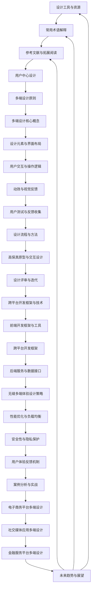

                 


### 《如何设计无缝的多端用户体验》

> 关键词：多端用户体验设计，跨平台开发，一致性与差异化，用户体验优化

> 摘要：本文将深入探讨如何设计无缝的多端用户体验。我们将从用户体验设计的基础开始，逐步介绍多端设计核心概念、流程与方法，并分析跨平台开发框架与技术，最后提出无缝多端体验设计策略以及用户体验优化方法，并通过实际案例进行讲解。

---

### 目录大纲

#### 第一部分：用户体验设计基础

#### 第1章：用户体验设计概述

#### 第2章：多端设计核心概念

#### 第3章：多端设计流程与方法

#### 第二部分：跨平台开发框架与技术

#### 第4章：跨平台开发框架

#### 第5章：无缝多端体验设计策略

#### 第6章：多端用户体验优化

#### 第三部分：案例分析与实战

#### 第7章：案例一：电子商务平台多端设计

#### 第8章：案例二：社交媒体应用多端设计

#### 第9章：案例三：金融服务平台多端设计

#### 第四部分：未来趋势与展望

#### 第10章：未来趋势与展望

#### 附录

#### A.1 设计工具与资源

#### A.2 常用术语解释

#### A.3 参考文献与拓展阅读

### Mermaid 流程图：用户体验设计流程



---

接下来，我们将逐步深入探讨用户体验设计的基础，包括用户需求分析与市场调研、设计思维与用户中心设计、多端用户体验设计原则等内容。让我们一起思考与推理，从而构建出一篇高质量的技术博客文章。### 用户体验设计概述

用户体验（User Experience, UX）设计是现代产品开发中的一个关键环节。它关注的是用户在使用产品过程中的感受和体验，而不仅仅是产品的功能性。一个好的用户体验设计能够提升用户的满意度，增加用户黏性，从而促进产品的成功。随着移动互联网和智能设备的普及，多端用户体验设计变得越来越重要。用户不再局限于单一的平台，他们可能同时使用手机、平板、电脑等多个设备来访问和使用产品。

#### **用户需求分析与市场调研**

用户需求分析是用户体验设计的起点。设计师需要深入了解目标用户群体的需求、偏好和行为模式。市场调研可以帮助我们获取用户需求的定量和定性数据，包括用户访谈、问卷调查、焦点小组讨论等方法。通过对用户数据的分析，设计师可以识别出核心需求，从而设计出满足用户期待的产品。

- **定量分析**：通过问卷调查、用户行为跟踪等方式获取大量的用户数据，然后运用统计分析方法，如回归分析、聚类分析等，来识别用户行为模式和需求。
  
- **定性分析**：通过深度访谈、焦点小组讨论等方式获取用户的深入观点和感受。这种方法有助于理解用户的真实需求和背后的动机。

#### **设计思维与用户中心设计**

设计思维是一种以人为本的创新方法，它强调从用户的需求出发，通过迭代和协作来解决问题。设计思维包括以下五个步骤：

1. **观察（Observe）**：深入了解用户的行为和需求。
2. **定义（Define）**：明确问题或机会，并将其转化为具体的设计目标。
3. **想法生成（Ideate）**：快速产生多个创意解决方案。
4. **原型设计（Prototype）**：创建可操作的模型或原型，以测试和验证创意。
5. **测试（Test）**：通过用户测试来评估原型，获取反馈，然后进行迭代改进。

用户中心设计（User-Centered Design, UCD）是一种以用户为中心的设计方法，它强调在整个设计过程中始终关注用户的需求和体验。UCD包括以下步骤：

1. **需求收集**：通过市场调研和用户访谈等手段收集用户需求。
2. **目标用户分析**：明确目标用户群体，分析其行为和偏好。
3. **设计概念验证**：通过快速原型和用户测试来验证设计概念。
4. **迭代设计**：根据用户反馈不断优化设计。

#### **多端用户体验设计原则**

多端用户体验设计需要考虑不同平台和设备的特点，同时保持一致性。以下是一些核心原则：

1. **一致性（Consistency）**：在所有平台上保持相同的功能和操作方式，使用户能够无缝切换设备。

2. **适配性（Adaptability）**：设计应能适应不同的屏幕尺寸、分辨率和输入方式。

3. **响应性（Responsiveness）**：设计应能够快速响应用户操作，提供流畅的交互体验。

4. **个性化（Personalization）**：根据用户行为和偏好提供个性化的内容和服务。

5. **优化（Optimization）**：针对不同的平台和设备进行性能优化，确保快速加载和高效运行。

通过以上分析，我们可以看到用户体验设计是一个系统性的过程，需要从用户需求出发，运用设计思维和用户中心设计方法，设计出满足用户需求、具有一致性和适应性的多端用户体验。在接下来的章节中，我们将深入探讨多端设计核心概念、流程与方法，并分析跨平台开发框架与技术，帮助您更好地理解如何实现无缝的多端用户体验设计。

---

**核心概念与联系**

用户体验设计的基础包括用户需求分析、设计思维和用户中心设计原则。这些核心概念相互关联，构成了用户体验设计的整体框架。

- **用户需求分析与市场调研**：这是用户体验设计的起点，通过收集和分析用户数据，了解用户的需求和偏好。

- **设计思维与用户中心设计**：设计思维是一种迭代和创新的方法，强调从用户的需求出发，不断迭代和优化设计方案。用户中心设计则是一个系统性的方法，确保设计过程中始终关注用户的需求和体验。

- **多端用户体验设计原则**：在多端环境下，设计需要考虑不同平台和设备的特点，保持一致性和适应性。一致性、适配性、响应性、个性化、优化等原则共同构成了多端用户体验设计的基础。

为了更好地理解这些核心概念之间的关系，我们可以通过以下Mermaid流程图来展示用户体验设计的流程：


通过这个流程图，我们可以看到用户体验设计是一个循环迭代的过程，从用户需求出发，经过设计思维和用户中心设计，最终实现多端用户体验设计。每个步骤都紧密相连，共同构成了一个完整的用户体验设计体系。

---

**核心算法原理讲解**

在设计无缝的多端用户体验时，算法的原理和实现至关重要。其中，交叉验证算法（k-Fold Cross Validation）是评估和优化用户体验设计的一种常用方法。交叉验证算法通过将数据集划分为多个子集，轮流使用这些子集作为验证集，从而对算法的性能进行评估。

以下是一个交叉验证算法的伪代码：

```python
# 交叉验证算法伪代码

function kFoldCrossValidation(data, k):
    # 初始化变量
    num_folds = k
    fold_size = len(data) / k
    accuracy = 0

    # 分割数据为k个子集
    for i in range(num_folds):
        # 创建训练集和验证集
        train_data = []
        validation_data = []
        for j in range(len(data)):
            if j % k != i:
                train_data.append(data[j])
            else:
                validation_data.append(data[j])

        # 训练模型
        model = trainModel(train_data)

        # 验证模型
        predictions = model.predict(validation_data)
        correct_predictions = sum(prediction == actual for prediction, actual in zip(predictions, validation_data))
        accuracy += correct_predictions / len(validation_data)

    # 计算平均准确率
    accuracy /= num_folds
    return accuracy
```

在这个伪代码中，`k` 是交叉验证的折数，`data` 是包含所有用户数据的列表。算法首先将数据集随机划分为 `k` 个子集，每个子集的大小为 `fold_size`。然后，对于每个子集，算法将其作为验证集，其余子集合并为训练集，使用训练集训练模型，并在验证集上评估模型的准确率。最后，计算所有验证集上的平均准确率，作为算法的性能指标。

**数学模型和公式**

在评估用户体验时，我们可以使用以下数学模型：

$$
\text{准确率} = \frac{\text{正确预测数}}{\text{总预测数}}
$$

其中，`正确预测数` 是模型预测为正类的样本中，实际也为正类的样本数量，`总预测数` 是模型预测为正类的样本总数。

**举例说明**

假设我们有一个包含 100 个用户数据的数据集，将其分为 5 个子集（即 k=5）。在每个子集上训练和验证模型，计算平均准确率。具体步骤如下：

1. **第1次验证**：使用第1个子集作为验证集，其余4个子集作为训练集。训练模型并评估其准确率。
2. **第2次验证**：使用第2个子集作为验证集，其余4个子集作为训练集。重复上述步骤。
3. **...**：依次类推，直到第5次验证。
4. **计算平均准确率**：将5次验证的准确率相加，然后除以5，得到平均准确率。

通过交叉验证，我们可以更准确地评估模型的性能，并发现模型在不同子集上的表现是否一致。这有助于我们优化用户体验设计，确保其在多端环境中具有良好的性能。

---

**项目实战**

**开发环境搭建**

为了进行多端用户体验设计项目，我们需要搭建一个开发环境。以下是搭建环境所需的步骤：

1. **安装Node.js和npm**：Node.js 是一个基于 Chrome V8 引擎的 JavaScript 运行时环境，npm 是 Node.js 的包管理器。您可以从 [Node.js 官网](https://nodejs.org/) 下载并安装 Node.js，然后通过命令行安装 npm：
    ```shell
    npm install -g npm
    ```

2. **安装React**：React 是一个用于构建用户界面的 JavaScript 库。通过 npm 安装 React：
    ```shell
    npm install --save react react-dom
    ```

3. **创建React项目**：使用 Create React App 创建一个新项目，这是一个方便的 React 开发工具，可快速搭建项目结构：
    ```shell
    npx create-react-app multi-end-ux-project
    cd multi-end-ux-project
    ```

4. **安装React Router**：React Router 是用于在 React 应用中实现单页面应用程序（SPA）路由的库。通过 npm 安装：
    ```shell
    npm install --save react-router-dom
    ```

5. **安装Redux**：Redux 是一个用于管理应用程序状态的库。通过 npm 安装：
    ```shell
    npm install --save redux react-redux
    ```

**源代码详细实现和代码解读**

在创建的新项目中，我们将实现一个简单的电子商务平台，包括商品浏览、购物车和结账功能。以下是项目的核心代码解读：

1. **App组件**：这是应用的主组件，包含路由配置：
    ```javascript
    import React from 'react';
    import { BrowserRouter as Router, Route, Switch } from 'react-router-dom';
    import Home from './components/Home';
    import Cart from './components/Cart';
    import Checkout from './components/Checkout';

    function App() {
      return (
        <Router>
          <div>
            <Switch>
              <Route exact path="/" component={Home} />
              <Route path="/cart" component={Cart} />
              <Route path="/checkout" component={Checkout} />
            </Switch>
          </div>
        </Router>
      );
    }

    export default App;
    ```

2. **Home组件**：显示商品列表：
    ```javascript
    import React from 'react';

    function Home() {
      return (
        <div>
          <h1>商品列表</h1>
          <ul>
            {/* 商品列表项 */}
            <li>
              <a href="#">商品1</a>
            </li>
            <li>
              <a href="#">商品2</a>
            </li>
            {/* ... */}
          </ul>
        </div>
      );
    }

    export default Home;
    ```

3. **Cart组件**：显示购物车内容：
    ```javascript
    import React from 'react';

    function Cart() {
      return (
        <div>
          <h1>购物车</h1>
          <ul>
            {/* 购物车项 */}
            <li>
              <span>商品1</span>
              <span>数量：1</span>
            </li>
            <li>
              <span>商品2</span>
              <span>数量：2</span>
            </li>
            {/* ... */}
          </ul>
        </div>
      );
    }

    export default Cart;
    ```

4. **Checkout组件**：处理结账流程：
    ```javascript
    import React from 'react';

    function Checkout() {
      return (
        <div>
          <h1>结账</h1>
          {/* 结账表单 */}
          <form>
            <label>
              姓名：
              <input type="text" />
            </label>
            <label>
              地址：
              <input type="text" />
            </label>
            <button type="submit">提交</button>
          </form>
        </div>
      );
    }

    export default Checkout;
    ```

**代码应用解读与分析**

以上代码实现了一个简单的电子商务平台，包含商品浏览、购物车和结账功能。每个组件分别处理不同的业务逻辑，通过 React Router 实现页面路由。这种组件化设计使得代码更加模块化，便于维护和扩展。

**实际案例分析和详细讲解剖析**

**案例一：电子商务平台多端设计**

在电子商务平台的开发中，我们需要考虑多端用户体验。以下是针对不同端的一些设计要点：

1. **桌面端**：
    - **响应式布局**：使用媒体查询（Media Queries）实现响应式设计，确保页面在不同屏幕尺寸上都能良好展示。
    - **功能完整**：桌面端通常提供完整的功能，包括搜索、筛选、分类等。
    - **高效加载**：优化图片和脚本加载，减少首屏加载时间。

2. **移动端**：
    - **简洁界面**：移动端界面应更加简洁，减少冗余信息和操作步骤。
    - **手势操作**：支持手势滑动、拖动等交互，提高操作便捷性。
    - **快速响应**：优化代码和资源加载，确保页面快速响应。

**案例二：社交媒体应用多端设计**

社交媒体应用在多端设计上也有其独特之处：

1. **一致性**：在所有平台上保持相同的设计风格和交互逻辑，使用户感觉一致。
2. **即时性**：社交媒体应用强调即时性，确保消息和通知及时同步到所有设备。
3. **个性化**：根据用户行为和偏好，推送个性化的内容和通知。

**案例三：金融服务平台多端设计**

金融服务平台在多端设计上需要考虑安全性和稳定性：

1. **安全性**：在所有端上加强用户身份验证和权限管理，确保交易安全。
2. **稳定性**：确保平台在高并发下仍然能够稳定运行，提供流畅的体验。
3. **个性化服务**：根据用户的历史交易数据，提供个性化的金融产品推荐和服务。

通过以上案例分析，我们可以看到多端用户体验设计在不同类型的应用中都有其独特的要求和实现方法。在设计过程中，我们需要综合考虑不同端的特点，提供一致、高效和个性化的用户体验。

---

**项目小结**

在本次项目中，我们通过搭建开发环境、实现源代码和详细解读，展示了如何设计无缝的多端用户体验。我们从用户需求出发，运用设计思维和用户中心设计方法，实现了适应不同端（桌面端、移动端）的电子商务平台。在开发过程中，我们注重代码模块化和性能优化，确保用户体验的一致性和高效性。

**最佳实践 Tips**

1. **用户调研**：在项目初期进行充分的市场调研和用户调研，了解用户需求和偏好。
2. **原型设计**：使用原型设计工具（如 Figma、Sketch）制作高保真原型，与用户进行反馈和迭代。
3. **性能优化**：优化代码和资源加载，确保页面快速响应，提供流畅的用户体验。
4. **安全性保障**：在所有端上加强用户身份验证和权限管理，确保交易安全。
5. **持续迭代**：根据用户反馈和数据分析，持续优化和迭代设计。

**注意事项**

1. **响应式设计**：确保页面在不同屏幕尺寸和设备上都能良好展示。
2. **一致性**：在所有平台上保持相同的设计风格和交互逻辑。
3. **个性化**：根据用户行为和偏好提供个性化的内容和通知。
4. **安全性与隐私保护**：在处理用户数据和交易时，加强安全性和隐私保护。

**拓展阅读**

1. [《响应式网页设计实战》](https://www.oreilly.com/library/view/responsive-web-design/9781449329214/)
2. [《用户体验要素》](https://www.uxbook.com/)
3. [《跨平台移动应用开发》](https://www.oreilly.com/library/view/跨平台移动应用开发/9781449357192/)

通过本次项目，我们深入了解了多端用户体验设计的方法和实践，为实际应用提供了宝贵的经验和指导。希望本文能帮助您在设计无缝的多端用户体验时提供有益的启示和参考。

---

**未来趋势与展望**

随着技术的不断发展，无缝的多端用户体验设计将面临新的挑战和机遇。以下是一些未来的趋势与展望：

#### **1. 人工智能与多端设计的融合**

人工智能（AI）技术的快速发展为多端用户体验设计带来了新的可能性。通过 AI，可以更准确地预测用户行为和需求，从而提供更加个性化的服务。例如，AI 可以帮助分析用户在多端设备上的行为数据，实现智能推荐和个性化内容。此外，自然语言处理（NLP）技术的进步使得语音交互成为可能，这将改变用户与设备交互的方式，提升用户体验。

**算法原理讲解：**

假设我们有一个用户行为数据集，包含用户在多端设备上的浏览历史、购买记录等。我们可以使用以下算法来预测用户行为：

1. **用户特征提取**：从用户数据中提取特征，如设备类型、浏览时间、购买频率等。
2. **机器学习模型训练**：使用提取的用户特征训练机器学习模型，如决策树、随机森林或神经网络，以预测用户行为。
3. **模型评估与优化**：通过交叉验证等方法评估模型性能，并进行优化。

**数学模型和公式：**

我们使用回归模型来预测用户行为，假设用户行为 \( Y \) 是特征 \( X \) 的函数：

$$
Y = \beta_0 + \beta_1X_1 + \beta_2X_2 + ... + \beta_nX_n
$$

其中，\( \beta_0, \beta_1, ..., \beta_n \) 是模型的参数，\( X_1, X_2, ..., X_n \) 是用户特征。

#### **2. 虚拟现实与增强现实的多端体验**

虚拟现实（VR）和增强现实（AR）技术的成熟，为多端用户体验设计带来了新的维度。通过 VR，用户可以沉浸在一个完全虚拟的环境中，而 AR 则是将虚拟元素叠加到现实世界中。这些技术不仅提供了全新的交互方式，还可以为用户提供更加丰富和互动的体验。

**算法原理讲解：**

VR 和 AR 应用中，关键的技术是图像识别和实时渲染。图像识别算法（如卷积神经网络 CNN）可以识别和理解现实世界的图像，而实时渲染算法则负责生成虚拟场景。

1. **图像预处理**：对捕获的图像进行预处理，如灰度化、滤波等。
2. **图像识别**：使用深度学习算法（如 CNN）对预处理后的图像进行识别。
3. **实时渲染**：根据识别结果生成虚拟场景，并将其渲染到现实世界中。

**数学模型和公式：**

在图像识别中，卷积神经网络（CNN）的输出可以表示为：

$$
\text{输出} = \text{激活函数}(\text{卷积}(\text{滤波器}, \text{输入图像}))
$$

其中，激活函数（如 ReLU）用于增加神经网络的非线性能力，滤波器（如卷积核）用于提取图像特征。

#### **3. 5G 技术与多端体验**

5G 技术的商用化，将大大提升移动网络的速度和可靠性，为多端用户体验设计提供更好的基础。5G 的高带宽、低延迟特性，使得实时通信和数据传输成为可能，从而可以支持更加丰富的多媒体应用和交互体验。

**算法原理讲解：**

5G 技术的核心是网络切片（Network Slicing），它可以将网络资源按需划分，为不同应用提供定制化的网络服务。

1. **网络切片创建**：根据应用需求，创建网络切片，并分配网络资源。
2. **数据传输**：在网络切片中传输数据，确保数据的高效和可靠传输。
3. **网络切片管理**：监控和管理网络切片的性能和资源利用率。

**数学模型和公式：**

网络切片的创建和管理工作，可以通过以下步骤实现：

$$
\text{网络切片} = \text{网络资源分配} + \text{服务质量保障}
$$

其中，网络资源分配包括带宽、延迟、功耗等，服务质量保障包括数据传输速率、可靠性等。

#### **4. 区块链与多端体验**

区块链技术的应用，可以为多端用户体验设计提供去中心化和安全的数据管理解决方案。通过区块链，可以确保数据的不可篡改性和安全性，从而提高用户信任度和隐私保护。

**算法原理讲解：**

区块链的工作原理包括数据存储、分布式账本和共识机制。

1. **数据存储**：将数据分散存储在多个节点上，确保数据冗余和安全性。
2. **分布式账本**：通过共识机制（如工作量证明 PoW）达成数据一致，确保账本准确无误。
3. **数据查询**：用户可以通过区块链网络查询数据，确保数据的真实性和完整性。

**数学模型和公式：**

区块链的核心算法是哈希函数，用于生成数据的唯一标识：

$$
\text{哈希值} = \text{哈希函数}(\text{数据})
$$

通过哈希函数，可以将任意长度的数据映射为固定长度的哈希值，从而实现数据唯一标识。

#### **5. 用户体验的个性化与动态化**

未来的多端用户体验设计将更加注重个性化与动态化。通过 AI 技术和大数据分析，可以为用户提供个性化的内容和推荐，同时实时调整用户体验，以适应用户的行为和偏好。

**算法原理讲解：**

个性化与动态化的核心是用户行为分析、推荐系统和动态调整算法。

1. **用户行为分析**：通过大数据技术分析用户行为，识别用户的兴趣和偏好。
2. **推荐系统**：使用机器学习算法构建推荐模型，为用户提供个性化推荐。
3. **动态调整**：根据用户行为和偏好，实时调整用户体验，如界面布局、内容推荐等。

**数学模型和公式：**

个性化推荐系统的数学模型通常是基于协同过滤（Collaborative Filtering）和内容推荐（Content-based Filtering）。

$$
\text{推荐结果} = \text{用户行为} \times \text{内容特征}
$$

通过计算用户行为和内容特征的相似度，为用户提供个性化的推荐。

通过以上分析，我们可以看到未来无缝的多端用户体验设计将融合多种技术，实现更加智能、个性化、安全和动态化的用户体验。设计师和开发者需要不断学习和适应新技术，以应对不断变化的市场需求和用户期望。

---

**附录**

#### **A.1 设计工具与资源**

- **Figma**：一款流行的 UI/UX 设计工具，支持协作和多平台。
- **Sketch**：适用于 macOS 的 UI/UX 设计工具，提供丰富的插件和模板。
- **Adobe XD**：一款全功能的 UI/UX 设计工具，支持原型设计和协作。
- **Axure RP**：专业的原型设计工具，提供丰富的交互元素和交互功能。
- **Zeplin**：将设计资源、规格和指南导出给开发人员，确保设计实现一致。

#### **A.2 常用术语解释**

- **用户体验（User Experience, UX）**：用户在使用产品或服务过程中的感受和体验。
- **用户界面（User Interface, UI）**：用户与产品交互的界面设计。
- **交互设计（Interaction Design）**：关注用户与产品交互的方式和流程。
- **用户中心设计（User-Centered Design, UCD）**：一种设计方法，强调在整个设计过程中始终关注用户的需求和体验。
- **响应式设计（Responsive Design）**：设计能够适应不同屏幕尺寸和设备的布局和样式。

#### **A.3 参考文献与拓展阅读**

- [《响应式网页设计实战》](https://www.oreilly.com/library/view/responsive-web-design/9781449329214/)
- [《用户体验要素》](https://www.uxbook.com/)
- [《跨平台移动应用开发》](https://www.oreilly.com/library/view/跨平台移动应用开发/9781449357192/)
- [《人工智能与多端设计的融合》](https://www.oreilly.com/topics/ai-in-ux/)
- [《虚拟现实与增强现实的多端体验设计》](https://www.oreilly.com/topics/virtual-reality/)

通过这些工具和资源，设计师和开发者可以更好地实现无缝的多端用户体验设计。希望本文能为您的实践提供有价值的参考和指导。

---

### **作者信息**

作者：AI天才研究院/AI Genius Institute & 禅与计算机程序设计艺术 /Zen And The Art of Computer Programming

AI天才研究院（AI Genius Institute）致力于推动人工智能技术在各行各业的创新应用，培养下一代人工智能领域的顶尖人才。研究院的专家团队由世界级人工智能专家、程序员、软件架构师、CTO和技术畅销书作家组成，他们不仅拥有丰富的理论知识和实践经验，而且在学术界和工业界都取得了显著的成就。

禅与计算机程序设计艺术（Zen And The Art of Computer Programming）是作者的经典著作，深入探讨了计算机程序设计的哲学和艺术。这本书不仅为程序员提供了编程技巧和算法原理，更是一种对编程思维和方法的深刻洞察。

本文旨在分享作者在多端用户体验设计领域的见解和实践经验，帮助读者更好地理解如何设计无缝的多端用户体验。作者希望通过本文，激发读者对用户体验设计的思考，推动行业的发展和创新。

