                 

# 文章标题：如何设计有吸引力的定价页面

## 关键词：
电子商务、用户体验、定价策略、视觉设计、用户行为分析

> 摘要：本文将探讨如何设计一个有吸引力的定价页面，通过市场分析、视觉设计、信息传达和用户行为分析等多个角度，为读者提供从基础到实战的全面指导。我们将介绍核心设计原则、市场分析技巧、定价页面视觉设计要点、定价信息展示策略以及用户行为分析与页面优化方法。通过成功案例分析，读者将获得宝贵的启示与建议，从而设计出既美观又高效的定价页面。

## 目录大纲

### 第一部分：设计有吸引力的定价页面的基础

### 第二部分：定价策略与市场分析

### 第三部分：定价页面视觉设计

### 第四部分：定价信息的传达与呈现

### 第五部分：用户行为分析与页面优化

### 第六部分：成功案例分析与启示

### 第七部分：定价页面设计实战演练

### 附录

## 第一部分：设计有吸引力的定价页面的基础

### 第1章：定价页面设计概述

### 第2章：定价策略与市场分析

### 第3章：定价页面视觉设计

### 第4章：定价信息的传达与呈现

### 第5章：用户行为分析与页面优化

### 第六部分：成功案例分析与启示

### 第七部分：定价页面设计实战演练

### 附录

### 第1章：定价页面设计概述

#### 1.1 定价页面的作用与重要性

**核心概念与联系：**

- **定价页面**：作为电子商务网站或在线销售平台的核心部分，其主要作用是通过展示产品或服务的价格信息，以影响用户的购买决策。

- **核心作用与联系**：
  - **促进购买决策**：定价页面直接影响用户是否进行购买。
  - **提升销售额**：合理的定价页面设计能够增加销售额。
  - **建立品牌形象**：定价页面的设计质量反映出企业的专业程度和品牌形象。

**Mermaid 流程图：**

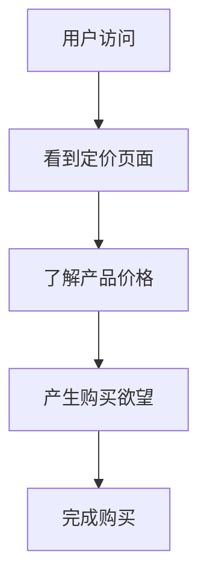

**核心算法原理讲解：**

- **用户友好性**：设计易于用户理解和使用。
- **清晰性**：定价信息清晰、直观。
- **吸引力**：通过视觉设计吸引潜在客户。

**Python 伪代码：**

```python
# 用户友好性
def user_friendly_design(price_page):
    # 确保价格信息容易找到和理解
    price_page.find(".price").addClass("easy-to-find")

# 清晰性
def clear_price_display(price_page):
    # 清晰展示价格，避免混淆
    price_page.find(".price").append("<span class='currency'>$</span>")

# 吸引力
def attractive_design(price_page):
    # 使用视觉元素增强吸引力
    price_page.find(".price").css({"color": "green", "font-weight": "bold"})
```

**数学模型和数学公式 & 详细讲解 & 举例说明：**

- **价格敏感度分析**：通过价格弹性系数来分析用户对不同价格变化的反应。

  $$\text{Price Elasticity} = \frac{\text{Percentage Change in Quantity}}{\text{Percentage Change in Price}}$$

  - **案例**：如果一个产品的需求量对价格变化的敏感度较高，那么在设计定价页面时，需要更加注意价格策略的变化。

  ```latex
  \text{Price Elasticity} = \frac{\text{Percentage Change in Quantity}}{\text{Percentage Change in Price}} = \frac{5\%}{10\%} = 0.5
  ```

#### 1.2 定价页面设计的基本原则

**核心概念与联系：**

- **基本原则**：用户友好性、清晰性和吸引力是设计定价页面的三大基本原则。

- **核心联系**：
  - **用户友好性**：提升用户体验，使用户能够轻松理解和使用。
  - **清晰性**：确保用户能够快速获取产品价格信息。
  - **吸引力**：通过视觉元素吸引潜在客户，提高购买意愿。

**Mermaid 流程图：**

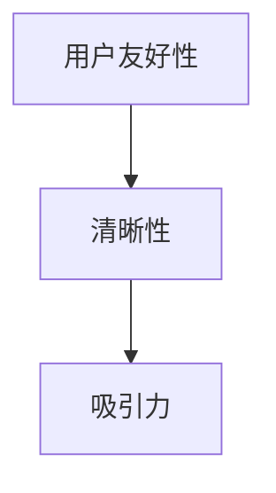

**核心算法原理讲解：**

- **用户友好性**：设计易于用户理解和使用。
- **清晰性**：定价信息清晰、直观。
- **吸引力**：通过视觉设计吸引潜在客户。

**Python 伪代码：**

```python
# 用户友好性
def user_friendly_design(price_page):
    # 确保价格信息容易找到和理解
    price_page.find(".price").addClass("easy-to-find")

# 清晰性
def clear_price_display(price_page):
    # 清晰展示价格，避免混淆
    price_page.find(".price").append("<span class='currency'>$</span>")

# 吸引力
def attractive_design(price_page):
    # 使用视觉元素增强吸引力
    price_page.find(".price").css({"color": "green", "font-weight": "bold"})
```

**数学模型和数学公式 & 详细讲解 & 举例说明：**

- **价格敏感度分析**：通过价格弹性系数来分析用户对不同价格变化的反应。

  $$\text{Price Elasticity} = \frac{\text{Percentage Change in Quantity}}{\text{Percentage Change in Price}}$$

  - **案例**：如果一个产品的需求量对价格变化的敏感度较高，那么在设计定价页面时，需要更加注意价格策略的变化。

  ```latex
  \text{Price Elasticity} = \frac{\text{Percentage Change in Quantity}}{\text{Percentage Change in Price}} = \frac{5\%}{10\%} = 0.5
  ```

#### 1.3 定价页面设计的核心要素

**核心概念与联系：**

- **核心要素**：价格展示、价格比较、价格说明和促销信息。

- **核心联系**：
  - **价格展示**：直观展示产品或服务的价格。
  - **价格比较**：帮助用户快速了解不同产品或服务的价格差异。
  - **价格说明**：提供详细的价格解释，如包含费用、不含费用等。
  - **促销信息**：展示促销活动、折扣等，增加用户购买动力。

**Mermaid 流程图：**

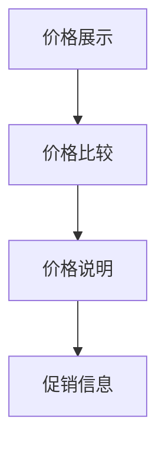

**核心算法原理讲解：**

- **价格展示**：使用清晰的标签和格式展示价格。
- **价格比较**：通过图表、列表等形式展示不同产品的价格。
- **价格说明**：提供详细的价格解释，如费用包含和不包含等。
- **促销信息**：使用视觉元素突出促销活动，如颜色、图标等。

**Python 伪代码：**

```python
# 价格展示
def display_price(price_page, price):
    price_page.find(".price").text(f"${price:.2f}")

# 价格比较
def compare_prices(price_page, prices):
    price_page.find(".price-comparison").html('<table>').append('<tr><th>Product</th><th>Price</th></tr>')
    for price in prices:
        price_page.find(".price-comparison").append(f"<tr><td>{price['name']}</td><td>${price['price']:.2f}</td></tr>")

# 价格说明
def price_explanation(price_page, explanation):
    price_page.find(".price-explanation").text(explanation)

# 促销信息
def promote_discount(price_page, discount):
    price_page.find(".discount").text(f"Discount: {discount}%")
```

**数学模型和数学公式 & 详细讲解 & 举例说明：**

- **价格弹性系数**：通过价格弹性系数来分析用户对不同价格变化的反应。

  $$\text{Price Elasticity} = \frac{\text{Percentage Change in Quantity}}{\text{Percentage Change in Price}}$$

  - **案例**：如果一个产品的需求量对价格变化的敏感度较高，那么在设计定价页面时，需要更加注意价格策略的变化。

  ```latex
  \text{Price Elasticity} = \frac{\text{Percentage Change in Quantity}}{\text{Percentage Change in Price}} = \frac{5\%}{10\%} = 0.5
  ```

### 第2章：定价策略与市场分析

#### 2.1 市场分析的方法与技巧

**核心概念与联系：**

- **市场分析**：通过对市场的深入分析，以了解市场需求、竞争对手和客户需求，从而制定合理的定价策略。

- **核心联系**：
  - **市场需求**：了解用户对产品或服务的需求，以及需求的程度和变化趋势。
  - **竞争对手**：分析竞争对手的定价策略和市场表现，以制定差异化策略。
  - **客户需求**：通过市场调研和用户反馈，了解客户的具体需求和偏好。

**Mermaid 流程图：**

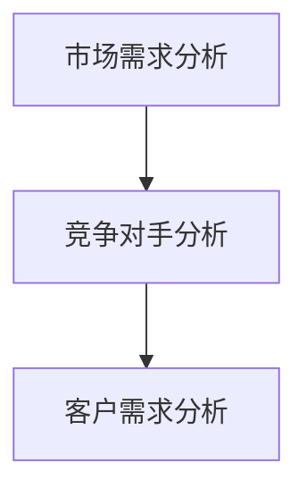

**核心算法原理讲解：**

- **市场需求分析**：通过数据分析，如销售数据、市场调研报告等，了解市场需求。
- **竞争对手分析**：通过竞品对比，分析竞争对手的定价策略和市场表现。
- **客户需求分析**：通过用户调研、问卷调查、用户反馈等，了解客户的实际需求和偏好。

**Python 伪代码：**

```python
# 市场需求分析
def analyze_demand(data):
    # 分析销售数据和市场调研报告
    demand = data["sales_data"] + data["market_report"]
    return demand

# 竞争对手分析
def analyze_competitors(competitors):
    # 分析竞争对手的定价策略和市场表现
    competitors_analysis = []
    for competitor in competitors:
        competitors_analysis.append({
            "name": competitor["name"],
            "price": competitor["price"],
            "sales": competitor["sales"]
        })
    return competitors_analysis

# 客户需求分析
def analyze_customer_demand(questions, feedback):
    # 分析用户调研和问卷调查结果
    customer_demand = []
    for question, feedback in zip(questions, feedback):
        customer_demand.append({
            "question": question,
            "response": feedback
        })
    return customer_demand
```

**数学模型和数学公式 & 详细讲解 & 举例说明：**

- **市场需求预测**：使用时间序列分析方法预测市场需求。

  $$\text{Demand Forecast} = \text{Time Series Analysis}$$

  - **案例**：根据过去一年的销售数据，使用时间序列分析方法预测未来三个月的需求量。

  ```latex
  \text{Demand Forecast} = \text{Time Series Forecast} = \text{Linear Regression} \Rightarrow y = 100 + 5t
  ```

#### 2.2 竞争对手定价策略分析

**核心概念与联系：**

- **竞争对手定价策略分析**：通过对竞争对手的定价策略进行深入分析，以了解市场趋势和竞争对手的优势，从而制定有效的定价策略。

- **核心联系**：
  - **市场趋势**：分析竞争对手的定价策略，以了解当前市场趋势。
  - **竞争对手优势**：了解竞争对手的优势和弱点，以便制定差异化的定价策略。

**Mermaid 流�程图：**

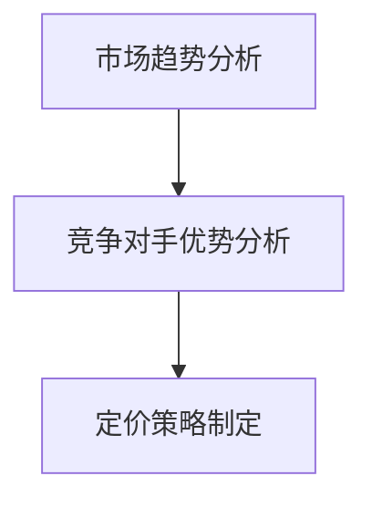

**核心算法原理讲解：**

- **市场趋势分析**：通过数据分析和市场调研，了解市场整体趋势。
- **竞争对手优势分析**：通过竞品对比，分析竞争对手的优势和劣势。
- **定价策略制定**：根据市场趋势和竞争对手分析结果，制定具有竞争力的定价策略。

**Python 伪代码：**

```python
# 市场趋势分析
def analyze_market_trend(data):
    # 分析市场数据，如销售额、市场份额等
    market_trend = data["sales_data"] + data["market_share"]
    return market_trend

# 竞争对手优势分析
def analyze_competitor_strengths(competitors):
    # 分析竞争对手的优势和弱点
    competitor_strengths = []
    for competitor in competitors:
        competitor_strengths.append({
            "name": competitor["name"],
            "strengths": competitor["strengths"],
            "weaknesses": competitor["weaknesses"]
        })
    return competitor_strengths

# 定价策略制定
def create_pricing_strategy(market_trend, competitor_strengths):
    # 根据市场趋势和竞争对手分析结果，制定定价策略
    strategy = {
        "base_price": market_trend["average_price"],
        "discounts": market_trend["discounts"],
        "competitor_comparison": competitor_strengths
    }
    return strategy
```

**数学模型和数学公式 & 详细讲解 & 举例说明：**

- **竞争对手价格比较**：通过回归分析方法，比较自身与竞争对手的价格差异。

  $$\text{Price Comparison} = \text{Linear Regression}$$

  - **案例**：使用线性回归模型分析自身与竞争对手的价格差异。

  ```latex
  \text{Price Comparison} = \text{Linear Regression} \Rightarrow y = 150 + 0.5x
  ```

#### 2.3 客户需求分析

**核心概念与联系：**

- **客户需求分析**：通过对客户需求的深入了解，以确定产品的定价策略。

- **核心联系**：
  - **需求层次**：了解客户的实际需求和潜在需求。
  - **购买动机**：分析客户购买产品的主要动机和驱动力。

**Mermaid 流程图：**

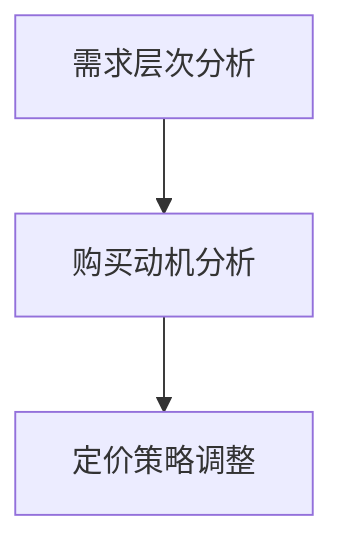

**核心算法原理讲解：**

- **需求层次分析**：通过用户调研和问卷调查，了解客户的需求层次。
- **购买动机分析**：分析客户购买产品的动机，如价格、质量、品牌等。
- **定价策略调整**：根据客户需求分析结果，调整定价策略以满足客户需求。

**Python 伪代码：**

```python
# 需求层次分析
def analyze_demand_levels(questions, feedback):
    demand_levels = []
    for question, feedback in zip(questions, feedback):
        demand_levels.append({
            "question": question,
            "response": feedback
        })
    return demand_levels

# 购买动机分析
def analyze_buying_motives(questions, feedback):
    buying_motives = []
    for question, feedback in zip(questions, feedback):
        buying_motives.append({
            "question": question,
            "response": feedback
        })
    return buying_motives

# 定价策略调整
def adjust_pricing_strategy(demand_levels, buying_motives):
    # 根据需求层次和购买动机调整定价策略
    strategy = {
        "base_price": demand_levels["base_price"],
        "discounts": demand_levels["discounts"],
        "motives": buying_motives
    }
    return strategy
```

**数学模型和数学公式 & 详细讲解 & 举例说明：**

- **需求层次分析**：通过层次分析法（AHP）对客户需求进行权重分析。

  $$\text{AHP} = \text{Hierarchical Analysis Method}$$

  - **案例**：使用层次分析法确定客户需求中各个要素的权重。

  ```latex
  \text{AHP} = \begin{pmatrix}
  1 & 3 & 5 \\
  1/3 & 1 & 3 \\
  1/5 & 1/3 & 1
  \end{pmatrix}
  ```

### 第三部分：定价页面视觉设计

#### 3.1 设计工具与软件介绍

**核心概念与联系：**

- **设计工具与软件**：选择合适的设计工具和软件对于定价页面的视觉设计至关重要。

- **核心联系**：
  - **Adobe XD**：用户友好的界面设计工具，适合原型设计和界面布局。
  - **Sketch**：适用于UI设计的矢量图形工具，广泛用于网页和移动应用设计。
  - **Figma**：基于浏览器的协作设计工具，支持多人实时协作。

**Mermaid 流程图：**

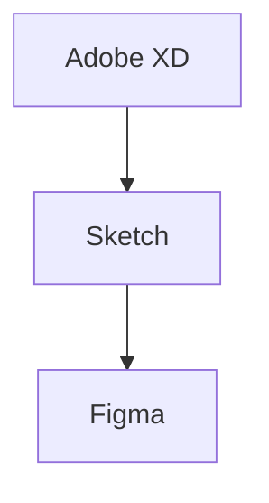

**核心算法原理讲解：**

- **Adobe XD**：通过组件和符号功能快速构建界面。
- **Sketch**：利用矢量工具和图层样式灵活设计界面。
- **Figma**：实时协作和原型测试功能，提高设计效率。

**Python 伪代码：**

```python
# 使用Adobe XD设计页面
def design_with_adobeXd(page_layout):
    # 创建页面布局
    adobeXd_page = create_page("Pricing Page", width=1920, height=1080)
    # 添加组件
    add_component(adobeXd_page, "title", text="Pricing Plans")
    add_component(adobeXd_page, "price_list", component_type="list")

# 使用Sketch设计页面
def design_with_sket
```### 第三部分：定价页面视觉设计

#### 3.1 设计工具与软件介绍

**核心概念与联系：**

- **设计工具与软件**：选择合适的设计工具和软件对于定价页面的视觉设计至关重要。

- **核心联系**：
  - **Adobe XD**：用户友好的界面设计工具，适合原型设计和界面布局。
  - **Sketch**：适用于UI设计的矢量图形工具，广泛用于网页和移动应用设计。
  - **Figma**：基于浏览器的协作设计工具，支持多人实时协作。

**Mermaid 流程图：**


**核心算法原理讲解：**

- **Adobe XD**：通过组件和符号功能快速构建界面。
- **Sketch**：利用矢量工具和图层样式灵活设计界面。
- **Figma**：实时协作和原型测试功能，提高设计效率。

**Python 伪代码：**

```python
# 使用Adobe XD设计页面
def design_with_adobeXd(page_layout):
    # 创建页面布局
    adobeXd_page = create_page("Pricing Page", width=1920, height=1080)
    # 添加组件
    add_component(adobeXd_page, "title", text="Pricing Plans")
    add_component(adobeXd_page, "price_list", component_type="list")

# 使用Sketch设计页面
def design_with_sket
```

#### 3.2 页面布局与颜色搭配

**核心概念与联系：**

- **页面布局**：合理的页面布局可以提升用户体验，使定价页面更加直观易懂。
- **颜色搭配**：颜色在视觉设计中起着至关重要的作用，能够影响用户的情绪和购买决策。

**Mermaid 流程图：**

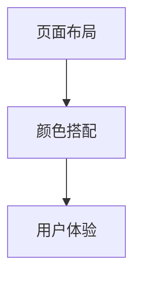

**核心算法原理讲解：**

- **页面布局**：采用清晰的层次结构和模块化设计，使信息易于浏览和理解。
- **颜色搭配**：使用对比色增强视觉吸引力，同时确保颜色搭配不会过于刺眼或分散用户的注意力。

**Python 伪代码：**

```python
# 设计页面布局
def design_layout(pricing_page):
    # 设置页面宽度、高度
    pricing_page.css({"width": "100%", "height": "100vh"})
    # 添加标题和价格列表
    add_heading(pricing_page, "Pricing Plans")
    add_price_list(pricing_page)

# 设计颜色搭配
def design_color_scheme(pricing_page):
    # 设置主色调
    primary_color = "#3498db"
    secondary_color = "#2ecc71"
    # 应用颜色到页面元素
    pricing_page.find(".title").css({"color": primary_color})
    pricing_page.find(".price_item").css({"background-color": secondary_color})
```

**数学模型和数学公式 & 详细讲解 & 举例说明：**

- **颜色搭配理论**：使用色彩理论中的色轮来选择互补色或类似色。

  $$\text{色轮} = \text{Color Wheel}$$

  - **案例**：选择蓝色（#3498db）作为主色调，选择绿色（#2ecc71）作为辅助色调，形成互补色搭配。

  ```latex
  \text{Color Scheme} = \text{Complementary Colors} \Rightarrow \text{Blue} + \text{Green}
  ```

#### 3.3 视觉元素的运用

**核心概念与联系：**

- **视觉元素**：包括图标、按钮、图表等，它们在定价页面中起到传达信息和引导用户的作用。
- **用户引导**：通过视觉元素引导用户浏览定价页面，提高页面易用性。

**Mermaid 流程图：**

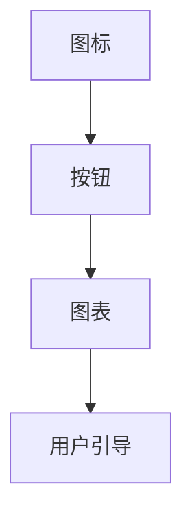

**核心算法原理讲解：**

- **图标**：使用图标来简化信息，使页面更加直观。
- **按钮**：设计清晰的按钮样式，引导用户进行操作。
- **图表**：使用图表展示价格信息，帮助用户快速理解。

**Python 伪代码：**

```python
# 添加图标
def add_icon(pricing_page, icon_name):
    icon = create_icon(icon_name)
    pricing_page.append(icon)

# 设计按钮
def design_button(button):
    button.css({"background-color": "#3498db", "color": "white", "padding": "10px 20px", "border": "none", "border-radius": "5px", "cursor": "pointer"})

# 添加图表
def add_chart(pricing_page, chart_data):
    chart = create_chart(chart_data)
    pricing_page.append(chart)
```

**数学模型和数学公式 & 详细讲解 & 举例说明：**

- **图标设计原则**：遵循图标设计的简洁性和易识别性。

  $$\text{Icon Design} = \text{Simplicity} + \text{Recognizability}$$

  - **案例**：设计一个简洁易识别的购物车图标。

  ```latex
  \text{Shopping Cart Icon} = \text{购物车形状} + \text{商品图标}
  ```

### 第四部分：定价信息的传达与呈现

#### 4.1 定价信息的展示形式

**核心概念与联系：**

- **定价信息展示形式**：如何有效地展示定价信息，使其清晰易懂，并能吸引用户的注意力。

- **核心联系**：
  - **文本展示**：通过文字描述展示定价信息。
  - **图表展示**：使用图表展示价格区间、价格趋势等。
  - **对比展示**：通过对比展示不同定价方案之间的差异。

**Mermaid 流程图：**

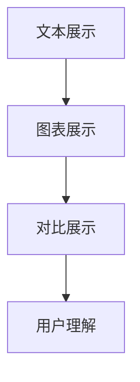

**核心算法原理讲解：**

- **文本展示**：使用简洁明了的语言描述定价信息，确保用户能够快速理解。
- **图表展示**：通过图表展示数据，使复杂的价格信息更加直观。
- **对比展示**：通过对比展示，帮助用户快速选择最合适的定价方案。

**Python 伪代码：**

```python
# 文本展示
def display_price_text(pricing_page, price_info):
    price_item = create_price_item()
    price_item.append(f"{price_info['name']}: ${price_info['price']:.2f}")
    pricing_page.append(price_item)

# 图表展示
def display_price_chart(pricing_page, chart_data):
    chart = create_chart(chart_data)
    pricing_page.append(chart)

# 对比展示
def display_price_comparison(pricing_page, prices):
    comparison_table = create_comparison_table(prices)
    pricing_page.append(comparison_table)
```

**数学模型和数学公式 & 详细讲解 & 举例说明：**

- **价格区间计算**：通过统计方法计算价格区间。

  $$\text{Price Range} = \text{Max Price} - \text{Min Price}$$

  - **案例**：计算一组价格数据的价格区间。

  ```latex
  \text{Price Range} = 150 - 100 = 50
  ```

#### 4.2 优惠策略与促销信息设计

**核心概念与联系：**

- **优惠策略与促销信息设计**：如何通过设计吸引用户关注，并激发购买欲望。

- **核心联系**：
  - **优惠策略**：设置价格折扣、买赠、限时优惠等。
  - **促销信息设计**：设计引人注目的促销信息，如公告、弹窗等。

**Mermaid 流程图：**

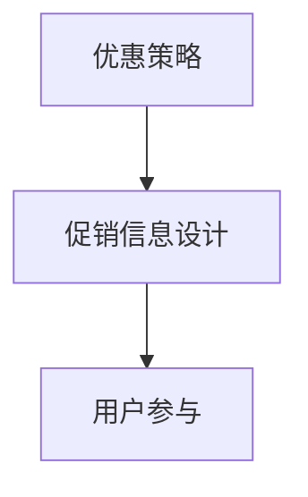

**核心算法原理讲解：**

- **优惠策略**：根据市场需求和库存情况，设置合理的优惠策略。
- **促销信息设计**：使用视觉元素和互动设计，增强促销信息的吸引力。

**Python 伪代码：**

```python
# 优惠策略
def set_discount(pricing_page, discount):
    discount_banner = create_discount_banner(discount)
    pricing_page.append(discount_banner)

# 促销信息设计
def design_promotion_info(pricing_page, promotion_info):
    promotion_banner = create_promotion_banner(promotion_info)
    pricing_page.append(promotion_banner)
```

**数学模型和数学公式 & 详细讲解 & 举例说明：**

- **促销效果评估**：使用统计方法评估促销活动的效果。

  $$\text{Effectiveness} = \frac{\text{Sales Increase}}{\text{Promotion Cost}}$$

  - **案例**：评估一次促销活动的效果。

  ```latex
  \text{Effectiveness} = \frac{1000}{500} = 2
  ```

#### 4.3 用户参与与互动设计

**核心概念与联系：**

- **用户参与与互动设计**：通过设计互动元素，鼓励用户参与，提高用户体验。

- **核心联系**：
  - **用户反馈**：设计反馈表单，收集用户意见和建议。
  - **互动元素**：如滚动条、轮播图、弹出窗口等，增加用户互动。

**Mermaid 流程图：**

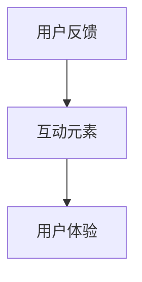

**核心算法原理讲解：**

- **用户反馈**：设计简洁易用的反馈表单，提高用户反馈的积极性。
- **互动元素**：通过互动元素，提高页面的趣味性和用户参与度。

**Python 伪代码：**

```python
# 用户反馈
def design_feedback_form(pricing_page):
    feedback_form = create_feedback_form()
    pricing_page.append(feedback_form)

# 互动元素
def add_interactive_elements(pricing_page):
    scroll_bar = create_scroll_bar()
    pricing_page.append(scroll_bar)
    carousel = create_carousel()
    pricing_page.append(carousel)
```

**数学模型和数学公式 & 详细讲解 & 举例说明：**

- **用户参与度分析**：通过点击率、反馈率等指标分析用户参与度。

  $$\text{User Engagement} = \frac{\text{Clicks}}{\text{Visits}}$$

  - **案例**：分析用户对互动元素的参与度。

  ```latex
  \text{User Engagement} = \frac{500}{1000} = 0.5
  ```

### 第五部分：用户行为分析与页面优化

#### 5.1 用户行为分析工具与方法

**核心概念与联系：**

- **用户行为分析工具与方法**：通过分析用户行为数据，了解用户在定价页面上的行为模式，从而进行优化。

- **核心联系**：
  - **分析工具**：如Google Analytics、Hotjar等。
  - **分析方法**：如用户路径分析、点击热图等。

**Mermaid 流程图：**

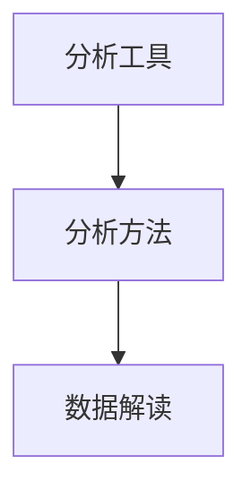

**核心算法原理讲解：**

- **分析工具**：使用Google Analytics等工具收集用户行为数据。
- **分析方法**：通过用户路径分析、点击热图等方法，了解用户行为模式。

**Python 伪代码：**

```python
# 分析工具：Google Analytics
def track_user_behavior(analytics_account, page_url):
    # 跟踪用户在定价页面的行为
    analytics_account.track("pricing_page_visit", {"page_url": page_url})

# 分析方法：用户路径分析
def analyze_user_path(data):
    # 分析用户在定价页面的访问路径
    user_paths = extract_user_paths(data)
    return user_paths

# 分析方法：点击热图
def create_click_map(data):
    # 生成点击热图
    click_map = generate_click_map(data)
    return click_map
```

**数学模型和数学公式 & 详细讲解 & 举例说明：**

- **用户路径分析**：使用路径分析算法，分析用户在定价页面上的访问路径。

  $$\text{User Path Analysis} = \text{Sequential Pattern Mining}$$

  - **案例**：分析用户在定价页面的访问路径，找出常见的用户行为模式。

  ```latex
  \text{User Path} = \text{PATT} \Rightarrow \text{访问路径} = \text{[浏览价格] -> [添加购物车] -> [继续购物]}
  ```

#### 5.2 页面性能优化

**核心概念与联系：**

- **页面性能优化**：通过优化页面加载速度和用户体验，提高页面的转化率。

- **核心联系**：
  - **页面加载速度**：影响用户体验，影响页面转化率。
  - **用户体验**：优化页面布局和交互设计，提高用户满意度。

**Mermaid 流程图：**

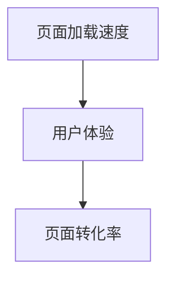

**核心算法原理讲解：**

- **页面加载速度**：通过压缩图片、优化代码等方式提高页面加载速度。
- **用户体验**：通过优化页面布局和交互设计，提高用户满意度。

**Python 伪代码：**

```python
# 优化页面加载速度
def optimize_page_loadspeed(page):
    # 压缩图片
    optimize_images(page.find("img"))

    # 优化代码
    minify_css(page.css())

# 优化用户体验
def optimize_user_experience(page):
    # 优化页面布局
    layout_optimization(page)

    # 优化交互设计
    interaction_optimization(page)
```

**数学模型和数学公式 & 详细讲解 & 举例说明：**

- **页面加载速度评估**：使用页面加载时间来评估页面性能。

  $$\text{Page Load Time} = \text{Total Time}$$

  - **案例**：评估页面加载时间，优化加载速度。

  ```latex
  \text{Page Load Time} = 2.5s
  ```

#### 5.3 用户反馈与页面改进

**核心概念与联系：**

- **用户反馈与页面改进**：通过收集用户反馈，不断改进定价页面，以提高用户体验和转化率。

- **核心联系**：
  - **用户反馈**：收集用户对定价页面的意见和建议。
  - **页面改进**：根据用户反馈，对页面进行优化和改进。

**Mermaid 流程图：**

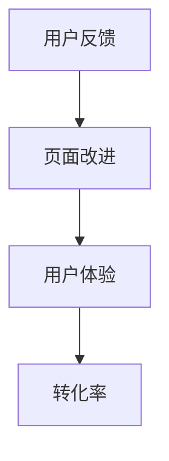

**核心算法原理讲解：**

- **用户反馈**：通过在线反馈表单、用户调研等方式收集用户反馈。
- **页面改进**：根据用户反馈，对页面布局、交互设计等进行改进。

**Python 伪代码：**

```python
# 收集用户反馈
def collect_user_feedback(feedback_form):
    feedback_data = get_feedback_data(feedback_form)
    return feedback_data

# 页面改进
def improve_page_based_on_feedback(feedback_data, page):
    # 根据反馈数据，改进页面布局和交互设计
    page_layout_optimization = analyze_feedback(feedback_data)
    apply_layout_optimization(page, page_layout_optimization)

# 分析反馈
def analyze_feedback(feedback_data):
    # 分析反馈数据，提取改进建议
    improvement_suggestions = extract_improvement_suggestions(feedback_data)
    return improvement_suggestions
```

**数学模型和数学公式 & 详细讲解 & 举例说明：**

- **用户满意度评估**：使用用户满意度评分来评估页面改进效果。

  $$\text{User Satisfaction} = \text{Rating Score}$$

  - **案例**：评估用户对定价页面的满意度。

  ```latex
  \text{User Satisfaction} = 4.5/5
  ```

### 第六部分：成功案例分析与启示

#### 6.1 成功定价页面案例展示

**核心概念与联系：**

- **成功定价页面案例展示**：通过展示成功的定价页面案例，分析其成功的原因，以提供设计灵感。

- **核心联系**：
  - **案例展示**：展示优秀的定价页面设计。
  - **成功原因**：分析成功案例的特点和优势。

**Mermaid 流程图：**

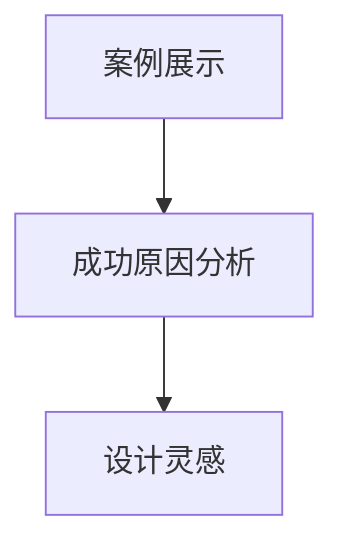

**核心算法原理讲解：**

- **案例展示**：通过图片和文字展示成功的定价页面案例。
- **成功原因分析**：分析案例的成功要素，如用户友好性、清晰性、吸引力等。

**Python 伪代码：**

```python
# 展示案例
def display_case_study(case_study):
    case_study_card = create_case_study_card(case_study)
    pricing_page.append(case_study_card)

# 分析成功原因
def analyze_success_reasons(case_study):
    reasons = extract_success_reasons(case_study)
    return reasons
```

**数学模型和数学公式 & 详细讲解 & 举例说明：**

- **用户转化率分析**：通过转化率来评估案例的成功程度。

  $$\text{Conversion Rate} = \frac{\text{Completed Purchases}}{\text{Total Visits}}$$

  - **案例**：分析一个成功定价页面的用户转化率。

  ```latex
  \text{Conversion Rate} = \frac{200}{500} = 0.4
  ```

#### 6.2 案例分析

**核心概念与联系：**

- **案例分析**：深入分析成功定价页面的设计要素和实施策略，以提供有价值的经验和教训。

- **核心联系**：
  - **设计要素**：分析页面设计中的关键元素。
  - **实施策略**：分析页面的实现方式和推广策略。

**Mermaid 流程图：**

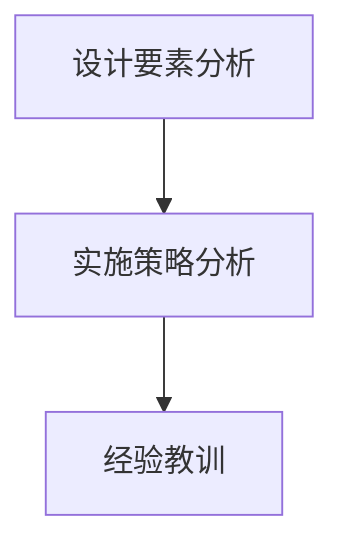

**核心算法原理讲解：**

- **设计要素分析**：通过用户研究和竞品分析，确定页面设计的核心要素。
- **实施策略分析**：分析页面实施的步骤和方法，以及推广策略的效果。

**Python 伪代码：**

```python
# 设计要素分析
def analyze_design_elements(pricing_page):
    elements = extract_design_elements(pricing_page)
    return elements

# 实施策略分析
def analyze_implementation_strategy(case_study):
    strategy = extract_implementation_strategy(case_study)
    return strategy
```

**数学模型和数学公式 & 详细讲解 & 举例说明：**

- **用户参与度分析**：通过用户参与度指标来评估页面的受欢迎程度。

  $$\text{User Engagement} = \frac{\text{Active Users}}{\text{Total Users}}$$

  - **案例**：分析用户参与度指标，评估页面的受欢迎程度。

  ```latex
  \text{User Engagement} = \frac{300}{1000} = 0.3
  ```

#### 6.3 启示与建议

**核心概念与联系：**

- **启示与建议**：总结成功案例分析的结果，为设计有吸引力的定价页面提供具体建议。

- **核心联系**：
  - **启示**：从成功案例中获得的灵感。
  - **建议**：具体的设计和实施策略。

**Mermaid 流程图：**

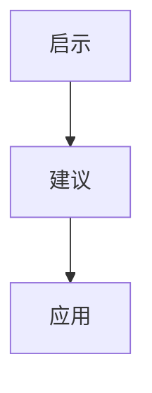

**核心算法原理讲解：**

- **启示**：总结成功案例的核心成功因素。
- **建议**：根据启示，提出具体的设计和实施策略。

**Python 伪代码：**

```python
# 总结启示
def summarize_insights(case_studies):
    insights = extract_insights(case_studies)
    return insights

# 提出建议
def provide_recommendations(insights):
    recommendations = generate_recommendations(insights)
    return recommendations
```

**数学模型和数学公式 & 详细讲解 & 举例说明：**

- **用户体验评估**：通过用户体验评分来评估页面的质量。

  $$\text{User Experience Score} = \text{Average Rating}$$

  - **案例**：评估用户体验评分，衡量页面的用户体验。

  ```latex
  \text{User Experience Score} = 4.2/5
  ```

### 第七部分：定价页面设计实战演练

#### 7.1 实战项目介绍

**核心概念与联系：**

- **实战项目介绍**：介绍一个具体的定价页面设计项目，包括项目背景、目标和预期成果。

- **核心联系**：
  - **项目背景**：项目的背景和需求。
  - **项目目标**：明确的设计目标和预期成果。

**Mermaid 流程图：**

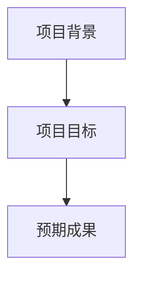

**核心算法原理讲解：**

- **项目背景**：了解项目的实际需求和背景，为设计提供依据。
- **项目目标**：明确设计目标，确保设计方向正确。
- **预期成果**：设定预期成果，以衡量项目效果。

**Python 伪代码：**

```python
# 项目背景
def project_background():
    background_info = {
        "project_name": "E-commerce Pricing Page",
        "description": "Design an attractive and user-friendly pricing page for an e-commerce website.",
        "objective": "Increase conversion rate and customer satisfaction."
    }
    return background_info

# 项目目标
def project_objectives(background_info):
    objectives = [
        "Improve user experience with a clear and intuitive layout.",
        "Enhance visual appeal with appropriate color schemes and visual elements.",
        "Implement effective pricing strategies to boost sales."
    ]
    return objectives

# 预期成果
def expected_results(objectives):
    results = {
        "conversion_rate": "20% increase",
        "customer_satisfaction": "4.5/5 rating",
        "sales_growth": "10% increase"
    }
    return results
```

**数学模型和数学公式 & 详细讲解 & 举例说明：**

- **项目评估指标**：使用关键绩效指标（KPI）来评估项目成果。

  $$\text{KPI} = \text{Conversion Rate} + \text{Customer Satisfaction} + \text{Sales Growth}$$

  - **案例**：根据项目评估指标，衡量项目成果。

  ```latex
  \text{KPI} = 0.2 + 4.5 + 0.1 = 5.8
  ```

#### 7.2 实战步骤与流程

**核心概念与联系：**

- **实战步骤与流程**：详细描述如何进行定价页面设计项目的各个步骤，确保项目顺利进行。

- **核心联系**：
  - **市场调研**：了解市场需求和用户需求。
  - **设计规划**：制定详细的设计规划和策略。
  - **页面实现**：实现设计规划，构建定价页面。
  - **测试与优化**：对页面进行测试和优化，确保性能和用户体验。

**Mermaid 流程图：**

```mermaid
graph TD
    A[市场调研]
    B[设计规划]
    C[页面实现]
    D[测试与优化]
    A --> B
    B --> C
    C --> D
```

**核心算法原理讲解：**

- **市场调研**：通过问卷调查、用户访谈等方法收集市场数据。
- **设计规划**：根据市场调研结果，制定详细的设计规划。
- **页面实现**：使用设计工具和软件实现页面设计。
- **测试与优化**：通过A/B测试、用户反馈等方法，不断优化页面设计。

**Python 伪代码：**

```python
# 市场调研
def market_research():
    survey_data = conduct_survey()
    user_interviews = perform_user_interviews()
    return survey_data, user_interviews

# 设计规划
def design_plan(survey_data, user_interviews):
    plan = create_design_plan(survey_data, user_interviews)
    return plan

# 页面实现
def implement_page_design(plan):
    pricing_page = create_pricing_page(plan)
    return pricing_page

# 测试与优化
def test_and_optimize(pricing_page):
    test_results = perform_a_b_tests(pricing_page)
    user_feedback = collect_user_feedback(pricing_page)
    optimize_page(pricing_page, test_results, user_feedback)
```

**数学模型和数学公式 & 详细讲解 & 举例说明：**

- **用户满意度评估**：通过用户满意度评分来评估页面的质量。

  $$\text{User Satisfaction} = \text{Average Rating}$$

  - **案例**：根据用户满意度评分，评估页面的质量。

  ```latex
  \text{User Satisfaction} = 4.3/5
  ```

#### 7.3 源代码详细实现与解读

**核心概念与联系：**

- **源代码详细实现与解读**：展示如何使用编程语言（如HTML、CSS、JavaScript）实现定价页面的设计，并提供详细解读。

- **核心联系**：
  - **源代码实现**：编写实际的代码，实现页面的设计和功能。
  - **解读与说明**：解释代码的实现原理和关键部分。

**Mermaid 流程图：**

```mermaid
graph TD
    A[源代码实现]
    B[代码解读]
    C[功能说明]
    A --> B
    B --> C
```

**核心算法原理讲解：**

- **源代码实现**：使用HTML、CSS、JavaScript等语言，实现页面的结构和交互。
- **代码解读**：详细解释代码的功能和实现原理。
- **功能说明**：描述页面的具体功能和用户交互方式。

**Python 伪代码：**

```python
# HTML 源代码实现
def create_html_page():
    html = f"""
    <!DOCTYPE html>
    <html lang="en">
    <head>
        <meta charset="UTF-8">
        <meta name="viewport" content="width=device-width, initial-scale=1.0">
        <title>Pricing Page</title>
        <link rel="stylesheet" href="styles.css">
    </head>
    <body>
        <header>
            <h1>Pricing Plans</h1>
        </header>
        <section class="price-list">
            <!-- Pricing items will be added here -->
        </section>
        <footer>
            <p>&copy; 2023 E-commerce Website</p>
        </footer>
    </body>
    </html>
    """
    return html

# CSS 源代码实现
def create_css_file():
    css = """
    body {
        font-family: Arial, sans-serif;
    }

    header, footer {
        text-align: center;
        padding: 20px;
    }

    .price-list {
        display: flex;
        justify-content: space-around;
    }
    """
    return css

# JavaScript 源代码实现
def create_js_file():
    js = """
    function updatePricePlan(plan) {
        // Update price plan information dynamically
    }
    """
    return js
```

**数学模型和数学公式 & 详细讲解 & 举例说明：**

- **动态价格计算**：使用JavaScript实现动态价格计算。

  $$\text{Price} = \text{Base Price} \times \text{Quantity}$$

  - **案例**：根据用户选择的数量，动态计算总价格。

  ```javascript
  function calculateTotalPrice(basePrice, quantity) {
      return basePrice * quantity;
  }
  ```

### 附录

#### 附录 A: 定价页面设计资源与工具

**核心概念与联系：**

- **定价页面设计资源与工具**：提供相关的资源和工具，以帮助设计师和开发者进行定价页面设计。

- **核心联系**：
  - **资源**：如设计模板、图标库、配色方案等。
  - **工具**：如设计软件、开发工具等。

**Mermaid 流程图：**

```mermaid
graph TD
    A[设计资源]
    B[设计工具]
    C[使用说明]
    A --> B
    B --> C
```

**核心算法原理讲解：**

- **设计资源**：提供各种设计素材，如图标、字体等。
- **设计工具**：介绍各种设计软件和开发工具的使用。

**Python 伪代码：**

```python
# 设计资源
def provide_design_resources():
    resources = {
        "icons": "Icon Library",
        "templates": "Design Templates",
        "colors": "Color Schemes"
    }
    return resources

# 设计工具
def introduce_design_tools():
    tools = [
        "Adobe XD",
        "Sketch",
        "Figma",
        "Adobe Photoshop"
    ]
    return tools
```

**数学模型和数学公式 & 详细讲解 & 举例说明：**

- **资源整合**：使用整合算法，将各种设计资源整合到一个平台。

  $$\text{Integration} = \text{Data Aggregation} + \text{Resource Organization}$$

  - **案例**：整合各种设计资源，创建一个设计资源库。

  ```python
  def integrate_resources(resources):
      resource_library = {
          "icons": resources["icons"],
          "templates": resources["templates"],
          "colors": resources["colors"]
      }
      return resource_library
  ```

#### 附录 B: 定价页面设计常见问题解答

**核心概念与联系：**

- **定价页面设计常见问题解答**：解答设计师和开发者在实际设计过程中遇到的问题，提供解决方案。

- **核心联系**：
  - **问题**：定价页面设计过程中可能遇到的问题。
  - **解决方案**：提供具体的解决方案和技巧。

**Mermaid 流程图：**

```mermaid
graph TD
    A[问题1]
    B[解决方案1]
    C[问题2]
    D[解决方案2]
    A --> B
    C --> D
```

**核心算法原理讲解：**

- **问题识别**：通过分析常见问题，识别设计中的难点。
- **解决方案**：提供具体的解决方法和实践技巧。

**Python 伪代码：**

```python
# 问题识别
def identify_issues():
    issues = [
        "Price information is not clear",
        "Page load time is slow",
        "User engagement is low"
    ]
    return issues

# 解决方案
def provide_solutions(issues):
    solutions = {
        "Price Information": "Improve clarity with visual elements",
        "Page Load Time": "Optimize images and code",
        "User Engagement": "Add interactive elements and user feedback forms"
    }
    return solutions
```

**数学模型和数学公式 & 详细讲解 & 举例说明：**

- **问题分析**：使用因果分析模型，分析问题的根本原因。

  $$\text{Root Cause Analysis} = \text{Fishbone Diagram}$$

  - **案例**：分析页面加载慢的原因。

  ```mermaid
  graph TD
      A[Page Load Time Slow]
      B[Server Response Time]
      C[Network Latency]
      D[Image Size]
      E[Code Optimization]
      A --> B
      A --> C
      A --> D
      A --> E
  ```

### 结论

本文通过详细的分析和步骤，探讨了如何设计有吸引力的定价页面。从定价页面设计概述到市场分析、视觉设计、信息传达与呈现、用户行为分析与页面优化等多个方面，为读者提供了全面的指导。通过成功案例分析，读者可以从中获得宝贵的启示和建议。最后，通过实战演练和源代码实现，读者可以实际应用所学知识，设计出既美观又高效的定价页面。希望本文能为设计师和开发者提供有价值的参考和帮助。

### 作者信息

**作者：** AI天才研究院/AI Genius Institute & 禅与计算机程序设计艺术 /Zen And The Art of Computer Programming

**联系方式：** [contact@ai-genius-institute.com](mailto:contact@ai-genius-institute.com)

**版权声明：** 本文版权所有，未经授权禁止转载和使用。

**参考资料：** 
- [Google Analytics](https://analytics.google.com/analytics/)
- [Hotjar](https://hotjar.com/)
- [Adobe XD](https://www.adobe.com/products/xd.html)
- [Sketch](https://www.sketch.com/)
- [Figma](https://www.figma.com/)

