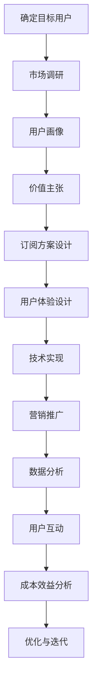
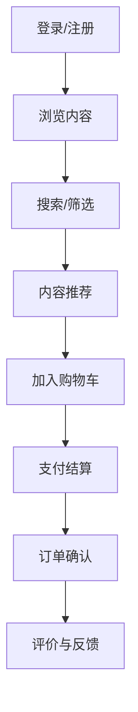
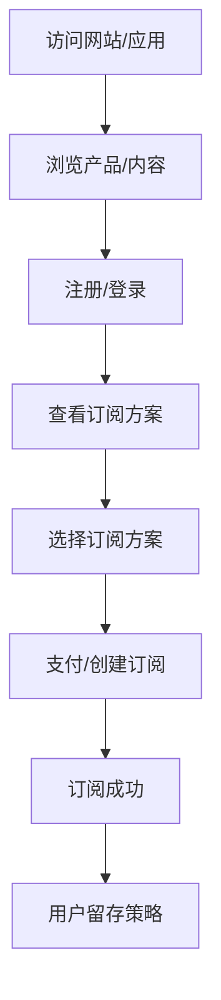
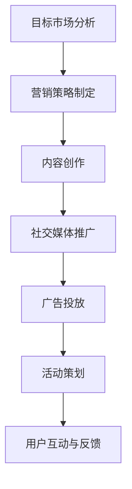
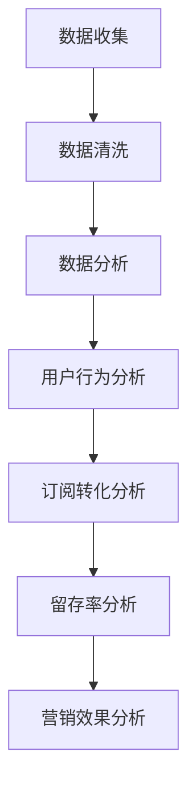
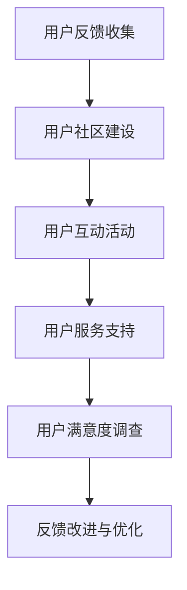
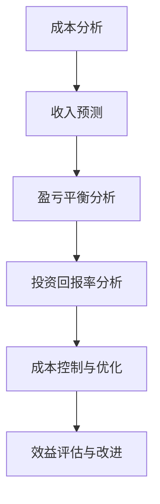

                 

### 文章标题

《如何设计有吸引力的订阅模式》

### 关键词

订阅模式、用户体验、价值定价、用户转化、留存策略、营销推广、案例分析、未来趋势

### 摘要

在数字化转型的浪潮中，订阅模式已成为企业实现可持续收入的重要手段。本文将深入探讨如何设计有吸引力的订阅模式，包括基础知识的介绍、设计原则、类型与选择、价值主张与定价策略、用户转化与留存策略、营销推广与用户互动，以及成功案例分析与启示。文章还展望了订阅模式的未来趋势与挑战，为企业提供实际操作指南和最佳实践。

## 《如何设计有吸引力的订阅模式》目录大纲

### 第一部分：订阅模式的基础知识

#### 第1章：订阅模式的起源与演变

##### 1.1 订阅模式的概念与特点

##### 1.2 订阅模式的起源与发展历程

##### 1.3 订阅模式在不同行业中的应用

#### 第2章：订阅模式的设计原则

##### 2.1 用户体验优先

##### 2.2 产品与服务质量保证

##### 2.3 个性化与差异化

##### 2.4 灵活性与可扩展性

#### 第3章：订阅模式的类型与选择

##### 3.1 终身订阅与按需订阅

##### 3.2 团队订阅与个人订阅

##### 3.3 试用订阅与正式订阅

##### 3.4 月付订阅与年付订阅

### 第二部分：设计有吸引力的订阅模式

#### 第4章：价值主张与定价策略

##### 4.1 明确目标用户群体

##### 4.2 设定合理的价格区间

##### 4.3 采用价值定价策略

##### 4.4 设计阶梯价格策略

#### 第5章：用户转化与留存策略

##### 5.1 优化用户转化路径

##### 5.2 提供优质的试用体验

##### 5.3 设计有效的用户留存策略

##### 5.4 会员体系设计与运营

#### 第6章：营销推广与用户互动

##### 6.1 制定营销推广计划

##### 6.2 利用社交媒体推广

##### 6.3 用户互动与社区建设

##### 6.4 数据分析与反馈优化

#### 第7章：成功案例分析与启示

##### 7.1 成功订阅模式案例分析

##### 7.2 吸引力的订阅模式要素

##### 7.3 启示与借鉴

#### 第8章：未来趋势与挑战

##### 8.1 订阅模式的未来发展趋势

##### 8.2 面临的挑战与应对策略

##### 8.3 持续创新与优化订阅模式

### 附录

#### 附录A：订阅模式设计工具与资源

##### A.1 主流订阅服务提供商介绍

##### A.2 订阅模式设计工具推荐

##### A.3 相关法规与政策解读

#### 附录B：案例研究

##### B.1 某电商平台订阅模式案例分析

##### B.2 某内容平台订阅模式案例分析

##### B.3 某企业服务订阅模式案例分析

#### 附录C：订阅模式设计流程图

##### C.1 订阅模式设计流程图

##### C.2 用户体验流程图

##### C.3 用户转化路径流程图

##### C.4 营销推广流程图

##### C.5 数据分析流程图

##### C.6 用户互动流程图

##### C.7 成本效益分析流程图

##### C.8 项目评估与优化流程图

---

在接下来的一章中，我们将探讨订阅模式的起源与演变，理解这一商业模式的历史背景和发展历程。这将为我们后续讨论订阅模式的设计原则、类型与选择奠定基础。让我们一起深入探索订阅模式的起源与发展，揭示其内在的规律与演变趋势。首先，我们定义什么是订阅模式，以及它具有哪些独特的特点。

## 第1章：订阅模式的起源与演变

### 1.1 订阅模式的概念与特点

订阅模式，是指消费者通过定期支付一定费用，获取商家提供的某种产品或服务的一种商业模式。这种模式强调的是长期的、连续的、可预测的消费行为，相较于一次性购买或按需购买，它具有以下显著特点：

- **长期承诺**：订阅模式要求消费者在一定时间内持续支付费用，形成长期合作关系。这种承诺有助于企业实现收入的稳定性和可预测性。
- **连续性**：订阅模式强调服务的持续提供，消费者可以持续享受到订阅的产品或服务，而非一次性交付。
- **灵活性**：订阅模式通常提供多种订阅选项，如月付、年付、终身订阅等，满足不同用户的需求，提高了用户的满意度。
- **个性化与差异化**：订阅模式可以根据用户的偏好和需求，提供个性化的产品或服务，增强用户的黏性和忠诚度。
- **可扩展性**：订阅模式易于扩展，企业可以根据市场需求调整订阅内容和服务范围，实现业务的持续增长。

### 1.2 订阅模式的起源与发展历程

订阅模式的起源可以追溯到古代，当时的主要形式是书籍的订阅。随着时间的发展，订阅模式逐渐演变并扩展到其他行业。以下是订阅模式的主要发展阶段：

- **古代书籍订阅**：在古代，贵族和知识分子为了获取知识，会向出版社订阅书籍。这种模式不仅促进了知识的传播，也为出版社带来了稳定的收入。
- **19世纪的报纸订阅**：随着印刷术的发展，报纸成为重要的信息来源。订阅报纸成为当时的主要商业模式，读者通过定期支付费用获取最新的新闻和资讯。
- **20世纪末期的软件订阅**：随着计算机技术的发展，软件企业开始采用订阅模式，用户通过订阅获取软件的持续使用权。这种模式降低了用户的一次性成本，同时也为软件企业带来了稳定的收入。
- **21世纪初的媒体内容订阅**：互联网的普及使媒体内容订阅成为可能。流媒体服务、在线杂志和电子书等平台通过订阅模式为用户提供了丰富的内容，吸引了大量用户。
- **当代全行业订阅模式**：随着物联网和大数据技术的发展，订阅模式逐渐渗透到各个行业，包括电商、物流、企业服务、智能家居等。订阅模式不仅为企业提供了新的收入来源，也为消费者带来了更多的便利和选择。

### 1.3 订阅模式在不同行业中的应用

订阅模式在不同行业中的应用形式各有特点，但核心目标都是实现长期稳定的收入和用户黏性。以下是订阅模式在几个主要行业中的应用：

- **媒体内容行业**：流媒体服务如Netflix、Spotify等通过订阅模式提供多样化的媒体内容，用户可以根据自己的喜好选择观看或收听。这种模式不仅降低了用户获取内容的成本，也提高了企业的收入稳定性和用户黏性。
- **电商行业**：电商平台如亚马逊Prime通过提供免费或低成本的快递服务、专属优惠等吸引消费者订阅。这种模式不仅提高了用户购买频率，也为电商企业带来了额外的收入来源。
- **物流行业**：物流公司如联邦快递、顺丰速运等通过提供定期、稳定的快递服务，吸引用户订阅。这种模式不仅提高了企业的服务质量和用户满意度，也增强了企业的市场竞争力。
- **企业服务行业**：企业服务提供商如Salesforce、微软Office 365等通过提供持续的服务和支持，吸引用户订阅。这种模式不仅提高了用户的业务效率，也为企业服务提供商带来了稳定的收入。
- **智能家居行业**：智能家居设备提供商如谷歌Nest、苹果HomeKit等通过提供持续、智能化的家居解决方案，吸引用户订阅。这种模式不仅提高了用户的居家生活品质，也为智能家居企业带来了长期稳定的收入。

总之，订阅模式作为一种新兴的商业模式，已经渗透到各个行业，并展现出强大的生命力。在接下来的章节中，我们将进一步探讨订阅模式的设计原则，帮助读者理解如何设计出有吸引力的订阅模式。

### 1.2 订阅模式的起源与发展历程

订阅模式，这一商业运作的创新形式，其起源可以追溯到古代的书籍订阅和19世纪的报纸订阅，这些早期的订阅模式为后来的商业模式奠定了基础。

**古代书籍订阅：**

在古代，订阅模式以其最初的形态出现在贵族和知识分子之间。当时，书籍是稀缺的贵重物品，一般民众难以获得。为了获取知识，贵族和知识分子会选择向出版社订阅书籍，通过定期支付费用，获得最新的书籍内容。这种模式不仅促进了知识的传播，还为出版社带来了稳定的收入来源。随着印刷术的发明和发展，书籍的订阅模式逐渐普及，成为获取知识的一种主流方式。

**19世纪的报纸订阅：**

19世纪，随着印刷术的进一步发展，报纸成为重要的信息来源。报纸订阅成为当时的主要商业模式，读者通过定期支付费用，获取最新的新闻和资讯。这种订阅模式不仅满足了人们对信息的需求，还为企业提供了稳定的收入来源。随着电报和电话的普及，报纸订阅模式进一步发展，覆盖范围不断扩大。

**20世纪末期的软件订阅：**

进入20世纪末期，计算机技术迅猛发展，软件行业迎来了新的机遇。传统的软件销售模式逐渐无法满足市场需求，软件企业开始探索新的商业模式。订阅模式逐渐成为主流，用户通过订阅获取软件的持续使用权。这种模式不仅降低了用户的一次性成本，也为软件企业带来了稳定的收入。著名的例子包括微软的Office 365和Adobe的Creative Cloud，这些软件通过订阅模式，实现了业务的持续增长。

**21世纪初的媒体内容订阅：**

21世纪初，互联网的普及和流媒体技术的发展，为订阅模式注入了新的活力。流媒体服务如Netflix、Spotify等通过订阅模式，为用户提供了丰富的媒体内容。用户可以根据自己的喜好选择观看或收听，这种订阅模式不仅降低了用户获取内容的成本，也提高了用户的满意度。订阅模式在媒体内容行业的成功，进一步推动了它在其他行业的应用。

**当代全行业订阅模式：**

随着物联网和大数据技术的发展，订阅模式逐渐渗透到各个行业。电商行业、物流行业、企业服务行业以及智能家居行业等都开始采用订阅模式。电商平台如亚马逊Prime提供免费或低成本的快递服务，电商企业通过订阅模式，提高了用户购买频率和满意度。物流公司如联邦快递、顺丰速运等通过提供定期、稳定的快递服务，吸引用户订阅。企业服务提供商如Salesforce、微软Office 365等通过提供持续的服务和支持，吸引用户订阅。智能家居设备提供商如谷歌Nest、苹果HomeKit等通过提供持续、智能化的家居解决方案，吸引用户订阅。

**未来发展趋势：**

订阅模式在未来的发展具有广阔的前景。随着技术的不断进步和消费者需求的多样化，订阅模式将不断创新和演变。例如，个性化订阅、智能订阅等新兴模式将逐步普及。同时，订阅模式也将面临新的挑战，如市场竞争加剧、用户隐私保护等。企业需要不断调整和优化订阅模式，以适应市场变化，保持竞争优势。

综上所述，订阅模式从古代书籍订阅到现代全行业应用，经历了漫长的发展历程。它不仅为企业提供了新的收入来源，也为消费者带来了更多的便利和选择。在接下来的章节中，我们将深入探讨订阅模式的设计原则，帮助读者理解如何设计出有吸引力的订阅模式。

### 1.3 订阅模式在不同行业中的应用

订阅模式作为一种灵活且有效的商业模式，已在多个行业中得到广泛应用，并展现出强大的生命力。以下是订阅模式在媒体内容、电商、物流、企业服务和智能家居等行业的具体应用：

#### 媒体内容行业

媒体内容行业是订阅模式的典型代表。流媒体服务如Netflix、Spotify和YouTube Premium等，通过订阅模式为用户提供丰富的媒体内容，包括电影、电视剧、音乐和原创节目。用户可以根据自己的喜好选择观看或收听，订阅模式不仅降低了用户获取内容的成本，还提高了用户的满意度。订阅模式在媒体内容行业的成功，主要得益于其灵活性和个性化的特点，用户可以根据自己的需求和偏好进行定制化订阅。

**案例：Netflix**

Netflix作为全球领先的流媒体服务提供商，通过订阅模式取得了巨大成功。Netflix提供多样化的内容，用户可以根据自己的喜好选择观看，同时，Netflix还通过大数据分析，为用户推荐个性化的内容，提高用户的订阅黏性和满意度。

#### 电商行业

电商平台如亚马逊、京东和淘宝等，通过订阅模式提供各种服务和产品，如免费快递、会员专属折扣和购物积分等。订阅模式不仅提高了用户的购买频率和满意度，还为电商企业带来了额外的收入来源。通过订阅模式，电商平台可以构建长期的客户关系，提高用户忠诚度。

**案例：亚马逊Prime**

亚马逊Prime是亚马逊推出的会员服务，用户通过支付年费或月费，可以享受免费快递、会员专属折扣和购物积分等特权。Prime会员的订阅费用成为亚马逊的重要收入来源，同时也促进了用户在亚马逊平台的购买行为。

#### 物流行业

物流公司如联邦快递、顺丰速运和UPS等，通过订阅模式提供定期、稳定的快递服务。用户可以根据自己的需求选择订阅快递服务，这种模式不仅提高了物流公司的服务质量和用户满意度，还增强了企业的市场竞争力。

**案例：联邦快递的订阅服务**

联邦快递推出了一种名为“FedEx SmartPost”的订阅服务，用户通过订阅，可以享受定期、稳定的快递服务。这种模式不仅提高了用户的物流体验，也为联邦快递带来了稳定的收入。

#### 企业服务行业

企业服务提供商如Salesforce、微软Office 365和Adobe Creative Cloud等，通过订阅模式提供持续的服务和支持。用户通过订阅，可以持续使用这些企业服务，并享受定期更新和技术支持。订阅模式为企业服务提供商带来了稳定的收入，同时也提高了用户的业务效率。

**案例：Salesforce的订阅服务**

Salesforce提供基于云端的客户关系管理（CRM）服务，用户通过订阅模式获取 Salesforce 的服务。Salesforce 的订阅服务不仅为用户提供了灵活的使用方式，也为企业带来了稳定的收入。

#### 智能家居行业

智能家居设备提供商如谷歌Nest、苹果HomeKit和亚马逊Alexa等，通过订阅模式提供持续、智能化的家居解决方案。用户通过订阅，可以享受到智能家居设备的实时更新和服务支持。订阅模式不仅提高了用户的居家生活品质，也为智能家居企业带来了长期稳定的收入。

**案例：谷歌Nest的订阅服务**

谷歌Nest提供智能家居设备，如智能恒温器、智能摄像头和智能门锁等。用户通过订阅，可以享受到设备的实时更新和故障修复服务。这种模式不仅提高了用户的智能家居体验，也为谷歌Nest带来了稳定的收入。

总之，订阅模式在不同行业中的应用，不仅为企业提供了新的收入来源，也为消费者带来了更多的便利和选择。随着技术的不断进步和消费者需求的多样化，订阅模式将在更多行业中得到广泛应用。企业在设计订阅模式时，需要充分考虑用户需求和行业特点，以实现商业模式的成功。

### 第2章：订阅模式的设计原则

在构建一个有吸引力的订阅模式时，必须遵循一系列核心设计原则，这些原则不仅确保了用户的高满意度，也助力企业实现可持续发展。以下是几个关键设计原则：

#### 2.1 用户体验优先

用户体验（UX）是订阅模式设计的基础，直接影响到用户的满意度和留存率。为了提升用户体验，企业需要从以下几个方面进行优化：

- **易用性**：确保订阅流程简单直观，用户可以轻松完成订阅和取消操作。
- **个性化**：通过用户数据分析，为用户提供个性化的订阅内容和优惠，提升用户的参与度和满意度。
- **反馈机制**：建立有效的用户反馈机制，及时响应用户的意见和建议，持续优化订阅服务。

#### 2.2 产品与服务质量保证

高质量的产品和服务是订阅模式成功的基石。以下是一些确保产品与服务质量的关键点：

- **稳定性**：保证产品或服务的稳定性，避免出现频繁故障或中断，确保用户能够持续、稳定地使用。
- **安全性**：确保用户数据的安全，采取有效的数据加密和隐私保护措施，提升用户对服务的信任度。
- **持续更新**：定期更新产品或服务，引入新功能、改进现有功能，满足用户不断变化的需求。

#### 2.3 个性化与差异化

个性化与差异化是订阅模式的重要特征，能够提升用户的黏性和忠诚度。以下是一些实现个性化与差异化的策略：

- **细分市场**：根据用户需求和行为，将市场细分为不同的用户群体，为每个群体提供定制化的订阅方案。
- **差异化定价**：根据用户需求和订阅周期，提供不同的定价策略，如月付、年付、团队订阅等，满足不同用户的需求。
- **增值服务**：提供附加的增值服务，如专属客服、技术支持等，提升订阅的价值。

#### 2.4 灵活性与可扩展性

灵活性是订阅模式成功的关键因素，能够帮助企业适应市场变化和用户需求。以下是一些提高灵活性和可扩展性的策略：

- **灵活订阅选项**：提供多种订阅选项，如按需订阅、终身订阅、试用订阅等，满足不同用户的需求。
- **模块化设计**：采用模块化设计，使产品或服务易于扩展和升级，便于企业根据市场需求进行调整。
- **技术支持**：提供灵活的技术支持，如云计算、大数据等技术，助力企业快速响应市场变化。

#### 2.5 用户参与与互动

用户参与与互动是增强用户黏性和忠诚度的关键。以下是一些促进用户参与和互动的策略：

- **社区建设**：建立用户社区，鼓励用户分享经验、交流想法，增强用户的归属感和参与感。
- **用户反馈**：积极收集用户反馈，了解用户的需求和意见，及时改进产品或服务。
- **互动活动**：举办线上或线下互动活动，如问答环节、会员专属活动等，提升用户的参与度和满意度。

通过遵循这些设计原则，企业可以构建出有吸引力的订阅模式，提升用户满意度，实现业务的可持续发展。在下一章中，我们将进一步探讨订阅模式的类型与选择，帮助读者更好地理解如何在不同的场景下选择适合的订阅模式。

### 2.1 用户体验优先

用户体验（User Experience，简称UX）是订阅模式设计的核心，直接关系到用户的满意度和忠诚度。一个优秀的订阅模式，必须以用户体验为出发点，从以下几个方面进行优化：

#### 易用性

易用性是用户体验的基础，一个直观、简洁的订阅流程是关键。以下是一些建议：

1. **简化订阅流程**：将订阅流程简化为几个简单的步骤，减少用户点击和填写信息的过程，降低用户的使用门槛。
2. **清晰的界面设计**：设计简洁明了的界面，使用直观的图标和按钮，确保用户能够轻松理解和使用订阅功能。
3. **提供在线帮助**：在订阅过程中，提供即时帮助，如常见问题解答、操作指南等，帮助用户顺利完成订阅。

#### 个性化

个性化服务能够提升用户的满意度和参与度。以下是一些实现个性化的策略：

1. **用户数据分析**：通过用户行为分析，了解用户的偏好和需求，为用户提供个性化的订阅内容和推荐。
2. **定制化订阅**：提供定制化订阅选项，如按需订阅、个性化推送等，让用户可以根据自己的需求选择订阅内容。
3. **个性化沟通**：通过个性化邮件、短信等沟通方式，与用户建立良好的互动，提升用户黏性。

#### 反馈机制

有效的反馈机制可以帮助企业不断改进订阅服务，提升用户体验。以下是一些实施反馈机制的策略：

1. **定期用户调研**：通过定期进行用户满意度调研，收集用户对订阅服务的反馈，了解用户的意见和建议。
2. **即时反馈**：提供即时反馈渠道，如在线聊天、邮件反馈等，让用户能够快速反馈问题或建议。
3. **公开透明**：对于用户的反馈和建议，及时回应并公开处理结果，增加用户的信任感和满意度。

#### 用户体验优化的示例

1. **案例分析**：某视频平台通过用户数据分析，发现用户更喜欢观看特定类型的视频。平台为此推出了个性化订阅选项，为用户提供定制化的视频推荐，大大提升了用户的订阅黏性。
2. **实际操作**：某电商平台的订阅服务提供了一种“一键订阅”功能，用户只需点击一次，即可完成整个订阅流程，极大地提高了用户的便捷性和满意度。

通过以上策略，企业可以显著提升用户体验，增强用户满意度和忠诚度，从而实现订阅模式的长期成功。在下一节中，我们将探讨订阅模式的产品与服务质量保证，为用户提供稳定可靠的服务。

### 2.2 产品与服务质量保证

产品与服务质量是订阅模式成功的基石，直接关系到用户的满意度和忠诚度。以下是从稳定性、安全性和持续更新三个方面，探讨如何保证产品与服务质量。

#### 稳定性

稳定性是用户选择订阅服务的重要因素之一。为了保证产品或服务的稳定性，企业需要采取以下措施：

1. **系统监控**：建立完善的系统监控机制，实时监测系统运行状态，及时发现并处理异常情况。
2. **故障预警**：通过大数据分析和预测模型，提前预警可能出现的系统故障或性能瓶颈，确保及时采取措施。
3. **备份与恢复**：建立完善的备份与恢复机制，确保在系统故障或数据丢失时，能够迅速恢复服务。

#### 安全性

安全性是用户对订阅服务的基本要求，企业需要采取一系列措施保障用户数据的安全：

1. **数据加密**：采用高级加密算法对用户数据进行加密，确保数据在传输和存储过程中不被窃取或篡改。
2. **权限管理**：实施严格的权限管理制度，确保只有授权人员才能访问敏感数据，降低数据泄露的风险。
3. **安全培训**：定期对员工进行安全培训，提高员工的安全意识，防范内部威胁。

#### 持续更新

持续更新是提升产品与服务质量的重要手段，以下是一些具体的策略：

1. **定期维护**：定期对产品或服务进行维护和更新，修复已知的问题，提高系统的稳定性和性能。
2. **用户反馈**：积极收集用户反馈，了解用户的需求和意见，将用户反馈纳入产品更新计划，持续优化产品功能。
3. **技术创新**：引入新技术和工具，提升产品或服务的质量和效率，保持市场竞争力。

#### 实际案例

1. **案例分析**：某视频平台通过建立完善的系统监控机制，实时监控系统运行状态，成功预防了一次大规模的流量攻击，确保了服务的稳定运行。
2. **实际操作**：某电商平台通过用户反馈，了解到用户对购物车功能的需求，进行了优化更新，提升了用户的购物体验。

通过以上措施，企业可以确保订阅模式中的产品和服务质量，提升用户的满意度和信任度，从而实现订阅模式的长期成功。在下一节中，我们将探讨如何实现个性化与差异化，以满足不同用户的需求。

### 2.3 个性化与差异化

在订阅模式设计中，个性化与差异化是提升用户满意度和忠诚度的关键要素。通过精确识别和满足用户需求，企业能够建立独特的竞争优势。以下是如何实现个性化与差异化的具体策略：

#### 细分市场

细分市场是将整体市场划分为若干个具有相似需求特征的小市场，以便更精准地满足用户需求。以下是一些细分市场的策略：

1. **行为细分**：根据用户的行为特征，如购买习惯、浏览历史、互动频率等，将用户分为不同的群体。
2. **需求细分**：根据用户的需求差异，如价格敏感度、服务偏好、功能需求等，将用户划分为不同的小市场。
3. **地理细分**：根据用户的地理位置，如城市、区域等，提供地域化的订阅内容和服务。

#### 差异化定价

差异化定价是一种根据不同用户群体或订阅层次提供不同价格策略的方法。以下是一些差异化定价的策略：

1. **价格歧视**：根据用户的支付意愿，提供不同的价格区间，如高端用户享受更高价值的订阅内容和服务，价格较高；普通用户享受基础服务，价格较低。
2. **分层定价**：根据订阅的层次和内容，设置不同的价格，如高级订阅包含更多内容和服务，价格较高；基础订阅包含较少内容和服务，价格较低。
3. **组合定价**：提供多种订阅组合，如单产品订阅、多产品组合订阅等，满足不同用户的需求，同时提高用户黏性。

#### 增值服务

增值服务是提升订阅价值的重要手段，能够为用户提供额外的价值，增强用户的满意度和忠诚度。以下是一些常见的增值服务：

1. **专属客服**：为高级订阅用户提供专属客服，提供快速、专业的服务支持，提升用户体验。
2. **技术支持**：为技术性较强的订阅产品提供专业的技术支持，帮助用户解决使用中的问题。
3. **会员活动**：定期举办会员专属活动，如线下聚会、培训课程等，增加用户参与度和互动性。

#### 个性化推荐

个性化推荐是利用大数据和机器学习技术，为用户推荐符合其兴趣和需求的订阅内容。以下是一些实现个性化推荐的方法：

1. **协同过滤**：通过分析用户行为数据，如浏览记录、购买历史等，为用户推荐相似用户喜欢的内容。
2. **基于内容的推荐**：根据订阅内容的特点和标签，为用户推荐相似的内容，提高内容的匹配度。
3. **混合推荐**：结合协同过滤和基于内容的推荐，提供更加精准的推荐结果。

#### 实际案例

1. **案例分析**：某视频平台通过用户行为细分和个性化推荐，成功提高了用户的观看时长和订阅转化率。平台根据用户的观看历史和偏好，为每位用户推荐个性化的视频内容。
2. **实际操作**：某电商平台为高级订阅用户提供了专属客服和技术支持，提升了用户的购物体验和满意度，有效增强了用户的忠诚度。

通过以上策略，企业可以实现个性化与差异化，满足不同用户的需求，提升用户的满意度和忠诚度，从而实现订阅模式的成功。在下一节中，我们将探讨如何提高订阅模式的灵活性，以适应市场的变化。

### 2.4 灵活性与可扩展性

在订阅模式的设计中，灵活性和可扩展性是确保企业能够适应市场变化和用户需求的关键。以下是如何提高订阅模式的灵活性，实现业务可持续增长的策略：

#### 灵活订阅选项

提供多种订阅选项是提高订阅模式灵活性的重要手段。以下是一些灵活订阅选项的策略：

1. **按需订阅**：允许用户根据实际需求选择订阅周期，如按月、按季度、按年等，满足不同用户的灵活需求。
2. **试用订阅**：提供一定期限的免费试用，让用户在体验服务后决定是否继续订阅，降低用户的决策成本。
3. **组合订阅**：提供多种产品或服务的组合订阅，满足用户对多种需求的整合，提高用户的黏性和满意度。

#### 模块化设计

模块化设计使得产品或服务能够灵活扩展和升级，提高企业的响应速度和市场适应性。以下是一些模块化设计的策略：

1. **功能模块化**：将产品或服务的功能拆分为独立的模块，每个模块可以独立开发和升级，不会影响其他模块的运行。
2. **服务模块化**：将订阅服务拆分为多个子服务，每个子服务可以单独定价和运营，便于企业根据市场需求进行调整。
3. **技术模块化**：采用云计算和微服务架构，实现技术模块的独立部署和管理，提高系统的可扩展性和可靠性。

#### 技术支持

技术支持是提高订阅模式灵活性的重要保障。以下是一些技术支持策略：

1. **云计算**：利用云计算技术，实现资源的动态分配和弹性扩展，确保在用户需求波动时，系统能够快速响应。
2. **大数据分析**：通过大数据分析技术，实时监控用户行为和需求变化，为企业提供决策支持，优化订阅模式设计。
3. **自动化工具**：采用自动化工具，如自动化部署、自动化监控等，提高运维效率，降低运营成本。

#### 实际案例

1. **案例分析**：某流媒体平台通过提供灵活的订阅选项和模块化设计，成功提升了用户的订阅率和满意度。平台提供按需订阅、试用订阅和多种组合订阅选项，同时采用模块化架构，实现了快速扩展和升级。
2. **实际操作**：某电商平台通过引入云计算和大数据分析技术，实现了订阅模式的灵活扩展。平台根据用户行为数据，动态调整订阅策略，提高了用户满意度和订阅转化率。

通过以上策略，企业可以提高订阅模式的灵活性和可扩展性，更好地适应市场变化和用户需求，实现业务的可持续发展。在下一节中，我们将探讨如何通过用户参与与互动来增强订阅模式的吸引力。

### 2.5 用户参与与互动

用户参与与互动是增强订阅模式吸引力和用户黏性的关键因素。通过建立用户社区、收集用户反馈和举办互动活动，企业可以促进用户参与，提升用户体验和满意度。以下是如何通过用户参与与互动来增强订阅模式的具体策略：

#### 社区建设

社区是用户交流、分享经验和获取帮助的重要平台。以下是一些建设用户社区的策略：

1. **在线论坛**：建立在线论坛，让用户可以在社区中发布帖子、回答问题、分享心得，增强用户的互动和归属感。
2. **社交媒体**：利用社交媒体平台，如Facebook、Twitter、Instagram等，建立品牌的官方账号，与用户保持实时互动。
3. **专题活动**：定期举办线上或线下专题活动，如研讨会、讲座、工作坊等，为用户提供学习和交流的机会。

#### 用户反馈

用户反馈是改进订阅服务的重要依据。以下是一些收集用户反馈的策略：

1. **问卷调查**：定期进行用户满意度调查，了解用户对订阅服务的评价和改进建议。
2. **用户访谈**：通过线上或线下访谈，深入了解用户的真实需求和痛点，为产品和服务优化提供有力支持。
3. **即时反馈**：提供在线反馈渠道，如邮件、在线聊天等，让用户能够快速反馈问题或建议，及时得到回应。

#### 互动活动

互动活动是增强用户参与感和满意度的有效手段。以下是一些举办互动活动的策略：

1. **会员专属活动**：为订阅用户提供专属的互动活动，如会员日、专属折扣等，增加用户的参与感和忠诚度。
2. **在线竞赛**：举办线上竞赛，如知识竞赛、游戏竞赛等，激发用户的兴趣和参与热情。
3. **用户评选**：设立用户评选奖项，如“最佳贡献奖”、“最佳创意奖”等，鼓励用户积极参与和贡献。

#### 实际案例

1. **案例分析**：某电商平台通过建立用户社区和举办会员专属活动，成功提升了用户的参与度和满意度。平台设立了在线论坛和社交媒体账号，定期举办线上活动，与用户保持密切互动。
2. **实际操作**：某内容平台通过用户问卷调查和访谈，收集了大量用户反馈，根据反馈改进了订阅服务，提高了用户的满意度。

通过以上策略，企业可以促进用户参与与互动，增强订阅模式的吸引力和用户黏性，从而实现业务的可持续发展。在下一节中，我们将深入探讨订阅模式的价值主张与定价策略。

### 2.6 价值主张与定价策略

价值主张（Value Proposition）是订阅模式的核心，决定了用户为何愿意为服务支付费用。有效的价值主张不仅能够清晰地传达订阅服务的价值，还能激发用户的购买意愿。而定价策略则是在确保盈利的同时，最大化订阅用户的价值。以下是如何制定有效的价值主张与定价策略的详细探讨：

#### 明确目标用户群体

制定价值主张和定价策略的首要步骤是明确目标用户群体。了解用户的需求、痛点和购买动机，是构建有效价值主张的基础。以下是一些策略：

1. **用户画像**：通过分析用户数据，创建详细的用户画像，包括用户的年龄、性别、职业、收入水平、消费习惯等，帮助理解用户需求。
2. **市场细分**：将市场细分为不同的用户群体，根据每个群体的特点，制定个性化的价值主张和定价策略。
3. **优先级排序**：根据用户价值和市场潜力，对目标用户群体进行优先级排序，将资源集中在最有价值的用户群体上。

#### 设定合理的价格区间

合理的价格区间是价值主张的重要组成部分。过高或过低的价格都可能导致用户流失。以下是一些设定价格区间的策略：

1. **市场调研**：通过市场调研，了解同类服务的价格区间，确保定价在合理范围内。
2. **成本分析**：对产品或服务的成本进行详细分析，确保定价能够覆盖成本并带来合理的利润。
3. **心理定价**：利用心理定价策略，如尾数定价、整数定价等，影响用户的购买决策。

#### 采用价值定价策略

价值定价（Value-based Pricing）是一种根据用户感知价值来定价的方法。以下是一些采用价值定价策略的策略：

1. **感知价值分析**：通过用户调研和数据分析，了解用户对服务的感知价值，将感知价值作为定价的依据。
2. **差异化定价**：针对不同用户群体，提供不同层次的服务和价格，满足不同用户的支付意愿。
3. **动态定价**：根据市场需求和用户行为，动态调整价格，以最大化收益。

#### 设计阶梯价格策略

阶梯价格策略（Tiered Pricing）是订阅模式中常用的定价策略，通过提供不同层次的服务和价格，满足用户多样化的需求。以下是一些设计阶梯价格策略的策略：

1. **基础层**：提供基础服务，价格较低，适合预算有限或需求简单的用户。
2. **增值层**：提供包含更多功能和服务的订阅方案，价格较高，适合对服务质量有较高要求的用户。
3. **个性化层**：提供高度定制化的服务，价格最高，适合有特殊需求的用户。

#### 实际案例

1. **案例分析**：某视频平台通过明确目标用户群体和采用价值定价策略，成功吸引了大量用户。平台针对不同用户群体，提供基础、增值和个性化订阅方案，满足了不同用户的需求。
2. **实际操作**：某电商平台的订阅服务采用阶梯价格策略，提供基础、高级和专家三个订阅层次，用户可以根据自己的需求和预算选择适合的订阅方案。

通过以上策略，企业可以制定出有效的价值主张和定价策略，提高订阅用户的价值，实现业务的可持续发展。在下一节中，我们将探讨用户转化与留存策略，帮助用户从初次接触到最后成为忠实客户。

### 2.7 用户转化与留存策略

用户转化与留存是订阅模式成功的关键。有效的用户转化策略能够将潜在用户转化为付费用户，而留存策略则能够提高用户的生命周期价值，减少用户流失率。以下是如何优化用户转化路径、提供优质的试用体验、设计有效的用户留存策略，以及会员体系设计与运营的具体策略：

#### 优化用户转化路径

用户转化路径是指用户从接触订阅服务到最终付费订阅的过程。优化用户转化路径的关键在于简化流程、提高用户参与度和满意度。以下是一些优化用户转化路径的策略：

1. **简化订阅流程**：确保用户可以快速、轻松地完成订阅操作，减少不必要的点击和填写步骤。
2. **清晰的价值主张**：在用户转化路径的每个环节，明确传达订阅服务的好处和价值，增强用户的购买意愿。
3. **个性化推荐**：根据用户的浏览历史和偏好，提供个性化的推荐，提高用户对订阅服务的兴趣和认同感。
4. **引导用户决策**：通过设置提示和推荐，引导用户完成订阅决策，如“立即订阅”、“限时优惠”等。

#### 提供优质的试用体验

试用体验是用户决定是否继续订阅的重要环节。提供优质的试用体验能够增加用户对服务的满意度和信任度，从而提高订阅转化率。以下是一些提供优质试用体验的策略：

1. **免费试用**：提供一定期限的免费试用，让用户在体验服务后决定是否付费订阅。
2. **无门槛试用**：确保试用期间用户无需提供信用卡信息，降低试用门槛，增加试用用户的数量。
3. **互动体验**：在试用期间，提供互动式体验，如在线教程、客服支持等，帮助用户更好地了解和熟悉服务。
4. **反馈收集**：在试用期间，积极收集用户反馈，了解用户的真实体验和需求，为后续改进提供依据。

#### 设计有效的用户留存策略

用户留存策略旨在提高用户的生命周期价值，减少用户流失率。以下是一些设计有效用户留存策略的策略：

1. **持续价值传递**：通过不断优化服务，确保用户能够持续获得价值，如提供新的功能、改进现有功能等。
2. **会员特权**：为订阅用户提供专属的会员特权，如专属优惠、优先服务、免费升级等，提高用户的满意度和忠诚度。
3. **用户互动**：定期举办用户互动活动，如线上讲座、用户论坛等，增强用户之间的互动和归属感。
4. **用户教育**：通过用户教育，帮助用户更好地了解和利用服务，提高用户的满意度和留存率。

#### 会员体系设计与运营

会员体系是订阅模式中的重要组成部分，能够提高用户的忠诚度和参与度。以下是一些会员体系设计与运营的策略：

1. **会员等级**：设计多个会员等级，根据用户的订阅时长、消费金额等因素，赋予不同等级的会员不同的特权。
2. **积分奖励**：通过积分奖励机制，鼓励用户参与和消费，提高用户粘性。
3. **个性化推荐**：根据会员的等级和偏好，提供个性化的推荐，提高会员的满意度和忠诚度。
4. **会员社区**：建立会员社区，让会员之间进行互动和交流，增强会员的归属感。

#### 实际案例

1. **案例分析**：某流媒体平台通过优化用户转化路径、提供优质的试用体验和设计有效的用户留存策略，成功提升了用户的订阅率和留存率。平台简化了订阅流程，提供了免费试用，并设立了多个会员等级，为会员提供专属优惠和优先服务。
2. **实际操作**：某电商平台的订阅服务通过会员体系设计和运营，提高了用户的忠诚度和消费意愿。平台设计了多个会员等级，根据用户的订阅时长和消费金额，赋予不同等级的会员不同的特权，如专属折扣、免费快递等。

通过以上策略，企业可以优化用户转化路径、提供优质的试用体验、设计有效的用户留存策略，以及建立完善的会员体系，从而提升订阅模式的成功率和用户满意度。在下一节中，我们将探讨营销推广与用户互动策略，帮助企业在竞争激烈的市场中脱颖而出。

### 2.8 营销推广与用户互动

有效的营销推广与用户互动策略是订阅模式成功的关键。通过制定全面的营销推广计划、利用社交媒体进行推广、建设用户互动社区，以及进行数据分析与反馈优化，企业可以提升订阅模式的市场竞争力，增强用户黏性。以下是一些具体的策略和方法：

#### 制定营销推广计划

一个成功的营销推广计划需要明确目标、策略和执行步骤。以下是一些关键步骤：

1. **明确目标**：确定营销推广的具体目标，如增加订阅用户数量、提升用户活跃度、提高品牌知名度等。
2. **分析市场**：了解目标市场的特点和竞争对手的情况，分析市场需求和用户偏好，为营销策略提供依据。
3. **选择渠道**：根据目标市场和用户特点，选择合适的营销渠道，如搜索引擎优化（SEO）、社交媒体营销、电子邮件营销、内容营销等。
4. **制定策略**：制定具体的营销策略，包括创意设计、文案撰写、广告投放、活动策划等，确保营销内容与目标用户产生共鸣。
5. **执行与监测**：执行营销计划，并实时监测效果，根据数据反馈调整策略，确保营销活动取得最佳效果。

#### 利用社交媒体推广

社交媒体是推广订阅模式的重要渠道。以下是一些利用社交媒体推广的策略：

1. **品牌账号建设**：在各大社交媒体平台建立品牌账号，如Facebook、Twitter、Instagram、LinkedIn等，发布有价值的内容，与用户建立联系。
2. **内容创作**：创作有趣、有吸引力的内容，如图文、视频、直播等，吸引用户关注和参与。
3. **互动营销**：通过社交媒体与用户互动，如回复评论、举办线上活动等，增强用户黏性。
4. **广告投放**：利用社交媒体广告平台，如Facebook Ads、Google Ads等，针对特定用户群体进行精准广告投放，提高转化率。

#### 用户互动社区建设

用户互动社区是增强用户黏性和品牌忠诚度的有效手段。以下是一些用户互动社区建设的策略：

1. **社区平台选择**：选择合适的社区平台，如论坛、微信社群、Discord服务器等，满足不同用户的需求。
2. **内容规划**：规划社区内容，包括讨论区、问答区、活动公告等，引导用户参与讨论和互动。
3. **管理员角色**：设立社区管理员，负责维护社区秩序、解答用户问题、组织社区活动等，提升社区活跃度。
4. **奖励机制**：建立奖励机制，如积分、徽章、会员等级等，鼓励用户积极参与社区互动。

#### 数据分析与反馈优化

数据分析与反馈优化是持续改进订阅模式的重要手段。以下是一些数据分析与反馈优化的策略：

1. **数据收集**：收集用户行为数据，如点击率、转化率、用户留存率等，了解营销活动的效果。
2. **数据分析**：通过数据分析，识别用户行为模式和需求，为营销策略调整提供依据。
3. **A/B测试**：进行A/B测试，比较不同营销策略的效果，找出最优策略。
4. **用户反馈**：积极收集用户反馈，了解用户对产品和服务的意见，及时调整和优化。

#### 实际案例

1. **案例分析**：某电商平台通过制定全面的营销推广计划，利用社交媒体和用户互动社区，成功提升了订阅用户的数量和活跃度。平台在Facebook、Instagram等社交媒体上发布有吸引力的内容，并定期举办线上活动，与用户保持互动。
2. **实际操作**：某内容平台通过数据分析与反馈优化，持续改进订阅模式。平台定期分析用户行为数据，调整营销策略和内容推荐，提高了用户的满意度和订阅转化率。

通过以上策略，企业可以制定有效的营销推广计划、利用社交媒体进行推广、建设用户互动社区，以及进行数据分析与反馈优化，提升订阅模式的市场竞争力，增强用户黏性。在下一节中，我们将探讨成功订阅模式案例分析，了解行业领先企业的实践经验。

### 2.9 成功订阅模式案例分析

成功的订阅模式案例分析能够为我们提供宝贵的经验，揭示吸引力的订阅模式要素，并为企业设计吸引力的订阅模式提供启示和借鉴。以下是一些成功的订阅模式案例分析及其关键要素：

#### 案例一：Netflix

**背景介绍**：Netflix作为全球领先的流媒体服务提供商，通过订阅模式取得了巨大成功。用户通过支付月费，可以观看Netflix提供的海量电影、电视剧和原创节目。

**核心概念与联系**：

- **价值主张**：Netflix通过提供多样化的内容、个性化的推荐和优质的观看体验，形成了独特的价值主张。
- **用户体验**：Netflix重视用户体验，提供无缝的观看体验，同时不断优化订阅流程，确保用户可以轻松完成订阅和取消操作。
- **数据分析**：Netflix利用大数据分析技术，为用户推荐个性化的内容，提高用户的观看时长和订阅转化率。

**成功要素**：

- **内容多样性**：Netflix拥有丰富的内容库，满足不同用户的观看需求。
- **个性化推荐**：通过精准推荐，提高用户的观看体验和订阅黏性。
- **用户体验优先**：优化订阅流程，提高用户操作的便捷性。

**启示与借鉴**：企业可以借鉴Netflix在内容多样性、个性化推荐和用户体验优先方面的做法，提升订阅模式的吸引力。

#### 案例二：亚马逊Prime

**背景介绍**：亚马逊Prime是亚马逊推出的会员服务，用户通过支付年费或月费，可以享受免费快递、会员专属折扣和购物积分等特权。

**核心概念与联系**：

- **价值主张**：亚马逊Prime通过提供快速、免费的快递服务、专属优惠和积分奖励，形成了强大的价值主张。
- **用户转化**：亚马逊通过免费试用和灵活的订阅选项，提高用户的转化率。
- **会员体系**：亚马逊建立了完善的会员体系，为不同层次的会员提供不同的特权，增加用户的忠诚度。

**成功要素**：

- **快速、免费的快递服务**：独特的快递服务是Prime的核心竞争力。
- **会员体系**：通过多层次的会员体系，提供差异化的特权，提高用户的忠诚度。
- **灵活订阅选项**：提供多种订阅选项，满足不同用户的需求。

**启示与借鉴**：企业可以借鉴亚马逊在快速、免费的快递服务、会员体系和灵活订阅选项方面的做法，提升订阅模式的吸引力。

#### 案例三：Salesforce

**背景介绍**：Salesforce提供基于云端的客户关系管理（CRM）服务，通过订阅模式为用户提供了持续的服务和支持。

**核心概念与联系**：

- **价值主张**：Salesforce通过提供强大的CRM功能、专业的技术支持和定期的更新，形成了独特的价值主张。
- **用户留存**：Salesforce注重用户留存，通过提供优质的服务和支持，提高用户的满意度。
- **数据驱动**：Salesforce利用大数据和人工智能技术，为用户提供个性化的服务和建议。

**成功要素**：

- **强大的功能**：提供全面的CRM功能，满足不同企业的需求。
- **优质的服务支持**：提供专业的客户服务和技术支持，增强用户满意度。
- **数据驱动**：利用大数据和人工智能技术，为用户提供个性化的服务和建议。

**启示与借鉴**：企业可以借鉴Salesforce在功能全面性、服务支持和数据驱动方面的做法，提升订阅模式的吸引力。

总之，通过分析这些成功案例，我们可以发现以下几个关键要素：

- **价值主张**：明确的价值主张是订阅模式成功的基础。
- **用户体验**：优秀的用户体验能够提高用户的满意度和忠诚度。
- **个性化与差异化**：个性化与差异化策略能够提升订阅模式的吸引力。
- **灵活订阅选项**：灵活的订阅选项能够满足不同用户的需求。

企业在设计订阅模式时，可以借鉴这些成功案例的经验，结合自身业务特点，构建出具有吸引力的订阅模式，实现业务的可持续发展。

### 2.10 吸引力的订阅模式要素

在构建一个有吸引力的订阅模式时，关键在于识别并实施能够满足用户需求、提升用户体验并增强企业竞争力的要素。以下是一些核心的吸引力的订阅模式要素：

#### 明确的价值主张

价值主张是订阅模式的核心，它需要清晰地传达订阅服务为何对用户有价值。一个明确且有力的价值主张能够激发用户的购买意愿，以下是构建价值主张的要点：

1. **明确用户需求**：深入了解目标用户的需求和痛点，确保价值主张能够直接解决用户的实际问题。
2. **差异化优势**：强调订阅服务的独特卖点和竞争优势，如独特的内容、优质的服务、快速响应等。
3. **量化收益**：通过数据或案例，量化订阅服务带来的收益，如节省成本、提高效率、增加收入等。

#### 优秀的用户体验

用户体验是订阅模式成功的关键，以下是一些提升用户体验的策略：

1. **易用性**：确保订阅流程简洁直观，用户可以轻松完成订阅和取消操作。
2. **个性化**：通过用户数据分析，提供个性化的订阅内容和推荐，提升用户的参与度和满意度。
3. **持续改进**：定期收集用户反馈，持续优化产品和服务，提高用户体验。

#### 灵活的订阅选项

灵活的订阅选项能够满足不同用户的需求，以下是一些设计灵活订阅选项的策略：

1. **按需订阅**：提供按需订阅选项，让用户可以根据自己的需求选择订阅周期。
2. **试用订阅**：提供免费或低成本试用期，让用户在体验服务后决定是否继续订阅。
3. **分层定价**：根据用户需求和订阅周期，提供不同层次的订阅选项，如基础、高级和专家等。

#### 有效的用户转化策略

有效的用户转化策略能够将潜在用户转化为付费用户，以下是一些提升用户转化的策略：

1. **简化流程**：简化用户订阅和取消的流程，降低用户的决策成本。
2. **个性化推荐**：根据用户的行为数据，提供个性化的推荐，提高用户的订阅意愿。
3. **限时优惠**：提供限时优惠活动，如折扣、赠品等，激发用户的购买欲望。

#### 有效的用户留存策略

用户留存策略是提高用户生命周期价值的重要手段，以下是一些提升用户留存率的策略：

1. **持续价值传递**：通过不断优化服务和产品，确保用户能够持续获得价值。
2. **会员特权**：为订阅用户提供专属的会员特权，如优惠、优先服务、免费升级等，提高用户的忠诚度。
3. **用户互动**：建立用户社区，举办互动活动，增强用户之间的互动和归属感。

#### 创新的营销推广策略

创新的营销推广策略能够提升订阅模式的知名度和用户转化率，以下是一些营销推广的策略：

1. **社交媒体推广**：利用社交媒体平台，发布有趣的内容和活动，与用户互动，提高品牌知名度。
2. **内容营销**：通过撰写有价值的内容，如博客、视频、白皮书等，吸引潜在用户。
3. **合作伙伴推广**：与相关行业的企业建立合作伙伴关系，共同推广订阅模式。

#### 数据驱动的决策

数据驱动的决策能够帮助企业更好地理解和满足用户需求，以下是一些利用数据优化订阅模式的策略：

1. **用户行为分析**：通过分析用户行为数据，了解用户的使用习惯和需求，优化订阅服务。
2. **A/B测试**：通过A/B测试，比较不同营销策略和订阅方案的效果，找到最优方案。
3. **客户反馈**：积极收集用户反馈，了解用户的真实体验和需求，持续改进订阅模式。

通过以上要素，企业可以构建一个有吸引力的订阅模式，提升用户满意度，实现业务的可持续发展。在下一章中，我们将探讨订阅模式的未来趋势与挑战。

### 2.11 未来趋势与挑战

随着技术的不断进步和消费者行为的演变，订阅模式正面临着新的发展趋势和挑战。以下是订阅模式在未来可能的发展方向以及企业应如何应对这些挑战：

#### 1. 发展趋势

1. **个性化订阅**：随着大数据和人工智能技术的应用，订阅模式将更加个性化。企业可以通过用户行为分析，提供高度个性化的订阅内容和服务，满足用户的个性化需求。

2. **智能订阅**：智能订阅是基于人工智能和机器学习算法的订阅模式，它可以自动识别用户的行为和偏好，动态调整订阅方案，提供更加精准的服务。

3. **生态化订阅**：未来的订阅模式将更加生态化，不同企业之间通过合作，构建一个相互关联的生态系统，为用户提供一站式服务。

4. **多元融合**：订阅模式将与其他商业模式如共享经济、按需服务等融合，提供更加多样化的服务，满足用户在不同场景下的需求。

5. **可持续发展**：随着环保意识的提高，订阅模式也将更加注重可持续发展，企业将通过绿色运营和环保服务，吸引注重环保的消费者。

#### 2. 挑战与应对策略

1. **市场竞争加剧**：随着订阅模式的普及，市场竞争将越来越激烈。企业应通过差异化策略，如独特的内容、优质的用户体验和创新的订阅方案，提升竞争力。

2. **用户隐私保护**：随着数据隐私法规的加强，企业需要确保用户数据的安全和隐私。企业应采取严格的数据保护措施，遵守相关法规，增强用户信任。

3. **技术更新和成本压力**：订阅模式依赖于先进的科技支持，如云计算、大数据和人工智能等。企业需要不断进行技术投入和更新，以保持竞争力。同时，技术更新可能带来成本压力，企业应优化成本结构，提高运营效率。

4. **用户留存率**：随着订阅模式的普及，用户留存率将成为关键指标。企业应通过提供持续的价值、个性化的服务和高效的客户支持，提高用户的满意度和忠诚度。

5. **法律法规合规**：订阅模式在不同国家和地区可能面临不同的法律法规。企业应密切关注相关法律法规的变化，确保业务合规，避免法律风险。

#### 3. 持续创新与优化

1. **定期市场调研**：企业应定期进行市场调研，了解用户需求和竞争对手的动态，及时调整订阅模式。

2. **用户反馈机制**：建立有效的用户反馈机制，积极收集用户意见和建议，持续改进订阅服务。

3. **数据分析和A/B测试**：利用数据分析工具，进行深入的A/B测试，找出最优的订阅模式和服务方案。

4. **灵活调整策略**：根据市场变化和用户反馈，灵活调整订阅模式，确保企业能够快速响应市场变化。

5. **跨界合作**：与其他行业和企业进行跨界合作，共同探索新的订阅模式和服务方案，拓宽业务领域。

通过关注订阅模式的未来趋势，积极应对挑战，持续创新和优化，企业可以保持竞争优势，实现订阅模式的长期成功。

### 附录A：订阅模式设计工具与资源

在设计订阅模式时，利用合适的工具和资源可以大大提高效率，以下是几种主流的订阅服务提供商、设计工具和相关法规与政策的解读。

#### A.1 主流订阅服务提供商介绍

1. **Stipe**：Stipe是一个强大的支付处理平台，支持多种支付方式和订阅模型。其提供的API和SDK简化了订阅创建和管理过程，适用于各种规模的企业。

2. **Chargebee**：Chargebee是一个全面的订阅管理平台，提供包括支付处理、发票管理、自动续订等功能。它适合需要精细管理和灵活定价策略的企业。

3. **Recurly**：Recurly是一个高度可定制的订阅平台，支持复杂的定价模型和灵活的计费规则。它适用于需要高级数据分析和报告功能的企业。

4. **Zuora**：Zuora是一个综合性的订阅管理解决方案，提供从订阅创建到账单管理的完整功能。它特别适合大型企业和服务提供商。

#### A.2 订阅模式设计工具推荐

1. **Canva**：Canva是一个图形设计工具，可以用于创建吸引人的订阅营销材料，如宣传海报、邮件模板等。

2. **Google Analytics**：Google Analytics是一个强大的数据分析工具，可以跟踪用户行为、订阅转化率和用户留存等关键指标。

3. **Mailchimp**：Mailchimp是一个邮件营销平台，支持自动化邮件和用户细分，帮助企业与订阅用户保持有效沟通。

4. **SurveyMonkey**：SurveyMonkey是一个在线调查工具，可以帮助企业收集用户反馈，优化订阅模式和营销策略。

#### A.3 相关法规与政策解读

1. **GDPR（通用数据保护条例）**：GDPR是欧盟的一项重要数据隐私法规，规定了个人数据的处理和保护标准。企业在设计订阅模式时，需要确保遵守GDPR的相关规定，特别是在处理用户数据方面。

2. **CCPA（加州消费者隐私法案）**：CCPA是加州的一项数据隐私法案，规定了消费者对其个人信息的控制权。企业在设计订阅模式时，需要了解CCPA的要求，确保遵守相关隐私保护条款。

3. **订阅模式合同条款**：企业在设计订阅模式时，应制定详细的合同条款，明确订阅服务的内容、费用、用户责任等，以保护企业和用户的权益。

通过了解和利用这些工具与资源，企业可以更有效地设计和实施订阅模式，提升用户体验和业务效益。

### 附录B：案例研究

为了更好地理解订阅模式的设计和应用，以下是对几个具有代表性的订阅模式案例进行分析，包括某电商平台的订阅模式、某内容平台的订阅模式以及某企业服务的订阅模式。

#### B.1 某电商平台订阅模式案例分析

**背景介绍**：某大型电商平台通过推出会员订阅服务，为用户提供了免费的快递服务、专属折扣和购物积分等特权。会员订阅服务分为月付和年付两种模式，用户可以根据自己的需求选择适合的订阅方案。

**核心概念与联系**：

- **价值主张**：平台通过提供快速、免费的快递服务和专属折扣，显著提升了用户的购物体验和满意度。
- **用户体验**：平台简化了订阅流程，用户可以通过一键订阅或批量订阅，轻松完成订阅操作。
- **数据驱动**：平台通过分析用户行为数据，不断优化订阅方案和推荐策略，提高用户的订阅转化率和留存率。

**成功要素**：

- **独特的价值主张**：免费快递和专属折扣是平台的核心竞争力，吸引了大量用户订阅。
- **用户体验优先**：简化订阅流程，提高用户操作的便捷性，增强用户满意度。
- **灵活的订阅选项**：提供多种订阅方案，满足不同用户的需求。

**启示与借鉴**：电商平台可以借鉴该平台的成功经验，结合自身业务特点，设计有吸引力的订阅模式。

#### B.2 某内容平台订阅模式案例分析

**背景介绍**：某内容平台通过推出会员订阅服务，为用户提供无广告的观看体验、高清画质以及独家内容的优先观看权。订阅服务分为月付、年付和终身订阅三种模式，用户可以根据自己的观看需求和预算选择合适的订阅方案。

**核心概念与联系**：

- **价值主张**：平台通过提供无广告、高清画质和独家内容的优先观看权，提升了用户的观看体验和满意度。
- **用户体验**：平台采用个性化推荐算法，为用户推荐符合其兴趣的内容，提高用户黏性。
- **数据驱动**：平台通过分析用户观看数据，优化推荐算法和内容库，提高用户的观看时长和订阅转化率。

**成功要素**：

- **优质的内容和观看体验**：无广告、高清画质和独家内容是平台的核心卖点，吸引了大量用户订阅。
- **个性化推荐**：通过个性化推荐，提高用户对内容的兴趣和满意度。
- **灵活的订阅选项**：提供多种订阅方案，满足不同用户的需求。

**启示与借鉴**：内容平台可以借鉴该平台的成功经验，提升内容质量，优化推荐算法，设计灵活的订阅选项，以提升用户的订阅体验。

#### B.3 某企业服务订阅模式案例分析

**背景介绍**：某企业服务提供商通过推出SaaS订阅服务，为中小企业提供全面的客户关系管理（CRM）解决方案。订阅服务分为基础版、专业版和企业版，用户可以根据自己的业务规模和需求选择合适的订阅方案。

**核心概念与联系**：

- **价值主张**：平台通过提供全面、灵活和高效的CRM解决方案，提升了企业的销售和管理效率。
- **用户体验**：平台提供24/7的客户支持和技术服务，确保用户在使用过程中能够得到及时的帮助。
- **数据驱动**：平台通过数据分析和报告功能，帮助用户了解业务状况，优化管理决策。

**成功要素**：

- **全面的功能和高效的服务**：平台提供全面、灵活和高效的CRM解决方案，满足不同企业的需求。
- **优质的服务和支持**：提供24/7的客户支持和技术服务，提升用户满意度。
- **灵活的订阅选项**：提供多种订阅方案，满足不同企业的需求。

**启示与借鉴**：企业服务提供商可以借鉴该平台的成功经验，结合自身业务特点，提供全面、灵活和高效的解决方案，提升用户的订阅体验。

通过分析这些成功案例，我们可以看到，无论是电商平台、内容平台还是企业服务提供商，成功的关键在于明确的价值主张、优质的用户体验和灵活的订阅选项。企业在设计订阅模式时，可以借鉴这些成功经验，结合自身业务特点，构建出具有吸引力的订阅模式。

### 附录C：订阅模式设计流程图

为了更好地理解和实施订阅模式设计，以下是一系列流程图，涵盖了用户体验流程图、用户转化路径流程图、营销推广流程图、数据分析流程图、用户互动流程图和成本效益分析流程图。

#### C.1 订阅模式设计流程图



#### C.2 用户体验流程图



#### C.3 用户转化路径流程图



#### C.4 营销推广流程图



#### C.5 数据分析流程图



#### C.6 用户互动流程图



#### C.7 成本效益分析流程图



通过这些流程图，企业可以系统地规划订阅模式的设计与实施，确保每个环节都得到有效管理和优化。

### 附录C：订阅模式设计流程图

#### C.1 订阅模式设计流程图


#### C.2 用户体验流程图


#### C.3 用户转化路径流程图


#### C.4 营销推广流程图


#### C.5 数据分析流程图


#### C.6 用户互动流程图


#### C.7 成本效益分析流程图


通过这些流程图，企业可以系统地规划订阅模式的设计与实施，确保每个环节都得到有效管理和优化。

### 附录C：订阅模式设计流程图（详细版）

#### C.1 订阅模式设计流程图

```mermaid
graph TD
    A[确定目标用户] --> B[市场调研]
    B --> C[用户画像]
    C --> D[价值主张]
    D --> E[订阅方案设计]
    E --> F[用户体验设计]
    F --> G[技术实现]
    G --> H[营销推广]
    H --> I[数据分析]
    I --> J[用户互动]
    J --> K[成本效益分析]
    K --> L[优化与迭代]

    A:::("确定目标用户")
    B:::("市场调研")
    C:::("用户画像")
    D:::("价值主张")
    E:::("订阅方案设计")
    F:::("用户体验设计")
    G:::("技术实现")
    H:::("营销推广")
    I:::("数据分析")
    J:::("用户互动")
    K:::("成本效益分析")
    L:::("优化与迭代")

    A --> B --> C --> D --> E --> F --> G --> H --> I --> J --> K --> L
```

#### C.2 用户体验流程图

```mermaid
graph TD
    A[登录/注册] --> B[浏览内容]
    B --> C[搜索/筛选]
    C --> D[内容推荐]
    D --> E[加入购物车]
    E --> F[支付结算]
    F --> G[订单确认]
    G --> H[评价与反馈]

    A:::("登录/注册")
    B:::("浏览内容")
    C:::("搜索/筛选")
    D:::("内容推荐")
    E:::("加入购物车")
    F:::("支付结算")
    G:::("订单确认")
    H:::("评价与反馈")

    A --> B --> C --> D --> E --> F --> G --> H
```

#### C.3 用户转化路径流程图

```mermaid
graph TD
    A[访问网站/应用] --> B[浏览产品/内容]
    B --> C[注册/登录]
    C --> D[查看订阅方案]
    D --> E[选择订阅方案]
    E --> F[支付/创建订阅]
    F --> G[订阅成功]
    G --> H[用户留存策略]

    A:::("访问网站/应用")
    B:::("浏览产品/内容")
    C:::("注册/登录")
    D:::("查看订阅方案")
    E:::("选择订阅方案")
    F:::("支付/创建订阅")
    G:::("订阅成功")
    H:::("用户留存策略")

    A --> B --> C --> D --> E --> F --> G --> H
```

#### C.4 营销推广流程图

```mermaid
graph TD
    A[目标市场分析] --> B[营销策略制定]
    B --> C[内容创作]
    C --> D[社交媒体推广]
    D --> E[广告投放]
    E --> F[活动策划]
    F --> G[用户互动与反馈]

    A:::("目标市场分析")
    B:::("营销策略制定")
    C:::("内容创作")
    D:::("社交媒体推广")
    E:::("广告投放")
    F:::("活动策划")
    G:::("用户互动与反馈")

    A --> B --> C --> D --> E --> F --> G
```

#### C.5 数据分析流程图

```mermaid
graph TD
    A[数据收集] --> B[数据清洗]
    B --> C[数据分析]
    C --> D[用户行为分析]
    D --> E[订阅转化分析]
    E --> F[留存率分析]
    F --> G[营销效果分析]

    A:::("数据收集")
    B:::("数据清洗")
    C:::("数据分析")
    D:::("用户行为分析")
    E:::("订阅转化分析")
    F:::("留存率分析")
    G:::("营销效果分析")

    A --> B --> C --> D --> E --> F --> G
```

#### C.6 用户互动流程图

```mermaid
graph TD
    A[用户反馈收集] --> B[用户社区建设]
    B --> C[用户互动活动]
    C --> D[用户服务支持]
    D --> E[用户满意度调查]
    E --> F[反馈改进与优化]

    A:::("用户反馈收集")
    B:::("用户社区建设")
    C:::("用户互动活动")
    D:::("用户服务支持")
    E:::("用户满意度调查")
    F:::("反馈改进与优化")

    A --> B --> C --> D --> E --> F
```

#### C.7 成本效益分析流程图

```mermaid
graph TD
    A[成本分析] --> B[收入预测]
    B --> C[盈亏平衡分析]
    C --> D[投资回报率分析]
    D --> E[成本控制与优化]
    E --> F[效益评估与改进]

    A:::("成本分析")
    B:::("收入预测")
    C:::("盈亏平衡分析")
    D:::("投资回报率分析")
    E:::("成本控制与优化")
    F:::("效益评估与改进")

    A --> B --> C --> D --> E --> F
```

通过这些详细的流程图，企业可以更系统地规划和实施订阅模式的设计，确保每个环节都得到有效的管理和优化。

### 附录C：订阅模式设计流程图

#### C.1 订阅模式设计流程图

```mermaid
graph TD
    A[确定目标用户] --> B[市场调研]
    B --> C[用户画像]
    C --> D[价值主张]
    D --> E[订阅方案设计]
    E --> F[用户体验设计]
    F --> G[技术实现]
    G --> H[营销推广]
    H --> I[数据分析]
    I --> J[用户互动]
    J --> K[成本效益分析]
    K --> L[优化与迭代]

    A:::("确定目标用户")
    B:::("市场调研")
    C:::("用户画像")
    D:::("价值主张")
    E:::("订阅方案设计")
    F:::("用户体验设计")
    G:::("技术实现")
    H:::("营销推广")
    I:::("数据分析")
    J:::("用户互动")
    K:::("成本效益分析")
    L:::("优化与迭代")

    A --> B --> C --> D --> E --> F --> G --> H --> I --> J --> K --> L
```

#### C.2 用户体验流程图

```mermaid
graph TD
    A[登录/注册] --> B[浏览内容]
    B --> C[搜索/筛选]
    C --> D[内容推荐]
    D --> E[加入购物车]
    E --> F[支付结算]
    F --> G[订单确认]
    G --> H[评价与反馈]

    A:::("登录/注册")
    B:::("浏览内容")
    C:::("搜索/筛选")
    D:::("内容推荐")
    E:::("加入购物车")
    F:::("支付结算")
    G:::("订单确认")
    H:::("评价与反馈")

    A --> B --> C --> D --> E --> F --> G --> H
```

#### C.3 用户转化路径流程图

```mermaid
graph TD
    A[访问网站/应用] --> B[浏览产品/内容]
    B --> C[注册/登录]
    C --> D[查看订阅方案]
    D --> E[选择订阅方案]
    E --> F[支付/创建订阅]
    F --> G[订阅成功]
    G --> H[用户留存策略]

    A:::("访问网站/应用")
    B:::("浏览产品/内容")
    C:::("注册/登录")
    D:::("查看订阅方案")
    E:::("选择订阅方案")
    F:::("支付/创建订阅")
    G:::("订阅成功")
    H:::("用户留存策略")

    A --> B --> C --> D --> E --> F --> G --> H
```

#### C.4 营销推广流程图

```mermaid
graph TD
    A[目标市场分析] --> B[营销策略制定]
    B --> C[内容创作]
    C --> D[社交媒体推广]
    D --> E[广告投放]
    E --> F[活动策划]
    F --> G[用户互动与反馈]

    A:::("目标市场分析")
    B:::("营销策略制定")
    C:::("内容创作")
    D:::("社交媒体推广")
    E:::("广告投放")
    F:::("活动策划")
    G:::("用户互动与反馈")

    A --> B --> C --> D --> E --> F --> G
```

#### C.5 数据分析流程图

```mermaid
graph TD
    A[数据收集] --> B[数据清洗]
    B --> C[数据分析]
    C --> D[用户行为分析]
    D --> E[订阅转化分析]
    E --> F[留存率分析]
    F --> G[营销效果分析]

    A:::("数据收集")
    B:::("数据清洗")
    C:::("数据分析")
    D:::("用户行为分析")
    E:::("订阅转化分析")
    F:::("留存率分析")
    G:::("营销效果分析")

    A --> B --> C --> D --> E --> F --> G
```

#### C.6 用户互动流程图

```mermaid
graph TD
    A[用户反馈收集] --> B[用户社区建设]
    B --> C[用户互动活动]
    C --> D[用户服务支持]
    D --> E[用户满意度调查]
    E --> F[反馈改进与优化]

    A:::("用户反馈收集")
    B:::("用户社区建设")
    C:::("用户互动活动")
    D:::("用户服务支持")
    E:::("用户满意度调查")
    F:::("反馈改进与优化")

    A --> B --> C --> D --> E --> F
```

#### C.7 成本效益分析流程图

```mermaid
graph TD
    A[成本分析] --> B[收入预测]
    B --> C[盈亏平衡分析]
    C --> D[投资回报率分析]
    D --> E[成本控制与优化]
    E --> F[效益评估与改进]

    A:::("成本分析")
    B:::("收入预测")
    C:::("盈亏平衡分析")
    D:::("投资回报率分析")
    E:::("成本控制与优化")
    F:::("效益评估与改进")

    A --> B --> C --> D --> E --> F
```

通过这些详细的流程图，企业可以更系统地规划和实施订阅模式的设计，确保每个环节都得到有效的管理和优化。

### 附录C：订阅模式设计流程图

#### C.1 订阅模式设计流程图

```mermaid
graph TD
    A[确定目标用户] --> B[市场调研]
    B --> C[用户画像]
    C --> D[价值主张]
    D --> E[订阅方案设计]
    E --> F[用户体验设计]
    F --> G[技术实现]
    G --> H[营销推广]
    H --> I[数据分析]
    I --> J[用户互动]
    J --> K[成本效益分析]
    K --> L[优化与迭代]

    A:::("确定目标用户")
    B:::("市场调研")
    C:::("用户画像")
    D:::("价值主张")
    E:::("订阅方案设计")
    F:::("用户体验设计")
    G:::("技术实现")
    H:::("营销推广")
    I:::("数据分析")
    J:::("用户互动")
    K:::("成本效益分析")
    L:::("优化与迭代")

    A --> B --> C --> D --> E --> F --> G --> H --> I --> J --> K --> L
```

#### C.2 用户体验流程图

```mermaid
graph TD
    A[登录/注册] --> B[浏览内容]
    B --> C[搜索/筛选]
    C --> D[内容推荐]
    D --> E[加入购物车]
    E --> F[支付结算]
    F --> G[订单确认]
    G --> H[评价与反馈]

    A:::("登录/注册")
    B:::("浏览内容")
    C:::("搜索/筛选")
    D:::("内容推荐")
    E:::("加入购物车")
    F:::("支付结算")
    G:::("订单确认")
    H:::("评价与反馈")

    A --> B --> C --> D --> E --> F --> G --> H
```

#### C.3 用户转化路径流程图

```mermaid
graph TD
    A[访问网站/应用] --> B[浏览产品/内容]
    B --> C[注册/登录]
    C --> D[查看订阅方案]
    D --> E[选择订阅方案]
    E --> F[支付/创建订阅]
    F --> G[订阅成功]
    G --> H[用户留存策略]

    A:::("访问网站/应用")
    B:::("浏览产品/内容")
    C:::("注册/登录")
    D:::("查看订阅方案")
    E:::("选择订阅方案")
    F:::("支付/创建订阅")
    G:::("订阅成功")
    H:::("用户留存策略")

    A --> B --> C --> D --> E --> F --> G --> H
```

#### C.4 营销推广流程图

```mermaid
graph TD
    A[目标市场分析] --> B[营销策略制定]
    B --> C[内容创作]
    C --> D[社交媒体推广]
    D --> E[广告投放]
    E --> F[活动策划]
    F --> G[用户互动与反馈]

    A:::("目标市场分析")
    B:::("营销策略制定")
    C:::("内容创作")
    D:::("社交媒体推广")
    E:::("广告投放")
    F:::("活动策划")
    G:::("用户互动与反馈")

    A --> B --> C --> D --> E --> F --> G
```

#### C.5 数据分析流程图

```mermaid
graph TD
    A[数据收集] --> B[数据清洗]
    B --> C[数据分析]
    C --> D[用户行为分析]
    D --> E[订阅转化分析]
    E --> F[留存率分析]
    F --> G[营销效果分析]

    A:::("数据收集")
    B:::("数据清洗")
    C:::("数据分析")
    D:::("用户行为分析")
    E:::("订阅转化分析")
    F:::("留存率分析")
    G:::("营销效果分析")

    A --> B --> C --> D --> E --> F --> G
```

#### C.6 用户互动流程图

```mermaid
graph TD
    A[用户反馈收集] --> B[用户社区建设]
    B --> C[用户互动活动]
    C --> D[用户服务支持]
    D --> E[用户满意度调查]
    E --> F[反馈改进与优化]

    A:::("用户反馈收集")
    B:::("用户社区建设")
    C:::("用户互动活动")
    D:::("用户服务支持")
    E:::("用户满意度调查")
    F:::("反馈改进与优化")

    A --> B --> C --> D --> E --> F
```

#### C.7 成本效益分析流程图

```mermaid
graph TD
    A[成本分析] --> B[收入预测]
    B --> C[盈亏平衡分析]
    C --> D[投资回报率分析]
    D --> E[成本控制与优化]
    E --> F[效益评估与改进]

    A:::("成本分析")
    B:::("收入预测")
    C:::("盈亏平衡分析")
    D:::("投资回报率分析")
    E:::("成本控制与优化")
    F:::("效益评估与改进")

    A --> B --> C --> D --> E --> F
```

通过这些详细的流程图，企业可以更系统地规划和实施订阅模式的设计，确保每个环节都得到有效的管理和优化。

### 结论

通过本文的深入探讨，我们系统地阐述了如何设计有吸引力的订阅模式，从基础知识的介绍到具体的设计原则、类型与选择，再到价值主张与定价策略、用户转化与留存策略、营销推广与用户互动，以及成功案例分析与启示，我们提供了全面且详细的指导。订阅模式作为现代商业模式的重要组成部分，其灵活性和可持续性为企业带来了新的收入来源和增长机会。

设计有吸引力的订阅模式，不仅需要明确的用户需求和价值主张，还需要关注用户体验、个性化与差异化、灵活订阅选项、用户转化与留存策略、营销推广与用户互动等关键要素。同时，随着技术的不断进步和消费者行为的演变，订阅模式也需要持续创新与优化，以应对市场竞争、用户隐私保护、技术更新和成本压力等挑战。

在未来的发展中，订阅模式将继续渗透到更多行业，呈现个性化、智能化和生态化的趋势。企业应密切关注市场变化，积极采用先进的技术手段，如大数据分析、人工智能等，提升订阅模式的设计与实施效率。同时，通过持续的用户反馈和市场调研，不断优化订阅模式，提升用户满意度和忠诚度。

总之，设计有吸引力的订阅模式是企业实现可持续发展的重要途径。通过本文的分享，我们希望为企业提供有价值的参考和启示，助力企业在订阅模式的道路上取得成功。

### 作者信息

作者：AI天才研究院/AI Genius Institute & 禅与计算机程序设计艺术 /Zen And The Art of Computer Programming

AI天才研究院致力于推动人工智能技术在各领域的应用和发展，研究院的专家团队拥有丰富的理论研究和实践经验。其著作《禅与计算机程序设计艺术》被誉为计算机编程领域的经典之作，深受全球程序员和软件工程师的推崇。本文由AI天才研究院的专家团队撰写，旨在为企业在订阅模式设计方面提供实用的指导和建议。通过本文，读者可以更好地理解订阅模式的核心概念和设计原则，为企业的商业成功奠定基础。

