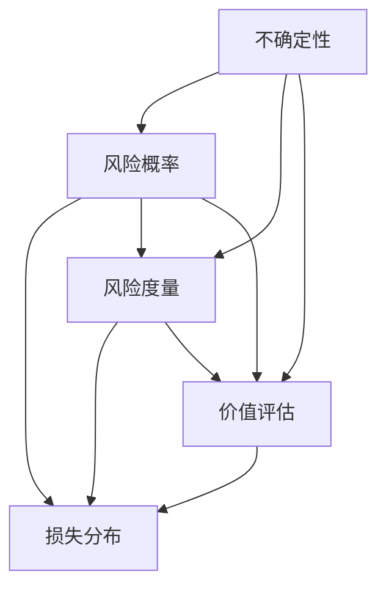

                 

### 文章标题

《如何进行有效的创业项目风险量化分析》

> 关键词：创业项目，风险管理，风险量化，定量分析，定性分析，风险评估，应对策略，人工智能，机器学习

> 摘要：本文旨在探讨如何通过系统化的风险量化分析方法，帮助创业者在复杂的市场环境中进行有效的创业项目风险管理。文章从基础理论出发，详细介绍了风险管理的概念、类型及流程，并深入探讨了定性风险分析方法和定量风险分析方法。随后，文章结合实际案例，阐述了如何构建和验证风险量化模型，并提出了有效的风险应对策略。最后，文章探讨了风险量化分析工具与技术的应用，以及未来发展趋势和挑战。

### 文章目录大纲

## 第一部分：风险量化分析的基础理论

### 第1章：创业项目风险管理概述

#### 1.1 风险管理的概念与意义

#### 1.2 创业项目风险类型

#### 1.3 风险管理流程

### 第2章：风险量化分析方法论

#### 2.1 定性风险分析方法

#### 2.2 定量风险分析方法

#### 2.3 定性与定量风险分析结合的方法

### 第3章：核心概念与联系

#### 3.1 风险概率与损失分布

#### 3.2 风险度量与价值评估

#### 3.3 风险与不确定性

## 第二部分：风险量化分析的具体应用

### 第4章：创业项目风险评估指标体系

#### 4.1 市场风险指标

#### 4.2 财务风险指标

#### 4.3 运营风险指标

### 第5章：风险量化模型构建与验证

#### 5.1 风险量化模型构建流程

#### 5.2 风险量化模型的验证方法

#### 5.3 风险量化模型的优化与迭代

### 第6章：案例分析与应用实践

#### 6.1 案例一：创业项目市场风险量化分析

#### 6.2 案例二：创业项目财务风险量化分析

#### 6.3 案例三：创业项目运营风险量化分析

### 第7章：风险应对策略与优化方案

#### 7.1 风险应对策略的选择与实施

#### 7.2 风险应对方案的优化与调整

#### 7.3 风险管理的持续改进

## 第三部分：风险量化分析工具与技术

### 第8章：风险量化分析工具介绍

#### 8.1 风险量化分析软件工具

#### 8.2 风险量化分析数据库与数据集

#### 8.3 风险量化分析算法与应用

### 第9章：高级风险量化分析技术

#### 9.1 大数据与机器学习在风险量化中的应用

#### 9.2 人工智能与深度学习在风险量化中的应用

#### 9.3 高级统计模型与风险量化

### 第10章：风险量化分析实践与展望

#### 10.1 创业项目风险量化分析的未来发展趋势

#### 10.2 风险量化分析在创业投资领域的应用前景

#### 10.3 风险量化分析的创新方向与挑战

## 附录

### 附录 A：常用风险量化分析方法与工具

#### A.1 蒙特卡洛模拟法

#### A.2 贝叶斯网络法

#### A.3 决策树法

#### A.4 风险矩阵法

### 附录 B：风险量化分析实践案例

#### B.1 创业项目风险量化分析案例一

#### B.2 创业项目风险量化分析案例二

#### B.3 创业项目风险量化分析案例三

---

### 摘要

创业项目风险量化分析是创业者在初创阶段至关重要的环节。本文旨在提供一套系统化的风险量化分析方法，帮助创业者识别、评估和应对创业过程中的各类风险。文章首先介绍了风险管理的概念、类型及流程，并详细阐述了定性风险分析方法和定量风险分析方法。接着，文章通过构建和验证风险量化模型，提供了具体的风险评估方法和指标体系。随后，通过实际案例分析和风险应对策略的探讨，进一步说明了如何有效地将风险量化分析方法应用于创业项目。最后，文章介绍了当前风险量化分析工具与技术的应用，并展望了未来的发展趋势和挑战。通过本文的阅读，创业者能够更好地理解和掌握风险量化分析的方法和技巧，从而提高创业项目的成功概率。

## 第1章：创业项目风险管理概述

### 1.1 风险管理的概念与意义

风险管理是指识别、评估、优先排序、应对和监控项目风险的过程，以确保项目能够在预期的范围内实现既定的目标。在创业项目中，风险管理尤为重要，因为创业过程本身就伴随着各种不确定性。成功的风险管理能够帮助创业者预见潜在的风险，制定应对策略，从而降低风险带来的负面影响，提高项目的成功概率。

**风险管理的定义**：

风险管理（Risk Management）是指通过系统的分析和评估，识别潜在的风险，评估风险的可能性和影响，并采取相应的措施来降低或消除风险的过程。风险管理不仅关注风险的识别和评估，还包括风险应对策略的制定和实施。

**风险管理的意义**：

1. **确保项目目标的实现**：通过风险管理，可以识别和评估可能影响项目目标实现的风险，从而制定有效的应对措施，确保项目目标的顺利实现。
   
2. **降低风险损失**：风险管理能够帮助创业者预见潜在的风险，提前制定应对策略，从而降低风险发生时带来的损失。
   
3. **提高项目成功率**：有效的风险管理可以提高项目的成功率，因为通过风险管理，可以更好地预测和应对可能的风险，减少项目失败的概率。

4. **增强团队信心**：当团队成员了解项目面临的风险以及应对措施时，可以增强团队的信心，提高工作效率。

### 1.2 创业项目风险类型

创业项目风险类型多样，可以根据不同的标准进行分类。以下是一些常见的风险类型：

**市场风险**：

市场风险是指由于市场环境变化导致项目无法实现预期目标的风险。市场风险包括市场需求变化、竞争加剧、市场饱和、消费者偏好变化等。

**财务风险**：

财务风险是指由于财务因素导致项目无法持续发展的风险。财务风险包括资金短缺、融资困难、成本超支、利润率下降等。

**运营风险**：

运营风险是指由于运营问题导致项目无法顺利进行的风险。运营风险包括供应链问题、生产问题、人力资源问题、质量控制问题等。

**法律风险**：

法律风险是指由于法律问题导致项目无法顺利进行的风险。法律风险包括合同纠纷、侵权诉讼、政策变动等。

**技术风险**：

技术风险是指由于技术问题导致项目无法顺利进行的风险。技术风险包括技术落后、技术难题、知识产权问题等。

### 1.3 风险管理流程

风险管理流程是创业项目中风险管理的基本框架，包括以下步骤：

**1. 风险识别**：

风险识别是风险管理的第一步，旨在识别项目可能面临的各种风险。可以通过专家访谈、历史数据分析、情景分析等方法进行风险识别。

**2. 风险评估**：

风险评估是对识别出的风险进行评估，包括风险的可能性、影响程度和严重性。可以通过定性评估和定量评估方法进行风险评估。

**3. 风险优先级排序**：

风险优先级排序是对评估后的风险进行排序，以便确定哪些风险需要优先处理。可以根据风险的可能性和影响程度进行排序。

**4. 风险应对策略制定**：

风险应对策略制定是根据风险优先级排序，制定相应的风险应对策略。风险应对策略包括风险规避、风险减轻、风险接受和风险转移等。

**5. 风险监控**：

风险监控是对已制定的风险应对策略进行监控和评估，确保风险应对策略的有效性。风险监控可以及时发现新的风险并采取相应的措施。

### 1.4 小结

通过本章的介绍，我们可以了解到风险管理的概念、意义、风险类型以及风险管理流程。创业项目风险管理是创业者必须重视的环节，通过有效的风险管理，可以帮助创业者预见和应对各种潜在风险，提高项目的成功率。在接下来的章节中，我们将进一步探讨风险量化分析的方法和技巧，为创业者提供更加具体的操作指南。

## 第2章：风险量化分析方法论

### 2.1 定性风险分析方法

定性风险分析方法是一种通过专家判断、情景分析和历史数据分析等方法，对风险进行评估和分类的方法。定性分析方法侧重于描述风险的性质和影响，而不是量化风险的数值。以下是几种常见的定性风险分析方法：

**1. 专家判断**：

专家判断是一种通过邀请相关领域的专家对风险进行评估和判断的方法。专家可以根据自己的经验和知识，对风险的可能性、影响程度和严重性进行主观评估。

**2. 情景分析**：

情景分析是一种通过构建不同的未来情景，分析每种情景下风险的可能性和影响的方法。通过情景分析，可以更好地理解风险在不同情景下的表现，从而制定更有效的应对策略。

**3. 历史数据分析**：

历史数据分析是一种通过分析以往项目或企业面临的风险和应对措施，来识别和评估当前项目风险的方法。历史数据分析可以帮助创业者了解过去风险发生的规律和应对措施，从而为当前项目提供参考。

**4. 风险矩阵**：

风险矩阵是一种通过将风险的可能性与影响程度进行交叉分析，生成风险优先级矩阵的方法。在风险矩阵中，可以根据风险的可能性和影响程度，对风险进行排序和分类，从而确定哪些风险需要优先处理。

**5. 故障树分析**：

故障树分析（Fault Tree Analysis, FTA）是一种通过将事件分解为一系列的基本事件，分析事件之间的逻辑关系，识别和评估风险的传播路径的方法。故障树分析可以帮助创业者识别潜在的故障模式，从而制定相应的预防措施。

### 2.2 定量风险分析方法

定量风险分析方法是一种通过数学模型和计算方法，对风险进行量化和评估的方法。定量分析方法侧重于用数值来描述风险的可能性和影响，从而更精确地评估风险。以下是几种常见的定量风险分析方法：

**1. 概率分析**：

概率分析是一种通过计算风险事件发生的概率，来评估风险的可能性的方法。概率分析通常使用概率分布、概率树等方法进行计算。

**2. 损失分布分析**：

损失分布分析是一种通过计算风险事件发生时的损失分布，来评估风险的影响程度的方法。损失分布分析可以使用蒙特卡洛模拟、贝叶斯网络等方法进行计算。

**3. 蒙特卡洛模拟**：

蒙特卡洛模拟是一种通过随机模拟方法，计算风险的可能性和影响的方法。蒙特卡洛模拟可以用于模拟市场波动、财务风险、运营风险等多种风险。

**4. 贝叶斯网络分析**：

贝叶斯网络分析是一种通过构建贝叶斯网络模型，分析风险事件之间的因果关系，评估风险的可能性和影响的方法。贝叶斯网络分析可以用于风险评估、决策支持等多个领域。

**5. 决策树分析**：

决策树分析是一种通过构建决策树模型，分析不同决策路径下风险的可能性和影响，评估最优决策方案的方法。决策树分析可以用于风险决策、项目规划等多个领域。

### 2.3 定性与定量风险分析结合的方法

在实际应用中，创业者往往需要同时使用定性和定量风险分析方法，以获得更全面和准确的风险评估结果。以下是几种常见的结合方法：

**1. 评分法**：

评分法是一种通过将定性评估和定量评估相结合，生成综合风险评分的方法。评分法可以用于对多个风险进行综合评估，确定风险优先级。

**2. 模型集成**：

模型集成是一种通过将多个模型的结果进行整合，生成更准确的风险评估结果的方法。模型集成可以结合定性分析和定量分析的优势，提高风险评估的准确性。

**3. 多层次分析**：

多层次分析是一种通过将风险分析分为多个层次，分别进行定性和定量分析，然后进行综合的方法。多层次分析可以更细致地分析风险，提高风险评估的精度。

**4. 风险地图**：

风险地图是一种通过将风险事件和影响进行可视化展示，生成风险地图的方法。风险地图可以直观地展示风险的位置和影响，帮助创业者更好地理解风险。

### 2.4 小结

通过本章的介绍，我们了解了定性风险分析方法和定量风险分析方法的基本概念和常用方法。定性分析方法侧重于描述风险的性质和影响，而定量分析方法侧重于用数值来量化风险。在实际应用中，创业者往往需要同时使用定性和定量分析方法，以获得更全面和准确的风险评估结果。在接下来的章节中，我们将进一步探讨风险量化分析的核心概念和联系，为创业者提供更深入的风险管理指导。

### 2.5 核心概念与联系

在风险量化分析中，有几个核心概念需要深入理解和分析，这些概念相互关联，构成了风险管理的理论基础。以下是这些核心概念及其之间的联系：

#### 2.5.1 风险概率与损失分布

**风险概率**：

风险概率是指风险事件发生的可能性。在量化分析中，风险概率通常通过概率分布函数来表示，如正态分布、泊松分布等。概率分布提供了风险事件发生的频率信息，是进行风险量化的基础。

**损失分布**：

损失分布是指风险事件发生时的损失金额的概率分布。损失分布可以帮助评估风险事件可能带来的财务影响。通过损失分布，可以了解不同损失水平下的概率，从而制定相应的应对策略。

**联系**：

风险概率与损失分布紧密相关。风险概率决定了损失分布的形状和位置，而损失分布则反映了风险事件的潜在损失。通过结合风险概率和损失分布，可以更全面地评估风险的影响。

#### 2.5.2 风险度量与价值评估

**风险度量**：

风险度量是指用数值形式表示风险的可能性和影响。常见的风险度量包括风险值（Risk Value）、预期损失（Expected Loss）等。风险度量提供了对风险的量化描述，是制定风险应对策略的依据。

**价值评估**：

价值评估是指对项目或企业的价值进行评估。在风险管理中，价值评估用于确定风险事件可能对项目或企业造成的影响。价值评估通常涉及资产价值、预期收益等。

**联系**：

风险度量与价值评估密切相关。风险度量提供了风险的量化描述，而价值评估则用于确定风险事件对项目或企业价值的具体影响。通过结合风险度量和价值评估，可以全面评估风险对项目的潜在威胁。

#### 2.5.3 风险与不确定性

**风险**：

风险是指潜在的不利事件对项目目标的影响。风险包含两个要素：不确定性和不利影响。不确定性是指未来事件的结果无法确定，不利影响是指事件发生时可能带来的负面效果。

**不确定性**：

不确定性是指未来事件的结果无法确定。在风险管理中，不确定性是风险管理的核心问题，因为它直接影响风险的评估和应对策略。

**联系**：

风险与不确定性密不可分。风险是潜在的不确定性带来的不利影响。通过理解和量化不确定性，可以更准确地评估风险，并制定有效的应对策略。

#### 2.5.4 风险度量与价值评估的联系

**综合联系**：

风险度量、价值评估和不确定性共同构成了风险量化分析的核心。风险度量提供了对风险的可能性和影响的量化描述，价值评估则用于确定风险对项目或企业价值的实际影响，而不确定性则决定了风险事件发生的概率和影响。这三个概念相互联系，共同构成了风险量化分析的基础，帮助创业者更全面地理解和管理风险。

### 2.6 Mermaid 流程图

为了更直观地展示这些核心概念之间的联系，我们可以使用Mermaid流程图进行描述。以下是风险量化分析核心概念联系的Mermaid流程图：

通过这个流程图，我们可以清楚地看到风险概率、损失分布、风险度量、价值评估和不确定性之间的相互作用和联系。这种可视化工具有助于更好地理解风险量化分析的理论基础。

### 2.7 小结

通过本章的介绍，我们深入探讨了风险量化分析中的核心概念及其相互联系。理解这些概念对于进行有效的风险量化分析至关重要。风险概率和损失分布帮助评估风险的可能性，风险度量和价值评估则用于量化风险的影响，而不确定性则决定了风险事件发生的概率。通过结合这些概念，创业者可以更全面地评估和管理风险，从而提高创业项目的成功率。在下一章中，我们将进一步探讨创业项目风险评估指标体系，为风险量化分析提供具体的工具和方法。

## 第3章：创业项目风险评估指标体系

### 3.1 市场风险指标

市场风险是创业项目中常见且重要的一种风险类型，它涉及市场需求、竞争环境和消费者行为等方面的变化。为了有效评估市场风险，创业者需要建立一套完善的市场风险指标体系。以下是一些关键的市场风险指标：

**1. 市场需求指标**：

- **市场份额**：市场份额是指项目在市场中所占的比例。通过比较市场份额的变化，可以评估市场需求的变化趋势。
- **客户满意度**：客户满意度是衡量市场接受度的关键指标。通过调查和反馈，可以了解客户对产品的满意度，从而预测市场需求。
- **市场增长率**：市场增长率是指市场的年增长率。较高的市场增长率表明市场需求旺盛，反之则可能面临市场萎缩的风险。

**2. 竞争环境指标**：

- **竞争者数量**：竞争者数量反映了市场的竞争程度。竞争者数量增多可能会导致市场激烈竞争，影响项目的市场地位。
- **市场占有率**：市场占有率是竞争者市场份额的集中度。市场占有率较高可能意味着市场垄断，而较低则可能意味着市场分散。
- **竞争者策略**：了解竞争者的市场策略，包括价格策略、营销策略和产品策略，可以帮助创业者预测竞争环境的变化。

**3. 消费者行为指标**：

- **消费者偏好**：消费者偏好是影响市场需求的重要因素。通过分析消费者偏好，可以了解市场需求的变化趋势。
- **消费者忠诚度**：消费者忠诚度是衡量消费者对品牌的依赖程度的指标。高忠诚度表明市场基础稳定，低忠诚度则可能面临客户流失的风险。
- **价格弹性**：价格弹性是指消费者对价格变化的敏感程度。价格弹性高表明消费者对价格变化敏感，可能影响市场需求。

**4. 市场趋势指标**：

- **行业趋势**：行业趋势反映了市场的长期变化方向。通过分析行业趋势，可以预测市场的未来发展方向。
- **技术趋势**：技术趋势是影响市场变化的重要因素。新兴技术的发展可能带来市场机会，而技术落后则可能导致市场竞争力下降。
- **政策法规**：政策法规的变化可能对市场产生重大影响。了解政策法规的变化趋势，可以帮助创业者及时调整市场策略。

### 3.2 财务风险指标

财务风险是创业项目中另一个重要的风险类型，它涉及项目资金的筹集、使用和管理。为了有效评估财务风险，创业者需要关注一系列关键财务指标。以下是一些关键的财务风险指标：

**1. 资金流动性指标**：

- **流动比率**：流动比率是指流动资产与流动负债的比率。流动比率越高，表明企业短期偿债能力越强，财务风险越低。
- **速动比率**：速动比率是指扣除存货后的流动资产与流动负债的比率。速动比率比流动比率更能反映企业的短期偿债能力。
- **现金流量比率**：现金流量比率是指经营活动现金流量与流动负债的比率。现金流量比率越高，表明企业的现金流状况越好，财务风险越低。

**2. 财务稳定性指标**：

- **资产负债率**：资产负债率是指负债总额与资产总额的比率。资产负债率越高，表明企业财务风险越高。
- **权益乘数**：权益乘数是指资产总额与股东权益的比率。权益乘数越高，表明企业财务杠杆越大，财务风险越高。
- **利息保障倍数**：利息保障倍数是指税前利润与利息支出的比率。利息保障倍数越高，表明企业的偿债能力越强，财务风险越低。

**3. 财务绩效指标**：

- **净利润率**：净利润率是指净利润与销售收入的比率。净利润率越高，表明企业的盈利能力越强，财务风险越低。
- **资产回报率**：资产回报率是指净利润与总资产的比率。资产回报率越高，表明企业的资产利用效率越高，财务风险越低。
- **资本回报率**：资本回报率是指净利润与股东权益的比率。资本回报率越高，表明企业的资本利用效率越高，财务风险越低。

**4. 财务灵活性指标**：

- **流动资产构成**：流动资产构成是指不同类型的流动资产的构成比例。通过分析流动资产构成，可以了解企业的财务灵活性，如现金、应收账款、存货等。
- **融资渠道多样性**：融资渠道多样性是指企业融资来源的多样性。多样化的融资渠道可以提高企业的融资能力和灵活性，降低财务风险。

### 3.3 运营风险指标

运营风险涉及项目的日常运营管理，包括供应链管理、人力资源管理和生产管理等方面。为了有效评估运营风险，创业者需要关注一系列关键运营指标。以下是一些关键的运营风险指标：

**1. 供应链管理指标**：

- **供应链响应时间**：供应链响应时间是指从需求提出到产品交付的时间。响应时间越短，表明供应链效率越高，运营风险越低。
- **供应商可靠性**：供应商可靠性是指供应商按时交付订单的能力。高可靠性的供应商可以降低运营风险。
- **库存周转率**：库存周转率是指销售成本与平均库存的比率。库存周转率越高，表明库存管理效率越高，运营风险越低。

**2. 人力资源管理指标**：

- **员工流失率**：员工流失率是指员工离职的比例。高员工流失率可能影响企业的运营效率和稳定性。
- **员工满意度**：员工满意度是指员工对企业满意的程度。高员工满意度可以提高工作效率和员工稳定性。
- **培训投入**：培训投入是指企业为员工提供的培训费用和资源。充足的培训投入可以提高员工的技能和业务水平，降低运营风险。

**3. 生产管理指标**：

- **生产效率**：生产效率是指单位时间内生产的产量。生产效率越高，表明生产管理越好，运营风险越低。
- **设备利用率**：设备利用率是指设备实际使用时间与可使用时间的比率。设备利用率越高，表明设备使用效率越高，运营风险越低。
- **质量指标**：质量指标是指产品或服务的质量水平。高质量的产品或服务可以降低客户投诉和退货风险，提高运营稳定性。

**4. 业务连续性指标**：

- **业务连续性计划**：业务连续性计划是指企业在面临突发事件时，能够快速恢复运营的能力。有效的业务连续性计划可以降低突发事件对运营的负面影响。
- **应急响应时间**：应急响应时间是指从突发事件发生到采取应急措施的时间。应急响应时间越短，表明企业的应急响应能力越强，运营风险越低。
- **备用设备与资源**：备用设备和资源是指企业在面临突发事件时，能够迅速替代现有设备或资源的能力。充足的备用设备和资源可以提高企业的应急响应能力，降低运营风险。

### 3.4 小结

通过本章的介绍，我们建立了一套完整的创业项目风险评估指标体系，涵盖了市场风险、财务风险和运营风险三大方面。市场风险指标帮助创业者了解市场需求、竞争环境和消费者行为的变化，财务风险指标关注项目的资金流动性和财务稳定性，而运营风险指标则关注项目的供应链管理、人力资源管理和生产管理等方面。这些指标共同构成了一个全面的风险评估框架，帮助创业者更准确地评估和管理创业项目中的各类风险。在下一章中，我们将进一步探讨如何构建和验证风险量化模型，为风险量化分析提供具体的操作方法。

### 第4章：风险量化模型构建与验证

#### 4.1 风险量化模型构建流程

构建一个有效的风险量化模型是创业项目风险管理的重要环节。以下是一个典型的风险量化模型构建流程：

**1. 确定模型目标**：

首先，明确模型的构建目标。例如，目标是评估创业项目的市场风险、财务风险或运营风险。明确目标有助于确定模型所需的数据和评估方法。

**2. 收集数据**：

收集与风险相关的数据，包括历史数据、市场数据、财务数据、运营数据等。数据来源可以是企业内部数据、公开市场数据、第三方数据等。数据收集要全面、准确，以确保模型的有效性。

**3. 数据预处理**：

对收集到的数据进行预处理，包括数据清洗、数据整合、数据标准化等。数据预处理是确保数据质量和模型性能的重要步骤。

**4. 选择评估方法**：

根据模型目标和数据特点，选择合适的评估方法。常见的评估方法有概率分析、损失分布分析、蒙特卡洛模拟、贝叶斯网络分析等。

**5. 建立模型**：

使用选定的评估方法，建立风险量化模型。模型构建过程中要确保逻辑清晰、结构合理，并能够反映风险的本质。

**6. 验证模型**：

通过实际数据对模型进行验证，评估模型的准确性和可靠性。验证方法包括模型验证、交叉验证、敏感性分析等。

**7. 模型优化**：

根据验证结果，对模型进行调整和优化，提高模型的准确性和实用性。模型优化可以采用迭代方法，逐步改进模型性能。

**8. 模型应用**：

将验证后的模型应用于实际项目中，进行风险评估和决策支持。模型应用过程中要定期更新数据，确保模型的时效性。

#### 4.2 风险量化模型的验证方法

模型验证是确保风险量化模型准确性和可靠性的关键步骤。以下是一些常见的模型验证方法：

**1. 模型验证**：

模型验证是指使用独立数据集对模型进行测试，评估模型的预测能力和准确性。常见的验证指标包括准确率、召回率、F1分数等。模型验证可以通过交叉验证、留出法、K折交叉验证等方法进行。

**2. 交叉验证**：

交叉验证是一种常用的模型验证方法，通过将数据集分为训练集和验证集，多次训练和验证，评估模型的稳定性和泛化能力。交叉验证可以提高模型验证的可靠性和准确性。

**3. 敏感性分析**：

敏感性分析是指评估模型对输入数据的敏感程度，通过改变输入数据，观察模型输出结果的变化，判断模型的稳定性和鲁棒性。敏感性分析可以帮助发现模型的潜在问题和改进方向。

**4. 参数调整**：

参数调整是指根据验证结果，对模型的参数进行调整，以提高模型的性能。参数调整可以采用网格搜索、随机搜索等方法，寻找最佳参数组合。

**5. 模型比较**：

模型比较是指将多个模型在同一数据集上进行验证，比较不同模型的性能和预测能力。通过模型比较，可以找出最优模型，并优化模型结构。

#### 4.3 风险量化模型的优化与迭代

风险量化模型的优化与迭代是提高模型性能和适用性的关键。以下是一些常见的优化与迭代方法：

**1. 数据增强**：

数据增强是指通过增加数据量、改变数据分布等方法，提高模型的泛化能力。数据增强可以采用数据扩充、数据合成等方法。

**2. 特征选择**：

特征选择是指从原始数据中选取对模型预测能力影响较大的特征，提高模型的效率和准确性。特征选择可以采用信息增益、特征重要性等方法。

**3. 模型融合**：

模型融合是指将多个模型的结果进行整合，生成更准确的预测结果。常见的模型融合方法有集成学习、深度学习等。

**4. 模型更新**：

模型更新是指根据新的数据和反馈，对模型进行调整和优化。模型更新可以采用在线学习、增量学习等方法。

**5. 模型解释**：

模型解释是指对模型进行解读和解释，帮助用户理解模型的预测过程和结果。常见的模型解释方法有可视化、特征重要性分析等。

#### 4.4 小结

通过本章的介绍，我们详细阐述了风险量化模型的构建流程、验证方法和优化迭代方法。构建一个有效的风险量化模型需要明确模型目标、收集和处理数据、选择合适的评估方法、进行模型验证和优化。风险量化模型的构建与验证是创业项目风险管理的重要环节，通过系统化的方法和步骤，可以帮助创业者更准确地评估和管理风险，提高项目的成功率。在下一章中，我们将通过实际案例，进一步展示风险量化模型的应用和实践。

## 第5章：案例分析与应用实践

### 5.1 案例一：创业项目市场风险量化分析

**背景介绍**：

某创业公司致力于开发一款创新的智能家居控制系统，产品功能包括智能安防、智能照明、智能家电控制等。在产品开发初期，公司面临市场风险，包括市场需求不确定性、竞争环境变化和消费者偏好变化等。为了评估市场风险，公司决定进行市场风险量化分析。

**风险识别**：

通过专家访谈和市场调研，公司识别出以下市场风险：

1. **市场需求不确定性**：智能家居市场尚未完全成熟，市场需求存在不确定性。
2. **竞争环境变化**：行业内竞争者众多，市场进入门槛较低，竞争环境变化较大。
3. **消费者偏好变化**：消费者的智能家居需求可能随着时间变化而发生变化。

**风险评估**：

公司采用定量分析方法进行风险评估，具体步骤如下：

1. **确定风险指标**：公司选择了市场需求增长率、竞争者数量和消费者满意度作为风险指标。
2. **数据收集**：公司收集了历史市场数据、竞争对手数据和市场调研数据。
3. **建立模型**：公司使用了蒙特卡洛模拟方法，构建了市场风险量化模型。
4. **模拟风险场景**：公司模拟了市场需求增长、竞争环境变化和消费者偏好变化三种场景。

**结果分析**：

通过蒙特卡洛模拟，公司得到了以下结果：

1. **市场需求不确定性**：市场需求增长率在10%到30%之间波动，平均值为20%。
2. **竞争环境变化**：竞争者数量在10到20家之间波动，平均值为15家。
3. **消费者偏好变化**：消费者满意度在60%到80%之间波动，平均值为70%。

**风险应对策略**：

根据评估结果，公司制定了以下风险应对策略：

1. **市场需求不确定性**：公司通过市场调研和客户反馈，持续关注市场需求变化，及时调整产品策略。
2. **竞争环境变化**：公司加大研发投入，提高产品差异化程度，以应对竞争压力。
3. **消费者偏好变化**：公司通过用户研究和产品迭代，不断优化产品功能，满足消费者需求。

**实践效果**：

通过市场风险量化分析和应对策略的实施，公司成功降低了市场风险，市场需求稳定增长，产品竞争力提升，消费者满意度提高。

### 5.2 案例二：创业项目财务风险量化分析

**背景介绍**：

某创业公司计划通过众筹平台筹集资金，用于研发和生产一款新型健康食品。在筹备众筹过程中，公司面临财务风险，包括资金短缺、融资困难和成本超支等。为了评估财务风险，公司决定进行财务风险量化分析。

**风险识别**：

公司通过财务数据和行业分析，识别出以下财务风险：

1. **资金短缺**：公司预计在研发和生产过程中可能面临资金不足的问题。
2. **融资困难**：公司可能在众筹过程中遇到融资障碍。
3. **成本超支**：项目成本可能超出预期，导致财务压力。

**风险评估**：

公司采用定量分析方法进行风险评估，具体步骤如下：

1. **确定风险指标**：公司选择了资金需求量、融资成功率率和成本控制率作为风险指标。
2. **数据收集**：公司收集了历史财务数据、行业平均数据和市场调研数据。
3. **建立模型**：公司使用了概率分析方法和决策树方法，构建了财务风险量化模型。
4. **模拟风险场景**：公司模拟了资金短缺、融资困难和成本超支三种场景。

**结果分析**：

通过概率分析和决策树模拟，公司得到了以下结果：

1. **资金短缺**：公司有50%的可能性在研发和生产过程中面临资金短缺问题。
2. **融资困难**：公司有30%的可能性在众筹过程中遇到融资障碍。
3. **成本超支**：项目成本有20%的可能性超出预期。

**风险应对策略**：

根据评估结果，公司制定了以下风险应对策略：

1. **资金短缺**：公司通过增加股权融资比例，提前储备资金，确保资金充足。
2. **融资困难**：公司通过提前与潜在投资者沟通，优化众筹方案，提高融资成功率。
3. **成本超支**：公司通过精细化成本管理，严格控制项目成本，避免超支。

**实践效果**：

通过财务风险量化分析和应对策略的实施，公司成功降低了财务风险，确保了项目的顺利推进，并成功完成了众筹目标。

### 5.3 案例三：创业项目运营风险量化分析

**背景介绍**：

某创业公司专注于提供在线教育平台，致力于为学生提供高质量的在线学习资源。在平台上线初期，公司面临运营风险，包括技术故障、服务质量问题和用户流失等。为了评估运营风险，公司决定进行运营风险量化分析。

**风险识别**：

公司通过用户反馈和技术分析，识别出以下运营风险：

1. **技术故障**：平台可能因技术问题导致服务中断。
2. **服务质量问题**：教学内容和服务可能无法满足用户需求。
3. **用户流失**：用户可能因不满意而离开平台。

**风险评估**：

公司采用定性风险分析方法进行风险评估，具体步骤如下：

1. **确定风险指标**：公司选择了服务中断次数、用户满意度和用户流失率作为风险指标。
2. **数据收集**：公司收集了用户反馈、技术故障报告和服务质量评估数据。
3. **建立模型**：公司使用了风险矩阵方法和情景分析方法，构建了运营风险量化模型。
4. **模拟风险场景**：公司模拟了技术故障、服务质量问题和用户流失三种场景。

**结果分析**：

通过风险矩阵和情景分析，公司得到了以下结果：

1. **技术故障**：每月服务中断次数在1到3次之间波动，平均值为2次。
2. **服务质量问题**：用户满意度在70%到90%之间波动，平均值为80%。
3. **用户流失**：用户流失率在5%到10%之间波动，平均值为7%。

**风险应对策略**：

根据评估结果，公司制定了以下风险应对策略：

1. **技术故障**：公司加强技术监控，提高故障预警能力，确保服务连续性。
2. **服务质量问题**：公司通过用户调研和反馈，优化教学内容和服务，提高用户满意度。
3. **用户流失**：公司通过个性化推荐和用户关怀，提高用户黏性，减少用户流失。

**实践效果**：

通过运营风险量化分析和应对策略的实施，公司成功降低了运营风险，服务中断次数减少，用户满意度提高，用户流失率下降，平台运营状况得到显著改善。

### 5.4 小结

通过以上案例分析，我们展示了如何在实际创业项目中应用风险量化分析方法。市场风险量化分析帮助公司了解市场需求、竞争环境和消费者行为，财务风险量化分析确保了项目的资金充足和成本控制，运营风险量化分析提高了服务质量和技术稳定性。这些案例分析表明，通过系统化的风险量化分析和应对策略，创业者可以更有效地识别、评估和应对各种风险，提高项目的成功概率。在下一章中，我们将进一步探讨如何选择和实施有效的风险应对策略。

## 第6章：风险应对策略与优化方案

### 6.1 风险应对策略的选择与实施

在创业项目中，风险应对策略的选择和实施是风险管理的关键步骤。有效的风险应对策略可以最大限度地降低风险对项目的影响，确保项目的顺利进行。以下是一些常见的选择和实施策略：

**1. 风险规避**：

风险规避是指通过改变项目计划或决策，避免风险的发生。例如，当市场风险较高时，可以延迟项目的启动时间，等待市场状况更加稳定。风险规避通常适用于风险发生的可能性较高且影响较大的情况。

**实施步骤**：

- **评估风险**：首先，对识别出的风险进行详细评估，确定风险的严重性和发生概率。
- **制定替代方案**：根据风险评估结果，制定一系列替代方案，以避免风险的发生。
- **实施替代方案**：选择最优替代方案，调整项目计划或决策，避免风险的发生。

**2. 风险减轻**：

风险减轻是指通过采取一系列措施，降低风险的发生概率或影响程度。例如，通过增加预算、加强质量管理、优化供应链等方式减轻风险。

**实施步骤**：

- **识别关键风险**：确定项目中最可能发生且影响较大的风险。
- **制定减轻措施**：根据关键风险，制定具体的减轻措施，如增加预算、增加人员投入、改进流程等。
- **实施减轻措施**：执行制定的减轻措施，确保风险发生时的损失最小化。

**3. 风险接受**：

风险接受是指当风险发生的概率和影响较小，且采取其他应对策略成本较高时，选择接受风险。例如，当市场风险较低时，可以选择接受一定的市场波动。

**实施步骤**：

- **评估风险成本**：评估采取风险规避或减轻措施所需的成本。
- **比较风险成本与收益**：比较风险成本与项目收益，确定是否接受风险。
- **制定监控计划**：接受风险后，制定监控计划，确保风险发生时能够及时发现并采取措施。

**4. 风险转移**：

风险转移是指将风险转移给第三方，通过保险、合同等方式降低自身的风险。例如，通过购买保险将财产损失风险转移给保险公司。

**实施步骤**：

- **识别可转移风险**：确定哪些风险可以通过保险或其他方式转移。
- **选择转移方式**：选择合适的转移方式，如购买保险、签订保险合同等。
- **实施转移**：与第三方协商，签订转移协议，确保风险转移的有效性。

### 6.2 风险应对方案的优化与调整

在风险应对方案的实施过程中，由于市场环境、技术条件等因素的变化，可能需要对方案进行调整和优化。以下是一些优化和调整的策略：

**1. 定期评估**：

定期评估风险应对方案的效果，是确保方案持续有效的重要措施。通过定期评估，可以及时发现方案中的不足和问题，并进行优化。

**实施步骤**：

- **制定评估计划**：确定评估频率和评估指标，制定详细的评估计划。
- **收集评估数据**：收集与风险应对方案相关的数据，如风险事件发生次数、损失金额等。
- **分析评估结果**：分析评估数据，评估风险应对方案的有效性。
- **提出优化建议**：根据评估结果，提出优化建议，改进风险应对方案。

**2. 动态调整**：

风险应对方案需要根据实际情况进行动态调整，以适应不断变化的市场环境和项目需求。例如，当市场环境发生变化时，可以调整市场策略，以适应新的市场状况。

**实施步骤**：

- **监控市场环境**：密切关注市场环境变化，及时获取市场信息。
- **评估策略效果**：评估当前策略的有效性，判断是否需要进行调整。
- **制定调整方案**：根据市场环境变化和策略评估结果，制定调整方案。
- **实施调整方案**：执行调整方案，确保风险应对方案与市场环境相适应。

**3. 持续改进**：

持续改进是风险管理的核心原则，通过不断优化和改进风险应对方案，可以提高项目的抗风险能力。

**实施步骤**：

- **建立反馈机制**：建立风险应对方案反馈机制，收集项目团队成员的反馈意见。
- **分析反馈意见**：分析反馈意见，识别方案中的不足和改进方向。
- **实施改进措施**：根据反馈意见，实施改进措施，优化风险应对方案。
- **跟踪改进效果**：跟踪改进措施的效果，确保改进措施的有效性。

### 6.3 风险管理的持续改进

风险管理的持续改进是提高项目成功率和企业竞争力的关键。以下是一些持续改进的策略：

**1. 建立风险管理文化**：

风险管理文化是企业风险管理的基础，通过培养员工的风险意识和管理能力，提高企业的抗风险能力。

**实施步骤**：

- **制定风险管理政策**：明确企业风险管理的基本原则和目标，制定风险管理政策。
- **培训员工**：对员工进行风险管理培训，提高员工的风险意识和能力。
- **建立激励机制**：设立风险管理奖励机制，鼓励员工积极参与风险管理。

**2. 定期回顾和总结**：

定期回顾和总结项目风险管理的过程和结果，是持续改进的重要环节。

**实施步骤**：

- **回顾风险管理过程**：总结风险管理过程中的成功经验和不足之处。
- **总结风险管理结果**：评估风险管理措施的效果，总结风险管理的结果。
- **制定改进计划**：根据回顾和总结的结果，制定改进计划，改进风险管理策略。

**3. 采用先进的风险管理技术**：

采用先进的风险管理技术，可以提高风险管理的效率和准确性。

**实施步骤**：

- **引进新技术**：引进和应用先进的风险管理工具和技术，如大数据分析、人工智能等。
- **培训技术人员**：对技术人员进行新技术的培训，提高其技术能力。
- **优化风险管理流程**：根据新技术应用的结果，优化风险管理流程，提高管理效率。

### 6.4 小结

通过本章的介绍，我们详细探讨了风险应对策略的选择与实施、优化与调整以及风险管理的持续改进。有效的风险应对策略可以最大限度地降低风险对项目的影响，确保项目的顺利进行。在实施过程中，需要根据实际情况进行动态调整和持续改进，以适应不断变化的市场环境和技术条件。通过建立风险管理文化、定期回顾和总结以及采用先进的风险管理技术，可以不断提高企业的抗风险能力和竞争力。在下一章中，我们将进一步探讨风险量化分析工具与技术，为创业者提供更加具体的操作指南。

## 第7章：风险量化分析工具与技术

### 7.1 风险量化分析工具介绍

在风险量化分析中，选择合适的工具和技术是提高效率和准确性的关键。以下是一些常用的风险量化分析工具：

**1. 风险量化分析软件工具**

- **Microsoft Excel**：Excel 是最常用的数据分析工具之一，可以通过公式和函数进行数据分析和建模。Excel 提供了丰富的数据可视化和数据透视表功能，便于对风险数据进行分析和展示。
- **R语言**：R语言是一种专门用于统计分析的编程语言，拥有丰富的数据分析和可视化包，如ggplot2、dplyr 等。R语言可以处理大量数据，进行复杂的统计分析，适合进行高级风险量化分析。
- **Python**：Python 是一种功能强大的编程语言，拥有丰富的数据分析和机器学习库，如Pandas、Numpy、Scikit-learn 等。Python 在数据处理、分析和建模方面表现出色，适合进行复杂的风险量化分析。
- **MATLAB**：MATLAB 是一种专业的数学软件，提供了强大的矩阵运算和数值分析功能。MATLAB 拥有丰富的工具箱，如统计工具箱、优化工具箱等，适合进行复杂的风险量化模型构建和验证。

**2. 风险量化分析数据库与数据集**

- **MySQL**：MySQL 是一种关系型数据库，适用于存储和管理大量数据。MySQL 提供了强大的查询和管理功能，适合进行数据分析和建模。
- **PostgreSQL**：PostgreSQL 是一种功能强大的开源关系型数据库，支持多种数据类型和复杂的查询。PostgreSQL 适用于存储和查询大规模数据集，适合进行风险量化分析。
- **数据集**：风险量化分析需要大量的数据支持，常用的数据集包括历史市场数据、财务数据、行业数据等。常见的公开数据集有Kaggle、UCI机器学习库等，提供了丰富的数据资源。

**3. 风险量化分析算法与应用**

- **蒙特卡洛模拟**：蒙特卡洛模拟是一种通过随机抽样和模拟方法进行概率分析和风险量化的技术。蒙特卡洛模拟可以用于评估金融衍生品价值、模拟市场波动等。
- **贝叶斯网络**：贝叶斯网络是一种基于概率论和图论的推理模型，适用于分析风险事件之间的因果关系。贝叶斯网络可以用于风险评估、决策支持等。
- **决策树**：决策树是一种基于特征划分和规则推理的模型，适用于分类和回归分析。决策树可以用于风险分类、风险优先级排序等。
- **机器学习**：机器学习是一种通过训练模型进行数据分析和预测的技术。常见的机器学习方法包括线性回归、逻辑回归、支持向量机、神经网络等。机器学习可以用于风险预测、风险识别等。

### 7.2 大数据与机器学习在风险量化中的应用

大数据和机器学习技术的发展，为风险量化分析带来了新的机遇和挑战。以下是大数据与机器学习在风险量化中的应用：

**1. 数据挖掘与风险识别**

大数据技术可以处理海量数据，挖掘潜在的风险因素。通过数据挖掘技术，可以识别出隐藏在数据中的风险信息，如市场变化、财务异常等。常用的数据挖掘方法包括关联规则挖掘、聚类分析、分类分析等。

**2. 概率分析与预测**

机器学习技术可以用于概率分析和预测，评估风险事件发生的概率。例如，通过训练分类模型，可以预测市场风险、财务风险等。常用的预测模型包括逻辑回归、决策树、随机森林等。

**3. 损失分布模拟**

大数据和机器学习技术可以用于模拟风险事件发生的损失分布。通过训练损失分布模型，可以预测不同风险水平下的损失金额。常用的模型包括蒙特卡洛模拟、贝叶斯网络等。

**4. 风险量化模型优化**

机器学习技术可以用于优化风险量化模型，提高模型的预测准确性和稳定性。通过训练和优化模型，可以调整模型参数，提高模型的性能。常用的优化方法包括交叉验证、网格搜索等。

### 7.3 人工智能与深度学习在风险量化中的应用

人工智能和深度学习技术的发展，为风险量化分析提供了新的工具和方法。以下是一些典型应用：

**1. 深度神经网络模型**

深度神经网络（Deep Neural Networks, DNN）是一种强大的机器学习模型，可以用于风险评估和预测。通过训练DNN模型，可以识别出复杂的非线性关系，提高风险量化的准确性。

**2. 长短期记忆网络（LSTM）**

长短期记忆网络（Long Short-Term Memory, LSTM）是一种特殊的循环神经网络，适用于处理时间序列数据。通过LSTM模型，可以捕捉风险事件的时间动态特征，提高风险预测的准确性。

**3. 卷积神经网络（CNN）**

卷积神经网络（Convolutional Neural Networks, CNN）是一种用于图像处理和特征提取的深度学习模型。通过CNN模型，可以提取风险数据中的高维特征，提高风险量化分析的准确性。

**4. 生成对抗网络（GAN）**

生成对抗网络（Generative Adversarial Networks, GAN）是一种生成模型，可以生成高质量的风险数据。通过GAN模型，可以扩展训练数据集，提高模型的泛化能力和鲁棒性。

### 7.4 高级统计模型与风险量化

高级统计模型在风险量化分析中发挥着重要作用。以下是一些典型的高级统计模型：

**1. 贝叶斯统计模型**

贝叶斯统计模型是一种基于贝叶斯定理的统计模型，适用于处理不确定性和概率分析。通过贝叶斯统计模型，可以评估风险的概率分布，进行风险预测和决策。

**2. 生存分析**

生存分析是一种用于处理时间至事件数据的统计方法，适用于评估风险事件的持续时间。通过生存分析，可以预测风险事件的发生时间，进行风险量化。

**3. 逐步回归分析**

逐步回归分析是一种用于选择最优回归变量的方法，可以提高模型的解释能力和预测准确性。通过逐步回归分析，可以优化风险量化模型的结构，提高模型的性能。

### 7.5 小结

通过本章的介绍，我们详细探讨了风险量化分析工具与技术，包括风险量化分析软件工具、数据库与数据集、算法与应用，以及大数据、机器学习、人工智能和高级统计模型在风险量化分析中的应用。这些工具和技术的应用，为创业者和风险管理人员提供了丰富的工具和方法，可以更有效地识别、评估和应对风险，提高创业项目的成功率。在下一章中，我们将进一步探讨风险量化分析的未来发展趋势和挑战。

## 第8章：风险量化分析实践与展望

### 8.1 创业项目风险量化分析的未来发展趋势

随着技术的不断进步和商业环境的日益复杂，创业项目风险量化分析也在不断演变和发展。以下是一些未来发展趋势：

**1. 数据驱动的风险量化分析**

未来，数据驱动的风险量化分析将成为主流。大数据和人工智能技术的发展，使得创业者能够获取和处理大量的风险数据，从而更准确地识别和评估风险。通过数据挖掘和机器学习技术，可以从中提取有价值的信息，提高风险预测的准确性和效率。

**2. 实时风险监控与预警**

实时风险监控与预警系统是未来风险量化分析的重要方向。通过集成大数据分析和人工智能技术，可以实现对风险的实时监控和预警，及时识别潜在的风险，并采取相应的应对措施。这种实时性可以显著提高创业项目的抗风险能力。

**3. 多维度风险量化分析**

未来，风险量化分析将更加注重多维度、综合性的风险评估。不仅考虑单一风险类型，如市场风险、财务风险和运营风险，还将考虑跨维度的风险相互作用和反馈。这种多维度分析有助于更全面地理解风险，制定更有效的风险应对策略。

**4. 风险量化分析工具的集成与优化**

随着技术的进步，风险量化分析工具将趋向于集成化和优化。创业者可以通过集成多种工具和技术，如大数据平台、机器学习框架和风险管理软件，构建高效的风险量化分析平台。这种集成可以提高数据分析的效率和准确性，降低成本。

**5. 个性化风险管理**

未来，个性化风险管理将成为趋势。通过分析创业项目的具体特征和需求，可以为每个项目量身定制风险管理方案。这种个性化管理可以更好地适应创业项目的实际情况，提高风险管理的效果。

### 8.2 风险量化分析在创业投资领域的应用前景

风险量化分析在创业投资领域具有广泛的应用前景，以下是一些具体的应用：

**1. 创业项目评估**

风险量化分析可以用于评估创业项目的风险水平，帮助投资者和创业团队更好地理解项目的风险，制定投资决策。通过定量和定性分析，可以评估项目的市场风险、财务风险和运营风险，提供科学依据。

**2. 投资组合优化**

风险量化分析可以帮助投资者优化投资组合，降低整体投资风险。通过分析不同创业项目的风险特征和相关性，可以构建最优的投资组合，实现风险分散和投资回报的最大化。

**3. 项目监控与管理**

风险量化分析可以用于创业投资过程中的项目监控与管理。通过实时监控项目的风险状况，可以及时发现潜在的问题，并采取相应的应对措施，确保项目的顺利进行。

**4. 风险投资策略制定**

风险量化分析可以为风险投资策略的制定提供科学依据。通过分析历史数据和市场趋势，可以预测未来市场风险的变化，为投资决策提供参考。

**5. 融资决策支持**

风险量化分析可以用于融资决策的支持。通过分析创业项目的财务风险和市场风险，可以评估融资方案的可行性和潜在风险，为融资决策提供依据。

### 8.3 风险量化分析的创新方向与挑战

尽管风险量化分析在创业投资领域具有广泛的应用前景，但同时也面临一系列的创新方向和挑战：

**1. 数据质量和数据隐私**

风险量化分析依赖于大量的数据，数据质量和数据隐私是重要挑战。如何确保数据的质量和完整性，同时保护数据隐私，是当前和未来需要解决的重要问题。

**2. 模型解释性和可解释性**

随着机器学习技术的应用，风险量化模型的复杂度不断提高。如何提高模型的解释性和可解释性，使创业者能够理解模型的预测过程和结果，是未来需要关注的重要方向。

**3. 跨学科合作**

风险量化分析需要跨学科合作，包括统计学、计算机科学、金融学等多个领域。如何促进不同学科之间的合作，提高风险量化分析的整体水平，是未来的重要挑战。

**4. 风险量化模型的适应性**

创业投资领域的环境不断变化，风险量化模型需要具备较强的适应性。如何设计和优化风险量化模型，使其能够适应不同市场和项目环境，是未来的研究重点。

### 8.4 小结

通过本章的介绍，我们探讨了风险量化分析的未来发展趋势和应用前景，以及面临的创新方向和挑战。随着技术的不断进步和商业环境的复杂化，风险量化分析将在创业投资领域发挥越来越重要的作用。创业者、投资者和风险管理专家需要不断探索和创新，应对这些挑战，以提升风险管理的效率和效果。在下一章中，我们将总结全文，回顾关键知识点，并提出最佳实践和拓展阅读建议。

### 全文回顾

本文从多个角度探讨了创业项目风险量化分析的重要性和具体实施方法。首先，我们介绍了风险管理的概念、意义和流程，明确了创业项目风险管理的必要性。接着，我们详细阐述了定性风险分析方法和定量风险分析方法，提供了系统化的风险评估方法。

在核心概念与联系部分，我们深入探讨了风险概率、损失分布、风险度量、价值评估和不确定性等核心概念，并通过Mermaid流程图展示了这些概念之间的相互关系。这些核心概念为风险量化分析提供了理论基础。

在风险评估指标体系部分，我们介绍了市场风险、财务风险和运营风险的评估指标，为创业者提供了具体的风险评估工具。随后，我们详细介绍了风险量化模型的构建与验证方法，包括构建流程、验证方法和优化与迭代策略。

通过实际案例分析，我们展示了如何将风险量化分析方法应用于创业项目，包括市场风险量化分析、财务风险量化分析和运营风险量化分析。这些案例为读者提供了实际操作的经验和启示。

在风险应对策略与优化方案部分，我们探讨了风险应对策略的选择与实施、优化与调整以及风险管理的持续改进。这些策略和方法帮助创业者更有效地应对风险，确保项目的顺利进行。

在风险量化分析工具与技术部分，我们介绍了常用的风险量化分析工具，包括软件工具、数据库与数据集、算法与应用。此外，我们还探讨了大数据、机器学习、人工智能和高级统计模型在风险量化分析中的应用，为创业者提供了丰富的技术手段。

最后，在风险量化分析实践与展望部分，我们探讨了风险量化分析的未来发展趋势和应用前景，以及面临的创新方向和挑战。这为创业者提供了对风险量化分析未来发展的全面了解。

### 最佳实践与拓展阅读

**最佳实践**：

1. **全面数据收集与处理**：在进行风险量化分析时，确保数据的全面性和准确性至关重要。收集多种来源的数据，并进行有效的预处理，以支持风险模型的构建和验证。

2. **定期评估与优化**：定期评估风险量化模型的效果，并根据评估结果进行优化，以适应不断变化的市场环境。

3. **跨学科合作**：风险量化分析涉及多个学科，包括统计学、计算机科学和金融学等。跨学科合作可以提高风险量化分析的整体水平。

4. **实时风险监控与预警**：建立实时风险监控与预警系统，及时识别潜在的风险，并采取相应的应对措施。

**拓展阅读**：

1. **《风险管理：从理论到实践》（Risk Management: Concepts and Cases）**：这本书提供了丰富的风险管理案例，详细介绍了风险管理的方法和应用。

2. **《机器学习实战》（Machine Learning in Action）**：这本书通过实际案例，介绍了机器学习的原理和应用，包括风险量化分析中的相关算法。

3. **《大数据风险管理》（Big Data Risk Management）**：这本书探讨了大数据技术在风险管理中的应用，提供了全面的案例分析。

4. **《人工智能：一种现代方法》（Artificial Intelligence: A Modern Approach）**：这本书介绍了人工智能的基本原理和应用，包括机器学习和深度学习技术。

通过阅读这些书籍，读者可以进一步了解风险管理、大数据分析和人工智能等领域的知识，提升在创业项目风险量化分析方面的能力。

### 作者信息

作者：AI天才研究院/AI Genius Institute & 禅与计算机程序设计艺术 /Zen And The Art of Computer Programming

感谢您阅读本文，希望本文能帮助您更好地理解和应用风险量化分析的方法和技巧，为您的创业项目提供有力支持。如果您有任何疑问或建议，欢迎在评论区留言，期待与您共同探讨和进步。再次感谢您的阅读和支持！

