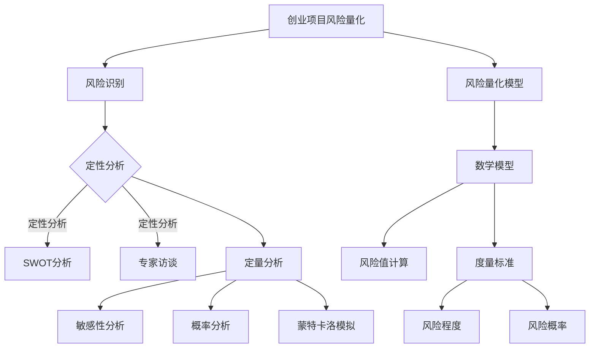

                 

## 文章标题

### 如何进行有效的创业项目风险量化分析

> 关键词：创业项目、风险量化分析、风险管理、风险识别、定量分析、定性分析、模型构建

> 摘要：本文将探讨创业项目风险量化分析的方法和步骤。通过详细解析风险识别、定量分析和定性分析的过程，结合实际案例，帮助创业者更好地理解和实施风险量化，以降低创业失败的概率，提升项目成功的可能性。

---

### 目录大纲

#### 第一部分：引言与概述

##### 第1章：创业项目风险量化分析概述

- **1.1 创业项目风险的定义与重要性**
- **1.2 风险量化的目的与意义**
- **1.3 风险量化的基本原则**
- **1.4 风险量化的常用方法**

##### 第2章：创业项目风险识别

- **2.1 风险识别的方法与技术**
- **2.2 风险识别的流程与步骤**
- **2.3 创业项目风险识别案例分析**

#### 第二部分：风险量化模型与方法

##### 第3章：风险量化模型的基本原理

- **3.1 风险量化的数学模型**
- **3.2 风险量化的度量标准**
- **3.3 风险量化的分析方法**

##### 第4章：定量风险分析

- **4.1 定量风险分析的方法**
- **4.2 定量风险分析的应用案例**

##### 第5章：定性风险分析

- **5.1 定性风险分析的方法**
- **5.2 定性风险分析的应用案例**

##### 第6章：风险量化的综合应用

- **6.1 综合风险量化的意义**
- **6.2 综合风险量化的方法**
- **6.3 综合风险量化的应用案例**

#### 第三部分：创业项目风险量化案例分析

##### 第7章：创业项目风险量化案例研究

- **7.1 案例背景介绍**
- **7.2 案例分析过程**
- **7.3 风险量化结果与应用**

##### 第8章：创业项目风险量化实践指南

- **8.1 风险量化实践步骤**
- **8.2 风险量化工具与应用**
- **8.3 风险量化实践注意事项**

### 附录

- **附录A：风险量化常用工具与资源**
- **附录B：风险量化相关公式与算法**
- **附录C：创业项目风险量化案例数据库**

---

**核心概念与联系流程图**



**核心算法原理讲解伪代码**

```plaintext
// 风险量化核心算法伪代码

function RiskQuantification(风险要素列表, 量化方法) {
    // 初始化风险量化结果
    risk_quantification_result = {}

    // 对风险要素列表进行量化
    for each 风险要素 in 风险要素列表 {
        // 根据量化方法计算风险值
        risk_value = CalculateRiskValue(风险要素, 量化方法)

        // 更新风险量化结果
        risk_quantification_result[风险要素] = risk_value
    }

    // 返回风险量化结果
    return risk_quantification_result
}

function CalculateRiskValue(风险要素, 量化方法) {
    // 根据量化方法计算风险值
    if (量化方法 == '定性分析') {
        risk_value = QualitativeAnalysis(风险要素)
    } else if (量化方法 == '定量分析') {
        risk_value = QuantitativeAnalysis(风险要素)
    } else {
        risk_value = CombinedAnalysis(风险要素)
    }

    return risk_value
}

// 示例：定性分析
function QualitativeAnalysis(风险要素) {
    // 进行SWOT分析
    SWOT_result = SWOTAnalysis(风险要素)

    // 根据SWOT分析结果计算风险值
    risk_value = CalculateRiskValueFromSWOT(SWOT_result)

    return risk_value
}

// 示例：定量分析
function QuantitativeAnalysis(风险要素) {
    // 进行敏感性分析和概率分析
    Sensitivity_result = SensitivityAnalysis(风险要素)
    Probability_result = ProbabilityAnalysis(风险要素)

    // 根据敏感性分析和概率分析结果计算风险值
    risk_value = CalculateRiskValueFromSensitivityAndProbability(Sensitivity_result, Probability_result)

    return risk_value
}

// 示例：组合分析
function CombinedAnalysis(风险要素) {
    // 进行定性分析和定量分析
    Qualitative_result = QualitativeAnalysis(风险要素)
    Quantitative_result = QuantitativeAnalysis(风险要素)

    // 根据定性分析和定量分析结果计算风险值
    risk_value = CalculateRiskValueFromCombined(Qualitative_result, Quantitative_result)

    return risk_value
}
```

---

**核心概念与联系流程图**


**核心算法原理讲解伪代码**

```plaintext
// 风险量化核心算法伪代码

function RiskQuantification(风险要素列表, 量化方法) {
    // 初始化风险量化结果
    risk_quantification_result = {}

    // 对风险要素列表进行量化
    for each 风险要素 in 风险要素列表 {
        // 根据量化方法计算风险值
        risk_value = CalculateRiskValue(风险要素, 量化方法)

        // 更新风险量化结果
        risk_quantification_result[风险要素] = risk_value
    }

    // 返回风险量化结果
    return risk_quantification_result
}

function CalculateRiskValue(风险要素, 量化方法) {
    // 根据量化方法计算风险值
    if (量化方法 == '定性分析') {
        risk_value = QualitativeAnalysis(风险要素)
    } else if (量化方法 == '定量分析') {
        risk_value = QuantitativeAnalysis(风险要素)
    } else {
        risk_value = CombinedAnalysis(风险要素)
    }

    return risk_value
}

// 示例：定性分析
function QualitativeAnalysis(风险要素) {
    // 进行SWOT分析
    SWOT_result = SWOTAnalysis(风险要素)

    // 根据SWOT分析结果计算风险值
    risk_value = CalculateRiskValueFromSWOT(SWOT_result)

    return risk_value
}

// 示例：定量分析
function QuantitativeAnalysis(风险要素) {
    // 进行敏感性分析和概率分析
    Sensitivity_result = SensitivityAnalysis(风险要素)
    Probability_result = ProbabilityAnalysis(风险要素)

    // 根据敏感性分析和概率分析结果计算风险值
    risk_value = CalculateRiskValueFromSensitivityAndProbability(Sensitivity_result, Probability_result)

    return risk_value
}

// 示例：组合分析
function CombinedAnalysis(风险要素) {
    // 进行定性分析和定量分析
    Qualitative_result = QualitativeAnalysis(风险要素)
    Quantitative_result = QuantitativeAnalysis(风险要素)

    // 根据定性分析和定量分析结果计算风险值
    risk_value = CalculateRiskValueFromCombined(Qualitative_result, Quantitative_result)

    return risk_value
}

// 示例：SWOT分析结果计算风险值
function CalculateRiskValueFromSWOT(SWOT_result) {
    // 根据SWOT分析结果计算风险值
    // 具体算法可以根据实际情况进行调整
    risk_value = SWOT_result['S'] + SWOT_result['W'] + SWOT_result['O'] + SWOT_result['T']

    return risk_value
}

// 示例：敏感性分析和概率分析结果计算风险值
function CalculateRiskValueFromSensitivityAndProbability(Sensitivity_result, Probability_result) {
    // 根据敏感性分析和概率分析结果计算风险值
    // 具体算法可以根据实际情况进行调整
    risk_value = Sensitivity_result * Probability_result

    return risk_value
}

// 示例：定性分析和定量分析结果计算风险值
function CalculateRiskValueFromCombined(Qualitative_result, Quantitative_result) {
    // 根据定性分析和定量分析结果计算风险值
    // 具体算法可以根据实际情况进行调整
    risk_value = Qualitative_result + Quantitative_result

    return risk_value
}
```

---

## 第一部分：引言与概述

### 第1章：创业项目风险量化分析概述

#### 1.1 创业项目风险的定义与重要性

在创业项目中，风险是指可能对项目的目标、进度、成本、资源等方面产生负面影响的各种不确定性因素。这些风险可能来源于市场变化、技术难题、人力资源、财务问题等多个方面。创业项目的风险具有多样性和复杂性，如果不进行有效的管理，可能会导致项目失败，从而给投资者和团队带来巨大的损失。

创业项目风险的重要性在于：

1. **保障项目成功**：通过识别和量化风险，可以提前预测潜在问题，制定相应的应对措施，从而降低项目失败的概率。
2. **优化资源配置**：了解项目中的关键风险因素，有助于合理配置资源，避免资源浪费。
3. **提升团队凝聚力**：风险量化分析有助于团队对项目的理解，提高团队成员之间的沟通与协作。
4. **增强投资信心**：投资者通过风险量化分析，可以更全面地了解项目的风险状况，从而做出更明智的投资决策。

#### 1.2 风险量化的目的与意义

风险量化的目的是将风险因素转化为可量化的指标，以便进行更准确的评估和管理。具体包括以下几个方面：

1. **量化风险程度**：通过量化的方法，可以明确风险的大小，为制定风险管理策略提供依据。
2. **排序风险优先级**：量化分析有助于识别和排序项目中的关键风险，优先处理高优先级的风险。
3. **制定风险管理计划**：量化结果可以用来制定具体的风险管理措施，包括风险规避、风险转移、风险接受等。
4. **评估风险管理效果**：通过量化结果，可以评估风险管理措施的有效性，及时调整管理策略。

风险量化的意义在于：

1. **提高决策质量**：量化的风险信息可以更直观地支持决策过程，减少主观判断的干扰。
2. **促进风险管理透明度**：风险量化使项目风险更加透明，便于各利益相关方进行监督和沟通。
3. **增强项目管理效率**：通过量化分析，可以识别和管理风险，从而提高项目的整体管理效率。

#### 1.3 风险量化的基本原则

进行风险量化时，需要遵循以下基本原则：

1. **全面性**：风险量化应覆盖项目的各个方面，确保所有潜在风险都得到识别和评估。
2. **可操作性**：量化方法应具有可操作性，能够实际应用于项目的风险管理和决策过程中。
3. **实用性**：量化方法应具有实用性，能够产生有价值的风险信息，为项目管理和决策提供支持。
4. **一致性**：风险量化的方法和标准应保持一致性，确保量化结果的可比性和可靠性。
5. **动态性**：风险量化应是一个动态过程，能够随着项目进展和环境变化进行调整和更新。

#### 1.4 风险量化的常用方法

风险量化方法可以分为定性分析和定量分析两大类：

1. **定性分析**：定性分析主要通过专家评估和判断来识别和评估风险。常用的方法包括SWOT分析、专家访谈、风险评估矩阵等。

   - **SWOT分析**：SWOT分析是针对项目的优势（Strengths）、劣势（Weaknesses）、机会（Opportunities）和威胁（Threats）进行评估，以识别项目中的主要风险。
   - **专家访谈**：通过访谈行业专家、经验丰富的创业者等，获取对项目风险的深入理解和评估。
   - **风险评估矩阵**：使用矩阵形式对风险的概率和影响进行评估，以确定风险的优先级。

2. **定量分析**：定量分析通过数学模型和统计方法对风险进行量化。常用的方法包括概率分析、敏感性分析、蒙特卡洛模拟等。

   - **概率分析**：计算风险发生的概率，并结合风险的影响，得出风险的综合评估值。
   - **敏感性分析**：分析不同因素对风险的影响程度，确定哪些因素是影响风险的关键因素。
   - **蒙特卡洛模拟**：通过模拟大量随机样本，预测风险的可能取值范围和概率分布，从而评估风险。

通过以上方法，可以系统地识别、量化和分析创业项目中的风险，为项目的顺利实施提供科学依据。

### 第2章：创业项目风险识别

#### 2.1 风险识别的方法与技术

风险识别是风险管理的第一步，它涉及系统地识别和评估项目中可能出现的各种风险。风险识别的方法和技术多种多样，以下是一些常见的方法：

1. **实地调查**：实地调查是通过直接观察和访谈来识别项目中的风险。这种方法可以帮助团队成员深入了解项目实际情况，发现潜在的风险。实地调查通常包括以下步骤：

   - **项目现场观察**：通过实地考察项目现场，观察项目进展和周围环境，发现可能的风险因素。
   - **访谈相关人员**：与项目团队成员、客户、供应商等进行访谈，了解他们的意见和建议，识别潜在的风险。
   - **记录和总结**：将观察和访谈的内容记录下来，并对潜在风险进行分类和总结。

2. **专家访谈**：专家访谈是邀请行业专家、学者、顾问等进行面对面的交流，以获取他们对项目风险的看法和经验。这种方法可以帮助项目团队从外部视角识别风险，并获得有价值的见解。专家访谈的步骤包括：

   - **确定访谈对象**：根据项目特点和需求，选择具备相关知识和经验的专家作为访谈对象。
   - **准备访谈提纲**：制定访谈提纲，明确访谈目的和内容，确保访谈过程有结构性和系统性。
   - **进行访谈**：按照访谈提纲进行交流，记录专家的意见和建议。
   - **分析和总结**：对访谈结果进行分析，识别和总结项目中的潜在风险。

3. **文献综述**：文献综述是通过查阅相关文献、研究报告、案例分析等资料，了解项目中的潜在风险。这种方法可以帮助项目团队获取理论支持和实践经验，提高风险识别的全面性和准确性。文献综述的步骤包括：

   - **确定研究范围**：根据项目需求，明确文献综述的主题和范围。
   - **收集文献资料**：通过数据库检索、图书馆查阅等方式收集相关文献。
   - **阅读和筛选文献**：对收集到的文献进行阅读和筛选，提取与项目相关的风险信息。
   - **分析和总结**：对文献中的风险信息进行分析和总结，识别和归纳项目中的潜在风险。

#### 2.2 风险识别的流程与步骤

风险识别是一个系统性、持续性的过程，通常包括以下步骤：

1. **确定风险识别目标**：明确风险识别的目的和范围，确定需要识别的风险类型和优先级。

2. **收集信息**：通过实地调查、专家访谈、文献综述等方法，收集与项目相关的信息，了解项目环境、需求、资源等。

3. **识别潜在风险**：根据收集到的信息，使用各种方法和技术，识别项目中的潜在风险。这个步骤需要团队成员共同参与，发挥各自的专业知识和经验。

4. **分类和总结**：将识别出的风险进行分类和总结，明确风险的性质、影响和可能性。

5. **记录和文档化**：将识别出的风险记录下来，形成风险清单，并制定相应的文档，确保风险信息得到有效管理和传递。

6. **更新和维护**：随着项目进展和环境变化，定期更新和维护风险清单，确保风险识别的及时性和准确性。

#### 2.3 创业项目风险识别案例分析

以下是一个创业项目风险识别的案例分析，以一家初创科技公司开发新型智能家居设备的案例为例。

1. **案例背景**：

   该公司是一家初创科技公司，专注于智能家居设备的研发和销售。产品包括智能门锁、智能灯光控制系统、智能摄像头等。产品计划在明年年初正式上市。

2. **风险识别过程**：

   - **实地调查**：团队成员亲自到智能家居设备的实际使用场景进行观察，了解用户需求和使用习惯，发现潜在的技术难题和安全隐患。

   - **专家访谈**：邀请智能家居行业的专家进行访谈，了解行业趋势、技术难点和市场风险。

   - **文献综述**：查阅相关文献和行业报告，了解智能家居设备的技术标准、市场状况和竞争态势。

3. **识别出的潜在风险**：

   - **技术风险**：智能家居设备涉及到多个技术领域，包括物联网技术、人工智能、网络安全等。技术实现的复杂性和不确定性可能导致产品功能不稳定或存在安全漏洞。

   - **市场风险**：智能家居市场发展迅速，但市场竞争激烈。新产品的市场接受度、品牌影响力等因素可能影响销售业绩。

   - **财务风险**：初创公司资金有限，如果产品开发周期延长或市场反应不如预期，可能导致资金链断裂。

   - **人力资源风险**：团队成员的技能和能力可能无法满足项目需求，影响项目进度和质量。

   - **法律风险**：智能家居设备可能涉及隐私保护、数据安全等法律问题，需要遵守相关法规和标准。

4. **总结**：

   通过风险识别，团队对项目的潜在风险有了更清晰的认识，为后续的风险评估和风险管理奠定了基础。接下来，团队将针对识别出的风险进行定量和定性分析，制定相应的风险管理策略，确保项目顺利实施。

### 第二部分：风险量化模型与方法

#### 第3章：风险量化模型的基本原理

#### 3.1 风险量化的数学模型

风险量化的核心在于将不可量化的风险因素转化为可度量的指标。数学模型在风险量化过程中扮演着至关重要的角色。以下是一些常用的数学模型：

1. **概率模型**：概率模型用于计算风险事件发生的概率。常见的概率模型包括贝叶斯网络、蒙特卡洛模拟等。贝叶斯网络是一种图形模型，用于表示变量之间的概率依赖关系。蒙特卡洛模拟则通过模拟大量随机样本，估计风险的概率分布。

2. **回归模型**：回归模型用于分析风险因素与结果之间的定量关系。线性回归、非线性回归、逻辑回归等都是常见的回归模型。线性回归适用于分析线性关系，而逻辑回归则适用于分类问题。

3. **决策树模型**：决策树模型通过树形结构对风险因素进行分类和决策。每个节点代表一个决策点，每个分支代表一个决策结果。决策树模型可以用于风险识别和风险评估。

4. **模糊集合模型**：模糊集合模型用于处理不确定性和模糊性。模糊集合通过引入隶属度函数，对风险因素进行量化。

5. **效用理论模型**：效用理论模型用于评估个体在面临风险时的偏好和决策。常见的效用理论模型包括期望效用理论、前景理论等。

#### 3.2 风险量化的度量标准

在风险量化过程中，度量标准用于对风险程度和风险概率进行量化。以下是一些常用的度量标准：

1. **风险程度**：风险程度表示风险对项目目标的影响程度。常用的度量标准包括风险影响程度（RI）和风险严重程度（S）。风险影响程度通常根据风险对项目目标的影响范围和程度进行评估，而风险严重程度则关注风险对项目目标的直接和间接影响。

2. **风险概率**：风险概率表示风险事件发生的可能性。常用的度量标准包括风险发生频率（RF）和风险发生概率（P）。风险发生频率通常基于历史数据和统计模型计算，而风险发生概率则基于专家评估和概率模型计算。

3. **风险值**：风险值是风险程度和风险概率的乘积，用于综合评估风险的大小。常用的风险值计算公式为：\[ R = I \times P \]，其中 \( R \) 表示风险值，\( I \) 表示风险影响程度，\( P \) 表示风险概率。

4. **风险等级**：风险等级是对风险值进行分类和排序的标准。常用的风险等级包括低风险、中风险、高风险等。风险等级可以帮助项目团队集中资源管理高风险，降低项目风险。

#### 3.3 风险量化的分析方法

风险量化分析是通过对风险进行定量和定性分析，以评估和预测风险的大小和影响。以下是一些常用的风险量化分析方法：

1. **定性分析**：定性分析主要通过专家评估和判断来识别和评估风险。常用的定性分析方法包括SWOT分析、专家访谈、风险评估矩阵等。定性分析适用于对风险的初步识别和评估，可以提供风险的大致估计。

2. **定量分析**：定量分析通过数学模型和统计方法对风险进行量化。常用的定量分析方法包括概率分析、敏感性分析、蒙特卡洛模拟等。定量分析可以提供更准确的风险估计，为决策提供科学依据。

3. **组合分析**：组合分析是将定性分析和定量分析结合起来，以提供更全面的风险评估。组合分析可以同时考虑风险的质和量，为决策提供更可靠的参考。

#### 3.4 风险量化模型的应用

风险量化模型在项目管理中具有广泛的应用。以下是一些常见的应用场景：

1. **项目风险规划**：通过风险量化模型，项目团队可以识别和评估项目中的风险，制定相应的风险应对策略和应急计划。

2. **投资决策**：投资者可以利用风险量化模型对项目风险进行评估，从而做出更明智的投资决策。

3. **风险管理**：风险量化模型可以用于监测和评估项目风险，帮助项目团队及时发现和应对风险。

4. **项目评估**：通过风险量化模型，可以对项目进展和风险情况进行评估，为项目决策提供依据。

#### 3.5 风险量化模型的选择

选择合适的风险量化模型是风险量化分析的关键。以下是一些选择风险量化模型时需要考虑的因素：

1. **项目特点**：不同的项目特点需要不同类型的风险量化模型。例如，技术风险较高的项目可能需要使用概率分析和决策树模型，而市场风险较高的项目可能需要使用市场预测模型。

2. **数据可用性**：风险量化模型需要依赖于可靠的数据。如果项目数据不足，可能需要考虑使用专家评估方法。

3. **模型复杂性**：风险量化模型的复杂性会影响其适用性和实用性。简单的模型适用于初步评估，而复杂的模型适用于详细分析。

4. **适用性**：选择的风险量化模型应适用于项目的具体情况和环境。

通过综合考虑以上因素，项目团队可以选择最合适的风险量化模型，以提高风险管理的有效性。

### 第4章：定量风险分析

#### 4.1 定量风险分析的方法

定量风险分析是一种通过数学模型和统计方法对风险进行量化的方法。它旨在提供对风险事件发生的概率及其影响的准确估计。以下是一些常用的定量风险分析方法：

1. **概率分析**：

   概率分析是一种计算风险事件发生概率的方法。它通常基于历史数据和专家评估。概率分析可以帮助项目团队了解哪些风险事件最有可能发生，从而有针对性地制定应对策略。具体步骤如下：

   - **数据收集**：收集与风险事件相关的历史数据，如失败率、市场波动等。
   - **概率估计**：使用统计方法（如贝叶斯统计、回归分析等）对风险事件发生的概率进行估计。
   - **结果解读**：根据概率估计结果，识别高风险事件并制定应对措施。

2. **敏感性分析**：

   敏感性分析是一种评估不同因素对风险影响程度的方法。它通过分析不同因素的变化对风险值的影响，帮助项目团队了解哪些因素是风险的驱动因素。具体步骤如下：

   - **确定关键因素**：识别对风险影响最大的关键因素，如成本、时间、技术难度等。
   - **分析因素变化**：模拟关键因素的变化（如增加成本、缩短时间等），观察其对风险值的影响。
   - **结果解读**：根据敏感性分析结果，确定需要重点关注和管理的因素，以降低风险。

3. **蒙特卡洛模拟**：

   蒙特卡洛模拟是一种通过模拟大量随机样本来预测风险事件可能结果的统计方法。它可以帮助项目团队了解风险的可能取值范围和概率分布，从而做出更科学的决策。具体步骤如下：

   - **建立模型**：根据项目情况和风险因素，建立蒙特卡洛模拟模型。
   - **模拟运行**：运行模型，生成大量随机样本，记录每次模拟的结果。
   - **结果分析**：分析模拟结果，计算风险的概率分布和期望值，识别高风险区域。

#### 4.2 定量风险分析的应用案例

以下是一个定量风险分析的应用案例，以一家初创公司开发智能家居设备为例。

1. **案例背景**：

   一家初创公司计划开发一款智能门锁，并计划在明年年初推出市场。公司团队需要评估项目中的技术风险和市场风险，以便制定有效的风险管理策略。

2. **技术风险分析**：

   - **关键因素**：技术风险的关键因素包括物联网技术、网络安全和硬件可靠性。
   - **概率估计**：基于历史数据和专家评估，估计技术风险的发生概率。例如，物联网技术的失败率可能为5%，网络安全风险可能为10%，硬件可靠性风险可能为15%。
   - **结果解读**：根据概率估计结果，技术风险的总概率为30%。

3. **市场风险分析**：

   - **关键因素**：市场风险的关键因素包括市场竞争、客户接受度和品牌知名度。
   - **概率估计**：基于市场研究和专家评估，估计市场风险的发生概率。例如，市场竞争风险可能为20%，客户接受度风险可能为15%，品牌知名度风险可能为25%。
   - **结果解读**：根据概率估计结果，市场风险的总概率为60%。

4. **综合分析**：

   - **风险值计算**：使用概率分析的方法，计算技术风险和市场风险的风险值。例如，技术风险的风险值为\[0.3 \times （技术风险影响程度）\]，市场风险的风险值为\[0.6 \times （市场风险影响程度）\]。
   - **结果解读**：根据风险值计算结果，技术风险和市场风险的总风险值为\[0.3 \times （技术风险影响程度）+ 0.6 \times （市场风险影响程度）\]。

通过定量风险分析，公司团队可以更准确地了解项目中的风险情况，并制定相应的风险管理策略，以确保项目的顺利推进。

### 第5章：定性风险分析

#### 5.1 定性风险分析的方法

定性风险分析是一种通过主观评估和专家判断来识别和评估风险的方法。它适用于对风险事件的初步评估和优先级排序。以下是一些常用的定性风险分析方法：

1. **SWOT分析**：

   SWOT分析是一种评估项目的优势（Strengths）、劣势（Weaknesses）、机会（Opportunities）和威胁（Threats）的方法。通过SWOT分析，项目团队可以全面了解项目的内外部环境，识别潜在的风险和机会。

   - **优势**：分析项目在技术、团队、资源等方面的优势，以及这些优势如何有助于降低风险。
   - **劣势**：识别项目在技术、团队、资源等方面的劣势，以及这些劣势可能带来的风险。
   - **机会**：分析外部环境中的机会，如市场需求增长、技术创新等，以及如何利用这些机会降低风险。
   - **威胁**：识别外部环境中的威胁，如竞争对手、市场变化等，以及如何应对这些威胁。

2. **专家访谈**：

   专家访谈是一种通过与行业专家、学者、顾问等进行面对面交流来获取他们对项目风险的看法和经验的方法。通过专家访谈，项目团队可以深入了解行业动态和专业知识，识别潜在的风险因素。

   - **确定访谈对象**：根据项目特点和需求，选择具备相关知识和经验的专家作为访谈对象。
   - **准备访谈提纲**：制定访谈提纲，明确访谈目的和内容，确保访谈过程有结构性和系统性。
   - **进行访谈**：按照访谈提纲进行交流，记录专家的意见和建议。
   - **分析和总结**：对访谈结果进行分析，识别和总结项目中的潜在风险。

3. **风险评估矩阵**：

   风险评估矩阵是一种通过评估风险的概率和影响来识别和排序风险的方法。通过风险评估矩阵，项目团队可以直观地了解不同风险的重要性和优先级。

   - **定义评估标准**：确定风险概率和影响的评估标准，通常采用高、中、低三个等级。
   - **评估风险**：对每个风险进行概率和影响的评估，填写风险评估矩阵。
   - **排序风险**：根据评估结果，对风险进行排序，优先处理高优先级的风险。

#### 5.2 定性风险分析的应用案例

以下是一个定性风险分析的应用案例，以一家初创科技公司开发智能家居设备的案例为例。

1. **案例背景**：

   一家初创科技公司计划开发智能家居设备，包括智能门锁、智能灯光控制系统和智能摄像头。公司团队需要对项目进行定性风险分析，以便制定有效的风险管理策略。

2. **SWOT分析**：

   - **优势**：

     - 技术优势：公司在智能家居技术领域拥有丰富的研发经验，技术团队熟练掌握物联网、人工智能等技术。
     - 市场优势：智能家居市场前景广阔，市场需求持续增长，公司有机会抓住市场机遇。
     - 资源优势：公司拥有一定的资金支持，可以保障项目研发和推广的资金需求。

   - **劣势**：

     - 经验不足：作为初创公司，公司缺乏在智能家居市场运营的经验，可能面临市场推广和用户接受的挑战。
     - 技术风险：智能家居设备涉及到多个技术领域，如物联网、人工智能、网络安全等，技术实现的复杂性和不确定性可能导致产品功能不稳定或存在安全漏洞。
     - 资金压力：公司资金有限，如果产品开发周期延长或市场反应不如预期，可能导致资金链断裂。

   - **机会**：

     - 市场需求增长：智能家居市场正处于快速增长阶段，公司有机会抓住市场机遇，实现快速发展。
     - 技术创新：随着技术的不断进步，智能家居设备的功能和性能将不断提升，公司有机会通过技术创新获得竞争优势。
     - 政策支持：政府对智能家居产业的扶持政策为公司提供了良好的发展环境。

   - **威胁**：

     - 竞争激烈：智能家居市场竞争激烈，公司需要面对强大的竞争对手，可能面临市场份额被抢占的风险。
     - 法规风险：智能家居设备可能涉及隐私保护、数据安全等法律问题，公司需要遵守相关法规和标准，可能面临法律风险。

3. **专家访谈**：

   公司团队邀请智能家居行业的专家进行访谈，了解他们对项目风险的看法和经验。访谈内容包括：

   - 智能家居市场发展趋势和竞争态势。
   - 技术实现的难点和风险。
   - 市场推广和用户接受策略。
   - 法律法规和标准要求。

根据访谈结果，公司团队对项目风险进行了进一步识别和评估。

4. **风险评估矩阵**：

   - **风险概率**：根据专家评估，技术风险的概率为70%，市场风险的概率为50%，资金风险的概率为30%。
   - **风险影响**：技术风险的影响为高，市场风险的影响为中，资金风险的影响为低。
   - **风险等级**：根据评估结果，技术风险为高风险，市场风险为中风险，资金风险为低风险。

通过定性风险分析，公司团队对项目的潜在风险有了更清晰的认识，为后续的风险评估和风险管理奠定了基础。接下来，团队将针对识别出的风险进行定量分析，制定相应的风险管理策略，确保项目的顺利实施。

### 第6章：风险量化的综合应用

#### 6.1 综合风险量化的意义

在创业项目中，风险量化不仅需要考虑单一的风险因素，还需要考虑多个风险因素之间的相互作用和综合影响。综合风险量化是一种将多个风险因素整合起来，进行整体评估和决策的方法。其意义在于：

1. **全面性**：综合风险量化能够全面考虑创业项目中各种风险因素，避免遗漏重要风险，从而提供更准确的评估。
2. **关联性**：风险因素之间存在相互影响和关联，综合风险量化能够揭示这些关联，帮助创业者识别潜在的高风险组合。
3. **决策支持**：通过综合风险量化，创业者可以更清楚地了解项目风险的整体状况，从而制定更有效的风险管理策略和决策。
4. **优化资源配置**：综合风险量化有助于创业者合理配置资源，优先解决高风险问题，提高资源利用效率。

#### 6.2 综合风险量化的方法

综合风险量化通常结合定性分析和定量分析的方法，通过以下几个步骤进行：

1. **确定风险因素**：首先，需要识别和列出创业项目中的所有风险因素，包括市场风险、财务风险、技术风险、人力资源风险等。

2. **评估风险概率和影响**：对每个风险因素进行概率和影响的评估。可以使用专家评分、历史数据、模拟等方法。

3. **构建风险矩阵**：将评估的风险概率和影响整合到风险矩阵中，形成每个风险因素的得分。

4. **组合风险评估**：考虑风险因素之间的相互作用，使用组合模型（如多属性决策分析、多因素风险分析等）对综合风险进行评估。

5. **风险排序和优先级**：根据综合风险评估结果，对风险进行排序和优先级排序，确定哪些风险需要优先管理。

#### 6.3 综合风险量化的应用案例

以下是一个综合风险量化的应用案例，以一家初创科技公司开发智能家居设备的案例为例。

1. **案例背景**：

   一家初创科技公司计划开发智能家居设备，包括智能门锁、智能灯光控制系统和智能摄像头。公司需要在项目初期进行综合风险量化，以制定有效的风险管理策略。

2. **确定风险因素**：

   - **市场风险**：市场需求不稳定、竞争激烈、客户接受度低。
   - **财务风险**：资金不足、融资困难、成本超支。
   - **技术风险**：技术实现难度大、产品功能不稳定、安全漏洞。
   - **人力资源风险**：人才流失、团队成员技能不足、管理不善。

3. **评估风险概率和影响**：

   - **市场风险**：概率为70%，影响为高。
   - **财务风险**：概率为60%，影响为高。
   - **技术风险**：概率为50%，影响为高。
   - **人力资源风险**：概率为40%，影响为中。

4. **构建风险矩阵**：

   使用风险矩阵将评估的风险概率和影响进行整合，形成每个风险因素的得分。

5. **组合风险评估**：

   使用多因素风险分析模型，综合考虑风险因素之间的相互作用，对综合风险进行评估。例如，市场风险和技术风险的相互作用可能导致产品无法满足市场需求。

6. **风险排序和优先级**：

   根据综合风险评估结果，市场风险和技术风险是最高的优先级，需要重点关注和管理。财务风险和人力资源风险次之，也需要制定相应的风险管理策略。

通过综合风险量化，公司团队可以更全面地了解项目中的风险状况，有针对性地进行风险管理，确保项目的顺利实施。

### 第7章：创业项目风险量化案例研究

#### 7.1 案例背景介绍

为了更好地理解创业项目风险量化分析的实际应用，我们以一家初创科技公司开发智能健康监测设备的案例为例。这家初创公司名为“HealthMate”，致力于研发和推广一款集成了可穿戴传感器和人工智能算法的健康监测设备。

**项目概述**：

- **产品目标**：开发一款可穿戴设备，能够实时监测用户的心率、血压、体温等生命体征，并通过人工智能算法分析健康数据，提供个性化的健康建议。
- **市场需求**：随着人们对健康意识的提高，智能健康监测设备市场迅速增长，预计在未来几年内市场规模将大幅扩大。
- **团队构成**：公司由一支技术精湛的研发团队组成，包括硬件工程师、软件工程师和医疗专家。

**项目阶段**：项目目前处于研发阶段，即将完成原型设计，计划在接下来的6个月内完成产品开发和市场测试。

#### 7.2 案例分析过程

在项目启动阶段，HealthMate团队首先进行了全面的风险识别和量化分析，以确保项目能够顺利推进。以下为具体的分析过程：

1. **风险识别**：

   - **技术风险**：智能健康监测设备的技术实现涉及多个领域，包括传感器技术、数据处理和人工智能算法。团队通过专家访谈和实地调研，识别出以下技术风险：
     - **传感器准确度不足**：可能导致健康数据不准确。
     - **数据处理延迟**：可能导致数据丢失或处理错误。
     - **算法精度问题**：可能导致健康分析结果不准确。

   - **市场风险**：市场竞争激烈，竞争对手众多，可能影响产品销售。
     - **客户接受度低**：用户可能对新产品持怀疑态度，不愿尝试。

   - **财务风险**：公司资金有限，如果产品开发进度延误或市场反应不如预期，可能导致资金链断裂。
     - **融资困难**：在产品尚未上市时，获取外部资金支持可能较为困难。

   - **人力资源风险**：团队成员技能不足或人才流失可能影响项目进度。
     - **项目管理不善**：可能导致项目延误或质量下降。

2. **定性风险分析**：

   - **SWOT分析**：
     - **优势**：技术团队具备强大的研发能力，产品具有创新性和先进性。
     - **劣势**：公司规模较小，市场推广能力有限。
     - **机会**：智能健康监测设备市场前景广阔，有机会实现快速增长。
     - **威胁**：市场竞争激烈，可能面临价格战和品牌竞争。

   - **专家访谈**：团队邀请医疗领域的专家和行业顾问进行访谈，收集他们对项目风险的看法和经验。访谈结果显示，技术风险和市场竞争是主要关注点。

3. **定量风险分析**：

   - **概率分析**：团队使用历史数据和专家评估，对每个风险的概率进行估计。例如，传感器准确度不足的概率为30%，数据处理延迟的概率为20%，算法精度问题的概率为25%。

   - **敏感性分析**：团队分析了不同因素（如成本、时间、市场反应）对项目风险的影响。结果显示，成本增加和时间延误会显著提高项目风险。

   - **蒙特卡洛模拟**：团队使用蒙特卡洛模拟，模拟了大量随机样本，预测了项目可能的结果和风险概率分布。模拟结果显示，项目成功的概率为60%，但存在一定的风险。

4. **风险值计算**：

   - **风险值计算公式**：\[ R = I \times P \]
     - \( R \) 为风险值，表示风险的大小。
     - \( I \) 为风险影响程度，表示风险对项目目标的直接影响。
     - \( P \) 为风险概率，表示风险事件发生的可能性。

   - **计算结果**：
     - **技术风险**：传感器准确度不足的风险值为\[0.3 \times 3 = 0.9\]，数据处理延迟的风险值为\[0.2 \times 3 = 0.6\]，算法精度问题的风险值为\[0.25 \times 3 = 0.75\]。
     - **市场风险**：客户接受度低的风险值为\[0.5 \times 2 = 1.0\]。
     - **财务风险**：资金不足的风险值为\[0.6 \times 2 = 1.2\]。
     - **人力资源风险**：人才流失的风险值为\[0.4 \times 2 = 0.8\]。

5. **风险排序和优先级**：

   根据风险值计算结果，团队对风险进行了排序和优先级排序，确定了以下高风险因素：
   - **财务风险**：资金不足，风险值为1.2。
   - **技术风险**：算法精度问题，风险值为0.75。
   - **市场风险**：客户接受度低，风险值为1.0。
   - **人力资源风险**：人才流失，风险值为0.8。

#### 7.3 风险量化结果与应用

通过风险量化分析，HealthMate团队得出了以下结论：

1. **财务风险**：

   - **问题**：资金不足可能导致项目延误或失败。
   - **解决方案**：团队计划通过增加内部资金储备、寻求外部投资和降低运营成本来缓解财务风险。

2. **技术风险**：

   - **问题**：算法精度问题可能影响产品的市场竞争力。
   - **解决方案**：团队计划加强技术研发，优化算法，并进行多次测试和验证。

3. **市场风险**：

   - **问题**：客户接受度低可能影响产品的销售和市场占有率。
   - **解决方案**：团队计划加强市场调研，了解用户需求，并通过营销活动和用户反馈来提高客户接受度。

4. **人力资源风险**：

   - **问题**：人才流失可能影响项目的研发进度和质量。
   - **解决方案**：团队计划通过提高员工福利待遇、加强培训和职业发展机会来留住核心人才。

通过综合风险量化分析，HealthMate团队明确了项目中的关键风险因素，并制定了相应的风险管理策略，为项目的顺利实施提供了有力保障。

### 第8章：创业项目风险量化实践指南

#### 8.1 风险量化实践步骤

进行创业项目风险量化，可以遵循以下步骤：

1. **确定项目目标和范围**：明确项目的目标和预期成果，确定风险量化的范围，确保风险识别和分析的全面性。

2. **组建风险量化团队**：组建一支包括风险管理专家、项目团队成员和相关领域专家的风险量化团队，确保团队具备识别和分析风险的专业能力。

3. **风险识别**：通过实地调查、专家访谈、文献综述等方法，识别项目中可能出现的风险。将识别出的风险记录下来，形成风险清单。

4. **定性分析**：使用SWOT分析、专家访谈、风险评估矩阵等方法对识别出的风险进行定性分析，评估风险的概率和影响程度。

5. **定量分析**：使用概率分析、敏感性分析、蒙特卡洛模拟等方法对关键风险进行定量分析，计算风险值。

6. **风险排序和优先级**：根据风险值和风险评估结果，对风险进行排序和优先级排序，确定哪些风险需要优先管理。

7. **制定风险管理策略**：根据风险量化的结果，制定相应的风险管理策略，包括风险规避、风险转移、风险接受等。

8. **实施风险管理**：将风险管理策略付诸实践，监控和评估风险管理措施的有效性，及时调整策略。

9. **定期更新和回顾**：随着项目进展和环境变化，定期更新风险清单和风险评估结果，确保风险量化的及时性和准确性。

#### 8.2 风险量化工具与应用

在风险量化过程中，可以使用多种工具和方法来辅助分析和决策。以下是一些常用的风险量化工具：

1. **定性分析工具**：
   - **SWOT分析**：通过SWOT分析，可以识别和评估项目的优势、劣势、机会和威胁，为风险识别提供基础。
   - **专家访谈**：通过与专家进行访谈，获取专业意见和建议，深入了解风险因素。
   - **风险评估矩阵**：使用风险评估矩阵，对风险的概率和影响进行量化，帮助项目团队集中资源和精力管理高风险。

2. **定量分析工具**：
   - **概率分析**：使用概率分析，计算风险事件发生的概率，为决策提供科学依据。
   - **敏感性分析**：通过敏感性分析，了解不同因素对风险的影响程度，确定关键风险因素。
   - **蒙特卡洛模拟**：使用蒙特卡洛模拟，模拟大量随机样本，预测风险的可能结果和概率分布。

3. **软件工具**：
   - **风险管理软件**：如RiskMatrix、Riskalyze等，这些软件提供了丰富的功能，包括风险识别、量化、排序和报告生成等。
   - **统计软件**：如SPSS、R等，可以用于进行概率分析、敏感性分析和蒙特卡洛模拟。

4. **应用案例**：
   - **初创公司项目**：通过使用SWOT分析和专家访谈，识别和评估初创公司的市场风险、技术风险和财务风险。
   - **技术创新项目**：通过敏感性分析和蒙特卡洛模拟，评估技术创新项目的研发风险和市场竞争风险。
   - **大型工程项目**：使用风险评估矩阵和概率分析，识别和管理大型工程项目的风险，确保项目进度和质量。

#### 8.3 风险量化实践注意事项

在进行创业项目风险量化时，需要注意以下几点：

1. **数据质量**：风险量化依赖于准确的数据和信息。确保收集到的数据真实可靠，避免因数据质量问题导致的风险分析偏差。

2. **方法选择**：根据项目特点和需求，选择合适的风险量化方法。不同的方法适用于不同的风险类型和项目阶段。

3. **动态调整**：风险量化是一个动态过程，需要随着项目进展和环境变化进行更新和调整。定期回顾和更新风险评估结果，确保风险管理的有效性。

4. **团队合作**：风险量化需要团队协作，团队成员应积极参与，提供专业意见和建议。通过团队合作，可以提高风险识别和分析的准确性和全面性。

5. **结果应用**：风险量化结果应得到充分应用，为项目决策和管理提供支持。根据风险量化结果，制定有效的风险管理策略和措施，确保项目的顺利实施。

通过遵循以上实践指南，创业项目团队可以更有效地进行风险量化，降低项目失败的风险，提升项目的成功率。

### 附录

#### 附录A：风险量化常用工具与资源

以下是一些常用的风险量化工具和资源：

1. **软件工具**：
   - **RiskMatrix**：一款功能强大的风险管理软件，提供风险识别、量化、排序和报告生成等功能。
   - **Riskalyze**：一款用户友好的风险管理工具，支持概率分析和敏感性分析。
   - **OpenRisk**：一个开源的风险管理平台，支持多种风险量化方法，包括概率分析、蒙特卡洛模拟等。

2. **在线资源**：
   - **PMI风险管理系统**：美国项目管理协会提供的风险管理资源和工具，包括风险管理指南、模板和案例。
   - **Risk-Kit**：提供风险识别、分析和管理的在线资源，包括教程、工具和案例分析。

3. **书籍和文献**：
   - **《风险管理：实践与案例》**：详细介绍了风险管理的方法和案例分析，适合初学者和专业人士。
   - **《风险量化技术》**：涵盖了风险量化理论、方法和实际应用，适合高级读者。

#### 附录B：风险量化相关公式与算法

以下是一些常用的风险量化公式和算法：

1. **风险值计算公式**：
   \[
   R = I \times P
   \]
   其中，\( R \) 表示风险值，\( I \) 表示风险影响程度，\( P \) 表示风险概率。

2. **概率分析**：
   - **贝叶斯概率公式**：
     \[
     P(A|B) = \frac{P(B|A) \times P(A)}{P(B)}
     \]
     其中，\( P(A|B) \) 表示在事件B发生的条件下事件A的概率，\( P(B|A) \) 表示在事件A发生的条件下事件B的概率，\( P(A) \) 表示事件A的概率，\( P(B) \) 表示事件B的概率。

3. **敏感性分析**：
   - **敏感性指数**：
     \[
     \text{敏感性指数} = \frac{\Delta R}{\Delta I}
     \]
     其中，\( \Delta R \) 表示风险值的变动量，\( \Delta I \) 表示风险影响程度的变动量。

4. **蒙特卡洛模拟**：
   - **模拟结果计算**：
     \[
     \mu = \frac{1}{N} \sum_{i=1}^{N} X_i
     \]
     \[
     \sigma^2 = \frac{1}{N-1} \sum_{i=1}^{N} (X_i - \mu)^2
     \]
     其中，\( \mu \) 表示模拟结果的期望值，\( \sigma^2 \) 表示模拟结果的标准差，\( X_i \) 表示第\( i \)次模拟的结果，\( N \) 表示模拟次数。

#### 附录C：创业项目风险量化案例数据库

为方便研究者、从业者学习和参考，本文提供了一些创业项目风险量化的案例数据库，这些数据库包含不同类型创业项目的风险识别、量化和管理过程：

1. **初创企业数据库**：
   - **Startup Genome Project**：包含全球初创企业的案例研究，涵盖市场风险、技术风险、财务风险等方面。
   - **Kauffman Foundation**：提供关于初创企业的风险管理案例，包括风险识别、分析和应对策略。

2. **技术创新项目数据库**：
   - **Innovation Policy Consortium**：收集了多个技术创新项目的风险管理案例，包括研发风险、市场风险和财务风险。
   - **National Science Foundation**：提供关于技术创新项目的风险管理指南和案例库。

3. **大型工程项目数据库**：
   - **Construction Industry Institute**：包含大型工程项目的风险管理案例，涵盖项目规划、执行和监控过程中的风险识别和管理。

通过这些案例数据库，读者可以了解到不同类型创业项目的风险量化过程，学习有效的风险管理策略和措施。

---

**作者信息**

作者：AI天才研究院/AI Genius Institute & 禅与计算机程序设计艺术 /Zen And The Art of Computer Programming

---

**结束语**

本文通过详细探讨创业项目风险量化分析的方法和步骤，旨在帮助创业者更好地理解和实施风险量化，从而降低创业失败的概率，提升项目成功的可能性。通过本文的介绍，读者应能够：

1. **理解风险量化的核心概念**：包括风险识别、定性分析、定量分析、综合风险量化等。
2. **掌握常用的风险量化方法**：如概率分析、敏感性分析、蒙特卡洛模拟等。
3. **了解如何应用风险量化模型**：在实际创业项目中，通过案例分析，读者可以学习到如何将理论应用到实践中。
4. **掌握风险量化的实践指南**：通过详细步骤和工具介绍，读者可以更有效地进行风险量化，提高项目成功率。

创业项目风险量化是一个复杂而关键的过程，需要创业者持续关注和学习。希望通过本文，读者能够在创业道路上更加稳健地前行，实现自己的创业梦想。

---

**最佳实践 Tips**

1. **及时更新风险信息**：随着项目进展和环境变化，定期更新风险信息，确保风险量化的准确性和及时性。
2. **利用专家智慧**：邀请行业专家和顾问参与风险识别和量化，以提高风险分析的全面性和准确性。
3. **制定详细的风险应对计划**：针对识别出的关键风险，制定详细的应对策略和计划，确保在风险发生时能够迅速响应。
4. **定期回顾和评估**：定期回顾和评估风险量化的效果，根据实际情况调整风险管理策略。

**小结**

创业项目风险量化是项目管理中的重要环节，通过系统地识别、分析和量化风险，可以帮助创业者更好地应对不确定性和挑战，降低项目失败的概率。本文介绍了风险量化的核心概念、方法和实践指南，结合实际案例，为读者提供了全面的风险管理思路。

**注意事项**

1. **数据质量**：确保收集到的数据真实可靠，避免因数据问题导致的风险分析偏差。
2. **方法选择**：根据项目特点和需求，选择合适的风险量化方法，避免盲目跟风。
3. **团队合作**：风险量化需要团队协作，充分调动团队成员的智慧和资源，提高风险识别和分析的准确性和全面性。
4. **持续学习**：随着风险管理和量化技术的发展，创业者应持续学习和更新知识，掌握最新的风险管理工具和方法。

**拓展阅读**

1. **《创业项目风险管理》**：详细介绍创业项目风险管理的理论和实践，适合创业者和管理者阅读。
2. **《风险管理：理论与实践》**：涵盖风险管理的基本理论、方法和案例，适合风险管理专业人士阅读。
3. **《蒙特卡洛方法及其应用》**：详细讲解蒙特卡洛模拟的理论和应用，适合对定量风险分析感兴趣的读者。

通过拓展阅读，读者可以更深入地了解风险量化分析的理论和实践，提升自己的风险管理能力。希望本文能为创业者在风险量化方面提供有价值的参考和指导。

