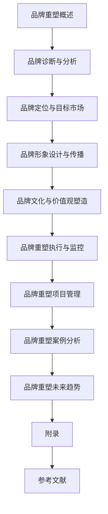

                 

### 《如何进行有效的品牌重塑》

关键词：品牌重塑、品牌诊断、品牌定位、品牌形象、品牌文化、项目管理

摘要：本文将从品牌重塑的定义、背景、必要性、策略与流程、项目管理与案例分析等方面，系统阐述如何进行有效的品牌重塑。通过逐步分析，提供实用的方法和建议，帮助企业提升品牌价值，增强市场竞争力。

---

# 第一部分：品牌重塑的背景与核心概念

## 1.1 品牌重塑的重要性

品牌重塑是一种通过重新审视、重新设计或重新定位品牌，以达到提升品牌价值、增强品牌竞争力、改善市场表现的目的。品牌重塑不仅仅是对品牌视觉形象或名称的修改，它还涉及到品牌核心价值的重新定义、品牌文化的重塑以及品牌传播策略的调整。

### 1.1.1 品牌重塑的定义与作用

**品牌重塑的定义：**
品牌重塑是对品牌核心价值、品牌形象、品牌传播等元素的全面升级和优化。它是对企业现有品牌资产进行重新配置和重组，以适应新的市场环境和消费者需求。

**品牌重塑的作用：**
1. 提升品牌价值：通过重塑品牌，可以提升品牌在消费者心中的价值认知，增加品牌溢价。
2. 增强品牌竞争力：重塑后的品牌能够更好地适应市场竞争，提升品牌的市场份额。
3. 改善市场表现：成功的品牌重塑能够帮助企业改善销售业绩、提升客户忠诚度。

### 1.1.2 品牌重塑的时代背景

品牌重塑的时代背景可以从以下几个方面来理解：

1. **市场竞争加剧**：随着市场的不断变化和竞争的加剧，企业需要通过品牌重塑来提升自身的市场竞争力。
2. **消费者需求多样化**：消费者对品牌的期望和需求日益多样化，企业需要通过品牌重塑来更好地满足消费者的需求。
3. **数字化时代**：数字化技术的发展，为品牌重塑提供了新的工具和手段，如社交媒体、大数据分析等。
4. **全球化趋势**：全球化的背景下，企业需要通过品牌重塑来适应不同国家和地区的市场需求和文化特点。

### 1.1.3 品牌重塑的必要性与挑战

品牌重塑的必要性与以下几个方面密切相关：

1. **品牌老化**：随着时间推移，品牌可能会失去原有的活力和吸引力，需要通过重塑来焕发新生。
2. **市场竞争**：在激烈的市场竞争中，企业需要通过品牌重塑来提升品牌形象，增强竞争力。
3. **消费者变化**：消费者的需求、喜好和购买行为在不断变化，企业需要通过品牌重塑来适应这些变化。

然而，品牌重塑也面临一系列挑战：

1. **文化认同**：品牌重塑可能会引起内部员工的抵触，需要通过有效沟通来建立新的文化认同。
2. **市场适应性**：品牌重塑需要确保新品牌能够适应不同的市场和消费者群体。
3. **成本与风险**：品牌重塑可能涉及大量的资源和时间投入，存在一定的风险和不确定性。

### 1.2 品牌重塑的目标与原则

品牌重塑的目标和原则是确保品牌重塑过程有序、高效和成功的基石。

### 1.2.1 明确品牌重塑的目标

品牌重塑的目标包括：

1. 提升品牌价值：通过重塑，提升品牌在消费者心中的价值认知，增加品牌溢价。
2. 增强品牌认知：提高品牌知名度和美誉度，使品牌在市场中更具竞争力。
3. 适应市场变化：确保品牌能够适应市场变化和消费者需求，保持市场领先地位。

### 1.2.2 制定品牌重塑的原则

品牌重塑应遵循以下原则：

1. **一致性原则**：确保品牌重塑过程中的所有元素（如品牌形象、品牌文化、品牌传播）保持一致。
2. **创新性原则**：在重塑过程中，要勇于创新，使新品牌更具吸引力和竞争力。
3. **可持续性原则**：确保品牌重塑的长期效果，使其能够在未来持续发挥作用。

### 1.2.3 品牌重塑的价值评估

品牌重塑的价值评估是衡量品牌重塑成效的重要环节。以下方法可用于评估品牌重塑的价值：

1. **财务指标**：如销售收入、利润率、市场份额等。
2. **消费者调查**：通过问卷调查、深度访谈等方式了解消费者对品牌的认知和态度变化。
3. **品牌资产评估**：通过品牌价值评估模型，如品牌资产评估（BAV）、品牌忠诚度等指标来评估品牌重塑的效果。

### 1.3 品牌重塑的常见问题与误区

品牌重塑是一个复杂的过程，企业在进行品牌重塑时可能会遇到以下问题：

1. **缺乏明确目标**：企业往往在品牌重塑过程中缺乏明确的目标和方向，导致重塑效果不佳。
2. **忽视内部沟通**：品牌重塑需要得到内部员工的认同和支持，否则可能会遇到阻力。
3. **盲目跟风**：企业在进行品牌重塑时，可能会盲目模仿其他成功案例，而忽略自身品牌的独特性。

### 1.3.1 品牌重塑中的常见问题

1. **品牌定位不准确**：品牌定位是品牌重塑的关键，如果定位不准确，可能导致品牌重塑效果不显著。
2. **品牌传播策略不当**：品牌重塑需要有效的品牌传播策略，否则新品牌难以在市场中获得关注。
3. **品牌形象设计过于复杂**：品牌形象设计要简洁明了，过于复杂的形象设计可能会让消费者产生混淆。

### 1.3.2 品牌重塑的误区解析

1. **忽略品牌文化**：品牌文化是品牌的灵魂，品牌重塑不能忽视品牌文化的重塑。
2. **过度依赖外部咨询公司**：企业应该发挥自身的主观能动性，在品牌重塑过程中不能完全依赖外部咨询公司。
3. **忽视消费者需求**：品牌重塑的目的是满足消费者需求，如果忽视消费者需求，品牌重塑可能会失败。

### 1.3.3 如何避免品牌重塑失败

1. **明确品牌重塑的目标和策略**：确保品牌重塑有明确的方向和目标，避免盲目行动。
2. **加强内部沟通和协作**：建立有效的内部沟通机制，确保品牌重塑得到内部员工的认同和支持。
3. **注重消费者反馈**：在品牌重塑过程中，要密切关注消费者反馈，根据消费者需求进行调整。

---

通过以上分析，我们可以看出，品牌重塑是一项复杂但至关重要的任务。只有明确目标、制定合理的策略、强化内部沟通、注重消费者需求，才能确保品牌重塑取得成功。

**Mermaid 流程图：**

**核心概念与联系：**

品牌重塑的定义、作用、时代背景、必要性、目标与原则以及常见问题与误区，这些核心概念相互关联，构成了品牌重塑的整体框架。品牌诊断与分析是品牌重塑的基础，品牌定位与目标市场是品牌重塑的核心，品牌形象设计与传播、品牌文化与价值观塑造以及品牌重塑执行与监控是品牌重塑的关键环节。品牌重塑项目管理与案例分析则为品牌重塑提供了实践经验与启示。

**核心算法原理讲解：**

品牌重塑的算法原理可以简化为以下几个步骤：

1. **品牌诊断与分析**：收集品牌相关数据，分析品牌现状，确定重塑方向。
2. **品牌定位与目标市场**：确定品牌的核心价值和目标市场，明确品牌在市场中的定位。
3. **品牌形象设计与传播**：设计符合品牌定位和目标市场的品牌形象，制定有效的传播策略。
4. **品牌文化与价值观塑造**：构建品牌文化，传递品牌价值观，确保品牌在消费者心中形成独特的印象。
5. **品牌重塑执行与监控**：实施品牌重塑计划，持续监控品牌重塑效果，根据反馈进行调整。

**数学模型和公式：**

品牌重塑的数学模型和公式主要包括品牌价值评估模型、品牌忠诚度模型等。这些模型可以用于评估品牌重塑的效果和品牌的价值。

**详细讲解和举例说明：**

1. **品牌价值评估模型**：
   $$BV = f(C, S, P, R)$$
   其中，$BV$ 表示品牌价值，$C$ 表示消费者认知，$S$ 表示市场份额，$P$ 表示品牌溢价，$R$ 表示品牌信誉。通过这个模型，可以评估品牌重塑后的品牌价值。

2. **品牌忠诚度模型**：
   $$L = f(S, P, C, E)$$
   其中，$L$ 表示品牌忠诚度，$S$ 表示消费者满意度，$P$ 表示消费者购买意愿，$C$ 表示消费者参与度，$E$ 表示消费者期望。通过这个模型，可以评估品牌重塑后的品牌忠诚度。

**附录 A：品牌重塑相关工具与资源**

- **品牌诊断与分析工具**：如SWOT分析、PEST分析、消费者调查工具等。
- **品牌形象设计软件**：如Adobe Illustrator、Sketch、Figma等。
- **品牌传播渠道与平台**：如社交媒体平台（Facebook、Instagram、Twitter等）、广告平台（Google Ads、Bing Ads等）、内容营销平台（博客、电子书等）。

**附录 B：参考文献**

1. **品牌重塑相关书籍**：
   - 《品牌重塑：如何打造一个更强大、更具竞争力的品牌》
   - 《品牌思维：品牌重塑的实践指南》
   - 《品牌战争：品牌管理手册》

2. **学术论文与研究报告**：
   - 《品牌重塑中的文化因素分析》
   - 《品牌忠诚度与品牌重塑的关系研究》
   - 《数字化时代下的品牌重塑策略》

3. **品牌重塑案例研究**：
   - 《可口可乐的品牌重塑之路》
   - 《苹果公司的品牌重塑与创新》
   - 《麦当劳的品牌重塑与国际化》

---

通过以上详细的分析和讲解，我们希望读者能够对品牌重塑有一个全面、深入的了解，为企业在进行品牌重塑时提供有益的指导。接下来，我们将继续探讨品牌重塑的具体策略与流程。

