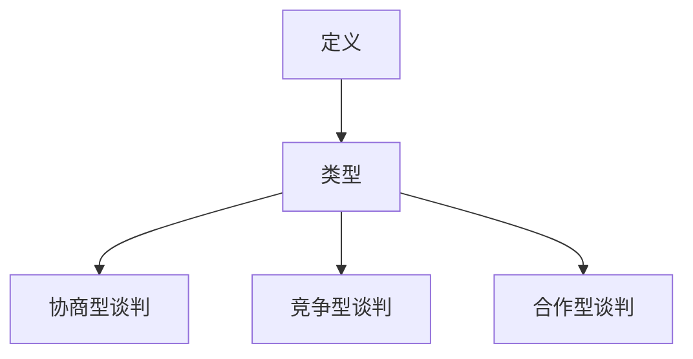
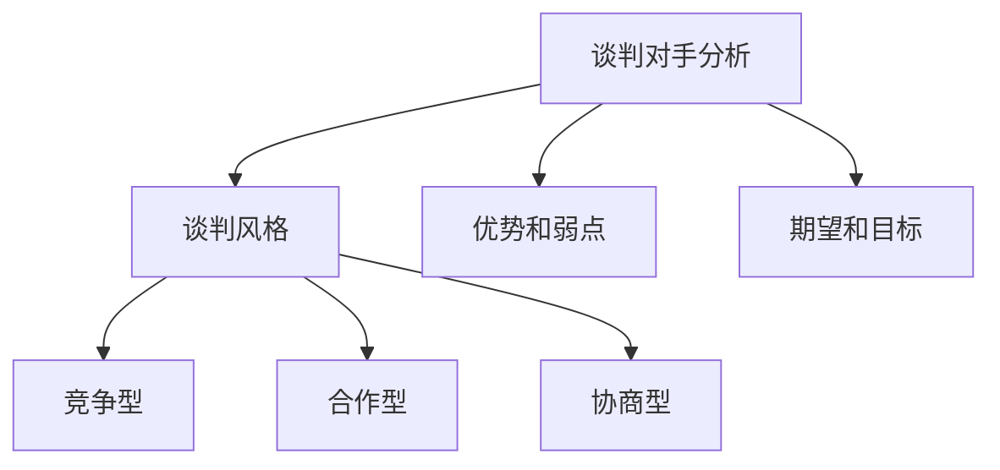
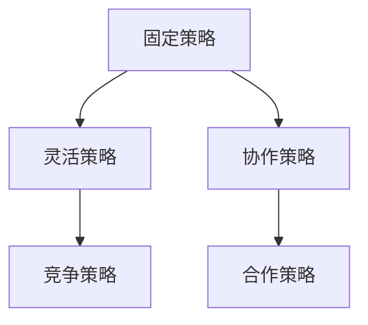
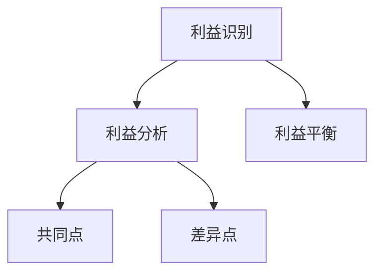
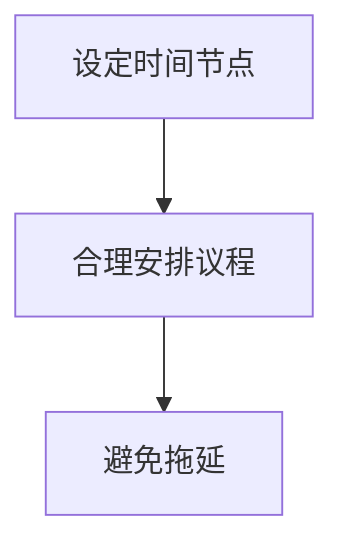
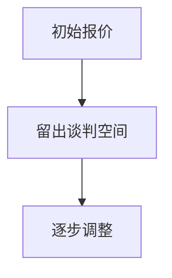
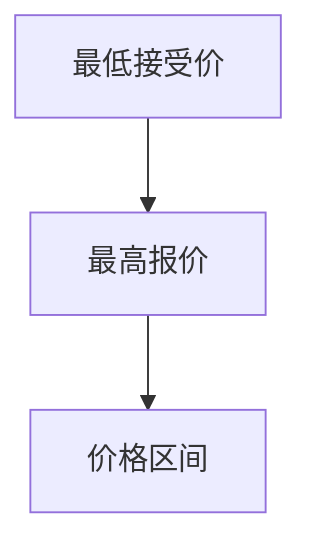
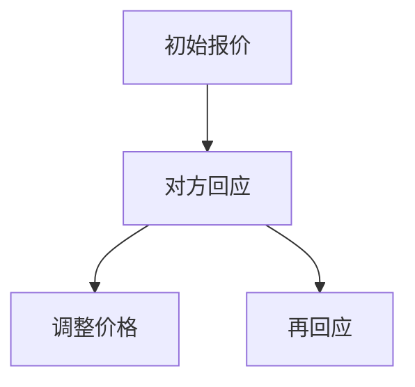

                 

### 文章标题

# 如何进行有效的商业谈判

> 关键词：商业谈判、谈判技巧、策略、利益分析、合同签订、跨文化谈判

> 摘要：本文旨在深入探讨商业谈判的有效方法和策略，从基础概念到实战技巧，全面解析谈判过程中的关键要素。通过分析谈判的定义、重要性、准备工作、策略与技巧、关键要素、价格谈判、合同签订和跨文化谈判，为读者提供一套系统的商业谈判指南。无论您是经验丰富的谈判者还是新手，本文都将帮助您提升谈判技巧，实现谈判目标。

---

### 《如何进行有效的商业谈判》目录大纲

#### 第一部分：谈判基础

##### 第1章：谈判的定义与重要性  
- 1.1 谈判的定义与类型  
- 1.2 谈判的重要性  
- 1.3 谈判的心理学基础

##### 第2章：谈判前的准备工作  
- 2.1 确定谈判目标和预期成果  
- 2.2 收集相关信息和背景资料  
- 2.3 分析谈判对手

##### 第3章：谈判策略与技巧  
- 3.1 谈判策略的选择  
- 3.2 建立良好的谈判氛围  
- 3.3 有效沟通与提问技巧  
- 3.4 谈判中的策略运用

#### 第二部分：谈判技巧实战

##### 第4章：谈判中的关键要素  
- 4.1 谈判中的利益分析  
- 4.2 如何处理谈判中的分歧  
- 4.3 谈判中的时间管理

##### 第5章：价格谈判技巧  
- 5.1 价格谈判的基本原则  
- 5.2 价格谈判的策略与技巧  
- 5.3 价格谈判的案例分析

##### 第6章：合同谈判与签订  
- 6.1 合同谈判的重要性  
- 6.2 合同条款的协商与拟定  
- 6.3 合同签订的注意事项

##### 第7章：跨文化谈判  
- 7.1 跨文化谈判的特点  
- 7.2 不同文化背景下的谈判策略  
- 7.3 跨文化谈判的案例分析

#### 第三部分：谈判实战演练

##### 第8章：谈判模拟与演练  
- 8.1 谈判模拟的目的与意义  
- 8.2 谈判模拟的步骤与方法  
- 8.3 谈判模拟的案例分析

##### 第9章：谈判技巧提升  
- 9.1 自我评估与反思  
- 9.2 学习与借鉴优秀谈判技巧  
- 9.3 持续提升谈判能力的方法

##### 第10章：总结与展望  
- 10.1 谈判成功的要素  
- 10.2 未来谈判趋势分析  
- 10.3 谈判在商业发展中的重要作用

#### 附录

##### 附录A：常用谈判术语与缩写  
##### 附录B：参考文献与资料

---

### 第1章：谈判的定义与重要性

谈判是一种通过协商和交流来解决问题的过程，涉及两个或多个利益相关方。在商业环境中，谈判是日常运营中不可或缺的一部分，几乎所有的商业活动都涉及到谈判。无论是购买原材料、签订合同、销售产品还是解决争议，谈判都是实现目标的关键环节。

#### 1.1 谈判的定义与类型

##### 谈判的定义

谈判可以定义为一种旨在解决冲突、达成共识或实现共同目标的互动过程。这个过程通常涉及以下几个关键要素：

- **参与者**：至少有两个或多个利益相关方参与。
- **目标**：参与者希望通过谈判实现的目标或解决的问题。
- **协商**：通过交流、讨论和妥协来寻找解决方案。
- **信息交换**：双方交换信息和观点，以了解彼此的需求和立场。
- **决策**：最终达成共识并形成决策。

##### 谈判的类型

根据谈判的目标和方式，可以将谈判分为以下几种类型：

- **协商型谈判**：双方通过协商和妥协来解决问题，寻求共同利益的最大化。
- **竞争型谈判**：双方试图通过竞争和策略来获得优势，往往以牺牲对方利益为代价。
- **合作型谈判**：双方共同努力，通过合作和协作来达成目标，实现双赢。

#### Mermaid流程图



#### 1.2 谈判的重要性

谈判在商业环境中具有重要的地位，其重要性体现在以下几个方面：

- **解决冲突**：谈判是一种解决争议和冲突的有效途径，通过对话和协商，可以避免对抗和诉讼，降低商业风险。
- **优化资源分配**：通过谈判，可以更好地分配资源，实现资源的最优利用，提高整体效率。
- **建立合作关系**：谈判有助于建立和维护长期合作关系，促进商业合作和发展。
- **增加商业机会**：谈判可以帮助企业发现新的商业机会，扩大市场份额，提升竞争力。

#### 数学模型和数学公式

$$
效率提升 = \frac{谈判成果}{谈判成本}
$$

谈判的效率提升取决于谈判成果和成本的比例。一个高效的谈判能够以较低的成本实现较高的成果。

#### 1.3 谈判的心理学基础

谈判不仅仅是技术和策略的运用，还涉及到心理学。了解心理学基础有助于更好地理解谈判对手，制定有效的谈判策略。

- **感知与认知**：谈判者对信息的感知和认知会影响其行为和决策。
- **情绪与情感**：情绪和情感在谈判中扮演重要角色，如信任、焦虑和期望等。
- **行为与策略**：谈判者的行为和策略会根据其心理状态进行调整。

#### 伪代码

```python
function 谈判心理学基础(谈判者):
    分析对手心理
    建立信任
    调整谈判策略
    达成共识
```

通过上述分析，我们可以看出谈判的定义和重要性，以及其在商业环境中的广泛应用。接下来，我们将进一步探讨谈判前的准备工作，为成功进行谈判奠定基础。

---

### 第2章：谈判前的准备工作

在商业谈判中，准备工作是决定谈判成功与否的关键环节。充分的准备工作不仅能够帮助谈判者明确目标和预期成果，还能够收集到关键的信息，分析谈判对手，从而制定出更为有效的谈判策略。以下是谈判前准备工作的几个重要方面。

#### 2.1 确定谈判目标和预期成果

明确谈判目标是谈判成功的第一步。谈判目标应该具体、可行，并且与企业的整体战略相一致。在确定谈判目标时，需要考虑以下几个关键点：

- **目标明确性**：谈判目标需要具体化，例如价格、交付时间、质量标准等。
- **目标优先级**：根据重要性和紧急性对目标进行排序，确保谈判聚焦于最重要的目标。
- **可衡量性**：谈判目标应该是可衡量的，以便在谈判结束时评估成果。

**案例说明**：以购买设备为例，明确的价格目标是100万元，交货期是60天内完成，保修期限为两年。这些具体的谈判目标有助于在谈判中保持专注和方向。

#### 2.2 收集相关信息和背景资料

收集充分的信息和背景资料是制定有效谈判策略的基础。以下是一些关键的信息和资料：

- **市场分析**：了解市场趋势、竞争对手的情况以及潜在的市场机会。
- **产品信息**：产品的性能、规格、历史销售数据等，以便了解产品的市场价值和潜在问题。
- **供应商信息**：供应商的信誉、历史交易记录、服务水平等。
- **法律和法规**：与谈判相关的法律法规，确保谈判符合法律要求。

**详细讲解**：例如，在进行一次设备采购谈判前，需要了解当前市场上的设备价格水平、不同供应商的报价差异、设备的性能参数以及供应商的交货能力和信誉等。这些信息有助于在谈判中做出更明智的决策。

#### 2.3 分析谈判对手

对谈判对手的分析是制定谈判策略的重要步骤。以下是一些关键的分析方法：

- **谈判风格**：了解谈判对手的谈判风格，是竞争型、合作型还是协商型。
- **优势和弱点**：分析对手的优势和弱点，以便在谈判中利用其优势或针对其弱点制定策略。
- **期望和目标**：了解对手的期望和目标，有助于预测其对谈判的反应。

**举例说明**：如果对手的谈判风格是竞争型，那么在谈判中可以采取更为灵活的策略，利用信息不对称来获得有利条件。如果对手的弱点是交货能力不足，可以在谈判中强调交货时间的重要性，以此作为谈判的筹码。

**Mermaid流程图**：



通过上述准备工作，谈判者可以更好地了解谈判目标和预期成果，收集到关键的信息和资料，并对谈判对手进行分析。这些准备工作将有助于在谈判中取得更大的成功。

接下来，我们将讨论谈判策略与技巧，这是确保谈判顺利进行并达成目标的关键。

---

### 第3章：谈判策略与技巧

在商业谈判中，策略和技巧的应用至关重要。有效的谈判策略和技巧不仅能够帮助谈判者在谈判过程中占据优势，还能提高谈判的成功率。以下将详细探讨几种关键的谈判策略和技巧。

#### 3.1 谈判策略的选择

谈判策略的选择取决于谈判的目标、对手的特点以及谈判的情境。常见的谈判策略包括固定策略、灵活策略和协作策略。

- **固定策略**：固定策略强调坚持既定的立场和目标，适用于对方立场相对坚定的情况。例如，在价格谈判中，可以坚持最低价格底线，拒绝任何超出该底线的出价。

  **案例**：在一次设备采购谈判中，供应商初始报价为150万元，而购买方坚持100万元的底线。尽管供应商多次尝试提高价格，购买方始终坚持底线，最终以100万元的价格达成交易。

- **灵活策略**：灵活策略注重根据谈判进展和对手的反应灵活调整策略。这种方法适用于谈判过程中对方立场变化频繁的情况。

  **案例**：在一次合同续签谈判中，双方在主要条款上达成一致，但在合同期限上存在分歧。通过灵活调整策略，购买方提出了一个中间方案，既满足了供应商的长期合同需求，又保护了购买方的利益，最终成功续签。

- **协作策略**：协作策略强调双方通过合作和协作达成共同目标，追求双赢的结果。这种方法适用于双方都有长期合作意愿的情况。

  **案例**：在一次供应链合作谈判中，供应商和购买方通过协作策略，共同制定了降低成本和提升效率的计划。这不仅帮助供应商实现了利润增长，还提高了购买方的供应链效率。

**策略模型**：



#### 3.2 建立良好的谈判氛围

建立良好的谈判氛围是谈判成功的关键因素之一。以下是一些建立良好谈判氛围的方法：

- **开场营造氛围**：在谈判开始时，通过友好的交流、互相介绍和轻松的谈话，营造一个友好和轻松的氛围。
- **积极倾听**：倾听对方的需求和立场，表现出对对方的尊重和关注。这不仅有助于了解对方的意图，还能建立信任。
- **尊重对方**：尊重对方的观点和决策，避免在谈判中批评或指责对方，以保持谈判的和谐。

**方法说明**：在一次跨国采购谈判中，双方通过友好的开场和积极的倾听，建立了良好的谈判氛围。在谈判过程中，双方尊重对方的意见，通过多次讨论和妥协，最终达成了满意的结果。

#### 3.3 有效沟通与提问技巧

有效沟通和提问技巧在谈判中发挥着重要作用。以下是一些关键技巧：

- **开放式问题**：开放式问题可以帮助谈判者更全面地了解对方的立场和需求。例如，“您对这次合作有哪些期望？”
- **封闭式问题**：封闭式问题用于确认信息或获取具体答案。例如，“您是否同意我们的交付时间要求？”
- **探询式问题**：探询式问题用于深入了解对方的意图和动机。例如，“您能否解释一下为什么对这个条款有疑问？”

**技巧说明**：在一次复杂合同谈判中，谈判者通过开放式问题和探询式问题，深入了解对方的担忧和期望。这不仅帮助双方找到了共识，还避免了因误解而导致的谈判破裂。

#### 3.4 谈判中的策略运用

在谈判过程中，策略的运用至关重要。以下是一些常用的谈判策略及其应用场景：

- **柚子与苹果策略**：通过提出看似无关的要求，使对方在满足这些要求时无意中接受了主要条件。例如，在价格谈判中，可以要求延长付款期限，以此来换取降低价格的承诺。
- **蘑菇策略**：故意保持沉默或低调，让对方猜测自己的意图，从而在谈判中占据主动。例如，在合同条款谈判中，可以暂时不发表意见，观察对方的反应，以获取更多信息。

**案例说明**：在一次并购谈判中，购买方使用了蘑菇策略，暂时保持沉默，观察供应商的反应。在供应商急于了解购买方的立场时，购买方突然提出了一个有力的报价，最终成功达成了交易。

通过以上谈判策略和技巧的应用，谈判者可以在谈判过程中更好地控制局面，实现谈判目标。接下来，我们将探讨谈判中的关键要素，以帮助谈判者更全面地应对谈判过程中的各种挑战。

---

### 第4章：谈判中的关键要素

在商业谈判中，成功的关键在于对谈判关键要素的深刻理解和有效管理。这些关键要素包括利益分析、处理分歧和时间管理。下面将详细讨论这些要素，并提供实用的方法和技巧。

#### 4.1 谈判中的利益分析

利益分析是谈判过程中的核心环节，通过识别和平衡各方利益，有助于达成共识。以下是利益分析的关键步骤：

- **利益识别**：首先，要明确各方的利益需求。利益可能包括财务收益、资源获取、时间节约等。
- **利益分析**：对各方利益进行详细分析，找出共同点和差异点。共同点是达成协议的基础，差异点则是谈判的核心。
- **利益平衡**：通过利益交换和妥协，寻找各方都能接受的平衡点。

**利益分析模型**：



**案例说明**：在一次软件开发外包项目中，购买方关注项目成本和时间，而供应商关注项目质量和稳定性。通过利益分析，双方找到了共同点——项目的成功交付，并确定了利益平衡点，即通过缩短项目交付时间来降低供应商的报价，同时保证项目质量。

#### 4.2 如何处理谈判中的分歧

谈判中的分歧是常见的挑战，有效的处理方法有助于推动谈判进程。以下是几种处理分歧的方法：

- **寻求共识**：通过找到共同点和共同目标，减少分歧。例如，双方可以在项目交付时间上寻求妥协，以达成共识。
- **妥协**：通过妥协，双方各自放弃一部分利益，以达成协议。例如，在价格谈判中，购买方可以接受稍高的价格，以换取更好的服务。
- **利益交换**：通过交换利益，使双方都能获得所需的利益。例如，在采购谈判中，供应商可以提供额外的服务来换取更高的价格。

**方法说明**：在一次租赁合同谈判中，购买方希望降低租金，而供应商则希望延长租赁期。通过寻求共识，双方最终确定了在租赁期延长的基础上降低租金的方案，实现了双赢。

#### 4.3 谈判中的时间管理

时间管理是谈判成功的关键要素之一。合理安排谈判时间，有助于提高谈判效率和达成协议。以下是时间管理的几个关键技巧：

- **设定时间节点**：在谈判前，明确各个阶段的时间节点，如初步讨论、详细讨论、决策等。
- **合理安排议程**：根据时间节点，合理安排谈判议程，确保每个议题都有充足的时间讨论。
- **避免拖延**：在谈判过程中，避免拖延和浪费时间，确保谈判按计划进行。

**时间管理技巧**：



**案例说明**：在一次跨国并购谈判中，双方通过设定明确的时间节点和合理安排议程，有效地避免了拖延，最终在规定的时间内完成了谈判。

通过以上对谈判关键要素的深入分析，我们可以更好地理解如何进行有效的利益分析、处理分歧和时间管理。这些技巧和方法的运用，将有助于谈判者应对谈判过程中的各种挑战，实现谈判目标。接下来，我们将探讨价格谈判技巧，这是商业谈判中最为常见和重要的一环。

---

### 第5章：价格谈判技巧

价格谈判是商业谈判中最为常见且关键的一环，因为它直接影响到交易的成本和利润。有效的价格谈判不仅能确保交易的达成，还能为企业创造价值。以下是价格谈判的基本原则、策略与技巧，以及一个真实的案例解析。

#### 5.1 价格谈判的基本原则

在进行价格谈判时，以下基本原则是确保谈判顺利进行的基础：

- **公平**：价格应该是公平合理的，双方都能接受。
- **透明**：价格谈判过程应该是公开和透明的，以增强双方的信任。
- **互利**：价格谈判应追求双赢的结果，双方都能从中获益。

**公平原则**：在谈判中，价格应该基于市场行情、产品价值、成本和竞争对手的报价等客观因素来确定。例如，如果市场价格为100万元，而供应商的成本为80万元，那么一个合理的价格应该在80万元到100万元之间。

**透明原则**：在谈判过程中，双方应该公开各自的成本结构和定价策略，以确保价格的公平性和合理性。例如，供应商可以解释其报价包含哪些成本，以及如何计算利润。

**互利原则**：双方应在谈判中寻求共同利益，通过妥协和利益交换达成双赢。例如，供应商可以提供更优质的服务或延长保修期，以换取更高的价格。

#### 5.2 价格谈判的策略与技巧

价格谈判的策略和技巧决定了谈判的成功与否。以下是一些有效的策略和技巧：

- **初始报价策略**：在谈判开始时，提出一个较高的初始报价，为后续的谈判留出空间。例如，如果期望价格为100万元，可以首次报价为120万元。
- **价格区间策略**：设定一个价格区间，明确最低接受价格和最高报价。这样，谈判时可以在这个区间内灵活调整价格。
- **价格调整技巧**：通过逐步调整价格，寻求双方都能接受的平衡点。例如，可以在每次报价后，根据对方的反应适当调整价格。

**案例说明**：在一次设备采购谈判中，购买方首先提出一个较高的初始报价，供应商在回应时提出了一个较低的价格。通过多次协商，双方最终确定了在一个合理的价格区间内的成交价。

**初始报价策略**：



**价格区间策略**：



**价格调整技巧**：



#### 5.3 价格谈判的案例分析

以下是一个真实的商业谈判案例，通过详细解读，我们可以了解价格谈判的具体操作过程和关键策略。

**案例背景**：一家科技公司（购买方）需要采购一批高端服务器，供应商（销售方）提供了两个报价方案：方案A的价格为100万元，方案B的价格为120万元。购买方希望通过谈判降低价格，同时获得更好的服务。

**谈判过程**：

1. **初始报价**：购买方提出一个较低的初始报价，例如90万元。
2. **供应商回应**：供应商表示无法接受90万元的报价，并提出了方案A（100万元）。
3. **购买方回应**：购买方表示可以考虑方案A，但希望了解更多关于服务器性能和售后服务的信息。
4. **供应商提供信息**：供应商提供了详细的产品性能和售后服务信息，同时表示可以提供一些额外的服务，如免费一年的技术支持。
5. **价格调整**：购买方在考虑供应商提供的信息后，提出一个稍微提高的报价，例如95万元。
6. **供应商回应**：供应商表示可以考虑95万元的报价，但希望延长付款期限。
7. **购买方回应**：购买方同意延长付款期限，并提出一个稍高的报价，例如98万元。
8. **最终成交**：经过多次协商，双方最终在方案A的基础上，以98万元的价格达成交易。

**案例分析**：

在这个案例中，购买方通过初始报价策略和价格区间策略，成功地降低了价格。同时，通过逐步调整价格和提供额外服务，双方在利益交换中找到了平衡点。这个案例展示了价格谈判的多个关键要素，包括策略选择、利益分析和谈判技巧的应用。

通过上述分析和案例，我们可以看到价格谈判不仅仅是数字的博弈，更是策略、技巧和利益的综合考量。有效的价格谈判能够为企业带来显著的成本节省和竞争优势。

接下来，我们将探讨合同谈判与签订，这是商业谈判的最终环节，确保交易的法律效力和长期合作关系的稳定性。

---

### 第6章：合同谈判与签订

合同谈判与签订是商业谈判过程中的重要环节，它不仅是双方达成共识的书面证据，也是确保交易顺利进行和权益得到保障的关键。以下是关于合同谈判的重要性、条款的协商与拟定以及签订注意事项的详细探讨。

#### 6.1 合同谈判的重要性

合同谈判的重要性体现在以下几个方面：

- **确保交易合法有效**：合同是双方之间权利和义务的书面约定，合法的合同能够确保交易的合法性和有效性。
- **保障双方权益**：通过合同谈判，双方可以明确各自的权益和义务，避免因误解或合同条款不清而产生的争议。
- **降低交易风险**：明确的合同条款有助于降低交易中的不确定性，确保交易各方按照约定执行。

**重要性说明**：合同谈判不仅关乎一次交易的成功与否，还影响到双方未来的合作关系。一个精心准备的合同能够为交易提供坚实的法律基础，减少纠纷和损失。

#### 6.2 合同条款的协商与拟定

合同条款的协商与拟定是合同谈判的核心环节。以下是几个关键方面：

- **明确交易内容**：合同应明确交易的具体内容，包括产品或服务的名称、数量、质量标准、交付时间和地点等。
- **定义双方权利与义务**：合同应明确双方在交易中的权利和义务，如付款条款、交付条件、售后服务等。
- **风险和责任分担**：合同应明确双方在交易中可能面临的风险和责任，以及如何分担。

**详细讲解**：以下是一个典型的合同条款示例：

```plaintext
1. 产品名称：高端服务器
2. 数量：10台
3. 质量标准：符合国际标准ISO 9001
4. 交付时间：合同签订后60天内
5. 交付地点：购买方指定仓库
6. 付款条款：合同签订后5个工作日内支付总价款的50%，设备交付后支付剩余50%
7. 售后服务：提供1年的免费技术支持，合同续期后提供额外服务
8. 风险和责任：因自然灾害等不可抗力因素导致的交货延误，双方不承担责任；因一方违约导致的损失，由违约方承担。
```

#### 6.3 合同签订的注意事项

在签订合同之前，需要注意以下几点：

- **审查合同条款**：在签订合同之前，应仔细审查合同条款，确保所有内容都符合双方的期望和利益。
- **法律咨询**：在签订合同之前，可以寻求法律专业人士的咨询，确保合同的法律效力和条款的合理性。
- **盖章签字**：合同应由双方授权代表签字并盖章，确保合同的正式性和有效性。

**注意事项说明**：合同的审查和签订是确保交易合法和有效的关键步骤。任何忽视或疏忽都可能导致未来的纠纷和损失。

通过以上对合同谈判与签订的详细探讨，我们可以看到这一环节的重要性及其在商业谈判中的关键作用。接下来，我们将探讨跨文化谈判，这是在全球化商业环境中不可避免的一部分。

---

### 第7章：跨文化谈判

随着全球化进程的加速，跨文化谈判在商业活动中变得越来越普遍。跨文化谈判不仅涉及到语言和文化的差异，还包括商业习惯、价值观和沟通方式的差异。理解和掌握跨文化谈判的策略，有助于在复杂的文化环境中实现商业目标。

#### 7.1 跨文化谈判的特点

跨文化谈判的特点主要体现在以下几个方面：

- **语言障碍**：语言不通或语言理解差异是跨文化谈判中最大的障碍之一。语言差异可能导致误解、沟通不畅甚至谈判破裂。
- **文化差异**：不同的文化背景会导致不同的价值观、行为模式和工作习惯。例如，一些文化强调集体主义，而另一些文化则更注重个人主义。
- **时间观念差异**：不同文化对时间的重视程度不同。一些文化可能更倾向于灵活和渐进的谈判方式，而另一些文化则强调效率和速度。
- **商业习惯差异**：不同国家的商业习惯可能存在显著差异，如合同签订的程序、商业礼节和商业谈判策略等。

#### 7.2 不同文化背景下的谈判策略

为了在跨文化谈判中取得成功，谈判者需要了解不同文化背景下的谈判策略。以下是一些针对不同文化背景的谈判策略：

- **西方文化背景下的谈判策略**：
  - **强调逻辑和事实**：西方文化强调逻辑和事实，谈判时需要基于数据和逻辑进行论证。
  - **直接沟通**：西方文化倾向于直接沟通，谈判者应避免使用含糊和模糊的语言。
  - **时间观念强**：西方文化强调效率和速度，谈判时应注重时间的合理利用。

- **东方文化背景下的谈判策略**：
  - **重视关系和面子**：东方文化重视人际关系和面子，谈判时应注重建立和维护良好的人际关系。
  - **间接沟通**：东方文化倾向于使用委婉和含蓄的语言进行沟通，谈判者应避免过于直接的批评或指责。
  - **时间观念较灵活**：东方文化对时间观念较为灵活，谈判者可以适当延长谈判时间，以建立信任和共识。

**策略说明**：在一次中西方企业的合作谈判中，中方代表注重建立良好的人际关系，通过多次非正式交流，逐渐拉近了与西方代表的距离。在正式谈判中，中方代表使用委婉的语言表达意见，避免了直接的冲突。而西方代表则注重逻辑和数据，通过详细的分析和论证，确保谈判的合理性。最终，双方通过合作和妥协，达成了满意的协议。

#### 7.3 跨文化谈判的案例分析

以下是一个真实的跨文化谈判案例，通过这个案例，我们可以了解如何在跨文化谈判中运用策略和技巧。

**案例背景**：一家中国电子企业（中方）计划与一家美国软件公司（美方）合作开发一款智能家居系统。双方在谈判过程中遇到了文化差异和沟通障碍。

**谈判过程**：

1. **前期准备**：双方在前期通过邮件和电话进行了初步交流，明确了合作目标和初步方案。
2. **面对面谈判**：在第一次面对面谈判中，双方代表会面，但由于语言和文化差异，沟通存在一定的障碍。
3. **建立信任**：中方代表通过邀请美方代表参观工厂，展示企业的实力和信誉，逐渐建立了信任关系。
4. **策略运用**：在谈判中，中方代表注重使用委婉的语言表达意见，避免直接冲突。美方代表则注重逻辑和数据，通过详细的论证和演示，确保项目的可行性。
5. **利益交换**：双方通过利益交换，找到了共同点，如中方提供技术支持，美方提供市场资源。通过多次协商和妥协，最终达成了合作协议。

**案例分析**：

在这个案例中，中方代表通过建立信任和运用策略，成功克服了文化差异和沟通障碍，达成了合作。美方代表则通过注重逻辑和数据，确保了项目的可行性。这个案例展示了在跨文化谈判中，策略和信任的重要性。

通过以上对跨文化谈判的详细探讨，我们可以看到跨文化谈判的复杂性和挑战。掌握不同文化背景下的谈判策略，将有助于谈判者在全球商业环境中取得成功。接下来，我们将讨论谈判模拟与演练，这是提升谈判技巧的重要方法。

---

### 第8章：谈判模拟与演练

谈判模拟与演练是提升谈判技巧的重要方法。通过模拟真实谈判场景，参与者可以在安全的环境中练习谈判策略、应对挑战，并从中学习和改进。以下将详细探讨谈判模拟的目的与意义、步骤与方法，以及案例分析和实战演练。

#### 8.1 谈判模拟的目的与意义

谈判模拟的主要目的与意义如下：

- **提高谈判技巧**：通过模拟真实谈判场景，参与者可以练习各种谈判策略，提高谈判技巧和应对能力。
- **应对挑战**：模拟谈判场景可以帮助参与者面对和克服实际谈判中可能遇到的挑战，如语言障碍、文化差异、时间压力等。
- **学习与反思**：在谈判模拟过程中，参与者可以反思自己的谈判风格和策略，从中学习并改进。
- **团队协作**：谈判模拟有助于提升团队协作能力，通过集体讨论和协作，提高整体谈判效率。

**目的与意义说明**：谈判模拟提供了一个实际操作的平台，使参与者能够在真实情境中练习和验证自己的谈判策略，从而在实际谈判中更加自信和有效。

#### 8.2 谈判模拟的步骤与方法

谈判模拟通常包括以下步骤和方法：

- **确定谈判场景**：首先，确定模拟的谈判场景，如设备采购、合同续签、价格谈判等。明确谈判的背景、目标和参与者。
- **准备谈判材料**：根据谈判场景，准备相关的谈判材料，如合同条款、报价单、市场分析报告等。
- **分配角色**：为模拟参与者分配不同的角色，如购买方、供应商、客户等，确保每个角色都有明确的谈判目标和策略。
- **制定谈判计划**：制定详细的谈判计划，包括谈判议程、时间节点、关键议题等。
- **进行模拟谈判**：在模拟谈判过程中，参与者按照既定计划进行谈判，通过互动和沟通，解决谈判中的问题和挑战。
- **评估与反馈**：谈判结束后，对模拟过程进行评估和反馈，讨论谈判中的成功和不足之处，提出改进建议。

**步骤与方法说明**：以下是一个谈判模拟的示例步骤：

1. **确定谈判场景**：设备采购谈判。
2. **准备谈判材料**：合同条款、报价单、市场分析报告等。
3. **分配角色**：购买方、供应商、市场分析师等。
4. **制定谈判计划**：明确谈判议程、时间节点、关键议题等。
5. **进行模拟谈判**：参与者按照计划进行谈判，解决采购价格、交付时间、售后服务等问题。
6. **评估与反馈**：讨论模拟过程中的表现，分析成功和不足之处，提出改进建议。

#### 8.3 谈判模拟的案例分析

以下是一个真实的谈判模拟案例，通过案例分析，我们可以了解如何通过谈判模拟提高谈判技巧。

**案例背景**：一家中国电子企业与一家美国科技公司计划进行一项技术合作。在正式谈判前，双方决定进行一次模拟谈判，以测试谈判策略和准备实际谈判。

**模拟过程**：

1. **确定谈判场景**：技术合作谈判。
2. **准备谈判材料**：合作方案、市场分析报告、技术文档等。
3. **分配角色**：中方代表、美方代表、技术专家等。
4. **制定谈判计划**：明确谈判议程、时间节点、关键议题等。
5. **进行模拟谈判**：双方代表按照计划进行谈判，讨论合作模式、技术标准和市场推广等问题。
6. **评估与反馈**：在谈判结束后，双方代表进行了详细的评估和反馈。中方代表发现自己在谈判中的提问技巧和策略需要改进，美方代表则认为在技术细节的讨论上可以更加深入。

**案例分析**：

通过这次模拟谈判，双方代表发现了自身在谈判中的不足，并进行了针对性的改进。在实际谈判中，这些改进措施帮助双方更加高效地解决了合作中的关键问题，最终达成了满意的协议。

通过上述谈判模拟的步骤和方法，以及案例的分析，我们可以看到谈判模拟在提升谈判技巧和准备实际谈判中的重要作用。谈判模拟不仅提供了实践的平台，还帮助谈判者在真实谈判中更加自信和有效。

#### 实战演练

为了更好地掌握谈判技巧，以下是一个具体的实战演练方案：

**目标**：提高购买方的价格谈判技巧。

**步骤**：

1. **确定谈判场景**：假设购买方是一家电子公司的采购经理，需要与供应商就一批高端电子设备进行价格谈判。
2. **准备谈判材料**：收集市场分析报告、供应商报价单、竞争对手报价等。
3. **分配角色**：购买方、供应商、市场分析师等。
4. **制定谈判计划**：明确谈判议程、时间节点、关键议题等。
5. **进行模拟谈判**：
   - **第一阶段**：购买方提出初步报价，供应商回应。
   - **第二阶段**：购买方使用价格区间策略和利益交换策略，与供应商协商。
   - **第三阶段**：双方进行价格调整和利益交换，达成最终协议。
6. **评估与反馈**：讨论谈判过程中的成功和不足之处，提出改进建议。

通过这个实战演练，购买方可以模拟实际谈判场景，练习价格谈判技巧，并在评估和反馈中不断提升自己的谈判能力。

通过以上对谈判模拟与演练的详细探讨，我们可以看到它在提升谈判技巧和准备实际谈判中的重要作用。谈判模拟提供了一个实践的平台，使谈判者在真实情境中锻炼和改进自己的谈判策略。接下来，我们将讨论如何通过自我评估与反思、学习与借鉴优秀谈判技巧，以及持续提升谈判能力的方法，进一步提升谈判技巧。

---

### 第9章：谈判技巧提升

提升谈判技巧是一个持续学习和实践的过程。通过自我评估与反思、学习与借鉴优秀谈判技巧，以及采取持续提升的方法，谈判者可以不断提高自己的谈判能力，从而在商业谈判中取得更好的成果。

#### 9.1 自我评估与反思

自我评估与反思是提升谈判技巧的关键步骤。通过定期评估自己的谈判过程，谈判者可以识别自身的优势和不足，从而有针对性地进行改进。以下是一些自我评估与反思的方法：

- **记录谈判过程**：详细记录每次谈判的过程，包括谈判内容、策略运用、对方的反应等。
- **分析成功和失败**：分析每次谈判的成功和失败原因，总结经验教训。
- **反思谈判策略**：反思所使用的谈判策略是否合理，是否需要调整和改进。
- **寻求反馈**：向同事、上级或谈判顾问寻求反馈，了解自己在谈判中的表现和改进空间。

**方法说明**：一位经验丰富的采购经理，在每次谈判结束后，都会详细记录谈判过程，分析成功和失败的原因，并定期与团队成员进行讨论。通过这样的自我评估与反思，他不断提升自己的谈判技巧，取得了显著的成绩。

#### 9.2 学习与借鉴优秀谈判技巧

学习与借鉴优秀谈判技巧是提升谈判能力的有效途径。以下是一些可以借鉴的优秀谈判技巧：

- **倾听技巧**：积极倾听对方的意见和需求，通过倾听了解对方的真实意图，为制定策略提供依据。
- **提问技巧**：运用开放式问题和探询式问题，深入了解对方的需求和立场，为谈判创造更多机会。
- **利益交换**：通过利益交换，找到双方都能接受的平衡点，实现双赢。
- **非言语沟通**：注意非言语沟通，如肢体语言、面部表情等，这些都能影响谈判的结果。

**技巧说明**：在一次跨国并购谈判中，一位谈判者通过积极的倾听和精准的提问，成功了解了对方的真实需求，并通过利益交换，找到了双方的共同利益点。最终，他成功地达成了交易。

#### 9.3 持续提升谈判能力的方法

持续提升谈判能力需要系统的学习和实践。以下是一些有效的方法：

- **参加培训课程**：参加专业的谈判技巧培训课程，学习最新的谈判理论和实战技巧。
- **阅读相关书籍**：阅读关于谈判技巧的书籍和案例，了解不同领域的谈判策略和经验。
- **模拟谈判**：定期进行模拟谈判，通过实践提高自己的谈判技巧。
- **与高手交流**：与经验丰富的谈判者交流，学习他们的经验和策略。
- **建立反馈机制**：建立反馈机制，定期收集和分析反馈意见，不断改进自己的谈判技巧。

**方法说明**：一位企业高管通过参加专业的谈判技巧培训课程，学习了多种谈判策略和技巧。同时，他定期与行业内的谈判高手进行交流，不断积累经验。通过这样的持续学习和实践，他的谈判能力得到了显著提升。

通过以上对自我评估与反思、学习与借鉴优秀谈判技巧，以及持续提升谈判能力方法的详细探讨，我们可以看到提升谈判技巧是一个系统性和持续性的过程。通过不断地学习和实践，谈判者可以不断提高自己的谈判能力，在商业谈判中取得更好的成果。

### 总结与展望

在本文中，我们详细探讨了如何进行有效的商业谈判，从谈判的基础概念、准备工作、策略与技巧、关键要素、价格谈判、合同签订到跨文化谈判，提供了系统的谈判指南。以下是对文章内容的总结和未来谈判趋势的分析。

#### 谈判成功的要素

成功的谈判离不开以下几个关键要素：

1. **充分准备**：谈判前需要进行充分的信息收集和对手分析，明确谈判目标和预期成果。
2. **策略运用**：选择合适的谈判策略，如固定策略、灵活策略和协作策略，以应对不同情境。
3. **有效沟通**：通过倾听和提问技巧建立良好的沟通氛围，确保双方能够理解和接受对方的立场。
4. **利益分析**：识别和平衡各方的利益，通过利益交换和妥协达成共识。
5. **灵活应对**：在谈判过程中灵活调整策略和应对挑战，保持冷静和理性。

#### 未来谈判趋势分析

随着全球化和数字化的发展，未来谈判将呈现出以下几个趋势：

1. **远程谈判增加**：由于远程工作的普及，远程谈判将变得更加常见。谈判者需要适应虚拟环境中的谈判技巧。
2. **人工智能辅助**：人工智能技术在谈判中的应用将日益广泛，例如通过数据分析来支持决策，或者使用人工智能进行谈判模拟和预测。
3. **跨文化谈判常态化**：随着全球化的加深，跨文化谈判将成为常态。谈判者需要具备跨文化沟通和谈判的能力。
4. **可持续发展谈判**：企业和客户对可持续发展的关注日益增加，谈判中会更多地涉及环境、社会和治理（ESG）因素。

#### 谈判在商业发展中的重要作用

谈判在商业发展中扮演着至关重要的角色：

1. **资源优化配置**：通过有效的谈判，企业可以优化资源配置，降低成本，提高效率。
2. **风险管理和规避**：谈判有助于识别和规避潜在的风险，保障交易的合法性和安全性。
3. **关系建设**：谈判不仅是交易的过程，也是建立和巩固商业关系的重要手段，有助于长期合作和共同发展。

通过本文的探讨，我们可以看到谈判不仅是商业活动的一部分，更是实现商业目标、优化资源配置、管理风险和建设关系的重要工具。在未来，谈判者需要不断学习和适应新的趋势，提升自身的谈判能力，以在激烈的商业竞争中取得优势。

---

### 附录

#### 附录A：常用谈判术语与缩写

以下是一些在谈判中常用的术语和缩写：

- **BATNA（最佳替代谈判协议）**：Best Alternative to a Negotiated Agreement
- **ZOPA（共同满意区域）**：Zone of Possible Agreement
- **BATNAE（最佳替代谈判协议不可接受）**：Best Alternative to a Negotiated Agreement is Unacceptable
- **ZOPA（共同不满意区域）**：Zone of Possible Agreement
- **IP（知识产权）**：Intellectual Property
- **NDA（保密协议）**：Non-Disclosure Agreement
- **SPA（标准采购条款）**：Standard Purchase Agreement

#### 附录B：参考文献与资料

1. Fisher, R., Ury, W., & Patton, B. (2011). **Getting to Yes: Negotiating Agreement Without Giving In**. Penguin Books.
2. Cheung, W. (2005). **Cross-Cultural Negotiation: A Framework for Navigating Cross-Border Agreements**. Palgrave Macmillan.
3. Karrass, C. (2018). **Hello, Hello! The Art of Business Relationships**. McGraw Hill.
4. Forster, J. (2017). **The Art of Negotiation: How to Improvise Agreement in a Chaotic World**. Harvard Business Review Press.
5. Givens, D. (2019). **Negotiation Skills: Build Your Confidence and Close Deals**. McGraw Hill Education.

通过以上参考文献和资料，读者可以进一步深入了解商业谈判的理论和实践，提高自己的谈判技能。

---

至此，本文《如何进行有效的商业谈判》的撰写工作完成。文章从谈判的定义和重要性、准备工作、策略与技巧、关键要素、价格谈判、合同签订到跨文化谈判进行了全面而深入的探讨，并结合具体案例和实践经验，提供了系统的谈判指南。希望读者能够通过本文的学习，提升自己的谈判能力，在商业谈判中取得成功。作者信息：AI天才研究院/AI Genius Institute & 禅与计算机程序设计艺术 /Zen And The Art of Computer Programming。如有任何疑问或建议，欢迎读者联系作者。

