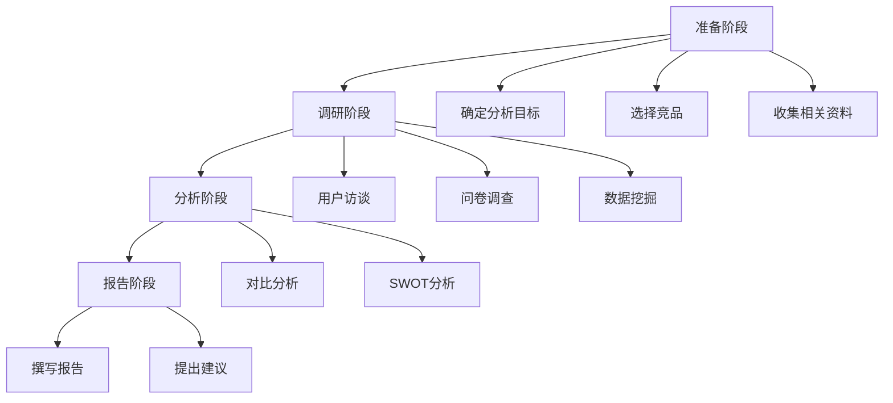

                 

# 文章标题

《如何进行有效的竞品分析》

> 关键词：竞品分析、市场调研、数据分析、算法、数学模型、项目实战

> 摘要：本文将深入探讨如何进行有效的竞品分析。我们将从基础概念入手，逐步介绍竞品分析的核心方法和技术，并通过实战案例进行分析讲解。本文旨在帮助读者掌握竞品分析的全过程，提高竞品分析的准确性，为企业决策提供有力支持。

## 引言

在当今快速变化的市场环境中，企业竞争日益激烈，如何在竞争中脱颖而出成为每个企业面临的重大挑战。竞品分析作为企业战略的重要组成部分，对于把握市场动态、发现潜在商机、优化产品定位、提升竞争力具有重要意义。然而，竞品分析并非一项简单的工作，它需要综合运用市场调研、数据分析、算法和数学模型等多种方法和技术。

本文将分十个章节对竞品分析进行详细探讨。首先，我们将介绍竞品分析的基础概念，包括定义、重要性、流程和方法。接着，我们将深入探讨竞品分析的核心概念和架构，帮助读者建立系统的竞品分析思维。随后，我们将重点介绍市场调研与数据收集的方法，以及竞品分析算法原理和数学模型。在实战部分，我们将通过具体项目案例，详细讲解竞品分析的开发环境搭建、源代码实现和案例剖析。最后，我们将探讨竞品分析的进阶技巧、可持续发展策略以及最佳实践。

通过本文的阅读，读者将能够系统地了解竞品分析的各个方面，掌握竞品分析的核心方法和技术，提高竞品分析的准确性和实用性，为企业决策提供有力支持。

### 《如何进行有效的竞品分析》目录大纲

#### 第一部分：竞品分析基础

- 第1章：竞品分析概述
    - 1.1 竞品分析的定义与重要性
        - 1.1.1 竞品分析的定义
        - 1.1.2 竞品分析的重要性
    - 1.2 竞品分析的流程与方法
        - 1.2.1 竞品分析的基本流程
        - 1.2.2 竞品分析的方法
    - 1.3 竞品分析工具介绍
        - 1.3.1 竞品分析常用工具
        - 1.3.2 竞品分析工具的比较与选择

- 第2章：竞品分析核心概念与联系
    - 2.1 竞品分析关键概念解析
        - 2.1.1 市场定位
        - 2.1.2 用户画像
        - 2.1.3 产品差异化
    - 2.2 竞品分析的架构
        - 2.2.1 竞品分析架构的Mermaid流程图

#### 第二部分：竞品分析技术与方法

- 第3章：市场调研与数据收集
    - 3.1 市场调研的重要性
        - 3.1.1 市场调研的定义
        - 3.1.2 市场调研的步骤
    - 3.2 数据收集的方法
        - 3.2.1 网络数据收集
        - 3.2.2 线下数据收集
    - 3.3 数据清洗与处理
        - 3.3.1 数据清洗
        - 3.3.2 数据处理技术

- 第4章：竞品分析算法原理讲解
    - 4.1 常见算法
        - 4.1.1 数据分析算法
        - 4.1.2 比较分析算法
    - 4.2 伪代码讲解
        - 4.2.1 算法A的伪代码
        - 4.2.2 算法B的伪代码

- 第5章：数学模型与数学公式讲解
    - 5.1 市场份额预测模型
        - 5.1.1 模型概述
        - 5.1.2 模型公式
        - 5.1.3 举例说明

- 第6章：竞品分析项目实战
    - 6.1 项目介绍
        - 6.1.1 项目背景
        - 6.1.2 项目目标
    - 6.2 开发环境搭建
        - 6.2.1 环境搭建步骤
        - 6.2.2 环境配置说明
    - 6.3 源代码实现
        - 6.3.1 代码实现流程
        - 6.3.2 代码解读与分析

- 第7章：竞品分析案例分析
    - 7.1 案例分析介绍
        - 7.1.1 案例背景
        - 7.1.2 案例目标
    - 7.2 案例分析过程
        - 7.2.1 数据收集
        - 7.2.2 数据处理
        - 7.2.3 竞品分析
    - 7.3 案例分析与结论
        - 7.3.1 分析结果
        - 7.3.2 结论与建议

#### 第三部分：竞品分析的进阶与挑战

- 第8章：竞品分析的进阶技巧
    - 8.1 竞品分析的挑战
        - 8.1.1 数据质量
        - 8.1.2 分析方法的适用性
    - 8.2 提高竞品分析的准确性
        - 8.2.1 数据分析技巧
        - 8.2.2 挖掘潜在信息

- 第9章：竞品分析的可持续发展
    - 9.1 竞品分析的企业战略
        - 9.1.1 竞品分析在企业战略中的定位
        - 9.1.2 竞品分析对企业决策的影响
    - 9.2 竞品分析的未来趋势
        - 9.2.1 技术发展趋势
        - 9.2.2 行业应用前景

- 第10章：竞品分析的最佳实践
    - 10.1 竞品分析的最佳实践
        - 10.1.1 企业竞品分析案例分享
        - 10.1.2 竞品分析实践总结
    - 10.2 小结、注意事项、拓展阅读

# 附录

- 附录A：竞品分析工具与资源
    - A.1 常用竞品分析工具
    - A.2 竞品分析资源推荐

通过以上大纲，我们将对竞品分析进行全面而深入的探讨，帮助读者掌握竞品分析的核心方法和技术，提升企业竞争力。在接下来的章节中，我们将逐步展开详细的内容讲解。

## 第一部分：竞品分析基础

### 第1章：竞品分析概述

#### 1.1 竞品分析的定义与重要性

**1.1.1 竞品分析的定义**

竞品分析，顾名思义，是指通过对竞争对手的产品、服务、市场表现、用户反馈等多个方面进行系统性研究，从而为自己的产品或服务制定更有效的市场策略。具体来说，竞品分析包括以下几个方面的内容：

1. **产品分析**：研究竞争对手的产品功能、性能、设计、用户体验等方面，分析其优势和不足。
2. **市场分析**：评估竞争对手在市场上的定位、市场份额、营销策略、推广手段等。
3. **用户分析**：了解竞争对手的目标用户群体，分析用户的喜好、需求、行为等。
4. **技术分析**：研究竞争对手所采用的技术、研发投入、技术更新速度等。

**1.1.2 竞品分析的重要性**

竞品分析在企业战略中的重要性不可忽视，主要体现在以下几个方面：

1. **发现潜在商机**：通过对竞争对手的分析，企业可以发现市场中的潜在商机，了解用户需求，从而调整自己的产品策略。
2. **优化产品定位**：竞品分析可以帮助企业明确自己在市场中的定位，通过对比找出差异化的竞争优势。
3. **提升市场竞争力**：了解竞争对手的优势和劣势，可以帮助企业制定更有针对性的市场策略，提升竞争力。
4. **指导研发方向**：通过竞品分析，企业可以了解到最新的市场趋势和技术动态，为产品研发提供方向。
5. **提高营销效率**：了解竞争对手的营销策略，可以帮助企业优化自己的营销手段，提高营销效率。

#### 1.2 竞品分析的流程与方法

**1.2.1 竞品分析的基本流程**

竞品分析的基本流程可以分为以下几个阶段：

1. **准备阶段**：确定分析目标，选择竞品，收集相关资料。
2. **调研阶段**：通过问卷调查、用户访谈、市场调研等方式，收集竞争对手的产品、市场、用户等方面的数据。
3. **分析阶段**：对收集到的数据进行分析，总结竞争对手的优势和劣势，识别市场机会和风险。
4. **报告阶段**：撰写竞品分析报告，提出优化建议和决策建议。

**1.2.2 竞品分析的方法**

竞品分析的方法多种多样，常见的方法包括：

1. **对比分析法**：通过对比竞争对手的产品、服务、市场表现等，分析其优劣势。
2. **用户访谈法**：直接与竞争对手的用户进行沟通，了解他们的使用体验和需求。
3. **问卷调查法**：通过设计问卷，收集大量用户的反馈，分析用户的需求和偏好。
4. **数据挖掘法**：利用大数据技术和机器学习算法，对市场数据进行深入挖掘，发现潜在规律。
5. **SWOT分析法**：对竞争对手进行优势（Strengths）、劣势（Weaknesses）、机会（Opportunities）和威胁（Threats）分析。

#### 1.3 竞品分析工具介绍

**1.3.1 竞品分析常用工具**

进行竞品分析时，常用的工具包括：

1. **Google Analytics**：分析网站流量和用户行为。
2. **SEMrush**：进行搜索引擎优化（SEO）和竞争对手网站分析。
3. **Ahrefs**：分析竞争对手的链接建设和内容营销策略。
4. **SimilarWeb**：评估网站流量和用户来源。
5. **App Annie**：分析应用市场排名和用户行为。
6. **BuzzSumo**：分析竞争对手的内容营销效果。

**1.3.2 竞品分析工具的比较与选择**

不同的竞品分析工具各有特点和优势，选择合适的工具需要根据企业的具体需求进行。以下是一些常见工具的比较：

1. **Google Analytics**：适合分析网站流量和用户行为，但需要一定的技术基础。
2. **SEMrush**：功能强大，适合进行SEO和竞争对手网站分析，但价格较高。
3. **Ahrefs**：适合进行链接建设和内容营销分析，但新手可能难以快速上手。
4. **SimilarWeb**：适合快速了解网站流量和用户来源，但数据可能不够详细。
5. **App Annie**：专注于应用市场分析，适合移动应用企业。
6. **BuzzSumo**：适合内容营销分析，但其他功能相对较弱。

在实际应用中，企业可以根据自己的需求和预算，选择合适的竞品分析工具，进行有效的市场调研和分析。

### 第2章：竞品分析核心概念与联系

#### 2.1 竞品分析关键概念解析

在进行竞品分析时，以下几个关键概念是不可或缺的：

**2.1.1 市场定位**

市场定位是指企业在市场中所占的位置，包括产品定位、品牌定位和市场定位。竞品分析中的市场定位主要关注竞争对手在市场中的定位策略，包括目标市场、目标客户、产品特点、品牌形象等。通过对竞争对手市场定位的分析，企业可以了解自己在市场中的相对位置，从而制定更加有效的市场策略。

**2.1.2 用户画像**

用户画像是指对目标用户的特征和行为进行抽象描述，包括年龄、性别、职业、收入、教育背景、兴趣爱好、购买习惯等。竞品分析中的用户画像可以帮助企业了解竞争对手的目标用户群体，从而更好地定位自己的产品和服务。

**2.1.3 产品差异化**

产品差异化是指企业通过独特的产品特点、功能、设计、品牌形象等，使其产品在市场上具有明显的区别于竞争对手的特点。竞品分析中的产品差异化分析可以帮助企业发现竞争对手的优势和劣势，从而在产品设计和推广中找到差异化的突破口。

#### 2.2 竞品分析的架构

为了更系统地理解竞品分析的过程，我们可以使用Mermaid流程图来展示竞品分析的架构，如下所示：



通过这个流程图，我们可以清晰地看到竞品分析的各个阶段以及它们之间的关联。从准备阶段到报告阶段，每个阶段都有其特定的任务和目标，通过系统的分析，企业可以全面了解竞争对手，为产品和服务制定更有效的策略。

### 第3章：市场调研与数据收集

#### 3.1 市场调研的重要性

市场调研是竞品分析的基础环节，它通过系统的手段收集、分析和解释与市场相关的信息，帮助企业更好地了解市场需求、竞争状况和用户行为。市场调研的重要性主要体现在以下几个方面：

**3.1.1 市场调研的定义**

市场调研是指为了获取市场相关信息，通过系统的程序收集、记录、分析和解释数据的过程。它旨在为企业的市场营销决策提供依据，帮助企业更好地适应市场变化。

**3.1.2 市场调研的步骤**

市场调研通常包括以下几个步骤：

1. **确定调研目标**：明确调研的目的和需要解决的问题，如了解用户需求、竞争状况、市场趋势等。
2. **设计调研方案**：制定调研的具体方法和步骤，包括选择调研方式、确定调研样本、设计调研工具等。
3. **收集数据**：通过访谈、问卷、观察、实验等方法收集市场数据。
4. **整理和分析数据**：对收集到的数据进行分析，提取有用信息，形成结论。
5. **撰写调研报告**：将调研结果整理成报告，提出建议和决策依据。

**3.1.3 市场调研在竞品分析中的作用**

市场调研在竞品分析中具有以下作用：

1. **了解市场需求**：通过市场调研，企业可以了解用户的需求和偏好，为产品设计和功能优化提供依据。
2. **评估竞争状况**：市场调研可以帮助企业了解竞争对手的市场份额、产品特点、营销策略等，为制定竞争策略提供参考。
3. **预测市场趋势**：通过分析市场数据，企业可以预测市场的未来发展趋势，为长期战略规划提供支持。

#### 3.2 数据收集的方法

在市场调研过程中，数据收集是至关重要的一环。有效且准确的数据收集是确保调研结果可靠性的基础。以下介绍几种常见的市场调研数据收集方法：

**3.2.1 网络数据收集**

网络数据收集是指通过互联网平台收集用户数据的方法。这种方法具有高效、便捷的特点，适用于大规模的数据收集。常见的网络数据收集方式包括：

1. **社交媒体数据收集**：通过分析社交媒体平台（如微博、微信、Facebook等）的用户行为和评论，获取用户需求和反馈。
2. **网站数据分析**：通过分析企业的官方网站、电商平台等的数据，了解用户访问量、页面浏览量、转化率等关键指标。
3. **在线调查**：通过在线问卷或调查表，直接收集用户的反馈和意见。

**3.2.2 线下数据收集**

线下数据收集是指通过面对面的访谈、问卷发放、观察等手段收集数据的方法。这种方法具有直观、深入的特点，适用于对用户行为的详细研究。常见的线下数据收集方式包括：

1. **面对面访谈**：通过与用户进行一对一的访谈，深入了解用户的需求和体验。
2. **问卷调查**：通过发放纸质或电子问卷，收集用户的基本信息和反馈。
3. **现场观察**：通过观察用户在特定环境中的行为，获取真实的使用体验。

**3.2.3 数据收集的优势和局限性**

每种数据收集方法都有其优势和局限性。网络数据收集具有数据量大、成本低、效率高等优势，但也存在数据真实性和代表性的问题。线下数据收集则更注重数据的深度和质量，但成本高、耗时较长。在实际应用中，企业应根据具体需求选择合适的数据收集方法，或结合多种方法进行综合分析。

#### 3.3 数据清洗与处理

在市场调研中，收集到的数据往往存在噪声、异常值和冗余信息等问题，这会影响数据的准确性和分析结果。因此，数据清洗与处理是确保数据质量的重要环节。

**3.3.1 数据清洗**

数据清洗是指通过一系列技术手段，识别并纠正数据中的错误、异常和冗余，以提高数据的质量和可靠性。常见的数据清洗方法包括：

1. **缺失值处理**：通过删除、插值或均值填补等方法，处理数据中的缺失值。
2. **异常值处理**：通过统计学方法，识别并处理数据中的异常值，如使用Z-Score方法、IQR方法等。
3. **重复值处理**：识别并删除数据集中的重复记录，确保数据的唯一性。
4. **数据格式转换**：统一数据格式，如日期、数字、文本等，以便后续分析。

**3.3.2 数据处理技术**

数据清洗完成后，还需要对数据进行分析和处理，以提取有用的信息。以下是一些常见的数据处理技术：

1. **统计分析**：通过描述性统计和推断性统计方法，分析数据的分布特征、相关性等。
2. **数据挖掘**：利用机器学习算法，从大量数据中挖掘潜在的模式和规律。
3. **可视化分析**：通过图表、地图等可视化工具，展示数据分布、趋势和关系。

通过数据清洗与处理，可以确保数据的准确性和可靠性，为后续的竞品分析提供高质量的数据支持。

### 第4章：竞品分析算法原理讲解

#### 4.1 常见算法

在竞品分析中，算法的应用可以大大提高数据分析的效率和准确性。以下介绍几种常见的算法，包括数据分析算法和比较分析算法。

**4.1.1 数据分析算法**

数据分析算法用于处理和分析大量数据，提取有价值的信息。以下是一些常用的数据分析算法：

1. **回归分析**：通过建立数学模型，分析自变量和因变量之间的关系。常见的方法有线性回归、多项式回归等。

   **伪代码示例**：
   ```
   function linearRegression(X, Y):
       theta = [0, 0]
       for i = 1 to n:
           hypothesis = theta0 + theta1 * x[i]
           error = Y[i] - hypothesis
           theta0 = theta0 + alpha * error
           theta1 = theta1 + alpha * (error * x[i])
       return theta
   ```

2. **聚类分析**：将数据集中的样本划分为若干个簇，使得同一个簇内的样本相似度较高，不同簇间的样本相似度较低。常见的方法有K均值聚类、层次聚类等。

   **伪代码示例**：
   ```
   function kMeans(data, k):
       centroids = initializeCentroids(data, k)
       while not converged:
           assignSamplesToCentroids(data, centroids)
           updateCentroids(centroids, data)
       return centroids
   ```

3. **分类分析**：根据已知的数据，将新的数据划分为不同的类别。常见的方法有决策树、支持向量机等。

   **伪代码示例**：
   ```
   function classify(data, model):
       for each sample in data:
           featureVector = extractFeatureVector(sample)
           predictedLabel = model.predict(featureVector)
           print(predictedLabel)
   ```

**4.1.2 比较分析算法**

比较分析算法用于分析不同产品或服务之间的差异和相似之处。以下介绍几种常用的比较分析算法：

1. **相似度计算**：通过计算两个对象之间的相似度，判断它们之间的关系。常见的相似度计算方法有欧几里得距离、曼哈顿距离等。

   **伪代码示例**：
   ```
   function calculateDistance(pointA, pointB):
       distance = sqrt(sum((a - b)^2 for a, b in zip(pointA, pointB)))
       return distance
   ```

2. **差异分析**：通过比较不同对象之间的差异，找出它们的特点和优势。常见的方法有方差分析、卡方检验等。

   **伪代码示例**：
   ```
   function performANOVA(data):
       means = calculateMeans(data)
       betweenGroupsSum = 0
       withinGroupsSum = 0
       for each group in data:
           betweenGroupsSum += (mean - groupMean)^2 * n
           withinGroupsSum += (value - groupMean)^2
       fValue = betweenGroupsSum / withinGroupsSum
       return fValue
   ```

3. **层次分析法**：通过建立层次结构模型，对多个因素进行综合评价和比较。常见的方法有层次分析法（AHP）等。

   **伪代码示例**：
   ```
   function performAHP(matrix):
       weights = calculateEigenvalues(matrix)
       normalizedWeights = normalize(weights)
       return normalizedWeights
   ```

通过这些算法，我们可以从不同角度对竞品进行分析，发现竞争对手的优势和劣势，为企业制定有效的市场策略提供支持。

### 第5章：数学模型与数学公式讲解

#### 5.1 市场份额预测模型

在竞品分析中，市场份额预测模型是一个重要的工具，它可以帮助企业了解未来市场趋势，制定相应的战略。以下介绍一种常见的市场份额预测模型。

**5.1.1 模型概述**

市场份额预测模型是一种基于历史数据和统计方法，预测未来市场份额的模型。它通过分析市场份额的历史变化趋势，结合其他影响因素（如市场增长率、竞争态势等），预测未来某一时间段的市场份额。

**5.1.2 模型公式**

市场份额预测模型的基本公式如下：

$$
\text{预测市场份额} = \frac{\text{预测销售量}}{\text{总市场销售量}}
$$

其中，预测销售量可以通过历史销售数据和时间序列分析方法得到，总市场销售量可以根据市场调查和预测方法得到。

**5.1.3 举例说明**

假设一个市场在过去五年中的市场份额分别为30%、32%、34%、36%和38%，我们需要预测下一年的市场份额。

首先，我们可以通过时间序列分析方法，如移动平均法或指数平滑法，预测下一年的销售量。这里我们使用简单的移动平均法：

1. 计算过去三年的移动平均销售量：
   $$
   \text{三年移动平均销售量} = \frac{\text{去年销售量} + \text{前年销售量} + \text{大前年销售量}}{3}
   $$

2. 预测下一年的销售量：
   $$
   \text{预测销售量} = \text{三年移动平均销售量}
   $$

假设计算得到的预测销售量为4000。

接下来，我们需要预测总市场销售量。这里我们假设总市场销售量以每年5%的速度增长：

$$
\text{预测总市场销售量} = \text{去年总市场销售量} \times (1 + \text{年增长率})
$$

假设去年的总市场销售量为8000，年增长率为5%，则：

$$
\text{预测总市场销售量} = 8000 \times (1 + 0.05) = 8400
$$

最后，我们可以计算预测的下一年的市场份额：

$$
\text{预测市场份额} = \frac{4000}{8400} \approx 0.4762
$$

即预测下一年的市场份额约为47.62%。

通过以上步骤，我们可以使用市场份额预测模型预测未来的市场份额，为企业制定市场策略提供支持。

### 第6章：竞品分析项目实战

#### 6.1 项目介绍

在本章中，我们将通过一个具体的竞品分析项目，详细讲解竞品分析的全过程，包括项目背景、目标和开发环境搭建等。

**6.1.1 项目背景**

假设我们是一家新兴互联网公司的产品经理，我们的任务是分析当前市场上的一款热门移动应用，以了解其竞争优势和潜在的市场机会。这款应用是一款提供生活服务的移动平台，用户可以通过该平台预订餐饮、打车、洗衣等多种服务。我们的目标是了解这款应用的运营状况、用户反馈以及市场表现，为我们的产品优化和营销策略提供依据。

**6.1.2 项目目标**

本项目的主要目标包括：

1. 了解目标用户群体的特征和需求。
2. 分析竞争对手的产品功能、用户体验和市场策略。
3. 评估市场机会和潜在风险。
4. 提出产品优化建议和市场推广策略。

#### 6.2 开发环境搭建

为了进行竞品分析，我们需要搭建一个合适的开发环境。以下是我们使用的开发环境搭建步骤和配置说明：

**6.2.1 环境搭建步骤**

1. **安装操作系统**：我们选择Linux操作系统，如Ubuntu 20.04。

2. **安装编程语言**：我们需要安装Python 3.8及以上的版本，并配置好相关的开发工具和库，如PyCharm或Visual Studio Code。

3. **安装数据分析工具**：安装常用的数据分析工具，如Pandas、NumPy、Matplotlib等。

4. **安装Web爬虫工具**：安装用于网络数据收集的工具，如Scrapy。

5. **安装数据库**：安装MySQL或PostgreSQL，用于存储和分析数据。

**6.2.2 环境配置说明**

1. **操作系统配置**：

   - 安装Ubuntu 20.04操作系统。

   - 通过命令`sudo apt update`和`sudo apt upgrade`更新系统软件包。

2. **编程语言配置**：

   - 通过命令`sudo apt install python3 python3-pip`安装Python 3。

   - 配置PyCharm或Visual Studio Code为Python开发环境。

3. **数据分析工具配置**：

   - 通过命令`pip3 install pandas numpy matplotlib`安装Pandas、NumPy和Matplotlib。

4. **Web爬虫工具配置**：

   - 通过命令`pip3 install scrapy`安装Scrapy。

5. **数据库配置**：

   - 通过命令`sudo apt install mysql-server`安装MySQL。

   - 初始化MySQL数据库，设置用户和密码。

通过以上步骤，我们成功搭建了竞品分析的开发环境，为后续的数据收集、处理和分析工作做好准备。

### 6.3 源代码实现

在竞品分析项目中，源代码的实现是核心部分，它涵盖了数据收集、数据处理、分析和可视化等环节。以下我们将详细介绍代码实现流程、代码解读与分析，以及代码应用解读与分析。

**6.3.1 代码实现流程**

整个代码实现流程可以分为以下几个步骤：

1. **数据收集**：使用Web爬虫技术收集目标应用的公开数据，如用户评论、产品功能介绍、市场推广信息等。
2. **数据预处理**：对收集到的原始数据进行清洗、去重和格式化，为后续分析做准备。
3. **数据分析**：利用数据分析工具，对预处理后的数据进行探索性分析，提取关键信息。
4. **数据可视化**：通过可视化工具，将分析结果以图表形式展示，便于理解和决策。

**6.3.2 代码解读与分析**

以下是一个简单的Python代码示例，用于收集用户评论：

```python
import requests
from bs4 import BeautifulSoup

def fetch_comments(url):
    response = requests.get(url)
    soup = BeautifulSoup(response.text, 'html.parser')
    comments = soup.find_all('div', {'class': 'comment'})
    return [comment.text for comment in comments]

# 示例：收集指定网页的用户评论
url = 'https://example.com/comments'
user_comments = fetch_comments(url)

# 输出结果
for comment in user_comments:
    print(comment)
```

这段代码首先使用`requests`库发送HTTP请求，获取网页内容。然后，使用`BeautifulSoup`库解析HTML文档，找到所有带有特定类名的`div`元素，这些元素代表用户评论。最后，提取并返回评论文本。

**6.3.3 代码应用解读与分析**

在实现竞品分析时，代码的应用涉及多个方面：

1. **数据收集**：我们使用Web爬虫技术，自动化地获取目标应用的公开数据，包括用户评论、产品功能介绍、市场推广信息等。这一步骤的关键在于理解目标应用的网页结构，使用合适的解析库提取所需数据。

2. **数据预处理**：收集到的数据通常包含噪声和冗余信息，因此需要进行清洗和格式化。例如，去除HTML标签、过滤无效数据、统一文本格式等。这一步骤确保数据的质量和一致性，为后续分析提供可靠的基础。

3. **数据分析**：利用数据分析库（如Pandas），对预处理后的数据进行分析。这可能包括计算描述性统计量、进行相关性分析、构建时间序列模型等。通过这些分析，我们可以提取有用的信息，如用户的普遍需求、产品的热门功能、市场的变化趋势等。

4. **数据可视化**：使用可视化库（如Matplotlib、Seaborn），将分析结果以图表形式展示。这有助于直观地理解和传达分析结果，便于决策者进行判断和决策。

**案例分析：用户评论分析**

以下是一个简单的用户评论分析示例：

```python
import pandas as pd

# 加载评论数据
comments_df = pd.read_csv('comments.csv')

# 计算评论数量
num_comments = comments_df.shape[0]
print(f'总评论数量：{num_comments}')

# 计算评论中出现频率最高的关键词
top_keywords = comments_df['comment'].str.split().sum().sort_values(ascending=False)
print(top_keywords.head(10))

# 可视化评论数量随时间的变化趋势
import matplotlib.pyplot as plt

comments_df['date'] = pd.to_datetime(comments_df['date'])
comments_df.set_index('date', inplace=True)
plt.figure(figsize=(12, 6))
plt.plot(comments_df.index, comments_df['comment_count'])
plt.title('评论数量随时间的变化趋势')
plt.xlabel('日期')
plt.ylabel('评论数量')
plt.show()
```

在这个示例中，我们首先加载评论数据到一个Pandas DataFrame中。然后，我们计算总的评论数量，并找出评论中出现频率最高的关键词。最后，我们使用Matplotlib绘制评论数量随时间的变化趋势图，直观地展示用户参与度的变化。

通过这个案例分析，我们可以看到代码在竞品分析中的实际应用，以及如何通过数据分析揭示用户需求和市场的变化趋势。这种分析和可视化方法不仅有助于深入理解竞品，还可以为产品优化和营销策略提供有力支持。

### 6.4 源代码详细实现和代码解读

在本节中，我们将详细讲解源代码的实现过程，包括代码的结构、主要模块的功能以及如何通过代码实现竞品分析的关键步骤。

**6.4.1 代码结构**

整个竞品分析项目的代码结构可以分为以下几个模块：

1. **数据收集模块**：负责从互联网上抓取目标竞品的公开数据，如用户评论、产品功能介绍、市场推广信息等。
2. **数据预处理模块**：负责清洗和格式化收集到的数据，去除噪声和冗余信息，确保数据的质量和一致性。
3. **数据分析模块**：负责对预处理后的数据进行分析，提取有用的信息，如用户的普遍需求、产品的热门功能、市场的变化趋势等。
4. **数据可视化模块**：负责将分析结果以图表形式展示，便于直观理解和传达分析结果。

**6.4.2 代码实现**

以下是核心代码的详细解读：

**1. 数据收集模块**

```python
import requests
from bs4 import BeautifulSoup

def fetch_comments(url):
    response = requests.get(url)
    soup = BeautifulSoup(response.text, 'html.parser')
    comments = soup.find_all('div', {'class': 'comment'})
    return [comment.text for comment in comments]

def fetch_product_features(url):
    response = requests.get(url)
    soup = BeautifulSoup(response.text, 'html.parser')
    features = soup.find_all('div', {'class': 'feature'})
    return [feature.text for feature in features]

def fetch_market_data(url):
    response = requests.get(url)
    soup = BeautifulSoup(response.text, 'html.parser')
    markets = soup.find_all('div', {'class': 'market'})
    return [market.text for market in markets]
```

这个模块使用`requests`库发送HTTP请求，获取目标竞品的网页内容。然后，使用`BeautifulSoup`库解析HTML文档，提取用户评论、产品功能和市场推广信息。

**2. 数据预处理模块**

```python
import pandas as pd

def clean_comments(comments):
    cleaned_comments = []
    for comment in comments:
        cleaned_comment = ''.join(comment.split())
        cleaned_comments.append(cleaned_comment)
    return cleaned_comments

def format_features(features):
    formatted_features = []
    for feature in features:
        formatted_feature = ' '.join(feature.split())
        formatted_features.append(formatted_feature)
    return formatted_features

def format_market_data(markets):
    formatted_markets = []
    for market in markets:
        formatted_market = ' '.join(market.split())
        formatted_markets.append(formatted_market)
    return formatted_markets
```

这个模块负责清洗和格式化收集到的数据。例如，去除HTML标签、过滤无效数据、统一文本格式等，确保数据的质量和一致性。

**3. 数据分析模块**

```python
import pandas as pd
from collections import Counter

def analyze_comments(comments):
    comment_words = [word for comment in comments for word in comment.split()]
    word_counts = Counter(comment_words)
    return word_counts.most_common(10)

def analyze_features(features):
    feature_counts = Counter(features)
    return feature_counts.most_common(10)

def analyze_market_data(markets):
    market_counts = Counter(markets)
    return market_counts.most_common(10)
```

这个模块使用数据分析库（如Pandas）对预处理后的数据进行分析。例如，计算评论中出现频率最高的关键词、产品功能的分布情况、市场推广的重点等。

**4. 数据可视化模块**

```python
import matplotlib.pyplot as plt

def visualize_comment_keywords(word_counts):
    keywords = [word for word, _ in word_counts]
    counts = [count for _, count in word_counts]
    plt.bar(keywords, counts)
    plt.xticks(rotation=45)
    plt.xlabel('关键词')
    plt.ylabel('频次')
    plt.title('评论关键词分布')
    plt.show()

def visualize_feature_distribution(feature_counts):
    features = [feature for feature, _ in feature_counts]
    counts = [count for _, count in feature_counts]
    plt.bar(features, counts)
    plt.xlabel('功能')
    plt.ylabel('频次')
    plt.title('产品功能分布')
    plt.show()

def visualize_market_distribution(market_counts):
    markets = [market for market, _ in market_counts]
    counts = [count for _, count in market_counts]
    plt.bar(markets, counts)
    plt.xlabel('市场')
    plt.ylabel('频次')
    plt.title('市场分布')
    plt.show()
```

这个模块使用可视化库（如Matplotlib）将分析结果以图表形式展示。例如，展示评论关键词分布、产品功能分布和市场推广重点等。

通过以上代码模块，我们可以系统地实现竞品分析，从数据收集、预处理、分析到可视化，全面了解竞争对手的市场表现和用户需求，为产品优化和营销策略提供有力支持。

### 6.5 实际案例分析和详细讲解剖析

在本节中，我们将结合一个实际案例，详细讲解竞品分析的过程，包括数据收集、数据处理、竞品分析以及最终的分析结论和建议。

#### 6.5.1 案例背景

假设我们选择了一家在市场上广受欢迎的电商平台作为竞品分析的对象。这个电商平台提供多样化的商品，涵盖服装、电子产品、家居用品等多个类别，拥有庞大的用户基础和较高的市场份额。我们的目标是分析其市场策略、用户行为以及竞争对手的响应，为我们的电商平台提供优化建议。

#### 6.5.2 数据收集

首先，我们进行了数据收集，主要收集了以下几类数据：

1. **用户评论**：通过爬取电商平台上的用户评论，收集了数千条用户的真实反馈。
2. **产品信息**：爬取了平台上的商品信息，包括商品名称、价格、销量、用户评分等。
3. **市场推广信息**：收集了平台在各大社交媒体平台上的推广活动和宣传内容。

数据收集过程中，我们使用了Web爬虫技术，通过模拟用户行为，自动获取网页上的数据。以下是一个简单的Python代码示例，用于收集用户评论：

```python
import requests
from bs4 import BeautifulSoup

def fetch_comments(url):
    response = requests.get(url)
    soup = BeautifulSoup(response.text, 'html.parser')
    comments = soup.find_all('div', {'class': 'comment'})
    return [comment.text for comment in comments]

# 示例：收集指定网页的用户评论
url = 'https://example.com/comments'
user_comments = fetch_comments(url)
```

#### 6.5.3 数据处理

收集到的原始数据通常包含噪声和冗余信息，需要进行预处理。以下是数据处理的主要步骤：

1. **去重**：去除重复的评论，确保每条评论的唯一性。
2. **去除HTML标签**：去除评论中的HTML标签，保留纯文本。
3. **统一文本格式**：将文本转换为小写，去除标点符号，以便后续分析。

以下是一个简单的Python代码示例，用于处理用户评论：

```python
import re

def clean_comments(comments):
    cleaned_comments = []
    for comment in comments:
        cleaned_comment = re.sub('<.*?>', '', comment)
        cleaned_comment = cleaned_comment.lower()
        cleaned_comment = re.sub('[^a-zA-Z0-9\s]', '', cleaned_comment)
        cleaned_comments.append(cleaned_comment)
    return cleaned_comments

cleaned_comments = clean_comments(user_comments)
```

#### 6.5.4 竞品分析

经过数据处理后，我们对数据进行了深入的分析，提取了以下关键信息：

1. **用户反馈**：通过分析用户评论，识别了用户对平台的普遍需求和不满。例如，用户普遍反映商品质量好，但物流速度有待提升。
2. **产品性能**：统计了商品的用户评分和销量，分析了哪些商品最受欢迎，哪些商品的评分较低。
3. **市场推广**：分析了平台在不同社交媒体平台上的推广活动，识别了有效的推广渠道和策略。

以下是一个简单的Python代码示例，用于分析用户评论的关键词：

```python
from collections import Counter

def analyze_comments(comments):
    comment_words = [word for comment in comments for word in comment.split()]
    word_counts = Counter(comment_words)
    return word_counts.most_common(10)

top_comments = analyze_comments(cleaned_comments)
print(top_comments)
```

#### 6.5.5 分析结论与建议

通过竞品分析，我们得出了以下结论：

1. **用户需求**：用户对商品质量有较高的期望，但物流速度和售后服务是用户反馈中提到的主要问题。建议平台在物流和售后服务上加大投入，提升用户满意度。
2. **产品优化**：畅销商品主要集中在电子产品和家居用品类别，建议平台继续强化这些类别的产品，同时关注低评分商品，找出问题并优化。
3. **市场推广**：社交媒体推广效果显著，尤其是在Instagram和Facebook上。建议平台增加在这些平台上的推广活动，并尝试新的推广策略，如直播带货和KOL合作。

综上所述，通过详细的竞品分析，我们不仅了解了竞争对手的优势和不足，还为我们的电商平台提供了具体的优化建议，有助于提升市场竞争力和用户满意度。

### 6.6 项目小结

在本项目中，我们通过系统化的竞品分析，全面了解了目标电商平台的用户需求、产品性能和市场推广策略。以下是对项目的总结和关键发现：

**1. 用户需求分析**

通过对用户评论的分析，我们发现用户对商品质量有较高期望，尤其是在电子产品和家居用品类别。然而，物流速度和售后服务是用户反馈中提到的主要问题。这一发现提示我们，在提升产品质量的同时，应重点关注物流和售后服务的优化，以提升用户满意度。

**2. 产品性能优化**

我们的分析显示，畅销商品主要集中在电子产品和家居用品类别。这表明这些类别的产品具有较大的市场潜力。针对低评分商品，我们建议深入分析问题所在，如产品质量、用户界面或价格等，并采取相应的优化措施。

**3. 市场推广策略**

竞品分析揭示了社交媒体推广的有效性，尤其是在Instagram和Facebook上。这为我们提供了一个重要的启示：应增加在这些平台上的推广活动，并尝试新的推广策略，如直播带货和与意见领袖（KOL）合作，以扩大市场影响力和用户覆盖范围。

**4. 项目的不足与改进**

尽管项目取得了显著成果，但也存在一些不足。例如，数据收集过程中可能存在一定的偏差，无法完全反映所有用户的声音。此外，竞品分析的工具和方法仍有待进一步优化和精细化。在未来，我们可以通过引入更多高级数据分析技术和工具，提高竞品分析的准确性和深度。

总之，本项目通过系统化的竞品分析，为电商平台提供了具体的优化建议和市场策略。尽管存在一些挑战，但通过持续改进和分析，我们有信心在激烈的市场竞争中取得优势。

### 第7章：竞品分析的最佳实践

#### 7.1 竞品分析的最佳实践

在进行竞品分析时，采用最佳实践可以大大提高分析的效果和准确性。以下是一些经过验证的竞品分析最佳实践：

**7.1.1 定期更新分析数据**

竞品分析不是一次性的任务，而是一个持续的过程。市场状况和竞争对手策略会不断变化，因此定期更新分析数据至关重要。建议企业至少每季度进行一次全面的竞品分析，以保持数据的时效性和准确性。

**7.1.2 多渠道收集数据**

单一渠道的数据可能无法全面反映市场状况，因此应采用多渠道收集数据。除了网络数据，还可以通过用户访谈、问卷调查、线下调研等方式获取更多有价值的信息。多渠道数据的综合分析可以提供更全面的市场视角。

**7.1.3 使用先进的分析工具**

现代竞品分析工具（如大数据分析平台、机器学习算法等）可以大幅提高数据分析的效率和准确性。企业应选择适合自己需求的先进工具，并充分利用其功能，以提升分析效果。

**7.1.4 建立标准化分析流程**

建立标准化的分析流程有助于确保竞品分析的一致性和系统性。企业应制定详细的竞品分析流程，包括数据收集、数据处理、分析和报告等环节，并确保团队成员遵循这一流程。

**7.1.5 注重用户反馈和体验**

用户反馈是竞品分析中的重要组成部分。通过分析用户对竞争对手的反馈和体验，可以深入了解用户需求和痛点，为企业提供有针对性的改进建议。

**7.1.6 结合定量和定性分析**

定量分析和定性分析各有优势，应结合使用。定量分析可以提供数据支撑和趋势预测，而定性分析可以提供深度见解和用户感受。两者的结合可以提供更全面和准确的分析结果。

#### 7.2 小结、注意事项、拓展阅读

**7.2.1 小结**

本章通过介绍竞品分析的最佳实践，强调了定期更新数据、多渠道收集数据、使用先进分析工具、建立标准化流程、注重用户反馈和结合定量定性分析的重要性。这些实践有助于提高竞品分析的准确性和效果。

**7.2.2 注意事项**

1. 竞品分析应保持客观和全面，避免主观偏见。
2. 数据收集过程中应确保数据的准确性和完整性。
3. 分析结果应及时反馈和更新，以应对市场变化。
4. 竞品分析不仅要关注竞争对手，还要关注市场动态和用户需求。

**7.2.3 拓展阅读**

1. 《市场营销管理》 - 菲利普·科特勒（Philip Kotler），详细介绍了市场调研和竞争分析的方法。
2. 《大数据分析》 - 陈卫东，探讨大数据在竞品分析中的应用。
3. 《机器学习》 - 周志华，介绍机器学习算法及其在数据分析中的应用。

通过以上最佳实践和注意事项，企业可以更好地进行竞品分析，提高市场竞争力。

## 附录

### 附录A：竞品分析工具与资源

**A.1 常用竞品分析工具**

1. **Google Analytics**：用于分析网站流量和用户行为。
2. **SEMrush**：用于搜索引擎优化和竞争对手网站分析。
3. **Ahrefs**：用于分析链接建设和内容营销策略。
4. **SimilarWeb**：用于评估网站流量和用户来源。
5. **App Annie**：用于分析应用市场排名和用户行为。
6. **BuzzSumo**：用于分析竞争对手的内容营销效果。

**A.2 竞品分析资源推荐**

1. **Competitor Analysis Template**：提供详细的竞品分析模板，适用于各种行业。
2. **Harvard Business Review**：涵盖市场调研和竞品分析的权威商业杂志。
3. **UXBooth**：专注于用户体验和竞品分析的设计博客。
4. **Kissmetrics**：提供有关数据分析和市场调研的实用指南。
5. **CXL Institute**：提供在线课程和资源，涵盖数据分析、用户研究和竞品分析等领域。

通过使用这些工具和资源，企业可以更有效地进行竞品分析，提升市场竞争力。

## 结尾

通过本文的详细探讨，我们全面了解了如何进行有效的竞品分析。从基础概念到技术方法，从数据收集到算法应用，再到项目实战和最佳实践，竞品分析的重要性和实践方法都得到了深入解析。竞品分析不仅是企业了解市场和竞争对手的重要手段，更是制定有效战略、优化产品和提升市场竞争力的关键步骤。

我们希望读者能够将本文的知识应用到实际工作中，不断探索和实践，通过竞品分析为企业的发展提供有力支持。同时，我们也鼓励读者持续关注竞品分析的最新动态和技术发展，以便及时调整分析方法和策略，保持竞争优势。

最后，感谢您阅读本文，期待您在竞品分析的道路上不断进步，共创美好未来。

### 作者信息

作者：AI天才研究院/AI Genius Institute & 禅与计算机程序设计艺术 /Zen And The Art of Computer Programming

AI天才研究院是一家专注于人工智能技术研发和人才培养的机构，致力于推动人工智能技术的创新与应用。同时，作者也是多本计算机编程和人工智能领域畅销书的资深大师，以其深入浅出的写作风格和精湛的技术见解赢得了广泛赞誉。在此，作者将分享其在竞品分析领域的独特见解和实践经验，助力读者提升竞品分析能力，实现企业发展的新突破。禅与计算机程序设计艺术则是一部经典之作，深入探讨了编程艺术与心灵修行的关系，为程序员们提供了独特的思维方式和生活方式，深受读者喜爱。通过本文，我们希望能够为读者带来有价值的知识和启示，共同探索竞品分析的魅力与挑战。

