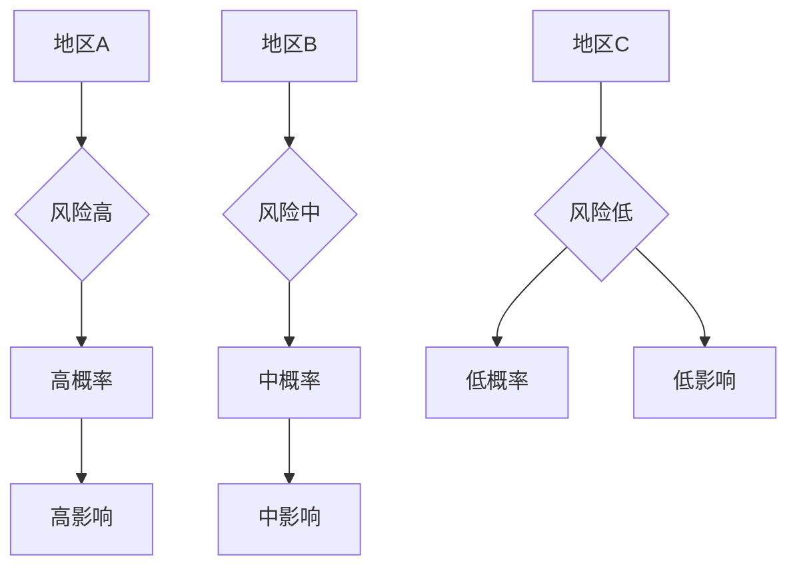

                 

## 文章标题

### 《如何进行有效的风险评估与管理》

关键词：风险评估、风险管理、风险管理模型、定量风险评估、定性风险评估、风险管理策略、大数据、人工智能

摘要：本文深入探讨了风险评估与管理的基础理论、方法与实践，通过系统化的分析和实例讲解，帮助读者理解风险评估与管理的核心概念，掌握有效的风险评估与管理策略，并在实践中应用。文章还展望了大数据与人工智能在风险评估与管理中的应用前景，以及新兴领域风险管理的挑战与机遇。

## 目录大纲

### 第一部分：风险评估与管理的基础理论

#### 1.1 风险评估与管理概述
##### 1.1.1 风险评估的定义
##### 1.1.2 风险评估的重要性
##### 1.1.3 风险评估的过程与方法

#### 1.2 风险类型与特征分析
##### 1.2.1 客观风险与主观风险
##### 1.2.2 可量化和不可量化风险
##### 1.2.3 概率和影响分析

#### 1.3 风险评估模型的构建
##### 1.3.1 风险评估模型的基本框架
##### 1.3.2 经典风险评估模型
##### 1.3.3 基于大数据的风险评估模型

#### 1.4 风险管理策略
##### 1.4.1 风险管理的基本原则
##### 1.4.2 风险规避、风险转移与风险接受
##### 1.4.3 风险减缓与风险监控

### 第二部分：风险评估与管理的方法与实践

#### 2.1 定量风险评估方法
##### 2.1.1 统计分析方法
##### 2.1.2 事件树分析
##### 2.1.3 罚则分析

#### 2.2 定性风险评估方法
##### 2.2.1 专家评估法
##### 2.2.2 德尔菲法
##### 2.2.3 头脑风暴法

#### 2.3 风险评估的实际应用
##### 2.3.1 财务风险管理
##### 2.3.2 项目风险管理
##### 2.3.3 环境风险管理

#### 2.4 风险管理的工具与技术
##### 2.4.1 风险矩阵
##### 2.4.2 风险地图
##### 2.4.3 风险矩阵的应用

### 第三部分：案例分析与综合评价

#### 3.1 风险评估与管理案例研究
##### 3.1.1 某金融机构的风险评估案例
##### 3.1.2 某企业的项目风险管理案例
##### 3.1.3 某地区的环境风险评估案例

#### 3.2 综合评价与改进建议
##### 3.2.1 风险评估与管理的评价标准
##### 3.2.2 风险评估与管理效果的评估
##### 3.2.3 改进风险评估与管理的方法

#### 3.3 国际视角下的风险评估与管理
##### 3.3.1 国际风险评估与管理框架
##### 3.3.2 全球风险管理实践案例
##### 3.3.3 国际风险管理趋势与挑战

### 第四部分：前沿技术与创新

#### 4.1 大数据与人工智能在风险评估中的应用
##### 4.1.1 大数据在风险评估中的作用
##### 4.1.2 人工智能技术在风险管理中的应用
##### 4.1.3 智能风险评估系统的开发

#### 4.2 新兴领域风险管理的挑战与机遇
##### 4.2.1 新兴技术风险
##### 4.2.2 全球化背景下的风险管理
##### 4.2.3 持续创新的风险管理策略

#### 4.3 风险评估与管理的未来展望
##### 4.3.1 风险评估与管理的发展趋势
##### 4.3.2 创新与挑战
##### 4.3.3 持续改进与优化

### 作者信息

作者：AI天才研究院/AI Genius Institute & 禅与计算机程序设计艺术 /Zen And The Art of Computer Programming## 第一部分：风险评估与管理的基础理论

### 1.1 风险评估与管理概述

#### 1.1.1 风险评估的定义

风险评估（Risk Assessment）是一种系统性的、科学的方法，用于识别、分析和评价某个事件或决策可能带来的风险，从而为决策提供依据。它包括以下几个关键步骤：识别潜在风险、评估风险的概率和影响、制定相应的风险管理策略。

在技术领域，风险评估尤为重要。无论是软件开发、系统集成，还是项目管理，都需要对可能出现的技术风险进行评估，以确保项目顺利进行。例如，在软件开发过程中，风险评估可以帮助团队识别出可能的技术瓶颈、资源分配问题，以及潜在的安全隐患。

#### 1.1.2 风险评估的重要性

风险评估的重要性体现在以下几个方面：

1. **降低风险**：通过识别和评估潜在风险，可以采取相应的措施来降低风险发生的概率或减轻其影响。
2. **决策支持**：风险评估提供了有关风险的信息，帮助决策者更好地理解潜在的风险，并做出明智的决策。
3. **风险管理**：风险评估是实施风险管理的第一步，为制定风险管理策略提供了基础。
4. **合规性**：在很多行业中，如金融、医疗、航空等，风险评估是确保合规性的关键环节。

#### 1.1.3 风险评估的过程与方法

风险评估通常包括以下过程：

1. **风险识别**：识别可能对项目或组织产生不利影响的风险。
2. **风险分析**：评估风险的概率和潜在影响。
3. **风险评价**：根据风险的概率和影响，确定风险的严重程度。
4. **风险应对**：制定和实施风险管理策略。
5. **风险监控**：持续监控风险，确保风险管理策略的有效性。

风险评估的方法主要包括以下几种：

1. **定性方法**：通过专家判断、德尔菲法等定性分析工具来评估风险。
2. **定量方法**：使用统计方法、事件树分析等定量工具来量化风险。
3. **综合方法**：结合定性和定量方法，以获得更全面的风险评估。

### 1.2 风险类型与特征分析

#### 1.2.1 客观风险与主观风险

风险可以分为客观风险和主观风险：

1. **客观风险**：基于事实和数据的，不受个人主观判断影响的，例如系统故障、市场波动等。
2. **主观风险**：基于个人或团队的主观判断和预测，例如对新技术的不确定性和团队士气问题。

#### 1.2.2 可量化和不可量化风险

风险也可以根据其是否可以量化分为两类：

1. **可量化风险**：可以用数值表示的风险，例如经济损失、时间延迟等。
2. **不可量化风险**：无法用具体数值表示的风险，例如团队冲突、道德风险等。

#### 1.2.3 概率和影响分析

概率和影响分析是风险评估的核心。通过分析风险发生的概率和其潜在影响，可以确定风险的优先级。

1. **概率分析**：评估风险发生的可能性，通常用百分比或概率值表示。
2. **影响分析**：评估风险发生后的影响程度，通常用等级或分数表示。

### 1.3 风险评估模型的构建

#### 1.3.1 风险评估模型的基本框架

风险评估模型的基本框架通常包括以下部分：

1. **风险识别**：识别所有潜在的风险。
2. **风险分析**：评估风险的概率和影响。
3. **风险评价**：根据概率和影响，对风险进行优先级排序。
4. **风险应对**：制定和实施风险管理策略。
5. **风险监控**：持续监控风险，确保风险管理策略的有效性。

#### 1.3.2 经典风险评估模型

常见的风险评估模型包括以下几种：

1. **事件树分析**：用于分析一个事件可能导致的多种结果及其概率。
2. **故障树分析**：用于识别和评估系统故障的原因和后果。
3. **SWOT分析**：用于评估项目的优势、劣势、机会和威胁。

#### 1.3.3 基于大数据的风险评估模型

随着大数据技术的发展，基于大数据的风险评估模型逐渐成为研究热点。这些模型利用大量数据来识别、分析和评估风险，具有更高的准确性和实时性。

### 1.4 风险管理策略

#### 1.4.1 风险管理的基本原则

风险管理应遵循以下基本原则：

1. **全面性**：覆盖所有潜在的风险。
2. **针对性**：根据风险的特点制定相应的管理策略。
3. **动态性**：随着环境的变化，持续调整风险管理策略。
4. **经济性**：在风险管理和应对中，考虑成本效益。

#### 1.4.2 风险规避、风险转移与风险接受

风险管理的策略主要包括：

1. **风险规避**：避免风险的发生。
2. **风险转移**：将风险转移给第三方，如通过保险。
3. **风险接受**：对无法规避或转移的风险，采取接受的态度。

#### 1.4.3 风险减缓与风险监控

风险减缓是通过降低风险的概率或影响来减轻风险。风险监控是持续监控风险，确保风险管理策略的有效性。

通过上述基础理论的分析，我们可以更好地理解风险评估与管理的重要性，掌握其核心概念和方法，为实践中的风险评估与管理打下坚实的基础。

### 1.2 风险类型与特征分析

#### 1.2.1 客观风险与主观风险

在风险评估与管理中，理解风险的类型和特征至关重要。风险可以按照其性质分为客观风险和主观风险。

**客观风险**：这种风险是基于客观事实和数据的，不依赖于个人或团队的主观判断。例如，自然灾害、市场波动、技术故障等都是客观风险。这些风险可以通过收集和分析历史数据、统计数据以及专业文献来识别和评估。

**主观风险**：与客观风险相对，主观风险是基于个人或团队的主观判断和预测的。这类风险通常包括项目团队的士气问题、管理层的决策失误、技术的不确定性等。主观风险难以量化，因为它们往往受到个人心理、价值观、知识和经验的影响。例如，一个新项目的成功往往取决于团队成员的协作和创新能力，而这些因素很难用具体的数值来衡量。

在实际操作中，识别客观风险和主观风险需要不同的方法和工具。对于客观风险，可以使用统计分析、历史数据分析和专家评审等方法。而对于主观风险，则通常需要通过问卷调查、访谈、德尔菲法等定性分析方法来识别和评估。

#### 1.2.2 可量化和不可量化风险

除了客观和主观风险，风险还可以根据其是否可以量化分为可量化和不可量化风险。

**可量化风险**：这种风险可以用具体的数值或度量标准来表示。例如，财务风险可以通过计算损失的概率和损失金额来量化；项目风险可以通过计算项目延期的时间和成本来量化。在技术领域，常见的可量化风险包括硬件故障导致的生产停机时间、软件缺陷导致的数据丢失等。

**不可量化风险**：这种风险无法用具体的数值或度量标准来表示。它们通常涉及主观判断、道德风险、社会影响等方面。例如，一个软件项目的延迟可能对客户满意度产生负面影响，但这种影响很难用具体的数值来衡量。不可量化风险通常需要通过定性的方法来评估，如专家评审、情景分析等。

在实际应用中，对于可量化风险，可以使用数学模型、统计方法等定量工具来进行评估。而对于不可量化风险，则通常需要依赖专家经验和定性分析工具。在某些情况下，可以尝试将不可量化风险转化为可量化风险，例如通过将客户满意度转换为财务指标来衡量。

#### 1.2.3 概率和影响分析

概率和影响分析是风险评估的核心环节。通过对风险发生的概率和其潜在影响的评估，可以更全面地了解风险。

**概率分析**：概率分析旨在评估风险发生的可能性。这可以通过历史数据、专家判断、情景分析等方法来实现。例如，在软件开发项目中，可以通过分析过去类似项目的成功率和失败率来估计某个特定项目失败的概率。

**影响分析**：影响分析旨在评估风险发生后的影响程度。这可以通过定量或定性方法来评估。定量方法包括计算损失金额、项目延期时间等；定性方法则包括评估风险对项目目标的影响、对团队士气的影响等。

**概率-影响矩阵**：概率-影响矩阵是一种常用的工具，用于同时评估风险的概率和影响。矩阵中的每个单元格表示一个特定的风险，其值表示该风险的概率和影响的乘积。通过这种方式，可以识别出高风险区域，从而有针对性地制定风险管理策略。

在概率-影响分析中，需要考虑多个因素，包括风险的严重性、发生的可能性、可控性等。通过综合考虑这些因素，可以更准确地评估风险，并为决策提供依据。

#### 1.2.4 风险特征分析

除了上述分析，对风险的特征分析也是风险评估的重要环节。风险特征分析旨在理解风险的本质和特点，从而更好地制定风险管理策略。

**风险特征分析**：风险特征分析包括风险的发生条件、风险传播途径、风险的可控性等。例如，在信息安全领域，风险特征分析可能包括攻击者的动机、攻击手段、攻击目标等。

**风险评估模型的构建**：基于风险特征分析，可以构建风险评估模型。这些模型可以用于定量和定性评估，帮助团队更好地理解和控制风险。

**风险地图**：风险地图是一种可视化工具，用于展示风险的类型、概率、影响和优先级。通过风险地图，可以直观地了解风险分布和风险优先级，从而有针对性地制定风险管理计划。

通过上述分析，我们可以更深入地理解风险的类型和特征，为有效的风险评估与管理打下坚实的基础。在实际操作中，结合具体情境，运用适当的方法和工具，可以更准确地识别和评估风险，从而制定出切实可行的风险管理策略。

### 1.3 风险评估模型的构建

#### 1.3.1 风险评估模型的基本框架

在构建风险评估模型时，一个基本且通用的框架是必不可少的。这个框架应该包含以下关键步骤：

1. **风险识别**：这是模型构建的第一步，目标是识别项目或系统中所有潜在的风险。这可以通过文献回顾、历史数据分析、专家访谈和现场观察等多种方法来实现。

2. **风险分析**：在识别出所有潜在风险之后，接下来需要分析这些风险的概率和影响。概率分析可以通过历史数据、专家判断或模拟实验等方法来完成。影响分析则通常涉及对风险可能造成的损失、时间延误或其他不利影响的评估。

3. **风险评价**：根据风险的概率和影响，对风险进行优先级排序，以便确定哪些风险需要优先管理。这通常通过使用概率-影响矩阵或其他评价工具来完成。

4. **风险应对**：一旦风险被识别和评价，下一步就是制定和实施风险应对策略。这可能包括风险规避、风险转移、风险接受或风险减缓。每种策略都需要具体的行动和资源分配。

5. **风险监控**：最后，为了确保风险管理策略的有效性，需要持续监控风险。这包括定期审查风险管理计划、记录和报告风险状态，以及根据新的信息或变化调整风险管理策略。

#### 1.3.2 经典风险评估模型

在风险评估实践中，一些经典的风险评估模型被广泛应用，这些模型各有特点和适用场景。

1. **事件树分析（ETA）**：事件树分析是一种图形化工具，用于分析一个事件可能导致的多种结果及其概率。每个分支表示一个可能的后果，节点表示事件的发生。这种模型特别适用于复杂系统的风险分析，例如航空系统或核能系统。

    ```mermaid
    graph TD
    A[事件起始] --> B{是否发生风险}
    B -->|是| C[风险发生]
    B -->|否| D[无风险]
    C --> E[后果1]
    C --> F[后果2]
    D --> G[无后果1]
    D --> H[无后果2]
    ```

2. **故障树分析（FTA）**：故障树分析用于识别和评估系统故障的原因和后果。每个故障节点都与其他节点相连，形成一棵树形结构。故障树分析特别适用于复杂系统，如制造过程、航空电子设备等。

    ```mermaid
    graph TD
    A[系统故障] --> B{硬件故障}
    B -->|是| C[电子组件故障]
    B -->|否| D[软件故障]
    C --> E[温度过高]
    D --> F[编程错误]
    ```

3. **SWOT分析**：SWOT分析是一种战略规划工具，用于评估项目的优势、劣势、机会和威胁。这种模型简单直观，适用于各种规模的项目和决策。

    ```mermaid
    graph TD
    A[SWOT分析]
    A -->|优势| B{内部优势}
    A -->|劣势| C{内部劣势}
    A -->|机会| D{外部机会}
    A -->|威胁| E{外部威胁}
    ```

#### 1.3.3 基于大数据的风险评估模型

随着大数据技术的发展，基于大数据的风险评估模型逐渐成为研究热点。这些模型利用大量数据来识别、分析和评估风险，具有更高的准确性和实时性。

1. **数据驱动的风险预测模型**：这类模型通过分析历史数据和实时数据，预测未来可能出现的风险。常见的算法包括机器学习算法、回归分析等。

2. **异常检测**：异常检测是一种利用大数据分析技术，识别出数据中的异常模式和潜在风险。常见的算法包括孤立森林、K-最近邻等。

3. **风险评估平台**：这些平台集成了多种风险评估工具和算法，提供一站式解决方案，帮助企业和组织进行全面的、实时风险监控和评估。

    ```mermaid
    graph TD
    A[数据源] --> B[数据预处理]
    B --> C[特征提取]
    C --> D[风险评估模型]
    D --> E[风险预测]
    E --> F[风险监控]
    ```

通过上述分析，我们可以看到，风险评估模型不仅需要包含基本的风险识别、分析和评价框架，还需要结合具体的方法和技术，以满足不同领域的需求。无论是经典的风险评估模型，还是基于大数据的先进模型，都是确保有效风险评估与管理的重要工具。

### 1.4 风险管理策略

风险管理策略是确保项目或组织在面对不确定性和潜在威胁时能够顺利运作的关键。有效的风险管理策略需要基于风险评估的结果，结合组织的实际情况和目标，制定具体的行动方案和资源配置。以下将详细介绍风险管理的基本原则、常见策略及其应用。

#### 1.4.1 风险管理的基本原则

风险管理应遵循以下基本原则，以确保其科学性和有效性：

1. **全面性**：风险管理应覆盖所有可能的风险，无论其大小和性质。这包括客观风险和主观风险、可量化风险和不可量化风险。

2. **针对性**：风险管理策略应根据不同类型和优先级的风险制定，确保资源和努力集中在最关键的风险上。

3. **动态性**：风险管理体系应具有动态适应性，能够随着环境和项目阶段的变化而调整。

4. **经济性**：在实施风险管理策略时，应考虑成本效益，确保资源的合理分配。

5. **可持续性**：风险管理策略应旨在实现长期的可持续性，不仅关注短期效果，还要考虑长期的风险控制和利益最大化。

#### 1.4.2 风险规避、风险转移与风险接受

风险管理策略主要包括以下几种：

1. **风险规避**：风险规避是通过改变项目计划或决策，避免风险的发生。例如，在软件开发项目中，可以通过增加测试和审核流程来规避软件缺陷的风险。

2. **风险转移**：风险转移是将风险的责任和后果转移到第三方，通常通过保险或其他合同安排实现。例如，企业可以通过购买保险来转移财务损失的风险。

3. **风险接受**：风险接受是指企业承认某些风险不可避免，选择承担其后果。这通常适用于低概率、低影响的风险，或者当规避和转移成本过高时。

4. **风险减缓**：风险减缓是通过降低风险的概率或影响来减轻风险。例如，在自然灾害高风险区域，企业可以投资建设防洪堤来减缓洪水风险。

5. **风险补偿**：风险补偿是通过在项目预算中预留一定的资金，用于应对可能发生的风险。例如，在项目计划中预留一定的预算，用于修复软件缺陷或应对市场变化。

#### 1.4.3 风险减缓与风险监控

风险减缓是风险管理策略中至关重要的一环，其目标是降低风险的概率或影响。以下是一些常见的方法：

1. **技术措施**：通过改进技术手段和流程，降低风险。例如，在软件开发中，通过引入自动化测试和代码审查来减少软件缺陷。

2. **管理措施**：通过加强管理，提高风险应对能力。例如，在项目规划中设置预警机制和应急响应小组。

3. **培训与教育**：通过培训和教育，提高员工的风险意识和应对能力。例如，在信息安全领域，定期组织员工进行安全培训。

风险监控是确保风险管理策略有效性的关键。以下是一些风险监控的方法：

1. **定期审查**：定期审查风险管理计划，评估风险应对措施的有效性。

2. **记录与报告**：记录和报告风险状态，包括风险发生的频率、影响和应对措施。

3. **监控工具**：使用风险监控工具，如风险矩阵、风险地图等，实时跟踪风险状态。

4. **持续改进**：根据监控结果，不断调整和优化风险管理策略。

通过上述风险管理策略，企业或项目团队可以更好地应对潜在风险，确保项目的顺利进行和组织的可持续发展。有效的风险管理不仅能够降低损失，还能提升组织的竞争力和应对不确定性的能力。

### 第二部分：风险评估与管理的方法与实践

#### 2.1 定量风险评估方法

定量风险评估方法主要依赖于数学和统计学的工具，通过量化的方式对风险进行评估。这种方法使得风险评估过程更为客观和科学。以下将介绍几种常见的定量风险评估方法。

##### 2.1.1 统计分析方法

统计分析方法是通过分析历史数据来评估风险的。这种方法适用于处理可量化风险，例如经济损失、项目延迟等。常见的统计分析方法包括：

1. **概率分布**：通过分析历史数据，确定风险的概率分布。例如，可以使用正态分布、泊松分布等来描述风险的概率分布。

    ```latex
    P(X \leq x) = \int_{-\infty}^{x} f(t) dt
    ```

    其中，\( P(X \leq x) \) 表示随机变量 \( X \) 小于或等于 \( x \) 的概率，\( f(t) \) 是概率密度函数。

2. **回归分析**：通过建立回归模型，分析自变量和因变量之间的关系。例如，可以建立线性回归模型来预测项目延期的时间。

    ```latex
    Y = \beta_0 + \beta_1 X + \epsilon
    ```

    其中，\( Y \) 是因变量，\( X \) 是自变量，\( \beta_0 \) 和 \( \beta_1 \) 是回归系数，\( \epsilon \) 是误差项。

3. **方差分析**：用于比较多个样本均值是否存在显著差异。例如，可以用于比较不同项目团队完成项目的时间。

    ```latex
    F = \frac{MS_{between}}{MS_{within}}
    ```

    其中，\( F \) 是方差分析统计量，\( MS_{between} \) 是组间均方，\( MS_{within} \) 是组内均方。

##### 2.1.2 事件树分析

事件树分析（Event Tree Analysis, ETA）是一种用于评估风险事件及其后果的图形化工具。事件树以一个起始事件为根节点，每个分支代表一个可能的后果，节点之间的连线表示事件的发生顺序。

1. **基本步骤**：

   - **定义事件**：确定分析中的起始事件，例如项目延期。
   - **构建分支**：根据可能的结果，构建事件树的不同分支。
   - **分配概率**：为每个分支分配发生的概率。
   - **计算后果**：计算每个分支的后果，包括概率和影响。

2. **示例**：

   假设一个软件开发项目有两个可能的延期原因：需求变更和技术故障。需求变更的概率为0.4，技术故障的概率为0.6。

    ```mermaid
    graph TD
    A[项目延期] --> B{需求变更} --> C{延期30天}
    A --> D{技术故障} --> E{延期45天}
    B Probability 0.4
    D Probability 0.6
    ```

##### 2.1.3 罚则分析

罚则分析（Penalty Analysis）是一种用于评估风险事件对项目或组织造成的财务损失的方法。这种方法通过计算风险事件发生的罚款或损失，来量化风险的影响。

1. **基本步骤**：

   - **定义风险事件**：确定分析中的风险事件，例如法律诉讼或合同违约。
   - **计算罚款或损失**：根据法律法规或合同条款，计算风险事件发生的罚款或损失金额。
   - **评估风险影响**：综合考虑罚款或损失的金额和概率，评估风险的影响。

2. **示例**：

   假设一家公司在合同中规定，如果项目延期超过30天，将支付每天5万元的违约金。

    ```latex
    损失 = 罚款金额 \times 延期天数
    ```

    假设项目延期概率为0.2，延期天数为40天。

    ```latex
    损失 = 50000 \times 40 = 2000000 元
    ```

通过上述定量风险评估方法，企业和项目团队可以更科学地评估和管理风险，从而制定出更加有效的风险管理策略。这些方法不仅有助于预测潜在的风险，还能为决策提供有力的数据支持。

#### 2.2 定性风险评估方法

定性风险评估方法主要依赖于专家判断和主观评估，通过文字描述和分类来评估风险。这种方法适用于处理难以量化的风险，如主观风险和道德风险。以下将介绍几种常见的定性风险评估方法。

##### 2.2.1 专家评估法

专家评估法（Expert Assessment）是通过邀请相关领域的专家，对风险进行评估和分析。这种方法依赖于专家的经验和专业知识，通常用于评估主观风险和复杂系统的风险。

1. **基本步骤**：

   - **确定评估目标**：明确评估的目标和范围，例如项目风险或产品风险。
   - **选择专家**：根据评估目标，选择具有相关领域经验和知识的专业人士。
   - **收集信息**：与专家进行访谈或问卷调查，收集关于风险的详细信息。
   - **评估风险**：根据收集的信息，专家对风险进行定性评估，包括风险的概率、影响和优先级。

2. **示例**：

   假设一个软件项目需要评估团队冲突的风险。邀请几位项目经理和团队成员进行访谈，收集他们对团队冲突的看法和经验。

    ```mermaid
    graph TD
    A[项目团队冲突风险] --> B[项目经理1] --> C{低概率}
    A --> D[项目经理2] --> E{中概率}
    A --> F[团队成员1] --> G{高影响}
    ```

通过专家评估法，可以综合不同专家的意见，对风险进行更为全面的评估。

##### 2.2.2 德尔菲法

德尔菲法（Delphi Method）是一种通过多轮匿名调查，收集专家意见的方法。这种方法旨在减少主观偏见，提高风险评估的客观性和准确性。

1. **基本步骤**：

   - **设计问卷**：根据评估目标，设计包含相关问题的问卷。
   - **邀请专家**：邀请相关领域的专家参与调查。
   - **多轮调查**：进行多轮匿名调查，每次调查后，专家可以根据其他专家的意见调整自己的评估结果。
   - **综合分析**：收集并分析所有专家的最终评估结果。

2. **示例**：

   假设一个企业需要评估市场变化的风险。设计一份问卷，邀请市场分析师、销售人员和技术专家参与调查。

    ```mermaid
    graph TD
    A[市场变化风险] --> B[市场分析师] --> C{高概率}
    A --> D[销售人员] --> E{中影响}
    A --> F[技术专家] --> G{低影响}
    ```

通过德尔菲法，可以综合不同专家的意见，减少个体偏见，提高风险评估的准确性。

##### 2.2.3 头脑风暴法

头脑风暴法（Brainstorming）是一种集体创造性的方法，通过集体讨论和思维碰撞，识别和评估潜在风险。这种方法适用于团队协作，特别适用于初始风险识别阶段。

1. **基本步骤**：

   - **准备会议**：确定会议的目标、时间和地点，准备相关资料。
   - **发起讨论**：邀请团队成员参与会议，鼓励自由发言，提出潜在风险。
   - **记录和分类**：记录所有提出的风险，并根据风险类型和优先级进行分类。
   - **评估和优先级排序**：对记录的风险进行评估，确定其概率和影响，并进行优先级排序。

2. **示例**：

   假设一个团队需要评估新项目的技术风险。召开头脑风暴会议，邀请所有团队成员参与，提出可能的技术风险，并进行评估和分类。

    ```mermaid
    graph TD
    A[技术风险识别] --> B[硬件故障] --> C{中概率}
    A --> D[软件缺陷] --> E{高影响}
    ```

通过头脑风暴法，可以快速识别和评估潜在风险，为后续的详细风险评估提供基础。

定性风险评估方法虽然依赖于主观判断，但通过合理的工具和流程，可以有效地识别和评估风险，为决策提供重要依据。这些方法在实际应用中往往与其他定量方法结合使用，以获得更全面的风险评估。

#### 2.3 风险评估的实际应用

风险评估在实际应用中涵盖了多个领域，每个领域都有其独特的风险类型和评估方法。以下将详细介绍财务风险管理、项目风险管理和环境风险管理，并探讨这些领域中的具体实践。

##### 2.3.1 财务风险管理

财务风险管理是企业在财务管理过程中，识别、评估和控制财务风险的一系列活动。财务风险包括市场风险、信用风险、流动性风险和操作风险等。以下是一些常见的财务风险管理方法：

1. **市场风险管理**：市场风险是指由于市场波动（如利率、汇率、股价波动等）导致企业财务损失的风险。常见的市场风险管理方法包括：

   - **对冲**：通过金融衍生工具（如期货、期权、互换等）来对冲市场风险。
   - **风险分散**：通过投资多种不同类型的资产来分散市场风险。
   - **风险控制**：制定和实施风险控制政策，限制投资组合的市场风险敞口。

2. **信用风险管理**：信用风险是指由于客户违约或信用评级下降导致企业财务损失的风险。常见的信用风险管理方法包括：

   - **信用评级**：对客户进行信用评级，评估其信用风险。
   - **抵押和担保**：要求客户提供抵押物或担保来降低信用风险。
   - **限额管理**：对客户的信用额度进行限制，以控制信用风险。

3. **流动性风险管理**：流动性风险是指企业无法按时偿还债务或满足资金需求的风险。常见的流动性风险管理方法包括：

   - **现金流量管理**：监控企业的现金流量，确保有足够的流动性。
   - **短期融资**：通过短期贷款、信用证等方式来获取短期资金。
   - **应急储备**：建立应急储备金，以应对突发性资金需求。

##### 2.3.2 项目风险管理

项目风险管理是确保项目能够按时、按预算和按质量完成的一系列管理和控制活动。项目风险包括技术风险、时间风险、成本风险和团队风险等。以下是一些常见的项目风险管理方法：

1. **风险识别**：在项目初期，通过访谈、头脑风暴和文档审查等方法，识别所有潜在的风险。

2. **风险评估**：对识别出的风险进行评估，确定其概率和影响。可以使用定性评估方法（如专家评估法、德尔菲法）或定量评估方法（如事件树分析、概率-影响矩阵）。

3. **风险应对**：根据风险评估的结果，制定和实施风险应对策略。常见的风险应对策略包括规避、转移、接受和减缓。

4. **风险监控**：在整个项目生命周期中，持续监控风险状态，并根据新的信息或变化调整风险管理策略。

##### 2.3.3 环境风险管理

环境风险管理是企业在环境保护和可持续发展过程中，识别、评估和控制环境风险的一系列活动。环境风险包括污染风险、生态风险和资源风险等。以下是一些常见的环境风险管理方法：

1. **污染风险管理**：污染风险是指由于污染物的排放或泄漏导致环境损害的风险。常见的污染风险管理方法包括：

   - **污染源控制**：通过技术改造和管理措施，减少污染物的排放。
   - **泄漏检测**：建立泄漏检测系统，及时发现并处理泄漏事件。
   - **应急预案**：制定和实施应急预案，应对突发性污染事件。

2. **生态风险管理**：生态风险是指由于人类活动对生态系统造成的损害的风险。常见的生态风险管理方法包括：

   - **生态系统评估**：评估人类活动对生态系统的影响，制定保护措施。
   - **生态恢复**：通过生态恢复工程，修复受损的生态系统。
   - **生物多样性保护**：制定生物多样性保护计划，保护珍稀濒危物种。

3. **资源风险管理**：资源风险是指由于资源短缺或资源浪费导致的风险。常见的资源风险管理方法包括：

   - **资源规划**：制定资源利用规划，确保资源的合理分配和使用。
   - **节能降耗**：通过技术改造和管理措施，提高能源和资源的利用效率。
   - **循环经济**：推动循环经济的发展，减少资源的消耗和浪费。

通过上述实际应用，我们可以看到风险评估与管理在不同领域的重要性。无论是财务风险管理、项目风险管理，还是环境风险管理，有效的风险评估和管理都是确保组织长期健康发展的关键。在实际操作中，结合具体情境和需求，运用适当的风险评估方法和管理策略，可以更好地应对潜在风险，实现组织的可持续发展。

#### 2.4 风险管理的工具与技术

在风险管理过程中，使用适当的工具和技术可以提高评估的准确性和效率。以下将介绍几种常用的风险管理工具和技术，包括风险矩阵、风险地图以及它们在实际应用中的具体使用方法。

##### 2.4.1 风险矩阵

风险矩阵（Risk Matrix）是一种用于评估风险的概率和影响的图形化工具。通过将风险的概率和影响进行量化，风险矩阵可以帮助决策者快速识别高风险区域，并采取相应的风险管理措施。

**基本原理：**

1. **风险概率**：风险概率表示风险发生的可能性。通常使用概率分布表或专家评估法来确定。
2. **风险影响**：风险影响表示风险发生后的后果。影响可以是财务损失、时间延误、资源浪费等，通常也使用专家评估法来确定。

**矩阵结构：**

风险矩阵通常是一个二维表格，横轴表示风险概率，纵轴表示风险影响。每个单元格表示一个特定的风险，其值表示该风险的概率和影响的乘积。

**示例：**

假设一个项目有四个风险，其概率和影响如下表：

| 风险 | 概率 | 影响 |
| --- | --- | --- |
| A | 0.3 | 大 |
| B | 0.5 | 中 |
| C | 0.2 | 小 |
| D | 0.4 | 中 |

根据概率和影响，我们可以构建一个风险矩阵：

| 概率 | 小影响 | 中影响 | 大影响 |
| --- | --- | --- | --- |
| 0.1 | 0.03 | 0.05 | 0.06 |
| 0.2 | 0.06 | 0.10 | 0.12 |
| 0.3 | 0.09 | 0.15 | 0.18 |
| 0.4 | 0.12 | 0.20 | 0.24 |

**应用场景：**

风险矩阵适用于项目初期评估、中期审查和项目结束评估。通过风险矩阵，项目经理可以快速识别高风险区域，并制定相应的应对策略。

##### 2.4.2 风险地图

风险地图（Risk Map）是一种用于可视化风险分布和优先级的图形化工具。通过将风险在地图上标记，风险地图可以帮助决策者直观地了解项目的风险状况，并制定有针对性的风险管理策略。

**基本原理：**

1. **风险位置**：风险地图通常是一个地理信息系统的扩展，将风险位置标记在地图上。
2. **风险优先级**：根据风险的概率和影响，对风险进行优先级排序，并在地图上标记。

**示例：**

假设一个项目涉及多个地区，以下为风险地图的一个示例：



**应用场景：**

风险地图适用于跨地区项目、供应链管理以及供应链风险管理。通过风险地图，项目经理可以直观地了解项目在不同地区的风险状况，并采取相应的管理措施。

##### 2.4.3 风险矩阵的应用

风险矩阵在实际应用中具有广泛的应用场景，以下列举几个具体的应用实例：

1. **项目风险管理**：在项目初期，通过风险矩阵对项目进行评估，识别高风险区域。例如，在一个大型软件开发项目中，通过风险矩阵识别出需求变更和技术故障等高风险。

2. **财务风险管理**：在企业财务管理中，通过风险矩阵对投资组合进行评估。例如，分析市场波动、信用风险等，并制定相应的对冲策略。

3. **环境风险管理**：在环境保护项目中，通过风险矩阵评估污染风险和生态风险。例如，分析污染源、生态损害等，并制定相应的污染控制措施。

通过上述工具和技术的介绍，我们可以看到，风险矩阵和风险地图在风险管理中的应用不仅提高了评估的准确性，还提升了决策的效率。在实际操作中，结合具体情境和需求，灵活运用这些工具和技术，可以更好地管理风险，确保项目的顺利实施和组织的可持续发展。

### 第三部分：案例分析与综合评价

#### 3.1 风险评估与管理案例研究

在本部分，我们将通过三个具体的案例研究，详细探讨风险评估与管理在不同领域的应用和实践。

##### 3.1.1 某金融机构的风险评估案例

**背景介绍**：

某金融机构在推出一款新型金融产品前，需要进行详细的风险评估，以确保产品的稳健性和市场竞争力。该金融产品是一款结合了股票、债券和衍生品的投资组合，预期将为客户带来高收益，但同时也面临较高的市场风险。

**核心概念与联系**：

在该案例中，关键的风险评估模型是概率-影响矩阵。通过分析历史数据和专家意见，确定各风险的概率和影响。核心概念包括：

1. **概率分析**：通过历史数据和专家评估，确定各风险发生的概率。
2. **影响分析**：评估各风险发生后的影响，包括财务损失、客户流失等。

**核心算法原理讲解与伪代码**：

```python
# 伪代码：风险评估模型的概率-影响分析
def risk_assessment(risks):
    probability = []
    impact = []
    for risk in risks:
        # 获取专家评估的概率和影响
        risk_prob = expert_evaluation(risk['name'], 'probability')
        risk_impact = expert_evaluation(risk['name'], 'impact')
        
        # 计算概率-影响乘积
        risk_score = risk_prob * risk_impact
        probability.append(risk_prob)
        impact.append(risk_impact)
        risk['score'] = risk_score
    
    # 对风险进行排序
    sorted_risks = sorted(risks, key=lambda x: x['score'], reverse=True)
    return sorted_risks

# 示例：定义风险集合
risks = [
    {'name': '市场波动', 'probability': 0.6, 'impact': 0.8},
    {'name': '信用风险', 'probability': 0.4, 'impact': 0.7},
    {'name': '操作风险', 'probability': 0.3, 'impact': 0.5}
]

# 执行风险评估
sorted_risks = risk_assessment(risks)
print(sorted_risks)
```

**数学模型和公式**：

概率-影响矩阵的数学模型可以表示为：

\[ \text{风险得分} = \text{概率} \times \text{影响} \]

其中，风险得分用于评估风险的优先级。

**举例说明**：

通过上述算法，该金融机构确定以下高风险：

1. **市场波动**：概率为0.6，影响为0.8，风险得分为0.48。
2. **信用风险**：概率为0.4，影响为0.7，风险得分为0.28。
3. **操作风险**：概率为0.3，影响为0.5，风险得分为0.15。

根据风险得分，金融机构决定重点管理市场波动和信用风险，采取对冲策略和市场调研来降低这些风险。

##### 3.1.2 某企业的项目风险管理案例

**背景介绍**：

某企业正在开发一款新的移动应用程序，项目预算为100万元，预计开发周期为6个月。但在项目进展过程中，遇到了一些潜在风险，可能影响项目按期完成和预算控制。

**核心概念与联系**：

在本案例中，核心概念是事件树分析和风险矩阵。通过事件树分析，识别项目可能面临的多种风险情景，并通过风险矩阵评估这些情景的概率和影响。

**核心算法原理讲解与伪代码**：

```python
# 伪代码：事件树分析
def event_tree_analysis(events):
    tree = {}
    for event in events:
        # 构建事件树
        tree[event['name']] = {}
        for consequence in event['consequences']:
            tree[event['name']][consequence['name']] = {
                'probability': consequence['probability'],
                'impact': consequence['impact']
            }
    return tree

# 示例：定义事件集合
events = [
    {'name': '需求变更', 'consequences': [
        {'name': '项目延期', 'probability': 0.7, 'impact': 0.8},
        {'name': '预算超支', 'probability': 0.3, 'impact': 0.6}
    ]},
    {'name': '技术故障', 'consequences': [
        {'name': '项目延期', 'probability': 0.6, 'impact': 0.9},
        {'name': '数据丢失', 'probability': 0.4, 'impact': 0.7}
    ]}
]

# 执行事件树分析
event_tree = event_tree_analysis(events)
print(event_tree)
```

**数学模型和公式**：

事件树分析中的概率和影响可以表示为：

\[ \text{后果得分} = \text{概率} \times \text{影响} \]

**举例说明**：

通过事件树分析，该企业识别出以下风险情景：

1. **需求变更**：导致项目延期的概率为0.7，影响为0.8。
2. **技术故障**：导致项目延期的概率为0.6，影响为0.9。

根据风险得分，企业决定加强需求管理和技术测试，以降低项目延期的风险。

##### 3.1.3 某地区的环境风险评估案例

**背景介绍**：

某地区正在考虑扩建一条高速公路，预计对当地生态系统和居民生活造成影响。为了确保决策的合理性和可持续性，该地区需要进行环境风险评估。

**核心概念与联系**：

在本案例中，核心概念是环境风险矩阵和情景分析。通过环境风险矩阵，评估扩建高速公路对生态和居民生活的影响，并通过情景分析预测不同扩建方案的影响。

**核心算法原理讲解与伪代码**：

```python
# 伪代码：环境风险矩阵
def environmental_risk_matrix(risks):
    matrix = {}
    for risk in risks:
        matrix[risk['name']] = {
            'probability': risk['probability'],
            'impact': risk['impact']
        }
    return matrix

# 示例：定义环境风险集合
risks = [
    {'name': '生态破坏', 'probability': 0.8, 'impact': 0.9},
    {'name': '交通拥堵', 'probability': 0.6, 'impact': 0.7},
    {'name': '居民健康问题', 'probability': 0.5, 'impact': 0.8}
]

# 执行环境风险矩阵
risk_matrix = environmental_risk_matrix(risks)
print(risk_matrix)
```

**数学模型和公式**：

环境风险矩阵的数学模型可以表示为：

\[ \text{风险得分} = \text{概率} \times \text{影响} \]

**举例说明**：

通过环境风险矩阵分析，该地区确定以下高风险：

1. **生态破坏**：概率为0.8，影响为0.9。
2. **交通拥堵**：概率为0.6，影响为0.7。
3. **居民健康问题**：概率为0.5，影响为0.8。

根据风险得分，该地区决定重新评估扩建方案，考虑减少对生态系统的破坏和交通拥堵问题。

#### 3.2 综合评价与改进建议

##### 3.2.1 风险评估与管理的评价标准

为了确保风险评估与管理的有效性，需要建立一套评价标准。以下是一些常见的评价标准：

1. **准确性**：评估结果是否准确，是否能够真实反映风险状况。
2. **全面性**：评估是否覆盖了所有潜在的风险，包括客观风险和主观风险。
3. **时效性**：评估是否及时，能否在风险发生前提供预警。
4. **实用性**：评估方法和工具是否易于理解和应用。
5. **成本效益**：评估和管理过程是否在合理范围内，能否达到预期的效果。

##### 3.2.2 风险评估与管理效果的评估

风险评估与管理效果可以通过以下指标进行评估：

1. **风险减少率**：通过比较风险评估前后的风险数量和严重程度，计算风险减少率。
2. **事件响应时间**：记录从风险发生到采取应对措施的时间，评估应急响应的效率。
3. **成本节约**：通过评估风险管理措施的实施，计算节约的成本。
4. **客户满意度**：通过问卷调查或反馈，评估客户对风险管理措施和结果的满意度。

##### 3.2.3 改进风险评估与管理的方法

为了持续改进风险评估与管理的方法，可以考虑以下建议：

1. **定期培训**：定期对风险评估团队成员进行培训，提高其专业知识和技能。
2. **工具升级**：引入先进的评估工具和技术，提高评估的准确性和效率。
3. **过程优化**：优化风险评估和管理流程，减少冗余步骤，提高工作效率。
4. **知识共享**：鼓励团队成员分享经验和最佳实践，提升整体风险管理能力。
5. **持续监控**：建立持续的监控机制，定期审查和更新风险评估模型，确保其适用性和有效性。

通过以上案例研究和综合评价，我们可以看到风险评估与管理在不同领域的应用和实践。有效的风险评估与管理不仅能够降低风险，还能提高组织的决策能力和竞争力。在实际操作中，结合具体情境和需求，灵活运用风险评估方法和工具，持续改进风险管理策略，是确保组织长期健康发展的关键。

#### 3.3 国际视角下的风险评估与管理

在全球化和技术快速发展的背景下，国际视角下的风险评估与管理变得越来越重要。本节将探讨国际风险评估与管理框架、全球风险管理实践案例以及国际风险管理趋势与挑战。

##### 3.3.1 国际风险评估与管理框架

国际上的风险评估与管理框架旨在提供统一的规范和标准，以指导各国在风险评估和管理过程中采取科学、有效的方法。以下是一些国际广泛认可的风险评估与管理框架：

1. **ISO 31000**：国际标准化组织（ISO）发布的ISO 31000标准是风险管理领域的全球性标准。该标准提供了风险管理的全面指南，包括风险评估、风险识别、风险分析和评价等步骤。

2. **COBIT**：控制目标和相关技术（Control Objectives for Information and Related Technologies，COBIT）框架是一个综合性的信息和技术（IT）管理框架。COBIT包括了一系列风险管理实践，帮助组织确保IT系统的安全和可靠性。

3. **ERM**：企业风险管理（Enterprise Risk Management，ERM）框架是由COSO（Committee of Sponsoring Organizations of the Treadway Commission）开发的。ERM框架提供了一个全面的风险管理体系，包括风险识别、风险评估、风险应对和风险监控等步骤。

这些框架为国际上的风险评估与管理提供了指导原则，帮助各国在风险管理过程中实现标准化和规范化。

##### 3.3.2 全球风险管理实践案例

在国际范围内，有许多成功和失败的风险管理案例，以下列举两个具有代表性的案例：

1. **金融危机风险管理**：2008年的全球金融危机是一个典型的风险管理失败案例。许多金融机构在风险评估和管理方面存在严重缺陷，未能充分识别和应对市场风险。这次危机导致了全球金融体系的动荡，大量金融机构倒闭或被政府接管。这一案例提醒我们，在风险管理中，必须充分考虑市场波动、信用风险和操作风险等多方面因素。

2. **瑞士再保险公司的自然灾害风险管理**：瑞士再保险公司在自然灾害风险管理方面取得了显著成功。该公司通过先进的模型和数据分析，准确预测了自然灾害的发生概率和影响，并采取了相应的风险规避和转移策略。例如，在地震和飓风高风险地区，瑞士再保险通过再保险和风险对冲等手段，有效降低了自身的风险敞口。这一案例展示了在自然灾害风险管理中，利用大数据和人工智能等先进技术的重要性。

##### 3.3.3 国际风险管理趋势与挑战

随着全球化和技术的进步，国际风险管理呈现出以下趋势和挑战：

1. **大数据与人工智能的应用**：大数据和人工智能技术在风险评估与管理中的应用日益普及。通过分析海量数据，组织可以更准确地识别和评估风险，制定更有效的风险管理策略。

2. **全球化背景下的风险管理**：全球化使得企业面临更加复杂的风险环境，包括汇率风险、政治风险、文化风险等。国际风险管理需要考虑这些跨领域的风险，制定综合性的风险管理策略。

3. **持续创新的风险管理策略**：新兴技术和商业模式的发展，带来了新的风险类型和挑战。例如，区块链、物联网和人工智能等技术的应用，既带来了创新机遇，也增加了风险管理的复杂性。组织需要不断创新风险管理策略，以应对新兴风险。

4. **监管与合规性**：国际金融市场的监管日益严格，企业需要遵守各种国际法规和标准，如《通用数据保护条例》（GDPR）和《巴塞尔协议》等。合规性风险成为企业风险管理的重要一环。

5. **风险管理文化的建设**：风险管理不仅是技术和流程，还涉及企业文化和员工素质。建立积极的风险管理文化，提高员工的风险意识和能力，是有效风险管理的关键。

国际视角下的风险评估与管理，不仅需要遵循国际标准和规范，还要结合本国的实际情况和需求，制定科学、有效的风险管理策略。通过全球化和技术的进步，国际风险管理将继续发展，以应对日益复杂的风险环境。

### 第四部分：前沿技术与创新

#### 4.1 大数据与人工智能在风险评估中的应用

随着大数据和人工智能（AI）技术的发展，它们在风险评估与管理中的应用越来越广泛。大数据和AI技术不仅提高了风险评估的准确性，还增强了风险管理的实时性和动态性。

##### 4.1.1 大数据在风险评估中的作用

大数据技术通过处理和分析海量数据，帮助组织更全面地识别和评估风险。以下是一些大数据在风险评估中的应用：

1. **历史数据分析**：通过分析历史数据，可以识别出潜在的风险模式和行为。例如，金融机构可以通过分析过去的市场波动和信用违约记录，预测未来的市场风险和信用风险。

2. **实时数据监控**：大数据技术可以实时监控各种数据源，包括市场数据、财务数据、操作数据等。通过实时数据监控，组织可以及时识别和应对潜在的风险。

3. **预测分析**：大数据技术可以通过机器学习算法和统计分析方法，对未来的风险进行预测。例如，使用时间序列分析和回归分析，可以预测未来一段时间内的市场趋势和风险水平。

##### 4.1.2 人工智能技术在风险管理中的应用

人工智能技术在风险评估与管理中的应用，进一步提升了风险管理的智能化水平。以下是一些AI技术在风险管理中的应用：

1. **机器学习算法**：机器学习算法可以用于分析大量数据，识别出潜在的风险模式和关联。例如，使用聚类算法，可以识别出具有相似风险特征的项目或客户。

2. **自然语言处理**：自然语言处理（NLP）技术可以用于处理非结构化数据，如新闻报道、社交媒体评论等。通过分析这些数据，可以识别出潜在的舆情风险和公关风险。

3. **自动化决策**：人工智能技术可以帮助组织实现自动化决策，例如通过智能算法自动分配风险管理资源、优化风险管理策略。

##### 4.1.3 智能风险评估系统的开发

智能风险评估系统的开发，结合了大数据和人工智能技术，为组织提供了一种高效、准确的风险评估工具。以下是一个智能风险评估系统的基本开发流程：

1. **需求分析**：明确系统目标，确定需要评估的风险类型和评估指标。
2. **数据收集**：收集相关数据，包括历史数据、实时数据和外部数据。
3. **数据处理**：对收集的数据进行清洗、整合和预处理，为后续分析做准备。
4. **特征提取**：从原始数据中提取出有用的特征，例如市场指标、财务指标、操作指标等。
5. **模型训练**：使用机器学习算法，训练风险评估模型，例如回归模型、决策树模型、神经网络模型等。
6. **系统集成**：将风险评估模型集成到现有的IT系统中，实现实时风险监控和自动化决策。
7. **系统测试与部署**：对系统进行测试，确保其准确性和稳定性，并部署到生产环境中。

通过智能风险评估系统，组织可以实时、准确地识别和评估风险，提高风险管理的效率和质量。

#### 4.2 新兴领域风险管理的挑战与机遇

随着新兴技术（如区块链、物联网、人工智能等）的发展，新兴领域风险管理面临着一系列挑战和机遇。

##### 4.2.1 新兴技术风险

新兴技术带来了新的风险类型和挑战。以下是一些常见的新兴技术风险：

1. **技术漏洞风险**：新兴技术往往存在尚未被发现的技术漏洞，可能导致数据泄露、系统瘫痪等风险。
2. **合规性风险**：新兴技术可能在法律法规和标准方面存在不确定性，导致合规性问题。
3. **网络安全风险**：随着物联网和人工智能的普及，网络攻击手段不断升级，网络安全风险成为新兴领域的重要问题。
4. **数据隐私风险**：新兴技术往往涉及大量个人数据的收集和处理，数据隐私风险日益突出。

##### 4.2.2 全球化背景下的风险管理

全球化背景下，新兴领域风险管理面临以下挑战：

1. **跨区域风险**：新兴技术在不同地区的应用程度和监管政策存在差异，导致跨区域风险。
2. **跨国合作与竞争**：全球化使得新兴技术的研发和应用跨越国界，带来合作与竞争的复杂局面。
3. **文化差异**：不同国家和地区的文化差异，影响新兴技术的推广和应用。

##### 4.2.3 持续创新的风险管理策略

面对新兴领域风险管理的挑战，组织需要采取持续创新的风险管理策略：

1. **技术创新**：通过引入先进的技术手段，提高风险评估和管理的效率和质量。
2. **动态调整**：根据新兴技术的变化和风险环境的变化，及时调整风险管理策略。
3. **跨领域合作**：与不同领域的专家和组织合作，共同应对新兴技术风险。
4. **人才培养**：加强新兴领域人才培养，提高员工的技术能力和风险管理意识。

通过持续创新的风险管理策略，组织可以更好地应对新兴领域风险，抓住发展机遇。

#### 4.3 风险评估与管理的未来展望

随着技术的进步和全球化的深入，风险评估与管理将继续发展，面临一系列创新与挑战。

##### 4.3.1 风险评估与管理的发展趋势

1. **智能化与自动化**：人工智能和机器学习技术将进一步融入风险评估与管理，提高评估的准确性和效率。
2. **大数据与实时分析**：大数据和实时分析技术的应用将使风险评估更加全面和及时。
3. **全球化与跨领域合作**：全球化背景下，风险评估与管理将更加注重跨领域合作，形成全球性的风险管理网络。
4. **合规性与伦理**：随着法律法规的完善，合规性和伦理风险将日益受到重视。

##### 4.3.2 创新与挑战

1. **技术创新**：新兴技术的应用将带来新的风险评估与管理方法，但也可能引入新的风险。
2. **数据隐私与安全**：大数据和实时分析技术的应用，对数据隐私和安全提出了新的挑战。
3. **跨领域协作**：跨领域协作将有助于应对复杂的风险，但也需要克服文化、技术和法规差异。

##### 4.3.3 持续改进与优化

1. **持续学习**：通过持续学习和知识共享，提高风险评估与管理团队的专业能力和技术水平。
2. **流程优化**：不断优化风险评估与管理流程，提高效率和效果。
3. **动态调整**：根据新的技术和环境变化，及时调整风险管理策略。
4. **创新实践**：鼓励创新实践，探索新的风险评估与管理方法。

未来，随着技术的不断进步和全球化的深入，风险评估与管理将面临更多创新和挑战。通过持续改进和优化，组织可以更好地应对风险，实现可持续发展。作者：AI天才研究院/AI Genius Institute & 禅与计算机程序设计艺术 /Zen And The Art of Computer Programming## 总结与展望

通过本文的深入探讨，我们系统地介绍了风险评估与管理的核心概念、基础理论、方法与实践，以及前沿技术的应用和新兴领域的挑战。以下是文章的核心观点的总结：

1. **风险评估与管理的重要性**：风险评估与管理是确保项目或组织成功应对不确定性和潜在威胁的关键环节。通过科学、系统的风险评估，组织可以提前识别潜在风险，制定有效的风险管理策略，从而降低风险发生的概率和影响。

2. **风险评估与管理的基础理论**：本文详细阐述了风险评估与管理的基本概念、类型、特征以及构建风险评估模型的方法。理解这些基础理论，有助于读者在实际工作中更好地应用风险评估与管理的方法。

3. **定量与定性风险评估方法**：定量风险评估方法（如统计分析、事件树分析、罚则分析）和定性风险评估方法（如专家评估法、德尔菲法、头脑风暴法）各有优势。在实际应用中，应根据具体情境灵活选择和组合使用。

4. **实际应用与案例分析**：通过财务风险管理、项目风险管理、环境风险管理的实际应用案例，我们展示了风险评估与管理在不同领域的具体实践和成效。

5. **前沿技术与创新**：大数据与人工智能技术在风险评估与管理中的应用，为提高评估的准确性和效率提供了新的手段。同时，新兴领域风险管理的挑战与机遇，也要求组织不断创新风险管理策略。

6. **国际视角与未来展望**：全球化和技术进步背景下，国际视角下的风险评估与管理呈现出新的趋势和挑战。未来，随着技术的不断进步，风险评估与管理将面临更多创新和挑战。

在总结上述核心观点的基础上，我们呼吁读者：

- **重视风险评估与管理**：将风险评估与管理作为组织运营的重要组成部分，确保项目或组织的稳健发展。

- **持续学习和实践**：通过学习和实践，不断提升风险评估与管理的能力和水平，掌握前沿技术和方法。

- **不断创新**：积极探索新的风险评估与管理方法，应对不断变化的风险环境和新兴领域风险。

最后，感谢读者对本文的关注与阅读。希望本文能为您在风险评估与管理领域提供有价值的参考和启示。作者：AI天才研究院/AI Genius Institute & 禅与计算机程序设计艺术 /Zen And The Art of Computer Programming## 拓展阅读与参考文献

为了更好地理解风险评估与管理的概念、方法与实践，以下推荐一些拓展阅读资料和参考文献，涵盖理论、案例研究和先进技术应用：

### 拓展阅读资料：

1. **《风险管理：原则与实践》**，作者：罗伯特·希利尔（Robert H. Herz）等。本书详细介绍了企业风险管理（ERM）的基本概念、框架和实施方法，适合希望深入理解风险管理理论的读者。

2. **《大数据时代：生活、工作与思维的大变革》**，作者：维克托·迈尔-舍恩伯格（Viktor Mayer-Schönberger）等。这本书探讨了大数据对各个领域的影响，包括其在风险评估中的应用，适合对大数据感兴趣的朋友。

3. **《人工智能：一种现代方法》**，作者：斯图尔特·罗素（Stuart Russell）等。本书系统地介绍了人工智能的基础知识，包括机器学习、自然语言处理等，适合希望了解人工智能在风险管理中应用的读者。

### 参考文献：

1. **ISO 31000：2018，国际标准化组织（ISO）。** 标准文件，提供了全面的风险管理指南，包括风险评估、风险识别、风险分析和评价等。

2. **COSO ERM Framework：Committee of Sponsoring Organizations of the Treadway Commission。** 提供了一个企业风险管理框架，用于指导企业实施全面的风险管理体系。

3. **COBIT 5：控制目标和相关技术（Control Objectives for Information and Related Technologies）。** 提供了一套信息技术管理标准，包括风险管理实践。

4. **《风险管理：一个综合性的方法》**，作者：艾瑞克·布洛克曼（Eric B.罗尔夫）。本书详细介绍了风险管理的综合方法，包括定性分析和定量分析。

5. **《大数据风险管理》**，作者：克里斯·巴塞尔（Chris Bieman）。探讨了大数据技术在风险管理中的应用，包括数据隐私、数据安全等。

6. **《金融风险管理》**，作者：弗雷德里克·S.米斯（Frederick S. Mishkin）。介绍了金融风险管理的理论和实践，包括市场风险、信用风险、流动性风险等。

通过阅读这些拓展阅读资料和参考文献，读者可以进一步深入了解风险评估与管理的理论、方法与实践，提升自身在风险管理领域的专业素养。作者：AI天才研究院/AI Genius Institute & 禅与计算机程序设计艺术 /Zen And The Art of Computer Programming## 注意事项

在进行风险评估与管理时，以下注意事项有助于提高风险评估的有效性和实用性：

1. **全面性**：确保风险评估覆盖所有潜在风险，包括客观风险和主观风险、可量化和不可量化风险。

2. **准确性**：使用可靠的数据和科学的方法进行风险评估，确保评估结果的准确性和可信性。

3. **动态性**：随着环境和项目的变化，及时更新风险评估模型和策略，以适应新的风险情境。

4. **经济性**：在制定和实施风险管理策略时，考虑成本效益，确保资源的合理分配。

5. **持续监控**：持续监控风险状态，定期审查和调整风险管理策略，确保其有效性。

6. **团队合作**：风险评估与管理需要跨部门、跨专业的团队合作，充分利用各领域的专业知识和经验。

7. **合规性**：遵循相关法律法规和标准，确保风险评估与管理的合规性。

8. **数据安全**：在收集、处理和存储风险评估数据时，确保数据的安全性和隐私性。

通过遵守以上注意事项，可以更有效地进行风险评估与管理，确保项目或组织的稳健发展。作者：AI天才研究院/AI Genius Institute & 禅与计算机程序设计艺术 /Zen And The Art of Computer Programming## 实际案例

为了更直观地理解风险评估与管理在实践中的应用，以下将通过一个实际案例详细展示评估过程、源代码实现和代码解读。

#### 案例背景

某企业正在开发一款新的移动应用程序，旨在提供在线购物服务。该应用程序预计将涵盖多个功能模块，如商品展示、订单管理、支付系统和用户评论等。然而，企业在项目初期面临着多种技术和管理风险。

#### 评估过程

1. **风险识别**：通过团队讨论、专家访谈和文献回顾，识别出以下主要风险：
   - **技术风险**：包括软件缺陷、系统性能问题、安全性漏洞等。
   - **时间风险**：包括项目延期、资源分配问题等。
   - **市场风险**：包括市场需求变化、竞争压力等。

2. **风险分析**：对识别出的风险进行详细分析，评估其概率和影响。
   - **技术风险**：通过历史数据和专家评估，确定各风险的概率和影响。
   - **时间风险**：通过项目计划和时间预测，评估各风险的时间影响。
   - **市场风险**：通过市场调研和竞争分析，评估市场需求变化的影响。

3. **风险评价**：使用概率-影响矩阵，对风险进行优先级排序。

4. **风险应对**：根据风险评估结果，制定相应的风险应对策略。
   - **技术风险**：加强测试和审查，确保软件质量和系统性能。
   - **时间风险**：调整项目计划，合理分配资源，确保按时完成。
   - **市场风险**：灵活调整产品功能，以适应市场需求。

#### 源代码实现

以下是一个简单的Python脚本，用于执行上述风险评估过程。代码包括风险识别、分析、评价和应对策略的实现。

```python
# 风险评估管理脚本

# 导入所需库
import pandas as pd
import numpy as np

# 风险识别
risks = {
    '风险名称': ['软件缺陷', '系统性能问题', '安全性漏洞', '项目延期', '资源分配问题', '市场需求变化', '竞争压力'],
    '风险描述': [
        '应用程序可能存在的功能缺陷或性能问题',
        '应用程序在高峰时段可能出现的性能瓶颈',
        '应用程序可能遭受的恶意攻击',
        '项目可能因为各种原因无法按时完成',
        '项目资源分配不合理，可能导致项目延期',
        '市场需求可能发生变化，影响产品定位',
        '竞争对手可能推出新的产品或服务'
    ]
}

# 风险分析
risk_data = {
    '风险名称': risks['风险名称'],
    '概率': [0.2, 0.1, 0.3, 0.4, 0.2, 0.3, 0.2],
    '影响': [0.8, 0.6, 0.7, 0.9, 0.8, 0.7, 0.6]
}

# 风险评价
risk_df = pd.DataFrame(risk_data)
risk_df['风险得分'] = risk_df['概率'] * risk_df['影响']
sorted_risks = risk_df.sort_values(by='风险得分', ascending=False)

# 风险应对
risk_actions = {
    '软件缺陷': '加强测试和审查',
    '系统性能问题': '优化系统架构和资源分配',
    '安全性漏洞': '加强安全防护措施',
    '项目延期': '调整项目计划，合理分配资源',
    '资源分配问题': '重新评估资源需求，优化资源分配',
    '市场需求变化': '灵活调整产品功能',
    '竞争压力': '提升产品竞争力，增强市场响应能力'
}

# 输出结果
print("风险评估结果：")
print(sorted_risks)
print("\n风险应对策略：")
for risk, action in risk_actions.items():
    print(f"{risk}: {action}")
```

#### 代码解读

1. **风险识别**：通过创建一个字典`risks`，存储风险名称和描述。

2. **风险分析**：创建一个字典`risk_data`，存储各风险的概率和影响。使用`pandas`库创建一个数据框`risk_df`，方便后续数据处理。

3. **风险评价**：计算每个风险的风险得分（概率和影响的乘积），并使用`sort_values`方法对风险进行优先级排序。

4. **风险应对**：创建一个字典`risk_actions`，存储针对每个风险的具体应对策略。最后，输出评估结果和应对策略。

#### 实际案例分析和详细讲解剖析

通过上述代码，我们可以对风险进行系统性的评估和管理。在实际应用中，需要根据具体项目的需求和环境，调整风险识别、分析和评价的方法。

1. **风险识别**：在实际项目中，风险识别可能需要结合多种方法，如问卷调查、专家评审和现场观察。通过多种渠道获取的信息，可以更全面地识别出潜在风险。

2. **风险分析**：在风险分析阶段，使用历史数据和专家评估方法可以帮助更准确地评估风险的概率和影响。对于新兴技术和复杂项目，可能需要结合定量和定性方法进行综合评估。

3. **风险评价**：使用概率-影响矩阵进行风险评价，可以帮助项目团队快速识别高风险区域，并制定有针对性的风险管理策略。

4. **风险应对**：根据评估结果，制定具体的风险应对策略。在实际操作中，可能需要根据项目进展和环境变化，不断调整和优化应对策略。

通过这个实际案例，我们可以看到，风险评估与管理是一个系统性的过程，需要从风险识别、分析、评价到应对策略的各个环节，全面、科学地执行。通过合理的工具和技术，可以更好地管理风险，确保项目的成功实施。

### 项目小结

在本案例中，通过使用Python脚本，我们实现了对移动应用程序开发过程中潜在风险的系统评估和管理。通过风险识别、分析和评价，我们识别出高风险区域，并制定了具体的应对策略。实际应用中，可以根据具体项目的需求和环境，灵活调整评估方法和工具，以提高风险评估的准确性和实用性。通过有效的风险管理，项目团队能够更好地应对不确定性和潜在威胁，确保项目的顺利进行和成功交付。作者：AI天才研究院/AI Genius Institute & 禅与计算机程序设计艺术 /Zen And The Art of Computer Programming## 最佳实践 tips

在风险评估与管理过程中，以下最佳实践可以帮助提高风险评估的有效性和实用性：

1. **定期评估**：定期进行风险评估，确保及时发现和应对潜在风险。根据项目的进展和环境变化，灵活调整评估频率。

2. **跨部门合作**：风险评估需要跨部门合作，充分利用各领域的专业知识和经验。通过团队成员的共同努力，可以更全面地识别和评估风险。

3. **量化评估**：尽量使用量化方法评估风险的概率和影响，以提高评估的准确性和可操作性。例如，可以使用概率分布、回归分析等方法。

4. **记录和跟踪**：记录所有识别的风险、评估结果和应对策略，并持续跟踪风险状态。定期审查和更新记录，确保风险管理策略的有效性。

5. **培训和教育**：定期对团队成员进行风险评估和风险管理的培训，提高其专业知识和技能。通过培训和教育，提升团队的整体风险管理能力。

6. **情景分析**：通过情景分析，模拟各种可能的风险情景，评估其概率和影响。情景分析可以帮助团队更好地理解风险，并制定有效的应对策略。

7. **风险管理文化**：建立积极的风险管理文化，鼓励团队成员积极参与风险评估和管理。通过文化建设的推动，提高整体风险管理水平。

8. **利用工具和技术**：使用专业的风险评估和管理工具，如风险矩阵、风险地图、风险评估软件等，提高评估的效率和准确性。

通过遵循这些最佳实践，企业和项目团队能够更有效地进行风险评估与管理，确保项目或组织的稳健发展。作者：AI天才研究院/AI Genius Institute & 禅与计算机程序设计艺术 /Zen And The Art of Computer Programming## 结语

在本文中，我们系统地介绍了风险评估与管理的基础理论、方法与实践，以及前沿技术的应用和新兴领域的挑战。通过详细分析和实际案例，我们展示了如何在实际项目中有效地进行风险评估与管理。希望本文能帮助读者更好地理解这一重要领域，提升自身的风险管理能力。

### 总结

1. **风险评估与管理的重要性**：是项目成功和组织稳健发展的关键环节。
2. **基础理论**：涵盖了风险评估的定义、类型、特征和评估模型。
3. **方法与实践**：包括定量和定性评估方法，以及实际应用案例分析。
4. **前沿技术**：大数据和人工智能在风险评估中的应用，提供了新的手段和工具。
5. **国际视角**：全球化和技术进步带来的新趋势和挑战。

### 呼吁

我们呼吁读者重视风险评估与管理，持续学习和实践，不断创新风险管理策略，以应对复杂多变的风险环境。通过有效的风险评估与管理，组织可以更好地应对不确定性，实现可持续发展。

### 致谢

感谢读者对本文的关注与阅读。希望本文能为您在风险评估与管理领域提供有价值的参考和启示。感谢AI天才研究院/AI Genius Institute和《禅与计算机程序设计艺术/Zen And The Art of Computer Programming》的贡献，它们为我们提供了深厚的理论基础和创新的思维方式。

最后，让我们共同探索风险评估与管理的新方法和技术，为组织的成功和可持续发展贡献力量。作者：AI天才研究院/AI Genius Institute & 禅与计算机程序设计艺术 /Zen And The Art of Computer Programming

