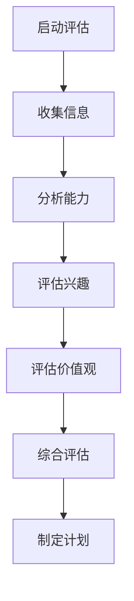
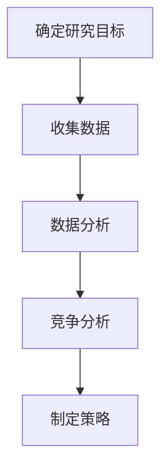
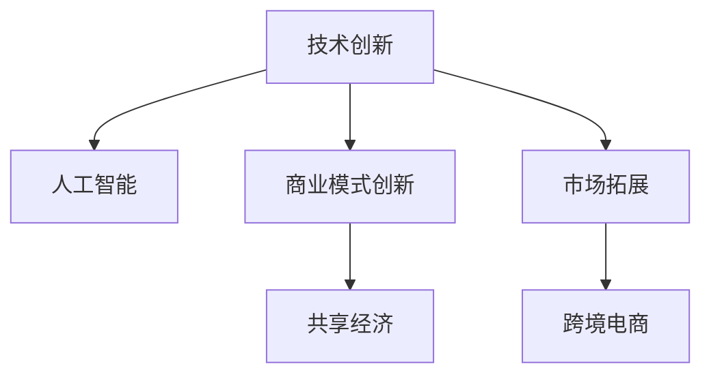
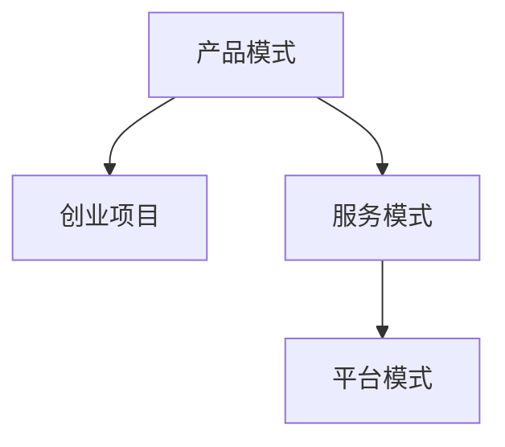
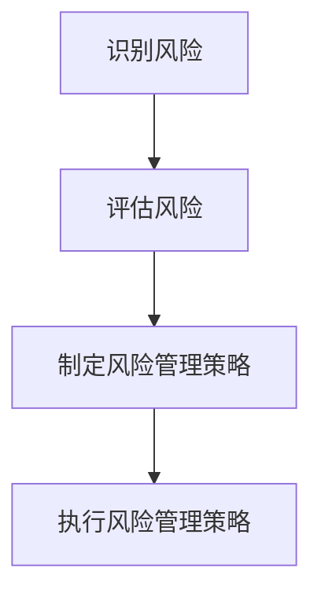
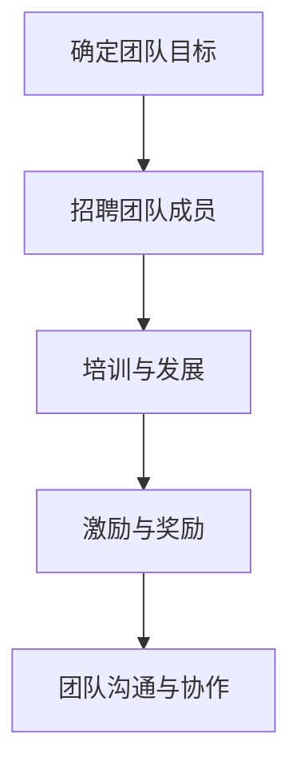
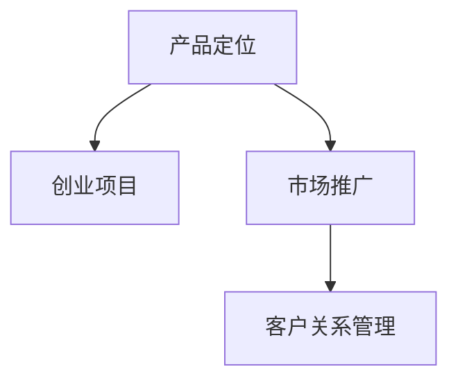
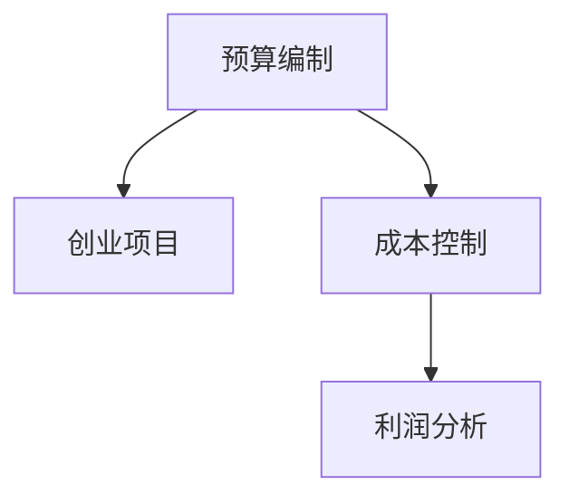
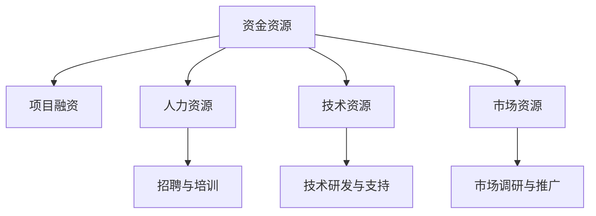

                 

### 文章标题：如何选择适合自己的创业项目

> 关键词：创业项目、创业心态、市场研究、商业模型、风险评估、团队建设、营销策略、财务管理

> 摘要：本文旨在为有志于创业的读者提供系统、实用的创业项目选择策略。通过详细分析创业心态与自我评估、市场研究与竞争分析、创业项目类型与趋势、商业模型、风险评估、团队建设与管理、营销策略及财务管理等多个方面，帮助读者理清创业思路，科学选择适合自己的创业项目，并顺利实施与运营。

### 第一部分：创业前的准备

在创业的旅途中，准备工作至关重要。在这部分，我们将探讨创业心态与自我评估，以及市场研究与竞争分析，为创业之路打下坚实的基础。

#### 第1章：创业心态与自我评估

##### **核心概念与联系**

创业心态是指创业者面对创业过程中的各种挑战和压力时所持有的心理状态。一个积极、坚定的创业心态能够帮助创业者更好地应对困难，实现创业目标。自我评估则是创业者对自身能力、兴趣、价值观等方面进行深入分析，以便找到最适合自己的创业方向。

**核心概念与联系：**

- **创业心态的重要性**：创业心态直接影响创业者的决策和执行力。
- **自我评估的方法与工具**：通过自我评估，创业者能够更清晰地了解自己的优势和劣势，从而制定合适的创业计划。
- **Mermaid 流程图：自我评估流程**：展示自我评估的具体步骤和方法。



##### **核心算法原理讲解**

为了进行自我评估，我们可以使用以下伪代码：

```python
def self_evaluation():
    collect_info()
    analyze_ability()
    evaluate_interest()
    evaluate_values()
    comprehensive_evaluation()
    plan_development()
```

##### **数学模型和数学公式**

$$
\text{创业成功率} = f(\text{创业者素质}, \text{项目潜力})
$$

其中，创业者素质包括能力、兴趣、价值观等，项目潜力则与市场需求和竞争优势相关。

##### **项目实战**

**实例：如何进行自我评估**

1. **收集信息**：通过调查问卷、访谈等方式，收集关于自己能力和兴趣的数据。
2. **分析能力**：根据收集到的数据，分析自己的优势和劣势。
3. **评估兴趣**：考虑自己最感兴趣的领域，并分析是否具备相关知识和技能。
4. **评估价值观**：思考自己的价值观是否与创业目标相符。
5. **综合评估**：将以上分析结果进行综合评估，确定最适合自己的创业方向。
6. **制定计划**：根据综合评估结果，制定详细的创业计划。

##### **最佳实践 tips**

- **保持积极心态**：创业过程中会遇到各种挑战，保持积极的心态至关重要。
- **不断学习**：创业是一个不断学习的过程，要时刻保持学习的态度。
- **勇于尝试**：不要害怕失败，勇于尝试新的想法和方法。

#### 第2章：市场研究与竞争分析

##### **核心概念与联系**

市场研究是创业过程中至关重要的一环。通过对市场需求的深入分析，创业者可以确定产品的目标市场，了解消费者的需求和偏好。竞争分析则帮助创业者了解竞争对手的优势和劣势，从而制定有效的市场策略。

**核心概念与联系：**

- **市场研究的重要性**：了解市场动态，抓住商机。
- **竞争分析的方法与工具**：通过数据分析、市场调研等方法，评估竞争对手。
- **Mermaid 流程图：市场研究与竞争分析流程**：展示市场研究和竞争分析的具体步骤。



##### **核心算法原理讲解**

市场研究和竞争分析可以使用以下伪代码：

```python
def market_study():
    define_research_objective()
    collect_data()
    analyze_data()
    competitive_analysis()
    strategy_development()
```

##### **数学模型和数学公式**

$$
\text{市场潜力} = \text{市场规模} \times \text{市场增长率}
$$

通过市场规模和市场增长率的数据，可以估算出市场的潜在价值。

##### **项目实战**

**实例：如何进行市场研究**

1. **确定研究目标**：明确研究的具体目标和问题。
2. **收集数据**：通过问卷调查、访谈、在线调研等方式收集数据。
3. **数据分析**：对收集到的数据进行分析，了解市场需求和消费者偏好。
4. **竞争分析**：分析竞争对手的产品、市场策略等，找出优势和劣势。
5. **制定策略**：根据分析结果，制定符合市场需求和竞争环境的市场策略。

##### **最佳实践 tips**

- **定期更新市场信息**：市场是动态变化的，要定期收集和分析市场数据。
- **与客户保持沟通**：与潜在客户保持密切沟通，了解他们的需求和反馈。
- **关注竞争对手**：定期分析竞争对手的动态，以调整自己的市场策略。

### 第二部分：创业项目选择策略

选择适合自己的创业项目是创业成功的关键。在这一部分，我们将深入探讨创业项目类型与趋势、创业项目的商业模型、创业项目的风险评估等方面，帮助创业者做出明智的选择。

#### 第3章：创业项目类型与趋势

##### **核心概念与联系**

创业项目类型多样，包括技术创新、商业模式创新、市场拓展等。了解不同类型的创业项目，并根据市场趋势选择合适的方向，是创业项目成功的关键。

**核心概念与联系：**

- **创业项目的类型**：技术创新、商业模式创新、市场拓展等。
- **创业项目的趋势**：人工智能、区块链、绿色科技等新兴领域。
- **Mermaid 流程图：创业项目类型与趋势**：展示不同类型的创业项目及其趋势。



##### **核心算法原理讲解**

创业项目类型和趋势判断可以使用以下伪代码：

```python
def project_type_trend():
    analyze_technology_innovation()
    analyze_business_model_innovation()
    analyze_market_expansion()
    identify_trends()
    select_project_type()
```

##### **数学模型和数学公式**

$$
\text{项目成功率} = \text{市场需求} \times \text{项目优势}
$$

市场需求和项目优势的乘积，可以衡量项目成功的可能性。

##### **项目实战**

**实例：如何选择适合自己的创业项目**

1. **分析市场需求**：了解目标市场的需求和潜力。
2. **评估项目优势**：评估项目在技术、商业模式、市场等方面的优势。
3. **结合市场趋势**：根据市场趋势选择具有潜力的创业项目。
4. **制定详细计划**：根据选择的项目，制定详细的创业计划。

##### **最佳实践 tips**

- **关注新兴领域**：新兴领域通常具有更高的市场潜力。
- **结合自身优势**：选择自己擅长和感兴趣的领域，提高创业成功率。
- **不断调整策略**：根据市场变化和竞争环境，不断调整创业项目。

#### 第4章：创业项目的商业模型

##### **核心概念与联系**

商业模型是创业项目成功的关键。它描述了企业如何创造、传递和获取价值。选择合适的商业模型，能够提高创业项目的盈利能力和可持续性。

**核心概念与联系：**

- **商业模型的重要性**：商业模型决定了企业的盈利方式和市场策略。
- **创业项目的商业模式**：包括产品模式、服务模式、平台模式等。
- **Mermaid 流程图：商业模型与创业项目关系**：展示商业模型与创业项目的相互作用。



##### **核心算法原理讲解**

商业模型评估可以使用以下伪代码：

```python
def business_model_evaluation():
    define_business_model()
    evaluate_revenue_model()
    evaluate_cost_structure()
    assess_profitability()
```

##### **数学模型和数学公式**

$$
\text{商业盈利能力} = \text{营业收入} - \text{成本}
$$

商业盈利能力是衡量商业模型成功与否的关键指标。

##### **项目实战**

**实例：如何构建一个有效的商业模型**

1. **确定商业模型类型**：根据项目特点选择合适的商业模型。
2. **评估收入模式**：确定项目的收入来源和盈利方式。
3. **分析成本结构**：了解项目的成本构成，优化成本结构。
4. **评估盈利能力**：通过计算营业收入和成本，评估商业模型的盈利能力。

##### **最佳实践 tips**

- **灵活调整**：根据市场变化和项目进展，灵活调整商业模型。
- **关注客户需求**：以客户需求为导向，优化商业模型。
- **持续创新**：在商业模型中融入创新元素，提高项目的竞争力。

#### 第5章：创业项目的风险评估

##### **核心概念与联系**

创业项目的风险是不可避免的，但通过有效的风险评估和管理，可以降低风险对项目的影响。了解创业项目的风险类型，并制定相应的风险管理策略，是创业成功的关键。

**核心概念与联系：**

- **创业项目风险分类**：包括市场风险、财务风险、技术风险等。
- **风险评估的方法与工具**：包括定性分析和定量分析等方法。
- **Mermaid 流程图：创业项目风险评估流程**：展示风险评估的具体步骤。



##### **核心算法原理讲解**

风险评估可以使用以下伪代码：

```python
def risk_evaluation():
    identify_risks()
    assess_risk_levels()
    develop_risk_management_strategies()
    implement_risk_management_strategies()
```

##### **数学模型和数学公式**

$$
\text{风险承受能力} = \text{资金实力} + \text{风险管理能力}
$$

风险承受能力是衡量企业应对风险的能力。

##### **项目实战**

**实例：如何进行创业项目的风险评估**

1. **识别风险**：通过访谈、问卷调查等方法，识别项目可能面临的风险。
2. **评估风险水平**：根据风险的性质和影响，评估风险水平。
3. **制定风险管理策略**：根据评估结果，制定相应的风险管理策略。
4. **执行风险管理策略**：实施风险管理策略，降低风险对项目的影响。

##### **最佳实践 tips**

- **定期评估风险**：定期评估项目风险，及时调整风险管理策略。
- **建立风险管理团队**：建立专门的风险管理团队，提高风险管理效率。
- **学习风险管理知识**：了解风险管理的基本原理和方法，提高风险管理能力。

### 第三部分：创业实施与运营

在创业项目的实施与运营阶段，团队建设与管理、营销策略及财务管理等方面同样至关重要。这一部分将详细探讨这些方面的关键要素，帮助创业者确保项目的顺利推进和持续发展。

#### 第6章：创业团队建设与管理

##### **核心概念与联系**

一个高效的创业团队是实现创业目标的关键。团队建设与管理涉及团队成员的招聘、培训、激励和沟通等多个方面。通过有效的团队建设与管理，可以提高团队的凝聚力、执行力，从而提升项目的成功率。

**核心概念与联系：**

- **创业团队的重要性**：团队是实现创业目标的核心力量。
- **团队建设的方法与技巧**：包括团队沟通、团队协作、团队文化等。
- **Mermaid 流程图：创业团队建设流程**：展示团队建设的主要步骤。



##### **核心算法原理讲解**

团队建设评估可以使用以下伪代码：

```python
def team_building():
    define_team_objectives()
    recruit_team_members()
    train_and_develop_teams()
    motivate_and_reward()
    improve_communication_and_collaboration()
```

##### **数学模型和数学公式**

$$
\text{团队效率} = \text{团队成员能力} \times \text{团队协作程度}
$$

团队效率和团队成员能力、团队协作程度的乘积，可以衡量团队的整体效率。

##### **项目实战**

**实例：如何组建一个高效的创业团队**

1. **确定团队目标**：明确团队的目标和使命，确保团队成员共同奋斗。
2. **招聘团队成员**：根据团队目标和项目需求，招聘合适的团队成员。
3. **培训与发展**：为团队成员提供培训和发展机会，提高团队整体素质。
4. **激励与奖励**：通过激励和奖励机制，激发团队成员的工作积极性。
5. **团队沟通与协作**：建立有效的沟通渠道，促进团队成员之间的协作。

##### **最佳实践 tips**

- **建立明确的团队目标**：确保团队成员明确团队的目标和使命。
- **提供培训和发展机会**：帮助团队成员不断提升自身能力。
- **鼓励团队协作**：通过有效的沟通和协作，提高团队整体效率。

#### 第7章：创业项目的营销策略

##### **核心概念与联系**

营销策略是创业项目成功的关键之一。一个有效的营销策略可以帮助创业项目在市场中获得竞争优势，提高品牌知名度，吸引潜在客户。营销策略的类型多样，包括产品定位、市场推广、客户关系管理等。

**核心概念与联系：**

- **营销策略的重要性**：营销策略决定了创业项目的市场表现。
- **营销策略的类型与选择**：包括产品定位、市场推广、客户关系管理等。
- **Mermaid 流流程图：营销策略与创业项目关系**：展示营销策略与创业项目的相互作用。



##### **核心算法原理讲解**

营销策略评估可以使用以下伪代码：

```python
def marketing_strategy_evaluation():
    define_product_positioning()
    develop_marketing_campaigns()
    manage_customer_relationships()
    assess_strategy_impact()
```

##### **数学模型和数学公式**

$$
\text{市场占有率} = \frac{\text{销售量}}{\text{市场规模}}
$$

市场占有率是衡量营销策略效果的关键指标。

##### **项目实战**

**实例：如何制定一个有效的营销策略**

1. **产品定位**：根据目标市场和竞争对手，确定产品定位。
2. **市场推广**：选择合适的推广渠道，提高品牌知名度。
3. **客户关系管理**：建立客户关系管理系统，提升客户满意度。
4. **评估策略效果**：根据销售数据和客户反馈，评估营销策略的效果。

##### **最佳实践 tips**

- **明确产品定位**：根据市场需求和竞争对手，制定明确的产品定位。
- **多渠道推广**：结合线上和线下渠道，提高推广效果。
- **关注客户反馈**：及时收集和分析客户反馈，优化营销策略。

#### 第8章：创业项目的财务管理

##### **核心概念与联系**

财务管理是创业项目成功的关键之一。通过有效的财务管理，可以确保项目资金充足，合理分配资源，降低财务风险。财务管理涉及预算编制、成本控制、利润分析等多个方面。

**核心概念与联系：**

- **财务管理的重要性**：财务管理决定了项目的资金状况和盈利能力。
- **创业项目的财务指标**：包括收入、成本、净利润等。
- **Mermaid 流程图：财务管理与创业项目关系**：展示财务管理与创业项目的相互作用。



##### **核心算法原理讲解**

财务管理可以使用以下伪代码：

```python
def financial_management():
    prepare_budget()
    control_costs()
    analyze_profit()
```

##### **数学模型和数学公式**

$$
\text{净利润率} = \frac{\text{净利润}}{\text{营业收入}}
$$

净利润率是衡量企业盈利能力的关键指标。

##### **项目实战**

**实例：如何进行创业项目的财务管理**

1. **预算编制**：根据项目需求和资源情况，编制合理的预算。
2. **成本控制**：通过监控和优化成本，确保成本控制在预算范围内。
3. **利润分析**：定期分析项目利润情况，优化财务管理策略。

##### **最佳实践 tips**

- **制定合理的预算**：根据项目需求，制定合理的预算。
- **关注成本控制**：通过成本控制，提高项目的盈利能力。
- **定期分析利润情况**：及时调整财务管理策略，确保项目顺利运营。

### 附录

#### 附录 A：创业资源与工具介绍

##### **核心概念与联系**

创业资源与工具是创业过程中不可或缺的部分。了解和掌握各种创业资源与工具，可以提升创业项目的效率，降低创业风险。

**核心概念与联系：**

- **创业资源的分类**：包括资金、人才、技术、市场等。
- **创业工具的使用方法**：包括项目管理工具、数据分析工具、营销工具等。
- **Mermaid 流程图：创业资源与工具流程**：展示创业资源与工具的具体应用。



##### **项目实战*

**实例：如何利用创业资源与工具**

1. **资金资源**：通过项目融资，获取创业所需的资金。
2. **人力资源**：通过招聘与培训，组建高效的创业团队。
3. **技术资源**：通过技术研发与支持，提升项目的竞争力。
4. **市场资源**：通过市场调研与推广，扩大项目的市场影响力。

##### **最佳实践 tips**

- **充分利用政府扶持政策**：了解和利用政府提供的创业扶持政策。
- **建立良好的合作伙伴关系**：与行业内的合作伙伴建立紧密的合作关系。
- **持续学习和更新知识**：创业过程中，要不断学习和更新知识，以应对市场的变化。

### 结论

创业之路充满挑战，但也是实现梦想的舞台。通过本文的详细分析和实战案例，我们希望为读者提供了系统、实用的创业项目选择策略。在选择创业项目时，读者应综合考虑自身优势、市场需求、竞争环境等因素，制定切实可行的创业计划。同时，要注重团队建设、营销策略和财务管理，确保创业项目的顺利实施和持续发展。最后，祝愿每位读者在创业之路上取得成功，实现自己的梦想。

### 作者信息

作者：AI天才研究院/AI Genius Institute & 禅与计算机程序设计艺术 /Zen And The Art of Computer Programming

### 结语

感谢读者对本文的阅读。本文旨在为有志于创业的读者提供系统、实用的创业项目选择策略。创业之路充满挑战，但也充满机遇。希望本文能够帮助读者理清创业思路，找到适合自己的创业项目，并在实践中取得成功。祝愿每位读者在创业之路上一路顺风，实现自己的梦想。再次感谢您的支持与关注！

