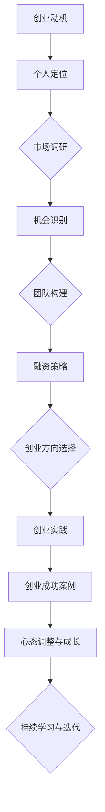
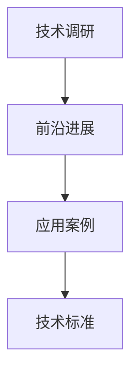
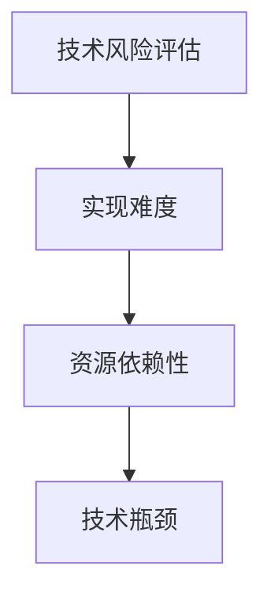
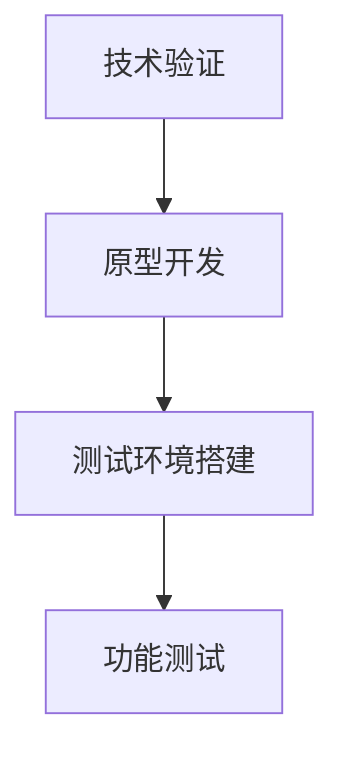
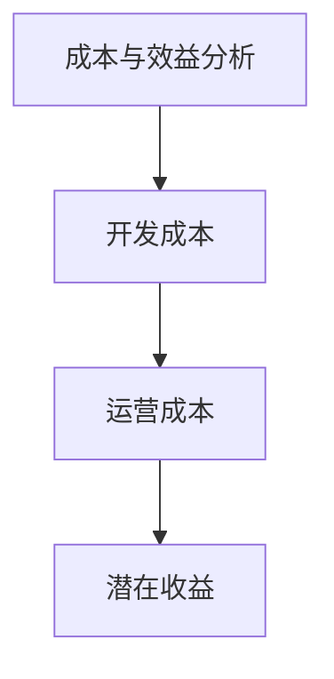

                 

# 《如何选择适合资深程序员的创业方向》

> 关键词：程序员创业、创业方向选择、市场调研、团队构建、融资策略、技术可行性分析

> 摘要：本文将深入探讨资深程序员如何选择适合自己的创业方向。通过对创业动机与个人定位、市场调研与机会识别、创业团队构建、融资策略、创业方向选择以及创业实践等多个方面的详细分析，帮助读者理解并掌握创业的精髓，从而在创业道路上更加从容。

## 第一部分：创业准备

### 1.1 创业动机与个人定位

#### 1.1.1 创业的内在动机

每一个想要创业的程序员，内心都有着自己的动机。这些动机可能包括对技术的热爱、对创新的渴望、对财务自由的追求，或者是对现有工作环境的厌倦等。理解自己的内在动机是创业的第一步，它将指导你选择创业的方向和策略。

首先，程序员往往对技术有着深厚的热爱。他们享受解决复杂问题的过程，享受编写代码带来的成就感。这种对技术的热爱可以转化为创业的内在动力，驱动程序员不断探索新的技术领域，创造自己的产品或服务。

其次，创新是程序员创业的另一个重要动机。程序员们渴望通过自己的努力，改变现有的行业格局，提供更加高效、便捷的解决方案。他们追求创新，希望通过创业实现自己的愿景。

此外，财务自由也是许多程序员选择创业的原因之一。他们希望通过创业，实现财富的积累和自由支配，摆脱职场上的束缚，过上自己想要的生活。

最后，对现有工作环境的厌倦也是一些程序员选择创业的动机。他们可能觉得自己的职业发展遇到了瓶颈，或者不喜欢当前的工作氛围和文化。通过创业，他们希望找到一种更加适合自己的工作方式和生活状态。

#### 1.1.2 确定个人创业目标

在理解了创业的内在动机后，程序员需要明确自己的创业目标。创业目标可以分为短期目标和长期目标。

短期目标通常包括：
- 找到合适的创业方向和机会。
- 构建初步的创业团队。
- 获得初始的资金支持。
- 开发出初步的产品或服务。

长期目标则更加宏观和长远，通常包括：
- 实现企业的持续盈利和成长。
- 打造具有影响力的品牌和产品。
- 建立稳定的客户群体和业务模式。
- 实现自己的财务自由和社会价值。

确定创业目标可以帮助程序员更加清晰地规划自己的创业路线，制定相应的策略和行动计划。同时，创业目标也是评估创业成功与否的重要标准。

#### 1.1.3 自我评估与优势分析

在创业过程中，自我评估与优势分析至关重要。程序员需要深入思考自己的技术背景、专业知识和技能，了解自己的优势与劣势。

首先，程序员应该评估自己的技术背景。这包括编程语言、框架、工具等方面的知识。了解自己在哪些技术领域有深厚的积累，可以帮助程序员选择创业的方向。例如，如果程序员在云计算、大数据、人工智能等领域有丰富经验，那么这些领域可能成为其创业的方向。

其次，程序员需要思考自己的专业知识。这包括对行业动态、市场趋势、用户需求等方面的了解。程序员应该了解自己在哪些领域有独特的见解和洞察力，这些见解和洞察力可以成为创业的竞争力。

最后，程序员需要分析自己的技能。这包括项目管理、团队协作、沟通能力等方面的技能。程序员应该了解自己在哪些方面有优势，如何将这些优势转化为创业的竞争力。

通过自我评估与优势分析，程序员可以更清楚地认识自己，找到适合自己的创业方向，并在创业过程中充分发挥自己的优势。

### 1.2 市场调研与机会识别

#### 1.2.1 市场分析的方法与工具

市场调研是创业准备阶段的重要环节。通过市场调研，程序员可以了解市场需求、用户痛点、竞争对手情况等信息，从而为创业方向的选择提供有力支持。

市场分析的方法主要包括：
- **定性分析**：通过深度访谈、小组讨论、问卷调查等方式，收集用户需求、市场趋势等非结构化数据。
- **定量分析**：通过数据分析、统计方法，对市场数据进行定量分析，提取有价值的信息。
- **SWOT分析**：分析自身的优势（Strengths）、劣势（Weaknesses）、机会（Opportunities）和威胁（Threats），为创业决策提供参考。

市场分析的工具有很多，常用的包括：
- **Google Analytics**：分析网站流量、用户行为等数据。
- **SEO工具**：分析关键词排名、竞争对手情况等。
- **问卷工具**：如SurveyMonkey、Google表单等，用于收集用户反馈。
- **社交媒体分析工具**：如Facebook Insights、Twitter Analytics等，分析社交媒体平台上的用户行为。

#### 1.2.2 识别市场需求与痛点

在市场调研过程中，程序员需要关注市场需求和痛点。识别市场需求有助于确定创业产品的定位和功能，而识别痛点则有助于找到产品的差异化优势。

以下方法可以帮助程序员识别市场需求与痛点：
- **用户访谈**：直接与潜在用户交流，了解他们的需求和问题。
- **用户调研**：通过问卷调查、在线调研等方式，收集大量用户数据。
- **竞品分析**：研究竞争对手的产品，了解他们的优势与不足。
- **行业报告**：阅读行业报告，了解市场趋势和用户需求。

#### 1.2.3 竞争对手分析

竞争对手分析是市场调研的重要环节。通过分析竞争对手的产品、市场份额、营销策略等，程序员可以了解行业现状，找到自己的竞争优势。

以下方法可以帮助程序员进行竞争对手分析：
- **产品比较**：分析竞争对手产品的功能、性能、价格等，找出差异点。
- **市场份额分析**：了解竞争对手在市场中的地位，评估自身的竞争实力。
- **营销策略分析**：分析竞争对手的营销手段，了解他们的优势与不足。
- **商业模式分析**：了解竞争对手的盈利模式、成本结构等，为自身创业提供参考。

### 1.3 创业团队构建

#### 1.3.1 团队成员的角色与职责

一个成功的创业团队需要具备多种角色和职责。对于资深程序员来说，构建合适的创业团队至关重要。

以下是创业团队中常见的一些角色和职责：
- **创始人**：负责整体的创业方向、战略规划和资源筹集。创始人通常具备丰富的创业经验和专业知识。
- **技术负责人（CTO）**：负责技术团队的建设、技术路线的规划和关键技术的研发。CTO通常具备深厚的技术背景和丰富的项目管理经验。
- **产品经理（PM）**：负责产品规划、设计、开发、测试等各个环节。产品经理需要了解市场需求、用户反馈，并确保产品的可行性和竞争力。
- **市场营销经理**：负责市场推广、品牌建设、销售渠道等。市场营销经理需要具备敏锐的市场洞察力和有效的营销策略。
- **财务经理**：负责财务管理、预算编制、成本控制等。财务经理需要确保企业的财务状况健康，为企业的持续发展提供保障。
- **运营经理**：负责日常运营、客户服务、团队管理等。运营经理需要确保企业的正常运作，提高用户满意度。

#### 1.3.2 找到合适的创业伙伴

找到合适的创业伙伴是构建创业团队的关键。对于资深程序员来说，以下方法可以帮助他们找到合适的创业伙伴：
- **共同兴趣**：寻找与自己有共同兴趣和愿景的创业者，这样可以更好地协同工作。
- **互补能力**：寻找在不同领域有专长的人，例如技术、市场、运营等，这样可以形成互补的团队。
- **价值观一致**：寻找价值观与自己相符的创业者，这样可以确保团队的合作顺畅。
- **实际合作**：通过项目合作、共同参与活动等方式，了解对方的实际能力和合作风格。

#### 1.3.3 团队协作与沟通技巧

团队协作与沟通技巧对于创业团队的成功至关重要。以下方法可以帮助程序员提升团队协作与沟通技巧：
- **明确目标与职责**：确保每个团队成员都清楚自己的目标、职责和任务。
- **定期会议**：定期召开团队会议，分享进展、讨论问题、制定计划。
- **有效沟通**：使用简洁明了的语言表达观点，倾听他人的意见，确保信息的准确传达。
- **透明管理**：确保团队内部的信息透明，让团队成员了解企业的运营状况和决策过程。
- **激励机制**：设立合理的激励机制，鼓励团队成员的积极性和创造力。

### 1.4 融资策略与计划

#### 1.4.1 融资渠道与方式

融资是创业过程中必不可少的环节。对于资深程序员来说，了解不同的融资渠道和方式，选择适合自己的融资策略至关重要。

常见的融资渠道和方式包括：
- **天使投资**：由个人投资者提供资金支持，通常在创业初期使用。
- **风险投资**：由专业的风险投资机构提供资金支持，通常在企业发展过程中使用。
- **众筹**：通过互联网平台向公众筹集资金，适用于产品研发和推广阶段。
- **银行贷款**：通过银行等金融机构获得资金支持，通常需要提供担保或抵押。
- **政府补贴和扶持**：申请政府的创业补贴、税收优惠等扶持政策。

#### 1.4.2 编写商业计划书

商业计划书是向投资者展示企业前景的重要文件。对于资深程序员来说，编写一份有说服力的商业计划书至关重要。

商业计划书应包括以下内容：
- **企业概述**：介绍企业的背景、使命、愿景和价值观。
- **产品与服务**：详细描述企业的产品或服务，包括功能、特点、竞争优势等。
- **市场分析**：分析市场需求、目标客户、竞争对手等。
- **营销策略**：阐述企业的市场推广策略、销售渠道和客户关系管理。
- **运营计划**：描述企业的运营模式、人员配置、财务状况等。
- **团队介绍**：介绍企业的团队成员、职责和经验。
- **融资计划**：明确企业的融资需求、资金用途、回报计划等。

#### 1.4.3 谈判技巧与投资人关系维护

与投资人谈判是创业过程中的一项重要任务。以下技巧可以帮助程序员在与投资人谈判时取得更好的效果：
- **充分准备**：在谈判前，详细了解投资人的背景、投资偏好和投资案例，准备好相关数据和材料。
- **展示价值**：强调企业的核心竞争力、市场前景和投资回报，让投资人看到企业的潜力和价值。
- **谈判策略**：灵活运用谈判技巧，例如让步策略、反问技巧等，确保谈判双方达成共识。
- **关系维护**：在融资成功后，定期向投资人汇报企业的运营情况和财务状况，保持良好的沟通和合作关系。

## 第二部分：创业方向选择

### 2.1 技术方向选择

#### 2.1.1 技术趋势与热门领域

在技术日新月异的今天，选择合适的技术方向对于创业的成功至关重要。程序员需要关注当前的技术趋势和热门领域，以把握市场机遇。

以下是一些当前热门的技术领域：
- **人工智能与机器学习**：人工智能和机器学习技术在各个领域得到了广泛应用，包括自然语言处理、计算机视觉、智能推荐等。这些技术的快速发展为创业提供了丰富的机会。
- **区块链技术**：区块链技术以其去中心化、不可篡改等特点，在金融、供应链管理、物联网等领域具有巨大的应用潜力。
- **云计算与大数据**：云计算和大数据技术的成熟为程序员提供了丰富的数据处理和分析工具，可以应用于各种行业，如金融、医疗、物流等。
- **物联网（IoT）**：物联网技术将物理设备与互联网连接，为智能家居、智能交通、智能工厂等提供了创新解决方案。
- **边缘计算**：边缘计算将计算能力从中心化的云数据中心转移到网络边缘，适用于实时性要求高的应用场景，如自动驾驶、智能监控等。

#### 2.1.2 个人技术背景与专长

在选择技术方向时，程序员需要结合自己的技术背景和专长。以下方法可以帮助程序员找到适合自己的技术方向：
- **回顾技术栈**：回顾自己在过去的工作中掌握的技术，找出擅长和感兴趣的领域。
- **了解技术潜力**：研究当前热门技术的前景和潜力，了解哪些技术在未来可能会得到广泛应用。
- **关注行业趋势**：关注所在行业的趋势和技术需求，选择与自己专业相关的技术方向。
- **参与开源项目**：参与开源项目可以了解不同技术领域的实际应用和挑战，为选择技术方向提供参考。

#### 2.1.3 技术可行性分析

在确定技术方向后，程序员需要对其可行性进行分析。以下方法可以帮助程序员评估技术方向的可行性：
- **技术调研**：研究相关技术的前沿进展、应用场景和挑战，了解技术的成熟度和发展趋势。
- **风险评估**：分析技术实现过程中可能遇到的风险和挑战，如技术难度、人才招聘、资源投入等。
- **试点项目**：开展小规模的试点项目，验证技术的可行性和效果。
- **专家咨询**：咨询行业专家和资深工程师，获取专业的意见和建议。

### 2.2 业务模式选择

#### 2.2.1 自主研发产品

自主研发产品是许多程序员选择的主要业务模式。这种模式具有以下优势：
- **核心竞争能力**：自主研发产品可以打造独特的技术壁垒，形成核心竞争力。
- **自主定价**：可以自主决定产品的定价策略，提高盈利能力。
- **灵活性**：可以灵活调整产品功能和特性，满足市场需求。

然而，自主研发产品也存在一定的劣势，如研发周期较长、资金投入较大、市场竞争激烈等。程序员在选择业务模式时，需要综合考虑自身的技术实力、市场环境和资金状况。

#### 2.2.2 服务模式与解决方案

服务模式与解决方案是另一种常见的业务模式。这种模式具有以下优势：
- **市场需求导向**：可以根据市场需求提供定制化的解决方案，提高用户满意度。
- **快速响应**：可以快速调整服务内容和策略，满足客户需求。
- **高附加值**：通过提供高附加值的服务，可以获得更高的利润。

服务模式与解决方案的劣势包括：
- **依赖客户需求**：业务模式较为被动，受客户需求变化的影响较大。
- **技术门槛较低**：竞争对手容易模仿，竞争激烈。

#### 2.2.3 联合开发和生态合作

联合开发和生态合作是一种通过与其他企业合作来共同开发产品或服务的业务模式。这种模式具有以下优势：
- **资源整合**：可以整合多方资源，提高产品研发和运营效率。
- **优势互补**：可以发挥各自的优势，提高产品的竞争力。
- **快速拓展**：可以通过合作快速进入新市场，扩大业务规模。

联合开发和生态合作的劣势包括：
- **合作风险**：合作双方可能存在利益冲突，需要建立良好的合作机制。
- **资源分配**：需要合理分配合作资源，确保合作的顺利进行。

### 2.3 市场定位与目标客户

#### 2.3.1 目标市场细分

在创业过程中，明确目标市场是至关重要的。通过市场细分，程序员可以找到最具潜力的目标客户群体。

以下方法可以帮助程序员进行目标市场细分：
- **行业细分**：根据行业特点，将市场划分为不同的细分市场，如金融、医疗、教育等。
- **地域细分**：根据地域特点，将市场划分为不同地区，如一线城市、二线城市等。
- **客户细分**：根据客户特点，将市场划分为不同客户群体，如企业客户、个人用户等。
- **需求细分**：根据客户需求，将市场划分为不同需求层次，如高端需求、大众需求等。

#### 2.3.2 客户需求分析

了解客户需求是制定市场策略的基础。以下方法可以帮助程序员分析客户需求：
- **用户调研**：通过问卷调查、用户访谈等方式，了解客户的需求、偏好和行为。
- **竞品分析**：研究竞争对手的产品和服务，了解其优势与不足，找出市场需求空白点。
- **数据分析**：通过数据分析，了解客户的购买行为、使用习惯等，为产品优化和营销策略提供依据。

#### 2.3.3 品牌建设与推广策略

品牌建设是创业过程中的一项长期任务。以下方法可以帮助程序员进行品牌建设与推广：
- **品牌定位**：明确品牌的核心价值和独特卖点，塑造品牌形象。
- **品牌传播**：通过广告、公关、社交媒体等方式，提高品牌知名度和美誉度。
- **渠道拓展**：建立多元化的销售渠道，如线上渠道、线下渠道等，提高产品的市场覆盖率。
- **客户关系管理**：建立良好的客户关系，提高客户满意度和忠诚度。

### 2.4 竞争优势构建

#### 2.4.1 竞争对手分析

在创业过程中，了解竞争对手是必不可少的。以下方法可以帮助程序员分析竞争对手：
- **产品比较**：比较竞争对手的产品功能、性能、价格等，找出差异点。
- **市场份额分析**：了解竞争对手在市场中的地位，评估自身的竞争实力。
- **营销策略分析**：分析竞争对手的营销手段，了解他们的优势与不足。
- **商业模式分析**：了解竞争对手的盈利模式、成本结构等，为自身创业提供参考。

#### 2.4.2 产品与服务差异化

在竞争激烈的市场中，产品与服务差异化是提高竞争力的重要手段。以下方法可以帮助程序员实现产品与服务差异化：
- **技术创新**：通过技术创新，提高产品的性能和用户体验。
- **服务定制**：提供定制化的服务，满足客户的个性化需求。
- **品牌塑造**：通过独特的品牌形象和价值主张，提高品牌知名度和美誉度。
- **渠道优势**：建立多元化的销售渠道，提高产品的市场覆盖率。

#### 2.4.3 团队优势与资源整合

团队优势和资源整合是提高创业竞争力的重要手段。以下方法可以帮助程序员发挥团队优势和整合资源：
- **团队协作**：建立高效的团队协作机制，提高团队的整体执行力。
- **人才引进**：引进优秀的团队成员，提升团队的技术能力和管理水平。
- **合作伙伴**：与产业链上下游的企业建立合作关系，共享资源和信息。
- **技术创新**：通过技术创新，提高产品的性能和用户体验。

## 第三部分：创业实践

### 3.1 项目启动与规划

#### 3.1.1 项目立项与目标设定

项目立项是创业实践的第一步。在这一阶段，程序员需要明确项目的目标和范围，确保项目的可行性。

以下方法可以帮助程序员进行项目立项与目标设定：
- **项目需求分析**：明确项目的需求，包括功能需求、性能需求、用户体验需求等。
- **项目范围定义**：确定项目的范围，明确项目的具体任务和交付物。
- **项目目标设定**：设定明确的项目目标，包括项目进度、质量、成本等方面的目标。
- **可行性分析**：分析项目的可行性，包括技术可行性、市场可行性、资源可行性等。

#### 3.1.2 项目管理方法与工具

项目管理是确保项目成功的关键。以下方法可以帮助程序员进行项目管理：
- **项目计划**：制定详细的项目计划，包括任务分解、时间安排、资源分配等。
- **进度监控**：实时监控项目进度，及时发现和解决问题。
- **风险管理**：识别项目风险，制定风险应对策略。
- **质量管理**：确保项目交付物的质量，通过质量检查、测试等方式确保项目的质量。

常用的项目管理工具有：
- **Microsoft Project**：一款功能强大的项目管理软件，适用于复杂项目的管理。
- **JIRA**：一款敏捷开发工具，可用于项目进度管理、任务分配、缺陷跟踪等。
- **Trello**：一款简单易用的项目管理工具，适用于中小型项目的管理。

#### 3.1.3 项目风险评估与应对策略

项目风险是创业过程中不可避免的。以下方法可以帮助程序员进行项目风险评估与应对策略：
- **风险识别**：识别项目可能面临的风险，包括技术风险、市场风险、财务风险等。
- **风险评估**：评估风险的可能性和影响程度，确定风险等级。
- **风险应对策略**：制定应对策略，包括风险回避、风险转移、风险减轻等。

常见风险应对策略包括：
- **风险回避**：避免风险发生的可能性，例如改变项目计划或技术方案。
- **风险转移**：将风险转移给其他方，例如购买保险或签订风险分担合同。
- **风险减轻**：采取措施降低风险的影响程度，例如增加预算、增加人员等。

### 3.2 产品开发与迭代

#### 3.2.1 产品设计与原型开发

产品设计与原型开发是产品开发的重要阶段。以下方法可以帮助程序员进行产品设计与原型开发：
- **需求分析**：明确产品的需求，包括功能需求、性能需求、用户体验需求等。
- **产品设计**：设计产品的界面、功能模块、数据结构等。
- **原型开发**：使用原型工具（如Axure、Sketch等）制作产品的原型，进行用户测试和反馈。

#### 3.2.2 版本控制与迭代流程

版本控制是确保代码和管理一致性的重要手段。以下方法可以帮助程序员进行版本控制与迭代流程：
- **代码管理**：使用版本控制系统（如Git）管理代码，确保代码的一致性和可追溯性。
- **迭代开发**：采用敏捷开发方法，快速迭代开发产品，不断优化产品功能。

常见的迭代流程包括：
- **需求分析**：明确本次迭代的需求。
- **需求确认**：与团队成员确认需求，确保需求清晰明确。
- **设计评审**：评审产品设计，确保设计符合需求。
- **编码实现**：开发人员根据设计进行编码实现。
- **测试与验收**：对代码进行测试，确保产品质量。
- **发布与反馈**：发布产品版本，收集用户反馈，为下一轮迭代提供改进方向。

#### 3.2.3 用户反馈与产品优化

用户反馈是产品优化的重要依据。以下方法可以帮助程序员收集用户反馈与产品优化：
- **用户调研**：通过问卷调查、用户访谈等方式收集用户反馈。
- **数据分析**：通过数据分析，了解用户行为、使用习惯等，为产品优化提供数据支持。
- **A/B测试**：通过A/B测试，验证不同设计方案的用户体验和效果，为优化提供依据。

### 3.3 团队管理与文化建设

#### 3.3.1 团队成员能力培养

团队成员能力培养是团队管理的重要任务。以下方法可以帮助程序员进行团队成员能力培养：
- **技术培训**：定期组织技术培训，提升团队成员的技术能力。
- **项目管理培训**：为团队成员提供项目管理培训，提升其项目管理和团队协作能力。
- **软技能培训**：开展沟通技巧、时间管理、团队合作等方面的培训，提升团队成员的软技能。

#### 3.3.2 企业文化建设

企业文化是团队凝聚力和员工归属感的重要保障。以下方法可以帮助程序员进行企业文化建设：
- **价值观传播**：明确企业的价值观，并通过各种渠道传播，确保团队成员认同并践行。
- **团队活动**：定期组织团队活动，增强团队成员之间的沟通和协作。
- **奖励与激励**：建立合理的奖励和激励机制，激发员工的积极性和创造力。
- **沟通平台**：建立有效的沟通平台，确保信息畅通，提高团队的执行力。

#### 3.3.3 内部沟通与协作机制

内部沟通与协作机制是团队高效运作的重要保障。以下方法可以帮助程序员建立内部沟通与协作机制：
- **定期会议**：定期召开团队会议，分享进展、讨论问题、制定计划。
- **信息共享**：建立信息共享平台，确保团队成员能够及时获取相关信息。
- **任务协作**：使用任务管理工具（如Trello、JIRA等），明确任务分配、进度和责任人。
- **反馈机制**：建立反馈机制，鼓励团队成员提出意见和建议，提高团队的协作效率。

### 3.4 市场推广与销售策略

#### 3.4.1 市场推广渠道与策略

市场推广是创业成功的关键之一。以下方法可以帮助程序员选择合适的市场推广渠道与策略：
- **线上推广**：利用社交媒体、搜索引擎优化（SEO）、内容营销等手段，提高产品的知名度和曝光度。
- **线下推广**：通过参加行业展会、线下讲座、合作伙伴活动等方式，扩大产品的影响力。
- **口碑营销**：通过用户口碑传播，提高产品的美誉度和可信度。
- **合作伙伴推广**：与行业内的其他企业建立合作关系，共同推广产品。

#### 3.4.2 销售流程与销售技巧

销售流程与销售技巧是市场推广的重要组成部分。以下方法可以帮助程序员进行销售流程与销售技巧：
- **需求分析**：了解潜在客户的需求，为其提供合适的产品或解决方案。
- **方案展示**：向客户展示产品的特点和优势，说服客户购买。
- **谈判技巧**：掌握谈判技巧，确保双方达成共识，实现成交。
- **售后服务**：提供优质的售后服务，提高客户满意度，促进客户持续购买。

#### 3.4.3 客户关系管理

客户关系管理是长期维护客户的重要手段。以下方法可以帮助程序员进行客户关系管理：
- **客户档案管理**：建立客户档案，记录客户的基本信息和购买历史。
- **客户沟通**：定期与客户沟通，了解客户的需求和反馈，提供个性化的服务。
- **客户关怀**：在节假日或客户生日等特殊时刻，发送祝福和礼品，增进客户关系。
- **客户满意度调查**：定期进行客户满意度调查，了解客户的需求和期望，持续改进服务质量。

## 第四部分：创业成功案例分析

### 4.1 国内创业成功案例解析

#### 4.1.1 案例背景与市场机会

国内创业成功案例众多，以下解析一个具有代表性的案例——字节跳动。

字节跳动成立于2012年，是一家专注于移动互联网的科技公司。公司创始人张一鸣，毕业于南开大学计算机科学与技术专业，曾在百度任职。

案例背景：
- **技术背景**：张一鸣具备深厚的技术背景，擅长算法和数据分析。
- **市场机会**：移动互联网的快速发展，为内容分发和社交网络提供了广阔的市场空间。

#### 4.1.2 创业团队与商业模式

字节跳动的创业团队由一群志同道合的年轻人组成，成员包括技术、产品、运营、市场等各方面的专业人士。

商业模式：
- **内容分发**：通过算法推荐，将用户感兴趣的内容推送给他们。
- **社交网络**：通过社交互动，增强用户粘性和活跃度。
- **广告变现**：通过广告收入，实现企业的盈利。

#### 4.1.3 项目运作与市场反响

字节跳动的项目运作具有以下几个特点：
- **快速迭代**：不断优化产品功能和用户体验，快速适应市场变化。
- **多元化发展**：在短视频、直播、电商等领域进行全面布局，形成多元化业务体系。
- **技术创新**：持续投入技术研发，提高算法的准确性和推荐效果。

市场反响：
- **用户增长**：字节跳动旗下产品如今日头条、抖音、快手等，用户规模迅速扩大，积累了大量活跃用户。
- **市场地位**：字节跳动成为中国互联网行业的领军企业，市值一度超过百度、阿里巴巴和腾讯等巨头。

#### 4.1.4 案例启示

字节跳动的成功为程序员创业提供了以下启示：
- **技术驱动**：重视技术研发，提高产品的竞争力。
- **快速迭代**：快速适应市场变化，持续优化产品功能。
- **多元化发展**：在多个领域进行布局，形成多元化业务体系。
- **用户导向**：关注用户需求，提供优质的产品和服务。

### 4.2 国际创业成功案例借鉴

#### 4.2.1 案例背景与市场定位

以下解析一个国际创业成功案例——Airbnb。

Airbnb成立于2008年，总部位于美国旧金山，是一家全球知名的短期住宿租赁平台。公司创始人Brian Chesky、Joe Gebbia和Nathan Blecharczyk，毕业于美国罗切斯特理工学院。

案例背景：
- **技术背景**：三位创始人具备深厚的技术背景，擅长设计和技术创新。
- **市场机会**：随着全球化进程的加快，旅游业蓬勃发展，为短期住宿租赁提供了广阔的市场空间。

#### 4.2.2 创新点与竞争优势

Airbnb的创新点和竞争优势包括：
- **C2C模式**：通过平台连接房东和房客，实现资源共享，降低了用户获取住宿的门槛。
- **用户体验**：提供个性化的住宿体验，让用户感受到家的温馨。
- **数据分析**：利用大数据和人工智能技术，优化推荐算法，提高用户满意度。
- **全球化布局**：在全球范围内快速扩展，实现了国际化运营。

#### 4.2.3 国际化运营与扩展

Airbnb的国际化运营和扩展策略包括：
- **本地化运营**：根据不同国家和地区的市场特点，制定本地化运营策略。
- **合作伙伴关系**：与当地的旅游机构、酒店等建立合作关系，拓展业务范围。
- **品牌推广**：通过广告宣传、品牌活动等方式，提高品牌知名度和影响力。
- **技术创新**：持续投入技术研发，提高平台的用户体验和运营效率。

#### 4.2.4 案例启示

Airbnb的成功为程序员创业提供了以下启示：
- **创新模式**：探索新的商业模式，实现资源共享和效率提升。
- **用户体验**：关注用户需求，提供优质的用户体验。
- **全球化思维**：具备全球化视野，积极参与国际市场竞争。
- **技术创新**：持续投入技术研发，提高产品的竞争力。

## 第五部分：创业心态与持续成长

### 5.1 创业心态调整

#### 5.1.1 应对创业压力与挫折

创业过程中，压力和挫折在所难免。以下方法可以帮助程序员应对创业压力与挫折：
- **积极心态**：保持积极的心态，相信自己的能力和判断，勇敢面对挑战。
- **目标分解**：将大目标分解为小目标，逐步实现，减轻压力。
- **团队支持**：与团队成员保持良好的沟通，分享压力，共同应对挑战。
- **休息与调整**：合理安排工作和休息时间，保持身心健康，提高抗压能力。

#### 5.1.2 培养乐观心态与抗压能力

乐观心态和抗压能力对于创业成功至关重要。以下方法可以帮助程序员培养乐观心态与抗压能力：
- **正面思考**：积极看待问题，从挫折中寻找成长的机会。
- **情绪管理**：学会控制情绪，避免负面情绪影响判断和决策。
- **自我激励**：设定目标和奖励机制，激励自己不断进步。
- **寻求支持**：向家人、朋友、导师等寻求支持和建议，共同度过困难时期。

#### 5.1.3 建立个人成长计划

个人成长计划是创业成功的重要保障。以下方法可以帮助程序员建立个人成长计划：
- **学习与提升**：定期学习新知识、新技能，提升自身能力。
- **反思与总结**：定期反思和总结自己的工作，发现问题，持续改进。
- **目标设定**：设定短期和长期目标，明确个人发展方向。
- **行动计划**：制定具体的行动计划，确保目标的实现。

### 5.2 个人技能提升

#### 5.2.1 技术技能提升

技术技能是程序员的核心竞争力。以下方法可以帮助程序员提升技术技能：
- **持续学习**：关注技术动态，学习新技术、新工具。
- **实践应用**：通过实际项目，将理论知识转化为实践经验。
- **参与开源项目**：参与开源项目，了解不同技术领域的实际应用。
- **技术分享**：与他人分享技术心得，提高自己的技术表达能力。

#### 5.2.2 管理能力提升

管理能力是创业成功的关键。以下方法可以帮助程序员提升管理能力：
- **项目管理**：学习项目管理知识，提高项目管理和团队协作能力。
- **沟通技巧**：提高沟通技巧，确保信息的准确传达和有效沟通。
- **领导力**：培养领导力，激发团队的积极性和创造力。
- **时间管理**：学习时间管理技巧，提高工作效率和执行力。

#### 5.2.3 商业思维培养

商业思维是创业成功的重要保障。以下方法可以帮助程序员培养商业思维：
- **市场分析**：学习市场分析技巧，了解市场需求和竞争态势。
- **商业模式**：了解不同商业模式，探索适合自己的业务模式。
- **商业规划**：制定商业规划，明确企业的发展方向和目标。
- **创新思维**：培养创新思维，寻找新的商机和解决方案。

### 5.3 持续学习与迭代

#### 5.3.1 行业动态与趋势分析

持续学习与迭代是创业过程中不可或缺的。以下方法可以帮助程序员关注行业动态与趋势分析：
- **订阅行业资讯**：关注行业媒体、论坛、研究报告等，了解行业动态。
- **参加行业会议**：参加行业会议、研讨会等，与业内专家交流，获取前沿信息。
- **专业培训**：参加专业培训，学习新知识和技能。
- **同行交流**：与同行交流，了解其他企业的经验和教训。

#### 5.3.2 学习资源与方法

以下资源与方法可以帮助程序员进行持续学习与迭代：
- **在线课程**：如Coursera、edX等，提供丰富的在线课程。
- **技术社区**：如GitHub、Stack Overflow等，可以交流技术问题，学习最佳实践。
- **专业书籍**：阅读专业书籍，系统地学习相关知识。
- **实践经验**：通过实际项目，将理论知识应用到实践中。

#### 5.3.3 个人知识体系构建与优化

个人知识体系是程序员的核心竞争力。以下方法可以帮助程序员构建与优化个人知识体系：
- **知识梳理**：定期梳理所学知识，形成系统化的知识体系。
- **知识共享**：与他人分享知识，通过教学相长，提高自己的理解深度。
- **持续更新**：关注新技术、新趋势，持续更新知识体系。
- **实践检验**：将知识应用到实践中，验证其有效性。

## 附录

### 附录 A：创业资源与工具

#### A.1 创业服务平台

以下是一些常用的创业服务平台，可以帮助程序员获取创业资源和支持：
- **腾讯云**：提供云计算、大数据、人工智能等技术服务，支持创业企业。
- **阿里云**：提供云计算、大数据、人工智能等技术服务，支持创业企业。
- **创业邦**：提供创业资讯、投融资对接、创业培训等服务。
- **36氪**：提供创业资讯、投融资对接、创业培训等服务。

#### A.2 融资渠道与途径

以下是一些常见的融资渠道与途径，可以帮助程序员获取创业资金：
- **天使投资**：由个人投资者提供资金支持，适用于创业初期的融资。
- **风险投资**：由专业的风险投资机构提供资金支持，适用于企业发展阶段的融资。
- **众筹**：通过互联网平台向公众筹集资金，适用于产品研发和推广阶段的融资。
- **银行贷款**：通过银行等金融机构获得资金支持，适用于有稳定现金流的企业。
- **政府补贴和扶持**：申请政府的创业补贴、税收优惠等扶持政策，适用于符合政策要求的企业。

#### A.3 创业工具与软件推荐

以下是一些常用的创业工具与软件，可以帮助程序员提高工作效率和团队协作：
- **GitHub**：用于代码托管和协作开发的平台。
- **Trello**：用于项目管理和任务协作的工具。
- **JIRA**：用于项目管理、任务跟踪和团队协作的工具。
- **Slack**：用于团队沟通和协作的工具。
- **Asana**：用于项目管理和任务跟踪的工具。

### 附录 B：参考文献

#### B.1 经典创业书籍推荐

以下是一些经典的创业书籍，可以帮助程序员了解创业的方方面面：
- 《创业维艰》（The Hard Thing About Hard Things）：作者本·霍洛维茨，分享了自己在创业过程中的经验和教训。
- 《创业企业的战略管理》（Strategic Management for Entrepreneurs and Small Firms）：作者Trevor Ashby，介绍创业企业的战略管理方法。
- 《创业思维》（The Lean Startup）：作者埃里克·莱斯，介绍精益创业的方法论。
- 《创业融资指南》（Raising Capital）：作者Tim Berry，介绍创业融资的策略和技巧。

#### B.2 创业相关网站与媒体

以下是一些创业相关的网站和媒体，可以帮助程序员获取创业资讯和资源：
- **创业邦**：提供创业资讯、投融资对接、创业培训等服务。
- **36氪**：提供创业资讯、投融资对接、创业培训等服务。
- **创业家**：提供创业资讯、创业故事、创业方法论等内容。
- **虎嗅网**：提供科技、商业、创业等领域的资讯和分析。

#### B.3 学术论文与研究报告

以下是一些学术论文与研究报告，可以帮助程序员了解行业动态和前沿技术：
- **《中国互联网发展报告》**：中国互联网信息中心（CNNIC）发布的年度报告，分析中国互联网行业的发展状况。
- **《全球人工智能发展报告》**：清华大学全球创新中心发布的报告，分析全球人工智能行业的发展趋势。
- **《中国区块链技术和应用发展白皮书》**：中国信息通信研究院发布的报告，分析区块链技术的发展和应用。
- **《中国共享经济发展年度报告》**：中国共享经济发展报告课题组发布的报告，分析共享经济行业的发展状况。

### 附录 C：创业团队建设与运营指南

#### C.1 团队建设策略

团队建设是创业成功的关键。以下是一些团队建设策略：
- **明确目标**：确保团队成员对企业的目标和愿景有清晰的认识，共同为实现目标而努力。
- **分工合作**：根据团队成员的专长和兴趣，合理分配任务，提高团队效率。
- **培养默契**：通过团队活动和培训，增强团队成员之间的默契和信任。
- **激励制度**：建立合理的激励制度，激发团队成员的积极性和创造力。

#### C.2 团队运营与管理

团队运营与管理是确保团队高效运作的重要环节。以下是一些团队运营与管理方法：
- **项目管理**：使用项目管理工具，明确项目任务、进度和责任人，确保项目的顺利进行。
- **沟通机制**：建立有效的沟通机制，确保团队成员之间的信息畅通，提高决策效率。
- **绩效评估**：定期对团队成员进行绩效评估，了解团队成员的工作表现，及时进行调整。
- **团队氛围**：营造积极向上的团队氛围，增强团队的凝聚力和战斗力。

#### C.3 团队文化塑造与传承

团队文化是企业的灵魂，以下是一些团队文化塑造与传承方法：
- **价值观传播**：明确企业的价值观，通过宣传和培训，确保团队成员认同并践行。
- **文化活动**：定期举办文化活动，增强团队成员之间的交流和互动，塑造团队文化。
- **领导者示范**：领导者要以身作则，践行企业价值观，为团队成员树立榜样。
- **文化传承**：将企业文化的核心元素融入日常运营和管理中，确保团队文化的传承和延续。

### Mermaid 流程图



### 核心算法原理讲解

#### 2.1.3 技术可行性分析

在确定创业方向时，技术可行性分析是一个至关重要的环节。这一过程涉及对技术方案、资源需求、开发周期等多方面的评估。

**1. 技术调研**

首先，程序员需要对目标技术领域进行深入的调研。这包括了解相关技术的前沿进展、应用案例、技术标准等。例如，如果程序员计划开发一款基于人工智能的智能家居系统，他们需要了解当前人工智能技术在不同场景中的应用情况，包括语音识别、图像处理、自然语言处理等。



**2. 技术风险评估**

在调研的基础上，程序员需要评估目标技术的风险。这包括技术实现的难度、资源依赖性、可能的技术瓶颈等。例如，开发一款高性能的区块链应用需要强大的算力支持，如果缺乏足够的硬件资源，可能会影响项目的进展。



**3. 技术验证**

为了确保技术的可行性，程序员可以开展小规模的技术验证。这可以通过开发原型或搭建测试环境来实现。例如，程序员可以创建一个简易的智能家居系统原型，测试其功能是否能够满足用户需求。



**4. 成本与效益分析**

在技术验证之后，程序员需要对项目的成本与效益进行分析。这包括开发成本、运营成本、潜在收益等。程序员需要确保项目能够在预算范围内完成，并且有足够的盈利能力。



**5. 伪代码示例**

以下是一个简单的伪代码示例，用于描述技术可行性分析的过程：

```python
# 技术可行性分析伪代码

def technical_feasibility_analysis(technology, resources, budget):
    # 1. 技术调研
    research_results = research_technology(technology)
    
    # 2. 技术风险评估
    risk_assessment = assess_technical_risks(technology)
    
    # 3. 技术验证
    prototype = build_prototype(technology)
    test_results = run_tests(prototype)
    
    # 4. 成本与效益分析
    cost_estimate = estimate_costs(budget)
    benefit_analysis = analyze_benefits(test_results)
    
    # 5. 结果输出
    if risk_assessment['low'] and cost_estimate['within_budget'] and benefit_analysis['positive']:
        print("技术方案可行，项目可以启动。")
    else:
        print("技术方案存在风险或成本超预算，需进一步评估。")
```

通过上述技术可行性分析，程序员可以更加清晰地了解创业项目的可行性和潜在挑战，从而为创业方向的选择提供有力的支持。

