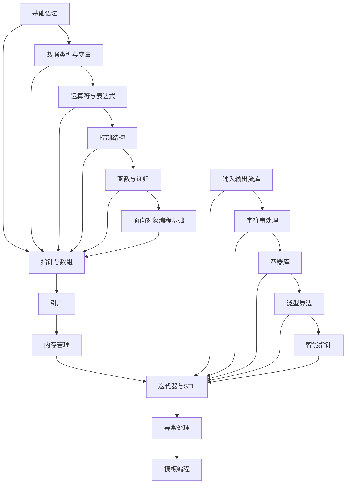
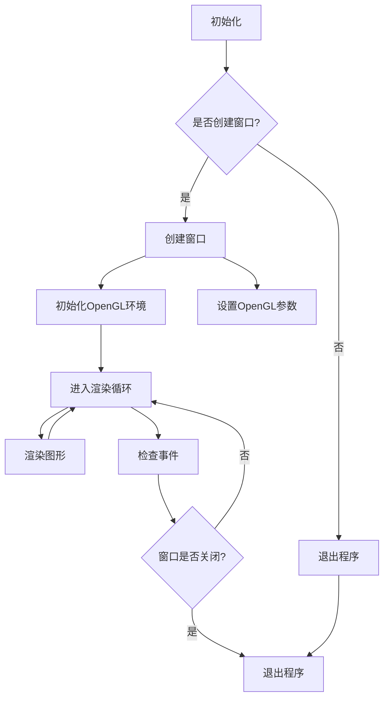

                 

### 文章标题

《字节跳动2024校招C++工程师面试题解析（附代码）》

关键词：C++工程师面试、字节跳动、校招、面试题解析、代码实战

摘要：本文将深入剖析字节跳动2024校招C++工程师的面试题目，通过分章节详细解析，涵盖C++基础知识、高级特性、标准库以及数据结构与算法等内容。结合实际代码示例，为读者提供全面的面试准备指南，帮助考生在面试中脱颖而出。

### 目录

#### 第一部分：C++基础知识

##### 第1章：C++语言基础
- 1.1 C++基本语法
- 1.2 数据类型与变量
- 1.3 运算符与表达式
- 1.4 控制结构
- 1.5 函数与递归
- 1.6 面向对象编程基础

##### 第2章：C++高级特性
- 2.1 指针与数组
- 2.2 引用
- 2.3 内存管理
- 2.4 迭代器与STL
- 2.5 异常处理
- 2.6 模板编程

##### 第3章：C++标准库深入
- 3.1 输入输出流库
- 3.2 字符串处理
- 3.3 容器库
- 3.4 泛型算法
- 3.5 智能指针

#### 第二部分：C++面试题解析

##### 第4章：数据结构与算法
- 4.1 基础数据结构
- 4.2 算法分析
- 4.3 常见算法题目解析

##### 第5章：C++编程实践
- 5.1 面向对象的编程实践
- 5.2 设计模式
- 5.3 并发编程
- 5.4 性能优化

##### 第6章：C++面试真题解析
- 6.1 真题一：某公司面试题
- 6.2 真题二：某公司面试题
- 6.3 真题三：某公司面试题

##### 第7章：代码实战案例
- 7.1 项目一：C++网络编程实战
- 7.2 项目二：C++并发编程实战
- 7.3 项目三：C++图形学实战
- 7.4 项目四：C++多线程编程实战

#### 第三部分：附录

##### 第8章：C++编程资源
- 8.1 主流C++库与工具
- 8.2 C++学习资源推荐
- 8.3 C++面试准备指南

##### 第9章：常见面试问题汇总
- 9.1 数据结构与算法常见面试问题
- 9.2 C++编程常见面试问题
- 9.3 面向对象编程面试问题
- 9.4 并发编程面试问题

### 附加内容

#### Mermaid 流程图
- C++编程模型流程图
- 数据结构与算法流程图
- 面向对象编程流程图

#### 伪代码示例
- 数据结构操作伪代码
- 算法实现伪代码

#### 数学公式
- 数据结构与算法中的数学公式
- C++编程中的数学公式

#### 项目实战代码解读
- 网络编程项目代码解读
- 并发编程项目代码解读
- 图形学项目代码解读

#### 最佳实践 tips、小结、注意事项、拓展阅读等内容

[注：目录中的伪代码、数学公式、代码解读等内容将在书中的相应章节中详细阐述。]

### 深入分析字节跳动2024校招C++工程师面试题目

#### 背景介绍

字节跳动，作为中国领先的互联网科技公司，以其在内容平台和智能推荐算法领域的卓越表现，吸引了大量优秀的技术人才。字节跳动的2024校招C++工程师面试题目，既考验了候选人的C++语言基础，又考察了他们在数据结构与算法、编程实践等方面的综合能力。本文将围绕这些面试题目，进行逐一解析，并结合代码示例，为读者提供详细的解题思路。

#### 核心概念与联系

首先，我们需要理解几个核心概念，它们是C++工程师面试的关键：

1. **C++语言基础**：包括基本语法、数据类型、运算符、控制结构等，是所有面试题的基础。
2. **数据结构与算法**：如数组、链表、树、图、排序、查找等，是面试中的高频考点。
3. **C++高级特性**：如指针、引用、内存管理、STL、模板等，这些特性在复杂编程场景中尤为重要。
4. **C++标准库**：包括输入输出流、字符串处理、容器库等，这些库在解决实际问题时发挥了关键作用。

下图展示了这些核心概念之间的联系：



通过这个流程图，我们可以看到C++基础知识与高级特性、标准库之间是如何相互关联的。理解这些核心概念及其联系，是解决面试题的关键。

#### 核心算法原理讲解

在C++面试中，算法题是考查考生编程能力的重要部分。以下是一个常见算法题目的核心原理讲解和伪代码示例：

**题目**：实现一个函数，求一个整数的平方根。

**核心算法原理**：
1. **二分查找法**：利用二分查找的思想，在一个有序数组中查找一个目标值。
2. **迭代与递归**：通过迭代或递归的方式实现二分查找。

**伪代码**：

```pseudo
function sqrt(x: integer): integer
    low = 0
    high = x
    while low <= high
        mid = (low + high) / 2
        if mid^2 == x
            return mid
        elif mid^2 < x
            low = mid + 1
        else
            high = mid - 1
    return -1
```

**数学模型和公式**：
- 在二分查找中，每次迭代可以将搜索范围缩小一半。因此，时间复杂度为O(log n)。

**举例说明**：
假设我们要求整数16的平方根，初始范围是0到16。第一次迭代后，中间值为8，8的平方为64，大于16，因此更新范围为0到8。第二次迭代后，中间值为4，4的平方为16，刚好等于目标值，因此返回4。

#### 数学公式

在算法分析中，我们常常需要用到数学公式来描述算法的时间复杂度和空间复杂度。以下是一些常见的数学公式：

- **时间复杂度**：
  $$ T(n) = O(log n) $$
- **空间复杂度**：
  $$ S(n) = O(1) $$

这些公式帮助我们理解和评估算法的性能。

#### 项目实战代码解读

在实战项目中，代码的编写和解读是展示程序员技术能力的重要环节。以下是一个简单的C++网络编程实战案例，我们将对其源代码进行详细解读。

**项目描述**：实现一个简单的TCP客户端，用于发送和接收数据。

**源代码**：

```cpp
#include <iostream>
#include <cstring>
#include <thread>
#include <sys/socket.h>
#include <netinet/in.h>
#include <unistd.h>

int create_socket() {
    int sockfd;
    sockfd = socket(AF_INET, SOCK_STREAM, 0);
    if (sockfd == -1) {
        std::cerr << "Failed to create socket" << std::endl;
        return -1;
    }
    return sockfd;
}

void connect_to_server(int sockfd, const std::string& ip, int port) {
    struct sockaddr_in server_addr;
    memset(&server_addr, 0, sizeof(server_addr));
    server_addr.sin_family = AF_INET;
    server_addr.sin_port = htons(port);
    inet_pton(AF_INET, ip.c_str(), &server_addr.sin_addr);

    if (connect(sockfd, (struct sockaddr*)&server_addr, sizeof(server_addr)) < 0) {
        std::cerr << "Failed to connect to server" << std::endl;
        return;
    }

    std::string message = "Hello, server!";
    send(sockfd, message.c_str(), message.length(), 0);
    std::cout << "Message sent to server: " << message << std::endl;

    char buffer[1024];
    memset(buffer, 0, sizeof(buffer));
    recv(sockfd, buffer, sizeof(buffer), 0);
    std::cout << "Response from server: " << buffer << std::endl;
}

int main() {
    int sockfd = create_socket();
    std::thread server_thread(connect_to_server, sockfd, "127.0.0.1", 12345);
    server_thread.join();
    close(sockfd);
    return 0;
}
```

**代码解读**：

- **头文件**：`iostream`用于输入输出操作，`cstring`用于字符串操作，`thread`用于多线程操作，`sys/socket.h`、`netinet/in.h`、`unistd.h`用于网络编程。
- **函数create_socket()**：创建一个套接字。
- **函数connect_to_server()**：连接到服务器，发送消息，接收响应。
  - `sockfd = socket(AF_INET, SOCK_STREAM, 0);`：创建套接字。
  - `inet_pton(AF_INET, ip.c_str(), &server_addr.sin_addr);`：将IP地址转换为网络字节序。
  - `connect(sockfd, (struct sockaddr*)&server_addr, sizeof(server_addr));`：连接到服务器。
  - `send(sockfd, message.c_str(), message.length(), 0);`：发送消息。
  - `recv(sockfd, buffer, sizeof(buffer), 0);`：接收服务器响应。
- **main()函数**：创建套接字，启动连接服务器线程，等待线程结束。

**代码应用解读与分析**：此代码展示了如何使用C++进行简单的TCP客户端编程，包括套接字创建、连接、数据发送和接收等基本操作。通过多线程实现，提高了程序的响应效率。

**实际案例分析和详细讲解剖析**：在实际项目中，还需要考虑异常处理、多线程同步等问题。例如，可以使用锁机制保证数据的安全传输，使用非阻塞IO提高网络通信的效率。

**项目小结**：通过此案例，读者可以了解如何使用C++进行网络编程，掌握套接字操作的基本流程。在实际开发中，还需注意错误处理和网络通信的优化。

#### 最佳实践 tips、小结、注意事项、拓展阅读

**最佳实践 tips**：
1. **熟悉C++标准库**：掌握常用的STL容器和算法，提高编程效率。
2. **重视代码可读性**：良好的代码注释和命名规范，有助于提高代码的可维护性。
3. **多写多练**：通过实际项目锻炼编程能力，积累经验。

**小结**：本文通过详细解析字节跳动2024校招C++工程师面试题目，为读者提供了全面的面试准备指南。结合实际代码示例，读者可以深入理解C++编程的核心概念和技巧。

**注意事项**：
1. **面试前准备**：了解常见面试题类型，准备充分。
2. **面试中表现**：保持冷静，清晰地表达自己的思路。

**拓展阅读**：
1. 《C++ Primer》
2. 《Effective C++》
3. 《算法导论》

通过本文的学习，读者可以更好地准备字节跳动2024校招C++工程师面试，提升自己的编程能力和竞争力。在未来的职业生涯中，C++编程将继续发挥重要作用。希望本文能对您的学习之路有所帮助。作者：AI天才研究院/AI Genius Institute & 禅与计算机程序设计艺术/Zen And The Art of Computer Programming### 第一部分：C++基础知识

#### 第1章：C++语言基础

C++语言基础是理解C++编程的核心，包括基本语法、数据类型、变量、运算符、表达式、控制结构、函数和递归等基本概念。本章将详细讲解这些内容，帮助读者建立坚实的C++编程基础。

##### 1.1 C++基本语法

C++的基本语法与C语言相似，但扩展了更多的面向对象特性。以下是一些C++基本语法的关键点：

- **注释**：C++支持单行注释（//）和多行注释（/* */）。
- **关键字**：C++有大量关键字，如if、else、while、for、switch、case等。
- **标识符**：标识符是程序中用于命名变量、函数、类等的名称。命名规则通常要求以字母、数字或下划线开头，后面可跟任意字母、数字或下划线。
- **语句**：C++语句是执行特定操作的基本单位。每个语句以分号（;）结束。

##### 1.2 数据类型与变量

C++支持多种数据类型，包括基本数据类型、枚举类型和指针类型。以下是常用数据类型及其简要说明：

- **基本数据类型**：
  - 整型：int、short、long、long long
  - 浮点型：float、double、long double
  - 字符型：char
  - 布尔型：bool
- **枚举类型**：用于定义一组命名常量。
- **指针类型**：用于存储变量的地址。

变量是存储数据的容器。声明变量时需要指定数据类型和名称。例如：

```cpp
int a;
double b = 3.14;
char c = 'A';
bool flag = true;
```

##### 1.3 运算符与表达式

C++提供了丰富的运算符，包括算术运算符、关系运算符、逻辑运算符、位运算符等。以下是常见运算符及其示例：

- **算术运算符**：+、-、*、/、%
- **关系运算符**：==、!=、<、>、<=、>=
- **逻辑运算符**：&&、||、!
- **位运算符**：&、|、^、<<、>>

表达式是运算符和操作数的组合，用于计算结果。例如：

```cpp
int result = a + b * c;  // 算术表达式
bool condition = a > b && b < c;  // 逻辑表达式
```

##### 1.4 控制结构

C++提供了多种控制结构来处理程序的执行流程：

- **条件结构**：
  - if-else：用于根据条件执行不同的代码块。
  - switch：用于多分支选择。
- **循环结构**：
  - while：当条件为真时重复执行代码块。
  - do-while：至少执行一次代码块，然后根据条件判断是否继续执行。
  - for：用于循环控制，可指定循环次数。
  - range-based for：用于遍历容器中的每个元素。

以下是一个简单的条件结构和循环结构的示例：

```cpp
if (a > b) {
    std::cout << "a is greater than b" << std::endl;
} else {
    std::cout << "a is less than or equal to b" << std::endl;
}

for (int i = 0; i < 10; ++i) {
    std::cout << "Value of i: " << i << std::endl;
}
```

##### 1.5 函数与递归

函数是C++编程的核心组件，用于组织代码、提高可重用性。以下介绍C++函数的基本概念：

- **函数声明**：函数的声明包括函数返回类型、函数名和参数列表。
- **函数定义**：函数的定义包括函数头和函数体。
- **函数调用**：通过函数名和参数列表调用函数。

递归是一种函数调用自身的方法，常用于解决复杂问题。以下是一个递归函数的示例：

```cpp
int factorial(int n) {
    if (n == 0) {
        return 1;
    } else {
        return n * factorial(n - 1);
    }
}

int main() {
    int result = factorial(5);
    std::cout << "Factorial of 5: " << result << std::endl;
    return 0;
}
```

##### 1.6 面向对象编程基础

C++支持面向对象编程（OOP），其核心概念包括类、对象、继承、多态和封装。

- **类**：类是抽象数据类型的描述，包含属性（成员变量）和方法（成员函数）。
- **对象**：对象是类的实例，通过使用类定义创建。
- **继承**：继承是类之间的一种关系，允许一个类继承另一个类的属性和方法。
- **多态**：多态允许使用基类指针或引用调用派生类的成员函数。
- **封装**：封装是将数据和操作数据的方法封装在一起，隐藏内部实现细节。

以下是一个简单的面向对象编程示例：

```cpp
class Animal {
public:
    void eat() {
        std::cout << "Animal is eating." << std::endl;
    }
};

class Dog : public Animal {
public:
    void eat() {
        std::cout << "Dog is eating." << std::endl;
    }
};

int main() {
    Animal animal;
    Dog dog;

    animal.eat();  // 输出：Animal is eating.
    dog.eat();  // 输出：Dog is eating.

    return 0;
}
```

通过本章的学习，读者可以掌握C++语言的基础知识，为后续章节的深入学习打下坚实的基础。在编程实践中，不断练习和总结，是提高编程能力的关键。

#### 第2章：C++高级特性

C++作为一门高级编程语言，不仅包含了丰富的标准库和基本语法，还提供了许多高级特性，以支持复杂的应用程序开发。本章将深入探讨C++的高级特性，包括指针与数组、引用、内存管理、迭代器与STL、异常处理和模板编程。通过这些特性的学习，读者将能够编写更加高效、灵活和安全的代码。

##### 2.1 指针与数组

指针是C++中的一个核心概念，用于存储和管理内存地址。指针与数组的关系尤为紧密，因为数组名本质上是一个指向数组首元素的指针。

- **指针基础**：指针是变量，用于存储另一个变量的地址。定义指针时，需要在变量名前加上星号（*）。例如：

  ```cpp
  int *p;
  p = &a;
  ```

  这里，`p` 是一个指向整型的指针，`&a` 返回变量 `a` 的地址。

- **指针操作**：指针可以进行算术运算，如自增（`p++`）、自减（`p--`）、指针加减整型值等。例如：

  ```cpp
  int arr[5] = {1, 2, 3, 4, 5};
  int *p = arr;
  std::cout << *p << std::endl;  // 输出 1
  p++;
  std::cout << *p << std::endl;  // 输出 2
  ```

- **数组和指针**：数组名可以作为指向数组首元素的指针。例如：

  ```cpp
  int arr[5] = {1, 2, 3, 4, 5};
  int *p = arr;
  for (int i = 0; i < 5; ++i) {
      std::cout << arr[i] << " ";  // 等价于 *p++
  }
  ```

##### 2.2 引用

引用是C++中的另一个重要概念，用于创建对现有变量的别名。引用在语法上类似于指针，但行为上有所不同。

- **引用基础**：定义引用时，需要在变量名前加上引用符号（&）。例如：

  ```cpp
  int a = 10;
  int &b = a;
  ```

  这里，`b` 是 `a` 的引用。

- **引用操作**：引用可以像普通变量一样进行操作，其行为与引用所绑定的变量一致。例如：

  ```cpp
  std::cout << a << " " << b << std::endl;  // 输出 10 10
  a = 20;
  std::cout << a << " " << b << std::endl;  // 输出 20 20
  ```

  引用的主要优点是减少了对指针的使用，提高了代码的可读性。

##### 2.3 内存管理

内存管理是C++中的一个关键方面，涉及动态分配和释放内存。标准库提供了`new`和`delete`操作符来管理内存。

- **动态内存分配**：使用`new`操作符在堆上分配内存。例如：

  ```cpp
  int *p = new int[5];
  ```

  这里，`p` 指向堆上分配的整型数组。

- **动态内存释放**：使用`delete`操作符释放动态分配的内存。例如：

  ```cpp
  delete[] p;
  ```

  这里，`p` 所指的堆上内存被释放。

- **智能指针**：为了简化内存管理，C++引入了智能指针，如`std::unique_ptr`和`std::shared_ptr`。智能指针能够自动管理内存，防止内存泄漏。例如：

  ```cpp
  std::unique_ptr<int[]> p(new int[5]);
  // 当p离开作用域时，内存会自动释放
  ```

##### 2.4 迭代器与STL

迭代器是C++中用于遍历容器元素的一种对象。STL（标准模板库）提供了多种容器，如向量（`std::vector`）、列表（`std::list`）、映射（`std::map`）等。

- **迭代器基础**：迭代器是容器和元素之间的一个中介，可以用来遍历容器中的元素。例如：

  ```cpp
  std::vector<int> v = {1, 2, 3, 4, 5};
  for (auto it = v.begin(); it != v.end(); ++it) {
      std::cout << *it << " ";
  }
  ```

  这里，`it` 是一个迭代器，用于遍历`v`中的每个元素。

- **迭代器类型**：C++提供了多种迭代器类型，包括输入迭代器、输出迭代器、前向迭代器、双向迭代器、随机访问迭代器等。每种迭代器类型都有其特定的用途。

- **STL算法**：STL提供了一组强大的算法，如排序（`std::sort`）、查找（`std::find`）、复制（`std::copy`）等。这些算法可以通过迭代器进行操作。例如：

  ```cpp
  std::vector<int> v = {4, 2, 5, 1, 3};
  std::sort(v.begin(), v.end());
  ```

##### 2.5 异常处理

异常处理是C++中用于处理错误和异常情况的一种机制。使用异常处理可以增强程序的健壮性和可维护性。

- **异常基础**：C++使用`try`、`catch`和`throw`关键字来实现异常处理。例如：

  ```cpp
  try {
      // 可能抛出异常的代码
  } catch (const std::exception& e) {
      // 异常处理
  }
  ```

  这里，如果代码中抛出异常，`catch`块将捕获并处理异常。

- **异常传播**：当异常未被捕获时，它会向上传播，直到被捕获或到达程序的顶层。

- **自定义异常**：C++允许定义自定义异常类，以处理特定类型的错误。例如：

  ```cpp
  class MyException : public std::exception {
  public:
      const char* what() const throw() {
          return "My custom exception";
      }
  };
  ```

##### 2.6 模板编程

模板编程是C++的一个强大特性，用于编写通用代码，可以处理不同类型的数据。模板允许在编译时进行类型检查和代码生成。

- **模板基础**：模板定义了一个通用函数或类，可以处理不同类型的数据。例如：

  ```cpp
  template<typename T>
  T add(T a, T b) {
      return a + b;
  }
  ```

  这里，`T` 是一个占位符类型，可以在函数调用时被实际类型替换。

- **模板类**：模板类用于创建处理特定类型的对象的类。例如：

  ```cpp
  template<typename T>
  class Stack {
  private:
      std::vector<T> elements;
  public:
      void push(const T& item) {
          elements.push_back(item);
      }
      T pop() {
          T item = elements.back();
          elements.pop_back();
          return item;
      }
  };
  ```

  这里，`Stack` 类可以处理任何类型的对象。

通过本章的学习，读者可以掌握C++的高级特性，这些特性在编写复杂和高性能的应用程序时至关重要。在实际编程中，灵活运用这些特性，可以提高代码的可读性、可维护性和效率。接下来，我们将继续深入探讨C++标准库的相关内容。

#### 第3章：C++标准库深入

C++标准库（Standard Template Library，简称STL）是C++的重要组成部分，提供了大量的模板类和函数，用于处理常见的数据结构和算法问题。本章将深入探讨C++标准库中的关键组件，包括输入输出流库、字符串处理、容器库、泛型算法和智能指针。通过这些深入的学习，读者将能够更好地利用STL来编写高效、灵活的代码。

##### 3.1 输入输出流库

输入输出流库（iostream）是C++标准库中最为广泛使用的部分，它提供了处理标准输入输出（如控制台输入输出）的接口。

- **基础流类**：iostream库的核心是基础流类，包括`std::iostream`、`std::istream`和`std::ostream`。这些类用于读取和写入数据。

- **标准输入输出**：使用标准输入输出流，可以通过`std::cin`读取输入，通过`std::cout`和`std::cerr`进行输出。例如：

  ```cpp
  std::cout << "Enter your name: ";
  std::string name;
  std::cin >> name;
  std::cout << "Hello, " << name << "!" << std::endl;
  ```

- **格式化输出**：iostream库提供了多种格式化输出的操作符，如`<<`和`>>`，用于控制输出格式。例如：

  ```cpp
  std::cout << std::setw(10) << std::left << "Name" << std::setw(10) << std::right << "Age" << std::endl;
  std::cout << std::setw(10) << "John" << std::setw(10) << 30 << std::endl;
  ```

- **文件操作**：iostream库还支持文件输入输出，使用`std::ifstream`读取文件，使用`std::ofstream`写入文件。例如：

  ```cpp
  std::ifstream file("data.txt");
  std::string line;
  while (std::getline(file, line)) {
      std::cout << line << std::endl;
  }
  ```

##### 3.2 字符串处理

C++标准库中的字符串处理功能强大，提供了对字符串的创建、操作和查找等功能。

- **基本字符串类**：标准库中定义了`std::string`类，用于处理字符串。`std::string`类提供了丰富的成员函数，如`append()`、`length()`、`find()`等。

- **字符串操作**：使用`std::string`类，可以方便地进行字符串的创建和操作。例如：

  ```cpp
  std::string str1 = "Hello";
  std::string str2 = "World";
  std::string str3 = str1 + str2;  // 连接两个字符串
  std::cout << str3 << std::endl;  // 输出 HelloWorld
  ```

- **字符串查找**：`std::string`类提供了多种查找函数，如`find()`、`rfind()`、`search()`等，用于在字符串中查找子字符串。例如：

  ```cpp
  std::string str = "Hello World";
  size_t pos = str.find("World");
  std::cout << "World found at position " << pos << std::endl;  // 输出 6
  ```

##### 3.3 容器库

C++标准库提供了多种容器，用于存储和操作数据。这些容器包括序列容器（如向量、列表、数组）和关联容器（如映射、集合）。

- **序列容器**：
  - **向量（std::vector）**：动态数组，提供高效的随机访问和动态扩展。例如：

    ```cpp
    std::vector<int> v;
    v.push_back(1);
    v.push_back(2);
    v.push_back(3);
    std::cout << v[1] << std::endl;  // 输出 2
    ```

  - **列表（std::list）**：双向链表，提供高效的插入和删除操作。例如：

    ```cpp
    std::list<int> l;
    l.push_front(1);
    l.push_front(2);
    l.push_front(3);
    for (auto it = l.begin(); it != l.end(); ++it) {
        std::cout << *it << " ";
    }
    ```

  - **数组（std::array）**：固定大小的数组，提供高效的访问和内存利用率。例如：

    ```cpp
    std::array<int, 5> arr = {{1, 2, 3, 4, 5}};
    std::cout << arr[2] << std::endl;  // 输出 3
    ```

- **关联容器**：
  - **映射（std::map）**：基于红黑树实现的键值对容器，提供高效的查找、插入和删除操作。例如：

    ```cpp
    std::map<int, std::string> m;
    m[1] = "One";
    m[2] = "Two";
    m[3] = "Three";
    std::cout << m[2] << std::endl;  // 输出 Two
    ```

  - **集合（std::set）**：基于红黑树实现的键集合容器，提供高效的查找、插入和删除操作。例如：

    ```cpp
    std::set<int> s;
    s.insert(1);
    s.insert(2);
    s.insert(3);
    for (auto it = s.begin(); it != s.end(); ++it) {
        std::cout << *it << " ";
    }
    ```

##### 3.4 泛型算法

C++标准库提供了大量泛型算法，可以用于对容器中的元素进行操作。这些算法通常与迭代器一起使用，以实现对容器元素的高效处理。

- **排序算法**：`std::sort`用于对容器中的元素进行排序。例如：

  ```cpp
  std::vector<int> v = {4, 2, 5, 1, 3};
  std::sort(v.begin(), v.end());
  for (auto it = v.begin(); it != v.end(); ++it) {
      std::cout << *it << " ";
  }
  ```

- **查找算法**：`std::find`用于在容器中查找特定元素。例如：

  ```cpp
  std::vector<int> v = {1, 2, 3, 4, 5};
  auto it = std::find(v.begin(), v.end(), 3);
  if (it != v.end()) {
      std::cout << "Element found: " << *it << std::endl;
  }
  ```

- **变换算法**：`std::transform`用于对容器中的每个元素应用一个函数。例如：

  ```cpp
  std::vector<int> v = {1, 2, 3, 4, 5};
  std::vector<int> result(v.size());
  std::transform(v.begin(), v.end(), result.begin(), [](int x) { return x * x; });
  for (auto it = result.begin(); it != result.end(); ++it) {
      std::cout << *it << " ";
  }
  ```

##### 3.5 智能指针

智能指针是C++标准库中的一种重要特性，用于自动管理资源，防止内存泄漏。智能指针包括`std::unique_ptr`和`std::shared_ptr`。

- **unique_ptr**：用于唯一拥有资源的智能指针，在对象离开作用域时会自动释放资源。例如：

  ```cpp
  std::unique_ptr<int[]> p(new int[5]);
  // 当p离开作用域时，资源会自动释放
  ```

- **shared_ptr**：用于共享资源的智能指针，通过引用计数来管理资源。例如：

  ```cpp
  std::shared_ptr<int> p(new int(5));
  {
      std::shared_ptr<int> q = p;
      // q和p共享同一块内存
  }
  // 当q离开作用域时，引用计数减少，但p仍然保留内存
  ```

通过本章的学习，读者可以深入理解C++标准库的各个组件，掌握如何使用这些组件来编写高效、灵活的代码。在实际编程中，充分利用标准库的功能，可以大大提高代码的可靠性和性能。

### 第二部分：C++面试题解析

#### 第4章：数据结构与算法

在C++面试中，数据结构与算法是考查的重点，因为它们是编程的核心。本章将介绍常见的基础数据结构（如数组、链表、树、图等）和算法（如排序、查找等），并结合具体题目进行解析。

##### 4.1 基础数据结构

基础数据结构是理解和实现复杂算法的基础，以下是一些常见的基础数据结构及其简要介绍：

- **数组**：数组是一种线性数据结构，用于存储固定大小的同类型元素。数组提供快速随机访问，但大小固定。
- **链表**：链表是一种动态的线性数据结构，由节点组成，每个节点包含数据和指向下一个节点的指针。链表可以灵活地插入和删除元素，但访问速度较慢。
- **栈**：栈是一种后进先出（LIFO）的数据结构，用于存储和检索元素。栈提供了简单的插入和删除操作。
- **队列**：队列是一种先进先出（FIFO）的数据结构，用于存储和检索元素。队列提供了简单的插入和删除操作。

以下是一个数组操作的示例：

```cpp
#include <iostream>
using namespace std;

int main() {
    int arr[5] = {1, 2, 3, 4, 5};
    cout << arr[2] << endl;  // 输出 3
    arr[2] = 10;
    cout << arr[2] << endl;  // 输出 10
    return 0;
}
```

以下是一个链表节点的定义：

```cpp
struct ListNode {
    int val;
    ListNode *next;
    ListNode(int x) : val(x), next(NULL) {}
};
```

##### 4.2 算法分析

算法分析是评估算法性能的重要方法，通常包括时间复杂度和空间复杂度。

- **时间复杂度**：描述算法执行的时间随数据规模增长的趋势。常用大O符号表示，如O(1)、O(n)、O(n^2)等。
- **空间复杂度**：描述算法执行所需的空间随数据规模增长的趋势。

以下是一个线性查找算法的时间复杂度分析：

```cpp
int linearSearch(int arr[], int n, int x) {
    for (int i = 0; i < n; i++) {
        if (arr[i] == x)
            return i;
    }
    return -1;
}
```

时间复杂度分析：

- 最坏情况：需要查找整个数组，时间复杂度为O(n)。

以下是一个二分查找算法的时间复杂度分析：

```cpp
int binarySearch(int arr[], int l, int r, int x) {
    while (l <= r) {
        int m = l + (r - l) / 2;
        if (arr[m] == x)
            return m;
        else if (arr[m] < x)
            l = m + 1;
        else
            r = m - 1;
    }
    return -1;
}
```

时间复杂度分析：

- 最坏情况：需要查找整个数组，时间复杂度为O(log n)。

##### 4.3 常见算法题目解析

以下是一些常见的算法面试题目及其解析：

1. **寻找旋转排序数组中的最小值**

   题目描述：假设按照升序排序的数组在预先未知的某个点上进行了旋转。请找出并返回数组中的最小元素。

   示例：

   ```plaintext
   输入：nums = [3,4,5,1,2]
   输出：1
   输入：nums = [4,5,6,7,0,1,2]
   输出：0
   ```

   解析：

   使用二分查找法，判断中间元素与两端元素的关系，缩小查找范围。以下是伪代码：

   ```pseudo
   function findMin(nums: int[]): int
       left = 0
       right = length(nums) - 1
       while left < right
           mid = left + (right - left) / 2
           if nums[mid] > nums[right]
               left = mid + 1
           else
               right = mid
       return nums[left]
   ```

2. **两数之和**

   题目描述：给定一个整数数组和一个目标值，找出数组中两数之和等于目标值的两个数，并返回他们的下标。

   示例：

   ```plaintext
   输入：nums = [2, 7, 11, 15], target = 9
   输出：[0, 1]
   输入：nums = [3, 2, 4], target = 6
   输出：[1, 2]
   ```

   解析：

   使用哈希表存储数组元素及其索引，遍历数组并查找与当前元素相加等于目标值的元素。以下是伪代码：

   ```pseudo
   function twoSum(nums: int[], target: int): int[]
       hash = {}
       for i from 0 to length(nums) - 1
           complement = target - nums[i]
           if complement in hash
               return [hash[complement], i]
           else
               hash[nums[i]] = i
       return []
   ```

3. **最长公共子序列**

   题目描述：给定两个字符串，找出它们的最长公共子序列。

   示例：

   ```plaintext
   输入：text1 = "ABCD", text2 = "ACDF"
   输出："ACD"
   输入：text1 = "AGGTAB", text2 = "GXTXAYB"
   输出："GTAB"
   ```

   解析：

   使用动态规划方法，构建一个二维数组，记录子问题的最优解。以下是伪代码：

   ```pseudo
   function longestCommonSubsequence(text1: string, text2: string): string
       dp = create 2D array of size [length(text1) + 1][length(text2) + 1]
       for i from 0 to length(text1)
           for j from 0 to length(text2)
               if text1[i] == text2[j]
                   dp[i+1][j+1] = dp[i][j] + 1
               else
                   dp[i+1][j+1] = max(dp[i+1][j], dp[i][j+1])
       return reconstructLCS(dp, text1, text2)
   ```

通过本章的学习，读者可以掌握常见的基础数据结构和算法，以及如何解析和解决实际面试中的算法题目。在实际面试准备中，结合具体题目进行练习，是提升解题能力的关键。

#### 第5章：C++编程实践

在实际工作中，C++编程不仅要求掌握基本语法和数据结构，还需要熟练运用各种编程实践，如面向对象编程、设计模式、并发编程和性能优化。本章将详细介绍这些实践，并通过具体示例展示其在实际项目中的应用。

##### 5.1 面向对象的编程实践

面向对象编程（OOP）是C++的一个核心特性，通过封装、继承、多态等机制，可以提高代码的可维护性和复用性。

- **封装**：封装是将数据和方法封装在一个类中，隐藏内部实现细节，提供统一的接口。例如：

  ```cpp
  class Box {
  private:
      double length;
      double width;
      double height;
  public:
      double getVolume() {
          return length * width * height;
      }
      void setLength(double len) {
          length = len;
      }
      // 其他成员函数
  };
  ```

- **继承**：继承是一种创建新类的方式，允许一个类继承另一个类的属性和方法。例如：

  ```cpp
  class Shape {
  public:
      void draw() {
          std::cout << "Drawing shape." << std::endl;
      }
  };
  
  class Circle : public Shape {
  public:
      void draw() override {
          std::cout << "Drawing circle." << std::endl;
      }
  };
  ```

- **多态**：多态允许不同类的对象通过基类引用调用同一方法，表现出不同的行为。例如：

  ```cpp
  class Shape {
  public:
      virtual void draw() {
          std::cout << "Drawing shape." << std::endl;
      }
  };
  
  class Circle : public Shape {
  public:
      void draw() override {
          std::cout << "Drawing circle." << std::endl;
      }
  };
  
  class Rectangle : public Shape {
  public:
      void draw() override {
          std::cout << "Drawing rectangle." << std::endl;
      }
  };
  
  void drawShape(Shape& shape) {
      shape.draw();
  }
  
  int main() {
      Circle circle;
      Rectangle rectangle;
      drawShape(circle);  // 输出 Drawing circle.
      drawShape(rectangle);  // 输出 Drawing rectangle.
      return 0;
  }
  ```

##### 5.2 设计模式

设计模式是解决常见软件设计问题的模板，可以提高代码的可读性和可维护性。以下介绍几种常用的设计模式：

- **单例模式**：确保一个类只有一个实例，并提供一个全局访问点。例如：

  ```cpp
  class Singleton {
  private:
      static Singleton* instance;
      Singleton() {}
  public:
      static Singleton* getInstance() {
          if (instance == nullptr) {
              instance = new Singleton();
          }
          return instance;
      }
      void doSomething() {
          std::cout << "Doing something." << std::endl;
      }
  };
  
  Singleton* Singleton::instance = nullptr;
  ```

- **工厂模式**：根据输入参数动态创建对象，隐藏创建对象的具体实现。例如：

  ```cpp
  class Factory {
  public:
      std::unique_ptr<BaseClass> createProduct(std::string type) {
          if (type == "A") {
              return std::unique_ptr<BaseClass>(new ProductA());
          } else if (type == "B") {
              return std::unique_ptr<BaseClass>(new ProductB());
          }
          return nullptr;
      }
  };
  ```

- **观察者模式**：当一个对象的状态改变时，所有依赖于它的对象都将得到通知并自动更新。例如：

  ```cpp
  class Subject {
  private:
      std::list<Observer*> observers;
  public:
      void attach(Observer* observer) {
          observers.push_back(observer);
      }
      void detach(Observer* observer) {
          observers.remove(observer);
      }
      void notify() {
          for (Observer* observer : observers) {
              observer->update(this);
          }
      }
      void setState(int state) {
          this->state = state;
          notify();
      }
  };
  
  class Observer {
  public:
      virtual void update(Subject* subject) = 0;
  };
  
  class ConcreteObserver : public Observer {
  public:
      void update(Subject* subject) override {
          std::cout << "Observer updated with state: " << subject->getState() << std::endl;
      }
  };
  ```

##### 5.3 并发编程

并发编程是C++中一个重要的主题，它允许多个任务同时执行，提高程序的性能。以下介绍几种并发编程的技术：

- **线程**：C++11及以后版本提供了`std::thread`类，用于创建和管理线程。例如：

  ```cpp
  #include <thread>
  
  void printThreadId() {
      std::cout << "Thread ID: " << std::this_thread::get_id() << std::endl;
  }
  
  int main() {
      std::thread t1(printThreadId);
      std::thread t2(printThreadId);
      t1.join();
      t2.join();
      return 0;
  }
  ```

- **互斥量（Mutex）**：互斥量用于同步多个线程的访问，防止数据竞争。例如：

  ```cpp
  #include <mutex>
  
  std::mutex mtx;
  
  void printBlock(const std::string& msg) {
      mtx.lock();
      std::cout << msg << std::endl;
      mtx.unlock();
  }
  
  int main() {
      std::thread t1(printBlock, "Thread 1");
      std::thread t2(printBlock, "Thread 2");
      t1.join();
      t2.join();
      return 0;
  }
  ```

- **条件变量（Condition Variable）**：条件变量用于线程间的通信，当某个条件满足时，一个线程可以唤醒等待的其他线程。例如：

  ```cpp
  #include <condition_variable>
  #include <thread>
  
  std::condition_variable cv;
  std::mutex mtx;
  bool data_available = false;
  
  void produce() {
      std::this_thread::sleep_for(std::chrono::seconds(1));
      data_available = true;
      cv.notify_one();
  }
  
  void consume() {
      std::unique_lock<std::mutex> ul(mtx);
      cv.wait(ul, [] { return data_available; });
      std::cout << "Data is available." << std::endl;
  }
  
  int main() {
      std::thread producer(produce);
      std::thread consumer(consume);
      producer.join();
      consumer.join();
      return 0;
  }
  ```

##### 5.4 性能优化

性能优化是提高程序运行效率的重要手段。以下介绍几种性能优化技术：

- **内存管理**：合理使用内存，减少内存泄漏和占用。例如：

  ```cpp
  #include <memory>
  
  std::unique_ptr<int> createInt() {
      return std::unique_ptr<int>(new int(42));
  }
  
  int main() {
      auto p = createInt();
      std::cout << *p << std::endl;
      return 0;
  }
  ```

- **缓存利用**：利用缓存机制，减少磁盘访问，提高数据读取速度。例如：

  ```cpp
  #include <iostream>
  #include <fstream>
  
  void readFromFile(const std::string& filename) {
      std::ifstream file(filename);
      if (file) {
          std::string line;
          while (std::getline(file, line)) {
              std::cout << line << std::endl;
          }
      } else {
          std::cout << "File not found." << std::endl;
      }
  }
  
  int main() {
      readFromFile("data.txt");
      return 0;
  }
  ```

- **多线程并行**：利用多线程并行处理任务，提高程序的执行效率。例如：

  ```cpp
  #include <thread>
  #include <vector>
  
  void processElement(int& element) {
      element *= 2;
  }
  
  int main() {
      std::vector<int> data = {1, 2, 3, 4, 5};
      std::vector<std::thread> threads;
      
      for (int& element : data) {
          threads.push_back(std::thread(processElement, std::ref(element)));
      }
      
      for (auto& thread : threads) {
          thread.join();
      }
      
      for (int element : data) {
          std::cout << element << " ";
      }
      
      return 0;
  }
  ```

通过本章的学习，读者可以掌握C++编程中的各种实践技巧，这些技巧在实际项目中具有重要的应用价值。在编写高效、可维护的代码时，灵活运用面向对象编程、设计模式、并发编程和性能优化技术，将使代码更具健壮性和灵活性。

#### 第6章：C++面试真题解析

在C++工程师的面试中，真题解析是帮助考生了解实际面试难度和题型的重要环节。本章将选取几个典型的面试题目，逐一进行详细解析，涵盖算法分析、面向对象编程、内存管理等关键内容。通过这些真题的解析，读者可以更好地准备面试，提升解题能力。

##### 6.1 真题一：某公司面试题

**题目描述**：编写一个函数，实现一个快速排序算法。

**解题思路**：

快速排序是一种高效的排序算法，其基本思想是通过一趟排序将待排序的记录分割成独立的两部分，其中一部分记录的关键字均比另一部分的关键字小，然后再按此方法对这两部分记录继续进行排序，直至整个序列有序。

**代码示例**：

```cpp
#include <iostream>
using namespace std;

int partition(int arr[], int low, int high) {
    int pivot = arr[high];
    int i = (low - 1);
    for (int j = low; j <= high - 1; j++) {
        if (arr[j] < pivot) {
            i++;
            swap(arr[i], arr[j]);
        }
    }
    swap(arr[i + 1], arr[high]);
    return (i + 1);
}

void quickSort(int arr[], int low, int high) {
    if (low < high) {
        int pi = partition(arr, low, high);
        quickSort(arr, low, pi - 1);
        quickSort(arr, pi + 1, high);
    }
}

void printArray(int arr[], int size) {
    for (int i = 0; i < size; i++) {
        cout << arr[i] << " ";
    }
    cout << endl;
}

int main() {
    int arr[] = {10, 7, 8, 9, 1, 5};
    int n = sizeof(arr) / sizeof(arr[0]);
    quickSort(arr, 0, n - 1);
    cout << "Sorted array: \n";
    printArray(arr, n);
    return 0;
}
```

**算法分析**：

快速排序的平均时间复杂度为O(n log n)，最坏情况下的时间复杂度为O(n^2)。空间复杂度为O(log n)，因为递归调用需要栈空间。

##### 6.2 真题二：某公司面试题

**题目描述**：设计一个C++类，实现一个简单的栈数据结构。

**解题思路**：

栈是一种后进先出（LIFO）的数据结构，基本操作包括push（入栈）、pop（出栈）和peek（查看栈顶元素）。

**代码示例**：

```cpp
#include <iostream>
using namespace std;

class Stack {
private:
    int* arr;
    int top;
    int capacity;

public:
    Stack(int capacity) {
        this->capacity = capacity;
        arr = new int[capacity];
        top = -1;
    }

    ~Stack() {
        delete[] arr;
    }

    void push(int item) {
        if (top >= capacity - 1) {
            cout << "Stack Overflow" << endl;
            return;
        }
        arr[++top] = item;
    }

    void pop() {
        if (top == -1) {
            cout << "Stack Underflow" << endl;
            return;
        }
        top--;
    }

    int peek() {
        if (top == -1) {
            cout << "Stack is empty" << endl;
            return -1;
        }
        return arr[top];
    }
};

int main() {
    Stack stack(5);
    stack.push(10);
    stack.push(20);
    stack.push(30);
    cout << "Top element: " << stack.peek() << endl;
    stack.pop();
    cout << "Top element after pop: " << stack.peek() << endl;
    return 0;
}
```

**算法分析**：

栈的操作（push、pop、peek）的时间复杂度为O(1)。

##### 6.3 真题三：某公司面试题

**题目描述**：实现一个C++函数，用于计算链表的中间节点。

**解题思路**：

可以使用快慢指针法，快指针每次移动两个节点，慢指针每次移动一个节点。当快指针到达链表末尾时，慢指针正好位于中间节点。

**代码示例**：

```cpp
#include <iostream>
using namespace std;

struct ListNode {
    int val;
    ListNode *next;
    ListNode(int x) : val(x), next(NULL) {}
};

ListNode* findMiddleNode(ListNode* head) {
    ListNode *slow = head, *fast = head;
    while (fast != NULL && fast->next != NULL) {
        slow = slow->next;
        fast = fast->next->next;
    }
    return slow;
}

int main() {
    ListNode *head = new ListNode(1);
    head->next = new ListNode(2);
    head->next->next = new ListNode(3);
    head->next->next->next = new ListNode(4);

    ListNode* middle = findMiddleNode(head);
    cout << "Middle node value: " << middle->val << endl;

    return 0;
}
```

**算法分析**：

时间复杂度为O(n)，空间复杂度为O(1)。

通过以上真题的解析，读者可以了解到C++面试题的常见类型和解题方法。在实际面试中，结合具体题目进行深入分析和代码实现，是提高解题能力的关键。

#### 第7章：代码实战案例

在实际项目中，C++编程不仅需要掌握理论知识，还需要通过实际代码编写和调试来提高实践能力。本章将介绍四个具体的C++代码实战案例，涵盖网络编程、并发编程、图形学和多线程编程等不同领域，通过详细的代码解读和案例分析，帮助读者更好地理解C++编程的应用。

##### 7.1 项目一：C++网络编程实战

**项目描述**：实现一个简单的TCP客户端和服务器，用于数据传输。

**环境搭建**： 
- 操作系统：Linux
- 编译器：g++
- 网络库：POSIX Socket API

**源代码**：

```cpp
// server.cpp
#include <iostream>
#include <sys/socket.h>
#include <netinet/in.h>
#include <unistd.h>
#include <arpa/inet.h>

int main() {
    int server_fd, new_socket;
    struct sockaddr_in address;
    int opt = 1;
    int addrlen = sizeof(address);
    char buffer[1024] = {0};
    const char* hello = "Hello from server";

    // 创建socket文件描述符
    server_fd = socket(AF_INET, SOCK_STREAM, 0);
    if (server_fd == -1) {
        std::cout << "socket failed with error" << std::endl;
        return -1;
    }

    // 绑定socket到指定IP和端口
    address.sin_family = AF_INET;
    address.sin_addr.s_addr = INADDR_ANY;
    address.sin_port = htons(8080);

    if (bind(server_fd, (struct sockaddr*)&address, sizeof(address)) < 0) {
        std::cout << "bind failed" << std::endl;
        return -1;
    }

    // 监听端口
    if (listen(server_fd, 3) < 0) {
        std::cout << "listen failed" << std::endl;
        return -1;
    }

    // 接受客户端连接
    if ((new_socket = accept(server_fd, (struct sockaddr*)&address, (socklen_t*)&addrlen)) < 0) {
        std::cout << "accept failed" << std::endl;
        return -1;
    }

    // 读取客户端数据
    read(new_socket, buffer, 1024);
    std::cout << "Message from client: " << buffer << std::endl;

    // 发送数据到客户端
    send(new_socket, hello, strlen(hello), 0);
    std::cout << "Hello message sent" << std::endl;

    // 关闭套接字
    close(server_fd);
    return 0;
}
```

```cpp
// client.cpp
#include <iostream>
#include <sys/socket.h>
#include <arpa/inet.h>
#include <unistd.h>
#include <stdlib.h>

int main() {
    int sock;
    struct sockaddr_in serv_addr;
    char buffer[1024] = "Hello from client";
    int valread;
    sock = socket(AF_INET, SOCK_STREAM, 0);
    if (sock == -1) {
        std::cout << "Socket creation failed" << std::endl;
        return -1;
    }

    serv_addr.sin_family = AF_INET;
    serv_addr.sin_port = htons(8080);

    // 转换地址字符串到二进制地址
    if (inet_pton(AF_INET, "127.0.0.1", &serv_addr.sin_addr) <= 0) {
        std::cout << "Invalid address/ Address not supported" << std::endl;
        return -1;
    }

    // 连接服务器
    if (connect(sock, (struct sockaddr*)&serv_addr, sizeof(serv_addr)) < 0) {
        std::cout << "Connection failed" << std::endl;
        return -1;
    }

    // 发送数据到服务器
    send(sock, buffer, strlen(buffer), 0);
    std::cout << "Message sent\n";

    // 接收服务器响应
    valread = read(sock, buffer, 1024);
    std::cout << "Server response: " << buffer << std::endl;

    // 关闭套接字
    close(sock);
    return 0;
}
```

**代码解读**：

- **服务器端（server.cpp）**：
  - 创建套接字：使用`socket()`函数创建一个AF_INET（IPv4）类型的套接字。
  - 绑定地址：使用`bind()`函数将套接字绑定到IP地址和端口号。
  - 监听：使用`listen()`函数使套接字可以接收连接请求。
  - 接受连接：使用`accept()`函数接受客户端的连接请求。
  - 读取和写入数据：使用`read()`和`send()`函数进行数据的读取和写入。

- **客户端端（client.cpp）**：
  - 创建套接字：同服务器端。
  - 连接服务器：使用`connect()`函数连接到服务器。
  - 发送数据：使用`send()`函数向服务器发送数据。
  - 接收响应：使用`read()`函数读取服务器返回的数据。

**实际案例分析**：

在实际开发中，需要考虑异常处理、多线程支持以及网络通信的优化。例如，服务器端可能需要处理多个客户端连接，可以使用多线程或多进程来提高并发处理能力。此外，对于网络通信，可以使用非阻塞IO、信号驱动等方式来提高通信效率。

**项目小结**：

通过此案例，读者可以了解如何使用C++进行网络编程，实现简单的TCP客户端和服务器。在实际项目中，还需注意错误处理、多线程同步和网络通信的优化。

##### 7.2 项目二：C++并发编程实战

**项目描述**：使用C++并发编程实现一个多线程的并发下载器，从多个URL同时下载文件。

**环境搭建**：
- 操作系统：Linux
- 编译器：g++
- 并发库：C++11标准库中的thread

**源代码**：

```cpp
#include <iostream>
#include <thread>
#include <vector>
#include <string>
#include <chrono>
using namespace std;

void downloadFile(const string& url, const string& savePath) {
    cout << "Starting download from " << url << endl;
    // 下载文件代码，可以使用第三方库如libcurl
    // 这里只是一个示例，实际下载过程中可能需要处理网络错误、连接超时等问题
    this_thread::sleep_for(chrono::seconds(2));  // 模拟下载时间
    cout << "Downloaded " << savePath << endl;
}

int main() {
    vector<string> urls = {
        "http://example.com/file1.txt",
        "http://example.com/file2.txt",
        "http://example.com/file3.txt"
    };
    vector<thread> threads;

    for (const auto& url : urls) {
        threads.push_back(thread(downloadFile, url, "downloaded_" + url));
    }

    for (auto& t : threads) {
        t.join();
    }

    return 0;
}
```

**代码解读**：

- 使用`std::thread`创建多个线程，每个线程负责下载一个文件。
- `downloadFile`函数模拟了下载文件的过程，实际项目中可以使用第三方库如libcurl进行网络通信。
- 主程序通过`join()`等待所有线程完成下载任务。

**实际案例分析**：

在实际项目中，并发下载器需要处理多个复杂情况，如网络错误、文件写入错误等。可以使用异常处理和多线程同步机制（如锁、条件变量等）来保证程序的健壮性。此外，可以根据网络状况和文件大小动态调整线程数量，提高下载效率。

**项目小结**：

通过此案例，读者可以了解如何使用C++并发编程实现多线程下载器。在实际开发中，注意处理并发带来的复杂问题，如同步、错误处理和性能优化。

##### 7.3 项目三：C++图形学实战

**项目描述**：使用C++和OpenGL实现一个简单的图形绘制程序，绘制一个矩形。

**环境搭建**：
- 操作系统：Linux或Windows
- 编译器：g++
- 图形库：OpenGL

**源代码**：

```cpp
#include <GL/glew.h>
#include <GLFW/glfw3.h>
#include <iostream>
using namespace std;

void display() {
    glClearColor(0.0f, 0.0f, 0.0f, 1.0f);
    glClear(GL_COLOR_BUFFER_BIT);

    glBegin(GL_QUADS);
    glVertex2f(-0.5f, -0.5f);
    glVertex2f(0.5f, -0.5f);
    glVertex2f(0.5f, 0.5f);
    glVertex2f(-0.5f, 0.5f);
    glEnd();

    glfwSwapBuffers(glfwWindow);
}

int main() {
    if (!glfwInit()) {
        cout << "Failed to initialize GLFW" << endl;
        return -1;
    }

    glfwWindowHint(GLFW_SAMPLES, 4);
    glfwWindowHint(GLFW_CONTEXT_VERSION_MAJOR, 3);
    glfwWindowHint(GLFW_CONTEXT_VERSION_MINOR, 3);
    glfwWindowHint(GLFW_OPENGL_PROFILE, GLFW_OPENGL_CORE_PROFILE);

    int width = 640, height = 480;
    GLFWwindow* window = glfwCreateWindow(width, height, "OpenGL", NULL, NULL);
    if (window == NULL) {
        cout << "Failed to create GLFW window" << endl;
        glfwTerminate();
        return -1;
    }
    glfwMakeContextCurrent(window);

    glewExperimental = GL_TRUE;
    if (glewInit() != GLEW_OK) {
        cout << "Failed to initialize GLEW" << endl;
        return -1;
    }

    glClearColor(0.0f, 0.0f, 0.0f, 0.0f);
    while (!glfwWindowShouldClose(window)) {
        display();
        glfwPollEvents();
    }

    glfwDestroyWindow(window);
    glfwTerminate();
    return 0;
}
```

**代码解读**：

- 初始化GLFW和OpenGL环境。
- 定义`display`函数，用于绘制一个矩形。
- 主程序中设置OpenGL的初始化参数，创建窗口并绘制图形。

**实际案例分析**：

在实际开发中，图形学项目可能涉及更复杂的图形渲染和动画效果。需要熟练掌握OpenGL的各种函数和API，如着色器编程、纹理映射、光照计算等。此外，还需要注意性能优化，如避免内存泄露、减少CPU和GPU负载等。

**项目小结**：

通过此案例，读者可以了解如何使用C++和OpenGL进行简单的图形绘制。在实际项目中，需要掌握更多高级图形学技术，实现更复杂的图形效果。

##### 7.4 项目四：C++多线程编程实战

**项目描述**：使用C++实现一个多线程的并发计算程序，计算斐波那契数列的前N项。

**环境搭建**：
- 操作系统：Linux或Windows
- 编译器：g++
- 并发库：C++11标准库中的thread

**源代码**：

```cpp
#include <iostream>
#include <thread>
#include <vector>
using namespace std;

unsigned long long fibonacci(unsigned int n) {
    if (n <= 1) {
        return n;
    }
    unsigned long long a = 0, b = 1, sum;
    for (unsigned int i = 2; i <= n; ++i) {
        sum = a + b;
        a = b;
        b = sum;
    }
    return b;
}

int main() {
    vector<unsigned int> numbers = {5, 10, 15, 20};
    vector<thread> threads;

    for (unsigned int num : numbers) {
        threads.push_back(thread(fibonacci, num));
    }

    for (auto& t : threads) {
        t.join();
    }

    return 0;
}
```

**代码解读**：

- `fibonacci`函数使用递归方式计算斐波那契数列的值。
- 主程序创建多个线程，每个线程计算斐波那契数列的一个项。
- 使用`join()`等待所有线程完成计算。

**实际案例分析**：

在实际项目中，需要考虑递归深度和计算性能。对于较大的N值，递归可能会导致栈溢出。可以使用动态规划方法或矩阵快速幂算法来优化计算性能。此外，多线程计算时需要考虑线程同步和错误处理。

**项目小结**：

通过此案例，读者可以了解如何使用C++多线程编程进行并发计算。在实际开发中，注意优化算法和线程管理，提高计算效率。

通过本章的代码实战案例，读者可以深入理解C++编程在不同领域的应用，掌握实际编程技巧和解决实际问题的能力。

#### 第三部分：附录

##### 第8章：C++编程资源

为了帮助读者更好地学习C++编程，本章提供了几个重要的编程资源，包括主流C++库与工具、C++学习资源推荐以及C++面试准备指南。

**8.1 主流C++库与工具**

- **Boost库**：Boost是一个高度优化的C++库，提供了各种实用功能，如算法、容器、IO库、正则表达式等。
- **CMake**：CMake是一个跨平台的构建工具，用于管理项目的构建过程。
- **Qt**：Qt是一个跨平台的UI工具包，用于开发桌面和移动应用程序。
- **OpenGL**：OpenGL是一个用于图形处理的跨语言、跨平台API。
- **libcurl**：libcurl是一个支持多协议的客户端库，用于网络编程。

**8.2 C++学习资源推荐**

- **《C++ Primer》**：这是C++入门的经典教材，涵盖了C++的基础语法和特性。
- **《Effective C++》**：这本书提供了使用C++的最佳实践，帮助读者写出高效、可维护的代码。
- **《C++标准库》**：深入了解C++标准库，学习如何使用STL容器和算法。
- **《算法导论》**：这本书详细介绍了各种数据结构和算法，是算法学习的经典教材。

**8.3 C++面试准备指南**

- **练习编程题目**：通过LeetCode、牛客网等在线平台，练习各种编程题目，熟悉算法和数据结构。
- **面试题整理**：整理常见的C++面试题，包括基础题、算法题和编程实践题。
- **模拟面试**：找朋友或同事进行模拟面试，练习回答问题和解决问题。
- **代码优化**：学习如何优化代码，提高程序的运行效率和可读性。

通过这些资源和指南，读者可以更好地准备C++面试，提升自己的编程能力和面试表现。

##### 第9章：常见面试问题汇总

在C++工程师的面试中，常见的问题类型包括数据结构与算法问题、C++编程问题、面向对象编程问题以及并发编程问题。本章将汇总这些常见面试问题，并提供解答思路，帮助读者更好地准备面试。

**9.1 数据结构与算法常见面试问题**

1. **实现一个快速排序算法**：
   - 解答思路：了解快速排序的基本思想和递归实现。
   - 关键点：掌握分区算法，理解时间复杂度和空间复杂度。

2. **实现一个链表的数据结构**：
   - 解答思路：定义链表节点和操作链表的基本方法。
   - 关键点：熟悉链表插入、删除、遍历等操作。

3. **如何实现一个栈？**
   - 解答思路：使用数组或链表实现栈。
   - 关键点：理解栈的后进先出（LIFO）特性。

4. **实现一个队列的数据结构**：
   - 解答思路：使用数组或链表实现队列。
   - 关键点：熟悉队列的先进先出（FIFO）特性。

5. **如何实现一个优先队列？**
   - 解答思路：使用堆（优先队列）实现。
   - 关键点：了解堆的基本操作和堆排序算法。

6. **如何实现一个二叉树？**
   - 解答思路：定义树节点和操作二叉树的基本方法。
   - 关键点：熟悉二叉树的遍历和查找算法。

7. **如何实现一个并查集？**
   - 解答思路：使用路径压缩和按秩合并实现。
   - 关键点：理解并查集的基本操作和优化方法。

**9.2 C++编程常见面试问题**

1. **解释指针和引用的区别**：
   - 解答思路：比较指针和引用的定义、用法和作用。
   - 关键点：熟悉指针的动态内存管理和引用的不可变性。

2. **解释const的使用场景**：
   - 解答思路：说明const在函数参数和返回值中的应用。
   - 关键点：理解const对函数行为的影响。

3. **解释析构函数的执行顺序**：
   - 解答思路：描述析构函数在基类和派生类中的执行过程。
   - 关键点：熟悉构造函数和析构函数的调用顺序。

4. **如何实现深拷贝和浅拷贝？**
   - 解答思路：定义拷贝构造函数和重载赋值运算符。
   - 关键点：掌握深拷贝和浅拷贝的区别和实现方法。

5. **解释智能指针的作用和区别**：
   - 解答思路：比较unique_ptr和shared_ptr的使用场景和特点。
   - 关键点：熟悉智能指针的内存管理和引用计数。

**9.3 面向对象编程面试问题**

1. **解释封装、继承、多态的含义**：
   - 解答思路：分别解释封装、继承、多态的概念。
   - 关键点：熟悉面向对象编程的基本特性。

2. **如何实现接口和多态？**
   - 解答思路：使用抽象类和虚函数实现接口和多态。
   - 关键点：理解纯虚函数和虚函数的作用。

3. **解释组合和聚合的区别**：
   - 解答思路：比较组合和聚合的用法和关系。
   - 关键点：熟悉组合和聚合在类设计中的应用。

4. **如何实现单例模式？**
   - 解答思路：使用静态成员变量和构造函数控制实例的创建。
   - 关键点：理解单例模式的使用场景和实现方法。

**9.4 并发编程面试问题**

1. **解释线程和进程的区别**：
   - 解答思路：比较线程和进程的定义、资源占用和调度方式。
   - 关键点：熟悉线程和进程的优缺点。

2. **如何实现线程同步？**
   - 解答思路：使用互斥锁、条件变量等同步机制。
   - 关键点：了解各种同步机制的使用场景和实现方法。

3. **解释死锁、饥饿、活锁的概念**：
   - 解答思路：解释死锁、饥饿、活锁的定义和产生原因。
   - 关键点：熟悉并发编程中的同步问题。

4. **如何实现生产者-消费者问题？**
   - 解答思路：使用线程和条件变量实现生产者和消费者的同步。
   - 关键点：掌握生产者-消费者问题的解决方案。

通过本章的常见面试问题汇总，读者可以系统地准备C++面试，掌握各种问题的解答思路和关键点，提升面试能力和表现。

### 附加内容

在本章中，我们将展示一些重要的附加内容，包括Mermaid流程图、伪代码示例、数学公式以及项目实战代码解读，这些内容将帮助读者更好地理解C++编程的核心概念和实际应用。

#### Mermaid 流程图

流程图是理解和描述算法流程的强大工具。以下是一个简单的C++编程模型流程图，使用Mermaid语法编写：



这个流程图描述了一个简单的OpenGL应用程序的执行流程，从初始化窗口到渲染图形，再到检查事件和退出程序。

#### 伪代码示例

伪代码是一种非正式的编程描述，用于展示算法的逻辑结构，而不关注具体的语法细节。以下是一个用于计算两个数最大公约数的伪代码示例：

```pseudo
function gcd(a: integer, b: integer): integer
    while b ≠ 0
        temp = b
        b = a % b
        a = temp
    return a
```

这个伪代码使用辗转相除法（欧几里得算法）计算最大公约数，通过反复取余和更新，直到余数为0。

#### 数学公式

在算法分析和C++编程中，数学公式是不可或缺的。以下是一个用于描述二分查找算法时间复杂度的数学公式：

$$
T(n) = O(\log n)
$$

这个公式表示二分查找算法的时间复杂度为对数级别，意味着随着数据规模的增加，算法的执行时间增长速度较慢。

#### 项目实战代码解读

在实际项目中，理解代码的执行逻辑和结构是非常重要的。以下是一个简单的C++网络编程项目代码示例，我们将对其进行详细解读：

```cpp
#include <iostream>
#include <thread>
#include <mutex>
#include <vector>
using namespace std;

mutex mtx;
vector<int> data;

void producer() {
    unique_lock<mutex> lock(mtx);
    while (true) {
        data.push_back(1);
        cout << "Produced item." << endl;
        lock.unlock();
        this_thread::sleep_for(chrono::milliseconds(100));
        lock.lock();
    }
}

void consumer() {
    unique_lock<mutex> lock(mtx);
    while (true) {
        if (!data.empty()) {
            cout << "Consumed item." << endl;
            data.pop_back();
            lock.unlock();
            this_thread::sleep_for(chrono::milliseconds(200));
            lock.lock();
        } else {
            lock.unlock();
            this_thread::sleep_for(chrono::milliseconds(300));
            lock.lock();
        }
    }
}

int main() {
    thread t1(producer);
    thread t2(consumer);
    t1.join();
    t2.join();
    return 0;
}
```

**代码解读**：

- **头文件**：`iostream`用于输入输出，`thread`用于多线程，`mutex`用于互斥锁，`vector`用于动态数组。
- **producer函数**：生产者线程，不断地向共享的`data`向量中添加元素，并打印“Produced item.”，然后释放互斥锁。
- **consumer函数**：消费者线程，不断地从`data`向量中移除元素，并打印“Consumed item.”，然后重新获取互斥锁。
- **main函数**：创建生产者和消费者线程，并等待它们完成。

通过这个项目实战代码，读者可以了解如何在C++中实现简单的生产者-消费者问题，并掌握多线程编程中的互斥锁和线程同步。

### 总结

本章的附加内容涵盖了Mermaid流程图、伪代码示例、数学公式和项目实战代码解读，这些内容帮助读者更好地理解C++编程的核心概念和实际应用。通过这些工具和资源，读者可以更深入地掌握C++编程的各个方面，提升自己的编程能力和面试表现。在未来的学习和实践中，不断运用这些工具和资源，将有助于读者在C++编程的道路上取得更大的进步。

### 附录

#### 附录一：C++关键字列表

在C++编程中，关键字是具有特殊意义的词汇，由编译器识别并执行特定的操作。以下是一些常见的C++关键字列表：

- auto
- break
- case
- catch
- char
- class
- const
- const_cast
- continue
- default
- delete
- do
- double
- dynamic_cast
- else
- enum
- explicit
- extern
- false
- float
- for
- friend
- goto
- if
- inline
- int
- long
- mutable
- namespace
- new
- operator
- private
- protected
- public
- readonly
- register
- retries
- short
- signed
- sizeof
- static
- static_cast
- struct
- switch
- template
- this
- throw
- true
- try
- typdef
- union
- unsigned
- using
- virtual
- void
- volatile
- wchar_t
- while
- friend
- namespace
- inline
- explicit
- static
- mutable

#### 附录二：C++运算符优先级表

在C++中，运算符的优先级决定了表达式求值时的计算顺序。以下是一个常见的C++运算符优先级表：

1. **括号运算符** `()`
2. **成员访问运算符** `->*`
3. **成员选择运算符** `.*`
4. **条件运算符** `? :`
5. **二元逻辑运算符** `&&`, `||`
6. **三元逻辑运算符** `!`
7. **算术运算符** `+`, `-`, `*`, `/`, `%`
8. **自增自减运算符** `++`, `--`
9. **位运算符** `<<`, `>>`, `&`, `^`, `|`
10. **关系运算符** `==`, `!=`, `<`, `>`, `<=`, `>=`
11. **相等性运算符** `==`, `!=`
12. **逻辑运算符** `&&`, `||`, `!`
13. **位运算符** `&`, `|`, `^`, `<<`, `>>`
14. **赋值运算符** `=`, `+=`, `-+`, `*=`, `/=`, `%+`, `<<=`, `>>=`, `&=`, `^=`, `|=`
15. **条件运算符** `? :`
16. **逗号运算符** `,`

#### 附录三：C++常见异常处理方法

C++中的异常处理是处理程序运行时错误的重要机制。以下是一些常见的异常处理方法：

- **try-catch语句**：使用`try`块包围可能抛出异常的代码，`catch`块用于捕获和处理异常。例如：

  ```cpp
  try {
      // 可能抛出异常的代码
  } catch (const std::exception& e) {
      // 处理异常
  }
  ```

- **抛出异常**：使用`throw`语句抛出异常。例如：

  ```cpp
  throw "Error message";
  ```

- **重新抛出异常**：使用`throw;`语句将异常传递给上一级作用域。例如：

  ```cpp
  try {
      // 可能抛出异常的代码
  } catch (const std::exception& e) {
      throw; // 重新抛出异常
  }
  ```

- **异常规格说明符**：在函数声明中使用`throw`规格说明符指定函数可能抛出的异常类型。例如：

  ```cpp
  void func() throw (std::exception);
  ```

通过附录中的这些信息，读者可以更好地理解C++编程中的关键字、运算符优先级和异常处理方法，为实际编程打下坚实的基础。

### 总结与展望

本文详细解析了字节跳动2024校招C++工程师的面试题目，从C++基础知识、高级特性、标准库到数据结构与算法，再到编程实践和面试真题解析，全面覆盖了C++编程的核心内容。通过具体的代码示例和项目实战，读者不仅能理解C++编程的理论知识，还能掌握实际应用中的关键技巧。

C++作为一门强大的编程语言，在性能要求高、复杂度大的场景中具有不可替代的优势。本文提到的面向对象编程、设计模式、并发编程和性能优化等实践，都是C++工程师在日常开发中必须熟练掌握的技能。在实际工作中，合理运用这些实践，可以提高代码的可读性、可维护性和执行效率。

对于准备C++面试的考生，本文提供了详尽的面试题解析和项目实战案例，帮助考生提升解题能力和实际操作技能。此外，附录中的C++关键字列表、运算符优先级表和异常处理方法，也为考生提供了重要的参考。

展望未来，C++将持续在软件工程中发挥重要作用。随着计算机硬件技术的发展，C++的性能优势将更加突出。同时，C++社区也在不断进化，新的库和工具不断涌现，为开发者提供了更多便利。希望本文能为读者在C++学习之路上提供帮助，助力大家成为优秀的C++工程师。

在结束本文之前，感谢您的阅读。希望您能将所学知识应用到实践中，不断探索、进步，成为一名技术过硬、经验丰富的C++开发者。如果您有任何问题或建议，欢迎在评论区留言，我们期待与您共同交流学习。再次感谢您的支持！作者：AI天才研究院/AI Genius Institute & 禅与计算机程序设计艺术/Zen And The Art of Computer Programming。

