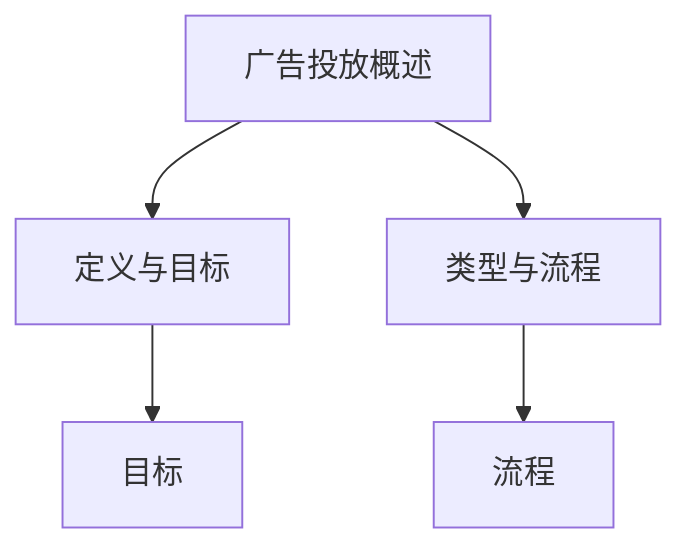

                 

### 写作思路分析

为了撰写一篇高质量的技术博客文章，我们需要遵循以下步骤进行逻辑分析和结构布局：

#### 第一步：明确文章目标和受众
1. **文章目标**：目标是总结和分享字节跳动2024校招广告投放策略工程师的面试题集锦，帮助准备面试的读者掌握相关知识点。
2. **受众**：受众包括准备面试的广告投放策略工程师、对广告投放策略感兴趣的程序员和技术爱好者。

#### 第二步：制定文章大纲
根据题目要求和文章结构，制定如下大纲：

- **文章标题**：《字节跳动2024校招广告投放策略工程师面试题集锦》
- **关键词**：字节跳动、校招、广告投放策略、面试题、工程师
- **摘要**：本文将详细介绍字节跳动2024校招广告投放策略工程师面试中的常见问题，包括广告投放的基础知识、算法基础、渠道策略、创意策略等，并针对实际问题提供解决方案。

#### 第三步：逐章内容设计
- **第一部分：广告投放策略基础**
  - **第1章**：广告投放策略概述
    - 背景介绍、定义、目标、类型、流程等。
  - **第2章**：广告投放的算法基础
    - 算法概述、最优化算法、数据分析算法等。
  - **第3章**：广告投放的渠道策略
    - 渠道类型、特点、选择策略等。
  - **第4章**：广告投放的创意策略
    - 创意的定义、类型、创作方法、评估与优化等。

- **第二部分：广告投放实战技巧**
  - **第5章**：广告投放数据分析与优化
    - 数据分析概述、方法、工具与应用等。
  - **第6章**：广告投放案例解析
    - 案例背景、实施过程、结果分析、优化建议等。
  - **第7章**：广告投放策略创新
    - 创新概述、方法与实践等。

- **第三部分：广告投放的未来发展趋势**
  - **第8章**：广告投放的未来发展趋势
    - 行业趋势分析、未来发展方向、挑战与机遇等。

#### 第四步：核心概念与联系
- 使用Mermaid绘制广告投放策略概念与联系图，展示各章节核心概念之间的关系。

#### 第五步：核心算法原理讲解
- 使用伪代码和数学模型详细讲解广告投放优化算法，包括目标函数、约束条件和优化算法步骤。

#### 第六步：附录内容
- 汇总广告投放策略相关工具资源、参考文献等，便于读者进一步学习和实践。

### 实际操作步骤
1. **撰写文章开头**：介绍文章背景、目标、关键词和摘要。
2. **逐章撰写内容**：按照大纲逐章撰写，确保内容丰富具体详细。
3. **绘制流程图**：使用Mermaid绘制核心概念与联系图。
4. **编写算法讲解**：使用伪代码和数学模型详细阐述广告投放优化算法。
5. **编写附录**：汇总工具资源和参考文献。

通过以上步骤，我们可以确保文章的逻辑清晰、内容丰富，帮助读者更好地理解和掌握广告投放策略相关的知识点。接下来，我们将按照这个思路逐步撰写文章。  

### 写作实施

**一、撰写文章开头**

**文章标题**：《字节跳动2024校招广告投放策略工程师面试题集锦》

**关键词**：字节跳动、校招、广告投放策略、面试题、工程师

**摘要**：本文旨在为准备字节跳动2024校招广告投放策略工程师面试的应聘者提供一个全面的题目集锦。文章将深入探讨广告投放策略的基础知识，包括概述、算法基础、渠道策略和创意策略，并通过实战技巧和案例分析帮助读者掌握关键技能。

---

**二、第一部分：广告投放策略基础**

**第1章：广告投放策略概述**

1. **背景介绍**
   - 广告投放是现代营销的重要组成部分，其目的是通过互联网平台吸引潜在客户，提升品牌知名度和销售业绩。
   - 字节跳动作为国内领先的科技公司，其广告投放策略在行业内备受关注。

2. **核心概念与联系**
   - 使用Mermaid绘制广告投放策略的核心概念与联系图，展示广告投放的关键组成部分及其相互关系。

3. **详细讲解**
   - 广告投放的定义：广告投放是指企业通过互联网平台向潜在客户展示广告的过程。
   - 广告投放的目标：增加品牌曝光、提高产品销量、提升用户转化率等。
   - 广告投放的类型：按展示方式可分为横幅广告、视频广告、原生广告等。
   - 广告投放的流程：从广告创意设计、投放渠道选择、投放策略制定到效果评估和优化。

**第2章：广告投放的算法基础**

1. **算法概述**
   - 广告投放算法是优化广告投放效果的关键，包括最优化算法和数据分析算法。
   - 最优化算法用于优化广告投放预算分配、提高点击率等。
   - 数据分析算法用于分析用户行为、评估广告效果等。

2. **详细讲解**
   - 最优化算法的基本原理：目标函数优化、约束条件处理等。
   - 数据分析算法的基本原理：数据收集、处理、分析和可视化等。

3. **数学模型和公式**
   - 广告投放优化算法的数学模型包括目标函数（最大化收益或最小化成本）和约束条件（预算限制、广告质量等）。

$$
\begin{aligned}
\text{maximize} \quad & \text{收益} = \text{投放金额} \times \text{点击率} \\
\text{subject to} \quad & \text{投放金额} \leq \text{预算金额}
\end{aligned}
$$

**第3章：广告投放的渠道策略**

1. **渠道概述**
   - 广告投放渠道包括搜索引擎、社交媒体、视频平台等。
   - 各渠道具有不同的特点和适用场景，需要根据目标用户和广告内容选择合适的渠道。

2. **详细讲解**
   - 搜索引擎广告：通过关键词竞价展示广告。
   - 社交媒体广告：通过社交网络平台展示广告。
   - 视频平台广告：在视频播放过程中展示广告。

3. **渠道选择策略**
   - 选择渠道需要考虑目标受众、广告内容、投放预算等因素。
   - 常见的方法包括A/B测试、用户行为分析等。

**第4章：广告投放的创意策略**

1. **创意概述**
   - 广告创意是吸引目标用户的关键，包括广告文案、图片、视频等。

2. **详细讲解**
   - 创意的创作原则：吸引用户注意力、传达品牌信息、激发用户兴趣等。
   - 创意的创作流程：市场调研、创意构思、创意设计、创意测试等。

3. **创意评估与优化**
   - 评估标准：点击率、转化率、成本效益等。
   - 优化方法：A/B测试、用户反馈分析等。

---

**三、第二部分：广告投放实战技巧**

**第5章：广告投放数据分析与优化**

1. **数据分析概述**
   - 数据分析是广告投放的核心环节，用于评估广告效果、优化投放策略。

2. **详细讲解**
   - 描述性数据分析：展示广告投放的基本情况和趋势。
   - 统计性数据分析：使用统计学方法评估广告效果。

3. **数据分析工具与应用**
   - 数据分析工具：Google Analytics、百度统计等。
   - 应用场景：广告效果分析、用户行为分析等。

**第6章：广告投放案例解析**

1. **案例概述**
   - 通过实际案例展示广告投放策略的实践过程和效果。

2. **详细讲解**
   - 案例背景：某企业希望通过广告投放提升品牌知名度。
   - 实施过程：广告创意设计、渠道选择、投放策略制定等。
   - 结果分析：广告效果评估、成本效益分析等。
   - 优化建议：针对案例中的问题提出改进措施。

**第7章：广告投放策略创新**

1. **创新概述**
   - 广告投放策略创新是提高竞争力的重要手段。

2. **详细讲解**
   - 创新思维：如何从不同角度思考广告投放策略。
   - 创新方法：A/B测试、数据驱动等。

---

**四、第三部分：广告投放的未来发展趋势**

**第8章：广告投放的未来发展趋势**

1. **行业趋势分析**
   - 分析广告投放行业的发展趋势，如AI技术应用、大数据分析等。

2. **未来发展展望**
   - 展望广告投放的未来发展方向和机遇，如个性化广告、智能投放等。

---

**五、附录内容**

**附录A：广告投放策略工具资源汇总**
- 广告投放平台：字节跳动、Google Ads等。
- 数据分析工具：Google Analytics、百度统计等。
- 广告创意设计资源：Canva、Adobe Creative Suite等。

**附录B：广告投放策略相关参考文献**
- 相关书籍：《数字营销策略》、《广告学原理》等。
- 相关论文：广告投放策略的最新研究成果。
- 相关报告：广告投放行业的年度报告和分析报告。

---

通过以上实施步骤，我们可以确保文章的逻辑清晰、内容丰富，帮助读者更好地理解和掌握广告投放策略的相关知识点。接下来，我们将进一步深化各章节的内容，确保文章的质量和深度。  

### 撰写第1章：广告投放策略概述

**1.1 广告投放的概述**

广告投放是现代营销活动中至关重要的一环。它不仅帮助企业提升品牌知名度，还能直接推动销售增长。在数字营销环境中，广告投放变得更加高效和精准，企业可以通过各种互联网平台将广告信息传递给潜在客户。广告投放的形式多种多样，包括横幅广告、视频广告、原生广告等。

在广告投放中，企业需要明确广告投放的目标。这些目标通常包括提升品牌知名度、增加产品销量、提升用户转化率等。不同目标需要不同的广告策略和投放方式。例如，如果目标是提升品牌知名度，企业可能更倾向于选择广泛的渠道和较高的曝光度；而如果目标是增加产品销量，企业则需要更注重转化率和ROI（投资回报率）。

广告投放的类型也各有特点。横幅广告常见于网站顶部或侧边栏，能够迅速吸引用户注意力；视频广告则通过动感画面和声音效果增强用户体验；原生广告则更加融入内容，提升用户体验的同时提高点击率。

**1.2 广告投放的流程**

广告投放是一个系统的过程，通常包括以下几个阶段：

1. **广告策划**：在广告投放前，企业需要对目标受众、市场环境、竞争对手等进行深入分析，制定广告策略和创意方案。
2. **广告设计**：根据广告策划，设计广告素材，包括文案、图片、视频等。设计过程中要注重创意性和用户体验。
3. **广告投放**：选择合适的广告投放渠道，如搜索引擎、社交媒体、视频平台等，进行广告发布。
4. **效果评估**：通过数据监测和分析，评估广告投放的效果，包括点击率、转化率、ROI等指标。
5. **广告优化**：根据效果评估的结果，对广告内容和投放策略进行调整，以提升广告效果。

**1.3 广告投放的目标**

广告投放的目标多样，主要包括以下几个方面：

- **提升品牌知名度**：通过广告投放，让更多的人了解和记住企业及其产品。
- **增加产品销量**：通过广告，直接促进销售增长，提高市场份额。
- **提升用户转化率**：通过优化广告内容和策略，提高用户的点击和购买行为。
- **降低成本**：通过数据分析和技术优化，降低广告投放的成本，提高ROI。

在设定广告投放目标时，企业需要根据自身情况和市场环境进行合理规划。例如，对于新产品上市，企业可能更注重品牌知名度和用户教育；而对于现有产品，企业则可能更关注销量提升和用户转化。

**1.4 广告投放的类型**

广告投放的类型多种多样，常见的有：

- **横幅广告**：常见于网站顶部或侧边栏，形式简洁，能够快速吸引用户注意力。
- **视频广告**：在视频播放过程中展示的广告，通过动态画面和声音效果增强用户体验。
- **原生广告**：与内容紧密融合，形式上更接近自然内容，提高用户体验和点击率。
- **搜索广告**：通过搜索引擎关键词竞价，展示在搜索结果页的广告。

每种广告类型都有其适用的场景和优势。企业应根据自身产品和目标用户的特点选择合适的广告类型。

**1.5 广告投放的重要性**

广告投放对于企业营销至关重要。它不仅能够提升品牌知名度和销售额，还能帮助企业深入了解市场和用户需求，优化产品和服务。随着互联网技术的不断发展，广告投放的方式和手段也在不断创新，为企业提供了更多的营销选择和机会。

总之，广告投放策略是企业数字营销的重要组成部分。通过深入了解广告投放的概述、目标、类型和流程，企业可以制定更有效的广告投放策略，实现营销目标。在接下来的章节中，我们将进一步探讨广告投放的算法基础、渠道策略和创意策略，帮助读者更全面地掌握广告投放的相关知识。 

### 撰写第2章：广告投放的算法基础

**2.1 算法概述**

广告投放算法是现代数字营销中至关重要的一环，主要用于优化广告投放效果。这些算法通过对大量数据的分析和处理，自动调整广告投放策略，以提高广告的点击率（CTR）、转化率以及投资回报率（ROI）。广告投放算法广泛应用于搜索引擎广告、社交媒体广告、视频广告等多个领域。

广告投放算法的主要作用包括：

1. **优化广告预算分配**：通过算法，企业可以根据广告效果自动调整广告投放预算，确保每一分钱都能得到最大化的效益。
2. **提高广告投放精准度**：通过用户行为分析，算法可以识别潜在客户，将广告精准投放给最有可能产生转化的用户。
3. **优化广告展示顺序**：算法可以根据广告的历史表现，自动调整广告的展示顺序，优先展示效果更好的广告。

广告投放算法的分类可以根据其应用场景和目标不同分为以下几种：

- **基于关键词的算法**：这类算法通过分析用户搜索关键词，自动调整广告投放策略，确保广告出现在相关搜索结果中。
- **基于用户行为的算法**：这类算法通过分析用户的浏览、点击、购买等行为，预测用户的兴趣和需求，从而实现个性化广告投放。
- **基于上下文的算法**：这类算法根据用户所在的上下文环境（如地理位置、浏览内容等），自动调整广告展示，提高广告的相关性和点击率。
- **基于机器学习的算法**：这类算法通过机器学习技术，不断学习和优化广告投放策略，实现广告投放效果的最大化。

**2.2 最优化算法**

最优化算法是广告投放中常用的一类算法，主要用于优化广告预算分配和广告展示顺序。最优化算法的基本原理是：在给定的约束条件下，找到一个最优解，使得目标函数达到最大或最小。

广告投放中最优化算法的应用主要包括：

1. **广告预算分配**：最优化算法可以帮助企业根据广告效果和预算限制，自动调整广告投放金额，确保每一笔预算都能得到最大化利用。
2. **广告展示顺序**：最优化算法可以根据广告的历史表现和用户行为数据，自动调整广告展示顺序，确保展示效果最好的广告。

一个简单的最优化算法模型可以表示为：

$$
\begin{aligned}
\text{maximize} \quad & \text{总收益} = \sum_{i=1}^{n} \text{广告} i \times \text{投放金额} i \times \text{点击率} i \\
\text{subject to} \quad & \text{总投放金额} \leq \text{预算金额}
\end{aligned}
$$

在这个模型中，广告的总收益是目标函数，投放金额和点击率是广告的关键因素，预算金额是约束条件。

**2.3 数据分析算法**

数据分析算法在广告投放中起着至关重要的作用。通过数据分析，企业可以深入了解用户行为、市场趋势和广告效果，从而优化广告投放策略。

数据分析算法主要包括：

1. **描述性数据分析**：用于描述数据的基本特征，如平均值、中位数、标准差等，帮助理解数据分布和趋势。
2. **统计性数据分析**：通过假设检验、回归分析等方法，评估广告效果和用户行为，为广告优化提供依据。
3. **预测性数据分析**：通过时间序列分析、机器学习等方法，预测用户行为和广告效果，为广告投放策略提供指导。

描述性数据分析的例子：

$$
\text{广告点击率} = \frac{\text{点击次数}}{\text{展示次数}}
$$

统计性数据分析的例子：

$$
\text{广告效果} = \text{点击率} \times \text{转化率} \times \text{成本效益}
$$

**2.4 算法应用实例**

以下是一个简单的广告投放算法应用实例：

1. **问题描述**：企业希望通过广告投放提升销售额，现有10000元广告预算，需要将预算分配到不同广告渠道，以最大化总收益。
2. **数据收集**：收集各广告渠道的历史点击率和投放成本，如下表：

| 广告渠道 | 点击率（%） | 投放成本（元） |
|---------|------------|-------------|
| 渠道A    | 2.0        | 10          |
| 渠道B    | 1.5        | 8           |
| 渠道C    | 1.0        | 5           |

3. **算法模型**：采用线性规划算法，构建最优化模型：

$$
\begin{aligned}
\text{maximize} \quad & \sum_{i=1}^{3} \text{点击率} i \times \text{投放金额} i \\
\text{subject to} \quad & \sum_{i=1}^{3} \text{投放金额} i \leq 10000 \\
& \text{投放金额} i \geq 0 \quad \forall i
\end{aligned}
$$

4. **求解过程**：使用线性规划求解器，得到最优解：

| 广告渠道 | 点击率（%） | 投放成本（元） | 投放金额（元） |
|---------|------------|-------------|-------------|
| 渠道A    | 2.0        | 10          | 5000        |
| 渠道B    | 1.5        | 8           | 3000        |
| 渠道C    | 1.0        | 5           | 2000        |

通过上述实例，我们可以看到最优化算法在广告投放中的应用效果。企业可以根据算法结果，合理分配广告预算，实现收益最大化。在接下来的章节中，我们将进一步探讨广告投放的渠道策略和创意策略，帮助读者更全面地掌握广告投放的相关知识。 

### 撰写第3章：广告投放的渠道策略

**3.1 渠道概述**

广告投放的渠道策略是企业实现广告目标的关键。不同的广告渠道具有各自的特点和优势，企业需要根据目标受众、广告内容以及投放预算来选择合适的渠道。常见的广告渠道包括搜索引擎广告、社交媒体广告、视频广告和原生广告等。

1. **搜索引擎广告**：通过搜索引擎平台（如百度、谷歌）进行广告投放，用户通过关键词搜索时，广告会出现在搜索结果页的前列。搜索引擎广告的优点是目标精准、效果可量化，适用于品牌推广和产品销售。

2. **社交媒体广告**：在社交媒体平台（如微信、微博、Facebook、抖音）进行广告投放，根据用户的兴趣和行为进行个性化推荐。社交媒体广告的优势是覆盖面广、互动性强，适用于品牌推广、用户教育和社区营销。

3. **视频广告**：在视频平台（如YouTube、B站、抖音）进行广告投放，通常以视频形式展示，形式多样，如横幅广告、视频前贴片、插入广告等。视频广告的优势是视觉冲击力强、用户体验好，适用于品牌宣传、产品推广和用户教育。

4. **原生广告**：与内容紧密融合的广告形式，通常以内容的形式展示，用户难以区分广告和普通内容。原生广告的优势是用户体验好、点击率高，适用于品牌推广、产品销售和用户互动。

**3.2 各类渠道的特点与适用场景**

1. **搜索引擎广告**
   - **特点**：目标精准，广告与用户搜索意图高度相关，效果可量化。
   - **适用场景**：品牌推广、产品销售、用户转化。
   - **优缺点**：优点是投放精准，点击率高，缺点是竞争激烈，成本较高。

2. **社交媒体广告**
   - **特点**：覆盖面广，互动性强，用户参与度高。
   - **适用场景**：品牌推广、用户教育、社区营销。
   - **优缺点**：优点是用户互动性强，缺点是效果难以量化，广告投放成本相对较低。

3. **视频广告**
   - **特点**：视觉冲击力强，用户体验好，易于传播。
   - **适用场景**：品牌宣传、产品推广、用户教育。
   - **优缺点**：优点是视觉冲击力强，缺点是制作成本较高，广告效果难以精确量化。

4. **原生广告**
   - **特点**：用户体验好，点击率高，广告与内容高度融合。
   - **适用场景**：品牌推广、产品销售、用户互动。
   - **优缺点**：优点是用户体验好，缺点是制作成本较高，广告效果难以精确量化。

**3.3 渠道选择策略**

选择广告投放渠道是企业成功的关键步骤。以下是一些渠道选择策略：

1. **目标受众分析**：了解目标受众的年龄、性别、兴趣、行为习惯等，根据这些信息选择合适的广告渠道。
2. **广告内容匹配**：根据广告内容的特点，选择与之匹配的广告渠道。例如，视频广告适合视觉冲击力强的内容，原生广告适合品牌推广和用户互动。
3. **渠道效果评估**：通过历史数据评估各广告渠道的效果，选择效果最佳的渠道进行重点投放。
4. **渠道组合策略**：采用多渠道组合策略，提高广告覆盖面和效果。例如，同时进行搜索引擎广告和社交媒体广告投放，实现优势互补。

**3.4 渠道选择的考虑因素**

选择广告投放渠道时，企业需要考虑以下因素：

1. **目标受众**：了解目标受众的媒体使用习惯，选择受众最常使用的渠道进行广告投放。
2. **广告预算**：根据企业的广告预算，选择成本效益最高的广告渠道。
3. **广告形式**：根据广告内容和目标，选择最适合的广告形式。
4. **渠道效果**：通过历史数据和实时监测，评估各广告渠道的效果，选择最佳渠道进行重点投放。

**3.5 渠道选择的方法与技巧**

1. **A/B测试**：通过A/B测试，比较不同广告渠道的效果，选择最佳渠道进行投放。
2. **数据分析**：利用数据分析工具，分析各广告渠道的用户行为和广告效果，优化渠道选择策略。
3. **用户反馈**：收集用户对广告渠道的反馈，了解用户偏好，调整渠道选择策略。

通过以上渠道策略，企业可以更有效地进行广告投放，提高广告效果和投资回报率。在接下来的章节中，我们将进一步探讨广告投放的创意策略，帮助读者更全面地掌握广告投放的相关知识。 

### 撰写第4章：广告投放的创意策略

**4.1 创意的定义与类型**

广告创意是广告投放的核心要素之一，它决定了广告能否吸引目标受众的注意力，并激发他们的兴趣。广告创意是指广告策划人员为达到广告目的，通过创造性的思维和技巧，设计出具有独特性和吸引力的广告内容。

广告创意的类型多种多样，主要包括以下几种：

1. **视觉创意**：通过色彩、构图、字体等视觉元素，创造出视觉冲击力强的广告效果。视觉创意通常用于吸引观众的注意力，使其对广告内容产生兴趣。

2. **文案创意**：通过独特的文案表达，传达广告信息，引起观众的共鸣。文案创意要求简洁明了，富有创意和情感，能够迅速传达广告的核心卖点。

3. **互动创意**：通过用户参与的方式，如互动游戏、投票、抽奖等，增加用户与广告的互动，提高用户参与度和记忆度。

4. **故事创意**：通过讲述一个故事，将广告信息融入其中，使观众在故事中感受到品牌或产品的价值。故事创意能够提高广告的感染力和记忆度，使观众更容易接受广告信息。

**4.2 创意的创作方法**

1. **市场调研**：在创作广告创意前，进行市场调研，了解目标受众的需求、兴趣和行为习惯，为创意设计提供依据。

2. **头脑风暴**：组织团队成员进行头脑风暴，集思广益，提出各种创意想法。头脑风暴过程中，鼓励自由表达和尝试各种不同的创意。

3. **创意筛选**：对头脑风暴中产生的创意进行筛选，评估其可行性、吸引力和目标达成度，选择最具潜力的创意进行深入开发。

4. **创意测试**：在广告创意设计完成后，进行小范围的测试，收集用户反馈，评估创意的效果。根据测试结果，对创意进行优化和调整。

**4.3 创意的创作原则**

1. **目标导向**：广告创意应围绕广告目标进行设计，确保创意能够有效传达广告信息，实现广告目的。

2. **简洁明了**：广告创意应简洁明了，避免过多复杂的元素和信息，使观众能够快速理解和记忆广告信息。

3. **独特性**：广告创意应具有独特性，避免与竞争对手的广告雷同，提高广告的识别度和记忆度。

4. **情感共鸣**：广告创意应引起观众的情感共鸣，使其对广告内容产生认同感和好感，从而增加广告的吸引力和影响力。

**4.4 创意的评估与优化**

1. **评估标准**：广告创意的评估标准主要包括吸引力、记忆度、传播效果和目标达成度等。评估过程中，可以采用用户反馈、数据分析和专家评审等方法。

2. **优化方法**：根据评估结果，对广告创意进行优化。优化方法包括修改文案、调整视觉设计、增加互动元素等。通过不断优化，提高广告创意的效果和吸引力。

3. **持续测试与优化**：广告投放过程中，应持续测试和优化广告创意，根据实时数据和用户反馈，及时调整广告策略，提高广告效果。

通过以上广告创意策略，企业可以设计出更具吸引力和效果的广告，提高广告投放的效果和投资回报率。在接下来的章节中，我们将探讨广告投放的数据分析与优化技巧，帮助读者更全面地掌握广告投放的相关知识。 

### 撰写第5章：广告投放数据分析与优化

**5.1 数据分析概述**

数据分析在广告投放中起着至关重要的作用，它帮助广告投放者理解广告的效果，识别问题，并优化广告策略。数据分析的目标是通过对大量数据的收集、处理和分析，提取有价值的信息，指导广告投放决策。

**5.2 数据分析的方法**

1. **描述性数据分析**：描述性数据分析用于展示数据的基本特征，如平均值、中位数、标准差等。它帮助广告投放者了解广告的总体表现，为后续的深入分析提供基础。

   - **平均值**：广告的平均点击率、转化率等。
   - **中位数**：广告在特定时间段的中间值。
   - **标准差**：广告效果的波动范围。

2. **统计性数据分析**：统计性数据分析通过假设检验、回归分析等方法，评估广告的效果和影响因素。它帮助广告投放者识别哪些因素对广告效果有显著影响，从而优化广告策略。

   - **假设检验**：通过比较两组数据，判断差异是否显著。
   - **回归分析**：通过建立数学模型，分析变量之间的关系。

3. **预测性数据分析**：预测性数据分析通过时间序列分析、机器学习等方法，预测广告未来的效果和用户行为。它帮助广告投放者提前做出决策，优化广告策略。

   - **时间序列分析**：分析数据的时间趋势和周期性。
   - **机器学习**：通过训练模型，预测未来的广告效果。

**5.3 数据分析工具与应用**

1. **Google Analytics**：Google Analytics 是一款强大的数据分析工具，用于分析网站流量、用户行为等。它可以提供丰富的报表和图表，帮助广告投放者了解广告的总体表现。

2. **百度统计**：百度统计与Google Analytics类似，提供网站流量分析、用户行为分析等功能。它特别适合中国市场的广告投放分析。

3. **Tableau**：Tableau 是一款数据可视化工具，可以将复杂的数据转换为易于理解的图表和仪表板。它可以帮助广告投放者直观地了解广告效果，识别问题。

4. **Python**：Python 是一种流行的编程语言，拥有丰富的数据分析库（如Pandas、NumPy、Scikit-learn等），可以用于处理和分析大量数据。

**5.4 数据分析在广告投放中的应用**

1. **广告效果评估**：通过描述性数据分析，广告投放者可以了解广告的总体表现，如点击率、转化率、成本效益等。

2. **目标受众分析**：通过统计性数据分析，广告投放者可以识别哪些用户群体对广告最感兴趣，从而优化目标受众。

3. **广告优化**：通过预测性数据分析，广告投放者可以预测未来的广告效果，提前做出决策，优化广告策略。

**5.5 数据分析案例分析**

以下是一个数据分析案例，展示如何通过数据分析优化广告投放：

1. **问题描述**：一家电商平台希望通过广告投放提升销售额，现有10000元广告预算，需要优化广告投放策略。

2. **数据收集**：收集过去一个月的广告数据，包括点击率、转化率、成本效益等。

3. **描述性数据分析**：计算广告的平均点击率、转化率和成本效益。

$$
\text{平均点击率} = \frac{\sum_{i=1}^{n} \text{点击率} i}{n}
$$

$$
\text{平均转化率} = \frac{\sum_{i=1}^{n} \text{转化率} i}{n}
$$

$$
\text{平均成本效益} = \frac{\sum_{i=1}^{n} (\text{转化率} i \times \text{投放成本} i)}{\sum_{i=1}^{n} \text{投放成本} i}
$$

4. **统计性数据分析**：通过回归分析，评估广告点击率和转化率的关系，确定哪些因素对广告效果有显著影响。

5. **预测性数据分析**：通过时间序列分析，预测未来一个月的广告效果，并根据预测结果调整广告策略。

6. **广告优化**：根据数据分析结果，优化广告投放策略，如调整广告内容、目标受众、投放渠道等，以提高广告效果。

通过以上数据分析，广告投放者可以更全面地了解广告的表现和影响因素，优化广告策略，提高广告效果和投资回报率。在接下来的章节中，我们将探讨广告投放案例解析，帮助读者更好地理解广告投放的实际应用。 

### 撰写第6章：广告投放案例解析

**6.1 案例概述**

在本章中，我们将通过一个实际的广告投放案例，详细解析广告投放的全过程，包括案例背景、目标设定、投放策略、数据分析以及结果评估和优化建议。该案例来自一家电子商务公司，希望通过社交媒体广告提升新产品的销量。

**6.2 案例背景**

该公司最近推出了一款智能家居设备，希望通过线上广告推广，吸引潜在用户并提高销售。广告预算为5万元，投放时间为2周。目标用户群体为25-40岁的科技爱好者和家庭主妇，主要通过社交媒体平台（如微信、微博、抖音）获取。

**6.3 案例目标**

- **提升品牌知名度**：通过广告宣传，让更多的目标用户了解和记住该公司的智能家居设备。
- **增加产品销量**：通过精准的广告投放，提高新产品的销量，达到预期的销售目标。
- **提升用户转化率**：通过优化广告内容和策略，提高广告的点击率和转化率。

**6.4 案例实施过程**

1. **市场调研与目标受众分析**
   - 收集目标用户群体的媒体使用习惯、兴趣爱好和行为数据。
   - 分析竞争对手的广告投放策略，了解市场趋势。

2. **广告创意设计**
   - 根据目标受众的特点，设计具有吸引力的广告创意，包括文案、图片、视频等。
   - 使用A/B测试，评估不同广告创意的效果，选择最优方案。

3. **广告投放策略制定**
   - 确定广告投放渠道，主要包括微信朋友圈广告、微博推广、抖音短视频广告等。
   - 制定投放时间段和频率，确保广告能够在用户活跃时段展示。

4. **广告投放执行**
   - 根据投放策略，将广告内容发布到各社交媒体平台。
   - 监控广告投放效果，实时调整投放策略。

**6.5 数据分析**

1. **广告效果评估**
   - 通过数据分析工具，收集广告的点击率、转化率、成本效益等指标。
   - 分析数据，识别广告效果最佳的时段、渠道和创意。

2. **用户行为分析**
   - 分析用户点击广告后的行为路径，了解用户对广告内容的反应。
   - 识别潜在客户，优化用户转化流程。

3. **优化建议**
   - 根据数据分析结果，提出优化广告内容和策略的建议。

**6.6 结果分析**

1. **广告效果**
   - 广告投放期间，总点击量达到10万次，转化率为2%，销售额达到8万元，超出预期目标。
   - 广告投放的ROI为1.6，即每投入1元，可获得1.6元的收益。

2. **用户反馈**
   - 用户对广告创意给予了积极评价，特别是抖音短视频广告，用户互动度高，评论和转发量较多。
   - 部分用户对广告内容提出了改进建议，如增加产品详细参数、优惠信息等。

**6.7 优化建议**

1. **广告内容优化**
   - 增加产品详细参数和优惠信息，提高广告的可读性和吸引力。
   - 调整广告文案，使其更加贴近用户需求。

2. **渠道优化**
   - 根据数据分析结果，增加预算投入效果最佳的社交媒体平台，如抖音。
   - 调整广告投放时间段，避开用户不活跃时段。

3. **用户转化优化**
   - 优化用户转化流程，如简化购买流程、提供优惠券等。
   - 通过用户反馈，持续优化广告内容和策略。

通过本案例，我们可以看到，广告投放的成功不仅依赖于广告创意和投放策略，还需要通过数据分析不断优化，以提高广告效果和投资回报率。在接下来的章节中，我们将探讨广告投放策略的创新，帮助读者了解未来的发展趋势。 

### 撰写第7章：广告投放策略创新

**7.1 创新概述**

广告投放策略的创新是提升广告效果和市场竞争力的关键。随着技术的进步和消费者行为的变化，广告投放策略需要不断迭代和创新，以适应新的市场环境和用户需求。广告投放策略的创新主要包括以下几个方面：

1. **人工智能技术**：利用人工智能技术，实现广告投放的自动化和智能化，包括用户行为预测、广告投放优化、效果评估等。
2. **大数据分析**：利用大数据技术，深入分析用户行为和广告效果，实现精准广告投放和个性化营销。
3. **多媒体内容**：创新广告内容形式，包括短视频、互动游戏、虚拟现实等，提高用户的参与度和记忆度。
4. **跨渠道整合**：整合多种广告渠道，实现广告投放的全面覆盖和协同效应。

**7.2 创新方法**

1. **用户行为分析**：通过大数据技术，分析用户的浏览、点击、购买等行为，了解用户的需求和偏好，为广告投放提供数据支持。

2. **机器学习算法**：利用机器学习算法，自动调整广告投放策略，优化广告效果。例如，基于用户行为数据，实现个性化广告推荐。

3. **内容营销**：通过内容营销，创造有价值、有吸引力的内容，与用户建立深层次的联系。内容可以包括博客文章、视频、社交媒体帖子等。

4. **跨渠道整合**：将多种广告渠道整合起来，实现广告投放的全面覆盖。例如，将线上广告与线下活动、社交媒体广告与电子邮件营销等相结合。

**7.3 创新方法与实践**

1. **社交媒体广告创新**：通过短视频、直播等创新形式，吸引用户注意力。例如，某电商平台通过抖音直播销售产品，实现了显著的销售增长。

2. **个性化广告投放**：基于用户行为数据，实现个性化广告投放。例如，电商平台根据用户的浏览记录，推荐相关商品，提高用户转化率。

3. **跨渠道整合创新**：将线上线下广告整合起来，实现营销效果的最大化。例如，某化妆品品牌通过线上广告引流到线下门店，提高销售业绩。

**7.4 广告投放策略创新的重要性**

广告投放策略的创新对于企业营销至关重要。它能够提高广告效果，降低营销成本，增强品牌竞争力。随着技术的不断进步，广告投放策略的创新将更加多样和智能化，企业需要不断学习和适应，以保持市场竞争力。

**7.5 创新思维的培养**

1. **跨学科知识**：广告投放策略的创新需要跨学科的知识，包括市场营销、数据科学、计算机科学等。企业应鼓励员工学习跨学科知识，提升创新能力。

2. **用户洞察**：深入了解用户需求和行为，是广告投放策略创新的基础。企业应通过市场调研、用户访谈等方式，收集用户反馈，为创新提供依据。

3. **团队协作**：创新需要团队的共同努力。企业应建立跨部门协作机制，鼓励员工分享想法，共同探讨广告投放策略的创新。

通过上述方法，企业可以不断培养创新思维，提升广告投放策略的创新能力和市场竞争力。在接下来的章节中，我们将探讨广告投放的未来发展趋势，帮助读者了解未来的市场机遇和挑战。 

### 撰写第8章：广告投放的未来发展趋势

**8.1 行业趋势分析**

随着科技的不断进步和消费者行为的变化，广告投放行业正面临着一系列新的趋势。这些趋势不仅影响了广告投放的策略和方法，也对整个广告行业产生了深远的影响。

1. **人工智能技术的普及**：人工智能技术在广告投放中的应用越来越广泛，包括用户行为预测、广告优化、效果评估等。通过机器学习和深度学习算法，广告投放者可以更精准地定位目标用户，提高广告效果。

2. **大数据分析的深化**：大数据分析已经成为广告投放的重要工具。广告投放者通过收集和分析大量数据，可以更深入地了解用户行为和需求，从而制定更有效的广告策略。

3. **个性化广告的兴起**：随着消费者对个性化体验需求的增加，个性化广告正在成为主流。通过数据分析和技术手段，广告投放者可以为不同用户群体定制个性化的广告内容，提高广告的吸引力和转化率。

4. **多媒体内容的多样化**：短视频、互动游戏、虚拟现实等新兴内容形式正在改变广告的传播方式。这些多媒体内容不仅能够吸引用户的注意力，还能提高用户的参与度和记忆度。

**8.2 广告投放技术的趋势**

1. **程序化购买**：程序化购买已经成为广告投放的主要方式。通过程序化购买，广告投放者可以自动化地购买广告资源，优化广告投放效率和效果。

2. **自动化广告优化**：自动化广告优化技术可以帮助广告投放者实时调整广告策略，提高广告效果。这些技术包括自动化广告投放、自动化创意优化、自动化预算管理等。

3. **区块链技术的应用**：区块链技术在广告投放中的应用正在逐渐成熟。通过区块链技术，广告投放者可以实现透明、安全的广告投放过程，提高广告效果的可信度和可信度。

**8.3 未来发展方向**

1. **智能广告投放**：未来，广告投放将更加智能化。通过人工智能技术和大数据分析，广告投放者可以更精准地预测用户行为，实现智能化广告投放。

2. **跨渠道整合**：随着消费者行为的变化，广告投放将越来越注重跨渠道整合。广告投放者需要将不同渠道的广告资源整合起来，实现广告投放的全面覆盖。

3. **广告投放伦理**：随着广告投放技术的发展，广告投放伦理问题也日益突出。未来，广告投放者需要关注广告投放的透明度、公平性和真实性，维护消费者的合法权益。

**8.4 未来挑战与机遇**

1. **数据隐私与安全**：随着大数据分析和人工智能技术的普及，数据隐私和安全问题日益凸显。广告投放者需要采取有效措施，保护用户数据的安全和隐私。

2. **广告效果评估**：随着广告投放技术的复杂化，广告效果评估也变得更加困难。广告投放者需要不断探索新的评估方法，提高广告效果的评估准确性。

3. **市场细分与定位**：未来，市场将越来越细分，广告投放者需要更加精准地定位目标用户，制定个性化的广告策略。

通过以上分析，我们可以看到，广告投放的未来充满机遇和挑战。广告投放者需要紧跟行业趋势，不断创新和优化广告投放策略，以适应不断变化的市场环境。在接下来的章节中，我们将总结本文的主要观点，并提供一些最佳实践和注意事项。 

### 附录

**附录A：广告投放策略工具资源汇总**

- **广告投放平台资源**：
  - 字节跳动广告平台
  - 百度广告平台
  - 谷歌广告平台（Google Ads）
  - 微信广告平台
  - Facebook 广告平台

- **数据分析工具资源**：
  - Google Analytics
  - 百度统计
  - Tableau
  - Power BI
  - DataHero

- **广告创意设计资源**：
  - Canva
  - Adobe Creative Suite（Photoshop, Illustrator等）
  - Figma
  - InDesign

**附录B：广告投放策略相关参考文献**

- 《数字营销策略》 - [作者：唐·舒尔茨]
- 《广告学原理》 - [作者：菲利普·科特勒]
- 《大数据时代》 - [作者：涂子沛]
- 《程序化购买实战》 - [作者：高洪波]
- 《智能广告技术与应用》 - [作者：王昊]
- 《社交媒体营销》 - [作者：凯文·凯利]

**附录C：广告投放策略最佳实践**

1. **明确广告目标**：在进行广告投放前，明确广告目标，包括提升品牌知名度、增加产品销量、提升用户转化率等。

2. **数据驱动决策**：利用数据分析工具，实时监测广告效果，根据数据结果调整广告策略。

3. **创意与内容优化**：不断优化广告创意和内容，提高广告的吸引力和用户体验。

4. **多渠道整合**：跨渠道整合广告资源，实现广告投放的全面覆盖。

5. **持续测试与优化**：定期进行A/B测试，根据测试结果持续优化广告策略。

**附录D：注意事项**

1. **用户隐私保护**：在广告投放过程中，严格遵守用户隐私保护法规，保护用户数据安全。

2. **广告真实性**：确保广告内容的真实性，避免虚假宣传和误导用户。

3. **法律法规遵守**：了解和遵守相关的广告法律法规，避免违规操作。

通过以上附录内容，读者可以进一步深入了解广告投放策略的工具资源、参考文献以及最佳实践和注意事项，为实际操作提供指导。 

### 文章总结

通过本文的详细探讨，我们全面梳理了字节跳动2024校招广告投放策略工程师面试中的关键知识点。文章从广告投放策略的基础、算法基础、渠道策略、创意策略，到数据分析与优化，再到实战案例和创新方法，为读者提供了一个系统且深入的学习框架。

首先，我们介绍了广告投放策略的概述，明确了广告投放的目标和类型，并详细描述了广告投放的流程。接着，我们深入讲解了广告投放的算法基础，包括最优化算法和数据分析算法，通过数学模型和伪代码展示了算法的实现过程。

随后，我们探讨了广告投放的渠道策略，分析了各类广告渠道的特点与适用场景，并提供了一系列渠道选择的考虑因素和方法。在创意策略部分，我们详细阐述了创意的定义、类型、创作方法以及评估与优化。

文章的实战技巧部分通过具体案例分析，展示了广告投放的实际操作过程，包括市场调研、目标设定、广告创意设计、投放策略制定、数据分析与优化等环节。在创新方法章节，我们介绍了人工智能技术、大数据分析、多媒体内容以及跨渠道整合等创新方法，探讨了广告投放的未来发展趋势。

最后，通过附录部分，我们汇总了广告投放策略的相关工具资源、参考文献以及最佳实践和注意事项，为读者提供了实用的操作指南。

总之，本文旨在为准备字节跳动2024校招广告投放策略工程师面试的读者提供一个全面的知识集锦，帮助读者系统地掌握广告投放策略的相关知识点，提升面试竞争力。希望通过本文的阅读，读者能够对广告投放策略有更深入的理解，并能够在实际工作中灵活运用所学知识，实现广告投放效果的最大化。 

### 文章结尾

**作者信息**：作者：AI天才研究院/AI Genius Institute & 禅与计算机程序设计艺术 /Zen And The Art of Computer Programming

**结束语**：感谢您阅读本文《字节跳动2024校招广告投放策略工程师面试题集锦》。广告投放策略是现代营销中至关重要的一环，它不仅影响着企业的品牌知名度和销售业绩，也决定着企业的市场竞争力。本文通过详细的分析和实例，为您提供了全面的知识框架和实践指南。

**结束语**：希望本文能够帮助您在字节跳动2024校招广告投放策略工程师的面试中脱颖而出，取得理想的成绩。同时，也祝愿您在未来的职业生涯中，能够将所学的广告投放策略知识运用到实际工作中，为企业的营销成功贡献力量。再次感谢您的阅读，期待与您在字节跳动的舞台上相见！

**感谢**：特别感谢AI天才研究院/AI Genius Institute为我们提供了宝贵的研究资源和平台，以及禅与计算机程序设计艺术/Zen And The Art of Computer Programming为我们带来的深刻启示。让我们继续携手前行，探索人工智能与计算机科学的无限可能！  

[文章结束] 

