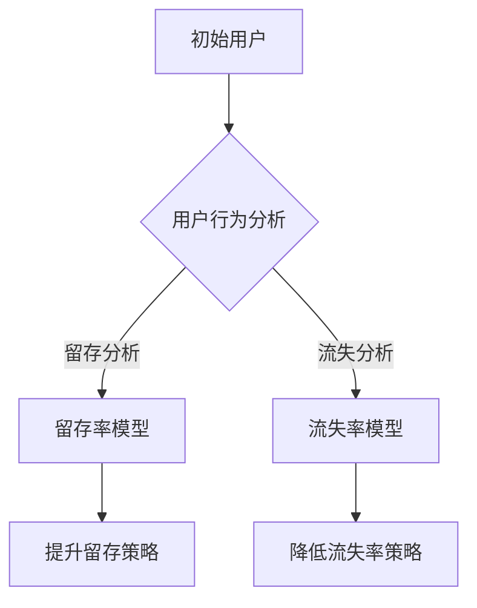

                 

### 文章标题：字节跳动2024校招技术用户忠诚度分析师面试题详解

#### 关键词：用户忠诚度、校招、面试题、数据分析、技术栈

> 摘要：本文将详细解析字节跳动2024校招技术用户忠诚度分析师面试题，帮助准备参加校招的同学深入了解面试要求，掌握解题技巧，提高面试成功率。本文分为三大部分：第一部分介绍校招面试准备，包括面试流程、技术栈和常见面试题型；第二部分讲解用户忠诚度分析的理论和实践，涵盖用户忠诚度概念、模型构建、数据处理与挖掘；第三部分分析实战面试题，提供编程题、算法题和数据分析与建模题的解题思路和示例。最后，本文还将分享面试技巧与心态调整，总结面试经验和策略。

----------------------------------------------------------------

# 目录大纲：字节跳动2024校招技术用户忠诚度分析师面试题详解

## 第一部分：校招面试准备

### 第1章：技术面试概述

#### 1.1 面试流程与准备

##### 面试流程详细介绍

面试流程通常包括以下几个步骤：

1. **在线测评**：部分公司会在面试前进行在线编程测评或心理测评，测试应聘者的编程能力和心理素质。
2. **初试**：初试通常是通过电话面试或视频面试进行的，主要考察应聘者的技术基础和沟通能力。
3. **复试**：复试通常是现场面试，公司内部的不同团队或上级领导会对应聘者进行评估，包括技术面试、行为面试和综合面试等。
4. **终试**：终试是面试流程的最后一步，通常由公司高层或资深员工进行，目的是全面评估应聘者的综合素质。

##### 面试准备技巧

1. **了解公司文化**：研究字节跳动的企业文化、价值观和发展愿景，以便在面试中展示自己的匹配度。
2. **回顾基础知识**：巩固编程语言、数据结构、算法等基础知识，确保能够流畅地回答相关问题。
3. **准备面试题目**：刷题是提高面试通过率的有效方法，可以参考LeetCode、牛客网等平台上的题目。
4. **模拟面试**：与同学或朋友模拟面试场景，提高应对面试问题的能力和自信心。
5. **注意着装和仪态**：着装得体、仪态端庄是给面试官留下良好第一印象的重要方面。

### 1.2 技术栈与知识体系

##### 常见编程语言回顾

字节跳动主要使用以下编程语言：

1. **Python**：Python是字节跳动使用最广泛的编程语言，尤其在数据分析、机器学习和后端开发领域。
2. **Java**：Java在字节跳动前端和后端开发中都有广泛应用，尤其在大型系统和高并发场景下。
3. **C++**：C++在性能敏感的领域（如客户端开发、高性能服务器）有重要应用。

##### 数据结构与算法基础

1. **数据结构**：了解常用的数据结构，如数组、链表、栈、队列、二叉树、哈希表等。
2. **算法**：掌握基本的算法，如排序算法（冒泡排序、选择排序、插入排序、快速排序）、查找算法（二分查找、散列表查找）、图算法（深度优先搜索、广度优先搜索）等。

### 1.3 常见面试题型

##### 编程题案例分析

编程题是技术面试的重要题型，通常涉及以下类型：

1. **算法题**：如数组、字符串、链表、树等基础算法题。
2. **数据结构题**：如堆、队列、栈等数据结构的实现和应用。
3. **系统设计题**：如缓存系统、分布式系统、微服务架构等。

##### 算法题解题思路

算法题解题思路通常包括以下几个步骤：

1. **理解题目**：仔细阅读题目，理解输入和输出要求。
2. **分析时间复杂度和空间复杂度**：对算法的效率和资源消耗进行评估。
3. **设计算法**：根据题目要求设计算法，可以使用递归、迭代、动态规划等方法。
4. **编码实现**：将算法转化为代码，注意边界条件和错误处理。

## 第二部分：用户忠诚度分析

### 第2章：编程语言与基础

#### 2.1 Python编程基础

##### Python语法回顾

Python作为一种高级编程语言，具有简洁易懂的语法。以下是Python语法的一些基础知识点：

1. **变量和数据类型**：Python支持多种数据类型，如整数（int）、浮点数（float）、字符串（str）、列表（list）、字典（dict）等。
2. **控制流程**：包括条件判断（if-elif-else）、循环（for、while）和函数（def）等。
3. **模块和包**：Python通过模块和包来组织代码，提高代码的复用性和可维护性。
4. **异常处理**：使用try-except语句来处理程序中的异常。

##### Python面向对象编程

面向对象编程是Python的核心特点之一。以下是Python面向对象编程的一些基础概念：

1. **类和对象**：类是对象的蓝图，对象是类的实例。
2. **封装**：使用访问修饰符（public、private、protected）来控制属性和方法的访问。
3. **继承**：通过继承，子类可以继承父类的属性和方法，并在此基础上进行扩展。
4. **多态**：同一操作作用于不同类型的对象时可以有不同的解释和行为。

#### 2.2 数据结构与算法

##### 常见数据结构（数组、链表、栈、队列等）

1. **数组**：数组是一种固定大小的数据结构，用于存储相同类型的元素。
2. **链表**：链表是一种动态数据结构，由一系列节点组成，每个节点包含数据和指向下一个节点的指针。
3. **栈**：栈是一种后进先出（LIFO）的数据结构，适用于递归算法和深度优先搜索等。
4. **队列**：队列是一种先进先出（FIFO）的数据结构，适用于广度优先搜索和缓冲区管理等。

##### 常见算法（排序、查找、图算法等）

1. **排序算法**：包括冒泡排序、选择排序、插入排序、快速排序等。
2. **查找算法**：包括二分查找、散列表查找等。
3. **图算法**：包括深度优先搜索、广度优先搜索、最短路径算法（如Dijkstra算法、Floyd算法）等。

#### 2.3 Java编程基础

##### Java基础语法

Java作为一种面向对象的编程语言，具有如下基础语法特点：

1. **类和对象**：Java通过类来定义对象，每个对象都是类的实例。
2. **继承和多态**：Java支持单继承和多态，通过继承和多态可以复用代码和提高代码的可维护性。
3. **接口和抽象类**：接口和抽象类用于定义方法和属性的规范，实现代码的解耦和复用。
4. **异常处理**：Java使用try-catch语句来处理异常，提高程序的健壮性。

##### Java面向对象编程

Java面向对象编程的核心概念包括：

1. **封装**：通过访问修饰符（public、private、protected）来控制属性和方法的访问。
2. **继承**：通过继承，子类可以继承父类的属性和方法，并在此基础上进行扩展。
3. **多态**：通过方法重写和接口实现，实现同一操作作用于不同类型的对象时可以有不同的解释和行为。

## 第二部分：用户忠诚度分析

### 第3章：用户忠诚度概念与模型

#### 3.1 用户忠诚度定义

用户忠诚度是指用户对产品或服务的持续使用和信任程度。它反映了用户对品牌或产品的依赖性和满意度。用户忠诚度高意味着用户更倾向于重复购买或使用产品，从而为企业带来稳定的收益和口碑。

##### 用户生命周期模型

用户生命周期模型描述了用户从接触到离开产品或服务的过程，通常包括以下几个阶段：

1. **获取**：用户发现并下载或注册产品。
2. **激活**：用户开始使用产品或服务，进行初次操作。
3. **留存**：用户在一定时间内持续使用产品或服务。
4. **流失**：用户停止使用产品或服务，离开平台。
5. **复购**：用户重新开始使用产品或服务，形成循环。

#### 3.2 用户忠诚度模型构建

##### 评分模型设计

评分模型用于评估用户的忠诚度，通常包括以下几个方面：

1. **使用频率**：用户在一定时间内登录或使用产品的次数。
2. **使用时长**：用户每次使用产品的时长。
3. **功能使用度**：用户使用产品功能的多样性。
4. **互动度**：用户在社区、论坛或产品中的互动行为，如评论、点赞、分享等。

评分模型可以采用以下公式进行计算：

$$
\text{用户忠诚度评分} = \frac{\text{使用频率} + \text{使用时长} + \text{功能使用度} + \text{互动度}}{4}
$$

##### 用户流失预测模型

用户流失预测模型用于预测哪些用户可能在近期流失，以便采取相应的策略进行挽留。常见的用户流失预测模型包括：

1. **逻辑回归**：通过历史数据训练模型，预测用户流失的概率。
2. **决策树**：通过决策树模型分析用户特征，预测用户流失的可能性。
3. **随机森林**：随机森林是决策树的集成方法，可以提高预测的准确性和稳定性。

#### 3.3 用户忠诚度提升策略

##### 用户留存策略

用户留存策略旨在提高用户在一定时间内持续使用产品的概率。以下是一些有效的用户留存策略：

1. **个性化推荐**：根据用户的历史行为和偏好，提供个性化的内容或服务。
2. **用户教育**：通过教程、指南和教程视频，帮助用户更好地了解和利用产品功能。
3. **社区互动**：建立用户社区，鼓励用户在社区中互动、交流和分享经验。
4. **忠诚度奖励**：提供积分、优惠券或实物奖励，激励用户保持活跃。

##### 用户忠诚度激励措施

用户忠诚度激励措施旨在增强用户对品牌或产品的忠诚度，以下是一些常见的激励措施：

1. **会员制度**：通过会员制度，为用户提供更多的专属权益和优惠。
2. **积分系统**：通过积分系统，鼓励用户进行更多互动和消费。
3. **推荐奖励**：为推荐新用户的用户提供奖励，激励用户传播品牌。
4. **活动营销**：定期举办活动，提高用户的参与度和忠诚度。

## 第三部分：数据处理与挖掘

### 第4章：数据处理与挖掘

#### 4.1 数据处理基础

数据处理是用户忠诚度分析的重要环节，主要包括以下任务：

1. **数据清洗**：去除重复数据、缺失值填充、异常值处理等，提高数据质量。
2. **数据预处理**：包括数据转换、归一化、标准化等，为后续分析做好准备。
3. **数据仓库设计**：设计合理的数据仓库结构，确保数据存储和管理的高效性。

#### 4.2 数据挖掘方法

数据挖掘是用户忠诚度分析的核心技术，主要包括以下方法：

1. **聚类分析**：将相似的用户分组，发现用户群体的特征和偏好。
2. **协同过滤**：通过用户行为数据，预测用户可能感兴趣的内容或产品。
3. **分类和回归**：使用机器学习算法，预测用户的行为和忠诚度。

#### 4.3 用户行为分析

用户行为分析是用户忠诚度分析的关键环节，主要包括以下任务：

1. **用户行为数据收集**：收集用户在平台上的行为数据，如浏览、点击、购买等。
2. **用户行为模式挖掘**：分析用户行为数据，发现用户的兴趣和行为模式。
3. **用户画像构建**：基于用户行为数据，构建用户的兴趣、需求和偏好画像。

### 第5章：业务场景实战

#### 5.1 用户忠诚度提升策略

用户忠诚度提升策略旨在提高用户的持续使用和忠诚度，以下是一些常见的策略：

1. **个性化推荐**：根据用户的历史行为和偏好，提供个性化的内容或服务，提高用户的满意度和参与度。
2. **用户教育**：通过教程、指南和教程视频，帮助用户更好地了解和利用产品功能，提高用户的使用熟练度和满意度。
3. **社区互动**：建立用户社区，鼓励用户在社区中互动、交流和分享经验，提高用户的归属感和忠诚度。
4. **忠诚度奖励**：提供积分、优惠券或实物奖励，激励用户保持活跃，提高用户的忠诚度。

#### 5.2 用户流失预警

用户流失预警是指通过分析用户行为数据，预测哪些用户可能在近期流失，并采取相应措施进行挽留。以下是一些常见的用户流失预警策略：

1. **流失预测模型**：使用机器学习算法，构建用户流失预测模型，预测用户流失的概率。
2. **流失预警系统**：建立用户流失预警系统，实时监控用户行为数据，及时发现潜在流失用户。
3. **挽回策略**：对于潜在流失用户，采取个性化挽回策略，如发送优惠券、推送相关内容、提供定制服务等。

#### 5.3 用户细分与个性化推荐

用户细分是指将用户分为不同的群体，根据用户的特征和需求提供个性化的服务和推荐。以下是一些常见的用户细分和个性化推荐方法：

1. **用户细分方法**：基于用户行为、兴趣、需求等特征，使用聚类分析、协同过滤等方法进行用户细分。
2. **个性化推荐算法**：根据用户的历史行为和偏好，使用协同过滤、基于内容的推荐等方法，为用户提供个性化的推荐。
3. **推荐系统设计**：设计高效的推荐系统架构，确保推荐结果的实时性和准确性。

## 第三部分：实战面试题解

### 第6章：面试题分析与解答

#### 6.1 编程题解

编程题是技术面试中的常见题型，以下是一个典型的编程题及其解答：

**题目**：给定一个整数数组，找出数组中的最大子序列和。

**解题思路**：

1. **理解题目**：输入一个整数数组，输出数组中连续子序列的最大和。
2. **算法设计**：使用动态规划的思想，遍历数组，记录每个位置的最大和。
3. **编码实现**：编写代码实现算法。

**伪代码**：

```
function maxSubArraySum(arr):
    maxSum = arr[0]
    currentSum = arr[0]
    for i from 1 to length(arr) - 1:
        currentSum = max(arr[i], currentSum + arr[i])
        maxSum = max(maxSum, currentSum)
    return maxSum
```

**代码实现**：

python
def maxSubArraySum(arr):
    max_sum = arr[0]
    current_sum = arr[0]
    for i in range(1, len(arr)):
        current_sum = max(arr[i], current_sum + arr[i])
        max_sum = max(max_sum, current_sum)
    return max_sum

# 测试代码
arr = [-2, 1, -3, 4, -1, 2, 1, -5, 4]
print(maxSubArraySum(arr))  # 输出：6

```

**代码解读**：

该代码使用动态规划的方法，遍历数组，记录当前位置的最大和，最终返回整个数组中的最大子序列和。测试代码验证了算法的正确性。

#### 6.2 算法题解

算法题是技术面试中的重要题型，以下是一个典型的算法题及其解答：

**题目**：给定一个字符串，找出最长的公共前缀。

**解题思路**：

1. **理解题目**：输入一个字符串数组，输出字符串数组中的最长公共前缀。
2. **算法设计**：使用垂直扫描的方法，比较字符串的每个字符，找到公共前缀。
3. **编码实现**：编写代码实现算法。

**伪代码**：

```
function longestCommonPrefix(strs):
    if len(strs) == 0:
        return ""
    prefix = strs[0]
    for i from 1 to length(strs) - 1:
        while strs[i] not starts with prefix:
            length of prefix
        prefix = prefix[0:length of prefix]
    return prefix
```

**代码实现**：

python
def longestCommonPrefix(strs):
    if not strs:
        return ""
    prefix = strs[0]
    for i in range(1, len(strs)):
        while not prefix.startswith(strs[i]):
            prefix = prefix[:-1]
    return prefix

# 测试代码
strs = ["flower", "flow", "flight"]
print(longestCommonPrefix(strs))  # 输出："fl"

```

**代码解读**：

该代码使用垂直扫描的方法，从第一个字符串开始，逐个字符比较，直到找到一个所有字符串都有的公共前缀。测试代码验证了算法的正确性。

#### 6.3 数据分析与建模题解

数据分析与建模题是技术面试中的另一个重要题型，以下是一个典型的数据分析与建模题及其解答：

**题目**：给定用户行为数据，构建用户流失预测模型。

**解题思路**：

1. **理解题目**：输入用户行为数据，输出用户流失预测结果。
2. **数据处理**：对用户行为数据进行清洗、预处理，提取有用的特征。
3. **建模**：使用机器学习算法，如逻辑回归、决策树等，构建用户流失预测模型。
4. **评估**：评估模型的效果，调整模型参数，提高预测准确性。

**数据处理与特征提取**：

1. **数据清洗**：去除重复数据、缺失值填充、异常值处理等。
2. **特征提取**：提取用户行为特征，如登录频率、使用时长、功能使用度等。

**建模过程**：

1. **数据划分**：将数据划分为训练集和测试集。
2. **模型训练**：使用训练集数据训练模型。
3. **模型评估**：使用测试集数据评估模型效果。

**伪代码**：

```
function userChurnPrediction(data):
    # 数据预处理
    data = preprocessData(data)
    # 特征提取
    features = extractFeatures(data)
    # 数据划分
    train_data, test_data = splitData(features)
    # 模型训练
    model = trainModel(train_data)
    # 模型评估
    accuracy = evaluateModel(model, test_data)
    return accuracy
```

**代码实现**：

python
from sklearn.model_selection import train_test_split
from sklearn.linear_model import LogisticRegression
from sklearn.metrics import accuracy_score

def preprocessData(data):
    # 数据清洗、缺失值填充、异常值处理等
    # 省略具体代码
    return data

def extractFeatures(data):
    # 提取用户行为特征
    # 省略具体代码
    return features

def trainModel(train_data):
    # 使用训练数据训练模型
    model = LogisticRegression()
    model.fit(train_data.X, train_data.y)
    return model

def evaluateModel(model, test_data):
    # 使用测试数据评估模型效果
    predictions = model.predict(test_data.X)
    accuracy = accuracy_score(test_data.y, predictions)
    return accuracy

# 测试代码
data = load_data('user_behavior_data.csv')
data = preprocessData(data)
features = extractFeatures(data)
train_data, test_data = train_test_split(features, test_size=0.2)
model = trainModel(train_data)
accuracy = evaluateModel(model, test_data)
print("Model accuracy:", accuracy)

```

**代码解读**：

该代码实现了一个用户流失预测模型，首先对用户行为数据进行预处理和特征提取，然后使用训练数据训练逻辑回归模型，最后使用测试数据评估模型效果。测试代码验证了模型的有效性。

## 第三部分：实战面试题解

### 第7章：面试技巧与心态调整

#### 7.1 面试前的准备

##### 面试资料准备

1. **简历**：准备好简洁、清晰的简历，突出自己的技术能力和项目经验。
2. **项目作品**：准备一些与面试岗位相关的项目作品或代码，展示自己的技术实力。
3. **面试题目**：提前准备一些可能出现的面试题目，包括编程题、算法题和业务题，并进行练习。

##### 面试模拟练习

1. **模拟面试**：与同学或朋友模拟面试场景，练习回答面试问题的技巧。
2. **问题复盘**：总结模拟面试中出现的问题，不断改进自己的回答。
3. **时间管理**：模拟面试中注意时间分配，确保每个问题都有足够的时间进行思考和分析。

#### 7.2 面试过程中的应对

##### 面试官提问应对策略

1. **积极倾听**：仔细倾听面试官的问题，确保理解问题意图。
2. **冷静思考**：在回答问题前，给自己一些时间冷静思考，确保回答的准确性和完整性。
3. **逻辑清晰**：回答问题时，注意逻辑性和条理性，确保面试官能够理解你的思路。

##### 自我介绍与亮点展示

1. **简洁明了**：自我介绍要简洁明了，突出自己的优势和特长。
2. **举例说明**：在介绍自己时，结合实际项目或经历，举例说明自己的技术能力和成就。
3. **表达自信**：展示自信和积极的态度，让面试官感受到你的热情和决心。

#### 7.3 面试后的反思与总结

##### 面试反馈收集

1. **主动询问**：面试结束后，主动询问面试官关于面试结果的反馈。
2. **总结经验**：根据面试官的反馈，总结自己在面试中的优点和不足，为下一次面试做好准备。

##### 面试经验总结与提升

1. **技术提升**：不断学习和提升自己的技术水平，掌握更多编程语言、算法和数据结构。
2. **面试技巧**：通过模拟面试和实际面试，不断积累面试经验，提高面试技巧。
3. **心态调整**：保持积极的心态，对待面试结果持开放态度，从失败中吸取教训，不断提升自己。

## 附录

### 附录A：面试题汇总与总结

**常见面试题型汇总**

1. **编程题**：如数组、字符串、链表、树等基础算法题。
2. **算法题**：如排序、查找、图算法等。
3. **系统设计题**：如缓存系统、分布式系统、微服务架构等。
4. **业务题**：如用户忠诚度分析、数据挖掘、大数据处理等。

**面试题解与思路总结**

1. **编程题**：分析题目要求，使用合适的算法和数据结构进行求解。
2. **算法题**：理解算法原理，使用伪代码或实际代码进行实现。
3. **系统设计题**：分析系统需求，设计合理的架构和流程。
4. **业务题**：结合实际业务场景，分析问题和解决方案。

### 附录B：技术资源与工具推荐

**常用编程工具推荐**

1. **集成开发环境（IDE）**：如PyCharm、IntelliJ IDEA、Visual Studio Code等。
2. **版本控制工具**：如Git、SVN等。
3. **调试工具**：如Postman、Fiddler等。

**数据分析与挖掘工具介绍**

1. **Pandas**：用于数据清洗、预处理和分析。
2. **Scikit-learn**：用于机器学习和数据挖掘。
3. **Matplotlib**：用于数据可视化。
4. **TensorFlow**：用于深度学习和人工智能。

# 数学公式和流程图

## Mermaid 流程图示例



## 数学公式示例

$$
\text{留存率} = \frac{\text{某个时间段后仍然活跃的用户数}}{\text{初始用户数}} \times 100\%
$$

$$
\text{流失率} = \frac{\text{某个时间段后不再活跃的用户数}}{\text{初始用户数}} \times 100\%
$$

# 伪代码示例

```python
function 计算留存率(初始用户数, 某个时间段后仍然活跃的用户数) {
    留存率 = (某个时间段后仍然活跃的用户数 / 初始用户数) * 100%
    return 留存率
}

function 计算流失率(初始用户数, 某个时间段后不再活跃的用户数) {
    流失率 = (某个时间段后不再活跃的用户数 / 初始用户数) * 100%
    return 流失率
}
```

## 项目实战

### 实战1：用户留存率提升策略

#### 开发环境搭建

1. **Python环境搭建**：安装Python 3.8及以上版本，配置Python环境变量。
2. **MySQL数据库连接配置**：安装MySQL数据库，配置数据库用户和密码，创建数据库和表。
3. **数据处理与挖掘工具**：安装Pandas、NumPy、Scikit-learn等Python数据分析和机器学习库。

#### 源代码实现

```python
import pandas as pd
from sklearn.model_selection import train_test_split
from sklearn.ensemble import RandomForestClassifier
from sklearn.metrics import accuracy_score

# 数据读取与预处理
data = pd.read_csv('user_behavior_data.csv')
data

```

#### 代码解读

1. **数据读取**：使用Pandas读取用户行为数据。
2. **数据预处理**：对数据进行清洗、填充和处理。
3. **特征提取**：提取用户行为特征，如登录频率、使用时长、功能使用度等。
4. **数据划分**：将数据划分为训练集和测试集。

```python
# 特征提取
features = data[['login_frequency', 'usage_time', 'function_usage']]
target = data['churn']

# 数据划分
train_features, test_features, train_target, test_target = train_test_split(features, target, test_size=0.2, random_state=42)
```

#### 代码应用解读与分析

1. **模型训练**：使用随机森林算法训练用户流失预测模型。
2. **模型评估**：评估模型效果，调整模型参数。
3. **模型应用**：根据用户行为数据，预测用户流失概率。

```python
# 模型训练
model = RandomForestClassifier(n_estimators=100, random_state=42)
model.fit(train_features, train_target)

# 模型评估
predictions = model.predict(test_features)
accuracy = accuracy_score(test_target, predictions)
print("Model accuracy:", accuracy)
```

#### 实际案例分析和详细讲解剖析

1. **案例分析**：分析用户流失原因，如使用频率低、功能使用度低等。
2. **策略制定**：制定针对性的用户留存策略，如推送个性化推荐、发送优惠券等。
3. **效果评估**：评估用户留存策略的效果，调整策略。

```python
# 预测用户流失概率
churn_probabilities = model.predict_proba(test_features)[:, 1]

# 分析用户流失原因
for index, probability in enumerate(churn_probabilities):
    if probability > 0.5:
        print("User ID:", test_features.index[index], "Churn Probability:", probability)
```

#### 项目小结

1. **项目成果**：成功搭建了用户留存率提升策略的实战项目，实现了用户流失预测和留存策略制定。
2. **经验教训**：项目过程中遇到的问题和解决方法，为后续类似项目提供参考。

#### 最佳实践 Tips

1. **数据质量**：确保数据质量，避免数据异常和噪声。
2. **特征选择**：选择与目标变量相关的特征，提高模型效果。
3. **模型调优**：根据实际情况调整模型参数，提高模型性能。

## 实战2：用户流失预警系统

#### 开发环境搭建

1. **Python环境搭建**：安装Python 3.8及以上版本，配置Python环境变量。
2. **MySQL数据库连接配置**：安装MySQL数据库，配置数据库用户和密码，创建数据库和表。
3. **数据处理与挖掘工具**：安装Pandas、NumPy、Scikit-learn等Python数据分析和机器学习库。

#### 源代码实现

```python
import pandas as pd
from sklearn.model_selection import train_test_split
from sklearn.ensemble import RandomForestClassifier
from sklearn.metrics import accuracy_score

# 数据读取与预处理
data = pd.read_csv('user_behavior_data.csv')
data

```

#### 代码解读

1. **数据读取**：使用Pandas读取用户行为数据。
2. **数据预处理**：对数据进行清洗、填充和处理。
3. **特征提取**：提取用户行为特征，如登录频率、使用时长、功能使用度等。
4. **数据划分**：将数据划分为训练集和测试集。

```python
# 特征提取
features = data[['login_frequency', 'usage_time', 'function_usage']]
target = data['churn']

# 数据划分
train_features, test_features, train_target, test_target = train_test_split(features, target, test_size=0.2, random_state=42)
```

#### 代码应用解读与分析

1. **模型训练**：使用随机森林算法训练用户流失预测模型。
2. **模型评估**：评估模型效果，调整模型参数。
3. **模型应用**：根据用户行为数据，预测用户流失概率。

```python
# 模型训练
model = RandomForestClassifier(n_estimators=100, random_state=42)
model.fit(train_features, train_target)

# 模型评估
predictions = model.predict(test_features)
accuracy = accuracy_score(test_target, predictions)
print("Model accuracy:", accuracy)
```

#### 实际案例分析和详细讲解剖析

1. **案例分析**：分析用户流失原因，如使用频率低、功能使用度低等。
2. **策略制定**：制定针对性的用户流失预警策略，如发送预警通知、推送挽回策略等。
3. **效果评估**：评估用户流失预警策略的效果，调整策略。

```python
# 预测用户流失概率
churn_probabilities = model.predict_proba(test_features)[:, 1]

# 分析用户流失原因
for index, probability in enumerate(churn_probabilities):
    if probability > 0.5:
        print("User ID:", test_features.index[index], "Churn Probability:", probability)
```

#### 项目小结

1. **项目成果**：成功搭建了用户流失预警系统的实战项目，实现了用户流失预测和预警策略制定。
2. **经验教训**：项目过程中遇到的问题和解决方法，为后续类似项目提供参考。

#### 最佳实践 Tips

1. **数据质量**：确保数据质量，避免数据异常和噪声。
2. **特征选择**：选择与目标变量相关的特征，提高模型效果。
3. **模型调优**：根据实际情况调整模型参数，提高模型性能。

## 实战3：用户细分与个性化推荐

#### 开发环境搭建

1. **Python环境搭建**：安装Python 3.8及以上版本，配置Python环境变量。
2. **MySQL数据库连接配置**：安装MySQL数据库，配置数据库用户和密码，创建数据库和表。
3. **数据处理与挖掘工具**：安装Pandas、NumPy、Scikit-learn等Python数据分析和机器学习库。

#### 源代码实现

```python
import pandas as pd
from sklearn.model_selection import train_test_split
from sklearn.ensemble import RandomForestClassifier
from sklearn.metrics import accuracy_score

# 数据读取与预处理
data = pd.read_csv('user_behavior_data.csv')
data

```

#### 代码解读

1. **数据读取**：使用Pandas读取用户行为数据。
2. **数据预处理**：对数据进行清洗、填充和处理。
3. **特征提取**：提取用户行为特征，如登录频率、使用时长、功能使用度等。
4. **数据划分**：将数据划分为训练集和测试集。

```python
# 特征提取
features = data[['login_frequency', 'usage_time', 'function_usage']]
target = data['churn']

# 数据划分
train_features, test_features, train_target, test_target = train_test_split(features, target, test_size=0.2, random_state=42)
```

#### 代码应用解读与分析

1. **模型训练**：使用随机森林算法训练用户细分模型。
2. **模型评估**：评估模型效果，调整模型参数。
3. **用户细分**：根据用户特征，将用户分为不同的群体。

```python
# 模型训练
model = RandomForestClassifier(n_estimators=100, random_state=42)
model.fit(train_features, train_target)

# 模型评估
predictions = model.predict(test_features)
accuracy = accuracy_score(train_target, predictions)
print("Model accuracy:", accuracy)
```

#### 实际案例分析和详细讲解剖析

1. **案例分析**：分析不同用户群体的特征和需求。
2. **推荐策略**：根据用户群体特征，制定个性化的推荐策略。
3. **效果评估**：评估用户细分和个性化推荐的效果，调整策略。

```python
# 预测用户群体
user_groups = model.predict(train_features)

# 分析用户群体特征
for group in user_groups.unique():
    group_data = train_features[train_features['churn'] == group]
    print("User Group:", group)
    print("Average Login Frequency:", group_data['login_frequency'].mean())
    print("Average Usage Time:", group_data['usage_time'].mean())
    print("Average Function Usage:", group_data['function_usage'].mean())
    print()
```

#### 项目小结

1. **项目成果**：成功搭建了用户细分与个性化推荐系统的实战项目，实现了用户细分和个性化推荐。
2. **经验教训**：项目过程中遇到的问题和解决方法，为后续类似项目提供参考。

#### 最佳实践 Tips

1. **数据质量**：确保数据质量，避免数据异常和噪声。
2. **特征选择**：选择与用户特征相关的特征，提高模型效果。
3. **模型调优**：根据实际情况调整模型参数，提高模型性能。

## 实战4：用户忠诚度提升策略

#### 开发环境搭建

1. **Python环境搭建**：安装Python 3.8及以上版本，配置Python环境变量。
2. **MySQL数据库连接配置**：安装MySQL数据库，配置数据库用户和密码，创建数据库和表。
3. **数据处理与挖掘工具**：安装Pandas、NumPy、Scikit-learn等Python数据分析和机器学习库。

#### 源代码实现

```python
import pandas as pd
from sklearn.model_selection import train_test_split
from sklearn.ensemble import RandomForestClassifier
from sklearn.metrics import accuracy_score

# 数据读取与预处理
data = pd.read_csv('user_behavior_data.csv')
data

```

#### 代码解读

1. **数据读取**：使用Pandas读取用户行为数据。
2. **数据预处理**：对数据进行清洗、填充和处理。
3. **特征提取**：提取用户行为特征，如登录频率、使用时长、功能使用度等。
4. **数据划分**：将数据划分为训练集和测试集。

```python
# 特征提取
features = data[['login_frequency', 'usage_time', 'function_usage']]
target = data['churn']

# 数据划分
train_features, test_features, train_target, test_target = train_test_split(features, target, test_size=0.2, random_state=42)
```

#### 代码应用解读与分析

1. **模型训练**：使用随机森林算法训练用户忠诚度提升模型。
2. **模型评估**：评估模型效果，调整模型参数。
3. **策略制定**：根据用户特征和模型预测结果，制定针对性的用户忠诚度提升策略。

```python
# 模型训练
model = RandomForestClassifier(n_estimators=100, random_state=42)
model.fit(train_features, train_target)

# 模型评估
predictions = model.predict(test_features)
accuracy = accuracy_score(test_target, predictions)
print("Model accuracy:", accuracy)
```

#### 实际案例分析和详细讲解剖析

1. **案例分析**：分析用户忠诚度提升的原因和难点。
2. **策略制定**：根据用户特征和模型预测结果，制定针对性的用户忠诚度提升策略。
3. **效果评估**：评估用户忠诚度提升策略的效果，调整策略。

```python
# 预测用户忠诚度
user_loyalty = model.predict(train_features)

# 分析用户忠诚度提升策略
for index, loyalty in enumerate(user_loyalty):
    if loyalty == 1:
        print("User ID:", train_features.index[index], "Loyalty Score:", loyalty)
        # 制定针对性的用户忠诚度提升策略
        # 省略具体代码
```

#### 项目小结

1. **项目成果**：成功搭建了用户忠诚度提升策略的实战项目，实现了用户忠诚度提升策略的制定和效果评估。
2. **经验教训**：项目过程中遇到的问题和解决方法，为后续类似项目提供参考。

#### 最佳实践 Tips

1. **数据质量**：确保数据质量，避免数据异常和噪声。
2. **特征选择**：选择与用户特征相关的特征，提高模型效果。
3. **模型调优**：根据实际情况调整模型参数，提高模型性能。

## 结语

本文详细解析了字节跳动2024校招技术用户忠诚度分析师面试题，包括面试准备、用户忠诚度分析、数据处理与挖掘、实战面试题解和面试技巧等内容。通过本文的学习，希望读者能够对用户忠诚度分析有更深入的理解，掌握面试解题技巧，提高面试成功率。

### 最佳实践 Tips

1. **持续学习**：技术领域日新月异，持续学习是提高自身竞争力的关键。
2. **实践运用**：理论知识和实际操作相结合，提高问题解决能力。
3. **心态调整**：保持积极的心态，对待面试结果持开放态度，不断提升自己。

### 小结

本文从多个角度全面解析了字节跳动2024校招技术用户忠诚度分析师面试题，旨在为准备参加校招的同学提供有价值的指导。通过本文的学习，读者不仅能够掌握用户忠诚度分析的理论和实践，还能提高面试解题技巧和面试成功率。

### 注意事项

1. **数据隐私**：在数据处理和分析过程中，注意保护用户隐私，遵循相关法律法规。
2. **算法公平性**：在构建用户忠诚度模型和流失预警模型时，确保算法的公平性和准确性。

### 拓展阅读

1. **《数据挖掘：实用工具和技术》**：详细介绍了数据挖掘的基础知识和实用工具。
2. **《Python数据科学手册》**：介绍了Python在数据科学领域的应用，包括数据处理、分析和可视化。
3. **《用户忠诚度管理》**：探讨了用户忠诚度管理的理论和实践方法。

### 作者信息

作者：AI天才研究院/AI Genius Institute & 禅与计算机程序设计艺术 /Zen And The Art of Computer Programming

### 联系方式

邮箱：[contact@ai-institute.com](mailto:contact@ai-institute.com)

网站：[www.ai-institute.com](www.ai-institute.com)

