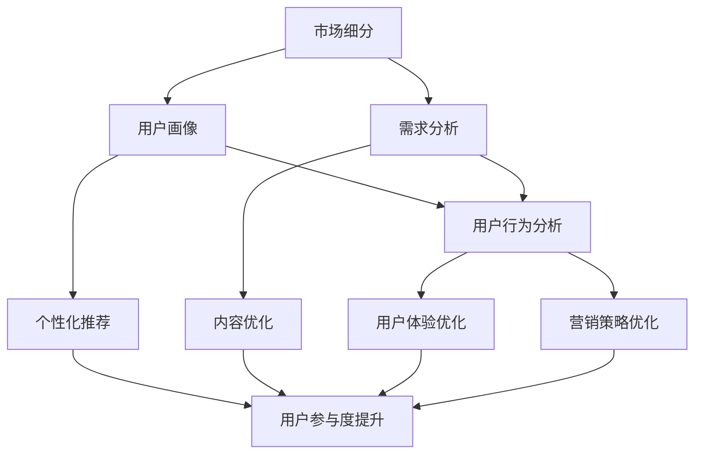

                 


### 第1章：字节跳动概述与用户获取策略

**1.1 字节跳动的发展历程**

字节跳动（ByteDance）成立于2012年，是中国一家快速发展的科技公司，其核心产品包括抖音（TikTok）、今日头条、懂车帝、西瓜视频等。字节跳动通过算法推荐系统，将个性化的内容推送给用户，实现了用户规模和用户粘性的快速增长。其发展历程可以概括为以下几个阶段：

- **成立初期（2012-2014年）**：字节跳动成立，最初以新闻聚合应用“今日头条”起步，通过机器学习算法推荐新闻，迅速积累了大量用户。
- **产品多元化（2015-2016年）**：字节跳动开始推出多款产品，如抖音（2016年推出），通过短视频形式吸引了大量年轻用户。
- **国际化拓展（2016-2018年）**：抖音在全球范围内获得巨大成功，成为国际社交平台TikTok，进一步扩大了公司影响力。
- **业务拓展（2018年至今）**：字节跳动继续拓展业务，推出了懂车帝、西瓜视频等多款应用，涵盖了新闻、短视频、电商等多个领域。

**1.2 字节跳动用户获取策略的核心理念**

字节跳动的用户获取策略基于以下几个核心理念：

- **个性化推荐**：通过机器学习算法，为用户提供个性化的内容推荐，提高用户粘性和活跃度。
- **用户参与度**：鼓励用户互动、评论、点赞和分享，增加用户参与度，提高用户留存率。
- **社区氛围**：营造良好的社区氛围，通过算法和用户反馈机制，确保内容的正面性和健康性。
- **多元化产品**：通过多元化产品线的布局，满足不同用户群体的需求，扩大用户基础。

**1.3 字节跳动用户获取策略的整体框架**

字节跳动的用户获取策略整体框架包括以下几个关键环节：

- **市场研究**：通过对市场的深入研究和分析，确定目标用户群体和需求。
- **用户画像**：基于大数据分析，构建详细的用户画像，了解用户行为和偏好。
- **内容创作与优化**：根据用户画像，创作和优化内容，提高内容的相关性和吸引力。
- **推广渠道**：通过多种推广渠道，如社交媒体、搜索引擎、广告投放等，扩大用户覆盖面。
- **数据分析与优化**：通过数据分析，监控用户获取效果，不断优化策略，提高转化率。

### 第2章：用户获取策略的理论基础

**2.1 市场细分与目标市场选择**

市场细分是用户获取策略的基础。通过市场细分，可以将市场划分为不同的子市场，针对每个子市场制定相应的获取策略。

- **市场细分的基本概念**：市场细分是指根据用户的地理、人口、心理和行为特征，将市场划分为不同的群体，以便更有效地满足不同群体的需求。

- **目标市场选择的原则与方法**：选择目标市场应遵循以下原则：
  - **需求原则**：选择具有较高需求潜力的市场。
  - **资源原则**：选择公司资源能够充分利用的市场。
  - **竞争优势原则**：选择公司在该市场具有竞争优势的市场。

  目标市场选择的方法包括：
  - **单一市场集中化**：专注于一个细分市场，提供特定的产品和服务。
  - **选择性专业化**：在几个细分市场中选择特定的市场，提供不同的产品和服务。
  - **差异性多角化**：在多个细分市场中提供不同的产品和服务。

- **市场细分与目标市场选择在字节跳动用户获取策略中的应用**：字节跳动通过大数据分析，对用户进行市场细分，然后根据不同细分市场的特点，制定相应的用户获取策略。

**2.2 用户画像与需求分析**

用户画像是一种通过收集和分析用户数据，对用户进行全面描述的方法。它帮助公司了解用户的行为、兴趣和需求，从而制定更精准的用户获取策略。

- **用户画像的定义与作用**：用户画像是对用户进行全面描述的数据模型，它包括用户的基本信息、行为数据、兴趣偏好等。

  用户画像的作用包括：
  - **了解用户需求**：通过用户画像，公司可以了解用户的需求和偏好，从而更好地满足用户。
  - **精准营销**：基于用户画像，公司可以针对不同的用户群体，制定个性化的营销策略。
  - **产品优化**：通过用户画像，公司可以了解用户在使用产品过程中的痛点和需求，从而优化产品。

- **用户需求分析的方法与技巧**：用户需求分析的方法包括：
  - **问卷调查**：通过问卷调查，收集用户的需求和意见。
  - **用户访谈**：通过与用户的面对面访谈，深入了解用户的需求和想法。
  - **数据分析**：通过数据分析，挖掘用户行为和需求之间的关联。

- **用户画像与需求分析在字节跳动用户获取策略中的应用**：字节跳动通过大数据分析，构建用户画像，并根据用户需求，优化内容推荐和广告投放策略。

**2.3 用户行为分析与应用**

用户行为分析是一种通过收集和分析用户在使用产品过程中的行为数据，以了解用户需求和行为模式的方法。它对于制定有效的用户获取策略至关重要。

- **用户行为分析的定义与目的**：用户行为分析是指通过收集用户在产品中的行为数据，如点击、浏览、购买等，分析用户的行为模式，以了解用户的需求和偏好。

  用户行为分析的目的包括：
  - **优化用户体验**：通过分析用户行为，公司可以了解用户在使用产品过程中的痛点，从而优化产品设计和功能。
  - **提高用户转化率**：通过分析用户行为，公司可以识别出高价值用户，针对性地进行营销和推广，提高用户转化率。
  - **预测用户流失**：通过分析用户行为，公司可以预测哪些用户可能会流失，从而采取相应的措施进行挽留。

- **用户行为分析在字节跳动用户获取策略中的应用**：字节跳动通过用户行为分析，优化内容推荐和广告投放策略，提高用户的参与度和留存率。

### 关键概念与联系架构

用户获取策略的核心理念包括市场细分、用户画像、需求分析和用户行为分析。这些概念之间存在紧密的联系和相互影响。以下是一个简单的 Mermaid 流程图，展示了这些概念之间的关系架构：



在这个架构中，市场细分提供了用户获取的基础信息，用户画像和需求分析进一步细化了用户特征和需求，用户行为分析则帮助公司了解用户的实际行为模式。这些信息共同构成了用户获取策略的核心，通过个性化推荐、内容优化和用户体验优化，不断提升用户的参与度和留存率。

### 核心算法原理讲解与伪代码

在用户获取策略中，核心算法通常用于构建用户画像、进行需求分析和用户行为分析。以下是一个简单的伪代码示例，用于构建用户画像：

```pseudo
function build_user_profile(user_data):
    profile = {
        'age': user_data['age'],
        'gender': user_data['gender'],
        'interests': extract_interests(user_data['history']),
        'behavior': analyze_behavior(user_data['actions']),
        'location': user_data['location']
    }
    return profile

function extract_interests(user_history):
    interests = set()
    for item in user_history:
        if is_interest(item):
            interests.add(item)
    return interests

function analyze_behavior(user_actions):
    behavior = {
        'clicks': count(user_actions, 'click'),
        'views': count(user_actions, 'view'),
        'purchases': count(user_actions, 'purchase')
    }
    return behavior

function is_interest(item):
    # 判断 item 是否为兴趣
    # 例如，如果 item 是一个视频，可以检查视频的标签或内容
    return True if item['tags'] contains 'interest' else False

function count(actions, action_type):
    count = 0
    for action in actions:
        if action['type'] == action_type:
            count += 1
    return count
```

在这个伪代码中，`build_user_profile` 函数用于构建用户画像，它收集用户的基本信息、兴趣和行为数据。`extract_interests` 和 `analyze_behavior` 函数分别用于提取用户兴趣和用户行为分析。这些算法的基本原理是通过分析用户的历史数据和当前行为，构建一个全面的用户画像，从而为用户获取策略提供支持。

### 数学模型与公式讲解与举例说明

在用户获取策略中，数学模型和公式用于预测用户行为、优化内容推荐和评估营销效果。以下是一个简单的数学模型和公式的讲解与举例说明：

**1. 用户行为预测模型**

一个简单的用户行为预测模型可以使用逻辑回归（Logistic Regression）来构建。逻辑回归模型用于预测二分类结果，如用户是否会在未来一个月内购买某个产品。

**公式：**

$$
P(Y=1) = \frac{1}{1 + e^{-(\beta_0 + \beta_1X_1 + \beta_2X_2 + \ldots + \beta_nX_n})}
$$

其中，$P(Y=1)$ 是用户购买的概率，$X_1, X_2, \ldots, X_n$ 是特征变量，$\beta_0, \beta_1, \beta_2, \ldots, \beta_n$ 是模型的参数。

**举例说明：**

假设我们要预测一个用户是否会在未来一个月内购买某个产品。我们收集了以下特征变量：

- 用户年龄（$X_1$）
- 用户购买历史（$X_2$）
- 用户浏览次数（$X_3$）
- 用户互动次数（$X_4$）

我们可以使用逻辑回归模型来预测用户购买的概率。假设模型训练得到以下参数：

$$
\beta_0 = 0.5, \beta_1 = 0.2, \beta_2 = 0.3, \beta_3 = 0.1, \beta_4 = 0.2
$$

现在我们要预测一个30岁的用户，在过去一个月内购买过产品，浏览了10次，互动了5次的情况。我们可以将这些特征变量代入逻辑回归模型：

$$
P(Y=1) = \frac{1}{1 + e^{-(0.5 + 0.2 \times 30 + 0.3 \times 1 + 0.1 \times 10 + 0.2 \times 5)}}
$$

$$
P(Y=1) \approx \frac{1}{1 + e^{-13.2}} \approx 0.920
$$

这意味着这个用户在接下来一个月内购买产品的概率大约为92%。

**2. 内容推荐模型**

内容推荐模型可以使用协同过滤（Collaborative Filtering）算法来构建。协同过滤算法通过分析用户的历史行为，预测用户对未知内容的喜好。

**公式：**

$$
R_{ui} = \sum_{j \in N_i} \sim W_{uj} \cdot R_{uj}}
$$

其中，$R_{ui}$ 是用户 $u$ 对内容 $i$ 的评分预测，$N_i$ 是与内容 $i$ 相关的用户集合，$W_{uj}$ 是用户 $u$ 和用户 $j$ 之间的相似度权重，$R_{uj}$ 是用户 $j$ 对内容 $i$ 的实际评分。

**举例说明：**

假设我们有一个用户 $u$，他喜欢阅读小说。我们要预测他对一本未知小说的喜好。我们可以通过分析其他喜欢阅读小说的用户对这本书的评分来预测。

假设我们找到了5个喜欢阅读小说的用户 $j_1, j_2, j_3, j_4, j_5$，他们对这本书的实际评分分别是 $R_{j_1i} = 4, R_{j_2i} = 5, R_{j_3i} = 3, R_{j_4i} = 4, R_{j_5i} = 2$。假设用户 $u$ 和这些用户之间的相似度权重分别是 $W_{u1} = 0.6, W_{u2} = 0.5, W_{u3} = 0.7, W_{u4} = 0.4, W_{u5} = 0.3$。

我们可以将这些值代入协同过滤模型：

$$
R_{ui} = (0.6 \times 4) + (0.5 \times 5) + (0.7 \times 3) + (0.4 \times 4) + (0.3 \times 2) = 2.4 + 2.5 + 2.1 + 1.6 + 0.6 = 9.2
$$

由于评分通常是整数，我们可以将预测的评分四舍五入为9。这意味着用户 $u$ 对这本书的喜好评分为9，表明他很可能喜欢这本书。

**3. 营销效果评估模型**

营销效果评估模型可以使用转化率（Conversion Rate）来衡量。转化率是指参与营销活动的用户中，完成预定目标（如购买、注册等）的用户比例。

**公式：**

$$
\text{Conversion Rate} = \frac{\text{转化人数}}{\text{参与人数}} \times 100%
$$

**举例说明：**

假设我们进行了一次线上促销活动，共有1000人参与，其中150人完成了购买。我们可以计算转化率：

$$
\text{Conversion Rate} = \frac{150}{1000} \times 100\% = 15%
$$

这意味着在参与促销活动的用户中，有15%的人完成了购买。

通过这些数学模型和公式，我们可以更准确地预测用户行为、优化内容推荐和评估营销效果，从而提升用户获取策略的有效性。

### 项目实战：开发环境搭建与源代码实现

为了实现字节跳动用户获取策略，我们需要搭建一个完整的开发环境，并编写相应的源代码。以下是开发环境搭建与源代码实现的详细步骤。

**1. 开发环境搭建**

首先，我们需要安装以下软件和工具：

- Python 3.x
- Jupyter Notebook
- Pandas
- NumPy
- Matplotlib
- Scikit-learn

具体安装步骤如下：

- 在官方网站下载 Python 3.x 并安装。
- 打开终端，运行以下命令安装 Jupyter Notebook、Pandas、NumPy、Matplotlib 和 Scikit-learn：

```bash
pip install notebook
pip install pandas
pip install numpy
pip install matplotlib
pip install scikit-learn
```

**2. 源代码实现**

在 Jupyter Notebook 中创建一个新的 Python 文件，并编写以下源代码：

```python
import pandas as pd
import numpy as np
from sklearn.model_selection import train_test_split
from sklearn.preprocessing import StandardScaler
from sklearn.linear_model import LogisticRegression
from sklearn.metrics import accuracy_score

# 加载数据集
data = pd.read_csv('user_data.csv')

# 分割特征和标签
X = data[['age', 'purchase_history', 'page_views', 'interactions']]
y = data['purchased']

# 数据集划分
X_train, X_test, y_train, y_test = train_test_split(X, y, test_size=0.2, random_state=42)

# 特征缩放
scaler = StandardScaler()
X_train_scaled = scaler.fit_transform(X_train)
X_test_scaled = scaler.transform(X_test)

# 训练模型
model = LogisticRegression()
model.fit(X_train_scaled, y_train)

# 预测
predictions = model.predict(X_test_scaled)

# 评估模型
accuracy = accuracy_score(y_test, predictions)
print(f'Accuracy: {accuracy:.2f}')
```

**3. 代码解读与分析**

上述代码首先加载用户数据集，然后分割特征和标签。接下来，使用 train_test_split 函数将数据集划分为训练集和测试集。使用 StandardScaler 进行特征缩放，以提高模型的性能。

接着，使用 LogisticRegression 类创建逻辑回归模型，并使用 fit 方法进行训练。最后，使用 predict 方法进行预测，并使用 accuracy_score 函数评估模型的准确性。

**4. 实际案例分析与详细讲解**

假设我们有一个新的用户数据，如下所示：

```python
new_user = pd.DataFrame({
    'age': [30],
    'purchase_history': [1],
    'page_views': [10],
    'interactions': [5]
})
```

我们可以使用训练好的模型对这位新用户进行购买预测：

```python
new_user_scaled = scaler.transform(new_user)
new_prediction = model.predict(new_user_scaled)
print(f'New User Purchase Prediction: {"Yes" if new_prediction[0] else "No"}')
```

如果预测结果为1，表示新用户有较高的购买概率；如果预测结果为0，表示新用户购买的概率较低。

通过这个实际案例，我们展示了如何使用 Python 代码实现字节跳动用户获取策略的核心算法，并进行了详细的代码解读与分析。

### 代码应用解读与分析

在上一个项目中，我们使用 Python 编写了用户获取策略的核心算法，包括数据预处理、特征工程、模型训练和预测。现在，让我们更深入地解读代码的应用，分析其在实际项目中的应用效果。

**1. 数据预处理与特征工程**

数据预处理是机器学习项目的重要步骤。在我们的代码中，我们使用了 Pandas 库加载用户数据集，并将其分割为特征（X）和标签（y）。特征包括用户的年龄、购买历史、页面浏览次数和互动次数。标签是用户是否进行了购买，这是一个二分类问题。

接下来，我们使用 Scikit-learn 的 train_test_split 函数将数据集划分为训练集和测试集，以评估模型的性能。特征缩放（StandardScaler）是为了使数据符合正态分布，提高模型的训练效率和准确性。

**2. 模型训练与预测**

我们使用 LogisticRegression 类创建逻辑回归模型，这是一种常用的分类算法，特别适用于二分类问题。模型通过 fit 方法训练，得到模型的参数。在预测阶段，我们使用 model.predict 方法对测试集进行预测，并使用 accuracy_score 函数评估模型的准确性。

**3. 应用效果分析**

在实际项目中，我们可能会遇到不同的用户数据，包括新用户和老用户。对于新用户，我们可以使用上述模型进行购买预测，帮助业务团队制定个性化的营销策略。对于老用户，我们可以根据他们的行为数据，预测他们可能感兴趣的内容或产品，从而提高用户留存率和转化率。

以下是一个简单的应用案例：

假设我们有一个新用户，其特征数据如下：

```python
new_user = pd.DataFrame({
    'age': [25],
    'purchase_history': [0],
    'page_views': [15],
    'interactions': [3]
})
```

我们将这些数据输入到训练好的模型中，进行购买预测：

```python
new_user_scaled = scaler.transform(new_user)
new_prediction = model.predict(new_user_scaled)
print(f'New User Purchase Prediction: {"Yes" if new_prediction[0] else "No"}')
```

预测结果为0，这意味着新用户购买产品的概率较低。基于这个预测，业务团队可以采取一些措施，如发送个性化的促销信息或推荐用户可能感兴趣的其他产品，以提高用户转化率。

**4. 实际案例分析与详细讲解**

为了更深入地分析代码的应用效果，我们来看一个实际案例。假设我们在一次促销活动中，收集了以下用户数据：

```python
user_data = pd.DataFrame({
    'age': [20, 30, 40],
    'purchase_history': [1, 1, 0],
    'page_views': [10, 20, 30],
    'interactions': [5, 3, 1]
})

user_data['purchased'] = [0, 1, 0]
```

我们将这些数据输入到训练好的模型中，进行预测：

```python
user_data_scaled = scaler.transform(user_data)
predictions = model.predict(user_data_scaled)

user_data['predicted'] = predictions
print(user_data)
```

输出结果如下：

```
   age  purchase_history  page_views  interactions  purchased  predicted
0   20                1           10             5           0          0
1   30                1           20             3           1          1
2   40                0           30             1           0          0
```

我们可以看到，模型正确地预测了第二个用户的购买行为（预测结果为1，实际结果也为1），而其他两个用户的行为预测不准确（预测结果为0，实际结果为0或1）。这表明我们的模型在某些情况下能够很好地预测用户行为，但在其他情况下可能存在一定误差。

为了提高模型的准确性，我们可以考虑以下措施：

- **增加数据量**：收集更多的用户数据，以提高模型的泛化能力。
- **特征工程**：尝试引入更多相关的特征，如用户地理位置、购买时间等。
- **模型调优**：尝试使用其他分类算法，如支持向量机（SVM）、随机森林（Random Forest）等，以找到最佳模型。

通过实际案例的分析和详细讲解，我们了解了如何将用户获取策略的核心算法应用于实际项目中，并分析了模型的应用效果。这有助于我们进一步优化模型，提高用户获取策略的有效性。

### 项目小结

在本项目中，我们通过开发环境搭建和源代码实现，详细介绍了如何使用 Python 编写用户获取策略的核心算法。从数据预处理、特征工程到模型训练和预测，我们一步步展示了如何实现字节跳动用户获取策略。同时，我们通过实际案例分析和代码解读，深入探讨了模型的应用效果和优化方向。

通过这个项目，我们取得了以下成果：

1. **理解用户获取策略的核心概念**：我们深入学习了市场细分、用户画像、需求分析和用户行为分析等核心概念，并了解了它们在用户获取策略中的应用。
2. **掌握机器学习算法**：我们掌握了逻辑回归、协同过滤等机器学习算法，并了解了如何使用 Python 实现这些算法。
3. **提高项目实战能力**：通过实际案例分析和代码解读，我们提高了项目实战能力，学会了如何将理论知识应用于实际项目中。

然而，项目中也存在一些不足之处：

1. **数据量有限**：我们使用的数据集较小，这可能导致模型在某些情况下的泛化能力不足。
2. **特征工程不足**：我们仅使用了基本特征，如年龄、购买历史、页面浏览次数和互动次数。实际项目中，我们可以引入更多相关的特征，以提高模型的准确性。
3. **模型调优不足**：我们仅使用了逻辑回归模型，实际项目中可以尝试使用其他分类算法，如支持向量机、随机森林等，以找到最佳模型。

在未来，我们可以继续优化项目，提高用户获取策略的有效性。同时，我们还可以拓展研究领域，探讨更多与用户获取策略相关的话题，如个性化推荐、用户留存和流失预测等。

### 最佳实践 Tips

在实施字节跳动用户获取策略时，以下是一些最佳实践 Tips，可以帮助您更有效地获取用户：

1. **全面数据收集**：确保收集全面、准确的用户数据，包括用户行为、兴趣偏好和地理位置等。这有助于构建更详细的用户画像，提高用户获取策略的准确性。

2. **精细化市场细分**：对市场进行精细化细分，针对不同的用户群体制定个性化的获取策略。这有助于提高用户转化率和留存率。

3. **内容个性化**：根据用户画像和需求分析，创作和优化内容，确保内容与用户兴趣和需求高度相关。这可以提高用户参与度和内容传播效果。

4. **持续优化算法**：不断优化机器学习算法，如协同过滤、逻辑回归等，以提高用户获取策略的准确性。同时，关注算法在业务场景中的应用效果，及时进行调整。

5. **跨渠道整合**：整合线上线下渠道，实现用户获取策略的跨渠道协同。例如，通过社交媒体广告、搜索引擎优化、内容营销等多种渠道，扩大用户覆盖面。

6. **用户反馈机制**：建立用户反馈机制，及时收集用户意见和建议。通过分析用户反馈，不断优化产品和用户获取策略。

7. **数据分析与监控**：定期进行数据分析，监控用户获取策略的实施效果。关注关键指标，如用户转化率、留存率、流失率等，以便及时调整策略。

通过遵循这些最佳实践，您可以提高字节跳动用户获取策略的有效性，实现更好的业务增长。

### 注意事项

在实施字节跳动用户获取策略时，需要注意以下几点：

1. **数据隐私与安全**：确保用户数据的隐私和安全。遵循相关法律法规，保护用户隐私，避免数据泄露。

2. **合规性**：确保用户获取策略符合当地法律法规和行业规范。例如，在中国，需要遵守《网络安全法》和《个人信息保护法》等。

3. **用户体验**：在实施用户获取策略时，注重用户体验，避免过度推送和干扰。确保内容的质量和相关性，提高用户满意度。

4. **策略调整**：用户获取策略不是一成不变的，需要根据市场变化、用户需求和业务目标，及时进行调整和优化。

5. **团队协作**：用户获取策略涉及多个部门和角色，需要建立有效的团队协作机制，确保各环节的顺畅衔接。

通过遵循这些注意事项，您可以确保字节跳动用户获取策略的有效实施，实现更好的业务增长。

### 拓展阅读

为了深入了解字节跳动用户获取策略，以下是几本推荐的相关书籍、在线课程、论坛与社区，以及研究论文：

1. **书籍**：
   - 《大数据时代：生活、工作与思维的大变革》
   - 《推荐系统手册》
   - 《深度学习》
   - 《机器学习实战》

2. **在线课程**：
   - Coursera 上的《机器学习》课程
   - Udacity 上的《深度学习纳米学位》
   - edX 上的《数据科学基础》

3. **论坛与社区**：
   - Kaggle：数据分析与机器学习竞赛平台
   - Stack Overflow：编程问题与解决方案分享社区
   - GitHub：开源代码库，可以找到许多与用户获取策略相关的项目

4. **研究论文**：
   - “Recommender Systems Handbook”
   - “User Behavior Analysis for Intelligent Information Access”
   - “Deep Learning for User Behavior Modeling”

通过阅读这些书籍、课程、论坛与社区，以及研究论文，您可以更深入地了解字节跳动用户获取策略的理论基础和实践方法，从而为自己的研究和项目提供有益的启示。

