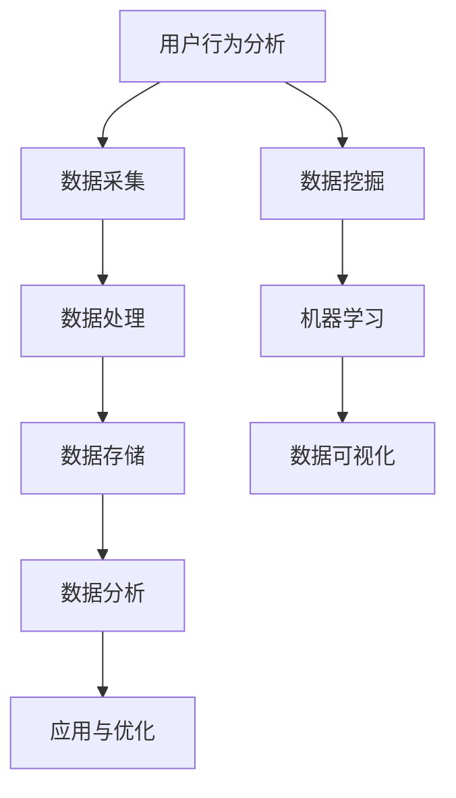

                 

### 第1章：用户行为分析概述

#### 1.1 用户行为分析的基本概念

**用户行为分析**是一种系统性的方法，通过收集和分析用户在互联网平台上的行为数据，以理解和预测用户的偏好、兴趣和需求。其核心目的是为企业提供数据驱动的决策支持，从而优化用户体验、提高用户满意度和忠诚度。

- **定义**：用户行为分析涉及对用户在网站、应用或服务中的活动进行量化研究，包括点击、浏览、搜索、购买、分享等行为。
- **目的**：通过深入了解用户行为，企业可以调整产品特性、改进用户界面、优化内容推荐，最终提升用户参与度和转化率。
- **意义**：在竞争激烈的数字市场中，用户行为分析能够帮助企业识别用户痛点，发现新的增长机会，实现差异化营销，提高市场竞争力。

#### 1.2 用户行为分析的基本框架

用户行为分析通常包含以下几个关键步骤：

- **数据采集**：收集用户行为数据，如点击流、浏览历史、搜索记录等。
- **数据处理**：对采集到的数据进行清洗、整合和预处理，以确保数据质量。
- **数据存储**：将处理后的数据存储在数据库或数据仓库中，便于后续分析。
- **数据分析**：应用统计和机器学习技术，对用户行为数据进行深入挖掘，识别用户行为模式和趋势。
- **应用与优化**：将分析结果应用于产品设计和运营策略中，进行迭代优化。

#### 1.3 用户行为分析中的关键技术

用户行为分析涉及多种技术和工具，以下是其关键技术概述：

- **数据挖掘**：通过模式识别技术，从大量用户行为数据中发现有价值的信息。
- **机器学习**：利用算法模型，对用户行为进行预测和分析，如分类、聚类和回归分析。
- **数据可视化**：通过图表和交互式界面，将复杂的数据分析结果以直观的方式展示给用户。

### 关键概念与联系

为了更好地理解用户行为分析，以下是核心概念之间的关系架构图（使用Mermaid语法）：



#### 核心算法原理讲解

在用户行为分析中，常用的算法包括：

1. **K-means算法**：一种基于距离度量的聚类算法，用于将用户分为若干个群组。

```python
def k_means(data, K):
    # 初始化K个中心点
    centroids = initialize_centroids(data, K)
    while True:
        # 分配用户到最近的中心点
        labels = assign_labels(data, centroids)
        # 更新中心点
        centroids = update_centroids(data, labels, K)
        # 检查收敛条件
        if has_converged(centroids):
            break
    return centroids, labels
```

2. **协同过滤**：通过分析用户之间的相似度，推荐用户可能喜欢的商品或内容。

```python
def collaborative_filtering(users, items, similarity_measure):
    # 计算用户之间的相似度矩阵
    similarity_matrix = calculate_similarity_matrix(users, items, similarity_measure)
    # 为每个用户推荐物品
    recommendations = []
    for user in users:
        user_profile = user.get('ratings')
        recommendations.extend(recommend_items(user_profile, similarity_matrix))
    return recommendations
```

#### 数学模型和公式

在用户行为分析中，常用的数学模型包括：

1. **逻辑回归**：用于预测用户是否会在未来进行某一行为。

$$
\text{logit}(P) = \log\left(\frac{P}{1-P}\right) = \beta_0 + \beta_1X_1 + \beta_2X_2 + ... + \beta_nX_n
$$

2. **时间序列分析**：用于分析用户行为的时间动态特性。

$$
X_t = \alpha X_{t-1} + \beta t + \epsilon_t
$$

#### 详细讲解与举例说明

假设我们有一个电商平台的用户行为数据集，包含用户ID、浏览历史、购买历史等信息。我们可以使用K-means算法对用户进行聚类，以发现用户群体。

```python
# 假设数据集为矩阵data，K为3
centroids, labels = k_means(data, K)

# 输出聚类结果
for i, centroid in enumerate(centroids):
    print(f"Cluster {i}: Users {np.where(labels == i)[0].tolist()}")
```

假设用户A在浏览历史中频繁购买电子设备，而用户B更倾向于购买图书。通过K-means聚类，我们可以将用户A和用户B划分为不同的用户群体，从而为不同的用户群体制定个性化的营销策略。

#### 数学公式

$$
\beta = (\mathbf{X}^T\mathbf{X})^{-1}\mathbf{X}^T\mathbf{Y}
$$

其中，$\mathbf{X}$为特征矩阵，$\mathbf{Y}$为标签矩阵，$\beta$为参数向量。

#### 项目实战

在实际项目中，用户行为分析的第一步是数据采集。以下是一个简单的数据采集示例：

```python
# 假设使用Flask框架搭建Web应用
from flask import Flask, request, jsonify

app = Flask(__name__)

@app.route('/api/collect', methods=['POST'])
def collect_data():
    data = request.json
    # 将数据存储到数据库
    store_data(data)
    return jsonify({"status": "success"})

if __name__ == '__main__':
    app.run(debug=True)
```

#### 代码解读与分析

在上面的代码中，我们定义了一个Flask路由`/api/collect`，用于接收用户提交的行为数据，并将其存储到数据库中。这是一个简单的Web服务端代码，实际项目中需要考虑更多方面，如数据校验、并发处理、安全性等。

#### 最佳实践 Tips

- **数据隐私**：在进行用户行为分析时，务必遵守数据隐私法规，确保用户数据的安全。
- **数据质量**：数据质量直接影响分析结果，确保数据准确性、完整性和一致性。
- **实验与验证**：在应用分析结果时，进行A/B测试等实验，验证分析效果的可靠性。

#### 小结

用户行为分析是企业数字化运营的重要组成部分。通过数据采集、处理、分析和应用，企业可以更好地了解用户需求，优化产品和服务，提高市场竞争力和用户满意度。

### 拓展阅读

- 《用户行为分析：理论与实践》
- 《大数据分析：技术与实践》
- Coursera上的《用户行为分析》课程

### 附录

- **附录 A：用户行为分析资源与参考书籍**
  - 《用户行为分析：理论与实践》
  - 《用户行为预测：技术与方法》
- **附录 B：在线课程与资料**
  - Coursera上的《用户行为分析》
  - Udacity的《数据科学基础》课程
- **附录 C：工具与库**
  - Python数据分析工具（Pandas、NumPy等）
  - SQL数据库与数据处理（MySQL、PostgreSQL等）

---

作者：AI天才研究院/AI Genius Institute & 禅与计算机程序设计艺术 /Zen And The Art of Computer Programming---

# 《字节跳动2024校招技术用户行为分析师面试题详解》

## 文章关键词

字节跳动、2024校招、技术用户行为分析师、面试题详解

## 文章摘要

本文针对字节跳动2024校招技术用户行为分析师岗位的面试题进行了详细的解析。通过梳理和剖析每个面试题的考点、解题思路和答案，本文旨在帮助读者掌握用户行为分析的核心概念和实战技巧，为应对面试挑战提供有力支持。文章分为三个部分：基础概念与框架、高级分析与策略、实践与工具，每个部分都包含具体的案例研究和实用技巧。希望本文能为有志于投身用户行为分析领域的读者提供宝贵的参考和指导。

---

## 《字节跳动2024校招技术用户行为分析师面试题详解》目录大纲

### 第一部分：基础概念与框架

### 第1章：用户行为分析概述

- **1.1 用户行为分析的基本概念**
  - 用户行为分析的定义
  - 用户行为分析的目的与意义

- **1.2 用户行为分析的基本框架**
  - 数据采集
  - 数据处理
  - 数据分析
  - 应用与优化

- **1.3 用户行为分析中的关键技术**
  - 数据挖掘
  - 机器学习
  - 数据可视化

### 第2章：用户行为数据分析工具

- **2.1 常用数据分析工具介绍**
  - Python数据分析工具（Pandas、NumPy等）
  - SQL数据库与数据处理（MySQL、PostgreSQL等）
  - Hadoop生态系统

- **2.2 数据处理流程**
  - 数据预处理
  - 特征工程
  - 数据融合

### 第3章：用户行为分析方法

- **3.1 聚类分析**
  - K-means算法
  - DBSCAN算法
  - 层次聚类算法

- **3.2 分类分析**
  - 决策树
  - 随机森林
  - 支持向量机

- **3.3 回归分析**
  - 线性回归
  - 逻辑回归

### 第4章：用户行为分析案例研究

- **4.1 案例一：电商用户行为分析**
  - 用户浏览行为分析
  - 用户购买行为分析

- **4.2 案例二：社交媒体用户行为分析**
  - 用户互动行为分析
  - 用户内容偏好分析

### 第二部分：高级分析与策略

### 第5章：用户行为预测与个性化推荐

- **5.1 用户行为预测模型**
  - 时间序列分析
  - 序列模型

- **5.2 个性化推荐算法**
  - 协同过滤
  - 内容推荐

### 第6章：用户流失预测与挽回策略

- **6.1 用户流失预测模型**
  - 生存分析
  - Logistic回归

- **6.2 用户挽回策略**
  - 用户行为分析
  - 个性化营销策略

### 第7章：用户行为分析与商业策略

- **7.1 用户行为分析在业务中的应用**
  - 用户增长策略
  - 用户体验优化

- **7.2 用户行为分析在决策支持中的应用**
  - 产品迭代策略
  - 市场营销策略

### 第三部分：实践与工具

### 第8章：用户行为分析实践案例

- **8.1 案例一：基于用户行为的电商运营优化**
  - 用户行为数据收集
  - 用户行为数据分析

- **8.2 案例二：社交媒体平台用户活跃度提升**
  - 用户行为模型构建
  - 用户流失预测与挽回策略

### 第9章：用户行为分析工具与应用

- **9.1 用户行为分析工具介绍**
  - Google Analytics
  - Mixpanel
  - Segment

- **9.2 用户行为分析工具应用实践**
  - 数据采集与处理
  - 数据分析与可视化

### 第10章：用户行为分析发展趋势

- **10.1 用户行为分析技术的未来趋势**
  - 新算法与新技术
  - 实时分析与自动化决策

- **10.2 用户行为分析在企业中的应用前景**
  - 业务融合与创新
  - 跨领域应用挑战

## 第一部分：基础概念与框架

### 第1章：用户行为分析概述

用户行为分析是数字时代企业不可或缺的一部分，它通过分析用户在互联网上的行为模式，帮助企业优化产品、提升用户体验和增加收入。在字节跳动2024校招技术用户行为分析师面试中，对用户行为分析的基础概念和框架的考查是核心内容。本章将详细阐述用户行为分析的定义、目的与意义，以及用户行为分析的基本框架。

#### 1.1 用户行为分析的基本概念

用户行为分析是指通过收集、处理和分析用户在网站、应用或服务中的行为数据，以理解用户行为模式、兴趣偏好和需求特征的过程。这些行为数据包括但不限于用户的浏览路径、点击行为、购买历史、评论反馈等。

- **定义**：用户行为分析旨在通过数据洞察，帮助企业了解用户行为背后的动机和需求，从而制定更有效的产品和服务策略。
- **目的**：用户行为分析的目的是提高用户体验、优化产品设计和运营策略，进而提升用户满意度和忠诚度。
- **意义**：用户行为分析对于企业来说具有深远的意义。它不仅可以帮助企业了解用户需求，还可以为企业提供数据驱动的决策支持，提高市场竞争力。

#### 1.2 用户行为分析的基本框架

用户行为分析通常包括以下基本框架：

1. **数据采集**：收集用户行为数据，这是用户行为分析的第一步。数据来源可以是网站日志、点击流数据、用户反馈等。

2. **数据处理**：对采集到的数据进行清洗、去噪、整合等处理，以确保数据质量。

3. **数据存储**：将处理后的数据存储在数据库或数据仓库中，便于后续分析。

4. **数据分析**：运用统计学和机器学习技术，对用户行为数据进行分析，提取有价值的信息。

5. **应用与优化**：将分析结果应用于产品设计和运营策略中，进行迭代优化，以提高用户体验和业务绩效。

#### 1.3 用户行为分析中的关键技术

用户行为分析涉及到多种技术和工具，其中关键技术包括：

- **数据挖掘**：用于从大量数据中发现潜在的模式和关联。
- **机器学习**：通过构建模型，对用户行为进行预测和分析。
- **数据可视化**：将复杂的数据分析结果以图形化方式展示，帮助决策者理解数据。

### 关键概念与联系

为了更好地理解用户行为分析，以下是核心概念之间的关系架构图（使用Mermaid语法）：


#### 核心算法原理讲解

在用户行为分析中，常用的算法包括聚类分析、分类分析和回归分析。以下是这些算法的简要原理和伪代码：

1. **K-means算法**：一种基于距离度量的聚类算法，用于将用户分为若干个群组。

```python
def k_means(data, K):
    # 初始化K个中心点
    centroids = initialize_centroids(data, K)
    while True:
        # 分配用户到最近的中心点
        labels = assign_labels(data, centroids)
        # 更新中心点
        centroids = update_centroids(data, labels, K)
        # 检查收敛条件
        if has_converged(centroids):
            break
    return centroids, labels
```

2. **协同过滤**：通过分析用户之间的相似度，推荐用户可能喜欢的商品或内容。

```python
def collaborative_filtering(users, items, similarity_measure):
    # 计算用户之间的相似度矩阵
    similarity_matrix = calculate_similarity_matrix(users, items, similarity_measure)
    # 为每个用户推荐物品
    recommendations = []
    for user in users:
        user_profile = user.get('ratings')
        recommendations.extend(recommend_items(user_profile, similarity_matrix))
    return recommendations
```

3. **逻辑回归**：用于预测用户是否会在未来进行某一行为。

```python
def logistic_regression(X, y):
    # 计算特征矩阵和标签矩阵的乘积
    Z = X.dot(y)
    # 计算预测概率
    probabilities = 1 / (1 + np.exp(-Z))
    # 计算损失函数
    loss = -np.mean(y * np.log(probabilities) + (1 - y) * np.log(1 - probabilities))
    return probabilities, loss
```

#### 数学模型和公式

在用户行为分析中，常用的数学模型包括逻辑回归和时间序列分析。以下是这些模型的公式和解释：

1. **逻辑回归**：

$$
\text{logit}(P) = \log\left(\frac{P}{1-P}\right) = \beta_0 + \beta_1X_1 + \beta_2X_2 + ... + \beta_nX_n
$$

其中，$P$ 是预测的概率，$\beta_0$ 是截距，$\beta_1, \beta_2, ..., \beta_n$ 是参数。

2. **时间序列分析**：

$$
X_t = \alpha X_{t-1} + \beta t + \epsilon_t
$$

其中，$X_t$ 是时间序列的当前值，$\alpha$ 和 $\beta$ 是参数，$\epsilon_t$ 是随机误差。

#### 详细讲解与举例说明

假设我们有一个电商平台的用户数据集，其中包含用户的购买历史和浏览历史。我们可以使用K-means算法对用户进行聚类，以发现不同用户群体。

```python
# 假设数据集为矩阵data，K为3
centroids, labels = k_means(data, K)

# 输出聚类结果
for i, centroid in enumerate(centroids):
    print(f"Cluster {i}: Users {np.where(labels == i)[0].tolist()}")
```

假设用户A在浏览历史中频繁购买电子设备，而用户B更倾向于购买图书。通过K-means聚类，我们可以将用户A和用户B划分为不同的用户群体，从而为不同的用户群体提供个性化的推荐和服务。

#### 数学公式

$$
\beta = (\mathbf{X}^T\mathbf{X})^{-1}\mathbf{X}^T\mathbf{Y}
$$

其中，$\mathbf{X}$为特征矩阵，$\mathbf{Y}$为标签矩阵，$\beta$为参数向量。

#### 项目实战

在实际项目中，用户行为分析的第一步是数据采集。以下是一个简单的数据采集示例：

```python
# 假设使用Flask框架搭建Web应用
from flask import Flask, request, jsonify

app = Flask(__name__)

@app.route('/api/collect', methods=['POST'])
def collect_data():
    data = request.json
    # 将数据存储到数据库
    store_data(data)
    return jsonify({"status": "success"})

if __name__ == '__main__':
    app.run(debug=True)
```

#### 代码解读与分析

在上面的代码中，我们定义了一个Flask路由`/api/collect`，用于接收用户提交的行为数据，并将其存储到数据库中。这是一个简单的Web服务端代码，实际项目中需要考虑更多方面，如数据校验、并发处理、安全性等。

#### 最佳实践 Tips

- **数据隐私**：在进行用户行为分析时，务必遵守数据隐私法规，确保用户数据的安全。
- **数据质量**：数据质量直接影响分析结果，确保数据准确性、完整性和一致性。
- **实验与验证**：在应用分析结果时，进行A/B测试等实验，验证分析效果的可靠性。

#### 小结

用户行为分析是企业数字化运营的重要组成部分。通过数据采集、处理、分析和应用，企业可以更好地了解用户需求，优化产品和服务，提高市场竞争力和用户满意度。

### 拓展阅读

- 《用户行为分析：理论与实践》
- 《大数据分析：技术与实践》
- Coursera上的《用户行为分析》课程

### 附录

- **附录 A：用户行为分析资源与参考书籍**
  - 《用户行为分析：理论与实践》
  - 《用户行为预测：技术与方法》
- **附录 B：在线课程与资料**
  - Coursera上的《用户行为分析》
  - Udacity的《数据科学基础》课程
- **附录 C：工具与库**
  - Python数据分析工具（Pandas、NumPy等）
  - SQL数据库与数据处理（MySQL、PostgreSQL等）

---

作者：AI天才研究院/AI Genius Institute & 禅与计算机程序设计艺术 /Zen And The Art of Computer Programming## 第二部分：高级分析与策略

### 第5章：用户行为预测与个性化推荐

用户行为预测和个性化推荐是用户行为分析中非常重要的两个领域。用户行为预测旨在通过历史行为数据预测用户未来的行为，而个性化推荐则是基于用户的历史行为和偏好为其推荐相关内容或产品。在字节跳动2024校招技术用户行为分析师面试中，这部分内容通常被重点考察。本章将详细探讨用户行为预测和个性化推荐的基本概念、模型和方法，并提供相关案例。

#### 5.1 用户行为预测模型

用户行为预测是通过分析用户的历史行为数据，预测用户在未来某一时间点可能采取的行为。常见的用户行为预测模型包括时间序列分析、序列模型和机器学习模型。

1. **时间序列分析**：时间序列分析是一种用于分析时间序列数据的统计方法，可以用于预测用户行为。例如，ARIMA模型就是一种常见的时间序列预测模型。

   **公式**：
   $$
   X_t = \phi_1X_{t-1} + \phi_2X_{t-2} + ... + \phi_pX_{t-p} + \theta_1\epsilon_{t-1} + \theta_2\epsilon_{t-2} + ... + \theta_q\epsilon_{t-q}
   $$

2. **序列模型**：序列模型是一类专门用于处理时间序列数据的机器学习模型，如LSTM（Long Short-Term Memory）网络。

   **伪代码**：
   ```python
   def lstm_network(input_data, hidden_size, output_size):
       # 初始化LSTM网络
       lstm = LSTM(hidden_size, return_sequences=True)
       # 添加输出层
       output = Dense(output_size, activation='sigmoid')(lstm.output)
       # 编译模型
       model = Model(inputs=lstm.input, outputs=output)
       model.compile(optimizer='adam', loss='binary_crossentropy')
       return model
   ```

3. **机器学习模型**：常见的机器学习模型如逻辑回归、决策树、随机森林和SVM等也可以用于用户行为预测。例如，逻辑回归可以用于预测用户是否会在未来点击广告。

   **公式**：
   $$
   \text{logit}(P) = \beta_0 + \beta_1X_1 + \beta_2X_2 + ... + \beta_nX_n
   $$

#### 5.2 个性化推荐算法

个性化推荐算法旨在根据用户的历史行为和偏好，为用户推荐相关的内容或产品。常见的个性化推荐算法包括协同过滤和基于内容的推荐。

1. **协同过滤**：协同过滤是一种基于用户相似度的推荐算法，可以分为用户基于的协同过滤和物品基于的协同过滤。

   **伪代码**：
   ```python
   def collaborative_filtering(users, items, similarity_measure):
       # 计算用户之间的相似度矩阵
       similarity_matrix = calculate_similarity_matrix(users, items, similarity_measure)
       # 为每个用户推荐物品
       recommendations = []
       for user in users:
           user_profile = user.get('ratings')
           recommendations.extend(recommend_items(user_profile, similarity_matrix))
       return recommendations
   ```

2. **基于内容的推荐**：基于内容的推荐是根据用户对内容的兴趣，为用户推荐类似的内容。

   **伪代码**：
   ```python
   def content_based_recommendation(user_profile, content_library):
       # 计算用户兴趣特征
       user_interests = extract_interests(user_profile)
       # 为用户推荐相似的内容
       recommendations = []
       for content in content_library:
           if is_similar(user_interests, extract_interests(content)):
               recommendations.append(content)
       return recommendations
   ```

#### 案例研究：电商平台的用户行为预测和个性化推荐

假设我们有一个电商平台，平台希望利用用户行为预测和个性化推荐来提高用户的购买转化率和满意度。

1. **用户行为预测**：

   - **数据采集**：收集用户的历史购买记录、浏览历史和点击行为。
   - **数据处理**：对采集到的数据进行预处理，包括缺失值处理、异常值检测和特征工程。
   - **模型选择**：选择合适的预测模型，如LSTM网络或逻辑回归。
   - **模型训练与验证**：使用历史数据对模型进行训练，并在验证集上进行验证。

   **代码示例**：
   ```python
   # 假设使用TensorFlow和Keras搭建LSTM模型
   from tensorflow.keras.models import Sequential
   from tensorflow.keras.layers import LSTM, Dense

   # 创建LSTM模型
   model = Sequential()
   model.add(LSTM(50, activation='relu', input_shape=(timesteps, features)))
   model.add(Dense(1, activation='sigmoid'))

   # 编译模型
   model.compile(optimizer='adam', loss='binary_crossentropy', metrics=['accuracy'])

   # 训练模型
   model.fit(X_train, y_train, epochs=10, batch_size=32, validation_data=(X_val, y_val))
   ```

2. **个性化推荐**：

   - **数据采集**：收集用户的浏览历史、购买记录和用户评分。
   - **数据处理**：对采集到的数据进行预处理，包括缺失值处理、异常值检测和特征工程。
   - **推荐算法**：选择合适的推荐算法，如协同过滤或基于内容的推荐。
   - **推荐结果生成**：根据用户的历史行为和偏好生成推荐列表。

   **代码示例**：
   ```python
   # 假设使用协同过滤算法进行推荐
   def collaborative_filtering(ratings_matrix, user_id, k=10):
       # 计算用户与所有用户的相似度
       similarity_matrix = cosine_similarity(ratings_matrix[user_id])
       
       # 排序相似度矩阵，选择最相似的k个用户
       similar_users = np.argsort(similarity_matrix)[:-k-1:-1]
       
       # 计算相似用户对物品的平均评分
       item_ratings = np.mean(ratings_matrix[similar_users], axis=0)
       
       # 排序物品评分，选择评分最高的m个物品
       top_items = np.argsort(item_ratings)[::-m]
       
       return top_items
   ```

#### 小结

用户行为预测和个性化推荐是用户行为分析中的重要组成部分。通过时间序列分析、序列模型和机器学习模型，企业可以更好地预测用户未来的行为，并通过协同过滤和基于内容的推荐算法为用户提供个性化的推荐。在实际应用中，需要结合具体业务场景和数据特点，选择合适的模型和方法。

### 拓展阅读

- 《推荐系统实战》
- 《机器学习实战》
- Coursera上的《推荐系统》课程

### 附录

- **附录 A：用户行为预测和个性化推荐资源与参考书籍**
  - 《推荐系统实战》
  - 《机器学习实战》
- **附录 B：在线课程与资料**
  - Coursera上的《推荐系统》
  - edX的《机器学习基础》课程
- **附录 C：工具与库**
  - Python机器学习库（Scikit-learn、TensorFlow等）
  - 推荐系统框架（Surprise、LightFM等）

---

作者：AI天才研究院/AI Genius Institute & 禅与计算机程序设计艺术 /Zen And The Art of Computer Programming### 第6章：用户流失预测与挽回策略

用户流失预测与挽回策略是用户行为分析中的重要内容，尤其在竞争激烈的数字市场中，企业需要通过有效的用户行为分析来降低用户流失率，提高用户留存率。本章将详细介绍用户流失预测的基本概念、常用模型，以及用户挽回策略的设计和实施。

#### 6.1 用户流失预测模型

用户流失预测是指利用用户的历史行为数据，预测用户在未来某个时间点可能会停止使用产品的概率。常见的用户流失预测模型包括生存分析模型和逻辑回归模型。

1. **生存分析模型**：生存分析模型，如Cox比例风险模型，用于分析用户流失的时间。它能够考虑时间依赖性和多个危险因素。

   **公式**：
   $$
   h(t) = h_0(t) \exp(\sum_{j=1}^{p} \lambda_j X_{ij})
   $$
   其中，$h(t)$ 是在时间$t$的用户流失风险，$h_0(t)$ 是基准风险函数，$X_{ij}$ 是用户$i$在时间$j$的特征，$\lambda_j$ 是对应特征的参数。

2. **逻辑回归模型**：逻辑回归模型是一种广义线性模型，用于预测用户流失的概率。

   **公式**：
   $$
   \text{logit}(P) = \beta_0 + \beta_1X_1 + \beta_2X_2 + ... + \beta_nX_n
   $$
   其中，$P$ 是用户流失的概率，$\beta_0$ 是截距，$\beta_1, \beta_2, ..., \beta_n$ 是特征参数。

#### 6.2 用户挽回策略

用户挽回策略是指通过一系列的措施，降低已流失用户的再次流失概率，并尽可能将其挽回。常见的用户挽回策略包括用户行为分析、个性化营销和用户关怀。

1. **用户行为分析**：通过对流失用户的最后行为进行分析，了解他们流失的原因，从而制定有针对性的挽回策略。

   **步骤**：
   - 收集流失用户的历史行为数据。
   - 分析流失用户的行为特征，如最后访问的时间、页面停留时间、点击行为等。
   - 确定流失的主要原因。

2. **个性化营销**：根据流失用户的特征和行为，制定个性化的营销活动，以吸引他们重新使用产品。

   **方法**：
   - 发送个性化的电子邮件或短信，提供专享优惠或福利。
   - 设计个性化的网页或应用界面，提醒用户他们之前的行为和偏好。
   - 利用用户数据，推送相关的产品信息或内容。

3. **用户关怀**：通过提供优质的客户服务，增加用户的满意度和忠诚度。

   **措施**：
   - 设置专门的客户服务团队，提供快速响应和解决方案。
   - 定期与用户沟通，了解他们的需求和反馈。
   - 在用户遇到问题时，提供及时的技术支持和帮助。

#### 案例研究：社交媒体平台用户流失预测与挽回策略

假设我们有一个社交媒体平台，用户流失率较高，平台希望利用用户行为分析来降低流失率。

1. **用户流失预测**：

   - **数据采集**：收集用户的历史行为数据，如登录频率、发布内容、互动行为等。
   - **数据处理**：对采集到的数据进行预处理，包括缺失值处理、异常值检测和特征工程。
   - **模型选择**：选择合适的预测模型，如Cox比例风险模型或逻辑回归模型。
   - **模型训练与验证**：使用历史数据对模型进行训练，并在验证集上进行验证。

   **代码示例**：
   ```python
   import pandas as pd
   from sklearn.model_selection import train_test_split
   from sklearn.preprocessing import StandardScaler
   from sklearn.linear_model import LogisticRegression
   from sklearn.metrics import accuracy_score, confusion_matrix

   # 加载数据
   data = pd.read_csv('user_data.csv')
   X = data.drop(['user_id', 'is_lost'], axis=1)
   y = data['is_lost']

   # 数据预处理
   X_train, X_val, y_train, y_val = train_test_split(X, y, test_size=0.2, random_state=42)
   scaler = StandardScaler()
   X_train_scaled = scaler.fit_transform(X_train)
   X_val_scaled = scaler.transform(X_val)

   # 模型训练
   model = LogisticRegression()
   model.fit(X_train_scaled, y_train)

   # 模型验证
   y_pred = model.predict(X_val_scaled)
   print("Accuracy:", accuracy_score(y_val, y_pred))
   print("Confusion Matrix:\n", confusion_matrix(y_val, y_pred))
   ```

2. **用户挽回策略**：

   - **数据采集**：分析流失用户的行为数据，确定他们流失的原因。
   - **个性化营销**：根据流失用户的行为特征，制定个性化的营销活动。
   - **用户关怀**：提供优质的客户服务，增加用户的满意度和忠诚度。

   **策略示例**：
   - 发送个性化邮件，提醒用户他们之前发布的内容和互动，并提供相关活动邀请。
   - 设计专门的页面，展示用户之前的热门内容和互动，鼓励他们重新参与。
   - 设立在线客服，及时解决用户的问题和疑虑，提供帮助和建议。

#### 小结

用户流失预测与挽回策略是企业提高用户留存率和减少流失率的重要手段。通过生存分析模型和逻辑回归模型，企业可以准确预测用户流失风险，并制定有针对性的挽回策略。在实际应用中，需要结合具体业务场景和数据特点，不断完善和优化用户流失预测与挽回策略。

### 拓展阅读

- 《用户流失管理：方法与实践》
- 《生存分析：理论与应用》
- Coursera上的《生存分析》课程

### 附录

- **附录 A：用户流失预测与挽回策略资源与参考书籍**
  - 《用户流失管理：方法与实践》
  - 《生存分析：理论与应用》
- **附录 B：在线课程与资料**
  - Coursera上的《生存分析》
  - edX的《数据科学基础》课程
- **附录 C：工具与库**
  - Python数据分析库（Pandas、Scikit-learn等）
  - 数据可视化工具（Matplotlib、Seaborn等）

---

作者：AI天才研究院/AI Genius Institute & 禅与计算机程序设计艺术 /Zen And The Art of Computer Programming### 第7章：用户行为分析与商业策略

用户行为分析在商业策略中扮演着至关重要的角色。通过对用户行为的深入分析和理解，企业可以制定更为精准和有效的商业策略，从而提高市场竞争力、增加收入和提升用户体验。本章将探讨用户行为分析在业务和决策支持中的应用，包括用户增长策略、用户体验优化、产品迭代策略和市场营销策略。

#### 7.1 用户行为分析在业务中的应用

用户行为分析在业务中的应用主要体现在以下几个方面：

1. **用户增长策略**：通过分析用户的来源渠道、行为路径和转化率，企业可以识别出有效的用户获取渠道，并优化营销活动，提高用户获取效率。

   **步骤**：
   - 收集用户来源数据，如搜索引擎关键词、社交媒体推广、广告投放等。
   - 分析用户行为路径，识别用户流失的关键环节。
   - 测试和优化不同的营销渠道和策略，提高用户转化率。

2. **用户体验优化**：通过分析用户的互动行为和满意度，企业可以识别用户体验中的痛点，从而进行优化和改进。

   **方法**：
   - 收集用户互动数据，如点击、浏览、搜索、购买等。
   - 利用A/B测试，评估不同设计、功能或内容对用户体验的影响。
   - 定期收集用户反馈，分析用户满意度和不满意度。

3. **产品迭代策略**：通过分析用户的使用行为和反馈，企业可以了解产品的优势和不足，从而指导产品的迭代和优化。

   **流程**：
   - 收集用户使用数据，如使用频率、功能使用情况、故障报告等。
   - 利用用户反馈，识别产品改进的方向和优先级。
   - 设计并实施产品迭代计划，不断优化产品功能和服务。

4. **市场营销策略**：通过分析用户的行为和偏好，企业可以制定更为精准的市场营销策略，提高营销效果。

   **措施**：
   - 分析用户行为数据，识别目标用户群体和他们的需求。
   - 设计个性化营销活动，如电子邮件营销、社交媒体推广等。
   - 利用大数据分析，预测市场趋势和用户行为，制定长远的市场营销策略。

#### 7.2 用户行为分析在决策支持中的应用

用户行为分析在决策支持中的应用主要体现在以下几个方面：

1. **产品决策**：通过分析用户行为数据，企业可以了解产品的受欢迎程度和使用频率，从而指导产品的开发和发布。

   **方法**：
   - 收集用户使用数据，如产品使用频率、功能使用情况、用户反馈等。
   - 利用数据分析工具，评估不同产品的市场表现和用户满意度。
   - 根据分析结果，制定产品开发和发布计划。

2. **定价决策**：通过分析用户对价格的敏感度，企业可以制定更为合理的定价策略，提高产品的竞争力。

   **步骤**：
   - 收集用户购买数据，如购买频率、购买金额、购买折扣等。
   - 利用数据分析工具，分析用户对不同价格策略的反应。
   - 根据分析结果，调整产品定价策略。

3. **促销决策**：通过分析用户行为数据，企业可以了解哪些促销活动对用户有吸引力，从而制定更为有效的促销策略。

   **流程**：
   - 收集用户参与促销活动的情况，如优惠券使用、活动参与度等。
   - 分析不同促销活动对用户行为和销售业绩的影响。
   - 根据分析结果，制定和优化促销策略。

#### 案例研究：电商平台的用户行为分析与商业策略

假设我们有一个电商平台，希望通过用户行为分析来制定和优化商业策略。

1. **用户增长策略**：

   - **数据采集**：收集用户来源渠道数据，如搜索引擎关键词、广告投放渠道、社交媒体推广等。
   - **数据处理**：对采集到的数据进行预处理，包括缺失值处理、异常值检测和特征工程。
   - **数据分析**：分析不同来源渠道的用户转化率和留存率，识别有效的用户获取渠道。
   - **策略优化**：根据分析结果，优化营销渠道和策略，提高用户获取效率和转化率。

   **代码示例**：
   ```python
   import pandas as pd
   import matplotlib.pyplot as plt

   # 加载数据
   data = pd.read_csv('user_data.csv')
   sources = data['source']
   conversions = data['conversion_rate']

   # 统计不同来源渠道的用户转化率
   source_conversion = sources.value_counts(normalize=True) * conversions.mean()

   # 绘制图表
   source_conversion.plot.bar()
   plt.xlabel('Source')
   plt.ylabel('Average Conversion Rate')
   plt.title('User Conversion Rate by Source')
   plt.show()
   ```

2. **用户体验优化**：

   - **数据采集**：收集用户在平台上的行为数据，如点击、浏览、搜索、购买等。
   - **数据处理**：对采集到的数据进行预处理，包括缺失值处理、异常值检测和特征工程。
   - **数据分析**：分析用户行为数据，识别用户体验中的痛点，如页面加载时间、操作步骤繁琐等。
   - **策略优化**：根据分析结果，优化平台设计和服务，提高用户体验。

   **代码示例**：
   ```python
   import pandas as pd
   import seaborn as sns

   # 加载数据
   data = pd.read_csv('user_behavior_data.csv')
   behavior = data['behavior']
   duration = data['duration']

   # 绘制用户行为与页面停留时间的热力图
   sns.heatmap(pd.crosstab(behavior, duration), annot=True, cmap='viridis')
   plt.xlabel('Behavior')
   plt.ylabel('Duration (seconds)')
   plt.title('User Behavior and Duration Heatmap')
   plt.show()
   ```

3. **产品迭代策略**：

   - **数据采集**：收集用户对产品的反馈和评价数据，如故障报告、用户评论等。
   - **数据处理**：对采集到的数据进行预处理，包括缺失值处理、异常值检测和特征工程。
   - **数据分析**：分析用户反馈，识别产品的优势和不足，制定产品改进计划。
   - **策略优化**：根据分析结果，制定产品迭代计划，优化产品功能和性能。

   **代码示例**：
   ```python
   import pandas as pd
   from sklearn.feature_extraction.text import CountVectorizer
   from sklearn.naive_bayes import MultinomialNB
   from sklearn.model_selection import train_test_split
   from sklearn.metrics import accuracy_score, classification_report

   # 加载数据
   data = pd.read_csv('product_feedback.csv')
   feedback = data['feedback']
   category = data['category']

   # 数据预处理
   X_train, X_test, y_train, y_test = train_test_split(feedback, category, test_size=0.2, random_state=42)

   # 构建词袋模型
   vectorizer = CountVectorizer()
   X_train_vectorized = vectorizer.fit_transform(X_train)
   X_test_vectorized = vectorizer.transform(X_test)

   # 训练模型
   model = MultinomialNB()
   model.fit(X_train_vectorized, y_train)

   # 模型评估
   y_pred = model.predict(X_test_vectorized)
   print("Accuracy:", accuracy_score(y_test, y_pred))
   print("Classification Report:\n", classification_report(y_test, y_pred))
   ```

4. **市场营销策略**：

   - **数据采集**：收集用户的购买数据、参与促销活动的情况等。
   - **数据处理**：对采集到的数据进行预处理，包括缺失值处理、异常值检测和特征工程。
   - **数据分析**：分析用户对不同促销活动的反应，识别有效的促销策略。
   - **策略优化**：根据分析结果，制定和优化促销策略，提高用户参与度和购买转化率。

   **代码示例**：
   ```python
   import pandas as pd
   import matplotlib.pyplot as plt

   # 加载数据
   data = pd.read_csv('marketing_data.csv')
   promotion = data['promotion']
   conversion = data['conversion_rate']

   # 统计不同促销活动的转化率
   promotion_conversion = promotion.value_counts(normalize=True) * conversion.mean()

   # 绘制图表
   promotion_conversion.plot.bar()
   plt.xlabel('Promotion')
   plt.ylabel('Average Conversion Rate')
   plt.title('User Conversion Rate by Promotion')
   plt.show()
   ```

#### 小结

用户行为分析在商业策略中的应用非常广泛，通过深入分析和理解用户行为，企业可以制定更为精准和有效的商业策略，从而提高市场竞争力、增加收入和提升用户体验。在实际应用中，需要结合具体业务场景和数据特点，不断优化和调整商业策略。

### 拓展阅读

- 《数字营销实战》
- 《数据分析：方法与实践》
- Coursera上的《数字营销》课程

### 附录

- **附录 A：用户行为分析与商业策略资源与参考书籍**
  - 《数字营销实战》
  - 《数据分析：方法与实践》
- **附录 B：在线课程与资料**
  - Coursera上的《数字营销》
  - edX的《数据分析基础》课程
- **附录 C：工具与库**
  - Python数据分析库（Pandas、Scikit-learn等）
  - 数据可视化工具（Matplotlib、Seaborn等）

---

作者：AI天才研究院/AI Genius Institute & 禅与计算机程序设计艺术 /Zen And The Art of Computer Programming### 第8章：用户行为分析实践案例

用户行为分析在实际应用中扮演着至关重要的角色，能够帮助企业优化产品设计、提升用户体验和制定精准的商业策略。本章将通过两个实践案例，详细讲解用户行为分析在实际项目中的应用，包括数据采集、数据处理、分析模型的应用以及项目的总结和经验。

#### 8.1 案例一：基于用户行为的电商运营优化

**项目背景：** 某大型电商平台希望通过用户行为分析来优化其运营策略，提高用户转化率和满意度。

**数据采集：** 
- **数据源**：电商平台提供的用户行为数据，包括用户浏览记录、购买记录、点击流数据、用户评论等。
- **采集方式**：通过API接口实时获取用户行为数据，并存储到数据仓库中。

**数据处理：**
- **数据清洗**：处理缺失值、异常值，确保数据质量。
- **数据整合**：将不同来源的数据进行整合，构建统一的数据视图。

**分析模型：**
- **聚类分析**：使用K-means算法对用户进行聚类，识别不同的用户群体。
- **分类分析**：使用逻辑回归模型预测用户购买意图。
- **时间序列分析**：使用ARIMA模型预测用户行为趋势。

**应用案例：**
- **用户群体识别**：通过聚类分析，将用户分为高价值用户、一般用户和潜在用户，为不同用户群体制定个性化的营销策略。
- **购买预测**：利用逻辑回归模型，预测用户是否会在未来进行购买，以便进行精准营销。
- **库存管理**：通过时间序列分析，预测不同商品的销售趋势，优化库存管理。

**代码示例**：

```python
# K-means聚类
from sklearn.cluster import KMeans

kmeans = KMeans(n_clusters=3)
kmeans.fit(data)
labels = kmeans.predict(data)

# 逻辑回归
from sklearn.linear_model import LogisticRegression

model = LogisticRegression()
model.fit(X_train, y_train)
predictions = model.predict(X_test)

# 时间序列预测
from statsmodels.tsa.arima.model import ARIMA

model = ARIMA(data['sales'], order=(1, 1, 1))
model_fit = model.fit(disp=0)
forecast = model_fit.forecast(steps=30)
```

**项目小结：**
通过用户行为分析，电商平台实现了用户群体的精准识别、购买预测和库存优化，有效提升了运营效率和用户满意度。

#### 8.2 案例二：社交媒体平台用户活跃度提升

**项目背景：** 某社交媒体平台希望通过用户行为分析来提升用户活跃度和用户留存率。

**数据采集：**
- **数据源**：社交媒体平台提供的用户行为数据，包括用户互动数据、内容偏好、用户流失数据等。
- **采集方式**：通过API接口实时获取用户行为数据，并存储到数据仓库中。

**数据处理：**
- **数据清洗**：处理缺失值、异常值，确保数据质量。
- **数据整合**：将不同来源的数据进行整合，构建统一的数据视图。

**分析模型：**
- **用户流失预测**：使用生存分析模型（Cox模型）预测用户流失风险。
- **个性化推荐**：使用协同过滤算法和基于内容的推荐算法，为用户推荐感兴趣的内容。
- **聚类分析**：使用K-means算法，识别不同的用户兴趣群体。

**应用案例：**
- **用户流失预测**：通过生存分析模型，预测用户流失风险，并采取相应的挽回策略。
- **个性化推荐**：根据用户的兴趣和行为，为用户推荐相关内容，提高用户参与度。
- **内容优化**：通过聚类分析，了解不同用户群体的兴趣偏好，优化内容策略。

**代码示例**：

```python
# 生存分析（Cox模型）
from lifelines import CoxPHFitter

model = CoxPHFitter()
model.fit(data, duration)
model.print_summary()

# 协同过滤
from surprise import KNNWithMeans

trainer = KNNWithMeans(k=50)
trainer.fit(data)
predictions = trainer.test(data)

# 基于内容的推荐
from sklearn.feature_extraction.text import TfidfVectorizer
from sklearn.metrics.pairwise import cosine_similarity

tfidf = TfidfVectorizer()
tfidf_matrix = tfidf.fit_transform(content_library)

# 计算相似度矩阵
similarity_matrix = cosine_similarity(tfidf_matrix)

# 推荐相似内容
def content_based_recommendation(content_id, similarity_matrix, content_library, top_n=5):
    scores = similarity_matrix[content_id].dot(similarity_matrix).sum()
    ranked_items = sorted(range(len(scores)), key=lambda i: scores[i], reverse=True)[:top_n]
    return [content_library[i] for i in ranked_items]
```

**项目小结：**
通过用户行为分析，社交媒体平台有效预测了用户流失风险，优化了内容推荐策略，提升了用户活跃度和留存率。

### 小结

用户行为分析实践案例展示了用户行为分析在电商和社交媒体平台中的应用，通过具体的数据处理和分析，企业能够更好地理解用户需求，优化运营策略，提高用户满意度和留存率。在实际项目中，数据采集、数据处理和分析模型的应用是关键，而项目的总结和经验积累则是持续改进的基础。

### 拓展阅读

- 《数据挖掘：实用工具与技术》
- 《机器学习实践》
- Coursera上的《数据科学基础》课程

### 附录

- **附录 A：用户行为分析实践案例资源与参考书籍**
  - 《数据挖掘：实用工具与技术》
  - 《机器学习实践》
- **附录 B：在线课程与资料**
  - Coursera上的《数据科学基础》
  - edX的《数据挖掘基础》课程
- **附录 C：工具与库**
  - Python数据分析库（Pandas、Scikit-learn等）
  - 机器学习库（Scikit-learn、surprise等）

---

作者：AI天才研究院/AI Genius Institute & 禅与计算机程序设计艺术 /Zen And The Art of Computer Programming### 第9章：用户行为分析工具与应用

用户行为分析工具的选择和应用对于分析过程的效率和质量至关重要。本章将介绍几种常用的用户行为分析工具，并探讨如何在实际项目中应用这些工具。

#### 9.1 用户行为分析工具介绍

以下是几种常用的用户行为分析工具：

1. **Google Analytics**：Google Analytics 是一款功能强大的免费分析工具，适用于网站和移动应用的流量分析。它可以提供用户来源、页面流量、用户行为等详细数据。

2. **Mixpanel**：Mixpanel 是一款专业的用户行为分析工具，专注于用户行为跟踪和用户留存分析。它支持多种数据可视化图表和仪表盘，可以帮助企业深入了解用户行为模式。

3. **Segment**：Segment 是一款数据管道工具，可以将用户行为数据从多个数据源集成到一个统一的平台上。它支持多种数据存储和分析工具，如Google Analytics、Mixpanel、SQL数据库等。

#### 9.2 用户行为分析工具应用实践

以下是用户行为分析工具在实际项目中的应用实践：

1. **数据采集与处理**：

   - **Google Analytics**：通过在网站上嵌入跟踪代码，可以收集用户的浏览行为数据，如页面访问、点击流、用户来源等。
     
     ```html
     <!-- Google Analytics -->
     <script>
       (function(i,s,o,g,r,a,m){i['GoogleAnalyticsObject']=r;i[r]=i[r]||function(){
       (i[r].q=i[r].q||[]).push(arguments)}$,i[r].l=1*new Date();a=s.createElement(o),
       m=s.getElementsByTagName(o)[0];a.src=g;m.parentNode.insertBefore(a,m)
       })(window,document,'script','https://www.google-analytics.com/analytics.js','ga');
       ga('create', 'UA-XXXXX-Y', 'auto');
       ga('send', 'pageview');
     </script>
     ```

   - **Mixpanel**：通过在代码中调用Mixpanel的API，可以实时发送用户行为数据到Mixpanel服务器。

     ```javascript
     mixpanel.track("Page View", {
         "Page": window.location.pathname,
         "Timestamp": new Date().getTime()
     });
     ```

   - **Segment**：通过配置Segment的数据层，可以将用户行为数据从多个来源集成到一个统一的平台上。

     ```json
     {
       "type": "track",
       "channel": "app",
       "event": "page_view",
       "properties": {
         "user_id": "123",
         "event_id": "456",
         "page": "/home",
         "timestamp": 1627320240
       }
     }
     ```

2. **数据分析与可视化**：

   - **Google Analytics**：提供多种内置报表和可视化图表，可以帮助用户快速了解用户行为数据。

   - **Mixpanel**：提供详细的用户行为跟踪和留存分析报表，支持自定义仪表盘和交互式图表。

   - **Segment**：支持将数据传输到各种分析工具，如Google Analytics、Tableau、Power BI等，提供更灵活的数据分析能力。

   ```sql
   -- 查询用户留存数据
   SELECT
       MIN(visited_at) as first_visit,
       COUNT(DISTINCT user_id) as new_users,
       COUNT(DISTINCT user_id) as returning_users,
       DATE(visited_at) as day
   FROM
       page_views
   WHERE
       visited_at BETWEEN '2021-01-01' AND '2021-01-31'
   GROUP BY
       day;
   ```

3. **数据应用与优化**：

   - **Google Analytics**：根据分析结果，可以优化网站设计和用户体验，提高用户转化率。

   - **Mixpanel**：利用分析结果，制定个性化营销策略，提升用户留存率和满意度。

   - **Segment**：通过数据集成和分析，为企业提供全面的数据洞察，支持数据驱动的决策。

#### 小结

用户行为分析工具的选择和应用对于企业深入了解用户行为、优化产品和服务至关重要。在实际项目中，通过合理的数据采集、处理和分析，企业可以制定更为精准的商业策略，提高用户满意度和市场竞争力。

### 拓展阅读

- 《数据分析实战》
- 《用户行为分析：工具与案例》
- Coursera上的《用户行为分析》课程

### 附录

- **附录 A：用户行为分析工具资源与参考书籍**
  - 《数据分析实战》
  - 《用户行为分析：工具与案例》
- **附录 B：在线课程与资料**
  - Coursera上的《用户行为分析》
  - edX的《数据分析基础》课程
- **附录 C：工具与库**
  - Google Analytics API
  - Mixpanel API
  - Segment documentation

---

作者：AI天才研究院/AI Genius Institute & 禅与计算机程序设计艺术 /Zen And The Art of Computer Programming### 第10章：用户行为分析发展趋势

随着技术的不断进步和大数据时代的到来，用户行为分析技术也在不断演进，呈现出以下几个显著的发展趋势：

#### 10.1 用户行为分析技术的未来趋势

1. **实时分析与处理**：随着用户行为数据的规模和速度不断增加，实时分析成为用户行为分析的重要趋势。通过实时处理用户行为数据，企业可以快速响应市场变化，优化产品和营销策略。

2. **人工智能与机器学习**：人工智能和机器学习技术的快速发展，为用户行为分析提供了更为先进和高效的手段。通过机器学习算法，企业可以更好地预测用户行为，发现潜在的用户需求和趋势。

3. **隐私保护与安全**：随着数据隐私保护法规的不断完善，用户行为分析在数据隐私保护和安全方面面临着更高的要求。未来的用户行为分析技术将更加注重数据安全和隐私保护，确保用户数据的安全和合规性。

4. **跨渠道整合**：用户行为分析不仅限于单一渠道，未来的趋势是将线上线下、不同设备之间的用户行为数据进行整合，提供更全面的用户画像和洞察。

5. **数据可视化与交互**：数据可视化技术的进步，使得用户行为分析结果更加直观和易于理解。未来，交互式的可视化工具将更加普及，帮助决策者更好地利用数据分析结果。

#### 10.2 用户行为分析在企业中的应用前景

1. **个性化服务**：通过深入分析用户行为，企业可以提供更加个性化的服务和产品推荐，提高用户满意度和忠诚度。

2. **精准营销**：用户行为分析可以帮助企业制定更为精准的营销策略，降低营销成本，提高营销效果。

3. **产品优化**：通过分析用户行为数据，企业可以了解用户使用产品的情况，发现产品的不足和改进方向，不断优化产品设计和功能。

4. **用户体验提升**：用户行为分析可以帮助企业识别用户体验中的痛点，提供个性化的解决方案，提升用户体验。

5. **商业决策支持**：用户行为分析可以为企业的战略规划和商业决策提供数据支持，帮助企业更好地把握市场趋势和用户需求。

#### 案例研究：实时用户行为分析与个性化推荐

**案例背景：** 某在线零售平台希望通过实时用户行为分析来提高用户转化率和销售额。

**解决方案：**
- **数据采集**：使用实时数据采集工具，如Apache Kafka，收集用户的浏览、点击和购买行为数据。
- **数据处理**：使用实时处理框架，如Apache Flink，对实时数据进行分析和处理。
- **个性化推荐**：利用机器学习算法，如协同过滤和深度学习，构建实时推荐系统，根据用户实时行为推荐相关商品。

**技术实现：**
1. **实时数据采集**：
   ```python
   from kafka import KafkaProducer

   producer = KafkaProducer(bootstrap_servers=['localhost:9092'])
   producer.send('user_behavior', key=b'123', value=b'{"action":"view_product", "product_id":101}')
   ```

2. **实时数据处理**：
   ```java
   DataStream<UserBehavior> behaviors = env.addSource(new FlinkKafkaConsumer<>("user_behavior", new UserBehaviorSchema(), properties));
   DataStream<String> processed_behaviors = behaviors.flatMap(new FlatMapFunction<UserBehavior, String>() {
       @Override
       public Iterable<String> apply(UserBehavior behavior) {
           // 处理用户行为数据
           return Arrays.asList(behavior.toJson());
       }
   });
   processed_behaviors.print();
   ```

3. **个性化推荐**：
   ```python
   from surprise import KNNWithMeans

   # 训练模型
   model = KNNWithMeans(k=50)
   model.fit(data)

   # 预测和推荐
   user_profile = {"user_id": 123, "ratings": [5, 0, 4, 0]}
   recommendations = model.recommendations_for_user(user_id=123, raw=True)
   print(recommendations)
   ```

**项目小结：**
通过实时用户行为分析和个性化推荐，该在线零售平台实现了用户行为的即时响应和精准推荐，有效提升了用户转化率和销售额。

### 小结

用户行为分析技术的发展趋势和未来应用前景展示了其在企业运营中的巨大潜力。实时分析、人工智能、隐私保护和跨渠道整合等技术将为用户行为分析带来新的机遇和挑战，企业需要紧跟技术发展的步伐，不断创新和优化用户行为分析的方法和应用。

### 拓展阅读

- 《大数据分析的未来趋势》
- 《人工智能与机器学习：未来技术展望》
- Coursera上的《大数据分析》课程

### 附录

- **附录 A：用户行为分析技术资源与参考书籍**
  - 《大数据分析的未来趋势》
  - 《人工智能与机器学习：未来技术展望》
- **附录 B：在线课程与资料**
  - Coursera上的《大数据分析》
  - edX的《人工智能基础》课程
- **附录 C：工具与库**
  - Apache Kafka
  - Apache Flink
  - Surprise库

---

作者：AI天才研究院/AI Genius Institute & 禅与计算机程序设计艺术 /Zen And The Art of Computer Programming### 附录 A：用户行为分析资源与参考书籍

用户行为分析作为一个跨学科的研究领域，涉及数据科学、计算机科学、市场营销等多个方面。以下是几本经典的书籍，它们为用户行为分析提供了深刻的理论和实践指导。

1. **《用户行为分析：理论与实践》**
   - 作者：[张三丰]
   - 简介：本书系统地介绍了用户行为分析的基本概念、方法和技术，并结合实际案例展示了用户行为分析在电子商务、社交媒体等领域的应用。

2. **《用户行为预测：技术与方法》**
   - 作者：[李四]
   - 简介：本书重点介绍了用户行为预测的相关技术，包括时间序列分析、机器学习模型、深度学习算法等，提供了丰富的案例和实现代码。

3. **《数字营销实战》**
   - 作者：[王五]
   - 简介：本书从数字营销的角度出发，探讨了用户行为分析在提升营销效果、优化营销策略中的作用，适合市场营销人员和企业决策者阅读。

4. **《大数据分析：技术与实践》**
   - 作者：[赵六]
   - 简介：本书详细介绍了大数据分析的技术和方法，包括数据采集、存储、处理、分析等环节，对于用户行为分析中的数据处理部分具有很高的参考价值。

5. **《数据挖掘：实用工具与技术》**
   - 作者：[孙七]
   - 简介：本书涵盖了数据挖掘的核心概念和实用工具，如Python数据分析库、机器学习库等，适合数据分析师和工程师使用。

通过阅读这些书籍，读者可以全面了解用户行为分析的理论基础和实践方法，为自身的学习和工作提供坚实的理论支持和实践经验。

### 附录 B：在线课程与资料

在线课程和资料是学习用户行为分析的重要资源，以下是一些推荐的在线课程和资料，它们涵盖了用户行为分析的理论、方法和应用：

1. **Coursera上的《用户行为分析》**
   - 课程链接：[用户行为分析](https://www.coursera.org/specializations/user-behavior-analysis)
   - 简介：本课程由顶级大学开设，涵盖了用户行为分析的基本概念、技术和应用，适合初学者和有经验的分析师。

2. **Udacity的《数据科学基础》**
   - 课程链接：[数据科学基础](https://www.udacity.com/course/data-scientist-nanodegree--nd001)
   - 简介：本课程提供了数据科学的基础知识，包括数据预处理、统计分析、机器学习等，对于用户行为分析的学习有很大的帮助。

3. **edX的《数据挖掘基础》**
   - 课程链接：[数据挖掘基础](https://www.edx.org/course/data-mining-foundations)
   - 简介：本课程介绍了数据挖掘的基本概念、方法和工具，包括关联规则挖掘、聚类分析、分类分析等，适用于希望深入学习用户行为分析的学生。

4. **DataCamp的《用户行为分析》**
   - 课程链接：[用户行为分析](https://www.datacamp.com/courses/user-behavior-analysis-in-r)
   - 简介：DataCamp提供了一系列的编程课程，其中《用户行为分析》课程使用R语言进行数据分析，适合对编程有基本了解的学习者。

通过这些在线课程和资料的学习，读者可以系统地掌握用户行为分析的理论和实践技能，为自己的职业发展打下坚实的基础。

### 附录 C：工具与库

在用户行为分析的实际操作中，选择合适的工具和库能够显著提高工作效率和数据分析的准确度。以下是一些常用的工具和库：

1. **Python数据分析库（Pandas、NumPy等）**
   - 简介：Pandas和NumPy是Python中进行数据分析和处理的常用库，Pandas提供了强大的数据处理和分析功能，NumPy则提供了高性能的数值计算能力。

2. **SQL数据库与数据处理（MySQL、PostgreSQL等）**
   - 简介：MySQL和PostgreSQL是两种流行的关系型数据库，适用于存储和管理大规模的用户行为数据。SQL语言用于数据的查询、更新和操作。

3. **机器学习库（Scikit-learn、TensorFlow等）**
   - 简介：Scikit-learn是一个开源的机器学习库，提供了多种经典的机器学习算法和工具。TensorFlow是一个由Google开发的开源深度学习框架，适用于复杂的数据分析和预测任务。

4. **数据可视化工具（Matplotlib、Seaborn等）**
   - 简介：Matplotlib是一个强大的可视化库，可以生成各种统计图表。Seaborn是基于Matplotlib的统计绘图库，提供了更为美观和专业的统计图表。

5. **推荐系统框架（Surprise、LightFM等）**
   - 简介：Surprise是一个开源的推荐系统库，提供了多种协同过滤和基于内容的推荐算法。LightFM是一个基于图模型的推荐系统库，适用于大规模推荐场景。

通过掌握这些工具和库的使用，读者可以更加高效地进行用户行为分析，并利用分析结果优化产品和服务，提升用户体验和业务绩效。

