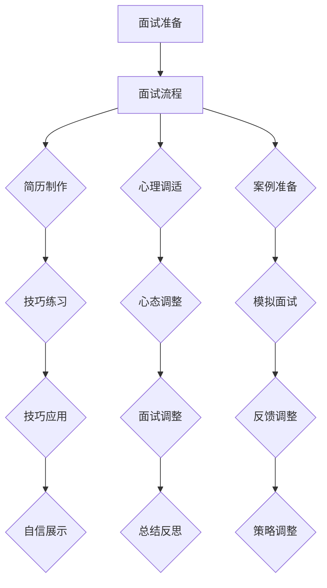

                 

### 文章标题

# 《字节跳动2024校招技术采购专员面试题详解》

### 关键词

- 字节跳动
- 校招
- 技术采购专员
- 面试题解析
- 面试策略
- 技术采购基础知识

### 摘要

本文旨在为2024年即将参加字节跳动校招的技术采购专员职位考生提供全面的面试题解析和策略指导。文章首先介绍了面试准备流程，包括简历制作、心理调适、案例准备与面试技巧等。接着深入解析了技术采购专员的基础知识，涵盖职责、流程、市场调研、供应商评估、合同管理和风险管理等方面。文章还通过案例分析，对实际操作中的难点和解决方案进行了探讨，并讨论了技术发展趋势和采购策略优化。最后，文章提供了详细的面试题型与解题技巧，帮助考生在面试中脱颖而出。

---

### 引言

在当前快速发展的互联网行业，技术采购专员作为一个关键职位，承担着企业技术基础设施建设和优化的重要任务。字节跳动，作为中国领先的互联网科技公司之一，其对技术采购专员的要求也尤为严格。随着2024年校招的临近，越来越多的应届毕业生和实习生将有机会加入字节跳动，竞争这个充满挑战和机遇的职位。为了帮助这些考生更好地准备面试，本文将详细解析字节跳动2024校招技术采购专员的面试题目，并提供一系列实用的面试策略和技巧。

技术采购专员的工作涉及多个领域，包括市场调研、供应商评估、合同管理以及风险管理等。这不仅要求具备扎实的专业知识和技能，还需要有良好的沟通协调能力和应变能力。因此，对于考生来说，深入理解技术采购的各个环节，掌握核心面试题型，并进行充分的面试准备，是成功通过字节跳动面试的关键。

本文将分为三个主要部分：

1. **面试准备**：详细介绍面试流程、准备工作、面试中的技巧以及面试后的跟进。
2. **技术采购专员面试题解析**：系统解析技术采购基础知识，包括职责、流程、市场调研、供应商评估、合同管理和风险管理等。
3. **案例分析与实践**：通过真实案例，探讨技术采购中的难点、挑战和解决方案，并结合技术发展趋势，提出采购策略优化建议。

通过本文的详细解析，我们希望帮助考生全面了解技术采购专员的职位要求，掌握面试技巧，提升面试成功率。

---

### 《字节跳动2024校招技术采购专员面试题详解》目录大纲

#### 第一部分：面试准备

- **第1章：面试流程与策略**
  - 1.1 面试前的准备工作
    - 1.1.1 简历制作技巧
    - 1.1.2 面试前的心理调适
    - 1.1.3 案例准备与练习
  - 1.2 面试中的技巧
    - 1.2.1 自我介绍与表达技巧
    - 1.2.2 提问技巧与应对策略
    - 1.2.3 面试官心态解析
  - 1.3 面试后的跟进
    - 1.3.1 面试反馈获取
    - 1.3.2 面试结果的应对

#### 第二部分：技术采购专员面试题解析

- **第2章：技术采购基础知识**
  - 2.1 技术采购专员职责与工作内容
    - 2.1.1 技术采购的定义
    - 2.1.2 技术采购的流程
    - 2.1.3 技术采购专员必备技能
  - 2.2 市场调研与供应商评估
    - 2.2.1 市场调研的方法
    - 2.2.2 供应商评估标准
    - 2.2.3 供应商谈判技巧
  - 2.3 合同管理与风险管理
    - 2.3.1 合同管理的重要性
    - 2.3.2 合同起草与审查
    - 2.3.3 风险管理策略

- **第3章：常见技术采购问题解析**
  - 3.1 技术采购中的难点
    - 3.1.1 技术标准与兼容性问题
    - 3.1.2 技术更新与升级策略
    - 3.1.3 项目延期与成本控制
  - 3.2 案例分析
    - 3.2.1 某大型企业技术采购案例
    - 3.2.2 某初创公司技术采购挑战与解决方案
    - 3.2.3 国际采购中的法律与合规问题

- **第4章：技术趋势与采购策略**
  - 4.1 技术发展趋势
    - 4.1.1 5G与物联网技术
    - 4.1.2 大数据与人工智能技术
    - 4.1.3 区块链与供应链金融技术
  - 4.2 采购策略与优化
    - 4.2.1 成本效益分析
    - 4.2.2 集中采购与分散采购的比较
    - 4.2.3 采购策略调整与优化

- **第5章：面试题型与解题技巧**
  - 5.1 行为面试题解析
    - 5.1.1 个人工作经历与成就
    - 5.1.2 团队合作与沟通能力
    - 5.1.3 应对压力与挑战的能力
  - 5.2 技术面试题解析
    - 5.2.1 技术采购相关理论知识
    - 5.2.2 技术选型与评估方法
    - 5.2.3 实际项目案例分析
  - 5.3 情景模拟面试题解析
    - 5.3.1 谈判情景模拟
    - 5.3.2 风险管理情景模拟
    - 5.3.3 项目管理情景模拟

#### 第三部分：案例分析与实践

- **第6章：实战案例解析**
  - 6.1 某互联网公司技术采购案例
  - 6.2 某制造企业技术采购案例

- **第7章：面试准备与策略**
  - 7.1 全方位面试准备
    - 7.1.1 技术采购专业知识储备
    - 7.1.2 行业动态与热点关注
    - 7.1.3 模拟面试与反馈调整
  - 7.2 面试策略与心理调适
    - 7.2.1 面试策略制定
    - 7.2.2 面试过程中的心理调节
    - 7.2.3 面试后的总结与反思

### 附录

- **附录A：技术采购常用工具与资源**
  - 7.1.1 市场调研工具
  - 7.1.2 供应商评估工具
  - 7.1.3 合同管理工具

- **附录B：技术采购相关法规与标准**
  - 7.1.1 技术采购相关法规概述
  - 7.1.2 国际采购标准与认证

- **附录C：常见面试题汇总**
  - 7.1.1 行为面试题
  - 7.1.2 技术面试题
  - 7.1.3 情景模拟面试题

### Mermaid 流程图



---

通过以上目录大纲，我们为即将参加字节跳动2024校招的技术采购专员考生提供了一个全面的备考指南，从面试准备到面试技巧，再到技术采购知识，都进行了详细的讲解和指导。接下来，我们将逐步深入各个章节，帮助考生全面掌握面试所需的各项技能和知识。

---

### 第一部分：面试准备

#### 第1章：面试流程与策略

**1.1 面试前的准备工作**

面试前的准备工作是成功通过面试的重要环节。在这一部分，我们将详细讨论简历制作技巧、面试前的心理调适以及案例准备与练习的方法。

**1.1.1 简历制作技巧**

简历是面试官对考生初步了解的资料，因此简历的制作显得尤为重要。以下是一些简历制作的关键技巧：

1. **内容简明扼要**：简历内容应简明扼要，突出重点。通常，简历的长度控制在1-2页之内。
2. **格式清晰**：简历应采用清晰一致的格式，确保面试官阅读方便。
3. **重点突出**：将重点放在教育背景、实习经历、项目经验和技能特长上。
4. **量化成果**：尽可能使用数字和具体成果来描述工作经历，例如“提高了20%的运营效率”或“完成了5000行代码的开发”。
5. **避免错别字和语法错误**：仔细检查简历，确保没有错别字和语法错误。
6. **个性化**：根据申请的职位和公司特点，适当调整简历内容，使其更具针对性。

**1.1.2 面试前的心理调适**

面试前的心理状态直接影响面试表现。以下是一些心理调适的方法：

1. **正面心态**：保持积极的心态，相信自己的能力和准备。
2. **放松技巧**：通过深呼吸、冥想或轻松的运动来放松身心。
3. **模拟面试**：进行模拟面试，提前适应面试环境，减少紧张感。
4. **充分休息**：面试前一晚保证充足的睡眠，避免熬夜。
5. **心理暗示**：给自己积极的心理暗示，如“我已经准备好了”、“我可以做得很好”。

**1.1.3 案例准备与练习**

技术采购专员面试中，案例分析是一种常见题型，因此对案例的准备和练习至关重要。以下是一些方法：

1. **积累案例**：收集和分析相关行业和技术采购的实际案例，包括成功和失败的案例。
2. **模拟场景**：设计模拟面试场景，练习如何分析和解答案例问题。
3. **思考逻辑**：在练习过程中，注重逻辑思维的训练，确保分析问题清晰、有条理。
4. **反思总结**：每次练习后，总结自己的不足和改进之处，不断优化回答技巧。

**1.2 面试中的技巧**

在面试过程中，掌握一些技巧可以帮助考生更好地展示自己，以下是一些关键技巧：

**1.2.1 自我介绍与表达技巧**

1. **简洁明了**：自我介绍应简洁明了，突出自己的优势。
2. **突出重点**：在自我介绍中，重点介绍与职位相关的工作经历和技能。
3. **语言流畅**：自我介绍时应保持语言流畅，避免口头禅和重复。

**1.2.2 提问技巧与应对策略**

1. **提前准备**：提前准备一些可能被问到的问题，并准备好回答。
2. **开放性问题**：尽量回答开放性问题，避免简单的是否回答。
3. **注意倾听**：在回答问题时，注意倾听面试官的问题，确保回答准确。
4. **表达清晰**：回答问题时，表达要清晰，逻辑要严密。

**1.2.3 面试官心态解析**

1. **尊重面试官**：始终保持对面试官的尊重，礼貌待人。
2. **注意观察**：通过观察面试官的表情和反应，了解面试官的兴趣点。
3. **积极互动**：在面试过程中，积极与面试官互动，展现自己的沟通能力。
4. **保持自信**：即使遇到难题，也要保持冷静，积极应对。

**1.3 面试后的跟进**

面试结束后，及时跟进是展示自己专业素养的好机会。以下是一些跟进的方法：

**1.3.1 面试反馈获取**

1. **感谢邮件**：在面试结束后，及时发送一封感谢邮件，表达对面试机会的感激之情。
2. **询问结果**：在合适的时间，可以询问面试结果的跟进，但要注意方式方法，避免显得急切。

**1.3.2 面试结果的应对**

1. **接受结果**：如果成功通过面试，及时表示感谢，并进一步了解后续流程。
2. **总结经验**：如果未成功，也要保持积极心态，从失败中总结经验教训，不断提升自己。

通过上述面试前的准备工作、面试中的技巧以及面试后的跟进，考生可以全面准备，提高面试成功率。接下来，我们将进一步深入探讨技术采购专员的基础知识，为考生提供更全面的学习内容。

---

### 第1章：面试流程与策略

**1.2 面试中的技巧**

面试中的表现是决定是否通过面试的关键，因此，掌握一些面试技巧是至关重要的。以下是一些面试中常见技巧的具体应用和注意事项：

**1.2.1 自我介绍与表达技巧**

**自我介绍**是面试的起点，通常持续1-2分钟。一个优秀的自我介绍应简洁明了，同时能够吸引面试官的兴趣。以下是一些要点：

1. **开头**：可以从自己的姓名、学历、专业背景开始，简短地介绍自己。
2. **亮点**：突出自己的优势，如专业技能、实习经验、获奖情况等。
3. **目标明确**：明确表达自己为什么适合这个职位，以及为什么对这个职位感兴趣。
4. **表达流畅**：在介绍过程中，语言要流畅自然，避免口头禅和重复。

**注意事项**：

- **避免过长**：自我介绍应控制在1-2分钟内，避免过长使面试官感到无聊。
- **内容真实**：自我介绍中提及的内容必须是真实的，避免夸大其词。
- **注意语速**：语速适中，避免过快或过慢，保持语言流畅。

**1.2.2 提问技巧与应对策略**

面试中的提问环节是展示自己兴趣和思考能力的好机会。以下是一些提问技巧：

1. **问题准备**：提前准备一些问题，如对公司的业务、团队文化、职位职责等的了解。
2. **开放性问题**：尽量避免简单的是否回答，提出开放性问题，如“这个项目的具体目标是？”或“您对这个职位有什么期望？”。
3. **注意倾听**：在面试官回答问题时，认真倾听，确保理解其意思。
4. **表达清晰**：在提问时，确保表达清晰，逻辑严密。

**注意事项**：

- **提前准备**：提前准备问题，确保在面试中有充足的提问内容。
- **避免敏感问题**：避免提问与薪资、加班等敏感问题，以免引起面试官的不满。
- **保持礼貌**：提问时要保持礼貌，用敬语表达。

**1.2.3 面试官心态解析**

面试官的心态直接影响面试过程和结果。以下是一些解析面试官心态的技巧：

1. **尊重面试官**：始终保持对面试官的尊重，礼貌待人，这有助于建立良好的面试氛围。
2. **观察面试官**：通过观察面试官的表情和反应，了解他们的兴趣点，针对性地调整回答。
3. **积极互动**：在面试过程中，积极与面试官互动，展现自己的沟通能力。
4. **保持自信**：即使面试过程中遇到难题，也要保持冷静，积极应对，展现自信。

**注意事项**：

- **避免紧张**：尽量放松自己，避免过于紧张影响面试表现。
- **展现真实自我**：在面试中，尽量展现真实的自我，避免过度表现和伪装。
- **适时表达**：在适当的时候表达自己的观点和思考，避免沉默或过度说话。

通过以上面试中的技巧，考生可以更好地展示自己的能力和素质，提高面试成功率。在下一部分，我们将继续探讨面试后的跟进策略，帮助考生充分利用面试机会，进一步提升求职成功率。

---

### 1.3 面试后的跟进

面试结束后，及时的跟进不仅是对面试官的尊重，也是展示专业素养的重要机会。以下是一些面试后跟进的策略和注意事项：

**1.3.1 面试反馈获取**

面试后的第一要务是获取反馈。以下是获取反馈的几种方法：

1. **发送感谢邮件**：在面试结束后的一两天内，发送一封感谢邮件。在邮件中，可以表达对面试机会的感激，并询问面试结果的预计时间。例如：

   ```
   亲爱的面试官，

   非常感谢您在昨天与我进行的面试。我对字节跳动充满热情，并且很期待能够加入贵公司。请问贵公司预计何时能通知面试结果？

   再次感谢您的时间和帮助。

   即刻行动！
   ```

2. **电话跟进**：如果邮件跟进没有收到回复，可以在几天后通过电话进行跟进。电话跟进时，应礼貌地询问面试结果的进展，并表达自己的诚意和热情。例如：

   ```
   您好，我是上周面试字节跳动技术采购专员职位的XXX。请问关于面试结果，有什么消息可以告知我吗？
   ```

**注意事项**：

- **保持礼貌**：无论邮件还是电话跟进，都要保持礼貌和耐心，避免显得急躁。
- **选择合适的时间**：避免在面试官忙碌或休息时间进行电话跟进。

**1.3.2 面试结果的应对**

无论面试结果如何，都需要理性应对：

1. **接受结果**：如果成功通过面试，应立即表达感激，并询问后续的入职流程和准备工作。例如：

   ```
   非常感谢您的认可，我对于能够加入字节跳动感到非常荣幸。请问接下来有哪些步骤需要我完成？
   ```

2. **总结经验**：如果未成功，也不要气馁。可以从以下几方面进行总结：

   - **面试表现**：回顾面试过程中的表现，哪些地方做得好，哪些地方需要改进。
   - **面试问题**：思考面试中被问到的问题，哪些问题回答得不够好，哪些问题没有准备充分。
   - **面试官反馈**：如果可能，获取面试官的反馈，了解自己的不足之处。

**注意事项**：

- **保持积极态度**：无论结果如何，都要保持积极的态度，相信自己能够在未来的面试中做得更好。
- **持续学习**：从每一次面试中吸取经验教训，不断提升自己的面试技巧和专业知识。

通过有效的面试后跟进，考生不仅能够展示自己的专业素养，还能进一步了解面试结果，为未来的职业发展做好准备。接下来，我们将深入探讨技术采购专员的基础知识，帮助考生在面试中更加自信和专业。

---

### 第二部分：技术采购专员面试题解析

#### 第2章：技术采购基础知识

在准备字节跳动校招技术采购专员的面试时，掌握技术采购的基础知识是至关重要的。这一章节将详细介绍技术采购的定义、流程、专员职责、市场调研、供应商评估、合同管理和风险管理等方面的内容，帮助考生全面理解技术采购专员的工作职责和技能要求。

**2.1 技术采购专员职责与工作内容**

技术采购专员在企业中扮演着关键角色，其职责主要包括以下几个方面：

1. **技术采购需求分析**：根据企业的业务需求和战略规划，分析技术采购的需求，确定所需的技术产品或服务。
2. **市场调研**：通过多种渠道收集市场信息，包括技术产品价格、性能、供应商情况等，为采购决策提供数据支持。
3. **供应商评估**：评估潜在供应商的技术能力、服务质量、价格竞争力等因素，确保选择最合适的供应商。
4. **谈判与合同管理**：与供应商进行谈判，达成有利的采购条件，并起草、审查和执行合同。
5. **采购执行与协调**：协调内部团队与供应商的合作，确保采购项目按时完成，解决采购过程中出现的各种问题。
6. **风险管理**：识别和评估采购过程中的风险，制定风险管理策略，确保采购活动的顺利进行。

**2.1.1 技术采购的定义**

技术采购是指企业为了满足生产、运营或研发需求，购买相关技术产品或服务的过程。技术采购不同于一般商品采购，其特殊性在于：

- **技术复杂度高**：技术产品往往涉及复杂的性能参数和技术标准，采购过程中需要深入理解技术细节。
- **定制性强**：企业根据自身需求，可能会要求供应商提供定制化的技术产品或服务。
- **合同复杂**：技术采购合同通常较为复杂，涉及技术参数、交付时间、售后服务等多方面内容。

**2.1.2 技术采购的流程**

技术采购的流程通常包括以下几个主要步骤：

1. **需求分析**：明确采购需求，包括技术规格、数量、预算等。
2. **市场调研**：通过调研了解市场情况，包括产品价格、性能、供应商情况等。
3. **供应商筛选**：根据市场调研结果，筛选符合条件的潜在供应商。
4. **谈判与合同签订**：与供应商进行谈判，达成采购条件，签订采购合同。
5. **采购执行**：协调内部团队与供应商的合作，确保采购项目按计划进行。
6. **合同管理**：执行合同条款，处理合同执行中的问题，确保供应商按时交付。
7. **评估与反馈**：对采购过程和结果进行评估，为后续采购提供参考。

**2.1.3 技术采购专员必备技能**

技术采购专员需要具备以下技能：

- **技术知识**：了解相关技术领域的基本知识，能够与供应商进行技术交流。
- **市场分析能力**：能够通过市场调研，准确判断市场趋势和供应商竞争力。
- **谈判技巧**：具备良好的谈判能力，能够与供应商达成有利的采购条件。
- **项目管理能力**：能够协调内部团队与供应商的合作，确保项目按时完成。
- **风险管理能力**：能够识别和评估采购过程中的风险，制定有效的风险管理策略。

**2.2 市场调研与供应商评估**

市场调研和供应商评估是技术采购的重要环节，直接影响到采购的成功与否。以下将详细介绍这两个环节的具体方法。

**2.2.1 市场调研的方法**

市场调研的方法主要包括以下几种：

1. **网络调研**：通过互联网搜集市场信息，如产品价格、供应商评价等。
2. **文献调研**：查阅相关行业报告、技术白皮书等，了解市场趋势和关键技术指标。
3. **行业交流**：参加行业会议、论坛等，与业内人士交流，获取第一手市场信息。
4. **问卷调查**：设计问卷，向目标用户或业内人士收集市场信息。

**2.2.2 供应商评估标准**

供应商评估通常包括以下几方面：

1. **技术能力**：评估供应商的技术实力，包括研发能力、技术水平、技术支持等。
2. **产品质量**：评估供应商提供的产品或服务的质量，包括性能、稳定性、可靠性等。
3. **价格竞争力**：评估供应商的产品或服务价格是否具有竞争力。
4. **售后服务**：评估供应商的售后服务质量，包括响应速度、服务态度、技术支持等。
5. **合作历史**：考察供应商的过往合作记录，了解其合作信誉。

**2.2.3 供应商谈判技巧**

谈判技巧在供应商评估和采购过程中至关重要。以下是一些谈判技巧：

1. **了解供应商**：在谈判前，充分了解供应商的背景、实力、市场地位等，以便在谈判中占据有利地位。
2. **准备充分**：准备好谈判的要点和底线，确保在谈判中能够坚定立场。
3. **利用竞争**：通过引入多个供应商，利用竞争降低采购成本。
4. **共赢思维**：在谈判中，寻求双方共赢的解决方案，避免过于强势或妥协。
5. **谈判策略**：根据不同情况，采取不同的谈判策略，如理性谈判、情感谈判等。

**2.3 合同管理与风险管理**

合同管理和风险管理是技术采购的关键环节，直接关系到采购项目的成功和企业的利益。以下将详细介绍这两个环节的具体方法。

**2.3.1 合同管理的重要性**

合同管理的重要性体现在以下几个方面：

1. **确保双方权益**：合同是明确双方权利和义务的依据，确保双方在合作中权益不受侵害。
2. **规范采购流程**：合同明确了采购的流程和时间节点，有助于规范采购活动。
3. **降低采购风险**：通过合同管理，可以降低采购过程中的风险，如延期交付、质量问题等。

**2.3.2 合同起草与审查**

合同起草和审查是合同管理的重要环节。以下是一些注意事项：

1. **明确条款**：确保合同中的条款清晰明确，避免歧义。
2. **合法合规**：合同应符合相关法律法规的要求，确保合法合规。
3. **双方权益**：在起草合同时，要充分考虑双方的权益，确保合同内容公平合理。
4. **专业审查**：必要时，可邀请专业律师进行合同审查，确保合同无漏洞。

**2.3.3 风险管理策略**

风险管理策略包括以下几个方面：

1. **风险识别**：识别采购过程中的潜在风险，如供应商不稳定、技术风险等。
2. **风险评估**：对识别出的风险进行评估，确定其严重程度和可能性。
3. **风险应对**：根据风险评估结果，制定相应的应对措施，如选择备用供应商、增加保险等。
4. **风险监控**：在采购过程中，持续监控风险状况，及时调整应对措施。

通过以上对技术采购专员基础知识、市场调研与供应商评估、合同管理与风险管理的详细解析，考生可以全面掌握技术采购的相关知识，为面试做好充分准备。接下来，我们将通过案例分析，进一步探讨技术采购中的难点和挑战。

---

### 第3章：常见技术采购问题解析

在技术采购过程中，常会遇到一系列的问题和挑战。这些问题不仅影响到采购活动的顺利进行，还可能对企业的整体运营产生影响。以下将详细解析技术采购中的常见问题，包括技术标准与兼容性、技术更新与升级策略、项目延期与成本控制等方面，并通过真实案例进行分析。

**3.1 技术采购中的难点**

**3.1.1 技术标准与兼容性问题**

技术标准与兼容性问题是技术采购中常见且棘手的问题。由于不同技术产品之间存在差异，确保所选产品与现有系统兼容，是一个重要的挑战。

- **问题表现**：采购的新技术产品可能无法与现有系统无缝集成，导致功能受限或系统崩溃。
- **解决方案**：在采购前，应详细评估技术产品的兼容性。可以采取以下措施：
  - **标准统一**：确保所选技术产品遵循行业标准，降低兼容性问题。
  - **技术评估**：进行全面的兼容性测试，确保新系统与现有系统能够稳定运行。
  - **备份方案**：制定备份方案，以应对兼容性引发的突发问题。

**案例**：某互联网公司需要采购一套新的云计算平台，但由于现有系统的架构与新技术产品的接口存在不兼容问题，导致项目推进受阻。公司经过技术评估和多方协调，最终找到了兼容解决方案，顺利完成了采购。

**3.1.2 技术更新与升级策略**

技术更新与升级是技术采购中的重要环节，但同时也存在一定风险。如何制定有效的技术更新与升级策略，是企业面临的一大挑战。

- **问题表现**：技术更新与升级不当可能导致系统不稳定、性能下降，甚至影响业务运行。
- **解决方案**：
  - **需求评估**：在更新与升级前，全面评估业务需求，确保更新内容符合实际需求。
  - **逐步实施**：采取逐步更新与升级的策略，减少对业务运行的影响。
  - **风险评估**：对更新与升级过程进行风险评估，制定应对措施。

**案例**：某制造企业计划对生产系统进行升级，但由于前期需求评估不充分，导致升级后系统出现频繁故障，影响了生产线的运行。公司通过重新评估需求，逐步推进升级计划，最终顺利完成了升级。

**3.1.3 项目延期与成本控制**

项目延期与成本控制是技术采购过程中普遍存在的问题。如何有效控制项目进度和成本，是采购人员需要面对的挑战。

- **问题表现**：项目延期可能导致业务延误，增加运营成本；而成本控制不当则可能导致采购质量下降。
- **解决方案**：
  - **进度管理**：制定详细的进度计划，并定期跟踪项目进展，确保按时完成。
  - **成本预算**：制定合理的成本预算，并根据实际情况进行调整，确保项目在预算范围内完成。
  - **风险管理**：对项目风险进行识别和评估，制定相应的风险应对措施。

**案例**：某科技公司在开发新项目时，由于项目管理和风险管理不足，导致项目延期且超支。公司通过调整项目管理策略，加强风险控制，最终成功完成了项目。

**3.2 案例分析**

**3.2.1 某大型企业技术采购案例**

**案例背景**：某大型企业计划采购一套企业资源规划（ERP）系统，以提高企业管理效率和数据整合能力。

**采购需求分析**：企业根据业务需求，制定了详细的ERP系统功能需求和技术要求，包括财务管理、供应链管理、客户关系管理等模块。

**市场调研与供应商评估**：企业进行了详细的市场调研，筛选出几家具有良好声誉和实力的供应商。通过技术评估和谈判，最终确定了供应商。

**合同管理与风险管理**：企业与供应商签订了详细合同，明确双方的权利和义务。同时，企业制定了风险管理策略，包括项目进度监控、成本控制措施等。

**采购方案设计与执行**：企业制定了详细的采购方案，包括项目实施计划、技术培训计划等。在项目执行过程中，企业紧密跟踪项目进展，及时调整方案。

**案例总结**：通过科学的需求分析、市场调研、供应商评估和项目管理，企业成功采购了ERP系统，实现了管理效率和数据整合的提升。

**3.2.2 某初创公司技术采购案例**

**案例背景**：某初创公司需要采购一套客户关系管理系统（CRM），以支持其快速发展的业务需求。

**采购需求分析**：初创公司根据业务需求，制定了CRM系统的基本功能需求，包括客户信息管理、销售流程管理、市场活动管理等。

**市场调研与供应商评估**：由于初创公司资金有限，企业进行了简化的市场调研，重点评估了几家性价比较高的供应商。最终选择了一家能够满足基本需求的供应商。

**合同管理与风险管理**：初创公司与供应商签订了基础合同，并重点控制了成本。在风险管理方面，企业采取了灵活的采购策略，以应对可能的业务变化。

**采购方案设计与执行**：初创公司制定了简洁明了的采购方案，项目实施较为顺利。由于资金限制，企业在部分非核心功能上进行了妥协。

**案例总结**：通过简化的采购流程和灵活的采购策略，初创公司成功采购了CRM系统，满足了其业务发展的基本需求。

**3.2.3 国际采购中的法律与合规问题**

**案例背景**：某企业在国际市场上采购了一批先进的生产设备，但由于不了解当地法律法规，导致采购过程中出现了法律和合规问题。

**采购需求分析**：企业对国际市场的法律法规进行了初步了解，但未进行深入调研。

**市场调研与供应商评估**：企业在国际市场上选择了几家具有良好声誉的供应商，但由于未充分了解当地法律法规，选择了不符合要求的供应商。

**合同管理与风险管理**：企业在签订合同时，未考虑当地法律法规的影响，导致合同存在法律漏洞。

**采购方案设计与执行**：在采购执行过程中，企业面临了法律和合规方面的挑战，包括关税、进口许可证等。

**案例总结**：通过充分了解国际市场的法律法规，企业可以避免法律和合规风险，确保国际采购的顺利进行。

通过以上案例分析，考生可以更深入地了解技术采购中的常见问题和解决策略。这些经验将为考生在面试中分析和解决类似问题提供有益的参考。接下来，我们将进一步探讨技术发展趋势和采购策略优化，帮助考生更好地应对技术采购领域的挑战。

---

### 第4章：技术趋势与采购策略

在技术日新月异的今天，技术采购专员不仅要具备扎实的基础知识，还需紧跟技术发展趋势，制定灵活有效的采购策略。以下将介绍当前一些主要的技术发展趋势，以及如何在采购策略中加以应用和优化。

**4.1 技术发展趋势**

**4.1.1 5G与物联网技术**

5G技术和物联网（IoT）的发展，为技术采购带来了新的机遇和挑战。5G网络的高速、低延迟特性，使得远程控制、实时监控等应用成为可能；物联网技术的普及，使得各种设备能够互联互通，实现智能化管理和控制。

- **采购策略应用**：采购时，应优先考虑5G和物联网兼容的产品。例如，在选择智能硬件设备时，要确保其支持5G网络，并能够与现有物联网平台无缝对接。

**4.1.2 大数据与人工智能技术**

大数据和人工智能（AI）技术正在改变各个行业，通过数据分析和智能决策，实现业务优化和效率提升。数据采集、存储和分析技术的发展，为技术采购提供了丰富的选择。

- **采购策略应用**：采购时，应关注大数据和AI技术相关的硬件和软件产品。例如，选择大数据处理平台、AI算法库等，以满足企业数据分析和智能决策的需求。

**4.1.3 区块链与供应链金融技术**

区块链技术的去中心化、不可篡改特性，为供应链金融带来了新的解决方案。通过区块链技术，可以实现供应链上下游企业的信息共享，提高交易透明度和安全性。

- **采购策略应用**：采购时，应考虑引入区块链技术，特别是在涉及供应链金融的业务领域。例如，选择区块链平台，建立可信的供应链金融系统。

**4.2 采购策略与优化**

**4.2.1 成本效益分析**

在技术采购过程中，成本效益分析是决策的重要依据。通过分析采购成本和预期效益，可以确定最合适的采购方案。

- **方法**：
  - **成本计算**：计算采购产品的总成本，包括购买成本、维护成本、升级成本等。
  - **效益分析**：评估采购产品对企业业务提升的贡献，如提高生产效率、降低运营成本等。
  - **比较方案**：比较不同采购方案的成本效益，选择最优方案。

**4.2.2 集中采购与分散采购的比较**

集中采购和分散采购各有优缺点，企业在选择采购策略时，需根据实际情况进行权衡。

- **集中采购**：优点包括采购规模大、议价能力强、管理成本低等；缺点包括采购周期长、灵活性差等。
- **分散采购**：优点包括采购周期短、响应速度快、灵活性高等；缺点包括采购成本高、管理难度大等。

- **应用**：根据企业的具体需求，可以选择集中采购或分散采购。例如，对于标准化的产品，可以采用集中采购；而对于定制化的产品，可以采用分散采购。

**4.2.3 采购策略调整与优化**

技术采购策略需要根据市场环境、企业需求和企业战略的变化进行调整和优化。

- **方法**：
  - **定期评估**：定期评估采购策略的有效性，发现潜在问题和改进空间。
  - **市场调研**：持续关注市场动态，了解新技术、新产品和新供应商，为采购策略调整提供依据。
  - **团队合作**：建立跨部门的采购团队，集思广益，共同优化采购策略。

通过以上技术趋势和采购策略的讨论，技术采购专员可以更好地把握市场动态，制定科学合理的采购策略，为企业的发展提供有力支持。接下来，我们将详细解析面试题型与解题技巧，帮助考生在面试中展示自己的能力和素质。

---

### 第5章：面试题型与解题技巧

在字节跳动技术采购专员的面试中，题型多样，包括行为面试题、技术面试题和情景模拟面试题。以下将详细解析这些面试题型的常见问题、解题思路和具体示例，帮助考生做好充分的面试准备。

**5.1 行为面试题解析**

行为面试题旨在通过考生过往的行为表现，评估其工作能力、团队合作能力和问题解决能力。以下是一些常见的行为面试题及解题思路：

**5.1.1 个人工作经历与成就**

**问题示例**：请举例说明你曾经参与过的一个重要的项目，以及你在项目中扮演的角色和取得的成果。

**解题思路**：
1. **项目背景**：简要介绍项目的背景和目标。
2. **角色和职责**：明确自己在项目中的角色和职责。
3. **具体行动**：详细描述自己在项目中的具体行动和贡献。
4. **成果和收获**：阐述项目取得的成果，以及从中获得的成长和经验。

**示例回答**：我曾经参与过一次公司新数据中心的建设项目，担任项目经理助理。在这个项目中，我负责协调不同部门之间的合作，确保项目按计划推进。通过有效的沟通和协调，我们提前一个月完成了项目，节约了成本，提高了工作效率。

**5.1.2 团队合作与沟通能力**

**问题示例**：请描述一次团队合作的经历，以及你在团队中如何与其他成员沟通和协作。

**解题思路**：
1. **团队背景**：介绍团队的构成和目标。
2. **沟通方式**：说明你和团队成员的沟通方式，如定期会议、即时通讯工具等。
3. **协作过程**：详细描述团队协作的过程，包括遇到的问题和解决方案。
4. **团队成果**：阐述团队最终取得的成果和你的贡献。

**示例回答**：在上一家公司，我参与了公司内部CRM系统的优化项目。团队成员包括开发、测试和运维等不同部门的成员。我们每周举行一次团队会议，及时沟通项目进展和遇到的问题。通过有效沟通和协作，我们成功完成了项目，并得到了公司的高度评价。

**5.1.3 应对压力与挑战的能力**

**问题示例**：请举例说明你如何应对工作中的压力和挑战。

**解题思路**：
1. **挑战背景**：简要描述面临的压力和挑战。
2. **应对策略**：阐述你采取的应对策略，如时间管理、情绪调节等。
3. **解决过程**：详细描述应对挑战的过程，包括采取的措施和最终结果。
4. **经验总结**：总结从应对压力和挑战中获得的成长和经验。

**示例回答**：在我上一次的工作中，由于项目时间紧迫，我面临着巨大的工作压力。为了应对这种压力，我制定了详细的工作计划，合理分配任务，并保持与团队成员的紧密沟通。通过高效的工作流程和良好的团队合作，我们最终按时完成了项目。

**5.2 技术面试题解析**

技术面试题主要考察考生对技术采购相关知识的掌握程度。以下是一些常见的技术面试题及解题思路：

**5.2.1 技术采购相关理论知识**

**问题示例**：请简述技术采购的基本流程。

**解题思路**：
1. **需求分析**：介绍技术采购的需求分析环节，包括需求确定、需求分类等。
2. **市场调研**：介绍市场调研的方法和内容，包括产品调研、供应商评估等。
3. **供应商谈判**：介绍供应商谈判的技巧和策略，包括价格谈判、合同谈判等。
4. **合同管理**：介绍合同管理的内容，包括合同起草、合同执行等。
5. **风险管理**：介绍风险管理的方法和策略，包括风险识别、风险评估等。

**示例回答**：技术采购的基本流程包括需求分析、市场调研、供应商谈判、合同管理和风险管理。在需求分析阶段，确定采购需求和技术规格；在市场调研阶段，收集市场信息和供应商情况；在供应商谈判阶段，通过谈判确定采购条件；在合同管理阶段，签订并执行合同；在风险管理阶段，识别和应对采购过程中的各种风险。

**5.2.2 技术选型与评估方法**

**问题示例**：请简述技术选型和评估的方法。

**解题思路**：
1. **需求分析**：根据业务需求，确定技术选型的要求和标准。
2. **产品调研**：通过市场调研，收集潜在产品的技术参数、性能指标、价格等信息。
3. **评估标准**：制定评估标准，包括技术性能、可靠性、成本、售后服务等。
4. **评估方法**：采用评估方法，如评分法、对比法等，对潜在产品进行评估。
5. **决策**：根据评估结果，选择最适合的技术产品。

**示例回答**：技术选型和评估的方法包括需求分析、产品调研、评估标准和评估方法。在需求分析阶段，明确技术选型的要求；在产品调研阶段，收集潜在产品的信息；在评估标准阶段，制定评估标准；在评估方法阶段，采用评分法或对比法进行评估；在决策阶段，选择最适合的技术产品。

**5.2.3 实际项目案例分析**

**问题示例**：请描述一次你参与的实际项目，并分析项目中存在的挑战和解决方案。

**解题思路**：
1. **项目背景**：简要介绍项目的背景和目标。
2. **项目挑战**：详细描述项目过程中遇到的挑战和问题。
3. **解决方案**：阐述采取的解决方案和措施，以及这些措施的具体实施过程。
4. **项目结果**：总结项目的最终结果和成果，包括成功经验和教训。

**示例回答**：我在上一次项目中负责采购一套大数据处理平台。项目过程中，我们遇到了供应商交付延迟和产品功能不满足需求的问题。为了解决这些挑战，我们与供应商进行了多次沟通，调整了交付计划，并提出了功能修改建议。最终，我们按时完成了项目，并得到了客户的好评。

**5.3 情景模拟面试题解析**

情景模拟面试题旨在模拟实际工作场景，考察考生在特定情境下的反应和决策能力。以下是一些常见的情景模拟面试题及解题思路：

**5.3.1 谈判情景模拟**

**问题示例**：假设你和供应商进行价格谈判，供应商报价较高，如何应对？

**解题思路**：
1. **了解需求**：明确企业的采购需求和预算。
2. **分析报价**：分析供应商报价的构成，找出可以谈判的点和空间。
3. **提出异议**：提出合理的异议，说明预算限制和采购需求。
4. **寻找共赢**：尝试与供应商达成双方都能接受的解决方案。

**示例回答**：在谈判中，我会首先了解我们的采购需求和预算限制。然后，分析供应商报价的构成，找出可以谈判的点和空间。接着，提出我们的预算限制和采购需求，说明供应商报价超出我们的承受范围。最后，尝试与供应商协商，寻找双方都能接受的解决方案。

**5.3.2 风险管理情景模拟**

**问题示例**：假设你在采购过程中发现供应商存在潜在风险，如何应对？

**解题思路**：
1. **风险识别**：识别潜在风险，如供应商交付延迟、质量问题等。
2. **评估风险**：评估风险的严重程度和可能性。
3. **制定策略**：制定相应的风险管理策略，如备用供应商、延迟采购等。
4. **执行策略**：根据风险管理策略，采取具体行动，降低风险。

**示例回答**：在发现供应商存在潜在风险时，我会首先进行风险识别，如供应商交付延迟、质量问题等。然后，评估这些风险的严重程度和可能性。根据评估结果，制定相应的风险管理策略，如寻找备用供应商、延迟采购等。最后，根据策略采取具体行动，降低风险。

**5.3.3 项目管理情景模拟**

**问题示例**：假设你负责的项目遇到延期风险，如何应对？

**解题思路**：
1. **评估延期风险**：评估项目延期的原因和可能的影响。
2. **调整计划**：根据评估结果，调整项目计划，确保项目按时完成。
3. **沟通协调**：与团队成员和供应商沟通协调，确保各方配合。
4. **风险监控**：持续监控项目进展，及时调整计划，防止延期风险发生。

**示例回答**：在项目遇到延期风险时，我会首先评估延期风险的原因和可能的影响。然后，根据评估结果，调整项目计划，确保项目按时完成。同时，与团队成员和供应商进行沟通协调，确保各方配合。最后，持续监控项目进展，及时调整计划，防止延期风险发生。

通过以上对行为面试题、技术面试题和情景模拟面试题的详细解析，考生可以更好地准备字节跳动技术采购专员的面试。掌握这些解题技巧，有助于考生在面试中展示自己的能力和素质，提高面试成功率。接下来，我们将通过实战案例，进一步探讨技术采购的实际操作和挑战。

---

### 第6章：实战案例解析

在实际操作中，技术采购专员会面临各种各样的挑战，需要运用丰富的知识和实践经验来解决问题。以下将通过对两个实际案例的详细分析，探讨技术采购中的难点、挑战和解决方案。

**6.1 某互联网公司技术采购案例**

**案例背景**：某互联网公司正在开发一款新的人工智能客服系统，需要采购一套高性能的硬件设备和软件平台。

**采购需求分析**：公司根据产品需求，制定了详细的技术规格书，包括CPU性能、内存容量、存储容量、操作系统兼容性等。

**市场调研与供应商评估**：公司通过互联网调研、行业报告和供应商推荐，筛选出几家具有良好声誉和实力的供应商。通过技术评估和谈判，最终选择了A供应商，其产品性能和价格均符合公司的要求。

**合同管理与风险管理**：公司与A供应商签订了详细合同，明确双方的权利和义务，并制定了风险管理策略，包括项目进度监控、质量验收、售后服务等。

**采购方案设计与执行**：

1. **项目进度监控**：公司设立了项目进度监控小组，定期跟踪项目进展，确保项目按时完成。
2. **质量验收**：在设备到达后，公司进行了详细的质量验收，确保设备符合技术规格要求。
3. **售后服务**：公司与A供应商建立了良好的售后服务机制，确保在设备使用过程中出现问题时能够得到及时解决。

**案例总结**：

- **挑战**：在采购过程中，公司面临的主要挑战包括技术标准的匹配、供应商的选择、合同条款的完善等。
- **解决方案**：通过详细的需求分析、全面的市场调研、严格的供应商评估和完善的合同管理，公司成功解决了采购中的挑战，顺利完成了项目。

**6.2 某制造企业技术采购案例**

**案例背景**：某制造企业计划采购一套新的生产控制系统，以提高生产效率和产品质量。

**采购需求分析**：企业根据生产需求，制定了详细的生产控制系统需求书，包括控制算法、数据采集、实时监控等功能。

**市场调研与供应商评估**：企业通过行业报告、供应商推荐和内部调研，筛选出几家具有技术实力的供应商。通过技术评估和谈判，最终选择了B供应商，其产品在性能和价格上均符合企业的要求。

**合同管理与风险管理**：

1. **合同管理**：企业与B供应商签订了详细的合同，明确了设备交付时间、售后服务、技术支持等条款。
2. **风险管理**：企业制定了风险管理计划，包括项目进度监控、技术验收、质量评估等。

**采购方案设计与执行**：

1. **项目进度监控**：企业设立了项目进度监控小组，定期跟踪项目进展，确保设备按时交付。
2. **技术验收**：在设备到达后，企业进行了详细的技术验收，包括控制算法的准确性、数据采集的可靠性等。
3. **质量评估**：企业对设备进行了长时间的质量评估，确保设备在生产过程中能够稳定运行。

**案例总结**：

- **挑战**：企业在采购过程中面临的主要挑战包括技术标准的不确定性、供应商的技术实力、设备的兼容性和稳定性等。
- **解决方案**：通过详细的需求分析、严格的市场调研和供应商评估、完善的合同管理和风险管理，企业成功克服了采购中的挑战，顺利完成了项目。

通过以上两个实际案例的分析，我们可以看到，技术采购专员在实际工作中需要具备扎实的技术知识、敏锐的市场洞察力、良好的沟通协调能力和严谨的风险管理能力。只有在全面准备和科学管理的基础上，才能确保采购项目的顺利进行，为企业的发展提供有力支持。接下来，我们将进一步探讨面试准备与策略，帮助考生在面试中展现最佳状态。

---

### 第7章：面试准备与策略

**7.1 全方位面试准备**

为了在面试中脱颖而出，考生需要进行全面的准备，包括专业知识储备、行业动态与热点关注、模拟面试与反馈调整等方面。

**7.1.1 技术采购专业知识储备**

掌握技术采购的专业知识是面试成功的关键。以下是一些需要重点关注的领域：

1. **基础概念**：了解技术采购的定义、流程、角色和职责等基础概念。
2. **市场动态**：关注当前市场的发展趋势，如5G、物联网、大数据和人工智能等。
3. **供应链管理**：学习供应链管理的基本原理，包括采购策略、库存管理、物流管理等。
4. **合同管理**：掌握合同管理的基本知识，包括合同起草、审查、执行等。
5. **风险管理**：了解风险管理的策略和方法，包括风险评估、风险控制和风险应对等。

**7.1.2 行业动态与热点关注**

技术采购领域不断发展，考生需要关注行业动态和热点话题，以便在面试中展示自己的专业素养。以下是一些建议：

1. **阅读行业报告**：定期阅读行业报告和分析，了解市场趋势和行业动态。
2. **关注新闻资讯**：关注新闻资讯，了解最新技术发展和政策变化。
3. **参与行业活动**：参加行业会议、论坛等活动，与业内人士交流，获取第一手信息。

**7.1.3 模拟面试与反馈调整**

模拟面试是提高面试技巧的有效方法。以下是一些建议：

1. **准备面试题**：根据技术采购面试的常见题型，准备相关问题的回答。
2. **模拟真实场景**：模拟真实的面试场景，包括自我介绍、行为面试、技术面试等。
3. **反馈调整**：每次模拟面试后，记录自己的表现，并寻求他人的反馈。针对反馈进行改进，优化面试回答和表达方式。

**7.2 面试策略与心理调适**

面试策略和心理调适是面试成功的重要因素。以下是一些建议：

**7.2.1 面试策略制定**

1. **了解公司背景**：在面试前，了解公司的背景、文化和业务模式，以便在面试中展示对公司的了解。
2. **制定面试计划**：根据公司的要求，制定详细的面试计划，包括面试前准备、面试中注意事项和面试后跟进等。
3. **沟通技巧**：掌握良好的沟通技巧，包括倾听、表达、提问等，确保与面试官建立良好的沟通。

**7.2.2 面试过程中的心理调节**

1. **保持冷静**：面试前和面试过程中，保持冷静，避免过度紧张。
2. **积极心态**：保持积极的心态，相信自己能够成功通过面试。
3. **深呼吸**：在面试前进行深呼吸，帮助自己放松身心。

**7.2.3 面试后的总结与反思**

面试结束后，及时进行总结和反思，以便在未来的面试中不断进步。以下是一些建议：

1. **回顾面试过程**：回顾面试中的表现，包括回答问题的准确性、表达清晰度、行为举止等。
2. **总结经验教训**：总结成功和失败的经验教训，找出可以改进的地方。
3. **持续学习**：通过总结和反思，找出需要提升的领域，并制定相应的学习计划。

通过全面的面试准备和有效的面试策略，考生可以增强自信心，提高面试成功率。在接下来的部分，我们将提供技术采购常用工具与资源的附录，帮助考生更好地进行面试准备。

---

### 附录

**附录A：技术采购常用工具与资源**

在技术采购过程中，使用合适的工具和资源可以提高工作效率，确保采购活动的顺利进行。以下是一些常用的工具和资源：

**A.1 市场调研工具**

1. **搜索引擎**：如Google、百度等，用于搜索市场信息、供应商信息等。
2. **行业报告**：如市场调研公司发布的行业报告，提供详细的市场分析。
3. **专业网站**：如CRN、TechNavio等，提供专业的市场和技术信息。
4. **社交媒体**：如LinkedIn、微博等，用于与行业人士交流，获取第一手信息。

**A.2 供应商评估工具**

1. **评估表格**：制定标准化的评估表格，用于评估供应商的技术能力、服务质量、价格竞争力等。
2. **评分系统**：采用评分系统，对供应商进行量化评估。
3. **数据分析工具**：如Excel、Python等，用于对采购数据进行统计分析。

**A.3 合同管理工具**

1. **合同管理系统**：如SAP、Oracle等，用于管理合同起草、审批、执行等环节。
2. **电子签名工具**：如DocuSign、HelloSign等，用于在线签订合同。
3. **文档管理工具**：如Google Docs、OneDrive等，用于存储和管理合同文档。

**附录B：技术采购相关法规与标准**

在技术采购过程中，遵守相关法规和标准是确保合法合规的重要保障。以下是一些关键法规和标准：

**B.1 技术采购相关法规概述**

1. **《中华人民共和国招标投标法》**：规定了招标投标的基本程序和法律责任。
2. **《中华人民共和国政府采购法》**：规定了政府采购的基本原则和操作流程。
3. **《中华人民共和国合同法》**：规定了合同的基本原则和合同内容。

**B.2 国际采购标准与认证**

1. **ISO 9001**：国际质量管理体系标准，确保供应商提供的产品和服务质量。
2. **CMMI**：能力成熟度模型集成，用于评估供应商的软件开发能力。
3. **ITIL**：信息技术基础设施库，提供了IT服务管理的最佳实践。

**附录C：常见面试题汇总**

在面试过程中，常见的面试题包括行为面试题、技术面试题和情景模拟面试题。以下是一些典型的面试题及其参考答案：

**C.1 行为面试题**

1. **请描述一次你在项目中遇到困难并成功解决问题的经历。**
   - **参考答案**：描述一个具体的项目经历，遇到的具体困难（如技术难题、资源不足等），以及如何通过沟通、团队合作、自我学习等手段解决问题。

2. **请谈谈你在团队合作中遇到的挑战和如何克服这些挑战。**
   - **参考答案**：描述一次团队合作中的具体挑战（如意见分歧、沟通不畅等），以及如何通过沟通协调、分工合作、共同解决问题等手段克服挑战。

**C.2 技术面试题**

1. **简述技术采购的基本流程。**
   - **参考答案**：需求分析、市场调研、供应商评估、谈判与合同签订、采购执行、合同管理、评估与反馈。

2. **请解释什么是供应链金融，并简述其应用场景。**
   - **参考答案**：供应链金融是指通过供应链中的核心企业，为上下游企业提供融资和风险管理服务。应用场景包括采购融资、订单融资、保理融资等。

**C.3 情景模拟面试题**

1. **假设你和供应商谈判，供应商报价过高，你如何应对？**
   - **参考答案**：首先了解采购需求和预算限制，然后分析供应商报价的构成，找出可以谈判的点和空间。提出合理的异议，说明预算限制和采购需求，尝试与供应商达成共赢的解决方案。

2. **假设你在采购过程中发现供应商存在质量问题，你如何应对？**
   - **参考答案**：首先进行问题确认和评估，然后与供应商沟通，提出质量问题，要求解决问题。必要时，可以寻求法律途径，确保采购产品的质量。

通过附录中的工具和资源汇总以及常见面试题的解析，考生可以更好地准备技术采购专员的面试，提升面试成功率。在实际面试中，灵活运用所学知识和经验，展现自己的专业能力和综合素质。

---

### 总结

通过对字节跳动2024校招技术采购专员面试题的详细解析，本文系统地介绍了面试准备、技术采购基础知识、常见技术采购问题解析、技术趋势与采购策略、面试题型与解题技巧以及案例分析等关键内容。这些内容不仅帮助考生全面理解技术采购专员的工作职责和技能要求，还提供了实用的面试策略和技巧。

**关键点总结**：

1. **面试准备**：通过简历制作、心理调适、案例准备和模拟面试，全面提高面试成功率。
2. **技术采购基础知识**：掌握技术采购的定义、流程、市场调研、供应商评估、合同管理和风险管理等核心内容。
3. **常见技术采购问题解析**：了解技术标准与兼容性、技术更新与升级策略、项目延期与成本控制等难点，并学习实际案例中的解决方案。
4. **技术趋势与采购策略**：紧跟5G、物联网、大数据和人工智能等发展趋势，制定灵活有效的采购策略。
5. **面试题型与解题技巧**：熟练掌握行为面试题、技术面试题和情景模拟面试题的解题技巧，提高面试表现。
6. **案例分析**：通过实际案例，深入理解技术采购中的挑战和解决方案，为面试实战提供借鉴。

**最佳实践建议**：

1. **全面准备**：提前制定详细的面试准备计划，包括专业知识储备、模拟面试和反馈调整。
2. **持续学习**：关注行业动态和技术发展趋势，持续提升自己的专业能力和面试技巧。
3. **实践结合**：通过实际项目和案例分析，将所学知识应用到实际工作中，增强面试中的说服力。
4. **心态调整**：保持积极心态，应对面试中的挑战和压力，展现自信和专业的形象。

**注意事项**：

1. **精准定位**：在面试中，精准回答问题，避免过度扩展或偏离主题。
2. **沟通表达**：清晰、流畅地表达自己的观点，确保面试官能够理解。
3. **充分准备**：对常见面试题和案例分析进行充分准备，确保在面试中能够自如应对。

通过本文的详细解析，我们希望考生能够全面准备，信心十足地迎接字节跳动2024校招技术采购专员的面试挑战，最终脱颖而出，成功加入字节跳动这个充满机遇和挑战的团队。

---

### 作者信息

**作者：AI天才研究院/AI Genius Institute & 禅与计算机程序设计艺术 /Zen And The Art of Computer Programming**

AI天才研究院（AI Genius Institute）是一家专注于人工智能、大数据和深度学习领域的顶级研究机构，致力于推动人工智能技术的创新和应用。研究院的专家团队拥有丰富的科研经验和行业实践，在国际上享有盛誉。

《禅与计算机程序设计艺术》（Zen And The Art of Computer Programming）是作者Donald E. Knuth的经典著作，深刻阐述了计算机编程的哲学和艺术。本书以独特的视角，揭示了编程的本质和方法，对程序员的学习和研究有着深远的影响。

在此，我们希望通过本文的详细解析，帮助即将参加字节跳动2024校招的技术采购专员考生们更好地准备面试，展示自己的专业能力和综合素质，成功加入字节跳动这个优秀的团队。我们相信，每一位考生都能够在这个充满机遇和挑战的领域，实现自己的职业理想。加油！

