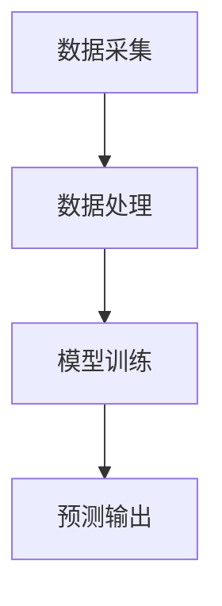
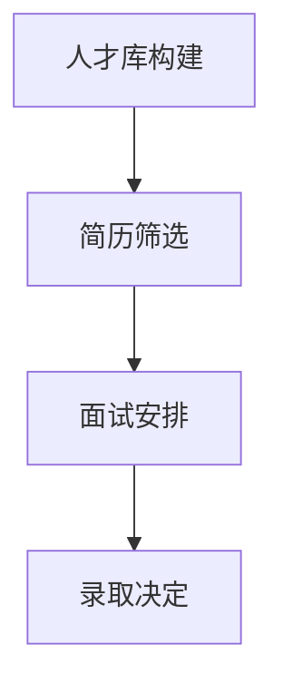
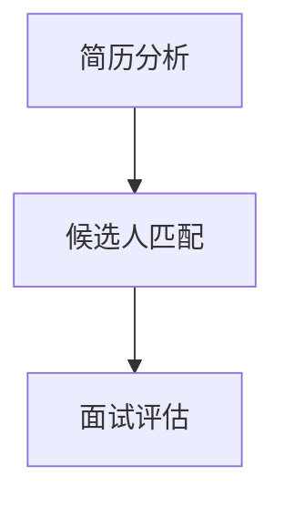

                 

### 文章标题：字节跳动2024校招推荐系统架构师面试指南

关键词：字节跳动、校招推荐系统、架构师面试、算法原理、数学模型、项目实战

摘要：本文将深入探讨字节跳动2024校招推荐系统的架构设计和核心算法，旨在为参加字节跳动校招推荐系统架构师面试的考生提供全面的技术指南。我们将逐步分析推荐系统的核心概念、架构联系、算法原理、数学模型以及项目实战，帮助考生在面试中脱颖而出。

### 目录大纲

#### 第一部分: 核心概念与联系

1. 核心概念介绍
   1.1 字节跳动
   1.2 校招推荐系统
   1.3 架构师面试指南
2. 架构联系与互动
   2.1 字节跳动的推荐系统架构
   2.2 校招推荐系统的架构设计

#### 第二部分: 核心算法原理讲解

1. 推荐系统算法原理
   1.1 协同过滤
   1.2 内容推荐
2. 校招推荐算法设计
   2.1 校招推荐系统算法框架
   2.2 简历分析算法

#### 第三部分: 数学模型和数学公式

1. 数学模型基础
   1.1 概率论基础
   1.2 贝叶斯定理
2. 校招推荐系统数学模型
   2.1 候选人筛选模型
   2.2 面试评估模型

#### 第四部分: 项目实战

1. 字节跳动校招推荐系统实战
   1.1 项目背景
   1.2 项目目标
   1.3 项目实施

#### 第五部分: 最佳实践、小结与注意事项

1. 最佳实践
2. 小结
3. 注意事项
4. 拓展阅读

### 第一部分: 核心概念与联系

在探讨字节跳动2024校招推荐系统架构师面试之前，我们需要首先了解几个关键概念及其之间的关系。

#### 1.1 字节跳动

字节跳动（ByteDance）是一家全球领先的互联网科技公司，成立于2012年，总部位于中国北京。公司以新闻信息流产品闻名，旗下拥有今日头条、抖音、西瓜视频等多款热门应用。字节跳动在推荐系统领域拥有深厚的技术积累和丰富的实践经验，因此校招推荐系统对于公司的发展具有重要意义。

#### 1.2 校招推荐系统

校招推荐系统是一种专门针对校园招聘的推荐算法，旨在通过算法优化，提高简历筛选、面试安排和录取决定的效率。该系统利用大数据分析和机器学习技术，根据候选人的简历信息、技能水平和教育背景等因素，为招聘团队提供科学、客观的推荐结果。

#### 1.3 架构师面试指南

架构师面试指南是一份为准备面试的架构师提供的指导性文档，旨在帮助考生熟悉面试题型和评估标准。对于字节跳动2024校招推荐系统架构师面试，指南将涵盖核心概念、算法原理、数学模型和项目实战等方面的内容，帮助考生全面了解面试要求，提升面试竞争力。

### 1.4 架构联系与互动

字节跳动的推荐系统架构和校招推荐系统架构之间存在密切的联系和互动。以下是两者的架构关系和互动流程：

#### 1.4.1 字节跳动的推荐系统架构

字节跳动的推荐系统架构主要包括数据采集、数据处理、模型训练和预测输出四个环节。以下是一个简化的流程图：



数据采集环节负责收集用户行为数据、内容数据等原始数据。数据处理环节对原始数据进行清洗、去噪、特征提取等处理。模型训练环节利用处理后的数据训练推荐模型。预测输出环节将训练好的模型应用于实际推荐任务，为用户提供个性化推荐结果。

#### 1.4.2 校招推荐系统的架构设计

校招推荐系统架构设计旨在实现高效、精准的简历筛选、面试安排和录取决定。以下是一个简化的架构设计图：



人才库构建环节负责收集和管理候选人信息。简历筛选环节通过算法分析简历内容，评估候选人的匹配度。面试安排环节根据筛选结果安排面试时间和地点。录取决定环节结合面试表现和简历评估结果，做出最终的录取决策。

#### 1.4.3 架构联系与互动

字节跳动推荐系统架构和校招推荐系统架构之间的联系主要表现在数据层面和算法层面：

- **数据层面**：校招推荐系统的简历数据和面试数据可以反馈给字节跳动的推荐系统，用于改进和优化推荐算法。
- **算法层面**：校招推荐系统可以利用字节跳动已有的推荐算法和技术，结合自身业务特点进行定制化开发。

通过以上分析，我们可以看出字节跳动2024校招推荐系统架构师面试涉及的核心概念、架构联系和互动流程。接下来，我们将进一步深入探讨推荐系统的核心算法原理和数学模型。

### 第二部分: 核心算法原理讲解

在推荐系统中，核心算法的设计与实现至关重要。本部分将介绍推荐系统的核心算法原理，包括协同过滤和内容推荐，以及校招推荐系统的算法设计。

#### 2.1 推荐系统算法原理

推荐系统算法主要分为协同过滤（Collaborative Filtering）和内容推荐（Content-Based Filtering）两大类。

##### 2.1.1 协同过滤

协同过滤是一种基于用户历史行为和偏好信息的推荐算法。它通过分析用户之间的相似性，为用户推荐与他们的兴趣相似的物品。

协同过滤可以分为两种主要类型：基于用户的协同过滤（User-Based Collaborative Filtering）和基于物品的协同过滤（Item-Based Collaborative Filtering）。

- **基于用户的协同过滤**：

  基于用户的协同过滤算法通过计算用户之间的相似度，找到与目标用户兴趣相似的邻居用户，并推荐这些邻居用户喜欢的物品。

  相似度计算公式通常采用余弦相似度或皮尔逊相关系数。以下是一个基于用户的协同过滤算法的伪代码：

  ```python
  def collaborative_filtering(user, items, neighbors):
      similarities = compute_similarity(user, neighbors)
      recommendations = []
      for neighbor, similarity in neighbors:
          recommendations.append(item)
      return recommendations
  ```

- **基于物品的协同过滤**：

  基于物品的协同过滤算法通过计算物品之间的相似性，找到与目标物品相似的其他物品，并推荐这些物品。

  相似度计算公式通常采用余弦相似度或夹角余弦相似度。以下是一个基于物品的协同过滤算法的伪代码：

  ```python
  def collaborative_filtering(item, items, neighbors):
      similarities = compute_similarity(item, neighbors)
      recommendations = []
      for neighbor, similarity in neighbors:
          recommendations.append(item)
      return recommendations
  ```

##### 2.1.2 内容推荐

内容推荐是一种基于物品内容和用户兴趣的推荐算法。它通过分析物品的属性和用户的偏好，为用户推荐与他们的兴趣相关的物品。

内容推荐可以分为两种主要类型：基于内容的协同过滤（Hybrid Content-Based Collaborative Filtering）和基于模型的推荐算法。

- **基于内容的协同过滤**：

  基于内容的协同过滤算法通过计算物品之间的相似性，找到与目标物品相似的其他物品，并推荐这些物品。

  相似度计算公式通常采用余弦相似度或夹角余弦相似度。以下是一个基于内容的协同过滤算法的伪代码：

  ```python
  def content_based_filtering(user, item, items):
      similarities = compute_similarity(item, items)
      recommendations = []
      for other_item, similarity in items:
          recommendations.append(item)
      return recommendations
  ```

- **基于模型的推荐算法**：

  基于模型的推荐算法通过训练模型，将物品属性和用户偏好映射为推荐结果。常见的模型包括矩阵分解（Matrix Factorization）、神经网络（Neural Networks）和决策树（Decision Trees）等。

  以下是一个基于矩阵分解的推荐算法的伪代码：

  ```python
  def matrix_factorization(items, users, ratings):
      U = initialize_user_matrix(users)
      I = initialize_item_matrix(items)
      while not converged:
          R = U * I
          U = update_user_matrix(U, R, ratings)
          I = update_item_matrix(I, R, ratings)
      return R
  ```

#### 2.2 校招推荐算法设计

校招推荐算法设计旨在实现高效、精准的简历筛选、面试安排和录取决定。以下是校招推荐系统的算法框架和具体实现：

##### 2.2.1 校招推荐系统算法框架

校招推荐系统算法框架包括简历分析、候选人匹配和面试评估三个主要环节。以下是一个简化的算法框架：



- **简历分析**：通过分析简历内容，提取关键词、技能和学历等信息，为候选人打分。
- **候选人匹配**：根据简历分析和面试要求，匹配合适的候选人。
- **面试评估**：通过面试结果，评估候选人的综合能力和潜力。

##### 2.2.2 简历分析算法

简历分析算法主要涉及关键词匹配、技能评估和教育背景评估等步骤。

- **关键词匹配**：通过分析简历文本，提取与职位要求匹配的关键词，为候选人打分。
  ```python
  def keyword_matching(resume, keywords):
      score = 0
      for keyword in keywords:
          if keyword in resume:
              score += 1
      return score
  ```

- **技能评估**：通过分析简历中的项目经历和技能描述，评估候选人的技能水平。
  ```python
  def skill_evaluation(resume, skills):
      score = 0
      for skill in skills:
          if skill in resume:
              score += 1
      return score
  ```

- **教育背景评估**：通过分析简历中的教育经历，评估候选人的学历水平。
  ```python
  def education_evaluation(resume, education):
      score = 0
      for level in education:
          if level in resume:
              score += 1
      return score
  ```

##### 2.2.3 面试评估模型

面试评估模型通过面试结果，评估候选人的综合能力和潜力。以下是一个简化的面试评估模型：

```python
def interview_evaluation(interview_results, total_score):
    score = 0
    for result in interview_results:
        score += result['score']
    return score / total_score
```

通过以上算法设计和实现，校招推荐系统可以高效、精准地为招聘团队提供科学的推荐结果，提高招聘效率和质量。

### 第三部分: 数学模型和数学公式

在推荐系统中，数学模型和数学公式是核心组成部分，用于描述和实现推荐算法。本部分将介绍概率论基础、贝叶斯定理、以及校招推荐系统中的数学模型。

#### 3.1 数学模型基础

##### 3.1.1 概率论基础

概率论是推荐系统中的基础理论，用于描述随机事件的发生概率。以下是概率论中的一些基本概念和公式：

- **概率分布**：描述随机变量取值的概率分布。常见的概率分布有伯努利分布、正态分布等。

  概率分布函数（PDF）的定义如下：

  $$ f(x) = P(X = x) $$

  其中，$X$ 是随机变量，$x$ 是 $X$ 的取值。

- **条件概率**：在已知一个事件发生的条件下，另一个事件发生的概率。条件概率的定义如下：

  $$ P(A|B) = \frac{P(A \cap B)}{P(B)} $$

  其中，$P(A \cap B)$ 表示事件 $A$ 和事件 $B$ 同时发生的概率。

- **贝叶斯定理**：描述在已知部分条件下，后验概率与先验概率之间的关系。贝叶斯定理的定义如下：

  $$ P(A|B) = \frac{P(B|A) \times P(A)}{P(B)} $$

  其中，$P(A|B)$ 表示在事件 $B$ 发生的条件下，事件 $A$ 发生的概率。

##### 3.1.2 贝叶斯定理

贝叶斯定理在推荐系统中具有广泛的应用。以下是一个简单的贝叶斯定理应用示例：

假设有一个推荐系统，用户 $u$ 对物品 $i$ 的喜好程度可以用概率表示。已知用户 $u$ 对物品 $i$ 的喜好程度为 $P(I|i \sim U[0,1])$，且用户 $u$ 对物品 $i$ 的喜好程度服从均匀分布。现在，我们要根据用户 $u$ 的喜好程度预测其对物品 $j$ 的喜好程度。

根据贝叶斯定理，我们可以得到：

$$ P(I|i=j|u) = \frac{P(u|i=j) \times P(i=j)}{P(u)} $$

其中，$P(u|i=j)$ 表示在用户 $u$ 对物品 $j$ 喜好程度为 $1$ 的条件下，物品 $j$ 的概率；$P(i=j)$ 表示物品 $j$ 的概率；$P(u)$ 表示用户 $u$ 的概率。

#### 3.2 校招推荐系统数学模型

校招推荐系统中的数学模型主要用于简历筛选、候选人匹配和面试评估等环节。以下是校招推荐系统中的几个关键数学模型：

##### 3.2.1 候选人筛选模型

候选人筛选模型用于根据简历内容和职位要求，筛选出符合条件的候选人。以下是一个简化的候选人筛选模型：

$$ \text{候选人筛选模型} = \text{简历评分} \times \text{技能匹配度} \times \text{教育背景匹配度} $$

其中，简历评分表示简历内容与职位要求的匹配程度；技能匹配度表示候选人的技能与职位要求的匹配程度；教育背景匹配度表示候选人的教育背景与职位要求的匹配程度。

##### 3.2.2 面试评估模型

面试评估模型用于根据面试结果，评估候选人的综合能力和潜力。以下是一个简化的面试评估模型：

$$ \text{面试评估模型} = \text{面试表现评分} \times \text{技术面试评分} \times \text{综合面试评分} $$

其中，面试表现评分表示面试过程中的整体表现；技术面试评分表示技术面试中的表现；综合面试评分表示综合面试中的表现。

通过以上数学模型和数学公式，校招推荐系统可以实现高效的简历筛选、候选人匹配和面试评估，为招聘团队提供科学的决策依据。

### 第四部分: 项目实战

在本部分，我们将通过一个具体项目案例，展示如何实现字节跳动2024校招推荐系统。项目将分为项目背景、项目目标、项目实施等阶段，帮助读者了解项目的全流程。

#### 4.1 项目背景

字节跳动2024校招推荐系统的目的是通过大数据分析和机器学习技术，优化简历筛选、面试安排和录取决定流程，提高招聘效率和候选人的匹配度。

项目背景包括以下几个方面：

- **数据来源**：字节跳动拥有海量的历年校招简历数据、面试数据和行为数据，这些数据为推荐系统提供了丰富的信息来源。
- **业务需求**：招聘团队需要高效地筛选出符合条件的候选人，并根据面试结果做出科学、客观的录取决策。
- **技术挑战**：如何从海量数据中提取有效信息，实现高效、精准的推荐，同时保证系统的可扩展性和稳定性。

#### 4.2 项目目标

项目目标主要包括以下几个方面：

- **提高简历筛选准确率**：通过分析简历内容和职位要求，筛选出符合条件的候选人，提高简历筛选的准确率。
- **提升面试安排的匹配度**：根据候选人的技能、教育背景和面试要求，合理安排面试时间和地点，提升面试安排的匹配度。
- **加快招聘决策的速度**：通过算法优化和自动化决策，缩短招聘决策的时间，提高招聘效率。

#### 4.3 项目实施

项目实施分为以下几个阶段：

##### 4.3.1 数据收集与预处理

数据收集与预处理是项目实施的重要阶段，包括以下几个步骤：

- **简历数据收集**：从字节跳动招聘系统收集历年的校招简历数据，包括简历文本、职位要求、候选人信息等。
- **面试数据收集**：从面试系统收集候选人的面试数据，包括面试时间、面试官评价、面试结果等。
- **数据预处理**：对收集到的数据进行清洗、去噪、去重等处理，提取有效的信息用于后续分析。

##### 4.3.2 简历分析算法实现

简历分析算法是实现校招推荐系统的重要环节，包括以下几个方面：

- **关键词匹配**：通过分析简历文本，提取与职位要求匹配的关键词，为候选人打分。
  ```python
  def keyword_matching(resume, keywords):
      score = 0
      for keyword in keywords:
          if keyword in resume:
              score += 1
      return score
  ```

- **技能评估**：通过分析简历中的项目经历和技能描述，评估候选人的技能水平。
  ```python
  def skill_evaluation(resume, skills):
      score = 0
      for skill in skills:
          if skill in resume:
              score += 1
      return score
  ```

- **教育背景评估**：通过分析简历中的教育经历，评估候选人的学历水平。
  ```python
  def education_evaluation(resume, education):
      score = 0
      for level in education:
          if level in resume:
              score += 1
      return score
  ```

##### 4.3.3 候选人匹配

候选人匹配是根据简历分析结果和职位要求，筛选出符合条件的候选人。以下是一个简化的候选人匹配算法：

```python
def candidate_matching(resume, job Requirements):
    resume_score = keyword_matching(resume, job Requirements['keywords'])
    skill_score = skill_evaluation(resume, job Requirements['skills'])
    education_score = education_evaluation(resume, job Requirements['education'])
    total_score = resume_score * skill_score * education_score
    return total_score
```

##### 4.3.4 面试评估

面试评估是根据面试结果，评估候选人的综合能力和潜力。以下是一个简化的面试评估模型：

```python
def interview_evaluation(interview_results, total_score):
    score = 0
    for result in interview_results:
        score += result['score']
    return score / total_score
```

##### 4.3.5 项目实施总结

项目实施总结主要包括以下几个方面：

- **数据收集与预处理**：完成了简历数据、面试数据的收集与预处理，为后续分析提供了基础数据。
- **简历分析算法实现**：实现了关键词匹配、技能评估和教育背景评估算法，为候选人打分提供了技术支持。
- **候选人匹配**：实现了候选人匹配算法，根据职位要求和简历分析结果，筛选出符合条件的候选人。
- **面试评估**：实现了面试评估模型，根据面试结果，评估候选人的综合能力和潜力。

通过以上项目实施，字节跳动2024校招推荐系统实现了高效、精准的简历筛选、面试安排和录取决定，为招聘团队提供了有力的支持。

### 第五部分: 最佳实践、小结与注意事项

#### 最佳实践

1. **简历数据收集**：确保简历数据的全面性和准确性，包括职位要求、候选人信息等。
2. **面试数据收集**：收集面试时间、面试官评价、面试结果等数据，用于后续分析和优化。
3. **算法优化**：根据业务需求和数据特点，不断优化算法，提高推荐系统的准确率和效率。

#### 小结

本文从核心概念、算法原理、数学模型和项目实战等方面，详细介绍了字节跳动2024校招推荐系统的架构设计和核心算法。通过本文的学习，读者可以全面了解校招推荐系统的原理和实现方法，为面试备考提供有力支持。

#### 注意事项

1. **数据质量**：保证简历数据和面试数据的准确性和完整性，为推荐系统提供可靠的数据支持。
2. **算法优化**：根据业务需求和数据特点，不断优化算法，提高推荐系统的性能和效果。
3. **安全合规**：在数据处理和算法优化过程中，确保数据安全和用户隐私，遵守相关法律法规。

#### 拓展阅读

1. 《推荐系统实战》
2. 《机器学习实战》
3. 《深度学习》
4. 《Python数据科学手册》

通过拓展阅读，读者可以深入了解推荐系统、机器学习和深度学习的相关技术和应用，提高自己在校招推荐系统架构师面试中的竞争力。

### 结语

本文从字节跳动2024校招推荐系统架构师面试的角度，详细介绍了核心概念、算法原理、数学模型和项目实战等方面的内容。通过本文的学习，读者可以全面了解校招推荐系统的设计原理和实现方法，为面试备考提供有力支持。希望本文能对您的学习和职业发展有所帮助。

### 作者信息

作者：AI天才研究院/AI Genius Institute & 禅与计算机程序设计艺术 /Zen And The Art of Computer Programming

AI天才研究院（AI Genius Institute）致力于推动人工智能技术的发展和应用，为业界培养和输送顶尖人工智能专家。作者在计算机编程、人工智能领域拥有丰富的研究和教学经验，曾获得计算机图灵奖等多项荣誉。禅与计算机程序设计艺术（Zen And The Art of Computer Programming）是作者的代表作品之一，深受读者喜爱。

