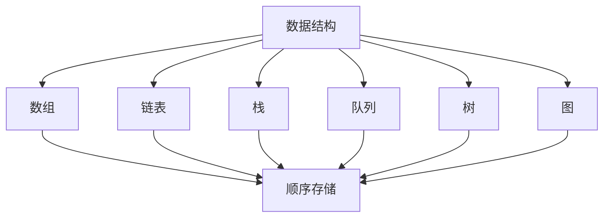
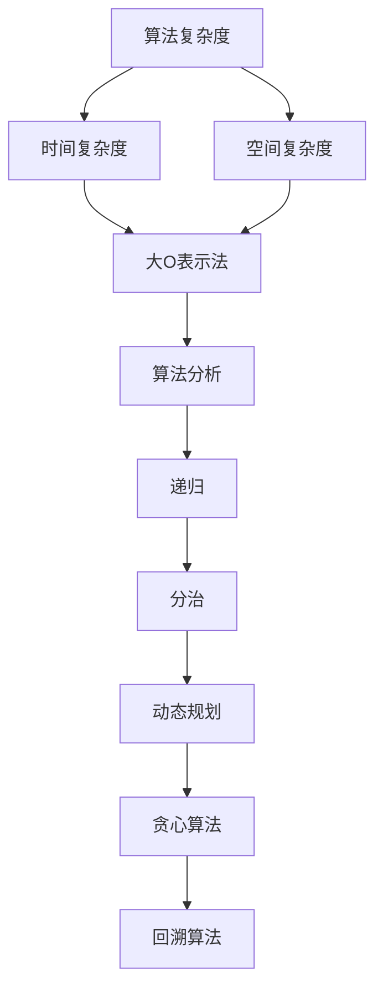
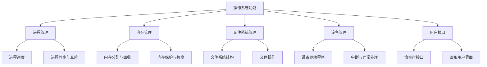

                 

### 摘要

本文旨在为参加字节跳动2024校招技术用户体验优化专家岗位的考生提供一份详尽的面试真题解析。文章将从面试准备、技术基础、真题详解、实战案例等多个维度出发，帮助考生全面了解面试所需的知识点和应对策略。首先，文章将介绍技术面试的基础知识，包括面试流程、准备与心态调整、以及回答问题的技巧。接着，文章将深入探讨数据结构与算法、操作系统与计算机网络、数据库原理与应用等核心技术领域，为考生打下坚实的理论基础。随后，文章将针对编程语言、系统设计与架构、前端技术、移动开发、AI与大数据等多个领域，详细解析面试真题，并提供解题思路和最佳实践。最后，文章将结合实际项目案例，分享面试实战经验，并提供技术面试资源汇总与求职技巧，助力考生顺利通过面试，实现职业梦想。本文的核心关键词包括：字节跳动、校招、技术面试、用户体验优化、面试真题详解。通过本文的详细解析，考生将能够更好地应对字节跳动2024校招技术用户体验优化专家的面试挑战。### 第1章：技术面试基础知识

#### 1.1 技术面试概述

技术面试是求职过程中至关重要的一环，它不仅考察应聘者的技术水平，还考察应聘者的逻辑思维、问题解决能力和沟通能力。对于技术用户体验优化专家岗位的面试，通常包括以下几个环节：

1. **在线测评**：很多公司会采用在线测评系统，测试应聘者的编程能力、逻辑思维和问题解决能力。
2. **电话面试**：电话面试通常是初步筛选，面试官可能会提出一些基本的技术问题，了解应聘者的基础知识。
3. **现场面试**：现场面试包括技术面试和行为面试。技术面试主要考察应聘者的技术深度和广度，而行为面试则侧重于考察应聘者的团队合作能力、沟通能力和领导力。

#### 1.2 面试准备与心态

面试准备是成功的关键。以下是一些面试前的准备工作：

1. **复习基础知识**：回顾操作系统、计算机网络、数据结构与算法等核心技术领域的基础知识。
2. **了解公司背景**：研究公司的业务模式、产品和服务，了解公司的文化和技术方向。
3. **模拟面试**：找朋友或家人模拟面试，提前适应面试环境，提高自信。
4. **调整心态**：保持积极乐观的心态，相信自己可以胜任这份工作。

#### 1.3 面试常见问题及回答技巧

面试过程中，面试官可能会问到以下常见问题：

1. **自我介绍**：简要介绍自己的教育背景、工作经历和技能特长。
2. **为什么选择这个岗位？**：强调自己对技术用户体验优化的热情和在这个领域的发展规划。
3. **项目经验**：详细描述自己参与过的项目，包括项目的目标、技术选型、解决方案和成果。
4. **解决过哪些技术难题？**：举例说明，用具体的案例展现自己的问题解决能力。

回答问题时应注意以下几点：

1. **清晰简洁**：用简洁明了的语言表达自己的观点。
2. **条理清晰**：回答问题时，尽量按照逻辑顺序进行。
3. **展示思考过程**：在回答问题时，展示自己的思考过程，让面试官了解你的思维模式。
4. **诚实回答**：对于不知道的问题，可以诚实地表示不知道，但可以表达自己愿意学习和探索的态度。

#### 1.3.1 面试常见问题分类

1. **技术问题**：考察应聘者的专业知识和技术能力。例如：
   - 简述TCP和UDP的区别。
   - 解释一下什么是哈希表，并说明其优缺点。
   - 实现一个二分查找算法。

2. **项目问题**：考察应聘者的项目经验和技术实践能力。例如：
   - 描述一下你最近参与的项目，包括项目的目标、遇到的问题和解决方案。
   - 你在项目中如何进行性能优化？

3. **行为问题**：考察应聘者的团队合作能力、沟通能力和领导力。例如：
   - 你如何处理团队中的冲突？
   - 描述一个你领导过的项目，并说明你的角色和贡献。

#### 1.3.2 回答问题的技巧

1. **提前准备**：对可能问到的问题提前进行准备，列出可能的回答。
2. **讲故事**：用具体的项目经历或案例来回答问题，让回答更有说服力。
3. **展现思考过程**：在回答问题时，展示自己的思考过程，让面试官了解你的思维模式。
4. **简洁明了**：用简洁明了的语言表达自己的观点。

#### 1.3.3 自我介绍的注意事项

自我介绍是面试的的开场白，通常包括以下内容：

1. **基本信息**：姓名、学历、专业、毕业院校等。
2. **工作经验**：简要介绍工作经历，包括公司名称、岗位名称和主要职责。
3. **技能特长**：介绍自己的技能特长，例如编程语言、数据库、框架等。
4. **项目经验**：强调自己参与过的项目，特别是那些与应聘岗位相关的项目。

注意事项：

1. **突出重点**：在自我介绍中，突出与应聘岗位相关的内容。
2. **诚实守信**：自我介绍中不要夸大自己的经历和能力。
3. **自信表达**：用自信和专业的态度进行自我介绍，给面试官留下好印象。### 第2章：数据结构与算法基础

#### 2.1 数据结构概述

数据结构是计算机科学中一个核心的概念，它指的是数据组织、管理和存储的方式。数据结构不仅决定了数据的存储方式，还影响了算法的设计与效率。理解数据结构对于成为一名优秀的技术用户体验优化专家至关重要。

**核心概念与联系架构 Mermaid 流程图**



**数据结构的基本概念**

- **数组**：数组是一种固定大小的数据结构，用于存储一系列相同类型的数据元素。数组可以通过索引快速访问元素，但大小一旦确定就不可改变。
- **链表**：链表是一种由节点组成的线性结构，每个节点包含数据和指向下一个节点的指针。链表可以在运行时动态地扩展和收缩。
- **栈**：栈是一种后进先出（LIFO）的数据结构，适用于需要按后进入先出来的顺序处理数据的情况，如函数调用栈。
- **队列**：队列是一种先进先出（FIFO）的数据结构，适用于需要按先进入先出来的顺序处理数据的情况，如任务队列。
- **树**：树是一种层次结构，用于表示具有层级关系的数据，如组织结构、文件系统。
- **图**：图是一种由节点和边组成的复杂结构，用于表示多个实体及其之间的关系，如社交网络、交通网络。

**数据结构之间的联系**

- **数组与链表**：数组是一种顺序存储结构，而链表是一种链式存储结构。两者都可以存储一系列数据，但数组访问速度快，链表灵活性强。
- **栈与队列**：栈和队列都是线性结构，但栈是后进先出，队列是先进先出。它们在程序设计中常用于管理数据流。
- **树与图**：树是一种特殊的图，具有层次结构。图则更加通用，可以表示复杂的关系。

#### 2.2 常见数据结构

**2.2.1 链表**

链表由一系列节点组成，每个节点包含数据和一个指向下一个节点的指针。链表的主要优点是插入和删除操作灵活，可以根据需要动态调整大小。

**核心算法原理讲解与伪代码**

```plaintext
// 链表节点定义
class ListNode:
    def __init__(self, value=0, next=None):
        self.value = value
        self.next = next

// 单链表插入操作（在链表末尾插入新节点）
def insert_at_end(head, value):
    new_node = ListNode(value)
    if head is None:
        return new_node
    current = head
    while current.next is not None:
        current = current.next
    current.next = new_node
    return head

// 单链表删除操作（删除特定节点）
def delete_node(head, value):
    if head is None:
        return None
    if head.value == value:
        return head.next
    current = head
    while current.next is not None:
        if current.next.value == value:
            current.next = current.next.next
            return head
        current = current.next
    return head
```

**2.2.2 栈与队列**

栈和队列都是线性结构，但它们的操作规则不同。栈是后进先出（LIFO），队列是先进先出（FIFO）。

**核心算法原理讲解与伪代码**

```plaintext
// 栈的入栈操作
def push(stack, value):
    new_node = ListNode(value)
    new_node.next = stack
    stack = new_node
    return stack

// 栈的出栈操作
def pop(stack):
    if stack is None:
        return None
    popped_value = stack.value
    stack = stack.next
    return popped_value

// 队列的入队操作
def enqueue(queue, value):
    new_node = ListNode(value)
    if queue is None:
        return new_node
    tail = queue
    while tail.next is not None:
        tail = tail.next
    tail.next = new_node
    return queue

// 队列的出队操作
def dequeue(queue):
    if queue is None:
        return None
    dequeued_value = queue.value
    queue = queue.next
    return dequeued_value
```

**2.2.3 树与图**

树是一种层次结构，用于表示具有层级关系的数据。图则是一种更通用的结构，可以表示复杂的关系。

**核心算法原理讲解与伪代码**

```plaintext
// 创建二叉树
class TreeNode:
    def __init__(self, value=0, left=None, right=None):
        self.value = value
        self.left = left
        self.right = right

def insert_into_bst(root, value):
    if root is None:
        return TreeNode(value)
    if value < root.value:
        root.left = insert_into_bst(root.left, value)
    else:
        root.right = insert_into_bst(root.right, value)
    return root

// 深度优先搜索（DFS）
def dfs(node):
    if node is None:
        return
    print(node.value)
    dfs(node.left)
    dfs(node.right)

// 广度优先搜索（BFS）
from collections import deque

def bfs(root):
    if root is None:
        return
    queue = deque([root])
    while queue:
        node = queue.popleft()
        print(node.value)
        if node.left:
            queue.append(node.left)
        if node.right:
            queue.append(node.right)
```

**2.3 算法概述**

算法是解决问题的方法，它通常由一系列有序的操作步骤组成。算法的效率通常用时间复杂度和空间复杂度来衡量。

**核心概念与联系架构 Mermaid 流�程图**



**算法的基本概念**

- **时间复杂度**：描述算法执行时间与数据规模之间的关系。
- **空间复杂度**：描述算法执行过程中所需内存的规模。
- **大O表示法**：用于描述算法的时间复杂度和空间复杂度。

**2.4 常见算法**

**2.4.1 排序算法**

排序算法用于将一组数据按照特定规则排列。常见的排序算法包括冒泡排序、选择排序、插入排序、快速排序等。

**核心算法原理讲解与伪代码**

```plaintext
// 冒泡排序
def bubble_sort(arr):
    n = len(arr)
    for i in range(n):
        for j in range(0, n-i-1):
            if arr[j] > arr[j+1]:
                arr[j], arr[j+1] = arr[j+1], arr[j]

// 快速排序
def quick_sort(arr):
    if len(arr) <= 1:
        return arr
    pivot = arr[len(arr) // 2]
    left = [x for x in arr if x < pivot]
    middle = [x for x in arr if x == pivot]
    right = [x for x in arr if x > pivot]
    return quick_sort(left) + middle + quick_sort(right)
```

**2.4.2 搜索算法**

搜索算法用于在数据结构中查找特定的元素。常见的搜索算法包括线性搜索和二分搜索。

**核心算法原理讲解与伪代码**

```plaintext
// 线性搜索
def linear_search(arr, target):
    for i in range(len(arr)):
        if arr[i] == target:
            return i
    return -1

// 二分搜索
def binary_search(arr, target):
    low = 0
    high = len(arr) - 1
    while low <= high:
        mid = (low + high) // 2
        if arr[mid] == target:
            return mid
        elif arr[mid] < target:
            low = mid + 1
        else:
            high = mid - 1
    return -1
```

**2.4.3 动态规划算法**

动态规划是一种解决最优化问题的算法，其核心思想是将复杂问题分解为子问题，并保存子问题的解，避免重复计算。

**核心算法原理讲解与伪代码**

```plaintext
// 斐波那契数列
def fibonacci(n):
    if n <= 1:
        return n
    dp = [0] * (n+1)
    dp[1] = 1
    for i in range(2, n+1):
        dp[i] = dp[i-1] + dp[i-2]
    return dp[n]

// 最长公共子序列
def longest_common_subsequence(X, Y):
    m = len(X)
    n = len(Y)
    dp = [[0] * (n+1) for _ in range(m+1)]
    for i in range(1, m+1):
        for j in range(1, n+1):
            if X[i-1] == Y[j-1]:
                dp[i][j] = dp[i-1][j-1] + 1
            else:
                dp[i][j] = max(dp[i-1][j], dp[i][j-1])
    return dp[m][n]
```

通过本章的学习，读者应该对数据结构与算法有了更加深入的理解。这些基础知识和技能将为后续章节中的面试真题详解提供坚实的理论基础。在接下来的章节中，我们将逐一解析字节跳动2024校招技术用户体验优化专家面试中的各个领域的问题，帮助读者更好地应对面试挑战。### 第3章：操作系统与计算机网络

#### 3.1 操作系统基础

操作系统（Operating System，简称OS）是管理计算机硬件与软件资源的系统软件，它负责控制计算机的运行，并为应用程序提供运行环境。操作系统的主要功能包括进程管理、内存管理、文件系统管理、设备管理和用户接口等。

**核心概念与联系架构 Mermaid 流程图**



**操作系统的基本概念**

- **进程**：进程是计算机中正在运行的程序实例，它是系统进行资源分配和调度的基本单位。
- **线程**：线程是进程内的一个执行流程，是操作系统进行并发处理的基本单位。
- **内存管理**：内存管理包括内存分配、回收、保护等，目的是提高内存利用率，避免内存碎片。
- **文件系统**：文件系统是操作系统用于存储和管理文件的机制，它包括文件结构、文件操作和文件系统管理。
- **设备管理**：设备管理负责控制计算机上的各种外部设备，如磁盘、打印机、网络接口卡等。
- **用户接口**：用户接口是用户与操作系统交互的界面，包括命令行接口和图形用户界面。

**操作系统之间的联系**

- **单用户操作系统**：仅支持单用户同时使用的操作系统，如早期的DOS系统。
- **多用户操作系统**：支持多用户同时使用的操作系统，如Unix、Linux等。
- **实时操作系统**：对任务执行有严格时间要求的操作系统，如嵌入式系统中的实时操作系统。
- **操作系统层次结构**：操作系统可以分为内核层、系统服务层和用户界面层，各层之间相互独立，但又相互依赖。

#### 3.2 进程与线程

进程（Process）和线程（Thread）是操作系统中两个核心概念，它们都是操作系

