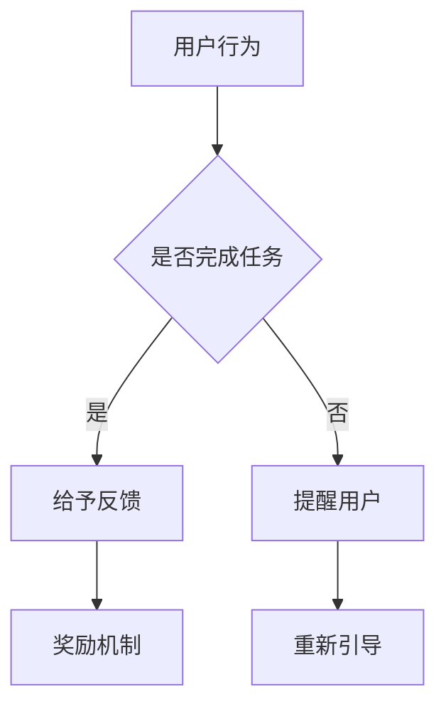

                 

### 《字节跳动2024校招：技术用户游戏化策略专家面试真题解答》

#### 关键词：字节跳动，2024校招，技术用户游戏化，面试真题，策略专家

> 摘要：本文旨在为2024年字节跳动校招的技术用户游戏化策略专家职位面试提供详细的备考指南。文章首先介绍了校招面试的准备工作，包括职业规划、技术知识储备和面试题型分析。接着，深入探讨了游戏化策略的基础概念、设计原则及其在字节跳动校招中的应用。随后，文章对字节跳动校招中的行为面试题、技术面试题及行为与技术结合的面试题进行了详细解析。最后，提供了面试实战演练与评估的方法，并总结了相关的常见问题和资源推荐。

### 第一部分：校招面试准备

#### 第1章：面试前的准备

##### 1.1 职业规划

##### 1.1.1 确定职业目标

在准备面试前，首先需要明确自己的职业目标。作为一个技术用户游戏化策略专家，你的职业目标可能包括：

- 成为行业内的游戏化专家，能够设计出高效的用户激励策略。
- 在字节跳动这样的知名企业中积累经验，为未来的职业发展打下坚实基础。
- 探索用户心理学、行为经济学等相关领域，以拓宽知识面和技能集。

##### 1.1.2 了解公司文化

字节跳动是一家以技术驱动为核心的公司，强调创新和效率。在准备面试时，了解字节跳动的公司文化、价值观和发展战略是至关重要的。以下是一些关键点：

- 字节跳动以“用技术提升效率”为核心理念，不断探索新的技术解决方案。
- 公司鼓励员工创新，提供广阔的职业发展空间。
- 字节跳动注重用户体验，将用户需求放在首位。

##### 1.1.3 搜集面试资料

在确定职业目标和了解公司文化后，下一步是搜集相关的面试资料。以下是一些推荐的资源：

- 字节跳动官网：可以了解公司的招聘信息、岗位要求以及企业文化。
- 技术社区：如GitHub、Stack Overflow等，可以查阅相关的技术文档、开源项目和讨论。
- 行业报告：了解游戏化在技术领域的最新趋势和发展动态。

##### 1.2 技术知识储备

作为一个技术用户游戏化策略专家，你需要具备以下技术知识：

- **数据结构与算法**：掌握基本的数据结构如数组、链表、树、图等，以及相关的算法原理。
- **编程语言**：熟练掌握至少一门编程语言，如Java、Python或C++。
- **系统设计与架构**：理解分布式系统、微服务架构、缓存机制等概念。
- **用户心理学和行为经济学**：了解人类行为驱动的因素，如动机理论、奖励机制等。

##### 1.2.1 技术领域概述

游戏化是一种将游戏设计的元素和机制应用到非游戏环境中，以激励用户参与和提升用户满意度的技术。以下是一些关键概念：

- **游戏化定义**：游戏化是将游戏中的元素（如得分、进度、排名）应用到非游戏环境中，以激励用户行为。
- **游戏化与传统激励的区别**：游戏化强调的是通过游戏机制激发用户的内在动机，而传统激励更多依赖于外部奖励。
- **游戏化在用户行为改变中的作用**：游戏化能够通过设计激励机制，引导用户完成特定任务或行为。

##### 1.2.2 核心算法原理

在游戏化策略中，核心算法原理包括：

- **推荐算法**：用于根据用户的行为和偏好推荐相关的内容或任务。
- **用户行为分析**：通过分析用户的行为数据，了解用户的兴趣和行为模式。
- **机器学习**：用于构建预测模型，预测用户的行为趋势和偏好。

以下是一个简单的推荐算法伪代码示例：

```python
def recommend算法(user_profile, content_library):
    # 根据用户兴趣和行为推荐内容
    recommended_contents = []
    for content in content_library:
        if similar(user_profile, content):
            recommended_contents.append(content)
    return recommended_contents
```

##### 1.2.3 实际应用场景

游戏化策略在许多实际应用场景中都有成功案例，以下是一些例子：

- **在线教育**：通过游戏化元素激励学生参与学习，如积分系统、排行榜等。
- **健身应用**：通过游戏化元素鼓励用户保持健身习惯，如每日打卡、挑战赛等。
- **电子商务**：通过游戏化元素提高用户购买意愿，如购物积分、抽奖等。

##### 1.3 面试题型分析

在准备面试时，了解常见的面试题型是非常有帮助的。以下是几种常见的面试题型：

- **行为面试题**：通过询问候选人过去的工作经验，评估其解决问题的能力和团队合作能力。
- **技术面试题**：测试候选人的技术知识和编程能力。
- **行为与技术结合的面试题**：结合行为分析和技术实现，考察候选人解决实际问题的能力。

以下是一个行为面试题的示例：

**面试题**：请描述一次你面对困难情况时如何解决问题。

**回答示例**：

在一次项目中，我们遇到了一个技术难题，导致项目进度受阻。我首先进行了问题定位，然后查阅了相关文档和资料，找到了可能的解决方案。接着，我与团队成员进行了讨论，共同制定了实施计划。在实施过程中，我时刻保持与团队的沟通，确保问题得到及时解决。最终，我们成功地解决了这个难题，项目得以按时交付。

##### 1.3.1 行为面试题

行为面试题主要通过询问候选人在过去工作中的具体经历来评估其能力和素质。以下是一些常见的行为面试题：

- 请描述一次你在工作中遇到的最大挑战，以及你是如何克服它的？
- 请举一个例子，说明你是如何在一个团队中发挥领导作用的？
- 请谈谈你如何处理工作中的冲突？

##### 1.3.2 技术面试题

技术面试题主要测试候选人的技术知识和编程能力。以下是一些常见的技术面试题：

- 请实现一个冒泡排序算法。
- 请解释一下递归和循环的区别。
- 请设计一个简单的数据库系统，包括表结构和查询语句。

##### 1.3.3 行为与技术结合的面试题

这种面试题结合了行为分析和技术实现，考察候选人解决实际问题的能力。以下是一个例子：

**面试题**：假设你是一个在线教育平台的产品经理，如何设计一个游戏化策略来提高学生的学习积极性？

**回答示例**：

我首先会进行用户调研，了解学生的需求和兴趣。然后，我会设计一个积分系统，学生可以通过完成任务或参与互动获得积分。积分可以用来兑换奖品或解锁新的学习内容。此外，我会设置排行榜，让学生可以看到自己在班级或学校的排名，增加竞争和激励。最后，我会定期进行数据分析，优化游戏化策略，确保其有效性。

##### 1.4 面试准备策略

在准备面试时，以下策略可以帮助你提高面试表现：

- **制定详细的学习计划**：根据面试要求和知识点，制定学习计划，并按照计划进行复习。
- **模拟面试**：找到朋友或同事进行模拟面试，提高应对面试的自信心。
- **注意时间管理**：在面试中保持时间意识，确保每个问题都有足够的时间进行回答。
- **保持积极心态**：面试前保持积极的心态，相信自己的准备。

##### 1.5 面试技巧

在面试中，以下技巧可以帮助你更好地表现自己：

- **保持眼神交流**：与面试官保持眼神交流，展示自信和尊重。
- **控制语速**：语速不宜过快，确保面试官能够听懂你的回答。
- **注意语言表达**：用清晰简洁的语言表达自己的观点，避免使用模糊或含糊的词汇。
- **提出问题**：在面试结束时，提出一到两个关于公司和岗位的问题，展示你对岗位的热情和兴趣。

### 第二部分：技术用户游戏化策略

#### 第2章：游戏化策略基础

##### 2.1 游戏化概念

游戏化（Gamification）是将游戏设计的元素和机制应用到非游戏环境中，以激励用户参与和提升用户满意度的一种技术。游戏化的核心是通过设计激励机制，激发用户的内在动机，从而实现特定的目标。

##### 2.1.1 游戏化定义

游戏化（Gamification）是指将游戏设计中的元素（如积分、排行榜、挑战等）应用于非游戏环境（如教育、工作、健康、社交等），以激发用户参与、提高用户满意度和达成目标。

##### 2.1.2 游戏化与传统激励的区别

传统激励通常依赖于外部奖励（如奖金、奖品等）来激励用户，而游戏化则强调通过设计激励机制激发用户的内在动机。游戏化关注的是用户的参与度和满意度，而传统激励更注重短期效果。

##### 2.1.3 游戏化在用户行为改变中的作用

游戏化在用户行为改变中发挥着重要作用，主要通过以下机制实现：

- **动机激发**：通过设计有吸引力的任务和奖励，激发用户的内在动机。
- **行为塑造**：通过反馈和奖励机制，引导用户形成积极的行为习惯。
- **持续参与**：通过挑战、竞争和社交元素，保持用户的持续参与。

##### 2.2 用户心理学

用户心理学是游戏化策略设计的重要基础。理解用户心理和行为驱动因素，有助于设计出更有效的游戏化策略。

##### 2.2.1 人类行为驱动因素

人类行为的驱动因素包括：

- **动机**：激励人们采取行动的心理因素。
- **反馈**：行动结果对行为产生的积极或消极影响。
- **奖励**：通过奖励机制激发用户的积极行为。
- **竞争**：与他人竞争激发用户的成就感和动力。

##### 2.2.2 动机理论

动机理论是解释人类行为的重要理论基础。以下是一些常见的动机理论：

- **马斯洛需求层次理论**：将人类需求分为生理需求、安全需求、社交需求、尊重需求和自我实现需求。
- **动机过程理论**：认为动机是目标导向的行为，包括目标设定、目标追求和目标实现。
- **自我决定理论**：强调个体自主性和内在动机在行为驱动中的作用。

##### 2.2.3 心理学在游戏化中的应用

心理学在游戏化中的应用主要体现在以下几个方面：

- **需求分析**：通过心理学理论分析用户需求，设计出更符合用户需求的游戏化策略。
- **动机激发**：利用心理学原理，设计出有吸引力的任务和奖励，激发用户的内在动机。
- **行为塑造**：通过心理学原理，引导用户形成积极的行为习惯。
- **用户反馈**：通过心理学理论分析用户反馈，优化游戏化策略。

##### 2.3 游戏化设计原则

游戏化设计原则是确保游戏化策略有效性的关键。以下是一些常见的游戏化设计原则：

##### 2.3.1 设计原则概述

游戏化设计原则主要包括：

- **明确目标**：明确游戏化的目标和预期成果，确保游戏化策略与业务目标一致。
- **用户参与**：设计吸引人的任务和挑战，提高用户的参与度。
- **反馈机制**：及时给予用户反馈，增强用户参与感和成就感。
- **奖励机制**：设计合理的奖励机制，激励用户持续参与。
- **可持续性**：确保游戏化策略能够长期实施，避免用户疲劳。

##### 2.3.2 目标设置

目标设置是游戏化设计的重要环节。以下是一些目标设置的原则：

- **明确性**：目标应明确、具体，便于用户理解和实现。
- **挑战性**：目标应具有一定的挑战性，激发用户的积极性和参与度。
- **可度量性**：目标应可度量，以便评估游戏化策略的有效性。
- **可达性**：目标应可实现，避免过于理想化。

##### 2.3.3 反馈机制

反馈机制是游戏化策略的重要组成部分。以下是一些反馈机制的设计原则：

- **及时性**：及时给予用户反馈，增强用户参与感和成就感。
- **多样性**：提供多种形式的反馈，如文字、图片、声音等，满足不同用户的偏好。
- **正面性**：反馈应以正面为主，鼓励用户继续参与。
- **个性化**：根据用户行为和偏好，提供个性化的反馈。

##### 2.3.4 社交元素

社交元素是游戏化策略的重要驱动力。以下是一些社交元素的设计原则：

- **合作与竞争**：设计合作与竞争机制，激发用户的成就感和动力。
- **社交互动**：鼓励用户之间的互动，增强社区氛围。
- **社交奖励**：通过社交奖励机制，激励用户参与社区活动。
- **隐私保护**：确保用户的隐私信息得到保护，避免用户反感。

##### 2.3.5 游戏化元素的平衡

游戏化元素的平衡是确保游戏化策略有效性的关键。以下是一些平衡游戏化元素的原则：

- **适度性**：游戏化元素应适度，避免过度游戏化导致的用户疲劳。
- **相关性**：游戏化元素应与业务目标相关，确保游戏化策略的有效性。
- **用户反馈**：通过用户反馈不断优化游戏化策略，确保其与用户需求相符。
- **可持续性**：确保游戏化策略能够长期实施，避免用户疲劳。

### 第三部分：游戏化在字节跳动校招中的应用

#### 第3章：字节跳动校招游戏化策略

##### 3.1 字节跳动校招背景

字节跳动校招具有以下特点：

- **竞争激烈**：字节跳动作为行业领先企业，吸引了大量优秀毕业生报名。
- **高标准**：字节跳动对候选人的技术能力和综合素质有较高要求。
- **多轮面试**：校招面试包括多轮技术面试和行为面试，考察全面。

##### 3.2 字节跳动校招游戏化策略

为了提高校招效率和用户体验，字节跳动采用了游戏化策略，以下是一些具体措施：

- **简历投递游戏化**：通过设置挑战任务，激励毕业生完善简历，提高简历质量。
- **面试准备游戏化**：通过设置积分系统和挑战任务，鼓励毕业生提前准备面试。
- **面试过程游戏化**：通过角色扮演和互动环节，增强面试体验，提高面试效果。
- **面试反馈游戏化**：通过设置反馈机制，及时给予毕业生面试反馈，优化面试流程。

##### 3.3 游戏化策略案例分析

以下是一些字节跳动校招游戏化策略的成功案例：

- **简历投递闯关游戏**：通过设置不同难度的简历完善任务，激励毕业生完善简历，提高简历质量。
- **面试准备积分系统**：通过设置面试准备任务和积分奖励，鼓励毕业生提前准备面试。
- **面试过程角色扮演游戏**：通过角色扮演环节，模拟真实面试场景，提高毕业生的面试能力。
- **面试反馈即时反馈系统**：通过即时反馈系统，给予毕业生详细的面试评价和建议，帮助他们优化面试表现。

### 第四部分：面试真题解答

#### 第4章：面试真题解析

##### 4.1 行为面试题解析

行为面试题主要通过询问候选人过去的工作经历来评估其解决问题的能力和团队合作能力。以下是一些常见的行为面试题及其解析：

- **请描述一次你在工作中遇到的最大挑战，以及你是如何克服它的？**

**回答示例**：

在一次项目中，我们遇到了一个技术难题，导致项目进度受阻。我首先进行了问题定位，然后查阅了相关文档和资料，找到了可能的解决方案。接着，我与团队成员进行了讨论，共同制定了实施计划。在实施过程中，我时刻保持与团队的沟通，确保问题得到及时解决。最终，我们成功地解决了这个难题，项目得以按时交付。

- **请举一个例子，说明你是如何在一个团队中发挥领导作用的？**

**回答示例**：

在一次团队项目中，我担任项目经理的角色。我首先与团队成员沟通，了解他们的能力和兴趣，分配合适的任务。接着，我组织定期的团队会议，确保项目进展顺利，并及时解决遇到的问题。此外，我还鼓励团队成员提出意见和建议，促进团队协作和创新能力。

- **请谈谈你如何处理工作中的冲突？**

**回答示例**：

在处理工作中的冲突时，我会首先尝试了解冲突的原因，与相关方进行沟通。然后，我会寻找共同点，寻求妥协方案。如果冲突仍然无法解决，我会寻求上级或专业人士的帮助，以确保冲突得到妥善处理。

##### 4.2 技术面试题解析

技术面试题主要测试候选人的技术知识和编程能力。以下是一些常见的技术面试题及其解析：

- **请实现一个冒泡排序算法。**

**回答示例**（Python代码）：

```python
def bubble_sort(arr):
    n = len(arr)
    for i in range(n):
        for j in range(0, n-i-1):
            if arr[j] > arr[j+1]:
                arr[j], arr[j+1] = arr[j+1], arr[j]
    return arr

arr = [64, 25, 12, 22, 11]
print("排序前：", arr)
sorted_arr = bubble_sort(arr)
print("排序后：", sorted_arr)
```

- **请解释一下递归和循环的区别。**

**回答示例**：

递归和循环都是解决重复问题的编程方法，但它们之间有一些区别：

- 递归：通过调用自身函数来解决问题，每次递归都会将问题分解成更小的子问题。
- 循环：通过重复执行循环体内的代码来解决问题，通常使用计数器或条件来控制循环的次数。

递归的优点是代码简洁，缺点是可能存在栈溢出问题。循环的优点是效率较高，缺点是代码可能更复杂。

- **请设计一个简单的数据库系统，包括表结构和查询语句。**

**回答示例**（使用SQL）：

```sql
-- 创建学生表
CREATE TABLE students (
    id INT PRIMARY KEY,
    name VARCHAR(50),
    age INT,
    major VARCHAR(50)
);

-- 创建课程表
CREATE TABLE courses (
    course_id INT PRIMARY KEY,
    course_name VARCHAR(50),
    credits INT
);

-- 创建学生选课表
CREATE TABLE student_courses (
    student_id INT,
    course_id INT,
    grade INT,
    FOREIGN KEY (student_id) REFERENCES students(id),
    FOREIGN KEY (course_id) REFERENCES courses(course_id)
);

-- 查询学生的平均成绩
SELECT AVG(grade) AS average_grade
FROM student_courses
WHERE student_id = 1;

-- 查询某门课的所有学生成绩
SELECT s.name, sc.grade
FROM students s
JOIN student_courses sc ON s.id = sc.student_id
WHERE sc.course_id = 101;
```

##### 4.3 行为与技术结合的面试题解析

这种面试题结合了行为分析和技术实现，考察候选人解决实际问题的能力。以下是一个例子及其解析：

**面试题**：假设你是一个在线教育平台的产品经理，如何设计一个游戏化策略来提高学生的学习积极性？

**回答示例**：

首先，我会进行用户调研，了解学生的学习需求和兴趣。根据调研结果，设计一系列具有挑战性的学习任务，并设置合理的奖励机制。例如，可以设置每日签到、完成学习任务、获得积分等。积分可以用来兑换奖品或解锁新的学习内容。

为了提高学习积极性，我还会设计一个排行榜，让学生可以看到自己在班级或学校的排名。此外，可以设置组队学习功能，鼓励学生之间互相竞争和合作。

在实施游戏化策略的过程中，我会持续进行数据分析，优化奖励机制和任务设计，确保游戏化策略的有效性和用户满意度。

### 第五部分：实战演练与评估

#### 第5章：面试实战与评估

##### 5.1 面试实战演练

面试实战演练是提高面试技能的有效方法。以下是一些实战演练的建议：

- **模拟面试**：找到朋友或同事进行模拟面试，模拟真实面试场景，提高应对面试的自信心。
- **录制视频**：录制面试视频，回顾自己的表现，找出不足之处，进行改进。
- **自我评估**：定期进行自我评估，回顾面试过程中的表现，分析自己的优点和不足。

##### 5.2 面试评估体系

面试评估体系是确保面试公平、客观的重要手段。以下是一些面试评估体系的关键要素：

- **评估指标**：制定明确的评估指标，如技术能力、沟通能力、团队合作能力等。
- **评分标准**：为每个评估指标制定具体的评分标准，确保评估过程的客观性。
- **评估团队**：组建专业的评估团队，确保评估结果的准确性和公正性。

##### 5.3 面试评估方法

面试评估方法包括以下几种：

- **结构化面试**：采用标准化的面试流程和问题，确保评估的客观性和一致性。
- **情境模拟**：通过模拟实际工作场景，评估候选人的实际能力和解决问题的能力。
- **综合评估**：结合多种评估方法，全面评估候选人的综合素质。

##### 5.4 面试评估工具使用

面试评估工具可以帮助评估团队提高评估效率和准确性。以下是一些常用的面试评估工具：

- **面试管理系统**：用于管理面试流程、记录面试评估结果等。
- **行为观察工具**：用于观察候选人在面试过程中的行为表现，如沟通能力、团队合作能力等。
- **数据分析工具**：用于分析面试评估数据，发现候选人优势和不足。

### 第六部分：附录

#### 第6章：附录

##### 6.1 字节跳动校招常见问题FAQ

以下是一些字节跳动校招的常见问题及其解答：

- **如何报名字节跳动校招？**
  - 访问字节跳动官网，注册账号并登录，然后找到校招页面进行报名。

- **字节跳动校招的面试流程是怎样的？**
  - 字节跳动校招的面试流程包括简历筛选、在线笔试、技术面试、行为面试和HR面试等环节。

- **字节跳动校招的录用标准是什么？**
  - 字节跳动校招的录用标准主要包括技术能力、学习能力和团队合作能力等。

##### 6.2 游戏化策略资源推荐

以下是一些游戏化策略的推荐资源：

- **书籍推荐**：
  - 《游戏化革命：如何通过游戏机制改造世界》（The Gamification of Learning and Instruction）
  - 《游戏化思维：如何在商业、教育和生活中运用游戏元素》（Reality is Broken: Why Games Make Us Better and How They Can Change the World）

- **工具推荐**：
  - GameLabs：一个游戏化设计平台，提供丰富的游戏化元素和模板。
  - Influitive：一个游戏化激励平台，帮助企业和团队实现游戏化。

- **课程推荐**：
  - Coursera上的《游戏化设计》：由耶鲁大学开设的在线课程，介绍游戏化设计的基本原理和实践方法。

##### 6.3 相关链接

- **字节跳动校招官网**：[https://jobs.bytedance.com/campus](https://jobs.bytedance.com/campus)
- **技术社区链接**：[GitHub](https://github.com/)、[Stack Overflow](https://stackoverflow.com/)
- **游戏化社区链接**：[Game Theory](https://gametheory.net/)、[Gamification.org](https://gamification.org/)

### Mermaid 流程图（示例）



### 核心算法原理讲解（示例）

#### 数据结构与算法面试题解析

##### 2.2.1 常见数据结构介绍

数据结构是计算机科学中的一个重要概念，它决定了数据在计算机中的组织方式和操作方式。以下是几种常见的数据结构及其特点：

- **数组（Array）**：数组是一种基础的数据结构，它提供了一种方式来存储一系列相同类型的元素。数组的主要特点是元素的位置可以通过索引直接访问，时间复杂度为O(1)。以下是一个简单的数组示例（Python代码）：

```python
arr = [1, 2, 3, 4, 5]
print(arr[2])  # 输出：3
```

- **链表（Linked List）**：链表是一种由节点组成的序列，每个节点包含数据和一个指向下一个节点的指针。链表的主要优点是内存利用率高，插入和删除操作效率高。以下是一个简单的链表示例（Python代码）：

```python
class Node:
    def __init__(self, data=None):
        self.data = data
        self.next = None

# 创建链表
head = Node(1)
node2 = Node(2)
node3 = Node(3)
head.next = node2
node2.next = node3

# 遍历链表
current = head
while current:
    print(current.data)
    current = current.next
```

- **树（Tree）**：树是一种层次结构的数据结构，由节点和边组成。树的特点是每个节点都有且仅有一个父节点，除根节点外。树是一种广泛使用的数据结构，包括二叉树、二叉搜索树、平衡树等。以下是一个简单的二叉树示例（Python代码）：

```python
class TreeNode:
    def __init__(self, value):
        self.value = value
        self.left = None
        self.right = None

# 创建二叉树
root = TreeNode(1)
root.left = TreeNode(2)
root.right = TreeNode(3)
root.left.left = TreeNode(4)
root.left.right = TreeNode(5)

# 遍历二叉树
def inorder_traversal(node):
    if node:
        inorder_traversal(node.left)
        print(node.value)
        inorder_traversal(node.right)

inorder_traversal(root)
```

- **图（Graph）**：图是一种由节点（称为顶点）和边组成的数据结构，用于表示实体之间的关系。图可以用来表示网络、社交关系、路径规划等。以下是一个简单的图示例（Python代码）：

```python
import networkx as nx

# 创建图
G = nx.Graph()
G.add_nodes_from([1, 2, 3, 4, 5])
G.add_edges_from([(1, 2), (1, 3), (2, 4), (3, 4), (4, 5)])

# 遍历图
for node in G.nodes():
    print(node)
for edge in G.edges():
    print(edge)

# 绘制图
nx.draw(G, with_labels=True)
```

##### 2.2.2 常见算法原理介绍

算法是解决特定问题的一系列步骤。以下是几种常见的算法及其原理：

- **排序算法**：排序算法用于将一组数据按照特定的顺序进行排列。常见的排序算法包括冒泡排序、选择排序、插入排序、快速排序等。以下是一个冒泡排序算法的伪代码示例：

```python
function bubble_sort(arr):
    n = length(arr)
    for i from 0 to n-1:
        for j from 0 to n-i-1:
            if arr[j] > arr[j+1]:
                swap(arr[j], arr[j+1])
    return arr
```

- **查找算法**：查找算法用于在数据结构中查找特定的元素。常见的查找算法包括线性查找、二分查找等。以下是一个二分查找算法的伪代码示例：

```python
function binary_search(arr, target):
    low = 0
    high = length(arr) - 1

    while low <= high:
        mid = (low + high) / 2
        if arr[mid] == target:
            return mid
        elif arr[mid] < target:
            low = mid + 1
        else:
            high = mid - 1

    return -1
```

- **图算法**：图算法用于解决与图相关的问题，如最短路径、拓扑排序、图遍历等。以下是一个最短路径算法（迪杰斯特拉算法）的伪代码示例：

```python
function dijkstra(G, source):
    dist = array of length(G.nodes()) filled with infinity
    dist[source] = 0

    for node in G.nodes():
        if dist[node] == infinity:
            continue

        for edge in G.edges(node):
            neighbor = edge.other(node)
            weight = edge.weight()

            if dist[node] + weight < dist[neighbor]:
                dist[neighbor] = dist[node] + weight

    return dist
```

### 项目实战：开发环境搭建

在进行项目实战前，首先需要搭建一个合适的开发环境。以下是一个简单的开发环境搭建指南：

1. **安装Python**：Python是一种广泛使用的编程语言，可用于开发各种应用程序。可以从Python官方网站（[https://www.python.org/](https://www.python.org/)）下载并安装Python。

2. **安装IDE**：IDE（集成开发环境）提供了代码编辑器、调试器和编译器等工具，便于开发和管理项目。常见的Python IDE包括PyCharm、VS Code等。

3. **安装依赖库**：根据项目需求，安装相应的依赖库。可以使用pip命令来安装依赖库。例如，安装requests库：

```bash
pip install requests
```

4. **配置环境变量**：确保Python的安装路径已添加到系统的环境变量中，以便在命令行中直接运行Python。

### 源代码详细实现和代码解读

以下是一个简单的Python项目示例，用于实现一个简单的网站爬虫。代码主要分为四个部分：入口函数、数据解析函数、数据存储函数和异常处理函数。

```python
import requests
from bs4 import BeautifulSoup
import json

def fetch_url(url):
    try:
        response = requests.get(url)
        response.raise_for_status()
        return response.text
    except requests.RequestException as e:
        print(f"Error fetching URL: {e}")
        return None

def parse_html(html):
    try:
        soup = BeautifulSoup(html, 'html.parser')
        title = soup.find('h1').text
        content = soup.find('div', {'id': 'content'}).text
        return {'title': title, 'content': content}
    except Exception as e:
        print(f"Error parsing HTML: {e}")
        return None

def store_data(data):
    try:
        with open('data.json', 'w') as f:
            json.dump(data, f)
    except Exception as e:
        print(f"Error storing data: {e}")

def main():
    url = 'https://example.com'
    html = fetch_url(url)
    if html:
        data = parse_html(html)
        if data:
            store_data(data)
            print("Data stored successfully.")
        else:
            print("Failed to parse HTML.")
    else:
        print("Failed to fetch URL.")

if __name__ == "__main__":
    main()
```

**代码解读**：

1. **入口函数（main）**：入口函数是程序运行的起始点。在main函数中，首先定义了目标网站的URL，然后依次调用fetch_url、parse_html和store_data三个函数，实现对目标网站的数据爬取、解析和存储。

2. **数据解析函数（parse_html）**：该函数使用BeautifulSoup库解析HTML页面，提取标题和内容。通过find函数找到相应的HTML元素，并获取其文本内容。

3. **数据存储函数（store_data）**：该函数使用json库将提取的数据存储为JSON格式的文件。首先将数据转换为JSON字符串，然后写入到指定的文件中。

4. **异常处理函数**：在fetch_url、parse_html和store_data函数中，都使用了try-except语句来捕获和处理可能出现的异常。这样可以确保程序在遇到错误时不会崩溃，而是输出错误信息并继续运行。

### 项目小结

通过以上代码示例，我们可以了解到如何使用Python实现一个简单的网站爬虫。项目主要分为四个部分：数据获取、数据解析、数据存储和异常处理。每个部分都有其独特的功能和作用，共同实现了项目的整体目标。

在开发过程中，我们遇到了一些挑战，如网络请求失败、HTML解析错误等。通过异常处理机制，我们能够有效地捕获和处理这些错误，确保程序的稳定运行。

总的来说，该项目提供了一个基本的网站爬虫实现，为后续功能扩展和性能优化提供了基础。

### 最佳实践 tips

在开发过程中，以下是一些最佳实践建议，可以帮助你提高开发效率和代码质量：

1. **代码注释**：在代码中添加注释，解释函数和变量的用途，有助于提高代码的可读性和可维护性。

2. **代码格式化**：使用统一的代码格式，如缩进、空格和换行，有助于提高代码的可读性。

3. **单元测试**：编写单元测试，验证代码的功能和性能，确保代码的稳定性和可靠性。

4. **版本控制**：使用版本控制系统（如Git），记录代码的变更历史，便于团队协作和代码管理。

5. **模块化开发**：将代码拆分为多个模块，便于管理和维护，提高代码的可重用性。

6. **代码审查**：进行代码审查，发现和修复潜在的问题，提高代码的质量和安全性。

7. **持续集成**：使用持续集成工具（如Jenkins），实现自动化测试和构建，提高开发效率和代码质量。

### 小结与注意事项

通过本文的详细解析，我们对字节跳动2024校招技术用户游戏化策略专家面试真题有了深入的了解。本文分为六个部分，包括校招面试准备、游戏化策略基础、字节跳动校招游戏化策略、面试真题解析、实战演练与评估以及附录等内容。以下是本文的核心小结：

1. **校招面试准备**：在准备面试时，需要明确职业目标，了解公司文化，搜集面试资料，并储备相关的技术知识。

2. **游戏化策略基础**：游戏化策略是一种将游戏设计元素应用到非游戏环境中的技术，能够激励用户参与和提升用户满意度。

3. **字节跳动校招游戏化策略**：字节跳动通过游戏化策略提高校招效率和用户体验，包括简历投递游戏化、面试准备游戏化、面试过程游戏化和面试反馈游戏化等。

4. **面试真题解析**：本文详细解析了行为面试题、技术面试题和行为与技术结合的面试题，提供了示例回答和解题思路。

5. **实战演练与评估**：通过面试实战演练和面试评估体系，提高面试技能和评估准确性。

6. **附录**：提供了字节跳动校招常见问题FAQ、游戏化策略资源推荐和相关链接，便于读者查阅。

在准备面试过程中，以下几点注意事项值得注意：

1. **注重基础知识**：掌握常见的数据结构与算法，熟悉编程语言和系统设计。

2. **实践经验**：注重实际项目经验，了解项目开发流程和关键环节。

3. **用户心理学**：了解用户行为驱动因素，掌握动机理论和心理学原理。

4. **面试技巧**：保持良好的沟通能力、语言表达能力和时间管理能力。

5. **持续学习**：关注行业动态，不断学习新技术和知识。

通过本文的详细解析和实战演练，相信读者能够更好地准备字节跳动2024校招技术用户游戏化策略专家面试，提高面试成功的机会。祝愿大家面试顺利，取得理想的成绩！

### 拓展阅读

为了更好地准备字节跳动2024校招技术用户游戏化策略专家面试，以下是几本推荐的书籍和资源：

1. **书籍推荐**：

   - 《游戏化革命：如何通过游戏机制改造世界》（The Gamification of Learning and Instruction）
   - 《游戏化思维：如何在商业、教育和生活中运用游戏元素》（Reality is Broken: Why Games Make Us Better and How They Can Change the World）
   - 《用户体验要素：将设计思维融入产品开发》（The Elements of User Experience: User-Centered Design for the Web and Beyond）

2. **在线课程**：

   - Coursera上的《游戏化设计》（Game Design and Implementation）
   - Udemy上的《游戏化入门与实践》（Gamification: The Complete Course for Beginners）

3. **技术社区**：

   - GitHub：[https://github.com/](https://github.com/)
   - Stack Overflow：[https://stackoverflow.com/](https://stackoverflow.com/)

4. **游戏化资源**：

   - GameLabs：[https://gamelabs.io/](https://gamelabs.io/)
   - Influitive：[https://influitive.com/](https://influitive.com/)

通过阅读这些书籍、课程和资源，读者可以更深入地了解游戏化策略和技术用户游戏化领域的知识，为面试做好准备。此外，还可以关注相关行业动态，了解游戏化在商业和教育等领域的应用案例，提高自己的实战能力。祝大家面试顺利，取得理想的成绩！

