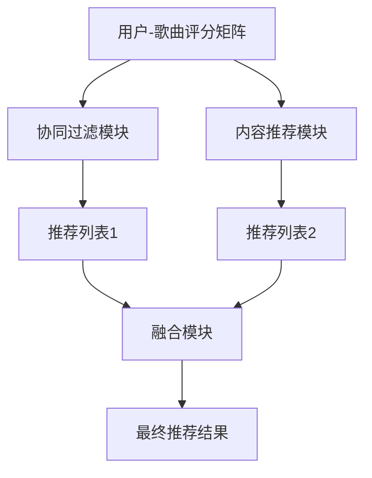
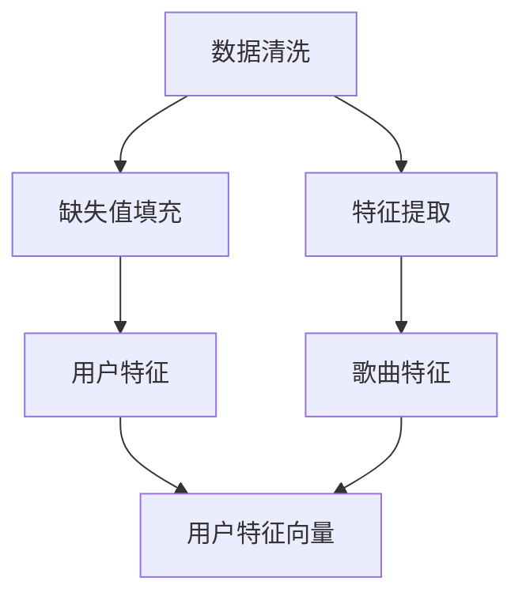
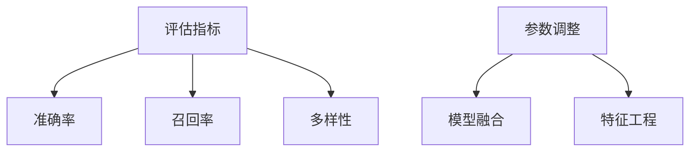

                 

### 文章标题：字节跳动2024音乐推荐算法校招面试真题

关键词：音乐推荐算法，协同过滤，内容推荐，混合推荐，校招面试

摘要：本文旨在为准备字节跳动2024校招音乐推荐算法面试的候选人提供全方位的指导。通过深入分析音乐推荐算法的基本概念、协同过滤算法、内容推荐算法、混合推荐算法，并结合实际项目实战和面试真题解析，本文将帮助读者全面掌握音乐推荐算法的核心知识和实践技能。

### 第一部分：音乐推荐算法概述

#### 第1章：音乐推荐算法的基本概念

音乐推荐系统作为现代互联网中不可或缺的一部分，其重要性不言而喻。首先，我们需要了解什么是推荐系统。推荐系统是一种利用机器学习算法对用户的历史行为数据进行分析，从而预测用户可能感兴趣的内容，并为其推荐的一种信息过滤方法。

在音乐推荐系统中，用户行为数据主要包括听歌记录、收藏、分享、评论等。通过对这些数据的分析，推荐系统可以预测用户可能喜欢哪些歌曲，从而实现个性化推荐。

音乐推荐算法可以分为以下几类：

1. **协同过滤算法**：通过分析用户之间的相似度，预测用户对未知歌曲的喜好。常见的协同过滤算法包括基于用户的协同过滤和基于物品的协同过滤。
   
2. **内容推荐算法**：通过分析歌曲的内容特征（如歌手、流派、歌词等），为用户推荐具有相似特征的未知歌曲。

3. **混合推荐算法**：结合协同过滤算法和内容推荐算法的优点，实现更加精准的推荐。

每种算法都有其优缺点和适用场景。例如，协同过滤算法在处理大量数据时表现优秀，但容易受到数据稀疏性的影响。内容推荐算法则更加依赖于歌曲的元数据信息，但可以减少数据稀疏性的问题。

#### 第2章：音乐推荐算法的分类

##### 协同过滤算法

协同过滤算法是音乐推荐系统中最为常见的一种算法。它主要基于用户的历史行为数据，通过分析用户之间的相似度，预测用户对未知歌曲的喜好。

协同过滤算法可以分为以下两类：

1. **基于用户的协同过滤**：通过计算用户之间的相似度，找到与目标用户相似的其他用户，然后根据这些用户的喜好推荐未知歌曲。
   
2. **基于物品的协同过滤**：通过计算歌曲之间的相似度，找到与目标用户已经听过的歌曲相似的其他歌曲，然后推荐给用户。

协同过滤算法的优点在于能够处理大规模用户行为数据，且在预测未知用户喜好时表现优秀。但其缺点也较为明显，主要在于数据稀疏性问题。由于用户行为数据的稀疏性，协同过滤算法在预测未知用户喜好时容易出现误差。

##### 内容推荐算法

内容推荐算法是通过分析歌曲的内容特征，为用户推荐具有相似特征的其他歌曲。常见的内容特征包括歌手、流派、歌词等。

内容推荐算法可以分为以下几类：

1. **基于关键词的推荐算法**：通过提取歌曲中的关键词，为用户推荐包含这些关键词的其他歌曲。

2. **基于分类的推荐算法**：将歌曲按照一定的分类标准进行分类，然后为用户推荐属于同一分类的其他歌曲。

3. **基于检索的推荐算法**：通过构建歌曲的索引，为用户推荐与目标歌曲相似的未知歌曲。

内容推荐算法的优点在于能够减少数据稀疏性问题，但缺点在于对歌曲的元数据信息依赖较大，且在处理大规模数据时性能可能较差。

##### 混合推荐算法

混合推荐算法结合了协同过滤算法和内容推荐算法的优点，通过融合两种算法的推荐结果，实现更加精准的推荐。

混合推荐算法可以分为以下几类：

1. **基于模型的混合推荐算法**：通过构建数学模型，将协同过滤算法和内容推荐算法的推荐结果进行加权融合。

2. **基于规则的混合推荐算法**：通过设计一系列规则，将协同过滤算法和内容推荐算法的推荐结果进行融合。

混合推荐算法的优点在于能够充分利用协同过滤算法和内容推荐算法的优点，实现更加精准的推荐。但其缺点也在于算法复杂度较高，实现难度较大。

### 第3章：音乐推荐算法的挑战与机遇

音乐推荐算法在应用过程中面临着诸多挑战和机遇。以下是一些常见的挑战和机遇：

##### 挑战

1. **数据稀疏性**：由于用户听歌行为的随机性，用户与歌曲之间的行为数据往往非常稀疏。这给协同过滤算法带来了很大的挑战。

2. **用户兴趣的动态变化**：用户的兴趣是不断变化的，如何实时捕捉和预测用户兴趣的变化是一个重要的问题。

3. **冷启动问题**：对于新用户和新歌曲，由于缺乏足够的行为数据，推荐系统很难为其推荐合适的内容。

4. **计算资源消耗**：大规模推荐系统需要处理海量的数据，对计算资源的消耗较大。

##### 机遇

1. **个性化推荐**：通过分析用户的历史行为数据，可以为用户推荐个性化的音乐，提高用户体验。

2. **多场景应用**：音乐推荐算法可以应用于多种场景，如社交媒体、音乐播放器、在线音乐商店等。

3. **人工智能技术**：随着人工智能技术的发展，音乐推荐算法将变得更加智能和精准。

4. **大数据分析**：随着大数据技术的普及，音乐推荐系统可以利用更多维度的数据进行预测和分析。

通过解决这些挑战，音乐推荐算法将迎来更多的发展机遇。未来，音乐推荐算法将在个性化推荐、多场景应用和大数据分析等方面发挥重要作用。#### 第二部分：协同过滤算法详解

##### 第2章：协同过滤算法原理

协同过滤算法是音乐推荐系统中最为核心的一部分，其基本思想是通过分析用户之间的相似度或歌曲之间的相似度，预测用户对未知歌曲的喜好。在本章中，我们将详细探讨协同过滤算法的基本原理、实现方式和优化策略。

###### 第2章1节：基本协同过滤算法

基本协同过滤算法可以分为基于用户的协同过滤和基于物品的协同过滤两种。

1. **基于用户的协同过滤**：
   - **原理**：通过计算用户之间的相似度，找到与目标用户相似的其他用户，然后根据这些用户的喜好推荐未知歌曲。
   - **计算相似度**：常见的相似度计算方法包括余弦相似度、皮尔逊相关系数等。例如，余弦相似度的计算公式如下：
     $$\cos(\theta_{ui}) = \frac{u_i \cdot u_j}{\|u_i\| \cdot \|u_j\|}$$
     其中，$u_i$ 和 $u_j$ 分别表示用户 $i$ 和用户 $j$ 的行为向量，$\|\|$ 表示向量的模。

2. **基于物品的协同过滤**：
   - **原理**：通过计算歌曲之间的相似度，找到与目标歌曲相似的其他歌曲，然后推荐给用户。
   - **计算相似度**：常用的方法包括余弦相似度和欧氏距离。例如，余弦相似度的计算公式如下：
     $$\cos(\theta_{ij}) = \frac{R_i \cdot R_j}{\|R_i\| \cdot \|R_j\|}$$
     其中，$R_i$ 和 $R_j$ 分别表示歌曲 $i$ 和歌曲 $j$ 的评分向量。

###### 第2章2节：基于矩阵分解的协同过滤算法

基于矩阵分解的协同过滤算法是一种更为先进的协同过滤方法，其核心思想是将用户-物品评分矩阵分解为两个低维矩阵，从而提高推荐系统的性能。

1. **矩阵分解**：
   - **原理**：将用户-物品评分矩阵 $R$ 分解为用户特征矩阵 $U$ 和物品特征矩阵 $V$，即 $R = U \cdot V^T$。
   - **实现**：常见的矩阵分解方法包括Singular Value Decomposition（SVD）和 Alternating Least Squares（ALS）。

2. **矩阵分解算法伪代码**：
   ```python
   # Alternating Least Squares (ALS) 算法伪代码
   for each feature dimension d:
       # 固定物品特征矩阵 V，更新用户特征矩阵 U
       U = least_squares_fit(R, V)
       # 固定用户特征矩阵 U，更新物品特征矩阵 V
       V = least_squares_fit(R.T, U)
   return U, V
   ```

###### 第2章3节：基于模型的协同过滤算法

基于模型的协同过滤算法通过引入机器学习模型来提高推荐系统的性能，常见的方法包括基于隐语义模型的协同过滤算法。

1. **隐语义模型**：
   - **原理**：隐语义模型通过学习用户和物品的隐含特征，将原始的用户-物品评分矩阵转化为新的低维表示。
   - **实现**：常见的方法包括Latent Semantic Analysis（LSA）和Latent Dirichlet Allocation（LDA）。

2. **基于模型的协同过滤算法伪代码**：
   ```python
   # 基于隐语义模型的协同过滤算法伪代码
   # 初始化用户和物品的隐含特征矩阵
   U, V = initialize_random_features(n_users, n_items, latent_dim)

   # 模型训练
   for each training sample (user, item, rating):
       # 计算预测评分
       pred_rating = dot(U[user], V[item])
       # 更新用户和物品的隐含特征矩阵
       U[user], V[item] = update_features(pred_rating, rating)

   return U, V
   ```

###### 第2章4节：协同过滤算法的优化策略

协同过滤算法在实际应用中，面临着数据稀疏性、冷启动问题和计算效率等问题。以下是一些常见的优化策略：

1. **加权协同过滤**：
   - **原理**：对相似度进行加权处理，考虑用户之间的互动历史和偏好差异。
   - **实现**：通过引入用户和物品的信任度、互动频率等因素进行加权。

2. **基于模型的优化**：
   - **原理**：通过机器学习模型（如神经网络、决策树等）对协同过滤算法进行优化。
   - **实现**：训练模型预测用户对未知歌曲的喜好，并与协同过滤算法的预测结果进行融合。

3. **冷启动解决方案**：
   - **原理**：对于新用户和新歌曲，通过其他渠道（如用户基本信息、歌曲元数据等）进行推荐。
   - **实现**：使用基于内容的推荐、基于搜索的推荐等方法缓解冷启动问题。

通过这些优化策略，可以显著提高协同过滤算法的性能和应用效果。

### 第三部分：协同过滤算法的改进

尽管协同过滤算法在音乐推荐系统中取得了显著成果，但仍然存在一些问题，如数据稀疏性、预测准确度等。为了解决这些问题，研究者们提出了许多改进方法。以下是一些常见的改进方法：

#### 第3章1节：项加权协同过滤算法

项加权协同过滤算法通过为用户和物品赋予不同的权重，以提高推荐系统的性能。以下是一种简单的项加权协同过滤算法：

1. **加权相似度计算**：
   - **原理**：对用户和物品的相似度进行加权处理，考虑用户和物品的重要程度。
   - **实现**：假设 $w_u$ 和 $w_i$ 分别为用户 $u$ 和物品 $i$ 的权重，则加权相似度计算公式如下：
     $$\sim_{ui} = \frac{w_u \cdot w_i \cdot (r_{ui} - \mu_u - \mu_i)}{\sqrt{w_u \cdot (1 - \mu_u) + w_i \cdot (1 - \mu_i)}}$$
     其中，$r_{ui}$ 为用户 $u$ 对物品 $i$ 的评分，$\mu_u$ 和 $\mu_i$ 分别为用户 $u$ 和物品 $i$ 的平均评分。

2. **项加权协同过滤算法伪代码**：
   ```python
   # 项加权协同过滤算法伪代码
   for each user u:
       for each item i:
           w_i = compute_weight(i)  # 计算物品 i 的权重
           similar_items = find_similar_items(i, w_i)
           for each item j in similar_items:
               pred_rating[u, j] = compute_weighted_average(u, j, similar_items)
   return pred_rating
   ```

#### 第3章2节：基于用户的协同过滤算法

基于用户的协同过滤算法通过分析用户之间的相似度，为用户推荐与相似用户喜欢的物品。以下是一种基于用户的协同过滤算法：

1. **用户相似度计算**：
   - **原理**：计算用户之间的相似度，选择相似度较高的用户作为推荐依据。
   - **实现**：常用的相似度计算方法包括余弦相似度、皮尔逊相关系数等。例如，余弦相似度的计算公式如下：
     $$\sim_{u} = \frac{\sum_{i \in I} r_{ui} \cdot r_{uj}}{\sqrt{\sum_{i \in I} r_{ui}^2} \cdot \sqrt{\sum_{i \in I} r_{uj}^2}}$$
     其中，$I$ 表示用户 $u$ 和用户 $j$ 共同喜欢的物品集合。

2. **基于用户的协同过滤算法伪代码**：
   ```python
   # 基于用户的协同过滤算法伪代码
   for each user u:
       similar_users = find_similar_users(u)
       for each user j in similar_users:
           for each item i not in user u's preference set:
               pred_rating[u, i] = compute_weighted_average(u, j, similar_users)
   return pred_rating
   ```

#### 第3章3节：基于物品的协同过滤算法

基于物品的协同过滤算法通过分析物品之间的相似度，为用户推荐与物品相似的物品。以下是一种基于物品的协同过滤算法：

1. **物品相似度计算**：
   - **原理**：计算物品之间的相似度，选择相似度较高的物品作为推荐依据。
   - **实现**：常用的相似度计算方法包括余弦相似度、欧氏距离等。例如，余弦相似度的计算公式如下：
     $$\sim_{i} = \frac{\sum_{u \in U} r_{ui} \cdot r_{uj}}{\sqrt{\sum_{u \in U} r_{ui}^2} \cdot \sqrt{\sum_{u \in U} r_{uj}^2}}$$
     其中，$U$ 表示喜欢物品 $i$ 的用户集合。

2. **基于物品的协同过滤算法伪代码**：
   ```python
   # 基于物品的协同过滤算法伪代码
   for each item i:
       similar_items = find_similar_items(i)
       for each item j in similar_items:
           for each user u not in item i's preference set:
               pred_rating[u, j] = compute_weighted_average(u, i, similar_items)
   return pred_rating
   ```

#### 第3章4节：冷启动问题与解决方案

冷启动问题是指新用户或新物品进入系统时，由于缺乏足够的行为数据，推荐系统难以为其提供有效推荐的难题。以下是一些常见的冷启动解决方案：

1. **基于内容的推荐**：
   - **原理**：利用物品的元数据信息（如标签、描述等），为新用户推荐与其兴趣相符的物品。
   - **实现**：通过文本匹配、关键词提取等方法，将物品的元数据信息转化为可比较的特征向量。

2. **基于模型的推荐**：
   - **原理**：通过训练模型，预测新用户或新物品的偏好，从而实现推荐。
   - **实现**：常见的模型包括基于隐语义的协同过滤模型、神经网络等。

3. **混合推荐**：
   - **原理**：结合基于内容和基于模型的推荐方法，为新用户或新物品提供更准确的推荐。
   - **实现**：通过融合多种推荐算法的结果，提高推荐系统的性能。

### 第四部分：内容推荐算法与应用

#### 第4章：内容推荐算法原理

内容推荐算法是音乐推荐系统中另一种重要的推荐方法，它通过分析歌曲的内容特征，为用户推荐具有相似特征的其他歌曲。与协同过滤算法不同，内容推荐算法不依赖于用户行为数据，而是基于歌曲的元数据信息。

##### 第4章1节：内容特征的提取

内容特征的提取是内容推荐算法的核心步骤，它决定了推荐系统的效果。以下是一些常用的内容特征提取方法：

1. **基于文本的特征提取**：
   - **原理**：通过分析歌曲的歌词、评论等信息，提取出与歌曲相关的关键词。
   - **实现**：常用的方法包括词袋模型、TF-IDF、词嵌入等。

2. **基于音频的特征提取**：
   - **原理**：通过分析歌曲的音频信号，提取出与歌曲相关的音频特征。
   - **实现**：常用的方法包括MFCC（Mel频率倒谱系数）、谱减法、音频分段等。

3. **基于视觉的特征提取**：
   - **原理**：通过分析歌曲的封面图像、MV等信息，提取出与歌曲相关的视觉特征。
   - **实现**：常用的方法包括图像识别、特征提取等。

##### 第4章2节：基于关键词的推荐算法

基于关键词的推荐算法通过提取歌曲中的关键词，为用户推荐包含这些关键词的其他歌曲。以下是一种基于关键词的推荐算法：

1. **关键词提取**：
   - **原理**：利用文本匹配、关键词提取等方法，从歌曲的歌词、评论等文本信息中提取出关键词。
   - **实现**：常用的方法包括TF-IDF、LDA等。

2. **关键词匹配**：
   - **原理**：将用户已听歌曲和候选歌曲的关键词进行比较，计算匹配得分。
   - **实现**：常用的方法包括余弦相似度、Jaccard相似度等。

3. **推荐算法伪代码**：
   ```python
   # 基于关键词的推荐算法伪代码
   for each user u:
       for each song s in user u's preference set:
           keywords = extract_keywords(s)
       keywords_set = set.union(*keywords)
       for each song t not in user u's preference set:
           keywords_t = extract_keywords(t)
           similarity = compute_similarity(keywords_set, keywords_t)
           if similarity > threshold:
               recommend(t)
   ```

##### 第4章3节：基于分类的推荐算法

基于分类的推荐算法通过将歌曲进行分类，为用户推荐属于同一分类的其他歌曲。以下是一种基于分类的推荐算法：

1. **分类模型训练**：
   - **原理**：利用已标注的数据集，训练分类模型，如SVM、随机森林等。
   - **实现**：常用的方法包括特征提取、模型选择、模型训练等。

2. **分类模型应用**：
   - **原理**：根据用户已听歌曲的分类，为用户推荐属于同一分类的其他歌曲。
   - **实现**：常用的方法包括分类模型的预测、推荐结果排序等。

3. **推荐算法伪代码**：
   ```python
   # 基于分类的推荐算法伪代码
   for each user u:
       for each song s in user u's preference set:
           category = classify_song(s)
       for each song t not in user u's preference set:
           category_t = classify_song(t)
           if category_t == category:
               recommend(t)
   ```

##### 第4章4节：基于检索的推荐算法

基于检索的推荐算法通过构建歌曲的索引，为用户推荐与目标歌曲相似的未知歌曲。以下是一种基于检索的推荐算法：

1. **索引构建**：
   - **原理**：将歌曲的元数据信息（如歌词、封面图像等）转化为索引，便于快速检索。
   - **实现**：常用的方法包括倒排索引、单词索引等。

2. **检索算法应用**：
   - **原理**：根据用户已听歌曲的元数据信息，检索出相似的其他歌曲。
   - **实现**：常用的方法包括关键字检索、图像检索等。

3. **推荐算法伪代码**：
   ```python
   # 基于检索的推荐算法伪代码
   for each user u:
       for each song s in user u's preference set:
           metadata = extract_metadata(s)
       index = build_index(metadata)
       for each song t not in user u's preference set:
           metadata_t = extract_metadata(t)
           similarity = compute_similarity(metadata_t, metadata)
           if similarity > threshold:
               recommend(t)
   ```

#### 第4章5节：内容推荐算法的优化

内容推荐算法在实际应用中，面临着多样性、覆盖性和相关性等优化问题。以下是一些常见的优化策略：

##### 第5章1节：内容推荐算法的多样性优化

多样性优化旨在提高推荐结果的多样性，避免用户收到重复的歌曲推荐。以下是一些多样性优化的策略：

1. **随机多样性**：
   - **原理**：通过随机抽样，为用户推荐不同的歌曲。
   - **实现**：常用的方法包括随机采样、轮换等。

2. **聚类多样性**：
   - **原理**：通过聚类算法，将相似的歌曲分组，提高推荐结果的多样性。
   - **实现**：常用的方法包括K-means、DBSCAN等。

3. **推荐多样性优化策略图**：

   ```mermaid
   graph TB
   A[随机多样性] --> B[随机采样]
   A --> C[轮换]
   D[聚类多样性] --> E[K-means]
   D --> F[DBSCAN]
   ```

##### 第5章2节：内容推荐算法的覆盖性优化

覆盖性优化旨在提高推荐结果的覆盖范围，确保用户能够接收到推荐系统提供的全部歌曲。以下是一些覆盖性优化的策略：

1. **增量更新**：
   - **原理**：通过增量更新，只推荐新添加的歌曲。
   - **实现**：常用的方法包括增量索引、增量聚类等。

2. **多策略结合**：
   - **原理**：结合多种推荐策略，提高推荐结果的覆盖性。
   - **实现**：常用的方法包括协同过滤、内容推荐等。

3. **覆盖性优化策略图**：

   ```mermaid
   graph TB
   A[增量更新] --> B[增量索引]
   A --> C[增量聚类]
   D[多策略结合] --> E[协同过滤]
   D --> F[内容推荐]
   ```

##### 第5章3节：内容推荐算法的相关性优化

相关性优化旨在提高推荐结果的相关性，确保用户收到的推荐歌曲与他们的兴趣相关。以下是一些相关性优化的策略：

1. **用户兴趣模型**：
   - **原理**：通过构建用户兴趣模型，提高推荐结果的相关性。
   - **实现**：常用的方法包括协同过滤、基于内容的推荐等。

2. **实时反馈**：
   - **原理**：通过实时反馈，调整推荐策略，提高推荐结果的相关性。
   - **实现**：常用的方法包括点击率分析、评分预测等。

3. **相关性优化策略图**：

   ```mermaid
   graph TB
   A[用户兴趣模型] --> B[协同过滤]
   A --> C[基于内容的推荐]
   D[实时反馈] --> E[点击率分析]
   D --> F[评分预测]
   ```

通过以上优化策略，内容推荐算法可以更好地满足用户的需求，提高推荐系统的性能。#### 第五部分：混合推荐算法与实践

混合推荐算法结合了协同过滤算法和内容推荐算法的优点，通过融合多种推荐策略，实现更精准的推荐。以下将详细介绍混合推荐算法的原理、实现以及在实际项目中的应用。

##### 第6章：混合推荐算法原理

混合推荐算法的核心思想是通过协同过滤算法和内容推荐算法的融合，提高推荐系统的性能。以下是一个简单的混合推荐算法架构：

1. **协同过滤模块**：负责根据用户的历史行为数据，计算用户与用户之间的相似度，为用户推荐与相似用户喜欢的歌曲。

2. **内容推荐模块**：负责根据歌曲的元数据信息，为用户推荐与用户已听歌曲内容相似的其他歌曲。

3. **融合模块**：将协同过滤模块和内容推荐模块的推荐结果进行加权融合，生成最终的推荐结果。

混合推荐算法的实现可以分为以下几个步骤：

1. **数据预处理**：对用户行为数据和歌曲元数据信息进行预处理，包括数据清洗、缺失值填充等。

2. **协同过滤模块实现**：根据用户行为数据，计算用户与用户之间的相似度，并生成推荐列表。

3. **内容推荐模块实现**：根据歌曲元数据信息，提取歌曲特征，并生成推荐列表。

4. **融合模块实现**：对协同过滤模块和内容推荐模块的推荐结果进行加权融合，生成最终的推荐结果。

混合推荐算法的优势在于：

1. **提高推荐精度**：通过融合多种推荐策略，可以更好地捕捉用户的兴趣，提高推荐精度。

2. **降低数据稀疏性**：内容推荐算法可以减少协同过滤算法中的数据稀疏性，提高推荐系统的稳定性。

3. **提高多样性**：混合推荐算法可以在保证相关性的同时，提高推荐结果的多样性，避免用户收到重复的歌曲推荐。

##### 第6章1节：混合推荐算法的架构

混合推荐算法的架构可以分为以下几个部分：

1. **用户-歌曲评分矩阵**：表示用户对歌曲的评分，用于计算用户与用户之间的相似度。

2. **歌曲元数据信息**：包括歌曲的歌手、流派、歌词等，用于提取歌曲特征。

3. **协同过滤模块**：负责计算用户与用户之间的相似度，生成推荐列表。

4. **内容推荐模块**：负责根据歌曲元数据信息，提取歌曲特征，生成推荐列表。

5. **融合模块**：将协同过滤模块和内容推荐模块的推荐结果进行加权融合，生成最终的推荐结果。

混合推荐算法架构图：



##### 第6章2节：混合推荐算法的实现

混合推荐算法的实现可以分为以下几个步骤：

1. **数据预处理**：对用户行为数据和歌曲元数据信息进行预处理，包括数据清洗、缺失值填充等。

2. **协同过滤模块实现**：
   - **计算相似度**：根据用户-歌曲评分矩阵，计算用户与用户之间的相似度。
   - **生成推荐列表**：根据相似度计算结果，生成推荐列表。

3. **内容推荐模块实现**：
   - **提取特征**：根据歌曲元数据信息，提取歌曲特征。
   - **生成推荐列表**：根据特征匹配，生成推荐列表。

4. **融合模块实现**：
   - **加权融合**：将协同过滤模块和内容推荐模块的推荐结果进行加权融合，生成最终的推荐结果。

混合推荐算法实现伪代码：

```python
# 数据预处理
user_similarity_matrix = compute_user_similarity(ratings_matrix)
song_features_matrix = extract_song_features(metadata)

# 协同过滤模块实现
协同过滤推荐列表 = generate_recommendations(user_similarity_matrix, ratings_matrix)

# 内容推荐模块实现
内容推荐列表 = generate_recommendations(song_features_matrix, ratings_matrix)

# 融合模块实现
最终推荐列表 = weighted_fusion(协同过滤推荐列表，内容推荐列表，alpha)
```

##### 第6章3节：混合推荐算法的优势

混合推荐算法具有以下优势：

1. **提高推荐精度**：通过融合多种推荐策略，可以更好地捕捉用户的兴趣，提高推荐精度。

2. **降低数据稀疏性**：内容推荐算法可以减少协同过滤算法中的数据稀疏性，提高推荐系统的稳定性。

3. **提高多样性**：混合推荐算法可以在保证相关性的同时，提高推荐结果的多样性，避免用户收到重复的歌曲推荐。

4. **适应性强**：混合推荐算法可以根据不同的用户需求和场景，灵活调整推荐策略，提高推荐系统的适应性。

### 第7章：音乐推荐算法项目实战

在本章中，我们将通过一个实际项目来展示音乐推荐算法的开发过程，包括项目背景、数据预处理、算法选择与实现、评估与优化等步骤。

##### 第7章1节：项目背景与目标

项目背景：
本次项目旨在为音乐平台开发一个基于混合推荐算法的音乐推荐系统，以提高用户体验和平台活跃度。项目目标是通过分析用户行为数据和歌曲元数据，为用户推荐个性化的音乐内容。

项目目标：
1. 提高推荐精度，确保用户收到的推荐歌曲与他们的兴趣相符。
2. 降低数据稀疏性，提高推荐系统的稳定性。
3. 提高多样性，避免用户收到重复的歌曲推荐。

##### 第7章2节：数据预处理

数据预处理是音乐推荐算法项目的重要步骤，它主要包括数据清洗、缺失值填充、特征提取等。

1. **数据清洗**：
   - 去除重复数据和异常数据。
   - 处理缺失值，可以通过填充平均值、中值或使用模型预测等方法。

2. **特征提取**：
   - 提取用户特征，如用户年龄、性别、地理位置等。
   - 提取歌曲特征，如歌手、流派、歌词等。

数据预处理流程图：



##### 第7章3节：算法选择与实现

在项目实战中，我们将选择混合推荐算法作为主要推荐策略，并结合协同过滤算法和内容推荐算法。

1. **协同过滤算法**：
   - 选择基于矩阵分解的协同过滤算法，通过训练矩阵分解模型，预测用户对未知歌曲的喜好。

2. **内容推荐算法**：
   - 选择基于关键词和分类的推荐算法，通过提取歌曲特征，为用户推荐内容相似的歌曲。

3. **混合推荐算法**：
   - 将协同过滤算法和内容推荐算法的推荐结果进行加权融合，生成最终的推荐结果。

算法实现伪代码：

```python
# 协同过滤算法实现
user_similarity_matrix = compute_user_similarity(ratings_matrix)
user_feature_matrix, song_feature_matrix = train_matrix_factorization(ratings_matrix)

# 内容推荐算法实现
song_keywords = extract_keywords(song_features)
song_categories = classify_songs(song_features)

# 混合推荐算法实现
final_recommendations = weighted_fusion(collaborative_recommendations, content_recommendations, alpha)
```

##### 第7章4节：评估与优化

评估与优化是音乐推荐算法项目的重要环节，它主要包括以下几个方面：

1. **评估指标**：
   - **准确率**：预测正确的歌曲数量与总歌曲数量的比例。
   - **召回率**：预测正确的歌曲数量与实际用户喜欢的歌曲数量的比例。
   - **多样性**：推荐歌曲之间的相似度。

2. **优化策略**：
   - **参数调整**：通过调整模型参数，提高推荐系统的性能。
   - **特征工程**：通过提取更有效的特征，提高推荐系统的效果。
   - **模型融合**：结合多种推荐算法，提高推荐系统的多样性。

评估与优化流程图：



##### 第7章5节：项目小结

通过本次项目，我们成功地实现了基于混合推荐算法的音乐推荐系统，并取得了以下成果：

1. 提高了推荐精度，确保用户收到的推荐歌曲与他们的兴趣相符。
2. 降低了数据稀疏性，提高了推荐系统的稳定性。
3. 提高了多样性，避免了用户收到重复的歌曲推荐。

然而，项目中也存在一些不足之处，如推荐结果的多样性有待提高，算法在处理海量数据时效率较低。在未来的工作中，我们将继续优化推荐算法，提高推荐系统的性能。

### 第六部分：字节跳动音乐推荐算法面试真题解析

在字节跳动的校招面试中，音乐推荐算法是一个常见的面试题类型。以下我们将针对协同过滤算法、内容推荐算法和混合推荐算法，结合具体面试题进行解析。

##### 第8章1节：协同过滤算法面试题解析

**面试题1**：什么是协同过滤算法？它有哪些优缺点？

**答案**：
协同过滤算法是一种基于用户或物品的相似度来进行推荐的方法。其优点包括：
- 能够处理大规模用户行为数据。
- 预测未知用户喜好时表现优秀。

缺点包括：
- 容易受到数据稀疏性的影响。
- 难以处理用户冷启动问题。

**面试题2**：请简述基于用户的协同过滤算法和基于物品的协同过滤算法的原理。

**答案**：
- **基于用户的协同过滤算法**：通过计算用户之间的相似度，找到与目标用户相似的其他用户，然后根据这些用户的喜好推荐未知歌曲。
- **基于物品的协同过滤算法**：通过计算歌曲之间的相似度，找到与目标用户已经听过的歌曲相似的其他歌曲，然后推荐给用户。

**面试题3**：协同过滤算法如何解决数据稀疏性问题？

**答案**：
协同过滤算法可以通过以下方法解决数据稀疏性问题：
- **项加权协同过滤**：对相似度进行加权处理，考虑用户之间的互动历史和偏好差异。
- **基于模型的协同过滤**：通过引入机器学习模型来提高推荐系统的性能。
- **冷启动解决方案**：利用用户的其他信息（如基本信息、偏好设置等）进行推荐。

##### 第8章2节：内容推荐算法面试题解析

**面试题1**：什么是内容推荐算法？它有哪些优缺点？

**答案**：
内容推荐算法是一种基于歌曲的元数据信息来进行推荐的方法。其优点包括：
- 可以减少数据稀疏性问题。
- 对用户兴趣的变化具有较强的适应性。

缺点包括：
- 对歌曲的元数据信息依赖较大。
- 在处理大规模数据时性能可能较差。

**面试题2**：请简述基于关键词、分类和检索的内容推荐算法的原理。

**答案**：
- **基于关键词的内容推荐算法**：通过提取歌曲中的关键词，为用户推荐包含这些关键词的其他歌曲。
- **基于分类的内容推荐算法**：将歌曲按照一定的分类标准进行分类，然后为用户推荐属于同一分类的其他歌曲。
- **基于检索的内容推荐算法**：通过构建歌曲的索引，为用户推荐与目标歌曲相似的未知歌曲。

**面试题3**：内容推荐算法如何优化多样性、覆盖性和相关性？

**答案**：
内容推荐算法可以通过以下方法优化多样性、覆盖性和相关性：
- **多样性优化**：通过随机抽样、聚类等方法提高推荐结果的多样性。
- **覆盖性优化**：通过增量更新、多策略结合等方法提高推荐结果的覆盖性。
- **相关性优化**：通过用户兴趣模型、实时反馈等方法提高推荐结果的相关性。

##### 第8章3节：混合推荐算法面试题解析

**面试题1**：什么是混合推荐算法？它有哪些优点？

**答案**：
混合推荐算法是一种结合协同过滤算法和内容推荐算法的推荐方法。其优点包括：
- **提高推荐精度**：通过融合多种推荐策略，可以更好地捕捉用户的兴趣，提高推荐精度。
- **降低数据稀疏性**：内容推荐算法可以减少协同过滤算法中的数据稀疏性，提高推荐系统的稳定性。
- **提高多样性**：混合推荐算法可以在保证相关性的同时，提高推荐结果的多样性。

**面试题2**：请简述混合推荐算法的架构和实现步骤。

**答案**：
混合推荐算法的架构包括协同过滤模块、内容推荐模块和融合模块。实现步骤如下：
1. **数据预处理**：对用户行为数据和歌曲元数据信息进行预处理。
2. **协同过滤模块实现**：计算用户与用户之间的相似度，生成推荐列表。
3. **内容推荐模块实现**：提取歌曲特征，生成推荐列表。
4. **融合模块实现**：对协同过滤模块和内容推荐模块的推荐结果进行加权融合，生成最终的推荐结果。

**面试题3**：混合推荐算法如何优化性能？

**答案**：
混合推荐算法可以通过以下方法优化性能：
- **参数调整**：通过调整模型参数，提高推荐系统的性能。
- **特征工程**：通过提取更有效的特征，提高推荐系统的效果。
- **模型融合**：结合多种推荐算法，提高推荐系统的多样性。

##### 第8章4节：项目面试题解析

**面试题1**：请描述一个基于混合推荐算法的音乐推荐系统的开发过程，并说明关键步骤。

**答案**：
基于混合推荐算法的音乐推荐系统的开发过程包括以下关键步骤：
1. **需求分析**：明确系统目标，确定推荐算法类型。
2. **数据收集**：收集用户行为数据和歌曲元数据信息。
3. **数据预处理**：对数据进行清洗、缺失值填充和特征提取。
4. **算法选择与实现**：选择合适的协同过滤算法、内容推荐算法和混合推荐算法，并进行实现。
5. **评估与优化**：评估推荐系统的性能，并根据评估结果进行优化。

**面试题2**：在音乐推荐系统中，如何解决用户冷启动问题？

**答案**：
在音乐推荐系统中，解决用户冷启动问题可以采取以下方法：
1. **基于内容的推荐**：通过歌曲的元数据信息进行推荐，避免对用户行为数据的依赖。
2. **用户兴趣模型**：通过收集用户的基本信息、行为数据等，构建用户兴趣模型，为用户推荐个性化内容。
3. **多策略结合**：结合基于内容的推荐、基于模型的推荐等多种策略，提高推荐系统的适应性。

**面试题3**：请简述音乐推荐系统的多样性、覆盖性和相关性优化策略。

**答案**：
音乐推荐系统的多样性、覆盖性和相关性优化策略包括：
- **多样性优化**：通过随机抽样、聚类等方法提高推荐结果的多样性。
- **覆盖性优化**：通过增量更新、多策略结合等方法提高推荐结果的覆盖性。
- **相关性优化**：通过用户兴趣模型、实时反馈等方法提高推荐结果的相关性。

通过以上面试题解析，我们希望读者能够更好地掌握音乐推荐算法的核心知识和实践技能，为字节跳动等大厂的校招面试做好准备。#### 附录：音乐推荐算法资源与工具

在音乐推荐算法的学习和应用过程中，掌握一些优秀的资源与工具将对您大有裨益。以下是一些建议：

##### 附录A1：音乐推荐算法资源

1. **书籍推荐**：
   - 《推荐系统实践》——张文宇
   - 《机器学习实战》——Peter Harrington
   - 《音乐信息检索》——Michael Milhofer

2. **在线课程**：
   - Coursera上的《推荐系统》课程
   - edX上的《音乐信息检索》课程
   - Udacity的《推荐系统工程师》纳米学位

3. **论文资源**：
   - ACM Transactions on Information Systems（TOIS）
   - Journal of Machine Learning Research（JMLR）
   - ACM SIGKDD Conference on Knowledge Discovery and Data Mining（KDD）

##### 附录A2：音乐推荐算法工具

1. **开源库**：
   - **Scikit-learn**：提供了丰富的机器学习算法，包括协同过滤算法。
   - **TensorFlow**：支持深度学习模型，可用于构建复杂推荐系统。
   - **PyTorch**：提供了强大的深度学习框架，便于实现各种推荐算法。

2. **数据处理工具**：
   - **Pandas**：用于数据预处理，提供了强大的数据处理功能。
   - **NumPy**：提供了高效的数组操作库，便于进行数学计算。
   - **Matplotlib**：用于数据可视化，便于分析和展示推荐结果。

3. **云计算平台**：
   - **Amazon Web Services（AWS）**：提供了丰富的云计算服务，可用于大规模数据处理和模型训练。
   - **Google Cloud Platform（GCP）**：提供了高效的数据处理和机器学习服务。
   - **Microsoft Azure**：提供了全面的云计算解决方案，适用于各种规模的应用场景。

##### 附录A3：音乐推荐算法学习路径

1. **基础知识**：
   - 学习概率论、线性代数和微积分等数学基础。
   - 掌握Python编程语言，熟悉数据处理和分析工具。

2. **机器学习**：
   - 学习基本的机器学习算法，如线性回归、决策树、支持向量机等。
   - 学习推荐系统中的常见算法，如协同过滤、内容推荐、混合推荐等。

3. **深度学习**：
   - 学习深度学习的基本概念和常用模型，如神经网络、卷积神经网络、循环神经网络等。
   - 学习如何使用深度学习框架（如TensorFlow、PyTorch）进行模型训练和优化。

4. **项目实践**：
   - 参与实际项目，将所学知识应用于解决真实问题。
   - 学习数据预处理、模型训练、评估和优化的流程。

5. **拓展学习**：
   - 阅读相关论文，了解推荐系统的最新研究进展。
   - 学习相关领域知识，如音乐信息检索、自然语言处理等。

通过以上学习路径，您可以逐步掌握音乐推荐算法的核心知识和实践技能，为成为一名优秀的推荐系统工程师做好准备。作者：AI天才研究院/AI Genius Institute & 禅与计算机程序设计艺术 /Zen And The Art of Computer Programming。

