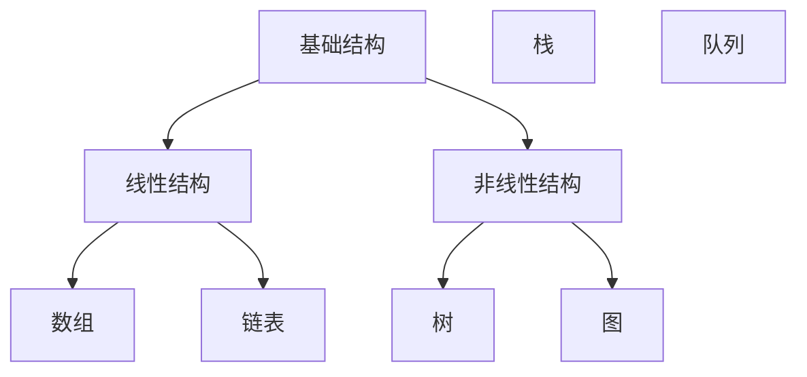

                 


### 文章标题

# 字节跳动2025届校招算法工程师面试真题解密

### 关键词

字节跳动、2025届、校招、算法工程师、面试真题、解密、数据结构、算法、数学模型

### 摘要

本文旨在为准备参加字节跳动2025届校招的算法工程师候选人提供全面的真题解析和备考指导。通过深入解析历届面试真题，本文将帮助读者理解字节跳动校招算法面试的核心考点、解题思路和解题技巧，从而提升面试能力。文章将分为三个部分：背景与技术基础、真题解析与解题思路、实战演练与技巧提升。

### 第一部分：背景与技术基础

#### 1.1 书籍概述与目标

《字节跳动2025届校招算法工程师面试真题解密》是一本专为准备参加字节跳动2025届校招的算法工程师候选人编写的备考指南。本书通过对历届面试真题的详细解析，旨在帮助读者掌握面试的核心知识点和解题技巧，提高面试成功率。

#### 1.2 阅读对象

本书主要适合以下读者：

- 准备参加字节跳动2025届校招的算法工程师候选人；
- 对算法面试感兴趣的在校大学生和研究生；
- 希望提升算法面试能力的在职工程师。

#### 1.3 书籍结构

全书分为三个部分：

- 第一部分：背景与技术基础，介绍面试前需要掌握的基础知识和技能；
- 第二部分：真题解析与解题思路，详细解析历届面试真题，并给出解题思路；
- 第三部分：实战演练与技巧提升，通过实战案例提升解题能力，并提供面试技巧。

### 第一部分：背景与技术基础

#### 2.1 算法面试核心知识点

##### 2.1.1 数据结构与算法

**核心概念与联系**

数据结构是算法的基础，常见的有数组、链表、栈、队列、树、图等。以下是常见数据结构的层次关系：



**核心算法原理讲解**

- **排序算法**：常见的排序算法有冒泡排序、选择排序、插入排序、快速排序、归并排序等。以下是一个快速排序的伪代码：

```python
def quicksort(array):
    if len(array) <= 1:
        return array
    pivot = array[len(array) // 2]
    left = []
    right = []
    for element in array:
        if element < pivot:
            left.append(element)
        else:
            right.append(element)
    return quicksort(left) + [pivot] + quicksort(right)
```

- **查找算法**：常见的查找算法有线性查找、二分查找等。以下是一个二分查找的伪代码：

```python
def binary_search(array, target):
    low = 0
    high = len(array) - 1
    while low <= high:
        mid = (low + high) // 2
        if array[mid] == target:
            return mid
        elif array[mid] < target:
            low = mid + 1
        else:
            high = mid - 1
    return -1
```

##### 2.1.2 数学模型与常见算法

**核心概念与联系**

数学模型是将现实世界的问题抽象为数学形式，常见的数学模型有线性规划、动态规划、图论模型等。

**数学模型和数学公式**

- **动态规划**：动态规划是一个多阶段决策过程，在每个阶段做出最优决策，最终得到整个过程的最佳结果。以下是一个动态规划求解斐波那契数列的数学公式：

$$
F(n) =
\begin{cases}
0 & \text{if } n = 0 \\
1 & \text{if } n = 1 \\
F(n-1) + F(n-2) & \text{otherwise}
\end{cases}
$$

**详细讲解与举例说明**

- **线性规划**：线性规划是解决一类最优化问题的数学方法。以下是一个线性规划的例子：
  - 目标函数：最大化 $z = 2x + y$
  - 约束条件：
    $$
    \begin{align*}
    x + y &\leq 4 \\
    2x + y &\leq 6 \\
    x, y &\geq 0
    \end{align*}
    $$
  - 解：
    - 画出约束条件的图形解；
    - 找到目标函数在可行域内的最大值点。

以上是文章的第一部分：背景与技术基础。接下来将详细解析字节跳动2025届校招算法工程师面试的真题，帮助读者深入理解面试题目和解题思路。敬请期待！

