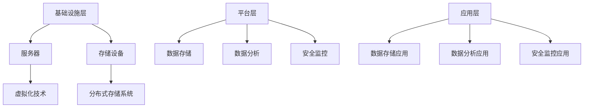
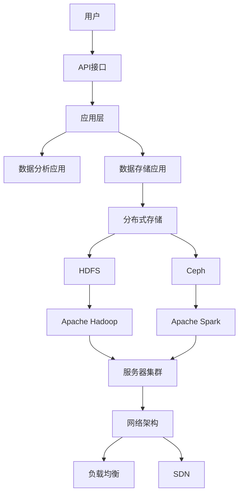

                 

## 文章标题：2024字节跳动云计算工程师面试真题及答案

> 关键词：字节跳动、云计算、面试真题、答案解析、实战项目

> 摘要：本文将针对2024年字节跳动云计算工程师面试真题进行详细解析，涵盖基础知识、核心算法、分布式系统、存储系统、网络安全等多个方面，旨在为读者提供全面的面试准备内容。通过本文的学习，您将能够更好地应对字节跳动的云计算工程师面试，提高自己的求职成功率。

## 目录大纲

1. **第一部分：基础知识与核心概念**
   - **第1章：云计算基础概念**
     - 1.1 云计算定义与历史演变
     - 1.2 云服务模型（IaaS、PaaS、SaaS）
     - 1.3 云计算架构与关键技术
     - 1.4 云计算的优势与挑战
   - **第2章：字节跳动云计算架构**
     - 2.1 字节跳动云计算架构设计原则
     - 2.2 字节跳动云计算架构体系
     - 2.3 字节跳动核心产品与服务
   - **第3章：核心算法与数据结构**
     - 3.1 数据结构与算法基础
     - 3.2 常见排序算法分析
     - 3.3 常见查找算法分析
     - 3.4 字节跳动常用算法场景应用
   - **第4章：分布式系统原理**
     - 4.1 分布式系统基础
     - 4.2 分布式一致性模型
     - 4.3 分布式事务与一致性问题
     - 4.4 分布式系统的容错与恢复
   - **第5章：存储系统设计**
     - 5.1 存储系统概述
     - 5.2 分布式文件系统
     - 5.3 缓存与缓存一致性
     - 5.4 字节跳动存储系统实践
   - **第6章：网络安全与数据保护**
     - 6.1 网络安全基础
     - 6.2 数据安全策略
     - 6.3 字节跳动网络安全实践
     - 6.4 数据隐私保护与法律法规
   - **第7章：实际面试题目解析**
     - 7.1 面试准备与心态调整
     - 7.2 编程算法题目解析
     - 7.3 数据结构与算法面试题目解析
     - 7.4 系统设计与分布式系统面试题目解析

2. **第二部分：实战项目与案例分析**
   - **第8章：云计算项目实战**
     - 8.1 项目需求分析
     - 8.2 项目架构设计
     - 8.3 系统实施与优化
     - 8.4 项目总结与反思
   - **第9章：字节跳动云计算项目案例分析**
     - 9.1 案例背景与目标
     - 9.2 案例架构设计与实现
     - 9.3 案例效果与反思
     - 9.4 案例分享与启示
   - **第10章：面试真题实战演练**
     - 10.1 面试题型分析
     - 10.2 面试题目与解答
     - 10.3 面试技巧与策略
     - 10.4 面试常见问题与解答

3. **附录**
   - **附录A：常用编程语言与工具**
     - A.1 Python编程基础
     - A.2 Java编程基础
     - A.3 Docker与容器化技术
     - A.4 Kubernetes实践
   - **附录B：参考书籍与资源**
     - B.1 云计算相关书籍推荐
     - B.2 数据结构与算法书籍推荐
     - B.3 分布式系统书籍推荐
     - B.4 面试准备与技巧资源

本文将按照以上目录结构，逐步深入讲解每个章节，帮助您全面掌握云计算工程师所需的知识与技能，为面试做好充分准备。接下来，让我们首先从云计算的基础概念开始，为接下来的内容奠定坚实的理论基础。

---

### 第1章：云计算基础概念

#### 1.1 云计算定义与历史演变

云计算是一种通过互联网提供可按需访问的共享计算资源的服务模型。它允许用户通过网络访问分布式计算资源，如服务器、存储、网络和应用程序，而无需直接管理这些资源。

云计算的历史可以追溯到20世纪60年代，当时的计算机科学家约翰·麦卡锡（John McCarthy）首次提出了“计算即服务”（Computing as a Service）的概念。然而，真正的云计算兴起始于2000年代初期，亚马逊推出Amazon Web Services（AWS），提供了弹性的计算和存储服务。随着技术的不断进步，云计算逐渐发展成为企业IT领域的一个重要组成部分。

云计算的关键特征包括：

1. **按需自助服务**：用户可以随时获取资源，无需人工干预。
2. **广泛的网络接入**：通过互联网可以随时随地访问资源。
3. **资源池化**：资源被集中管理，用户可以共享资源，提高资源利用率。
4. **快速弹性**：可以根据需求快速扩展或缩减资源。
5. **按使用量付费**：用户根据实际使用量付费，降低成本。

#### 1.2 云服务模型（IaaS、PaaS、SaaS）

云计算服务模型根据用户使用的层次不同，可以分为以下三种：

1. **基础设施即服务（IaaS，Infrastructure as a Service）**：
   IaaS提供虚拟化的计算资源，如虚拟机、存储和网络等。用户可以通过远程访问这些资源，并根据实际使用量付费。IaaS的主要优点是灵活性和可扩展性，适用于需要高度定制化资源和控制的企业。

2. **平台即服务（PaaS，Platform as a Service）**：
   PaaS提供了一个开发平台，包括操作系统、数据库、Web服务器等。开发人员可以在PaaS上开发、测试和部署应用程序，而无需关注底层基础设施的管理。PaaS的主要优点是简化了开发和部署流程，提高了开发效率。

3. **软件即服务（SaaS，Software as a Service）**：
   SaaS提供了一个完整的软件应用，用户通过互联网按需访问。SaaS的应用通常是基于订阅模式，用户可以根据需要随时取消订阅。SaaS的主要优点是降低了软件采购和维护成本，提高了资源利用率。

#### 1.3 云计算架构与关键技术

云计算架构通常分为三层：基础设施层、平台层和应用层。

1. **基础设施层**：
   基础设施层包括物理服务器、存储设备、网络设备等硬件资源。这些资源通常被虚拟化，形成虚拟化资源池，供上层使用。

2. **平台层**：
   平台层包括操作系统、数据库、Web服务器等软件资源。平台层负责管理和调度底层资源，提供高可用性和高性能。

3. **应用层**：
   应用层是用户直接使用的软件应用，可以是企业内部应用，也可以是第三方提供的SaaS应用。

云计算的关键技术包括：

1. **虚拟化技术**：
   虚拟化技术将物理硬件资源抽象成虚拟资源，提高资源利用率和灵活性。

2. **容器化技术**：
   容器化技术通过轻量级隔离和封装，实现应用程序的快速部署和扩展。

3. **分布式存储技术**：
   分布式存储技术通过多个节点存储数据，提高存储容量和可靠性。

4. **分布式计算技术**：
   分布式计算技术通过多个节点并行处理任务，提高计算性能和可扩展性。

#### 1.4 云计算的优势与挑战

云计算的优势包括：

1. **灵活性**：用户可以根据需求灵活调整资源。
2. **可扩展性**：云计算服务可以根据需求动态扩展。
3. **成本效益**：通过按需付费和资源共享，降低成本。
4. **高可用性**：分布式架构和冗余设计提高系统可靠性。

云计算的挑战包括：

1. **安全性**：数据安全和隐私保护是云计算的关键挑战。
2. **管理复杂性**：大规模云计算环境的管理复杂性增加。
3. **依赖性**：对云计算服务提供商的依赖性增加。
4. **合规性问题**：不同国家和地区的数据保护法规不同。

通过本章节的学习，我们对云计算的基础概念有了全面的了解，接下来将在第2章深入探讨字节跳动的云计算架构，帮助读者更好地理解企业级云计算的实际应用。

### 第2章：字节跳动云计算架构

#### 2.1 字节跳动云计算架构设计原则

字节跳动的云计算架构设计遵循以下原则：

1. **高可用性**：通过分布式架构和冗余设计，确保系统的高可用性。
2. **可扩展性**：通过弹性扩展机制，支持海量用户和海量数据。
3. **安全性**：采用多层次安全防护措施，保障数据和系统的安全。
4. **低成本**：通过资源优化和自动化管理，降低运营成本。
5. **可维护性**：采用模块化和标准化的设计，方便系统的维护和升级。

#### 2.2 字节跳动云计算架构体系

字节跳动的云计算架构体系分为以下几个层次：

1. **基础设施层**：
   基础设施层包括物理服务器、存储设备、网络设备等硬件资源。字节跳动采用分布式存储和计算技术，将数据分散存储在多个节点上，确保数据的高可用性和可靠性。

2. **平台层**：
   平台层包括操作系统、数据库、Web服务器等软件资源。字节跳动采用自研的操作系统和数据库，提高系统的性能和稳定性。同时，平台层提供统一的API接口，方便开发人员快速开发和部署应用。

3. **应用层**：
   应用层是用户直接使用的软件应用。字节跳动拥有大量的SaaS应用，如广告投放系统、数据分析系统、内容管理系统等。这些应用通过平台层提供的API接口，与底层基础设施进行交互。

#### 2.3 字节跳动核心产品与服务

字节跳动在云计算领域拥有多项核心产品与服务，主要包括：

1. **字节跳动云**：
   字节跳动云是字节跳动面向外部用户提供云计算服务的平台，提供IaaS、PaaS和SaaS等服务。用户可以通过字节跳动云快速部署和扩展应用程序。

2. **广告投放系统**：
   字节跳动广告投放系统是基于云计算架构构建的，支持大规模广告投放和实时竞价。该系统通过分布式计算和存储技术，实现高效的数据处理和精准的广告投放。

3. **数据分析系统**：
   字节跳动数据分析系统采用分布式计算和存储技术，提供海量数据处理和分析能力。该系统支持多种数据分析模型和算法，帮助用户从海量数据中提取有价值的信息。

4. **内容管理系统**：
   字节跳动内容管理系统基于云计算架构，支持海量内容存储和发布。该系统通过分布式存储和缓存技术，实现快速的内容访问和发布。

#### 2.4 字节跳动云计算的优势与挑战

字节跳动云计算的优势包括：

1. **高性能**：通过分布式计算和存储技术，实现高效的资源利用和数据处理。
2. **高可靠性**：通过分布式架构和冗余设计，保障系统的高可用性和数据可靠性。
3. **可扩展性**：通过弹性扩展机制，支持海量用户和海量数据。
4. **低成本**：通过自动化管理和资源优化，降低运营成本。

字节跳动云计算的挑战包括：

1. **安全性**：随着数据规模的增长，数据安全和隐私保护变得更加重要。
2. **管理复杂性**：大规模云计算环境的管理复杂性增加。
3. **合规性问题**：不同国家和地区的数据保护法规不同，需要确保合规性。

通过以上对字节跳动云计算架构的介绍，我们能够更好地理解企业级云计算的实际应用和挑战。在接下来的章节中，我们将深入探讨核心算法与数据结构，帮助读者更好地应对面试中的相关题目。

### 第3章：核心算法与数据结构

#### 3.1 数据结构与算法基础

数据结构和算法是计算机科学中的核心概念，对于理解和解决复杂问题至关重要。数据结构是指数据的组织形式，而算法则是解决问题的步骤和规则。以下是几种常见的数据结构和算法基础：

1. **数组（Array）**：
   数组是一种线性数据结构，用于存储一系列相同类型的元素。数组的特点是元素存储在连续的内存空间中，可以通过索引快速访问元素。

2. **链表（Linked List）**：
   链表是一种动态数据结构，由一系列节点组成，每个节点包含数据和指向下一个节点的指针。链表的特点是插入和删除操作灵活，但访问元素需要遍历链表。

3. **栈（Stack）**：
   栈是一种后进先出（LIFO）的数据结构，常用于函数调用、递归等场景。栈的插入和删除操作都在一端进行。

4. **队列（Queue）**：
   队列是一种先进先出（FIFO）的数据结构，常用于任务调度、缓冲区管理等场景。队列的插入操作在队尾进行，删除操作在队头进行。

5. **树（Tree）**：
   树是一种分层的数据结构，由节点和边组成。树的特点是具有层次结构和路径，常用于表示组织结构、搜索算法等。

6. **图（Graph）**：
   图是一种由节点和边组成的数据结构，用于表示复杂的关系网络。图的特点是节点之间的连接可以是有向的或无向的，可以是权重非负的。

7. **哈希表（Hash Table）**：
   哈希表是一种基于哈希函数的数据结构，用于高效地查找和插入数据。哈希表通过计算关键字的哈希值来确定数据存储的位置。

#### 3.2 常见排序算法分析

排序算法是计算机科学中的一种基本算法，用于将一组数据按照特定的顺序排列。以下是一些常见的排序算法及其分析：

1. **冒泡排序（Bubble Sort）**：
   冒泡排序是一种简单的排序算法，通过多次遍历待排序列，比较相邻元素的大小并进行交换，直到序列有序。时间复杂度为O(n^2)。

2. **选择排序（Selection Sort）**：
   选择排序是一种简单的排序算法，通过遍历待排序列，每次选择最小（或最大）的元素放到序列的起始位置。时间复杂度为O(n^2)。

3. **插入排序（Insertion Sort）**：
   插入排序是一种简单的排序算法，通过逐个读取待排序列中的元素，将其插入到已经排序的序列中。时间复杂度为O(n^2)。

4. **快速排序（Quick Sort）**：
   快速排序是一种高效的排序算法，通过选择一个基准元素，将序列分为两部分，然后递归地对两部分进行排序。时间复杂度为O(n log n)。

5. **归并排序（Merge Sort）**：
   归并排序是一种分治排序算法，将序列分为两部分，递归地对两部分进行排序，然后合并两个有序部分。时间复杂度为O(n log n)。

6. **堆排序（Heap Sort）**：
   堆排序是一种基于堆数据结构的排序算法，通过构造最大堆或最小堆，依次取出堆顶元素进行排序。时间复杂度为O(n log n)。

#### 3.3 常见查找算法分析

查找算法用于在数据结构中查找特定元素。以下是一些常见的查找算法及其分析：

1. **顺序查找（Linear Search）**：
   顺序查找是一种简单查找算法，从数据结构的一端开始，逐个比较元素，直到找到目标元素或到达数据结构的另一端。时间复杂度为O(n)。

2. **二分查找（Binary Search）**：
   二分查找是一种高效的查找算法，适用于有序数据结构。通过不断将查找范围缩小一半，逐步逼近目标元素。时间复杂度为O(log n)。

3. **哈希查找（Hash Search）**：
   哈希查找是一种基于哈希函数的查找算法，通过计算关键字的哈希值来确定数据存储的位置，从而快速查找数据。时间复杂度为O(1)。

#### 3.4 字节跳动常用算法场景应用

字节跳动在广告投放、数据分析等领域广泛应用了各种算法。以下是一些典型的应用场景：

1. **广告投放优化**：
   字节跳动的广告投放系统通过算法实时计算用户兴趣和行为，为用户推荐最相关的广告。常用的算法包括协同过滤、机器学习、优化算法等。

2. **内容推荐**：
   字节跳动的内容推荐系统通过算法分析用户的浏览历史和兴趣标签，为用户推荐最感兴趣的内容。常用的算法包括基于内容的推荐、协同过滤等。

3. **实时计算**：
   字节跳动的实时计算系统通过分布式计算和存储技术，处理海量数据并进行实时分析。常用的算法包括流计算、分布式计算等。

通过本章的学习，我们对数据结构和算法的基础概念有了更深入的理解，并了解了一些常见的排序和查找算法。在接下来的章节中，我们将进一步探讨分布式系统的原理和应用。

### 第4章：分布式系统原理

#### 4.1 分布式系统基础

分布式系统是指由多个独立节点组成的系统，这些节点通过网络连接，协同工作以实现共同的任务。分布式系统的核心目标是提高系统的可用性、可扩展性和容错能力。以下是对分布式系统基础概念和特点的详细介绍。

##### 分布式系统的特点：

1. **分布式计算**：分布式系统通过多个节点并行处理任务，提高计算效率。
2. **高可用性**：分布式系统通过冗余设计，实现故障节点的自动切换，保证系统的高可用性。
3. **可扩展性**：分布式系统可以根据需求动态扩展节点，支持海量数据处理。
4. **容错性**：分布式系统通过故障检测和恢复机制，确保系统在发生故障时仍能正常运行。

##### 分布式系统的组成部分：

1. **节点**：分布式系统中的基本单元，负责处理数据和任务。
2. **网络**：连接各个节点的通信网络，用于传输数据和消息。
3. **通信协议**：定义节点之间通信的规则和协议。
4. **数据一致性**：保证分布式系统中各个节点的数据一致性。
5. **分布式算法**：用于解决分布式系统中的各种问题，如负载均衡、故障检测和恢复等。

##### 分布式系统的通信模式：

1. **点对点通信**：节点之间直接进行通信，适用于小规模系统。
2. **广播通信**：消息从一个节点发送到所有其他节点，适用于大规模系统。
3. **共享内存通信**：多个节点通过共享内存进行通信，适用于紧密耦合的系统。

#### 4.2 分布式一致性模型

在分布式系统中，一致性是指多个节点对于同一份数据具有相同的视图。一致性模型定义了分布式系统中如何保持数据的一致性。以下是一些常见的一致性模型：

1. **强一致性（Strong Consistency）**：
   强一致性保证在任何一个时刻，分布式系统中的所有节点都能看到相同的最新数据。强一致性提供了严格的数据一致保证，但可能牺牲性能和可用性。

2. **最终一致性（Eventual Consistency）**：
   最终一致性保证在系统达到稳定状态后，所有节点的数据将保持一致。最终一致性允许在一定时间内出现数据不一致的情况，但最终会达到一致性。这种模型适用于对一致性要求不是特别严格的场景。

3. **因果一致性（ causal consistency）**：
   因果一致性保证事件之间的因果关系在分布式系统中得到保持。即如果一个事件A发生在事件B之前，那么所有节点都将先看到事件A的数据，再看到事件B的数据。

4. **读己所写一致性（Read-Your-Write Consistency）**：
   读己所写一致性保证一个节点读取自己最近写入的数据。这种模型适用于对写入操作的一致性要求较高的场景。

5. **部份一致性（Partial Consistency）**：
   部份一致性是指分布式系统中的不同节点可能对同一份数据有不同的视图，这种模型适用于对一致性要求较宽松的场景。

#### 4.3 分布式事务与一致性问题

在分布式系统中，事务是一组操作序列，这些操作要么全部成功执行，要么全部失败回滚。分布式事务的一致性问题主要包括以下几种：

1. **两阶段提交（2PC，Two-Phase Commit）**：
   两阶段提交是一种分布式事务协议，分为准备阶段和提交阶段。在准备阶段，协调者询问参与者是否准备好执行事务，如果所有参与者都准备好了，协调者进入提交阶段，通知所有参与者执行事务。两阶段提交可以保证事务的一致性，但可能存在单点故障和死锁问题。

2. **三阶段提交（3PC，Three-Phase Commit）**：
   三阶段提交是对两阶段提交的改进，引入了预准备阶段。在预准备阶段，协调者询问参与者是否准备好执行事务，如果所有参与者都准备好了，协调者进入提交阶段。三阶段提交减少了单点故障的风险，但仍然可能存在死锁问题。

3. **最终一致性事务（Eventual Consistency Transactions）**：
   最终一致性事务是一种在最终一致性模型下实现事务的方法。事务分为准备和提交两个阶段，提交阶段通过最终一致性保证事务的执行。这种方法适用于对一致性要求不是特别严格的场景。

4. **基于状态机的分布式事务（State Machine Replication）**：
   基于状态机的分布式事务是一种通过复制状态机实现分布式事务的方法。每个节点都有一个本地状态机，事务通过在所有节点上执行相同的操作序列来保持一致性。这种方法可以保证一致性，但可能存在性能问题。

#### 4.4 分布式系统的容错与恢复

在分布式系统中，容错是指系统在发生故障时仍能正常运行的能力。以下是一些常见的容错和恢复机制：

1. **冗余设计**：
   冗余设计通过在系统中引入冗余组件，提高系统的容错能力。常见的冗余设计包括硬件冗余（如RAID磁盘阵列）和软件冗余（如服务冗余）。

2. **故障检测**：
   故障检测是分布式系统中的一项重要功能，用于检测节点故障。常见的故障检测方法包括心跳检测、状态监控和异常检测。

3. **自动恢复**：
   自动恢复是指在检测到故障后，系统能够自动恢复到正常状态。自动恢复机制包括故障转移（Failover）和故障恢复（Recovery）。故障转移是指将故障节点的任务转移到健康节点，故障恢复是指修复故障节点并重新加入系统。

4. **数据复制**：
   数据复制是指将数据在多个节点上复制，以提高数据的可靠性和可用性。常见的复制策略包括主从复制、多主复制和最终一致性复制。

通过本章的学习，我们深入了解了分布式系统的基本概念、一致性模型、事务与一致性问题，以及容错与恢复机制。这些知识对于理解和设计分布式系统至关重要。在接下来的章节中，我们将探讨存储系统设计，进一步巩固云计算工程师所需的知识体系。

### 第5章：存储系统设计

#### 5.1 存储系统概述

存储系统是云计算架构中的核心组件，负责数据的持久化存储和管理。一个高效的存储系统需要具备高可靠性、高性能和可扩展性。以下是对存储系统的概述及其重要性。

##### 存储系统的定义和功能：

1. **定义**：
   存储系统是指用于存储和管理数据的硬件、软件和网络的组合。它包括硬盘、磁盘阵列、固态硬盘、内存、网络存储设备等。

2. **功能**：
   存储系统主要提供以下功能：
   - **数据持久化**：确保数据在断电或系统故障后仍能保持。
   - **数据访问**：提供数据读取和写入的接口。
   - **数据管理**：包括数据备份、恢复、压缩、加密等。
   - **数据保护**：确保数据的安全性和完整性。

##### 存储系统的类型：

1. **本地存储**：
   本地存储是指直接连接到计算机或服务器的存储设备，如硬盘、SSD等。本地存储具有较低的延迟和较高的性能，但扩展性和可靠性有限。

2. **网络存储**：
   网络存储通过网络连接的存储设备，如NAS（网络存储器）和SAN（存储区域网络）。网络存储具有高扩展性和可靠性，适用于大规模数据存储。

3. **分布式存储**：
   分布式存储是指通过多个节点分散存储数据，提供高可用性和高性能的存储解决方案。分布式存储系统如Hadoop、Ceph等，可以横向扩展，支持海量数据存储。

##### 存储系统的重要性：

1. **数据持久化**：
   存储系统确保数据在系统故障或断电后能够恢复，保障业务的连续性。

2. **数据访问性能**：
   高性能的存储系统可以减少数据的访问延迟，提高应用程序的响应速度。

3. **数据管理**：
   存储系统提供数据备份、恢复、压缩、加密等功能，保障数据的安全性和完整性。

4. **成本效益**：
   分布式存储系统通过资源共享和负载均衡，提高资源利用率，降低存储成本。

#### 5.2 分布式文件系统

分布式文件系统是一种用于管理分布式存储的文件系统，它将数据分散存储在多个节点上，提供统一的数据访问接口。以下是一些常见的分布式文件系统及其特点：

1. **Hadoop HDFS**：
   Hadoop HDFS（Hadoop Distributed File System）是一种基于Hadoop的分布式文件系统，用于存储和处理大规模数据。HDFS采用主从架构，由一个NameNode（主节点）和多个DataNode（数据节点）组成。HDFS的特点是高可靠性和高吞吐量，适用于大数据处理。

2. **Ceph**：
   Ceph是一种开源的分布式存储系统，支持对象存储、块存储和文件系统。Ceph采用分布式架构，具有高度可扩展性和高可用性。Ceph的特点是高性能和容错能力，适用于大规模数据存储。

3. **GlusterFS**：
   GlusterFS是一种分布式文件系统，通过扩展文件系统（EXT）提供文件存储功能。GlusterFS采用分布式架构，支持多种协议，如NFS、SMB等。GlusterFS的特点是高扩展性和灵活性，适用于大规模数据存储。

4. **MongoDB**：
   MongoDB是一种基于文档的分布式数据库，同时提供分布式文件系统功能。MongoDB采用分布式集群架构，支持数据分片和副本集，提供高可用性和高性能。MongoDB的特点是灵活的数据模型和易扩展性。

#### 5.3 缓存与缓存一致性

缓存是一种快速访问数据的技术，通过将频繁访问的数据存储在内存中，减少对慢速存储设备的访问。以下是一些常见的缓存策略和缓存一致性机制：

1. **缓存策略**：
   - **LRU（Least Recently Used）**：根据数据的最近使用情况，将最少使用的缓存项替换。
   - **LFU（Least Frequently Used）**：根据数据的访问频率，将最少访问的缓存项替换。
   - **FIFO（First In, First Out）**：根据数据的进入顺序，将最早进入的缓存项替换。

2. **缓存一致性**：
   缓存一致性是指确保分布式系统中的缓存数据与原始数据保持一致。以下是一些常见的缓存一致性机制：

   - **强一致性**：所有节点的缓存数据与原始数据始终一致。
   - **最终一致性**：在一定时间内，节点的缓存数据将最终与原始数据一致。
   - **部份一致性**：不同节点的缓存数据可以不同，但最终会达到一致性。

3. **缓存一致性协议**：
   - **弱一致性**：数据更新后的同步延迟较大，适用于对一致性要求不高的场景。
   - **最终一致性协议**：如Gossip协议，通过消息传播实现数据一致性。
   - **强一致性协议**：如Paxos算法，通过多数派协议实现数据一致性。

#### 5.4 字节跳动存储系统实践

字节跳动在存储系统设计方面有着丰富的实践经验，其存储系统主要特点如下：

1. **海量数据存储**：
   字节跳动采用分布式存储系统，如Hadoop和Ceph，支持海量数据的存储和管理。通过数据分片和副本机制，提高存储系统的可靠性和性能。

2. **高性能访问**：
   字节跳动采用缓存技术，如Redis和Memcached，降低数据访问延迟，提高系统响应速度。同时，通过优化存储系统和网络架构，提高数据访问性能。

3. **数据一致性保障**：
   字节跳动采用多种缓存一致性协议和分布式事务机制，保障数据的一致性和可靠性。通过最终一致性协议和强一致性协议，满足不同场景下的数据一致性需求。

4. **数据安全性**：
   字节跳动采用多种数据安全措施，如数据加密、访问控制、备份与恢复等，确保数据的安全性和完整性。

通过本章的学习，我们对存储系统的概述、分布式文件系统、缓存与缓存一致性，以及字节跳动存储系统实践有了深入的了解。这些知识对于理解和设计高效的存储系统具有重要意义。在接下来的章节中，我们将探讨网络安全与数据保护，为构建安全的云计算环境提供指导。

### 第6章：网络安全与数据保护

#### 6.1 网络安全基础

网络安全是云计算环境中的一个关键问题，涉及到数据的保护、系统的安全运行以及用户隐私的保障。以下是对网络安全基础概念、威胁类型和防护措施的详细介绍。

##### 网络安全基础概念：

1. **网络安全**：
   网络安全是指保护计算机网络和系统不受未经授权的访问、篡改、破坏和泄露等威胁。

2. **安全防护**：
   安全防护是指通过技术和管理手段，防止和应对网络安全威胁，保障系统的安全运行。

3. **安全策略**：
   安全策略是一套指导安全工作的原则和规范，包括访问控制、加密、防火墙、入侵检测等。

4. **安全协议**：
   安全协议是用于保障数据在传输过程中不被窃取、篡改和伪造的通信协议，如HTTPS、SSL/TLS等。

##### 常见网络安全威胁：

1. **病毒（Virus）**：
   病毒是一种恶意软件，能够感染其他程序并在运行时执行恶意操作，如删除文件、窃取信息等。

2. **蠕虫（Worm）**：
   蠕虫是一种能够自我复制并传播的恶意软件，它可以在网络中快速扩散，消耗网络带宽和系统资源。

3. **木马（Trojan）**：
   木马是一种隐藏在正常程序中的恶意软件，它通过远程控制主机，窃取信息、操纵系统等。

4. **网络钓鱼（Phishing）**：
   网络钓鱼是一种通过伪装成合法网站或邮件，诱导用户输入账号和密码等敏感信息的攻击手段。

5. **拒绝服务攻击（DoS/DDoS）**：
   拒绝服务攻击是指通过大量请求占用网络资源，使合法用户无法访问服务的攻击手段。分布式拒绝服务（DDoS）利用多个受感染的节点进行攻击。

6. **数据泄露（Data Breach）**：
   数据泄露是指未经授权的第三方非法获取和访问敏感数据，可能导致隐私泄露、经济损失等。

##### 网络安全防护措施：

1. **防火墙（Firewall）**：
   防火墙是一种网络安全设备，用于监控和控制进出网络的流量，阻止非法访问和攻击。

2. **入侵检测系统（IDS）**：
   入侵检测系统用于监控网络流量和系统活动，识别潜在的安全威胁，并及时报警。

3. **安全审计（Audit）**：
   安全审计是一种记录和检查系统活动的方法，用于发现安全漏洞和违规行为，确保系统的合规性。

4. **加密（Encryption）**：
   加密是一种通过算法将明文数据转换成密文，防止未授权访问和泄露的技术。常见的加密算法包括AES、RSA等。

5. **访问控制（Access Control）**：
   访问控制是一种通过权限管理，限制用户对系统和资源的访问，防止未经授权的操作。

6. **备份与恢复（Backup and Recovery）**：
   备份与恢复是一种数据保护措施，通过定期备份，确保数据在故障或攻击时能够恢复。

#### 6.2 数据安全策略

数据安全策略是保障数据在存储、传输和处理过程中的安全性的重要手段。以下是一些常见的数据安全策略：

1. **数据加密**：
   对敏感数据进行加密，确保在传输和存储过程中不被窃取或篡改。常见的加密技术包括SSL/TLS、AES等。

2. **访问控制**：
   通过访问控制机制，限制对数据和系统的访问权限，确保只有授权用户才能访问敏感数据。

3. **多因素认证（MFA）**：
   多因素认证是一种通过多个认证因素（如密码、手机验证码、指纹等）验证用户身份的方法，提高安全性。

4. **数据备份**：
   定期对重要数据进行备份，确保在数据丢失或损坏时能够恢复。备份策略应包括本地备份和远程备份。

5. **安全审计**：
   实施安全审计，监控和记录系统活动，及时发现和应对安全威胁。

6. **数据隐私保护**：
   遵守相关法律法规，保护用户隐私，采取数据匿名化、去标识化等技术手段，降低数据泄露风险。

#### 6.3 字节跳动网络安全实践

字节跳动在网络安全方面有着丰富的实践经验，其网络安全实践主要包括以下几个方面：

1. **多层次防护**：
   字节跳动采用多层次防护策略，包括防火墙、入侵检测系统、安全审计等，全面保障网络和系统的安全。

2. **安全体系建设**：
   字节跳动建立了完善的安全管理体系，包括安全策略、安全组织、安全流程等，确保安全工作的有效开展。

3. **安全培训与意识提升**：
   字节跳动定期开展安全培训，提高员工的安全意识和技能，降低人为安全风险。

4. **安全技术研发**：
   字节跳动投入大量资源进行安全技术研发，开发自研安全工具和解决方案，提升网络安全防护能力。

5. **安全应急响应**：
   字节跳动建立了快速响应机制，及时应对网络安全事件，降低安全事件的影响。

6. **数据隐私保护**：
   字节跳动严格遵守相关法律法规，采取多种数据隐私保护措施，保护用户隐私。

通过本章的学习，我们对网络安全与数据保护有了更深入的了解，为构建安全的云计算环境提供了指导。在接下来的章节中，我们将探讨实际面试题目解析，帮助读者更好地应对云计算工程师的面试挑战。

### 第7章：实际面试题目解析

#### 7.1 面试准备与心态调整

在准备面试之前，以下是一些面试准备和心态调整的建议，帮助您更好地应对面试挑战。

##### 面试准备

1. **了解公司背景**：
   研究目标公司的业务、发展历程、文化价值观以及产品和服务。这将帮助您更好地了解公司的需求，从而在面试中展示与公司价值观相符的能力。

2. **回顾基础知识**：
   复习计算机科学的基础知识，包括数据结构与算法、操作系统、计算机网络、数据库等。确保对基础知识有深入的理解，这将是您回答问题的基石。

3. **编程实践**：
   实践是检验真理的唯一标准。通过刷算法题、编写代码，提高编程能力和解题技巧。可以使用在线编程平台（如LeetCode、牛客网）进行练习。

4. **面试经验分享**：
   阅读相关的面试经验分享，了解面试中的常见题型和应对策略。这可以帮助您更好地预测面试中的问题，做好准备。

5. **模拟面试**：
   与朋友或同事进行模拟面试，熟悉面试流程和回答问题的节奏。模拟面试可以帮助您发现潜在的问题和改进方向。

##### 心态调整

1. **自信**：
   自信是成功的一半。在面试前，保持积极的心态，相信自己具备应对面试的能力。不要低估自己的实力，相信自己的准备是充分的。

2. **放松**：
   面试前保持放松，进行深呼吸、冥想等放松技巧，减轻紧张情绪。一个放松的状态有助于您更好地展现自己的能力和自信。

3. **积极应对**：
   面试中遇到不会回答的问题时，不要慌张。尝试从已知的知识点出发，给出尽可能详细的解释。如果确实不知道答案，可以诚实地表示自己对该问题不熟悉。

4. **沟通技巧**：
   保持良好的沟通技巧，清晰、准确地表达自己的想法。避免使用行话和复杂的术语，确保面试官能够理解您所表达的内容。

5. **反馈**：
   面试后，及时进行反思和总结。询问面试官关于面试反馈，了解自己在面试中的优点和不足。这将为下一次面试提供宝贵的经验。

#### 7.2 编程算法题目解析

编程算法题目是面试中的常见题型，以下是一些典型的编程算法题目及其解析。

##### 题目1：最长公共子序列（LCS）

**题目描述**：给定两个字符串`str1`和`str2`，找出它们的最长公共子序列。

**解题思路**：可以使用动态规划的方法解决。定义一个二维数组`dp`，其中`dp[i][j]`表示`str1`的前`i`个字符和`str2`的前`j`个字符的最长公共子序列的长度。

**伪代码**：

```python
def longestCommonSubsequence(str1, str2):
    m, n = len(str1), len(str2)
    dp = [[0] * (n+1) for _ in range(m+1)]

    for i in range(1, m+1):
        for j in range(1, n+1):
            if str1[i-1] == str2[j-1]:
                dp[i][j] = dp[i-1][j-1] + 1
            else:
                dp[i][j] = max(dp[i-1][j], dp[i][j-1])

    return dp[m][n]
```

##### 题目2：环形数组中的最小元素

**题目描述**：给定一个循环旋转数组，找到数组中的最小元素。

**解题思路**：可以使用二分查找的方法解决。在常规二分查找的基础上，增加对循环情况的判断。

**伪代码**：

```python
def findMin(nums):
    left, right = 0, len(nums) - 1

    while left < right:
        mid = (left + right) // 2
        if nums[mid] > nums[right]:
            left = mid + 1
        else:
            right = mid

    return nums[left]
```

##### 题目3：合并区间

**题目描述**：给定一组区间，合并所有重叠的区间。

**解题思路**：首先对区间进行排序，然后遍历排序后的区间，合并重叠的区间。

**伪代码**：

```python
def merge(intervals):
    intervals.sort(key=lambda x: x[0])
    result = []

    for interval in intervals:
        if not result or result[-1][1] < interval[0]:
            result.append(interval)
        else:
            result[-1][1] = max(result[-1][1], interval[1])

    return result
```

通过以上几个编程算法题目的解析，我们可以看到解决算法题目的关键在于理解问题、选择合适的数据结构和算法，并使用伪代码清晰地表达解题思路。在实际面试中，这些技能将帮助您更好地应对各种编程挑战。

#### 7.3 数据结构与算法面试题目解析

在数据结构与算法的面试中，常见题型包括链表、树、图、排序和搜索等。以下是一些典型的数据结构与算法面试题目及其解析。

##### 题目1：反转链表

**题目描述**：编写一个函数，用于反转单链表。

**解题思路**：可以使用迭代或递归的方法。迭代方法使用三个指针变量，分别指向当前节点、前一个节点和后一个节点，依次更新指针指向，实现链表反转。

**伪代码**：

```python
def reverseLinkedList(head):
    prev = None
    curr = head

    while curr:
        next_node = curr.next
        curr.next = prev
        prev = curr
        curr = next_node

    return prev
```

##### 题目2：二叉树的遍历

**题目描述**：实现二叉树的遍历算法，包括前序遍历、中序遍历和后序遍历。

**解题思路**：可以使用递归或迭代的方法。递归方法直接根据定义实现，迭代方法可以使用栈或队列模拟递归过程。

**前序遍历**：

```python
def preorderTraversal(root):
    result = []
    stack = [root]

    while stack:
        node = stack.pop()
        if node:
            result.append(node.val)
            if node.right:
                stack.append(node.right)
            if node.left:
                stack.append(node.left)

    return result
```

**中序遍历**：

```python
def inorderTraversal(root):
    result = []
    stack = []

    while root or stack:
        while root:
            stack.append(root)
            root = root.left
        node = stack.pop()
        result.append(node.val)
        root = node.right

    return result
```

**后序遍历**：

```python
def postorderTraversal(root):
    result = []
    stack = [None, root]

    while stack:
        node = stack.pop()
        if node:
            result.append(node.val)
            if node.left:
                stack.append(node.left)
            if node.right:
                stack.append(node.right)
            stack.append(node)

    return result[::-1]
```

##### 题目3：图的最短路径

**题目描述**：给定一个无权图的邻接表表示，找出从源点到所有节点的最短路径。

**解题思路**：可以使用Dijkstra算法。Dijkstra算法使用一个优先队列，逐步扩展最短路径树，直到包含所有节点。

**伪代码**：

```python
def dijkstra(graph, source):
    dist = [float('inf')] * len(graph)
    dist[source] = 0
    priority_queue = [(0, source)]

    while priority_queue:
        current_dist, current_vertex = heapq.heappop(priority_queue)

        if current_dist > dist[current_vertex]:
            continue

        for neighbor, weight in graph[current_vertex].items():
            distance = current_dist + weight

            if distance < dist[neighbor]:
                dist[neighbor] = distance
                heapq.heappush(priority_queue, (distance, neighbor))

    return dist
```

通过以上几个数据结构与算法面试题目的解析，我们可以看到，解决这些问题的关键在于理解问题、选择合适的数据结构和算法，并使用伪代码清晰地表达解题思路。在实际面试中，这些技能将帮助您更好地应对各种数据结构与算法的挑战。

#### 7.4 系统设计与分布式系统面试题目解析

在系统设计与分布式系统面试中，常见题型包括系统设计题、分布式算法题以及一致性模型题等。以下是一些典型的面试题目及其解析。

##### 题目1：设计一个缓存系统

**题目描述**：设计一个缓存系统，要求支持添加、删除和获取操作，并确保缓存数据的大小不超过设定的大小限制。

**解题思路**：可以使用哈希表和双端队列（或链表）实现。哈希表用于快速查找缓存项，双端队列用于管理缓存项，根据最近使用原则进行维护。

**伪代码**：

```python
class LRUCache:
    def __init__(self, capacity: int):
        self.capacity = capacity
        self.cache = {}  # 哈希表存储缓存项
        self.queue = deque()  # 双端队列存储缓存项

    def get(self, key: int) -> int:
        if key not in self.cache:
            return -1
        self.queue.remove(key)
        self.queue.appendleft(key)
        return self.cache[key]

    def put(self, key: int, value: int) -> None:
        if key in self.cache:
            self.queue.remove(key)
        self.queue.appendleft(key)
        self.cache[key] = value
        if len(self.queue) > self.capacity:
            removed_key = self.queue.pop()
            del self.cache[removed_key]
```

##### 题目2：分布式计数器

**题目描述**：设计一个分布式计数器，要求支持增加和减少操作，且能够确保多个节点上的计数器值保持一致。

**解题思路**：可以使用ZooKeeper或Consul等分布式协调工具，实现基于状态的分布式计数器。每个节点上的计数器值与ZooKeeper或Consul中的状态保持同步。

**伪代码**：

```python
# 假设使用ZooKeeper
from kazoo.client import KazooClient

def distributed_counter(client, counter_path):
    def increment():
        client.set(counter_path, str(int(client.get(counter_path)[0]) + 1))

    def decrement():
        client.set(counter_path, str(int(client.get(counter_path)[0]) - 1))

    return increment, decrement
```

##### 题目3：一致性哈希算法

**题目描述**：实现一致性哈希算法，用于分布式的缓存或负载均衡。

**解题思路**：一致性哈希算法将哈希值空间划分为一个虚拟圆环，每个节点映射到圆环上的一个点。当节点或数据发生变化时，通过重新计算哈希值，将节点或数据迁移到新的位置。

**伪代码**：

```python
def hash(key):
    return int(key) % 2**128

def consistent_hashing(replicas, nodes):
    circle = []
    for node in nodes:
        for i in range(replicas):
            circle.append((hash(node) + i) % 2**128)

    return circle
```

通过以上几个系统设计与分布式系统面试题目的解析，我们可以看到，解决这些问题的关键在于理解问题需求、选择合适的设计模式和算法，并使用伪代码清晰地表达设计思路。在实际面试中，这些技能将帮助您更好地应对各种系统设计与分布式系统的挑战。

### 第8章：云计算项目实战

#### 8.1 项目需求分析

在开始任何项目之前，明确项目需求是非常重要的。以下是一个云计算项目的需求分析实例。

**项目背景**：
公司计划开发一个面向中小企业的云服务平台，提供包括数据存储、数据分析、安全监控等功能。

**需求分析**：

1. **功能需求**：
   - **数据存储**：提供可靠、安全的数据存储服务，支持文件存储和对象存储。
   - **数据分析**：提供高效的数据分析工具，支持SQL查询、数据分析报告生成等。
   - **安全监控**：实现数据安全保护，包括数据加密、访问控制、安全审计等。

2. **性能需求**：
   - **存储性能**：确保数据存储系统具有高吞吐量和低延迟。
   - **分析性能**：确保数据分析系统能够快速处理海量数据。

3. **可用性需求**：
   - **高可用性**：系统具备良好的容错能力，确保服务持续可用。
   - **数据备份**：实现数据的自动备份和恢复，确保数据的安全。

4. **成本需求**：
   - **经济性**：在保证性能和可靠性的前提下，尽量降低成本。

5. **扩展性需求**：
   - **可扩展性**：支持系统的横向扩展，以应对不断增长的数据量和服务需求。

#### 8.2 项目架构设计

项目架构设计是项目成功的关键。以下是基于需求分析的一个云计算项目架构设计实例。

**架构设计**：

1. **基础设施层**：
   - **服务器**：使用高性能服务器和虚拟化技术，提高资源利用率。
   - **存储设备**：采用分布式存储系统，如Ceph或HDFS，实现数据的高可用和存储扩展。

2. **平台层**：
   - **数据存储**：使用对象存储（如Amazon S3）和文件存储（如NFS）。
   - **数据分析**：采用大数据处理框架（如Apache Hadoop和Spark）。
   - **安全监控**：集成开源安全工具（如Zabbix和Nagios）。

3. **应用层**：
   - **数据存储应用**：实现数据上传、下载、备份和恢复功能。
   - **数据分析应用**：提供数据查询、分析报告生成、数据可视化等功能。
   - **安全监控应用**：实现实时监控、报警、日志分析等功能。

**架构图**：



#### 8.3 系统实施与优化

系统实施与优化是项目开发过程中的重要环节。以下是一个基于以上架构设计的云计算项目实施与优化实例。

**系统实施**：

1. **服务器搭建**：
   - 选择合适的服务器硬件，安装并配置Linux操作系统。
   - 部署虚拟化技术，如KVM或VMware，实现虚拟化资源管理。

2. **存储系统部署**：
   - 部署分布式存储系统，如Ceph或HDFS，配置存储节点和监控。
   - 实现数据存储应用，如NFS或S3，提供文件存储和对象存储接口。

3. **数据分析平台部署**：
   - 部署大数据处理框架，如Hadoop或Spark，配置计算节点和存储。
   - 开发数据查询和分析应用，提供SQL查询和数据分析报告。

4. **安全监控系统部署**：
   - 集成开源安全工具，如Zabbix或Nagios，配置监控节点和报警。
   - 实现安全监控应用，提供实时监控、报警和日志分析。

**系统优化**：

1. **性能优化**：
   - 调整存储和计算资源的分配，提高系统吞吐量和响应速度。
   - 优化网络架构，减少数据传输延迟。

2. **安全性优化**：
   - 实现数据加密，保护数据在存储和传输过程中的安全性。
   - 加强访问控制，确保只有授权用户可以访问数据。

3. **扩展性优化**：
   - 设计和实现负载均衡和分布式计算，支持系统的横向扩展。
   - 优化分布式存储系统，提高存储容量和可靠性。

#### 8.4 项目总结与反思

在项目实施和优化过程中，我们积累了一些宝贵的经验，以下是对项目的总结与反思：

**成功经验**：
- 项目需求明确，架构设计合理，为后续开发提供了清晰的指导。
- 采用开源技术和开源工具，降低了成本，提高了系统的灵活性和可扩展性。
- 重视系统性能和安全性的优化，确保了系统的稳定性和安全性。

**不足与改进**：
- 在项目初期，对部分技术细节考虑不够充分，导致后期出现了一些性能瓶颈。
- 安全性方面，部分安全措施不够完善，需要进一步完善和加强。
- 在项目实施过程中，部分团队成员缺乏相关经验，影响了项目的进展。

**未来展望**：
- 进一步优化系统性能和安全性，提升用户体验。
- 探索新的业务模式和技术应用，扩大市场份额。
- 加强团队建设，提高团队整体的技术能力和项目管理水平。

通过以上云计算项目实战的介绍，我们可以看到项目从需求分析到架构设计，再到实施和优化，每个环节都需要精心考虑和有效执行。在实际项目中，不断总结经验和反思不足，有助于我们持续改进，提升项目质量。

### 第9章：字节跳动云计算项目案例分析

#### 9.1 案例背景与目标

字节跳动是一家全球领先的互联网科技公司，拥有多款知名应用，如抖音、今日头条等。随着用户规模的不断扩大和业务需求的增长，字节跳动面临着巨大的数据存储和处理挑战。为了满足这些需求，字节跳动决定实施一项云计算项目，旨在构建一个高效、可靠、可扩展的云计算平台，支持其业务的持续增长。

**项目背景**：
- 用户规模巨大：字节跳动的应用拥有数亿活跃用户，每天产生海量的数据。
- 业务多样化：字节跳动涵盖短视频、内容资讯、社交等多种业务模式，数据类型多样。
- 数据处理需求：需要实时处理和分析大量用户数据，为业务决策提供支持。
- 可扩展性要求：系统需具备良好的可扩展性，以应对业务需求的快速变化。

**项目目标**：
- 构建一个分布式、高可用、高性能的云计算平台。
- 实现数据的实时处理和存储，支持多种数据处理需求。
- 提供灵活的API接口，方便业务系统的接入和使用。
- 确保数据的安全性和隐私保护。

#### 9.2 案例架构设计与实现

为了实现上述项目目标，字节跳动采用了以下架构设计和关键技术：

1. **基础设施层**：
   - **服务器集群**：部署大量服务器，实现计算和存储资源的弹性扩展。
   - **网络架构**：采用负载均衡和SDN（软件定义网络）技术，优化数据传输路径，提高网络性能和可靠性。

2. **平台层**：
   - **分布式存储**：采用Ceph和HDFS等分布式存储系统，实现海量数据的存储和备份。
   - **数据处理**：使用Apache Hadoop和Apache Spark等大数据处理框架，提供高效的数据处理能力。
   - **安全平台**：集成Kubernetes和Istio等容器编排和安全工具，确保系统安全和资源管理。

3. **应用层**：
   - **数据存储应用**：实现数据的上传、下载、备份和恢复功能。
   - **数据分析应用**：提供实时数据分析、报告生成、数据可视化等功能。
   - **API接口**：设计灵活的API接口，方便业务系统接入和使用。

**架构图**：



#### 9.3 案例效果与反思

**效果**：

1. **数据处理能力**：通过分布式存储和大数据处理框架，字节跳动实现了高效的数据处理能力，能够快速处理和分析海量用户数据。
2. **系统可靠性**：通过负载均衡和SDN技术，网络架构优化，系统具备了高可用性和良好的性能。
3. **灵活性和可扩展性**：通过灵活的API接口和容器编排工具，字节跳动的云计算平台能够快速响应业务需求，支持业务的持续扩展。
4. **安全性**：通过安全平台和加密技术，确保了数据在存储和传输过程中的安全性，保障了用户隐私和数据保护。

**反思**：

1. **性能优化**：在项目实施过程中，部分存储和数据处理环节存在性能瓶颈，需要进一步优化和调优。
2. **安全性提升**：尽管项目采用了多种安全措施，但在实际使用中仍需不断加强安全防护，防范潜在的安全威胁。
3. **运维管理**：随着系统的不断扩展，运维管理的工作量和难度增加，需要提高运维团队的技能和效率。
4. **用户体验**：持续关注用户体验，优化系统界面和操作流程，提高用户的满意度。

#### 9.4 案例分享与启示

字节跳动的云计算项目案例为其他企业提供了宝贵的经验和启示：

1. **分布式架构的重要性**：分布式架构能够提高系统的可靠性和可扩展性，适用于处理海量数据和应对快速变化的业务需求。
2. **安全防护的必要性**：数据安全和隐私保护是云计算项目的关键，需要采取多层次的安全措施，确保系统的安全运行。
3. **灵活的API接口**：提供灵活的API接口，有助于业务系统快速接入和使用云计算资源，提高开发效率和用户体验。
4. **持续优化与迭代**：云计算项目需要持续优化和迭代，以应对不断变化的业务需求和新技术的发展。

通过分享字节跳动云计算项目案例，我们可以看到，在构建高效、可靠、可扩展的云计算平台过程中，需要综合考虑技术、安全、运维和用户体验等多个方面。这些经验和启示对于其他企业在进行云计算项目规划和实施时具有重要的指导意义。

### 第10章：面试真题实战演练

#### 10.1 面试题型分析

在云计算工程师的面试中，常见的题型包括编程算法题、数据结构与算法题、系统设计与分布式系统题等。以下是对每种题型的分析：

##### 编程算法题

编程算法题主要考察应聘者的编程能力、逻辑思维和解题技巧。常见的题型包括：

1. **排序与查找**：如冒泡排序、快速排序、二分查找等。
2. **动态规划**：如最长公共子序列、背包问题等。
3. **图算法**：如最短路径、拓扑排序等。
4. **字符串处理**：如最长公共前缀、最长子串等。

**解题技巧**：

1. **理解问题**：仔细阅读题目，确保理解问题的要求和限制。
2. **选择合适的数据结构和算法**：根据问题特点选择合适的数据结构和算法。
3. **编写清晰的代码**：使用注释和清晰的代码结构，确保代码可读性和可维护性。
4. **优化代码**：在满足题目要求的前提下，尽可能优化代码的性能。

##### 数据结构与算法题

数据结构与算法题主要考察应聘者对基本数据结构和算法原理的理解。常见的题型包括：

1. **链表**：如反转链表、删除链表节点等。
2. **树与图**：如二叉树遍历、图的最短路径等。
3. **堆与优先队列**：如堆排序、优先队列等。
4. **哈希表**：如哈希函数、哈希表的应用等。

**解题技巧**：

1. **掌握基本原理**：深入理解数据结构和算法的基本原理和定义。
2. **练习实际操作**：通过实际操作，熟悉各种数据结构和算法的应用场景。
3. **分析时间和空间复杂度**：确保对时间和空间复杂度有清晰的认识，能够选择最优的解决方案。

##### 系统设计与分布式系统题

系统设计与分布式系统题主要考察应聘者的系统设计和分布式系统知识。常见的题型包括：

1. **系统设计**：如设计一个电商网站、设计一个在线聊天系统等。
2. **分布式系统**：如分布式锁、分布式事务、一致性模型等。
3. **存储系统设计**：如设计一个分布式存储系统、设计一个缓存系统等。
4. **网络安全**：如安全协议、网络安全防护措施等。

**解题技巧**：

1. **理解系统架构**：熟悉常见的系统架构和设计模式，能够根据需求选择合适的架构。
2. **关注性能和安全性**：在设计过程中，考虑系统的性能和安全性，选择合适的技术和方案。
3. **实际案例分析**：结合实际项目案例，分析系统设计和分布式系统的实现细节，积累经验。

#### 10.2 面试题目与解答

以下是一些常见的面试题目及解答，供参考。

##### 面试题1：最长公共子序列（LCS）

**题目描述**：给定两个字符串`str1`和`str2`，找出它们的最长公共子序列。

**解题思路**：使用动态规划的方法，定义一个二维数组`dp`，其中`dp[i][j]`表示`str1`的前`i`个字符和`str2`的前`j`个字符的最长公共子序列的长度。

**代码实现**：

```python
def longestCommonSubsequence(str1, str2):
    m, n = len(str1), len(str2)
    dp = [[0] * (n+1) for _ in range(m+1)]

    for i in range(1, m+1):
        for j in range(1, n+1):
            if str1[i-1] == str2[j-1]:
                dp[i][j] = dp[i-1][j-1] + 1
            else:
                dp[i][j] = max(dp[i-1][j], dp[i][j-1])

    return dp[m][n]
```

##### 面试题2：环形数组中的最小元素

**题目描述**：给定一个循环旋转数组，找到数组中的最小元素。

**解题思路**：使用二分查找的方法，找到最小元素的索引。

**代码实现**：

```python
def findMin(nums):
    left, right = 0, len(nums) - 1

    while left < right:
        mid = (left + right) // 2
        if nums[mid] > nums[right]:
            left = mid + 1
        else:
            right = mid

    return nums[left]
```

##### 面试题3：合并区间

**题目描述**：给定一组区间，合并所有重叠的区间。

**解题思路**：首先对区间进行排序，然后遍历排序后的区间，合并重叠的区间。

**代码实现**：

```python
def merge(intervals):
    intervals.sort(key=lambda x: x[0])
    result = []

    for interval in intervals:
        if not result or result[-1][1] < interval[0]:
            result.append(interval)
        else:
            result[-1][1] = max(result[-1][1], interval[1])

    return result
```

通过以上面试题目的解答，我们可以看到，解决这些问题的关键在于理解问题、选择合适的数据结构和算法，并使用伪代码清晰地表达解题思路。在实际面试中，这些技能将帮助您更好地应对各种编程和数据结构与算法的挑战。

#### 10.3 面试技巧与策略

在准备和应对云计算工程师面试时，以下是一些面试技巧和策略，帮助您更好地展示自己的能力和专业知识。

##### 1. 提前准备

- **了解公司和岗位**：仔细研究目标公司的业务、文化、价值观以及招聘岗位的要求。这有助于您在面试中展示与公司需求相匹配的能力。
- **复习基础知识**：复习计算机科学的基础知识，包括数据结构与算法、操作系统、计算机网络、数据库等。确保对基础知识有深入的理解。
- **编程实践**：通过刷算法题和编写代码，提高编程能力和解题技巧。使用在线编程平台（如LeetCode、牛客网）进行练习。

##### 2. 面试前的准备

- **模拟面试**：与朋友或同事进行模拟面试，熟悉面试流程和回答问题的节奏。这可以帮助您发现潜在的问题和改进方向。
- **准备问题**：提前准备一些常见的问题，如自我介绍、职业规划、困难时刻如何应对等。这有助于您在面试时更加自信和从容。
- **资料准备**：准备好个人简历、作品集等资料，以备面试官询问。

##### 3. 面试中的表现

- **自信**：在面试中保持自信，展示出对云计算和技术的热情。不要低估自己的实力，相信自己的准备是充分的。
- **沟通技巧**：清晰、准确地表达自己的想法。避免使用行话和复杂的术语，确保面试官能够理解您所表达的内容。
- **展示逻辑思维**：在回答问题时，展示清晰的逻辑思维。首先阐述问题的背景和目标，然后详细说明您的解决方案。
- **提问**：面试结束时，可以询问一些关于公司、团队或岗位的问题，展示出对工作的热情和兴趣。

##### 4. 面试后的跟进

- **感谢信**：面试结束后，及时发送一封感谢信，感谢面试官的时间和支持。这可以留下良好的印象。
- **反馈与总结**：在面试后，及时进行反思和总结。询问面试官关于面试反馈，了解自己在面试中的优点和不足。这为下一次面试提供宝贵的经验。

通过以上面试技巧和策略，您可以更好地准备和应对云计算工程师的面试，提高求职成功率。

#### 10.4 面试常见问题与解答

在云计算工程师的面试中，面试官可能会问到一些常见的问题。以下是一些常见问题及其解答，帮助您更好地应对面试。

##### 问题1：什么是云计算？它有哪些类型？

**解答**：
云计算是一种通过互联网提供计算资源（如服务器、存储、网络等）的服务模型。它根据用户需求，动态调整计算资源，实现按需分配和管理。云计算主要分为以下三种类型：

1. **基础设施即服务（IaaS）**：用户租用硬件资源，如虚拟机、存储等，自行管理和配置操作系统和应用。
2. **平台即服务（PaaS）**：提供开发平台，包括操作系统、数据库、Web服务器等，方便开发者进行应用开发和部署。
3. **软件即服务（SaaS）**：提供完整的软件应用，用户通过互联网按需访问，无需管理底层基础设施。

##### 问题2：请解释一下分布式存储的工作原理。

**解答**：
分布式存储是一种通过多个节点分散存储数据的存储方案。其工作原理如下：

1. **数据分片**：将大块数据分割成小块，每个小块被称为数据分片。
2. **数据复制**：将数据分片复制到多个节点上，以提高数据的可靠性和可用性。
3. **负载均衡**：通过负载均衡器将读写请求分配到不同的节点上，提高系统性能。
4. **数据一致性**：采用一致性协议（如Paxos、Raft）确保分布式系统中各个节点的数据一致性。

##### 问题3：请解释一下分布式事务的概念。

**解答**：
分布式事务是在分布式系统中执行的一系列操作，这些操作要么全部成功，要么全部失败。分布式事务需要解决跨多个节点的事务一致性问题。其关键概念包括：

1. **全局事务**：涉及多个节点的操作序列。
2. **一致性**：确保事务执行结果与单个节点上的执行结果一致。
3. **两阶段提交（2PC）**：一种分布式事务协议，分为准备阶段和提交阶段，用于确保事务的一致性。
4. **补偿事务**：在某些情况下，无法完成的事务需要通过补偿事务来恢复一致性。

##### 问题4：请解释一下一致性模型，并比较强一致性和最终一致性。

**解答**：
一致性模型是分布式系统用于确保数据一致性的规则。常见的一致性模型包括：

1. **强一致性**：保证在任何时刻，分布式系统中的所有节点都能看到相同的最新数据。强一致性提供了严格的数据一致保证，但可能牺牲性能和可用性。
2. **最终一致性**：保证在系统达到稳定状态后，所有节点的数据将保持一致。最终一致性允许在一定时间内出现数据不一致的情况，但最终会达到一致性。最终一致性适用于对一致性要求不是特别严格的场景。

##### 问题5：请解释一下缓存的作用，并列举常见的缓存一致性协议。

**解答**：
缓存是一种临时存储机制，用于提高数据访问速度。缓存的作用包括：

1. **减少访问延迟**：将频繁访问的数据存储在内存中，减少对磁盘或网络存储的访问。
2. **提高系统性能**：缓存可以减少数据库和存储系统的负载，提高系统的响应速度。

常见的缓存一致性协议包括：

1. **强一致性协议**：所有节点的缓存数据与原始数据始终一致。
2. **最终一致性协议**：在一定时间内，节点的缓存数据将最终与原始数据一致。
3. **因果一致性协议**：事件之间的因果关系在分布式系统中得到保持。
4. **部份一致性协议**：不同节点的缓存数据可以不同，但最终会达到一致性。

通过以上面试常见问题及解答，您可以更好地准备面试，提高应对各种问题的能力。在实际面试中，展示出对问题的深刻理解和解决能力，将有助于您脱颖而出。

### 附录

#### 附录A：常用编程语言与工具

在云计算工程师的日常工作中，掌握常用的编程语言和工具是非常必要的。以下是一些常用的编程语言和工具，以及它们的基本概念和使用场景。

##### A.1 Python编程基础

**Python**是一种高级编程语言，以其简洁易懂的语法和丰富的库支持而闻名。以下是一些Python的基本概念和常用库。

1. **基本语法**：
   - 变量赋值和类型转换
   - 控制流程（条件语句、循环语句）
   - 函数定义和调用
   - 模块导入和包管理

2. **常用库**：
   - **NumPy**：用于科学计算和数据分析
   - **Pandas**：提供数据结构和数据分析工具
   - **Django**：一个流行的Web框架
   - **TensorFlow**：用于机器学习和深度学习

3. **使用场景**：
   - 数据处理和分析
   - Web开发和自动化脚本
   - 机器学习和人工智能应用

##### A.2 Java编程基础

**Java**是一种广泛使用的面向对象编程语言，具有跨平台、安全性和高并发性能。以下是一些Java的基本概念和常用库。

1. **基本语法**：
   - 类和对象的定义
   - 接口和继承
   - 异常处理
   - 多线程编程

2. **常用库**：
   - **Java Standard Library**：提供基本数据结构和通用工具类
   - **Spring**：一个轻量级的Java企业应用开发框架
   - **Hibernate**：一个用于数据库持久化的对象关系映射（ORM）框架
   - **JDBC**：用于数据库连接和操作的API

3. **使用场景**：
   - 企业级应用开发
   - 大数据处理
   - 分布式系统和微服务架构

##### A.3 Docker与容器化技术

**Docker**是一种流行的容器化技术，用于打包、交付和管理应用程序。以下是一些Docker的基本概念和使用场景。

1. **基本概念**：
   - **容器**：轻量级、独立的运行时环境
   - **镜像**：容器的静态模板，包含应用程序、库和配置文件
   - **Dockerfile**：用于构建Docker镜像的脚本文件

2. **使用场景**：
   - **持续集成与持续部署（CI/CD）**：快速构建和部署应用程序
   - **微服务架构**：实现服务的模块化和分布式部署
   - **开发环境和生产环境的隔离**：确保开发环境和生产环境的一致性

##### A.4 Kubernetes实践

**Kubernetes**是一个开源的容器编排平台，用于自动化部署、扩展和管理容器化应用程序。以下是一些Kubernetes的基本概念和使用场景。

1. **基本概念**：
   - **Pod**：Kubernetes中的最小部署单元，包含一个或多个容器
   - **部署（Deployment）**：用于管理Pod的创建和更新
   - **服务（Service）**：用于将访问请求分配到Pod
   - **网络策略**：控制容器网络流量

2. **使用场景**：
   - **自动化部署和管理**：简化应用程序的部署和管理流程
   - **服务发现和负载均衡**：自动发现和分配服务请求
   - **水平扩展**：根据负载自动扩展应用程序的规模

通过掌握这些常用的编程语言和工具，云计算工程师可以更加高效地开发和维护系统，应对各种技术挑战。

#### 附录B：参考书籍与资源

为了更好地准备云计算工程师的面试和日常工作，以下是一些推荐的参考书籍和资源，涵盖了云计算、数据结构与算法、分布式系统等主题。

##### B.1 云计算相关书籍推荐

1. **《云计算：概念、技术与应用》**
   - 作者：谢希仁、邹均
   - 简介：本书详细介绍了云计算的基础知识、技术架构和应用案例，适合初学者和进阶者阅读。

2. **《深入理解云计算》**
   - 作者：王恩东、张英涛
   - 简介：本书深入探讨了云计算的原理、技术架构和实战案例，有助于读者全面了解云计算的各个方面。

3. **《Docker容器与Kubernetes》**
   - 作者：杨毅、吴晓宁
   - 简介：本书系统地介绍了Docker容器和Kubernetes容器编排技术，适合需要掌握容器化技术的云计算工程师。

##### B.2 数据结构与算法书籍推荐

1. **《算法导论》**
   - 作者：Thomas H. Cormen、Charles E. Leiserson、Ronald L. Rivest、Clifford
   - 简介：这是算法领域的经典教材，详细介绍了各种数据结构和算法，适合深入学习算法的读者。

2. **《大话数据结构》**
   - 作者：张亮
   - 简介：本书以通俗易懂的方式介绍了数据结构的基本概念和常用算法，适合初学者和进阶者。

3. **《编程之美：阿里巴巴程序员面试攻略》**
   - 作者：陈皓
   - 简介：本书包含了大量的编程面试题和解答，有助于读者提高编程能力和解题技巧。

##### B.3 分布式系统书籍推荐

1. **《分布式系统概念与设计》**
   - 作者：George Coulouris、Jean Dollimore、Timothy Rosenthal、Martin Ryan
   - 简介：本书系统地介绍了分布式系统的基本概念、设计原则和技术，适合分布式系统设计和开发的工程师。

2. **《大规模分布式存储系统：原理解析与架构实战》**
   - 作者：唐建辉
   - 简介：本书深入探讨了分布式存储系统的原理、架构和实战案例，适合需要深入了解分布式存储技术的工程师。

3. **《一致性、可用性与分区容错性：分布式数据系统共识算法与实践》**
   - 作者：龚波
   - 简介：本书详细介绍了分布式数据系统的一致性、可用性和分区容错性，包括常见的共识算法和实际应用场景。

##### B.4 面试准备与技巧资源

1. **LeetCode**
   - 网站：https://leetcode.com/
   - 简介：这是一个在线编程平台，提供了大量的编程算法题目和解答，适合面试前进行编程练习。

2. **牛客网**
   - 网站：https://www.nowcoder.com/
   - 简介：这是一个面向程序员的学习平台，提供了算法、数据结构、面试题库等资源，适合面试准备。

3. **GitHub**
   - 网站：https://github.com/
   - 简介：这是一个代码托管平台，可以查找和学习各种开源项目，了解实际项目中的编程技巧和设计模式。

4. **博客园**
   - 网站：https://www.cnblogs.com/
   - 简介：这是一个技术博客平台，有许多优秀的云计算工程师分享了自己的经验和心得，适合参考和学习。

通过阅读这些书籍和资源，您可以全面提升自己的技术水平和面试能力，为成为优秀的云计算工程师打下坚实的基础。

