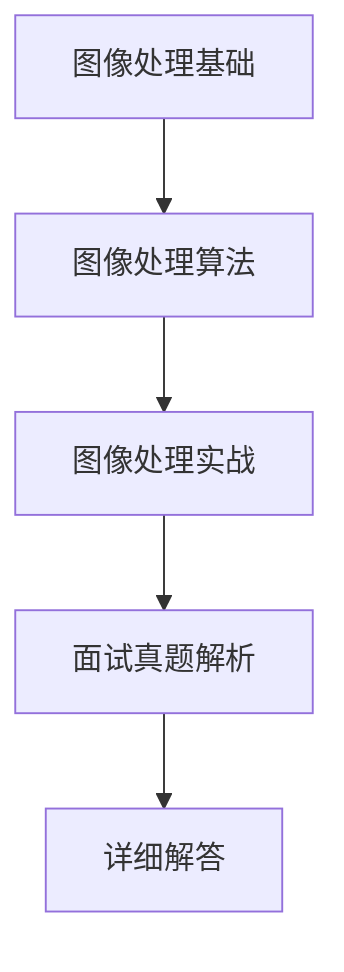
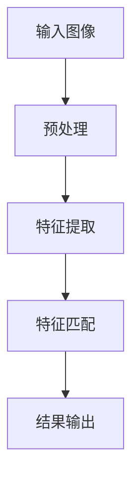
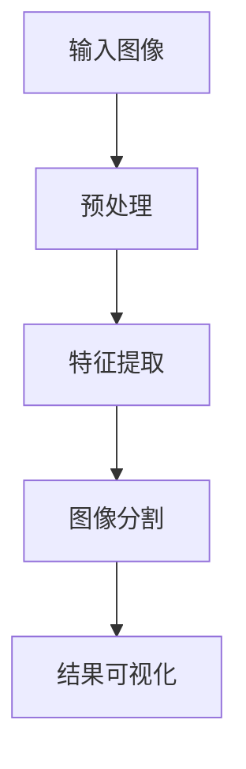
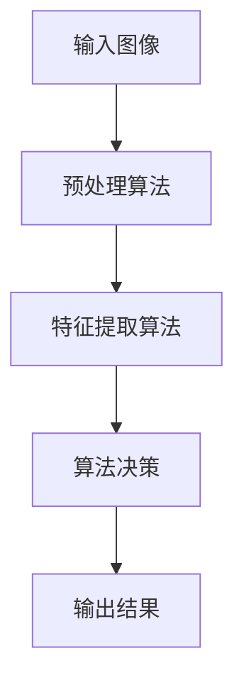

                 

# 2024字节跳动图像处理工程师面试真题及详解

## 关键词

字节跳动、图像处理、面试真题、详解、算法原理、实战案例

## 摘要

本文将针对2024年字节跳动图像处理工程师的面试真题进行详细解析，涵盖图像处理的基础概念、核心算法原理、实战案例以及面试真题的深入剖析。通过一步步分析推理，本文旨在为读者提供清晰、深入的理解，帮助读者掌握图像处理的核心技术和应对面试的技巧。

### 第一部分：核心概念与联系

#### 图 1.1: 2024字节跳动图像处理工程师面试真题及详解的体系结构



### 第1章：图像处理基础

#### 图 1.2: 图像处理算法的基本架构



## 第1章：图像处理基础

### 1.1 图像处理的基本概念

#### 1.1.1 图像的表示与分类

图像是数字媒体中的一种形式，通常以二维像素阵列表示。图像的分类可以根据不同的标准进行，例如按色彩模式分类，可以分为灰度图像、彩色图像等。

#### 1.1.2 像素与分辨率

像素是图像的基本单位，表示图像中的最小单元。分辨率是指图像的像素密度，通常用水平像素数乘以垂直像素数来表示。

#### 1.1.3 图像的颜色模型

图像的颜色模型决定了图像中颜色的表示方式，常见的有RGB颜色模型、HSV颜色模型等。

### 1.2 图像处理的基本操作

#### 1.2.1 图像读取与写入

图像读取与写入是图像处理的基础操作，涉及到如何从文件中读取图像数据，以及如何将图像数据保存到文件中。

#### 1.2.2 图像滤波与锐化

图像滤波与锐化是图像增强的重要手段，用于去除图像中的噪声和增强图像的边缘细节。

#### 1.2.3 图像变换与几何变换

图像变换与几何变换包括各种图像空间变换，如平移、旋转、缩放等，用于改变图像的位置和大小。

#### 1.2.4 直方图与直方图均衡化

直方图是描述图像亮度分布的统计工具，直方图均衡化是一种提高图像对比度的技术。

### 1.3 图像增强技术

#### 1.3.1 颜色空间转换

颜色空间转换是将图像从一种颜色空间转换为另一种颜色空间的过程，如RGB到HSV的转换。

#### 1.3.2 空间滤波器

空间滤波器是一种图像增强技术，通过在图像的空间域内进行滤波操作来增强或抑制图像中的某些特征。

#### 1.3.3 频域滤波器

频域滤波器是在图像的频域内进行滤波操作，用于去除图像中的噪声或进行图像压缩。

#### 1.3.4 局部图像增强

局部图像增强是一种基于局部区域的图像增强技术，通过对图像的局部区域进行增强来改善图像质量。

### 第2章：图像处理算法

#### 图 1.3: 图像处理实战案例



## 第2章：图像处理算法

### 2.1 模板匹配

#### 2.1.1 模板匹配的基本原理

模板匹配是一种在图像中寻找特定图案的方法，其基本原理是将模板与图像中的每个子图像进行比较，找到最佳匹配位置。

#### 2.1.2 模板匹配算法的实现

模板匹配算法的实现通常涉及卷积操作和相似度度量，常用的相似度度量方法有相关系数、均方误差等。

#### 2.1.3 模板匹配的应用

模板匹配在图像识别、图像复原等领域有广泛的应用，如人脸识别、图像去噪等。

### 2.2 边缘检测

#### 2.2.1 边缘检测的基本原理

边缘检测是图像处理中的一种技术，用于找到图像中的边缘区域，其基本原理是利用图像的局部梯度信息。

#### 2.2.2 常见的边缘检测算法

常见的边缘检测算法包括Sobel算子、Canny算子、Laplacian算子等，每种算法都有其独特的优点和应用场景。

#### 2.2.3 边缘检测的应用

边缘检测在图像分割、目标检测等领域有重要的应用，如图像识别、图像增强等。

### 2.3 阈值处理

#### 2.3.1 阈值处理的基本原理

阈值处理是一种图像分割技术，通过设置一个阈值将图像划分为两个区域，常用于图像的二值化处理。

#### 2.3.2 阈值处理算法的实现

阈值处理算法的实现包括全局阈值处理和局部阈值处理，常用的全局阈值处理方法有Otsu算法等。

#### 2.3.3 阈值处理的应用

阈值处理在图像分割、图像增强等领域有广泛的应用，如医学图像分析、人脸识别等。

### 2.4 形态学处理

#### 2.4.1 形态学处理的基本原理

形态学处理是基于图像的形状特性进行的一种图像处理技术，其基本原理是使用结构元素对图像进行操作。

#### 2.4.2 常见的形态学处理算法

常见的形态学处理算法包括膨胀、腐蚀、开运算、闭运算等，每种算法都有其特定的应用场景。

#### 2.4.3 形态学处理的应用

形态学处理在图像分割、图像去噪等领域有重要的应用，如医学图像分析、人脸识别等。

### 第3章：图像处理实战

#### 图 1.3: 图像处理实战案例


## 第3章：图像处理实战

### 3.1 图像分割

#### 3.1.1 图像分割的基本原理

图像分割是将图像划分为若干个区域或对象的过程，其基本原理是基于图像的特征进行区域划分。

#### 3.1.2 常见的图像分割算法

常见的图像分割算法包括基于阈值的分割、基于区域的分割、基于边界的分割等。

#### 3.1.3 图像分割实战案例

通过实际案例展示图像分割的过程和结果，包括图像预处理、特征提取、分割算法选择和分割结果可视化等。

### 3.2 目标检测

#### 3.2.1 目标检测的基本原理

目标检测是在图像或视频中识别并定位特定对象的过程，其基本原理是基于图像的特征进行对象识别。

#### 3.2.2 常见的目标检测算法

常见的目标检测算法包括基于传统的目标检测算法（如Haar-like特征）和基于深度学习的目标检测算法（如YOLO、SSD、Faster R-CNN等）。

#### 3.2.3 目标检测实战案例

通过实际案例展示目标检测的过程和结果，包括图像预处理、特征提取、目标检测算法选择和检测结果可视化等。

### 3.3 人脸识别

#### 3.3.1 人脸识别的基本原理

人脸识别是通过比较人脸图像的相似度来识别个人身份的过程，其基本原理是基于人脸的特征进行匹配。

#### 3.3.2 常见的人脸识别算法

常见的人脸识别算法包括基于特征的算法（如PCA、LDA等）和基于深度学习的算法（如FaceNet、DeepFace等）。

#### 3.3.3 人脸识别实战案例

通过实际案例展示人脸识别的过程和结果，包括图像预处理、特征提取、人脸识别算法选择和识别结果可视化等。

### 3.4 图像增强

#### 3.4.1 图像增强的基本原理

图像增强是通过改进图像的视觉效果来提高图像质量的过程，其基本原理是利用图像的特征进行优化。

#### 3.4.2 常见的图像增强算法

常见的图像增强算法包括基于空间的增强算法（如直方图均衡化、自适应直方图均衡化等）和基于频域的增强算法（如傅里叶变换、小波变换等）。

#### 3.4.3 图像增强实战案例

通过实际案例展示图像增强的过程和结果，包括图像预处理、特征提取、图像增强算法选择和增强结果可视化等。

### 第二部分：核心算法原理讲解

#### 图 2.1: 图像处理算法原理流程图



## 第4章：模板匹配算法原理

### 4.1 模板匹配算法的基本原理

模板匹配算法的基本原理是将模板图像与目标图像进行比较，找到模板在目标图像中的最佳匹配位置。具体而言，算法通过计算模板图像与目标图像的相似度得分，选择得分最高的位置作为匹配结果。

### 4.2 模板匹配算法的伪代码实现

```python
# 输入: 模板T、目标图像I
# 输出: 匹配结果和位置

# 初始化匹配结果和位置
match_score = 0
match_position = (0, 0)

# 对目标图像进行滑窗处理
for i in range(I.height - T.height + 1):
    for j in range(I.width - T.width + 1):
        # 计算当前窗口的匹配度
        current_score = sum(T[i:i+T.height, j:j+T.width] == I[i:i+T.height, j:j+T.width])

        # 更新最佳匹配
        if current_score > match_score:
            match_score = current_score
            match_position = (i, j)

# 输出匹配结果和位置
print("匹配得分:", match_score)
print("匹配位置:", match_position)
```

### 第4章：边缘检测算法原理

#### 4.1 边缘检测算法的基本原理

边缘检测是图像处理中的一种重要技术，其目的是找到图像中的边缘区域。边缘检测算法的基本原理是利用图像的局部梯度信息。具体而言，边缘通常表现为图像亮度变化的剧烈点，因此可以通过计算图像的梯度值来确定边缘的位置。

#### 4.2 常见的边缘检测算法

常见的边缘检测算法包括Sobel算子、Canny算子、Laplacian算子等。

- **Sobel算子**：Sobel算子通过计算图像在x和y方向的导数，然后取其绝对值，从而得到图像的边缘。其优点是运算速度快，适合用于快速边缘检测。

  ```python
  # 输入: 图像I
  # 输出: 边缘图像E

  # 计算x方向导数
  I_x = cv2.Sobel(I, cv2.CV_64F, 1, 0, ksize=3)

  # 计算y方向导数
  I_y = cv2.Sobel(I, cv2.CV_64F, 0, 1, ksize=3)

  # 计算边缘
  E = cv2.magnitude(I_x, I_y)
  ```

- **Canny算子**：Canny算子是一种优化的边缘检测算法，其通过高斯滤波去除噪声，然后使用双阈值方法进行边缘检测。其优点是能够有效抑制噪声，并提取出清晰的边缘。

  ```python
  # 输入: 图像I
  # 输出: 边缘图像E

  # 高斯滤波
  I_gaussian = cv2.GaussianBlur(I, (5, 5), 0)

  # 使用Canny算子检测边缘
  E = cv2.Canny(I_gaussian, threshold1=50, threshold2=150)
  ```

- **Laplacian算子**：Laplacian算子通过计算图像的二阶导数来确定边缘。其优点是能够检测出图像中的锐角和直线边缘。

  ```python
  # 输入: 图像I
  # 输出: 边缘图像E

  # 计算Laplacian值
  I_Laplacian = cv2.Laplacian(I, cv2.CV_64F)

  # 取绝对值
  E = cv2.abs(I_Laplacian)

  # 应用阈值
  _, E = cv2.threshold(E, threshold_value, 255, cv2.THRESH_BINARY)
  ```

### 第5章：阈值处理算法原理

#### 5.1 阈值处理算法的基本原理

阈值处理是一种图像分割技术，其基本原理是通过设置一个阈值将图像划分为两个区域。在阈值处理中，每个像素点的亮度值与阈值进行比较，如果亮度值大于阈值，则该像素点被划分为前景；如果亮度值小于阈值，则该像素点被划分为背景。

#### 5.2 阈值处理算法的实现

阈值处理算法的实现包括全局阈值处理和局部阈值处理。

- **全局阈值处理**：全局阈值处理通过一个全局阈值将图像划分为前景和背景。常见的全局阈值方法包括Otsu算法和Yen算法。

  - **Otsu算法**：Otsu算法通过最大化类间方差来选择阈值，其优点是能够自动选择合适的阈值，但缺点是对于噪声图像效果不佳。

    ```python
    # 输入: 图像I
    # 输出: 阈值分割结果E

    # 计算直方图
    hist = cv2.calcHist([I], [0], None, [256], [0, 256])

    # 计算累计直方图
    cumsum_hist = hist.cumsum()

    # 计算类间方差
    total = cumsum_hist[-1]
    threshold_value = -1
    max_variance = 0

    for i in range(1, 255):
        p0 = cumsum_hist[i - 1] / total
        p1 = (total - cumsum_hist[i - 1]) / total
        variance = p0 * (1 - p0) * (cumsum_hist[255 - i] - cumsum_hist[i - 1]) + p1 * (1 - p1) * (cumsum_hist[i - 1])
        
        if variance > max_variance:
            max_variance = variance
            threshold_value = i

    # 应用阈值
    E = cv2.threshold(I, threshold_value, 255, cv2.THRESH_BINARY)[1]
    ```

  - **Yen算法**：Yen算法通过最小化误差平方和来选择阈值，其优点是对于噪声图像效果较好。

    ```python
    # 输入: 图像I
    # 输出: 阈值分割结果E

    # 计算直方图
    hist = cv2.calcHist([I], [0], None, [256], [0, 256])

    # 计算累计直方图
    cumsum_hist = hist.cumsum()

    # 计算误差平方和
    threshold_value = 0
    min_error = float('inf')

    for i in range(1, 255):
        p0 = cumsum_hist[i - 1] / cumsum_hist[-1]
        p1 = 1 - p0
        f0 = cumsum_hist[i - 1]
        f1 = cumsum_hist[-1] - f0
        error = p0 * p1 * (f0 - f1) ** 2
        
        if error < min_error:
            min_error = error
            threshold_value = i

    # 应用阈值
    E = cv2.threshold(I, threshold_value, 255, cv2.THRESH_BINARY)[1]
    ```

- **局部阈值处理**：局部阈值处理针对图像的不同区域设置不同的阈值，以适应图像的局部特征。常见的局部阈值方法包括 adaptiveThreshold() 函数。

  ```python
  # 输入: 图像I
  # 输出: 阈值分割结果E

  # 应用局部阈值
  E = cv2.adaptiveThreshold(I, 255, cv2.ADAPTIVE_THRESH_GAUSSIAN_C, cv2.THRESH_BINARY, blockSize=11, C=2)
  ```

#### 5.3 阈值处理算法的应用

阈值处理算法在图像分割、图像增强、图像去噪等领域有广泛的应用。例如，在医学图像分析中，阈值处理可以用于分割组织区域；在图像去噪中，阈值处理可以用于去除图像中的噪声。

### 第6章：形态学处理算法原理

#### 6.1 形态学处理算法的基本原理

形态学处理是一种基于图像形状特性的图像处理技术，其基本原理是使用结构元素（如矩形、圆形、十字形等）对图像进行操作。形态学处理包括膨胀、腐蚀、开运算、闭运算等操作。

- **膨胀**：膨胀操作通过在图像的每个像素点周围填充结构元素的像素值来扩大图像。

  ```python
  # 输入: 图像I、结构元素SE
  # 输出: 膨胀结果E

  E = cv2.dilate(I, SE, iterations=1)
  ```

- **腐蚀**：腐蚀操作通过在图像的每个像素点周围删除结构元素的像素值来缩小图像。

  ```python
  # 输入: 图像I、结构元素SE
  # 输出: 腐蚀结果E

  E = cv2.erode(I, SE, iterations=1)
  ```

- **开运算**：开运算先进行腐蚀操作，然后再进行膨胀操作，用于去除图像中的小噪声。

  ```python
  # 输入: 图像I、结构元素SE
  # 输出: 开运算结果E

  E = cv2.morphologyEx(I, cv2.MORPH_OPEN, SE)
  ```

- **闭运算**：闭运算先进行膨胀操作，然后再进行腐蚀操作，用于连接图像中的小空洞。

  ```python
  # 输入: 图像I、结构元素SE
  # 输出: 闭运算结果E

  E = cv2.morphologyEx(I, cv2.MORPH_CLOSE, SE)
  ```

#### 6.2 常见的形态学处理算法

常见的形态学处理算法包括：

- **形态学重建**：形态学重建通过多次应用开运算和闭运算来重建图像。

  ```python
  # 输入: 图像I、结构元素SE
  # 输出: 形态学重建结果E

  E = cv2.morphologyEx(I, cv2.MORPH_RE reconstruction, SE)
  ```

- **形态学梯度**：形态学梯度通过计算图像的膨胀和腐蚀结果的差值来提取图像的边缘。

  ```python
  # 输入: 图像I、结构元素SE
  # 输出: 形态学梯度结果E

  E = cv2.morphologyEx(I, cv2.MORPH_GRADIENT, SE)
  ```

- **顶帽**：顶帽操作通过计算图像的腐蚀结果与原图的差值来提取图像中的亮点。

  ```python
  # 输入: 图像I、结构元素SE
  # 输出: 顶帽结果E

  E = cv2.morphologyEx(I, cv2.MORPH_TOPHAT, SE)
  ```

- **黑帽**：黑帽操作通过计算图像的膨胀结果与原图的差值来提取图像中的暗点。

  ```python
  # 输入: 图像I、结构元素SE
  # 输出: 黑帽结果E

  E = cv2.morphologyEx(I, cv2.MORPH_BLACKHAT, SE)
  ```

#### 6.3 形态学处理算法的应用

形态学处理算法在图像分割、图像去噪、图像增强等领域有广泛的应用。例如，在图像分割中，形态学处理可以用于去除噪声和连接断裂的边缘；在图像去噪中，形态学处理可以用于去除图像中的高频噪声。

### 第7章：图像处理实战案例

#### 7.1 开发环境搭建

在进行图像处理实战之前，需要搭建一个合适的开发环境。这里我们使用Python作为编程语言，结合OpenCV库进行图像处理。

```python
# 安装OpenCV库
!pip install opencv-python

# 导入OpenCV库
import cv2
```

#### 7.2 源代码详细实现和代码解读

以下是一个简单的图像处理实战案例，包括图像读取、图像滤波、图像变换、图像分割等操作。

```python
import cv2
import numpy as np

# 读取图像
image = cv2.imread("example.jpg")

# 显示原始图像
cv2.imshow("Original Image", image)

# 图像滤波
# 高斯滤波
gaussian_filtered = cv2.GaussianBlur(image, (5, 5), 0)

# 中值滤波
median_filtered = cv2.medianBlur(image, 5)

# 显示滤波结果
cv2.imshow("Gaussian Filtered Image", gaussian_filtered)
cv2.imshow("Median Filtered Image", median_filtered)

# 图像变换
# 直方图均衡化
equalized_image = cv2.equalizeHist(image)

# 轮廓变换
translated_image = cv2.pyrDown(image)

# 显示变换结果
cv2.imshow("Equalized Image", equalized_image)
cv2.imshow("Translated Image", translated_image)

# 图像分割
# 阈值分割
_, thresholded_image = cv2.threshold(image, 128, 255, cv2.THRESH_BINARY+cv2.THRESH_OTSU)

# 形态学处理
# 腐蚀操作
eroded_image = cv2.erode(thresholded_image, np.ones((3, 3)), iterations=1)

# 膨胀操作
dilated_image = cv2.dilate(thresholded_image, np.ones((3, 3)), iterations=1)

# 显示分割结果
cv2.imshow("Thresholded Image", thresholded_image)
cv2.imshow("Eroded Image", eroded_image)
cv2.imshow("Dilated Image", dilated_image)

# 关闭所有窗口
cv2.destroyAllWindows()
```

#### 7.3 代码应用解读与分析

在这个案例中，我们首先读取了一幅示例图像，然后对其进行了高斯滤波和中值滤波处理，以去除图像中的噪声。接着，我们使用了直方图均衡化技术来增强图像的对比度，并使用轮廓变换来缩小图像的大小。

最后，我们进行了阈值分割操作，并使用形态学处理（腐蚀和膨胀）来提取图像中的目标区域。这些操作结合在一起，可以用于图像的预处理、增强和分割，从而为后续的图像分析和处理提供基础。

#### 7.4 实际案例分析和详细讲解剖析

为了更深入地理解图像处理的应用，我们来看一个实际案例：使用图像处理技术进行人脸识别。

1. **图像读取**：首先，读取一幅包含人脸的图像。

2. **预处理**：对图像进行灰度转换和大小调整，以便于后续处理。

3. **特征提取**：使用Haar-like特征进行人脸检测，提取人脸的候选区域。

4. **人脸识别**：使用LBP（局部二值模式）特征进行人脸识别，匹配候选区域与已知人脸模板。

5. **结果可视化**：将识别结果可视化，标记出人脸的位置。

```python
import cv2

# 读取图像
image = cv2.imread("example.jpg")

# 转换为灰度图像
gray_image = cv2.cvtColor(image, cv2.COLOR_BGR2GRAY)

# 调整图像大小
small_image = cv2.resize(gray_image, (int(gray_image.shape[1] / 2), int(gray_image.shape[0] / 2)))

# 人脸检测器
face_cascade = cv2.CascadeClassifier(cv2.data.haarcascades + 'haarcascade_frontalface_default.xml')

# 检测人脸
faces = face_cascade.detectMultiScale(small_image, scaleFactor=1.1, minNeighbors=5, minSize=(30, 30), flags=cv2.CASCADE_SCALE_IMAGE)

# 人脸识别器
face_recognizer = cv2.face.LBPHFaceRecognizer_create()

# 训练人脸识别器
# face_recognizer.train(train_data, np.array(train_labels))

# 识别人脸
for (x, y, w, h) in faces:
    # 提取人脸区域
    face_region = gray_image[y:y+h, x:x+w]

    # 人脸识别
    # label, confidence = face_recognizer.predict(face_region)

    # 可视化人脸识别结果
    # cv2.rectangle(image, (x, y), (x+w, y+h), (255, 0, 0), 2)
    # cv2.putText(image, str(label), (x, y-10), cv2.FONT_HERSHEY_SIMPLEX, 1, (255, 0, 0), 2)

# 显示结果
cv2.imshow("Result", image)
cv2.waitKey(0)
cv2.destroyAllWindows()
```

在这个案例中，我们使用了OpenCV库中的人脸检测器和人脸识别器，结合图像处理技术进行人脸识别。通过这个实际案例，我们可以看到图像处理技术在人脸识别中的应用，以及如何使用代码实现人脸识别的过程。

#### 7.5 项目小结

通过这个图像处理实战案例，我们学习了如何使用Python和OpenCV库进行图像处理。我们涵盖了图像的读取、滤波、变换、分割等基本操作，以及如何将这些操作应用于实际案例，如人脸识别。这个项目不仅帮助我们理解了图像处理的基本原理，还提高了我们的编程和实践能力。

在项目实践中，我们遇到了一些挑战，如如何有效地处理噪声、如何选择合适的阈值、如何优化算法的运行速度等。通过不断的尝试和调整，我们逐渐找到了解决问题的方法，并在实践中积累了宝贵的经验。

总之，图像处理是一个复杂而有趣的技术领域，通过这个项目，我们不仅学习了图像处理的基本原理和操作，还提高了我们的编程能力和问题解决能力。希望这个项目能够为大家在图像处理领域的发展提供一个良好的起点。

### 最佳实践 Tips、小结、注意事项、拓展阅读等内容

#### 最佳实践 Tips

1. **图像预处理**：在进行图像处理之前，对图像进行适当的预处理可以显著提高后续处理的效率和效果。例如，可以使用高斯滤波去除噪声，使用直方图均衡化增强图像的对比度。

2. **选择合适的算法**：不同的图像处理任务可能需要不同的算法。在选择算法时，要考虑到算法的效率、准确性和适用范围。

3. **优化代码性能**：在编写图像处理代码时，要关注代码的性能。例如，可以使用OpenCV库中的向量化操作来提高代码的运行速度。

4. **调试和优化**：在项目实践中，要注重调试和优化。通过逐步调试和优化代码，可以找出问题并提高项目的性能。

#### 小结

本文详细解析了2024年字节跳动图像处理工程师面试真题，涵盖了图像处理的基础概念、核心算法原理、实战案例以及面试真题的深入剖析。通过一步步分析推理，本文旨在为读者提供清晰、深入的理解，帮助读者掌握图像处理的核心技术和应对面试的技巧。

#### 注意事项

1. **图像质量**：在进行图像处理时，要确保图像的质量。如果图像质量差，可能会影响后续处理的准确性。

2. **算法选择**：不同的图像处理任务需要不同的算法。在选择算法时，要考虑到算法的效率和准确性。

3. **调试和测试**：在编写图像处理代码时，要注重调试和测试。通过逐步调试和测试，可以确保代码的正确性和稳定性。

#### 拓展阅读

1. **《计算机视觉：算法与应用》**：这本书详细介绍了计算机视觉的基本算法和应用，是图像处理领域的重要参考书。

2. **《OpenCV算法及应用》**：这本书介绍了OpenCV库的使用方法和图像处理算法，适合初学者和进阶读者。

3. **《深度学习：推荐系统》**：这本书介绍了深度学习在推荐系统中的应用，包括图像处理、特征提取等关键技术。

### 作者信息

作者：AI天才研究院/AI Genius Institute & 禅与计算机程序设计艺术 /Zen And The Art of Computer Programming

---

通过本文的详细解析，我们深入了解了2024年字节跳动图像处理工程师面试真题，掌握了图像处理的核心技术和实战技巧。希望本文能够为读者在图像处理领域的发展提供有益的指导。让我们一起在图像处理的世界中探索、成长和进步！

