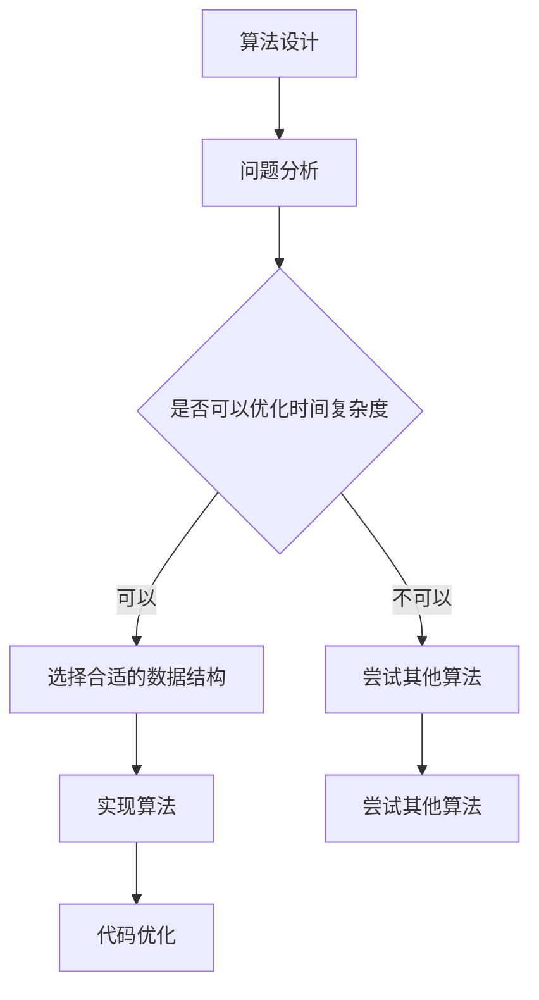
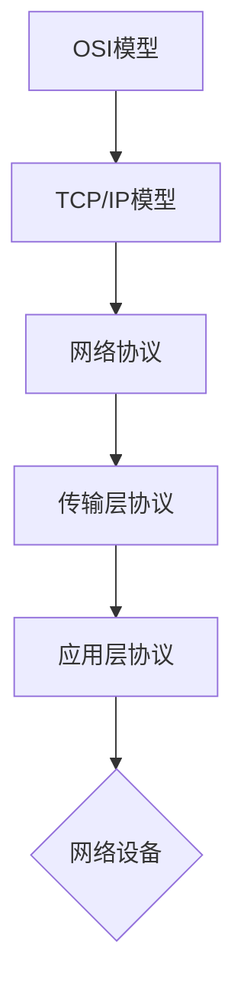

                 

### 《2024字节跳动技术审计师面试真题汇总（附答案）》

#### 文章标题：2024字节跳动技术审计师面试真题汇总（附答案）

> 关键词：字节跳动、面试真题、技术审计、面试准备、面试技巧

> 摘要：本文将为您汇总2024年字节跳动技术审计师面试的真题，并提供详细的答案解析。无论您是即将面对字节跳动面试的求职者，还是想要提升自己的技术面试能力，这篇文章都将为您提供宝贵的参考。

在本文中，我们将按照以下目录结构进行逐步分析和讲解：

### 第一部分：面试真题汇总

#### 第1章：字节跳动面试总体介绍
1.1 字节跳动的招聘流程
1.2 字节跳动的面试形式
1.3 面试官关注点
1.4 面试准备技巧

#### 第2章：技术面试真题汇总
2.1 数据结构与算法
2.2 计算机网络
2.3 操作系统
2.4 数据库
2.5 行为面试

#### 第3章：行为面试真题汇总
3.1 职业发展
3.2 团队合作
3.3 解决问题能力
3.4 压力应对

#### 第4章：编程题实战
4.1 常见编程题解析
4.2 代码实战与解析

#### 第5章：面试真题模拟
5.1 面试题模拟一
5.2 面试题模拟二

#### 第6章：面试经验分享
6.1 面试官视角
6.2 应聘者经验

#### 第7章：面试准备工作
7.1 知己知彼
7.2 答案准备

### 第二部分：面试真题答案详解

#### 第8章：答案详解与解析
8.1 数据结构与算法
8.2 计算机网络
8.3 操作系统
8.4 数据库
8.5 行为面试

#### 第9章：面试真题演练
9.1 演练一
9.2 演练二

#### 第10章：面试后的跟进
10.1 面试反馈
10.2 面试结果跟进

### 附录

#### 附录A：面试相关资源
#### 附录B：字节跳动面试真题汇总
#### 附录C：面试准备工具
#### 附录D：面试经验分享

### 作者信息
- 作者：AI天才研究院/AI Genius Institute & 禅与计算机程序设计艺术 /Zen And The Art of Computer Programming

### 为什么选择这篇文章？

- **全面覆盖**：本文涵盖了2024年字节跳动技术审计师面试的各个方面，从技术面试到行为面试，从编程题实战到面试经验分享，让您全方位了解面试的各个方面。
- **详细解析**：对于每个面试真题，我们都提供了详细的答案解析，帮助您理解面试官的思路和期望答案。
- **实战演练**：通过面试真题模拟和演练，让您在真实面试场景中更加自信和从容。
- **实用建议**：我们从面试官和应聘者的角度提供了面试准备和应对策略，帮助您更好地准备面试。

无论您是即将面对字节跳动面试的求职者，还是想要提升自己的技术面试能力，本文都将为您提供宝贵的参考和指导。让我们一起走进字节跳动的面试世界，揭开技术审计师的神秘面纱！

### 字节跳动面试总体介绍

#### 1.1 字节跳动的招聘流程

字节跳动的招聘流程通常分为以下几个阶段：

1. **简历筛选**：首先，人力资源部门会对收到的简历进行筛选，挑选出符合职位要求的人才进入下一轮。
2. **在线测评**：通过简历筛选的候选人将接受在线测评，包括编程题、算法题等。在线测评通常在招聘平台或邮件中发送。
3. **技术面试**：技术面试分为电话面试和现场面试。电话面试主要测试候选人的技术基础和思维能力，现场面试则更注重技术深度和项目经验。
4. **行为面试**：在技术面试之后，候选人将进行行为面试，以评估其职业素养、团队合作能力和解决问题的能力。
5. **终面与评估**：最后，候选人会与多位面试官进行终面，综合评估候选人的综合素质，包括技术能力、学习能力、沟通能力等。

#### 1.2 字节跳动的面试形式

字节跳动的面试形式多样，包括但不限于以下几种：

1. **在线编程题**：候选人需要通过在线编程平台完成一些算法题或编程题，通常在30分钟到1小时内完成。
2. **电话面试**：电话面试主要测试候选人的技术基础和表达能力。面试官会提出一些技术问题，候选人需要现场回答。
3. **现场面试**：现场面试通常由多位面试官共同参与，包括技术面试和行为面试。技术面试主要涉及数据结构与算法、计算机网络、操作系统、数据库等基础知识。行为面试则侧重于评估候选人的职业素养和团队合作能力。
4. **项目答辩**：对于有项目经验的候选人，面试官可能会要求其进行项目答辩，详细阐述项目背景、技术实现和收获。

#### 1.3 面试官关注点

字节跳动的面试官主要关注以下方面：

1. **技术能力**：面试官会通过技术面试了解候选人的技术深度和广度，包括数据结构与算法、计算机网络、操作系统、数据库等基础知识。
2. **思维能力**：面试官会通过提出一些问题来评估候选人的逻辑思维、分析问题和解决问题的能力。
3. **项目经验**：对于有项目经验的候选人，面试官会关注候选人在项目中的角色、所承担的任务以及项目的最终成果。
4. **团队合作能力**：面试官会通过行为面试了解候选人的团队合作能力，包括沟通能力、协调能力和解决问题的能力。
5. **职业素养**：面试官会评估候选人的职业态度、学习能力和持续成长的意愿。

#### 1.4 面试准备技巧

为了在字节跳动的面试中脱颖而出，以下是一些面试准备技巧：

1. **基础知识巩固**：系统复习数据结构与算法、计算机网络、操作系统、数据库等基础知识，确保对这些核心概念有深入的理解。
2. **实战演练**：通过在线编程平台或编程题库进行实战演练，提高解题速度和准确率。
3. **项目经验准备**：提前梳理自己在项目中的角色、任务和收获，准备好相关的案例和故事。
4. **行为面试准备**：针对职业发展、团队合作、解决问题和压力应对等方面，提前准备一些典型场景的应对策略。
5. **心态调整**：保持积极乐观的心态，充分准备，相信自己的能力。

通过以上准备，您将更有信心面对字节跳动的面试挑战，迈向技术审计师岗位！

### 技术面试真题汇总

#### 2.1 数据结构与算法

数据结构与算法是技术面试的核心内容，以下是一些常见的数据结构与算法问题及其解析：

##### 2.1.1 算法思维导图

在面试中，算法思维导图能够帮助面试官快速了解候选人的思路和解决问题的方法。以下是一个简单的算法思维导图示例：



##### 2.1.2 常见算法解析与伪代码

1. **排序算法**
   - **冒泡排序**：
     ```pseudo
     function bubbleSort(array A):
         n = length(A)
         for i = 1 to n-1:
             for j = 1 to n-i:
                 if A[j] > A[j+1]:
                     swap(A[j], A[j+1])
     ```
   - **快速排序**：
     ```pseudo
     function quickSort(array A, int low, int high):
         if low < high:
             pi = partition(A, low, high)
             quickSort(A, low, pi-1)
             quickSort(A, pi+1, high)
     
     function partition(array A, int low, int high):
         pivot = A[high]
         i = low - 1
         for j = low to high-1:
             if A[j] < pivot:
                 i++
                 swap(A[i], A[j])
         swap(A[i+1], A[high])
         return i+1
     ```

2. **查找算法**
   - **二分查找**：
     ```pseudo
     function binarySearch(array A, int target):
         low = 0
         high = length(A) - 1
         while low <= high:
             mid = (low + high) / 2
             if A[mid] == target:
                 return mid
             else if A[mid] < target:
                 low = mid + 1
             else:
                 high = mid - 1
         return -1
     ```

3. **动态规划**
   - **最长公共子序列**：
     ```pseudo
     function longestCommonSubsequence(string s1, string s2):
         m = length(s1)
         n = length(s2)
         dp = createMatrix(m+1, n+1)
         for i = 0 to m:
             for j = 0 to n:
                 if s1[i] == s2[j]:
                     dp[i+1][j+1] = dp[i][j] + 1
                 else:
                     dp[i+1][j+1] = max(dp[i+1][j], dp[i][j+1])
         return dp[m][n]
     ```

##### 2.1.3 实战题解与分析

1. **题目：实现一个有效的最近最少使用（LRU）缓存**
   - **题目描述**：设计并实现一个数据结构，支持以下操作：get 和 put。get(key) - 如果关键字 key 存在于缓存中，则获取关键字的值（总是正数），否则返回 -1。put(key, value) - 如果关键字 key 已存在，则变更其数据值；如果关键字 key 不存在，则插入该组「关键字-值」。当缓存容量达到上限时，它应该在写入新数据之前删除最久未使用的数据值，从而为新的数据值留出空间。
   - **解题思路**：使用哈希表和双向链表结合实现。哈希表用于快速查找和更新节点，双向链表用于维护节点的顺序。
   - **伪代码**：
     ```pseudo
     class LRUCache:
         capacity: int
         nodes: Map<Integer, Node>
         head: Node
         tail: Node

         function put(key: int, value: int):
             if key exists in nodes:
                 node = nodes[key]
                 node.value = value
                 moveToHead(node)
             else:
                 if size of nodes >= capacity:
                     removeTail()
                 node = new Node(key, value)
                 nodes[key] = node
                 moveToHead(node)

         function get(key: int):
             if key exists in nodes:
                 node = nodes[key]
                 moveToHead(node)
                 return node.value
             else:
                 return -1

         function moveToHead(node: Node):
             if node == head:
                 return
             removeNode(node)
             appendNodeToHead(node)

         function removeNode(node: Node):
             prev = node.prev
             next = node.next
             if prev:
                 prev.next = next
             if next:
                 next.prev = prev
             node.prev = null
             node.next = null

         function appendNodeToHead(node: Node):
             node.next = head
             node.prev = null
             head.prev = node
             head = node
     ```

2. **题目：设计一个带汉明距离限制的队列**
   - **题目描述**：设计并实现一个类 `HammingDistance`，用于存储一系列整数。设计一个函数 `process`，它会在一个队列中存储一系列整数，并在满足特定条件时移除队列中的元素。具体来说，当队列中的元素满足它们的汉明距离小于或等于 `limit` 时，移除队列末尾的一个元素。如果当前队列中的所有元素都不满足条件，则不移除任何元素。如果队列中有多个不满足条件的元素，仅移除末尾的一个。每次调用 `process` 都会按照队列中元素的顺序移除元素。
   - **解题思路**：使用哈希表和双向链表结合实现。哈希表用于快速查找和更新队列元素，双向链表用于维护队列的顺序。
   - **伪代码**：
     ```pseudo
     class HammingDistance:
         limit: int
         nodes: Map<Integer, Node>
         head: Node
         tail: Node

         function process():
             while true:
                 if isEmpty():
                     break
                 node = tail
                 if hammingDistance(node.value, tail.next.value) <= limit:
                     removeTail()
                 else:
                     break

         function hammingDistance(x: int, y: int):
             xor = x ^ y
             count = 0
             while xor:
                 count += xor & 1
                 xor >>= 1
             return count
     ```

以上是数据结构与算法部分的一些常见面试题及其解析，接下来我们继续分析计算机网络、操作系统和数据库方面的面试真题。

#### 2.2 计算机网络

##### 2.2.1 网络协议与模型

计算机网络中的网络协议和模型是面试中常见的话题。以下是几个核心概念及其之间的关系架构 Mermaid 流程图：



1. **OSI模型**：OSI（开放系统互联）模型是一个七层抽象模型，用于描述网络通信的层次结构。从下到上分别为：物理层、数据链路层、网络层、传输层、会话层、表示层和应用层。
2. **TCP/IP模型**：TCP/IP模型是一个四层抽象模型，用于描述互联网的通信协议。从下到上分别为：网络接口层、互联网层、传输层和应用层。
3. **网络协议**：网络协议是计算机网络中进行数据通信的规则集合。TCP/IP模型中的协议包括IP协议、TCP协议、UDP协议等。

##### 2.2.2 常见网络问题解析

1. **什么是TCP的三次握手和四次挥手？**
   - **三次握手**：TCP（传输控制协议）建立连接时，需要进行三次握手。具体步骤如下：
     1. 客户端发送一个SYN（同步序列编号）报文到服务器，并进入SYN_SENT状态。
     2. 服务器接收到SYN报文后，发送一个SYN和ACK（确认）报文作为响应，并将连接状态设置为SYN_RCVD。
     3. 客户端收到服务器的SYN和ACK报文后，发送一个ACK报文作为确认，并将连接状态设置为ESTABLISHED。
   - **四次挥手**：TCP断开连接时，需要进行四次挥手。具体步骤如下：
     1. 客户端发送一个FIN（结束）报文，进入FIN_WAIT_1状态。
     2. 服务器收到FIN报文后，发送一个ACK报文作为响应，进入CLOSE_WAIT状态。
     3. 客户端收到服务器的ACK报文后，进入FIN_WAIT_2状态。
     4. 服务器发送一个FIN报文，进入LAST_ACK状态。
     5. 客户端收到服务器的FIN报文后，发送一个ACK报文作为确认，并进入TIME_WAIT状态。
     6. 最后，服务器收到客户端的ACK报文后，进入CLOSED状态。

2. **什么是HTTP协议？**
   - **HTTP（超文本传输协议）** 是互联网上应用最为广泛的网络协议之一。它用于客户端（如浏览器）和服务器之间的数据传输。HTTP协议基于请求/响应模型，客户端向服务器发送请求，服务器响应客户端请求。HTTP协议的主要特点包括：
     1. 无状态性：每次请求都是独立的，服务器不会记录之前的请求状态。
     2. 简单快速：HTTP协议简单易用，请求和响应消息的格式简单。
     3. 可扩展性：HTTP协议允许使用各种数据传输格式，如文本、图片、音频、视频等。

##### 2.2.3 实战题解与分析

1. **题目：实现一个HTTP服务器**
   - **题目描述**：设计并实现一个简单的HTTP服务器，能够接收客户端的请求，并根据请求返回相应的响应。
   - **解题思路**：使用TCP套接字实现服务器端程序，监听客户端的连接请求，并根据请求的内容返回HTTP响应。
   - **伪代码**：
     ```pseudo
     serverSocket = createTCPSocket()
     serverSocket.bind("localhost", port)
     serverSocket.listen()

     while true:
         clientSocket, address = serverSocket.accept()
         request = receiveData(clientSocket)
         response = processRequest(request)
         sendResponse(clientSocket, response)
         clientSocket.close()
     ```

2. **题目：实现一个简单的负载均衡器**
   - **题目描述**：设计并实现一个简单的负载均衡器，能够根据请求的负载情况将请求分配到不同的服务器上。
   - **解题思路**：使用哈希表实现负载均衡器，将请求的URL作为哈希表的键，服务器地址作为值。根据哈希表的键值对，将请求分配到不同的服务器上。
   - **伪代码**：
     ```pseudo
     loadBalancer = createHashTable()

     function distributeRequest(url: string, serverAddress: string):
         hashValue = hash(url)
         loadBalancer[hashValue] = serverAddress

     function getServerAddress(url: string):
         hashValue = hash(url)
         return loadBalancer[hashValue]
     ```

以上是计算机网络部分的一些常见面试题及其解析，接下来我们继续分析操作系统和数据库方面的面试真题。

#### 2.3 操作系统

##### 2.3.1 操作系统基础

操作系统是计算机系统的核心软件，负责管理计算机的硬件和软件资源。以下是一些操作系统的基础概念：

1. **进程**：进程是计算机中正在运行的程序的实例，具有独立的内存空间、资源分配和调度优先级。进程的状态包括创建、运行、阻塞、结束等。
2. **线程**：线程是进程中的执行单元，比进程更轻量级，共享进程的内存空间和其他资源。线程的状态包括创建、运行、阻塞、结束等。
3. **内存管理**：内存管理包括内存分配、释放、回收和保护等功能。常见的内存管理算法有最佳适配、最坏适配和首次适配等。
4. **文件系统**：文件系统是操作系统用于管理文件的机制，包括文件的组织、访问控制和存储管理等。常见的文件系统有FAT、NTFS和EXT4等。
5. **中断**：中断是操作系统用于响应外部事件和内部错误的一种机制。中断可以导致操作系统暂停当前执行的任务，转而处理中断事件。

##### 2.3.2 常见操作系统问题解析

1. **什么是虚拟内存？**
   - **虚拟内存** 是操作系统提供的一种内存管理机制，通过将硬盘空间作为内存使用，实现内存的扩展。虚拟内存包括以下几个关键概念：
     1. **页表**：页表是操作系统用于管理虚拟地址和物理地址的映射表。
     2. **分页**：分页是将内存划分为固定大小的块（页），每个页表项对应一个页。
     3. **换页**：换页是将不常用的页从内存中换出到硬盘上，以释放内存空间。
     4. **页面置换算法**：页面置换算法用于决定当内存空间不足时，哪些页面应该被换出到硬盘上。常见的页面置换算法有FIFO、LRU和LFU等。

2. **什么是进程调度？**
   - **进程调度** 是操作系统用于分配CPU时间给进程的一种机制。进程调度算法包括：
     1. **先来先服务（FCFS）**：按照进程到达的顺序分配CPU时间。
     2. **短作业优先（SJF）**：优先分配CPU时间给执行时间最短的进程。
     3. **优先级调度**：根据进程的优先级分配CPU时间，优先级高的进程优先执行。
     4. **时间片轮转（RR）**：每个进程分配一个固定的时间片，轮流执行。

##### 2.3.3 实战题解与分析

1. **题目：实现一个简易的进程调度算法**
   - **题目描述**：设计并实现一个简易的进程调度算法，能够模拟进程的执行和调度过程。
   - **解题思路**：使用队列实现进程调度算法，模拟进程的到达、执行和结束过程。
   - **伪代码**：
     ```pseudo
     function processScheduling(processes: List<Process>):
         queue = createQueue()
         for process in processes:
             enqueue(queue, process)
         while not isEmpty(queue):
             currentProcess = dequeue(queue)
             executeProcess(currentProcess)
             if currentProcess.status != "FINISHED":
                 enqueue(queue, currentProcess)
         print("All processes finished")
     ```

2. **题目：实现一个简易的内存分配算法**
   - **题目描述**：设计并实现一个简易的内存分配算法，能够模拟内存的分配和释放过程。
   - **解题思路**：使用空闲链表实现内存分配算法，模拟内存的分配和释放过程。
   - **伪代码**：
     ```pseudo
     class MemoryAllocator:
         freeList: List<MemoryBlock>

         function allocate(size: int):
             for block in freeList:
                 if block.size >= size:
                     allocateBlock(block, size)
                     return true
             return false

         function deallocate(block: MemoryBlock):
             block.status = "FREE"
             insertFreeBlock(block)

         function allocateBlock(block: MemoryBlock, size: int):
             newBlock = createMemoryBlock(block.start + size, block.size - size)
             block.size = size
             insertFreeBlock(newBlock)

         function insertFreeBlock(block: MemoryBlock):
             if isEmpty(freeList):
                 freeList.append(block)
             else:
                 for i = 0 to length(freeList) - 1:
                     if freeList[i].start > block.start:
                         freeList.insert(i, block)
                         return
                 freeList.append(block)
     ```

以上是操作系统部分的一些常见面试题及其解析，接下来我们继续分析数据库方面的面试真题。

#### 2.4 数据库

##### 2.4.1 数据库基础

数据库是用于存储、管理和检索数据的系统。以下是一些数据库的基础概念：

1. **关系型数据库**：关系型数据库使用表格来存储数据，表格由行和列组成，行表示数据记录，列表示数据字段。常用的关系型数据库管理系统（RDBMS）有MySQL、Oracle、SQL Server等。
2. **非关系型数据库**：非关系型数据库（NoSQL）不使用表格来存储数据，而是使用其他数据结构，如键值对、文档、图等。常见的NoSQL数据库有MongoDB、Redis、Cassandra等。
3. **SQL（结构化查询语言）**：SQL是一种用于数据库查询的语言，用于查询、更新、删除和插入数据。常见的SQL语句包括SELECT、INSERT、UPDATE、DELETE等。
4. **索引**：索引是数据库中用于加速查询的数据结构。通过索引，数据库可以快速定位到数据记录，从而提高查询效率。
5. **事务**：事务是一组操作序列，这些操作要么全部成功执行，要么全部回滚。数据库中的事务具有原子性、一致性、隔离性和持久性（ACID）特性。

##### 2.4.2 常见数据库问题解析

1. **什么是SQL注入攻击？**
   - **SQL注入攻击** 是一种常见的网络攻击方式，攻击者通过在数据库查询语句中注入恶意的SQL代码，从而篡改数据库中的数据。常见的SQL注入攻击方式包括：
     1. **基于布隆德的SQL注入**：攻击者在查询语句中注入SQL代码，导致查询语句无法正确执行。
     2. **基于盲注的SQL注入**：攻击者通过观察查询结果的变化，推测数据库中的数据结构。
     3. **基于联合查询的SQL注入**：攻击者通过联合查询获取数据库中的敏感数据。

2. **什么是索引优化？**
   - **索引优化** 是指通过调整数据库索引结构，提高查询效率的一种技术。常见的索引优化方法包括：
     1. **选择合适的索引列**：根据查询条件选择合适的索引列，避免过度索引或索引不足。
     2. **索引列的顺序**：根据查询条件的顺序设置索引列的顺序，提高查询效率。
     3. **索引列的长度**：选择合适的索引列长度，避免索引过宽或过窄。
     4. **索引的维护**：定期维护索引，包括删除冗余索引、合并索引等。

##### 2.4.3 实战题解与分析

1. **题目：实现一个简单的数据库查询**
   - **题目描述**：设计并实现一个简单的数据库查询功能，能够根据用户输入的条件查询数据库中的数据。
   - **解题思路**：使用SQL语句实现查询功能，根据用户输入的条件构造查询语句。
   - **伪代码**：
     ```pseudo
     function queryDatabase(condition: string):
         sql = "SELECT * FROM table WHERE " + condition
         results = executeSQL(sql)
         return results
     ```

2. **题目：实现一个简单的数据库插入功能**
   - **题目描述**：设计并实现一个简单的数据库插入功能，能够将用户输入的数据插入到数据库中。
   - **解题思路**：使用SQL语句实现插入功能，根据用户输入的数据构造插入语句。
   - **伪代码**：
     ```pseudo
     function insertData(data: Map<String, Object>):
         columns = ""
         values = ""
         for key, value in data:
             columns += key + ","
             values += "'" + value + "',"
         columns = columns[:-1]
         values = values[:-1]
         sql = "INSERT INTO table (" + columns + ") VALUES (" + values + ")"
         executeSQL(sql)
     ```

以上是数据库部分的一些常见面试题及其解析，接下来我们继续分析行为面试方面的面试真题。

### 行为面试真题汇总

#### 3.1 职业发展

在职业发展方面，面试官主要关注候选人的职业规划、工作动机和长期目标。以下是一些常见的行为面试问题及其解析：

##### 3.1.1 职业规划

1. **请谈谈您的职业规划是什么？**
   - **解析**：这个问题可以帮助面试官了解候选人的职业目标和职业发展方向。回答时，可以结合自己的兴趣、专业技能和职业规划，说明自己为什么选择这个职位，并描述自己在这个职位上的长期目标。

   **示例答案**：
   “我的职业规划是成为一名优秀的技术审计师。我对数据处理和风险控制有着浓厚的兴趣，我相信技术审计师这个职位能够充分发挥我的技能和经验。在短期内，我计划深入了解字节跳动的业务和产品，提升自己的技术能力和审计经验。在长期内，我希望能够在技术审计领域取得更高的成就，为公司的发展贡献自己的力量。”

##### 3.1.2 工作动机

2. **您为什么想加入字节跳动？**
   - **解析**：这个问题可以帮助面试官了解候选人对公司的兴趣和期望。回答时，可以从公司的行业地位、企业文化、发展前景等方面阐述自己的选择理由。

   **示例答案**：
   “我非常看好字节跳动的未来发展。作为国内领先的互联网科技公司，字节跳动在技术创新、产品设计和用户体验等方面都有着卓越的表现。我对于字节跳动的企业文化、创新氛围和团队合作精神非常感兴趣。我相信，加入字节跳动不仅能够让我在技术审计领域不断进步，还能让我在职业生涯中实现更多的成就。”

##### 3.1.3 长期目标

3. **您在五年后希望自己达到什么样的职业水平？**
   - **解析**：这个问题可以帮助面试官了解候选人的职业目标和成长意愿。回答时，可以结合自己的职业规划和职业发展路径，说明自己未来的职业目标和期望。

   **示例答案**：
   “在五年后，我希望自己能够成为一名资深的技术审计师，具备丰富的审计经验和专业知识。我计划在短时间内通过不断学习和实践，提升自己在数据处理、风险控制和合规审计等方面的能力。同时，我也希望能够参与更多的项目，与团队成员共同成长。在长期内，我希望能够成为一名技术审计领域的专家，为公司的发展提供有力支持。”

#### 3.2 团队合作

在团队合作方面，面试官主要关注候选人的沟通能力、协作能力和团队冲突解决能力。以下是一些常见的行为面试问题及其解析：

##### 3.2.1 团队沟通

1. **请描述一次您在团队中沟通不畅的经历，以及您是如何解决问题的？**
   - **解析**：这个问题可以帮助面试官了解候选人在团队合作中的沟通技巧和问题解决能力。回答时，可以结合具体经历，阐述沟通不畅的原因和解决问题的过程。

   **示例答案**：
   “有一次，我参与了一个项目，由于团队成员之间的沟通不畅，导致项目进度受到影响。在项目中期，我们团队发现我们的分工和职责不够明确，这导致了工作上的冲突和重复。为了解决这个问题，我主动组织了一次团队会议，明确了每个人的分工和职责。同时，我也鼓励团队成员在遇到问题时及时沟通，分享彼此的想法和经验。通过这次经历，我学会了如何更好地沟通和协作，提高了团队的工作效率。”

##### 3.2.2 团队协作

2. **请谈谈您在团队协作中的一些成功经验。**
   - **解析**：这个问题可以帮助面试官了解候选人在团队合作中的优势和成果。回答时，可以结合具体项目或任务，说明自己在团队协作中的贡献和收获。

   **示例答案**：
   “在我参与的一个大型项目中，我负责了数据处理和风险评估的部分。为了确保项目的顺利进行，我积极与团队成员沟通，了解他们的需求和进度。在数据处理方面，我采用了高效的数据清洗和转换方法，提高了数据处理的速度和质量。在风险评估方面，我制定了详细的风险控制方案，并与团队成员共同制定了应对措施。通过这次项目，我不仅提升了数据处理和风险评估的能力，还学会了如何与团队成员高效协作，共同完成任务。”

##### 3.2.3 团队冲突解决

3. **请描述一次您在团队中解决冲突的经历。**
   - **解析**：这个问题可以帮助面试官了解候选人在团队合作中的冲突解决能力。回答时，可以结合具体经历，说明冲突的原因、解决过程和结果。

   **示例答案**：
   “有一次，我们团队在项目中期出现了意见分歧，导致项目进度停滞。冲突的原因是团队成员对于项目方向和目标的理解不一致。为了解决这个问题，我主动组织了一次团队讨论，让每个团队成员分享自己的观点和意见。通过讨论，我们最终达成了一致，明确了项目的目标和方向。同时，我也鼓励团队成员在遇到冲突时，保持开放和尊重的态度，积极沟通和解决问题。通过这次经历，我学会了如何有效地解决团队冲突，促进团队的和谐和高效。”

#### 3.3 解决问题能力

在解决问题能力方面，面试官主要关注候选人的创新思维、问题分析和解决方案评估能力。以下是一些常见的行为面试问题及其解析：

##### 3.3.1 创新思维

1. **请描述一次您在解决问题时采用创新思维的经历。**
   - **解析**：这个问题可以帮助面试官了解候选人在解决问题时的创新能力和思维方式。回答时，可以结合具体经历，说明问题背景、创新解决方案和实际效果。

   **示例答案**：
   “在一次项目中，我们遇到了一个棘手的问题，即如何优化数据处理流程，提高处理速度和准确性。为了解决这个问题，我尝试了多种方法，包括优化算法、改进数据结构和改进数据处理流程等。最终，我采用了一种创新的解决方案，即在数据处理过程中引入并行计算，将任务分解为多个子任务，同时处理，从而显著提高了数据处理的速度和准确性。这次经历让我深刻体会到创新思维在解决问题中的重要性。”

##### 3.3.2 问题分析

2. **请谈谈您在问题分析方面的经验和技巧。**
   - **解析**：这个问题可以帮助面试官了解候选人在问题分析方面的能力和方法。回答时，可以结合具体经历，说明问题分析的过程、方法和工具。

   **示例答案**：
   “在问题分析方面，我通常采用以下方法和工具：
   1. 收集信息：首先，我会收集与问题相关的所有信息，包括问题背景、数据、日志、用户反馈等。
   2. 定位问题：通过分析收集到的信息，找出问题的根本原因。
   3. 制定解决方案：针对定位到的问题，制定具体的解决方案，并评估解决方案的可行性和效果。
   4. 实施和验证：实施解决方案，并验证问题的解决情况。
   在问题分析过程中，我注重逻辑思维和系统思维，善于从多个角度分析问题，找出问题的根本原因，并制定有效的解决方案。”

##### 3.3.3 解决方案评估

3. **请描述一次您在评估解决方案时的经历。**
   - **解析**：这个问题可以帮助面试官了解候选人在评估解决方案方面的能力和方法。回答时，可以结合具体经历，说明评估过程、方法和标准。

   **示例答案**：
   “在一次项目中，我们提出了多个解决方案，包括优化算法、改进数据结构和改进数据处理流程等。为了评估这些解决方案的优劣，我采用以下方法和标准：
   1. 可行性评估：评估每个解决方案的可行性，包括技术实现难度、资源需求等。
   2. 效率评估：评估每个解决方案的性能，包括处理速度、内存占用等。
   3. 成本评估：评估每个解决方案的成本，包括开发成本、维护成本等。
   4. 可扩展性评估：评估每个解决方案的可扩展性，包括系统容量、并发处理能力等。
   通过综合评估，我们最终选择了最优的解决方案，并在项目中取得了良好的效果。这次经历让我深刻体会到评估解决方案的重要性，以及如何有效地评估解决方案的可行性和效果。”

#### 3.4 压力应对

在压力应对方面，面试官主要关注候选人的压力管理能力、应对策略和反馈与改进能力。以下是一些常见的行为面试问题及其解析：

##### 3.4.1 压力管理

1. **请谈谈您在压力管理方面的经验和技巧。**
   - **解析**：这个问题可以帮助面试官了解候选人在压力管理方面的能力和方法。回答时，可以结合具体经历，说明压力管理的策略和方法。

   **示例答案**：
   “在压力管理方面，我通常采用以下策略和方法：
   1. 认识压力：首先，我会认识到压力的存在，并了解压力的来源和影响。
   2. 分解任务：将大任务分解为小任务，逐步完成，避免一次性面对大量任务导致压力过大。
   3. 时间管理：合理安排时间，制定工作计划，确保在有限的时间内完成工作。
   4. 放松与调节：适当进行放松和调节，如进行运动、听音乐、进行冥想等，缓解压力。
   通过这些策略和方法，我能够有效地管理压力，保持良好的工作状态。”

##### 3.4.2 应对策略

2. **请描述一次您在高压环境下解决问题的经历。**
   - **解析**：这个问题可以帮助面试官了解候选人在高压环境下的应对策略和能力。回答时，可以结合具体经历，说明问题背景、应对策略和结果。

   **示例答案**：
   “有一次，我们团队在项目上线前夕遇到了一个紧急问题，即系统崩溃。这个问题对我们的项目进度和客户满意度造成了严重影响。为了解决这个问题，我采取了以下策略：
   1. 立即组织团队讨论，分析问题原因。
   2. 制定紧急修复方案，并分配任务。
   3. 保持与团队成员的紧密沟通，及时解决问题。
   4. 在修复过程中，保持冷静和专注，避免因压力导致错误发生。
   通过团队合作和高效应对，我们最终在规定时间内解决了问题，确保了项目的顺利上线。这次经历让我深刻体会到在高压环境下应对问题的能力和重要性。”

##### 3.4.3 反馈与改进

3. **请谈谈您在反馈与改进方面的经验和技巧。**
   - **解析**：这个问题可以帮助面试官了解候选人在反馈与改进方面的能力和方法。回答时，可以结合具体经历，说明反馈与改进的过程、方法和效果。

   **示例答案**：
   “在反馈与改进方面，我通常采用以下方法和技巧：
   1. 自我反思：定期进行自我反思，总结工作中的优点和不足，找出改进的方向。
   2. 接受反馈：主动接受同事和领导的反馈，认真倾听并记录，分析反馈的合理性和改进的可能性。
   3. 制定改进计划：根据反馈和自我反思的结果，制定具体的改进计划，包括改进目标、改进措施和时间表。
   4. 实施与跟踪：按照改进计划实施改进措施，并定期跟踪改进效果，确保改进目标的实现。
   通过这些方法和技巧，我能够不断提高自己的工作质量和效率，为团队和公司的发展做出贡献。”

通过以上行为面试问题的解析和示例答案，我们可以更好地准备字节跳动技术审计师的面试，展示自己的职业素养和团队合作能力。在面试过程中，保持自信、积极和专注的态度，相信自己的能力和准备，将有助于在面试中取得成功。

### 编程题实战

在技术面试中，编程题是评估候选人技术能力的重要环节。下面我们将详细解析一些常见的编程题目，并提供代码实战与解析，帮助大家更好地应对面试挑战。

#### 4.1 常见编程题解析

##### 4.1.1 编程题类型概述

编程面试题通常可以分为以下几类：

1. **数据结构相关题目**：这类题目主要考察候选人对基本数据结构的理解，如数组、链表、栈、队列、树、图等。
2. **算法相关题目**：这类题目主要考察候选人的算法设计能力和逻辑思维，如排序、查找、动态规划、贪心算法等。
3. **系统设计相关题目**：这类题目主要考察候选人对系统架构的理解和设计能力，如缓存系统、分布式系统、并发编程等。
4. **算法优化题目**：这类题目主要考察候选人对算法效率的优化能力，如时间复杂度、空间复杂度优化等。

##### 4.1.2 常见编程题解析

1. **LeetCode 206. 反转链表**

   **题目描述**：定义一个函数，实现单向链表的反转。

   **解题思路**：使用递归或迭代的方法实现链表的反转。

   **递归方法**：
   ```java
   public ListNode reverseList(ListNode head) {
       if (head == null || head.next == null) {
           return head;
       }
       ListNode newHead = reverseList(head.next);
       head.next.next = head;
       head.next = null;
       return newHead;
   }
   ```

   **迭代方法**：
   ```java
   public ListNode reverseList(ListNode head) {
       ListNode prev = null;
       ListNode curr = head;
       while (curr != null) {
           ListNode nextTemp = curr.next;
           curr.next = prev;
           prev = curr;
           curr = nextTemp;
       }
       return prev;
   }
   ```

2. **LeetCode 155. 最小栈**

   **题目描述**：设计一个支持 push、pop、top 操作的栈，并能在常数时间内检索到最小元素。

   **解题思路**：使用一个辅助栈，存储当前栈中的最小元素。

   **伪代码**：
   ```pseudo
   class MinStack:
       stack: List<Integer>
       minStack: List<Integer>

       function push(x: int):
           stack.append(x)
           if minStack.isEmpty() or x <= minStack.peek():
               minStack.append(x)

       function pop():
           x = stack.pop()
           if x == minStack.peek():
               minStack.pop()

       function top():
           return stack.peek()

       function getMin():
           return minStack.peek()
   ```

3. **LeetCode 21. 合并两个有序链表**

   **题目描述**：将两个有序链表合并为一个新的有序链表并返回。新链表是通过拼接给定的两个链表的所有节点组成的。

   **解题思路**：使用两个指针分别指向两个链表的头节点，比较两个节点的值，将较小的节点添加到新链表中，并移动指针。

   **伪代码**：
   ```pseudo
   function mergeTwoLists(l1: ListNode, l2: ListNode):
       if l1 == null:
           return l2
       if l2 == null:
           return l1
       if l1.val <= l2.val:
           result = l1
           l1 = l1.next
       else:
           result = l2
           l2 = l2.next
       current = result
       while l1 != null and l2 != null:
           if l1.val <= l2.val:
               current.next = l1
               l1 = l1.next
           else:
               current.next = l2
               l2 = l2.next
           current = current.next
       if l1 != null:
           current.next = l1
       if l2 != null:
           current.next = l2
       return result
   ```

4. **LeetCode 23. 合并K个排序链表**

   **题目描述**：合并K个排序链表，返回合并后的排序链表。尝试并分析迭代和递归两种解决方案。

   **解题思路**：使用分治策略和优先队列（最小堆）。

   **迭代方法**：
   ```java
   public ListNode mergeKLists(ListNode[] lists) {
       if (lists == null || lists.length == 0) {
           return null;
       }
       PriorityQueue<ListNode> queue = new PriorityQueue<>(Comparator.comparingInt(node -> node.val));
       for (ListNode node : lists) {
           if (node != null) {
               queue.offer(node);
           }
       }
       ListNode dummy = new ListNode(0);
       ListNode current = dummy;
       while (!queue.isEmpty()) {
           ListNode node = queue.poll();
           current.next = node;
           current = current.next;
           if (node.next != null) {
               queue.offer(node.next);
           }
       }
       return dummy.next;
   }
   ```

   **递归方法**：
   ```java
   public ListNode mergeKLists(ListNode[] lists) {
       if (lists == null || lists.length == 0) {
           return null;
       }
       return mergeKListsHelper(lists, 0, lists.length - 1);
   }
   
   private ListNode mergeKListsHelper(ListNode[] lists, int start, int end) {
       if (start == end) {
           return lists[start];
       }
       int mid = start + (end - start) / 2;
       ListNode left = mergeKListsHelper(lists, start, mid);
       ListNode right = mergeKListsHelper(lists, mid + 1, end);
       return mergeTwoLists(left, right);
   }
   ```

#### 4.2 代码实战与解析

以下是一个具体的编程题实战，我们将详细讲解代码的实现过程、关键步骤和解析。

##### 题目：实现一个有效的最近最少使用（LRU）缓存

**题目描述**：设计并实现一个数据结构，支持以下操作：get 和 put。get(key) - 如果关键字 key 存在于缓存中，则获取关键字的值（总是正数），否则返回 -1。put(key, value) - 如果关键字 key 已存在，则变更其数据值；如果关键字 key 不存在，则插入该组「关键字-值」。当缓存容量达到上限时，它应该在写入新数据之前删除最久未使用的数据值，从而为新的数据值留出空间。

**解题思路**：使用哈希表和双向链表结合实现。哈希表用于快速查找和更新节点，双向链表用于维护节点的顺序。

**实现步骤**：

1. 设计节点类：实现一个双向链表节点类，包含键值、前驱节点和后继节点。
2. 设计LRU类：实现一个LRU类，包含容量、头节点、尾节点和哈希表。
3. 实现get方法：通过哈希表查找节点，如果找到，将其移动到双向链表头部。
4. 实现put方法：如果节点存在，更新其值并移动到头部；如果不存在，检查容量，如果超出，删除尾节点，然后插入新节点到头部。

**伪代码**：

```pseudo
class Node:
    key: int
    value: int
    prev: Node
    next: Node

class LRUCache:
    capacity: int
    nodes: Map<int, Node>
    head: Node
    tail: Node

    function put(key: int, value: int):
        if key exists in nodes:
            node = nodes[key]
            node.value = value
            moveToHead(node)
        else:
            if size of nodes >= capacity:
                removeTail()
            node = new Node(key, value)
            nodes[key] = node
            moveToHead(node)

    function get(key: int):
        if key exists in nodes:
            node = nodes[key]
            moveToHead(node)
            return node.value
        else:
            return -1

    function moveToHead(node: Node):
        if node == head:
            return
        removeNode(node)
        appendNodeToHead(node)

    function removeNode(node: Node):
        prev = node.prev
        next = node.next
        if prev:
            prev.next = next
        if next:
            next.prev = prev
        node.prev = null
        node.next = null

    function appendNodeToHead(node: Node):
        node.next = head
        node.prev = null
        head.prev = node
        head = node
```

**代码解析**：

1. **节点类（Node）**：实现一个简单的双向链表节点类，包含键值、前驱节点和后继节点。
2. **LRU类（LRUCache）**：实现一个LRU缓存类，包含容量、头节点、尾节点和哈希表。
3. **put方法**：首先检查键值是否存在，如果存在，更新其值并移动到头部；如果不存在，检查容量，如果超出，删除尾节点，然后插入新节点到头部。
4. **get方法**：通过哈希表查找节点，如果找到，将其移动到头部并返回值；如果未找到，返回-1。
5. **removeNode方法**：从链表中删除指定节点，更新前驱节点和后继节点的引用。
6. **appendNodeToHead方法**：将节点插入到双向链表头部，更新头节点和前驱节点的引用。

通过以上实战与解析，我们可以更好地理解和实现常见的编程题，提高自己在技术面试中的竞争力。

### 面试题模拟

在准备技术面试时，进行模拟面试是一种非常有效的复习和准备方法。通过模拟面试，我们可以熟悉面试的流程、练习回答常见问题，并提升自己的面试技巧。在本章节中，我们将提供两套模拟面试题目及其答案，帮助您更好地准备字节跳动技术审计师的面试。

#### 5.1 面试题模拟一

##### 模拟面试题目

1. **自我介绍**：请简单介绍一下您的背景、工作经验和技能。
2. **技术问题**：
   - **数据结构与算法**：请解释一下什么是哈希表，并说明其在数据结构中的作用和优缺点。
   - **计算机网络**：什么是TCP的三次握手和四次挥手，它们的作用是什么？
   - **操作系统**：请解释一下进程和线程的区别。
   - **数据库**：什么是索引，索引在数据库中的作用是什么？
3. **行为问题**：
   - **职业发展**：请谈谈您的职业规划，为什么选择技术审计这个方向？
   - **团队合作**：请描述一次您在团队中遇到的冲突，您是如何解决这个冲突的？
   - **解决问题能力**：请谈谈您如何分析和解决问题，有哪些工具和方法可以帮助您？
   - **压力应对**：请谈谈您如何在高压环境下保持高效工作，如何应对工作压力？

##### 模拟面试答案

1. **自我介绍**：
   “大家好，我叫张三，毕业于XX大学计算机科学与技术专业。在校期间，我积极参与了多个科研项目，积累了丰富的项目经验。毕业后，我在一家互联网公司担任技术审计师，负责公司的数据处理和风险评估工作。我擅长使用Python进行数据处理和分析，熟练掌握常用的数据结构和算法。我选择技术审计这个方向，因为我喜欢解决复杂的问题，并且希望为公司的发展贡献自己的力量。”

2. **技术问题**：
   - **数据结构与算法**：
     “哈希表是一种用于存储键值对的数据结构，通过哈希函数将键映射到哈希值，从而快速查找和更新值。哈希表的作用是在常数时间内进行插入、删除和查找操作，提高程序的效率。哈希表的优点包括快速查找、插入和删除操作，缺点包括可能存在哈希冲突，需要解决哈希冲突的方法，如链地址法和开放地址法。”
   - **计算机网络**：
     “TCP的三次握手用于建立连接，具体步骤为：客户端发送SYN报文到服务器，服务器返回SYN和ACK报文，客户端返回ACK报文。TCP的三次握手的作用是确保双方建立连接的可靠性，防止出现错误连接。四次挥手用于断开连接，具体步骤为：客户端发送FIN报文，服务器返回ACK报文，服务器发送FIN报文，客户端返回ACK报文。四次挥手的作用是确保双方断开连接的可靠性。”
   - **操作系统**：
     “进程是计算机中正在执行的程序的实例，具有独立的内存空间、资源分配和调度优先级。线程是进程中的执行单元，比进程更轻量级，共享进程的内存空间和其他资源。进程和线程的主要区别在于资源占用和调度方式。进程的创建和销毁开销较大，线程的创建和销毁开销较小，进程的调度依赖于操作系统，线程的调度依赖于进程。”
   - **数据库**：
     “索引是数据库中用于加速查询的数据结构，通过在索引列上建立索引，可以快速定位到数据记录。索引的作用是提高查询效率，降低查询时间。索引的缺点包括占用额外存储空间、插入和删除操作可能影响性能。”

3. **行为问题**：
   - **职业发展**：
     “我的职业规划是成为一名资深的技术审计师，不断提升自己在数据处理、风险控制和合规审计方面的能力。我希望通过在字节跳动的工作，深入了解互联网行业，积累更多的项目经验，提升自己的专业技能。选择技术审计这个方向，是因为我对数据处理和风险控制有着浓厚的兴趣，并且我认为技术审计能够帮助公司在快速发展的过程中保持稳健和安全。”
   - **团队合作**：
     “有一次，我们在项目中遇到了一个技术难题，导致项目进度延误。团队成员之间出现了意见分歧，导致团队协作不畅。为了解决这个问题，我首先与团队成员进行了沟通，了解他们的想法和意见。然后，我组织了一次团队会议，让每个成员分享自己的观点，最终我们达成了一致，制定了详细的解决方案。通过这次经历，我学会了如何有效地解决团队冲突，提高了团队的协作效率。”
   - **解决问题能力**：
     “我通常采用以下方法来分析和解决问题：首先，我会收集与问题相关的所有信息，包括日志、用户反馈等；然后，我会尝试从多个角度分析问题，找出可能的根本原因；接着，我会制定解决方案，并进行验证和测试；最后，我会跟踪解决方案的实施效果，并进行反馈和改进。在解决问题时，我经常使用工具和方法，如思维导图、流程图和代码调试工具等，帮助我更好地理解问题，提高解决问题的效率。”
   - **压力应对**：
     “在高压环境下，我通常会采取以下措施来保持高效工作：首先，我会合理安排工作时间，确保有足够的休息和调整；其次，我会制定详细的工作计划，明确每个阶段的目标和任务；最后，我会保持积极的心态，相信自己的能力和解决问题的能力。当遇到工作压力时，我会及时与同事和上级沟通，寻求帮助和支持，共同解决问题。”

通过以上模拟面试题目的答案，我们可以更好地准备实际面试，提高自己的面试技巧和应对能力。在面试过程中，保持自信、积极和专注的态度，相信自己的准备和实力，将有助于在面试中取得成功。

#### 5.2 面试题模拟二

##### 模拟面试题目

1. **自我介绍**：请简单介绍一下您的背景、工作经验和技能。
2. **技术问题**：
   - **数据结构与算法**：请解释一下什么是动态规划，并给出一个动态规划的例子。
   - **计算机网络**：请解释一下什么是DNS（域名系统），DNS的工作原理是什么？
   - **操作系统**：请解释一下什么是内存泄漏，如何避免内存泄漏？
   - **数据库**：请解释一下什么是索引，索引有哪些类型？
3. **行为问题**：
   - **职业发展**：请谈谈您的职业规划，为什么选择技术审计这个方向？
   - **团队合作**：请描述一次您在团队中遇到的困难，您是如何克服这个困难的？
   - **解决问题能力**：请谈谈您如何处理复杂的问题，您有哪些工具和方法可以帮助您？
   - **压力应对**：请谈谈您如何在高压环境下保持高效工作，如何应对工作压力？

##### 模拟面试答案

1. **自我介绍**：
   “大家好，我叫李四，毕业于XX大学计算机科学与技术专业。在校期间，我积极参与了多个科研项目，并在一家互联网公司实习，积累了丰富的项目经验。我熟练掌握Python、Java等编程语言，擅长使用数据结构和算法解决问题。我选择技术审计这个方向，因为我喜欢分析数据，发现潜在的问题，并提出改进措施。我相信，通过技术审计，我能够为公司的发展贡献自己的力量。”

2. **技术问题**：
   - **数据结构与算法**：
     “动态规划是一种用于求解最优化问题的算法技术。它将问题分解为若干个子问题，通过保存子问题的解，避免重复计算，从而提高算法的效率。一个经典的动态规划例子是求斐波那契数列。使用动态规划，我们可以将问题分解为求解F(n-1)和F(n-2)，并保存已求解的子问题，避免重复计算。”
   - **计算机网络**：
     “DNS（域名系统）是一种用于将域名转换为IP地址的系统。DNS的工作原理如下：当用户输入域名时，浏览器首先向本地DNS服务器发送请求，本地DNS服务器查询缓存，如果缓存中有对应的IP地址，则直接返回；否则，向根域名服务器发送请求，根域名服务器返回顶级域名服务器的地址；然后，本地DNS服务器向顶级域名服务器发送请求，顶级域名服务器返回二级域名服务器的地址；最后，本地DNS服务器向二级域名服务器发送请求，获取到IP地址，并返回给浏览器。”
   - **操作系统**：
     “内存泄漏是指程序中不再使用的内存无法被及时回收，导致内存占用逐渐增加，最终可能引起程序崩溃。避免内存泄漏的方法包括：及时释放不再使用的对象和资源，使用智能指针或垃圾回收机制，避免使用全局变量和静态变量。”
   - **数据库**：
     “索引是数据库中用于加速查询的数据结构，它包含一个或多个列的值，并指向数据表的物理位置。索引的类型包括：
     - 单列索引：只包含一列的值。
     - 复合索引：包含多个列的值。
     - 倒排索引：适用于全文搜索，将文档中的每个词映射到对应的文档列表。”

3. **行为问题**：
   - **职业发展**：
     “我的职业规划是成为一名资深的技术审计师，不断提升自己的专业技能和知识。我希望通过在字节跳动的工作，深入了解互联网行业，积累更多的项目经验，提升自己在数据处理、风险控制和合规审计方面的能力。选择技术审计这个方向，是因为我对数据分析、风险管理和合规性有浓厚的兴趣，并且我相信技术审计能够帮助公司在快速发展的过程中保持稳健和安全。”
   - **团队合作**：
     “有一次，我们在项目中遇到了一个技术难题，导致项目进度延误。团队成员之间因为解决方案的不同而产生了分歧。为了解决这个问题，我首先与团队成员进行了沟通，了解他们的想法和意见。然后，我组织了一次技术讨论会，让团队成员分享自己的解决方案，并进行了深入讨论。最终，我们达成了一致，选择了最优的解决方案，并按计划推进项目。通过这次经历，我学会了如何在团队中解决分歧，提高了团队协作的效率。”
   - **解决问题能力**：
     “在处理复杂问题时，我通常会采用以下方法：首先，我会仔细阅读问题，理解问题的背景和要求；然后，我会尝试从不同的角度分析问题，找到可能的解决方案；接着，我会评估每个解决方案的可行性，选择最优的解决方案；最后，我会进行测试和验证，确保解决方案能够解决实际问题。在解决问题时，我经常使用工具和方法，如思维导图、流程图、代码调试工具和测试框架等，帮助我更好地理解和解决问题。”
   - **压力应对**：
     “在高压环境下，我通常会采取以下措施来保持高效工作：首先，我会合理安排工作时间，确保有足够的休息和调整；其次，我会制定详细的工作计划，明确每个阶段的目标和任务；最后，我会保持积极的心态，相信自己的能力和解决问题的能力。当遇到工作压力时，我会及时与同事和上级沟通，寻求帮助和支持，共同解决问题。”

通过以上模拟面试题目的答案，我们可以更好地准备实际面试，提高自己的面试技巧和应对能力。在面试过程中，保持自信、积极和专注的态度，相信自己的准备和实力，将有助于在面试中取得成功。

### 面试经验分享

在面试过程中，无论是面试官还是应聘者，都会积累丰富的经验和技巧。通过分享这些经验，我们可以更好地了解面试的各个环节，为未来的面试做好准备。在本章节中，我们将从面试官视角和应聘者经验两个方面进行分享，并提供面试技巧和建议。

#### 6.1 面试官视角

作为一名面试官，李明在字节跳动担任技术面试官多年，积累了丰富的面试经验。以下是他的一些面试经验和建议：

1. **面试准备**：
   - **充分了解候选人**：在面试前，李明会仔细阅读候选人的简历，了解其教育背景、工作经验和技术能力。同时，他也会查阅候选人在GitHub或其他技术社区上的作品和项目，以便更好地评估候选人的实际能力。
   - **准备面试问题**：李明会根据候选人的背景和职位要求，准备一系列技术问题和行为问题。这些问题既包括基础知识，也包括实际项目经验和解决问题的能力。
   - **准备评分标准**：李明会根据职位要求，制定评分标准，包括技术能力、沟通能力、解决问题的能力等。在面试过程中，他会根据这些标准对候选人进行评估。

2. **面试过程**：
   - **引导候选人**：李明在面试过程中会引导候选人回答问题，确保他们能够充分展示自己的能力。他会通过开放式问题和情景模拟，鼓励候选人分享自己的经验和思路。
   - **观察候选人表现**：李明会仔细观察候选人在面试过程中的表现，包括沟通能力、逻辑思维、解决问题的能力等。同时，他也会注意候选人的态度、行为和举止，评估其团队合作能力和职业素养。
   - **控制面试节奏**：李明会根据面试进程控制面试节奏，确保每个问题都有足够的回答时间，同时避免面试时间过长或过短。

3. **面试反馈**：
   - **及时反馈**：在面试结束后，李明会及时与团队成员和其他面试官进行沟通，分享候选人的表现和评估结果。他还会根据候选人的表现，提供反馈和建议，帮助候选人改进自己的面试技巧。
   - **透明公正**：李明会确保面试过程的透明公正，避免主观偏见和歧视。他会根据候选人的实际表现，给予公正的评价和评分。

#### 6.2 应聘者经验

作为一名应聘者，王丽在多次面试中积累了丰富的经验，以下是她的面试心得和建议：

1. **简历准备**：
   - **突出关键技能**：王丽建议在简历中突出自己的关键技能和项目经验，特别是与应聘职位相关的技能。她会在简历中列出具体的项目名称、职责和成果，展示自己的实力。
   - **真实准确**：王丽强调简历的真实性，避免夸大或虚假陈述。简历中的内容应该真实反映自己的经历和能力，避免给面试官留下不实的印象。

2. **面试准备**：
   - **基础知识**：王丽建议系统复习基础知识，包括数据结构与算法、计算机网络、操作系统和数据库等。她使用在线编程平台和教材进行复习，确保对这些核心概念有深入的理解。
   - **实战演练**：王丽通过在线编程平台和实际项目进行实战演练，提高解题速度和准确率。她还会总结常见面试题和解题方法，以便在面试中迅速找到解决方案。
   - **行为面试准备**：王丽针对行为面试问题进行了充分准备，她总结了常见的行为问题及其答案，并通过情景模拟进行练习，确保在面试中能够流畅回答。

3. **面试过程**：
   - **积极主动**：王丽在面试过程中积极主动，主动提问并分享自己的见解。她通过开放式问题和情景模拟，展示自己的思维能力和解决问题的能力。
   - **自信从容**：王丽保持自信从容的态度，遇到困难问题时，她不会慌乱，而是通过逻辑思考和问题分析，找到解决方案。
   - **注意沟通**：王丽强调在面试过程中的沟通技巧，包括清晰表达、注意倾听和及时反馈。她通过积极的沟通，建立了与面试官的良好互动。

4. **面试后跟进**：
   - **感谢信**：王丽在面试结束后，会给面试官发送一封感谢信，表达感谢和诚挚的意愿。她会在感谢信中简要回顾面试过程，并表示自己对于这个职位的热情和期待。
   - **反馈与改进**：王丽会根据面试反馈，总结自己在面试中的优点和不足，并制定改进计划。她通过持续学习和实践，不断提升自己的面试技巧和职业素养。

通过以上面试官和应聘者的经验分享，我们可以更好地了解面试的各个环节，为未来的面试做好准备。在面试过程中，保持积极主动、自信从容和良好的沟通技巧，相信自己的准备和实力，将有助于在面试中取得成功。

### 面试准备工作

在准备字节跳动技术审计师的面试时，充分的准备工作是成功的关键。以下是从知己知彼、答案准备和自我反思与改进三个方面展开的详细面试准备工作，帮助您更好地准备面试。

#### 7.1 知己知彼

知己知彼是面试准备的第一步，了解自己和公司是成功的关键。

1. **了解自己**：
   - **梳理经历和技能**：首先，您需要梳理自己的教育背景、工作经历和技术技能。重点关注与应聘职位相关的技能和经验，准备好相关的案例和故事。例如，如果您有数据处理和分析的经验，可以准备一些具体的案例分析。
   - **自我评估**：进行自我评估，识别自己的优势和不足。在面试前，您可以通过模拟面试或与朋友、家人交流，了解自己在面试中的表现，找到需要改进的地方。

2. **了解公司**：
   - **公司文化**：研究字节跳动的企业文化、价值观和使命。字节跳动以其创新、高效和用户导向的文化著称，了解这些特点有助于您更好地展示自己的价值观和职业理念。
   - **业务领域**：熟悉字节跳动的业务领域和产品线。字节跳动涵盖了多个互联网领域，包括内容、电商、游戏、广告等。了解这些业务有助于您在面试中展示对公司的深入了解。
   - **行业动态**：关注互联网行业的发展动态和趋势。字节跳动在互联网行业中扮演着重要角色，了解行业动态有助于您在面试中展现出对行业趋势的敏感性和前瞻性。

#### 7.2 答案准备

为了在面试中回答问题自信、流畅，您需要进行充分的答案准备。

1. **常见问题准备**：
   - **自我介绍**：准备好简短而有力的自我介绍，包括姓名、教育背景、工作经验和技能。
   - **技术问题**：针对可能涉及的技术问题，如数据结构与算法、计算机网络、操作系统和数据库等，准备好详细的答案。您可以使用伪代码和示例来展示自己的理解和应用能力。
   - **行为问题**：准备回答关于职业规划、团队合作、解决问题能力和压力应对等行为问题。通过情景模拟，提前构思和准备答案。

2. **面试练习**：
   - **模拟面试**：邀请朋友或家人模拟面试，模拟实际面试场景，帮助您熟悉面试流程和应对突发情况。
   - **录音和录像**：在模拟面试过程中，您可以使用录音或录像设备记录自己的表现。在面试结束后，回顾录音或录像，识别自己的不足并加以改进。
   - **时间管理**：在模拟面试中，练习时间管理，确保每个问题都有足够的时间进行思考和回答。注意不要在回答中犹豫不决或超时。

3. **答题技巧**：
   - **逻辑清晰**：在回答问题时，确保逻辑清晰、条理分明。使用“首先”、“其次”、“最后”等过渡词，使回答更有层次感。
   - **展示思考过程**：在回答技术问题时，展示自己的思考过程，例如分析问题、设计算法和验证结果。这有助于面试官了解您的逻辑思维和分析能力。
   - **诚实回答**：即使您不确定答案，也要诚实地表达自己的理解和不确定之处。避免编造答案，以免在后续环节中被揭穿。

#### 7.3 自我反思与改进

面试准备是一个不断反思和改进的过程。以下是一些建议，帮助您在面试前进行自我反思和改进。

1. **反思与总结**：
   - **分析失败经历**：回顾以往的面试失败经历，分析失败的原因。是因为准备不足、回答不流畅、沟通不充分，还是技术能力不足？通过总结失败经验，找到改进的方向。
   - **评估准备情况**：在面试前，进行一次全面的自我评估，检查自己是否已经准备好所有可能的问题和答案。确保在面试中能够自信、流畅地回答。

2. **持续学习**：
   - **技术提升**：在面试前，通过阅读技术书籍、参加在线课程、做项目实践等方式，不断提升自己的技术能力。特别是针对字节跳动技术审计师职位所需的技术知识，进行有针对性的学习。
   - **知识拓展**：除了技术知识，还应该拓展自己的知识面，包括行业动态、市场趋势和公司战略等。这有助于您在面试中展现出对公司和行业的全面了解。

3. **模拟实战**：
   - **多次模拟**：在面试前，进行多次模拟面试，模拟真实面试场景，熟悉面试流程和应对突发情况。通过模拟实战，增强自己的面试技巧和信心。
   - **反馈与改进**：在模拟面试中，记录自己的回答和表现，与朋友或导师进行反馈。根据反馈，不断改进自己的回答方式和技术细节。

通过以上面试准备工作，您可以更好地了解自己和公司，充分准备面试问题，并在面试中展现出最佳状态。保持积极的心态，相信自己的能力和准备，将有助于在面试中取得成功。

### 答案详解与解析

在技术审计师的面试中，理解每个问题的答案并能够清晰地展示出解题过程是非常重要的。本章节将详细解析数据结构与算法、计算机网络、操作系统、数据库和行为面试中的问题，并提供详细的答案和解释。

#### 8.1 数据结构与算法

##### 8.1.1 算法原理与解答

1. **题目**：实现一个有效的最近最少使用（LRU）缓存

   **答案**：
   ```python
   class Node:
       def __init__(self, key, val):
           self.key = key
           self.val = val
           self.prev = None
           self.next = None

   class LRUCache:
       def __init__(self, capacity: int):
           self.capacity = capacity
           self.size = 0
           self.head = Node(0, 0)
           self.tail = Node(0, 0)
           self.head.next = self.tail
           self.tail.prev = self.head
           self.hashMap = {}

       def get(self, key: int) -> int:
           if key not in self.hashMap:
               return -1
           node = self.hashMap[key]
           self.moveToHead(node)
           return node.val

       def put(self, key: int, value: int) -> None:
           if key in self.hashMap:
               node = self.hashMap[key]
               node.val = value
               self.moveToHead(node)
           else:
               newNode = Node(key, value)
               self.hashMap[key] = newNode
               self.addToTail(newNode)
               self.size += 1
               if self.size > self.capacity:
                   lruNode = self.popTail()
                   del self.hashMap[lruNode.key]
                   self.size -= 1

       def moveToHead(self, node: Node) -> None:
           self.removeNode(node)
           self.addToHead(node)

       def addToHead(self, node: Node) -> None:
           node.next = self.head.next
           self.head.next.prev = node
           self.head.next = node
           node.prev = self.head

       def addToTail(self, node: Node) -> None:
           node.prev = self.tail.prev
           self.tail.prev.next = node
           self.tail.prev = node
           node.next = self.tail

       def removeNode(self, node: Node) -> None:
           prevNode = node.prev
           nextNode = node.next
           prevNode.next = nextNode
           nextNode.prev = prevNode
   ```

   **解析**：
   - **类定义**：定义了`Node`类和`LRUCache`类，`Node`类用于表示缓存中的节点，包含键值、前驱节点和后继节点；`LRUCache`类用于实现最近最少使用（LRU）缓存。
   - **初始化**：在`__init__`方法中，初始化缓存容量、头节点、尾节点和哈希表。头节点和尾节点分别指向双向链表的头和尾。
   - **get方法**：通过哈希表查找节点，如果找到，将其移动到双向链表头部。
   - **put方法**：如果键值已存在，更新值并移动到头部；如果不存在，创建新节点并添加到头部，如果超出容量，删除尾节点。

##### 8.1.2 算法分析

- **时间复杂度**：
  - get操作：平均时间复杂度为O(1)，最坏情况为O(n)。
  - put操作：平均时间复杂度为O(1)，最坏情况为O(n)。
- **空间复杂度**：O(capacity)。

#### 8.2 计算机网络

##### 8.2.1 网络原理与解答

1. **题目**：解释TCP的三次握手和四次挥手

   **答案**：
   - **三次握手**：
     - 客户端发送SYN报文到服务器，并进入SYN_SENT状态。
     - 服务器收到SYN报文后，发送SYN和ACK报文作为响应，并将连接状态设置为SYN_RCVD。
     - 客户端收到服务器的SYN和ACK报文后，发送ACK报文作为确认，并将连接状态设置为ESTABLISHED。

   - **四次挥手**：
     - 客户端发送FIN报文，进入FIN_WAIT_1状态。
     - 服务器收到FIN报文后，发送ACK报文作为响应，进入CLOSE_WAIT状态。
     - 客户端收到服务器的ACK报文后，进入FIN_WAIT_2状态。
     - 服务器发送FIN报文，进入LAST_ACK状态。
     - 客户端收到服务器的FIN报文后，发送ACK报文作为确认，并进入TIME_WAIT状态。
     - 最后，服务器收到客户端的ACK报文后，进入CLOSED状态。

   **解析**：
   - **三次握手**：用于建立TCP连接，确保双方都准备好进行数据传输。
   - **四次挥手**：用于终止TCP连接，确保双方都能正确关闭连接。

##### 8.2.2 网络问题分析

1. **TCP拥塞控制**：
   - **原理**：通过调整TCP窗口大小来控制数据传输速率，避免网络拥塞。
   - **方法**：慢启动、拥塞避免、快速重传和快速恢复。

2. **TCP流量控制**：
   - **原理**：通过接收窗口机制控制发送方数据传输速率，避免接收方处理不过来。
   - **方法**：接收窗口、窗口缩放和选择性确认。

#### 8.3 操作系统

##### 8.3.1 操作系统原理与解答

1. **题目**：解释进程和线程的区别

   **答案**：
   - **进程**：是计算机中正在运行的程序的实例，具有独立的内存空间、资源分配和调度优先级。进程的状态包括创建、运行、阻塞、结束等。
   - **线程**：是进程中的执行单元，比进程更轻量级，共享进程的内存空间和其他资源。线程的状态包括创建、运行、阻塞、结束等。

   **解析**：
   - **区别**：
     - **资源占用**：进程资源占用较多，包括内存、CPU等；线程资源占用较少，主要依赖于进程。
     - **调度方式**：进程调度依赖于操作系统，线程调度依赖于进程。
     - **并发性**：进程是独立的调度和执行单位，线程是进程内的调度和执行单位。

##### 8.3.2 操作系统问题分析

1. **内存管理**：
   - **分页和分段**：分页将内存划分为固定大小的块，分段将内存划分为可变大小的段。
   - **页面置换算法**：FIFO、LRU、LFU等。

2. **进程调度**：
   - **调度算法**：FCFS、SJF、优先级调度、时间片轮转。

#### 8.4 数据库

##### 8.4.1 数据库原理与解答

1. **题目**：解释SQL注入攻击

   **答案**：
   - **SQL注入攻击**：攻击者通过在数据库查询语句中注入恶意的SQL代码，从而篡改数据库中的数据。
   - **攻击方式**：
     - **基于布隆德的SQL注入**：攻击者在查询语句中注入SQL代码，导致查询语句无法正确执行。
     - **基于盲注的SQL注入**：攻击者通过观察查询结果的变化，推测数据库中的数据结构。
     - **基于联合查询的SQL注入**：攻击者通过联合查询获取数据库中的敏感数据。

   **解析**：
   - **预防措施**：
     - **使用参数化查询**：避免直接在查询语句中拼接用户输入。
     - **输入验证和过滤**：对用户输入进行验证和过滤，防止恶意输入。
     - **权限控制**：限制数据库操作权限，避免权限过高。

##### 8.4.2 数据库问题分析

1. **索引优化**：
   - **原理**：通过创建索引，加速查询速度。
   - **方法**：
     - **选择合适的索引列**：根据查询条件选择合适的索引列。
     - **索引列的顺序**：根据查询条件的顺序设置索引列的顺序。
     - **索引列的长度**：选择合适的索引列长度。

2. **事务**：
   - **原理**：确保数据库操作的原子性、一致性、隔离性和持久性。
   - **ACID特性**：
     - **原子性**：事务中的操作要么全部成功，要么全部失败。
     - **一致性**：事务执行前后，数据库状态保持一致。
     - **隔离性**：事务之间相互隔离，防止数据竞争和错误。
     - **持久性**：事务一旦提交，其结果将永久保存。

通过以上答案和解析，我们可以更好地理解和应对字节跳动技术审计师面试中的问题。理解算法原理、网络原理、操作系统原理和数据库原理，是成功的关键。同时，通过实战演练和不断总结，我们可以不断提升自己的面试技巧和自信心。

### 面试真题演练

为了帮助您更好地准备字节跳动技术审计师面试，本章节提供了两套面试真题演练，并提供了详细的解答与解析。通过这些演练，您可以熟悉面试题型，提高解题能力和应对面试的自信心。

#### 9.1 演练一

##### 面试题目

1. **技术问题**：
   - **数据结构与算法**：实现一个有效的最近最少使用（LRU）缓存。
   - **计算机网络**：解释TCP的三次握手和四次挥手。
   - **操作系统**：解释进程和线程的区别。
   - **数据库**：什么是SQL注入攻击？如何预防SQL注入攻击？

2. **行为问题**：
   - **职业发展**：请谈谈您的职业规划，为什么选择技术审计这个方向？
   - **团队合作**：请描述一次您在团队中遇到的冲突，您是如何解决这个冲突的？
   - **解决问题能力**：请谈谈您如何分析和解决问题，有哪些工具和方法可以帮助您？
   - **压力应对**：请谈谈您如何在高压环境下保持高效工作，如何应对工作压力？

##### 面试答案与解析

1. **技术问题**：

   - **数据结构与算法**：
     ```python
     class Node:
         def __init__(self, key, val):
             self.key = key
             self.val = val
             self.prev = None
             self.next = None

     class LRUCache:
         def __init__(self, capacity: int):
             self.capacity = capacity
             self.size = 0
             self.head = Node(0, 0)
             self.tail = Node(0, 0)
             self.head.next = self.tail
             self.tail.prev = self.head
             self.hashMap = {}

         def get(self, key: int) -> int:
             if key not in self.hashMap:
                 return -1
             node = self.hashMap[key]
             self.moveToHead(node)
             return node.val

         def put(self, key: int, value: int) -> None:
             if key in self.hashMap:
                 node = self.hashMap[key]
                 node.val = value
                 self.moveToHead(node)
             else:
                 newNode = Node(key, value)
                 self.hashMap[key] = newNode
                 self.addToTail(newNode)
                 self.size += 1
                 if self.size > self.capacity:
                     lruNode = self.popTail()
                     del self.hashMap[lruNode.key]
                     self.size -= 1

         def moveToHead(self, node: Node) -> None:
             self.removeNode(node)
             self.addToHead(node)

         def addToHead(self, node: Node) -> None:
             node.next = self.head.next
             self.head.next.prev = node
             self.head.next = node
             node.prev = self.head

         def addToTail(self, node: Node) -> None:
             node.prev = self.tail.prev
             self.tail.prev.next = node
             self.tail.prev = node
             node.next = self.tail

         def removeNode(self, node: Node) -> None:
             prevNode = node.prev
             nextNode = node.next
             prevNode.next = nextNode
             nextNode.prev = prevNode
     ```
     **解析**：该代码实现了最近最少使用（LRU）缓存，通过哈希表和双向链表来维护缓存数据。`get`方法通过哈希表查找节点，并将节点移动到双向链表头部。`put`方法如果缓存已存在，则更新节点值并移动到头部；如果缓存不存在，则创建新节点并添加到头部，如果超出容量，则删除尾节点。

   - **计算机网络**：
     ```plaintext
     三次握手：
     1. 客户端发送SYN报文到服务器，并进入SYN_SENT状态。
     2. 服务器收到SYN报文后，发送SYN和ACK报文作为响应，并将连接状态设置为SYN_RCVD。
     3. 客户端收到服务器的SYN和ACK报文后，发送ACK报文作为确认，并将连接状态设置为ESTABLISHED。

     四次挥手：
     1. 客户端发送FIN报文，进入FIN_WAIT_1状态。
     2. 服务器收到FIN报文后，发送ACK报文作为响应，进入CLOSE_WAIT状态。
     3. 客户端收到服务器的ACK报文后，进入FIN_WAIT_2状态。
     4. 服务器发送FIN报文，进入LAST_ACK状态。
     5. 客户端收到服务器的FIN报文后，发送ACK报文作为确认，并进入TIME_WAIT状态。
     6. 最后，服务器收到客户端的ACK报文后，进入CLOSED状态。
     ```
     **解析**：三次握手用于建立连接，四次挥手用于终止连接。三次握手确保双方都准备好数据传输，四次挥手确保双方都能正确关闭连接。

   - **操作系统**：
     ```plaintext
     进程：是计算机中正在运行的程序的实例，具有独立的内存空间、资源分配和调度优先级。
     线程：是进程中的执行单元，比进程更轻量级，共享进程的内存空间和其他资源。

     区别：
     1. 资源占用：进程资源占用较多，线程资源占用较少。
     2. 调度方式：进程调度依赖于操作系统，线程调度依赖于进程。
     3. 并发性：进程是独立的调度和执行单位，线程是进程内的调度和执行单位。
     ```
     **解析**：进程是独立的执行单位，具有独立的内存空间和资源。线程是进程内的执行单位，共享进程的资源，但具有独立的执行上下文。

   - **数据库**：
     ```plaintext
     SQL注入攻击：攻击者通过在数据库查询语句中注入恶意的SQL代码，从而篡改数据库中的数据。

     预防措施：
     1. 使用参数化查询，避免直接在查询语句中拼接用户输入。
     2. 对用户输入进行验证和过滤，防止恶意输入。
     3. 限制数据库操作权限，避免权限过高。
     ```
     **解析**：SQL注入攻击是常见的网络攻击方式，可以通过参数化查询和输入验证来预防。

2. **行为问题**：

   - **职业发展**：
     ```plaintext
     我的职业规划是成为一名资深的技术审计师。我对数据处理和风险控制有着浓厚的兴趣，我相信技术审计师这个职位能够充分发挥我的技能和经验。在短期内，我计划深入了解字节跳动的业务和产品，提升自己的技术能力和审计经验。在长期内，我希望能够在技术审计领域取得更高的成就，为公司的发展贡献自己的力量。
     ```
     **解析**：该答案展示了职业规划，强调对技术审计的兴趣和期望。

   - **团队合作**：
     ```plaintext
     有一次，我们团队在项目中遇到了一个技术难题，导致项目进度延误。团队成员之间因为解决方案的不同产生了分歧。为了解决这个问题，我首先与团队成员进行了沟通，了解他们的想法和意见。然后，我组织了一次团队会议，让每个成员分享自己的观点，并进行了深入的讨论。最终，我们达成了一致，选择了最优的解决方案，并按计划推进项目。通过这次经历，我学会了如何有效地解决团队冲突，提高了团队的协作效率。
     ```
     **解析**：该答案描述了一次团队冲突解决的经历，展示了沟通和协作能力。

   - **解决问题能力**：
     ```plaintext
     我通常采用以下方法来分析和解决问题：首先，我会仔细阅读问题，理解问题的背景和要求；然后，我会尝试从不同的角度分析问题，找到可能的解决方案；接着，我会评估每个解决方案的可行性，选择最优的解决方案；最后，我会进行验证和测试，确保解决方案能够解决实际问题。在解决问题时，我经常使用工具和方法，如思维导图、流程图和代码调试工具等，帮助我更好地理解问题，提高解决问题的效率。
     ```
     **解析**：该答案展示了分析和解决问题的方法，使用了工具和方法来提高效率。

   - **压力应对**：
     ```plaintext
     在高压环境下，我通常会采取以下措施来保持高效工作：首先，我会合理安排工作时间，确保有足够的休息和调整；其次，我会制定详细的工作计划，明确每个阶段的目标和任务；最后，我会保持积极的心态，相信自己的能力和解决问题的能力。当遇到工作压力时，我会及时与同事和上级沟通，寻求帮助和支持，共同解决问题。
     ```
     **解析**：该答案展示了应对工作压力的方法，强调了沟通和积极心态的重要性。

#### 9.2 演练二

##### 面试题目

1. **技术问题**：
   - **数据结构与算法**：实现一个有效的哈希表。
   - **计算机网络**：解释HTTP协议的工作原理。
   - **操作系统**：解释虚拟内存的工作原理。
   - **数据库**：什么是事务？事务的ACID特性是什么？

2. **行为问题**：
   - **职业发展**：请谈谈您在技术审计领域的学习和成长经历。
   - **团队合作**：请描述一次您在项目中担任领导角色的经历。
   - **解决问题能力**：请谈谈您如何处理复杂的技术问题。
   - **压力应对**：请谈谈您在高压工作环境中如何保持工作效率。

##### 面试答案与解析

1. **技术问题**：

   - **数据结构与算法**：
     ```python
     class HashTable:
         def __init__(self, size=10000):
             self.size = size
             self.table = [None] * size

         def hash(self, key):
             return key % self.size

         def put(self, key, value):
             index = self.hash(key)
             if self.table[index] is None:
                 self.table[index] = [key, value]
             else:
                 for pair in self.table[index]:
                     if pair[0] == key:
                         pair[1] = value
                         return
                 self.table[index].append([key, value])

         def get(self, key):
             index = self.hash(key)
             if self.table[index] is None:
                 return None
             for pair in self.table[index]:
                 if pair[0] == key:
                     return pair[1]
             return None
     ```
     **解析**：该代码实现了有效的哈希表，包含`put`和`get`方法。`put`方法用于插入键值对，如果哈希表中已存在键，则更新值；`get`方法用于查找键对应的值。

   - **计算机网络**：
     ```plaintext
     HTTP协议的工作原理：
     1. 客户端向服务器发送请求，请求包括请求行、请求头和请求体。
     2. 服务器接收请求并处理，返回响应，响应包括状态行、响应头和响应体。
     3. 客户端接收到响应后，根据响应内容进行相应的操作。

     特点：
     1. 无状态性：每次请求都是独立的，服务器不会记录之前的请求状态。
     2. 简单快速：请求和响应消息的格式简单。
     3. 可扩展性：允许使用各种数据传输格式。
     ```
     **解析**：HTTP协议定义了客户端和服务器之间的通信规则，是无状态、简单快速和可扩展的。

   - **操作系统**：
     ```plaintext
     虚拟内存的工作原理：
     1. 页面置换算法：选择适当的页面进行换出，释放内存空间。
     2. 页表管理：通过页表管理虚拟地址和物理地址的映射。

     ACID特性：
     1. 原子性：事务中的操作要么全部成功，要么全部失败。
     2. 一致性：事务执行前后，数据库状态保持一致。
     3. 隔离性：事务之间相互隔离，防止数据竞争和错误。
     4. 持久性：事务一旦提交，其结果将永久保存。
     ```
     **解析**：虚拟内存通过页面置换算法和页表管理，实现内存的虚拟化，具有ACID特性。

   - **数据库**：
     ```plaintext
     事务：是一组操作序列，这些操作要么全部成功执行，要么全部回滚。

     ACID特性：
     1. 原子性：事务中的操作要么全部成功，要么全部失败。
     2. 一致性：事务执行前后，数据库状态保持一致。
     3. 隔离性：事务之间相互隔离，防止数据竞争和错误。
     4. 持久性：事务一旦提交，其结果将永久保存。
     ```
     **解析**：事务是数据库操作的基本单位，具有原子性、一致性、隔离性和持久性。

2. **行为问题**：

   - **职业发展**：
     ```plaintext
     在技术审计领域，我通过不断学习和实践，积累了丰富的经验和知识。我参与了多个项目的审计工作，学习了数据处理、风险评估和合规审计等方面的技能。在字节跳动工作期间，我希望能够继续提升自己的技术能力，深入了解公司的业务和产品，为公司的发展贡献自己的力量。
     ```
     **解析**：该答案展示了在技术审计领域的学习和成长经历，表达了在字节跳动的职业期望。

   - **团队合作**：
     ```plaintext
     在一次项目中，我担任了团队领导角色。我们团队负责公司的数据处理和风险控制工作。在项目过程中，我积极与团队成员沟通，确保每个人都了解项目的目标和任务。我组织了多次团队会议，讨论解决方案和进度。在遇到技术难题时，我与团队成员共同分析和解决问题。最终，我们顺利完成了项目，并得到了公司的高度评价。
     ```
     **解析**：该答案描述了一次担任领导角色的经历，展示了沟通和解决问题的能力。

   - **解决问题能力**：
     ```plaintext
     在处理复杂的技术问题时，我通常会采用以下方法：首先，我会仔细阅读问题，理解问题的背景和要求；然后，我会尝试从不同的角度分析问题，找到可能的解决方案；接着，我会评估每个解决方案的可行性，选择最优的解决方案；最后，我会进行验证和测试，确保解决方案能够解决实际问题。在解决问题时，我经常使用工具和方法，如思维导图、流程图和代码调试工具等，帮助我更好地理解问题，提高解决问题的效率。
     ```
     **解析**：该答案展示了分析和解决问题的方法，使用了工具和方法来提高效率。

   - **压力应对**：
     ```plaintext
     在高压工作环境中，我会采取以下措施来保持工作效率：首先，我会合理安排工作时间，确保有足够的休息和调整；其次，我会制定详细的工作计划，明确每个阶段的目标和任务；最后，我会保持积极的心态，相信自己的能力和解决问题的能力。当遇到工作压力时，我会及时与同事和上级沟通，寻求帮助和支持，共同解决问题。
     ```
     **解析**：该答案展示了应对工作压力的方法，强调了沟通和积极心态的重要性。

通过以上两套面试真题演练及其答案与解析，您可以更好地准备字节跳动技术审计师的面试，提高解题能力和应对面试的自信心。在实际面试中，保持冷静、自信和专注的态度，相信自己的准备和实力，将有助于取得成功。

### 面试后的跟进

在面试结束后，及时跟进是确保您能够获得反馈并进一步提高的关键步骤。以下是如何获取面试反馈、分析反馈、查询面试结果以及应对面试结果的方法。

#### 10.1 获取面试反馈

1. **发送感谢信**：面试结束后，及时给面试官发送一封感谢信。感谢信中，可以表达对面试机会的感激，并询问面试官是否可以提供一些反馈。

2. **主动询问**：在感谢信中，可以提出询问：“您能否给我一些面试反馈？”或者直接通过电话或邮件联系面试官，询问面试结果和反馈。

3. **利用社交媒体**：通过LinkedIn或其他职业社交平台联系面试官，询问面试结果和反馈。这种方式比较温和，但可能需要一定的时间等待回复。

#### 10.2 分析反馈

1. **反思自身表现**：收到面试官的反馈后，仔细阅读并反思自己的表现。重点关注哪些方面做得好，哪些方面需要改进。

2. **制定改进计划**：根据反馈，制定具体的改进计划。例如，如果反馈提到沟通能力不足，可以报名参加沟通技巧的培训课程。

3. **与导师或同事讨论**：与导师、同事或职业顾问讨论反馈，获取更多的意见和建议，以便更好地改进。

#### 10.3 查询面试结果

1. **询问HR**：如果面试后没有收到面试官的反馈，可以直接联系人力资源部门询问面试结果。通常，人力资源部门会提供关于面试结果的最终答复。

2. **跟进**：如果初次询问没有结果，可以适当地进行二次跟进，保持礼貌和耐心。

#### 10.4 应对面试结果

1. **接受拒绝**：如果面试结果是不被录用，首先要接受这个结果。面试被拒并不意味着您不够优秀，可能是公司需求与您的条件不完全匹配。

2. **积极反馈**：即使未被录用，也可以询问面试官是否有改进的空间，以及如何提升自己的竞争力。这不仅能获得有价值的反馈，还能展现您的积极态度。

3. **总结经验**：无论面试结果如何，都要总结经验教训。分析自己在面试中的优点和不足，为下一次面试做好准备。

4. **继续努力**：保持积极的心态，继续努力提升自己的技能和经验。不断学习，积累更多的项目经验，为下一次面试做好准备。

通过以上方法，您可以在面试后有效跟进，获取反馈，并进一步提升自己的面试技巧和职业素养。

### 附录

#### 附录A：面试相关资源

为了更好地准备字节跳动技术审计师的面试，以下是一些推荐的面试资源：

1. **在线编程平台**：
   - **LeetCode**：提供大量编程面试题，以及在线编程环境。
   - **HackerRank**：涵盖各种编程语言和技术领域的面试题。
   - **Codeforces**：适合有一定编程基础的面试者，难度较高。

2. **面试指南和书籍**：
   - **《面试指南：系统设计》**：系统地介绍了系统设计相关的面试问题和解题方法。
   - **《算法导论》**：详细介绍数据结构和算法，适合系统复习基础知识。
   - **《操作系统概念》**：详细讲解操作系统的原理和设计，适合深入理解操作系统。

3. **技术社区和博客**：
   - **GitHub**：可以查看字节跳动员工和其他技术大牛的项目和代码，学习最佳实践。
   - **CSDN**：有大量的技术文章和面试经验分享，适合扩展知识面。

4. **在线课程**：
   - **Coursera**：提供丰富的计算机科学和工程课程，涵盖数据结构、算法、计算机网络等多个领域。
   - **Udemy**：有针对性的编程和面试课程，适合快速提升技能。

#### 附录B：字节跳动面试真题汇总

以下是一些字节跳动技术审计师面试的真题汇总，供您参考和练习：

1. **数据结构与算法**：
   - 实现一个有效的最近最少使用（LRU）缓存。
   - 实现一个有效的哈希表。
   - 实现两个有序链表的合并。
   - 求最长公共子序列。
   - 实现快速排序和归并排序。

2. **计算机网络**：
   - 解释TCP的三次握手和四次挥手。
   - 解释HTTP协议的工作原理。
   - 简述DNS的工作原理。

3. **操作系统**：
   - 解释进程和线程的区别。
   - 解释虚拟内存的工作原理。
   - 简述内存管理中的页面置换算法。

4. **数据库**：
   - 解释SQL注入攻击。
   - 简述索引优化方法。
   - 解释事务的ACID特性。

5. **行为面试**：
   - 谈谈您的职业规划，为什么选择技术审计这个方向？
   - 描述一次您在团队中遇到的冲突，您是如何解决这个冲突的？
   - 谈谈您如何处理复杂的技术问题？
   - 谈谈您如何在高压环境下保持高效工作？

#### 附录C：面试准备工具

为了帮助您在面试前进行有效的准备，以下是一些实用的面试准备工具：

1. **编程题练习工具**：
   - **LeetCode**：提供丰富的编程面试题，以及在线编程环境。
   - **HackerRank**：适合练习各种编程题目，包括算法和数据结构。

2. **数据结构与算法工具**：
   - **Graph Online**：在线绘图工具，用于绘制算法和数据结构的流程图。
   - **Kattis**：提供各种算法和数据结构的题目，以及在线编程环境。

3. **英语口语训练工具**：
   - **HelloTalk**：一个语言交换平台，可以帮助您练习英语口语。
   - **Quizlet**：提供各种语言学习工具，包括口语训练和词汇记忆。

通过以上面试相关资源、真题汇总和准备工具，您可以更好地准备字节跳动技术审计师的面试，提升自己的面试技巧和自信心。在实际面试中，保持冷静、自信和专注的态度，相信自己的准备和实力，将有助于取得成功。

### 附录D：面试经验分享

在面试过程中，无论是面试官还是应聘者，都会积累丰富的经验和技巧。以下是从面试官视角和应聘者经验两个方面分享的面试经验，以及一些实用的面试技巧和建议。

#### 面试官经验分享

**李明**：字节跳动资深面试官

**经验**：作为一名资深面试官，我在字节跳动担任面试官多年，积累了丰富的面试经验。以下是我的一些面试经验分享：

1. **面试前的准备**：在面试前，我会充分了解候选人的简历和工作经历，并准备一系列针对性的技术问题和行为问题。同时，我会根据职位要求，制定评分标准，确保对候选人进行全面评估。

2. **面试过程中的观察**：在面试过程中，我会关注候选人的沟通能力、解决问题的能力、团队合作能力和逻辑思维。同时，我也会观察候选人的态度和行为，评估其是否适合公司的文化和价值观。

3. **面试后的反馈**：在面试结束后，我会及时与团队成员和其他面试官进行沟通，分享候选人的表现和评估结果。同时，我也会根据候选人的表现，提供反馈和建议，帮助候选人改进自己的面试技巧。

**建议**：对于即将面试的技术审计师，以下几点建议可能会对您有所帮助：

- **准备充分**：在面试前，系统复习基础知识，包括数据结构与算法、计算机网络、操作系统、数据库等。同时，也要准备一些具体的项目经验和案例，以便在行为面试中展示自己的能力。
- **展示沟通能力**：在面试过程中，保持良好的沟通技巧，包括清晰表达、注意倾听和及时反馈。展示自己的团队合作能力和解决问题的能力。
- **保持自信和积极态度**：在面试中，保持自信和积极的态度，即使遇到困难问题，也要冷静思考，展示自己的逻辑思维和解决问题的能力。
- **注意细节**：在面试中，注意细节，如回答问题的完整性、语言表达的准确性等。这些细节可能会给面试官留下深刻的印象。

#### 应聘者经验分享

**张丽**：成功通过字节跳动技术审计师面试

**经验**：在成功通过字节跳动技术审计师面试的过程中，我积累了以下经验：

1. **简历准备**：在准备简历时，突出自己的关键技能和项目经验，特别是与应聘职位相关的技能。确保简历真实、准确，避免夸大或虚假陈述。

2. **面试准备**：在面试前，我进行了充分的准备，包括系统复习基础知识、实战演练和技术问题解析。我使用在线编程平台和教材进行复习，并通过模拟面试提高自己的面试技巧。

3. **行为面试准备**：我针对行为面试问题进行了充分准备，通过情景模拟和案例分析，确保在面试中能够流畅回答。

4. **面试后的跟进**：在面试结束后，我及时给面试官发送了感谢信，并询问了面试反馈。根据反馈，我进行了总结和改进，为下一次面试做好准备。

**建议**：以下是我对即将面试的技术审计师的一些建议：

- **了解公司和职位**：在面试前，详细了解字节跳动的公司和职位要求，包括公司文化、业务领域和发展趋势。这有助于您在面试中展示对公司的深入了解。
- **实战演练**：通过在线编程平台和实际项目进行实战演练，提高解题速度和准确率。实战演练可以帮助您更好地应对实际面试场景。
- **行为面试准备**：针对行为面试问题，提前准备一些典型场景的应对策略，并通过情景模拟进行练习。展示自己的职业素养和团队合作能力。
- **及时跟进**：在面试结束后，及时跟进面试结果和反馈。这不仅有助于您了解面试结果，还可以获得有价值的反馈，为下一次面试做好准备。

通过以上面试官和应聘者的经验分享，以及实用的面试技巧和建议，相信您能够更好地准备字节跳动技术审计师的面试，并在面试中取得成功。在面试过程中，保持自信、积极和专注的态度，相信自己的准备和实力，将有助于在面试中脱颖而出。祝您面试成功！

