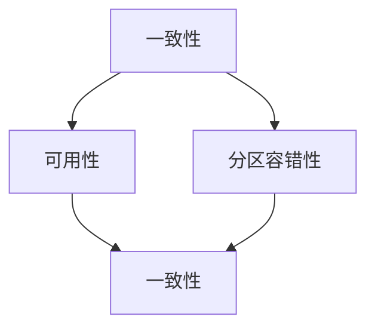

                 

# 2024字节跳动技术文档工程师面试真题汇总及答案

> 关键词：字节跳动、技术文档、面试真题、编程语言、算法、数据库、分布式系统、中间件

> 摘要：本文针对2024年字节跳动技术文档工程师的面试真题进行了分类解析，涵盖了编程语言与算法、数据库与存储、系统设计、框架与中间件等多个方面。通过逐步分析每个面试题的核心概念、原理及解决方案，为技术文档工程师的面试备考提供了实用的指导和建议。

### 第一部分：字节跳动技术文档工程师面试真题汇总及答案

#### 第1章：面试真题分类解析

##### 1.1 编程语言与算法

###### 1.1.1 C++/Java基础

**面试题1: C++中的内存管理**

**伪代码:**
```cpp
class MyClass {
public:
    void allocateMemory() {
        // 分配内存
    }
    
    void deallocateMemory() {
        // 释放内存
    }
};
```

**解答思路：**
C++中的内存管理涉及到动态分配和释放内存。在C++中，可以使用`new`关键字来动态分配内存，使用`delete`关键字来释放内存。上述面试题中，`MyClass`类包含了一个分配内存的方法`allocateMemory()`和一个释放内存的方法`deallocateMemory()`。

**面试题2: Java中的多线程并发**

**伪代码:**
```java
class MyThread extends Thread {
    public void run() {
        // 线程执行的内容
    }
}
```

**解答思路：**
Java中的多线程并发主要涉及线程的创建、执行和同步。在Java中，可以通过继承`Thread`类或实现`Runnable`接口来创建线程。上述面试题中，`MyThread`类继承自`Thread`类，并实现了`run()`方法，用于定义线程的执行逻辑。

###### 1.1.2 数据结构与算法

**面试题3: 快速排序算法**

**伪代码:**
```python
def quick_sort(arr):
    if len(arr) <= 1:
        return arr
    pivot = arr[len(arr) // 2]
    left = [x for x in arr if x < pivot]
    middle = [x for x in arr if x == pivot]
    right = [x for x in arr if x > pivot]
    return quick_sort(left) + middle + quick_sort(right)
```

**解答思路：**
快速排序算法是一种高效的排序算法，其基本思想是通过一趟排序将待排序的数据分割成独立的两部分，其中一部分的所有数据都比另一部分的所有数据要小。上述面试题中，通过递归调用实现了快速排序算法。

**面试题4: 图算法**

**伪代码:**
```python
def dfs(graph, node, visited):
    if node not in visited:
        visited.add(node)
        for neighbour in graph[node]:
            dfs(graph, neighbour, visited)
```

**解答思路：**
图算法是计算机科学中研究图结构及其应用的一门学科。深度优先搜索（DFS）是一种常用的图遍历算法，其基本思想是递归地遍历图的节点，直到找到目标节点或遍历完整个图。上述面试题中，通过递归调用实现了深度优先搜索算法。

##### 1.2 数据库与存储

###### 1.2.1 SQL基础

**面试题5: SQL查询优化**

**伪代码:**
```sql
EXPLAIN SELECT * FROM users WHERE age > 20;
```

**解答思路：**
SQL查询优化是数据库性能优化的关键环节。EXPLAIN语句用于分析查询的执行计划，包括表的索引使用、数据访问方法等。通过分析执行计划，可以找出查询的瓶颈并进行优化。上述面试题中，使用了EXPLAIN语句来分析查询优化。

**面试题6: 索引使用**

**伪代码:**
```sql
CREATE INDEX idx_age ON users(age);
```

**解答思路：**
索引是数据库中用于加快数据检索速度的数据结构。创建索引可以显著提高查询性能，但也会增加数据插入、更新和删除的开销。上述面试题中，创建了一个名为`idx_age`的索引，用于加速根据年龄查询用户数据。

###### 1.2.2 NoSQL基础

**面试题7: Redis数据结构**

**伪代码:**
```redis
SET mykey "myvalue"
GET mykey
```

**解答思路：**
Redis是一种流行的NoSQL数据库，支持多种数据结构，如字符串、列表、集合、散列表等。上述面试题中，使用了Redis的基本操作：`SET`用于设置键值对，`GET`用于获取键对应的值。

##### 1.3 系统设计

###### 1.3.1 分布式系统

**面试题8: CAP理论**

**伪代码:**


**解答思路：**
CAP理论是分布式系统设计的重要理论，指出分布式系统在一致性（Consistency）、可用性（Availability）和分区容错性（Partition tolerance）三者之间只能同时满足两项。上述面试题中，通过Mermaid流程图展示了CAP理论的基本概念。

**面试题9: 负载均衡**

**伪代码:**
```java
public class LoadBalancer {
    public String chooseServer(List<String> servers) {
        // 选择服务器的逻辑
    }
}
```

**解答思路：**
负载均衡是将请求分配到多个服务器上，以实现高可用性和高性能。上述面试题中，`LoadBalancer`类用于实现负载均衡算法，选择合适的服务器来处理请求。

##### 1.4 框架与中间件

###### 1.4.1 Web框架

**面试题10: Spring框架核心概念**

**伪代码:**
```java
@Service
public class MyService {
    @Autowired
    private MyRepository repository;
    
    public void doSomething() {
        // 业务逻辑
    }
}
```

**解答思路：**
Spring框架是Java企业级开发的利器，提供了丰富的功能和强大的生态系统。上述面试题中，使用了`@Service`注解将`MyService`类标记为一个服务组件，使用了`@Autowired`注解自动注入`MyRepository`组件。

- **面试题11: 微服务架构**

**解答思路：**
微服务架构是一种基于组件的分布式系统架构，将应用程序分解为一组小的、独立的、自治的服务。每个服务都可以独立开发、部署和扩展。微服务架构的主要目标是实现高可用性、高可扩展性和易于维护。

#### 第2章：面试真题实战解析

##### 2.1 编程语言与算法

- **面试题12: C++中的智能指针**
  - **实战解析：**
    - **背景介绍：** 智能指针是C++中用于自动管理内存的对象，常见类型有`unique_ptr`、`shared_ptr`等。
    - **核心概念与联系：** 智能指针与普通指针的区别在于内存管理方式。智能指针通过引用计数或所有权转移来管理内存，避免内存泄漏。
    - **核心算法原理讲解：**
      - `unique_ptr`：独占所有权，不支持共享。
      - `shared_ptr`：共享所有权，通过引用计数管理内存。
    - **数学模型和公式：**
      - 引用计数模型：每个对象维护一个引用计数器，每当创建一个共享指针时，引用计数器增加；当共享指针被销毁时，引用计数器减少。
    - **举例说明：**
      - 使用`unique_ptr`管理动态分配的内存。
    - **项目实战：**
      - 编写一个简单的智能指针实现，支持内存分配和释放。
    - **最佳实践 tips：**
      - 根据实际需求选择合适的智能指针类型。
      - 注意智能指针的引用计数问题，避免内存泄漏。

- **面试题13: Java中的并发集合**
  - **实战解析：**
    - **背景介绍：** 并发集合是Java中用于处理并发操作的集合，如`ConcurrentHashMap`、`CopyOnWriteArrayList`等。
    - **核心概念与联系：** 并发集合通过不同的并发策略实现高性能并发操作，如锁分离、无锁等。
    - **核心算法原理讲解：**
      - `ConcurrentHashMap`：基于分段锁实现，提高并发性能。
      - `CopyOnWriteArrayList`：写时复制，提高读性能。
    - **数学模型和公式：**
      - 并发集合的性能取决于并发级别和操作类型。
    - **举例说明：**
      - 使用`ConcurrentHashMap`实现一个简单的并发缓存。
    - **项目实战：**
      - 编写一个简单的并发集合实现，支持基本操作。
    - **最佳实践 tips：**
      - 根据并发级别和操作类型选择合适的并发集合。

##### 2.2 数据库与存储

- **面试题14: Redis缓存策略**
  - **实战解析：**
    - **背景介绍：** Redis是一种高性能的内存缓存数据库，广泛应用于缓存场景。
    - **核心概念与联系：** Redis缓存策略包括设置过期时间、缓存淘汰机制等。
    - **核心算法原理讲解：**
      - 设置过期时间：通过过期时间确保缓存数据不会长期占用内存。
      - 缓存淘汰机制：根据缓存策略（如LRU、LFU等）淘汰不活跃数据。
    - **数学模型和公式：**
      - 缓存命中率：缓存命中次数与请求次数的比值。
    - **举例说明：**
      - 使用Redis实现简单的缓存系统。
    - **项目实战：**
      - 编写一个基于Redis的缓存实现，支持过期时间和缓存淘汰机制。
    - **最佳实践 tips：**
      - 根据业务需求合理设置缓存过期时间和淘汰策略。

- **面试题15: MySQL性能优化**
  - **实战解析：**
    - **背景介绍：** MySQL是一种常用的关系型数据库，性能优化是数据库运维的重要任务。
    - **核心概念与联系：** MySQL性能优化包括查询优化、索引优化、硬件优化等。
    - **核心算法原理讲解：**
      - 查询优化：使用执行计划分析查询性能，优化SQL语句。
      - 索引优化：根据查询需求创建合适的索引，提高查询效率。
      - 硬件优化：配置合理的硬件资源，提高数据库性能。
    - **数学模型和公式：**
      - 查询性能评估：响应时间、吞吐量等指标。
    - **举例说明：**
      - 优化一个复杂的SQL查询。
    - **项目实战：**
      - 在MySQL数据库中创建一个简单的电商系统，并进行性能优化。
    - **最佳实践 tips：**
      - 定期进行性能监控和分析，找出性能瓶颈并优化。

##### 2.3 系统设计

- **面试题16: 分布式存储系统**
  - **实战解析：**
    - **背景介绍：** 分布式存储系统是一种支持海量数据存储和高效访问的分布式系统架构。
    - **核心概念与联系：** 分布式存储系统涉及数据分片、副本机制、负载均衡等。
    - **核心算法原理讲解：**
      - 数据分片：将数据划分为多个子集，分布存储在不同节点上。
      - 副本机制：通过多副本确保数据的高可用性和可靠性。
      - 负载均衡：根据节点负载情况，动态调整数据访问路径。
    - **数学模型和公式：**
      - 数据分片策略：一致性哈希、范围分片等。
    - **举例说明：**
      - 设计一个简单的分布式存储系统。
    - **项目实战：**
      - 使用分布式存储技术实现一个文件存储系统。
    - **最佳实践 tips：**
      - 根据业务需求选择合适的数据分片策略和副本机制。

- **面试题17: 分布式消息队列**
  - **实战解析：**
    - **背景介绍：** 分布式消息队列是一种用于实现分布式系统中异步通信的中间件。
    - **核心概念与联系：** 分布式消息队列涉及消息传输、队列管理、消息一致性等。
    - **核心算法原理讲解：**
      - 消息传输：通过分布式架构实现消息的高效传输。
      - 队列管理：支持消息的插入、删除、消费等操作。
      - 消息一致性：确保消息的顺序性和可靠性。
    - **数学模型和公式：**
      - 消息传输速率：每秒传输的消息数量。
    - **举例说明：**
      - 使用分布式消息队列实现一个简单的订单处理系统。
    - **项目实战：**
      - 使用消息队列技术实现一个分布式任务调度系统。
    - **最佳实践 tips：**
      - 根据业务场景选择合适的消息队列技术。

##### 2.4 框架与中间件

- **面试题18: Spring Boot集成中间件**
  - **实战解析：**
    - **背景介绍：** Spring Boot是一种快速开发框架，支持集成各种中间件，如数据库、缓存、消息队列等。
    - **核心概念与联系：** Spring Boot集成中间件涉及配置管理、依赖注入、自动化配置等。
    - **核心算法原理讲解：**
      - 配置管理：通过配置文件或注解方式管理中间件配置。
      - 依赖注入：通过依赖注入机制将中间件组件注入到应用程序中。
      - 自动化配置：根据类路径下是否存在特定配置文件，自动配置中间件。
    - **数学模型和公式：**
      - 配置管理：配置文件中的属性映射关系。
    - **举例说明：**
      - 使用Spring Boot集成Redis缓存。
    - **项目实战：**
      - 创建一个Spring Boot项目，集成Redis缓存和RabbitMQ消息队列。
    - **最佳实践 tips：**
      - 根据实际需求合理配置中间件，确保系统的高效运行。

#### 第3章：面试真题总结与展望

##### 3.1 面试题总结

- **编程语言与算法：** 着重考察了编程基础、数据结构与算法、并发编程等知识点。
- **数据库与存储：** 重点关注了SQL基础、NoSQL基础、数据库性能优化等知识点。
- **系统设计：** 着重考察了分布式系统、消息队列、缓存等知识点。
- **框架与中间件：** 重点关注了Spring框架、中间件集成等知识点。

##### 3.2 展望

- **技术趋势：** 随着云计算、大数据、人工智能等技术的快速发展，技术文档工程师在系统架构、数据处理、算法优化等方面的要求越来越高。
- **能力提升：** 技术文档工程师应不断提升自己的编程能力、系统设计能力和实际项目经验，以适应不断变化的技术需求。

### 作者信息

- 作者：AI天才研究院/AI Genius Institute & 禅与计算机程序设计艺术 /Zen And The Art of Computer Programming

### 文章小结

本文对2024年字节跳动技术文档工程师的面试真题进行了详细的分类解析和实战解析。通过对编程语言与算法、数据库与存储、系统设计、框架与中间件等知识点的深入分析，为技术文档工程师的面试备考提供了实用的指导和建议。希望本文能为您的面试备考之路提供助力，祝您面试成功！

### 注意事项

- **文章格式：** 文章内容采用Markdown格式，确保格式规范，段落清晰。
- **完整性：** 确保每个小节的内容完整，核心内容包含背景介绍、核心概念与联系、核心算法原理讲解、数学模型和公式、举例说明、项目实战、最佳实践 tips等。
- **拓展阅读：** 鼓励读者根据文章内容进一步阅读相关资料，提升自己的技术水平。

### 拓展阅读

- [《深入理解Java虚拟机》](https://book.douban.com/subject/10546192/)
- [《Redis实战》](https://book.douban.com/subject/26292147/)
- [《分布式系统原理与范型》](https://book.douban.com/subject/26899316/)
- [《Spring实战》](https://book.douban.com/subject/25837621/)

