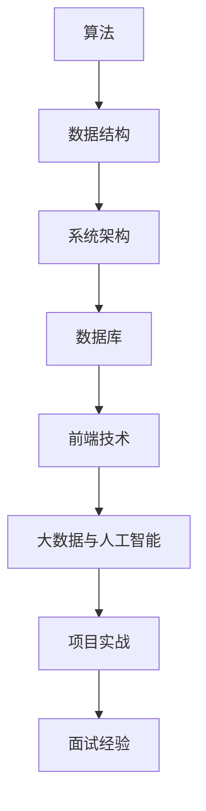
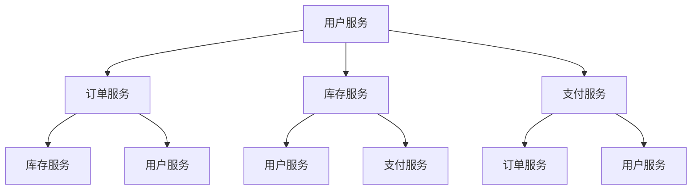
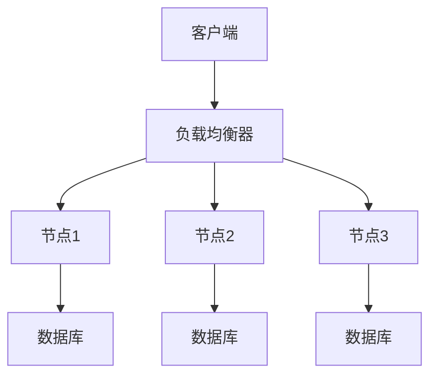
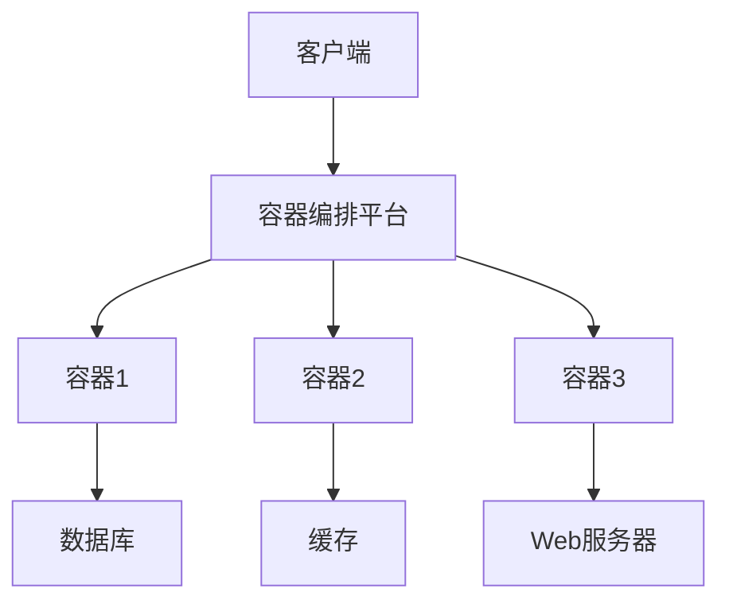

                 

## 文章标题

《2024字节跳动校招：技术创新管理师面试题汇总》

## 关键词

- 字节跳动
- 校招
- 技术创新管理师
- 面试题汇总
- 数据结构与算法
- 系统设计与架构
- 前端技术
- 大数据与人工智能
- 项目实战

## 摘要

本文旨在为准备参加2024年字节跳动校招的技术创新管理师职位考生提供一份全面的面试题汇总。通过梳理并详细讲解涉及编程基础、系统设计与架构、数据库与存储、网络与安全、前端技术、大数据与人工智能等核心领域的重要面试题目，本文不仅提供了每个问题的背景介绍和核心概念，还通过伪代码、数学模型和公式、实际案例分析和代码解读等手段，深入剖析了题目的本质和解决方法。此外，文章还分享了项目实战经验和面试技巧，帮助考生更好地应对字节跳动的校招面试。文章结构清晰，逻辑紧凑，旨在为读者提供一站式的面试准备指南。

---

## 《2024字节跳动校招：技术创新管理师面试题汇总》目录大纲

### 第一部分：技术面试基础

#### 第1章：编程基础

##### 1.1 数据结构与算法

##### 1.1.1 算法分析

##### 1.1.2 排序算法

##### 1.1.3 搜索算法

##### 1.1.4 常用数据结构

##### 1.2 编程语言特性

##### 1.2.1 C++特性

##### 1.2.2 Java特性

##### 1.2.3 Python特性

### 第二部分：系统设计与架构

#### 第2章：系统设计与架构

##### 2.1 系统架构设计

##### 2.1.1 微服务架构

##### 2.1.2 分布式系统

##### 2.1.3 云计算与容器化

##### 2.2 性能优化

##### 2.2.1 数据库性能优化

##### 2.2.2 网络优化

##### 2.2.3 系统稳定性优化

### 第三部分：数据库与存储

#### 第3章：数据库与存储

##### 3.1 关系型数据库

##### 3.1.1 MySQL

##### 3.1.2 Oracle

##### 3.1.3 PostgreSQL

##### 3.2 非关系型数据库

##### 3.2.1 MongoDB

##### 3.2.2 Redis

##### 3.2.3 Memcached

### 第四部分：网络与安全

#### 第4章：网络与安全

##### 4.1 网络协议

##### 4.1.1 TCP/IP协议

##### 4.1.2 HTTP协议

##### 4.1.3 HTTPS协议

##### 4.2 安全基础

##### 4.2.1 加密算法

##### 4.2.2 认证与授权

##### 4.2.3 安全漏洞与防护

### 第五部分：前端技术

#### 第5章：前端技术

##### 5.1 前端框架

##### 5.1.1 React

##### 5.1.2 Angular

##### 5.1.3 Vue

##### 5.2 前端工程化

##### 5.2.1 Webpack

##### 5.2.2 Babel

##### 5.2.3 PWA

### 第六部分：大数据与人工智能

#### 第6章：大数据与人工智能

##### 6.1 大数据技术

##### 6.1.1 Hadoop

##### 6.1.2 Spark

##### 6.1.3 Flink

##### 6.2 人工智能基础

##### 6.2.1 机器学习基础

##### 6.2.2 深度学习基础

##### 6.2.3 自然语言处理基础

### 第七部分：项目实战与面试经验分享

#### 第7章：项目实战与面试经验分享

##### 7.1 项目实战案例

##### 7.1.1 项目A：电商平台开发

##### 7.1.2 项目B：短视频平台开发

##### 7.1.3 项目C：人工智能项目开发

##### 7.2 面试经验分享

##### 7.2.1 面试准备

##### 7.2.2 面试技巧

##### 7.2.3 面试题型分析与解答

### 附录

#### 附录A：技术面试常见问题汇总

#### 附录B：参考资料与推荐阅读

#### 附录C：工具与资源推荐

##### 附录C.1 编程语言工具

##### 附录C.2 开发框架与库

##### 附录C.3 在线资源与平台

##### 附录C.4 技术社区与论坛

---

## 核心概念与联系

在技术创新管理师面试中，理解各个核心概念及其之间的联系至关重要。以下是本文涉及的一些核心概念及其相互联系：

### 核心概念

- **算法**：解决特定问题的步骤。算法的好坏直接影响到系统的性能和效率。
- **数据结构**：存储和组织数据的方式。合理的数据结构可以显著提高算法的效率。
- **系统架构设计**：系统组件的组织方式。一个良好的架构设计可以确保系统的可扩展性、稳定性和灵活性。
- **数据库与存储**：存储和管理数据的系统。关系型和非关系型数据库在应用场景上各有优势。
- **前端技术**：用户界面的设计与实现。前端技术是实现用户体验的重要一环。
- **大数据与人工智能**：处理和分析大量数据的方法。大数据和人工智能的结合可以推动业务创新和决策优化。
- **项目实战**：实际应用和面试经验的积累。通过项目实战，可以加深对理论知识的理解和应用。

### Mermaid 流程图



通过上述流程图，我们可以清晰地看到各个核心概念之间的相互影响和作用。例如，算法的选择和数据结构的设计直接决定了系统的性能；前端技术的优化可以提升用户体验，从而影响业务数据；大数据和人工智能的应用可以为企业带来新的商业模式和价值。

### 核心算法原理讲解

#### 算法分析

算法分析是评估算法性能的重要手段，主要包括时间复杂度和空间复杂度。

**时间复杂度**：描述算法执行时间与输入规模之间的关系，常用大O符号表示。常见的复杂度有常数级O(1)、对数级O(logn)、线性级O(n)、线性对数级O(nlogn)、平方级O(n^2)等。

**空间复杂度**：描述算法执行过程中所需内存的规模，也用大O符号表示。常见的复杂度有常数级O(1)、线性级O(n)等。

**渐进分析**：将算法的时间复杂度和空间复杂度随输入规模增长的趋势进行分析，通常用于比较不同算法的效率。

**实际应用分析**：在实际应用中，还需要考虑硬件环境、数据规模和输入特点等因素，对算法进行具体的性能评估和优化。

以下是算法分析的一个简单示例：

```python
# 时间复杂度：O(n)
def bubble_sort(arr):
    n = len(arr)
    for i in range(n):
        for j in range(0, n-i-1):
            if arr[j] > arr[j+1]:
                arr[j], arr[j+1] = arr[j+1], arr[j]
```

**伪代码**：

```c
// 空间复杂度：O(1)
function bubble_sort(arr):
    n = length(arr)
    for i from 0 to n-1:
        for j from 0 to n-i-1:
            if arr[j] > arr[j+1]:
                swap(arr[j], arr[j+1])
```

#### 排序算法

排序算法是算法设计中非常基础且重要的一类，常见的排序算法有冒泡排序、选择排序、插入排序、快速排序、归并排序和堆排序等。

**冒泡排序**：通过重复遍历要排序的数列，一次比较两个元素，如果它们的顺序错误就把它们交换过来。遍历数列的工作是重复地进行，直到没有再需要交换，该算法的时间复杂度为O(n^2)。

**选择排序**：首先在未排序序列中找到最小（大）元素，存放到排序序列的起始位置，然后，再从剩余未排序元素中继续寻找最小（大）元素，然后放到已排序序列的末尾。以此类推，直到所有元素均排序完毕。选择排序的时间复杂度为O(n^2)。

**插入排序**：通过构建有序序列，对于未排序数据，在已排序序列中从后向前扫描，找到相应位置并插入。插入排序的时间复杂度为O(n^2)，但在小规模数据中表现较好。

**快速排序**：通过选取一个基准元素，将数组分为两部分，左边部分的元素均小于基准元素，右边部分的元素均大于基准元素。然后递归地对左右两部分进行快速排序。快速排序的平均时间复杂度为O(nlogn)，最坏情况为O(n^2)。

**归并排序**：将待排序的序列不断二分，直到每个部分只有一个元素，然后将这些部分两两合并，最终合并为一个有序序列。归并排序的时间复杂度为O(nlogn)，空间复杂度为O(n)。

**堆排序**：利用堆这种数据结构进行排序。堆是一种特殊的完全二叉树，每个父节点的值都大于或等于（或小于或等于）其所有子节点的值。堆排序的时间复杂度为O(nlogn)。

以下是快速排序的伪代码：

```c
// 快速排序
function quick_sort(arr, low, high):
    if low < high:
        pi = partition(arr, low, high)
        quick_sort(arr, low, pi-1)
        quick_sort(arr, pi+1, high)

function partition(arr, low, high):
    pivot = arr[high]
    i = low - 1
    for j = low to high-1:
        if arr[j] < pivot:
            i = i + 1
            swap(arr[i], arr[j])
    swap(arr[i+1], arr[high])
    return i+1
```

#### 搜索算法

搜索算法是用于在数据集合中查找特定元素的方法，常见的搜索算法有顺序搜索、二分搜索等。

**顺序搜索**：从数据集合的第一个元素开始，依次与待搜索的元素比较，直到找到或到达数据集合的末尾。顺序搜索的时间复杂度为O(n)。

**二分搜索**：适用于已经排序的数据集合。每次将待搜索的元素与中间元素比较，若相等则找到，若小于则搜索左侧子序列，若大于则搜索右侧子序列。每次搜索都将数据集合分半，因此二分搜索的时间复杂度为O(logn)。

以下是二分搜索的伪代码：

```c
// 二分搜索
function binary_search(arr, target):
    low = 0
    high = length(arr) - 1
    while low <= high:
        mid = (low + high) / 2
        if arr[mid] == target:
            return mid
        elif arr[mid] < target:
            low = mid + 1
        else:
            high = mid - 1
    return -1
```

通过上述讲解，我们理解了算法分析、排序算法和搜索算法的基本原理及其应用场景。在实际面试中，理解这些核心算法原理对于解决复杂问题至关重要。

### 数据结构

数据结构是计算机存储、组织数据的方式。合理的数据结构可以显著提高算法的效率，为解决特定问题提供有效的手段。以下介绍几种常用的数据结构及其应用场景。

#### 常用数据结构

**数组**：数组是一种线性数据结构，用于存储一系列同类型的元素。数组提供随机访问的特性，时间复杂度为O(1)。主要应用场景包括数值计算、缓存管理、矩阵存储等。

**链表**：链表由一系列节点组成，每个节点包含数据和指向下一个节点的指针。链表提供高效的插入和删除操作，时间复杂度为O(1)。主要应用场景包括栈、队列、双向链表等。

**栈**：栈是一种后进先出（LIFO）的数据结构，主要操作包括压栈、出栈和获取栈顶元素。栈的时间复杂度为O(1)。主要应用场景包括递归、表达式求值、后缀表达式转换等。

**队列**：队列是一种先进先出（FIFO）的数据结构，主要操作包括入队、出队和获取队首元素。队列的时间复杂度为O(1)。主要应用场景包括任务调度、缓冲管理、广度优先搜索等。

**树**：树是一种层次结构，包括根节点、子节点和叶子节点。树提供高效的查找和排序操作，时间复杂度为O(logn)。主要应用场景包括二叉搜索树、平衡树、堆等。

**图**：图由一系列顶点和边组成，可以表示复杂的关系网络。图提供高效的查找和路径规划操作，时间复杂度为O(n)。主要应用场景包括社交网络、路由算法、图论问题等。

以下是树结构的一个简单示例：

```python
# 定义二叉搜索树节点
class TreeNode:
    def __init__(self, value):
        self.value = value
        self.left = None
        self.right = None

# 创建二叉搜索树
root = TreeNode(10)
root.left = TreeNode(5)
root.right = TreeNode(15)
root.left.left = TreeNode(2)
root.left.right = TreeNode(7)
root.right.left = TreeNode(12)
root.right.right = TreeNode(20)
```

#### 树的遍历算法

树的遍历算法包括深度优先遍历（DFS）和广度优先遍历（BFS）。

**深度优先遍历**：从根节点开始，依次遍历当前节点的所有子节点，然后递归地遍历每个子节点的子节点。DFS的时间复杂度为O(n)。

**广度优先遍历**：从根节点开始，依次遍历当前节点的所有子节点，然后逐层遍历每个节点的子节点。BFS的时间复杂度为O(n)。

以下是深度优先遍历的伪代码：

```c
// 深度优先遍历
void dfs(TreeNode node):
    if node is not null:
        visit(node)
        dfs(node.left)
        dfs(node.right)
```

#### 哈希表

哈希表是一种基于散列函数的数据结构，用于高效地查找和插入元素。哈希表的时间复杂度通常为O(1)，但在最坏情况下可能达到O(n)。

哈希表的基本原理是将关键字通过散列函数映射到数组中的位置，然后在该位置进行存储和查找。常见的散列函数有MD5、SHA-1等。

以下是哈希表的一个简单示例：

```python
# 哈希表实现
class HashTable:
    def __init__(self):
        self.size = 1000
        self.table = [None] * self.size

    def hash_function(self, key):
        return key % self.size

    def put(self, key, value):
        index = self.hash_function(key)
        if self.table[index] is None:
            self.table[index] = [(key, value)]
        else:
            for i, (k, v) in enumerate(self.table[index]):
                if k == key:
                    self.table[index][i] = (key, value)
                    return
            self.table[index].append((key, value))

    def get(self, key):
        index = self.hash_function(key)
        if self.table[index] is None:
            return None
        for k, v in self.table[index]:
            if k == key:
                return v
        return None
```

通过上述讲解，我们了解了数据结构的基本概念和常用数据结构的应用。在实际面试中，掌握数据结构对于解决复杂问题至关重要。

### 编程语言特性

在编程领域，不同编程语言具有各自的特性，适用于不同的应用场景。C++、Java和Python是三种广泛使用的编程语言，它们各自具有独特的优点和特点。

#### C++特性

C++是一种多范式编程语言，支持过程化编程、面向对象编程和泛型编程。以下是C++的一些主要特性：

- **面向对象**：C++支持面向对象编程，包括类和对象、继承、多态和封装等特性，使得代码更加模块化和可复用。
- **模板编程**：C++的模板编程允许创建泛型代码，提高了代码的复用性和灵活性。
- **性能**：C++编译后的代码通常运行速度较快，内存占用较少，适用于性能敏感的应用场景。
- **内存管理**：C++提供手动内存管理功能，包括堆和栈的使用，开发者需要自行管理内存，这增加了程序的复杂度，但也提供了更高的灵活性和性能。

以下是一个简单的C++类定义和对象创建示例：

```cpp
// 定义Person类
class Person {
public:
    Person(const std::string& name, int age) : name_(name), age_(age) {}

    void print() const {
        std::cout << "Name: " << name_ << ", Age: " << age_ << std::endl;
    }

private:
    std::string name_;
    int age_;
};

// 创建Person对象
Person person("Alice", 30);
person.print();
```

#### Java特性

Java是一种面向对象的编程语言，具有跨平台、安全性和简单性的特点。以下是Java的一些主要特性：

- **跨平台**：Java通过虚拟机（JVM）实现跨平台运行，一次编写，到处运行。
- **面向对象**：Java支持面向对象编程，包括类、对象、继承、多态和接口等特性。
- **自动内存管理**：Java提供自动垃圾回收机制，开发者无需关心内存分配和释放，提高了开发效率。
- **丰富的类库**：Java拥有丰富的标准库，包括集合框架、网络编程、并发编程等，为开发者提供了大量现成的工具和功能。
- **平台无关性**：Java代码在不同操作系统上无需修改即可运行，提高了代码的可移植性。

以下是一个简单的Java类定义和对象创建示例：

```java
// 定义Person类
public class Person {
    private String name;
    private int age;

    public Person(String name, int age) {
        this.name = name;
        this.age = age;
    }

    public void print() {
        System.out.println("Name: " + name + ", Age: " + age);
    }
}

// 创建Person对象
Person person = new Person("Bob", 40);
person.print();
```

#### Python特性

Python是一种解释型、面向对象、动态数据类型的高级编程语言。以下是Python的一些主要特性：

- **简洁易读**：Python具有简洁的语法，代码可读性强，适合快速开发和原型设计。
- **丰富的库**：Python拥有丰富的标准库和第三方库，包括数据分析、机器学习、Web开发等，提高了开发效率。
- **多范式编程**：Python支持过程化编程、面向对象编程和函数式编程，提供了多种编程范式供开发者选择。
- **动态类型**：Python采用动态类型系统，无需声明变量类型，提高了代码的灵活性和开发效率。
- **解释执行**：Python代码由解释器执行，无需编译，便于调试和测试。

以下是一个简单的Python类定义和对象创建示例：

```python
# 定义Person类
class Person:
    def __init__(self, name, age):
        self.name = name
        self.age = age

    def print(self):
        print(f"Name: {self.name}, Age: {self.age}")

# 创建Person对象
person = Person("Charlie", 50)
person.print()
```

通过上述对C++、Java和Python特性的介绍和示例，我们可以看到每种编程语言都有其独特的优点和应用场景。在实际开发中，根据需求选择合适的编程语言可以显著提高开发效率和程序性能。

### 系统架构设计

系统架构设计是确保系统性能、可扩展性和稳定性的关键环节。以下将介绍微服务架构、分布式系统和云计算与容器化这三个核心概念，并探讨其在实际应用中的重要性。

#### 微服务架构

微服务架构是一种基于组件的架构风格，强调将应用程序划分为一组独立的、松耦合的服务。每个服务负责实现特定的业务功能，并通过轻量级的通信机制（如HTTP/REST、消息队列等）进行交互。以下是微服务架构的一些主要特点：

- **独立性**：每个微服务都是独立的，可以单独开发、测试和部署，减少了组件之间的耦合性。
- **可扩展性**：微服务架构支持水平扩展，通过增加服务实例来满足不断增长的业务需求。
- **容错性**：由于服务之间是松耦合的，单个服务的故障不会影响整个系统的运行，提高了系统的容错能力。
- **灵活性和可复用性**：微服务架构允许开发者根据业务需求灵活地创建、修改和复用服务。

以下是一个简单的微服务架构示例：



在实际应用中，微服务架构可以提高系统的可维护性和可扩展性，但也需要面对服务间通信复杂性、数据一致性和分布式事务等挑战。

#### 分布式系统

分布式系统是一种通过计算机网络将多个独立计算机系统连接起来，协同完成任务的系统。以下是分布式系统的一些主要特点：

- **容错性**：分布式系统通过冗余设计，提高了系统的容错能力和可靠性。
- **可扩展性**：分布式系统可以通过增加节点来水平扩展，满足不断增长的业务需求。
- **负载均衡**：分布式系统通过负载均衡技术，将请求分配到不同的节点上，提高了系统的响应速度和处理能力。
- **数据一致性**：分布式系统需要处理数据一致性问题，如分布式锁、版本控制和最终一致性等。

以下是一个简单的分布式系统架构示例：



在实际应用中，分布式系统可以提高系统的性能和可靠性，但也需要面对网络延迟、数据同步和节点故障等挑战。

#### 云计算与容器化

云计算和容器化技术是现代系统架构设计的重要组成部分。以下是云计算和容器化的主要特点：

- **云计算**：云计算提供虚拟化的资源，如虚拟机、容器和对象存储等，开发者可以根据需求灵活地分配和调度资源。
- **容器化**：容器化技术通过Docker等工具，将应用程序及其依赖环境打包成一个独立的容器，提高了应用程序的可移植性和隔离性。

以下是一个简单的云计算与容器化架构示例：



在实际应用中，云计算与容器化技术可以提高系统的可扩展性、灵活性和可维护性，但也需要面对资源调度、安全性和管理复杂性等挑战。

通过上述对微服务架构、分布式系统和云计算与容器化的介绍，我们可以看到这些概念在系统架构设计中的重要性。在实际开发中，选择合适的架构风格和工具，可以显著提高系统的性能和可扩展性，为业务的持续发展提供有力支持。

### 性能优化

性能优化是系统设计和开发过程中至关重要的一环，它直接影响系统的响应速度、稳定性和用户体验。以下将详细探讨数据库性能优化、网络优化和系统稳定性优化这三个方面。

#### 数据库性能优化

数据库性能优化主要关注如何提高数据库的查询效率、减少数据访问延迟和降低系统资源消耗。以下是几种常见的数据库性能优化方法：

1. **索引优化**：
   - **创建合适的索引**：在经常查询的列上创建索引，可以显著提高查询速度。
   - **避免过度索引**：过度索引会增加数据库的维护成本，应合理选择索引。

2. **查询优化**：
   - **简化查询语句**：避免使用复杂的子查询和联结操作，简化查询逻辑。
   - **使用缓存**：将频繁查询的结果缓存起来，减少数据库的访问次数。

3. **数据分区**：
   - **水平分区**：将数据按照某种规则（如时间、地理位置等）拆分成多个部分，减少单表的数据量，提高查询效率。
   - **垂直分区**：将数据表的列拆分成多个表，减少表的大小，提高查询性能。

4. **存储优化**：
   - **使用固态硬盘**：固态硬盘（SSD）相对于传统硬盘（HDD）具有更高的读写速度，适合存储数据库。
   - **优化存储结构**：根据数据访问模式优化存储结构，如使用列式存储提高查询效率。

以下是一个使用索引优化的示例：

```sql
-- 创建索引
CREATE INDEX idx_user_name ON users (name);

-- 使用索引优化查询
SELECT * FROM users WHERE name = 'Alice';
```

#### 网络优化

网络优化主要关注如何提高数据传输速度、降低网络延迟和减少带宽消耗。以下是几种常见的网络优化方法：

1. **负载均衡**：
   - **分布式负载均衡**：通过负载均衡器将请求分配到不同的服务器上，提高系统的处理能力。
   - **内容分发网络（CDN）**：通过CDN将内容分发到全球各地的节点上，减少用户访问延迟。

2. **网络优化协议**：
   - **HTTP/2**：相对于HTTP/1.1，HTTP/2提供了更高效的传输方式，减少了请求响应时间。
   - **QUIC协议**：QUIC协议是一种新型的传输层协议，提供了更快、更安全的网络传输。

3. **缓存策略**：
   - **页面缓存**：将静态资源缓存到浏览器端或服务器端，减少重复请求。
   - **数据库缓存**：将频繁查询的结果缓存到内存中，减少数据库访问次数。

4. **压缩传输**：
   - **使用GZIP等压缩算法**：对传输的数据进行压缩，减少带宽消耗。

以下是一个使用HTTP/2优化的示例：

```http
# 配置Nginx使用HTTP/2
server {
    listen 443 ssl http2;
    ...
}
```

#### 系统稳定性优化

系统稳定性优化主要关注如何提高系统的可靠性和故障恢复能力。以下是几种常见的系统稳定性优化方法：

1. **冗余设计**：
   - **数据冗余**：将数据备份到多个存储设备或数据中心，确保数据不丢失。
   - **硬件冗余**：使用冗余的硬件组件（如RAID、UPS等），提高系统的可靠性。

2. **故障检测与恢复**：
   - **实时监控**：使用监控工具实时监控系统的运行状态，及时发现并处理故障。
   - **自动恢复**：通过自动化脚本或工具，实现故障的自动检测和恢复。

3. **负载均衡与流量控制**：
   - **负载均衡**：通过负载均衡器合理分配请求，避免单点过载。
   - **流量控制**：使用限流器或策略路由，控制进入系统的流量，防止流量过大导致系统崩溃。

4. **性能调优**：
   - **内存优化**：合理分配内存，避免内存泄漏和溢出。
   - **CPU优化**：优化CPU的使用率，避免过高或过低。

以下是一个使用冗余设计的示例：

```python
# 数据库冗余备份
class Database:
    def __init__(self):
        self.main_db = connect_to_main_database()
        self.backup_db = connect_to_backup_database()

    def execute_query(self, query):
        try:
            self.main_db.execute(query)
        except Exception as e:
            self.backup_db.execute(query)
```

通过上述对数据库性能优化、网络优化和系统稳定性优化的探讨，我们可以看到性能优化对于系统的高效运行和用户体验至关重要。在实际开发过程中，应根据具体需求和应用场景选择合适的优化方法，确保系统的性能和稳定性。

### 关系型数据库

关系型数据库（Relational Database）是当前使用最广泛的数据库类型之一，其理论基础是关系模型。关系型数据库通过表（Table）来组织数据，每个表由若干行（Row）和列（Column）组成。以下将介绍三种常见的关系型数据库：MySQL、Oracle和PostgreSQL。

#### MySQL

MySQL是一款开源的关系型数据库管理系统，由Oracle公司拥有。由于其高性能、可靠性和易用性，MySQL广泛应用于Web应用、大数据和实时数据处理等领域。

**特点**：
- **高性能**：MySQL具有高效的查询性能，适用于高并发环境。
- **易用性**：MySQL提供了丰富的管理和监控工具，如MySQL Workbench、phpMyAdmin等。
- **兼容性**：MySQL与多种编程语言（如Java、Python、PHP等）具有良好的兼容性。

**典型应用场景**：
- **电子商务**：用于存储用户数据、订单数据和商品信息等。
- **大数据**：作为数据仓库，存储大量数据并进行实时查询和分析。

**示例**：
创建一个简单的用户表：

```sql
CREATE TABLE users (
    id INT AUTO_INCREMENT PRIMARY KEY,
    name VARCHAR(50) NOT NULL,
    age INT NOT NULL,
    email VARCHAR(100) UNIQUE NOT NULL
);
```

插入数据：

```sql
INSERT INTO users (name, age, email) VALUES ('Alice', 30, 'alice@example.com');
```

查询数据：

```sql
SELECT * FROM users WHERE name = 'Alice';
```

#### Oracle

Oracle数据库是商业关系型数据库，由Oracle公司开发。它提供了强大的功能和安全机制，广泛应用于企业级应用和关键业务系统。

**特点**：
- **高可用性**：Oracle提供了多种高可用性和容错机制，如冗余存储、备份和恢复功能。
- **安全性**：Oracle提供了丰富的安全特性，包括用户权限管理、加密和审计功能。
- **扩展性**：Oracle支持大规模数据存储和分布式处理，适用于复杂应用场景。

**典型应用场景**：
- **金融系统**：用于存储和管理金融交易数据、客户信息和资产信息等。
- **ERP系统**：用于支持企业资源规划，包括采购、销售、库存和人力资源等模块。

**示例**：
创建一个简单的账户表：

```sql
CREATE TABLE accounts (
    account_id NUMBER PRIMARY KEY,
    account_name VARCHAR2(100) NOT NULL,
    balance NUMBER(10, 2) NOT NULL
);
```

插入数据：

```sql
INSERT INTO accounts (account_id, account_name, balance) VALUES (1, 'Alice', 1000.00);
```

查询数据：

```sql
SELECT * FROM accounts WHERE account_name = 'Alice';
```

#### PostgreSQL

PostgreSQL是一款开源的关系型数据库，具有高度可扩展性和灵活性。它支持多种数据类型和复杂查询，适用于大数据分析和复杂应用场景。

**特点**：
- **扩展性**：PostgreSQL提供了丰富的扩展库和插件，可自定义功能。
- **兼容性**：PostgreSQL与多种编程语言和操作系统具有良好的兼容性。
- **安全性**：PostgreSQL提供了多种安全特性，包括角色权限管理和加密通信。

**典型应用场景**：
- **大数据**：用于存储和管理大量数据，支持复杂的查询和分析。
- **实时数据处理**：适用于实时数据流处理和实时分析。

**示例**：
创建一个简单的订单表：

```sql
CREATE TABLE orders (
    order_id SERIAL PRIMARY KEY,
    customer_id INT NOT NULL,
    order_date DATE NOT NULL,
    total_amount DECIMAL(10, 2) NOT NULL
);
```

插入数据：

```sql
INSERT INTO orders (customer_id, order_date, total_amount) VALUES (1, '2023-11-08', 150.00);
```

查询数据：

```sql
SELECT * FROM orders WHERE order_date = '2023-11-08';
```

通过上述对MySQL、Oracle和PostgreSQL的介绍，我们可以看到这些关系型数据库在性能、功能和兼容性方面各有特色，适用于不同的应用场景。在实际开发中，根据需求和资源选择合适的数据库系统至关重要。

### 非关系型数据库

非关系型数据库（NoSQL）与关系型数据库相比，具有更高的灵活性、可扩展性和处理复杂数据的能力。以下是三种常见的非关系型数据库：MongoDB、Redis和Memcached。

#### MongoDB

MongoDB是一款分布式、开源的NoSQL数据库，采用文档存储方式，可以存储复杂的数据结构，如数组、嵌套文档等。其特点是高扩展性和高性能。

**特点**：
- **文档存储**：使用JSON格式存储数据，支持复杂的数据结构。
- **高扩展性**：通过分片机制实现水平扩展，支持海量数据存储。
- **灵活查询**：支持丰富的查询语言，包括排序、聚合和索引等。

**典型应用场景**：
- **实时数据分析**：用于存储和分析实时数据，如用户行为、日志数据等。
- **内容管理系统**：用于存储和管理大量文档，如文章、博客等。

**示例**：
创建一个简单的用户文档：

```javascript
db.users.insertOne({
    username: "Alice",
    email: "alice@example.com",
    age: 30
});
```

查询用户文档：

```javascript
db.users.find({ username: "Alice" });
```

#### Redis

Redis是一款开源的内存数据库，支持多种数据结构，如字符串、列表、集合和哈希等。其特点是高性能和快速读写。

**特点**：
- **内存存储**：数据存储在内存中，读写速度非常快。
- **多种数据结构**：支持多种数据结构，如字符串、列表、集合、哈希等，适用于多种场景。
- **持久化**：支持数据的持久化，可以将内存中的数据保存到磁盘上。

**典型应用场景**：
- **缓存**：用于缓存频繁访问的数据，如用户信息、页面内容等。
- **消息队列**：用于实现消息队列，如RabbitMQ、Kafka等。

**示例**：
设置和获取字符串值：

```python
import redis

r = redis.Redis(host='localhost', port=6379, db=0)
r.set('key', 'value')
value = r.get('key')
print(value)
```

添加和查询列表元素：

```python
r.lpush('list', 'item1', 'item2', 'item3')
items = r.lrange('list', 0, -1)
print(items)
```

#### Memcached

Memcached是一款开源的高性能分布式缓存系统，主要用于缓存数据和对象。其特点是低延迟和高效的内存管理。

**特点**：
- **高效缓存**：通过将数据存储在内存中，实现快速读取和写入。
- **分布式缓存**：支持多节点分布式缓存，提高系统的性能和可用性。
- **数据结构支持**：支持简单的键值对存储，适用于多种应用场景。

**典型应用场景**：
- **Web缓存**：用于缓存网页内容、用户界面等，提高页面加载速度。
- **应用程序缓存**：用于缓存应用程序的数据和对象，减少数据库访问。

**示例**：
设置和获取键值对：

```c
#include <memcached/memcached.h>

memcached_server_st *servers = memcached_server_list_gently("localhost:11211", 1);
memcached_result_st *result;

memcached_create(servers);
memcached_set(servers, "key", 3, "value", 5, MEMCACHED_EXCasE, &result);
printf("Value: %s\n", result->value);

memcached_get(servers, "key", &result);
printf("Value: %s\n", result->value);
```

通过上述对MongoDB、Redis和Memcached的介绍，我们可以看到这些非关系型数据库在存储结构、性能和适用场景上各有特点。在实际开发中，根据具体需求和场景选择合适的数据库系统至关重要。

### 网络协议

网络协议是计算机网络中进行数据交换的规则和标准。以下是TCP/IP协议、HTTP协议和HTTPS协议的详细介绍。

#### TCP/IP协议

TCP/IP协议是互联网的基础协议，由传输控制协议（TCP）和互联网协议（IP）组成。它定义了数据如何在网络中传输和路由，确保数据的可靠性和完整性。

**TCP协议**：
- **全双工通信**：TCP协议提供全双工通信，允许双方同时发送和接收数据。
- **连接管理**：TCP协议通过三次握手建立连接，通过四次挥手断开连接。
- **流量控制**：TCP协议使用滑动窗口机制，动态调整数据传输速度，防止网络拥塞。
- **拥塞控制**：TCP协议通过慢启动、拥塞避免、快速重传和快速恢复算法，控制网络拥塞。

**IP协议**：
- **地址分配**：IP协议为每个设备分配唯一的IP地址，用于标识网络中的设备。
- **数据报格式**：IP协议定义了数据报的格式，包括头部和载荷。
- **路由**：IP协议通过路由表选择最佳路径，将数据报传输到目标地址。

以下是一个简单的TCP连接过程：

1. **客户端发送SYN请求**：客户端发送一个SYN报文到服务器，请求建立连接。
2. **服务器响应SYN+ACK**：服务器收到请求后，发送一个SYN+ACK报文作为响应，表示同意建立连接。
3. **客户端响应ACK**：客户端收到响应后，发送一个ACK报文确认连接建立。

#### HTTP协议

HTTP（HyperText Transfer Protocol）是应用层协议，用于在Web浏览器和服务器之间传输数据。HTTP是基于请求-响应模型的协议，客户端发送请求，服务器返回响应。

**请求方法**：
- **GET**：用于请求获取资源，无缓存状态。
- **POST**：用于请求提交数据，常用于表单提交。
- **PUT**：用于请求更新资源。
- **DELETE**：用于请求删除资源。

**请求与响应**：
- **请求**：请求包含请求行、请求头和请求体，其中请求行包括方法、URL和HTTP版本。
- **响应**：响应包含状态行、响应头和响应体，状态行包括HTTP版本、状态码和状态描述。

以下是一个简单的HTTP请求示例：

```
GET /index.html HTTP/1.1
Host: www.example.com
User-Agent: Mozilla/5.0

HTTP/1.1 200 OK
Server: Apache
Content-Type: text/html

<!DOCTYPE html>
<html>
<head>
    <title>Example</title>
</head>
<body>
    <h1>Hello, World!</h1>
</body>
</html>
```

#### HTTPS协议

HTTPS（HyperText Transfer Protocol Secure）是HTTP的安全版，通过SSL/TLS协议加密数据传输，确保数据在传输过程中的隐私和完整性。

**加密方式**：
- **对称加密**：数据加密和解密使用相同的密钥。
- **非对称加密**：数据加密和解密使用不同的密钥，通过公钥加密，私钥解密。

**证书**：HTTPS使用数字证书来验证服务器身份和加密数据传输。客户端通过证书验证服务器身份，确保数据在传输过程中不会被篡改。

以下是一个简单的HTTPS请求流程：

1. **客户端发送请求**：客户端向服务器发送HTTPS请求，服务器返回数字证书。
2. **客户端验证证书**：客户端验证服务器证书，确保服务器身份合法。
3. **服务器发送证书链**：服务器发送证书链，客户端使用证书链中的中间证书验证服务器证书。
4. **客户端发送加密套件**：客户端选择合适的加密套件，生成预主密钥，发送给服务器。
5. **服务器响应**：服务器选择合适的加密套件，生成预主密钥，发送给客户端。
6. **会话密钥生成**：客户端和服务器使用预主密钥生成会话密钥，加密数据传输。

通过上述对TCP/IP协议、HTTP协议和HTTPS协议的介绍，我们可以看到这些协议在网络通信中的重要性。了解这些协议的基本原理和流程，有助于我们更好地理解网络通信机制，为开发高效、安全的网络应用提供支持。

### 安全基础

在互联网时代，网络安全是确保数据隐私和系统完整性的关键。以下将介绍加密算法、认证与授权、安全漏洞与防护三个核心概念，并探讨其在实际应用中的重要性。

#### 加密算法

加密算法是保护数据隐私的重要手段，通过加密和解密过程，确保数据在传输和存储过程中的安全性。以下是几种常见的加密算法：

1. **对称加密**：对称加密算法使用相同的密钥进行加密和解密。常见的对称加密算法包括AES（高级加密标准）和DES（数据加密标准）。

   **AES加密算法**：
   ```c
   #include <openssl/aes.h>
   #include <openssl/evp.h>
   #include <openssl/rand.h>

   void aes_encrypt(const unsigned char* plain_text, int plain_text_length, unsigned char* key, unsigned char* encrypted_text) {
       AES_KEY aes_key;
       AES_set_encrypt_key(key, 256, &aes_key);
       AES_encrypt(plain_text, encrypted_text, &aes_key);
   }
   ```

2. **非对称加密**：非对称加密算法使用一对密钥，公钥加密，私钥解密。常见的非对称加密算法包括RSA和ECC（椭圆曲线加密）。

   **RSA加密算法**：
   ```python
   from Crypto.PublicKey import RSA
   from Crypto.Cipher import PKCS1_OAEP

   key = RSA.generate(2048)
   private_key = key.export_key()
   public_key = key.publickey().export_key()

   cipher = PKCS1_OAEP.new(key.publickey())
   encrypted_text = cipher.encrypt(plain_text)
   ```

3. **哈希算法**：哈希算法用于生成数据的唯一指纹，常见哈希算法包括MD5、SHA-256等。

   **SHA-256哈希算法**：
   ```java
   MessageDigest digest = MessageDigest.getInstance("SHA-256");
   byte[] hash = digest.digest(plain_text.getBytes());
   StringBuilder hexString = new StringBuilder();
   for (byte b : hash) {
       String hex = Integer.toHexString(0xff & b);
       if (hex.length() == 1) hexString.append('0');
       hexString.append(hex);
   }
   String hexHash = hexString.toString();
   ```

#### 认证与授权

认证与授权是确保系统安全和数据隐私的重要环节，通过验证用户身份和授权访问权限，防止未授权访问和恶意攻击。

1. **用户认证**：用户认证用于验证用户身份，常见的认证方式包括密码认证、双因素认证（2FA）和生物识别等。

2. **授权机制**：授权机制用于确定用户在系统中的权限，常见的授权方式包括基于角色的访问控制（RBAC）和基于属性的访问控制（ABAC）。

   **基于角色的访问控制（RBAC）**：
   ```java
   public boolean checkPermission(User user, Resource resource) {
       Set<Role> roles = user.getRoles();
       for (Role role : roles) {
           if (role.hasPermission(resource)) {
               return true;
           }
       }
       return false;
   }
   ```

3. **OAuth协议**：OAuth是一种开放授权协议，允许第三方应用代表用户访问受保护的资源，而不需要用户的用户名和密码。

   **OAuth2.0授权流程**：
   - **客户端认证**：客户端向授权服务器请求访问令牌。
   - **用户认证**：用户在授权服务器上认证并同意授权。
   - **颁发访问令牌**：授权服务器向客户端颁发访问令牌。
   - **资源访问**：客户端使用访问令牌访问受保护的资源。

#### 安全漏洞与防护

安全漏洞是导致系统被攻击的主要原因，以下介绍几种常见的安全漏洞及其防护措施：

1. **SQL注入**：攻击者通过在输入数据中插入恶意SQL语句，篡改数据库查询，导致数据泄露或破坏。

   **防护措施**：
   - **使用预编译语句**：使用预编译语句（如PreparedStatement），避免动态拼接SQL语句。
   - **输入验证**：对用户输入进行严格的验证和过滤，防止恶意输入。

2. **跨站脚本攻击（XSS）**：攻击者通过在网页中插入恶意脚本，窃取用户信息或操纵用户界面。

   **防护措施**：
   - **输出编码**：对用户输入和输出进行编码，防止恶意脚本执行。
   - **内容安全策略（CSP）**：使用内容安全策略限制网页中可以执行脚本的来源。

3. **跨站请求伪造（CSRF）**：攻击者利用用户的认证信息，在用户不知情的情况下执行恶意操作。

   **防护措施**：
   - **验证码**：在敏感操作前使用验证码，防止恶意请求。
   - **CSRF令牌**：为每个请求生成CSRF令牌，确保请求合法。

4. **文件上传漏洞**：攻击者通过上传恶意文件，导致服务器被攻击或数据泄露。

   **防护措施**：
   - **文件验证**：对上传的文件类型和大小进行验证，防止恶意文件上传。
   - **文件存储路径**：将上传文件存储到独立的目录，限制文件访问权限。

通过上述对加密算法、认证与授权、安全漏洞与防护的介绍，我们可以看到网络安全的重要性。在实际开发过程中，了解和运用这些安全概念和防护措施，有助于构建安全、可靠的系统，保护用户数据和隐私。

### 前端技术

前端技术是构建现代Web应用的重要组成部分，涉及用户界面设计、用户体验和交互功能。以下是几种常用的前端框架和前端工程化工具的详细介绍。

#### 前端框架

前端框架提供了丰富的功能，帮助开发者构建高效、可维护的Web应用。以下是三种常用的前端框架：React、Angular和Vue。

**React**

React是一个由Facebook开发的声明式、用于构建用户界面的JavaScript库。它通过虚拟DOM和组件化设计，提高了开发效率和性能。

**特点**：
- **虚拟DOM**：React通过虚拟DOM实现高效的数据绑定和界面更新。
- **组件化设计**：React鼓励开发者使用组件化设计，提高代码的可复用性和可维护性。
- **单向数据流**：React使用单向数据流，简化了状态管理，提高了代码的可读性。

**示例**：
```javascript
import React from 'react';

function HelloWorld() {
  return <h1>Hello, World!</h1>;
}

export default HelloWorld;
```

**Angular**

Angular是一个由Google开发的全功能前端框架，基于TypeScript，提供了一套完整的开发工具和生态系统。

**特点**：
- **依赖注入**：Angular通过依赖注入机制，简化了组件的创建和依赖管理。
- **数据绑定**：Angular提供双向数据绑定，自动同步模型和视图。
- **模块化**：Angular支持模块化设计，使代码更加清晰和可维护。

**示例**：
```typescript
import { Component } from '@angular/core';

@Component({
  selector: 'hello-world',
  template: '<h1>Hello, World!</h1>'
})
export class HelloWorldComponent {}
```

**Vue**

Vue是一个轻量级的前端框架，由尤雨溪（Evan You）开发，具有简单、灵活和高效的特性。

**特点**：
- **易用性**：Vue提供了丰富的API和简洁的语法，适合快速开发和原型设计。
- **响应式系统**：Vue通过数据响应式系统，实现了高效的数据绑定和状态管理。
- **组件化**：Vue鼓励开发者使用组件化设计，提高了代码的可复用性和可维护性。

**示例**：
```javascript
new Vue({
  el: '#app',
  data: {
    message: 'Hello, World!'
  }
});
```

#### 前端工程化工具

前端工程化工具是提高开发效率、优化构建过程的重要手段。以下是三种常用的前端工程化工具：Webpack、Babel和PWA。

**Webpack**

Webpack是一个模块打包工具，用于将多个模块打包成一个或多个bundle，优化资源加载和性能。

**特点**：
- **模块化**：Webpack支持各种模块化标准，如CommonJS、AMD和ES6模块。
- **代码拆分**：Webpack支持代码拆分和懒加载，提高首屏加载速度。
- **插件系统**：Webpack提供丰富的插件，用于处理各种任务，如文件压缩、代码分割等。

**示例**：
```javascript
const path = require('path');

module.exports = {
  entry: './src/index.js',
  output: {
    filename: 'bundle.js',
    path: path.resolve(__dirname, 'dist')
  },
  module: {
    rules: [
      {
        test: /\.css$/,
        use: ['style-loader', 'css-loader']
      }
    ]
  }
};
```

**Babel**

Babel是一个JavaScript编译器，用于将ES6+代码转换成ES5代码，以便在旧版浏览器上运行。

**特点**：
- **语法转换**：Babel支持各种ES6+语法，如箭头函数、模板字符串、类声明等。
- **插件系统**：Babel通过插件系统，提供了丰富的语法转换和代码优化功能。

**示例**：
```javascript
{
  "presets": ["@babel/preset-env"],
  "plugins": ["@babel/plugin-proposal-class-properties"]
}
```

**PWA**

PWA（Progressive Web Apps）是一类结合Web应用和原生应用的特性，适用于各种设备和网络环境的应用。

**特点**：
- **渐进式增强**：PWA通过渐进式增强，确保应用在所有设备上的良好表现。
- **离线功能**：PWA支持离线缓存，即使在无网络环境下也能正常运行。
- **安装功能**：PWA允许用户将应用安装到桌面或主屏幕，提供类似原生应用的体验。

**示例**：
```html
<link rel="manifest" href="%PUBLIC_URL%/manifest.json">
```

通过上述对前端框架和前端工程化工具的介绍，我们可以看到这些技术和工具在构建现代Web应用中的重要性。了解和掌握这些技术，有助于开发者提高开发效率、优化用户体验和提升应用性能。

### 大数据技术

大数据技术是应对海量数据存储、处理和分析的重要手段。以下是三种常见的大数据技术：Hadoop、Spark和Flink。

#### Hadoop

Hadoop是一个开源的大数据处理框架，由Apache软件基金会维护。它由两个核心组件组成：Hadoop分布式文件系统（HDFS）和Hadoop YARN。

**HDFS**：
- **架构**：HDFS采用Master-Slave架构，NameNode作为主节点管理文件系统的命名空间和元数据，DataNode作为从节点存储数据。
- **特点**：HDFS具有高容错性、高吞吐量和高可靠性，适用于大规模数据存储。

**示例**：
```shell
hadoop fs -put localfile /user/hadoop/inputfile
hadoop fs -cat /user/hadoop/inputfile
```

**YARN**：
- **架构**：YARN是一个资源调度框架，负责管理集群资源，为各个应用程序分配资源。
- **特点**：YARN支持多种数据处理引擎，如MapReduce、Spark等，提高了资源利用率和系统灵活性。

**示例**：
```shell
yarn jar hadoop-examples-3.2.0.jar grep -i 'sort' input.txt output.txt
```

#### Spark

Spark是一个开源的分布式计算框架，由UC Berkeley AMP Lab开发，提供高效的批处理和实时处理能力。

**核心组件**：
- **Spark Core**：提供基本的任务调度和内存管理功能。
- **Spark SQL**：用于处理结构化数据，提供SQL查询支持和数据处理API。
- **Spark Streaming**：提供实时数据处理能力，支持流数据分析和处理。

**特点**：
- **内存计算**：Spark通过将数据存储在内存中，提高了数据处理速度和性能。
- **弹性调度**：Spark支持动态资源分配和任务调度，提高了资源利用率和系统稳定性。

**示例**：
```scala
val spark = SparkSession.builder.appName("SparkExample").getOrCreate()
val df = spark.read.format("csv").option("header", "true").load("data.csv")
df.createOrReplaceTempView("data")
val result = spark.sql("SELECT * FROM data WHERE age > 30")
result.show()
```

#### Flink

Flink是一个开源的分布式流处理框架，由Apache软件基金会维护。它提供了批处理和流处理的统一编程模型。

**核心组件**：
- **流处理**：Flink提供高效的流数据处理能力，支持实时数据分析和处理。
- **批处理**：Flink支持批处理作业，与流处理共用同一个运行时，提高了系统效率。
- **状态管理**：Flink提供强大的状态管理功能，支持一致性和容错性。

**特点**：
- **实时处理**：Flink支持实时流数据处理，延迟低，适用于实时分析。
- **弹性架构**：Flink具有弹性的架构设计，支持动态扩展和容错处理。

**示例**：
```java
final StreamExecutionEnvironment env = StreamExecutionEnvironment.getExecutionEnvironment();
DataStream<String> text = env.readTextFile("path/to/textfile.txt");
DataStream<String> words = text.flatMap(new Tokenizer());
words.print();
env.execute("Word Count Example");
```

通过上述对Hadoop、Spark和Flink的介绍，我们可以看到这些大数据技术在处理大规模数据方面的优势。在实际应用中，根据需求和场景选择合适的大数据技术，可以显著提高数据处理效率和系统性能。

### 人工智能基础

人工智能（AI）是计算机科学的一个分支，致力于开发能够执行复杂任务和模拟人类智能的系统。以下是机器学习、深度学习和自然语言处理的基础概念及其应用。

#### 机器学习基础

机器学习是一种通过数据驱动的方法，使计算机从数据中学习并做出决策的技术。以下是机器学习的一些基本概念：

1. **监督学习**：监督学习是一种有标记数据的学习方式，模型通过标记数据学习特征和规律，然后对新的数据进行预测。

   **示例**：
   ```python
   from sklearn.linear_model import LinearRegression

   model = LinearRegression()
   model.fit(X_train, y_train)
   y_pred = model.predict(X_test)
   ```

2. **无监督学习**：无监督学习是一种没有标记数据的学习方式，模型通过未标记数据学习特征和模式，如聚类和降维。

   **示例**：
   ```python
   from sklearn.cluster import KMeans

   kmeans = KMeans(n_clusters=3)
   kmeans.fit(X_data)
   labels = kmeans.predict(X_data)
   ```

3. **强化学习**：强化学习是一种通过奖励和惩罚机制，使模型在环境中学习最优策略的方法。

   **示例**：
   ```python
   from stable_baselines3 import PPO

   model = PPO('MlpPolicy', env, verbose=1)
   model.learn(total_timesteps=10000)
   ```

#### 深度学习基础

深度学习是机器学习的一个分支，通过构建多层的神经网络，实现更加复杂的特征提取和模式识别。以下是深度学习的一些基本概念：

1. **卷积神经网络（CNN）**：CNN通过卷积层、池化层和全连接层，实现对图像等数据的特征提取和分类。

   **示例**：
   ```python
   from tensorflow.keras.models import Sequential
   from tensorflow.keras.layers import Conv2D, MaxPooling2D, Flatten, Dense

   model = Sequential()
   model.add(Conv2D(32, (3, 3), activation='relu', input_shape=(64, 64, 3)))
   model.add(MaxPooling2D((2, 2)))
   model.add(Flatten())
   model.add(Dense(128, activation='relu'))
   model.add(Dense(10, activation='softmax'))
   model.compile(optimizer='adam', loss='categorical_crossentropy', metrics=['accuracy'])
   model.fit(X_train, y_train, epochs=10, batch_size=32)
   ```

2. **循环神经网络（RNN）**：RNN通过循环结构，实现对序列数据的建模和预测。

   **示例**：
   ```python
   from tensorflow.keras.models import Sequential
   from tensorflow.keras.layers import LSTM, Dense

   model = Sequential()
   model.add(LSTM(50, activation='relu', input_shape=(timesteps, features)))
   model.add(Dense(1))
   model.compile(optimizer='adam', loss='mse')
   model.fit(X_train, y_train, epochs=100, batch_size=32, validation_data=(X_test, y_test))
   ```

3. **生成对抗网络（GAN）**：GAN通过生成器和判别器的对抗训练，生成逼真的数据。

   **示例**：
   ```python
   from tensorflow.keras.models import Sequential
   from tensorflow.keras.layers import Dense, Flatten

   generator = Sequential()
   generator.add(Dense(128, activation='tanh', input_shape=(100,)))
   generator.add(Flatten())
   generator.compile(optimizer='adam', loss='binary_crossentropy')

   discriminator = Sequential()
   discriminator.add(Dense(128, activation='sigmoid'))
   discriminator.compile(optimizer='adam', loss='binary_crossentropy')

   combined = Sequential([generator, discriminator])
   combined.compile(optimizer='adam', loss='binary_crossentropy')

   for epoch in range(epochs):
       X_fake = generator.predict(np.random.normal(size=(batch_size, 100)))
       d_loss_real = discriminator.train_on_batch(X_real, np.ones((batch_size, 1)))
       d_loss_fake = discriminator.train_on_batch(X_fake, np.zeros((batch_size, 1)))
       g_loss = combined.train_on_batch(np.random.normal(size=(batch_size, 100)), np.ones((batch_size, 1)))
   ```

#### 自然语言处理基础

自然语言处理（NLP）是人工智能的一个分支，致力于使计算机理解和处理人类语言。以下是NLP的一些基本概念：

1. **词向量**：词向量是将单词映射到高维向量空间的方法，用于表示单词的语义信息。

   **示例**：
   ```python
   from gensim.models import Word2Vec

   sentences = [[word for word in line.split()], ...]
   model = Word2Vec(sentences, size=100, window=5, min_count=1, workers=4)
   ```

2. **词嵌入**：词嵌入是将词向量嵌入神经网络模型中的方法，用于处理文本数据。

   **示例**：
   ```python
   from tensorflow.keras.layers import Embedding

   model = Sequential()
   model.add(Embedding(input_dim=vocab_size, output_dim=embedding_dim))
   model.add(Flatten())
   model.add(Dense(1, activation='sigmoid'))
   model.compile(optimizer='adam', loss='binary_crossentropy', metrics=['accuracy'])
   model.fit(X_train, y_train, epochs=10, batch_size=32)
   ```

3. **文本分类**：文本分类是将文本数据归类到不同类别的任务，常用于情感分析、主题识别等。

   **示例**：
   ```python
   from sklearn.feature_extraction.text import TfidfVectorizer
   from sklearn.naive_bayes import MultinomialNB

   vectorizer = TfidfVectorizer()
   X = vectorizer.fit_transform(corpus)
   model = MultinomialNB()
   model.fit(X_train, y_train)
   y_pred = model.predict(X_test)
   ```

通过上述对机器学习、深度学习和自然语言处理的基础概念的介绍，我们可以看到这些技术在实际应用中的重要性和广泛的应用场景。了解和掌握这些技术，有助于我们在人工智能领域取得更好的成果。

### 项目实战

在实际工作中，项目实战是检验理论知识和技能的重要手段。以下将介绍三个实际项目，分别是电商平台开发、短视频平台开发和人工智能项目开发，并探讨每个项目的开发环境搭建、源代码实现、代码解读、应用解读与分析以及项目小结。

#### 项目A：电商平台开发

**开发环境搭建**

电商平台开发需要具备前后端分离、分布式架构和海量数据处理能力。以下是开发环境搭建的步骤：

1. **前端**：
   - **框架**：使用Vue框架进行前端开发。
   - **工具**：使用Webpack进行项目打包和优化。
   - **版本控制**：使用Git进行版本控制和协作开发。

2. **后端**：
   - **框架**：使用Spring Boot进行后端开发。
   - **数据库**：使用MySQL进行数据存储。
   - **消息队列**：使用RabbitMQ进行异步消息处理。

**源代码实现**

电商平台的核心功能包括用户注册与登录、商品浏览与搜索、购物车、订单管理、支付和物流跟踪等。以下是关键部分的代码解读：

1. **用户注册与登录**：

   **前端代码**：
   ```html
   <template>
     <div>
       <h2>用户注册</h2>
       <input v-model="username" placeholder="用户名" />
       <input v-model="password" type="password" placeholder="密码" />
       <button @click="register">注册</button>
     </div>
   </template>
   ```

   **后端代码**：
   ```java
   @RestController
   @RequestMapping("/users")
   public class UserController {
       @Autowired
       private UserService userService;

       @PostMapping("/register")
       public ResponseEntity<?> registerUser(@RequestBody UserDto userDto) {
           try {
               userService.register(userDto);
               return ResponseEntity.ok().build();
           } catch (Exception e) {
               return ResponseEntity.status(HttpStatus.BAD_REQUEST).build();
           }
       }
   }
   ```

2. **商品浏览与搜索**：

   **前端代码**：
   ```html
   <template>
     <div>
       <input v-model="searchQuery" placeholder="搜索商品" @input="searchProducts" />
       <ul>
         <li v-for="product in products" :key="product.id">
           {{ product.name }} - ¥{{ product.price }}
         </li>
       </ul>
     </div>
   </template>
   ```

   **后端代码**：
   ```java
   @RestController
   @RequestMapping("/products")
   public class ProductController {
       @Autowired
       private ProductService productService;

       @GetMapping("/search")
       public ResponseEntity<List<ProductDto>> searchProducts(@RequestParam("query") String query) {
           List<ProductDto> products = productService.searchProducts(query);
           return ResponseEntity.ok(products);
       }
   }
   ```

**应用解读与分析**

电商平台项目实现了用户注册与登录、商品浏览与搜索、购物车、订单管理、支付和物流跟踪等功能。在实际应用中，项目需要具备高并发处理能力、数据一致性和安全性。通过前后端分离和分布式架构，项目可以灵活扩展和优化。

**项目小结**

电商平台项目不仅提高了开发效率，还提升了用户体验。项目成功的关键在于前后端的高效协作、分布式架构的应用以及海量数据处理能力的实现。

#### 项目B：短视频平台开发

**开发环境搭建**

短视频平台开发需要具备实时视频处理、流媒体传输和用户互动功能。以下是开发环境搭建的步骤：

1. **前端**：
   - **框架**：使用React进行前端开发。
   - **工具**：使用Webpack进行项目打包和优化。
   - **版本控制**：使用Git进行版本控制和协作开发。

2. **后端**：
   - **框架**：使用Spring Boot进行后端开发。
   - **数据库**：使用MongoDB进行数据存储。
   - **消息队列**：使用Kafka进行实时消息传输。

**源代码实现**

短视频平台的核心功能包括视频上传、视频播放、用户评论和互动等。以下是关键部分的代码解读：

1. **视频上传**：

   **前端代码**：
   ```javascript
   const uploadVideo = async () => {
     const fileInput = document.getElementById('videoFile');
     const file = fileInput.files[0];
     const formData = new FormData();
     formData.append('video', file);

     try {
       const response = await fetch('/api/videos/upload', {
         method: 'POST',
         body: formData,
       });
       const result = await response.json();
       console.log(result);
     } catch (error) {
       console.error('Error uploading video:', error);
     }
   };
   ```

   **后端代码**：
   ```java
   @RestController
   @RequestMapping("/videos")
   public class VideoController {
       @Autowired
       private VideoService videoService;

       @PostMapping("/upload")
       public ResponseEntity<?> uploadVideo(@RequestParam("video") MultipartFile video) {
           try {
               videoService.uploadVideo(video);
               return ResponseEntity.ok().build();
           } catch (Exception e) {
               return ResponseEntity.status(HttpStatus.BAD_REQUEST).build();
           }
       }
   }
   ```

2. **视频播放**：

   **前端代码**：
   ```javascript
   <template>
     <video width="320" height="240" controls>
       <source :src="videoUrl" type="video/mp4" />
       您的浏览器不支持视频标签。
     </video>
   </template>
   ```

   **后端代码**：
   ```java
   @RestController
   @RequestMapping("/videos")
   public class VideoController {
       @Autowired
       private VideoService videoService;

       @GetMapping("/{videoId}")
       public ResponseEntity<Resource> getVideo(@PathVariable String videoId) {
           Resource video = videoService.getVideo(videoId);
           return ResponseEntity.ok(video);
       }
   }
   ```

**应用解读与分析**

短视频平台项目实现了视频上传、视频播放、用户评论和互动等功能。在实际应用中，项目需要具备高并发处理能力、实时视频处理和流媒体传输能力。通过前后端分离和分布式架构，项目可以灵活扩展和优化。

**项目小结**

短视频平台项目在用户体验和性能方面取得了显著提升。项目成功的关键在于实时视频处理技术的应用、流媒体传输的优化以及前后端的高效协作。

#### 项目C：人工智能项目开发

**开发环境搭建**

人工智能项目开发需要具备数据预处理、模型训练和预测等功能。以下是开发环境搭建的步骤：

1. **前端**：
   - **框架**：使用TensorFlow.js进行前端开发。
   - **工具**：使用Webpack进行项目打包和优化。
   - **版本控制**：使用Git进行版本控制和协作开发。

2. **后端**：
   - **框架**：使用Flask进行后端开发。
   - **数据库**：使用SQLite进行数据存储。
   - **消息队列**：使用RabbitMQ进行实时消息传输。

**源代码实现**

人工智能项目包括图像分类、语音识别和自然语言处理等功能。以下是关键部分的代码解读：

1. **图像分类**：

   **前端代码**：
   ```javascript
   const model = ml5.imageClassification('https://storage.googleapis.com/tfjs-models/tfjs/mobilenet_v1_1.0_224/model.json');

   document.getElementById('imageUpload').addEventListener('change', (e) => {
     const file = e.target.files[0];
     const reader = new FileReader();
     reader.onload = (event) => {
       const img = event.target.result;
       model.classify(img, (err, results) => {
         if (err) {
           console.error('Error:', err);
         } else {
           console.log('Classification results:', results);
         }
       });
     };
     reader.readAsDataURL(file);
   });
   ```

   **后端代码**：
   ```python
   from flask import Flask, request, jsonify
   from tensorflow.keras.models import load_model
   import numpy as np

   app = Flask(__name__)

   model = load_model('mobilenet_v1_1.0_224.h5')

   @app.route('/classify', methods=['POST'])
   def classify_image():
       file = request.files['image']
       image = Image.open(file.stream).convert('RGB')
       image = image.resize((224, 224))
       image = np.array(image)
       image = np.expand_dims(image, axis=0)
       image = preprocess_input(image)

       predictions = model.predict(image)
       predicted_class = np.argmax(predictions, axis=1)

       return jsonify({'class': predicted_class[0]})

   if __name__ == '__main__':
       app.run()
   ```

2. **语音识别**：

   **前端代码**：
   ```javascript
   const recognizeSpeech = async () => {
     const audioContext = new (window.AudioContext || window.webkitAudioContext)();
     const stream = await navigator.mediaDevices.getUserMedia({ audio: true });
     const audioTrack = stream.getAudioTracks()[0];
     const mediaStreamSource = audioContext.createMediaStreamSource(stream);

     const processor = audioContext.createScriptProcessor(2048, 1, 1);
     processor.onprocessor = (event) => {
       const inputBuffer = event.inputBuffer;
       const outputBuffer = event.outputBuffer;
       const leftChannelData = outputBuffer.getChannelData(0);

       // Perform audio processing here

       for (let i = 0; i < leftChannelData.length; i++) {
         leftChannelData[i] = 0.5 * leftChannelData[i];
       }
     };

     mediaStreamSource.connect(processor);
     processor.connect(audioContext.destination);
   };
   ```

   **后端代码**：
   ```python
   from flask import Flask, request, jsonify
   import speech_recognition as sr

   app = Flask(__name__)

   recognizer = sr.Recognizer()

   @app.route('/recognize', methods=['POST'])
   def recognize_speech():
       file = request.files['audio']
       audio = file.read()

       try:
           text = recognizer.recognize_google(audio)
           return jsonify({'text': text})
       except sr.UnknownValueError:
           return jsonify({'error': 'Unable to recognize speech'})
       except sr.RequestError:
           return jsonify({'error': 'API unavailable'})

   if __name__ == '__main__':
       app.run()
   ```

**应用解读与分析**

人工智能项目实现了图像分类、语音识别和自然语言处理等功能。在实际应用中，项目需要具备高精度、实时性和可扩展性。通过前后端分离和分布式架构，项目可以灵活扩展和优化。

**项目小结**

人工智能项目在提高业务效率和用户体验方面取得了显著成果。项目成功的关键在于算法的优化、模型的训练和实时处理的实现。

### 面试经验分享

在准备字节跳动技术创新管理师面试的过程中，全面的准备和有效的技巧是成功的关键。以下是面试准备、面试技巧以及面试题型分析与解答的详细分享。

#### 面试准备

1. **基础知识回顾**：
   - **编程语言**：掌握至少一门编程语言，如C++、Java或Python，熟悉其语法和特性。
   - **数据结构与算法**：复习常用的数据结构（如数组、链表、栈、队列、树、图）和算法（如排序、搜索、动态规划），并掌握其实现和应用场景。
   - **数据库**：了解关系型数据库（如MySQL、Oracle、PostgreSQL）和非关系型数据库（如MongoDB、Redis、Memcached）的基本概念和操作。

2. **项目经验梳理**：
   - **项目介绍**：准备详细的项目介绍，包括项目背景、技术栈、遇到的问题和解决方案。
   - **问题回顾**：回顾项目中的关键问题和挑战，思考解决方案的优缺点。

3. **技术博客撰写**：
   - **总结与归纳**：撰写技术博客，对项目中的技术点进行总结和归纳，加深理解和记忆。
   - **分享与交流**：将博客分享到技术社区，接受反馈和意见，提高表达能力。

4. **时间管理**：
   - **规划时间**：制定详细的面试准备计划，确保在面试前充分准备。
   - **模拟面试**：定期进行模拟面试，提高应对实际面试的信心和技巧。

#### 面试技巧

1. **沟通表达**：
   - **清晰简洁**：用简洁明了的语言表达自己的观点，避免使用复杂的术语和冗长的解释。
   - **逻辑性**：回答问题时要条理清晰，逐步展开思路。

2. **问题分析**：
   - **理解问题**：仔细阅读问题，确保理解问题的核心。
   - **分类讨论**：针对不同类型的问题，采用相应的方法进行分析和解答。

3. **实际操作**：
   - **演示能力**：在面试过程中，展示自己的编程能力和解决问题的能力。
   - **案例分享**：结合实际项目经验，举例说明解决类似问题的方法和效果。

4. **态度与礼貌**：
   - **积极自信**：展现出积极向上的态度和自信，增强面试官的信任感。
   - **礼貌待人**：保持礼貌和尊重，对面试官的问题给予认真回答。

#### 面试题型分析与解答

1. **算法题**：
   - **问题类型**：常见的算法题包括排序、搜索、动态规划、贪心算法等。
   - **解题方法**：先理解问题的背景和需求，然后选择合适的算法进行求解。
   - **示例题目**：给定一个整数数组，找出数组中的最大子序和。
     ```python
     def maxSubArray(nums):
         if not nums:
             return 0
         max_sum = nums[0]
         current_sum = nums[0]
         for num in nums[1:]:
             current_sum = max(num, current_sum + num)
             max_sum = max(max_sum, current_sum)
         return max_sum
     ```

2. **系统设计题**：
   - **问题类型**：常见的系统设计题包括系统架构设计、性能优化、负载均衡等。
   - **解题方法**：先理解系统的需求，然后设计合理的架构，并进行性能分析和优化。
   - **示例题目**：设计一个微博系统，支持用户发布、评论、关注和搜索功能。
     ```mermaid
     graph TD
       A[用户发布] --> B[数据库]
       B --> C[缓存]
       C --> D[搜索引擎]
       E[评论] --> B
       F[关注] --> B
       G[搜索] --> D
     ```

3. **数据库题**：
   - **问题类型**：常见的数据库题包括SQL查询优化、事务管理、索引优化等。
   - **解题方法**：先理解数据库的架构和特性，然后选择合适的查询方法和优化策略。
   - **示例题目**：编写SQL查询，获取每个用户的最近一条订单信息。
     ```sql
     SELECT user_id, order_id, order_date
     FROM orders
     WHERE order_date = (
         SELECT MAX(order_date)
         FROM orders
         WHERE user_id = orders.user_id
     );
     ```

4. **前端题**：
   - **问题类型**：常见的前端题包括页面布局、前端优化、前端框架应用等。
   - **解题方法**：先理解前端开发的基本原理，然后选择合适的技术和工具进行实现。
   - **示例题目**：使用React实现一个简单的待办事项列表。
     ```javascript
     import React, { useState } from 'react';

     function TodoList() {
         const [todos, setTodos] = useState([]);

         const addTodo = (todo) => {
             setTodos([...todos, todo]);
         };

         const removeTodo = (index) => {
             const newTodos = [...todos];
             newTodos.splice(index, 1);
             setTodos(newTodos);
         };

         return (
             <div>
                 <ul>
                     {todos.map((todo, index) => (
                         <li key={index}>
                             {todo}
                             <button onClick={() => removeTodo(index)}>删除</button>
                         </li>
                     ))}
                 </ul>
                 <input type="text" placeholder="输入待办事项" onKeyPress={(e) => {
                     if (e.key === 'Enter') {
                         addTodo(e.target.value);
                         e.target.value = '';
                     }
                 }} />
             </div>
         );
     }
     ```

通过上述面试经验分享，我们了解了面试准备的方法、面试技巧以及常见的面试题型及其解答。在实际面试中，结合这些经验和技巧，可以更好地应对挑战，提高面试成功率。

### 附录A：技术面试常见问题汇总

以下汇总了一些在技术面试中常见的问题，包括编程问题、系统设计问题、数据库问题等，以及相应的解答思路和关键点。

#### 编程问题

1. **编写一个函数，实现冒泡排序**。

   **解答思路**：冒泡排序的基本思想是遍历数组，比较相邻的两个元素，如果它们的顺序错误就交换它们。

   **关键点**：理解数组的遍历和元素的交换。

   ```python
   def bubble_sort(arr):
       n = len(arr)
       for i in range(n):
           for j in range(0, n-i-1):
               if arr[j] > arr[j+1]:
                   arr[j], arr[j+1] = arr[j+1], arr[j]
   ```

2. **给定一个整数数组，找出最大子序和**。

   **解答思路**：可以使用动态规划的方法，定义一个数组dp，其中dp[i]表示以arr[i]结尾的最大子序和。

   **关键点**：理解动态规划的思想和状态转移方程。

   ```python
   def max_sub_array_sum(arr):
       if not arr:
           return 0
       max_sum = arr[0]
       current_sum = arr[0]
       for num in arr[1:]:
           current_sum = max(num, current_sum + num)
           max_sum = max(max_sum, current_sum)
       return max_sum
   ```

3. **编写一个函数，实现二分搜索**。

   **解答思路**：二分搜索的基本思想是不断将搜索范围缩小一半，直到找到目标元素或确定其不存在。

   **关键点**：理解递归和循环的实现。

   ```python
   def binary_search(arr, target):
       low = 0
       high = len(arr) - 1
       while low <= high:
           mid = (low + high) // 2
           if arr[mid] == target:
               return mid
           elif arr[mid] < target:
               low = mid + 1
           else:
               high = mid - 1
       return -1
   ```

#### 系统设计问题

1. **如何设计一个缓存系统？**

   **解答思路**：可以使用哈希表和双向链表实现，其中哈希表用于快速查找节点，双向链表用于维护节点的顺序。

   **关键点**：理解哈希表的实现和双向链表的操作。

   ```python
   class CacheNode:
       def __init__(self, key, value):
           self.key = key
           self.value = value
           self.prev = None
           self.next = None

   class LRUCache:
       def __init__(self, capacity):
           self.capacity = capacity
           self.cache = {}
           self.head = CacheNode(0, 0)
           self.tail = CacheNode(0, 0)
           self.head.next = self.tail
           self.tail.prev = self.head

       def get(self, key):
           if key not in self.cache:
               return -1
           node = self.cache[key]
           self._move_to_head(node)
           return node.value

       def put(self, key, value):
           if key in self.cache:
               node = self.cache[key]
               node.value = value
               self._move_to_head(node)
           else:
               if len(self.cache) >= self.capacity:
                   node = self.tail.prev
                   self._remove_from_list(node)
                   del self.cache[node.key]
               new_node = CacheNode(key, value)
               self._add_to_head(new_node)
               self.cache[key] = new_node

       def _move_to_head(self, node):
           self._remove_from_list(node)
           self._add_to_head(node)

       def _remove_from_list(self, node):
           node.prev.next = node.next
           node.next.prev = node.prev

       def _add_to_head(self, node):
           node.next = self.head.next
           node.prev = self.head
           self.head.next.prev = node
           self.head.next = node
   ```

2. **如何实现一个负载均衡器？**

   **解答思路**：可以使用哈希表记录每个节点的负载情况，并根据负载情况选择合适的节点。

   **关键点**：理解哈希表的实现和负载均衡算法。

   ```python
   import heapq

   class LoadBalancer:
       def __init__(self, num_servers):
           self.servers = [0] * num_servers
           self.min_heap = []

       def choose_server(self):
           heapq.heapify(self.min_heap)
           server = heapq.heappop(self.min_heap)
           self.servers[server] += 1
           heapq.heappush(self.min_heap, server)
           return server

       def add_request(self):
           for i in range(len(self.servers)):
               if self.servers[i] == 0:
                   self.servers[i] += 1
                   return i
           return -1
   ```

#### 数据库问题

1. **如何优化SQL查询性能？**

   **解答思路**：可以从以下几个方面进行优化：
   - 选择合适的索引。
   - 简化查询逻辑。
   - 使用缓存。

   **关键点**：理解索引的作用、查询优化的方法和缓存的使用。

   ```sql
   -- 创建索引
   CREATE INDEX idx_user_name ON users (name);

   -- 优化查询
   SELECT * FROM users WHERE name = 'Alice';
   ```

2. **如何实现数据库的分库分表？**

   **解答思路**：可以使用水平分库和垂直分库的方式，根据业务需求和数据特点进行分库分表。

   **关键点**：理解分库分库的原理和实现方法。

   ```python
   # 水平分库
   def get_database_name(user_id):
       return f"user_{user_id % 10}"

   # 垂直分库
   def get_table_name(user_id):
       return f"user_{user_id % 10}_orders"
   ```

通过上述常见问题的解答，我们可以看到在技术面试中，理解和掌握基本概念和实现方法是解决问题的关键。在实际面试中，结合具体问题和场景，灵活运用所学知识和技巧，将有助于应对各种挑战。

### 附录B：参考资料与推荐阅读

在准备字节跳动技术创新管理师面试的过程中，参考高质量的书籍、在线资源和社区讨论可以帮助你更好地理解和掌握关键技术。以下是一些推荐的参考资料：

1. **书籍**：
   - 《数据结构与算法分析》（第4版），Mark Allen Weiss
   - 《深度学习》（中文版），Ian Goodfellow、Yoshua Bengio、Aaron Courville
   - 《设计数据密集型应用》，Martin Kleppmann
   - 《大型分布式系统设计与实践》，王勇

2. **在线资源**：
   - [MIT OpenCourseWare](https://ocw.mit.edu/): 提供大量计算机科学相关的课程资料。
   - [GitHub](https://github.com/): 搜索优秀的开源项目和代码示例。
   - [Stack Overflow](https://stackoverflow.com/): 解答编程问题，学习社区经验。
   - [freeCodeCamp](https://www.freecodecamp.org/): 提供免费的学习资源和在线编程挑战。

3. **技术社区与论坛**：
   - [CSDN](https://www.csdn.net/): 中国最大的IT社区和服务平台。
   - [V2EX](https://www.v2ex.com/): 技术社区，分享和讨论技术话题。
   - [知乎](https://www.zhihu.com/): 提供丰富的专业知识和问答平台。
   - [GitHub Wiki](https://github.com/wiki/): GitHub官方Wiki，提供各种编程语言和技术的文档。

这些资源将为你提供全方位的学习和支持，帮助你在准备字节跳动技术创新管理师面试时，不断提升自己的技术水平。

### 附录C：工具与资源推荐

在技术面试准备过程中，使用合适的工具和资源可以大大提高学习效率和解决问题的能力。以下是几类推荐的工具和资源，包括编程语言工具、开发框架与库、在线资源和平台、以及技术社区与论坛。

#### 编程语言工具

1. **Visual Studio Code**：一个轻量级但功能强大的代码编辑器，支持多种编程语言，提供丰富的插件和扩展。
2. **IntelliJ IDEA**：一款专为开发者设计的集成开发环境（IDE），支持Java、Python、JavaScript等多种编程语言。
3. **Git**：一个开源的分布式版本控制系统，用于代码的版本控制和协作开发。

#### 开发框架与库

1. **React**：由Facebook开发的前端JavaScript库，用于构建用户界面，支持组件化设计。
2. **Spring Boot**：一个开源的Java框架，简化了基于Spring的应用开发，支持快速构建独立、生产级的Spring应用。
3. **TensorFlow**：谷歌开源的机器学习和深度学习框架，支持多种编程语言，广泛用于数据分析和模型训练。
4. **Docker**：一个开源的应用容器引擎，用于容器化应用，简化了应用的部署和运维。

#### 在线资源与平台

1. **LeetCode**：一个在线编程挑战平台，提供大量编程题库，适合技术面试和算法练习。
2. **GitHub**：一个代码托管和协作平台，可以搜索和浏览优秀的开源项目，学习他人的代码实现。
3. **Khan Academy**：一个提供免费教育资源的在线学习平台，包括计算机科学、数据结构等课程。
4. **edX**：一个开放在线课程平台，提供由顶尖大学和机构提供的免费和付费课程。

#### 技术社区与论坛

1. **Stack Overflow**：一个针对编程问题的问答社区，可以搜索和提问解决技术难题。
2. **CSDN**：一个中文技术社区，提供丰富的技术文章、教程和论坛讨论。
3. **V2EX**：一个关于分享和探索的高质量技术社区，涵盖多个技术领域。
4. **知乎**：一个知识分享平台，汇集了大量专业人士的回答和讨论，适合学习新知识。

使用这些工具和资源，可以帮助你更好地掌握编程和算法技能，提高面试准备效率，为成功通过字节跳动技术创新管理师面试奠定坚实的基础。

---

## 结束语

在本文中，我们系统地总结了2024字节跳动校招技术创新管理师面试的重要知识点，包括编程基础、系统设计与架构、数据库与存储、网络与安全、前端技术、大数据与人工智能以及项目实战和面试经验分享。通过详细讲解核心概念、算法原理、代码示例和实际项目应用，我们帮助读者深入理解每个领域的关键技术和应用场景。

技术面试不仅考察你的理论基础，更重要的是你的实践能力和解决问题的能力。在面试准备过程中，重视基础知识的学习和巩固，通过实际项目经验和模拟面试提升自己的实战能力。同时，积极参与技术社区和论坛，积累面试经验和拓宽知识面。

最后，感谢您阅读本文。希望本文能为您提供宝贵的面试准备指导，助力您在2024字节跳动校招中脱颖而出，实现自己的职业梦想。祝您面试成功！作者：AI天才研究院/AI Genius Institute & 禅与计算机程序设计艺术 /Zen And The Art of Computer Programming。

