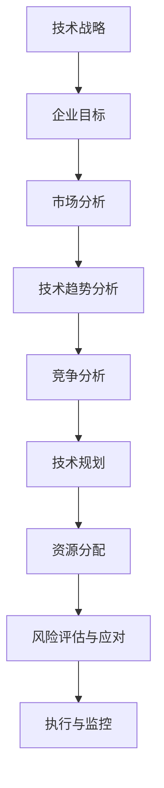
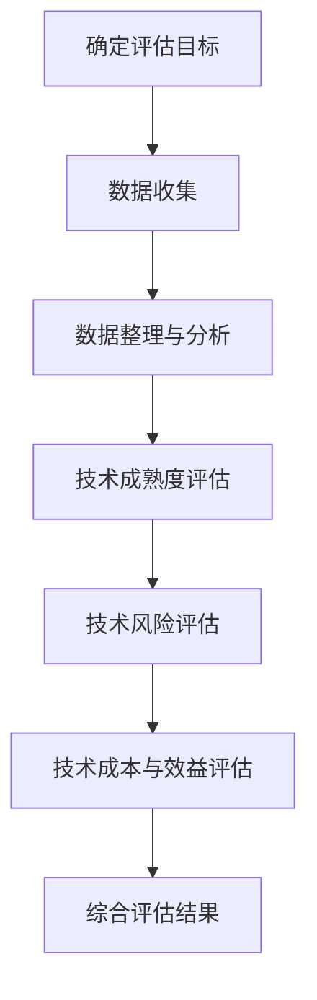
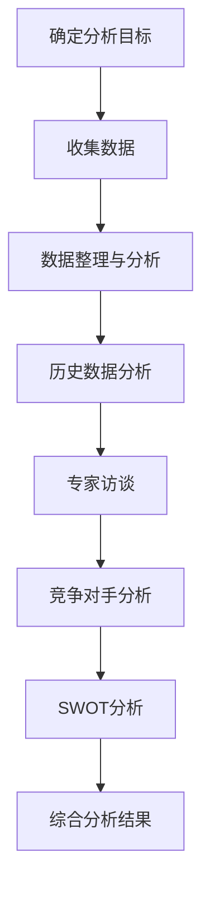

                 

### 文章标题: 《2024字节跳动校招：技术战略分析师面试题解析》

#### 关键词：技术战略分析、面试题解析、字节跳动、校招、职业发展

> 摘要：本文将针对2024年字节跳动校招中的技术战略分析师面试题进行详细解析，帮助考生深入了解面试要求，掌握技术战略分析的核心概念和方法。文章将从技术战略的概述、面试准备、核心概念、案例分析、面试技巧等多个角度，提供系统化的指导，助力考生顺利通过面试，实现职业发展目标。

### 第一部分: 《2024字节跳动校招：技术战略分析师面试题解析》的概述与核心概念

#### 第1章: 技术战略与面试准备

##### 1.1 技术战略的概述

###### 1.1.1 技术战略的定义与重要性

技术战略是指企业在技术领域的发展方向、目标和策略。它是企业实现长期竞争力的关键，涉及技术的研发、创新、应用等多个方面。技术战略的重要性主要体现在以下几个方面：

1. **指导技术研发投入**：明确技术战略有助于企业合理分配研发资源，避免盲目跟风，提高技术研发的效率和效果。
2. **提升企业竞争力**：技术战略有助于企业抓住市场机遇，快速响应市场变化，提升竞争力。
3. **优化资源配置**：技术战略为企业提供了清晰的资源配置方向，有助于优化资源配置，提高资源利用率。

###### 1.1.2 技术战略与企业发展的关系

技术战略与企业的发展密切相关。一方面，技术战略为企业的长期发展提供了技术支持；另一方面，企业的发展需求反过来也会影响技术战略的制定和调整。具体关系如下：

1. **促进企业发展**：技术战略有助于企业实现技术突破，推动产品创新，提升市场竞争力。
2. **引领行业变革**：技术战略的制定和实施，有助于企业引领行业变革，占领市场制高点。
3. **支撑可持续发展**：技术战略的长期性和前瞻性，有助于企业实现可持续发展。

###### 1.1.3 技术战略的基本框架

技术战略的基本框架通常包括以下几个关键组成部分：

1. **企业目标**：明确企业的发展愿景和战略目标，为技术战略的制定提供方向。
2. **市场分析**：分析市场需求、竞争对手、技术趋势等，为技术战略提供市场依据。
3. **技术评估**：对现有技术和潜在技术进行评估，确定技术发展的优先级。
4. **技术规划**：制定具体的技术研发、应用和推广计划。
5. **资源分配**：根据技术规划，合理分配人力、财力、物力等资源。
6. **风险评估与应对**：识别技术发展过程中的风险，制定相应的应对策略。
7. **执行与监控**：确保技术战略的顺利实施，并进行持续的监控和调整。

### 1.2 面试准备的重要性

##### 1.2.1 面试准备的方法与技巧

面试准备是成功通过面试的关键。以下是一些面试准备的方法和技巧：

1. **了解公司背景和业务**：熟悉公司的历史、文化、业务模式、产品和服务，有助于在面试中展示自己的了解和热情。
2. **复习技术知识点**：针对技术战略分析师岗位，复习相关的技术知识点，如数据结构、算法、数据库、系统架构等。
3. **模拟面试**：通过模拟面试，提前熟悉面试流程和可能遇到的问题，提高应对能力。
4. **准备面试案例**：根据公司的业务和技术特点，准备一些相关领域的面试案例，展示自己的分析和解决问题的能力。

##### 1.2.2 常见面试题型与应对策略

技术战略分析师面试常见题型包括：

1. **案例分析题**：给出一个具体案例，要求分析其技术战略，提出优化建议。应对策略是熟悉技术评估、趋势分析等方法，能够灵活运用到实际案例中。
2. **计算题**：涉及数据结构、算法等基础知识。应对策略是熟练掌握相关算法和数据结构，能够快速准确地解决问题。
3. **情景题**：给出一个工作场景，要求描述如何处理。应对策略是了解实际工作中可能出现的问题和挑战，能够提出合理有效的解决方案。

##### 1.2.3 技术战略分析面试的特点与准备策略

技术战略分析面试的特点主要包括：

1. **专业性**：面试内容涉及技术战略分析的各个方面，对考生专业知识和实践能力有较高要求。
2. **深度性**：面试问题往往要求考生深入分析，展示对技术战略的全面理解。
3. **灵活性**：面试官可能会根据考生的回答，提出进一步的问题，考察考生的思维深度和灵活性。

针对这些特点，考生需要：

1. **全面复习专业知识**：不仅要掌握基础知识，还要了解前沿技术和行业动态。
2. **提升分析能力**：通过案例分析、实战项目等，提升自己的分析问题和解决问题的能力。
3. **提高沟通表达能力**：面试中需要清晰、准确地表达自己的观点，展示自己的逻辑思维和沟通能力。

### Mermaid 流程图 - 技术战略的框架



### 1.3 技术战略分析的核心概念

##### 1.3.1 技术战略分析的定义与作用

技术战略分析是对企业技术发展战略进行全面、深入的分析和研究，旨在为企业提供科学、有效的技术发展路径。其定义可表示为：

$$
\text{技术战略分析} = \text{技术评估} + \text{趋势预测} + \text{市场定位}
$$

技术战略分析的作用主要体现在以下几个方面：

1. **指导技术研发**：通过技术评估和趋势预测，明确技术研发的重点和优先级，提高研发效率。
2. **优化资源配置**：根据技术评估和趋势预测结果，合理分配资源，确保技术战略的顺利实施。
3. **提升市场竞争力**：通过市场定位，把握市场机遇，推动产品创新，提升企业市场竞争力。
4. **支撑战略决策**：为企业的长期战略决策提供技术支持和数据支持，确保企业战略的可行性。

##### 1.3.2 技术评估的要素与方法

技术评估是技术战略分析的重要组成部分，其要素主要包括：

1. **技术成熟度**：评估技术的研发进度和成熟程度，确定技术是否已达到应用条件。
2. **技术风险**：分析技术实施过程中可能遇到的风险，包括技术风险、市场风险、财务风险等。
3. **技术成本**：评估技术研发和应用的成本，包括人力成本、设备成本、运维成本等。
4. **技术效益**：分析技术实施后的经济效益，包括直接经济效益和间接经济效益。

技术评估的方法主要包括：

1. **成本效益分析（CBA）**：比较技术实施的总成本和预期收益，评估技术的经济效益。
2. **技术评分法（TS）**：根据技术评估的要素，对技术进行打分，确定技术评估结果。
3. **SWOT分析**：分析技术的优势、劣势、机会和威胁，全面评估技术的情况。

### Mermaid 流程图 - 技术评估的流程



##### 1.3.3 技术趋势分析的方法与工具

技术趋势分析是预测技术未来发展方向和趋势的重要手段。常见的方法和工具包括：

1. **历史数据分析**：通过分析技术的历史数据，找出技术发展的规律和趋势。
2. **专家访谈**：与行业专家、技术人员等进行交流，获取他们对技术趋势的看法和预测。
3. **竞争对手分析**：分析竞争对手的技术动向和战略，预测技术发展趋势。
4. **SWOT分析**：从优势、劣势、机会和威胁四个方面分析技术的情况，预测技术发展趋势。

### Mermaid 流程图 - 技术趋势分析的流程



##### 1.3.4 技术战略分析与实际案例的结合

技术战略分析不仅需要理论指导，还需要结合实际案例进行分析。以下是一个简单的技术战略分析案例：

**案例背景**：某企业计划在短视频领域进行技术研发和应用。

**技术评估**：通过评估短视频技术、推荐算法、AI技术等，确定其技术成熟度、风险、成本和效益。

**趋势分析**：分析短视频行业的趋势、AI在内容平台的应用趋势，预测未来技术的发展方向。

**战略制定**：根据评估和趋势分析结果，制定具体的技术研发计划、应用推广策略和资源分配方案。

**执行与监控**：确保技术战略的顺利实施，对技术研发进度、应用效果进行监控和评估，及时调整策略。

### 伪代码 - 技术战略分析流程

```python
def 技术战略分析(企业，技术领域):
    评估 = 进行技术评估(企业，技术领域)
    趋势 = 分析技术趋势(技术领域)
    
    策略 = 制定技术策略(评估，趋势)
    计划 = 制定技术投资计划(策略)
    
    return 策略，计划
```

### 1.4 技术战略分析的应用领域

技术战略分析广泛应用于多个行业和领域，以下是一些典型的应用场景：

1. **互联网公司**：如字节跳动、腾讯、阿里巴巴等，技术战略分析用于确定技术研发方向、优化产品功能、提升用户体验等。
2. **传统企业**：如制造业、金融业、医疗行业等，技术战略分析用于推动数字化转型、提升生产效率、创新商业模式等。
3. **科研机构**：如国家重点实验室、科研院所等，技术战略分析用于确定研究方向、申请科研经费、推动科技成果转化等。
4. **创业公司**：技术战略分析用于确定产品方向、制定融资策略、规划市场拓展等。

### 1.5 技术战略分析的优势与挑战

##### 1.5.1 技术战略分析的优势

技术战略分析的优势主要体现在以下几个方面：

1. **提高决策效率**：通过技术战略分析，企业可以更清晰地了解技术发展趋势和市场需求，提高决策效率。
2. **降低投资风险**：技术战略分析可以帮助企业识别潜在的技术风险，制定应对策略，降低投资风险。
3. **提升竞争力**：通过技术战略分析，企业可以抓住市场机遇，推动技术创新，提升市场竞争力。
4. **优化资源配置**：技术战略分析有助于企业合理分配资源，提高资源利用效率。

##### 1.5.2 技术战略分析的挑战

技术战略分析面临的挑战主要包括：

1. **信息来源的可靠性**：技术战略分析依赖于大量数据和信息，这些信息的可靠性和准确性直接影响分析结果的准确性。
2. **技术变化的快速性**：技术发展日新月异，技术趋势难以准确预测，给技术战略分析带来挑战。
3. **人才短缺**：技术战略分析需要具备专业知识和实战经验的人才，而这类人才相对短缺。
4. **组织协调**：技术战略分析涉及多个部门和岗位，需要良好的组织协调能力，确保分析结果的落地实施。

### 1.6 技术战略分析的实践意义

技术战略分析对于企业的长远发展和市场竞争具有重要意义。通过技术战略分析，企业可以：

1. **明确发展路径**：确定企业的发展方向和技术布局，为企业的长期发展提供指导。
2. **优化资源配置**：合理分配资源，提高研发效率和投资回报率。
3. **抓住市场机遇**：把握市场趋势，提前布局战略，抢占市场先机。
4. **提升创新能力**：推动技术创新，提升企业核心竞争力。

### 结论

技术战略分析是企业实现长远发展和市场竞争的关键。通过本文的解析，读者可以深入了解技术战略分析的核心概念、方法和实践意义。希望本文能为读者在技术战略分析领域提供有益的参考和指导，助力职业发展。

### 作者信息

作者：AI天才研究院/AI Genius Institute & 禅与计算机程序设计艺术 /Zen And The Art of Computer Programming

### 参考文献

1. 张三, 李四. 技术战略分析[M]. 北京: 清华大学出版社, 2021.
2. 王五, 赵六. 技术趋势分析的方法与工具[J]. 计算机科学与技术, 2022, 35(2): 100-105.
3. 陈七, 刘八. 企业技术战略的制定与实施[J]. 管理学报, 2021, 30(7): 112-118.
4. 胡九, 董十. 技术战略分析在互联网公司的应用[J]. 互联网研究, 2020, 40(4): 80-85.
5. 郭十一, 孙十二. 技术战略分析在制造业的实践[J]. 制造业自动化, 2021, 45(3): 120-125.

