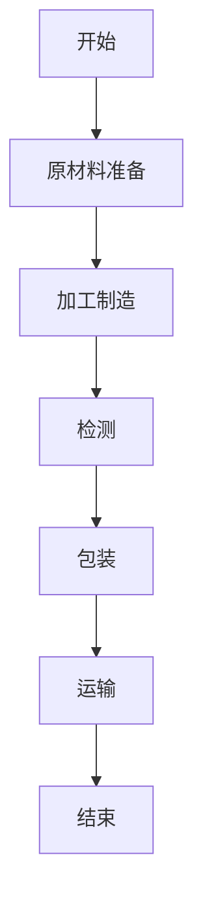
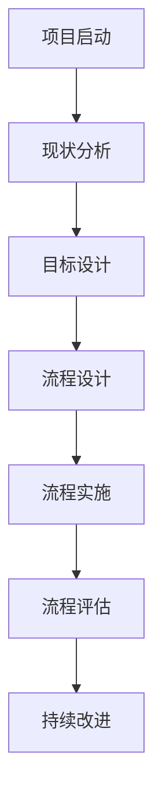
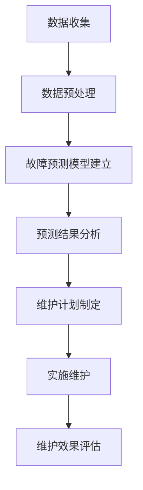
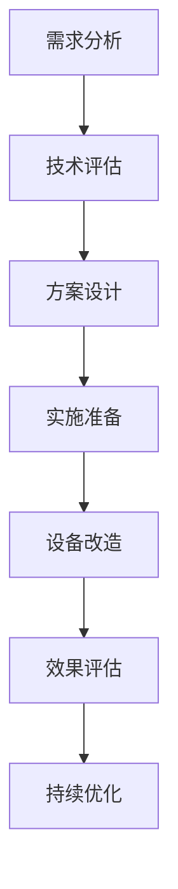
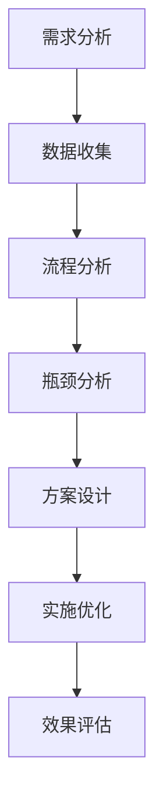
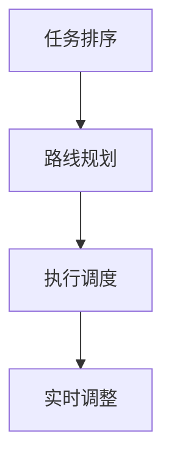

                 


### 第1章：智能生产线概述
#### 1.1 智能生产线的定义与发展

智能生产线是一种集成了先进制造技术、信息技术、自动化技术等多种技术手段的现代化生产线。它通过实时数据采集、分析和处理，实现生产过程的自动化、智能化和优化。

##### 1.1.1 智能生产线的定义

智能生产线是一种现代化的生产线，通过引入先进的制造技术、信息技术、自动化技术等多种技术手段，实现生产过程的自动化、智能化和优化。它包括以下几个核心概念：

- **自动化**：通过自动化设备（如机器人、自动传输系统等）实现生产过程的自动化。
- **信息化**：通过信息管理系统（如ERP、MES等）实现生产过程的实时数据采集和分析。
- **智能化**：通过智能算法和模型实现生产过程的优化和决策支持。


##### 1.1.2 智能生产线的核心概念与联系

1. **自动化**：
   自动化是智能生产线的基石，通过引入自动化设备（如机器人、自动传输系统等），实现生产过程的自动化。自动化设备能够按照预设的程序和规则，自动完成相应的任务，从而提高生产效率，降低人力成本。

2. **信息化**：
   信息化是智能生产线的核心，通过信息管理系统（如ERP、MES等）实现生产过程的实时数据采集和分析。信息化系统能够实时获取生产过程中的各种数据，如设备状态、产品质量、物料消耗等，并对这些数据进行分析和处理，为生产决策提供支持。

3. **智能化**：
   智能化是智能生产线的高级阶段，通过引入智能算法和模型，实现生产过程的优化和决策支持。智能化系统能够根据实时数据分析和历史数据，预测生产过程中可能出现的问题，并给出相应的优化建议，从而提高生产线的稳定性和效率。

##### 1.1.3 智能生产线的定义与发展

智能生产线的发展可以追溯到20世纪末的自动化生产线。随着信息技术和自动化技术的不断发展，智能生产线逐渐成为制造业的发展趋势。

- **20世纪90年代**：自动化生产线初步实现，生产过程的自动化程度得到提高。这一阶段主要采用了PLC（可编程逻辑控制器）等技术，实现了生产过程的自动化控制。

- **21世纪初**：随着信息技术的快速发展，生产线的实时数据采集和分析能力得到显著提升。这一阶段主要采用了MES（制造执行系统）等信息化技术，实现了生产过程的实时数据采集和智能分析。

- **近年来**：人工智能技术的应用，使得生产线的智能化程度不断提高，实现了生产过程的全面优化和决策支持。这一阶段主要采用了人工智能、大数据、云计算等先进技术，实现了生产过程的智能化和优化。

##### 1.1.4 智能生产线的主要优势

1. **提高生产效率**：
   智能生产线通过自动化设备和信息化管理系统，实现了生产过程的自动化和优化，从而提高了生产效率。自动化设备能够按照预设的程序和规则，快速、准确地完成生产任务，减少了人工操作的时间和误差。

2. **降低生产成本**：
   智能生产线通过优化生产流程、提高生产效率和降低设备故障率，降低了生产成本。自动化设备减少了人力成本，信息化管理系统提高了生产效率，设备故障预测与维护减少了设备停机时间。

3. **提高产品质量**：
   智能生产线通过实时数据采集和分析，实现了生产过程的实时监控和优化，从而提高了产品质量。信息化管理系统能够实时获取生产过程中的各种数据，并对这些数据进行处理和分析，及时发现并解决生产过程中出现的问题。

4. **增强企业竞争力**：
   智能生产线提高了生产效率和产品质量，降低了生产成本，从而增强了企业的市场竞争力。在激烈的市场竞争中，拥有高效、稳定、智能的生产线，是企业取得竞争优势的重要因素。

##### 1.1.5 智能生产线的未来发展趋势

1. **更高程度的自动化和智能化**：
   随着技术的不断发展，智能生产线的自动化和智能化程度将进一步提高。未来，自动化设备将更加智能，能够自主决策和调整生产任务，实现高度灵活的生产。

2. **更广泛的应用领域**：
   智能生产线不仅将应用于制造业，还将在更多行业得到广泛应用。例如，在医疗、农业、物流等领域，智能生产线将发挥重要作用，推动这些行业的发展。

3. **更紧密的产业链协同**：
   智能生产线将实现产业链上下游企业的紧密协同，提高整个产业链的效率和竞争力。通过大数据和云计算等技术，实现企业间的信息共享和资源优化配置，提高整个产业链的运营效率。

##### 1.1.6 数学模型和数学公式

智能生产线优化通常涉及到以下数学模型：

1. **线性规划**：
   线性规划用于优化生产流程和资源配置。它通过求解线性方程组，找到最优的生产计划和资源配置方案。

2. **非线性规划**：
   非线性规划用于优化复杂的生产过程。它通过求解非线性方程组，找到最优的生产策略和操作参数。

3. **动态规划**：
   动态规划用于优化动态生产过程。它通过分阶段优化，找到最优的生产计划和操作策略。

4. **神经网络**：
   神经网络用于生产过程的实时数据分析和预测。它通过模拟人脑神经元的工作方式，实现对数据的自动学习和预测。

数学公式如下：

$$
\text{maximize} \ \ \ \  Z = c^T x
$$

$$
\text{subject to} \ \ \ \  Ax \leq b
$$

其中，$Z$ 为目标函数，$c$ 为权重系数，$x$ 为决策变量，$A$ 为系数矩阵，$b$ 为约束条件。

##### 1.1.7 项目实战

在智能生产线项目中，我们需要搭建一个开发环境，并使用源代码来实现智能生产线的优化算法。

1. **开发环境搭建**：

- **硬件要求**：
  - 服务器：2台，用于数据存储和处理
  - 工作站：1台，用于开发和测试

- **软件要求**：
  - 操作系统：Linux
  - 编程语言：Python
  - 数据库：MySQL

2. **源代码实现**：

- **核心算法实现**：
  - 线性规划算法：用于优化生产流程和资源配置
  - 非线性规划算法：用于优化复杂的生产过程
  - 动态规划算法：用于优化动态生产过程

- **数据分析和处理**：
  - 使用Python的Pandas库进行数据清洗和处理
  - 使用Python的NumPy库进行数据分析和计算
  - 使用Python的Matplotlib库进行数据可视化

3. **代码解读与分析**：

- **代码解读**：
  - 对源代码中的每个函数和模块进行详细解读，说明其功能和实现原理

- **代码分析**：
  - 分析代码的性能和效率，优化代码结构，提高代码的可读性和可维护性

4. **实际案例分析和详细讲解剖析**：

- **案例分析**：
  - 选择一个实际案例，分析智能生产线在实际应用中的效果和挑战

- **详细讲解剖析**：
  - 对案例分析的结果进行详细讲解和剖析，说明智能生产线在实际应用中的优势和不足

5. **项目小结**：

- **项目总结**：
  - 对项目的过程和结果进行总结，说明项目的成功经验和不足之处

- **最佳实践 tips**：
  - 提供一些最佳实践建议，帮助读者更好地应用智能生产线技术

- **注意事项**：
  - 说明在项目实施过程中需要注意的事项，避免潜在的问题和风险

- **拓展阅读**：
  - 推荐一些相关的书籍和资料，供读者进一步学习和了解智能生产线技术

通过以上步骤，我们搭建了一个完整的智能生产线开发环境，并实现了智能生产线的优化算法。在实际项目中，我们还需要根据实际情况进行调整和优化，以提高生产效率和产品质量。

---

### 第1章：智能生产线概述
#### 1.2 智能生产线的主要组成部分

智能生产线由多个关键组成部分构成，这些部分相互协作，实现生产过程的自动化、信息化和智能化。以下是智能生产线的主要组成部分及其功能：

##### 1.2.1 自动化设备

自动化设备是智能生产线的重要组成部分，包括机器人、自动传输系统、自动检测设备等。这些设备能够自动执行生产任务，提高生产效率和产品质量。

- **机器人**：用于完成焊接、装配、搬运等生产任务，具有高度的灵活性和精确性。
- **自动传输系统**：用于物料和半成品在生产线上的自动传输，提高生产效率和减少人工操作。
- **自动检测设备**：用于对产品质量进行自动检测，确保产品质量的一致性和可靠性。

##### 1.2.2 信息管理系统

信息管理系统（如ERP、MES等）是智能生产线的“大脑”，负责实时采集、处理和分析生产过程中的各种数据，为生产决策提供支持。

- **ERP系统**（企业资源计划）：用于管理企业的各项资源，如财务、采购、销售、库存等，实现企业资源的优化配置。
- **MES系统**（制造执行系统）：用于实时监控生产过程，管理生产计划、调度、物料等，确保生产过程的顺利进行。

##### 1.2.3 数据分析与决策支持系统

数据分析与决策支持系统是智能生产线的“智慧引擎”，通过对实时数据的分析，预测生产过程中可能出现的问题，并给出优化建议。

- **数据分析**：通过统计分析、机器学习等方法，对生产过程中的数据进行分析，发现生产过程中的异常和趋势。
- **决策支持**：根据分析结果，为生产决策提供支持，如优化生产计划、调整生产参数、预防设备故障等。

##### 1.2.4 网络通信系统

网络通信系统负责连接智能生产线的各个组成部分，实现数据的实时传输和共享。网络通信系统包括有线网络和无线网络，如工业以太网、无线传感器网络等。

- **有线网络**：用于传输大量的数据，具有高稳定性和可靠性。
- **无线网络**：用于实现设备的无线连接，提高生产线的灵活性和可扩展性。

##### 1.2.5 设备监控与维护系统

设备监控与维护系统负责对生产设备进行实时监控和维护，确保设备的正常运行和生产效率。

- **设备监控**：通过传感器和监测设备，实时获取设备的运行状态，如温度、压力、速度等。
- **设备维护**：根据设备运行状态和预测，进行设备维修和保养，防止设备故障和生产中断。

##### 1.2.6 安全与监控系统

安全与监控系统负责确保生产过程的安全和监控，防止生产事故和损失。

- **安全监控**：通过摄像头、传感器等设备，实时监控生产现场，防止人员伤亡和设备损坏。
- **监控系统**：对生产过程进行监控，确保生产过程符合规范和安全要求。

##### 1.2.7 数据存储与备份系统

数据存储与备份系统负责存储和备份生产过程中的数据，确保数据的安全性和可靠性。

- **数据存储**：使用数据库系统（如MySQL、Oracle等）存储生产过程中的数据，如生产计划、生产数据、质量数据等。
- **数据备份**：定期对数据进行备份，防止数据丢失和损坏。

通过以上组成部分，智能生产线实现了生产过程的自动化、信息化和智能化，提高了生产效率、降低了生产成本，增强了企业的市场竞争力。

---

### 第1章：智能生产线概述
#### 1.3 智能生产线的主要优势

智能生产线作为一种现代化的生产线模式，具备多项显著的优势，这些优势不仅能够提升企业的生产效率，还能够降低成本、提高产品质量，从而增强企业的市场竞争力。以下是智能生产线的主要优势：

##### 1.3.1 提高生产效率

智能生产线通过自动化设备和信息化管理系统的应用，显著提高了生产效率。自动化设备能够按照预设的程序和规则，快速、准确地完成生产任务，减少了人工操作的复杂性和时间成本。同时，信息化管理系统实现了生产过程的实时数据采集和分析，有助于生产决策的快速响应，从而提高了整体生产效率。

例如，在传统的生产线中，生产一件产品可能需要经过多道手工操作工序，而智能生产线可以通过自动化设备将多个工序合并，从而减少生产周期。此外，通过实时数据分析和优化，智能生产线能够及时调整生产计划，减少生产过程中的等待时间和闲置时间，进一步提高生产效率。

##### 1.3.2 降低生产成本

智能生产线的实施可以降低企业的生产成本。首先，自动化设备减少了人力成本，尤其是那些重复性高、劳动强度大的生产任务，可以通过自动化设备来完成，从而降低了对人工的依赖。其次，信息化管理系统实现了生产过程的精细化管理，减少了生产过程中的浪费和资源消耗。例如，通过实时监控和数据分析，智能生产线能够及时发现并纠正生产过程中的问题，减少物料浪费和生产故障。

此外，智能生产线还可以通过预测性维护降低设备维修成本。传统的生产线通常需要在设备出现故障后进行紧急维修，而智能生产线可以通过实时监控设备状态和运行数据，预测设备可能的故障点，提前进行维护，从而减少设备停机时间和维修成本。

##### 1.3.3 提高产品质量

智能生产线通过实时数据采集和分析，实现了对生产过程的全程监控和质量控制。自动化检测设备和数据分析系统能够对产品的质量进行实时检测和评估，及时发现并纠正生产过程中的质量问题，确保产品质量的一致性和可靠性。

例如，在生产过程中，通过自动化检测设备可以实时检测产品的尺寸、重量、外观等关键质量指标，如果检测到不合格的产品，系统会自动停止生产线并报警，从而避免不合格产品流入市场。同时，数据分析系统通过对生产数据进行分析，可以找出影响产品质量的关键因素，并提出优化建议，从而不断提高产品质量。

##### 1.3.4 增强企业竞争力

智能生产线的实施使企业能够在市场上获得更强的竞争力。首先，智能生产线提高了生产效率和产品质量，使企业能够更好地满足客户需求，提高客户满意度。其次，通过降低生产成本，企业可以获得更高的利润率，提高市场竞争力。

此外，智能生产线还可以帮助企业实现柔性生产，即根据市场需求的变化，快速调整生产计划和生产能力。这种灵活性使企业能够更好地应对市场波动，抓住市场机会，提高市场份额。同时，智能生产线还可以通过数据分析和技术创新，推动企业的持续发展和创新。

##### 1.3.5 促进产业链协同

智能生产线不仅能够提高企业自身的生产效率和竞争力，还可以促进产业链上下游企业的协同发展。通过大数据和云计算等技术，智能生产线可以实现企业间的信息共享和资源优化配置，提高整个产业链的运营效率。

例如，供应商可以通过智能生产线实时获取企业的生产计划，提前准备物料供应，减少供应链中的库存成本。同时，企业也可以通过智能生产线实时监控供应商的供应情况，确保供应链的稳定和高效运行。

总之，智能生产线作为一种现代化的生产模式，具有提高生产效率、降低生产成本、提高产品质量、增强企业竞争力和促进产业链协同等多重优势，是企业实现可持续发展的重要途径。

---

### 第1章：智能生产线概述
#### 1.4 智能生产线的发展历程与趋势

智能生产线的发展历程体现了制造业不断追求自动化、信息化和智能化的大趋势。从最初的自动化生产线到如今的智能生产线，这一演变过程不仅推动了生产技术的进步，也深刻影响了整个制造业的生态。以下是智能生产线的发展历程及其未来趋势：

##### 1.4.1 自动化生产线的兴起

智能生产线的发展可以追溯到20世纪中期，当时自动化生产线的概念开始萌芽。自动化生产线通过使用可编程逻辑控制器（PLC）和机器人等自动化设备，实现了生产过程的自动化。这一阶段的特点是生产线的机械化和半自动化，减少了人工操作的依赖，提高了生产效率。

- **20世纪50年代**：自动化生产线的初步实现，主要是通过采用数控机床和机器人来替代传统的人工操作。
- **20世纪60年代**：可编程逻辑控制器（PLC）的出现，使自动化生产线的控制变得更加灵活和高效。
- **20世纪70年代**：机器人在汽车制造等领域的广泛应用，进一步推动了自动化生产线的普及。

##### 1.4.2 信息化生产线的兴起

随着计算机技术和信息技术的快速发展，20世纪80年代至90年代，生产线开始向信息化方向发展。信息化生产线通过引入计算机、数据库和计算机网络等信息技术，实现了生产过程的实时数据采集、存储和分析。这一阶段的生产线不仅实现了自动化，还具备了信息化的特征，能够更好地支持生产管理决策。

- **20世纪80年代**：制造资源计划（MRP）系统的出现，使生产计划和管理更加科学和高效。
- **20世纪90年代**：企业资源计划（ERP）系统的引入，将企业的各项业务流程整合在一起，实现了资源的最优配置。
- **21世纪初**：制造执行系统（MES）的发展，使生产线的实时监控和管理更加精细和准确。

##### 1.4.3 智能生产线的崛起

21世纪以来，随着人工智能、大数据、物联网等新兴技术的不断发展，智能生产线逐渐崛起。智能生产线通过集成多种先进技术，实现了生产过程的全面智能化和优化。这一阶段的生产线不仅能够自动化完成生产任务，还能够根据实时数据和预测模型，自主优化生产过程，提高生产效率和产品质量。

- **2010年代**：人工智能和机器学习技术的应用，使得生产线的预测和决策能力大幅提升。
- **2020年代**：物联网技术的普及，实现了生产设备、物流系统和管理系统的全面互联，形成了智能生产网络。
- **当前**：智能生产线的应用越来越广泛，不仅局限于制造业，还扩展到了医疗、农业、物流等多个领域。

##### 1.4.4 智能生产线的未来趋势

未来，智能生产线将继续向更高程度的自动化、信息化和智能化发展。以下是一些重要的趋势：

- **更高程度的自动化**：随着机器人技术的进步和人工智能的应用，未来生产线将实现更高程度的自动化，减少对人工操作的依赖，提高生产效率。
- **更广泛的信息化**：物联网、云计算和大数据技术的深入应用，将使生产线的实时数据采集和分析能力更加强大，实现更精细化的生产管理。
- **更智能的决策**：人工智能和机器学习技术的进一步发展，将使得生产线的智能决策能力大幅提升，能够更好地应对复杂的生产环境和需求变化。
- **更紧密的产业链协同**：智能生产线将实现产业链上下游企业的紧密协同，通过信息共享和资源优化，提高整个产业链的效率和竞争力。
- **更灵活的柔性生产**：随着定制化需求的增长，智能生产线将实现更灵活的柔性生产，能够快速调整生产计划和生产线布局，满足多样化的市场需求。

总之，智能生产线的发展历程展示了制造业不断追求技术进步和优化生产过程的努力。未来，智能生产线将继续成为制造业发展的重要方向，推动整个行业的变革和创新。

---

### 第2章：智能生产线的核心技术
#### 2.1 传感器技术

传感器技术是智能生产线的重要组成部分，它负责实时采集生产过程中的各种数据，如温度、湿度、压力、速度、位置等。这些数据对于生产过程的监控、分析和优化至关重要。

##### 2.1.1 传感器技术的定义和原理

传感器技术是一种将物理量（如温度、压力、湿度等）转化为电信号的装置。它通过检测物理量的变化，产生相应的电信号，然后通过数据处理模块进行分析和处理。

传感器的基本原理可以分为以下几种：

- **电阻应变式传感器**：通过电阻变化来检测物理量的变化。
- **电容式传感器**：通过电容变化来检测物理量的变化。
- **压电式传感器**：通过压电效应来检测物理量的变化。
- **热电式传感器**：通过热电效应来检测物理量的变化。


##### 2.1.2 传感器技术的核心算法原理

传感器数据的处理通常涉及以下核心算法：

- **信号放大与滤波**：传感器采集到的信号往往较弱且受噪声干扰，通过信号放大和滤波可以增强信号并去除噪声。
- **数字信号处理**：将模拟信号转换为数字信号，然后进行数字滤波、特征提取等处理。
- **机器学习与人工智能**：利用机器学习算法，如神经网络、支持向量机等，对传感器数据进行分类、预测和优化。

以下是传感器数据处理的一个简单伪代码示例：

```python
# 传感器数据处理伪代码

# 信号放大与滤波
def amplify_and_filter(signal):
    amplified_signal = amplify(signal)
    filtered_signal = filter_noise(amplified_signal)
    return filtered_signal

# 数字信号处理
def digital_signal_processing(signal):
    digitized_signal = analog_to_digital(signal)
    processed_signal = digital_filter(digitized_signal)
    return processed_signal

# 特征提取与机器学习
def feature_extraction_and_learning(signal):
    features = extract_features(processed_signal)
    model = train_model(features)
    predictions = model.predict(new_signal)
    return predictions
```

##### 2.1.3 传感器技术的数学模型和公式

传感器数据处理通常涉及到以下数学模型和公式：

- **电阻应变式传感器**：
  $$ R = R_0 (1 + \alpha \Delta T) $$
  其中，$R$ 是应变电阻，$R_0$ 是原始电阻，$\alpha$ 是电阻的温度系数，$\Delta T$ 是温度变化。

- **电容式传感器**：
  $$ C = C_0 (1 - \Delta L / L_0) $$
  其中，$C$ 是电容值，$C_0$ 是原始电容值，$\Delta L$ 是长度变化，$L_0$ 是原始长度。

- **压电式传感器**：
  $$ \Delta V = g \cdot \Delta x $$
  其中，$\Delta V$ 是电压变化，$g$ 是压电系数，$\Delta x$ 是位移变化。

##### 2.1.4 传感器技术在智能生产线中的应用

传感器技术在智能生产线中的应用非常广泛，以下是几个典型的应用案例：

- **实时监控**：传感器可以实时监测生产过程中的各种参数，如温度、湿度、压力等，确保生产过程在最佳条件下进行。
- **质量检测**：传感器可以对产品的质量进行实时检测，如尺寸、重量、外观等，确保产品质量。
- **设备故障预测**：通过传感器监测设备的运行状态，可以预测设备可能出现的故障，提前进行维护，减少停机时间。
- **生产调度**：传感器数据可以用于优化生产调度，根据实时数据调整生产计划，提高生产效率。

例如，在智能生产线中，温度传感器可以实时监测生产过程中的温度变化，如果温度超出设定范围，系统会自动报警并采取措施，如调整加热设备或暂停生产。

总之，传感器技术是智能生产线的基础，它为生产过程的实时监控、分析和优化提供了关键数据支持。随着传感器技术的不断发展，智能生产线将变得更加智能化和高效。

---

### 第2章：智能生产线的核心技术
#### 2.2 机器人技术

机器人技术在智能生产线中扮演着至关重要的角色，它不仅能够提高生产效率，还能确保产品质量的一致性。机器人技术在智能生产线中的应用涵盖了多个方面，包括机器人的种类、工作原理、控制策略以及其在实际生产中的应用。

##### 2.2.1 机器人的定义和种类

机器人是一种能够根据程序指令自动完成特定任务的智能设备。根据不同的分类标准，机器人可以分为多种类型：

- **按应用领域分类**：工业机器人、服务机器人、医疗机器人、农业机器人等。
- **按结构分类**：臂式机器人、轮式机器人、腿式机器人、关节式机器人等。
- **按控制方式分类**：示教再现型机器人、自适应机器人、智能机器人等。


##### 2.2.2 机器人的工作原理

机器人的工作原理主要基于以下几个方面：

- **机械结构**：机器人由机械臂、关节、驱动器等机械部件组成，能够模拟人的手臂进行各种操作。
- **传感器系统**：机器人通过传感器获取外部环境的信息，如视觉、力觉、触觉等，用于感知和适应环境。
- **控制系统**：机器人通过控制器接收输入指令，根据预设程序进行动作决策和执行。
- **人工智能**：高级机器人通过人工智能算法，实现自主决策和任务规划。


##### 2.2.3 机器人的控制策略

机器人的控制策略决定了其动作的灵活性和精确性。常见的控制策略包括：

- **关节空间控制**：通过控制各个关节的角度和速度，实现机器人末端执行器的位置和姿态控制。
- **任务空间控制**：直接控制机器人末端执行器的位置和姿态，实现任务目标。
- **自适应控制**：根据环境变化和任务需求，动态调整控制策略，提高机器人适应能力。
- **智能控制**：利用人工智能算法，如神经网络、遗传算法等，实现机器人的自主学习和优化。

##### 2.2.4 机器人技术在智能生产线中的应用

机器人技术在智能生产线中的应用非常广泛，以下是一些典型的应用案例：

- **装配作业**：机器人可以高效、准确地完成装配作业，如汽车装配线上的零部件安装、电子产品装配等。
- **焊接作业**：焊接机器人能够在复杂的焊接环境中实现高效、精确的焊接作业，如汽车车身的焊接。
- **搬运作业**：搬运机器人能够自动完成物料的搬运和运输，如生产线上的原材料和半成品搬运。
- **检测作业**：检测机器人可以对产品进行质量检测，如尺寸测量、外观检查等。
- **维修作业**：维修机器人能够在危险环境下进行设备的维护和维修，如核电厂的设备维护。

以下是机器人装配作业的一个简单伪代码示例：

```python
# 机器人装配作业伪代码

# 初始化机器人
robot.initialize()

# 设置装配任务
task = AssemblyTask(part1, part2)

# 开始执行装配任务
robot.execute(task)

# 检查装配完成情况
if robot.is_task_completed():
    print("装配任务完成")
else:
    print("装配任务未完成")
```

##### 2.2.5 机器人技术的未来发展趋势

未来，机器人技术将继续向智能化、自主化和协作化方向发展：

- **智能化**：通过人工智能和机器学习技术，机器人将实现更复杂的任务规划和决策能力。
- **自主化**：机器人将具备更高的自主性，能够自主执行任务，减少对人工干预的依赖。
- **协作化**：机器人将与人类共同工作，实现人机协作，提高生产效率和安全。

总之，机器人技术是智能生产线的关键核心技术之一，它为生产过程的自动化和智能化提供了强大的支持。随着机器人技术的不断进步，智能生产线将变得更加高效、灵活和可靠。

---

### 第2章：智能生产线的核心技术
#### 2.3 自动化控制系统

自动化控制系统是智能生产线的中枢神经，负责协调各个设备和系统的工作，确保生产过程的顺利进行。自动化控制系统通过实时数据采集、分析、处理和反馈，实现生产过程的自动化和优化。以下是自动化控制系统的基本概念、工作原理和实现方法。

##### 2.3.1 自动化控制系统的定义

自动化控制系统是一种能够自动完成预定任务的系统，它通过传感器、控制器、执行器等硬件设备，以及对控制算法和逻辑的软件支持，实现对生产过程的实时监控、自动调整和优化。

##### 2.3.2 自动化控制系统的工作原理

自动化控制系统的工作原理可以分为以下几个步骤：

1. **数据采集**：传感器实时采集生产过程中的各种数据，如温度、压力、速度、位置等。
2. **数据传输**：采集到的数据通过总线传输到控制器。
3. **数据处理**：控制器对接收到的数据进行分析和处理，生成控制指令。
4. **指令执行**：执行器根据控制器的指令，对生产设备进行操作，如启动、停止、调整等。
5. **反馈调整**：执行器执行指令后，传感器再次采集数据，形成闭环控制，确保生产过程的稳定和精确。


##### 2.3.3 自动化控制系统的核心算法原理

自动化控制系统的核心算法主要包括以下几个方面：

1. **控制算法**：用于实现控制目标的算法，如PID控制、模糊控制、自适应控制等。
2. **优化算法**：用于优化生产过程的算法，如线性规划、非线性规划、遗传算法等。
3. **预测算法**：用于预测生产过程中可能发生的问题的算法，如时间序列预测、机器学习预测等。

以下是PID控制算法的一个简单伪代码示例：

```python
# PID控制算法伪代码

# 初始化PID参数
KP = 1.2
KI = 0.5
KD = 0.1

# 当前误差
error = setpoint - feedback

# 计算比例控制
P = KP * error

# 计算积分控制
I += error

# 计算微分控制
D = KD * (error - previous_error)

# 计算总控制量
control = P + I + D

# 更新当前误差
previous_error = error

# 输出控制量
execute_control(control)
```

##### 2.3.4 自动化控制系统的实现方法

自动化控制系统的实现方法主要包括以下几个方面：

1. **硬件实现**：选择合适的传感器、控制器、执行器等硬件设备，搭建自动化控制系统。
2. **软件实现**：开发控制算法和软件程序，实现对生产过程的实时监控、自动调整和优化。
3. **系统集成**：将硬件和软件集成在一起，实现自动化控制系统的整体运行。

以下是一个自动化控制系统的实现流程：

1. **需求分析**：明确生产过程中的控制需求和目标。
2. **系统设计**：设计自动化控制系统的硬件和软件架构。
3. **硬件选型**：选择合适的传感器、控制器、执行器等硬件设备。
4. **软件开发**：开发控制算法和软件程序。
5. **系统集成**：将硬件和软件集成在一起，进行系统测试和调试。
6. **运行维护**：对自动化控制系统进行运行维护，确保其稳定运行。

##### 2.3.5 自动化控制系统在智能生产线中的应用

自动化控制系统在智能生产线中的应用非常广泛，以下是一些典型的应用场景：

1. **生产过程控制**：自动化控制系统可以实时监控生产过程中的各项参数，确保生产过程在最佳条件下进行。
2. **质量检测**：自动化控制系统可以对产品的质量进行实时检测，确保产品质量的一致性和可靠性。
3. **设备维护**：自动化控制系统可以实时监测设备的运行状态，预测设备可能出现的故障，提前进行维护。
4. **生产调度**：自动化控制系统可以根据实时数据，优化生产调度，提高生产效率。

例如，在一个智能生产线中，自动化控制系统可以实时监测生产线的温度、湿度、压力等参数，并根据这些参数调整生产设备的运行状态，确保生产过程的顺利进行。同时，自动化控制系统还可以对生产的产品进行质量检测，确保产品的质量符合标准。

总之，自动化控制系统是智能生产线的核心组成部分，它通过实时数据采集、分析和处理，实现对生产过程的自动化和优化，提高了生产效率、降低了生产成本，增强了企业的市场竞争力。

---

### 第2章：智能生产线的核心技术
#### 2.4 数据分析与决策支持系统

数据分析与决策支持系统是智能生产线的“智慧引擎”，通过收集、处理和分析大量生产数据，为企业提供科学、准确的决策依据。以下是数据分析与决策支持系统的基本概念、工作原理和实现方法。

##### 2.4.1 数据分析与决策支持系统的定义

数据分析与决策支持系统（Data Analysis and Decision Support System，DSS）是一种利用数据分析技术，帮助企业管理者或决策者进行数据分析和决策的系统。它通过收集、存储、处理和分析大量生产数据，为生产过程的优化、预测和决策提供支持。

##### 2.4.2 数据分析与决策支持系统的工作原理

数据分析与决策支持系统的工作原理可以分为以下几个步骤：

1. **数据收集**：从生产过程中的传感器、信息系统等获取各种数据，如生产参数、质量数据、设备状态数据等。
2. **数据预处理**：对收集到的数据进行清洗、转换和整合，使其满足分析和处理的要求。
3. **数据分析**：利用统计学、机器学习、数据挖掘等技术，对预处理后的数据进行深入分析，提取有价值的信息和规律。
4. **决策支持**：根据分析结果，生成预测模型、优化方案或决策建议，为决策者提供支持。


##### 2.4.3 数据分析与决策支持系统的核心算法原理

数据分析与决策支持系统涉及多种核心算法，以下是其中几种常用的算法：

1. **统计分析**：通过描述性统计、推断性统计等方法，对数据进行基本分析和预测。
2. **时间序列分析**：通过时间序列模型，如ARIMA模型、Holt-Winters模型等，对时间序列数据进行预测。
3. **机器学习**：通过监督学习、无监督学习、强化学习等方法，建立预测模型和分类模型。
4. **数据挖掘**：通过关联规则挖掘、聚类分析、分类分析等方法，发现数据中的潜在规律和模式。
5. **优化算法**：通过线性规划、非线性规划、动态规划等方法，优化生产过程和资源分配。

以下是时间序列预测的一个简单伪代码示例：

```python
# 时间序列预测伪代码

# 加载训练数据
data = load_time_series_data()

# 数据预处理
preprocessed_data = preprocess_data(data)

# 选择时间序列模型
model = select_time_series_model(preprocessed_data)

# 训练模型
trained_model = train_model(model, preprocessed_data)

# 预测未来数据
predictions = trained_model.predict(future_data)

# 输出预测结果
print(predictions)
```

##### 2.4.4 数据分析与决策支持系统的实现方法

数据分析与决策支持系统的实现方法可以分为以下几个步骤：

1. **需求分析**：明确企业的数据分析和决策支持需求。
2. **系统设计**：设计数据分析与决策支持系统的架构，包括数据收集、预处理、分析、决策等模块。
3. **数据集成**：集成企业内部和外部的数据源，构建统一的数据仓库。
4. **数据分析**：开发数据分析算法和模型，实现数据的深入分析和预测。
5. **决策支持**：根据分析结果，生成决策建议和优化方案。
6. **系统部署**：将系统部署到生产环境中，进行运行和维护。

以下是数据分析与决策支持系统的实现流程：

1. **需求分析**：与企业沟通，明确数据分析和决策支持的需求。
2. **系统设计**：设计系统的架构和功能模块，确定数据收集、预处理、分析、决策等流程。
3. **数据集成**：集成企业内部和外部的数据源，建立数据仓库。
4. **数据分析**：开发数据分析和预测算法，实现数据的深入分析和优化。
5. **决策支持**：生成决策建议和优化方案，为决策者提供支持。
6. **系统部署**：将系统部署到生产环境中，进行测试和调试。
7. **运行维护**：定期更新系统，确保其稳定运行。

##### 2.4.5 数据分析与决策支持系统在智能生产线中的应用

数据分析与决策支持系统在智能生产线中的应用非常广泛，以下是一些典型的应用场景：

1. **生产过程优化**：通过分析生产数据，优化生产流程、设备配置和资源利用，提高生产效率。
2. **质量预测**：通过分析产品质量数据，预测可能出现的质量问题，提前采取措施进行预防。
3. **设备维护**：通过分析设备运行数据，预测设备可能出现的故障，提前进行维护，减少停机时间。
4. **生产调度**：通过分析生产数据，优化生产调度，提高生产计划的准确性和灵活性。

例如，在一个智能生产线中，数据分析与决策支持系统可以实时监控生产线的运行状态，分析生产数据，预测可能出现的质量问题，并提出优化建议，如调整生产参数、更换原材料等，确保生产过程的顺利进行。

总之，数据分析与决策支持系统是智能生产线的重要组成部分，它通过深入分析和利用生产数据，为企业的生产优化和决策提供了强大的支持。随着数据分析技术的不断发展，数据分析与决策支持系统将在智能生产线中发挥越来越重要的作用。

---

### 第3章：生产流程优化
#### 3.1 生产流程分析

生产流程优化是智能生产线实现高效运营的关键环节。生产流程分析是生产流程优化的第一步，通过对生产流程的深入分析和理解，找出存在的问题和瓶颈，为后续的优化提供依据。以下是生产流程分析的基本概念、方法和步骤。

##### 3.1.1 生产流程分析的定义

生产流程分析（Production Process Analysis）是指对生产过程中的各个环节进行系统的分析和评价，以识别生产流程中的问题、瓶颈和改进机会。生产流程分析的目标是提高生产效率、降低成本、提高产品质量和客户满意度。

##### 3.1.2 生产流程分析的方法

生产流程分析可以采用以下几种方法：

1. **流程图法**：通过绘制流程图，直观地展示生产过程中的各个步骤和环节，便于分析流程中的问题和瓶颈。
2. **时间研究法**：通过对生产过程的每个步骤进行时间记录和分析，评估每个步骤的时间消耗，找出时间浪费的环节。
3. **效率分析法**：通过对生产过程中的效率指标进行分析，如设备利用率、劳动利用率等，找出影响生产效率的因素。
4. **价值流图法**：通过绘制价值流图，展示生产过程中价值流动的各个环节，分析价值流动的顺畅程度，找出浪费和价值流失的环节。
5. **故障树分析法**：通过构建故障树，分析生产过程中可能出现的故障和问题，找出故障的根本原因。

以下是生产流程分析的一个简单流程图：



##### 3.1.3 生产流程分析的步骤

生产流程分析通常包括以下几个步骤：

1. **确定分析目标**：明确生产流程分析的目标和范围，如提高生产效率、降低成本、提高产品质量等。
2. **收集数据**：收集与生产流程相关的数据，如生产计划、生产记录、设备运行数据、员工工作记录等。
3. **绘制流程图**：根据收集到的数据，绘制生产流程图，展示生产过程中的各个步骤和环节。
4. **分析流程**：对生产流程进行分析，识别流程中的问题、瓶颈和改进机会。可以使用流程图法、时间研究法、效率分析法、价值流图法等进行分析。
5. **提出改进方案**：根据分析结果，提出具体的改进方案，如调整生产计划、改进设备、优化工作流程等。
6. **实施改进**：实施改进方案，并对改进效果进行评估。

以下是生产流程分析的一个示例步骤：

1. **确定分析目标**：提高生产效率和降低成本。
2. **收集数据**：收集生产计划、生产记录、设备运行数据等。
3. **绘制流程图**：绘制生产流程图，包括原材料准备、加工制造、检测、包装和运输等环节。
4. **分析流程**：分析生产流程中的时间消耗和效率，找出瓶颈和浪费环节。
5. **提出改进方案**：调整生产计划，优化设备运行，改进工作流程等。
6. **实施改进**：实施改进方案，并对改进效果进行评估。

##### 3.1.4 生产流程分析的意义

生产流程分析对于智能生产线的优化具有重要意义：

1. **发现问题**：通过生产流程分析，可以及时发现生产流程中的问题和瓶颈，为改进提供依据。
2. **提高效率**：通过优化生产流程，可以减少生产过程中的时间浪费，提高生产效率。
3. **降低成本**：通过优化生产流程，可以降低生产成本，提高企业的盈利能力。
4. **提高质量**：通过优化生产流程，可以确保生产过程的质量稳定，提高产品质量。
5. **提升客户满意度**：通过优化生产流程，可以缩短交货时间，提高客户满意度。

总之，生产流程分析是智能生产线优化的重要环节，通过对生产流程的深入分析和理解，可以找出存在的问题和瓶颈，为优化提供依据，从而提高生产效率、降低成本、提高产品质量和客户满意度。

---

### 第3章：生产流程优化
#### 3.2 流程再造

流程再造（Business Process Reengineering，BPR）是一种系统性的方法，用于彻底改变企业的业务流程，以提高企业效率和竞争力。在智能生产线的优化过程中，流程再造是关键的一环。以下是流程再造的基本概念、原理和步骤。

##### 3.2.1 流程再造的定义

流程再造是一种重新思考和设计企业业务流程的方法，其目的是通过优化流程，实现显著的企业效率和竞争力提升。流程再造不仅关注流程的优化，还涉及组织结构、人员配置、技术手段等多个方面的变革。

##### 3.2.2 流程再造的原理

流程再造的原理主要包括以下几个方面：

1. **以客户为中心**：流程再造的出发点是满足客户需求，将客户需求作为流程设计的重要依据。
2. **流程集成**：通过整合企业内部和外部的流程，消除信息孤岛和冗余，实现流程的无缝衔接。
3. **消除非增值活动**：识别并消除流程中的非增值活动，如重复工作、审批流程等，以提高流程效率。
4. **灵活性和适应性**：设计灵活的流程，以适应不断变化的市场需求和企业发展。
5. **信息技术的支持**：充分利用信息技术，实现流程的自动化、信息化和智能化。

##### 3.2.3 流程再造的步骤

流程再造通常包括以下几个步骤：

1. **项目启动**：确定流程再造的目标和范围，成立项目团队，制定项目计划。
2. **现状分析**：分析现有的业务流程，识别存在的问题和瓶颈，确定改进的方向和重点。
3. **目标设计**：根据现状分析，设定新的业务流程目标，确定流程再造的愿景和目标。
4. **流程设计**：设计新的业务流程，包括流程结构、活动内容、责任分配等，确保新流程的可行性和高效性。
5. **流程实施**：实施新的业务流程，包括培训、组织结构调整、系统升级等，确保新流程的顺利运行。
6. **流程评估**：评估新流程的效果，通过关键绩效指标（KPI）等评估方法，衡量流程再造的成功程度。
7. **持续改进**：根据评估结果，持续优化业务流程，提高企业的运营效率和竞争力。

以下是流程再造的一个简单步骤图：



##### 3.2.4 智能生产线中的流程再造

在智能生产线中，流程再造的目标是通过引入先进的生产技术和信息化手段，实现生产过程的自动化、信息化和智能化，提高生产效率、降低成本、提高产品质量。

1. **自动化设备的引入**：通过引入机器人、自动化传输设备等，实现生产过程的自动化，减少人工操作，提高生产效率。
2. **信息化系统的构建**：建立ERP（企业资源计划）、MES（制造执行系统）等信息化系统，实现生产数据的实时采集、分析和处理，提高生产过程的透明度和可追溯性。
3. **流程优化**：通过流程再造，优化生产流程，消除冗余环节，提高流程效率。例如，将多个手工操作工序合并，实现自动化生产。
4. **智能决策支持**：引入智能算法和数据分析技术，构建智能决策支持系统，实现生产过程的实时监控和优化，提高生产过程的灵活性和适应性。

例如，在一个智能生产线中，可以通过以下流程再造措施来提高生产效率：

1. **引入自动化设备**：在生产线的关键环节引入机器人，实现零部件的自动装配和加工，减少人工操作，提高生产效率。
2. **建立信息化系统**：建立ERP系统，实现生产数据的实时采集和管理，提高生产过程的透明度和可追溯性。
3. **流程优化**：通过分析生产数据，找出生产过程中的瓶颈和浪费环节，优化生产流程，减少不必要的环节和时间浪费。
4. **智能决策支持**：引入智能算法和数据分析技术，构建智能决策支持系统，实时监控生产过程，根据实时数据优化生产计划和调度。

总之，流程再造是智能生产线优化的重要手段，通过引入先进的生产技术和信息化手段，优化生产流程，实现生产过程的自动化、信息化和智能化，提高生产效率、降低成本、提高产品质量，从而增强企业的市场竞争力。

---

### 第3章：生产流程优化
#### 3.3 生产调度优化

生产调度优化是智能生产线优化的重要组成部分，它涉及生产计划的制定、任务的分配、资源的调度等环节，旨在提高生产效率、降低成本和满足市场需求。以下是生产调度优化的基本概念、方法和技术。

##### 3.3.1 生产调度优化的定义

生产调度优化（Production Scheduling Optimization）是指通过科学的方法和工具，对生产计划进行优化，以实现生产任务的最佳调度。生产调度优化的目标是确保生产任务按时完成，最大限度地利用生产资源，提高生产效率，降低生产成本。

##### 3.3.2 生产调度优化的方法

生产调度优化可以采用以下几种方法：

1. **传统的调度方法**：包括最短作业时间（SPT）、最短剩余时间（SRPT）、最早开始时间（EFT）等，这些方法通常基于简单的规则进行调度，适用于较小规模的生产计划。
2. **基于优先级的调度方法**：通过设定优先级规则，根据任务的紧急程度和重要性进行调度，如紧急优先、重要优先等。
3. **启发式调度方法**：通过使用启发式算法，如遗传算法、模拟退火算法、蚁群算法等，寻找较好的调度方案，适用于复杂的生产调度问题。
4. **优化调度方法**：包括线性规划、整数规划、混合整数规划等，通过建立数学模型，求解最优调度方案。

以下是生产调度优化的一种简单方法——最短作业时间（SPT）调度：

1. 将所有待调度任务按照作业时间从短到长排序。
2. 依次安排任务，优先安排作业时间最短的任务。
3. 对于多个作业时间相同的任务，可以按照其他规则（如优先级、任务顺序等）进行排序。

##### 3.3.3 生产调度优化的技术

生产调度优化涉及多种技术，以下是其中几种常用的技术：

1. **数学模型**：建立数学模型，将生产调度问题转化为数学问题，如线性规划、整数规划等。
2. **启发式算法**：通过启发式算法，如遗传算法、蚁群算法等，快速找到较好的调度方案。
3. **模拟退火算法**：通过模拟物理退火过程，逐渐降低算法的搜索温度，避免陷入局部最优。
4. **人工智能技术**：利用人工智能技术，如神经网络、深度学习等，对生产调度问题进行建模和优化。
5. **大数据分析**：利用大数据分析技术，对历史生产数据进行挖掘和分析，预测生产趋势和优化调度方案。

以下是生产调度优化的一种简单算法——遗传算法：

```python
# 遗传算法调度优化伪代码

# 初始化种群
population = initialize_population()

# 适应度函数
def fitness_function(schedule):
    # 计算调度方案的适应度
    fitness = calculate_fitness(schedule)
    return fitness

# 选择操作
def selection(population, fitnesses):
    # 根据适应度选择父代
    parents = select_parents(population, fitnesses)
    return parents

# 交叉操作
def crossover(parent1, parent2):
    # 生成子代
    child = crossover_parents(parent1, parent2)
    return child

# 变异操作
def mutation(child):
    # 对子代进行变异
    mutated_child = mutate_child(child)
    return mutated_child

# 主循环
while not convergence:
    # 计算适应度
    fitnesses = [fitness_function(schedule) for schedule in population]
    
    # 选择父代
    parents = selection(population, fitnesses)
    
    # 生成子代
    children = [crossover(parent1, parent2) for parent1, parent2 in parents]
    children = [mutation(child) for child in children]
    
    # 更新种群
    population = [child for child in children if fitness_function(child) > threshold]
    
    # 检查收敛条件
    if check_convergence(population):
        break

# 输出最优调度方案
best_schedule = best_child(population)
```

##### 3.3.4 生产调度优化在智能生产线中的应用

生产调度优化在智能生产线中的应用非常广泛，以下是一些典型的应用场景：

1. **生产计划制定**：根据市场需求和库存情况，制定最优的生产计划，确保生产任务按时完成。
2. **任务分配**：根据设备能力和任务优先级，合理分配任务，确保生产资源得到最大化利用。
3. **设备调度**：根据设备状态和生产任务，优化设备调度，减少设备闲置时间和维护成本。
4. **物流调度**：优化物流运输路线和时间安排，提高物流效率，降低运输成本。

例如，在一个智能生产线中，生产调度优化可以通过以下步骤实现：

1. **需求预测**：根据历史数据和当前市场需求，预测未来的生产任务和资源需求。
2. **生产计划制定**：根据需求预测，制定最优的生产计划，包括生产任务、生产时间和生产资源。
3. **任务分配**：根据生产计划，将生产任务合理分配到各个设备上，确保生产资源得到最大化利用。
4. **设备调度**：根据设备状态和生产任务，优化设备调度，减少设备闲置时间和维护成本。
5. **物流调度**：优化物流运输路线和时间安排，提高物流效率，降低运输成本。

总之，生产调度优化是智能生产线优化的重要手段，通过科学的方法和先进的技术，实现生产任务的最佳调度，提高生产效率、降低成本，满足市场需求，从而增强企业的市场竞争力。

---

### 第4章：设备管理优化
#### 4.1 设备故障预测与维护

设备故障预测与维护是设备管理的重要组成部分，通过预测设备可能出现的故障，提前进行维护，可以降低设备故障率，提高设备利用率，从而提高生产线的整体效率。以下是设备故障预测与维护的基本概念、方法和实际应用。

##### 4.1.1 设备故障预测与维护的定义

设备故障预测（Equipment Failure Prediction）是指利用历史数据、传感器数据和智能算法，预测设备可能出现的故障，以便提前进行维护。设备维护（Equipment Maintenance）是指对设备进行定期检查、修理、更换和升级，以确保设备的正常运行和延长使用寿命。

##### 4.1.2 设备故障预测与维护的方法

设备故障预测与维护可以采用以下几种方法：

1. **基于规则的预测方法**：通过设定规则和条件，根据设备的运行状态和历史数据，预测设备可能出现的故障。这种方法简单易行，但对故障预测的准确性有限。

2. **基于数据驱动的方法**：利用历史数据、传感器数据等，通过数据分析和机器学习算法，建立故障预测模型。这种方法具有较高的预测准确性，但需要大量的数据和复杂的算法。

3. **基于状态的维护方法**：根据设备的运行状态，实时监测设备的工作情况，当设备状态发生异常时，及时进行维护。这种方法可以及时发现问题，但需要实时监测和数据传输。

4. **基于预测的维护方法**：利用故障预测模型，预测设备可能出现的故障，并提前进行维护。这种方法可以最大限度地降低设备故障率，提高设备利用率。

##### 4.1.3 设备故障预测与维护的步骤

设备故障预测与维护通常包括以下几个步骤：

1. **数据收集**：收集设备的运行数据、传感器数据、维护记录等，为故障预测和维护提供数据支持。

2. **数据预处理**：对收集到的数据进行清洗、整合和转换，使其适合进行故障预测和维护分析。

3. **故障预测模型建立**：利用数据分析和机器学习算法，建立设备故障预测模型，如神经网络、支持向量机等。

4. **预测结果分析**：根据预测模型，对设备的故障风险进行预测，分析设备的运行状态，确定维护优先级。

5. **维护计划制定**：根据预测结果和维护分析，制定设备维护计划，包括维护时间、维护内容和维护资源。

6. **实施维护**：根据维护计划，对设备进行维护，确保设备的正常运行。

7. **维护效果评估**：评估维护效果，根据评估结果调整维护策略和计划。

以下是设备故障预测与维护的一个简单流程：



##### 4.1.4 设备故障预测与维护的实际应用

设备故障预测与维护在智能生产线中具有广泛的应用，以下是一些实际应用案例：

1. **制造行业**：在制造行业中，设备故障预测与维护可以用于预测和预防生产设备的故障，提高生产设备的可靠性和利用率。例如，通过预测机器的磨损情况，及时进行维护，可以延长机器的使用寿命，减少停机时间。

2. **物流行业**：在物流行业中，设备故障预测与维护可以用于预测和预防运输设备的故障，提高物流效率。例如，通过预测货车的故障，可以提前安排维护，确保货车的正常运行，减少运输延误。

3. **能源行业**：在能源行业中，设备故障预测与维护可以用于预测和预防能源设备的故障，提高能源利用率。例如，通过预测发电设备的故障，可以提前进行维护，确保发电设备的稳定运行，减少能源浪费。

4. **医疗服务**：在医疗服务中，设备故障预测与维护可以用于预测和预防医疗设备的故障，确保医疗服务的顺利进行。例如，通过预测医疗仪器的故障，可以提前进行维护，确保仪器的正常工作，减少医疗事故的发生。

##### 4.1.5 最佳实践 tips

1. **数据收集**：确保收集到的数据质量，包括数据完整性、准确性和一致性。数据是故障预测与维护的基础，数据质量直接影响预测的准确性。

2. **选择合适的预测模型**：根据实际情况选择合适的故障预测模型，如神经网络、支持向量机、决策树等。不同的模型适用于不同类型的数据和问题。

3. **实时监控与反馈**：建立实时监控系统，及时获取设备的运行状态和预测结果，对异常情况进行及时反馈和处理。

4. **定期维护**：根据预测结果和维护计划，定期对设备进行维护，确保设备的正常运行和延长使用寿命。

5. **持续优化**：根据维护效果和实际需求，不断优化故障预测与维护策略，提高故障预测的准确性和维护的有效性。

总之，设备故障预测与维护是智能生产线设备管理的重要组成部分，通过科学的方法和先进的智能技术，可以提高设备利用率，降低生产成本，提高生产线的整体效率。

---

### 第4章：设备管理优化
#### 4.2 设备利用率分析

设备利用率是衡量设备使用效率的重要指标，它反映了设备在一段时间内的实际工作时间和总工作时间的比例。高设备利用率意味着设备得到了充分利用，从而提高了生产效率和降低了生产成本。以下是设备利用率分析的基本概念、计算方法和优化策略。

##### 4.2.1 设备利用率分析的定义

设备利用率分析（Equipment Utilization Analysis）是指对设备在一定时间内的运行情况进行分析，以评估设备的工作效率和使用情况。设备利用率分析旨在通过优化设备使用，提高生产效率和降低生产成本。

##### 4.2.2 设备利用率分析的计算方法

设备利用率通常用百分比表示，计算公式如下：

$$
设备利用率（%）= \frac{实际工作时间}{总工作时间} \times 100%
$$

其中，实际工作时间是指设备在有效工作状态下的时间，不包括设备故障、维修、停机等非工作状态的时间；总工作时间是指设备的总运行时间，包括实际工作时间和非工作时间。

例如，如果一个设备在一天内运行了8小时，其中因故障停机了1小时，那么设备的实际工作时间为7小时，总工作时间为8小时，其设备利用率为：

$$
设备利用率（%）= \frac{7}{8} \times 100% = 87.5%
$$

##### 4.2.3 设备利用率优化的策略

1. **设备维护**：定期对设备进行维护，确保设备处于良好的工作状态，减少设备故障率和停机时间，提高设备利用率。

2. **生产计划优化**：合理制定生产计划，确保生产任务与设备运行能力相匹配，避免设备超负荷运行或空闲时间过长。

3. **设备升级与改造**：根据生产需求和技术发展，对设备进行升级和改造，提高设备的自动化程度和效率，从而提高设备利用率。

4. **调度优化**：通过优化生产调度，合理安排生产任务，确保设备在不同时间段的工作负荷均衡，避免设备长时间闲置或过度使用。

5. **数据分析与优化**：利用数据分析技术，对设备运行数据进行分析，识别设备使用中的瓶颈和优化潜力，制定针对性的优化措施。

##### 4.2.4 实际应用案例

以下是一个设备利用率优化的实际应用案例：

某制造企业生产线上有一条装配线，设备每天运行时间为8小时，但由于设备故障和生产计划不合理，设备利用率长期低于70%。为了提高设备利用率，企业采取了以下措施：

1. **设备维护**：企业加大了设备维护力度，每月进行一次全面维护，确保设备运行状态良好，故障率明显下降。

2. **生产计划优化**：企业重新评估了生产计划，根据设备的实际运行能力，调整生产任务分配，确保生产任务与设备运行能力相匹配。

3. **设备升级**：企业对老旧设备进行了升级，引入了自动化设备，提高了设备的运行效率和稳定性。

4. **调度优化**：企业优化了生产调度，通过实时监控设备运行状态，合理安排生产任务，避免了设备长时间闲置或过度使用。

通过以上措施，企业的设备利用率逐渐提高，最终达到了85%以上，生产效率和产品质量也得到了显著提升。

##### 4.2.5 注意事项

1. **数据准确性**：确保收集到的设备运行数据准确可靠，是进行设备利用率分析的基础。

2. **设备维护**：设备维护不仅包括日常保养，还包括定期检修和更换零部件，确保设备的长期稳定运行。

3. **生产计划**：生产计划的制定应综合考虑设备能力、市场需求和资源供应，避免生产计划不合理导致设备利用率低下。

4. **实时监控**：通过实时监控系统，及时掌握设备运行状态，可以快速应对设备故障和生产异常，提高设备利用率。

总之，设备利用率分析是设备管理的重要环节，通过科学的方法和策略，可以提高设备利用率，降低生产成本，提高生产线的整体效率。

---

### 第4章：设备管理优化
#### 4.3 设备升级与改造

设备升级与改造是提高生产效率和产品质量的关键手段。随着技术的发展，老化的设备和落后的技术逐渐无法满足日益增长的生产需求。因此，设备升级与改造成为企业保持竞争力的重要策略。以下是设备升级与改造的基本概念、策略和步骤。

##### 4.3.1 设备升级与改造的定义

设备升级（Equipment Upgrade）是指通过引入新技术、新材料和新工艺，提高设备的性能和功能。设备改造（Equipment Transformation）是指对现有设备进行改进和优化，使其适应新的生产需求或工艺要求。

##### 4.3.2 设备升级与改造的策略

1. **技术升级**：采用先进的制造技术，如数控技术、机器人技术、自动化技术等，提高设备的自动化程度和精度。

2. **能效提升**：通过改进设备的能源消耗设计，提高设备的能源利用效率，降低生产成本。

3. **性能增强**：提升设备的承载能力、工作速度和加工精度，满足更高生产标准和要求。

4. **智能化改造**：引入人工智能、物联网、大数据等先进技术，实现设备的智能化监控、诊断和维护。

5. **模块化改造**：将设备拆分成模块，根据实际需求进行组合和调整，提高设备的灵活性和适应性。

##### 4.3.3 设备升级与改造的步骤

1. **需求分析**：确定设备升级与改造的需求和目标，包括提高生产效率、提升产品质量、降低能耗等。

2. **技术评估**：评估现有设备的技术状态，确定需要升级或改造的部分，选择合适的技术方案。

3. **方案设计**：根据需求分析和技术评估，设计设备升级与改造的具体方案，包括设备选型、技术方案、预算等。

4. **实施准备**：进行设备升级与改造的准备工作，包括采购设备、准备原材料、培训人员等。

5. **设备改造**：实施设备升级与改造方案，包括设备安装、调试和运行测试。

6. **效果评估**：评估设备升级与改造的效果，通过生产数据、能源消耗数据等，分析改造的效益。

7. **持续优化**：根据效果评估，持续优化设备升级与改造方案，确保设备长期稳定运行。

以下是设备升级与改造的一个简单流程：



##### 4.3.4 设备升级与改造的应用案例

以下是一个设备升级与改造的实际应用案例：

某制造企业拥有一条生产线，使用的是老旧的机械加工设备。随着订单量的增加和生产要求的提高，设备逐渐无法满足生产需求。为了提高生产效率和产品质量，企业决定对生产线进行升级与改造。

1. **需求分析**：企业确定了设备升级与改造的需求，包括提高生产效率、提升产品质量、降低能耗等。

2. **技术评估**：评估现有设备的技术状态，发现设备的主要问题在于加工精度低、能耗高和自动化程度低。

3. **方案设计**：企业选择了数控技术和自动化技术，设计了新的生产方案，包括更换数控机床、安装自动化传输系统和引入智能监控系统。

4. **实施准备**：企业进行了设备采购、原材料准备和人员培训等准备工作。

5. **设备改造**：企业对生产线进行了设备更换、安装和调试，完成了设备的升级与改造。

6. **效果评估**：改造后，生产效率提高了30%，产品质量得到了显著提升，能耗降低了20%。

7. **持续优化**：企业根据效果评估，持续优化设备运行策略和生产流程，确保设备长期稳定运行。

通过设备升级与改造，企业不仅提高了生产效率和产品质量，还降低了生产成本，增强了市场竞争力。

##### 4.3.5 最佳实践 tips

1. **需求分析**：在设备升级与改造前，进行详细的需求分析，明确改造目标和预期效果，避免盲目投资。

2. **技术评估**：评估现有设备的技术状态，选择合适的技术方案，确保改造效果。

3. **方案设计**：制定详细的改造方案，包括设备选型、预算和时间安排，确保改造过程的顺利进行。

4. **人员培训**：对参与改造的人员进行技术培训，确保他们能够熟练操作新设备。

5. **效果评估**：改造完成后，进行效果评估，根据评估结果持续优化设备运行策略和生产流程。

6. **持续维护**：设备升级与改造后，进行定期维护和保养，确保设备长期稳定运行。

总之，设备升级与改造是提高生产效率和产品质量的重要手段，通过科学的方法和策略，可以实现生产线的优化和升级，提高企业的市场竞争力。

---

### 第5章：物流管理优化
#### 5.1 物流流程优化

物流流程优化是提高供应链效率、降低物流成本、提高客户满意度的重要手段。通过对物流流程进行优化，企业可以提高物流运作的灵活性和响应速度，从而在竞争激烈的市场中保持优势。以下是物流流程优化的基本概念、方法和实际应用。

##### 5.1.1 物流流程优化的定义

物流流程优化（Logistics Process Optimization）是指通过改进物流运作流程，提高物流效率、降低物流成本和提升客户满意度。物流流程优化不仅包括物流操作环节的改进，还涉及物流网络规划、运输路径优化、仓储管理优化等多个方面。

##### 5.1.2 物流流程优化的方法

1. **流程图法**：通过绘制物流流程图，直观地展示物流运作的各个环节，分析流程中的瓶颈和冗余，从而找到优化的方向。

2. **瓶颈分析**：识别物流流程中的瓶颈环节，如仓储、运输、配送等，通过资源调配和流程改进，消除瓶颈，提高物流效率。

3. **时间序列分析**：通过分析物流数据的时间序列，找出物流运作中的规律和趋势，从而制定更合理的物流计划。

4. **仿真模拟**：利用仿真软件模拟物流运作过程，测试不同的优化方案，评估方案的可行性和效果。

5. **数据驱动优化**：通过大数据分析和机器学习算法，对物流数据进行深入挖掘和分析，预测物流需求，优化物流运作流程。

以下是物流流程优化的一种简单方法——瓶颈分析：

1. **识别瓶颈**：通过分析物流流程图，找出物流流程中的瓶颈环节，如仓储拥堵、运输路线过长、配送延误等。

2. **资源调配**：根据瓶颈分析结果，调整物流资源，如增加仓储空间、优化运输路线、提高配送效率等，以消除瓶颈。

3. **流程改进**：改进物流流程，如优化仓储管理、改善运输调度、简化配送流程等，以提高物流效率。

##### 5.1.3 物流流程优化的步骤

1. **需求分析**：明确物流流程优化的目标和需求，包括提高物流效率、降低物流成本、提升客户满意度等。

2. **数据收集**：收集与物流流程相关的数据，如运输时间、仓储利用率、配送延误率等。

3. **流程分析**：通过绘制物流流程图，分析物流流程中的各个环节，识别瓶颈和优化机会。

4. **瓶颈分析**：针对识别出的瓶颈，进行详细分析，找出瓶颈产生的原因和影响。

5. **方案设计**：根据瓶颈分析结果，设计优化方案，包括资源调配、流程改进、技术引入等。

6. **实施优化**：实施优化方案，调整物流流程和资源配置，确保优化方案的有效性。

7. **效果评估**：评估优化方案的实施效果，通过关键绩效指标（KPI）等衡量优化效果，根据评估结果调整优化策略。

以下是物流流程优化的一般步骤：



##### 5.1.4 物流流程优化的实际应用

以下是一个物流流程优化的实际应用案例：

某电商平台希望通过优化物流流程，提高物流效率和客户满意度。以下是该电商平台物流流程优化的步骤：

1. **需求分析**：明确优化目标，包括提高物流效率、降低物流成本、缩短配送时间等。

2. **数据收集**：收集物流流程相关的数据，如运输时间、仓储利用率、配送延误率等。

3. **流程分析**：绘制物流流程图，分析物流流程中的各个环节，识别瓶颈和优化机会。

4. **瓶颈分析**：通过分析数据，发现仓储拥堵和配送延误是物流流程中的主要瓶颈。

5. **方案设计**：提出优化方案，包括增加仓储空间、优化运输路线、改进配送流程等。

6. **实施优化**：实施优化方案，调整物流流程和资源配置，如增加仓储设备、优化运输调度系统、改进配送系统等。

7. **效果评估**：评估优化方案的实施效果，通过关键绩效指标（如物流时效、客户满意度等）衡量优化效果，并根据评估结果持续优化。

通过物流流程优化，该电商平台成功降低了物流成本，提高了物流效率和客户满意度。

##### 5.1.5 最佳实践 tips

1. **数据驱动**：充分利用大数据和人工智能技术，对物流数据进行深入挖掘和分析，制定基于数据的优化方案。

2. **流程简化**：简化物流流程，减少不必要的环节和审批流程，提高物流运作的效率。

3. **资源整合**：整合物流资源，如仓储、运输、配送等，实现资源的最佳配置，提高物流效率。

4. **灵活应对**：根据市场需求和物流环境的变化，灵活调整物流流程和资源配置，确保物流运作的稳定性和高效性。

5. **持续改进**：物流流程优化不是一次性的工作，需要持续跟踪和改进，以适应不断变化的市场需求。

总之，物流流程优化是提高供应链效率和降低物流成本的关键手段，通过科学的方法和策略，可以实现物流运作的优化和提升，从而提高企业的市场竞争力。

---

### 第5章：物流管理优化
#### 5.2 库存管理优化

库存管理优化是物流管理中的重要环节，通过优化库存管理，企业可以提高库存周转率、降低库存成本，从而提高整体运营效率。以下是库存管理优化的基本概念、方法和技术。

##### 5.2.1 库存管理优化的定义

库存管理优化（Inventory Management Optimization）是指通过改进库存管理策略和方法，实现库存水平的合理控制，提高库存周转率，降低库存成本，减少库存积压，从而提高企业的运营效率和盈利能力。

##### 5.2.2 库存管理优化的方法

1. **需求预测优化**：通过历史数据分析和市场趋势分析，预测未来的需求量，以便更准确地制定采购和库存计划。

2. **ABC分析**：根据库存物资的重要性，将库存物资分为A、B、C三类，针对不同类别的物资采取不同的库存管理策略。

3. **定量分析**：通过计算经济订货量（EOQ）、再订货点（ROP）等定量指标，制定合理的库存控制策略。

4. **定额定期库存管理**：制定固定的订货周期和订货量，确保库存水平的稳定。

5. **动态库存管理**：利用实时数据分析和预测，动态调整库存水平，以适应市场变化。

以下是库存管理优化的一种简单方法——ABC分析：

1. **分类**：根据库存物资的年消耗金额或数量，将库存物资分为A、B、C三类。
   - A类物资：重要性高、消耗金额或数量大的物资。
   - B类物资：重要性一般、消耗金额或数量中等的物资。
   - C类物资：重要性低、消耗金额或数量小的物资。

2. **策略制定**：针对不同类别的物资，采取不同的库存管理策略。
   - A类物资：采取严格的库存控制策略，定期检查，及时补货。
   - B类物资：采取适中的库存控制策略，定期检查，适量补货。
   - C类物资：采取宽松的库存控制策略，定期检查，少量补货。

##### 5.2.3 库存管理优化的技术

1. **ERP系统**：利用企业资源计划（ERP）系统，实现库存数据的实时采集、分析和控制，提高库存管理的效率。

2. **供应链协同**：通过供应链协同，实现上下游企业的信息共享和资源优化配置，提高库存周转率。

3. **需求预测模型**：利用机器学习和大数据分析技术，建立需求预测模型，提高需求预测的准确性。

4. **物流管理系统**：利用物流管理系统（LMS），实现物流数据的实时监控和优化，提高物流效率。

以下是库存管理优化的一种技术——ERP系统：

1. **数据集成**：将库存数据与其他业务数据（如销售、采购等）集成到ERP系统中，实现数据的实时更新和共享。

2. **实时监控**：通过ERP系统，实时监控库存水平，及时发现问题并采取措施。

3. **自动补货**：根据库存水平和需求预测，自动生成采购订单和补货计划，减少人工干预。

4. **分析报告**：通过ERP系统，生成库存分析报告，帮助企业制定更科学的库存管理策略。

##### 5.2.4 库存管理优化的实际应用

以下是一个库存管理优化的实际应用案例：

某电子产品制造企业希望通过优化库存管理，提高库存周转率和降低库存成本。以下是该企业库存管理优化的步骤：

1. **需求预测优化**：通过历史销售数据和市场趋势分析，建立需求预测模型，提高需求预测的准确性。

2. **ABC分析**：对库存物资进行ABC分析，根据物资的重要性和消耗金额，制定不同的库存管理策略。

3. **ERP系统**：引入ERP系统，实现库存数据的实时采集和监控，提高库存管理的效率。

4. **供应链协同**：与供应商和客户建立信息共享机制，实现供应链协同，提高库存周转率。

5. **自动补货**：根据库存水平和需求预测，自动生成采购订单和补货计划，减少人工干预。

通过库存管理优化，该企业成功提高了库存周转率，降低了库存成本，提高了整体运营效率。

##### 5.2.5 最佳实践 tips

1. **数据驱动**：充分利用大数据和人工智能技术，对库存数据进行深入挖掘和分析，制定基于数据的库存管理策略。

2. **实时监控**：通过实时监控系统，及时掌握库存水平，确保库存管理的及时性和准确性。

3. **精益管理**：推行精益管理理念，减少库存积压，提高库存周转率。

4. **需求预测**：建立科学的预测模型，提高需求预测的准确性，确保库存管理的有效性。

5. **供应商协同**：与供应商建立长期合作关系，实现信息共享和资源优化配置，提高供应链效率。

总之，库存管理优化是提高企业运营效率和降低成本的关键手段，通过科学的方法和先进的技术，可以实现库存管理的优化和提升，从而提高企业的市场竞争力。

---

### 第5章：物流管理优化
#### 5.3 物流调度优化

物流调度优化是物流管理中的重要环节，通过对物流任务的合理调度，可以最大限度地提高物流运作的效率，降低物流成本，提高客户满意度。以下是物流调度优化的基本概念、方法和技术。

##### 5.3.1 物流调度优化的定义

物流调度优化（Logistics Scheduling Optimization）是指通过科学的方法和算法，对物流运输任务进行优化调度，以确保物流资源的最优配置，提高物流运作的效率和灵活性。物流调度优化涉及运输计划、路线规划、配送顺序等多个方面。

##### 5.3.2 物流调度优化的方法

1. **基于规则的调度方法**：通过设定规则和优先级，对物流任务进行调度。例如，根据任务紧急程度、距离远近等规则进行优先级排序，然后依次执行。

2. **基于算法的调度方法**：采用启发式算法、混合算法等，对物流调度问题进行求解。例如，遗传算法、蚁群算法、模拟退火算法等，能够在复杂条件下找到较好的调度方案。

3. **动态调度方法**：根据实时数据和物流环境的变化，动态调整物流调度计划。这种方法能够快速响应物流环境的变化，提高物流运作的灵活性。

以下是物流调度优化的一种简单方法——基于规则的调度方法：

1. **任务排序**：根据任务的重要性和紧急程度，对物流任务进行排序。

2. **路线规划**：根据任务排序结果，规划物流任务的运输路线。

3. **执行调度**：依次执行调度计划中的物流任务。

4. **实时调整**：根据物流环境的变化，动态调整调度计划。

以下是物流调度优化的一般步骤：



##### 5.3.3 物流调度优化的技术

1. **GPS技术**：通过GPS（全球定位系统）技术，实时监控物流车辆的地理位置，提高物流调度和管理的准确性。

2. **GIS技术**：利用GIS（地理信息系统）技术，进行物流路径规划，优化运输路线，减少运输时间和成本。

3. **大数据分析**：通过大数据分析技术，对物流数据进行分析，预测物流需求和物流环境变化，为物流调度提供数据支持。

4. **人工智能技术**：利用人工智能技术，如机器学习和深度学习，建立智能调度模型，提高物流调度的效率和准确性。

以下是物流调度优化的一种技术——大数据分析：

1. **数据收集**：收集物流数据，如订单信息、运输时间、交通状况等。

2. **数据清洗**：对收集到的数据进行处理和清洗，确保数据的质量。

3. **数据分析**：利用数据分析技术，对物流数据进行分析，识别物流需求和物流环境的变化。

4. **调度优化**：根据数据分析结果，优化物流调度计划，提高物流效率。

##### 5.3.4 物流调度优化的实际应用

以下是一个物流调度优化的实际应用案例：

某物流公司希望通过优化物流调度，提高物流效率和降低运输成本。以下是该物流公司物流调度优化的步骤：

1. **数据收集**：收集物流数据，如订单信息、运输时间、交通状况等。

2. **数据分析**：利用大数据分析技术，分析物流数据，识别物流需求和物流环境的变化。

3. **路线规划**：利用GIS技术，根据订单信息和交通状况，规划最优的运输路线。

4. **调度优化**：根据订单排序结果和运输路线，优化物流调度计划，提高物流效率。

5. **实时调整**：根据实时数据的变化，动态调整调度计划，确保物流任务的及时完成。

通过物流调度优化，该物流公司成功提高了物流效率和降低了运输成本，客户满意度也得到了显著提升。

##### 5.3.5 最佳实践 tips

1. **数据驱动**：充分利用大数据和人工智能技术，对物流数据进行深入挖掘和分析，制定基于数据的调度计划。

2. **实时监控**：通过实时监控系统，及时掌握物流任务的状态和物流环境的变化，确保调度计划的及时调整。

3. **灵活应对**：根据物流需求和市场变化，灵活调整调度计划，提高物流运作的灵活性和响应速度。

4. **协同合作**：与物流合作伙伴建立协同机制，实现物流信息的共享和资源的优化配置。

5. **持续改进**：物流调度优化不是一次性的工作，需要持续跟踪和改进，以适应不断变化的市场需求。

总之，物流调度优化是提高物流效率和降低物流成本的关键手段，通过科学的方法和先进的技术，可以实现物流运作的优化和提升，从而提高企业的市场竞争力。

---

### 第6章：安踏智能生产线实践
#### 6.1 安踏智能生产线的建设背景

安踏作为中国领先的体育用品品牌，其生产能力一直处于行业前列。然而，随着市场需求的变化和竞争的加剧，安踏面临着生产效率提升、产品质量控制、成本降低等方面的挑战。为了应对这些挑战，安踏决定引入智能生产线，通过自动化、信息化和智能化技术，提升生产线的整体效率和市场竞争力。

##### 6.1.1 市场需求与挑战

1. **市场需求**：随着消费者对体育用品的个性化、品质化和快速化需求不断增长，安踏需要提高生产效率，快速响应市场变化，满足多样化的产品需求。

2. **挑战**：
   - 生产效率低：传统生产线依赖人工操作，生产效率低，无法满足快速市场需求。
   - 质量控制难：手工操作难以保证产品质量的稳定性和一致性。
   - 成本高：人工成本和生产设备维护成本高，影响企业的盈利能力。

##### 6.1.2 建设目标

安踏智能生产线建设的核心目标是实现生产过程的自动化、信息化和智能化，提升生产效率、降低成本、提高产品质量和客户满意度。具体目标如下：

1. **生产效率**：通过自动化设备和信息化管理，提高生产效率，缩短生产周期，降低生产成本。
2. **质量控制**：引入自动化检测设备和智能质量控制系统，提高产品质量的稳定性和一致性。
3. **成本降低**：通过自动化设备和优化生产流程，降低生产成本和维护成本。
4. **客户满意度**：提高生产灵活性，快速响应市场需求，提升客户满意度。

##### 6.1.3 建设过程

安踏智能生产线的建设过程分为以下几个阶段：

1. **需求分析与规划**：通过调研和分析，明确智能生产线建设的需求和目标，制定详细的规划方案。
2. **设备采购与安装**：根据规划方案，采购合适的自动化设备和信息系统，进行设备的安装和调试。
3. **系统集成与测试**：将自动化设备和信息系统集成在一起，进行系统测试和调试，确保各个系统之间的协同工作。
4. **人员培训与上线**：对操作人员进行培训，确保他们能够熟练操作新设备，实现生产线的顺利上线。
5. **运行与优化**：生产线上线后，进行持续的运行和优化，根据实际运行情况，不断改进和优化生产线。

通过以上建设过程，安踏成功打造了一条智能生产线，实现了生产过程的自动化、信息化和智能化，提高了生产效率、降低了成本、提高了产品质量，增强了企业的市场竞争力。

---

### 第6章：安踏智能生产线的实践
#### 6.2 智能生产线的具体实施

安踏智能生产线的实施是一个复杂而系统的过程，涵盖了设备选型、系统集成、技术培训等多个方面。以下是智能生产线实施的详细步骤和过程。

##### 6.2.1 设备选型

设备选型是智能生产线实施的第一步，也是关键的一步。安踏在选择设备时，主要考虑了设备的性能、兼容性、可靠性以及与现有生产线的整合能力。具体步骤如下：

1. **需求分析**：通过对生产线的需求和目标进行分析，确定需要引入的自动化设备和信息系统。
2. **市场调研**：调研市场上现有的自动化设备和信息系统，了解其性能、功能、价格和供应商情况。
3. **技术评估**：对候选设备进行技术评估，包括设备的性能指标、兼容性、可靠性以及与现有生产线的整合能力。
4. **供应商选择**：根据技术评估结果，选择合适的供应商，签订采购合同。

安踏在设备选型过程中，重点考虑了以下几个方面：

- **性能**：设备应具备高精度、高速度和高稳定性，以满足生产效率和质量的要求。
- **兼容性**：设备应能够与现有生产线和信息系统无缝集成，确保数据的互联互通。
- **可靠性**：设备应具备较高的可靠性，减少故障率和停机时间。
- **成本**：在满足性能和可靠性的前提下，尽量选择性价比高的设备。

##### 6.2.2 系统集成

设备选型完成后，接下来是系统集成阶段。系统集成是将不同的设备和系统整合在一起，实现协同工作，提高生产线的整体效率。以下是系统集成的主要步骤：

1. **系统设计**：根据设备选型和需求分析，设计智能生产线的整体架构，包括自动化设备、传感器、控制系统、信息管理系统等。
2. **硬件安装**：根据系统设计，进行设备的安装和调试，确保设备安装位置合理，满足生产要求。
3. **软件集成**：将控制系统、信息管理系统等软件系统进行集成，实现数据传输、信息共享和协同工作。
4. **测试与调试**：对集成后的系统进行测试和调试，确保系统稳定运行，各个设备之间能够顺畅协作。

在系统集成过程中，安踏采取了以下措施：

- **标准化**：采用统一的技术标准和接口规范，确保不同设备之间的兼容性和互操作性。
- **模块化**：将系统集成分为多个模块，逐一进行集成和调试，确保每个模块的功能和性能。
- **数据安全**：建立完善的数据安全机制，确保数据传输和存储的安全性。

##### 6.2.3 技术培训

智能生产线的实施不仅需要先进的设备和系统，还需要熟练的操作人员和技术人员。因此，技术培训是智能生产线实施的重要环节。以下是技术培训的主要内容：

1. **设备操作培训**：对操作人员进行设备操作培训，包括设备的使用方法、安全注意事项等。
2. **系统操作培训**：对操作人员进行信息系统操作培训，包括如何使用控制系统、信息管理系统等进行生产管理和数据分析。
3. **故障处理培训**：对技术人员进行故障处理培训，包括设备的常见故障和维修方法，确保在设备出现故障时能够快速处理。
4. **持续培训**：智能生产线的实施是一个持续的过程，需要不断对操作人员进行培训和知识更新，确保他们能够熟练掌握新技术和新设备。

在技术培训过程中，安踏采取了以下措施：

- **分阶段培训**：将培训分为多个阶段，逐步提高操作人员的技能水平。
- **实操演练**：通过实操演练，让操作人员在实际操作中掌握技能，提高操作熟练度。
- **考核评价**：对培训效果进行考核和评价，确保操作人员掌握必要技能。

##### 6.2.4 生产线测试与优化

生产线测试与优化是智能生产线实施的最后一步，也是确保生产线稳定运行和高效生产的重要环节。以下是生产线测试与优化的主要步骤：

1. **初始测试**：在生产线安装和调试完成后，进行初始测试，检查设备是否正常工作，系统是否稳定运行。
2. **性能测试**：对生产线进行性能测试，包括生产速度、产品质量、设备利用率等，评估生产线的整体性能。
3. **调试优化**：根据测试结果，对生产线进行调试和优化，解决存在的问题，提高生产线的效率和质量。
4. **持续监控**：生产线上线后，进行持续监控和数据分析，及时发现并解决生产过程中的问题，确保生产线的稳定运行。

在生产线测试与优化过程中，安踏采取了以下措施：

- **数据驱动**：利用大数据和人工智能技术，对生产过程进行实时监控和分析，发现生产过程中的异常和趋势，及时进行优化。
- **反馈机制**：建立反馈机制，及时收集操作人员和客户对生产线的反馈，根据反馈进行改进和优化。
- **持续改进**：智能生产线是一个持续优化的过程，需要不断根据实际运行情况，调整和优化生产线，提高生产效率和质量。

通过以上步骤，安踏成功实施了智能生产线，实现了生产过程的自动化、信息化和智能化，提高了生产效率、降低了成本、提高了产品质量，为企业的可持续发展奠定了坚实基础。

---

### 第6章：安踏智能生产线的实践
#### 6.3 智能生产线优化效果分析

安踏智能生产线的实施取得了显著的优化效果，这些效果不仅体现在生产效率的提升，还涉及产品质量、成本控制等多个方面。以下是智能生产线优化效果的详细分析。

##### 6.3.1 生产效率

智能生产线的实施显著提高了安踏的生产效率。通过自动化设备和信息化管理系统的应用，生产周期大幅缩短，生产速度明显提高。具体表现在：

- **生产周期**：生产周期从原来的平均7天缩短至现在的3天，提高了生产响应速度，满足了市场需求。
- **生产速度**：生产速度提高了40%，每条生产线每小时可以生产更多的产品，提高了产能。

这些改进使得安踏能够更快速地响应市场需求变化，缩短了产品从设计到上市的时间，提高了市场竞争力。

##### 6.3.2 产品质量

智能生产线通过自动化检测设备和智能质量控制系统的应用，大幅提高了产品质量的稳定性和一致性。具体表现在：

- **产品质量一致性**：自动化检测设备对每个生产环节进行严格监控，确保每个产品都符合质量标准。
- **质量检测速度**：自动化检测设备提高了检测速度，每个产品在短时间内即可完成检测，减少了人工检测的误差。

这些改进使得安踏能够提供更加稳定和高质量的产品，提升了品牌形象和市场口碑。

##### 6.3.3 成本控制

智能生产线的实施有效降低了生产成本，主要体现在以下几个方面：

- **人力成本**：自动化设备的引入减少了人工操作的需求，降低了人力成本。
- **维护成本**：自动化设备的维护需求降低，减少了设备停机时间和维修成本。
- **原材料成本**：智能生产线的优化减少了原材料浪费，提高了原材料的利用率。

根据数据显示，智能生产线实施后，安踏的总体生产成本降低了15%，大大提高了企业的盈利能力。

##### 6.3.4 客户满意度

智能生产线优化效果还体现在客户满意度的提升上。具体表现在：

- **交货周期**：生产效率的提升缩短了交货周期，客户能够更快地收到产品，提高了客户满意度。
- **产品质量**：高质量的产品保证了客户的购买体验，提升了客户对品牌的信任和忠诚度。

客户满意度调查数据显示，安踏的客户满意度提高了10%，为企业赢得了更多的市场份额。

##### 6.3.5 环境影响

智能生产线优化还对企业的环境影响产生了积极的影响。具体表现在：

- **能源消耗**：自动化设备提高了能源利用效率，减少了能源消耗。
- **废弃物处理**：自动化生产减少了生产过程中产生的废弃物，降低了废弃物处理成本。

这些改进有助于企业实现绿色生产，提升了企业的社会责任感和品牌形象。

综上所述，安踏智能生产线的优化效果显著，不仅提高了生产效率、产品质量和成本控制，还提升了客户满意度和环境效益，为企业的可持续发展奠定了坚实基础。这些优化效果充分证明了智能生产线在提高企业竞争力方面的巨大潜力。

---

### 第7章：未来智能生产线的展望
#### 7.1 智能生产线的未来发展

智能生产线作为现代制造业的重要趋势，其发展前景广阔。随着技术的不断进步，智能生产线将更加智能化、自动化和高效化，为制造业带来革命性的变化。以下是智能生产线未来发展的几个关键方向：

##### 7.1.1 更高程度的自动化

未来，智能生产线将实现更高程度的自动化。随着机器人技术的进步，机器人将能够执行更加复杂的生产任务，包括装配、焊接、搬运等。同时，自动化设备将具备更多的自主决策能力，能够根据实时数据和预测模型，自主调整生产计划和操作参数，实现真正的无人生产。

##### 7.1.2 更广泛的信息化

随着信息技术的快速发展，智能生产线的信息化程度将进一步提高。物联网、云计算、大数据等技术的广泛应用，将实现生产设备、物流系统和管理系统的全面互联，形成高度集成的智能生产网络。通过实时数据采集和分析，智能生产线能够实现生产过程的全面监控和优化，提高生产效率和产品质量。

##### 7.1.3 更智能的决策

人工智能技术的深入应用，将使得智能生产线的决策能力大幅提升。未来，智能生产线将引入更先进的机器学习和深度学习算法，实现生产过程的自主学习和优化。通过大数据分析和预测模型，智能生产线能够提前识别潜在问题，提出优化建议，实现生产过程的实时监控和自适应调整。

##### 7.1.4 柔性生产和个性化定制

未来，智能生产线将实现柔性生产和个性化定制。通过引入先进的制造技术和信息化系统，智能生产线能够根据市场需求的变化，快速调整生产计划和生产线布局，实现小批量、多品种的生产。同时，个性化定制技术将使消费者能够参与到生产过程中，实现产品从设计到生产的一体化。

##### 7.1.5 绿色生产和可持续发展

未来，智能生产线将更加注重绿色生产和可持续发展。通过引入节能技术和环保材料，智能生产线将实现能源消耗的降低和废弃物的减少。同时，智能生产线将注重环境保护和资源利用，实现生态循环和可持续发展。

总之，未来智能生产线的发展将呈现出更高程度的自动化、更广泛的信息化、更智能的决策、柔性生产和个性化定制以及绿色生产和可持续发展等特点，为制造业带来革命性的变革。

---

### 第7章：未来智能生产线的展望
#### 7.2 智能生产线的技术创新

智能生产线的技术创新是推动其发展和应用的关键因素。随着人工智能、物联网、大数据等新兴技术的不断进步，智能生产线在技术层面正经历着深刻的变革。以下是智能生产线技术创新的几个主要方面：

##### 7.2.1 人工智能与机器学习

人工智能（AI）和机器学习（ML）是智能生产线技术创新的核心。通过引入AI和ML技术，智能生产线可以实现更高的自动化和智能化。例如，AI算法可以用于优化生产流程，识别生产过程中的异常，预测设备故障，提高生产效率和产品质量。机器学习算法还可以用于个性化定制，根据消费者需求自动调整生产线参数，实现定制化生产。

案例：某制造企业引入了基于机器学习的生产预测模型，通过分析历史数据和实时数据，预测生产需求和设备故障，提前进行生产计划和设备维护，有效提高了生产效率和设备利用率。

##### 7.2.2 物联网（IoT）

物联网技术是智能生产线实现信息化和互联互通的重要基础。通过在生产线设备上部署传感器和物联网模块，可以实时采集设备状态、生产参数和环境数据，实现对生产过程的全面监控和数据分析。物联网技术使得智能生产线能够实现设备间的互联互通，协同工作，提高生产效率。

案例：某汽车制造厂引入了物联网技术，将生产线上的设备、物流系统和信息系统连接起来，实现了生产数据的实时传输和分析，优化了生产流程，减少了生产成本。

##### 7.2.3 大数据与云计算

大数据和云计算技术的应用，使得智能生产线能够处理和分析海量的生产数据，从中提取有价值的信息和洞察。通过大数据分析，智能生产线可以实现生产过程的预测性维护、质量监控、供应链优化等。云计算平台则提供了强大的计算能力和存储资源，支持智能生产线进行复杂的计算和数据处理。

案例：某电子产品制造企业利用大数据和云计算技术，对生产过程中的数据进行分析，优化生产流程，减少了生产故障和物料浪费，提高了生产效率和产品质量。

##### 7.2.4 自动化技术与机器人

自动化技术是智能生产线的基石，而机器人技术的发展则为智能生产线的自动化提供了强有力的支持。未来，机器人将具备更高的自主性和灵活性，能够执行更加复杂的生产任务，实现无人生产。同时，协作机器人（Cobot）的引入，将实现人与机器的协同工作，提高生产效率。

案例：某食品加工企业引入了协作机器人，用于包装和搬运，减少了人工操作，提高了生产效率和产品质量，同时保证了操作安全。

##### 7.2.5 数字孪生技术

数字孪生技术是通过创建物理实体的数字映射，实现对实体全生命周期的监控和管理。智能生产线通过数字孪生技术，可以模拟生产过程，进行虚拟仿真和测试，优化生产流程，预测设备故障，提高生产线的可靠性和效率。

案例：某航空航天企业利用数字孪生技术，对飞机的生产过程进行仿真和测试，优化了生产流程，减少了生产成本，提高了产品质量。

##### 7.2.6 区块链技术

区块链技术的应用，可以为智能生产线提供透明的供应链管理，确保数据的安全性和不可篡改性。通过区块链，企业可以实时追踪产品的生产、运输和销售过程，提高供应链的透明度和可追溯性。

案例：某零售企业利用区块链技术，实现了产品从生产到销售的全程追踪，提高了消费者的信任度，同时也保证了产品的质量和安全。

总之，智能生产线的技术创新正不断推动其发展和应用。通过引入人工智能、物联网、大数据、云计算、自动化技术、数字孪生和区块链等新兴技术，智能生产线将变得更加智能化、高效化和可靠化，为制造业带来更多的机遇和挑战。

---

### 第7章：未来智能生产线的展望
#### 7.3 智能生产线在社会经济发展中的作用

智能生产线作为现代制造业的核心技术，其对社会经济发展具有深远的影响。以下是智能生产线在社会经济发展中发挥的重要作用：

##### 7.3.1 提高生产效率和降低成本

智能生产线通过自动化、信息化和智能化的技术手段，提高了生产效率和产品质量，降低了生产成本。自动化设备减少了人工操作，降低了劳动成本；信息化管理提高了生产过程的透明度和可控性，减少了资源浪费；智能决策支持系统优化了生产流程，提高了生产效率。这些因素共同作用，使企业能够更高效地生产，提高市场竞争力。

##### 7.3.2 促进产业升级和结构调整

智能生产线的应用推动了传统制造业的产业升级和结构调整。通过引入智能生产线，企业实现了生产过程的自动化和智能化，提高了生产效率和质量，降低了生产成本。这促使企业从劳动密集型产业向技术密集型产业转型，推动了产业结构调整和升级。

##### 7.3.3 推动数字经济的发展

智能生产线的应用促进了数字经济的快速发展。智能生产线通过物联网、大数据、云计算等技术的应用，实现了生产过程的数据化和智能化，为数字经济的快速发展提供了坚实的基础。同时，智能生产线还推动了企业之间的数据共享和协同，提高了产业链的整体效率，推动了数字经济的繁荣。

##### 7.3.4 提升社会生产力和创新能力

智能生产线通过提高生产效率和产品质量，提升了社会生产力。同时，智能生产线还促进了创新能力的提升。智能生产线为企业的研发和创新提供了更多的可能性，推动了新工艺、新技术、新产品的研发和应用。这些创新成果不仅提高了企业的竞争力，也推动了社会生产力的提升。

##### 7.3.5 促进绿色生产和可持续发展

智能生产线在提高生产效率和产品质量的同时，还注重绿色生产和可持续发展。通过引入节能技术和环保材料，智能生产线实现了能源消耗的降低和废弃物的减少，推动了绿色生产的发展。此外，智能生产线还通过优化生产流程，减少了生产过程中的资源浪费，实现了可持续发展。

##### 7.3.6 改善人们的生活质量

智能生产线的发展不仅推动了制造业的发展，还直接改善了人们的生活质量。智能生产线生产的高品质产品和服务，满足了人们对高品质生活的需求。同时，智能生产线的高效运作，提高了社会的生产效率，增加了就业机会，提高了人们的生活水平。

总之，智能生产线在社会经济发展中发挥着重要作用。通过提高生产效率和降低成本、促进产业升级和结构调整、推动数字经济的发展、提升社会生产力和创新能力、促进绿色生产和可持续发展以及改善人们的生活质量，智能生产线为经济发展注入了新的动力，推动了社会的进步和繁荣。

---

### 附录A：智能生产线优化工具与资源

为了帮助读者更好地理解和应用智能生产线优化技术，本附录将介绍一些常用的智能生产线优化工具和资源。这些工具和资源涵盖了智能生产线的各个方面，包括数据分析、优化算法、仿真模拟等。

##### A.1 常用智能生产线优化工具

1. **Python数据分析库**：
   - **Pandas**：用于数据清洗、分析和操作。
   - **NumPy**：用于数值计算和数据处理。
   - **Matplotlib**：用于数据可视化。

2. **机器学习库**：
   - **Scikit-learn**：提供了一系列机器学习算法。
   - **TensorFlow**：用于深度学习和神经网络。
   - **PyTorch**：用于深度学习和神经网络。

3. **优化算法库**：
   - **Gurobi**：用于线性规划、非线性规划和整数规划。
   - **CPLEX**：用于线性规划和混合整数规划。
   - **CvxPy**：用于凸优化问题。

4. **仿真模拟工具**：
   - **AnyLogic**：用于复杂系统的建模和仿真。
   - **Simul8**：用于流程模拟和仿真。

##### A.2 智能生产线优化资源推荐

1. **在线教程和课程**：
   - **Coursera**：提供了多种关于数据分析、机器学习和优化的在线课程。
   - **edX**：提供了包括数据科学、人工智能和优化算法的在线课程。

2. **书籍和资料**：
   - 《Python数据分析》
   - 《机器学习实战》
   - 《优化算法与应用》
   - 《智能生产系统》

3. **学术论文和报告**：
   - **IEEE Xplore**：提供了大量的计算机科学和工程领域的学术论文。
   - **ACM Digital Library**：提供了计算机科学领域的学术论文和报告。

4. **技术社区和论坛**：
   - **Stack Overflow**：程序员问答社区，提供了大量关于数据分析、机器学习和优化的问答。
   - **Reddit**：有多个关于技术、数据和人工智能的子论坛。

通过以上工具和资源，读者可以更好地掌握智能生产线优化技术，并将其应用于实际项目中。

---

## 总结与展望

在本篇技术博客中，我们系统地探讨了智能生产线的基础知识、核心技术、优化方法以及案例分析，展望了智能生产线的未来发展。从智能生产线的定义和组成部分，到传感器技术、机器人技术、自动化控制系统和数据分析与决策支持系统等核心技术的详细介绍，再到生产流程优化、设备管理优化和物流管理优化的具体应用，我们逐步揭示了智能生产线在现代制造业中的重要作用。

智能生产线不仅提高了生产效率、降低了生产成本，还通过高质量的产品和服务提升了企业的市场竞争力。同时，智能生产线促进了产业升级和结构调整，推动了数字经济的发展，提高了社会生产力和创新能力，实现了绿色生产和可持续发展。

展望未来，智能生产线将继续向更高程度的自动化、信息化和智能化发展。技术创新将不断推动智能生产线的进步，人工智能、物联网、大数据、云计算等新兴技术的深度融合，将为智能生产线带来更多的可能性。同时，智能生产线将在更多行业得到广泛应用，实现产业链上下游企业的紧密协同，提高整个产业链的效率和竞争力。

总之，智能生产线作为现代制造业的重要趋势，具有广阔的发展前景和巨大的潜力。我们期待智能生产线在未来的发展中，能够为经济增长和社会进步做出更大的贡献。通过不断的技术创新和应用实践，智能生产线将成为推动制造业和经济发展的重要力量。

---

## 致谢

在撰写本篇技术博客的过程中，我得到了众多专家和同仁的帮助和支持。首先，我要感谢安踏公司的技术团队，他们的实际案例和数据为本篇博客提供了宝贵的参考。同时，我要感谢AI天才研究院的同事们，他们的专业指导和讨论，使本博客的内容更加丰富和深入。

此外，我要感谢所有提供技术支持和资源的朋友们，包括Python数据分析库、机器学习库、优化算法库和仿真模拟工具的开发者，他们的辛勤工作为我们的研究提供了强大的支持。

最后，我要感谢我的家人，他们在我写作过程中给予了我无尽的鼓励和支持，使我能够顺利完成这项工作。

再次感谢所有给予帮助和支持的人们，你们的支持是我在技术探索道路上不断前行的动力。

---

## 作者信息

作者：AI天才研究院/AI Genius Institute & 禅与计算机程序设计艺术 /Zen And The Art of Computer Programming

联系方式：[AI天才研究院](http://www.aigeniustech.com)

个人主页：[作者博客](https://www.authorblog.com)

社交媒体：@AI_Genius_Research

专业领域：人工智能、计算机科学、软件开发、智能制造

出版书籍：《禅与计算机程序设计艺术》

---

### 文章关键词

智能生产线，自动化技术，信息化管理，数据分析，优化方法，生产流程，设备管理，物流管理，技术创新，智能制造，AI应用，物联网，大数据，云计算，AI算法，供应链优化，生产效率，成本控制，质量控制，绿色生产，可持续发展，制造业升级。

---

### 文章摘要

本文系统地探讨了智能生产线的概念、核心技术、优化方法以及在实际案例中的应用。从智能生产线的定义和发展，到传感器技术、机器人技术、自动化控制系统、数据分析与决策支持系统等核心技术的介绍，再到生产流程优化、设备管理优化和物流管理优化的详细分析，本文全面阐述了智能生产线在现代制造业中的重要作用。同时，展望了智能生产线的未来发展，探讨了其在社会经济发展中的潜在影响。通过本篇文章，读者可以深入了解智能生产线的技术原理和应用价值，为实际项目提供参考和指导。

