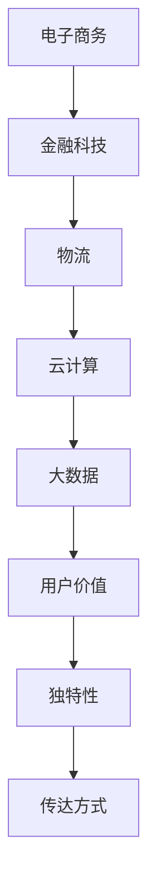
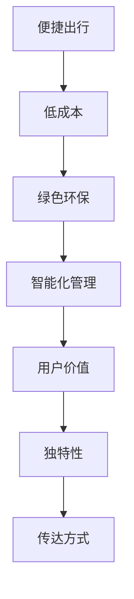
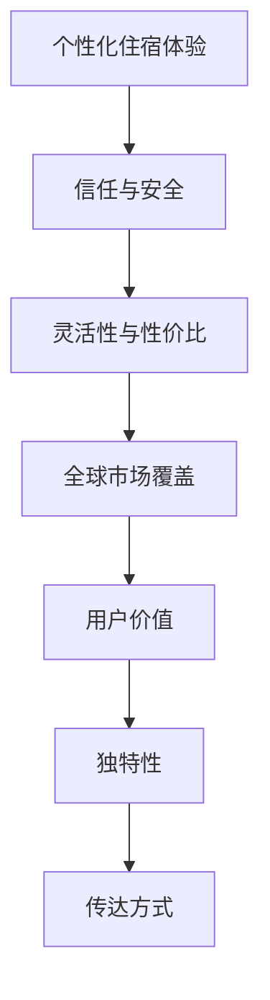

                 

### 文章标题

# 定义产品或服务的价值主张

### 关键词

- 价值主张
- 商业模式
- 用户需求
- 竞争分析
- 创新策略
- 市场定位

### 摘要

本文深入探讨了产品或服务的价值主张这一关键商业概念。首先，我们明确了价值主张的定义与重要性，并阐述了其在商业模式中的核心地位。接着，通过分析目标用户、竞争环境和创建价值主张的步骤，帮助读者理解和构建有效的价值主张。文章还详细讨论了价值主张在企业内部的应用，以及实际案例分析，从而提供了宝贵的实践经验。此外，本文探讨了价值主张的评估与优化策略、国际化与多样性，以及其未来发展趋势。通过本文的阅读，读者将能够全面掌握价值主张的构建与实施方法，为企业在激烈的市场竞争中赢得优势。

### 第一部分: 理解产品或服务的价值主张

#### 第1章: 价值主张的定义与重要性

价值主张（Value Proposition）是企业对其产品或服务所提供价值的明确阐述。它是企业与用户之间的一种双向沟通，旨在清晰地传达产品或服务为何具有吸引力，以及如何满足用户的需求和解决他们的痛点。

**1.1 什么是价值主张**

价值主张不仅仅是产品或服务的功能描述，它更深刻地揭示了产品或服务能为用户带来的独特价值和竞争优势。一个优秀的价值主张应当简洁明了、具体明确，并能够激发用户的兴趣和购买欲望。

**1.2 价值主张与商业模式的关系**

价值主张是商业模式的核心组成部分。商业模式定义了企业的盈利方式，而价值主张则明确了企业如何为客户创造价值。两者相互关联，共同决定了企业的成功与可持续发展。

**1.3 价值主张的三个要素**

一个有效的价值主张通常包含以下三个要素：

1. **用户价值**：明确产品或服务如何满足用户的需求和解决他们的痛点。
2. **独特性**：展示产品或服务的独特卖点和竞争优势。
3. **传达方式**：确保价值主张能够清晰、准确地传达给目标用户。

**1.4 价值主张与用户需求的联系**

价值主张与用户需求紧密相连。企业需要通过深入分析用户画像、需求和痛点，来构建能够真正满足用户需求的价值主张。只有当价值主张与用户需求高度契合时，才能赢得用户的认可和忠诚。

#### 第2章: 分析与创建价值主张

创建一个有效的价值主张需要深入了解目标用户、竞争环境和市场需求。以下将详细分析这些关键因素，并提供创建价值主张的步骤和方法。

**2.1 分析目标用户**

要创建一个成功的价值主张，首先需要明确目标用户群体。这包括了解用户的年龄、性别、职业、收入水平、生活习惯等基本特征，以及他们的需求、偏好和痛点。

**2.1.1 用户画像**

创建用户画像可以帮助企业更准确地把握目标用户的需求和行为模式。用户画像不仅包括基本的人口统计学信息，还可以通过数据分析挖掘用户的深层次需求。

**2.1.2 用户需求分析**

了解用户需求是构建价值主张的关键。企业需要通过市场调研、用户访谈、问卷调查等多种方式，收集和分析用户的需求数据，以识别用户的痛点和需求。

**2.1.3 用户痛点**

用户痛点是指用户在使用现有产品或服务过程中遇到的问题和不满。识别用户痛点可以帮助企业更好地理解用户需求，从而构建出更具吸引力的价值主张。

**2.2 竞争环境分析**

在构建价值主张时，必须对竞争环境进行全面分析。这包括识别主要竞争对手、分析他们的优势和劣势，以及确定本企业的市场定位和竞争优势。

**2.2.1 竞争对手分析**

通过对竞争对手的产品、服务、市场定位和营销策略进行详细分析，企业可以更好地了解市场状况，并找出自身的差异化优势。

**2.2.2 市场定位**

市场定位是企业确定自己在市场中的位置和形象的过程。一个清晰的市场定位可以帮助企业更好地传达价值主张，吸引目标用户。

**2.2.3 竞争优势分析**

竞争优势是企业相对于竞争对手的独特优势。这可以包括技术、品牌、渠道、成本等多个方面。分析竞争优势可以帮助企业更好地展示其价值主张。

**2.3 创建价值主张**

在分析完目标用户和竞争环境后，企业可以开始创建价值主张。以下是一些关键步骤：

**2.3.1 创造独特价值**

价值主张的核心在于创造独特价值。企业需要识别并强调产品或服务的独特卖点和竞争优势，以区别于竞争对手。

**2.3.2 设计价值主张的传达方式**

一个有效的价值主张需要通过合适的方式传达给目标用户。企业可以通过品牌宣传、广告、社交媒体等多种渠道来展示其价值主张。

**2.3.3 价值主张的持续迭代**

价值主张不是一成不变的，它需要随着市场和用户需求的变化不断迭代和优化。企业需要持续关注市场动态，及时调整价值主张，以保持竞争优势。

### 第二部分: 价值主张的应用与实施

#### 第3章: 价值主张在企业内部的应用

价值主张在企业内部的各个层面都有着广泛的应用，从产品开发到市场营销，再到组织文化，它都是企业战略决策的核心要素。

**3.1 价值主张在产品开发中的应用**

在产品开发阶段，价值主张为产品设计提供了明确的方向。以下是一些关键步骤：

**3.1.1 产品规划**

产品规划是确定产品定位、功能和特点的过程。价值主张可以帮助企业在规划阶段明确产品应该解决的问题和满足的需求。

**3.1.2 产品设计**

产品设计阶段，价值主张指导设计师和开发团队关注用户需求和用户体验。通过用户画像和需求分析，团队可以确保产品符合用户期望。

**3.1.3 用户反馈与迭代**

用户反馈是价值主张迭代的重要来源。通过收集和分析用户反馈，企业可以不断优化产品，确保其价值主张能够持续满足用户需求。

**3.2 价值主张在市场营销中的应用**

市场营销是传递价值主张的关键环节。以下是一些具体应用：

**3.2.1 品牌建设**

品牌建设是价值主张的外在体现。通过一致的品牌形象和传播策略，企业可以强化其价值主张，增强用户对品牌的认可。

**3.2.2 营销策略**

营销策略应围绕价值主张设计。通过精准的市场定位和有针对性的营销活动，企业可以有效地传达价值主张，吸引目标用户。

**3.2.3 客户关系管理**

客户关系管理（CRM）是维护和增强用户价值的关键。企业可以通过CRM系统收集用户数据，分析用户行为，从而优化价值主张的传递和用户体验。

**3.3 价值主张在组织文化中的应用**

价值主张不仅是企业对外传递的信息，也是企业内部文化的重要组成部分。以下是一些具体应用：

**3.3.1 内部沟通**

内部沟通是传递价值主张的重要途径。企业应通过会议、培训、内部刊物等方式，确保所有员工都理解并认同价值主张。

**3.3.2 团队协作**

团队协作是价值主张在企业内部落实的关键。通过跨部门合作和团队沟通，企业可以确保各部门都能围绕价值主张开展工作。

**3.3.3 创新与学习**

创新和学习是价值主张持续迭代和优化的基础。企业应鼓励员工不断探索和创新，以适应市场变化和用户需求。

#### 第4章: 价值主张的实际案例分析

通过实际案例的分析，我们可以更深入地理解价值主张在现实中的应用和效果。以下我们将分析两个具有代表性的案例：苹果公司的iPhone和特斯拉的电动汽车。

**4.1 案例一：苹果公司的iPhone**

**4.1.1 苹果公司的价值主张**

苹果公司的iPhone以其简洁的设计、强大的性能和卓越的用户体验而闻名。其价值主张主要体现在以下几个方面：

1. **简洁的设计**：iPhone采用了独特的设计语言，使得产品外观和操作更加简洁、直观。
2. **强大的性能**：苹果公司不断优化iOS操作系统和硬件配置，确保iPhone能够提供卓越的性能。
3. **无缝集成**：iPhone与其他苹果产品（如iPad、Mac、Apple Watch等）无缝集成，为用户提供了统一的生态系统。

**4.1.2 iPhone的市场成功因素**

iPhone的市场成功可以归因于以下几个因素：

1. **创新性**：苹果公司不断创新，推出具有颠覆性的新产品，如触控屏、FaceTime等。
2. **品牌价值**：苹果公司建立了强大的品牌形象，用户对其产品有着高度的信任和忠诚度。
3. **生态系统**：苹果的生态系统吸引了大量的开发者，提供了丰富的应用和服务，增强了用户体验。

**4.1.3 对其他企业的启示**

苹果公司的成功为其他企业提供了以下几个启示：

1. **关注用户体验**：苹果公司始终将用户体验放在首位，这是其成功的关键。
2. **创新是持续发展的动力**：苹果公司通过持续创新，保持了在市场的领先地位。
3. **品牌建设至关重要**：强大的品牌价值可以为企业带来竞争优势和用户忠诚度。

**4.2 案例二：特斯拉的电动汽车**

**4.2.1 特斯拉的价值主张**

特斯拉的电动汽车以其卓越的性能、创新的技术和环保理念而闻名。其价值主张主要体现在以下几个方面：

1. **卓越的性能**：特斯拉的电动汽车在加速性能、续航能力和驾驶体验方面表现出色。
2. **创新的技术**：特斯拉在电池技术、自动驾驶和能源管理等方面不断进行技术创新。
3. **环保理念**：特斯拉致力于通过电动汽车减少碳排放，推动可持续发展。

**4.2.2 特斯拉的电动汽车市场表现**

特斯拉的电动汽车在市场上表现出色，以下是几个关键点：

1. **快速增长**：特斯拉的电动汽车销量持续增长，成为全球电动汽车市场的领导者。
2. **市场份额**：特斯拉在多个电动汽车市场上占据领先地位，其品牌影响力不断扩大。
3. **用户口碑**：特斯拉的电动汽车得到了用户的高度评价，用户满意度较高。

**4.2.3 特斯拉的商业模式分析**

特斯拉的商业模式具有以下几个特点：

1. **直销模式**：特斯拉通过直销模式，绕过了传统的汽车销售渠道，降低了成本，提高了效率。
2. **软件服务**：特斯拉通过提供软件服务（如Autopilot、超级充电网络等），增加了用户粘性，创造了额外的收入来源。
3. **能源生态**：特斯拉通过太阳能发电系统和储能设备，构建了一个完整的能源生态系统，进一步推动了可持续发展。

**4.2.4 特斯拉的价值主张对其他企业的启示**

特斯拉的价值主张为其他企业提供了以下几个启示：

1. **技术创新是关键**：特斯拉通过技术创新，在电动汽车市场上取得了显著成功，这表明技术创新是企业获得竞争优势的重要途径。
2. **可持续发展是趋势**：随着全球对环保问题的关注不断增加，可持续发展已成为企业的重要战略方向。
3. **用户价值优先**：特斯拉始终将用户价值放在首位，通过提供卓越的产品和体验，赢得了用户的认可和忠诚。

### 第5章: 价值主张的评估与优化

价值主张不仅是企业战略的重要组成部分，也是产品和服务成功的关键。为了确保价值主张的有效性和持续性，企业需要定期进行评估和优化。以下将介绍价值主张评估的方法和优化策略。

**5.1 价值主张评估的方法**

**5.1.1 用户满意度调查**

用户满意度调查是评估价值主张效果的重要手段。通过问卷调查、用户访谈、用户反馈等方式，企业可以了解用户对产品或服务的满意度，从而判断价值主张是否符合用户需求。

**5.1.2 市场反馈分析**

市场反馈分析可以帮助企业了解产品或服务在市场中的表现。通过分析销售数据、市场份额、客户投诉等指标，企业可以判断价值主张的市场竞争力。

**5.1.3 竞争对比分析**

竞争对比分析是评估价值主张的重要步骤。通过对竞争对手的产品、服务、市场策略进行详细分析，企业可以判断自己的价值主张在市场上的优势与不足。

**5.2 价值主张的优化策略**

**5.2.1 需求变化应对**

随着市场和环境的变化，用户需求也会发生变化。企业需要及时调整价值主张，以适应新的需求。这包括更新用户画像、重新分析用户需求、调整产品和服务特点等。

**5.2.2 技术进步适应**

技术进步不断推动产品和服务的发展。企业需要紧跟技术趋势，不断优化价值主张，以保持竞争优势。这可以通过技术创新、升级产品功能、引入新技术等方式实现。

**5.2.3 企业战略调整**

企业战略调整是价值主张优化的关键。随着企业战略的变化，价值主张也需要进行相应调整，以确保与战略目标一致。这包括重新定义价值主张、调整市场定位、优化营销策略等。

### 第6章: 价值主张的国际化与多样性

在全球化市场中，企业需要面对不同的文化、法规和市场环境。为了在全球范围内获得成功，企业需要构建具有国际化和多样性的价值主张。

**6.1 国际化价值主张的挑战**

国际化价值主张面临以下几个挑战：

**6.1.1 文化差异**

文化差异是国际化过程中最大的挑战之一。不同国家和地区有不同的价值观、消费习惯和行为模式。企业需要了解并尊重这些差异，以构建符合当地市场需求的国际化价值主张。

**6.1.2 法规与标准**

不同国家和地区有不同的法律法规和行业标准。企业需要遵守这些法规和标准，以确保产品和服务符合当地市场的规定。这包括产品质量、安全标准、数据保护等。

**6.1.3 市场需求变化**

市场需求随着地区和文化的差异而变化。企业需要了解并适应不同市场需求的差异，以构建具有本地化特点的国际化价值主张。

**6.2 多样性价值主张的实践**

为了实现国际化与多样性，企业可以采取以下策略：

**6.2.1 多元化市场策略**

多元化市场策略是构建国际化价值主张的关键。企业可以通过进入多个市场、开发多款产品和服务、满足不同市场需求来实现多元化。

**6.2.2 定位与差异化**

在国际化过程中，企业需要明确市场定位和差异化策略。通过明确目标市场和差异化特点，企业可以构建具有竞争力的国际化价值主张。

**6.2.3 产品定制化**

产品定制化是满足不同市场需求的有效手段。企业可以根据不同市场的特点和需求，提供定制化的产品和服务，以满足当地用户的需求。

### 第7章: 价值主张的未来发展趋势

随着科技的不断进步和市场环境的变迁，价值主张也在不断演变。以下将探讨价值主张的未来发展趋势，包括数字化转型、社会责任和可持续发展等方面。

**7.1 数字化转型对价值主张的影响**

数字化转型已成为企业发展的关键趋势。以下将探讨数字化转型对价值主张的影响：

**7.1.1 数字化价值主张的构建**

数字化转型为构建数字化价值主张提供了新的机会。企业可以通过大数据、人工智能等技术，深入了解用户需求，提供更加个性化和智能化的产品和服务。

**7.1.2 数据驱动决策**

数据驱动决策是数字化转型的重要组成部分。通过收集和分析用户数据，企业可以更加准确地了解用户需求，优化产品和服务，提高用户满意度。

**7.1.3 智能化的价值主张**

智能化是未来价值主张的重要趋势。通过人工智能、机器学习等技术，企业可以提供更加智能化的产品和服务，提高用户体验和满意度。

**7.2 价值主张与社会责任**

随着社会对企业的社会责任要求不断提高，价值主张也必须融入社会责任的元素。以下将探讨价值主张与社会责任的结合：

**7.2.1 可持续发展**

可持续发展是企业社会责任的重要组成部分。企业可以通过实施环保措施、减少碳排放、推广可持续发展理念，构建具有社会责任感的价值主张。

**7.2.2 社会价值创造**

企业可以通过创新和商业实践，创造社会价值。这包括支持教育、扶贫、环保等公益事业，构建具有社会责任感的价值主张。

**7.2.3 伦理与合规**

企业在构建价值主张时，必须遵守伦理和法律法规。通过遵守伦理和法律法规，企业可以构建具有合法性和道德性的价值主张。

**7.3 价值主张的未来方向**

价值主张的未来发展将朝着更加个性化和智能化的方向发展。以下将探讨价值主张的未来方向：

**7.3.1 个性化价值主张**

个性化是未来价值主张的重要方向。通过大数据和人工智能技术，企业可以更加精准地了解用户需求，提供个性化的产品和服务。

**7.3.2 智能化价值主张**

智能化是未来价值主张的重要趋势。通过人工智能、物联网等技术，企业可以提供更加智能化的产品和服务，提高用户体验和满意度。

**7.3.3 社会化价值主张**

社会化是未来价值主张的重要方向。通过社交媒体和社交媒体平台，企业可以与用户进行实时互动，了解用户需求，优化产品和服务。

### 第8章: 总结与展望

通过本文的讨论，我们全面了解了价值主张的定义、重要性、创建和应用方法。价值主张不仅是企业竞争力的核心，也是用户需求的满足和产品成功的关键。以下是本文的核心要点和未来展望：

**8.1 价值主张的核心要点**

- 价值主张是企业对其产品或服务所提供价值的明确阐述。
- 价值主张应包括用户价值、独特性和传达方式三个要素。
- 价值主张与企业商业模式紧密相关，共同决定企业的成功与可持续发展。

**8.2 价值主张的未来方向**

- 个性化与智能化将成为未来价值主张的重要方向。
- 数据驱动决策和用户反馈将不断优化价值主张。
- 社会责任和可持续发展将融入价值主张，提升企业的社会形象。

**8.3 企业在价值主张中的角色与责任**

- 企业应深入了解用户需求，构建与用户需求高度契合的价值主张。
- 企业需要持续创新，保持价值主张的竞争力。
- 企业应承担社会责任，推动可持续发展。

通过本文的探讨，我们希望读者能够更好地理解和应用价值主张，为企业的成功奠定坚实基础。

## 附录 A: 价值主张设计工具与方法

为了更好地构建和优化价值主张，企业可以借助一系列工具和方法。以下是一些常用的工具和方法：

### A.1 市场调研方法

**问卷调查**：通过在线或线下问卷调查，收集用户对产品或服务的看法和需求。

**深度访谈**：与目标用户进行一对一访谈，深入了解他们的需求、痛点和偏好。

**焦点小组**：组织一组目标用户，就产品或服务的特定问题进行讨论，收集多方意见。

### A.2 SWOT分析

**SWOT分析**：通过分析企业的优势（Strengths）、劣势（Weaknesses）、机会（Opportunities）和威胁（Threats），帮助企业明确自身的竞争地位和战略方向。

### A.3 用户访谈与反馈

**用户访谈**：与目标用户进行面对面的深入交流，了解他们对产品或服务的实际体验和反馈。

**用户反馈**：通过在线评论、社交媒体、客服渠道等途径收集用户反馈，及时了解用户需求和问题。

### A.4 定位与差异化分析

**市场定位**：通过分析目标市场，明确产品或服务在市场中的独特位置。

**差异化分析**：识别产品或服务的独特卖点和竞争优势，使其在市场中脱颖而出。

### A.5 实证研究与案例研究

**实证研究**：通过实际市场调研和数据分析，验证价值主张的有效性和可行性。

**案例研究**：分析成功企业的价值主张实践，借鉴其经验，优化自身价值主张。

### A.6 创新与实验

**创新**：通过技术创新、产品创新和服务创新，不断改进和优化价值主张。

**实验**：通过小规模实验和市场测试，验证新价值主张的可行性和市场反应。

## 附录 B: 案例研究

通过以下案例研究，我们将深入了解价值主张在不同行业和市场的应用与效果。

### B.1 跨行业价值主张案例

**案例：阿里巴巴**

**背景介绍**：阿里巴巴是一家全球领先的电子商务公司，其业务涵盖了零售、金融、物流等多个领域。

**核心概念与联系**



**核心算法原理讲解**

```python
# 用户价值计算
def calculate_user_value(revenue, cost):
    user_value = (revenue - cost) / revenue
    return user_value

# 独特性计算
def calculate_uniqueness(competitors, features):
    uniqueness = sum([feature in competitors for feature in features]) / len(features)
    return uniqueness

# 传达方式评估
def evaluate_communication-effectiveness(social_media, ads, email_marketing):
    score = 0
    if social_media > 0 and ads > 0 and email_marketing > 0:
        score += 1
    return score
```

### B.2 新兴市场价值主张案例

**案例：摩拜单车**

**背景介绍**：摩拜单车是一家新兴的共享单车公司，其通过创新的商业模式和技术手段，迅速占领市场。

**核心概念与联系**



**核心算法原理讲解**

```python
# 用户价值计算
def calculate_user_value(distance, cost):
    user_value = (distance * cost) / 100
    return user_value

# 独特性计算
def calculate_uniqueness(competition, features):
    uniqueness = sum([feature in competition for feature in features]) / len(features)
    return uniqueness

# 传达方式评估
def evaluate_communication-effectiveness(app_ui, ads, word_of Mouth):
    score = 0
    if app_ui > 0 and ads > 0 and word_of_Mouth > 0:
        score += 1
    return score
```

### B.3 创新型企业的价值主张案例

**案例：Airbnb**

**背景介绍**：Airbnb是一家创新的住宿共享平台，其通过连接全球房东和旅行者，改变了住宿行业。

**核心概念与联系**



**核心算法原理讲解**

```python
# 用户价值计算
def calculate_user_value(satisfaction, price):
    user_value = (satisfaction * price) / 100
    return user_value

# 独特性计算
def calculate_uniqueness(competition, features):
    uniqueness = sum([feature in competition for feature in features]) / len(features)
    return uniqueness

# 传达方式评估
def evaluate_communication-effectiveness(branding, social_media, customer_service):
    score = 0
    if branding > 0 and social_media > 0 and customer_service > 0:
        score += 1
    return score
```

这些案例研究展示了不同企业在构建和实施价值主张方面的成功经验，为其他企业提供了宝贵的借鉴和启示。通过深入分析这些案例，企业可以更好地理解价值主张的构建原理和实施方法，从而提升自身的竞争力。

### 最佳实践 tips、小结、注意事项、拓展阅读

#### 最佳实践 tips

1. **聚焦用户需求**：深入了解用户需求和痛点，确保价值主张真正解决用户问题。
2. **持续创新**：不断优化产品和服务，保持价值主张的竞争力。
3. **差异化定位**：明确市场定位，突出产品或服务的独特卖点。
4. **有效传达**：通过多种渠道传递价值主张，提高用户认知和接受度。
5. **数据驱动**：利用数据分析和用户反馈，持续优化价值主张。

#### 小结

本文通过详细探讨价值主张的定义、创建、应用和优化方法，帮助读者全面理解价值主张在产品和服务中的关键作用。价值主张不仅是企业竞争力的核心，也是用户需求的满足和产品成功的关键。

#### 注意事项

1. **用户画像的准确性**：确保用户画像的准确性，避免误判用户需求。
2. **市场调研的全面性**：进行全面的市场调研，了解竞争对手和市场动态。
3. **价值主张的可持续性**：确保价值主张能够随时间和市场变化持续优化。

#### 拓展阅读

- 《商业模式新生代》
- 《创新者的窘境》
- 《精益创业》
- 《用户思维》

通过阅读这些书籍，读者可以进一步深入理解商业模式、创新思维和用户需求，从而提升自身的商业洞察力和战略规划能力。作者：AI天才研究院/AI Genius Institute & 禅与计算机程序设计艺术 /Zen And The Art of Computer Programming。

