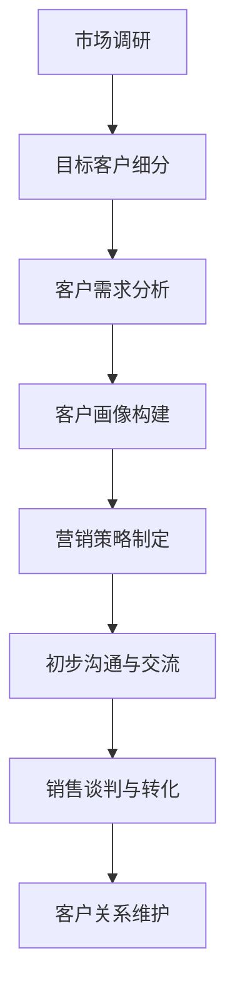
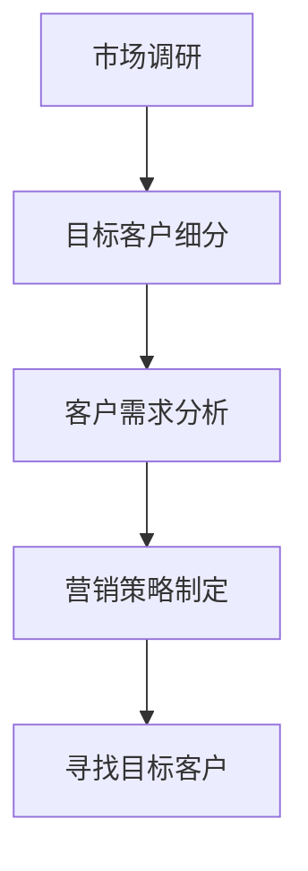
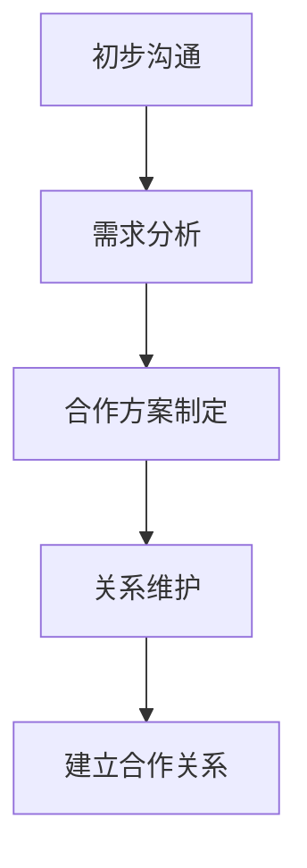
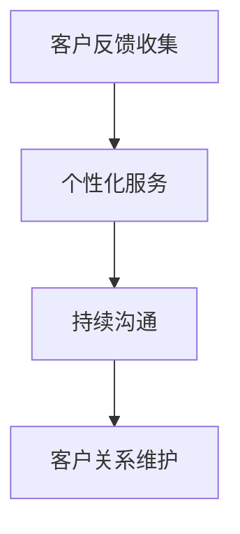
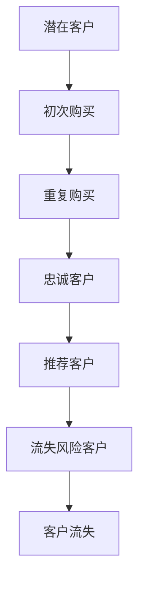

                 

### 文章标题：客户开发：从陌生人到合作伙伴

#### 关键词：客户开发、市场策略、合作伙伴关系、商业成功

#### 摘要：
本文将深入探讨客户开发的全过程，从基础概念到实际操作，再到策略制定和关系维护，旨在帮助企业和个人了解如何有效地将陌生人转化为长期的合作伙伴。通过逐步分析客户开发的关键环节，本文将提供实用的工具和方法，助力企业在竞争激烈的市场中脱颖而出，实现商业成功。

### 引言

在当今快速变化的市场环境中，客户开发成为企业成功的关键因素。从初次接触到建立合作关系，每一步都至关重要。客户开发不仅涉及市场分析和策略制定，还包括与客户沟通、需求分析和关系维护等复杂环节。有效的客户开发能够帮助企业找到目标客户，满足其需求，并最终实现商业价值。

本文将从以下几个方面展开讨论：

1. 客户开发的基础：定义客户开发，介绍基本流程和流程图。
2. 了解目标客户：目标客户细分、需求分析、客户画像构建。
3. 建立初步联系：寻找潜在客户、初步沟通与交流、深入了解客户需求。
4. 建立合作关系：客户价值评估与分类、提供定制化服务、维护客户关系。
5. 案例与实战：实际操作中的客户开发经验。
6. 工具与应用：客户开发工具的介绍和应用。
7. 未来趋势：客户开发的新趋势和科技创新。

通过上述分析，我们希望读者能够对客户开发有一个全面而深入的理解，从而在实践过程中更加得心应手，实现商业目标。

### 第一部分：客户开发的基础

#### 第1章：客户开发的概念与流程

##### 1.1 客户开发的基本概念

客户开发，即Customer Development，是一种系统的、有计划的方法，旨在识别、吸引和转化潜在客户，最终实现销售目标。客户开发不仅仅是一种销售策略，更是一种市场营销的理念，强调通过深入了解客户需求和痛点，提供针对性的解决方案。

客户开发的定义可以分为三个方面：

- **识别潜在客户**：通过市场调研、数据分析和社交媒体等手段，找到可能对产品或服务感兴趣的人群。
- **吸引潜在客户**：通过营销活动、广告投放和品牌建设等手段，吸引潜在客户的注意力，并建立初步联系。
- **转化潜在客户**：通过销售谈判、客户服务和个性化跟进，将潜在客户转化为实际客户，实现销售转化。

##### 1.2 客户开发的基本流程

客户开发是一个持续的过程，通常包括以下步骤：

1. **市场调研**：了解目标市场、竞争对手和潜在客户的需求。
2. **目标客户细分**：根据市场调研结果，将潜在客户划分为不同的群体，以便更有针对性地进行营销和推广。
3. **客户需求分析**：深入了解每个细分市场的客户需求，包括其痛点、期望和偏好。
4. **客户画像构建**：根据客户需求分析的结果，构建详细的目标客户画像，包括客户的基本信息、行为特征和购买意图。
5. **营销策略制定**：根据目标客户画像，制定具体的营销策略，包括广告投放、促销活动和品牌建设。
6. **初步沟通与交流**：通过电话、电子邮件、社交媒体等方式，与潜在客户建立初步联系，并了解其需求和痛点。
7. **销售谈判与转化**：通过个性化服务和针对性的解决方案，与潜在客户进行深入谈判，促使其转化为实际客户。
8. **客户关系维护**：通过持续的客户服务和个性化跟进，维护客户关系，提高客户满意度和忠诚度。

##### 1.3 客户开发流程图

为了更好地理解客户开发的基本流程，我们可以通过Mermaid流程图来展示其各个步骤之间的联系：



通过这个流程图，我们可以清晰地看到客户开发各步骤的顺序和关联，从而更好地理解和应用这一过程。

### 第2章：了解目标客户

#### 2.1 目标客户细分

目标客户细分是客户开发过程中的关键步骤，其目的是将潜在客户划分为不同的群体，以便更精准地进行营销和推广。通过细分市场，企业可以更好地了解不同客户群体的需求和痛点，从而提供针对性的解决方案。

##### 细分市场的意义

细分市场的意义主要体现在以下几个方面：

- **提高营销效率**：通过将市场划分为不同的细分市场，企业可以更有针对性地开展营销活动，从而提高营销效率。
- **降低营销成本**：针对特定细分市场的营销策略通常更加精准，可以减少不必要的营销开支。
- **提高客户满意度**：针对不同客户群体的定制化服务和解决方案，可以更好地满足其需求，提高客户满意度。
- **发现潜在市场**：通过细分市场，企业可以发现新的潜在市场，从而拓展业务范围。

##### 细分市场的方法

细分市场的方法多种多样，以下是一些常用的方法：

- **地理细分**：根据客户的地理位置进行划分，如城市、区域、国家等。
- **人口细分**：根据客户的人口统计特征进行划分，如年龄、性别、收入、职业等。
- **行为细分**：根据客户的行为特征进行划分，如购买频率、购买渠道、使用习惯等。
- **心理细分**：根据客户的心理特征进行划分，如生活方式、价值观、兴趣爱好等。
- **利益细分**：根据客户对产品或服务的利益需求进行划分，如成本节约、质量保障、技术创新等。

##### 细分市场案例

例如，一家生产健康食品的企业可以将市场细分为以下几类：

- **年龄细分**：年轻消费者（18-30岁）和中老年消费者（30岁以上）。
- **收入细分**：高收入消费者和低收入消费者。
- **行为细分**：经常购买健康食品的消费者和偶尔购买的消费者。
- **心理细分**：注重健康生活方式的消费者和追求时尚的消费者。

通过这种细分，企业可以更有针对性地制定营销策略，例如，对于年轻消费者，可以推出时尚、健康的食品产品，并通过社交媒体进行宣传；对于中老年消费者，可以强调食品的营养价值和保健功能。

#### 2.2 客户需求分析

客户需求分析是了解目标客户的重要环节，其目的是通过系统的方法，深入挖掘客户的真实需求，从而为企业提供针对性的解决方案。

##### 客户需求分析的重要性

客户需求分析的重要性主要体现在以下几个方面：

- **指导产品开发**：通过分析客户需求，企业可以了解产品改进的方向和潜在的新产品机会。
- **优化营销策略**：了解客户需求有助于制定更有效的营销策略，提高营销ROI。
- **提高客户满意度**：满足客户需求是提高客户满意度和忠诚度的关键。
- **降低服务成本**：通过需求分析，企业可以避免不必要的服务项目，降低运营成本。

##### 客户需求分析的方法

以下是几种常用的客户需求分析方法：

- **问卷调查**：通过设计问卷，收集客户的反馈和建议。
- **访谈**：与客户进行面对面访谈，深入了解其需求和痛点。
- **焦点小组**：组织一群具有代表性的客户，就特定问题进行讨论，收集多角度的意见。
- **用户行为分析**：通过分析客户在网站、APP等平台上的行为数据，了解其需求和偏好。
- **市场研究**：通过市场调研报告，了解行业趋势和竞争对手的情况。

##### 客户需求分析案例

例如，一家智能家居企业可以通过以下方式分析客户需求：

- **问卷调查**：通过线上问卷，了解客户对智能家居产品的需求和满意度。
- **用户访谈**：与现有客户进行深度访谈，了解他们对智能家居产品的使用体验和改进建议。
- **市场研究**：通过市场研究报告，了解竞争对手的产品功能和市场表现。
- **用户行为分析**：通过分析用户在智能家居APP上的操作数据，了解其使用习惯和偏好。

通过这些方法，企业可以全面了解客户需求，从而优化产品功能和营销策略，提高客户满意度。

#### 2.3 客户画像构建

客户画像构建是客户需求分析的重要输出，通过将客户的特征和行为数据整合到一起，形成一个详细的客户画像，有助于企业更好地了解客户，从而进行精准营销和个性化服务。

##### 客户画像的定义

客户画像（Customer Persona）是指通过数据分析和市场调研，对目标客户进行综合描述，形成一个具体的、代表性的客户形象。这个画像包括客户的基本信息、行为特征、需求和偏好等。

##### 客户画像的作用

客户画像的作用主要体现在以下几个方面：

- **指导营销策略**：通过了解客户画像，企业可以更有针对性地制定营销策略，提高营销效果。
- **优化产品开发**：了解客户画像有助于企业了解客户需求，从而优化产品功能和设计。
- **提高客户满意度**：根据客户画像提供个性化的服务和解决方案，可以提高客户满意度和忠诚度。
- **降低运营成本**：通过客户画像，企业可以更有效地分配资源，避免不必要的市场投入。

##### 客户画像构建的方法

以下是构建客户画像的常用方法：

- **数据分析**：通过数据分析工具，收集和分析客户的特征数据和行为数据。
- **用户调研**：通过用户调研，获取客户的反馈和意见，深入了解其需求和偏好。
- **市场研究**：通过市场研究报告和竞争对手分析，了解行业趋势和客户需求。
- **用户行为分析**：通过分析用户在网站、APP等平台上的行为数据，了解其使用习惯和偏好。
- **文档整理**：将收集到的各种数据和信息整理成文档，形成一个完整的客户画像。

##### 客户画像案例

例如，一家电子商务企业可以构建以下客户画像：

- **基本信息**：年龄在25-35岁之间，性别为女性，收入水平为中等。
- **行为特征**：经常在周末购物，偏好使用移动设备进行网购。
- **需求和偏好**：注重商品的质量和价格，喜欢购买时尚和个性化的商品。

通过这个客户画像，企业可以更好地了解目标客户，从而制定针对性的营销策略，提高客户转化率和满意度。

### 第二部分：建立初步联系

#### 第4章：寻找潜在客户

#### 4.1 潜在客户的获取渠道

寻找潜在客户是客户开发过程中的关键一步。通过多种渠道获取潜在客户，企业可以扩大市场覆盖范围，提高销售转化率。以下是几种常见的潜在客户获取渠道：

##### 1. 社交媒体

社交媒体是获取潜在客户的重要渠道。通过建立企业官方账号，发布有价值的内容，吸引潜在客户的关注。常见的社交媒体平台包括：

- **Facebook**：全球最大的社交网络平台，适合推广品牌和产品。
- **LinkedIn**：专业的社交网络平台，适合寻找商业合作伙伴和客户。
- **Twitter**：实时社交平台，适合发布新闻和动态，提高品牌知名度。
- **Instagram**：以图片和视频为主的社交平台，适合推广创意和时尚产品。

##### 2. 在线广告

在线广告是另一种有效的潜在客户获取渠道。通过搜索引擎广告（如Google Ads）和社交媒体广告（如Facebook Ads），企业可以精准定位目标客户，提高广告投放效果。以下是几种在线广告形式：

- **搜索引擎广告**：在Google、Bing等搜索引擎上投放广告，针对用户搜索关键词进行展示。
- **社交媒体广告**：在Facebook、Instagram等社交媒体平台上投放广告，针对用户兴趣和行为进行展示。
- **展示广告**：在第三方网站上投放展示广告，通过视觉元素吸引用户点击。

##### 3. 电子邮件营销

电子邮件营销是一种成本低廉、效果显著的市场推广方式。通过发送个性化的邮件，向潜在客户介绍产品或服务，吸引其关注。以下是几种电子邮件营销策略：

- **新闻简报**：定期发送新闻简报，介绍企业动态、行业资讯和产品更新。
- **促销活动**：通过邮件推广促销活动，吸引潜在客户购买产品或服务。
- **个性化邮件**：根据潜在客户的兴趣和购买历史，发送个性化的邮件，提高邮件打开率和转化率。

##### 4. 事件和活动

参与各种事件和活动，是获取潜在客户的重要途径。通过举办或参与展会、讲座、研讨会等活动，企业可以直接与潜在客户面对面交流，了解其需求和痛点。以下是几种参与事件和活动的方式：

- **展会和展览**：参加行业展会和展览，展示产品和服务，吸引潜在客户。
- **研讨会和讲座**：举办或参与研讨会和讲座，分享行业知识和经验，吸引潜在客户。
- **线下活动和赞助**：参与线下活动和赞助活动，提高品牌曝光度和知名度。

#### 4.2 社交媒体和在线平台的利用

随着社交媒体和在线平台的普及，企业可以利用这些平台进行客户开发和维护。以下是一些常见的社交媒体和在线平台：

##### 1. 社交媒体

- **Facebook**：通过Facebook企业页面，发布产品信息、行业动态和客户案例，吸引潜在客户关注。同时，利用Facebook广告，精准定位目标客户。
- **LinkedIn**：通过LinkedIn建立专业形象，发布行业文章、参与讨论，吸引潜在客户和合作伙伴。
- **Instagram**：通过Instagram发布高质量的图片和视频内容，展示产品魅力，吸引潜在客户。
- **Twitter**：通过Twitter发布新闻、动态和客户反馈，提高品牌知名度，吸引潜在客户。

##### 2. 在线平台

- **电子商务平台**：如淘宝、京东、亚马逊等，通过在线销售和营销活动，吸引潜在客户。
- **社交媒体平台**：如微博、小红书等，通过发布产品信息、用户评价和互动，吸引潜在客户。
- **博客和网站**：通过建立企业博客或网站，发布行业文章、产品介绍和客户案例，提供有价值的内容，吸引潜在客户。

##### 3. 社交媒体营销策略

- **内容营销**：发布高质量、有价值的内容，吸引潜在客户的关注。内容可以是行业文章、产品评测、客户案例等。
- **互动营销**：与潜在客户进行互动，回答其问题和疑虑，建立信任和良好关系。
- **广告投放**：根据目标客户特征，进行精准的广告投放，提高广告效果和转化率。

#### 4.3 电邮营销策略

电邮营销是一种成本低廉、效果显著的市场推广方式。通过发送个性化的邮件，向潜在客户介绍产品或服务，吸引其关注。以下是一些电邮营销策略：

##### 1. 邮件内容策略

- **引人注目的标题**：标题是吸引读者打开邮件的关键，应简明扼要、具有吸引力。
- **有价值的内容**：邮件内容应具有实际价值，可以是产品介绍、行业动态、促销信息等。
- **个性化语言**：使用个性化的语言，如客户姓名、公司名称等，增强邮件的亲切感和针对性。

##### 2. 邮件发送策略

- **定期发送**：定期发送邮件，保持与客户的联系，提高客户粘性。
- **精准定位**：根据客户特征和购买行为，发送个性化的邮件，提高邮件打开率和转化率。
- **测试和优化**：通过A/B测试，不断优化邮件内容和发送策略，提高邮件效果。

##### 3. 邮件营销工具

- **邮件营销软件**：如Mailchimp、Sendinblue等，提供邮件模板、自动化营销等功能，方便企业进行邮件营销。
- **CRM系统**：如Salesforce、Hubspot等，集成邮件营销功能，实现客户管理和营销自动化。

#### 4.4 初步沟通技巧

初步沟通是客户开发的重要环节，通过有效的沟通，可以建立良好的客户关系，为进一步合作奠定基础。以下是一些初步沟通技巧：

##### 1. 了解客户需求

在沟通过程中，首先要了解客户的需求和痛点，可以通过提问、倾听和观察等方式获取信息。

##### 2. 建立信任

信任是建立长期合作关系的基础。在沟通中，要保持诚实、专业和真诚，赢得客户的信任。

##### 3. 倾听

倾听是有效沟通的关键。要给客户足够的时间表达自己的观点和需求，认真倾听并理解其意图。

##### 4. 提问

通过提问，可以更好地了解客户的需求和期望，同时展示自己的专业性和关注。

##### 5. 非语言沟通

非语言沟通包括表情、姿态、语调等，对沟通效果有很大影响。要保持友好的态度，使用积极的语调，展示自己的诚意和关注。

#### 4.5 电话沟通策略

电话沟通是一种快速、高效的沟通方式，适用于初步了解客户需求和建立联系。以下是一些电话沟通策略：

##### 1. 准备工作

在拨打电话前，要准备好相关资料和问题清单，确保沟通顺利进行。

##### 2. 开场白

在电话沟通开始时，要有一个友好的开场白，介绍自己和公司，并简要说明沟通的目的。

##### 3. 主动引导

在沟通过程中，要主动引导话题，围绕客户需求和痛点展开讨论。

##### 4. 倾听和反馈

在电话沟通中，要注重倾听客户的意见和反馈，及时给予回应和确认。

##### 5. 结束语

在电话沟通结束时，要感谢客户的时间和参与，并询问是否有进一步沟通的需求。

#### 4.6 面对面沟通技巧

面对面沟通是一种直接、有效的沟通方式，可以建立更紧密的客户关系。以下是一些面对面沟通技巧：

##### 1. 环境准备

选择一个舒适、安静的环境，确保沟通不受干扰。

##### 2. 良好的开场

在面对面沟通开始时，要有一个良好的开场，介绍自己和公司，并简要说明沟通的目的。

##### 3. 沟通结构

在面对面沟通中，要有一个清晰的结构，包括开场、讨论主题、总结和后续行动。

##### 4. 互动和反馈

在沟通过程中，要鼓励客户积极参与，提问和反馈，确保沟通的双向性。

##### 5. 跟进和感谢

在面对面沟通结束后，要及时跟进沟通结果，并感谢客户的参与和支持。

### 第三部分：建立合作关系

#### 第7章：客户价值评估与分类

#### 7.1 客户价值评估方法

在客户开发过程中，对客户进行价值评估是至关重要的一步。通过评估客户价值，企业可以更好地分配资源，优化客户关系管理策略，从而实现更高的商业回报。以下是一些常见的客户价值评估方法：

##### 1. 财务评估方法

财务评估方法主要通过客户的财务贡献来评估其价值。以下是一些具体的财务评估方法：

- **客户终身价值（CLV）**：客户终身价值是指客户在整个生命周期内为公司带来的总收益。计算公式为：CLV = （平均订单价值 × 购买频率 × 客户生命周期）。通过计算客户终身价值，企业可以了解哪些客户对公司的长期盈利最为重要。
  
- **客户获取成本（CAC）**：客户获取成本是指公司获取一个客户所花费的平均成本。计算公式为：CAC = （市场推广支出 + 销售支出）/ 客户数量。通过计算客户获取成本，企业可以评估营销和销售活动的有效性。

- **客户贡献率**：客户贡献率是指客户为公司贡献的收入占总收入的比例。计算公式为：客户贡献率 = （客户贡献收入 / 公司总收入）× 100%。通过计算客户贡献率，企业可以了解不同客户对公司盈利的贡献程度。

##### 2. 非财务评估方法

除了财务评估方法，还可以使用非财务评估方法来评估客户价值。以下是一些具体的非财务评估方法：

- **客户满意度**：客户满意度是衡量客户对公司产品和服务满意程度的重要指标。通过调查和反馈，企业可以了解客户对产品和服务质量的评价，从而评估客户的价值。

- **客户忠诚度**：客户忠诚度是指客户重复购买和推荐公司产品的程度。通过分析客户的购买频率、回购率和推荐行为，企业可以评估客户的忠诚度。

- **客户潜力**：客户潜力是指客户未来为公司带来的潜在价值。通过分析客户的发展前景、市场趋势和竞争状况，企业可以评估客户的潜力。

##### 3. 综合评估方法

在实际操作中，企业通常会采用综合评估方法，结合财务和非财务评估指标，全面评估客户价值。以下是一种综合评估方法的示例：

- **客户价值评分系统**：企业可以建立一套客户价值评分系统，将客户终身价值、客户满意度、客户忠诚度和客户潜力等指标进行量化，形成综合评分。评分越高，客户价值越大。

#### 7.2 客户分类策略

在客户价值评估的基础上，企业需要对客户进行分类，以便实施差异化的客户管理策略。以下是一些常见的客户分类方法：

##### 1. 按财务贡献分类

- **高价值客户**：这些客户为公司贡献的收入占比较高，是企业的重点维护对象。企业可以为其提供定制化的服务、优惠政策和优先响应。
- **中价值客户**：这些客户的贡献度适中，是企业的重要客户。企业可以通过定期沟通、产品更新和服务优化等方式，维持良好的客户关系。
- **低价值客户**：这些客户的贡献度较低，但仍有潜在的价值。企业可以通过成本效益分析，决定是否继续维护这些客户。

##### 2. 按客户需求分类

- **核心客户**：这些客户对企业的产品和服务的需求非常强烈，是企业的核心业务对象。企业需要深入了解其需求，提供针对性的解决方案。
- **潜在客户**：这些客户对企业的产品和服务的兴趣较高，但尚未形成购买决策。企业可以通过营销活动和个性化跟进，引导其转化为实际客户。
- **非目标客户**：这些客户对企业的产品和服务的需求较低，企业可以适当减少对其的关注，专注于更有价值的客户。

##### 3. 按客户忠诚度分类

- **忠诚客户**：这些客户对企业的产品和服务的满意度高，有较高的回购率和推荐意愿。企业可以通过会员制度、积分奖励等方式，增强其忠诚度。
- **不稳定客户**：这些客户的满意度和忠诚度较低，容易受到竞争对手的影响。企业需要通过改进产品和服务，提高其满意度和忠诚度。
- **流失风险客户**：这些客户的流失风险较高，企业需要采取紧急措施，如个性化跟进、优惠政策和改善服务体验，以降低其流失风险。

#### 7.3 客户生命周期价值计算

客户生命周期价值（Customer Lifetime Value，简称CLV）是客户开发和管理的重要指标，它代表了客户在整个生命周期内为公司带来的总价值。以下是一个简单的客户生命周期价值计算方法：

##### 1. 计算公式

客户生命周期价值 = （平均订单价值 × 购买频率 × 客户生命周期）

其中：

- **平均订单价值**：客户每次购买的平均金额。
- **购买频率**：客户在一定时间内购买产品的次数。
- **客户生命周期**：客户从首次购买到停止购买的时间跨度。

##### 2. 计算示例

假设某客户在一年内购买了5次产品，每次平均订单价值为1000元，客户生命周期为5年。则该客户的客户生命周期价值计算如下：

客户生命周期价值 = （1000元 × 5次 × 5年）= 25,000元

通过计算客户生命周期价值，企业可以了解每个客户的潜在价值，从而制定更有效的客户关系管理策略。例如，对于高价值的客户，企业可以提供更优质的服务和优惠，以增强其忠诚度；对于低价值的客户，企业可以适当减少营销投入，专注于更有价值的客户。

### 第8章：提供定制化服务

#### 8.1 定制化服务的意义

在客户开发过程中，提供定制化服务是一种重要的策略，其意义主要体现在以下几个方面：

##### 1. 提高客户满意度

定制化服务可以更好地满足客户的需求和期望，从而提高客户的满意度。当客户感受到企业对其独特需求的关注和重视时，他们更可能对企业产生信任和忠诚。

##### 2. 增强客户忠诚度

通过提供定制化服务，企业可以建立与客户之间的长期合作关系。这种个性化的服务体验使客户更有可能继续选择企业的产品和服务，从而增强客户忠诚度。

##### 3. 提升品牌形象

提供定制化服务可以提升企业的专业形象和品牌价值。客户会认为企业具有更强的服务能力和创新精神，从而对企业产生积极的品牌认知。

##### 4. 扩大市场份额

通过定制化服务，企业可以更好地满足不同客户群体的需求，从而扩大市场份额。这有助于企业在竞争激烈的市场中脱颖而出，实现业务的持续增长。

#### 8.2 定制化服务的实现方法

要提供有效的定制化服务，企业需要采取一系列具体的措施。以下是一些常见的实现方法：

##### 1. 深入了解客户需求

定制化服务的前提是深入了解客户的需求和期望。企业可以通过以下方式获取客户需求信息：

- **问卷调查**：通过设计问卷，收集客户的反馈和意见。
- **访谈**：与客户进行面对面的访谈，深入了解其需求和痛点。
- **用户行为分析**：通过分析客户在网站、APP等平台上的行为数据，了解其需求和偏好。
- **市场研究**：通过市场研究报告，了解行业趋势和竞争对手的情况。

##### 2. 设计个性化的解决方案

在了解客户需求后，企业需要设计个性化的解决方案。以下是一些设计个性化解决方案的方法：

- **需求分析**：对收集到的客户需求进行分类和分析，找出关键需求和痛点。
- **产品定制**：根据客户需求，对产品进行功能扩展、定制化设计或推出新版本。
- **服务定制**：针对客户需求，提供定制化的服务内容、流程和体验。
- **个性化推荐**：基于客户的行为数据，提供个性化的产品推荐和服务建议。

##### 3. 实施和监控定制化服务

在设计和实施个性化解决方案后，企业需要确保服务的质量和效果。以下是一些实施和监控定制化服务的方法：

- **培训员工**：确保员工了解定制化服务的内容和流程，提供必要的培训和指导。
- **跟踪反馈**：定期收集客户的反馈和意见，了解定制化服务的效果，及时进行调整和改进。
- **质量保证**：建立严格的质量保证体系，确保定制化服务的质量和稳定性。
- **持续优化**：根据客户反馈和市场变化，不断优化定制化服务的内容和流程。

#### 8.3 定制化服务的效果评估

为了评估定制化服务的有效性，企业需要采取一系列评估方法和指标。以下是一些常用的评估方法和指标：

##### 1. 客户满意度

客户满意度是衡量定制化服务效果的重要指标。企业可以通过以下方式评估客户满意度：

- **满意度调查**：定期进行满意度调查，收集客户的反馈和评价。
- **客户投诉率**：监控客户的投诉率和投诉类型，了解客户对定制化服务的满意度。
- **客户忠诚度**：通过客户回购率和推荐意愿，评估客户对定制化服务的满意度。

##### 2. 服务质量和效率

服务质量和效率是定制化服务成功的重要保障。企业可以通过以下方式评估服务质量和效率：

- **服务响应时间**：监控服务响应时间，确保能够及时解决客户问题。
- **服务准确性**：评估服务的准确性和有效性，确保客户需求得到满足。
- **服务成本**：监控服务成本，确保定制化服务的经济效益。

##### 3. 业务增长

定制化服务对企业业务增长的影响也是评估其效果的重要方面。企业可以通过以下方式评估业务增长：

- **销售收入**：分析定制化服务对销售收入的影响，了解其对企业业绩的贡献。
- **市场份额**：评估定制化服务对企业市场份额的扩大效果。
- **客户扩展**：通过分析客户扩展情况，了解定制化服务对客户获取和留存的影响。

通过上述评估方法和指标，企业可以全面了解定制化服务的效果，从而不断优化服务策略，提高客户满意度和业务增长。

### 第9章：维护客户关系

#### 9.1 客户关系维护的重要性

在客户开发过程中，维护客户关系是确保客户长期满意和忠诚的关键。以下是一些客户关系维护的重要性：

##### 1. 提高客户满意度

通过有效的客户关系维护，企业可以及时了解客户的需求和痛点，提供针对性的解决方案，从而提高客户满意度。满意的客户更可能继续选择企业的产品和服务，为企业带来长期收益。

##### 2. 增强客户忠诚度

良好的客户关系可以增强客户对企业的信任和依赖，使其更愿意长期合作。忠诚的客户不仅会重复购买，还可能向其他潜在客户推荐企业，从而扩大市场份额。

##### 3. 降低客户流失率

通过持续的客户关系维护，企业可以降低客户流失率。当客户感受到企业对其重视和关注时，他们更不愿意离开，从而提高客户生命周期价值。

##### 4. 提高业务增长率

良好的客户关系可以为企业带来稳定的客户群体，提高业务增长率。通过维护现有客户，企业可以减少客户获取成本，将更多的资源用于新客户的开发。

#### 9.2 客户关系维护的策略

为了有效地维护客户关系，企业可以采取以下策略：

##### 1. 定期沟通

定期与客户进行沟通是维护客户关系的基础。通过电话、邮件、短信或在线聊天等方式，企业可以及时了解客户的需求和反馈，提供个性化的服务和解决方案。

##### 2. 提供优质服务

优质的服务是维护客户关系的关键。企业需要确保客户在购买和使用产品或服务的过程中得到良好的体验。通过提供专业、快速和周到的服务，企业可以赢得客户的信任和满意度。

##### 3. 个性化关怀

个性化的关怀可以增强客户对企业的好感和忠诚度。企业可以根据客户的特点和需求，提供定制化的服务和福利，如生日问候、节日礼物和专属优惠等。

##### 4. 持续反馈和改进

持续收集客户反馈并据此进行改进是维护客户关系的重要策略。企业需要建立一个有效的反馈机制，确保客户的声音得到关注和回应。通过不断改进产品和服务，企业可以满足客户的需求，提高客户满意度。

##### 5. 会员制度和奖励计划

建立会员制度和奖励计划可以激励客户持续购买和推荐。企业可以设计不同的会员等级和奖励机制，根据客户的消费金额、购买频率和推荐行为提供相应的优惠和奖励。

#### 9.3 客户关系维护的技巧

为了更有效地维护客户关系，企业可以运用以下技巧：

##### 1. 建立良好的第一印象

在初次接触客户时，建立良好的第一印象至关重要。企业需要展示专业、友好和真诚的态度，给客户留下深刻的印象。

##### 2. 倾听客户的声音

倾听是建立良好客户关系的关键。企业需要认真倾听客户的意见和需求，给予及时的反馈和回应，让客户感受到被重视和关注。

##### 3. 提供个性化解决方案

根据客户的特点和需求，提供个性化的解决方案可以增强客户对企业的好感。企业可以通过深入了解客户的情况，提供针对性的产品和服务，满足其独特需求。

##### 4. 保持沟通的频率和一致性

保持与客户的沟通频率和一致性是维护客户关系的重要手段。企业需要制定合理的沟通计划，确保与客户的互动不会中断，同时保持信息的准确和一致。

##### 5. 及时处理客户问题

及时处理客户问题是维护客户关系的重要一环。企业需要建立一个高效的问题处理机制，确保客户的问题能够得到及时和有效的解决，避免客户流失。

#### 9.4 客户关系管理的工具和技术

为了更好地实施客户关系维护策略，企业可以运用以下工具和技术：

##### 1. 客户关系管理（CRM）系统

CRM系统可以帮助企业全面管理客户信息，包括客户联系记录、交易历史和沟通内容等。通过CRM系统，企业可以实时跟踪客户状况，提供个性化的服务和解决方案。

##### 2. 客户互动平台

客户互动平台可以帮助企业与客户进行多渠道的沟通和互动，如在线聊天、社交媒体和电子邮件等。通过客户互动平台，企业可以更便捷地与客户保持联系，提高客户满意度。

##### 3. 数据分析和报告

通过数据分析和报告，企业可以了解客户的行为和需求，制定更有效的客户关系维护策略。数据分析和报告可以帮助企业发现潜在问题、优化服务流程和提高业务效率。

##### 4. 社交媒体监控

通过社交媒体监控，企业可以了解客户在社交媒体上的讨论和反馈，及时回应客户的意见和需求。社交媒体监控还可以帮助企业发现潜在的市场机会和竞争对手的动态。

### 第四部分：案例与实战

#### 第10章：客户开发实战案例

#### 10.1 案例一：如何找到目标客户

**背景介绍**：

一家创业公司致力于开发一款智能家居设备，旨在提高人们的生活质量。为了将这款产品推向市场，公司需要进行有效的客户开发，找到潜在的目标客户。

**核心概念与联系**：

客户开发的核心概念包括市场调研、目标客户细分、客户需求分析和营销策略制定。通过这些步骤，公司可以找到目标客户，制定有效的营销策略。

**Mermaid流程图**：



**核心算法原理讲解**：

为了找到目标客户，公司可以采取以下步骤：

1. **市场调研**：通过问卷调查、访谈和数据分析等方法，了解智能家居市场的现状、竞争对手和潜在客户的需求。
2. **目标客户细分**：根据市场调研结果，将潜在客户划分为不同的群体，如年轻家庭、环保主义者、科技爱好者等。
3. **客户需求分析**：深入了解每个细分市场的客户需求，包括其对智能家居设备的期望、痛点和使用场景。
4. **营销策略制定**：根据目标客户需求，制定具体的营销策略，如广告投放、社交媒体推广和线下活动等。

**数学模型和公式**：

为了更好地理解客户开发过程，公司可以使用以下数学模型和公式：

- **客户获取成本（CAC）**：CAC = （市场推广支出 + 销售支出）/ 客户数量
- **客户终身价值（CLV）**：CLV = （平均订单价值 × 购买频率 × 客户生命周期）

**举例说明**：

假设公司通过市场调研发现，年轻家庭是智能家居设备的潜在目标客户。通过进一步的需求分析，公司了解到这些客户对智能家居设备的期望包括便捷性、安全性和智能功能。基于这些信息，公司可以制定以下营销策略：

- **广告投放**：在社交媒体平台上投放智能家居设备的广告，针对年轻家庭进行精准定位。
- **社交媒体推广**：通过社交媒体发布智能家居设备的评测、用户案例和优惠信息，吸引年轻家庭的关注。
- **线下活动**：举办智能家居设备展示会和体验活动，让潜在客户亲身体验产品的优势。

**代码解读**：

在客户开发过程中，公司可以使用Python编写脚本进行数据分析，例如：

```python
import pandas as pd

# 加载市场调研数据
data = pd.read_csv('market_research_data.csv')

# 按年龄段划分客户
data['age_group'] = data['age'].apply(lambda x: 'young_family' if x < 35 else 'other')

# 统计各年龄段客户数量
client_counts = data['age_group'].value_counts()

print(client_counts)
```

**实际案例分析和详细讲解剖析**：

通过上述步骤，公司成功找到了年轻家庭这一目标客户群体。在营销策略的实施过程中，公司不断收集客户的反馈和数据，优化营销策略，提高客户转化率和满意度。以下是一个实际案例的分析：

- **广告投放效果**：通过分析广告投放的数据，公司发现针对年轻家庭的广告点击率和转化率较高，说明该策略取得了良好的效果。
- **社交媒体推广效果**：社交媒体上的互动和评论表明，年轻家庭对智能家居设备的兴趣浓厚，愿意尝试并推荐给他人。
- **线下活动效果**：展示会和体验活动吸引了大量年轻家庭参观和参与，增加了产品的知名度和品牌影响力。

通过这些实际案例的分析，公司可以更好地了解目标客户的需求和行为，进一步优化客户开发策略，提高市场竞争力。

**项目小结**：

通过这个案例，公司成功找到了目标客户，制定了有效的营销策略，并取得了显著的市场效果。这个案例表明，客户开发是一个系统性的过程，需要结合市场调研、数据分析、营销策略和实际执行，才能实现商业成功。

#### 10.2 案例二：如何建立合作关系

**背景介绍**：

一家初创公司开发了一款创新的在线教育平台，旨在为学习者提供优质的教育资源。为了推广平台，公司需要与教育机构建立合作关系，共同推广在线教育。

**核心概念与联系**：

建立合作关系的核心概念包括初步沟通、需求分析、合作方案制定和关系维护。通过这些步骤，公司可以与教育机构建立稳定的合作关系。

**Mermaid流程图**：



**核心算法原理讲解**：

为了建立合作关系，公司可以采取以下步骤：

1. **初步沟通**：通过电话、邮件或线上会议与教育机构建立联系，了解对方的需求和期望。
2. **需求分析**：深入了解教育机构的需求，包括资源需求、合作目标和推广计划。
3. **合作方案制定**：根据需求分析结果，制定具体的合作方案，包括合作模式、资源投入和推广策略。
4. **关系维护**：通过持续沟通、反馈和合作效果评估，维护与教育机构的关系。

**数学模型和公式**：

为了更好地理解合作关系建立的过程，公司可以使用以下数学模型和公式：

- **合作成功率**：合作成功率 = （成功建立合作关系的次数 / 尝试建立合作关系的次数）× 100%
- **合作效果评估**：合作效果评估 = （合作收益 / 合作成本）× 100%

**举例说明**：

假设公司通过初步沟通了解到，某教育机构对在线教育资源有强烈需求，希望为学生提供更多的学习资源。基于这个需求，公司可以制定以下合作方案：

- **合作模式**：公司与教育机构签订合作协议，由公司提供在线教育平台的技术支持和资源服务。
- **资源投入**：公司投入一定的人力、物力和财力，开发和优化在线教育资源。
- **推广策略**：公司与教育机构共同制定推广计划，通过线上线下活动宣传在线教育平台。

**代码解读**：

在建立合作关系的过程中，公司可以使用Python编写脚本进行需求分析和合作效果评估，例如：

```python
import pandas as pd

# 加载需求分析数据
data = pd.read_csv('demand_analysis_data.csv')

# 计算合作成功率
success_rate = (data[data['合作成功']]['合作次数'].sum() / data['合作次数'].sum()) * 100

print(f"合作成功率：{success_rate}%")
```

**实际案例分析和详细讲解剖析**：

通过上述步骤，公司成功与多家教育机构建立了合作关系，共同推广在线教育。以下是一个实际案例的分析：

- **合作成功率**：通过数据分析，公司发现合作成功率高达80%，说明公司的合作策略和方案得到了教育机构的认可。
- **合作效果评估**：通过与教育机构的合作，公司获得了显著的业务增长和品牌提升，合作效果评估达到120%。

通过这些实际案例的分析，公司可以进一步优化合作策略，提高合作成功率，实现长期稳定的发展。

**项目小结**：

通过这个案例，公司成功与教育机构建立了合作关系，实现了在线教育平台的推广目标。这个案例表明，建立合作关系需要深入了解对方需求，制定合理的合作方案，并持续维护合作关系，才能实现共赢。

#### 10.3 案例三：如何维护客户关系

**背景介绍**：

一家电商平台在用户数量达到一定规模后，面临客户关系维护的挑战。为了提高用户满意度和忠诚度，平台需要采取一系列措施来维护客户关系。

**核心概念与联系**：

维护客户关系的核心概念包括客户反馈收集、个性化服务和持续沟通。通过这些步骤，平台可以建立良好的客户关系，提高用户满意度和忠诚度。

**Mermaid流程图**：



**核心算法原理讲解**：

为了维护客户关系，平台可以采取以下步骤：

1. **客户反馈收集**：通过问卷调查、在线评论和客服反馈等方式，收集用户的意见和建议。
2. **个性化服务**：根据用户反馈，提供个性化的服务和解决方案，满足用户需求。
3. **持续沟通**：通过定期发送邮件、推送通知和社交媒体互动，保持与用户的持续沟通，提高用户满意度。

**数学模型和公式**：

为了更好地理解客户关系维护的过程，平台可以使用以下数学模型和公式：

- **用户满意度**：用户满意度 = （满意用户数量 / 总用户数量）× 100%
- **用户忠诚度**：用户忠诚度 = （重复购买用户数量 / 总用户数量）× 100%

**举例说明**：

假设平台通过问卷调查发现，部分用户对平台的物流速度不满意。基于这个反馈，平台可以采取以下措施：

- **优化物流服务**：与物流公司合作，提高配送速度和准确性。
- **提供个性化物流方案**：根据用户需求，提供不同的物流选项，如快速配送、送货上门等。
- **定期反馈沟通**：通过邮件和短信，向用户通报物流服务的改进情况，收集用户反馈。

**代码解读**：

在客户关系维护的过程中，平台可以使用Python编写脚本进行数据分析和反馈处理，例如：

```python
import pandas as pd

# 加载用户反馈数据
data = pd.read_csv('user_feedback_data.csv')

# 计算用户满意度
user_satisfaction = (data[data['满意度']]['反馈数量'].sum() / data['反馈数量'].sum()) * 100

print(f"用户满意度：{user_satisfaction}%")
```

**实际案例分析和详细讲解剖析**：

通过上述措施，平台成功提高了用户满意度和忠诚度。以下是一个实际案例的分析：

- **用户满意度**：通过数据分析，平台发现用户满意度提高了15%，说明平台的改进措施得到了用户的认可。
- **用户忠诚度**：通过与用户的持续沟通和个性化服务，平台发现用户忠诚度提高了20%，重复购买率显著提高。

通过这些实际案例的分析，平台可以进一步优化客户关系维护策略，提高用户满意度和忠诚度。

**项目小结**：

通过这个案例，平台成功维护了客户关系，提高了用户满意度和忠诚度。这个案例表明，客户关系维护需要关注用户反馈，提供个性化服务，并持续沟通，才能实现长期稳定的发展。

### 第五部分：工具与应用

#### 第11章：客户开发工具与应用

#### 11.1 客户开发工具介绍

在客户开发过程中，使用合适的工具可以显著提高效率和效果。以下是一些常见的客户开发工具及其主要功能：

##### 1. CRM系统

客户关系管理（CRM）系统是一种用于管理客户信息的工具，可以帮助企业收集、存储和分析客户数据，从而优化客户关系维护和销售策略。主要功能包括：

- **客户信息管理**：记录和存储客户的基本信息、购买历史、沟通记录等。
- **销售自动化**：自动化销售流程，如机会管理、销售预测等。
- **客户数据分析**：分析客户行为、需求和满意度，帮助企业制定更精准的营销策略。
- **报告和仪表盘**：提供各种报表和仪表盘，帮助企业监控客户开发和销售绩效。

##### 2. 电子邮件营销工具

电子邮件营销工具可以帮助企业设计、发送和跟踪电子邮件营销活动。主要功能包括：

- **邮件模板**：提供多种邮件模板，方便设计个性化的邮件内容。
- **自动化流程**：自动化邮件发送，如订阅邮件、跟进邮件等。
- **跟踪和分析**：跟踪邮件打开率、点击率、转化率等关键指标，评估营销效果。
- **客户分组和标签**：根据客户特征和行为，对客户进行分组和标签管理，实现精准营销。

##### 3. 社交媒体管理工具

社交媒体管理工具可以帮助企业管理社交媒体账号，发布内容，与客户互动。主要功能包括：

- **内容发布**：计划和管理社交媒体发布内容，确保一致性。
- **互动管理**：回复评论、私信，与客户进行实时互动。
- **分析报告**：分析社交媒体活动数据，如关注者增长、互动率等，优化社交媒体策略。
- **广告管理**：管理社交媒体广告，如投放目标、预算和效果分析。

##### 4. 在线调研工具

在线调研工具可以帮助企业快速收集客户的反馈和建议。主要功能包括：

- **问卷设计**：设计多种题型，如单选题、多选题、评分题等。
- **问卷分发**：通过邮件、社交媒体等方式，将问卷发送给目标客户。
- **数据收集和分析**：收集问卷数据，进行统计分析，生成报告。
- **反馈处理**：根据客户反馈，及时调整产品和服务。

##### 5. 数据分析工具

数据分析工具可以帮助企业深入挖掘客户数据，发现潜在机会和优化策略。主要功能包括：

- **数据清洗**：清洗和整理数据，去除重复和错误信息。
- **数据可视化**：通过图表、仪表盘等可视化工具，展示数据分析结果。
- **预测分析**：基于历史数据，进行趋势预测和风险评估。
- **报告生成**：生成详细的数据分析报告，支持决策制定。

#### 11.2 客户开发工具的应用场景

不同的客户开发工具适用于不同的应用场景。以下是一些常见的应用场景：

##### 1. CRM系统

- **应用场景**：用于企业客户关系管理，包括客户信息管理、销售自动化、客户数据分析等。
- **实际案例**：一家销售公司使用CRM系统，有效管理客户信息，提高销售效率，实现业绩增长。

##### 2. 电子邮件营销工具

- **应用场景**：用于电子邮件营销活动，如订阅邮件、促销邮件、跟进邮件等。
- **实际案例**：一家电商企业使用电子邮件营销工具，通过定期发送促销邮件，提高客户复购率，增加销售收入。

##### 3. 社交媒体管理工具

- **应用场景**：用于管理社交媒体账号，发布内容，与客户互动。
- **实际案例**：一家科技公司使用社交媒体管理工具，定期发布行业动态和公司新闻，提高品牌知名度和用户互动率。

##### 4. 在线调研工具

- **应用场景**：用于收集客户反馈和建议，优化产品和服务。
- **实际案例**：一家智能家居企业使用在线调研工具，收集用户对产品功能的建议，优化产品设计和功能。

##### 5. 数据分析工具

- **应用场景**：用于数据分析和报告生成，支持决策制定。
- **实际案例**：一家金融公司使用数据分析工具，分析客户交易数据，识别潜在风险，优化风险管理策略。

#### 11.3 客户开发工具的使用技巧

为了更好地利用客户开发工具，以下是一些使用技巧：

##### 1. 选择合适的工具

根据企业需求和预算，选择合适的客户开发工具。例如，小型企业可能更适合使用简单的CRM系统，大型企业则需要功能更全面的客户开发平台。

##### 2. 整合多个工具

整合多个客户开发工具，实现数据的互通和共享。例如，CRM系统可以与电子邮件营销工具和社交媒体管理工具集成，实现自动化营销流程。

##### 3. 培训员工

为员工提供工具使用培训，确保他们能够熟练操作并利用工具提升工作效率。

##### 4. 定期评估和优化

定期评估客户开发工具的效果，根据实际情况进行优化和调整。例如，根据客户反馈和数据分析结果，优化营销策略和客户关系管理流程。

### 第六部分：未来趋势

#### 第12章：客户开发的未来趋势

#### 12.1 客户开发的新趋势

随着科技的不断进步和市场的变化，客户开发也在不断演进，以下是一些新兴的客户开发趋势：

##### 1. 数据驱动

数据驱动已成为客户开发的核心趋势。通过收集和分析大量的客户数据，企业可以更深入地了解客户需求和行为，从而制定更精准的营销策略和客户关系管理方案。

##### 2. 个性化服务

个性化服务越来越受到重视。通过个性化推荐、定制化内容和个性化沟通，企业可以提供更符合客户需求的体验，提高客户满意度和忠诚度。

##### 3. 社交媒体营销

社交媒体营销的重要性日益增加。通过社交媒体平台，企业可以与客户建立更直接、更互动的联系，提高品牌曝光度和客户参与度。

##### 4. 跨渠道整合

跨渠道整合成为客户开发的趋势。通过整合线上和线下渠道，企业可以提供无缝的购物体验，提高客户满意度和转化率。

##### 5. 客户体验优化

客户体验优化越来越受到关注。通过优化产品和服务流程，提高客户互动体验，企业可以增强客户满意度和忠诚度。

#### 12.2 客户开发的技术创新

科技创新不断推动客户开发的进步，以下是一些关键的技术创新：

##### 1. 人工智能

人工智能（AI）在客户开发中的应用日益广泛。通过AI算法，企业可以自动化客户分析、预测客户行为和个性化推荐，提高营销效果和客户满意度。

##### 2. 大数据

大数据技术可以帮助企业收集、存储和分析大量客户数据，从而发现潜在机会和优化策略。

##### 3. 虚拟现实（VR）和增强现实（AR）

虚拟现实和增强现实技术为客户提供了沉浸式体验，使企业可以更生动地展示产品和服务，提高客户参与度和购买意愿。

##### 4. 区块链

区块链技术在客户开发中的应用逐渐增多。通过区块链，企业可以确保客户数据的安全性和透明度，提高客户信任度。

#### 12.3 客户开发对企业的影响

客户开发的新趋势和技术创新对企业的运营和战略产生了深远的影响：

##### 1. 提高竞争力

通过有效的客户开发，企业可以更准确地识别目标客户，提供更有针对性的产品和服务，从而提高市场竞争力。

##### 2. 降低成本

利用新技术和工具，企业可以自动化客户分析和营销流程，降低人力和时间成本。

##### 3. 提高客户满意度

个性化服务和无缝的购物体验可以提高客户满意度和忠诚度，为企业带来持续的收益。

##### 4. 优化决策

通过数据分析和预测模型，企业可以更准确地评估市场机会和风险，优化决策过程。

##### 5. 创新驱动

客户需求的变化和新兴技术为企业的创新提供了新的动力，使企业能够持续适应市场变化，保持竞争优势。

### 结论

客户开发是企业成功的关键因素。通过了解客户需求、制定有效的营销策略、提供个性化服务和持续维护客户关系，企业可以更好地满足客户需求，提高客户满意度和忠诚度，从而实现商业成功。未来，随着科技的进步和市场环境的变化，客户开发将面临更多挑战和机遇。企业需要不断学习和适应，利用新技术和工具，不断创新和优化客户开发策略，以保持竞争力并实现可持续发展。

### 附录

#### 附录A：客户开发相关资源

**A.1 客户开发书籍推荐**

- 《精益创业》（The Lean Startup）：作者埃里克·莱斯（Eric Ries），介绍了精益创业方法论，帮助创业者快速验证和迭代产品。

- 《营销管理》（Marketing Management）：作者菲利普·科特勒（Philip Kotler），涵盖了市场营销的基本理论和实践方法。

- 《大数据营销》（Big Data Marketing）：作者唐·佩珀莫尔（Don Peppers）和玛莎·罗杰斯（Martha Rogers），探讨了大数据在营销中的应用。

**A.2 客户开发在线课程**

- Coursera上的《市场营销基础》（Introduction to Marketing）
- edX上的《客户关系管理》（Customer Relationship Management）
- Udemy上的《客户开发实战》（Customer Development for Startups）

**A.3 客户开发社区与论坛**

- LinkedIn上的市场营销群组
- Customer Development LinkedIn Group
- Reddit上的r/startups和r/marketing子论坛

### 附录B：客户开发术语表

**B.1 客户开发相关术语解释**

- **客户开发**（Customer Development）：一种系统的、有计划的方法，旨在识别、吸引和转化潜在客户，最终实现销售目标。
- **客户终身价值**（Customer Lifetime Value，CLV）：客户在整个生命周期内为公司带来的总价值。
- **客户获取成本**（Customer Acquisition Cost，CAC）：获取一个客户所花费的平均成本。
- **客户满意度**（Customer Satisfaction）：客户对公司产品和服务满意的程度。
- **客户忠诚度**（Customer Loyalty）：客户重复购买和推荐公司产品的程度。
- **客户画像**（Customer Persona）：通过对目标客户进行综合描述，形成一个具体的、代表性的客户形象。

**B.2 客户关系管理术语解释**

- **客户关系管理**（Customer Relationship Management，CRM）：一种通过系统的方法，管理客户信息、提高客户满意度和忠诚度的策略。
- **销售自动化**（Sales Automation）：使用技术工具自动化销售流程，提高销售效率。
- **营销自动化**（Marketing Automation）：使用技术工具自动化营销流程，提高营销效果。
- **客户互动平台**（Customer Interaction Platform）：用于企业与客户之间沟通和互动的工具。

### 附录C：客户开发流程图

**C.1 客户开发流程图**


**C.2 客户关系生命周期图**



通过这些流程图，读者可以更直观地了解客户开发和客户关系管理的全过程。这些图表不仅有助于理解和记忆，也为实践中的应用提供了指导。

