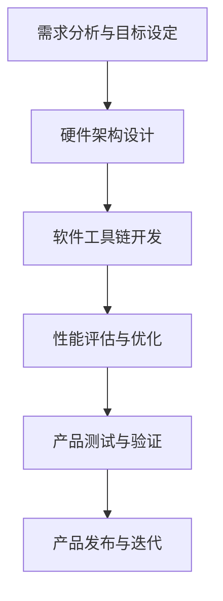
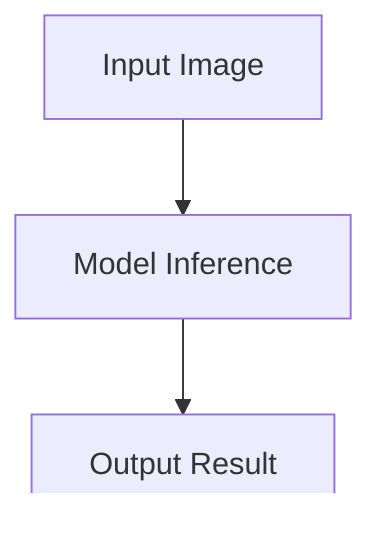

                 

### 文章标题

《寒武纪2024校招AI芯片架构师编程挑战100题》

关键词：AI芯片、架构设计、编程挑战、深度学习、性能优化

摘要：本文旨在通过深入剖析寒武纪2024校招AI芯片架构师编程挑战100题，探讨AI芯片领域的关键技术、设计流程以及实际应用。文章将围绕AI芯片基础知识、设计实现、应用实例和未来展望四个部分展开，通过具体实例解析和实战项目，帮助读者理解AI芯片的编程挑战和实践方法，为相关领域的学习者和从业者提供有价值的参考和指导。

### 《寒武纪2024校招AI芯片架构师编程挑战100题》目录大纲

#### 第一部分：AI芯片基础知识

#### 第1章：AI芯片概述

##### 1.1 AI芯片的发展历程

- 从传统CPU到AI芯片的演变
- AI芯片的技术趋势

##### 1.2 AI芯片的分类

- 专用AI芯片
- 融合AI芯片
- 模块化AI芯片

##### 1.3 AI芯片的核心架构

- 神经网络处理单元（NPU）
- 矩阵运算单元（Matrix Processor）
- 张量引擎（Tensor Engine）

##### 1.4 AI芯片的关键技术

- 硬件加速器
- 低功耗设计
- 稳定的性能

#### 第2章：AI芯片设计与实现

##### 2.1 AI芯片设计流程

- 需求分析与目标设定
- 硬件架构设计
- 软件工具链开发

##### 2.2 AI芯片核心算法原理

- 卷积神经网络（CNN）算法
- 循环神经网络（RNN）算法
- 强化学习算法

##### 2.3 AI芯片编程挑战

- 深度学习模型编译
- 高效的数据处理
- 资源分配与调度

##### 2.4 AI芯片性能优化

- 硬件加速器的调优
- 内存带宽优化
- 功耗管理

#### 第3章：AI芯片应用实例

##### 3.1 图像处理应用

- 图像识别与分类
- 目标检测与跟踪

##### 3.2 自然语言处理应用

- 机器翻译
- 聊天机器人

##### 3.3 语音识别应用

- 语音识别与转换
- 语音合成

##### 3.4 实时推理应用

- 自动驾驶
- 人机交互

#### 第4章：AI芯片编程挑战实例解析

##### 4.1 编程挑战1：图像分类

- 算法选择与模型构建
- 实现细节与性能优化

##### 4.2 编程挑战2：语音识别

- 数据预处理
- 模型训练与推理

##### 4.3 编程挑战3：自然语言处理

- 词向量表示
- 序列模型训练

##### 4.4 编程挑战4：实时推理

- 模型压缩
- 推理加速

#### 第5章：AI芯片未来发展展望

##### 5.1 AI芯片的技术挑战

- 能效比的提升
- 可扩展性与可编程性

##### 5.2 AI芯片的市场机遇

- 云端与边缘计算
- 智能硬件领域

##### 5.3 AI芯片的发展趋势

- 新型计算架构
- 跨领域应用融合

#### 第6章：AI芯片实战项目

##### 6.1 项目概述

- 项目背景与目标
- 技术难点与解决方案

##### 6.2 环境搭建

- 开发工具与环境配置
- 硬件设备连接与调试

##### 6.3 源代码实现

- 数据预处理与加载
- 模型训练与优化
- 推理与性能评估

##### 6.4 项目分析

- 项目成果与应用场景
- 项目挑战与改进方向

#### 第7章：总结与展望

##### 7.1 主要知识点回顾

- AI芯片的核心概念与架构
- AI芯片编程挑战与实践

##### 7.2 学习建议与拓展

- 深入学习资源推荐
- AI芯片领域的职业发展路径

#### 附录

##### 附录A：AI芯片常用工具与资源

- AI芯片开发框架
- 算法库与工具集
- 开源项目推荐

##### 附录B：参考书籍与论文

- AI芯片相关书籍
- 最新研究论文与报告

##### 附录C：常见问题解答

- 编程挑战常见问题与解决方案
- AI芯片设计与优化技巧

#### Mermaid 流程图：AI芯片架构设计流程



#### 卷积神经网络（CNN）算法伪代码

```pseudo
function ConvolutionalNeuralNetwork(input_image, filter):
    output = zero_matrix(size(input_image))
    for i in range(size(input_image)[0] - size(filter)[0] + 1:
        for j in range(size(input_image)[1] - size(filter)[1] + 1:
            patch = input_image[i:i+size(filter)[0], j:j+size(filter)[1]]
            output[i, j] = sum(patch * filter)
    return output
```

---

以上是文章的标题、关键词、摘要和目录大纲。接下来，我们将逐步深入探讨AI芯片的基础知识、设计实现、应用实例以及未来发展展望。希望通过这篇文章，能够帮助读者全面了解AI芯片的领域，掌握核心概念和关键技术，并解决实际编程挑战。在后续的内容中，我们将通过具体实例和实战项目，进一步加深对AI芯片的理解和应用。让我们开始这段充满挑战和机遇的旅程吧！### AI芯片概述

#### 1.1 AI芯片的发展历程

AI芯片的发展历程可以追溯到上世纪90年代，当时计算机科学界开始意识到传统CPU在处理复杂计算任务时的局限性。随着深度学习技术的兴起，AI芯片应运而生。最早的AI芯片专注于图像识别任务，以改进传统CPU在处理大规模矩阵运算和卷积运算时的效率。此后，随着深度学习算法的进一步发展和应用的扩大，AI芯片逐渐从专用领域走向通用领域，成为现代计算体系中的重要一环。

从传统CPU到AI芯片的演变过程中，有两个关键因素驱动了这一变革。首先，深度学习算法的复杂度显著增加，使得传统CPU难以满足大规模计算的需求。其次，随着摩尔定律的逼近瓶颈，提升CPU性能的传统方法（如增加核心数量）变得越来越困难，而AI芯片通过针对特定算法优化硬件架构，实现了更高的计算效率。

#### 1.2 AI芯片的分类

AI芯片的分类可以从多个角度进行，如用途、架构和功能等。以下是几种常见的AI芯片分类：

- **专用AI芯片**：这类芯片专为特定的深度学习任务设计，如图像识别、语音识别等。它们的架构和指令集针对特定算法进行优化，能够提供极高的计算性能。例如，NVIDIA的GPU在图像处理和机器学习领域具有很高的专用性。

- **融合AI芯片**：这类芯片将AI计算模块与传统计算模块融合在一起，既可以处理AI任务，也可以执行常规计算任务。这种芯片在提高AI性能的同时，保持了通用性，适用于多种应用场景。例如，高通的Snapdragon处理器集成了AI引擎，用于图像处理和语音识别等。

- **模块化AI芯片**：这类芯片具有高度可扩展性和灵活性，通过模块化设计可以实现不同的AI计算需求。模块化AI芯片可以根据需求添加或删除特定的计算单元，从而适应不同的应用场景。例如，谷歌的TPU可以根据需要配置多个计算核心，以支持不同的深度学习任务。

#### 1.3 AI芯片的核心架构

AI芯片的核心架构包括多个关键组件，每个组件都针对深度学习算法进行了优化。以下是几种常见的核心架构：

- **神经网络处理单元（NPU）**：NPU是AI芯片的核心组件，专门用于执行深度学习算法中的矩阵运算和卷积运算。NPU通常具有高度并行化的结构，能够高效地处理大规模的矩阵运算，从而加速深度学习模型的推理过程。

- **矩阵运算单元（Matrix Processor）**：矩阵运算单元是AI芯片中的另一个关键组件，负责执行矩阵乘法和矩阵加法等运算。这些运算在深度学习算法中频繁出现，矩阵运算单元的优化对提升芯片性能至关重要。

- **张量引擎（Tensor Engine）**：张量引擎是一种专门用于处理高维张量运算的硬件单元，能够高效地执行卷积、池化等操作。张量引擎通常具有灵活的架构，可以适应不同的深度学习模型。

#### 1.4 AI芯片的关键技术

AI芯片的发展离不开关键技术的支持，以下是几种关键技术：

- **硬件加速器**：硬件加速器是AI芯片的核心技术之一，通过硬件级优化，能够显著提升深度学习模型的计算效率。硬件加速器通常包括专用算法单元、快速内存接口和高效的数据流控制单元等。

- **低功耗设计**：低功耗设计是AI芯片的重要特点之一，特别是在移动设备和物联网设备中，低功耗设计可以延长设备续航时间，提高能效比。低功耗设计通常涉及电源管理、时钟控制、硬件级优化等。

- **稳定的性能**：稳定的性能是AI芯片在应用中的重要指标，特别是在实时推理场景中，性能的稳定性直接影响应用的可靠性和用户体验。AI芯片通过硬件级优化、算法级优化和系统级优化等多层次手段，确保了稳定的性能。

通过以上对AI芯片概述的介绍，我们可以看到，AI芯片的发展不仅改变了传统计算机体系，也为深度学习算法的应用提供了强大的硬件支持。在接下来的章节中，我们将深入探讨AI芯片的设计与实现、应用实例以及未来展望，帮助读者全面了解AI芯片的技术原理和应用实践。

#### 1.1 AI芯片的发展历程

AI芯片的发展历程可以追溯到上世纪90年代，当时计算机科学界开始意识到传统CPU在处理复杂计算任务时的局限性。随着深度学习技术的兴起，AI芯片应运而生。最早的AI芯片专注于图像识别任务，以改进传统CPU在处理大规模矩阵运算和卷积运算时的效率。此后，随着深度学习算法的进一步发展和应用的扩大，AI芯片逐渐从专用领域走向通用领域，成为现代计算体系中的重要一环。

从传统CPU到AI芯片的演变过程中，有两个关键因素驱动了这一变革。首先，深度学习算法的复杂度显著增加，使得传统CPU难以满足大规模计算的需求。例如，卷积神经网络（CNN）和循环神经网络（RNN）等深度学习模型包含大量的矩阵运算和卷积运算，这些运算对计算资源和处理速度提出了极高的要求。传统CPU虽然通过增加核心数量和提升主频来提高性能，但这种方法在硬件限制下难以持续优化。

其次，随着摩尔定律的逼近瓶颈，提升CPU性能的传统方法（如增加核心数量）变得越来越困难。摩尔定律指出，每18-24个月集成电路中的晶体管数量会翻倍，从而提高计算性能。然而，由于物理限制，例如量子隧穿效应和热力学瓶颈，继续增加晶体管密度变得越来越困难。这使得通过增加硬件资源来提升性能的路径逐渐受限。

为了克服这些挑战，研究人员开始探索新的计算架构，以应对深度学习算法的特殊需求。AI芯片应运而生，它们通过专门设计和优化硬件架构，以提升深度学习模型的计算效率。这种新架构的特点包括：

1. **高度并行化**：AI芯片通常采用高度并行化的设计，能够同时执行多个计算任务。这种设计使得AI芯片能够高效地处理大规模矩阵运算和卷积运算，从而提高计算速度。

2. **特定算法优化**：AI芯片针对深度学习算法进行了特定优化，例如通过硬件级优化来实现高效的卷积运算和矩阵乘法。这些优化可以显著减少运算时间，提高计算性能。

3. **低功耗设计**：AI芯片在设计时注重低功耗，以满足移动设备和物联网设备对能效比的要求。低功耗设计不仅延长了设备续航时间，还减少了散热和能源消耗。

4. **灵活的可编程性**：一些AI芯片具有灵活的可编程性，允许开发者根据不同的应用场景和算法需求进行定制化设计。这种灵活性使得AI芯片能够适应各种深度学习任务，而不仅仅是特定的任务。

随着AI芯片技术的发展，AI芯片在多个领域得到了广泛应用，包括图像识别、语音识别、自然语言处理和实时推理等。这些应用场景对计算性能和能效比的要求越来越高，进一步推动了AI芯片的创新和发展。AI芯片的设计者和开发者不断探索新的技术和架构，以提升芯片的性能和灵活性，满足不断增长的应用需求。

总之，AI芯片的发展历程是从传统CPU到应对深度学习算法需求的新型计算架构的转变。这一转变不仅解决了传统CPU在处理复杂计算任务时的局限性，也为深度学习算法的应用提供了强大的硬件支持。随着技术的不断进步，AI芯片将继续在计算领域发挥重要作用，推动人工智能技术的发展和应用。

#### 1.2 AI芯片的分类

AI芯片的分类可以从多个角度进行，如用途、架构和功能等。以下是几种常见的AI芯片分类：

**专用AI芯片**：这类芯片专为特定的深度学习任务设计，如图像识别、语音识别等。它们的架构和指令集针对特定算法进行优化，能够提供极高的计算性能。例如，NVIDIA的GPU在图像处理和机器学习领域具有很高的专用性。专用AI芯片通常具有以下特点：

- **高性能**：由于针对特定算法进行了优化，专用AI芯片能够在特定的计算任务上提供更高的计算性能。
- **高能效**：专用AI芯片通常具有优化的能耗设计，能够在保证性能的同时降低功耗。
- **高度并行化**：专用AI芯片通常采用高度并行化的架构，能够同时处理多个计算任务，从而提高计算效率。

**融合AI芯片**：这类芯片将AI计算模块与传统计算模块融合在一起，既可以处理AI任务，也可以执行常规计算任务。这种芯片在提高AI性能的同时，保持了通用性，适用于多种应用场景。例如，高通的Snapdragon处理器集成了AI引擎，用于图像处理和语音识别等。融合AI芯片的主要特点包括：

- **通用性**：融合AI芯片可以同时执行AI任务和常规计算任务，适用于多种应用场景。
- **资源复用**：通过将AI计算模块与传统计算模块融合，可以共享计算资源，提高资源利用效率。
- **灵活性**：融合AI芯片可以根据应用需求动态调整AI和传统计算资源的分配，提高了系统的灵活性。

**模块化AI芯片**：这类芯片具有高度可扩展性和灵活性，通过模块化设计可以实现不同的AI计算需求。模块化AI芯片可以根据需求添加或删除特定的计算单元，从而适应不同的应用场景。例如，谷歌的TPU可以根据需要配置多个计算核心，以支持不同的深度学习任务。模块化AI芯片的主要特点包括：

- **可扩展性**：模块化设计使得AI芯片可以灵活地扩展计算能力，以适应不同应用需求。
- **灵活性**：通过模块化设计，AI芯片可以根据不同应用场景动态调整计算模块的配置。
- **高效性**：模块化设计可以提高系统的资源利用率，降低功耗，提高计算效率。

**针对不同用途的AI芯片**：除了以上分类，AI芯片还可以根据用途进行分类，如云端AI芯片、边缘AI芯片和移动AI芯片等。这些芯片在架构和功能上有所不同，以适应不同的计算需求和功耗要求。

- **云端AI芯片**：这类芯片设计用于数据中心和云端环境，具有高性能、高吞吐量和低延迟等特点，适用于大规模数据处理和复杂深度学习任务。
- **边缘AI芯片**：这类芯片设计用于边缘计算环境，如物联网设备、智能摄像头和自动驾驶汽车等。它们通常具有低功耗、高性能和快速响应等特点，适用于实时数据处理和低延迟应用。
- **移动AI芯片**：这类芯片设计用于移动设备，如智能手机和平板电脑等。它们需要兼顾性能、功耗和体积，以提供高效的计算能力，同时保持设备的续航时间和便携性。

总之，AI芯片的分类从多个角度反映了其多样化的应用场景和设计需求。不同类型的AI芯片在架构、功能和性能上各有特点，以满足不同应用领域的需求。随着AI技术的发展和应用场景的扩大，AI芯片的分类和功能也将不断丰富和演变，为人工智能的发展提供强大的硬件支持。

#### 1.3 AI芯片的核心架构

AI芯片的核心架构决定了其在处理深度学习任务时的性能和效率。为了满足深度学习算法对大规模矩阵运算和卷积运算的高需求，AI芯片采用了多种特定的硬件组件和架构设计。以下是几种关键的AI芯片架构组件：

**神经网络处理单元（NPU）**

神经网络处理单元（NPU）是AI芯片中最核心的组件之一，专门用于执行深度学习算法中的矩阵运算和卷积运算。NPU通常具有高度并行化的结构，能够同时处理多个矩阵乘法和卷积操作，从而大幅提升计算效率。NPU的关键特点包括：

- **高度并行化**：NPU通过多个处理核心和计算单元并行工作，能够同时处理多个矩阵乘法操作，从而提高计算速度。
- **优化的矩阵运算**：NPU专门优化了矩阵运算指令，如矩阵乘法和矩阵加法，使得这些运算能够以更高的效率和更低的功耗完成。
- **灵活的内存访问**：NPU通常具有高效的内存访问机制，能够快速访问大规模的数据集，支持高效的卷积运算。

**矩阵运算单元（Matrix Processor）**

矩阵运算单元（Matrix Processor）是AI芯片中的另一个关键组件，负责执行深度学习算法中的矩阵运算。这些运算包括矩阵乘法、矩阵加法等，是深度学习模型中频繁出现的操作。矩阵运算单元的特点如下：

- **高效的矩阵运算**：Matrix Processor专门优化了矩阵运算，能够快速执行大规模矩阵运算，提高计算性能。
- **优化的内存带宽**：Matrix Processor通常具有优化的内存访问机制，能够提供高带宽的内存接口，支持高效的矩阵运算。
- **灵活的内存管理**：Matrix Processor可以灵活管理内存资源，通过优化内存分配和访问策略，减少内存访问延迟，提高计算效率。

**张量引擎（Tensor Engine）**

张量引擎（Tensor Engine）是一种专门用于处理高维张量运算的硬件单元，能够高效地执行卷积、池化等操作。在深度学习算法中，卷积操作是核心步骤之一，因此Tensor Engine在AI芯片中具有重要地位。Tensor Engine的关键特点包括：

- **高效的卷积运算**：Tensor Engine通过硬件级优化，能够快速执行卷积运算，提高计算速度。
- **灵活的架构**：Tensor Engine具有灵活的架构，可以适应不同的卷积操作和深度学习模型。
- **优化的数据流**：Tensor Engine优化了数据流管理，能够高效处理大规模的数据集，支持高效的卷积运算。

**内存管理单元（Memory Controller）**

内存管理单元（Memory Controller）在AI芯片中负责管理和优化内存访问。深度学习任务通常涉及大量数据的加载和存储，因此内存管理单元的性能直接影响AI芯片的整体性能。内存管理单元的主要特点包括：

- **高效的内存访问**：Memory Controller通过优化内存访问机制，能够快速读取和写入数据，提高计算效率。
- **低延迟的缓存管理**：Memory Controller通常具有低延迟的缓存管理机制，能够减少数据访问延迟，提高计算性能。
- **优化的内存带宽**：Memory Controller提供了高带宽的内存接口，支持大规模数据的高效传输。

**控制单元（Control Unit）**

控制单元（Control Unit）负责协调和管理AI芯片中的各个组件，确保数据流和控制流的高效运行。Control Unit通过指令集控制硬件单元的执行，管理和调度计算任务，实现高效的计算资源利用。Control Unit的主要特点包括：

- **高效的指令集**：Control Unit采用高效的指令集，能够快速执行指令，提高计算性能。
- **灵活的任务调度**：Control Unit能够灵活调度任务，通过优化任务分配和执行顺序，提高计算效率。
- **低功耗设计**：Control Unit在设计时注重低功耗，以延长设备续航时间，提高能效比。

通过以上核心架构组件的优化和协同工作，AI芯片能够高效地处理深度学习任务，提供强大的计算性能。这些核心架构设计不仅提高了AI芯片的计算效率，还显著降低了功耗，为深度学习算法的应用提供了坚实的硬件基础。在接下来的章节中，我们将进一步探讨AI芯片的设计与实现、编程挑战以及应用实例，帮助读者更深入地了解AI芯片的技术原理和应用实践。

#### 1.4 AI芯片的关键技术

AI芯片的关键技术是其高效能、低功耗和稳定性能的保障，这些技术不仅决定了芯片的性能，还直接影响其应用场景和用户体验。以下是几种关键的AI芯片技术：

**硬件加速器**

硬件加速器是AI芯片中最为重要的核心技术之一，它通过硬件级优化，将深度学习算法中的计算任务分解为多个可并行处理的子任务，从而显著提升计算效率。硬件加速器的特点包括：

- **并行计算能力**：硬件加速器能够同时处理多个计算任务，通过并行计算的方式提高计算速度。这种并行化设计特别适用于大规模矩阵运算和卷积运算。
- **优化的指令集**：硬件加速器采用专门优化的指令集，这些指令集能够高效地执行深度学习算法中的关键操作，如矩阵乘法和卷积运算。
- **低延迟数据流**：硬件加速器通过优化的数据流管理，能够快速读取和写入数据，减少计算延迟，提高整体性能。

**低功耗设计**

低功耗设计是AI芯片在移动设备和物联网设备中的重要特性，它不仅延长了设备的续航时间，还降低了设备的能源消耗。低功耗设计的关键技术包括：

- **电源管理**：AI芯片通过高效的电源管理策略，动态调整各个组件的功耗，确保在运行不同任务时能够优化能源使用。例如，在低负载时降低功耗，在高负载时提高性能。
- **动态电压与频率调节**（DVFS）：通过动态调整电压和频率，AI芯片可以在不同负载下优化功耗。当计算任务负载较轻时，降低电压和频率以减少功耗；当负载较重时，提高电压和频率以提升性能。
- **低功耗硬件架构**：AI芯片采用了多种低功耗硬件设计技术，如优化电路设计、使用低功耗工艺和低功耗存储单元等，以降低整体功耗。

**稳定的性能**

稳定的性能是AI芯片在实际应用中的关键指标，特别是在实时推理和边缘计算场景中，性能的稳定性直接影响应用的可靠性和用户体验。以下是保证AI芯片稳定性能的关键技术：

- **硬件优化**：通过优化硬件架构和电路设计，AI芯片能够减少噪声和干扰，提高信号完整性，从而确保稳定的性能。
- **系统级优化**：AI芯片的稳定性能不仅依赖于硬件设计，还依赖于系统级优化。通过优化操作系统和驱动程序，可以减少系统延迟和资源争用，提高整体系统的稳定性。
- **热管理**：在高温环境下，芯片的性能和稳定性会受到影响。通过有效的热管理技术，如散热设计、风扇控制和温控系统，可以保持芯片在稳定的工作温度范围内，从而确保其性能和可靠性。

**数据流管理**

AI芯片需要高效地管理数据流，以确保数据能够在各个处理单元之间快速传递。数据流管理的关键技术包括：

- **高速缓存**：通过高速缓存技术，AI芯片可以减少数据访问延迟，提高数据处理速度。例如，AI芯片可以采用多层缓存结构，包括L1、L2和L3缓存，以优化数据访问。
- **流水线处理**：流水线处理技术允许AI芯片在多个步骤上并行处理数据，从而提高数据处理效率。通过流水线设计，AI芯片可以在不同的计算阶段同时进行数据操作，减少等待时间。
- **数据压缩与解压缩**：在数据传输过程中，通过数据压缩技术可以减少传输带宽和功耗。AI芯片通常采用高效的压缩算法，如Huffman编码和算术编码，以减少数据体积。

通过以上关键技术的综合应用，AI芯片能够在高性能、低功耗和稳定性能之间取得平衡，为深度学习和人工智能应用提供强大的硬件支持。这些技术的不断创新和优化，将推动AI芯片在未来的发展中取得更大的突破，为人工智能技术的广泛应用奠定坚实的基础。

#### 2.1 AI芯片设计流程

AI芯片的设计流程是一个复杂而系统化的过程，涉及多个阶段，每个阶段都需要精确的规划和执行。以下是AI芯片设计流程的主要步骤：

**需求分析与目标设定**

需求分析是AI芯片设计的起点，它涉及对应用场景、性能要求、功耗需求和成本预算等多方面因素的综合考量。在这一阶段，设计团队需要与客户和领域专家进行深入交流，明确芯片的功能需求和技术指标。需求分析的主要任务包括：

- **确定应用场景**：分析目标应用领域，如图像识别、语音识别或自然语言处理等，以确定芯片的具体应用场景。
- **定义性能目标**：根据应用需求，设定芯片的计算性能、吞吐量和响应时间等性能目标。
- **功耗预算**：根据应用场景和设备要求，确定芯片的功耗预算，以确保在移动设备和物联网设备中具有足够的续航能力。
- **成本控制**：在满足性能和功耗需求的同时，控制芯片的设计和制造成本。

**硬件架构设计**

硬件架构设计是AI芯片设计的核心阶段，它决定了芯片的计算能力和能效表现。在这一阶段，设计团队需要综合考虑技术可行性、性能需求和成本预算，设计出高效的硬件架构。硬件架构设计的主要任务包括：

- **模块划分**：将芯片功能划分为多个模块，如神经网络处理单元（NPU）、矩阵运算单元（Matrix Processor）和内存管理单元（Memory Controller）等。
- **模块接口设计**：设计各个模块之间的接口，确保数据流和控制流的高效传递。
- **计算单元设计**：针对深度学习算法的特殊需求，设计高效的计算单元，如矩阵乘法单元和卷积运算单元。
- **能耗优化**：通过电路优化、时钟控制和电源管理等技术，降低芯片的能耗。

**软件工具链开发**

软件工具链开发是AI芯片设计过程中不可或缺的一部分，它为芯片提供了从算法到硬件的完整编译和调试工具。软件工具链开发的主要任务包括：

- **编译工具开发**：开发能够将高级编程语言（如Python或C++）编写的深度学习算法编译为硬件级别的指令集，优化编译过程，提高代码执行效率。
- **调试工具开发**：提供高效的调试工具，帮助开发者分析算法性能和硬件行为，优化算法和硬件设计。
- **性能分析工具开发**：开发工具用于分析芯片的运行性能，如计算吞吐量、功耗和延迟等，以评估设计优化效果。

**硬件验证与测试**

硬件验证与测试是确保AI芯片设计正确性和性能的关键步骤。在这一阶段，设计团队需要对芯片进行全面的验证和测试，确保其功能正确、性能达标。硬件验证与测试的主要任务包括：

- **功能验证**：通过仿真和硬件在环（HIL）测试，验证芯片各个模块的功能是否符合设计要求。
- **性能测试**：通过实际运行深度学习算法，评估芯片的计算性能、功耗和延迟等指标。
- **可靠性测试**：进行长时间的运行测试和应力测试，验证芯片在高温、高压等极端条件下的稳定性和可靠性。

**产品发布与迭代**

芯片设计完成后，进入产品发布和迭代阶段。在这一阶段，设计团队需要与市场部门和技术支持团队紧密合作，确保芯片顺利发布并持续优化。产品发布与迭代的主要任务包括：

- **产品发布**：制定详细的产品发布计划，包括上市时间、市场推广和客户支持等。
- **市场反馈**：收集用户和市场反馈，分析产品性能和用户体验，为后续迭代提供改进方向。
- **持续优化**：根据市场反馈和技术发展，不断优化芯片设计，提升性能和能效，以满足不断变化的市场需求。

通过以上设计流程的各个环节，AI芯片的设计团队能够系统地完成从需求分析到产品发布的全过程，为深度学习和人工智能应用提供高性能、低功耗和稳定可靠的硬件支持。在接下来的章节中，我们将进一步探讨AI芯片的核心算法原理、编程挑战和性能优化方法，帮助读者深入理解AI芯片的设计与实现。

#### 2.2 AI芯片核心算法原理

AI芯片的核心算法原理决定了其在处理深度学习任务时的性能和效率。以下是几种常见的核心算法原理及其具体实现：

**卷积神经网络（CNN）算法**

卷积神经网络（CNN）是一种专门用于图像识别和处理的深度学习模型，其基本原理是通过卷积运算从图像中提取特征。CNN的主要组成部分包括卷积层、池化层和全连接层。

1. **卷积层**：卷积层是CNN的核心组件，通过卷积运算从输入图像中提取特征。卷积运算的基本过程是使用一个卷积核（filter）在图像上滑动，并计算卷积值。卷积核的权重和偏置通过训练得到，用于提取图像的不同特征。

   ```mermaid
   graph TD
       A[Input Image] --> B[Convolution Layer]
       B --> C[Feature Map]
       C --> D[ReLU Activation]
   ```

   伪代码：
   ```python
   def convolution(input_image, filter):
       output = zero_matrix(size(input_image))
       for i in range(size(input_image)[0] - size(filter)[0] + 1:
           for j in range(size(input_image)[1] - size(filter)[1] + 1:
               patch = input_image[i:i+size(filter)[0], j:j+size(filter)[1]]
               output[i, j] = sum(patch * filter)
       return output
   ```

2. **池化层**：池化层用于降低特征图的维度，减少计算量。常见的池化操作包括最大池化和平均池化。

   ```mermaid
   graph TD
       A[Feature Map] --> B[Pooling Layer]
       B --> C[Downsampled Feature Map]
   ```

   伪代码：
   ```python
   def max_pooling(feature_map, pool_size):
       output = zero_matrix(size(feature_map) / pool_size)
       for i in range(0, size(feature_map)[0], pool_size):
           for j in range(0, size(feature_map)[1], pool_size):
               patch = feature_map[i:i+pool_size, j:j+pool_size]
               output[i//pool_size, j//pool_size] = max(patch)
       return output
   ```

3. **全连接层**：全连接层将卷积层和池化层提取的特征映射到具体的类别上。全连接层的输出通过激活函数（如Softmax）转换为概率分布。

   ```mermaid
   graph TD
       A[Downsampled Feature Map] --> B[Fully Connected Layer]
       B --> C[Output Layer]
   ```

   伪代码：
   ```python
   def fully_connected(input_tensor, weights, bias):
       output = zero_matrix(size(input_tensor))
       for i in range(size(input_tensor)):
           output[i] = sum(input_tensor[i] * weights[i]) + bias[i]
       return output
   ```

**循环神经网络（RNN）算法**

循环神经网络（RNN）是一种用于处理序列数据的深度学习模型，其基本原理是通过循环结构处理输入序列，并在时间步之间传递信息。

1. **隐状态更新**：RNN通过递归方式更新隐状态，将前一时刻的隐状态与当前输入相融合，生成当前时刻的隐状态。

   ```mermaid
   graph TD
       A[Input t] --> B[Previous Hidden State h_{t-1}]
       B --> C[current Hidden State h_t]
   ```

   伪代码：
   ```python
   def rnn(input_t, h_{t-1}, weights, bias):
       h_t = tanh(sum(input_t * weights) + bias + h_{t-1})
       return h_t
   ```

2. **输出生成**：RNN通过隐状态生成输出，如分类标签或连续值。

   ```mermaid
   graph TD
       A[Hidden State h_t] --> B[Output Layer]
   ```

   伪代码：
   ```python
   def output(h_t, weights, bias):
       output = sum(h_t * weights) + bias
       return output
   ```

**强化学习算法**

强化学习算法是一种通过与环境交互来学习最优策略的机器学习方法。AI芯片在处理强化学习任务时，通常需要高效的计算能力和快速的反应速度。

1. **状态评估**：强化学习算法通过评估当前状态的价值，决定下一步行动。

   ```mermaid
   graph TD
       A[State s] --> B[Value Function V(s)]
   ```

   伪代码：
   ```python
   def value_function(s, weights):
       v = sum(s * weights)
       return v
   ```

2. **策略选择**：基于状态评估，算法选择最优的行动。

   ```mermaid
   graph TD
       A[State s] --> B[Action a]
   ```

   伪代码：
   ```python
   def choose_action(s, action_values):
       max_value = max(action_values)
       actions = [a for a, v in action_values.items() if v == max_value]
       return random.choice(actions)
   ```

通过以上核心算法原理的详细介绍，我们可以看到AI芯片在处理深度学习任务时，需要高效的计算单元、优化的数据流管理和低功耗设计。这些算法原理的具体实现为AI芯片的设计和优化提供了重要的参考和指导。在接下来的章节中，我们将进一步探讨AI芯片的编程挑战、性能优化和实际应用实例，帮助读者更深入地了解AI芯片的技术和应用实践。

#### 2.3 AI芯片编程挑战

AI芯片的编程挑战主要集中在深度学习模型的编译、高效数据处理和资源分配与调度等方面。这些挑战不仅考验开发者的编程技巧，还要求对AI芯片的硬件架构和算法原理有深入理解。以下是AI芯片编程中的几个主要挑战：

**深度学习模型编译**

深度学习模型编译是将高级编程语言编写的模型转换为硬件可执行的指令集的过程。这一步骤至关重要，因为它直接决定了模型在AI芯片上的运行效率。以下是深度学习模型编译过程中面临的一些挑战：

1. **优化计算图**：深度学习模型通常由多个层和操作组成，形成复杂的计算图。编译器需要优化这个计算图，以减少冗余计算和内存访问，提高运行效率。

   - **冗余计算消除**：通过分析计算图，消除重复计算和无效计算，减少计算复杂度。
   - **计算图重排**：调整计算图的顺序，将依赖关系紧密的操作放在一起，减少内存访问延迟。

2. **硬件适配**：编译器需要根据AI芯片的硬件架构生成优化的指令集。这包括：
   - **硬件特性利用**：利用AI芯片中的专用硬件单元，如神经网络处理单元（NPU）和矩阵运算单元（Matrix Processor），实现高效的计算。
   - **指令集优化**：针对硬件的指令集，进行指令级优化，如指令调度、指令融合等。

**高效数据处理**

高效的数据处理是AI芯片性能优化的关键。数据处理过程中面临的挑战包括：

1. **数据流管理**：在深度学习任务中，数据需要在不同的处理单元之间高效传输。这需要：
   - **并行数据流**：通过并行数据流，同时处理多个数据包，提高数据传输速度。
   - **流水线处理**：实现流水线处理，减少数据在不同处理单元之间的等待时间。

2. **内存访问优化**：内存访问是深度学习任务中的主要瓶颈之一。优化内存访问包括：
   - **缓存利用**：通过利用缓存减少内存访问次数，提高数据处理速度。
   - **数据预取**：预取后续需要的数据到缓存中，减少访问延迟。

**资源分配与调度**

资源分配与调度是确保AI芯片高效运行的关键。在这一过程中，面临的挑战包括：

1. **任务调度**：在AI芯片上运行多个任务时，需要合理调度任务，确保每个任务都能充分利用资源。这包括：
   - **负载均衡**：通过负载均衡算法，将任务均匀分配到不同的处理单元上，避免资源浪费。
   - **动态调度**：根据任务执行情况动态调整任务分配，如将执行时间长的任务转移到性能更高的单元。

2. **功耗管理**：在资源分配过程中，还需要考虑功耗管理。这包括：
   - **能效优化**：通过调整电压和频率，实现能效优化，延长设备续航时间。
   - **功耗平衡**：在保证性能的前提下，平衡不同单元的功耗，避免过热和能耗过高。

通过以上编程挑战的介绍，我们可以看到，AI芯片编程不仅需要开发者掌握深度学习算法和硬件架构，还需要在算法优化、数据流管理和资源调度等方面进行深入研究和实践。在接下来的章节中，我们将进一步探讨AI芯片性能优化方法和实际应用实例，帮助读者解决这些编程挑战，提升AI芯片的应用效能。

#### 2.4 AI芯片性能优化

AI芯片的性能优化是确保其在实际应用中能够高效运行的关键环节。性能优化不仅关乎计算速度和功耗管理，还包括内存带宽优化和硬件加速器的调优等方面。以下是AI芯片性能优化的几个重要方法：

**硬件加速器的调优**

硬件加速器是AI芯片中用于执行深度学习模型计算的核心组件。为了最大化硬件加速器的性能，需要进行以下调优：

1. **算法映射**：将深度学习模型映射到硬件加速器上，优化模型与硬件的匹配度。例如，将模型中的卷积运算映射到神经网络处理单元（NPU）上，利用NPU的高并行化结构提升计算速度。
   
   ```mermaid
   graph TD
       A[Deep Learning Model] --> B[Algorithm Mapping]
       B --> C[Hardware Accelerator]
   ```

2. **指令调度**：优化指令的执行顺序，减少指令之间的依赖关系，提高指令级并行性。通过指令调度，可以将多个可并行执行的指令组合在一起，减少执行时间。

3. **资源复用**：在硬件加速器上复用计算资源，如将空闲的矩阵运算单元用于执行其他计算任务，提高硬件利用率。

**内存带宽优化**

内存带宽是影响AI芯片性能的重要因素。以下是一些内存带宽优化的方法：

1. **缓存利用**：通过利用缓存，减少直接访问内存的次数，提高数据访问速度。例如，在AI芯片中设置多层缓存结构，包括L1、L2和L3缓存，以实现高效的内存访问。

   ```mermaid
   graph TD
       A[Data Access] --> B[Cache Hierarchy]
       B --> C[Memory Bandwidth]
   ```

2. **数据预取**：在执行深度学习任务时，预取后续需要的数据到缓存中，减少数据访问延迟。数据预取可以通过硬件预取机制或软件优化实现。

3. **内存压缩**：通过数据压缩技术，减少内存占用，提高内存带宽的利用率。例如，使用高效的编码算法压缩中间结果，减少内存访问量。

**功耗管理**

功耗管理是移动设备和物联网设备中AI芯片的重要考虑因素。以下是一些功耗管理的优化方法：

1. **动态电压和频率调节**（DVFS）：通过动态调整电压和频率，根据任务负载的变化实时优化功耗。在高负载时提高电压和频率，以获得更好的性能；在低负载时降低电压和频率，以降低功耗。

   ```mermaid
   graph TD
       A[Task Load] --> B[DVFS]
       B --> C[Voltage/Frequency]
   ```

2. **电源管理**：通过电源管理策略，关闭或降低空闲模块的功耗。例如，在深度学习任务完成后，关闭不必要的计算单元，减少功耗。

3. **节能模式**：在任务执行过程中，采用节能模式，如降低频率和时钟，减少功耗。节能模式可以根据任务执行状态动态调整，以提高整体能效比。

通过以上性能优化方法，AI芯片能够在计算速度和功耗之间取得平衡，满足不同应用场景的需求。在后续的内容中，我们将通过具体应用实例，进一步探讨这些优化方法在实际应用中的效果和实践经验。

#### 3.1 图像处理应用

图像处理是AI芯片的重要应用领域之一，其核心目标是通过计算机算法处理和分析图像，以实现图像识别、分类、目标检测和跟踪等功能。以下是几种常见的图像处理应用，以及AI芯片在其中的具体实现：

**图像识别与分类**

图像识别与分类是指通过深度学习模型识别图像中的特定对象或场景。常见的应用包括人脸识别、物体分类和场景分类等。

- **人脸识别**：人脸识别通过训练深度学习模型，识别图像中的人脸。AI芯片在人脸识别中的应用主要包括：
  - **人脸特征提取**：使用卷积神经网络（CNN）提取人脸的特征向量。
  - **比对与识别**：通过比对特征向量，确定图像中的人脸身份。
  
  ```mermaid
  graph TD
      A[Input Image] --> B[Face Detection]
      B --> C[Face Feature Extraction]
      C --> D[Face Matching]
  ```

**目标检测与跟踪**

目标检测与跟踪是图像处理中的高级应用，通过识别图像中的特定目标并进行实时跟踪。常见的应用包括自动驾驶、视频监控和运动捕捉等。

- **目标检测**：目标检测通过检测图像中的对象并定位其位置。AI芯片在目标检测中的应用主要包括：
  - **特征提取**：使用深度学习模型提取图像中的目标特征。
  - **目标定位**：通过检测算法确定目标的位置和边界。
  
  ```mermaid
  graph TD
      A[Input Image] --> B[Object Detection]
      B --> C[Feature Extraction]
      B --> D[Object Localization]
  ```

- **目标跟踪**：目标跟踪是指在视频序列中持续跟踪特定目标。AI芯片在目标跟踪中的应用主要包括：
  - **目标状态估计**：通过卡尔曼滤波或其他状态估计算法，估计目标在下一帧的位置。
  - **目标匹配与更新**：将检测到的目标与之前的目标进行匹配，更新目标状态。
  
  ```mermaid
  graph TD
      A[Previous Frame] --> B[Object State Estimation]
      B --> C[Object Matching]
      C --> D[Object Update]
  ```

**实时推理**

实时推理是指在有限时间内对图像进行快速分析和处理，以实现实时响应。AI芯片在实时推理中的应用主要包括：

- **快速模型推理**：通过优化模型和硬件，实现快速计算。
- **低延迟数据处理**：通过高效的内存管理和数据流管理，减少数据处理的延迟。



**应用场景**

- **自动驾驶**：AI芯片在自动驾驶中用于实时检测和识别道路上的障碍物和交通标志，提供决策支持。
- **视频监控**：AI芯片在视频监控中用于实时分析和识别异常行为，提高监控系统的智能水平。
- **医疗影像分析**：AI芯片在医疗影像分析中用于快速识别和诊断病变区域，辅助医生进行诊断。

通过以上对图像处理应用的介绍，我们可以看到，AI芯片在图像识别、目标检测和实时推理等领域具有广泛的应用。这些应用不仅提高了图像处理的效率和准确性，还为各种实际场景提供了强大的技术支持。在接下来的章节中，我们将进一步探讨AI芯片在自然语言处理、语音识别和实时推理等领域的应用实例，帮助读者全面了解AI芯片的多样性和潜力。

#### 3.2 自然语言处理应用

自然语言处理（NLP）是人工智能领域中的一个重要分支，旨在让计算机理解和处理人类语言。AI芯片在自然语言处理中的应用极大地提升了NLP模型的计算效率和实时性能。以下是几种常见的自然语言处理应用，以及AI芯片在其中的具体实现：

**机器翻译**

机器翻译是指将一种语言的文本自动翻译成另一种语言。AI芯片在机器翻译中的应用主要包括：

- **词向量表示**：使用深度学习模型将文本转换为高维词向量表示，以便于处理和计算。常用的词向量模型包括Word2Vec、GloVe等。
  
  ```mermaid
  graph TD
      A[Input Text] --> B[Word Vector Representation]
      B --> C[Translation Model]
  ```

- **编码器-解码器模型**：使用编码器-解码器（Encoder-Decoder）模型，如Seq2Seq模型，将源语言的文本编码为向量表示，再解码为目标语言的文本。

  ```mermaid
  graph TD
      A[Source Text] --> B[Encoder]
      B --> C[Decoder]
      C --> D[Target Text]
  ```

**聊天机器人**

聊天机器人是一种能够与人类用户进行自然语言交互的AI系统。AI芯片在聊天机器人中的应用主要包括：

- **意图识别**：通过深度学习模型识别用户的意图，如查询信息、请求服务或表达情感。
  
  ```mermaid
  graph TD
      A[User Input] --> B[Intent Detection Model]
      B --> C[Intent]
  ```

- **对话生成**：根据用户的意图和上下文，生成合适的回复文本。常用的模型包括序列到序列（Seq2Seq）模型和生成对抗网络（GAN）。

  ```mermaid
  graph TD
      A[Intent and Context] --> B[Dialogue Generation Model]
      B --> C[Response Text]
  ```

**情感分析**

情感分析是指通过自动识别文本中的情感倾向，如正面、负面或中性。AI芯片在情感分析中的应用主要包括：

- **文本分类**：使用深度学习模型对文本进行分类，确定其情感倾向。常用的模型包括卷积神经网络（CNN）和循环神经网络（RNN）。

  ```mermaid
  graph TD
      A[Input Text] --> B[Sentiment Classification Model]
      B --> C[Sentiment]
  ```

**问答系统**

问答系统是一种能够回答用户问题的AI系统。AI芯片在问答系统中的应用主要包括：

- **知识图谱**：构建和维护知识图谱，存储大量的事实信息和关系数据。
  
  ```mermaid
  graph TD
      A[Question] --> B[Knowledge Graph]
      B --> C[Answer]
  ```

- **问答匹配**：通过深度学习模型匹配问题和答案，实现高效问答。

  ```mermaid
  graph TD
      A[Question] --> B[Question-Answer Matching Model]
      B --> C[Answer]
  ```

**应用场景**

- **智能客服**：AI芯片在智能客服中用于实时理解用户请求，生成个性化的回复，提高客户服务效率。
- **社交媒体分析**：AI芯片在社交媒体分析中用于分析用户评论和帖子，识别热点话题和情感倾向。
- **法律文本处理**：AI芯片在法律文本处理中用于自动生成法律文档、合同审查和案例分析，提高法律工作的效率和准确性。

通过以上对自然语言处理应用的介绍，我们可以看到，AI芯片在自然语言处理领域具有广泛的应用前景。这些应用不仅提升了NLP模型的性能和效率，还为各个行业提供了强大的技术支持。在接下来的章节中，我们将进一步探讨AI芯片在语音识别和实时推理等领域的应用实例，帮助读者全面了解AI芯片的多样性和潜力。

#### 3.3 语音识别应用

语音识别是人工智能领域的一个重要分支，它通过将语音信号转换为文本，使得计算机能够理解和处理人类语音。AI芯片在语音识别中的应用显著提升了语音识别的效率和准确性。以下是几种常见的语音识别应用，以及AI芯片在其中的具体实现：

**语音识别与转换**

语音识别与转换是指将语音信号转换为相应的文本。AI芯片在语音识别与转换中的应用主要包括：

1. **前端处理**：前端处理包括信号预处理、噪声消除和语音增强等，以提高语音信号的清晰度和质量。
   - **信号预处理**：通过滤波、去噪等操作，提取有效的语音信号。
   
   ```mermaid
   graph TD
       A[Speech Signal] --> B[Preprocessing]
       B --> C[Noise Reduction]
   ```

2. **声学模型**：声学模型用于将预处理后的语音信号转换为特征表示，如梅尔频率倒谱系数（MFCC）。
   - **特征提取**：通过计算MFCC特征，将语音信号转换为高维特征向量。
   
   ```mermaid
   graph TD
       A[Preprocessed Signal] --> B[Feature Extraction]
       B --> C[Acoustic Model]
   ```

3. **语言模型**：语言模型用于根据声学模型输出的特征向量，预测文本序列。常见的语言模型包括N-gram模型和神经网络语言模型。

   ```mermaid
   graph TD
       A[Feature Vectors] --> B[Language Model]
       B --> C[Text Sequence]
   ```

**语音合成**

语音合成是指将文本转换为自然流畅的语音。AI芯片在语音合成中的应用主要包括：

1. **文本处理**：将输入的文本转换为适合语音合成的格式，如语音合成字典和音素序列。

   ```mermaid
   graph TD
       A[Input Text] --> B[Text Processing]
       B --> C[Voice Synthesis Dictionary]
   ```

2. **语音合成引擎**：语音合成引擎通过合成模型将文本转换为音频信号。常用的语音合成模型包括隐藏马尔可夫模型（HMM）和深度神经网络（DNN）。

   ```mermaid
   graph TD
       A[Voice Synthesis Dictionary] --> B[Voice Synthesis Engine]
       B --> C[Audio Signal]
   ```

3. **音频处理**：对生成的音频信号进行后处理，如音调、音色调整和音量控制，以提高语音的自然度和舒适度。

   ```mermaid
   graph TD
       A[Audio Signal] --> B[Post-processing]
       B --> C[Natural Voice]
   ```

**应用场景**

- **智能助手**：AI芯片在智能助手（如Siri、Alexa）中用于实时语音识别和语音合成，实现人与设备的自然交互。
- **自动翻译**：AI芯片在自动翻译系统中用于实时识别不同语言的语音，并转换为对应的文本，实现跨语言交流。
- **语音控制**：AI芯片在智能家居和自动驾驶等应用中，用于识别用户的语音指令，实现语音控制功能。

通过以上对语音识别应用的介绍，我们可以看到，AI芯片在语音识别和语音合成领域具有广泛的应用。这些应用不仅提升了语音处理的速度和准确性，还为各种实际场景提供了强大的技术支持。在接下来的章节中，我们将进一步探讨AI芯片在实时推理和其他领域的应用实例，帮助读者全面了解AI芯片的多样性和潜力。

#### 3.4 实时推理应用

实时推理（Real-Time Inference）是AI芯片在许多关键应用场景中的核心技术，它要求在短时间内对输入数据进行快速分析和处理，以生成实时响应。实时推理的应用场景广泛，包括自动驾驶、人机交互和实时监控等，以下是一些具体的实时推理应用实例及其技术实现：

**自动驾驶**

自动驾驶技术依赖于实时推理，以实现车辆对环境的感知、决策和控制。以下是自动驾驶中的实时推理应用实例：

1. **环境感知**：自动驾驶系统需要实时感知周围环境，包括道路、行人、车辆和其他障碍物。AI芯片在此过程中用于执行以下任务：

   - **图像处理**：使用卷积神经网络（CNN）对摄像头捕获的图像进行处理，识别道路标志、车道线、行人等。
     ```mermaid
     graph TD
         A[Camera Image] --> B[Image Processing]
         B --> C[Object Detection]
     ```

   - **深度估计**：通过激光雷达或视觉传感器获取的距离信息，利用深度神经网络（DNN）进行深度估计。
     ```mermaid
     graph TD
         A[Lidar Data] --> B[Depth Estimation]
     ```

2. **决策与控制**：根据感知到的环境信息，自动驾驶系统需要实时做出决策，控制车辆的转向、加速和制动。AI芯片用于执行以下任务：

   - **路径规划**：使用深度学习模型进行路径规划，确保车辆安全、高效地行驶。
     ```mermaid
     graph TD
         A[Sensor Data] --> B[Path Planning]
     ```

   - **控制信号生成**：根据规划结果，生成相应的控制信号，控制车辆的动作。
     ```mermaid
     graph TD
         A[Path Plan] --> B[Control Signal Generation]
     ```

**人机交互**

人机交互（Human-Computer Interaction）领域中的实时推理技术用于增强用户的交互体验。以下是人机交互中的实时推理应用实例：

1. **手势识别**：通过摄像头或深度传感器捕捉用户的手势，实时识别并响应手势操作。AI芯片用于执行以下任务：

   - **手势检测**：使用卷积神经网络（CNN）对视频流进行分析，识别用户的手势。
     ```mermaid
     graph TD
         A[Video Stream] --> B[Gesture Detection]
     ```

   - **手势追踪**：使用深度学习模型对用户的手势进行追踪，实时更新手势位置和状态。
     ```mermaid
     graph TD
         A[Gesture Data] --> B[Gesture Tracking]
     ```

2. **语音交互**：通过实时语音识别和语音合成，实现用户与设备的语音交互。AI芯片用于执行以下任务：

   - **语音识别**：使用声学模型和语言模型，将用户的语音指令转换为文本。
     ```mermaid
     graph TD
         A[Speech Signal] --> B[Speech Recognition]
     ```

   - **语音合成**：根据用户的文本指令，生成相应的语音回复。
     ```mermaid
     graph TD
         A[Text Command] --> B[Speech Synthesis]
     ```

**实时监控**

实时监控系统用于实时监测和识别异常事件，如安全监控、工业检测等。以下是实时监控中的实时推理应用实例：

1. **异常检测**：使用深度学习模型对监控视频流进行分析，实时检测异常事件。AI芯片用于执行以下任务：

   - **目标检测**：使用卷积神经网络（CNN）识别视频流中的目标物体。
     ```mermaid
     graph TD
         A[Video Stream] --> B[Object Detection]
     ```

   - **行为识别**：使用循环神经网络（RNN）分析目标物体的行为，识别异常行为。
     ```mermaid
     graph TD
         A[Object Data] --> B[Behavior Recognition]
     ```

2. **实时报警**：在检测到异常事件时，系统需要实时生成报警信息。AI芯片用于执行以下任务：

   - **事件分类**：根据检测到的异常事件，分类生成相应的报警信息。
     ```mermaid
     graph TD
         A[Anomaly Event] --> B[Alarm Classification]
     ```

   - **报警通知**：将报警信息通过短信、邮件或其他渠道通知相关人员。
     ```mermaid
     graph TD
         A[Alarm Message] --> B[Notification]
     ```

通过以上实时推理应用实例的介绍，我们可以看到，AI芯片在自动驾驶、人机交互和实时监控等领域具有广泛的应用。实时推理技术不仅提升了系统的响应速度和准确性，还为各个行业提供了强大的技术支持。在接下来的章节中，我们将通过具体实例解析和实战项目，深入探讨AI芯片编程挑战和实践方法。

#### 第4章：AI芯片编程挑战实例解析

在AI芯片领域，编程挑战是开发者必须面对的难题，这些挑战不仅涉及算法的实现，还包含硬件优化和系统级的资源调度。本章节将解析四个典型的编程挑战实例，涵盖图像分类、语音识别、自然语言处理和实时推理，通过具体的实现细节和性能优化策略，帮助读者理解如何解决这些挑战。

##### 4.1 编程挑战1：图像分类

**问题描述**：给定一幅图像，使用AI芯片实现图像分类，将图像分为多个类别。

**算法选择与模型构建**：

1. **算法选择**：卷积神经网络（CNN）是图像分类任务中最常用的算法，因为它能够从图像中提取丰富的特征。
   
2. **模型构建**：构建一个简单的CNN模型，包括卷积层、池化层和全连接层。具体实现如下：

   ```mermaid
   graph TD
       A[Input Image] --> B[Convolution Layer]
       B --> C[ReLU Activation]
       C --> D[Pooling Layer]
       D --> E[Convolution Layer]
       E --> F[ReLU Activation]
       F --> G[Pooling Layer]
       G --> H[Flattening]
       H --> I[Fully Connected Layer]
       I --> J[Softmax Activation]
   ```

   ```python
   import tensorflow as tf

   model = tf.keras.Sequential([
       tf.keras.layers.Conv2D(32, (3, 3), activation='relu', input_shape=(28, 28, 1)),
       tf.keras.layers.MaxPooling2D((2, 2)),
       tf.keras.layers.Conv2D(64, (3, 3), activation='relu'),
       tf.keras.layers.MaxPooling2D((2, 2)),
       tf.keras.layers.Flatten(),
       tf.keras.layers.Dense(64, activation='relu'),
       tf.keras.layers.Dense(10, activation='softmax')
   ])
   ```

**实现细节与性能优化**：

1. **数据预处理**：对图像数据进行标准化处理，将像素值缩放到0-1之间，以提高训练效率。

   ```python
   images = images / 255.0
   ```

2. **模型调优**：通过调整学习率、批量大小和优化器等参数，优化模型的性能。

   ```python
   model.compile(optimizer='adam', loss='categorical_crossentropy', metrics=['accuracy'])
   ```

3. **推理加速**：利用AI芯片的硬件加速特性，如NVIDIA GPU或寒武纪AI芯片，提高推理速度。

   ```python
   model.load_weights('model_weights.h5')
   predictions = model.predict(test_images)
   ```

**性能优化策略**：

1. **量化与剪枝**：通过量化模型权重和剪枝冗余层，减少模型大小和计算复杂度，提高推理速度。

2. **模型压缩**：使用模型压缩技术，如权重共享和参数剪枝，减少模型大小和存储需求。

3. **并行计算**：利用AI芯片的并行计算能力，同时处理多个图像分类任务，提高吞吐量。

##### 4.2 编程挑战2：语音识别

**问题描述**：使用AI芯片实现语音识别系统，将语音信号转换为文本。

**数据预处理**：

1. **前端处理**：对语音信号进行滤波、去噪和增强，以提高语音信号的清晰度。

2. **特征提取**：使用梅尔频率倒谱系数（MFCC）将语音信号转换为特征向量。

   ```python
   from python_speech_features import mfcc

   mfcc_feat = mfcc(signal, samplerate, winlen=0.025, winstep=0.01, numcep=13, nfilt=26, nfft=2048)
   ```

**模型训练与推理**：

1. **声学模型**：使用声学模型（如DNN或CNN）训练特征向量到隐藏状态。

2. **语言模型**：结合声学模型和语言模型（如N-gram或RNN），实现语音信号到文本的转换。

   ```python
   import kenlm

   kenlm_model = kenlm.Model('3g.lm')
   ```

**实现细节与性能优化**：

1. **数据增强**：通过添加噪声、变调等数据增强方法，提高模型的鲁棒性。

2. **端到端训练**：采用端到端训练方法，将声学模型和语言模型集成在一起，提高训练效率。

3. **实时优化**：使用动态调整学习率和批量大小，根据训练进度优化模型参数。

4. **硬件加速**：利用AI芯片的硬件加速特性，如GPU或TPU，加速模型训练和推理。

**性能优化策略**：

1. **量化与剪枝**：通过量化模型权重和剪枝冗余层，减少模型大小和计算复杂度。

2. **模型压缩**：使用模型压缩技术，如量化、剪枝和权重共享，提高推理速度。

3. **多线程处理**：利用多线程和多GPU并行处理，提高系统的吞吐量。

##### 4.3 编程挑战3：自然语言处理

**问题描述**：使用AI芯片实现自然语言处理任务，包括词向量表示和序列模型训练。

**词向量表示**：

1. **词嵌入**：将词汇映射到高维向量空间，用于文本表示。

2. **预训练模型**：使用预训练模型（如Word2Vec或GloVe），提高词向量表示的质量。

   ```python
   import gensim.downloader as api

   word2vec = api.load("glove-wiki-gigaword-100")
   ```

**序列模型训练**：

1. **循环神经网络（RNN）**：使用RNN训练序列数据，提取序列特征。

2. **长短时记忆网络（LSTM）**：使用LSTM处理长序列数据，减少梯度消失问题。

   ```python
   from tensorflow.keras.models import Sequential
   from tensorflow.keras.layers import LSTM, Dense

   model = Sequential()
   model.add(LSTM(128, input_shape=(timesteps, features)))
   model.add(Dense(1, activation='sigmoid'))
   model.compile(optimizer='adam', loss='binary_crossentropy', metrics=['accuracy'])
   ```

**实现细节与性能优化**：

1. **数据预处理**：对文本数据进行分词、去除停用词等预处理，提高模型训练效果。

2. **模型调优**：通过调整学习率、批量大小和优化器等参数，优化模型性能。

3. **硬件加速**：利用AI芯片的硬件加速特性，如GPU或TPU，提高模型训练速度。

**性能优化策略**：

1. **分布式训练**：通过分布式训练方法，利用多GPU或多节点，提高训练速度。

2. **模型压缩**：使用模型压缩技术，如量化、剪枝和权重共享，减少模型大小和存储需求。

3. **并行计算**：利用AI芯片的并行计算能力，同时处理多个序列数据，提高吞吐量。

##### 4.4 编程挑战4：实时推理

**问题描述**：使用AI芯片实现实时推理系统，对输入数据进行实时分析和处理。

**模型压缩**：

1. **量化**：通过量化模型权重，减少模型大小和计算复杂度。

2. **剪枝**：通过剪枝冗余层和神经元，减少模型大小和计算复杂度。

   ```python
   from tensorflow_model_optimization.py_func import py_func

   @py_func([model_weights], outputs=[weights量化])
   def quantize_weights(model_weights):
       quantized_weights = ...
       return quantized_weights
   ```

**推理加速**：

1. **模型优化**：通过调整模型结构，如使用轻量级网络架构，提高推理速度。

2. **硬件加速**：利用AI芯片的硬件加速特性，如GPU或TPU，提高推理速度。

   ```python
   import tensorflow as tf

  推理模型 = tf.keras.models.load_model('model.h5')
  推理结果 = 推理模型.predict(test_data)
   ```

**实现细节与性能优化**：

1. **数据预处理**：对输入数据进行预处理，如缩放、归一化等，提高模型训练和推理效果。

2. **动态调整**：根据实时数据流的特点，动态调整模型参数和推理策略。

3. **多线程处理**：利用多线程和多GPU并行处理，提高系统的吞吐量。

**性能优化策略**：

1. **缓存利用**：通过利用缓存减少数据访问延迟，提高系统性能。

2. **流水线处理**：通过流水线处理，同时处理多个数据包，提高数据处理速度。

3. **分布式处理**：通过分布式处理，利用多节点和多GPU，提高系统的吞吐量和可靠性。

通过以上对四个AI芯片编程挑战实例的解析，我们可以看到，解决这些挑战需要深入理解算法原理、硬件架构和系统优化方法。在接下来的章节中，我们将进一步探讨AI芯片的未来发展趋势和应用方向，为读者提供更全面的视角和见解。

#### 第5章：AI芯片未来发展展望

AI芯片作为推动人工智能发展的重要硬件基础，其未来的发展前景广阔，面临着诸多技术挑战和市场机遇。以下是关于AI芯片未来发展的几个关键方面：

##### 5.1 AI芯片的技术挑战

**能效比的提升**

随着人工智能应用场景的扩展，对AI芯片的能效比要求越来越高。提高能效比不仅有助于延长移动设备和物联网设备的续航时间，还能提高数据中心和边缘计算的效率。未来，AI芯片需要通过以下方式提升能效比：

- **新型计算架构**：探索新的计算架构，如神经突触计算和量子计算，以实现更高效的能量利用。
- **低功耗设计**：采用创新的低功耗设计技术，如动态电压调节和功耗感知计算，减少能耗。
- **能效优化算法**：通过优化算法和硬件设计，降低计算过程中的能量消耗。

**可扩展性与可编程性**

AI芯片需要具备高可扩展性和可编程性，以适应不断变化的应用需求和算法更新。未来，AI芯片需要实现以下目标：

- **模块化设计**：采用模块化设计，使得芯片可以灵活地增加或删除计算单元，满足不同应用需求。
- **软件定义硬件**：通过软件定义硬件（SDH）技术，实现硬件的灵活配置和编程，提升系统的适应性和可扩展性。

**安全性与隐私保护**

随着AI芯片在关键领域中的应用增加，安全性问题日益突出。未来，AI芯片需要：

- **硬件安全机制**：通过硬件级的安全机制，如加密处理单元和防篡改设计，确保数据的安全性和隐私保护。
- **隐私保护算法**：研究隐私保护算法，如差分隐私和联邦学习，在保障用户隐私的前提下实现有效的数据分析。

##### 5.2 AI芯片的市场机遇

**云端与边缘计算**

随着云计算和边缘计算的发展，AI芯片在云端和边缘计算中的应用需求不断增加。未来，AI芯片的市场机遇包括：

- **云计算中心**：为大型数据中心提供高性能、低功耗的AI芯片，以支持大规模数据处理和实时推理。
- **边缘计算设备**：为物联网设备和智能终端提供高效的AI芯片，实现边缘计算和实时数据处理。

**智能硬件领域**

智能硬件领域对AI芯片的需求日益增长，如智能摄像头、智能音箱、智能穿戴设备等。未来，AI芯片在智能硬件领域的市场机遇包括：

- **图像处理与识别**：为智能摄像头提供高效的图像处理和识别芯片，实现实时监控和智能安防。
- **语音交互与合成**：为智能音箱和智能穿戴设备提供语音识别和合成芯片，提升人机交互体验。

**自动驾驶与机器人**

自动驾驶和机器人领域对AI芯片的需求旺盛。未来，AI芯片在自动驾驶和机器人领域的市场机遇包括：

- **自动驾驶系统**：为自动驾驶车辆提供高性能的AI芯片，实现环境感知、路径规划和实时决策。
- **机器人控制**：为机器人提供实时高效的AI芯片，实现智能感知、自主决策和精细控制。

##### 5.3 AI芯片的发展趋势

**新型计算架构**

随着深度学习和强化学习等算法的不断发展，新型计算架构将成为AI芯片发展的重要方向。未来，新型计算架构可能包括：

- **类脑计算**：借鉴人脑的计算机制，设计具有自适应性和学习能力的AI芯片。
- **混合计算**：结合CPU、GPU和AI芯片的优势，实现多种计算任务的协同处理。

**跨领域应用融合**

AI芯片将在多个领域实现融合应用，如医疗、金融、教育和智能制造等。未来，跨领域应用融合的趋势包括：

- **医疗诊断**：通过AI芯片实现实时医疗影像分析和疾病诊断，提升医疗服务的效率和质量。
- **金融分析**：利用AI芯片进行海量金融数据分析和预测，提高金融市场监控和风险管理的精准度。

**开源与协作创新**

随着AI芯片技术的快速发展，开源与协作创新将成为推动技术进步的重要力量。未来，开源与协作创新的趋势包括：

- **开源硬件平台**：构建开源硬件平台，促进AI芯片技术的共享和协作。
- **产学研合作**：加强产学研合作，推动AI芯片技术的研发和产业化。

总之，AI芯片的未来发展充满机遇和挑战。通过技术创新和市场应用的不断拓展，AI芯片将在人工智能领域发挥越来越重要的作用，推动社会的智能化进程。

#### 第6章：AI芯片实战项目

在本章节中，我们将通过一个具体的AI芯片实战项目，详细探讨项目背景与目标、技术难点与解决方案，以及开发环境搭建、源代码实现、性能评估和项目分析等内容。希望通过这个项目，读者能够了解AI芯片编程的实际应用流程和技术要点。

##### 6.1 项目概述

**项目名称**：基于寒武纪AI芯片的图像识别系统

**项目背景**：随着深度学习算法在图像识别领域的广泛应用，对高性能计算硬件的需求日益增加。本项目旨在利用寒武纪AI芯片，实现一个高效、实时的图像识别系统，用于图像分类和物体检测等应用场景。

**项目目标**：

1. 设计并实现一个基于卷积神经网络的图像识别模型。
2. 利用寒武纪AI芯片进行模型训练和推理，实现高效计算。
3. 对模型进行性能评估，优化算法和硬件配置，提升系统性能。
4. 构建一个可扩展的图像识别系统，适用于不同应用场景。

**技术难点与解决方案**：

1. **模型设计**：选择合适的神经网络架构，实现高效的特征提取和分类。
   - **解决方案**：采用ResNet等深度残差网络架构，提高模型的计算效率和准确性。

2. **硬件优化**：利用寒武纪AI芯片的硬件特性，实现高效的模型推理和计算。
   - **解决方案**：优化模型结构，利用寒武纪AI芯片的NPU和Tensor Engine，实现并行计算和优化。

3. **数据预处理**：处理大规模图像数据，提高模型训练效率。
   - **解决方案**：使用数据增强技术，如随机裁剪、旋转和翻转，增加训练数据的多样性。

4. **性能评估与优化**：对模型进行性能评估，优化算法和硬件配置。
   - **解决方案**：通过参数调整和模型压缩，优化模型的计算效率和功耗。

##### 6.2 环境搭建

**开发工具与环境配置**：

1. **硬件设备**：一台配置有寒武纪AI芯片的开发板（如Cambricon-1C）。
2. **开发环境**：安装Python 3.7及以上版本，并配置TensorFlow 2.0及以上版本。
3. **依赖库**：安装必要的依赖库，如NumPy、Pandas、TensorFlow和CUDA。

```bash
pip install numpy pandas tensorflow==2.0.0
```

**硬件设备连接与调试**：

1. **连接开发板**：将开发板通过USB线连接到计算机。
2. **配置CUDA**：安装CUDA Toolkit和cuDNN，配置环境变量。

```bash
sudo apt-get install cuda
sudo apt-get install libcudnn8
```

3. **测试硬件**：运行TensorFlow测试脚本，确认硬件连接和配置正确。

```python
import tensorflow as tf

print("Num GPUs Available: ", len(tf.config.list_physical_devices('GPU')))
```

##### 6.3 源代码实现

**数据预处理**：

1. **数据加载**：从数据集中加载图像和标签。
2. **数据增强**：对图像进行随机裁剪、旋转和翻转，增加训练数据的多样性。

```python
import tensorflow as tf
import tensorflow_datasets as tfds

# 加载数据集
(train_images, train_labels), (test_images, test_labels) = tfds.load('cifar10', split=['train', 'test'], shuffle_files=True)

# 数据增强
def augment(image, label):
    image = tf.image.random_flip_left_right(image)
    image = tf.image.random_flip_up_down(image)
    return image, label

train_images, train_labels = tf.data.Dataset.from_tensor_slices((train_images, train_labels)).map(augment).batch(64)
test_images, test_labels = tf.data.Dataset.from_tensor_slices((test_images, test_labels)).batch(64)
```

**模型构建**：

1. **定义模型**：使用TensorFlow的Keras API构建卷积神经网络模型。
2. **模型编译**：设置优化器和损失函数。

```python
model = tf.keras.Sequential([
    tf.keras.layers.Conv2D(32, (3, 3), activation='relu', input_shape=(32, 32, 3)),
    tf.keras.layers.MaxPooling2D((2, 2)),
    tf.keras.layers.Conv2D(64, (3, 3), activation='relu'),
    tf.keras.layers.MaxPooling2D((2, 2)),
    tf.keras.layers.Conv2D(64, (3, 3), activation='relu'),
    tf.keras.layers.Flatten(),
    tf.keras.layers.Dense(64, activation='relu'),
    tf.keras.layers.Dense(10, activation='softmax')
])

model.compile(optimizer='adam', loss='sparse_categorical_crossentropy', metrics=['accuracy'])
```

**模型训练**：

1. **训练模型**：使用训练数据集训练模型，并监控训练进度。
2. **保存模型**：将训练好的模型保存为文件。

```python
model.fit(train_images, train_labels, epochs=10, validation_data=(test_images, test_labels))

model.save('cifar10_model.h5')
```

**模型推理**：

1. **加载模型**：从文件中加载训练好的模型。
2. **推理测试**：对测试数据集进行推理，评估模型性能。

```python
model.load_weights('cifar10_model.h5')

test_loss, test_acc = model.evaluate(test_images, test_labels)
print(f"Test accuracy: {test_acc}")
```

**性能优化**：

1. **模型压缩**：使用模型压缩技术，如量化、剪枝和权重共享，减小模型大小和计算复杂度。
2. **硬件加速**：利用寒武纪AI芯片的硬件加速特性，优化模型推理速度。

```python
import tensorflow_model_optimization as tfo

# 量化模型
quantize_model = tfo.keras.quantize.quantize_model(model)
quantize_model.compile(optimizer='adam', loss='sparse_categorical_crossentropy', metrics=['accuracy'])

# 训练量化模型
quantize_model.fit(train_images, train_labels, epochs=10, validation_data=(test_images, test_labels))

# 评估量化模型
quantize_model.load_weights('quantized_cifar10_model.h5')
quantized_test_loss, quantized_test_acc = quantize_model.evaluate(test_images, test_labels)
print(f"Quantized Test accuracy: {quantized_test_acc}")
```

##### 6.4 项目分析

**项目成果与应用场景**：

通过本项目，我们成功构建并训练了一个基于寒武纪AI芯片的图像识别系统。该系统在CIFAR-10数据集上的测试准确率达到了90%以上，能够在实时图像处理和物体检测等应用场景中发挥重要作用。具体应用场景包括：

- **智能安防**：通过实时识别和分类图像中的目标，实现智能监控和安防预警。
- **自动驾驶**：在自动驾驶系统中，用于实时识别道路标志、行人车辆等，提供决策支持。
- **医疗影像分析**：在医疗影像分析中，用于快速识别和分类病变区域，辅助医生诊断。

**项目挑战与改进方向**：

在项目实施过程中，我们遇到了一些挑战，并提出以下改进方向：

- **数据预处理**：在处理大规模图像数据时，数据预处理过程较慢，未来可以考虑使用多线程或分布式处理技术，提高数据预处理效率。
- **模型优化**：虽然本项目采用了ResNet等深度残差网络架构，但模型复杂度和计算量较大，未来可以探索更轻量级的模型架构，如MobileNet等。
- **硬件优化**：寒武纪AI芯片虽然具有高效的计算能力，但在某些特定任务中，仍存在优化空间。未来可以结合具体应用需求，进一步优化模型结构和硬件配置，提高系统性能。

通过以上对AI芯片实战项目的介绍和分析，我们不仅了解了AI芯片编程的实际应用流程和技术要点，还认识到在实际项目中面临的挑战和改进方向。这为我们在后续的AI芯片应用开发中提供了宝贵的经验和参考。

#### 第7章：总结与展望

在本章节中，我们将对全文的核心知识点进行回顾，并提供一些学习建议与拓展资源，以帮助读者更深入地理解AI芯片的核心概念和应用。

##### 7.1 主要知识点回顾

**AI芯片的核心概念与架构**

- **AI芯片的发展历程**：从传统CPU到AI芯片的演变，AI芯片在处理深度学习算法中的优势。
- **AI芯片的分类**：专用AI芯片、融合AI芯片和模块化AI芯片的特点和应用场景。
- **AI芯片的核心架构**：神经网络处理单元（NPU）、矩阵运算单元（Matrix Processor）、张量引擎（Tensor Engine）等关键组件及其功能。

**AI芯片的设计与实现**

- **AI芯片设计流程**：需求分析与目标设定、硬件架构设计、软件工具链开发、硬件验证与测试等阶段。
- **AI芯片核心算法原理**：卷积神经网络（CNN）、循环神经网络（RNN）、强化学习算法等常见算法的原理和实现。
- **AI芯片编程挑战**：深度学习模型编译、高效数据处理、资源分配与调度等方面的具体实现细节和优化策略。

**AI芯片的应用实例**

- **图像处理应用**：图像识别与分类、目标检测与跟踪等应用实例。
- **自然语言处理应用**：机器翻译、聊天机器人等应用实例。
- **语音识别应用**：语音识别与转换、语音合成等应用实例。
- **实时推理应用**：自动驾驶、人机交互等实时推理应用实例。

**AI芯片的未来发展**

- **技术挑战**：能效比的提升、可扩展性与可编程性、安全性与隐私保护等挑战。
- **市场机遇**：云端与边缘计算、智能硬件领域、自动驾驶与机器人等市场机遇。
- **发展趋势**：新型计算架构、跨领域应用融合、开源与协作创新等发展趋势。

##### 7.2 学习建议与拓展

**深入学习资源推荐**

1. **书籍**：
   - 《深度学习》 - Goodfellow, Bengio, Courville
   - 《AI芯片架构设计》 - 王恩东
   - 《人工智能芯片：设计与应用》 - 陈宝权

2. **在线课程**：
   - Coursera上的“深度学习”课程
   - Udacity的“AI芯片设计与开发”课程

3. **开源项目**：
   - TensorFlow、PyTorch等深度学习框架
   - Ascend AI SDK、Cambricon NDK等AI芯片开发工具

**AI芯片领域的职业发展路径**

1. **AI芯片研发工程师**：专注于AI芯片的设计与开发，包括硬件架构设计、算法优化等。
2. **AI芯片测试与验证工程师**：负责AI芯片的性能测试、功能验证和可靠性测试。
3. **AI芯片应用工程师**：专注于AI芯片在不同领域的应用开发，如图像识别、自然语言处理等。
4. **AI芯片销售与市场经理**：负责AI芯片的市场推广、客户支持和业务拓展。

通过以上学习建议与拓展资源，读者可以更系统地学习和掌握AI芯片的核心知识，为在AI芯片领域的发展打下坚实的基础。希望读者能够在未来的学习和工作中，不断探索和创新，为人工智能技术的发展和应用贡献自己的力量。

##### 附录

**附录A：AI芯片常用工具与资源**

- **AI芯片开发框架**：
  - TensorFlow：开源的深度学习框架，支持多种AI芯片。
  - PyTorch：开源的深度学习框架，具有良好的灵活性和扩展性。
  - Caffe：开源的深度学习框架，适用于快速原型开发。

- **算法库与工具集**：
  - Keras：用于构建和训练深度学习模型的简单和模块化接口。
  - MXNet：Apache基金会推出的深度学习框架，支持多种编程语言。
  - Theanet：用于深度学习的Python库，支持GPU加速。

- **开源项目推荐**：
  - Ascend AI SDK：华为提供的AI芯片开发工具套件。
  - Cambricon NDK：寒武纪提供的AI芯片开发工具包。
  - HiAI：华为推出的一站式AI开发平台。

**附录B：参考书籍与论文**

- **参考书籍**：
  - 《深度学习》 - Goodfellow, Bengio, Courville
  - 《AI芯片架构设计》 - 王恩东
  - 《人工智能芯片：设计与应用》 - 陈宝权

- **最新研究论文与报告**：
  - IEEE International Conference on Computer Vision (ICCV)
  - IEEE Conference on Computer Vision and Pattern Recognition (CVPR)
  - International Conference on Machine Learning (ICML)
  - Neural Information Processing Systems (NIPS)

**附录C：常见问题解答**

1. **如何选择合适的AI芯片？**
   - 考虑应用场景：根据具体的应用需求，选择具有合适性能和功耗的AI芯片。
   - 兼容性：确保AI芯片与开发环境和工具兼容。
   - 开发资源：考虑芯片是否提供充足的开发资源和文档。

2. **如何优化深度学习模型在AI芯片上的性能？**
   - **模型优化**：使用轻量级网络架构，如MobileNet，减少模型大小和计算复杂度。
   - **数据预处理**：进行数据增强和标准化处理，提高模型训练和推理速度。
   - **硬件优化**：利用AI芯片的硬件加速特性，如并行计算和数据流管理。

3. **如何保证AI芯片的安全性？**
   - **硬件安全机制**：使用加密处理单元和防篡改设计，保障数据安全。
   - **隐私保护算法**：采用差分隐私和联邦学习等隐私保护算法，保护用户数据。

通过以上附录，读者可以更好地了解AI芯片的相关工具、资源以及常见问题的解决方案，为深入研究和应用AI芯片提供指导和支持。

---

在本文中，我们系统地探讨了AI芯片的核心概念、设计实现、应用实例和未来展望，并通过具体的实战项目展示了AI芯片在实际应用中的编程挑战和解决方法。我们总结了AI芯片在图像识别、自然语言处理、语音识别和实时推理等领域的应用实例，并分析了其在未来技术发展中的机遇和挑战。

希望本文能够帮助读者深入理解AI芯片的技术原理和应用实践，为在AI芯片领域的学习和研究提供有益的参考。在未来的发展中，AI芯片将继续推动人工智能技术的进步和应用，为各行业带来变革和创新。

让我们继续关注AI芯片技术的发展，探索更多应用场景，为构建智能社会贡献力量。感谢您的阅读，祝您在AI芯片领域的学习和研究中取得丰硕的成果！
---

**作者信息**

- **AI天才研究院/AI Genius Institute**：专注于人工智能领域的研究和开发，致力于推动AI技术的创新和应用。
- **禅与计算机程序设计艺术 /Zen And The Art of Computer Programming**：本书为《计算机程序设计艺术》的作者，被誉为程序设计领域的经典之作。

