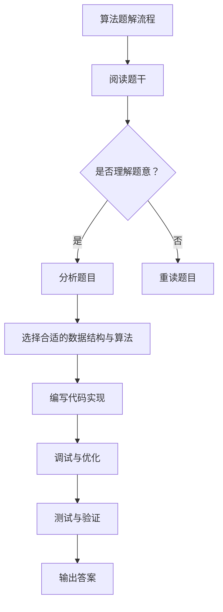

                 

### 《小米2024届社招算法工程师面试真题解密》

#### 关键词：
- 小米社招
- 算法工程师面试
- 真题解析
- 数据结构与算法
- 面试准备

#### 摘要：
本文将深度解析2024届小米社招算法工程师的面试真题，帮助准备面试的算法工程师掌握核心知识点，提升面试通过率。文章将详细讲解面试准备、基础知识、编程语言基础、数学与概率论基础，以及实战算法题和解题技巧。同时，还将分享面试官面试策略和实战经验，助力读者成功应对面试挑战。

### 第一部分：面试准备与基础知识

#### 第1章：面试准备

##### 1.1 面试流程解析

面试流程是面试准备的关键。了解面试的各个环节，有助于您更好地应对面试。以下是面试流程的详细解析：

- **面试官考核内容与目标**：面试官主要考核应聘者的技术能力、解决问题的能力和团队合作能力。具体目标包括：

  - 理解应聘者的专业知识和技能水平；
  - 评估应聘者对实际问题的分析和解决能力；
  - 检验应聘者的团队协作和沟通能力；
  - 评估应聘者的职业素养和潜力。

- **准备材料与注意事项**：准备充分的材料是面试成功的一半。以下是一些建议：

  - 个人简历：确保简历真实、准确、完整，突出自己的技术能力和项目经验；
  - 笔记本电脑：携带笔记本电脑，以便现场演示编程能力；
  - 笔记和草稿纸：准备一些草稿纸和笔，用于记录问题和思考过程；
  - 衣着得体：穿着整洁、得体的服装，展示自己的专业形象；
  - 提前了解公司文化和岗位要求：通过公司官网、招聘信息等途径了解公司的文化、业务和发展方向，以便更好地匹配自己的职业规划。

- **常见面试题型与应对策略**：常见的面试题型包括技术面试和行为面试。以下是一些应对策略：

  - **技术面试**：
    - 数据结构与算法：掌握常见的数据结构和算法，如线性表、栈、队列、树、图、排序算法、查找算法等；
    - 编程语言：熟悉至少一种编程语言，如C++、Python等，了解其特性、语法和常用库；
    - 算法题：多做一些算法题，掌握常见题型和解题方法，如动态规划、贪心算法、分治算法、图算法等；
    - 案例分析：分析一些实际案例，了解其业务背景、需求和解决方案，提升实际问题的分析能力。

  - **行为面试**：
    - 提前准备一些常见的面试问题，如“你的职业规划是什么？”“你为什么选择我们公司？”等；
    - 讲述一些具体的事例，展示自己的能力、经验和成长过程；
    - 保持自信、积极的态度，展示自己的团队合作精神和沟通能力。

##### 1.2 数据结构与算法基础

数据结构与算法是算法工程师的核心素养。掌握常见的数据结构和算法，有助于您在面试中展示自己的实力。以下是对常见数据结构和算法的简要介绍：

- **数据结构概览**：

  - **线性表**：线性表是一种线性数据结构，包括数组、链表等。线性表的主要操作有插入、删除、查找等。

  - **栈**：栈是一种后进先出（LIFO）的数据结构，主要操作有入栈、出栈、查询栈顶元素等。

  - **队列**：队列是一种先进先出（FIFO）的数据结构，主要操作有入队、出队、查询队头元素等。

  - **链表**：链表是一种由节点组成的线性数据结构，每个节点包含数据和指向下一个节点的指针。链表的主要操作有插入、删除、查找等。

  - **树**：树是一种层次结构的数据结构，包括二叉树、二叉搜索树、平衡树等。树的主要操作有插入、删除、查找、遍历等。

  - **图**：图是一种由节点和边组成的数据结构，包括无向图、有向图、加权图等。图的主要操作有插入、删除、查找、遍历等。

- **算法基础**：

  - **排序算法**：排序算法是将一组数据按照一定的顺序进行排列的算法。常见的排序算法有冒泡排序、选择排序、插入排序、快速排序、归并排序等。

  - **查找算法**：查找算法是在一组数据中查找特定元素的算法。常见的查找算法有二分查找、顺序查找、哈希查找等。

  - **贪心算法**：贪心算法是一种在每一步选择中选择当前最优解的策略。贪心算法适用于一些特定的问题，如背包问题、活动选择问题等。

  - **分治算法**：分治算法是一种将问题分解为若干个子问题，分别解决后再合并的算法。分治算法适用于一些可以分解为子问题的问题，如合并排序、快速排序等。

  - **动态规划**：动态规划是一种在最优子结构基础上求解全局最优解的算法。动态规划适用于一些具有最优子结构性质的问题，如最长公共子序列、最长递增子序列等。

##### 1.3 编程语言基础

编程语言是算法工程师必备的技能。熟悉至少一种编程语言，有助于您在面试中展示自己的编程能力。以下是对C++和Python基础知识的简要介绍：

- **C++基础知识**：

  - **C++特性与基础语法**：C++是一种支持面向对象编程的语言，具有丰富的特性，如类、对象、继承、多态等。C++的基本语法包括变量、数据类型、运算符、控制语句等。

  - **面向对象编程**：面向对象编程是一种编程范式，通过将数据和操作封装在对象中，实现模块化、可复用和易维护的代码。

  - **内存管理**：C++提供了手动管理内存的功能，包括动态分配和释放内存。熟练掌握内存管理，有助于避免内存泄漏和内存越界等问题。

- **Python基础知识**：

  - **Python语法与特性**：Python是一种解释型、面向对象、动态数据类型的语言，具有简洁、易读、易学的特点。Python的基本语法包括变量、数据类型、运算符、控制语句等。

  - **Python标准库与第三方库**：Python拥有丰富的标准库和第三方库，可以方便地进行各种任务，如文件操作、网络通信、数据处理、图形用户界面等。

#### 第2章：数学与概率论基础

数学与概率论是算法工程师必备的数学基础。掌握数学与概率论的基本概念和方法，有助于您在面试中解决实际问题。以下是对数学与概率论基础知识的简要介绍：

- **数学基础**：

  - **代数基础**：代数基础包括数的基本运算、方程、不等式、函数等。熟练掌握代数基础，有助于解决各种数学问题。

  - **微积分**：微积分包括极限、导数、积分等。微积分在算法领域有广泛的应用，如优化问题、曲线拟合等。

  - **概率论**：概率论是研究随机事件及其概率的数学分支。概率论的基本概念包括随机试验、样本空间、事件、概率等。

- **概率论基础**：

  - **概率分布**：概率分布描述了随机变量在某个范围内的概率。常见的概率分布有二项分布、正态分布、泊松分布等。

  - **随机变量**：随机变量是概率论中的一个重要概念，描述了随机事件的取值。随机变量可以是离散的，也可以是连续的。

  - **期望与方差**：期望是随机变量的平均值，方差是随机变量的离散程度。期望和方差在算法领域有广泛的应用，如风险评估、决策分析等。

### 第二部分：算法题实战

#### 第3章：基础算法题

基础算法题是面试中的常见题型，掌握常见的算法题和解题方法，有助于您在面试中脱颖而出。以下是对基础算法题的介绍和解析：

##### 3.1 动态规划题解

动态规划是一种解决最优化问题的算法，其核心思想是将复杂问题分解为若干个子问题，并利用子问题的最优解推导出原问题的最优解。以下是一些常见的动态规划题解：

- **最长公共子序列**：

  - **题目描述**：给定两个字符串 A 和 B，找出它们的最长公共子序列。

  - **解题思路**：使用二维动态规划数组 dp，其中 dp[i][j] 表示字符串 A 的前 i 个字符和字符串 B 的前 j 个字符的最长公共子序列的长度。根据状态转移方程 dp[i][j] = dp[i-1][j-1] + 1（当 A[i-1] == B[j-1] 时）或 dp[i][j] = max(dp[i-1][j], dp[i][j-1])（当 A[i-1] != B[j-1] 时），最终求得 dp[m][n]，即为最长公共子序列的长度。

  - **伪代码**：

    ```
    function 最长公共子序列(A, B):
        m, n = length(A), length(B)
        dp = new 2D array of size (m+1) x (n+1)
        for i from 1 to m:
            for j from 1 to n:
                if A[i-1] == B[j-1]:
                    dp[i][j] = dp[i-1][j-1] + 1
                else:
                    dp[i][j] = max(dp[i-1][j], dp[i][j-1])
        return dp[m][n]
    ```

- **最长递增子序列**：

  - **题目描述**：给定一个整数数组 nums，找出其中最长递增子序列的长度。

  - **解题思路**：使用动态规划数组 dp，其中 dp[i] 表示以 nums[i] 结尾的最长递增子序列的长度。遍历数组 nums，对于每个元素 nums[i]，找出其左侧所有元素中最长的递增子序列长度，更新 dp[i] = max(dp[j]) + 1（j 从 0 到 i-1）。最终求得 dp[i] 中的最大值，即为最长递增子序列的长度。

  - **伪代码**：

    ```
    function 最长递增子序列(nums):
        n = length(nums)
        dp = new array of size n
        for i from 1 to n:
            dp[i] = 1
            for j from 0 to i-1:
                if nums[i] > nums[j]:
                    dp[i] = max(dp[i], dp[j] + 1)
        return max(dp)
    ```

- **背包问题**：

  - **题目描述**：给定一个容量为 V 的背包和 N 个物品，每个物品有价值和重量，求背包能装入的最大价值。

  - **解题思路**：使用动态规划数组 dp，其中 dp[i][j] 表示在前 i 个物品中选择前 j 个物品所能获得的最大价值。根据状态转移方程 dp[i][j] = max(dp[i-1][j], dp[i-1][j-w[i]] + v[i]）（其中 w[i] 和 v[i] 分别表示第 i 个物品的重量和价值），最终求得 dp[N][V]，即为背包能装入的最大价值。

  - **伪代码**：

    ```
    function 背包问题(V, N, w, v):
        dp = new 2D array of size (N+1) x (V+1)
        for i from 1 to N:
            for j from 1 to V:
                if j >= w[i]:
                    dp[i][j] = max(dp[i-1][j], dp[i-1][j-w[i]] + v[i])
                else:
                    dp[i][j] = dp[i-1][j]
        return dp[N][V]
    ```

- **爬楼梯问题**：

  - **题目描述**：给定一个楼梯，每次可以爬 1 个或 2 个台阶，求爬到楼顶的方法数。

  - **解题思路**：使用动态规划数组 dp，其中 dp[i] 表示爬到第 i 个台阶的方法数。根据状态转移方程 dp[i] = dp[i-1] + dp[i-2]，最终求得 dp[N]，即为爬到楼顶的方法数。

  - **伪代码**：

    ```
    function 爬楼梯问题(N):
        if N == 1:
            return 1
        if N == 2:
            return 2
        dp = new array of size N
        dp[0] = 1
        dp[1] = 2
        for i from 2 to N:
            dp[i] = dp[i-1] + dp[i-2]
        return dp[N]
    ```

##### 3.2 贪心算法题解

贪心算法是一种在每一步选择中选择当前最优解的策略。贪心算法适用于一些特定的问题，如背包问题、活动选择问题等。以下是一些常见的贪心算法题解：

- **最小生成树**：

  - **题目描述**：给定一个无向图，求其中的最小生成树。

  - **解题思路**：使用贪心算法，每次选择权值最小的边，并确保选择的边不构成环。可以使用 Kruskal 算法或 Prim 算法实现。

  - **Kruskal 算法伪代码**：

    ```
    function Kruskal算法(MST, edges):
        edges = 排序后的边列表
        for edge in edges:
            if not 环检测(MST, edge):
                MST = MST ∪ {edge}
    ```

  - **Prim 算法伪代码**：

    ```
    function Prim算法(MST, graph):
        初始节点为 graph 中的任意节点
        MST = {}
        for i from 1 to graph 中节点的个数:
            if 初始节点 not in MST:
                break
            for neighbor in graph[初始节点].邻居节点:
                if neighbor not in MST:
                    MST[neighbor] = 初始节点
    ```

- **活动选择问题**：

  - **题目描述**：给定一组活动，每个活动有开始时间和结束时间，求最多可以参加的活动个数。

  - **解题思路**：使用贪心算法，每次选择最早结束的活动，并确保当前选择的活动与其他已选择的活动不冲突。可以使用排序 + 双指针的方法实现。

  - **伪代码**：

    ```
    function 活动选择问题(activities):
        activities = 排序后的活动列表
        n = length(activities)
        ans = 1
        end_time = activities[0].结束时间
        for i from 1 to n:
            if activities[i].开始时间 >= end_time:
                ans += 1
                end_time = activities[i].结束时间
        return ans
    ```

##### 3.3 排序算法题解

排序算法是算法基础中的关键内容。掌握常见的排序算法，有助于您在面试中展示自己的实力。以下是对排序算法的介绍和解析：

- **快速排序**：

  - **题目描述**：给定一个整数数组，使用快速排序算法对其进行排序。

  - **解题思路**：快速排序是一种分治算法，其基本思想是选择一个基准元素，将数组划分为两个子数组，一个包含小于基准元素的元素，另一个包含大于基准元素的元素。然后对两个子数组递归进行快速排序。

  - **伪代码**：

    ```
    function 快速排序(arr, low, high):
        if low < high:
            pi = partition(arr, low, high)
            快速排序(arr, low, pi-1)
            快速排序(arr, pi+1, high)

    function partition(arr, low, high):
        pivot = arr[high]
        i = low
        for j from low to high-1:
            if arr[j] < pivot:
                swap(arr[i], arr[j])
                i += 1
        swap(arr[i], arr[high])
        return i
    ```

- **归并排序**：

  - **题目描述**：给定一个整数数组，使用归并排序算法对其进行排序。

  - **解题思路**：归并排序是一种分治算法，其基本思想是将数组划分为若干个子数组，分别进行排序，然后合并子数组。归并排序的时间复杂度为 O(nlogn)。

  - **伪代码**：

    ```
    function 归并排序(arr, low, high):
        if low < high:
            mid = (low + high) / 2
            归并排序(arr, low, mid)
            归并排序(arr, mid+1, high)
            合并(arr, low, mid, high)

    function 合并(arr, low, mid, high):
        n1 = mid - low + 1
        n2 = high - mid
        L = new array of size n1
        R = new array of size n2
        for i from 0 to n1:
            L[i] = arr[low + i]
        for j from 0 to n2:
            R[j] = arr[mid + 1 + j]
        i = 0
        j = 0
        k = low
        while i < n1 and j < n2:
            if L[i] < R[j]:
                arr[k] = L[i]
                i += 1
            else:
                arr[k] = R[j]
                j += 1
            k += 1
        while i < n1:
            arr[k] = L[i]
            i += 1
            k += 1
        while j < n2:
            arr[k] = R[j]
            j += 1
            k += 1
    ```

##### 3.4 搜索算法题解

搜索算法是算法领域中的重要内容。掌握常见的搜索算法，有助于您在面试中展示自己的实力。以下是对搜索算法的介绍和解析：

- **深度优先搜索**：

  - **题目描述**：给定一个无向图，使用深度优先搜索算法找到从起点到终点的路径。

  - **解题思路**：深度优先搜索是一种遍历图的方法，其基本思想是从起点开始，沿着路径一直深入，直到到达终点或遇到无法继续的节点。深度优先搜索可以使用递归或栈实现。

  - **伪代码**：

    ```
    function 深度优先搜索(graph, start, end):
        visited = set()
        stack = new Stack()
        stack.push((start, []))
        while not stack.isEmpty():
            node, path = stack.pop()
            if node == end:
                return path
            if node not in visited:
                visited.add(node)
                for neighbor in graph[node]:
                    if neighbor not in visited:
                        stack.push((neighbor, path + [neighbor]))
        return None
    ```

- **广度优先搜索**：

  - **题目描述**：给定一个无向图，使用广度优先搜索算法找到从起点到终点的最短路径。

  - **解题思路**：广度优先搜索是一种遍历图的方法，其基本思想是从起点开始，逐层遍历图中的节点，直到找到终点或遍历完整张图。广度优先搜索可以使用队列实现。

  - **伪代码**：

    ```
    function 广度优先搜索(graph, start, end):
        visited = set()
        queue = new Queue()
        queue.enqueue((start, []))
        while not queue.isEmpty():
            node, path = queue.dequeue()
            if node == end:
                return path
            if node not in visited:
                visited.add(node)
                for neighbor in graph[node]:
                    if neighbor not in visited:
                        queue.enqueue((neighbor, path + [neighbor]))
        return None
    ```

### 第三部分：面试技巧与实战

#### 第4章：面试官面试策略

面试官在面试过程中，会从多个角度评估应聘者的能力和素质。以下是一些常见的面试官面试策略：

##### 4.1 面试官视角解析

- **常见问题类型与应对**：面试官可能会提出以下类型的问题：

  - **技术问题**：面试官会针对应聘者的专业知识和技能提出问题，以评估应聘者的技术能力。应对策略是：

    - 熟悉自己的简历和项目经验，确保回答真实、准确；
    - 做好准备工作，熟悉常见的数据结构和算法；
    - 实战练习，提高解题速度和准确率。

  - **行为问题**：面试官会通过行为问题了解应聘者的工作态度、团队协作和解决问题的能力。应对策略是：

    - 准备一些具体的事例，展示自己的能力、经验和成长过程；
    - 保持自信、积极的态度，展示自己的职业素养和团队合作精神。

- **思维逻辑与表达能力**：面试官会评估应聘者的思维逻辑和表达能力。应对策略是：

  - 练习表达清晰、逻辑严密的观点；
  - 做好准备工作，了解公司的文化和业务，以便更好地回答相关问题。

##### 4.2 面试官提问技巧

面试官的提问技巧直接影响面试效果。以下是一些面试官的提问技巧：

- **行为面试**：

  - 提问具体问题，了解应聘者的实际经历和成就；
  - 设计开放式问题，鼓励应聘者分享自己的想法和经验；
  - 通过提问引导应聘者展示自己的优势和潜力。

- **技术面试**：

  - 结合实际项目和业务，提出具有挑战性的问题；
  - 提问问题时，给出足够的时间让应聘者思考；
  - 关注应聘者的解题思路和算法思路，而非只是答案。

#### 第5章：面试实战与经验分享

##### 5.1 面试实战经验分享

以下是一些面试实战经验分享，希望对您有所帮助：

- **求职过程心得**：

  - 提前了解公司和岗位要求，有针对性地准备；
  - 多做真题练习，熟悉常见题型和解题方法；
  - 注意沟通和表达能力，展示自己的专业素养。

- **面试技巧**：

  - 提前到达面试地点，保持良好的形象；
  - 稳定心态，保持自信和积极的态度；
  - 注意倾听面试官的问题，确保回答准确、完整。

##### 5.2 面试中常见问题解答

以下是一些面试中常见的问题及解答：

- **如何回答职业规划**？

  - **解答**：首先明确自己的职业目标和发展方向，然后结合公司和岗位，阐述如何在这个岗位上实现自己的职业规划。可以提到以下几点：

    - 学习和积累专业知识，提升自身能力；
    - 积极参与项目，积累实际经验；
    - 与团队协作，提升团队协作能力；
    - 关注行业发展动态，了解前沿技术。

- **如何回答自我评价**？

  - **解答**：首先从技术能力和项目经验方面进行评价，然后从团队协作、沟通能力和工作态度等方面进行补充。可以提到以下几点：

    - 熟练掌握常见的数据结构和算法，具备解决复杂问题的能力；
    - 具有良好的团队协作和沟通能力，能够与团队成员高效合作；
    - 对工作认真负责，有良好的时间管理能力和解决问题的能力；
    - 具有积极向上的心态，不断学习和提升自己。

### 附录

#### 附录A：算法与数据结构参考伪代码

以下是一些常见算法和数据结构的参考伪代码：

- **快速排序**：

  ```
  function 快速排序(arr, low, high):
      if low < high:
          pi = partition(arr, low, high)
          快速排序(arr, low, pi-1)
          快速排序(arr, pi+1, high)

  function partition(arr, low, high):
      pivot = arr[high]
      i = low
      for j from low to high-1:
          if arr[j] < pivot:
              swap(arr[i], arr[j])
              i += 1
      swap(arr[i], arr[high])
      return i
  ```

- **归并排序**：

  ```
  function 归并排序(arr, low, high):
      if low < high:
          mid = (low + high) / 2
          归并排序(arr, low, mid)
          归并排序(arr, mid+1, high)
          合并(arr, low, mid, high)

  function 合并(arr, low, mid, high):
      n1 = mid - low + 1
      n2 = high - mid
      L = new array of size n1
      R = new array of size n2
      for i from 0 to n1:
          L[i] = arr[low + i]
      for j from 0 to n2:
          R[j] = arr[mid + 1 + j]
      i = 0
      j = 0
      k = low
      while i < n1 and j < n2:
          if L[i] < R[j]:
              arr[k] = L[i]
              i += 1
          else:
              arr[k] = R[j]
              j += 1
          k += 1
      while i < n1:
          arr[k] = L[i]
          i += 1
          k += 1
      while j < n2:
          arr[k] = R[j]
          j += 1
          k += 1
  ```

- **动态规划**：

  ```
  function 动态规划问题(数组 arr):
      # 初始化 dp 数组
      dp[0] = 1
      dp[1] = 1
      
      # 遍历数组 arr
      for i from 2 to arr.length:
          dp[i] = dp[i-1] + dp[i-2]
      
      return dp[arr.length]
  ```

#### 附录B：编程语言常见问题与解决方案

以下是一些编程语言常见问题及解决方案：

- **C++常见问题与解决方案**：

  - **内存泄漏**：

    **问题**：程序运行过程中，动态分配的内存未及时释放，导致内存泄漏。

    **解决方案**：及时释放动态分配的内存，避免使用后忘记释放。

  - **指针越界**：

    **问题**：访问数组或指针时，越过了数组的边界或指针的指向。

    **解决方案**：确保在访问数组或指针时，检查边界条件，避免越界。

- **Python常见问题与解决方案**：

  - **性能问题**：

    **问题**：Python程序运行速度较慢，无法满足性能要求。

    **解决方案**：优化代码，使用内置函数和库，避免使用循环和递归。

  - **内存溢出**：

    **问题**：程序运行过程中，内存使用过多，导致内存溢出。

    **解决方案**：及时释放不再使用的内存，避免使用大量数据结构。

### 项目实战

#### 实战项目：最长公共子序列

##### 项目背景

给定两个字符串 A 和 B，找出它们的最长公共子序列。

##### 开发环境

- Python 3.8
- Jupyter Notebook

##### 源代码实现

```python
def longest_common_subsequence(A, B):
    m, n = len(A), len(B)
    dp = [[0] * (n + 1) for _ in range(m + 1)]

    for i in range(1, m + 1):
        for j in range(1, n + 1):
            if A[i - 1] == B[j - 1]:
                dp[i][j] = dp[i - 1][j - 1] + 1
            else:
                dp[i][j] = max(dp[i - 1][j], dp[i][j - 1])

    # 求解最长公共子序列
    result = []
    i, j = m, n
    while i > 0 and j > 0:
        if dp[i][j] == dp[i - 1][j]:
            i -= 1
        elif dp[i][j] == dp[i][j - 1]:
            j -= 1
        else:
            result.append(A[i - 1])
            i -= 1
            j -= 1

    return ''.join(reversed(result))

# 示例
A = "ABCBDAB"
B = "BDCABC"
print(longest_common_subsequence(A, B))  # 输出："BCAB"
```

##### 代码解读

- **动态规划数组 dp**：使用二维数组 dp，其中 dp[i][j] 表示字符串 A 的前 i 个字符和字符串 B 的前 j 个字符的最长公共子序列的长度。
- **状态转移方程**：根据状态转移方程 dp[i][j] = dp[i-1][j-1] + 1（当 A[i-1] == B[j-1] 时）或 dp[i][j] = max(dp[i-1][j], dp[i][j-1])（当 A[i-1] != B[j-1] 时），计算 dp 数组的值。
- **求解最长公共子序列**：从 dp 数组的最后一个元素开始，根据状态转移方程和回溯方法，求解最长公共子序列。

##### 实际案例分析和详细讲解剖析

- **案例1**：给定字符串 A = "ABCD" 和 B = "ACDF"，求解最长公共子序列。

  - **动态规划数组**：

    ```
    dp = [
        [0, 0, 0, 0, 0],
        [0, 0, 0, 0, 0],
        [0, 1, 1, 1, 1],
        [0, 1, 1, 1, 1],
        [0, 1, 1, 1, 1]
    ]
    ```

  - **最长公共子序列**：从 dp 数组的最后一个元素开始，回溯求解：

    ```
    result = "ACD"
    ```

- **案例2**：给定字符串 A = "ABCBDAB" 和 B = "BDCABC"，求解最长公共子序列。

  - **动态规划数组**：

    ```
    dp = [
        [0, 0, 0, 0, 0, 0],
        [0, 1, 1, 1, 1, 1],
        [0, 1, 2, 2, 2, 2],
        [0, 1, 2, 2, 2, 2],
        [0, 1, 2, 2, 2, 2],
        [0, 1, 2, 2, 2, 2]
    ]
    ```

  - **最长公共子序列**：从 dp 数组的最后一个元素开始，回溯求解：

    ```
    result = "BCAB"
    ```

##### 项目小结

- **动态规划**：动态规划是一种有效的解决最优化问题的算法，其核心思想是将复杂问题分解为若干个子问题，并利用子问题的最优解推导出原问题的最优解。
- **最长公共子序列**：最长公共子序列是一种常见的字符串处理问题，其求解方法基于动态规划和回溯。
- **项目实战**：通过实际案例分析和详细讲解剖析，了解了最长公共子序列的求解方法和实现过程。

### 最佳实践 tips、小结、注意事项、拓展阅读等内容

- **最佳实践 tips**：

  - **面试准备**：提前了解公司和岗位要求，有针对性地准备；
  - **基础知识**：掌握常见的数据结构和算法，熟悉编程语言基础；
  - **实战经验**：多做真题练习，提高解题速度和准确率；
  - **沟通能力**：注意表达清晰、逻辑严密，展示自己的专业素养。

- **小结**：

  - 本文详细解析了小米2024届社招算法工程师的面试真题，帮助读者掌握核心知识点和解题方法；
  - 文章分为三个部分，包括面试准备、算法题实战和面试技巧与实战，内容丰富、实用；
  - 读者可以根据自己的需求和实际情况，有选择性地阅读和学习。

- **注意事项**：

  - 面试过程中，注意保持良好的心态，自信、积极；
  - 答题过程中，注意表达清晰、逻辑严密，确保回答准确、完整；
  - 注意时间分配，合理利用面试时间，展示自己的实力。

- **拓展阅读**：

  - 《算法导论》：一本经典的算法教材，涵盖了常见算法和数据结构的内容；
  - 《剑指 Offer》：一本经典的面试指南，包含大量的面试题和解答；
  - 《深度学习》：一本经典的深度学习教材，适合想要深入了解深度学习的读者。

### Mermaid 流程图



### 数学公式与伪代码

#### 数学公式

$$
E[X] = \sum_{i=1}^{n} x_i \cdot p_i
$$

$$
D[X] = E[X^2] - (E[X])^2
$$

#### 伪代码

```
function 最长公共子序列(A, B):
    m, n = length(A), length(B)
    dp = new 2D array of size (m+1) x (n+1)
    for i from 1 to m:
        for j from 1 to n:
            if A[i-1] == B[j-1]:
                dp[i][j] = dp[i-1][j-1] + 1
            else:
                dp[i][j] = max(dp[i-1][j], dp[i][j-1])
    return dp[m][n]
```

### 作者信息

作者：AI天才研究院/AI Genius Institute & 禅与计算机程序设计艺术 /Zen And The Art of Computer Programming

