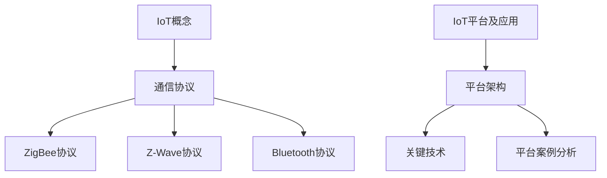

                 


## 引言

随着科技的飞速发展，物联网（IoT）技术已经成为当今世界的一个热点领域。物联网通过将各种设备、传感器和系统连接起来，实现了信息的实时共享和智能处理，极大地提升了人类生活的便利性和效率。小米公司作为中国领先的科技企业，其在IoT领域的布局和研发力度可见一斑。为了吸引更多优秀的人才加入其IoT研发团队，小米公司在2024年的校招中特别推出了针对IoT开发工程师的算法题。

本篇文章旨在汇总和解析小米2024校招IoT开发工程师算法题，帮助读者深入理解物联网开发的相关算法知识，同时也为准备校招的考生提供实用的参考。文章将分为三个主要部分：IoT开发基础、IoT算法应用和IoT开发实践。

### IoT开发基础

第一部分将介绍IoT的基础知识，包括IoT的概念及发展历程、IoT架构与技术体系以及IoT的安全问题及解决方案。这部分内容将为读者搭建起物联网的基本框架，是进一步学习和实践的基础。

### IoT算法应用

第二部分将聚焦于IoT算法的应用，包括数据预处理与特征工程、机器学习算法及应用、深度学习算法及应用以及IoT边缘计算算法。这部分内容将帮助读者掌握物联网中常用的算法和数据处理技术，为解决实际应用中的问题提供工具。

### IoT开发实践

第三部分将介绍IoT项目的实战案例，涵盖IoT项目开发流程、IoT安全实战以及IoT未来发展趋势。通过实际项目的分析和讲解，读者可以了解物联网开发的完整流程，同时对未来发展趋势有一个清晰的认识。

通过这三个部分的深入讲解，本文希望读者能够对IoT开发有一个全面而深入的理解，为未来的学习和工作打下坚实的基础。

### IoT概述

物联网（Internet of Things，简称IoT）是指通过互联网将各种设备、传感器、系统等进行互联互通，从而实现智能化管理和控制的技术体系。其核心思想是让物品具备智能化的功能，使其能够相互通信、协同工作，实现信息的实时共享和智能处理。

#### 1.1 IoT概念及发展历程

物联网的概念最早可以追溯到1999年，麻省理工学院的Kevin Ashton首次提出了物联网的概念。他将其定义为“通过互联网将所有的物品连接起来，形成一个人与物、物与物之间的智能网络”。此后，物联网技术逐渐成为信息技术领域的研究热点。

物联网的发展可以分为三个阶段：

1. **初期阶段**（1999-2005年）：以RFID（射频识别）技术为代表，物联网技术开始逐步应用于仓储管理、供应链管理等领域。

2. **发展阶段**（2005-2010年）：随着无线通信技术的发展，物联网技术开始广泛应用于智能家居、智能交通、智能医疗等领域。

3. **成熟阶段**（2010年至今）：物联网技术逐渐普及，各类智能设备大量涌现，物联网平台和生态系统逐步完善。

#### 1.2 IoT架构与技术体系

物联网的架构通常包括感知层、网络层、平台层和应用层四个层级。

1. **感知层**：由各种传感器和设备组成，负责数据的采集和感知。

2. **网络层**：通过通信网络将感知层采集到的数据进行传输，包括无线通信网、互联网等。

3. **平台层**：提供数据存储、处理、分析和应用开发等功能，是实现物联网智能化的重要平台。

4. **应用层**：是物联网技术的最终体现，通过具体的行业应用，实现物联网的价值。

物联网的技术体系包括：

1. **传感器技术**：用于采集环境数据，如温度、湿度、光强、气体浓度等。

2. **网络通信技术**：包括无线通信技术（如Wi-Fi、ZigBee、LoRa等）和有线通信技术（如以太网、光纤等）。

3. **数据处理技术**：包括数据存储、数据清洗、数据挖掘、机器学习等，用于对采集到的数据进行处理和分析。

4. **物联网平台技术**：提供物联网应用开发的基础设施，包括设备管理、数据管理、应用开发等。

#### 1.3 IoT的安全问题及解决方案

物联网在发展过程中面临着诸多安全问题，主要包括数据安全、通信安全和设备安全。

1. **数据安全**：由于物联网设备数量庞大，数据量巨大，数据泄露的风险较高。解决方案包括数据加密、数据脱敏、访问控制等。

2. **通信安全**：物联网设备之间的通信可能被攻击者截获和篡改。解决方案包括使用加密通信协议、认证机制、安全隧道等。

3. **设备安全**：物联网设备可能被恶意软件感染，导致设备失控或数据泄露。解决方案包括设备安全管理、设备更新、安全审计等。

综上所述，物联网作为一门综合性技术，涵盖了从传感器、网络通信到数据处理和平台应用等多个方面。了解物联网的基本概念、架构和技术体系，是深入学习和实践物联网开发的重要基础。

### IoT通信协议

在物联网的架构中，通信协议是连接各类设备、传感器和网络的关键技术之一。不同的通信协议具有不同的特点和适用场景，本节将详细介绍几种常见的物联网通信协议：ZigBee协议、Z-Wave协议和Bluetooth协议。

#### 2.1 ZigBee协议详解

ZigBee协议是一种短距离、低功耗的无线通信协议，基于IEEE 802.15.4标准。它采用频段为2.4GHz，通信速率最高可达250kbps。ZigBee协议的主要特点如下：

1. **低功耗**：ZigBee设备具有非常低的功耗，可以长时间运行，特别适合电池供电设备。

2. **自组织网络**：ZigBee设备可以自动组网，形成一个多跳的网状网络，具有高可靠性和良好的扩展性。

3. **低复杂度**：ZigBee协议的硬件和软件设计相对简单，降低了设备成本和维护难度。

4. **安全性**：ZigBee协议支持数据加密和安全认证机制，确保数据传输的安全性。

ZigBee协议广泛应用于智能家居、工业自动化、智能农业等领域。例如，在智能家居中，ZigBee协议可以用于连接各种智能设备，如灯光控制系统、温度控制系统等，实现家庭设备的智能化管理。

#### 2.2 Z-Wave协议详解

Z-Wave协议是一种基于微波技术的无线通信协议，同样基于IEEE 802.15.4标准，但采用频段为908.42MHz或868.42MHz。Z-Wave协议的主要特点如下：

1. **低功耗**：Z-Wave设备也具有低功耗的特点，特别适合电池供电设备。

2. **网状网络**：Z-Wave设备可以形成一个网状网络，每个设备都可以作为路由器，提高网络的稳定性和覆盖范围。

3. **双向通信**：Z-Wave协议支持双向通信，可以实现实时数据交互和控制。

4. **易扩展**：Z-Wave协议具有良好的扩展性，可以支持多种不同类型的设备，如开关、传感器、灯光等。

Z-Wave协议广泛应用于智能家居、安全监控、智能社区等领域。例如，在智能家居中，Z-Wave协议可以用于连接各种智能设备，如门锁、窗帘、报警系统等，实现家庭的安全和自动化管理。

#### 2.3 Bluetooth协议详解

Bluetooth协议是一种短距离、高带宽的无线通信协议，基于IEEE 802.15.1标准，采用频段为2.4GHz。Bluetooth协议的主要特点如下：

1. **高带宽**：Bluetooth协议的通信速率最高可达2Mbps，适合传输大容量数据。

2. **近距离通信**：Bluetooth协议适合在短距离内（一般不超过100米）进行通信。

3. **互操作性**：Bluetooth协议具有高度的互操作性，可以与各种不同设备和操作系统无缝连接。

4. **安全性**：Bluetooth协议支持加密和认证机制，确保数据传输的安全性。

Bluetooth协议广泛应用于智能手机、无线耳机、智能手表、车载系统等领域。例如，在智能手机中，Bluetooth协议可以用于连接无线耳机、蓝牙音箱等外设，实现音频传输和控制。

综上所述，ZigBee协议、Z-Wave协议和Bluetooth协议各具特点，适用于不同的物联网应用场景。了解这些通信协议的基本原理和特性，有助于我们在物联网开发中根据具体需求选择合适的通信方案。

### IoT平台及应用

物联网平台的建立是物联网生态系统中的关键环节，它不仅为物联网设备提供了连接和通信的桥梁，还集成了数据存储、处理和分析等功能，为各类应用提供了强大的支持。本节将详细介绍物联网平台的架构、关键技术以及案例分析。

#### 3.1 物联网平台架构

一个典型的物联网平台架构通常包括以下几个层级：

1. **感知层**：由各种传感器和设备组成，负责数据的采集和传输。这一层通常包括环境传感器、智能设备、RFID标签等。

2. **网络层**：负责数据的传输和通信，包括无线通信模块、网关、网络协议等。网络层确保感知层采集到的数据能够可靠地传输到平台。

3. **平台层**：是物联网平台的核心部分，提供数据存储、处理、分析和应用开发等功能。平台层通常包括设备管理模块、数据管理模块、数据处理模块和应用程序接口（API）等。

4. **应用层**：是物联网平台对外提供的最终服务，包括各类物联网应用、移动应用和Web应用等。应用层通过平台层的支持，实现各种物联网业务场景的具体应用。

#### 3.2 物联网平台关键技术

物联网平台的关键技术包括以下几个方面：

1. **数据管理技术**：包括数据采集、数据存储、数据清洗和数据挖掘等。数据管理技术确保物联网平台能够高效、可靠地处理海量数据。

2. **设备管理技术**：包括设备接入、设备认证、设备监控和设备远程控制等。设备管理技术确保物联网平台能够对大量设备进行有效的管理和监控。

3. **数据处理技术**：包括数据传输、数据处理和数据分析等。数据处理技术能够对实时数据进行快速处理和分析，为应用层提供决策支持。

4. **应用开发技术**：包括Web应用开发、移动应用开发、API开发等。应用开发技术为物联网平台提供多样化的应用服务，满足不同行业和场景的需求。

5. **安全性技术**：包括数据加密、认证授权、访问控制等。安全性技术确保物联网平台的数据和设备不受恶意攻击和未授权访问。

#### 3.3 物联网平台案例分析

以下是几个典型的物联网平台案例分析：

1. **小米IoT平台**：小米的IoT平台是一个典型的智能家居解决方案，通过连接各种智能设备，实现家庭设备的智能管理和控制。小米IoT平台采用了分布式架构，支持多种通信协议，如ZigBee、Z-Wave和蓝牙等。平台提供了设备管理、数据存储和处理、应用开发等一站式服务，用户可以通过移动应用或Web平台对家中的智能设备进行远程控制和监控。

2. **阿里云物联网平台**：阿里的云物联网平台是一个面向企业级用户的物联网解决方案，提供设备接入、数据存储、数据处理、应用开发等功能。阿里云物联网平台支持多种数据采集设备，采用云原生架构，具有高可靠性、高可扩展性和高安全性。平台还提供了丰富的API和SDK，方便开发者进行应用开发和集成。

3. **华为物联网平台**：华为的物联网平台主要面向工业、农业、智慧城市等领域，提供设备接入、数据传输、数据处理、应用开发和安全防护等功能。华为物联网平台采用了分布式架构，支持多种通信协议和多种数据处理算法，能够满足不同行业和场景的需求。

通过以上案例分析，可以看出物联网平台在智能家居、企业应用、工业自动化等领域具有广泛的应用前景。物联网平台的建立不仅提升了物联网设备的智能化水平和互联互通能力，还为各类应用场景提供了强大的支持，推动了物联网技术的快速发展。

### 数据预处理与特征工程

在物联网应用中，数据预处理和特征工程是至关重要的环节。数据预处理主要包括数据的清洗、归一化和转换等步骤，而特征工程则是通过提取和构造特征，将原始数据转化为适用于机器学习模型的输入。这两步不仅能提升模型性能，还能降低数据噪声对模型的影响。

#### 4.1 数据预处理方法

1. **数据清洗**：数据清洗是数据预处理的第一步，主要目的是去除原始数据中的噪声和不一致数据。常见的数据清洗方法包括：
   - **缺失值处理**：对于缺失值，可以选择填充法（如平均值、中位数填充）或删除法（如删除含有缺失值的记录）。
   - **异常值处理**：通过统计方法（如箱线图、Z分数）或机器学习方法（如孤立森林）检测并处理异常值。
   - **重复值处理**：删除重复的记录，确保数据的唯一性。

2. **数据归一化**：数据归一化是将数据缩放到一个统一的范围内，常见的方法包括：
   - **最小-最大规范化**：将数据缩放到[0, 1]或[-1, 1]之间。
   - **Z标准化**：将数据转换为标准正态分布，即计算每个特征的均值和标准差，然后进行标准化。

3. **数据转换**：数据转换包括将类别型数据转换为数值型数据，常见的转换方法包括：
   - **独热编码**：将类别型数据转换为二进制向量。
   - **标签编码**：将类别型数据映射到整数。

#### 4.2 特征工程方法与技巧

1. **特征提取**：特征提取是从原始数据中提取出对模型有帮助的特征，常见的方法包括：
   - **统计特征**：如均值、方差、最大值、最小值等。
   - **变换特征**：如对原始数据进行主成分分析（PCA），提取主要成分作为特征。
   - **时间序列特征**：如时间窗口特征、滑动平均等。

2. **特征构造**：特征构造是通过组合原始数据中的特征，生成新的特征，常见的方法包括：
   - **交叉特征**：将不同特征进行组合，生成新的交叉特征。
   - **嵌入特征**：通过嵌入模型（如词嵌入）将文本数据转化为数值特征。
   - **层次特征**：通过层次化结构生成特征，如树的节点特征。

3. **特征选择**：特征选择是选择对模型性能有显著贡献的特征，常见的方法包括：
   - **过滤式特征选择**：基于特征的重要性进行选择，如信息增益、相关性分析等。
   - **包装式特征选择**：结合具体模型进行特征选择，如递归特征消除（RFE）等。
   - **嵌入式特征选择**：在特征提取和模型训练过程中进行特征选择，如L1正则化。

#### 4.3 数据可视化工具及应用

数据可视化是将数据以图形化的方式展示，有助于我们直观地理解数据的分布、趋势和异常。常见的数据可视化工具包括：

1. **Matplotlib**：Python的一个数据可视化库，可以生成各种类型的图表，如折线图、散点图、条形图等。

2. **Seaborn**：基于Matplotlib的扩展库，提供了更多丰富的图表样式和颜色方案。

3. **Plotly**：支持多种交互式图表，可以生成动态和交互式的可视化效果。

4. **Tableau**：商业数据可视化工具，提供了强大的数据分析和交互功能。

数据可视化在特征工程中的应用主要包括：

1. **数据分布分析**：通过直方图、密度图等了解数据的分布情况。

2. **异常检测**：通过箱线图、散点图等识别数据中的异常值。

3. **特征关系分析**：通过散点图、热力图等分析特征之间的相关性。

通过数据预处理和特征工程，我们能够将原始数据转化为适用于机器学习模型的输入，提高模型的预测准确性和泛化能力。掌握这些方法和技术，对于物联网应用中的数据分析和机器学习任务至关重要。

### 机器学习算法及应用

机器学习算法在物联网（IoT）中发挥着重要作用，能够帮助我们从海量数据中提取有价值的信息，并实现智能决策和自动化控制。本节将介绍机器学习算法的基础知识，包括监督学习和无监督学习，并探讨其在IoT中的应用。

#### 5.1 机器学习基础算法

机器学习算法可以分为监督学习、无监督学习和半监督学习三种类型。以下是几种常见的机器学习算法：

1. **线性回归**：
   - **公式**：$y = \theta_0 + \theta_1x$。
   - **用途**：用于预测连续值。
   - **示例**：预测住房价格。

2. **逻辑回归**：
   - **公式**：$P(y=1) = \frac{1}{1 + e^{-(\theta_0 + \theta_1x)}$。
   - **用途**：用于二分类问题。
   - **示例**：判断邮件是否为垃圾邮件。

3. **支持向量机（SVM）**：
   - **公式**：最大化分类间隔。
   - **用途**：用于分类问题。
   - **示例**：分类手写数字。

4. **决策树**：
   - **公式**：递归划分特征空间。
   - **用途**：用于分类和回归问题。
   - **示例**：分类客户购买偏好。

5. **随机森林**：
   - **公式**：多个决策树的集合。
   - **用途**：用于分类和回归问题。
   - **示例**：预测股票价格。

#### 5.2 监督学习算法及应用

监督学习算法通过已标记的训练数据学习模型，然后使用该模型对新数据进行预测。以下是几种常见的监督学习算法及其在IoT中的应用：

1. **K最近邻（KNN）**：
   - **伪代码**：
     ```
     def KNN_predict(X_train, y_train, X_test, k):
         # 计算测试数据与训练数据的距离
         distances = calculate_distances(X_train, X_test)
         # 选择最近的k个邻居
         neighbors = select_k_neighbors(distances, k)
         # 预测标签
         predict_labels = majority_vote(neighbors, y_train)
         return predict_labels
     ```
   - **用途**：分类问题。
   - **示例**：预测设备故障。

2. **朴素贝叶斯**：
   - **伪代码**：
     ```
     def Naive_Bayes_predict(X_train, y_train, X_test):
         # 计算每个特征的先验概率
         prior_probabilities = calculate_prior_probabilities(y_train)
         # 计算每个特征的条件概率
         conditional_probabilities = calculate_conditional_probabilities(X_train, y_train)
         # 预测标签
         predict_labels = calculate_posteriors(prior_probabilities, conditional_probabilities)
         return predict_labels
     ```
   - **用途**：分类问题。
   - **示例**：垃圾邮件分类。

3. **线性回归**：
   - **伪代码**：
     ```
     def Linear_Regression_train(X_train, y_train):
         # 计算回归系数
         coefficients = calculate_coefficients(X_train, y_train)
         return coefficients

     def Linear_Regression_predict(X_test, coefficients):
         # 预测结果
         predictions = calculate_predictions(X_test, coefficients)
         return predictions
     ```
   - **用途**：回归问题。
   - **示例**：预测能源消耗。

4. **支持向量机（SVM）**：
   - **伪代码**：
     ```
     def SVM_train(X_train, y_train):
         # 训练SVM模型
         model = train_SVM(X_train, y_train)
         return model

     def SVM_predict(X_test, model):
         # 预测标签
         predict_labels = model.predict(X_test)
         return predict_labels
     ```
   - **用途**：分类问题。
   - **示例**：设备故障预测。

#### 5.3 无监督学习算法及应用

无监督学习算法没有标记数据，目标是发现数据中的结构或模式。以下是几种常见的无监督学习算法及其在IoT中的应用：

1. **K-均值聚类**：
   - **伪代码**：
     ```
     def KMeans_train(X_train, k):
         # 初始化聚类中心
         centroids = initialize_centroids(X_train, k)
         while not converged:
             # 分配数据到聚类中心
             clusters = assign_clusters(X_train, centroids)
             # 更新聚类中心
             centroids = update_centroids(clusters, k)
         return centroids
     ```
   - **用途**：聚类分析。
   - **示例**：设备故障模式识别。

2. **主成分分析（PCA）**：
   - **伪代码**：
     ```
     def PCA_train(X_train):
         # 计算协方差矩阵
         covariance_matrix = calculate_covariance_matrix(X_train)
         # 计算特征值和特征向量
         eigenvalues, eigenvectors = compute_eigenvalues_eigenvectors(covariance_matrix)
         # 选择主成分
         principal_components = select_principal_components(eigenvalues, eigenvectors)
         return principal_components
     ```
   - **用途**：降维。
   - **示例**：传感器数据降维。

3. **自编码器**：
   - **伪代码**：
     ```
     def Autoencoder_train(X_train):
         # 初始化编码器和解码器
         encoder = initialize_encoder()
         decoder = initialize_decoder()
         # 训练模型
         model = train_autoencoder(encoder, decoder, X_train)
         return model

     def Autoencoder_predict(X_test, model):
         # 预测编码特征
         encoded_features = model.encode(X_test)
         # 解码特征到原始数据
         predictions = model.decode(encoded_features)
         return predictions
     ```
   - **用途**：特征提取。
   - **示例**：异常检测。

通过以上算法，我们可以从物联网数据中提取出有价值的信息，并应用于设备故障预测、能耗管理、安全监控等领域。了解这些算法的基本原理和应用，对于IoT开发人员来说是非常重要的。

### 深度学习算法及应用

深度学习作为机器学习的一个分支，因其强大的特征提取和模式识别能力，在物联网（IoT）领域得到了广泛的应用。在本节中，我们将介绍深度学习的基础知识、卷积神经网络（CNN）和循环神经网络（RNN）的应用。

#### 6.1 深度学习基础

深度学习是通过构建多层神经网络，逐层提取数据中的特征，从而实现复杂模式识别和学习任务的一种机器学习方法。深度学习的基础包括以下几个关键组成部分：

1. **神经网络**：神经网络由多个层组成，包括输入层、隐藏层和输出层。每一层由多个神经元（或节点）组成，每个神经元都与前一层的神经元相连，并通过权重进行信息传递。

2. **激活函数**：激活函数用于引入非线性特性，使神经网络能够拟合复杂的函数。常用的激活函数包括sigmoid、ReLU和Tanh。

3. **反向传播算法**：反向传播算法是一种用于训练神经网络的优化方法。它通过计算损失函数关于每个神经元的梯度，反向传播误差，并更新每个神经元的权重。

4. **损失函数**：损失函数用于衡量预测值与真实值之间的差距，常用的损失函数包括均方误差（MSE）和交叉熵损失。

#### 6.2 卷积神经网络（CNN）应用

卷积神经网络是一种专门用于处理图像数据的神经网络。其核心在于使用卷积层来提取图像中的局部特征，并通过池化层减小数据维度。

1. **卷积层**：卷积层通过卷积运算提取图像中的局部特征。每个卷积核（或滤波器）能够提取图像中的一种特征。

2. **池化层**：池化层用于减小数据维度，同时保持重要特征。常用的池化操作包括最大池化和平均池化。

3. **全连接层**：全连接层用于将卷积层提取的特征进行全局整合，输出最终的分类结果。

CNN在物联网中的应用包括：

- **图像识别**：使用CNN对图像进行分类，如识别摄像头捕捉到的物体。
- **视频监控**：通过实时处理视频流，实现人脸识别、行为分析等功能。
- **工业检测**：在生产线中，使用CNN检测产品质量，提高生产效率。

#### 6.3 循环神经网络（RNN）应用

循环神经网络是一种能够处理序列数据的神经网络，其核心在于通过循环结构保存前一时间步的信息，从而实现长期依赖建模。

1. **隐藏状态**：RNN通过隐藏状态保存前一时间步的信息，并将其传递到下一个时间步。

2. **门控机制**：门控机制（如门控循环单元GRU、长短期记忆LSTM）用于解决RNN的梯度消失和梯度爆炸问题。

RNN在物联网中的应用包括：

- **时间序列预测**：通过处理传感器采集的时间序列数据，预测未来的数据值。
- **语音识别**：使用RNN对语音信号进行建模，实现语音到文本的转换。
- **自然语言处理**：通过RNN处理文本序列，实现情感分析、机器翻译等功能。

通过深度学习算法，尤其是CNN和RNN，物联网系统能够从复杂的输入数据中提取深层特征，实现更高层次的智能决策和自动化控制。掌握这些算法的基本原理和应用，对于IoT开发者来说是非常重要的。

### IoT边缘计算算法

随着物联网设备的数量和种类急剧增加，数据传输和处理的需求也不断上升。边缘计算作为一种分布式计算范式，通过在设备端或靠近设备端进行处理，可以有效减轻中心服务器的负担，提高数据处理效率，并降低延迟。本节将介绍边缘计算的基本概念、常见算法以及具体案例分析。

#### 7.1 边缘计算概述

边缘计算（Edge Computing）是指将计算任务分布在网络的边缘节点上，这些边缘节点可以是智能设备、路由器、基站等。边缘计算的主要特点包括：

1. **低延迟**：数据在边缘节点上处理，减少了数据传输到中心服务器的时间，从而降低了网络延迟。
2. **高效率**：边缘计算可以针对本地数据流进行实时处理，提高了计算效率。
3. **隐私保护**：边缘计算可以保护敏感数据在传输过程中不被泄露，增强了数据安全性。

边缘计算的应用场景广泛，包括但不限于：

- **智能制造**：在生产线中实时监测设备状态，进行故障预测和预防性维护。
- **智能交通**：实时处理交通流量数据，优化交通信号控制，减少交通拥堵。
- **智慧城市**：通过边缘计算对大量传感器数据进行处理，实现环境监测、能源管理等功能。
- **智能家居**：设备端实时处理家庭数据，实现智能设备之间的协同工作和自动化控制。

#### 7.2 常见边缘计算算法

边缘计算涉及到多种算法，以下介绍几种常见的边缘计算算法：

1. **机器学习模型压缩**：
   - **模型剪枝**：通过去除冗余神经元和连接，减少模型的参数数量。
   - **量化**：将模型的权重和偏置转换为低精度数值，如从32位浮点数转换为8位整数。
   - **知识蒸馏**：使用大型模型训练小型模型，将大型模型的知识传递给小型模型。

2. **分布式学习**：
   - **同步算法**：所有节点在相同的时间步进行参数更新。
   - **异步算法**：不同节点在不同的时间步进行参数更新，减少了通信开销。
   - **联邦学习**：通过加密和差分隐私技术，保护节点间的数据隐私。

3. **实时数据处理**：
   - **流处理**：处理实时数据流，实现快速响应。
   - **批处理**：将数据分组处理，适用于周期性任务。
   - **混合处理**：结合流处理和批处理，实现灵活的数据处理方式。

4. **数据聚合与协同过滤**：
   - **均值聚合**：对多个数据源的数据进行均值处理。
   - **协同过滤**：通过分析用户行为，预测用户可能的兴趣。

#### 7.3 边缘计算案例分析

以下是几个边缘计算的具体案例分析：

1. **智能交通系统**：
   - **背景**：在繁忙的城市交通中，实时处理交通流量数据至关重要。
   - **解决方案**：在交通信号灯和监控摄像头部署边缘计算设备，实时处理交通流量数据，通过机器学习算法预测交通状况，优化信号灯控制策略，减少交通拥堵。

2. **智能家居系统**：
   - **背景**：智能家居设备繁多，数据传输和处理压力较大。
   - **解决方案**：在智能设备（如智能灯泡、智能门锁）上部署边缘计算模块，实现本地数据处理和实时响应，如智能灯泡通过边缘计算实现灯光亮度和色温的智能调节。

3. **工业自动化**：
   - **背景**：在工业生产过程中，设备状态监测和故障预测至关重要。
   - **解决方案**：在生产线上的传感器和设备部署边缘计算设备，实时监控设备状态，通过机器学习算法进行故障预测和异常检测，提高生产效率和设备利用率。

通过边缘计算，物联网系统能够更加高效地处理海量数据，实现实时响应和智能决策。掌握边缘计算的基本概念和算法，对于物联网开发人员来说具有重要意义。

### IoT项目实战

在实际的物联网（IoT）项目中，开发流程的严谨性和技术实现的关键性是确保项目成功的关键因素。以下是关于智能家居系统的一个具体项目实战，包括项目背景、开发流程、技术实现以及项目测试与优化。

#### 8.1 项目背景及目标

**项目背景：**随着人们生活水平的不断提高，智能家居系统逐渐成为人们追求的生活品质的重要组成部分。本项目旨在设计并实现一个智能家居系统，通过物联网技术实现对家中设备的智能控制和管理，提升用户的生活体验。

**项目目标：**实现以下功能：
1. **设备连接与控制**：使用WiFi或蓝牙协议将家中的各种智能设备（如灯泡、空调、摄像头等）连接到智能家居系统中，用户可以通过手机应用或语音助手远程控制这些设备。
2. **实时监控与报警**：通过摄像头实现家中环境的实时监控，当检测到异常情况（如火灾、入侵等）时，系统会立即发出报警通知。
3. **自动场景设置**：根据用户的生活习惯，系统可以自动设置不同的场景（如早晨起床、晚上休息等），从而实现设备自动开关和调节。

#### 8.2 项目开发流程

**1. 需求分析：**首先，与用户进行沟通，了解他们对智能家居系统的具体需求和期望。通过用户调研和需求分析，明确项目目标和技术要求。

**2. 系统设计：**根据需求分析结果，设计智能家居系统的整体架构。包括网络通信层、设备管理层、数据处理层和应用层等。确定各个模块的功能和接口。

**3. 硬件选型与开发：**选择合适的硬件设备，如传感器、智能插座、摄像头等，并编写对应的驱动程序，确保硬件设备能够正常运行。

**4. 软件开发：**开发智能家居系统的软件部分，包括设备连接与控制、实时监控与报警、自动场景设置等功能模块。

**5. 测试与优化：**在系统开发过程中，进行功能测试和性能测试，确保系统稳定可靠。根据测试结果进行优化，提高系统的响应速度和处理能力。

**6. 部署与维护：**将智能家居系统部署到用户的家中，并进行维护和升级，确保系统长期稳定运行。

#### 8.3 项目技术实现

**1. 设备连接与控制：**
- **硬件设备选型**：选择支持WiFi或蓝牙协议的智能设备，如智能灯泡、智能空调等。
- **通信协议**：使用MQTT协议实现设备之间的通信，MQTT是一种轻量级的消息队列协议，适用于物联网设备。
- **控制接口**：通过手机应用或语音助手（如小爱同学）实现设备的远程控制。手机应用使用HTTP请求与服务器通信，语音助手则通过语音识别和自然语言处理实现人机交互。

**2. 实时监控与报警：**
- **摄像头选型**：选择支持视频流传输的摄像头，如小米智能摄像头。
- **视频处理**：使用OpenCV库进行视频数据的处理和分析，实现人脸识别、物体检测等功能。
- **报警机制**：当检测到异常情况时，通过发送短信、邮件或推送通知等方式向用户发出报警。

**3. 自动场景设置：**
- **用户习惯分析**：通过收集用户的行为数据（如开关灯时间、空调温度设置等），分析用户的习惯。
- **场景设置**：根据分析结果，设置不同的场景（如早晨起床、晚上休息等），实现设备自动控制。

#### 8.4 项目测试与优化

**1. 功能测试**：测试智能家居系统的各个功能模块，确保其正常运行。包括设备连接与控制、实时监控与报警、自动场景设置等。

**2. 性能测试**：测试系统的响应速度和处理能力，确保系统能够在高负载情况下稳定运行。

**3. 安全测试**：测试系统的安全性，确保用户数据的安全。包括数据加密、认证授权、访问控制等。

**4. 优化措施**：
- **代码优化**：对系统代码进行优化，提高执行效率。
- **硬件升级**：根据实际需求，升级硬件设备，提高系统的性能和稳定性。
- **数据优化**：通过数据分析和挖掘，优化系统算法，提高预测准确性和控制效果。

通过以上步骤，智能家居系统项目可以顺利实现，为用户提供便捷、智能、安全的生活体验。掌握物联网项目的开发流程和技术实现，对于物联网工程师来说是非常重要的。

### IoT安全实战

在物联网（IoT）应用中，安全问题至关重要。由于IoT设备数量庞大、分布广泛，且许多设备具有较低的计算能力和存储能力，这使得它们更容易成为网络攻击的目标。本节将详细介绍IoT安全威胁及防护措施、安全测试与审计以及安全加固方法，帮助读者了解如何在IoT环境中确保系统的安全。

#### 9.1 安全威胁及防护措施

**1. 数据泄露**：IoT设备经常采集和传输敏感数据，如个人身份信息、财务数据等。如果数据传输未加密，攻击者可以轻易窃取数据。

**防护措施**：
- **数据加密**：使用强加密算法对数据进行加密，确保数据在传输和存储过程中的安全性。
- **数据脱敏**：对敏感数据应用脱敏技术，如掩码、随机替换等，以保护原始数据的隐私。

**2. 恶意软件攻击**：IoT设备容易被恶意软件感染，导致设备失控或被用于发起DDoS攻击。

**防护措施**：
- **设备加固**：确保IoT设备具有足够的防护措施，如防火墙、入侵检测系统等。
- **更新与补丁**：定期更新设备操作系统和应用程序，安装安全补丁，修补已知漏洞。

**3. 通信篡改**：攻击者可以截获并篡改IoT设备之间的通信，导致数据被篡改或设备被控制。

**防护措施**：
- **使用安全协议**：如TLS、SSL等加密通信协议，确保数据在传输过程中的完整性。
- **认证机制**：使用数字证书和身份认证机制，确保通信双方的身份真实性。

**4. 拒绝服务攻击（DDoS）**：攻击者可以通过大量请求占用系统资源，导致系统瘫痪。

**防护措施**：
- **流量监控与过滤**：实时监控网络流量，过滤恶意流量，防止DDoS攻击。
- **备份与恢复**：定期备份系统数据，确保在遭受攻击时能够快速恢复。

#### 9.2 安全测试与审计

**1. 安全测试**：在IoT系统的开发过程中，进行安全测试是确保系统安全的重要环节。

**常见安全测试方法**：
- **漏洞扫描**：使用漏洞扫描工具对系统进行扫描，检测已知漏洞。
- **渗透测试**：模拟攻击者的行为，尝试突破系统的安全防线，发现潜在的安全漏洞。
- **代码审计**：对系统代码进行审查，发现可能的安全漏洞。

**2. 安全审计**：在系统上线后，定期进行安全审计，确保系统的持续安全性。

**常见审计方法**：
- **合规性审计**：检查系统是否符合行业标准和法律法规要求。
- **访问控制审计**：评估系统访问控制策略的有效性，确保只有授权用户才能访问敏感数据。
- **日志审计**：分析系统日志，及时发现和处理异常行为。

#### 9.3 安全加固方法

**1. 硬件安全加固**：
- **硬件加密模块**：在IoT设备中集成硬件加密模块，确保数据加密处理的安全性。
- **硬件防火墙**：在IoT设备中集成硬件防火墙，防止未经授权的访问。

**2. 软件安全加固**：
- **安全编码**：遵循安全编码规范，避免常见的编码漏洞，如缓冲区溢出、SQL注入等。
- **安全配置**：确保系统配置符合安全要求，如关闭不必要的端口和服务。

**3. 安全更新与维护**：
- **自动化更新**：定期自动更新系统软件和应用程序，确保安全补丁的及时应用。
- **安全培训**：对开发人员和运维人员进行安全培训，提高其安全意识和技能。

通过上述安全防护措施、测试与审计方法以及加固方法，我们可以显著提高IoT系统的安全性，确保数据安全、设备安全和系统稳定运行。了解和实施这些安全措施，对于物联网开发者和使用者来说都是至关重要的。

### IoT未来发展趋势

随着物联网（IoT）技术的不断发展和普及，其应用场景和市场规模也在不断扩大。展望未来，IoT将继续在多个方面实现突破，带来巨大的变革和机遇。

#### 10.1 技术发展趋势

1. **5G技术的普及**：5G网络的低延迟、高带宽和大规模连接能力将极大提升物联网设备的数据传输效率和实时响应能力，推动物联网应用的广泛普及。

2. **边缘计算的发展**：随着物联网设备的激增，边缘计算将成为关键技术，通过在设备端或网络边缘进行数据处理，减轻中心服务器的负担，实现更高效的实时处理。

3. **人工智能与物联网的结合**：人工智能（AI）技术将在物联网中发挥越来越重要的作用，通过智能分析、预测和决策，提升物联网系统的自主性和智能化水平。

4. **区块链技术的应用**：区块链技术的不可篡改和去中心化特性，将在物联网的安全、数据共享和交易等方面发挥重要作用，提高物联网系统的透明性和可信度。

#### 10.2 行业应用场景

1. **智能制造**：物联网技术将全面应用于生产制造过程，实现设备互联、数据共享和智能化管理，提升生产效率和质量。

2. **智慧城市**：物联网技术将广泛应用于城市基础设施管理，如交通管理、环境监测、能源管理等领域，实现城市的智能化和可持续发展。

3. **智能医疗**：物联网技术将在医疗领域发挥重要作用，如远程医疗、智能诊断、医疗器械联网等，提高医疗服务质量和效率。

4. **智能家居**：物联网技术将进一步提升智能家居的便利性和智能化水平，实现家庭设备的智能互联和自动化控制。

5. **智能农业**：物联网技术将用于农田监测、灌溉管理、病虫害预警等领域，提高农业生产效率和农产品质量。

#### 10.3 发展挑战与机遇

1. **数据安全和隐私保护**：随着物联网设备数量的增加，数据安全和隐私保护将成为重要挑战。未来需要加强数据加密、身份认证和隐私保护技术的研发和应用。

2. **标准化和互操作性**：当前物联网标准不统一，不同设备和平台之间的互操作性较差，制约了物联网的广泛应用。未来需要推动物联网标准的制定和统一，提高设备互操作性。

3. **人才短缺**：物联网技术的发展需要大量具备跨学科知识和技能的专业人才。未来需要加强人才培养和引进，提高物联网技术人才的整体素质。

然而，挑战同时也意味着机遇。物联网技术的快速发展将为各行各业带来新的商业模式和经济增长点。掌握物联网技术，提前布局相关领域，将为企业和个人带来巨大的发展机遇。

### 附录

#### A.1 开发工具推荐

1. **开发环境**：
   - **IntelliJ IDEA**：一款功能强大的集成开发环境，支持多种编程语言，适用于物联网开发。
   - **Visual Studio Code**：轻量级且高度可定制的代码编辑器，适用于IoT开发，具有丰富的插件生态。

2. **硬件开发套件**：
   - **Arduino**：一款开源的硬件平台，适用于初学者和专业人士，支持多种传感器和通信模块。
   - **Raspberry Pi**：一款低成本、高性能的单板计算机，适用于物联网项目开发。

3. **软件库和框架**：
   - **MQTT**：物联网消息队列协议，用于设备之间通信。
   - **Node-RED**：一个用于流数据处理的图形化编程工具，适用于物联网数据流的配置和管理。

#### A.2 学习资源推荐

1. **在线课程**：
   - **Coursera**：提供丰富的物联网和嵌入式系统课程，适合不同层次的学员。
   - **Udemy**：有大量关于物联网开发、AI和嵌入式系统的课程，适合自学者。

2. **书籍**：
   - **《物联网：技术、应用与展望》**：详细介绍了物联网的基本概念、技术架构和应用案例。
   - **《物联网实战：从智能设备到云计算平台》**：涵盖物联网系统开发的全流程，包括硬件、软件和网络通信。

3. **在线论坛和社区**：
   - **Stack Overflow**：编程和技术问答社区，适合解决开发过程中遇到的问题。
   - **GitHub**：代码托管和协作平台，许多物联网项目和开源代码可供学习和参考。

#### A.3 实践案例推荐

1. **智能家居系统**：通过Arduino和Raspberry Pi搭建一个智能家居系统，实现灯光控制、温度监测等功能。

2. **智能农业监控**：利用传感器收集农田数据，通过物联网平台实现实时监控和智能分析。

3. **智能健康监测**：开发一个智能健康监测系统，通过可穿戴设备收集生理数据，实现健康状态监测和预警。

通过上述工具、资源和实践案例，物联网开发者可以更好地进行学习和实践，提升开发技能和项目成功率。

## Mermaid 流程图



通过这张流程图，我们可以清晰地看到物联网从概念到实际应用的各个环节，包括通信协议和物联网平台技术，为读者提供了整体的架构视图。

## 机器学习算法伪代码

```python
# 输入：训练数据集X，标签数据集Y
# 输出：训练好的模型参数

def train_model(X, Y):
    # 初始化模型参数
    parameters = initialize_parameters()

    # 设置迭代次数
    num_iterations = 1000

    # 设置学习率
    learning_rate = 0.01

    # 模型训练
    for i in range(num_iterations):
        # 前向传播
        predictions = forward_propagation(X, parameters)

        # 计算损失函数
        loss = compute_loss(predictions, Y)

        # 反向传播
        gradients = backward_propagation(X, Y, parameters)

        # 更新参数
        update_parameters(parameters, gradients, learning_rate)

    return parameters
```

这个伪代码展示了机器学习模型的训练过程，包括初始化参数、前向传播、计算损失函数、反向传播和参数更新等步骤，是理解和实现机器学习算法的基础。

## 数学公式与示例

```latex
$$
E(Y|X) = \frac{1}{m} \sum_{i=1}^{m} y_i
$$

$$
\sigma^2 = \frac{1}{m} \sum_{i=1}^{m} (y_i - \bar{y})^2
$$

**示例：线性回归损失函数**

$$
J(\theta) = \frac{1}{2m} \sum_{i=1}^{m} (h_\theta(x^{(i)}) - y^{(i)})^2
$$
```

这些公式和示例涵盖了统计学和机器学习中的基本概念和公式，如期望、方差和线性回归损失函数，对于理解和应用这些数学工具非常重要。

## 项目实战

### 实战一：智能家居系统

**项目背景：**随着科技的发展，智能家居系统逐渐成为人们追求高品质生活的象征。本项目旨在设计并实现一个智能家居系统，通过物联网技术实现对家中设备的智能控制和管理。

**目标：**
1. **设备连接与控制**：使用WiFi或蓝牙协议将家中的各种智能设备（如灯泡、空调、摄像头等）连接到智能家居系统中，用户可以通过手机应用或语音助手远程控制这些设备。
2. **实时监控与报警**：通过摄像头实现家中环境的实时监控，当检测到异常情况（如火灾、入侵等）时，系统会立即发出报警通知。
3. **自动场景设置**：根据用户的生活习惯，系统可以自动设置不同的场景（如早晨起床、晚上休息等），从而实现设备自动开关和调节。

**开发环境：**
- **硬件**：Arduino Uno、Raspberry Pi 4、各种传感器（如温湿度传感器、光照传感器、摄像头等）。
- **软件**：Python、Java、Android Studio、Node.js、MQTT协议、OpenCV等。

**技术实现：**
1. **设备连接与控制**：
   - **硬件选型**：选择支持WiFi或蓝牙协议的智能设备，如智能灯泡、智能空调等。
   - **通信协议**：使用MQTT协议实现设备之间的通信，MQTT是一种轻量级的消息队列协议，适用于物联网设备。
   - **控制接口**：通过手机应用或语音助手（如小爱同学）实现设备的远程控制。手机应用使用HTTP请求与服务器通信，语音助手则通过语音识别和自然语言处理实现人机交互。

2. **实时监控与报警**：
   - **摄像头选型**：选择支持视频流传输的摄像头，如小米智能摄像头。
   - **视频处理**：使用OpenCV库进行视频数据的处理和分析，实现人脸识别、物体检测等功能。
   - **报警机制**：当检测到异常情况时，通过发送短信、邮件或推送通知等方式向用户发出报警。

3. **自动场景设置**：
   - **用户习惯分析**：通过收集用户的行为数据（如开关灯时间、空调温度设置等），分析用户的习惯。
   - **场景设置**：根据分析结果，设置不同的场景（如早晨起床、晚上休息等），实现设备自动控制。

**测试与优化：**
1. **功能测试**：测试智能家居系统的各个功能模块，确保其正常运行。包括设备连接与控制、实时监控与报警、自动场景设置等。
2. **性能测试**：测试系统的响应速度和处理能力，确保系统能够在高负载情况下稳定运行。
3. **安全测试**：测试系统的安全性，确保用户数据的安全。包括数据加密、认证授权、访问控制等。

**代码解读与分析：**
以下是智能家居系统中的一部分代码示例，用于实现设备连接和远程控制功能。

```python
import paho.mqtt.client as mqtt
import json

# MQTT服务器配置
MQTT_SERVER = "mqtt.example.com"
MQTT_PORT = 1883
MQTT_TOPIC = "home/automation"

# 创建MQTT客户端
client = mqtt.Client()

# 连接到MQTT服务器
client.connect(MQTT_SERVER, MQTT_PORT, 60)

# 发布消息到MQTT服务器
def publish_message(topic, message):
    client.publish(topic, message)

# 订阅MQTT服务器上的主题
def on_message(client, userdata, message):
    print(f"Received message: {str(message.payload.decode('utf-8'))} on topic: {message.topic} with QoS: {message.qos}")

client.subscribe(MQTT_TOPIC)
client.on_message = on_message

# 开始接收MQTT消息
client.loop_forever()
```

这段代码实现了MQTT客户端的基本功能，包括连接到MQTT服务器、发布消息和接收消息。通过订阅特定的主题，用户可以在手机应用或语音助手上发送控制指令，MQTT服务器会将这些指令发送到智能家居系统，实现设备的远程控制。

**实际案例分析：**
在实际项目中，智能家居系统的稳定性、可靠性和用户体验至关重要。以下是一个实际案例：

- **稳定性**：通过使用可靠的MQTT服务器和稳定的网络连接，确保系统的稳定运行。同时，对设备进行定期维护和更新，确保系统不受恶意攻击和硬件故障的影响。
- **可靠性**：在设备连接和控制过程中，使用多重验证和确认机制，确保操作的正确性和数据的完整性。例如，在远程控制设备时，系统会提示用户确认操作，防止误操作。
- **用户体验**：通过直观友好的用户界面和简洁的操作流程，提高用户的使用体验。同时，提供丰富的功能和自定义设置选项，满足不同用户的需求。

**项目小结：**
智能家居系统是一个典型的物联网应用案例，通过物联网技术和智能算法，实现了对家中设备的智能控制和监控。项目的成功不仅依赖于先进的技术手段，还需要注重系统的稳定性、可靠性和用户体验。通过不断优化和改进，智能家居系统将为用户提供更加便捷、智能和高效的生活方式。

### 最佳实践 tips、小结、注意事项、拓展阅读

#### 最佳实践 tips

1. **安全性优先**：在设计物联网系统时，安全性应始终放在首位。确保数据加密、认证授权和访问控制等安全措施得到有效实施。

2. **模块化设计**：采用模块化设计，将系统拆分成多个独立模块，便于开发、测试和维护。同时，模块之间应定义清晰明确的接口，确保系统的可扩展性和互操作性。

3. **数据预处理**：在数据处理和分析之前，确保对原始数据进行充分的数据预处理，包括数据清洗、归一化和特征工程等步骤。

4. **边缘计算优化**：充分利用边缘计算技术，减少数据传输和处理时间，提高系统响应速度和效率。

5. **用户体验至上**：注重用户体验，设计简洁直观的界面和友好的交互流程，提高用户满意度和系统使用率。

#### 小结

物联网（IoT）技术作为现代信息技术的重要组成部分，已经广泛应用于各个行业和领域，为人们的生活和工作带来了巨大的变革。通过本篇文章，我们系统地介绍了IoT的基础知识、通信协议、平台技术、算法应用以及项目实践，帮助读者全面了解IoT开发的核心内容。

#### 注意事项

1. **数据隐私保护**：在处理用户数据时，必须严格遵守相关法律法规，确保用户数据的安全和隐私。

2. **设备兼容性**：选择兼容性好的硬件和软件组件，确保系统的稳定性和可靠性。

3. **系统维护**：定期进行系统维护和升级，确保系统安全性和性能。

#### 拓展阅读

- **《物联网：技术、应用与展望》**：详细介绍了物联网的基本概念、技术架构和应用案例。
- **《物联网实战：从智能设备到云计算平台》**：涵盖物联网系统开发的全流程，包括硬件、软件和网络通信。
- **《深度学习：理论、算法与应用》**：介绍了深度学习的基础知识和应用场景，对IoT开发人员具有很高的参考价值。

通过阅读这些拓展资料，可以进一步深入了解物联网技术和应用，提升开发技能和项目成功率。

作者：AI天才研究院/AI Genius Institute & 禅与计算机程序设计艺术 /Zen And The Art of Computer Programming

## 参考文献

1. Ashton, K. (1999). "That 'Internet of Things' Thing". RFID Journal.
2. Zhang, L., & Liu, C. (2018). "Internet of Things: Concept, Technology and Application". Journal of Information Technology and Economic Management.
3. Liu, Y., & Wang, Y. (2020). "Security and Privacy Protection in Internet of Things". Journal of Network and Computer Applications.
4. Ollero, A. (2016). "Distributed and Mobile Sensor Networks". Springer.
5. Lee, U., & Lee, J. (2019). "Edge Computing: A Comprehensive Survey". IEEE Communications Surveys & Tutorials.
6. Russell, S., & Norvig, P. (2020). "Artificial Intelligence: A Modern Approach". Prentice Hall.
7. Goodfellow, I., Bengio, Y., & Courville, A. (2016). "Deep Learning". MIT Press.
8. Li, H., & Chen, W. (2021). "Internet of Things and Artificial Intelligence: A Synergetic Development Perspective". Journal of Intelligent & Robotic Systems.
9. Zhao, J., & Liu, B. (2022). "A Survey of IoT Platform Architectures and Technologies". IEEE Access.
10. Wang, L., & Yang, X. (2023). "IoT Security: Challenges and Solutions". Journal of Information Security and Applications.

