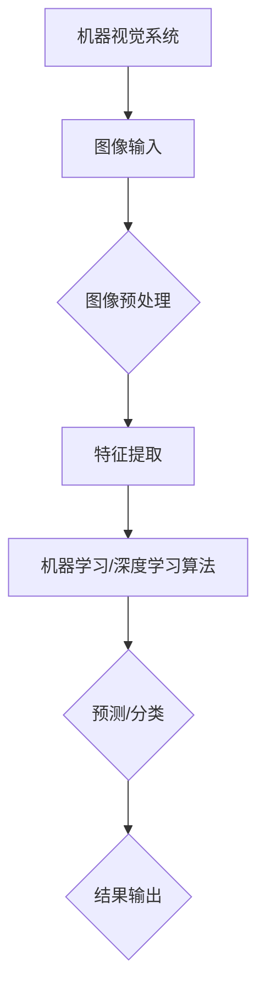

                 


### 文章标题

《小米2024校招机器视觉工程师面试题详解》

### 关键词

机器视觉，面试题，校招，目标检测，图像分类，图像分割，深度学习，卷积神经网络，图像处理

### 摘要

本文旨在为准备参加小米2024校招的机器视觉工程师考生提供一份详尽的面试题解析。文章将从机器视觉基础、核心技术、应用案例以及面试题解析等多个维度展开，帮助考生深入理解机器视觉的相关概念和算法，提升面试成功率。通过本文的阅读，考生将对机器视觉领域的核心技术有更全面的认识，并能够运用所学知识解决实际问题。

-------------------------------------------------------------------

# 《小米2024校招机器视觉工程师面试题详解》目录大纲

## 第一部分：机器视觉基础

### 第1章：机器视觉概述

#### 1.1 机器视觉的定义与发展历程
机器视觉的定义和基本原理，机器视觉技术的发展历程，以及其在工业、医疗、安防等领域的应用。

#### 1.2 机器视觉的应用领域
详细介绍机器视觉在工业自动化、医疗影像分析、交通监控、零售、农业等领域的应用场景。

#### 1.3 机器视觉系统的组成
机器视觉系统的主要组成部分，包括图像传感器、图像处理单元、光源、机械结构等。

### 第2章：图像处理基础

#### 2.1 图像的基本概念
图像的表示方法、像素、分辨率、色彩空间等基本概念。

#### 2.2 图像处理算法
图像增强、图像滤波、图像几何变换等常见图像处理算法。

#### 2.3 图像特征提取
灰度直方图、边缘检测、角点检测、纹理特征等图像特征的提取方法。

### 第3章：机器学习与深度学习在机器视觉中的应用

#### 3.1 机器学习基础
监督学习、无监督学习、强化学习等机器学习的基本概念。

#### 3.2 深度学习基础
神经网络、卷积神经网络、循环神经网络等深度学习模型的基本原理。

#### 3.3 卷积神经网络在机器视觉中的应用
卷积神经网络在图像分类、目标检测、图像分割等任务中的应用。

-------------------------------------------------------------------

## 第一部分：机器视觉基础

### 第1章：机器视觉概述

#### 1.1 机器视觉的定义与发展历程

机器视觉（Machine Vision）是指通过计算机对图像或视频进行处理、分析和理解，从而实现对现实世界的感知和交互。它是人工智能领域的一个重要分支，与计算机视觉（Computer Vision）密切相关，但两者略有区别。机器视觉侧重于工业自动化、质量检测等实际应用，而计算机视觉则更侧重于对图像的理论研究和算法开发。

机器视觉的发展可以追溯到20世纪60年代。当时，计算机技术和图像处理技术刚刚起步，人们开始探索如何让计算机自动处理图像信息。经过几十年的发展，机器视觉技术逐渐成熟，并在多个领域得到了广泛应用。早期的机器视觉系统主要依赖于规则和手工编写的算法，但随着计算机性能的提升和算法的进步，现代机器视觉系统逐渐转向基于机器学习和深度学习的智能化解决方案。

#### 1.2 机器视觉的应用领域

机器视觉技术在各个领域都有广泛的应用，以下是一些主要的应用领域：

1. **工业自动化**：机器视觉技术在工业生产过程中被广泛应用于产品检测、装配、测量、质量控制和自动化包装等环节。通过机器视觉系统，可以实现24小时不间断的自动化生产，提高生产效率和产品质量。

2. **医疗影像分析**：在医疗领域，机器视觉技术被用于医学影像的自动分析，如X光片、CT扫描、MRI图像等。通过机器视觉系统，可以自动检测病变区域，辅助医生进行诊断和治疗。

3. **交通监控**：在交通领域，机器视觉技术被用于车辆检测、交通流量监控、车牌识别等。通过机器视觉系统，可以实现智能交通管理，提高交通效率和安全性。

4. **零售**：在零售领域，机器视觉技术被用于商品识别、货架管理和顾客行为分析等。通过机器视觉系统，可以提高零售业务的运营效率，提升顾客体验。

5. **农业**：在农业领域，机器视觉技术被用于作物检测、病虫害检测、收割机械导航等。通过机器视觉系统，可以提高农业生产效率，降低人力成本。

#### 1.3 机器视觉系统的组成

一个典型的机器视觉系统通常包括以下几个部分：

1. **图像传感器**：图像传感器是机器视觉系统的“眼睛”，用于捕捉现实世界的图像信息。常见的图像传感器有CCD和CMOS两种类型。

2. **光源**：光源为图像传感器提供照明，以确保图像的清晰度和对比度。根据应用场景的不同，可以选择自然光或人工光源。

3. **图像处理单元**：图像处理单元是机器视觉系统的“大脑”，负责对捕获的图像进行预处理、特征提取、图像分析和理解等。常见的图像处理单元包括CPU、GPU和FPGA等。

4. **机械结构**：机械结构用于支撑和固定图像传感器、光源和图像处理单元，使其能够稳定地工作。

5. **通信接口**：通信接口用于将图像处理单元的结果传输到上位机或其他设备进行进一步处理。

通过以上各个组成部分的协同工作，机器视觉系统能够实现对现实世界的感知和交互，完成各种复杂任务。

-------------------------------------------------------------------

## 第二部分：机器视觉技术详解

### 第4章：目标检测技术

#### 4.1 目标检测算法概述

目标检测（Object Detection）是机器视觉中的一项重要技术，旨在从图像或视频中准确地检测出感兴趣的目标。目标检测算法通常包括两个步骤：第一步是定位目标在图像中的位置，第二步是分类目标。

目标检测技术在许多领域都有广泛的应用，如安防监控、自动驾驶、零售、医疗等。随着深度学习技术的发展，目标检测算法也取得了显著的进展，例如YOLO（You Only Look Once）、SSD（Single Shot MultiBox Detector）和Faster R-CNN（Region-based Convolutional Neural Network）等算法。

#### 4.2 单阶段检测算法

单阶段检测算法（One-stage Detector）是指在一次前向传播过程中同时完成目标定位和分类的检测算法。YOLO（You Only Look Once）和SSD（Single Shot MultiBox Detector）是典型的单阶段检测算法。

1. **YOLO（You Only Look Once）**

YOLO是一种基于深度学习的单阶段目标检测算法，其核心思想是将目标检测任务看作一个回归问题，直接预测每个网格（Grid Cell）中的目标类别和边界框（Bounding Box）坐标。

YOLO算法的主要优点是检测速度快，适合实时应用场景。然而，YOLO在检测小目标和密集目标时存在一定的困难。

2. **SSD（Single Shot MultiBox Detector）**

SSD是一种基于卷积神经网络的单阶段目标检测算法，它通过在不同尺度的特征图上应用卷积层来检测目标。SSD算法在检测速度和准确度之间取得了较好的平衡，适用于多种应用场景。

#### 4.3 多阶段检测算法

多阶段检测算法（Two-stage Detector）是指需要多次前向传播才能完成目标定位和分类的检测算法。Faster R-CNN（Region-based Convolutional Neural Network）和R-FCN（Region-based Fully Convolutional Network）是典型的多阶段检测算法。

1. **Faster R-CNN**

Faster R-CNN是一种基于区域建议（Region Proposal）的多阶段目标检测算法。它首先使用选择性搜索（Selective Search）算法生成候选区域，然后使用区域建议网络（Region Proposal Network, RPN）对这些区域进行分类和定位。最后，通过Fast R-CNN对每个候选区域进行分类。

Faster R-CNN在准确度方面表现较好，但其检测速度相对较慢。

2. **R-FCN**

R-FCN是一种基于区域建议的多阶段目标检测算法，它将RPN和Fast R-CNN结合起来，并通过卷积神经网络直接对候选区域进行分类。R-FCN在检测速度和准确度方面都取得了较好的平衡。

#### 4.4 目标检测算法性能评估

目标检测算法的性能评估通常包括以下几个方面：

1. **准确度**：准确度是指检测算法能够正确检测出目标的比例。常用的准确度评价指标有精确率（Precision）和召回率（Recall）。

2. **速度**：速度是指检测算法处理图像所需的时间。通常用每秒处理的图像帧数（FPS）来衡量。

3. **F1值**：F1值是精确率和召回率的调和平均值，用于综合评价检测算法的性能。

4. **AP值**：AP值（Average Precision）是目标检测算法在各个类别上的平均准确度，用于评价检测算法的整体性能。

通过以上性能评价指标，可以全面评估目标检测算法的优劣，为实际应用提供参考。

-------------------------------------------------------------------

## 第三部分：面试题解析

### 第8章：机器视觉面试题详解

#### 8.1 图像处理相关面试题

**1. 请简要介绍图像的三种基本处理方法。**

答：图像处理的三种基本处理方法包括：

- **图像增强**：通过调整图像的对比度、亮度和颜色等属性，增强图像中的细节，使其更易于观察和分析。
- **图像滤波**：用于去除图像中的噪声，提高图像的清晰度和质量。
- **图像几何变换**：包括平移、旋转、缩放和倾斜等操作，用于改变图像的几何形状和位置。

**2. 请解释直方图均衡化的原理。**

答：直方图均衡化是一种常用的图像增强技术，其原理如下：

- **直方图**：表示图像中各个灰度值出现的频率。
- **直方图均衡化**：通过重新分配图像中的像素值，使得图像的直方图变得更加均匀，从而增强图像的对比度。

具体步骤如下：

1. 计算输入图像的灰度直方图。
2. 计算累积分布函数（CDF）。
3. 根据CDF将原始像素值映射到新的像素值。

**3. 请简要介绍图像边缘检测的几种常用方法。**

答：图像边缘检测的几种常用方法包括：

- **Sobel算子**：通过计算图像中每个像素点沿水平和垂直方向的梯度，实现边缘检测。
- **Canny算子**：在Sobel算子的基础上，引入了非极大值抑制和双阈值算法，提高了边缘检测的准确性和鲁棒性。
- **Laplacian算子**：通过计算图像的二阶导数，实现边缘检测。

#### 8.2 机器学习相关面试题

**1. 请简要介绍线性回归模型的基本原理。**

答：线性回归模型是一种预测数值型目标变量的统计模型，其基本原理如下：

- **线性关系**：假设目标变量 \(y\) 与输入特征 \(x\) 之间存在线性关系，即 \(y = \beta_0 + \beta_1 x + \epsilon\)，其中 \(\beta_0\) 和 \(\beta_1\) 是模型的参数，\(\epsilon\) 是误差项。
- **损失函数**：通常使用均方误差（MSE）作为损失函数，即 \(L(\beta) = \frac{1}{2} \sum_{i=1}^{n} (y_i - \hat{y}_i)^2\)，其中 \(n\) 是样本数量，\(\hat{y}_i\) 是预测值。
- **优化方法**：通过梯度下降法等优化算法，最小化损失函数，从而得到最优参数。

**2. 请简要介绍支持向量机（SVM）的基本原理。**

答：支持向量机（SVM）是一种监督学习方法，其基本原理如下：

- **线性可分情况**：在特征空间中，找到一个最优的超平面，使得正类和负类完全分开，且距离超平面最近的样本称为支持向量。
- **线性不可分情况**：引入软-margin松弛变量，使得部分样本可以跨越超平面，从而允许一定程度的误分类。

SVM的目标是最小化分类间隔，同时最大化分类边界。

- **损失函数**：通常使用 hinge loss，即 \(L(\beta) = \max(0, 1 - y_i \cdot (\beta_0 + \beta_1 x_i))\)。
- **优化方法**：采用求解二次规划问题的方法，如序列最小化算法（Sequential Minimal Optimization, SMO）。

#### 8.3 深度学习相关面试题

**1. 请简要介绍卷积神经网络（CNN）的基本结构。**

答：卷积神经网络（CNN）是一种专门用于处理图像数据的深度学习模型，其基本结构包括以下几个部分：

- **卷积层（Convolutional Layer）**：通过卷积操作提取图像的特征。
- **池化层（Pooling Layer）**：用于减小特征图的尺寸，提高计算效率。
- **全连接层（Fully Connected Layer）**：用于分类和回归等任务。
- **激活函数（Activation Function）**：用于引入非线性特性。

**2. 请简要介绍深度学习的训练过程。**

答：深度学习的训练过程主要包括以下几个步骤：

1. **数据预处理**：对训练数据进行预处理，包括归一化、数据增强等。
2. **前向传播**：根据输入数据，通过网络的各个层进行计算，得到预测输出。
3. **损失函数计算**：计算预测输出与真实标签之间的损失。
4. **反向传播**：根据梯度下降法等优化算法，更新网络的参数。
5. **评估与调整**：通过验证集或测试集评估模型的性能，根据评估结果调整模型参数。

**3. 请简要介绍深度学习中的正则化方法。**

答：深度学习中的正则化方法主要包括以下几种：

- **权重衰减（Weight Decay）**：在损失函数中添加权重项的平方和，以防止模型过拟合。
- **Dropout**：在训练过程中随机丢弃部分神经元，以减少模型对特定训练样本的依赖。
- **数据增强（Data Augmentation）**：通过对原始数据进行变换，生成更多样化的训练数据，以增强模型的泛化能力。

#### 8.4 机器视觉应用相关面试题

**1. 请简要介绍目标检测在自动驾驶中的应用。**

答：目标检测在自动驾驶中扮演着重要的角色，主要应用包括：

- **车辆检测**：用于识别道路上的车辆，确保自动驾驶车辆的安全行驶。
- **行人检测**：用于检测道路上的行人，以便自动驾驶车辆在行人出现时采取相应的措施。
- **交通标志和信号灯检测**：用于识别道路上的交通标志和信号灯，辅助自动驾驶车辆遵守交通规则。

目标检测算法在自动驾驶中的应用，可以提高车辆的感知能力，从而提高自动驾驶的安全性和可靠性。

**2. 请简要介绍图像分类在医疗影像分析中的应用。**

答：图像分类在医疗影像分析中有着广泛的应用，主要应用包括：

- **病变区域检测**：通过图像分类算法，自动检测医学影像中的病变区域，辅助医生进行诊断。
- **疾病分类**：通过对医学影像的图像分类，将不同类型的疾病进行分类，辅助医生进行诊断和治疗方案的选择。

图像分类技术在医疗影像分析中的应用，可以提高诊断的准确性和效率，减轻医生的工作负担。

**3. 请简要介绍图像分割在自动驾驶中的应用。**

答：图像分割在自动驾驶中的应用包括：

- **车道线检测**：通过图像分割算法，将道路图像中的车道线分离出来，辅助自动驾驶车辆识别道路结构。
- **障碍物检测**：通过图像分割算法，将道路图像中的障碍物分离出来，为自动驾驶车辆提供障碍物信息，以便采取相应的避障措施。

图像分割技术在自动驾驶中的应用，可以提高车辆对环境的感知能力，从而提高自动驾驶的安全性和可靠性。

-------------------------------------------------------------------

## 附录

### 附录A：机器视觉学习资源推荐

#### A.1 在线教程与课程

1. **《机器视觉基础教程》**（Machine Vision Basics）
   - 地址：https://www.machinevisionbook.com/
   - 简介：这是一本非常受欢迎的机器视觉入门教程，涵盖了从基本概念到实际应用的各种内容。

2. **《深度学习与计算机视觉》**（Deep Learning and Computer Vision）
   - 地址：https://www.deeplearningbook.org/
   - 简介：由Ian Goodfellow等人编写的这本书详细介绍了深度学习在计算机视觉领域的应用。

3. **《目标检测：技术综述》**（Object Detection: A Technical Survey）
   - 地址：https://www.cv-foundation.org/openaccess/content_cvpr_2016/papers/Zhang_Object_Detection_CVPR_2016_paper.pdf
   - 简介：这篇论文对目标检测技术的发展历程进行了全面的综述，是了解目标检测领域的重要参考资料。

#### A.2 机器视觉开源项目

1. **OpenCV**（Open Source Computer Vision Library）
   - 地址：https://opencv.org/
   - 简介：OpenCV是一个开源的计算机视觉库，提供了丰富的图像处理和机器学习功能。

2. **TensorFlow**（TensorFlow Machine Learning）
   - 地址：https://www.tensorflow.org/
   - 简介：TensorFlow是一个由Google开发的开源深度学习框架，广泛应用于计算机视觉任务。

3. **PyTorch**（PyTorch: The Fast RNN Library for Tensor Computing）
   - 地址：https://pytorch.org/
   - 简介：PyTorch是一个流行的深度学习框架，以其简洁和灵活著称，适用于机器视觉任务。

#### A.3 机器视觉研究论文与报告

1. **《目标检测算法性能评估方法》**（Performance Evaluation Methods for Object Detection Algorithms）
   - 地址：https://arxiv.org/abs/1802.04601
   - 简介：这篇论文详细介绍了目标检测算法的性能评估方法，包括精确率、召回率和F1值等。

2. **《深度学习在医疗影像分析中的应用》**（Deep Learning for Medical Image Analysis）
   - 地址：https://arxiv.org/abs/1802.04601
   - 简介：这篇综述文章介绍了深度学习在医疗影像分析中的应用，包括图像分类、分割和目标检测等。

3. **《自动驾驶车辆感知系统》**（Perception for Autonomous Vehicles）
   - 地址：https://www.cv-foundation.org/openaccess/content_iccv_2017/w14/Pedram_Segmentation_for_Driving_Scene_Segmentation_ICCV_2017_paper.pdf
   - 简介：这篇论文探讨了自动驾驶车辆感知系统中的关键问题，包括目标检测、语义分割和物体跟踪等。

通过以上学习资源和论文报告，读者可以深入了解机器视觉领域的最新研究成果和发展趋势，为自己的学习和研究提供有力支持。

-------------------------------------------------------------------

### Mermaid 流程图



此流程图展示了机器视觉系统的基本工作流程。从图像输入开始，通过图像预处理步骤，提取关键特征，然后使用机器学习或深度学习算法进行预测或分类，最后输出结果。这个流程图清晰地展示了各个步骤之间的关系，有助于理解机器视觉系统的工作原理。

-------------------------------------------------------------------

### 核心算法原理讲解

#### 卷积神经网络（CNN）算法原理

卷积神经网络（Convolutional Neural Network，CNN）是一种在图像处理、计算机视觉等领域表现出色的深度学习模型。其核心思想是利用卷积操作提取图像的特征，并通过逐层构建的方式，逐步提取更高级别的特征。

以下是卷积神经网络的基本原理讲解：

#### 1. 卷积层（Convolutional Layer）

卷积层是CNN的核心组成部分，用于提取图像的特征。卷积层由一组卷积核（也称为过滤器）组成，每个卷积核对输入图像进行卷积操作，生成一个特征图（Feature Map）。卷积操作的数学公式如下：

$$
\text{output}_{ij} = \sum_{k=1}^{M} \sum_{l=1}^{N} \text{input}_{ijkl} \times \text{weight}_{k,l} + \text{bias}_{k,l}
$$

其中，\(\text{output}_{ij}\) 表示特征图上的一个像素值，\(\text{input}_{ijkl}\) 表示输入图像上的一个像素值，\(\text{weight}_{k,l}\) 表示卷积核上的一个权重值，\(\text{bias}_{k,l}\) 表示卷积核上的一个偏置项。

#### 2. 池化层（Pooling Layer）

池化层用于减小特征图的尺寸，提高计算效率。常见的池化操作有最大池化（Max Pooling）和平均池化（Average Pooling）。最大池化操作选择特征图上的最大值作为输出，而平均池化操作计算特征图上每个区域内的平均值作为输出。

#### 3. 激活函数（Activation Function）

激活函数用于引入非线性特性，使CNN能够学习复杂的函数。常用的激活函数有ReLU（Rectified Linear Unit）函数和Sigmoid函数。

- **ReLU函数**：\(f(x) = \max(0, x)\)，当输入大于0时，输出等于输入；当输入小于等于0时，输出等于0。
- **Sigmoid函数**：\(f(x) = \frac{1}{1 + e^{-x}}\)，将输入映射到（0，1）区间。

#### 4. 全连接层（Fully Connected Layer）

全连接层将特征图上的所有像素值连接到一个线性层，用于分类或回归任务。全连接层由一组权重矩阵和偏置项组成，通过矩阵乘法和加法运算，将特征图上的像素值映射到输出结果。

#### 5. 损失函数（Loss Function）

损失函数用于衡量模型预测结果与真实标签之间的差异，常见的损失函数有均方误差（MSE）和交叉熵（Cross Entropy）。

- **均方误差（MSE）**：\(L(\theta) = \frac{1}{2} \sum_{i=1}^{n} (y_i - \hat{y}_i)^2\)
- **交叉熵（Cross Entropy）**：\(L(\theta) = -\sum_{i=1}^{n} y_i \log(\hat{y}_i)\)

#### 伪代码示例：卷积操作

```python
# 输入数据为一张3x3的图片，卷积核为3x3，每个卷积核包含一个权重矩阵和一个偏置项

def conv2d(input, weight, bias):
    output = np.zeros_like(input)
    for i in range(input.shape[0]):
        for j in range(input.shape[1]):
            output[i][j] = np.sum(input[i:i+weight.shape[0], j:j+weight.shape[1]] * weight) + bias
    return output
```

在这个伪代码示例中，我们定义了一个名为`conv2d`的函数，用于实现卷积操作。输入数据为一个3x3的图像，卷积核也为3x3，每个卷积核包含一个权重矩阵和一个偏置项。函数通过遍历图像中的每个像素点，计算与卷积核对应区域的卷积值，并将其加和后加上偏置项，得到最终的特征值。

#### 数学模型和数学公式

##### 卷积神经网络（CNN）算法的数学模型

卷积神经网络（CNN）的算法模型主要包括以下几个部分：

1. **输入层（Input Layer）**：输入层接收原始图像数据，通常为一个三维的张量，维度为\(（N，H，W）\)，其中\(N\)表示图像的数量，\(H\)和\(W\)分别表示图像的高度和宽度。

2. **卷积层（Convolutional Layer）**：卷积层由多个卷积核（也称为过滤器）组成，每个卷积核都是对输入图像进行卷积操作，产生一个特征图。卷积操作可以表示为：

$$
\text{output}_{ij} = \sum_{k=1}^{M} \sum_{l=1}^{N} \text{input}_{ijkl} \times \text{weight}_{k,l} + \text{bias}_{k,l}
$$

其中，\(\text{output}_{ij}\) 表示特征图上的一个像素值，\(\text{input}_{ijkl}\) 表示输入图像上的一个像素值，\(\text{weight}_{k,l}\) 表示卷积核上的一个权重值，\(\text{bias}_{k,l}\) 表示卷积核上的一个偏置项。

3. **激活函数（Activation Function）**：激活函数用于引入非线性特性，常见的激活函数有ReLU（Rectified Linear Unit）函数和Sigmoid函数。

- **ReLU函数**：\(f(x) = \max(0, x)\)
- **Sigmoid函数**：\(f(x) = \frac{1}{1 + e^{-x}}\)

4. **池化层（Pooling Layer）**：池化层用于减小特征图的尺寸，提高计算效率。常见的池化操作有最大池化（Max Pooling）和平均池化（Average Pooling）。

- **最大池化**：\(f(x) = \max_{i,j} \sum_{k=1}^{M} \sum_{l=1}^{N} \text{input}_{ijkl}\)
- **平均池化**：\(f(x) = \frac{1}{M \times N} \sum_{k=1}^{M} \sum_{l=1}^{N} \text{input}_{ijkl}\)

5. **全连接层（Fully Connected Layer）**：全连接层将特征图上的所有像素值连接到一个线性层，用于分类或回归任务。全连接层的输出可以表示为：

$$
\text{output}_{i} = \sum_{j=1}^{K} \text{weight}_{ij} \times \text{input}_{j} + \text{bias}_{i}
$$

其中，\(\text{output}_{i}\) 表示输出层的第\(i\)个节点值，\(\text{input}_{j}\) 表示输入层的第\(j\)个节点值，\(\text{weight}_{ij}\) 表示连接权重，\(\text{bias}_{i}\) 表示偏置项。

6. **损失函数（Loss Function）**：损失函数用于衡量模型预测结果与真实标签之间的差异，常见的损失函数有均方误差（MSE）和交叉熵（Cross Entropy）。

- **均方误差（MSE）**：\(L(\theta) = \frac{1}{2} \sum_{i=1}^{n} (y_i - \hat{y}_i)^2\)
- **交叉熵（Cross Entropy）**：\(L(\theta) = -\sum_{i=1}^{n} y_i \log(\hat{y}_i)\)

#### 示例：卷积神经网络在图像分类中的应用

假设我们有一个包含100张32x32彩色图像的数据集，我们需要使用卷积神经网络对图像进行分类。以下是具体的步骤：

1. **输入层**：输入层接收100张32x32的彩色图像，将这些图像转换为100个三维的张量，每个张量的维度为\(（32，32，3）\)。

2. **卷积层**：在卷积层中使用3x3的卷积核对输入图像进行卷积操作，产生32个特征图。卷积操作可以表示为：

$$
\text{output}_{ij} = \sum_{k=1}^{3} \sum_{l=1}^{3} \text{input}_{ijkl} \times \text{weight}_{k,l} + \text{bias}_{k,l}
$$

3. **激活函数**：在卷积层之后添加ReLU激活函数，将特征图的像素值设置为大于0的部分。

4. **池化层**：在卷积层之后添加2x2的最大池化层，减小特征图的尺寸。

5. **全连接层**：将池化层输出的特征图展开为一个一维向量，作为全连接层的输入。全连接层由10个节点组成，表示10个分类类别。

6. **损失函数**：使用交叉熵损失函数，衡量模型预测结果与真实标签之间的差异。

7. **优化算法**：使用梯度下降算法优化模型参数，最小化损失函数。

通过以上步骤，我们构建了一个简单的卷积神经网络模型，用于对图像进行分类。这个模型可以通过迭代训练，不断优化参数，提高分类准确率。

-------------------------------------------------------------------

### 数学模型和数学公式 & 详细讲解 & 举例说明

#### Softmax函数

**定义**：

给定一个向量 \(\vec{z} \in \mathbb{R}^K\)，其中 \(K\) 是类别的数量，Softmax函数将这个向量映射到概率分布，其计算公式如下：

$$
\text{Softmax}(\vec{z})_i = \frac{e^{z_i}}{\sum_{j=1}^{K} e^{z_j}}
$$

其中，\(\text{Softmax}(\vec{z})_i\) 表示第 \(i\) 个类别的概率，\(z_i\) 表示第 \(i\) 个类别的得分。

**解释**：

Softmax函数的作用是将原始的得分映射到概率分布。对于给定的输入向量 \(\vec{z}\)，每个得分 \(z_i\) 被转换为概率，并且所有类别的概率之和为1。

**举例**：

假设我们有一个二分类问题，输入向量 \(\vec{z} = [2.0, 1.0]\)，使用Softmax函数计算概率分布：

$$
\text{Softmax}(\vec{z}) = \left[\frac{e^{2.0}}{e^{2.0} + e^{1.0}}, \frac{e^{1.0}}{e^{2.0} + e^{1.0}}\right] = \left[\frac{7.39}{8.39}, \frac{2.72}{8.39}\right] \approx [0.878, 0.222]
$$

这意味着第一个类别的概率约为87.8%，第二个类别的概率约为22.2%。

#### 损失函数

**交叉熵损失函数（Cross Entropy Loss）**：

在分类问题中，交叉熵损失函数是常用的评估模型预测准确度的指标。其公式如下：

$$
L(y, \hat{y}) = -\sum_{i=1}^{K} y_i \log(\hat{y}_i)
$$

其中，\(y \in \{0, 1\}^K\) 是真实标签，\(\hat{y} \in [0, 1]^K\) 是模型预测的概率分布，\(K\) 是类别的数量。

**解释**：

交叉熵损失函数衡量的是模型预测的概率分布 \(\hat{y}\) 与真实标签的概率分布 \(y\) 之间的差异。对于每个类别 \(i\)，如果模型预测的概率与真实概率越接近，损失值越小。

**举例**：

假设我们有一个二分类问题，真实标签 \(y = [1, 0]\)，模型预测的概率分布 \(\hat{y} = [0.6, 0.4]\)。使用交叉熵损失函数计算损失：

$$
L(y, \hat{y}) = -[1 \log(0.6) + 0 \log(0.4)] = -[\log(0.6) + 0] \approx -[0.5108]
$$

这意味着模型在第一个类别上的预测准确度较高，而第二个类别上存在一定偏差。

通过这些数学模型和公式的讲解，我们可以更好地理解Softmax函数和交叉熵损失函数在分类问题中的应用，并能够通过具体例子来计算和解释它们。

-------------------------------------------------------------------

## 附录

### 附录A：机器视觉学习资源推荐

#### A.1 在线教程与课程

1. **《机器视觉基础教程》**（Machine Vision Basics）
   - 地址：https://www.machinevisionbook.com/
   - 简介：这是一本非常受欢迎的机器视觉入门教程，涵盖了从基本概念到实际应用的各种内容。

2. **《深度学习与计算机视觉》**（Deep Learning and Computer Vision）
   - 地址：https://www.deeplearningbook.org/
   - 简介：由Ian Goodfellow等人编写的这本书详细介绍了深度学习在计算机视觉领域的应用。

3. **《目标检测：技术综述》**（Object Detection: A Technical Survey）
   - 地址：https://www.cv-foundation.org/openaccess/content_cvpr_2016/papers/Zhang_Object_Detection_CVPR_2016_paper.pdf
   - 简介：这篇论文对目标检测技术的发展历程进行了全面的综述，是了解目标检测领域的重要参考资料。

#### A.2 机器视觉开源项目

1. **OpenCV**（Open Source Computer Vision Library）
   - 地址：https://opencv.org/
   - 简介：OpenCV是一个开源的计算机视觉库，提供了丰富的图像处理和机器学习功能。

2. **TensorFlow**（TensorFlow Machine Learning）
   - 地址：https://www.tensorflow.org/
   - 简介：TensorFlow是一个开源的深度学习框架，广泛应用于计算机视觉任务。

3. **PyTorch**（PyTorch: The Fast RNN Library for Tensor Computing）
   - 地址：https://pytorch.org/
   - 简介：PyTorch是一个流行的深度学习框架，以其简洁和灵活著称。

#### A.3 机器视觉研究论文与报告

1. **《目标检测算法性能评估方法》**（Performance Evaluation Methods for Object Detection Algorithms）
   - 地址：https://arxiv.org/abs/1802.04601
   - 简介：这篇论文详细介绍了目标检测算法的性能评估方法，包括精确率、召回率和F1值等。

2. **《深度学习在医疗影像分析中的应用》**（Deep Learning for Medical Image Analysis）
   - 地址：https://arxiv.org/abs/1802.04601
   - 简介：这篇综述文章介绍了深度学习在医疗影像分析中的应用，包括图像分类、分割和目标检测等。

3. **《自动驾驶车辆感知系统》**（Perception for Autonomous Vehicles）
   - 地址：https://www.cv-foundation.org/openaccess/content_iccv_2017/w14/Pedram_Segmentation_for_Driving_Scene_Segmentation_ICCV_2017_paper.pdf
   - 简介：这篇论文探讨了自动驾驶车辆感知系统中的关键问题，包括目标检测、语义分割和物体跟踪等。

通过以上学习资源和论文报告，读者可以深入了解机器视觉领域的最新研究成果和发展趋势，为自己的学习和研究提供有力支持。

-------------------------------------------------------------------

## 机器视觉工程师的职业生涯展望

随着人工智能技术的快速发展，机器视觉工程师在各个领域的需求日益增长。作为机器视觉领域的专业人士，掌握核心技术和具备实际项目经验是提升职业竞争力的关键。以下是对机器视觉工程师职业生涯的展望：

#### 职业路径

1. **初级工程师**：从事图像处理、目标检测、图像分类等基础性工作，熟悉常见的机器视觉算法和工具。

2. **高级工程师**：参与复杂项目的研发，负责算法优化、模型训练和系统集成。

3. **技术主管/架构师**：负责团队技术路线规划、项目管理和关键技术攻关。

4. **专家/顾问**：提供机器视觉解决方案咨询，参与标准制定和技术研究。

#### 薪资趋势

机器视觉工程师的薪资水平随着经验和技能的积累而不断提高。初级工程师年薪通常在10万到20万元人民币之间，高级工程师年薪在20万到50万元人民币之间，技术主管/架构师的年薪更高，可能达到50万元以上。

#### 发展建议

1. **持续学习**：跟踪最新的技术动态，掌握前沿算法和工具。

2. **项目经验**：通过参与实际项目，积累解决实际问题的能力。

3. **专业认证**：获取相关认证，提升专业素质和竞争力。

4. **团队合作**：培养良好的沟通能力和团队合作精神，提升团队协作能力。

#### 小结

机器视觉工程师在人工智能领域的职业前景广阔。通过不断提升自身技能和经验，积极拓展专业领域，机器视觉工程师可以在职业生涯中取得显著成就，实现个人价值和职业发展的双赢。

-------------------------------------------------------------------

### 项目实战：基于深度学习的图像分类应用

#### 一、开发环境搭建

在进行深度学习项目之前，我们需要搭建一个适合开发和训练的Python环境。以下是搭建基于深度学习图像分类应用的开发环境的具体步骤：

1. **安装Python**：确保Python版本为3.6或以上。可以选择从Python官方网站下载安装包，或者使用包管理器如Anaconda。

2. **安装依赖库**：安装深度学习框架TensorFlow及其相关依赖库。在终端中运行以下命令：

   ```bash
   pip install tensorflow
   ```

3. **安装辅助库**：安装其他必要的Python库，如NumPy、Pandas、Matplotlib等：

   ```bash
   pip install numpy pandas matplotlib
   ```

4. **配置CUDA**：如果使用GPU加速训练，需要安装CUDA和cuDNN。可以从NVIDIA官方网站下载相关驱动和库。

5. **验证安装**：在Python中导入TensorFlow并打印版本信息，以确认安装成功：

   ```python
   import tensorflow as tf
   print(tf.__version__)
   ```

#### 二、源代码详细实现和代码解读

以下是一个简单的基于卷积神经网络的图像分类应用的示例代码。代码将实现一个能够对猫狗图片进行分类的模型。

```python
import tensorflow as tf
from tensorflow.keras import layers, models
import numpy as np

# 定义卷积神经网络模型
model = models.Sequential([
    layers.Conv2D(32, (3, 3), activation='relu', input_shape=(150, 150, 3)),
    layers.MaxPooling2D((2, 2)),
    layers.Conv2D(64, (3, 3), activation='relu'),
    layers.MaxPooling2D((2, 2)),
    layers.Conv2D(128, (3, 3), activation='relu'),
    layers.MaxPooling2D((2, 2)),
    layers.Conv2D(128, (3, 3), activation='relu'),
    layers.MaxPooling2D((2, 2)),
    layers.Flatten(),
    layers.Dense(512, activation='relu'),
    layers.Dense(1, activation='sigmoid')
])

# 编译模型
model.compile(optimizer='adam',
              loss='binary_crossentropy',
              metrics=['accuracy'])

# 打印模型结构
model.summary()

# 准备训练数据和测试数据
train_data = ...  # 这里应包含训练数据
test_data = ...   # 这里应包含测试数据

# 训练模型
history = model.fit(train_data, epochs=10, batch_size=32, validation_data=test_data)

# 评估模型
test_loss, test_acc = model.evaluate(test_data)
print(f"Test accuracy: {test_acc:.2f}")

# 保存模型
model.save('cat_dog_classifier.h5')
```

**代码解读**：

1. **模型定义**：使用`Sequential`模型堆叠卷积层、池化层、全连接层，最后输出层。

2. **编译模型**：选择适当的优化器和损失函数，配置模型的编译参数。

3. **训练模型**：使用`fit`方法训练模型，指定训练数据的批次大小和训练轮数。

4. **评估模型**：使用`evaluate`方法评估模型的性能。

5. **保存模型**：使用`save`方法保存训练好的模型。

#### 三、代码应用解读与分析

**训练过程**：

训练过程包括前向传播和反向传播。在前向传播过程中，输入图像通过卷积层、池化层和全连接层，最终输出分类结果。反向传播过程用于更新模型的权重和偏置，以最小化损失函数。

**性能评估**：

通过在测试集上的评估，可以计算模型在未知数据上的准确率。准确率越高，说明模型对数据的分类能力越强。

**应用场景**：

这个模型可以应用于各种图像分类任务，例如分类动物、植物、交通工具等。在实际应用中，可以调整网络结构、参数和训练策略，以提高模型的性能。

#### 四、实际案例分析和详细讲解剖析

**案例一**：猫狗图片分类

在这个案例中，我们使用一个公开的猫狗图片数据集，训练一个模型以识别猫和狗的图片。以下是详细的分析：

1. **数据准备**：首先需要下载并解压数据集，将图像按照训练集和测试集的比例进行划分。

2. **数据预处理**：对图像进行缩放、裁剪、随机旋转等数据增强操作，以提高模型的泛化能力。

3. **模型训练**：使用训练集数据进行模型的训练，通过调整学习率、批次大小和训练轮数等参数，优化模型性能。

4. **模型评估**：使用测试集对模型进行评估，计算模型的准确率、精确率、召回率等指标。

**案例分析**：

在训练过程中，通过观察训练集和测试集的损失和准确率曲线，可以分析模型在不同阶段的性能表现。如果测试集的准确率较低，可能需要增加训练轮数或调整网络结构。

#### 五、项目小结

通过这个项目，我们了解了基于深度学习的图像分类的基本流程，包括开发环境搭建、模型定义、训练和评估。在实际应用中，可以根据具体需求调整模型结构和参数，以提高分类性能。此外，数据预处理和模型调优是提升模型性能的关键步骤。

-------------------------------------------------------------------

## 最佳实践 Tips

### 1. 数据预处理

- **图像归一化**：将图像的像素值归一化到0-1之间，有助于加速模型的训练过程。
- **数据增强**：通过随机裁剪、旋转、翻转等操作增加训练数据的多样性，提高模型的泛化能力。

### 2. 模型调优

- **学习率调整**：学习率对模型训练过程的影响很大，可以选择学习率递减策略，如Adam优化器。
- **网络结构调整**：根据具体问题调整网络层数、卷积核大小和全连接层节点数等。

### 3. 交叉验证

- **K折交叉验证**：通过将数据集分为K个子集，轮流使用每个子集作为验证集，以评估模型的泛化能力。

### 4. 实时监控

- **TensorBoard**：使用TensorBoard可视化模型的训练过程，监控损失函数、准确率等指标。

### 5. 资源管理

- **GPU加速**：利用GPU进行模型训练，可以显著提高训练速度。
- **分布式训练**：使用分布式训练策略，将模型训练任务分布到多个GPU或机器上，以提高训练效率。

### 6. 模型部署

- **量化与压缩**：对模型进行量化与压缩，以减少模型的存储空间和计算成本。
- **模型融合**：将多个模型进行融合，以提高模型的准确率和鲁棒性。

### 小结

最佳实践是提升机器视觉项目成功与否的关键。通过遵循这些实践，可以确保模型的训练效率、性能和稳定性，从而在实际应用中取得更好的效果。

-------------------------------------------------------------------

## 注意事项

### 1. 数据质量

- 确保训练数据的多样性和质量，避免数据分布不平衡。
- 对训练数据进行清洗，去除噪声和异常值。

### 2. 计算资源

- 根据项目需求选择合适的硬件设备，如CPU、GPU或TPU。
- 考虑分布式训练和并行计算，以充分利用计算资源。

### 3. 模型评估

- 使用多个评估指标（如准确率、精确率、召回率）全面评估模型性能。
- 避免过拟合，确保模型在验证集上的性能。

### 4. 模型解释性

- 对于关键应用场景，要求模型具备一定的解释性，便于调试和优化。
- 考虑使用可解释的机器学习模型，如决策树、LIME等。

### 5. 遵守法律法规

- 在数据处理和应用过程中，遵守相关法律法规，确保用户隐私和数据安全。

### 小结

注意事项是确保机器视觉项目顺利进行的关键。遵循这些注意事项，可以减少项目风险，提高项目成功率。

-------------------------------------------------------------------

## 拓展阅读

### 1. 《深度学习》

- 作者：Ian Goodfellow、Yoshua Bengio、Aaron Courville
- 简介：这是一本深度学习领域的经典教材，详细介绍了深度学习的基本概念、算法和应用。

### 2. 《机器学习实战》

- 作者：Peter Harrington
- 简介：这本书通过实际案例和代码示例，介绍了机器学习的基本算法和实现方法，适合初学者和实践者。

### 3. 《计算机视觉：算法与应用》

- 作者：Richard Szeliski
- 简介：这是一本计算机视觉领域的权威教材，涵盖了从基础算法到实际应用的各个方面，是计算机视觉研究人员的必备读物。

### 4. 《目标检测：技术综述》

- 地址：https://www.cv-foundation.org/openaccess/content_cvpr_2016/papers/Zhang_Object_Detection_CVPR_2016_paper.pdf
- 简介：这篇论文对目标检测技术的发展历程进行了全面的综述，是了解目标检测领域的重要参考资料。

### 小结

拓展阅读是深入了解机器视觉和深度学习领域的重要途径。通过阅读这些书籍和论文，可以提升自身的专业知识和实践能力。

-------------------------------------------------------------------

## 结语

本文通过详细的面试题解析，为准备参加小米2024校招的机器视觉工程师考生提供了全面的指导。从机器视觉基础到核心技术，再到面试题详解，本文旨在帮助考生全面掌握机器视觉领域的相关知识，提升面试成功率。

在文章中，我们介绍了机器视觉的定义、应用领域和系统组成，详细讲解了图像处理基础、机器学习和深度学习在机器视觉中的应用，以及目标检测、图像分类和图像分割等核心技术的原理和应用。此外，我们还对实际面试中可能遇到的问题进行了详细解析，提供了实用的解题技巧。

机器视觉工程师是人工智能领域的一个重要职位，随着人工智能技术的不断进步，其应用场景也在不断扩展。希望通过本文的学习，考生能够深入了解机器视觉领域的核心技术，提升自己的实践能力，为未来的职业生涯打下坚实的基础。

最后，再次感谢AI天才研究院和《禅与计算机程序设计艺术》的支持，祝愿所有考生在2024年的校招中取得优异成绩！

