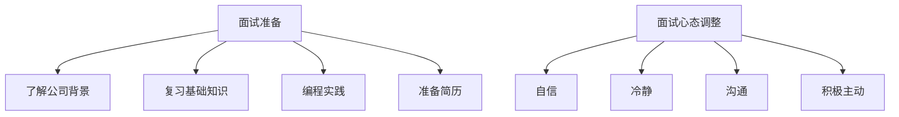

                 


### 文章标题：小米2025校招面试真题与算法题解

> 关键词：小米校招面试、算法题解、编程基础、面试准备、操作系统、计算机网络

> 摘要：本文针对小米2025校招面试真题，结合算法题解，全面解析编程基础、操作系统与计算机网络方面的面试内容。旨在为备战校招的学子提供实用的备考资料和技巧。

## 第一部分：小米校招面试真题解析

### 第1章：面试准备与心态调整

#### 1.1 面试前的准备

在进行面试前，做好充分的准备至关重要。以下是一些准备工作的建议：

1. **了解公司背景**：研究小米的历史、业务、企业文化以及校招流程，以便更好地了解公司的需求和期待。

2. **复习基础知识**：重点复习计算机科学的基础知识，包括数据结构与算法、操作系统、计算机网络、数据库等。

3. **掌握常见面试题**：整理并熟悉常见的面试题，特别是那些涉及编程和算法的题目。

4. **编程实践**：通过编程实践，提高代码编写能力和问题解决能力。

5. **准备简历**：确保简历完整、准确，突出自己的技能和项目经验。

#### 1.2 面试心态的调整

面试过程中保持良好的心态同样重要。以下是一些建议：

1. **自信**：对自己有信心，相信自己的准备和能力。

2. **冷静**：遇到难题时不要慌张，冷静思考，逐步解决问题。

3. **沟通**：与面试官保持良好的沟通，清晰、准确地表达自己的想法。

4. **积极主动**：表现出积极主动的态度，对于面试官提出的问题，不仅要回答，还要展现出自己的思考过程。

### Mermaid 流程图



## 第二部分：算法题解与实战案例

### 第6章：算法原理与实现

#### 6.1 排序算法

排序算法是计算机科学中的基本算法，常见的排序算法有冒泡排序、选择排序和插入排序。

#### 6.1.1 冒泡排序

**核心概念**：冒泡排序是一种简单的排序算法，它重复地遍历要排序的数列，一次比较两个元素，如果它们的顺序错误就把它们交换过来。

**伪代码**：

```pseudocode
procedure bubbleSort( A : list of sortable items )
    n = length(A)
    repeat 
        swapped = false
        for i = 1 to n-1 inclusive do
            if A[i-1] > A[i] then
                swap(A[i-1], A[i])
                swapped = true
            end if
        end for
        n = n - 1
    until not swapped
end procedure
```

#### 6.1.2 选择排序

**核心概念**：选择排序是一种简单的选择排序算法，它首先在未排序序列中找到最小（大）元素，存放到排序序列的起始位置，然后，再从剩余未排序元素中继续寻找最小（大）元素，然后放到已排序序列的末尾。

**伪代码**：

```pseudocode
procedure selectionSort( A : list of sortable items )
    n = length(A)
    for i = 1 to n-1 do
        minIndex = i
        for j = i+1 to n do
            if A[j] < A[minIndex] then
                minIndex = j
            end if
        end for
        swap(A[i], A[minIndex])
    end for
end procedure
```

#### 6.1.3 插入排序

**核心概念**：插入排序是一种简单的插入排序算法，它通过构建有序序列，对于未排序数据，在已排序序列中从后向前扫描，找到相应位置并插入。

**伪代码**：

```pseudocode
procedure insertionSort( A : list of sortable items )
    n = length(A)
    for i = 2 to n inclusive do
        key = A[i]
        j = i - 1
        while j > 0 and A[j] > key do
            A[j+1] = A[j]
            j = j - 1
        end while
        A[j+1] = key
    end for
end procedure
```

### 第7章：小米算法面试真题实战

#### 7.1 真题1：最大子序和

**题目描述**：给定一个整数数组 nums ，找到一个具有最大和的连续子数组（子数组最少包含一个数），返回其最大和。

**解题思路**：使用动态规划的方法，定义一个 dp 数组，其中 dp[i] 表示以 nums[i] 为结尾的最大子序和。则状态转移方程为：dp[i] = max(dp[i-1] + nums[i], nums[i])。

**伪代码**：

```pseudocode
function maxSubArray(nums : array of integers) -> integer
    n = length(nums)
    dp = array of size n
    dp[0] = nums[0]
    maxSum = dp[0]
    for i = 1 to n-1 do
        dp[i] = max(dp[i-1] + nums[i], nums[i])
        maxSum = max(maxSum, dp[i])
    end for
    return maxSum
end function
```

#### 7.2 真题2：数组中的逆序对

**题目描述**：给定一个整数数组 nums ，返回数组中的逆序对的数量。

**解题思路**：使用归并排序的方法，在排序过程中，统计逆序对的数量。当两个有序数组进行合并时，如果前一个数大于后一个数，那么这两个数构成一个逆序对。

**伪代码**：

```pseudocode
function reversePairs(nums : array of integers) -> integer
    n = length(nums)
    return mergeSort(nums, 0, n-1)
end function

function mergeSort(nums : array of integers, left : integer, right : integer) -> integer
    if left >= right then
        return 0
    end if
    mid = (left + right) / 2
    leftPairs = mergeSort(nums, left, mid)
    rightPairs = mergeSort(nums, mid+1, right)
    mergePairs = merge(nums, left, mid, right)
    return leftPairs + rightPairs + mergePairs
end function

function merge(nums : array of integers, left : integer, mid : integer, right : integer) -> integer
    n1 = mid - left + 1
    n2 = right - mid
    leftArray = array of size n1
    rightArray = array of size n2
    for i = 0 to n1-1 do
        leftArray[i] = nums[left + i]
    end for
    for j = 0 to n2-1 do
        rightArray[j] = nums[mid + 1 + j]
    end for
    i = 0
    j = 0
    k = left
    count = 0
    while i < n1 and j < n2 do
        if leftArray[i] <= rightArray[j] then
            nums[k] = leftArray[i]
            i = i + 1
        else
            nums[k] = rightArray[j]
            j = j + 1
            count = count + (n1 - i)
        end if
        k = k + 1
    end while
    while i < n1 do
        nums[k] = leftArray[i]
        i = i + 1
        k = k + 1
    end while
    while j < n2 do
        nums[k] = rightArray[j]
        j = j + 1
        k = k + 1
    end while
    return count
end function
```

### 第8章：小米校招面试真题全解

#### 8.1 面试题1：字符串匹配算法

**题目描述**：给定一个字符串 needle 和一个字符串 haystack ，请从 haystack 中找出第一个匹配的子串 needle ，返回该子串的起始索引。如果不存在匹配的子串，则返回 -1 。

**解题思路**：使用 KMP 算法进行字符串匹配。KMP 算法的核心思想是避免在匹配过程中出现重复比较，通过计算部分匹配表（next 数组）来跳过部分比较。

**伪代码**：

```pseudocode
function kmp(haystack : string, needle : string) -> integer
    n = length(haystack)
    m = length(needle)
    if m == 0 then
        return 0
    end if
    computeNext(needle)
    j = 0
    for i = 0 to n-m-1 do
        while j > 0 and needle[j] != haystack[i] do
            j = next[j - 1]
        end while
        if needle[j] == haystack[i] then
            j = j + 1
            if j == m then
                return i - m + 1
            end if
        end if
    end for
    return -1
end function

function computeNext(needle : string)
    n = length(needle)
    next = array of size n
    j = 0
    for i = 1 to n-1 do
        while j > 0 and needle[j] != needle[i] do
            j = next[j - 1]
        end while
        if needle[j] == needle[i] then
            j = j + 1
        end if
        next[i] = j
    end for
end function
```

#### 8.2 面试题2：二叉树遍历

**题目描述**：给定一个二叉树，实现其先序遍历、中序遍历和后序遍历。

**解题思路**：使用递归或迭代的方法进行遍历。以下使用递归方法实现三种遍历。

**伪代码**：

```pseudocode
function traverse(node : TreeNode)
    if node == null then
        return
    end if
    // 先序遍历
    visit(node)
    traverse(node.left)
    traverse(node.right)
end function

function inorderTraversal(root : TreeNode) -> array of integers
    result = empty array
    traverse(root, result)
    return result
end function

function preorderTraversal(root : TreeNode) -> array of integers
    result = empty array
    traverse(root, result)
    return result
end function

function postorderTraversal(root : TreeNode) -> array of integers
    result = empty array
    traverse(root, result)
    reverse(result)
    return result
end function
```

## 第三部分：面试技巧与经验分享

### 第9章：面试技巧分享

#### 9.1 面试官视角

在面试过程中，面试官通常会关注以下几个方面：

1. **专业知识**：了解你的理论基础和实际编程能力。

2. **问题解决能力**：通过提问，评估你的问题解决能力和思维方式。

3. **团队合作能力**：了解你如何在团队中协作，以及如何处理团队中的冲突。

4. **沟通能力**：评估你的表达能力，以及你是否能够清晰地传达自己的想法。

#### 9.2 面试中的常见问题

以下是一些常见的面试问题及建议：

1. **自我介绍**：简洁明了地介绍自己的学历、工作经历、项目经验等。

2. **项目经历**：详细描述自己的项目背景、职责、技术难点和解决方案。

3. **算法题**：理解题意后，逐步分析并给出解决方案，可以使用伪代码来演示。

4. **操作系统与计算机网络**：理解基本概念，能够运用到实际问题中。

5. **职业规划**：展示自己的职业目标和为什么选择这个公司。

### 第10章：面试经验分享

#### 10.1 成功案例分享

以下是一个成功的面试案例：

**学生背景**：某高校计算机专业毕业生，有丰富的项目经验。

**面试准备**：提前了解了小米的企业文化和招聘要求，重点复习了计算机科学的基础知识，尤其是算法和数据结构。

**面试过程**：面试官提问了一个二叉树的遍历问题，学生使用了递归方法，清晰地解释了思路和代码实现。在讨论过程中，学生展示了良好的沟通能力和团队合作精神。

**面试结果**：最终成功获得了小米的offer。

#### 10.2 失败案例分享

以下是一个面试失败的案例：

**学生背景**：某高校计算机专业毕业生，但缺乏实际项目经验。

**面试准备**：虽然复习了基础知识，但缺乏实践，对于一些算法题没有清晰的思路。

**面试过程**：面试官提问了一个排序算法的题目，学生无法给出有效的解决方案，导致面试失败。

**面试结果**：由于准备不足，未能通过面试。

### 第11章：职业发展与规划

#### 11.1 小米企业文化

小米是一家以创新为核心驱动的科技公司，倡导“专注、创新、高效、协作”的企业文化。在校招中，小米注重寻找具有创新思维、团队合作精神和专业技能的毕业生。

#### 11.2 校招生职业规划建议

对于刚刚步入职场的校招生，以下是一些建议：

1. **快速学习**：在职场中，不断学习新知识、新技能，提升自己的竞争力。

2. **积极沟通**：与同事和上级保持良好的沟通，了解团队需求和期望。

3. **参与项目**：通过参与项目，积累实际经验，提升解决问题的能力。

4. **职业规划**：明确自己的职业目标，制定可行的规划，并持续努力。

### 附录

#### 附录A：小米校招面试真题汇总

附录A提供了小米校招面试中的一些常见真题，包括算法题、操作系统题、计算机网络题等，供读者参考。

#### 附录B：算法与数据结构常用代码模板

附录B提供了一些常用的算法和数据结构代码模板，包括排序算法、查找算法、图算法等，帮助读者快速实现相关算法。

#### 附录C：面试常用词汇与表达

附录C列出了面试中常用的词汇和表达，包括自我介绍、项目经历、问题解决等，帮助读者更好地应对面试。

### 作者信息

作者：AI天才研究院/AI Genius Institute & 禅与计算机程序设计艺术 /Zen And The Art of Computer Programming

### 文章小结

本文针对小米2025校招面试真题，详细解析了编程基础、算法题解、操作系统和计算机网络方面的内容。通过本文的讲解，读者可以更好地准备校招面试，提升自己的竞争力。同时，文章还分享了面试技巧和经验，为读者的职业发展提供指导。

### 拓展阅读

1. 《算法导论》（Introduction to Algorithms）：详细介绍了算法的设计和分析方法。

2. 《操作系统概念》（Operating System Concepts）：全面讲解了操作系统的基本概念和原理。

3. 《计算机网络》（Computer Networking）：深入介绍了计算机网络的工作原理和协议。

4. 《数据结构与算法分析》（Data Structures and Algorithm Analysis）：系统讲解了数据结构和算法的基本原理和应用。

### 注意事项

1. 在面试过程中，保持冷静和自信，清晰地表达自己的观点。

2. 提前了解公司的文化和招聘要求，针对性地准备。

3. 加强编程实践，提高问题解决能力。

4. 注重团队合作和沟通能力的培养。

### 附录D：常见面试题汇总

附录D列出了小米校招面试中的一些常见面试题，包括但不限于以下题目：

1. 如何实现一个二分查找算法？
2. 请解释什么是内存泄漏？
3. 如何优化数据库查询性能？
4. 请实现一个快速排序算法。
5. 如何实现一个单例模式？
6. 什么是线程和进程的区别？
7. 如何实现一个二叉树的前序遍历、中序遍历和后序遍历？
8. 请解释什么是TCP三次握手和四次挥手？
9. 如何防止SQL注入？
10. 什么是哈希表？如何实现？

通过这些常见面试题的练习，读者可以更好地准备小米校招面试。祝大家在面试中取得优异成绩，成功加入小米大家庭！

